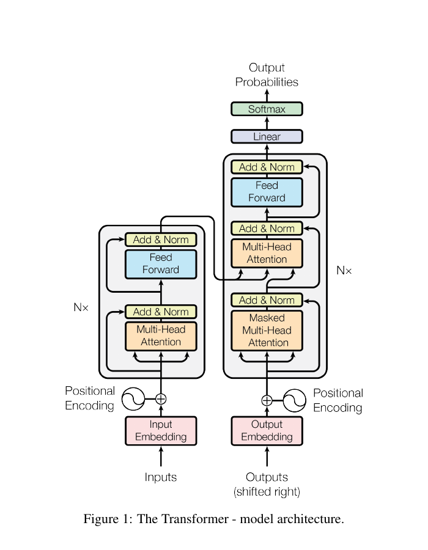
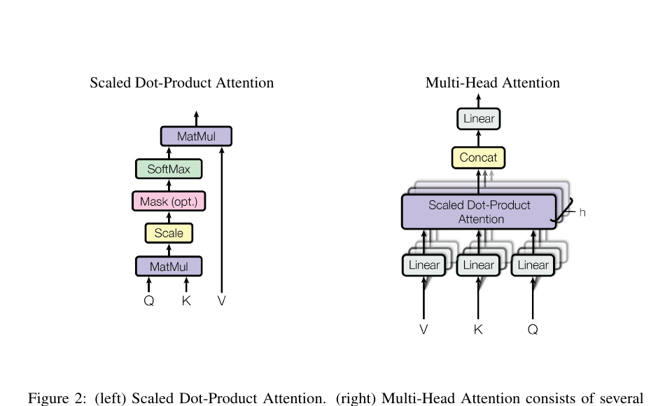
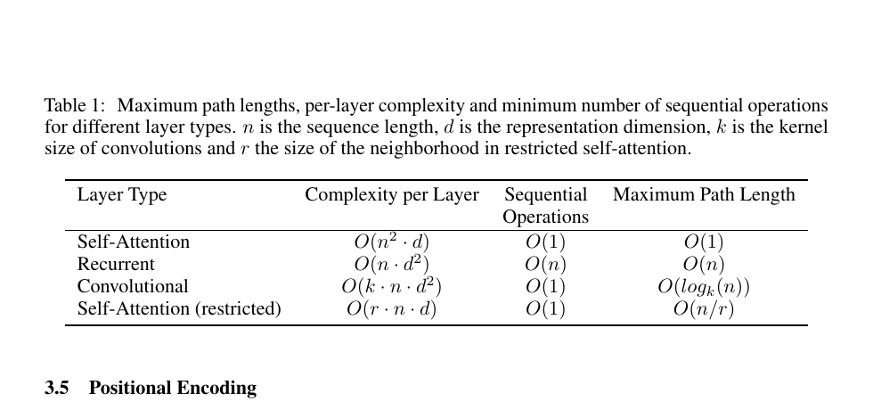
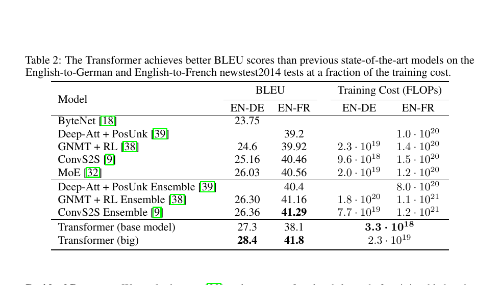
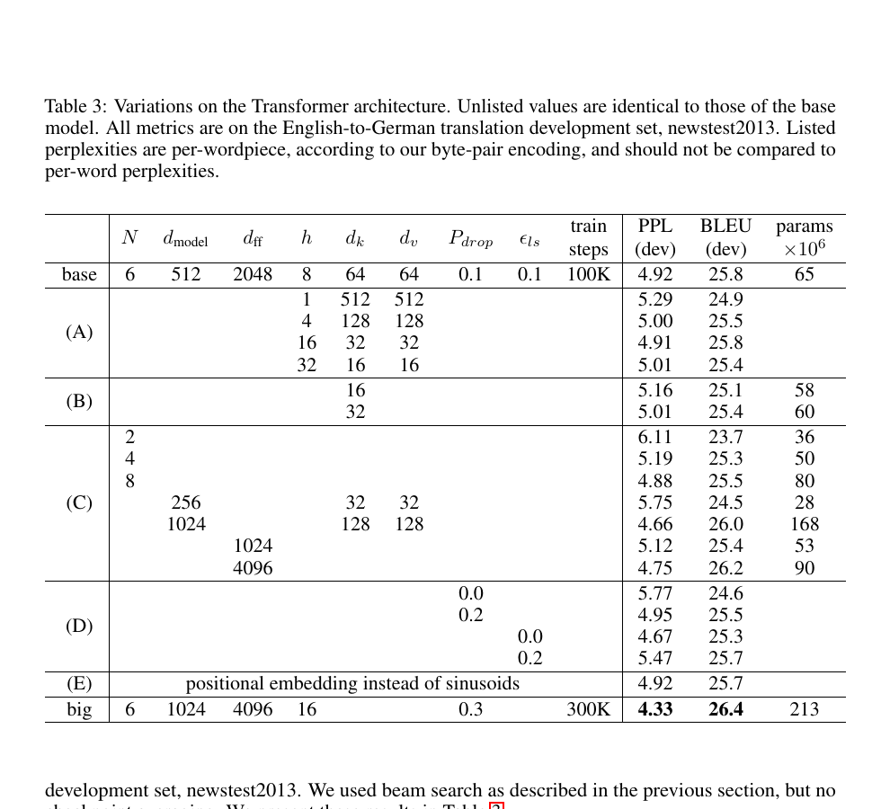
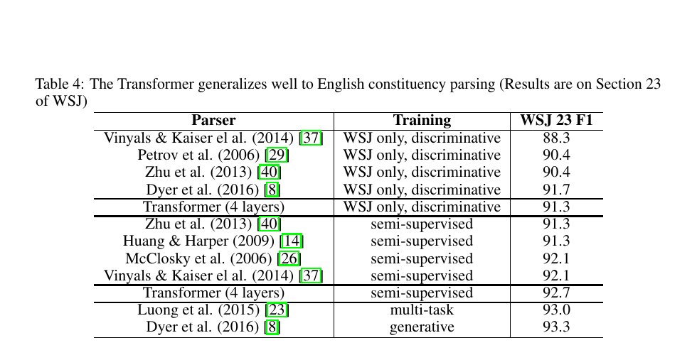
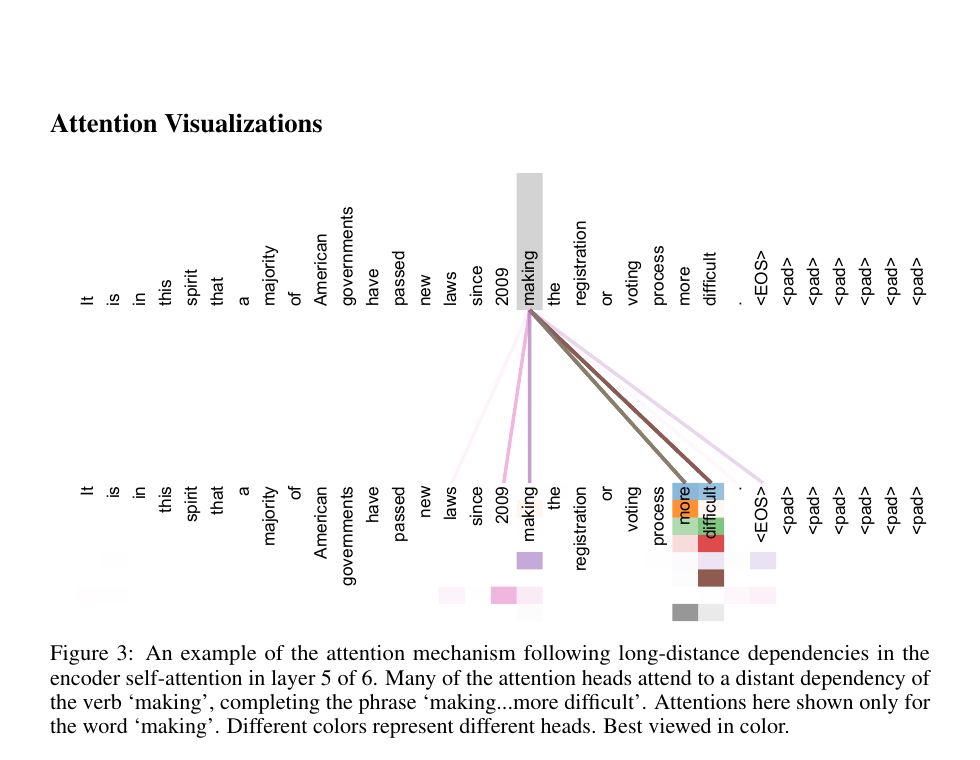
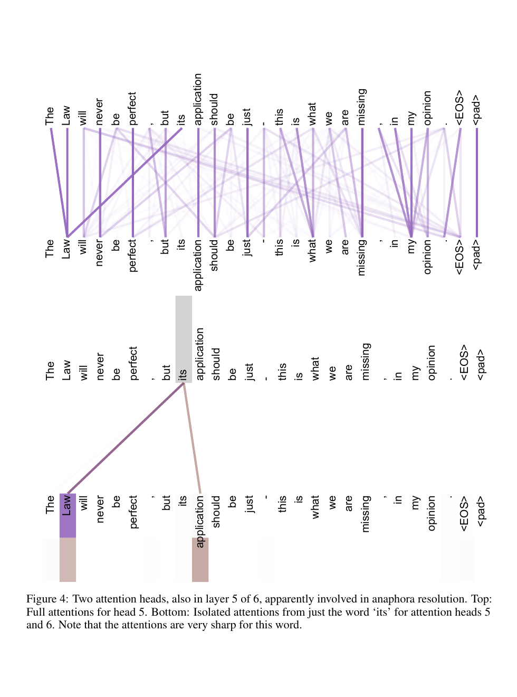
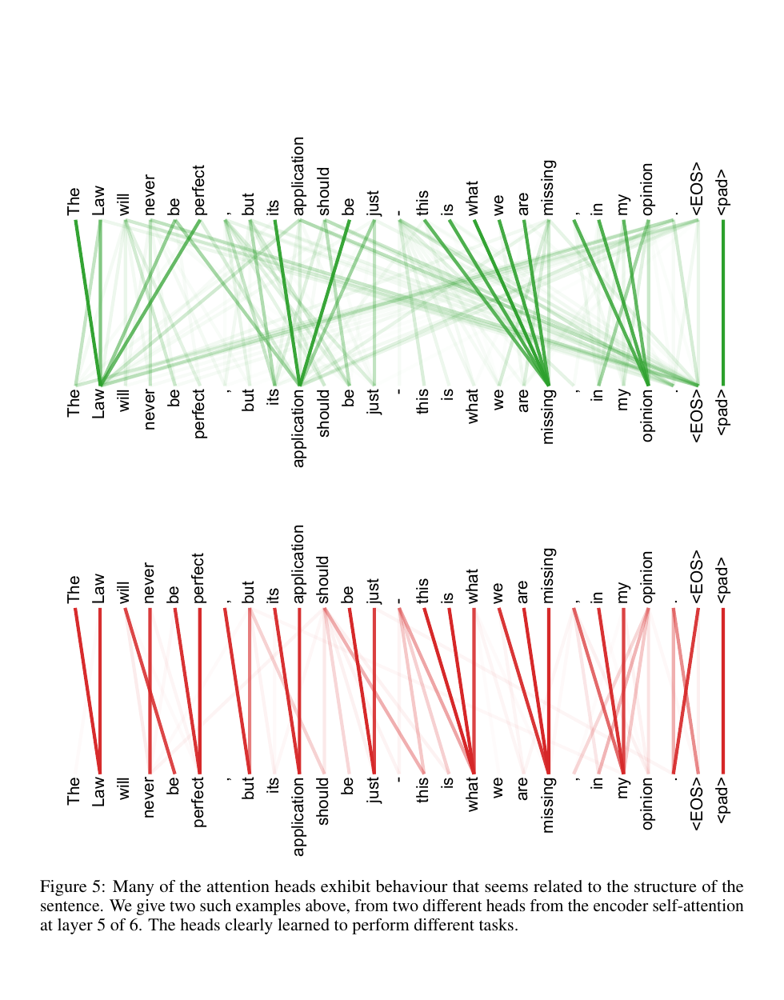

# 注意力机制就是一切

**来源：** arXiv:1706.03762v7 [cs.CL]，2023 年 8 月 2 日
**使用说明：** 在注明适当出处的前提下，Google 授予许可，仅可为新闻或学术作品使用本文中的表格和图。

**作者：** Ashish Vaswani、Noam Shazeer、Niki Parmar、Jakob Uszkoreit、Llion Jones、Aidan N. Gomez、Łukasz Kaiser、Illia Polosukhin
**机构：** Google Brain、Google Research、多伦多大学
**作者邮箱：** avaswani@google.com、noam@google.com、nikip@google.com、usz@google.com、llion@google.com、aidan@cs.toronto.edu、lukaszkaiser@google.com、illia.polusukhin@gmail.com
**会议：** 第 31 届神经信息处理系统大会（NIPS 2017），美国加利福尼亚州长滩

## 摘要

主流的序列转换模型建立在复杂的循环神经网络或卷积神经网络之上，并包含编码器和解码器。表现最好的模型还通过注意力机制连接编码器与解码器。我们提出一种新的简单网络架构 Transformer，它完全基于注意力机制，彻底摆脱循环和卷积。针对两项机器翻译任务的实验表明，这些模型在质量上优于既有方法，同时更易并行化，训练所需时间也显著更少。在 WMT 2014 英译德任务上，我们的模型取得 28.4 的 BLEU 分数，比包括集成模型在内的既有最佳结果高出 2 分以上。在 WMT 2014 英译法任务上，我们的模型在 8 块 GPU 上训练 3.5 天后取得 41.8 的单模型最新最佳 BLEU 分数，训练成本只是文献中最佳模型的一小部分。我们还通过把模型成功应用于英语成分句法分析，展示了 Transformer 对其他任务的良好泛化能力，包括在大规模和有限训练数据下的情形。

* 贡献相同，列名顺序随机。Jakob 提议用自注意力替代循环网络，并启动了评估这一想法的工作。Ashish 与 Illia 设计并实现了最初的 Transformer 模型，并深度参与了工作的每个方面。Noam 提出了缩放点积注意力、多头注意力以及无参数的位置表示，也参与了几乎所有细节。Niki 在我们的原始代码库和 tensor2tensor 中设计、实现、调试并评估了无数模型变体。Llion 也尝试了新的模型变体，负责最初的代码库、高效推理和可视化。Lukasz 和 Aidan 花费大量时间设计和实现 tensor2tensor，替换早期代码库，大幅提升结果并显著加速研究。
† 工作完成于 Google Brain 任职期间。
‡ 工作完成于 Google Research 任职期间。

## 1. 引言

循环神经网络，尤其是长短期记忆网络 [13] 和门控循环神经网络 [7]，已经成为序列建模和转换问题（例如语言建模与机器翻译 [35, 2, 5]）的先进方法。此后，大量工作持续推动循环语言模型与编码器-解码器架构的边界 [38, 24, 15]。

循环模型通常沿着输入和输出序列的符号位置分解计算。将这些位置与计算时间步对齐，它们根据前一隐藏状态 $h_{t-1}$ 和位置 $t$ 的输入生成隐藏状态序列 $h_t$。这种固有的序列性质阻碍了训练样本内部的并行化；当序列长度较长时，内存限制会限制跨样本批处理，因此这一点尤其关键。近期工作通过因式分解技巧 [21] 和条件计算 [32] 在计算效率上取得了显著改进，后者也提升了模型性能。然而，顺序计算这一根本限制仍然存在。

注意力机制已经成为许多强大序列建模与转换模型不可或缺的一部分，使模型能够不受输入或输出距离影响地建模依赖关系 [2, 19]。不过，除了少数情况 [27] 外，这类注意力机制都与循环网络结合使用。

本文提出 Transformer：一种摒弃循环、完全依赖注意力机制来建立输入与输出全局依赖关系的模型架构。Transformer 能够实现显著更多的并行化，并且在 8 块 P100 GPU 上训练短至 12 小时后，就能达到新的翻译质量最佳水平。

## 2. 背景

减少顺序计算的目标同样构成 Extended Neural GPU [16]、ByteNet [18] 和 ConvS2S [9] 的基础；这些模型都使用卷积神经网络作为基本构件，对所有输入和输出位置并行计算隐藏表示。在这些模型中，关联任意两个输入或输出位置所需的操作数随位置距离增长：ConvS2S 呈线性增长，ByteNet 呈对数增长。这使得学习远距离位置之间的依赖更加困难 [12]。Transformer 把这一数量降低为常数次操作，但代价是由于对注意力加权位置进行平均而导致有效分辨率下降；我们在第 3.2 节所述的多头注意力中抵消了这一影响。

自注意力（有时称为内部注意力）是一种关联单个序列中不同位置的注意力机制，用于计算该序列的表示。自注意力已经成功应用于多种任务，包括阅读理解、抽象式摘要、文本蕴含和学习与任务无关的句子表示 [4, 27, 28, 22]。

端到端记忆网络基于一种不同于序列对齐循环的循环注意力机制，并且已在简单语言问答和语言建模任务中表现良好 [34]。

据我们所知，Transformer 是第一个完全依赖自注意力来计算输入和输出表示、而不使用与序列对齐的循环神经网络或卷积的转换模型。下面几节将描述 Transformer，说明使用自注意力的动机，并讨论它相对于 [17, 18] 和 [9] 等模型的优势。

## 3. 模型架构

大多数具有竞争力的神经序列转换模型采用编码器-解码器结构 [5, 2, 35]。其中，编码器把符号表示组成的输入序列 $(x_1,\ldots,x_n)$ 映射为连续表示序列 $z=(z_1,\ldots,z_n)$。给定 $z$ 后，解码器逐个生成输出符号序列 $(y_1,\ldots,y_m)$。在每一步中，模型都是自回归的 [10]：生成下一个符号时，会把此前已经生成的符号作为额外输入。

**图 1：** Transformer 模型架构。

Transformer 遵循这一总体架构，对编码器和解码器都使用堆叠的自注意力层和逐位置全连接层，分别如图 1 左半部分和右半部分所示。

### 3.1. 编码器与解码器堆栈

**编码器：** 编码器由 $N=6$ 个相同层堆叠而成。每层包含两个子层。第一个是多头自注意力机制，第二个是简单的逐位置全连接前馈网络。我们在两个子层周围都采用残差连接 [11]，随后进行层归一化 [1]。也就是说，每个子层的输出为 $\operatorname{LayerNorm}(x+\operatorname{Sublayer}(x))$，其中 $\operatorname{Sublayer}(x)$ 是该子层自身实现的函数。为了实现这些残差连接，模型中的所有子层以及嵌入层都输出维度为 $d_{\mathrm{model}}=512$ 的表示。

**解码器：** 解码器同样由 $N=6$ 个相同层堆叠而成。除了每个编码器层中的两个子层之外，解码器还插入第三个子层，对编码器堆栈的输出执行多头注意力。与编码器类似，我们在每个子层周围采用残差连接，随后进行层归一化。我们还修改了解码器堆栈中的自注意力子层，以防止某个位置关注后续位置。这种屏蔽与输出嵌入向右偏移一个位置相结合，确保位置 $i$ 的预测只能依赖位置 $i$ 之前已经知道的输出。

### 3.2. 注意力

注意力函数可以描述为：把一个查询和一组键-值对映射为一个输出，其中查询、键、值和输出都是向量。输出是值的加权和，每个值所分配的权重由查询与对应键之间的兼容性函数计算得到。

**图 2：** 左：缩放点积注意力。右：多头注意力由若干并行运行的注意力层组成。

#### 3.2.1. 缩放点积注意力

我们把所采用的注意力形式称为“缩放点积注意力”（图 2）。输入包括维度为 $d_k$ 的查询和键，以及维度为 $d_v$ 的值。我们计算查询与所有键的点积，将每个点积除以 $\sqrt{d_k}$，然后应用 softmax 函数得到作用于各个值的权重。

在实际计算中，我们把一组查询同时送入注意力函数，并将其打包成矩阵 $Q$。键和值也分别打包成矩阵 $K$ 和 $V$。输出矩阵的计算方式为：

$$
\operatorname{Attention}(Q,K,V)=\operatorname{softmax}\left(\frac{QK^T}{\sqrt{d_k}}\right)V \tag{1}
$$

最常用的两种注意力函数是加性注意力 [2] 和点积（乘性）注意力。除缩放因子 $\frac{1}{\sqrt{d_k}}$ 外，点积注意力与我们的算法完全相同。加性注意力使用带一个隐藏层的前馈网络计算兼容性函数。两者在理论复杂度上相近，但点积注意力在实践中更快、空间效率更高，因为它可以使用高度优化的矩阵乘法代码实现。

当 $d_k$ 较小时，两种机制的表现相近；但对于较大的 $d_k$，不加缩放的点积注意力表现不如加性注意力 [3]。我们推测，当 $d_k$ 较大时，点积的绝对值会变大，把 softmax 函数推入梯度极小的区域⁴。为抵消这一影响，我们用 $\frac{1}{\sqrt{d_k}}$ 缩放点积。

#### 3.2.2. 多头注意力

我们没有对维度为 $d_{\mathrm{model}}$ 的键、值和查询执行一次注意力函数，而是发现：将查询、键和值分别用不同的、可学习的线性投影映射 $h$ 次，得到维度分别为 $d_k$、$d_k$ 和 $d_v$ 的表示，然后在这些投影后的查询、键和值上并行执行注意力函数，效果更好。这样会产生维度为 $d_v$ 的输出值；如图 2 所示，我们将它们拼接起来，再次进行线性投影，得到最终值。

多头注意力允许模型在不同位置、不同表示子空间中共同关注信息。若只有一个注意力头，平均操作会抑制这种能力。

$$
\operatorname{MultiHead}(Q,K,V)=\operatorname{Concat}(\operatorname{head}_1,\ldots,\operatorname{head}_h)W^O
$$ $$
\operatorname{where}\quad \operatorname{head}_i=\operatorname{Attention}(QW_i^Q,KW_i^K,VW_i^V)
$$

其中，投影矩阵为 $W_i^Q\in\mathbb{R}^{d_{\mathrm{model}}\times d_k}$、$W_i^K\in\mathbb{R}^{d_{\mathrm{model}}\times d_k}$、$W_i^V\in\mathbb{R}^{d_{\mathrm{model}}\times d_v}$，以及 $W^O\in\mathbb{R}^{hd_v\times d_{\mathrm{model}}}$。

本文使用 $h=8$ 个并行注意力层，即 8 个头。对于每个头，我们取 $d_k=d_v=d_{\mathrm{model}}/h=64$。由于每个头的维度降低，总计算成本与完整维度的单头注意力相近。

#### 3.2.3. 注意力在本文模型中的应用

Transformer 以三种不同方式使用多头注意力：

- 在“编码器-解码器注意力”层中，查询来自前一个解码器层，记忆键和值来自编码器输出。这允许解码器中的每个位置关注输入序列的所有位置，模拟了序列到序列模型（如 [38, 2, 9]）中典型的编码器-解码器注意力机制。
- 编码器包含自注意力层。在自注意力层中，所有键、值和查询来自同一位置源；这里指编码器前一层的输出。编码器中的每个位置都可以关注编码器前一层中的所有位置。
- 类似地，解码器中的自注意力层允许每个位置关注解码器中截至该位置（包括该位置）的所有位置。为了保持自回归性质，我们必须阻止信息向左流动。我们在缩放点积注意力内部实现这一点：将 softmax 输入中对应非法连接的所有值屏蔽（设为 $-\infty$）。见图 2。

### 3.3. 逐位置前馈网络

除了注意力子层外，编码器和解码器的每一层都包含一个全连接前馈网络；它会分别、相同地应用于每个位置。该网络由两个线性变换以及中间的 ReLU 激活组成：

$$
\operatorname{FFN}(x)=\max(0,xW_1+b_1)W_2+b_2 \tag{2}
$$

虽然不同位置共享相同的线性变换，但不同层使用不同的参数。另一种描述方式是：它相当于两个卷积核大小为 1 的卷积。输入和输出维度为 $d_{\mathrm{model}}=512$，内层维度为 $d_{ff}=2048$。

### 3.4. 嵌入与 softmax

与其他序列转换模型类似，我们使用可学习的嵌入，把输入和输出词元转换为维度为 $d_{\mathrm{model}}$ 的向量。我们还使用通常的可学习线性变换和 softmax 函数，把解码器输出转换为预测的下一个词元概率。与 [30] 类似，我们在两个嵌入层和 softmax 之前的线性变换之间共享同一个权重矩阵。在嵌入层中，我们把这些权重乘以 $\sqrt{d_{\mathrm{model}}}$。

### 3.5. 位置编码

由于我们的模型不包含循环和卷积，为了让模型利用序列顺序，我们必须向序列词元注入有关相对位置或绝对位置的信息。为此，我们把“位置编码”加到编码器和解码器堆栈底部的输入嵌入上。位置编码与嵌入具有相同的维度 $d_{\mathrm{model}}$，因此可以直接相加。位置编码有许多选择，包括可学习和固定形式 [9]。

本文使用不同频率的正弦和余弦函数：

$$
PE_{(pos,2i)}=\sin\left(pos/10000^{2i/d_{\mathrm{model}}}\right)
$$ $$
PE_{(pos,2i+1)}=\cos\left(pos/10000^{2i/d_{\mathrm{model}}}\right)
$$

其中 $pos$ 是位置，$i$ 是维度。也就是说，位置编码的每个维度都对应一个正弦曲线。波长构成从 $2\pi$ 到 $10000\cdot2\pi$ 的几何级数。我们选择这个函数，是因为我们猜想它能够让模型轻易地通过相对位置学习注意力：对于任意固定偏移量 $k$，$PE_{pos+k}$ 都可以表示为 $PE_{pos}$ 的线性函数。

我们还尝试了使用可学习的位置嵌入 [9]，发现两种版本产生了几乎相同的结果（见表 3 第 (E) 行）。我们选择正弦版本，是因为它可能允许模型外推到比训练期间遇到的序列更长的长度。

## 4. 为什么采用自注意力

本节比较自注意力层与通常用于把一个变长符号表示序列 $(x_1,\ldots,x_n)$ 映射到另一个等长序列 $(z_1,\ldots,z_n)$ 的循环层和卷积层的各个方面，其中 $x_i,z_i\in\mathbb{R}^d$；这种映射可以看作典型序列转换编码器或解码器中的隐藏层。为了说明采用自注意力的动机，我们考虑三个目标。

第一个目标是每层的总计算复杂度。第二个目标是可并行化的计算量，用所需的最少顺序操作数衡量。

第三个目标是网络中远距离依赖之间的路径长度。学习远距离依赖是许多序列转换任务的关键挑战。影响学习这类依赖能力的一个关键因素，是前向和反向信号必须在网络中穿过的路径长度。输入序列和输出序列的任意位置组合之间路径越短，就越容易学习远距离依赖 [12]。因此，我们还比较了由不同层类型组成的网络中，任意两个输入和输出位置之间的最大路径长度。

**表 1：** 不同层类型的最大路径长度、每层复杂度和最少顺序操作数。$n$ 是序列长度，$d$ 是表示维度，$k$ 是卷积核大小，$r$ 是受限自注意力中的邻域大小。

如表 1 所示，自注意力层以固定数量的顺序执行操作连接所有位置，而循环层需要 $O(n)$ 次顺序操作。在计算复杂度方面，当序列长度 $n$ 小于表示维度 $d$ 时，自注意力层比循环层更快；在机器翻译最先进模型所使用的句子表示中通常如此，例如词片段 [38] 和字节对 [31] 表示。

为了提升超长序列任务的计算性能，可以把自注意力限制为仅考虑输入序列中以相应输出位置为中心、大小为 $r$ 的邻域。这会把最大路径长度提高到 $O(n/r)$。我们计划在未来工作中进一步研究这一方法。

当卷积核宽度 $k\lt n$ 时，单个卷积层不会连接所有输入和输出位置。对于连续卷积核，需要堆叠 $O(n/k)$ 个卷积层；对于扩张卷积 [18]，则需要 $O(\log_k(n))$ 层，因而会增加网络中任意两个位置之间最长路径的长度。卷积层通常比循环层更昂贵，成本高出 $k$ 倍。不过，可分离卷积 [6] 能显著降低复杂度，使其变为 $O(k\cdot n\cdot d+n\cdot d^2)$。即便 $k=n$，可分离卷积的复杂度也等于一个自注意力层加一个逐位置前馈层的组合，而这正是我们模型所采用的方法。

作为一个附带好处，自注意力可能产生更容易解释的模型。我们检查了模型的注意力分布，并在附录中给出和讨论了一些示例。不仅不同注意力头显然学会执行不同任务，其中许多还表现出与句子的句法和语义结构相关的行为。

## 5. 训练

本节描述模型的训练方案。

### 5.1. 训练数据与批处理

我们在标准 WMT 2014 英德数据集上训练，该数据集包含约 450 万个句子对。句子使用字节对编码 [3] 进行编码，共享的源语言-目标语言词汇表约含 37000 个词元。对于英法任务，我们使用规模大得多的 WMT 2014 英法数据集，该数据集包含 3600 万个句子，并将词元划分到 32000 个词片段词汇表中 [38]。句子对按照近似序列长度组成批次。每个训练批次包含一组句子对，约含 25000 个源语言词元和 25000 个目标语言词元。

### 5.2. 硬件与训练计划

我们在一台配备 8 块 NVIDIA P100 GPU 的机器上训练模型。对于使用全文所述超参数的基础模型，每个训练步约耗时 0.4 秒。基础模型总共训练 100000 步，即 12 小时。对于大模型（见表 3 最后一行），每步耗时 1.0 秒。大模型训练 300000 步，即 3.5 天。

### 5.3. 优化器

我们使用 Adam 优化器 [20]，其中 $\beta_1=0.9$、$\beta_2=0.98$、$\epsilon=10^{-9}$。训练过程中，我们按照下式改变学习率：

$$
\operatorname{lrate}=d_{\mathrm{model}}^{-0.5}\cdot\min\left(\operatorname{step\_num}^{-0.5},\ \operatorname{step\_num}\cdot\operatorname{warmup\_steps}^{-1.5}\right) \tag{3}
$$

这对应于：在最初的 $\operatorname{warmup\_steps}$ 个训练步中线性增加学习率，此后按训练步数的平方根倒数成比例地降低学习率。我们使用 $\operatorname{warmup\_steps}=4000$。

### 5.4. 正则化

训练期间我们采用三种正则化方法。

**表 2：** Transformer 在英译德和英译法 newstest2014 测试集上的 BLEU 分数优于此前的先进模型，而训练成本只占一小部分。

**残差 dropout：** 我们在每个子层的输出上应用 dropout [33]，然后将其加到子层输入并进行归一化。此外，在编码器和解码器堆栈中，我们还对嵌入与位置编码之和应用 dropout。对于基础模型，我们使用 $P_{drop}=0.1$ 的比例。

**标签平滑：** 训练期间，我们使用取值为 $\epsilon_{ls}=0.1$ 的标签平滑 [36]。这会损害困惑度，因为模型学会变得更加不确定，但会提高准确率和 BLEU 分数。

## 6. 结果

### 6.1. 机器翻译

在 WMT 2014 英译德任务上，大 Transformer 模型（表 2 中的 Transformer (big)）比此前报告的最佳模型（包括集成模型）高出 2.0 以上 BLEU，取得 28.4 的最新最佳 BLEU 分数。该模型的配置列在表 3 最后一行。训练在 8 块 P100 GPU 上耗时 3.5 天。即使是我们的基础模型，也超过此前发布的所有模型和集成模型，而训练成本只是任何有竞争力模型的一小部分。

在 WMT 2014 英译法任务上，我们的大模型取得 41.0 的 BLEU 分数，超过此前发布的所有单模型，而训练成本不到此前先进模型的四分之一。用于英译法的大 Transformer 模型使用 $P_{drop}=0.1$ 的 dropout 比例，而不是 0.3。

对于基础模型，我们使用单个模型：对最后 5 个检查点取平均得到这些模型，这些检查点以 10 分钟为间隔写入。对于大模型，我们对最后 20 个检查点取平均。我们使用束搜索，束大小为 4，长度惩罚 $\alpha=0.6$ [38]。这些超参数是在开发集上经过实验后选定的。推理时我们把最大输出长度设置为输入长度加 50，但在可能时提前终止 [38]。

表 2 总结了我们的结果，并将翻译质量和训练成本与文献中的其他模型架构进行比较。我们通过训练时间、使用的 GPU 数量以及每块 GPU 持续单精度浮点容量的估计值相乘，估算训练模型所使用的浮点操作次数⁵。

### 6.2. 模型变体

为了评估 Transformer 不同组件的重要性，我们以不同方式改变基础模型，并测量其在英译德任务开发集 newstest2013 上的性能变化。我们按照上一节所述使用束搜索，但不进行检查点平均。结果列于表 3。

**表 3：** Transformer 架构的变体。未列出的值与基础模型相同。所有指标都在英译德开发集 newstest2013 上取得。列出的困惑度按照字节对编码以每个词片段计算，不应与按每个单词计算的困惑度进行比较。

在表 3 的 (A) 行中，我们改变注意力头的数量以及注意力键和值的维度，同时保持计算量不变，如第 3.2.2 节所述。单头注意力比最佳设置低 0.9 BLEU；注意力头过多时，质量也会下降。

在表 3 的 (B) 行中，我们观察到减小注意力键的大小 $d_k$ 会损害模型质量。这表明确定兼容性并不容易，点积之外更复杂的兼容性函数可能有益。在 (C) 和 (D) 行中，我们还观察到，正如预期，更大的模型表现更好，而 dropout 对避免过拟合非常有帮助。在 (E) 行中，我们用可学习的位置嵌入 [9] 替换正弦位置编码，观察到与基础模型几乎相同的结果。

### 6.3. 英语成分句法分析

为了评估 Transformer 能否泛化到其他任务，我们进行了英语成分句法分析实验。这项任务带来一些特殊挑战：输出受到强结构约束，并且明显长于输入。此外，在小数据场景下，循环神经网络序列到序列模型一直无法达到先进结果 [37]。

我们在宾州树库 [25] 的《华尔街日报》（WSJ）部分训练了一个 4 层 Transformer，$d_{\mathrm{model}}=1024$，约有 40000 个训练句子。我们还在半监督设置下训练它，使用更大的高置信度语料库和 BerkeleyParser 语料库，共约 1700 万个句子 [37]。在仅使用 WSJ 的设置中，我们使用 16000 个词元的词汇表；在半监督设置中使用 32000 个词元的词汇表。

我们只在第 22 节开发集上做了少量实验，用于选择 dropout（包括注意力 dropout 和残差 dropout，第 5.4 节）、学习率和束大小；其他所有参数都保持与英译德基础翻译模型相同。推理期间，我们把最大输出长度增加为输入长度加 300。对于仅 WSJ 和半监督两种设置，我们都使用束大小 21 和 $\alpha=0.3$。

**表 4：** Transformer 能够良好地泛化到英语成分句法分析（结果来自 WSJ 第 23 节）。

表 4 的结果表明，尽管没有针对任务进行专门调优，我们的模型仍然表现出乎意料地好；除循环神经网络语法 [8] 外，它取得了比此前报告的所有模型更好的结果。

与循环神经网络序列到序列模型 [37] 相比，即使只在包含 40000 个句子的 WSJ 训练集上训练，Transformer 也超过了 BerkeleyParser [29]。

## 7. 结论

本文提出 Transformer，这是第一个完全基于注意力的序列转换模型，用多头自注意力替代编码器-解码器架构中最常使用的循环层。

对于翻译任务，Transformer 的训练速度显著快于基于循环层或卷积层的架构。在 WMT 2014 英译德和 WMT 2014 英译法两个翻译任务上，我们都取得了新的先进结果。在前一个任务上，我们的最佳模型甚至超过了此前报告的所有集成模型。

我们对基于注意力的模型前景感到振奋，并计划把它们应用到其他任务。我们计划将 Transformer 扩展到文本以外的输入和输出模态，并研究局部、受限的注意力机制，以高效处理图像、音频和视频等大型输入与输出。让生成过程变得更少依赖顺序，是我们的另一个研究目标。

用于训练和评估模型的代码可在 https://github.com/tensorflow/tensor2tensor 获取。

**致谢：** 感谢 Nal Kalchbrenner 和 Stephan Gouws 提供富有成效的评论、修正与启发。

## 参考文献

[1] Jimmy Lei Ba、Jamie Ryan Kiros、Geoffrey E Hinton。层归一化。arXiv 预印本 arXiv:1607.06450，2016。

[2] Dzmitry Bahdanau、Kyunghyun Cho、Yoshua Bengio。通过联合学习对齐与翻译实现神经机器翻译。CoRR，abs/1409.0473，2014。

[3] Denny Britz、Anna Goldie、Minh-Thang Luong、Quoc V. Le。神经机器翻译架构的大规模探索。CoRR，abs/1703.03906，2017。

[4] Jianpeng Cheng、Li Dong、Mirella Lapata。用于机器阅读的长短期记忆网络。arXiv 预印本 arXiv:1601.06733，2016。

[5] Kyunghyun Cho、Bart van Merrienboer、Caglar Gulcehre、Fethi Bougares、Holger Schwenk、Yoshua Bengio。使用循环神经网络编码器-解码器学习短语表示以进行统计机器翻译。CoRR，abs/1406.1078，2014。

[6] Francois Chollet。Xception：使用深度可分离卷积进行深度学习。arXiv 预印本 arXiv:1610.02357，2016。

[7] Junyoung Chung、Çaglar Gülçehre、Kyunghyun Cho、Yoshua Bengio。门控循环神经网络在序列建模中的实证评估。CoRR，abs/1412.3555，2014。

[8] Chris Dyer、Adhiguna Kuncoro、Miguel Ballesteros、Noah A. Smith。循环神经网络语法。载于 NAACL 会议论文集，2016。

[9] Jonas Gehring、Michael Auli、David Grangier、Denis Yarats、Yann N. Dauphin。卷积序列到序列学习。arXiv 预印本 arXiv:1705.03122v2，2017。

[10] Alex Graves。使用循环神经网络生成序列。arXiv 预印本 arXiv:1308.0850，2013。

[11] Kaiming He、Xiangyu Zhang、Shaoqing Ren、Jian Sun。用于图像识别的深度残差学习。IEEE 计算机视觉与模式识别会议论文集，第 770–778 页，2016。

[12] Sepp Hochreiter、Yoshua Bengio、Paolo Frasconi、Jürgen Schmidhuber。循环网络中的梯度流：学习长期依赖的困难，2001。

[13] Sepp Hochreiter、Jürgen Schmidhuber。长短期记忆。Neural Computation，9(8)：1735–1780，1997。

[14] Zhongqiang Huang、Mary Harper。跨语言使用潜在标注进行 PCFG 语法自训练。载于 2009 年自然语言处理经验方法会议论文集，第 832–841 页。ACL，2009 年 8 月。

[15] Rafal Jozefowicz、Oriol Vinyals、Mike Schuster、Noam Shazeer、Yonghui Wu。探索语言建模的极限。arXiv 预印本 arXiv:1602.02410，2016。

[16] Łukasz Kaiser、Samy Bengio。主动记忆能否替代注意力？载于神经信息处理系统进展（NIPS），2016。

[17] Łukasz Kaiser、Ilya Sutskever。神经 GPU 学习算法。国际学习表示会议（ICLR），2016。

[18] Nal Kalchbrenner、Lasse Espeholt、Karen Simonyan、Aaron van den Oord、Alex Graves、Koray Kavukcuoglu。线性时间神经机器翻译。arXiv 预印本 arXiv:1610.10099v2，2017。

[19] Yoon Kim、Carl Denton、Luong Hoang、Alexander M. Rush。结构化注意力网络。国际学习表示会议，2017。

[20] Diederik Kingma、Jimmy Ba。Adam：一种随机优化方法。ICLR，2015。

[21] Oleksii Kuchaiev、Boris Ginsburg。LSTM 网络的因式分解技巧。arXiv 预印本 arXiv:1703.10722，2017。

[22] Zhouhan Lin、Minwei Feng、Cicero Nogueira dos Santos、Mo Yu、Bing Xiang、Bowen Zhou、Yoshua Bengio。结构化自注意力句子嵌入。arXiv 预印本 arXiv:1703.03130，2017。

[23] Minh-Thang Luong、Quoc V. Le、Ilya Sutskever、Oriol Vinyals、Lukasz Kaiser。多任务序列到序列学习。arXiv 预印本 arXiv:1511.06114，2015。

[24] Minh-Thang Luong、Hieu Pham、Christopher D Manning。基于注意力的神经机器翻译的有效方法。arXiv 预印本 arXiv:1508.04025，2015。

[25] Mitchell P Marcus、Mary Ann Marcinkiewicz、Beatrice Santorini。构建大型英语标注语料库：宾州树库。Computational Linguistics，19(2)：313–330，1993。

[26] David McClosky、Eugene Charniak、Mark Johnson。有效的句法分析自训练。载于 NAACL 人类语言技术会议主会论文集，第 152–159 页。ACL，2006 年 6 月。

[27] Ankur Parikh、Oscar Täckström、Dipanjan Das、Jakob Uszkoreit。可分解注意力模型。载于自然语言处理经验方法会议，2016。

[28] Romain Paulus、Caiming Xiong、Richard Socher。用于抽象式摘要的深度强化模型。arXiv 预印本 arXiv:1705.04304，2017。

[29] Slav Petrov、Leon Barrett、Romain Thibaux、Dan Klein。学习准确、紧凑且可解释的树标注。载于第 21 届计算语言学国际会议暨 ACL 第 44 届年会论文集，第 433–440 页。ACL，2006 年 7 月。

[30] Ofir Press、Lior Wolf。使用输出嵌入改进语言模型。arXiv 预印本 arXiv:1608.05859，2016。

[31] Rico Sennrich、Barry Haddow、Alexandra Birch。使用子词单元进行罕见词神经机器翻译。arXiv 预印本 arXiv:1508.07909，2015。

[32] Noam Shazeer、Azalia Mirhoseini、Krzysztof Maziarz、Andy Davis、Quoc Le、Geoffrey Hinton、Jeff Dean。极其庞大的神经网络：稀疏门控专家混合层。arXiv 预印本 arXiv:1701.06538，2017。

[33] Nitish Srivastava、Geoffrey E Hinton、Alex Krizhevsky、Ilya Sutskever、Ruslan Salakhutdinov。Dropout：一种防止神经网络过拟合的简单方法。Journal of Machine Learning Research，15(1)：1929–1958，2014。

[34] Sainbayar Sukhbaatar、Arthur Szlam、Jason Weston、Rob Fergus。端到端记忆网络。载于 C. Cortes、N. D. Lawrence、D. D. Lee、D. Sugiyama、R. Garnett 编，《神经信息处理系统进展 28》，第 2440–2448 页。Curran Associates，2015。

[35] Ilya Sutskever、Oriol Vinyals、Quoc VV Le。使用神经网络进行序列到序列学习。载于神经信息处理系统进展，第 3104–3112 页，2014。

[36] Christian Szegedy、Vincent Vanhoucke、Sergey Ioffe、Jonathon Shlens、Zbigniew Wojna。重新思考用于计算机视觉的 Inception 架构。CoRR，abs/1512.00567，2015。

[37] Vinyals、Kaiser、Koo、Petrov、Sutskever、Hinton。把语法当作外语。载于神经信息处理系统进展，2015。

[38] Yonghui Wu、Mike Schuster、Zhifeng Chen、Quoc V. Le、Mohammad Norouzi、Wolfgang Macherey、Maxim Krikun、Yuan Cao、Qin Gao、Klaus Macherey 等。Google 神经机器翻译系统：弥合人类与机器翻译之间的鸿沟。arXiv 预印本 arXiv:1609.08144，2016。

[39] Jie Zhou、Ying Cao、Xuguang Wang、Peng Li、Wei Xu。带快速前向连接的深度循环模型用于神经机器翻译。CoRR，abs/1606.04199，2016。

[40] Muhua Zhu、Yue Zhang、Wenliang Chen、Min Zhang、Jingbo Zhu。快速准确的移位-归约成分句法分析。载于 ACL 第 51 届年会论文集（第 1 卷：长篇论文），第 434–443 页。ACL，2013 年 8 月。

## 附录：注意力可视化

### 图 3：编码器自注意力中的长距离依赖

**图 3：** 编码器第 5 层（共 6 层）中，注意力机制跟踪长距离依赖的一个示例。许多注意力头会关注动词 “making” 的远距离依赖，从而补全 “making...more difficult” 这一短语。这里仅显示针对单词 “making” 的注意力。不同颜色表示不同的注意力头。彩色查看效果最佳。

### 图 4：指代消解

**图 4：** 两个同样位于第 5 层（共 6 层）的注意力头，似乎参与了指代消解。上：注意力头 5 的完整注意力。下：从单词 “its” 出发、分别对应注意力头 5 和 6 的孤立注意力。注意，对于这个词，注意力非常尖锐。

### 图 5：与句子结构相关的注意力

**图 5：** 许多注意力头表现出似乎与句子结构相关的行为。上面给出了两个示例，来自编码器自注意力第 5 层（共 6 层）的两个不同注意力头。这些注意力头显然学会了执行不同的任务。

⁴ 为说明点积为何会变大，假设 $q$ 和 $k$ 的分量是相互独立的随机变量，均值为 0、方差为 1。那么它们的点积 $q\cdot k=\sum_{i=1}^{d_k}q_i k_i$ 的均值为 0，方差为 $d_k$。
⁵ 我们对 K80、K40、M40 和 P100 分别使用 2.8、3.7、6.0 和 9.5 TFLOPS 的数值。
