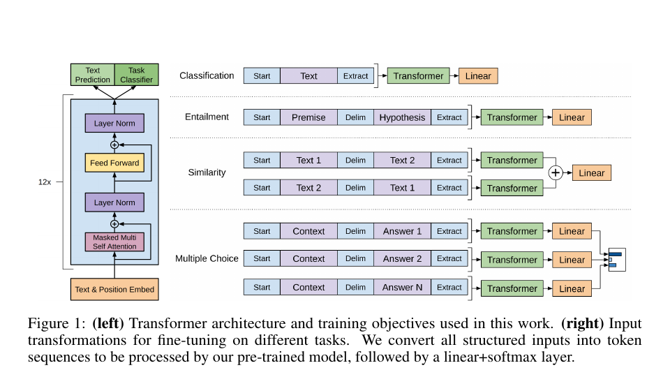
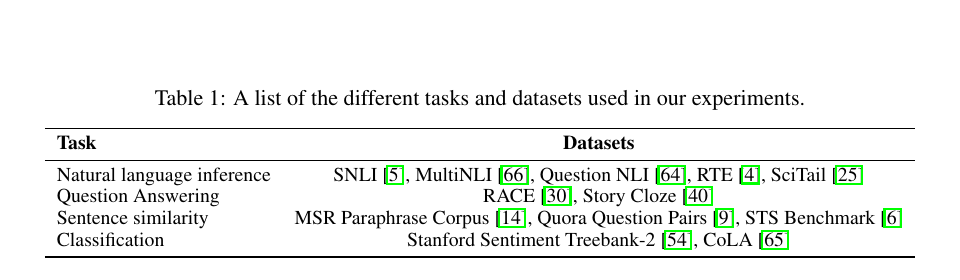
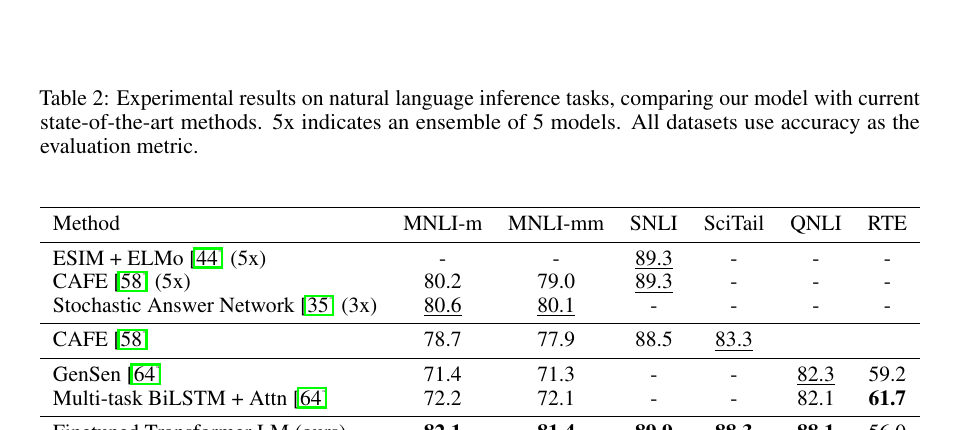
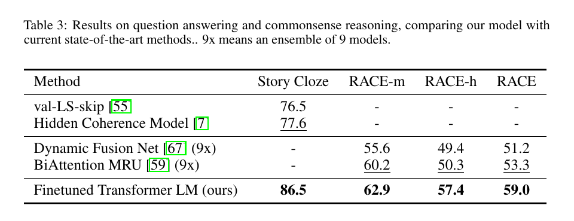
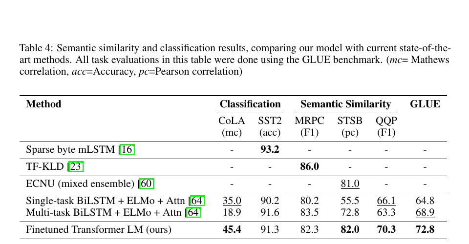
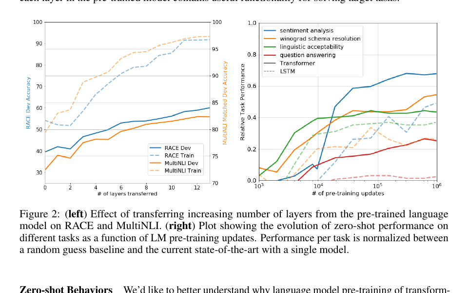
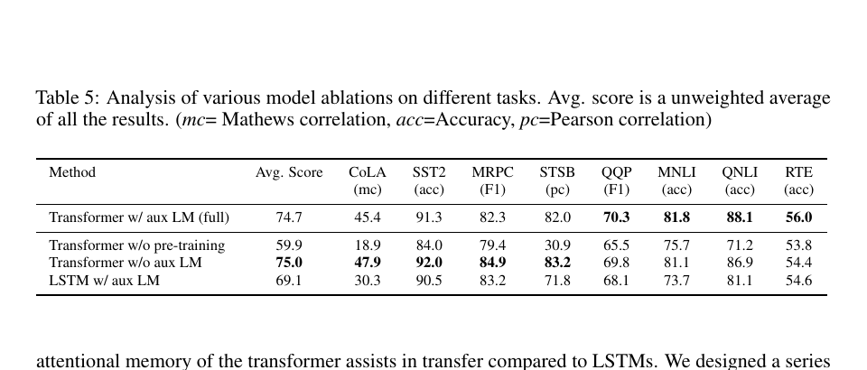

# 通过生成式预训练改进语言理解

**作者：** Alec Radford、Karthik Narasimhan、Tim Salimans、Ilya Sutskever
**机构：** OpenAI
**作者邮箱：** alec@openai.com、karthikn@openai.com、tim@openai.com、ilyasu@openai.com
**版本说明：** 预印本，工作仍在进行中

## 摘要

自然语言理解包含众多不同任务，例如文本蕴含、问答、语义相似性评估和文档分类。虽然大规模无标注文本语料非常丰富，但用于学习这些特定任务的标注数据十分稀缺，因此以判别方式训练的模型很难获得足够好的表现。我们证明，先在多样化无标注文本语料上对语言模型进行生成式预训练，再针对每项具体任务进行判别式微调，可以在这些任务上取得大幅提升。与以往方法不同，我们在微调期间采用任务感知的输入变换，在只需对模型架构进行极少改动的情况下实现有效迁移。我们在广泛的自然语言理解基准上证明了这一方法的有效性。这个通用、与任务无关的模型超过了针对各任务专门设计架构的判别式模型，在研究的 12 项任务中有 9 项显著刷新了先进水平。例如，我们在常识推理（故事完形测试）上取得 8.9% 的绝对提升，在问答（RACE）上取得 5.7% 的绝对提升，在文本蕴含（MultiNLI）上取得 1.5% 的绝对提升。

## 1. 引言

从原始文本中有效学习的能力，是减少自然语言处理（NLP）对监督学习依赖的关键。大多数深度学习方法需要大量人工标注数据，这限制了它们在缺乏标注资源的许多领域中的适用性 [61]。在这些情况下，能够利用无标注数据中语言信息的模型，为收集更多标注提供了有价值的替代方案；收集标注既耗时又昂贵。此外，即使已有相当多的监督数据，以无监督方式学习良好表示仍能显著提升性能。迄今最有力的证据，是预训练词嵌入 [10, 39, 42] 被广泛用于改进多种 NLP 任务的表现 [8, 11, 26, 45]。

然而，要从无标注文本中利用超越词级别的信息，主要面临两个挑战。第一，哪种优化目标最适合学习可用于迁移的文本表示尚不明确。近期研究考察了语言建模 [44]、机器翻译 [38] 和篇章连贯性 [22] 等多种目标，而每种方法都在不同任务上超过其他方法。¹ 第二，如何最有效地把这些学到的表示迁移到目标任务，目前尚无共识。现有技术通常组合使用针对任务修改模型架构 [43, 44]、复杂的学习方案 [21] 以及添加辅助学习目标 [50]。这些不确定性使得开发有效的语言处理半监督学习方法变得困难。

本文探索一种用于语言理解任务的半监督方法，将无监督预训练与监督微调结合起来。我们的目标是学习一种通用表示，使其只需少量适配就能迁移到广泛任务。我们假设可以获得一个大型无标注文本语料库，以及若干包含人工标注训练样本的数据集（目标任务）。我们的设定不要求这些目标任务与无标注语料处于同一领域。训练过程分为两个阶段。首先，我们在无标注数据上使用语言建模目标来学习神经网络模型的初始参数；随后，利用相应的监督目标把这些参数适配到目标任务。

模型架构采用 Transformer [62]；它已经在机器翻译 [62]、文档生成 [34] 和句法分析 [29] 等多种任务上表现强劲。与循环网络等替代方案相比，这一选择为处理文本中的长期依赖提供了更加结构化的记忆，从而在多样化任务上带来稳健的迁移性能。在迁移期间，我们使用源于遍历式方法 [52] 的任务特定输入适配，将结构化文本输入处理成一个连续词元序列。实验表明，这些适配使我们只需对预训练模型架构进行极少改动，就能有效地完成微调。

我们在四类语言理解任务上评估这一方法：自然语言推理、问答、语义相似性和文本分类。这个通用、与任务无关的模型超过了针对各任务专门设计架构的判别式模型，在所研究的 12 项任务中有 9 项显著刷新了先进水平。例如，我们在常识推理（故事完形测试）[40] 上取得 8.9% 的绝对提升，在问答（RACE）[30] 上取得 5.7% 的提升，在文本蕴含（MultiNLI）[66] 上取得 1.5% 的提升，在新近提出的 GLUE 多任务基准 [64] 上取得 5.5% 的提升。我们还在四种不同设置下分析了预训练模型的零样本行为，并证明它获得了对下游任务有用的语言知识。

> ¹ https://gluebenchmark.com/leaderboard

## 2. 相关工作

### 2.1. 自然语言处理中的半监督学习

广义上，本文工作属于自然语言半监督学习范畴。这个范式引起了广泛兴趣，并被应用于序列标注 [24, 33, 57] 和文本分类 [41, 70] 等任务。最早的方法使用无标注数据计算词级或短语级统计量，再把这些统计量作为监督模型的特征 [33]。过去几年，研究人员证明，在无标注语料上训练词嵌入 [11, 39, 42]，可以改进多种任务的表现 [8, 11, 26, 45]。不过，这些方法主要迁移词级信息，而我们的目标是捕捉更高层语义。

近期方法开始研究如何从无标注数据中学习和利用超越词级别的语义。使用无标注语料训练的短语级或句子级嵌入，已经被用于把文本编码为适合各种目标任务的向量表示 [28, 32, 1, 36, 22, 12, 56, 31]。

### 2.2. 无监督预训练

无监督预训练是半监督学习的一种特殊情况，其目标是找到良好的初始化点，而不是修改监督学习目标。早期工作在图像分类 [20, 49, 63] 和回归任务 [3] 中探索了这项技术。后续研究 [15] 证明，预训练发挥了正则化方案的作用，使深度神经网络能够获得更好的泛化。近期工作把这种方法用于帮助训练图像分类 [69]、语音识别 [68]、实体消歧 [17] 和机器翻译 [48] 等任务上的深度神经网络。

与本文最接近的一类工作，是使用语言建模目标预训练神经网络，再以监督方式在目标任务上微调。Dai 等人 [13] 以及 Howard 和 Ruder [21] 使用这种方法改进文本分类。然而，尽管预训练阶段有助于捕捉一些语言信息，他们所使用的 LSTM 模型仍将预测能力限制在较短范围。相比之下，我们选择 Transformer 网络，能够捕捉更长距离的语言结构，实验也证明了这一点。此外，我们还证明模型在更广泛任务上的有效性，包括自然语言推理、释义检测和故事补全。其他方法 [43, 44, 38] 在目标任务上训练监督模型时，把预训练语言模型或机器翻译模型的隐藏表示作为辅助特征。这样会为每个独立目标任务引入大量新参数，而我们在迁移时只需对模型架构进行极少改动。

### 2.3. 辅助训练目标

添加辅助无监督训练目标，是半监督学习的另一种形式。Collobert 和 Weston [10] 的早期工作使用词性标注、组块分析、命名实体识别和语言建模等多种辅助 NLP 任务改进语义角色标注。最近，Rei [50] 在目标任务目标中加入辅助语言建模目标，并证明这能提升序列标注任务的性能。我们的实验也使用辅助目标，但正如后文所示，无监督预训练本身已经学习到与目标任务相关的若干语言层面能力。

## 3. 框架

训练过程包含两个阶段。第一阶段在大型文本语料库上学习高容量语言模型；随后进入微调阶段，使用有标注数据把模型适配到判别式任务。

### 3.1. 无监督预训练

给定由词元组成的无监督语料库 $\mathcal{U}=\{u_1,\ldots,u_n\}$，我们使用标准语言建模目标最大化下列似然：

$$
L_1(\mathcal{U})=\sum_i\log P(u_i\mid u_{i-k},\ldots,u_{i-1};\Theta) \tag{1}
$$

其中 $k$ 是上下文窗口大小，条件概率 $P$ 由参数为 $\Theta$ 的神经网络建模。这些参数使用随机梯度下降 [51] 训练。

在实验中，我们使用多层 Transformer 解码器 [34] 作为语言模型，它是 Transformer [62] 的一个变体。该模型在输入上下文词元上执行多头自注意力操作，随后使用逐位置前馈层，产生目标词元上的输出分布：

$$
\begin{aligned}
h_0 &= UW_e+W_p,\\
h_l &= \operatorname{transformer\_block}(h_{l-1}) \quad \forall l\in[1,n],\\
P(u) &= \operatorname{softmax}(h_nW_e^T).
\end{aligned} \tag{2}
$$

其中 $U=(u_{-k},\ldots,u_{-1})$ 是词元上下文向量，$n$ 是层数，$W_e$ 是词元嵌入矩阵，$W_p$ 是位置嵌入矩阵。

### 3.2. 监督微调

使用公式 1 的目标训练模型后，我们把参数适配到监督目标任务。假设有标注数据集 $\mathcal{C}$，其中每个样本包含输入词元序列 $x_1,\ldots,x_m$ 以及标签 $y$。输入通过预训练模型，得到最后一个 Transformer 块的激活 $h_l^m$；随后把它送入新增的线性输出层，以参数 $W_y$ 预测 $y$：

$$
P(y\mid x_1,\ldots,x_m)=\operatorname{softmax}(h_l^mW_y). \tag{3}
$$

于是需要最大化的目标为：

$$
L_2(\mathcal{C})=\sum_{(x,y)}\log P(y\mid x_1,\ldots,x_m). \tag{4}
$$

我们还发现，在微调时加入语言建模辅助目标有助于学习，原因包括：（a）改进监督模型的泛化；（b）加快收敛。这与先前工作 [50, 43] 一致，它们也观察到辅助目标带来的性能提升。具体而言，我们优化下列带权重 $\lambda$ 的目标：

$$
L_3(\mathcal{C})=L_2(\mathcal{C})+\lambda\cdot L_1(\mathcal{C}). \tag{5}
$$

总体而言，微调期间唯一需要的额外参数是 $W_y$ 和分隔词元的嵌入（见第 3.3 节）。

**图 1：** 左：本文使用的 Transformer 架构与训练目标。右：针对不同任务进行微调时的输入变换。我们把所有结构化输入转换为词元序列，交给预训练模型处理，随后接入线性层与 softmax 层。

### 3.3. 任务特定的输入变换

对于文本分类等任务，可以直接按照前述方式微调模型。另一些任务，例如问答或文本蕴含，具有结构化输入，如有序句子对，或文档、问题和答案构成的三元组。由于预训练模型是在连续文本序列上训练的，要把它应用到这些任务还需要进行一些修改。此前工作提出在迁移表示上方学习任务特定架构 [44]，但这种方法重新引入了大量任务特定定制，而且没有对这些新增架构组件使用迁移学习。我们改用遍历式方法 [52]，把结构化输入转换为预训练模型可以处理的有序序列。这些输入变换使我们避免为不同任务大幅修改架构。下面简要说明这些变换，图 1 给出直观示意。所有变换都会加入随机初始化的起始词元与结束词元（$\langle s\rangle$、$\langle e\rangle$）。

#### 3.3.1. 文本蕴含

对于蕴含任务，我们拼接前提 $p$ 和假设 $h$ 的词元序列，并在两者之间加入分隔词元（$\$$）。

#### 3.3.2. 相似性

对于相似性任务，被比较的两个句子不存在固有顺序。为体现这一点，我们修改输入序列，使其包含两种可能的句子顺序（中间加入分隔符），并分别处理每种顺序，得到两个序列表示 $h_l^m$。在送入线性输出层之前，对这两个表示进行逐元素相加。

#### 3.3.3. 问答与常识推理

对于这类任务，给定上下文文档 $z$、问题 $q$ 和一组候选答案 $\{a_k\}$。我们把文档上下文和问题与每个候选答案拼接，在中间加入分隔词元，得到 $[z;q;\$;a_k]$。模型分别处理每个序列，再通过 softmax 层归一化，产生候选答案上的输出分布。

## 4. 实验

### 4.1. 实验设置

#### 4.1.1. 无监督预训练

我们使用 BooksCorpus 数据集 [71] 训练语言模型。该数据集包含 7000 多本不同的未出版图书，涵盖冒险、奇幻和爱情等多种体裁。关键在于，它包含长段连续文本，使生成模型能够学习依赖长距离信息。另一个替代数据集是 10 亿词基准；类似方法 ELMo [44] 使用了该数据集，其规模与 BooksCorpus 大致相同，但它在句子层面被打乱，破坏了长距离结构。我们的语言模型在该语料库上取得很低的词元级困惑度 18.4。

**表 1：** 实验中使用的不同任务与数据集。

#### 4.1.2. 模型规格

模型基本遵循原始 Transformer 工作 [62]。我们训练一个 12 层、仅含解码器的 Transformer，它使用屏蔽自注意力头，状态维度为 768，并含 12 个注意力头。逐位置前馈网络使用 3072 维内部状态。我们采用 Adam 优化方案 [27]，最大学习率为 $2.5\times10^{-4}$。前 2000 次更新中，学习率从零开始线性增加，随后按照余弦计划退火至零。训练持续 100 个轮次，每个小批量包含 64 个随机抽取的连续序列，每个序列长 512 个词元。由于整个模型大量使用层归一化 [2]，简单的 $\mathcal{N}(0,0.02)$ 权重初始化已经足够。我们使用包含 40000 次合并的字节对编码（BPE）词汇表 [53]，并使用比例为 0.1 的残差、嵌入和注意力 dropout 进行正则化。我们还采用 [37] 提出的 L2 正则化修改版本，对所有非偏置或增益权重设置 $w=0.01$。激活函数使用高斯误差线性单元（GELU）[18]。位置嵌入使用可学习版本，而不是原始工作提出的正弦版本。我们使用 ftfy 库²清理 BooksCorpus 原始文本，标准化部分标点和空白，并使用 spaCy 分词器³。

#### 4.1.3. 微调细节

除非另有说明，我们复用无监督预训练的超参数设置。分类器使用比例为 0.1 的 dropout。对于大多数任务，学习率设为 $6.25\times10^{-5}$，批大小为 32。模型微调很快，多数情况下训练 3 个轮次已经足够。我们使用线性学习率衰减计划，并在训练前 0.2% 的阶段进行预热。$\lambda$ 设为 0.5。

> ² https://ftfy.readthedocs.io/en/latest/
> ³ https://spacy.io/

### 4.2. 监督微调

我们在多种监督任务上开展实验，包括自然语言推理、问答、语义相似性和文本分类。其中一些任务属于新近发布的 GLUE 多任务基准 [64]，我们也采用了这个基准。图 1 概览了所有任务和数据集。

#### 4.2.1. 自然语言推理

自然语言推理（NLI）也称文本蕴含识别，它要求读取一对句子，并把两者关系判断为蕴含、矛盾或中立之一。尽管近期已有大量研究 [58, 35, 44]，由于词汇蕴含、共指以及词汇和句法歧义等多种现象并存，这项任务仍然很有挑战。我们在五个来源多样的数据集上评估，包括图像描述（SNLI）、转录语音、通俗小说和政府报告（MNLI）、维基百科文章（QNLI）、科学考试（SciTail）以及新闻文章（RTE）。

表 2 详细给出模型和先前先进方法在各项 NLI 任务上的结果。我们的方法在五个数据集中的四个上显著超过基线，相对先前最佳结果，在 MNLI 上取得最高 1.5% 的绝对提升，在 SciTail 上提升 5%，在 QNLI 上提升 5.8%，在 SNLI 上提升 0.6%。这表明模型能够更好地跨多个句子进行推理，并处理语言歧义。在 RTE 上，这是我们评估的较小数据集之一（2490 个样本），模型准确率为 56%，低于多任务双向 LSTM 模型报告的 61.7%。鉴于本方法在更大 NLI 数据集上的强劲表现，多任务训练也可能使模型受益，但我们目前尚未探索这一点。

**表 2：** 自然语言推理任务实验结果，将我们的模型与当前先进方法比较。5x 表示由 5 个模型组成的集成。所有数据集均以准确率作为评价指标。

**表 3：** 问答与常识推理结果，将我们的模型与当前先进方法比较。9x 表示由 9 个模型组成的集成。

#### 4.2.2. 问答与常识推理

另一项需要单句和多句推理能力的任务是问答。我们使用新近发布的 RACE 数据集 [30]，其中包含来自初高中考试的英语文章及配套问题。研究表明，该语料包含的推理型问题比 CNN [19] 或 SQuAD [47] 等其他数据集更多，因此非常适合评估经过长距离上下文训练的模型。此外，我们还在故事完形测试 [40] 上进行评估，该任务要求从两个选项中选出多句故事的正确结尾。在这些任务上，模型再次大幅超过此前最佳结果：故事完形测试最高提升 8.9%，RACE 总体提升 5.7%。这证明模型能够有效处理长距离上下文。

#### 4.2.3. 语义相似性

语义相似性（或释义检测）任务要求预测两个句子在语义上是否等价。挑战在于识别概念的改写、理解否定以及处理句法歧义。我们使用三个数据集：从新闻来源收集的微软释义语料库（MRPC）[14]、Quora 问题对（QQP）数据集 [9]，以及语义文本相似性基准（STS-B）[6]。

在三个语义相似性任务中的两个上，我们取得先进结果（表 4）；STS-B 获得 1 分的绝对提升。QQP 上的性能差距尤其显著，相比单任务双向 LSTM + ELMo + 注意力模型，绝对提升 4.2%。

#### 4.2.4. 分类

最后，我们还在两项文本分类任务上评估。语言可接受性语料库（CoLA）[65] 包含专家对句子是否符合语法的判断，用于检验训练模型内在的语言归纳偏置。斯坦福情感树库（SST-2）[54] 则是一项标准二分类任务。模型在 CoLA 上取得 45.4 分，相比此前最佳结果 35.0 是一次尤其显著的跃升，体现了模型学到的内在语言偏置。模型在 SST-2 上也达到 91.3% 的准确率，与先进结果相当。我们在 GLUE 基准上还取得 72.8 的总分，显著高于此前最佳的 68.9。

**表 4：** 语义相似性与分类结果，将我们的模型与当前先进方法比较。表中所有任务均使用 GLUE 基准评估。（mc = Matthews 相关系数，acc = 准确率，pc = Pearson 相关系数。）

总体而言，我们的方法在评估的 12 个数据集中有 9 个取得新的先进结果，并在许多情况下超过集成模型。结果还表明，该方法适用于不同规模的数据集，从 STS-B 这样较小的数据集（约 5700 个训练样本），到规模最大的 SNLI（约 550000 个训练样本）。

## 5. 分析

### 5.1. 迁移层数的影响

我们观察了从无监督预训练向监督目标任务迁移不同层数所产生的影响。图 2 左侧显示，随着迁移层数变化，模型在 MultiNLI 和 RACE 上的性能。我们观察到标准结果：迁移嵌入可以提高性能，而每个 Transformer 层都能进一步带来收益；在 MultiNLI 上，迁移全部层最多可提升 9%。这说明预训练模型的每一层都包含有助于解决目标任务的功能。

**图 2：** 左：从预训练语言模型迁移逐渐增加的层数，对 RACE 和 MultiNLI 的影响。右：不同任务的零样本性能随语言模型预训练更新次数变化的曲线。每项任务的性能在随机猜测基线和当前单模型先进水平之间归一化。

### 5.2. 零样本行为

我们希望更好地理解 Transformer 的语言模型预训练为何有效。一种假设是：为了改进语言建模能力，底层生成模型学会执行我们评估的许多任务；此外，相比 LSTM，Transformer 更加结构化的注意力记忆也有助于迁移。我们设计了一系列启发式方案，利用底层生成模型在没有监督微调的情况下执行任务。图 2 右侧可视化了这些启发式方案在生成式预训练过程中的有效性。我们观察到，这些启发式方法的性能稳定，并随训练持续提升，说明生成式预训练支持学习广泛的任务相关功能。我们还观察到 LSTM 的零样本性能方差更大，这表明 Transformer 架构的归纳偏置有助于迁移。

**表 5：** 不同任务上各种模型消融的分析。平均分是所有结果的无权平均值。（mc = Matthews 相关系数，acc = 准确率，pc = Pearson 相关系数。）

对于 CoLA（语言可接受性），我们按照生成模型赋予样本的平均词元对数概率为样本打分，并通过阈值化得到预测。对于 SST-2（情感分析），我们在每个样本后附加词元 “very”，把语言模型输出分布限制为 “positive” 和 “negative” 两个词，并选择被赋予更高概率的词元作为预测。对于 RACE（问答），在以文档和问题为条件时，我们选择生成模型赋予最高平均词元对数概率的答案。对于 DPRD [46]（Winograd 模式），我们用两个可能的指代对象替换定指代词，并预测替换后生成模型对序列剩余部分赋予更高平均词元对数概率的消解结果。

### 5.3. 消融研究

我们进行了三项不同的消融研究（表 5）。第一，我们考察微调期间移除辅助语言模型目标后的表现。观察表明，辅助目标有助于 NLI 任务和 QQP。总体趋势说明，较大数据集会从辅助目标中受益，而较小数据集不会。第二，我们使用相同框架下单层、2048 单元的 LSTM 与 Transformer 比较，分析 Transformer 的作用。使用 LSTM 替代 Transformer 后，平均分下降 5.6；LSTM 只在一个数据集 MRPC 上超过 Transformer。最后，我们还与不经预训练、直接在监督目标任务上训练的 Transformer 架构进行比较。缺少预训练会损害所有任务的表现，相比完整模型造成 14.8% 的下降。

## 6. 结论

本文提出一个框架，通过生成式预训练和判别式微调，使用单一、与任务无关的模型获得强大的自然语言理解能力。在包含长段连续文本的多样化语料上预训练后，模型获得大量世界知识和处理长距离依赖的能力；这些能力随后被成功迁移到问答、语义相似性评估、蕴含判断和文本分类等判别式任务，在研究的 12 个数据集中有 9 个刷新了先进水平。利用无监督（预）训练提升判别式任务性能，长期以来一直是机器学习研究的重要目标。本文表明，大幅性能提升确实可以实现，并为最适合这种方法的模型（Transformer）和数据集（包含长距离依赖的文本）提供了线索。我们希望这能推动自然语言理解及其他领域的无监督学习研究，进一步增进我们对无监督学习何时、为何有效的理解。

## 参考文献

[1] S. Arora、Y. Liang、T. Ma。用于句子嵌入的简单而难以击败的基线。2016。

[2] J. L. Ba、J. R. Kiros、G. E. Hinton。层归一化。arXiv 预印本 arXiv:1607.06450，2016。

[3] Y. Bengio、P. Lamblin、D. Popovici、H. Larochelle。深度网络的贪心逐层训练。载于神经信息处理系统进展，第 153–160 页，2007。

[4] L. Bentivogli、P. Clark、I. Dagan、D. Giampiccolo。第五届 PASCAL 文本蕴含识别挑战。TAC，2009。

[5] S. R. Bowman、G. Angeli、C. Potts、C. D. Manning。用于学习自然语言推理的大型标注语料库。EMNLP，2015。

[6] D. Cer、M. Diab、E. Agirre、I. Lopez-Gazpio、L. Specia。SemEval-2017 任务 1：语义文本相似性——聚焦多语言与跨语言的评估。arXiv 预印本 arXiv:1708.00055，2017。

[7] S. Chaturvedi、H. Peng、D. Roth。用于预测后续事件的故事理解。载于 2017 年自然语言处理经验方法会议论文集，第 1603–1614 页，2017。

[8] D. Chen、C. Manning。使用神经网络的快速准确依存句法分析器。载于 2014 年自然语言处理经验方法会议论文集，第 740–750 页，2014。

[9] Z. Chen、H. Zhang、X. Zhang、L. Zhao。Quora 问题对。https://data.quora.com/First-Quora-Dataset-Release-Question-Pairs，2018。

[10] R. Collobert、J. Weston。自然语言处理的统一架构：使用多任务学习的深度神经网络。载于第 25 届机器学习国际会议论文集，第 160–167 页。ACM，2008。

[11] R. Collobert、J. Weston、L. Bottou、M. Karlen、K. Kavukcuoglu、P. Kuksa。几乎从零开始的自然语言处理。Journal of Machine Learning Research，12(Aug)：2493–2537，2011。

[12] A. Conneau、D. Kiela、H. Schwenk、L. Barrault、A. Bordes。从自然语言推理数据中监督学习通用句子表示。EMNLP，2017。

[13] A. M. Dai、Q. V. Le。半监督序列学习。载于神经信息处理系统进展，第 3079–3087 页，2015。

[14] W. B. Dolan、C. Brockett。自动构建句子释义语料库。载于第三届释义国际研讨会论文集，2005。

[15] D. Erhan、Y. Bengio、A. Courville、P.-A. Manzagol、P. Vincent、S. Bengio。无监督预训练为何有助于深度学习？Journal of Machine Learning Research，11(Feb)：625–660，2010。

[16] S. Gray、A. Radford、K. P. Diederik。块稀疏权重的 GPU 内核。2017。

[17] Z. He、S. Liu、M. Li、M. Zhou、L. Zhang、H. Wang。学习用于实体消歧的实体表示。载于 ACL 第 51 届年会论文集（第 2 卷：短篇论文），第 30–34 页，2013。

[18] D. Hendrycks、K. Gimpel。使用高斯误差线性单元连接非线性与随机正则化器。arXiv 预印本 arXiv:1606.08415，2016。

[19] K. M. Hermann、T. Kocisky、E. Grefenstette、L. Espeholt、W. Kay、M. Suleyman、P. Blunsom。教机器阅读与理解。载于神经信息处理系统进展，第 1693–1701 页，2015。

[20] G. E. Hinton、S. Osindero、Y.-W. Teh。深度置信网络的快速学习算法。Neural Computation，18(7)：1527–1554，2006。

[21] J. Howard、S. Ruder。用于文本分类的通用语言模型微调。ACL，2018。

[22] Y. Jernite、S. R. Bowman、D. Sontag。用于快速无监督句子表示学习的篇章目标。arXiv 预印本 arXiv:1705.00557，2017。

[23] Y. Ji、J. Eisenstein。分布式句子相似性的判别式改进。载于 2013 年自然语言处理经验方法会议论文集，第 891–896 页，2013。

[24] F. Jiao、S. Wang、C.-H. Lee、R. Greiner、D. Schuurmans。使用半监督条件随机场改进序列分割与标注。载于第 21 届计算语言学国际会议暨 ACL 第 44 届年会论文集，第 209–216 页，2006。

[25] T. Khot、A. Sabharwal、P. Clark。SciTail：来自科学问答的文本蕴含数据集。AAAI 论文集，2018。

[26] Y. Kim。用于句子分类的卷积神经网络。EMNLP，2014。

[27] D. P. Kingma、J. Ba。Adam：一种随机优化方法。arXiv 预印本 arXiv:1412.6980，2014。

[28] R. Kiros、Y. Zhu、R. R. Salakhutdinov、R. Zemel、R. Urtasun、A. Torralba、S. Fidler。跳跃思维向量。载于神经信息处理系统进展，第 3294–3302 页，2015。

[29] N. Kitaev、D. Klein。使用自注意力编码器的成分句法分析。ACL，2018。

[30] G. Lai、Q. Xie、H. Liu、Y. Yang、E. Hovy。RACE：来自考试的大规模阅读理解数据集。EMNLP，2017。

[31] G. Lample、L. Denoyer、M. Ranzato。仅使用单语语料库的无监督机器翻译。ICLR，2018。

[32] Q. Le、T. Mikolov。句子与文档的分布式表示。载于机器学习国际会议论文集，第 1188–1196 页，2014。

[33] P. Liang。自然语言的半监督学习。博士论文，麻省理工学院，2005。

[34] P. J. Liu、M. Saleh、E. Pot、B. Goodrich、R. Sepassi、L. Kaiser、N. Shazeer。通过总结长序列生成维基百科。ICLR，2018。

[35] X. Liu、K. Duh、J. Gao。用于自然语言推理的随机答案网络。arXiv 预印本 arXiv:1804.07888，2018。

[36] L. Logeswaran、H. Lee。学习句子表示的高效框架。ICLR，2018。

[37] I. Loshchilov、F. Hutter。修正 Adam 中的权重衰减正则化。arXiv 预印本 arXiv:1711.05101，2017。

[38] B. McCann、J. Bradbury、C. Xiong、R. Socher。在翻译中学习：上下文化词向量。载于神经信息处理系统进展，第 6297–6308 页，2017。

[39] T. Mikolov、I. Sutskever、K. Chen、G. S. Corrado、J. Dean。词与短语的分布式表示及其组合性。载于神经信息处理系统进展，第 3111–3119 页，2013。

[40] N. Mostafazadeh、M. Roth、A. Louis、N. Chambers、J. Allen。LSDSem 2017 共享任务：故事完形测试。载于第二届词汇、句子与篇章层语义模型关联研讨会论文集，第 46–51 页，2017。

[41] K. Nigam、A. McCallum、T. Mitchell。使用期望最大化的半监督文本分类。《半监督学习》，第 33–56 页，2006。

[42] J. Pennington、R. Socher、C. Manning。GloVe：词表示的全局向量。载于 2014 年自然语言处理经验方法会议论文集，第 1532–1543 页，2014。

[43] M. E. Peters、W. Ammar、C. Bhagavatula、R. Power。使用双向语言模型的半监督序列标注。ACL，2017。

[44] M. E. Peters、M. Neumann、M. Iyyer、M. Gardner、C. Clark、K. Lee、L. Zettlemoyer。深度上下文化词表示。NAACL，2018。

[45] Y. Qi、D. S. Sachan、M. Felix、S. J. Padmanabhan、G. Neubig。预训练词嵌入何时以及为何对神经机器翻译有用？NAACL，2018。

[46] A. Rahman、V. Ng。复杂定指代词消解：Winograd 模式挑战。载于 2012 年自然语言处理经验方法与计算自然语言学习联合会议论文集，第 777–789 页，2012。

[47] P. Rajpurkar、J. Zhang、K. Lopyrev、P. Liang。SQuAD：用于机器文本理解的十万余问题。EMNLP，2016。

[48] P. Ramachandran、P. J. Liu、Q. V. Le。序列到序列学习的无监督预训练。arXiv 预印本 arXiv:1611.02683，2016。

[49] M. Ranzato、C. Poultney、S. Chopra、Y. LeCun。使用基于能量的模型高效学习稀疏表示。载于神经信息处理系统进展，第 1137–1144 页，2007。

[50] M. Rei。用于序列标注的半监督多任务学习。ACL，2017。

[51] H. Robbins、S. Monro。一种随机逼近方法。The Annals of Mathematical Statistics，第 400–407 页，1951。

[52] T. Rocktäschel、E. Grefenstette、K. M. Hermann、T. Kočiský、P. Blunsom。使用神经注意力推理蕴含。arXiv 预印本 arXiv:1509.06664，2015。

[53] R. Sennrich、B. Haddow、A. Birch。使用子词单元进行罕见词神经机器翻译。arXiv 预印本 arXiv:1508.07909，2015。

[54] R. Socher、A. Perelygin、J. Wu、J. Chuang、C. D. Manning、A. Ng、C. Potts。情感树库上的语义组合性递归深度模型。载于 2013 年自然语言处理经验方法会议论文集，第 1631–1642 页，2013。

[55] S. Srinivasan、R. Arora、M. Riedl。故事完形测试的一种简单有效方法。arXiv 预印本 arXiv:1803.05547，2018。

[56] S. Subramanian、A. Trischler、Y. Bengio、C. J. Pal。通过大规模多任务学习获得通用分布式句子表示。arXiv 预印本 arXiv:1804.00079，2018。

[57] J. Suzuki、H. Isozaki。使用十亿词规模无标注数据的半监督序列标注与分割。ACL-08: HLT 论文集，第 665–673 页，2008。

[58] Y. Tay、L. A. Tuan、S. C. Hui。用于自然语言推理、带对齐因式分解的比较-传播架构。arXiv 预印本 arXiv:1801.00102，2017。

[59] Y. Tay、L. A. Tuan、S. C. Hui。用于机器阅读理解的多范围推理。arXiv 预印本 arXiv:1803.09074，2018。

[60] J. Tian、Z. Zhou、M. Lan、Y. Wu。ECNU 在 SemEval-2017 任务 1 中的方案：结合基于核的传统自然语言处理特征与神经网络，构建多语言及跨语言语义文本相似性的通用模型。载于第 11 届语义评估国际研讨会论文集，第 191–197 页，2017。

[61] Y. Tsvetkov。处理低资源语言的机遇与挑战。CMU，2017。

[62] A. Vaswani、N. Shazeer、N. Parmar、J. Uszkoreit、L. Jones、A. N. Gomez、Ł. Kaiser、I. Polosukhin。注意力机制就是一切。载于神经信息处理系统进展，第 6000–6010 页，2017。

[63] P. Vincent、H. Larochelle、Y. Bengio、P.-A. Manzagol。使用去噪自动编码器提取和组合稳健特征。载于第 25 届机器学习国际会议论文集，第 1096–1103 页。ACM，2008。

[64] A. Wang、A. Singh、J. Michael、F. Hill、O. Levy、S. R. Bowman。GLUE：自然语言理解的多任务基准与分析平台。arXiv 预印本 arXiv:1804.07461，2018。

[65] A. Warstadt、A. Singh、S. R. Bowman。语言可接受性语料库。http://nyu-mll.github.io/cola，2018。

[66] A. Williams、N. Nangia、S. R. Bowman。通过推理实现句子理解的广覆盖挑战语料库。NAACL，2018。

[67] Y. Xu、J. Liu、J. Gao、Y. Shen、X. Liu。迈向人类水平的机器阅读理解：使用多种策略进行推理。arXiv 预印本 arXiv:1711.04964，2017。

[68] D. Yu、L. Deng、G. Dahl。预训练与微调在真实语音识别上下文相关 DBN-HMM 中的作用。NIPS 深度学习与无监督特征学习研讨会，2010。

[69] R. Zhang、P. Isola、A. A. Efros。分裂脑自动编码器：通过跨通道预测进行无监督学习。CVPR，第 1 卷，第 6 页，2017。

[70] X. Zhu。半监督学习文献综述。2005。

[71] Y. Zhu、R. Kiros、R. Zemel、R. Salakhutdinov、R. Urtasun、A. Torralba、S. Fidler。对齐图书与电影：通过观看电影和阅读图书生成故事式视觉解释。载于 IEEE 计算机视觉国际会议论文集，第 19–27 页，2015。
