# 神经语言模型的缩放定律

**作者：** Jared Kaplan、Sam McCandlish、Tom Henighan、Tom B. Brown、Benjamin Chess、Rewon Child、Scott Gray、Alec Radford、Jeffrey Wu、Dario Amodei
**机构：** 约翰斯·霍普金斯大学、OpenAI
**预印本：** arXiv:2001.08361v1（2020 年 1 月 23 日）

* Jared Kaplan 与 Sam McCandlish 贡献相同。

**贡献说明：** Jared Kaplan 与 Sam McCandlish 领导了本项研究。Tom Henighan 负责 LSTM 实验。Tom Brown、Rewon Child、Scott Gray 与 Alec Radford 开发了优化后的 Transformer 实现。Jeff Wu、Benjamin Chess 与 Alec Radford 开发了文本数据集。Dario Amodei 在整个项目期间提供指导。

## 摘要

我们研究语言模型在交叉熵损失上的经验缩放定律。损失随模型规模、数据集规模和训练所用计算量呈幂律缩放，其中一些趋势跨越七个以上数量级。在很宽的范围内，网络宽度或深度等其他架构细节的影响很小。若干简单方程刻画了过拟合对模型规模和数据集规模的依赖，以及训练速度对模型规模的依赖。利用这些关系，我们能够确定固定计算预算的最优分配方式。大模型的样本效率显著更高，因此，计算效率最优的训练方式，是在相对适量的数据上训练非常大的模型，并在远未收敛时停止训练。

## 1. 引言

语言为人工智能研究提供了一个天然领域，因为绝大多数推理任务都可以用语言高效表达和评价，而世界上的文本也为通过生成式建模开展无监督学习提供了丰富数据。深度学习近来在语言建模方面进展迅速，先进模型 [RNSS18；DCLT18；YDY+19；LOG+19；RSR+19] 在许多特定任务上已接近人类水平 [WPN+19]，其中包括根据提示生成连贯的多段文本样例 [RWC+19]。

可以预期，语言建模性能会取决于模型架构、神经模型规模、训练所用计算能力，以及训练过程中可获得的数据。本文将以 Transformer 架构 [VSP+17；LSP+18] 为重点，实证研究语言建模损失对所有这些因素的依赖。语言任务的性能上限很高、下限很低，使我们能够研究横跨七个以上数量级的趋势。

全文将观察到，性能随训练时间、上下文长度、数据集规模、模型规模与计算预算发生精确的幂律缩放。

### 1.1 总结

我们对 Transformer 语言模型的主要发现如下。

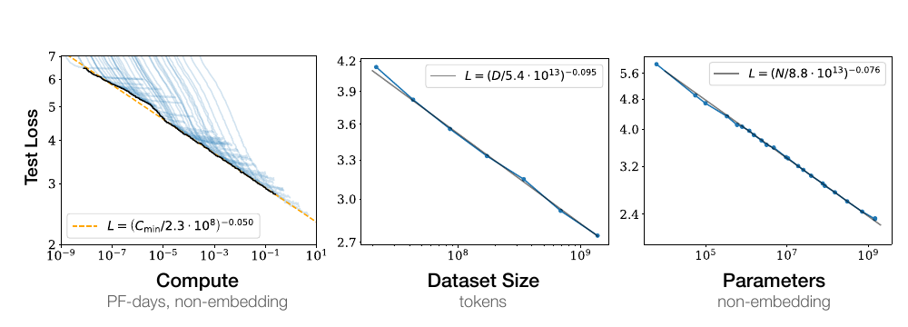

**图 1：** 随着模型规模、数据集规模和训练计算量[1](#fn:1)增加，语言建模性能会平滑提升。要取得最优性能，三项因素必须协同扩展。当性能没有受到另外两项因素的瓶颈限制时，经验性能与每一项单独因素都呈幂律关系。

**性能强烈依赖规模，而仅弱依赖模型形状。** 模型性能最强烈地取决于规模；这里的规模由三个因素构成：模型参数量 $N$（不含嵌入参数）、数据集规模 $D$，以及训练所用计算量 $C$。在合理范围内，性能仅微弱依赖于深度与宽度之比等其他架构超参数。（第 3 节）

**平滑幂律。** 当性能不受另外两个因素限制时，它与三个规模因素 $N$、$D$、$C$ 中的每一个都呈幂律关系，相关趋势横跨六个以上数量级（见图 1）。在已观测范围的高端，我们没有看到趋势发生偏离的迹象，不过损失在达到零之前最终必然趋于平缓。（第 3 节）

**过拟合的普适性。** 只要同时扩展 $N$ 与 $D$，性能就会以可预测方式提升；但如果固定其中一个而增加另一个，便会进入收益递减区间。性能损失可由比值 $N^{0.74}/D$ 预测，这意味着模型规模每增加 8 倍，为避免性能受损，数据只需增加约 5 倍。（第 4 节）

**训练的普适性。** 训练曲线遵循可预测的幂律，其参数大致不依赖模型规模。根据训练曲线的早期部分进行外推，我们可以粗略预测延长训练后能够达到的损失。（第 5 节）

**迁移随测试性能提升。** 当我们在与训练分布不同的文本上评价模型时，其结果与训练验证集上的结果高度相关，损失仅有一个大致恒定的偏移。换言之，迁移到不同分布会付出恒定代价，但除此之外，性能大致与训练分布上的性能同步提升。（第 3.2.2 节）

**样本效率。** 大模型比小模型的样本效率更高：达到同一性能水平时，它们需要的优化步数更少（图 2），使用的数据点也更少（图 4）。

**训练到收敛并不高效。** 在固定计算预算 $C$ 下，如果模型规模 $N$ 与可用数据 $D$ 均不受其他约束，最优性能来自训练非常大的模型，并在远未收敛时停止（见图 3）。因此，最大化计算效率的训练会比“把小模型训练至收敛”所得直觉更具样本效率；随训练计算量增加，数据需求只会以 $D\sim C^{0.27}$ 的缓慢速度增长。（第 6 节）

**最优批量规模。** 训练这些模型时，理想批量规模大致只取决于损失的某个幂，且仍可通过测量梯度噪声尺度 [MKAT18] 来确定；对我们能够训练的最大模型而言，收敛时的理想批量规模约为 100 万至 200 万个词元。（第 5.1 节）

综合这些结果可以看出，只要恰当地同步扩展模型规模、数据与计算量，语言建模性能就会平滑且可预测地提升。我们预计，更大的语言模型会比现有模型表现更好，样本效率也更高。

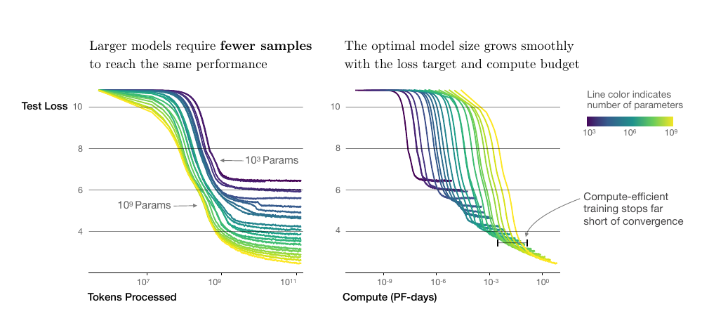

**图 2：** 一系列语言模型训练运行，模型规模从 $10^3$ 到 $10^9$ 个参数不等（不含嵌入参数）。左图表明，大模型达到同一性能所需样本更少；右图表明，随目标损失和计算预算变化，最优模型规模平滑增长，而计算高效训练会在远未收敛时停止。

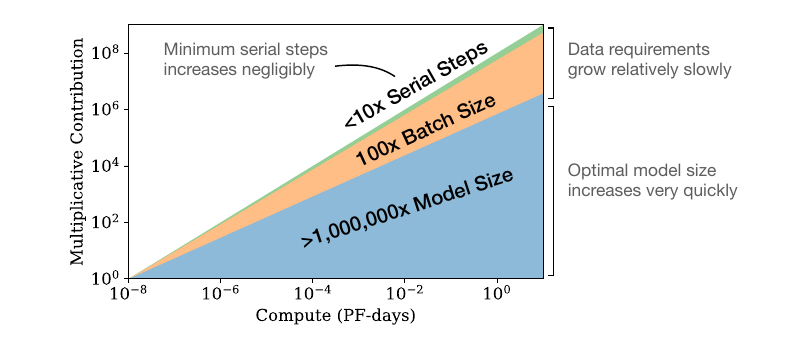

**图 3：** 随着可用计算量增加，我们可以决定把多少计算用于训练更大的模型、使用更大的批量，以及执行更多训练步。图中展示计算量增加十亿倍时的分配。对于计算效率最优的训练，大部分增量应投入模型规模；为了避免数据重复，只需较小的数据增量。在增加的数据中，大部分可以通过扩大批量规模来提升并行度，而串行训练时间只需非常小的增长。

### 1.2 缩放定律概要

当性能只受非嵌入参数量 $N$、数据集规模 $D$ 或最优分配的计算预算 $C_{\min}$ 中某一项限制时，自回归语言建模 Transformer 的测试损失可以用幂律预测（见图 1）：

1. 对参数量受限、在足够大的数据集上训练至收敛的模型：

$$
L(N)=\left(\frac{N_c}{N}\right)^{\alpha_N};\qquad
\alpha_N\sim0.076,\quad N_c\sim8.8\times10^{13}\ \text{（非嵌入参数）}. \tag{1.1}
$$

1. 对使用有限数据集并采取提前停止的大模型：

$$
L(D)=\left(\frac{D_c}{D}\right)^{\alpha_D};\qquad
\alpha_D\sim0.095,\quad D_c\sim5.4\times10^{13}\ \text{词元}. \tag{1.2}
$$

1. 当训练计算量有限，但数据集足够大、模型规模最优且批量规模足够小，从而最优利用计算量时：

$$
L(C_{\min})=\left(\frac{C_c^{\min}}{C_{\min}}\right)^{\alpha_C^{\min}};\qquad
\alpha_C^{\min}\sim0.050,\quad C_c^{\min}\sim3.1\times10^8\ \text{PF-days}. \tag{1.3}
$$

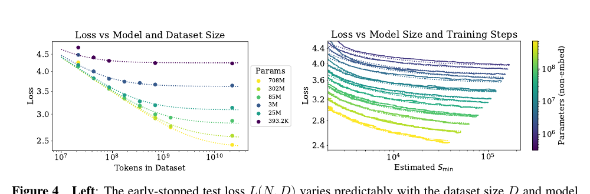

**图 4：** 左：依据式（1.5），采用提前停止时的测试损失 $L(N,D)$ 会随数据集规模 $D$ 和模型规模 $N$ 以可预测方式变化。右：经过最初的瞬态阶段后，所有模型规模 $N$ 的学习曲线都可以用式（1.6）拟合；其中参数 $S_{\min}$ 表示采用大批量训练时的步数，详见第 5.1 节。

这些关系在 $C_{\min}$ 上跨越八个数量级，在 $N$ 上跨越六个数量级，在 $D$ 上跨越两个以上数量级。它们仅微弱依赖模型形状和其他 Transformer 超参数，如深度、宽度、自注意力头数；具体数值则与 WebText2 训练集 [RWC+19] 有关。幂律指数 $\alpha_N$、$\alpha_D$、$\alpha_C^{\min}$ 指定了扩大 $N$、$D$ 或 $C_{\min}$ 时预期的性能提升程度。例如，参数量加倍后，损失会缩小到原来的 $2^{-\alpha_N}=0.95$。$N_c$、$C_c^{\min}$ 与 $D_c$ 的具体数值依赖词表规模和分词方式，因此不具有基础性含义。

决定数据并行速度与效率权衡的临界批量规模 [MKAT18] 也大致服从关于 $L$ 的幂律：

$$
B_{\text{crit}}(L)=\frac{B_{\ast}}{L^{1/\alpha_B}},\qquad
B_{\ast}\sim2\times10^8\ \text{词元},\quad \alpha_B\sim0.21. \tag{1.4}
$$

式（1.1）与式（1.2）共同表明，随模型规模增大，数据集规模应以次线性方式增长，即 $D\propto N^{\alpha_N/\alpha_D}\sim N^{0.74}$。事实上，我们发现存在一个结合式（1.1）与式（1.2）的方程，可同时刻画对 $N$ 和 $D$ 的依赖以及过拟合程度：

$$
L(N,D)=\left[\left(\frac{N_c}{N}\right)^{\alpha_N/\alpha_D}+\frac{D_c}{D}\right]^{\alpha_D}. \tag{1.5}
$$

相应拟合见图 4 左侧。我们猜测，该函数形式或许也能参数化其他生成式建模任务经训练后的对数似然。

在无限数据极限下，用有限的参数更新步数 $S$ 训练给定模型时，经过最初的瞬态阶段，学习曲线可以准确拟合为（见图 4 右侧）：

$$
L(N,S)=\left(\frac{N_c}{N}\right)^{\alpha_N}+\left(\frac{S_c}{S_{\min}(S)}\right)^{\alpha_S}, \tag{1.6}
$$

其中 $S_c\approx2.1\times10^3$、$\alpha_S\approx0.76$，$S_{\min}(S)$ 是依据式（5.4）估计的最小可能优化步数，即参数更新次数。

在固定计算预算 $C$ 下训练且没有其他约束时，式（1.6）预测，最优模型规模 $N$、最优批量规模 $B$、最优步数 $S$ 与数据集规模 $D$ 应按下式增长：

$$
N\propto C^{\alpha_C^{\min}/\alpha_N},\qquad
B\propto C^{\alpha_C^{\min}/\alpha_B},\qquad
S\propto C^{\alpha_C^{\min}/\alpha_S},\qquad
D=B\cdot S, \tag{1.7}
$$

其中

$$
\alpha_C^{\min}=\frac{1}{1/\alpha_S+1/\alpha_B+1/\alpha_N}. \tag{1.8}
$$

这与经验最优结果 $N\propto C_{\min}^{0.73}$、$B\propto C_{\min}^{0.24}$、$S\propto C_{\min}^{0.03}$ 高度一致。计算预算 $C$ 增加时，应主要把它用于扩大模型，而不必大幅增加训练时间或数据集规模（见图 3）。这也意味着，模型越大，样本效率越高。实践中受硬件限制，研究人员通常会选择比最大计算效率所要求的模型更小、训练时间更长的方案。最优性能与总计算量呈幂律关系，见式（1.3）。

我们为式（1.5）提供一些基本理论动机，分析学习曲线拟合及其对训练时间的含义，并把结果拆解到逐词元层面。我们还简要比较 LSTM 与循环式 Transformer [DGV+18]。

### 1.3 记号

本文使用以下记号：

- $L$：以奈特为单位的交叉熵损失。通常在一个上下文的所有词元上取平均，但有时也报告上下文中特定词元的损失。
- $N$：模型参数量，不含所有词表嵌入和位置嵌入。
- $C\approx6NBS$：非嵌入训练总计算量的估计，其中 $B$ 为批量规模，$S$ 为训练步数，即参数更新次数。数值以 PF-days 表示，$1\ \text{PF-day}=10^{15}\times24\times3600=8.64\times10^{19}$ 次浮点运算。
- $D$：以词元计的数据集规模。
- $B_{\text{crit}}$：临界批量规模 [MKAT18]，定义与讨论见第 5.1 节。在临界批量规模上训练，可以在时间效率与计算效率之间取得近似最优的折中。
- $C_{\min}$：达到给定损失值所需最小非嵌入计算量的估计。它等于模型在远小于临界批量规模的批量上训练时所使用的训练计算量。
- $S_{\min}$：达到给定损失值所需最少训练步数的估计。它也等于模型在远大于临界批量规模的批量上训练时所使用的步数。
- $\alpha_X$：损失按 $L(X)\propto1/X^{\alpha_X}$ 缩放时的幂律指数，其中 $X$ 可以是 $N$、$D$、$C$、$S$、$B$ 或 $C_{\min}$。

## 2. 背景与方法

我们在 WebText 数据集 [RWC+19] 的扩展版本 WebText2 上训练语言模型，使用字节对编码 [SHB15] 分词，词表规模 $n_{\text{vocab}}=50257$。我们优化在 1,024 词元上下文上取平均的自回归对数似然，即交叉熵损失，这也是主要性能指标。我们记录模型在 WebText2 测试分布以及若干其他文本分布上的损失。主要模型是仅含解码器 [LSP+18；RNSS18] 的 Transformer [VSP+17]，同时训练 LSTM 和通用 Transformer [DGV+18] 作为比较。

### 2.1 Transformer 的参数与计算缩放

我们用以下超参数描述 Transformer 架构：$n_{\text{layer}}$ 为层数，$d_{\text{model}}$ 为残差流维度，$d_{\text{ff}}$ 为中间前馈层维度，$d_{\text{attn}}$ 为注意力输出维度，$n_{\text{heads}}$ 为每层注意力头数。输入上下文包含 $n_{\text{ctx}}$ 个词元；除非另有说明，$n_{\text{ctx}}=1024$。

我们以 $N$ 表示模型规模，并把它定义为非嵌入参数量：

$$
\begin{aligned}
N &\approx 2d_{\text{model}}n_{\text{layer}}(2d_{\text{attn}}+d_{\text{ff}})\\
  &=12n_{\text{layer}}d_{\text{model}}^2,
\qquad \text{当采用标准设置 }d_{\text{attn}}=d_{\text{ff}}/4=d_{\text{model}}.
\end{aligned} \tag{2.1}
$$

这里排除了偏置等次领先项。模型的嵌入矩阵还包含 $n_{\text{vocab}}d_{\text{model}}$ 个参数，位置嵌入包含 $n_{\text{ctx}}d_{\text{model}}$ 个参数，但讨论“模型规模”$N$ 时并不计入它们；后文将看到，这样可以得到明显更简洁的缩放定律。

一次 Transformer 前向传播大约需要

$$
C_{\text{forward}}\approx2N+2n_{\text{layer}}n_{\text{ctx}}d_{\text{model}} \tag{2.2}
$$

次乘加运算，其中系数 2 来自矩阵乘法使用的乘法-累加操作。表 1 给出逐操作的详细参数量与计算量。

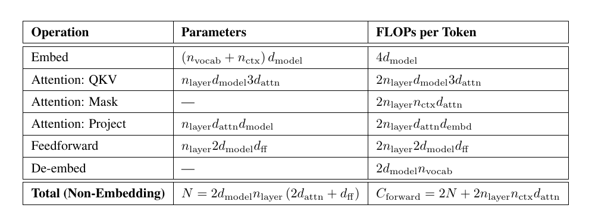

**表 1：** Transformer 模型的参数量与计算量（前向传播）估计。非线性、偏置和层归一化等次领先项均被省略。

对满足 $d_{\text{model}}>n_{\text{ctx}}/12$ 的上下文与模型，每词元中依赖上下文的计算成本只占总计算量的一小部分。由于本文主要研究 $d_{\text{model}}\gg n_{\text{ctx}}/12$ 的模型，训练计算估计中不计依赖上下文的项。再计入反向传播，其计算量约为前向传播的两倍，我们把估计的非嵌入计算量定义为每个训练词元 $C\approx6N$ 次浮点运算。

### 2.2 训练过程

除非另有说明，我们使用 Adam 优化器 [KB14]，以每批 512 个序列、每序列 1,024 个词元的批量规模，固定训练 $2.5\times10^5$ 步。受内存限制，最大的模型，即参数超过 10 亿的模型，使用 Adafactor [SS18] 训练。我们试验了多种学习率与日程，详见附录 D.6。结果表明，收敛时的结果基本不受学习率日程影响。除非另有说明，数据中的所有训练运行都采用先线性预热 3,000 步、再余弦衰减至零的学习率日程。

### 2.3 数据集

我们在 [RWC+19] 所述 WebText 数据集的扩展版本上训练模型。原始 WebText 抓取了截至 2017 年 12 月、在 Reddit 上获得至少 3 点业力值的外链网页。第二版 WebText2 又加入了 2018 年 1 月至 10 月期间的 Reddit 外链，同样要求至少 3 点业力值。业力值阈值被用作判断用户是否认为链接有趣或有用的启发式标准。新增链接的文本通过 Newspaper3k Python 库抽取。整个数据集包含 2,030 万份文档、96 GB 文本，以及按 `wc` 定义的 $1.62\times10^{10}$ 个单词。随后，我们应用 [RWC+19] 所述的可逆分词器，得到 $2.29\times10^{10}$ 个词元。其中 $6.6\times10^8$ 个词元留作测试集。我们还在以相似方式制备的多伦多图书语料库 [ZKZ+15]、Common Crawl [Fou]、英文维基百科和一组公开互联网图书样本上测试模型。

## 3. 实证结果与基本幂律

为了刻画语言模型的缩放规律，我们训练了大量不同模型，改变的因素包括：

- 模型规模：非嵌入参数量从 768 到 15 亿。
- 数据集规模：从 2,200 万到 230 亿个词元。
- 模型形状：包括深度、宽度、注意力头数与前馈维度。
- 上下文长度：多数运行使用 1,024，但也试验更短的上下文。
- 批量规模：多数运行使用 $2^{19}$，同时也通过改变该值来测量临界批量规模。

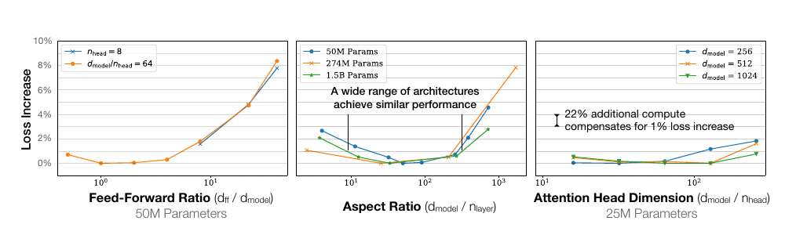

**图 5：** 固定非嵌入参数总量 $N$ 时，性能仅轻微依赖模型形状。在很宽的形状范围内，损失只变化几个百分点。参数量的细微差异通过以 $L(N)$ 拟合作为基线予以补偿。尤其是，宽深比可变化 40 倍而性能只受轻微影响；$(n_{\text{layer}},d_{\text{model}})=(6,4288)$ 的模型，其损失与 [RWC+19] 使用的 $(48,1600)$ 模型相差不到 3%。

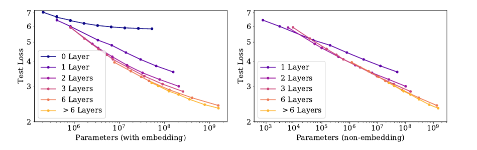

**图 6：** 左：计入嵌入参数时，性能看起来除参数量外还强烈依赖层数。右：排除嵌入参数后，不同深度模型的性能收敛到同一趋势。只有少于 2 层或深宽比极端的模型显著偏离该趋势。

本节将展示数据以及由经验启发的拟合，理论分析留至后文。

### 3.1 Transformer 形状与超参数的近似独立性

固定非嵌入参数总量 $N$ 时，Transformer 性能仅微弱依赖形状参数 $n_{\text{layer}}$、$n_{\text{heads}}$ 和 $d_{\text{ff}}$。为确立这一结果，我们训练规模固定、仅改变一个超参数的模型。对 $n_{\text{heads}}$，这样做最为直接。改变 $n_{\text{layer}}$ 时，我们同时改变 $d_{\text{model}}$，使 $N\approx12n_{\text{layer}}d_{\text{model}}^2$ 保持不变。同样，为在模型规模固定时改变 $d_{\text{ff}}$，依据表 1 的参数量计算，也必须同时改变 $d_{\text{model}}$。如果更深的 Transformer 实际上像较浅模型的集成一样工作，那么性能与 $n_{\text{layer}}$ 无关便是自然结果；这与对 ResNet 的既有解释一致 [VWB16]。结果见图 5。

### 3.2 性能与非嵌入参数量 $N$

图 6 展示了多种模型的性能，从形状为 $(n_{\text{layer}},d_{\text{model}})=(2,128)$ 的小模型，一直到形状从 $(6,4288)$ 到 $(207,768)$ 不等的十亿参数模型。这里我们在完整 WebText2 数据集上训练至接近收敛，并未观察到过拟合，最大的模型或许除外。

如图 1 所示，性能随非嵌入参数量 $N$ 稳定变化，可以用式（1.5）的第一项拟合：

$$
L(N)\approx\left(\frac{N_c}{N}\right)^{\alpha_N}. \tag{3.1}
$$

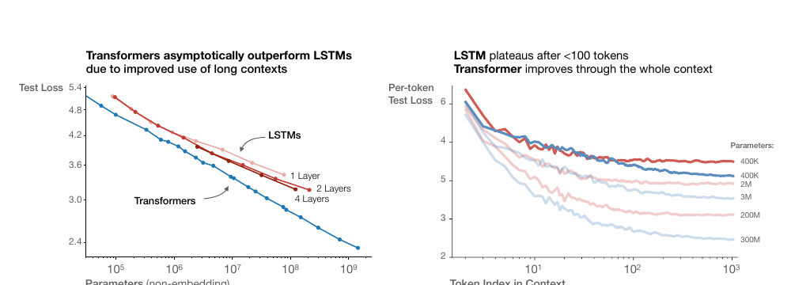

**图 7：** 左：由于能更好地利用长上下文，Transformer 在规模增大时最终超过 LSTM。右：LSTM 在不到 100 个上下文词元后趋于平台，而 Transformer 的逐词元损失会在整个上下文中持续改善。

要观察这些趋势，关键是把性能视为 $N$ 的函数；如果改用包含嵌入参数的总参数量，趋势会变得不够清晰（见图 6）。这说明可以缩小嵌入矩阵而不影响性能，与近期工作 [LCG+19] 的观察一致。

尽管这些模型只在 WebText2 上训练，但它们在其他多种数据集上的测试损失也近似以相同指数随 $N$ 呈幂律变化，如图 8 所示。

#### 3.2.1 与 LSTM 和通用 Transformer 的比较

图 7 比较 LSTM 与 Transformer 的性能如何随非嵌入参数量 $N$ 变化。LSTM 使用相同的数据集和上下文长度训练。图中可见，对上下文早期出现的词元，LSTM 与 Transformer 表现相当；但对后续词元，LSTM 无法追上 Transformer。附录 D.5 给出性能与上下文位置之间的幂律关系；模型越大，幂次越高，说明它更能迅速识别模式。

我们还在附录图 17 中比较标准 Transformer 与循环式 Transformer [DGV+18]。后者重复使用参数，因此按 $N$ 衡量时性能略好，但每个参数会付出额外计算成本。

#### 3.2.2 数据分布之间的泛化

我们还在一组额外文本数据分布上测试模型。图 8 给出这些数据集上的测试损失与模型规模之间的关系；所有模型都只在 WebText2 上训练。其他分布上的损失会随模型规模平滑改善，并且与 WebText2 上的提升直接平行。我们发现，泛化几乎完全取决于分布内验证损失，而不取决于训练持续时间或离收敛点还有多远。泛化也不依赖模型深度，见附录 D.8。

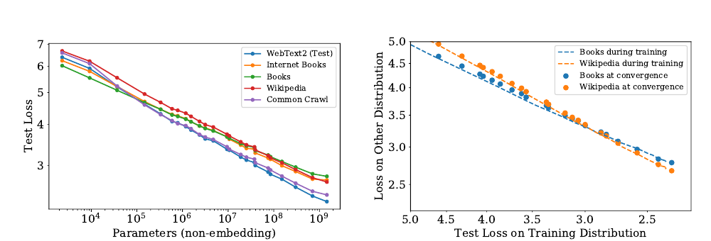

**图 8：** 左：对其他数据分布的泛化性能随模型规模平滑提升；相对于 WebText2 训练分布，偏移很小，且增长非常缓慢。右：泛化性能只取决于训练分布上的性能，而不取决于训练所处阶段。图中比较了已收敛模型（散点）和单个大模型在训练过程中的表现（虚线）。

### 3.3 性能与数据集规模及计算量

图 1 展示测试损失随数据集规模 $D$（以词元计）和训练计算量 $C$ 变化的经验趋势。

为研究关于 $D$ 的趋势，我们在 WebText2 的固定子集上训练 $(n_{\text{layer}},n_{\text{embd}})=(36,1280)$ 的模型，并在测试损失不再下降时停止。所得测试损失可以按数据集规模用简单幂律拟合：

$$
L(D)\approx\left(\frac{D_c}{D}\right)^{\alpha_D}. \tag{3.2}
$$

相应数据和拟合见图 1。

训练所用非嵌入总计算量可估计为 $C=6NBS$，其中 $B$ 是批量规模，$S$ 是参数更新次数，系数 6 同时计入前向传播与反向传播。于是，对给定 $C$，我们可以扫描不同 $N$ 的所有模型，找出在第 $S=C/(6BS)$ 步上性能最好的模型。需要注意，这些结果中所有模型的批量规模 $B$ 都保持不变，因此经验结果并非真正最优。后文将用校正后的 $C_{\min}$ 处理这一问题，以得到更清晰的趋势。

结果对应图 1 左图中的粗黑线，可拟合为

$$
L(C)\approx\left(\frac{C_c}{C}\right)^{\alpha_C}. \tag{3.3}
$$

图中还叠加了各条学习曲线，以说明不同模型何时成为最优选择。后文将更仔细地研究计算量的最优分配。数据强烈表明，样本效率随模型规模提升；附录图 19 也直接展示了这一点。

## 4. 刻画无限数据极限与过拟合

第 3 节发现了语言建模性能的若干基本缩放定律。本节同时改变 $N$ 和 $D$，研究规模为 $N$ 的模型在包含 $D$ 个词元的数据集上训练时的性能。我们将以实证方式证明，经过最优训练的测试损失符合式（1.5）的缩放定律。这个结论可以指导我们判断：在控制过拟合的同时训练越来越大的模型，需要多少数据。

### 4.1 提议的 $L(N,D)$ 方程

我们选择式（1.5）的参数化形式，这里为方便再次写出：

$$
L(N,D)=\left[\left(\frac{N_c}{N}\right)^{\alpha_N/\alpha_D}+\frac{D_c}{D}\right]^{\alpha_D}. \tag{4.1}
$$

这一选择依据三项原则：

1. 改变词表规模或分词方式，预期会按一个整体因子重新缩放损失。$L(N,D)$ 的参数化形式，以及任何损失模型，都必须自然允许这种重新缩放。
2. 固定 $D$ 并令 $N\to\infty$ 时，总损失应趋近 $L(D)$。反之，固定 $N$ 并令 $D\to\infty$ 时，损失应趋近 $L(N)$。
3. $L(N,D)$ 在 $D=\infty$ 处应为解析函数，因此可以按 $1/D$ 的整数次幂展开。该原则的理论依据明显弱于前两项。

我们选择的 $L(N,D)$ 满足第一项要求，因为词表改变时可以重新缩放 $N_c$ 与 $D_c$。这也意味着 $N_c$、$D_c$ 的数值没有基础性含义。

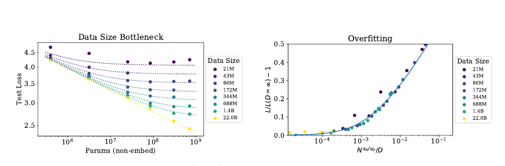

**图 9：** 采用提前停止时，测试损失 $L(N,D)$ 按式（1.5）以可预测方式依赖数据集规模 $D$ 与模型规模 $N$。左：当 $D$ 很大时，性能与 $N$ 呈直线幂律；固定较小 $D$ 时，随 $N$ 增加，性能会停止提升，模型开始过拟合，反向情况同样成立，见图 4。右：如式（4.3）预测，过拟合程度主要取决于比值 $N^{\alpha_N/\alpha_D}/D$；曲线是对该方程的拟合。

由于测试损失停止改善时我们就提前终止训练，并以相同方式优化所有模型，因此预期大模型始终优于小模型。但在固定且有限的 $D$ 下，任何模型都不可能逼近理论上最好的损失，也就是文本熵；同样，固定规模的模型会受到容量限制。这些考虑构成第二项原则的动机。需要注意，无限 $D$ 时的 $L(N)$ 和无限 $N$ 时的 $L(D)$ 已足以完全确定 $L(N,D)$ 的所有参数。

第三项原则更具推测性。我们有一个简单而普遍的理由，认为当 $D$ 很大时，过拟合应按 $1/D$ 缩放：过拟合应与数据集的方差或信噪比有关 [AS17]，而后者按 $1/D$ 缩放。对任何平滑损失函数，这一预期都应成立，因为损失可以围绕 $D\to\infty$ 极限展开。不过，该论证假设 $1/D$ 修正项会压倒其他方差来源，例如有限批量规模以及其他对优化有效性的限制。在没有实证确认时，我们不会对其适用性抱有很强信心。

第三项原则解释了式（1.5）中 $N$ 与 $D$ 作用的不对称。也可以构造非常相似的对称表达式[2](#fn:2)，但它们不能按 $1/D$ 的整数次幂展开，还需要引入额外参数。

无论如何，后文将看到 $L(N,D)$ 方程对数据拟合良好；这才是采用该设定最重要的理由。

### 4.2 结果

我们对所有模型使用 10% Dropout 正则化，同时跟踪测试损失，并在它不再下降时停止训练。结果见图 9，其中包含对式（1.5）四个参数 $\alpha_N$、$\alpha_D$、$N_c$、$D_c$ 的拟合。

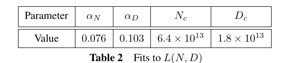

**表 2：** $L(N,D)$ 的拟合。所得参数为 $\alpha_N=0.076$、$\alpha_D=0.103$、$N_c=6.4\times10^{13}$、$D_c=1.8\times10^{13}$。

拟合效果非常好，唯一例外是把数据集缩小 1,024 倍、降至约 $2\times10^7$ 个词元的运行。数据集如此之小时，一个训练轮次仅包含 40 次参数更新。这样的小数据集也许代表语言建模的另一种区间，因为过拟合会在训练极早期发生，见图 16。还要注意，这些参数与第 3 节所得值略有差异，因为这里拟合的是完整的 $L(N,D)$，而不是单独拟合 $L(N,\infty)$ 或 $L(\infty,D)$。

为了刻画无限数据极限的边界区域，我们可以直接研究过拟合程度。除最大模型外，使用完整的 220 亿词元 WebText2 数据集训练时均未看到过拟合迹象，因此可以把它视为 $D=\infty$。于是，可以把有限 $D$ 与无限数据极限比较，定义

$$
\delta L(N,D)\equiv\frac{L(N,D)}{L(N,\infty)}-1. \tag{4.2}
$$

并把它作为 $N$、$D$ 的函数研究。实证结果显示，$\delta L$ 只依赖 $N$ 和 $D$ 的某个特定组合，如图 16 所示。这可以由式（1.5）的缩放定律推出：

$$
\delta L\approx\left(1+\left(\frac{N}{N_c}\right)^{\alpha_N/\alpha_D}\frac{D_c}{D}\right)^{\alpha_D}-1. \tag{4.3}
$$

当 $D$ 很大时，该公式同样可以按 $1/D$ 的幂展开。

我们估计，不同随机种子导致的损失波动约为 0.02。这意味着，若要训练到距收敛不足这一阈值，同时避免过拟合，需要满足

$$
D\gtrsim(5\times10^3)N^{0.74}. \tag{4.4}
$$

依据这一关系，在 220 亿词元 WebText2 数据集上，参数量小于 $10^9$ 的模型可以在过拟合很小的情况下训练，但最大的模型会出现轻微过拟合。更一般地说，该关系表明，为避免过拟合，数据集规模可以随模型规模次线性增长。不过，这通常并不代表计算效率最高的训练。还需强调，我们在改变数据集和模型规模时，没有针对正则化进行优化，例如没有调节 Dropout 概率。

## 5. 模型规模与训练时间的缩放定律

本节将证明，一个简单的缩放定律可以很好地描述损失如何随模型规模 $N$ 与训练时间变化。首先，我们说明如何利用 [MKAT18] 的结果定义通用训练步数 $S_{\min}$，以修正大多数模型并未在最优批量规模上训练这一事实。然后，我们将证明可以用式（1.6）拟合损失对模型规模和训练时间的依赖。后文会利用这些结果预测训练计算量在模型规模与训练时间之间的最优分配，再以实证结果确认该预测。

### 5.1 对在 $B_{\text{crit}}(L)$ 上训练的校正

[MKAT18] 提出了一个描述训练对批量规模依赖的简单经验理论，另见 [SLA+18；ZLN+19]。该工作认为训练存在临界批量规模 $B_{\text{crit}}$：当 $B$ 不超过 $B_{\text{crit}}$ 时，扩大批量规模几乎不会降低计算效率；当 $B>B_{\text{crit}}$ 时，继续增大 $B$ 会产生收益递减。它还指出，梯度噪声尺度可以简单预测 $B_{\text{crit}}$，二者除了通过已经达到的损失值以外，都不直接依赖模型规模。借助这些结果，可以预测训练时间和计算量如何随批量规模变化。为了同时高效利用训练时间和计算量，最佳方案是在 $B\approx B_{\text{crit}}$ 上训练。$B\gg B_{\text{crit}}$ 时，训练步数最少；$B\ll B_{\text{crit}}$ 时，计算量最少。

更具体地说，对多种神经网络任务而言，当训练到任意固定损失 $L$ 时，训练步数 $S$ 与已处理数据样例数 $E=BS$ 满足简单关系

$$
\left(\frac{S}{S_{\min}}-1\right)\left(\frac{E}{E_{\min}}-1\right)=1. \tag{5.1}
$$

其中，$S_{\min}$ 是达到 $L$ 所需的最少步数，$E_{\min}$ 是必须处理的最少数据样例数。

附录图 18 证明 Transformer 同样满足关系（5.1）。该关系定义了临界批量规模

$$
B_{\text{crit}}(L)\equiv\frac{E_{\min}}{S_{\min}}, \tag{5.2}
$$

它是目标损失值的函数。在临界批量规模上训练，可以在时间和计算量之间取得近似最优的折中：需要 $2S_{\min}$ 个训练步，并处理 $E=2E_{\min}$ 个数据样例。

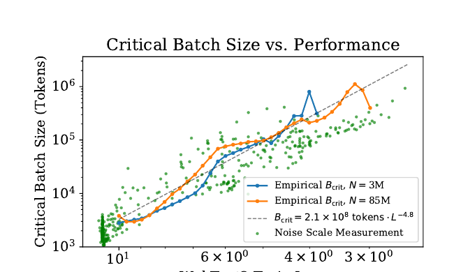

**图 10：** 随性能提升，临界批量规模 $B_{\text{crit}}$ 与损失呈幂律关系，并不直接依赖模型规模。损失每降低 13%，临界批量规模大约翻倍。$B_{\text{crit}}$ 由图 18 的数据直接测得，同时也可像 [MKAT18] 那样由梯度噪声尺度近似预测。

图 10 绘出了两个不同模型的临界批量规模和梯度噪声尺度[3](#fn:3)与训练损失的关系。可以看到，$B_{\text{crit}}(L)$ 与模型规模无关，只取决于损失 $L$。因此，[MKAT18] 的预测对 Transformer 语言模型仍然成立。临界批量规模可按损失的幂律拟合：

$$
B_{\text{crit}}(L)\approx\frac{B_{\ast}}{L^{1/\alpha_B}}, \tag{5.3}
$$

其中 $B_{\ast}\approx2\times10^8$，$\alpha_B\approx0.21$。

之所以选择这种 $B_{\text{crit}}(L)$ 参数化，是因为当损失趋近最小值 $L_{\min}$ 时，梯度噪声尺度预期会发散，而 $B_{\text{crit}}$ 应跟随该噪声尺度。我们不知道 $L_{\min}$，因为没有看到模型正在逼近它的迹象；但自然语言的熵非零，因此 $L_{\min}>0$。显然，$L_{\min}$ 远小于目前已经达到的 $L$，所以我们采用了 $B_{\text{crit}}$ 在 $L\to0$ 时发散的参数化形式。

我们利用 $B_{\text{crit}}(L)$，估计以 $B=2^{19}$ 个词元的批量规模训练时的步数 $S$，与在 $B\gg B_{\text{crit}}$ 上训练时的步数之间的关系。对任意目标损失 $L$，它就是

$$
S_{\min}(S)\equiv\frac{S}{1+B_{\text{crit}}(L)/B}
\qquad\text{（$B\gg B_{\text{crit}}$ 时的最少步数）}. \tag{5.4}
$$

如果模型规模为 $N$，并在 $B\ll B_{\text{crit}}(L)$ 上训练到 $L$，该式还定义了所需计算量的临界值：

$$
C_{\min}(C)\equiv\frac{C}{1+B/B_{\text{crit}}(L)}
\qquad\text{（$B\ll B_{\text{crit}}$ 时的最少计算量）}, \tag{5.5}
$$

其中 $C=6NBS$ 是批量规模为 $B$ 时所用非嵌入计算量的估计。

### 5.2 $L(N,S_{\min})$ 的结果及性能与模型规模和计算量的关系

现在利用式（5.4）定义的 $S_{\min}$，对无限数据极限下损失对模型规模和训练时间的依赖进行简单、通用的拟合。我们对采用 Adam 优化且训练稳定的运行，用式（1.6）拟合损失；为方便再次写出：

$$
L(N,S_{\min})=\left(\frac{N_c}{N}\right)^{\alpha_N}+\left(\frac{S_c}{S_{\min}}\right)^{\alpha_S}. \tag{5.6}
$$

我们纳入学习率日程预热阶段之后的所有训练步，得到下列拟合参数。

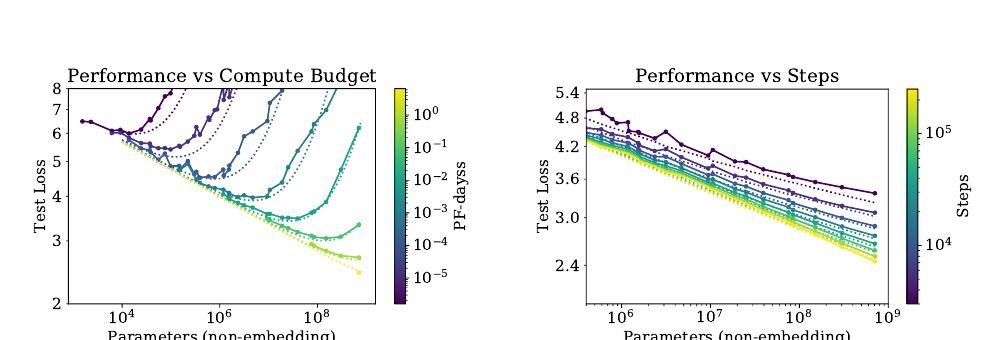

**图 11：** 固定总计算量或训练步数时，性能遵循式（5.6）的 $L(N,S)$。每个计算预算都对应一个使性能最大化的最优模型规模。小 $S$ 区间拟合一般并不意外，因为学习曲线的幂律方程会在训练极早期失效。

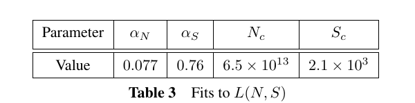

**表 3：** $L(N,S)$ 的拟合。所得参数为 $\alpha_N=0.077$、$\alpha_S=0.76$、$N_c=6.5\times10^{13}$、$S_c=2.1\times10^3$。

用这些参数可以得到图 4 中的学习曲线拟合。拟合并不完美，但考虑到式（5.6）如此简单，其结果仍十分有说服力。

图 11 以另一种更有意思的方式呈现数据与拟合：固定训练所用非嵌入总计算量 $C$ 或训练步数 $S$，研究测试损失如何随模型规模变化。拟合同时使用式（5.5）、式（5.4）、上述参数与式（5.6）。

损失对 $S_{\min}$ 的幂律依赖反映了优化器动力学与损失地形的相互作用。拟合在训练后期最佳，而此时损失或许近似二次函数，因此幂律应能提供关于损失 Hessian 矩阵谱的信息。它的普适性说明，Hessian 特征值密度大致不依赖模型规模。

### 5.3 提前停止步数的下界

$L(N,S_{\min})$ 的结果可以用来推导数据受限训练中提前停止步数的下界，并给出粗略估计。其动机是：对给定模型，在达到 $S_{\min}\approx S_{\text{stop}}$ 之前，有限 $D$ 与无限 $D$ 的学习曲线应非常相似。因此，过拟合程度应与简单地在 $S_{\text{stop}}$ 结束训练所带来的修正成正比。该方法会低估 $S_{\text{stop}}$，因为有限 $D$ 时，测试损失实际下降得更慢，所以需要更多训练步才能达到有限 $D$ 下的最优测试损失。这一推理得到不等式

$$
S_{\text{stop}}(N,D)\gtrsim\frac{S_c}{[L(N,D)-L(N,\infty)]^{1/\alpha_S}}. \tag{5.7}
$$

其中 $L(N,\infty)$ 是无限可用数据下评价的收敛损失。附录图 16 把该不等式与经验数据进行比较。图中的 $S_{\text{stop}}$ 与 $L(N,D)$ 是经验值，不过 $S_{\text{stop}}$ 已被校正，以模拟 $B\gg B_{\text{crit}}$ 时的训练；$L(N,\infty)$ 则由 $L(N,D)$ 的拟合在 $D=\infty$ 处计算得到。

## 6. 计算预算的最优分配

图 1 右上部分展示了性能与训练计算量之间的经验趋势。不过，该结果使用固定批量规模 $B$ 训练，而第 5.1 节表明，在临界批量规模 $B_{\text{crit}}$ 上训练实际上可以更高效[4](#fn:4)。对较大和较小损失值而言，原结果分别可以用更少样本或更少步数达到；把这种低效校正到临界批量规模后，趋势会更简洁、更可预测。

本节将修正这一疏漏。更重要的是，我们将利用第 5 节的结果，确定计算量在模型规模 $N$ 与训练所处理的数据量 $2B_{\text{crit}}S_{\min}$ 之间的最优分配。我们既以经验方式，也依据 $L(N,S_{\min})$ 方程从理论上确定这种分配，并证明两种方法相互一致。

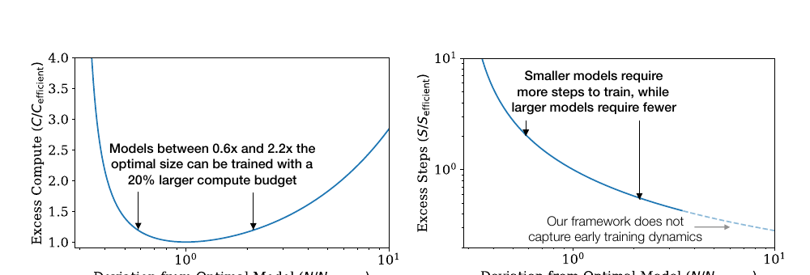

**图 12：** 左：给定固定计算预算，存在某个最优模型规模；但模型略大或略小，都只需很少的额外计算。右：大于计算高效规模的模型需要更少训练步；如果能够提供足够多的额外并行能力，训练可能更快。对于非常大的模型，不应相信该方程，因为它只在学习曲线最初瞬态阶段之后的幂律区域有效。

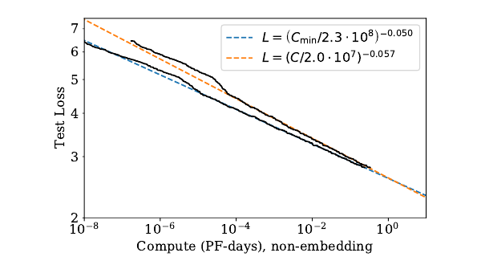

**图 13：** 校正性能以模拟远低于临界批量规模的训练后，与完全基于经验的结果相比，$L(C_{\min})$ 的幂律略有变化。$10^{-5}$ PF-days 处明显的突起标志着网络从 1 层过渡到 2 层；幂律拟合不包含 1 层网络。我们预计，$L(C_{\min})$ 趋势能够对更大计算量作出可靠外推。

### 6.1 最优性能与分配

首先研究损失如何随式（5.5）中的最优分配计算量变化。图 13 给出了结果以及幂律拟合。与图 1 的计算量图相比，采用 $C_{\min}$ 的新拟合有所改善。

给定 $L(C_{\min})$，自然会问：在给定训练计算量下，哪个最优模型规模 $N(C_{\min})$ 能够提供最低损失？图 14 给出了最优模型规模。我们观察到，$N(C_{\min})$ 可以很好地用幂律拟合：

$$
N(C_{\min})\propto(C_{\min})^{0.73}. \tag{6.1}
$$

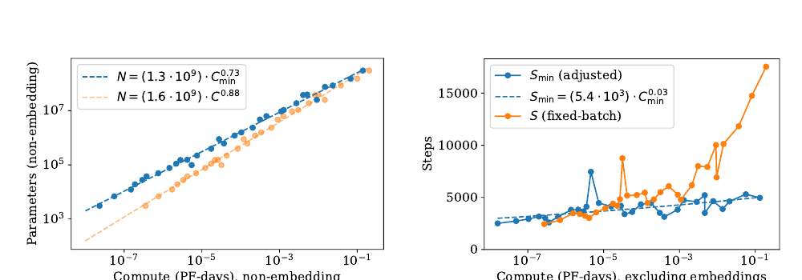

**图 14：** 左：每个计算预算 $C_{\min}$ 都对应一个最优模型规模 $N$。最优模型规模随 $C_{\min}$ 快速增长，计算量每增加 10 倍，模型规模约增加 5 倍；已处理数据样例数承担余下增量，只增长约 2 倍。右：经过批量校正的优化步数即使有所增长也非常缓慢，这意味着已处理数据样例数的大部分增长都可用于增大批量规模。

图 12 展示了训练次优规模模型的影响，另见附录 B.4。

根据定义，$C_{\min}\equiv6NB_{\text{crit}}S$，因此可以利用 $N(C_{\min})$ 推出更多结果。先前拟合表明 $B\propto L^{-4.8}$ 且 $L\propto C_{\min}^{-0.05}$，由此可得 $B_{\text{crit}}\propto C_{\min}^{0.24}$。于是，最优步数随计算量只会非常缓慢地增长：

$$
S_{\min}\propto(C_{\min})^{0.03}. \tag{6.2}
$$

这与图 14 的经验结果一致。事实上，测得的指数非常小，结果甚至可能与指数为零相容。

因此我们得出结论：在计算量最优分配下扩展语言建模时，应主要扩大模型规模 $N$，同时令 $B\propto B_{\text{crit}}$ 来增大批量规模，而串行步数几乎无需增加。由于计算高效训练所用优化步数较少，可能有必要进一步研究如何加速训练早期动力学。

### 6.2 来自 $L(N,S_{\min})$ 的预测

$L(C_{\min})$ 的结果与各项分配可以由第 5 节得到的 $L(N,S_{\min})$ 方程预测。给定该方程，可以代入 $S_{\min}=C_{\min}/(6NB)$，再在固定训练计算量时求损失关于 $N$ 的最小值。附录 B 详细执行这一过程，并给出更多预测。

对于损失与训练计算量的关系，我们预测

$$
L(C_{\min})=\left(\frac{C_c^{\min}}{C_{\min}}\right)^{\alpha_C^{\min}}, \tag{6.3}
$$

其中

$$
\alpha_C^{\min}\equiv\frac{1}{1/\alpha_S+1/\alpha_B+1/\alpha_N}\approx0.054. \tag{6.4}
$$

这与图 13 的指数高度一致。我们还预测

$$
N(C_{\min})\propto(C_{\min})^{\alpha_C^{\min}/\alpha_N}\approx(C_{\min})^{0.71}, \tag{6.5}
$$

同样与图 14 的缩放相差不到几个百分点。这些缩放定律为语言建模性能提供了预测框架。

### 6.3 矛盾与猜想

在较大的计算量、数据量或模型规模范围内，我们没有观察到直线幂律趋势发生偏离。不过，自然语言的熵不为零，因此这些趋势最终必然趋于平缓。

事实上，本节描述的计算高效训练趋势已经包含一个表面矛盾。在比本文记录高出若干数量级的规模上，由 $L(C_{\min})$ 缩放定律预测的性能会越过一个下界；考虑到训练数据随计算量增长得很慢，这个更低的损失本不可能达到。这意味着缩放定律必然会在此前失效。不过，我们猜测交点具有更深层含义：它估计了 Transformer 语言模型达到最大性能的位置。

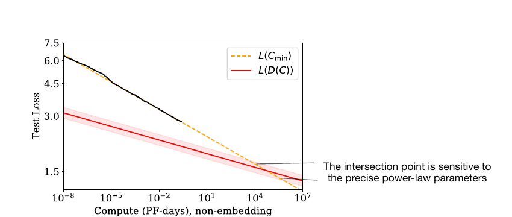

**图 15：** 在远超本文实证研究的模型规模处，计算高效训练所需数据增长缓慢，使 $L(C_{\min})$ 与 $L(D)$ 方程发生矛盾。两条曲线的交点标志着预测预期会在此前失效的位置。该点的位置对幂律拟合的具体指数高度敏感。

由于计算高效训练所用数据随计算预算缓慢增长，$L(C_{\min})$ 所预测的性能最终会碰到 $L(D)$ 幂律给出的下界，见图 15。下面作更详细的推导。

为了控制过拟合，第 4 节的结果意味着数据集规模应按下式扩展：

$$
D\propto N^{0.74}\propto C_{\min}^{0.54}, \tag{6.6}
$$

其中使用图 14 中计算高效的 $N(C_{\min})$。

再把它与计算高效训练的数据需求比较。如果在临界批量规模上训练，即 $C=2C_{\min}$，且训练过程中从不重复使用数据，则数据用量随计算量的增长为

$$
D(C_{\min})=\frac{2C_{\min}}{6N(C_{\min})}
\approx(4\times10^{10}\ \text{词元})(C_{\min}/\text{PF-day})^{0.26}. \tag{6.7}
$$

这是数据集规模能够随计算量有效增长的最大速率，因为它意味着模型只训练一个轮次。但它使数据集增长得比式（6.6）慢得多。由此看来，即使训练过程从不重复任何数据，计算高效训练最终仍会遭遇过拟合问题。

根据图 1，当瓶颈来自数据集规模，也就是来自过拟合时，损失应按 $L(D)\propto D^{-0.095}$ 缩放。这意味着进入数据受限区间后，损失会随计算量按 $L(D(C_{\min}))\propto C_{\min}^{-0.03}$ 缩放。矛盾再次出现，因为该曲线最终会与图 13 的预测相交；后者给出 $L(C_{\min})\propto C_{\min}^{-0.050}$。

$L(D(C_{\min}))$ 与 $L(C_{\min})$ 的交点大致位于

$$
C^{\ast}\sim10^4\ \text{PF-days},\qquad
N^{\ast}\sim10^{12}\ \text{个参数},\qquad
D^{\ast}\sim10^{12}\ \text{个词元},\qquad
L^{\ast}\sim1.7\ \text{奈特/词元}. \tag{6.8}
$$

不过，这些数值高度不确定；根据幂律拟合指数的精确取值，任一方向都可能相差一个数量级。最直接的解释是，缩放定律会在达到该点时或此前失效，而无论计算量还是模型规模，它仍比本文实验高出多个数量级。

也可以猜测，这个交点还具有更深层含义。如果不改变数据需求的性质就无法把模型规模扩展到 $N^{\ast}$ 以上，那么达到 $C_{\min}^{\ast}$ 与 $N^{\ast}$ 时，我们也许已经提取了自然语言数据中所有可靠信息。按照这种解释，$L^{\ast}$ 可以粗略估计自然语言的逐词元熵[5](#fn:5)，并且损失趋势会在达到 $L^{\ast}$ 时或此前趋平。

可以通过考虑向训练集加入噪声的版本，猜测 $L(C_{\min})$ 趋平时的函数形式。例如，可以在提供给模型的每段上下文后附加一串随机词元，人为地给损失增加一个恒定加性项。此时，距噪声底限的距离 $L-L_{\text{noise}}$ 会成为更有意义的性能指标；即使该距离只略微下降，也可能意味着定性性能显著提升。由于人工噪声会同等影响所有趋势，式（6.8）的临界点不会改变，$L^{\ast}$ 的绝对值除外；即便临界点出现在趋势趋平之后，它也可能仍有意义。

## 7. 相关工作

幂律可以源自许多不同机制 [THK18]。密度估计 [Was06] 与随机森林模型 [Bia12] 中，模型规模、数据集规模的幂律缩放或许与本文结果有关。这些模型暗示，幂律指数可以非常粗略地解释为数据中相关特征数量的倒数。

一些早期工作 [BB01；Goo01] 发现性能与数据集规模之间存在幂律缩放。较新的工作 [HNA+17；HAD19] 也研究了模型规模与数据规模之间的缩放关系，在既有文献中可能与本文最接近[6](#fn:6)。不过，[HNA+17] 发现数据集规模随模型规模超线性增长，而本文发现次线性增长。本文关于计算量最优分配的结论与 [Kom19] 也有一些相似之处，包括幂律学习曲线。EfficientNet [TL19] 的准确率与模型规模之间似乎也近似服从幂律。非常近期的工作 [RRBS19b] 研究了多种数据集中数据集规模与模型规模的联合缩放，并拟合了一个与本文类似的设定。

为了获得图像模型的最优性能，EfficientNet [TL19] 主张以不同系数指数式扩大深度和宽度，使宽度随深度呈幂律缩放。本文发现，对语言模型进行扩展时，该幂次应大致为 1，也就是说宽深比应保持不变。更重要的是，相比语言模型的整体规模，精确的架构超参数并不重要。[VWB16] 认为深层模型可以作为较浅模型的集成来工作，这或许能够解释该发现。更早的工作 [ZK16] 比较了宽度与深度，发现宽 ResNet 在图像分类上可能优于深 ResNet。一些研究固定每个数据样例的计算量，该计算量往往与模型参数量成正比；本文则同时研究模型规模与训练计算总量的缩放。

多项工作 [AS17；BHMM18] 研究了高度过参数化模型的泛化，并在模型规模达到数据集规模时发现“阻塞转变”[GJS+19]。这可能需要比一般实践多训练若干数量级，而且尤其不采用提前停止。本文没有观察到这种转变，并发现所需训练数据随模型规模次线性增长。模型规模展开，尤其是大宽度下的展开 [JGH18；LXS+19]，或许能为理解本文部分缩放关系提供有用框架。本文关于优化的结果，例如学习曲线形状，可能可以用带噪二次模型解释；该模型在现实设置中能给出相当准确的预测 [ZLN+19]。要把这种联系定量化，还需要刻画 Hessian 谱 [Pap18；GKX19；GARD18]。

## 8. 讨论

我们观察到，语言模型对数似然损失会随非嵌入参数量 $N$、数据集规模 $D$ 和经过优化的训练计算量 $C_{\min}$ 呈一致缩放，如式（1.5）与式（1.6）所概括。相反，它仅微弱依赖许多架构与优化超参数。因为损失随 $N$、$D$、$C_{\min}$ 呈幂律缩放，所以规模增加会产生收益递减。

在同时改变参数时，我们能够精确建模损失对 $N$ 与 $D$ 的依赖，或对 $N$ 与 $S$ 的依赖。利用这些关系，我们推导了训练大型语言模型时的计算缩放、过拟合程度、提前停止步数与数据需求。因此，本文缩放关系并非停留在观察层面，而是提供了一个预测框架。可以把这些关系视为理想气体定律的类比：后者以普适方式联系气体的宏观性质，并且与其微观组成的大部分细节无关。

自然可以猜测，这些缩放关系会适用于其他采用最大似然损失的生成式建模任务，或许也适用于其他设置。为此，有必要在其他领域测试这些关系，例如图像、音频与视频模型，也可能包括随机网络蒸馏。目前尚不清楚，哪些结果依赖自然语言数据的结构，哪些具有普适性。若能找到一个可由其推导缩放关系的理论框架，也会令人振奋：也就是为我们观察到的“热力学”找到一种底层“统计力学”。这种理论或许能够推导其他更精确的预测，并系统解释缩放定律的局限。

在自然语言领域，继续降低损失能否转化为相关语言任务的改进，是一个重要问题。平滑的定量变化可能掩盖重大定性提升：“更多就是不同”。例如，经济总量的平滑增长并不能揭示支撑增长的具体技术进步。同样，语言模型损失的平滑改善也可能隐藏能力上看似定性的变化。

本文结果强烈表明，大模型会继续取得更好表现，而且样本效率也会远高于此前认识。大模型或许比大数据更重要。在此背景下，有必要进一步研究模型并行。深层模型可以用流水线 [HCC+18] 训练，按深度把参数分配给不同设备；但随设备增加，最终必须扩大批量规模。宽网络则更适合并行 [SCP+18]，因为大型层可以拆分给多个工作节点，串行依赖更少。稀疏性 [CGRS19；GRK17] 或分支结构，例如 [KSH12]，可以通过提高模型并行程度，进一步加快大网络训练。若采用 [WRH17；WYL19] 等随训练过程扩展网络的方法，也许可以让整个训练过程始终保持在计算高效前沿。

### 致谢

感谢 Shan Carter、Paul Christiano、Jack Clark、Ajeya Cotra、Ethan Dyer、Jason Eisner、Danny Hernandez、Jacob Hilton、Brice Menard、Chris Olah 与 Ilya Sutskever 参与讨论，并对本文草稿提供反馈。

## 附录

## A. 幂律总结

为方便查阅，下面汇总全文描述的关键趋势。

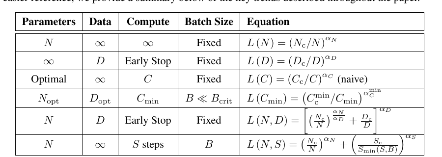

**表 4：** 关键趋势方程。各行分别概括参数受限、数据受限、固定批量计算受限、计算高效、模型与数据联合变化，以及模型与训练步数联合变化时的损失关系。

经验拟合得到的趋势参数如下。

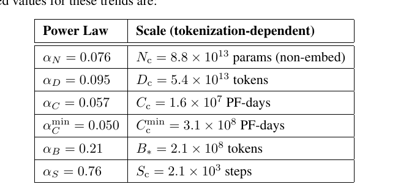

**表 5：** 关键幂律的经验拟合值及其依赖分词方式的尺度参数。

计算高效训练的最优参数如下。

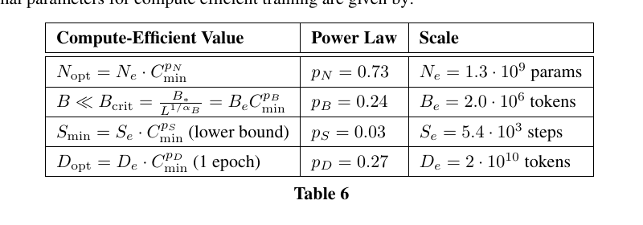

**表 6：** 计算高效训练的模型规模、批量规模、训练步数与数据规模趋势。$S_{\min}$ 为下界，$D_{\text{opt}}$ 按一个训练轮次计算。

## B. 计算高效前沿的经验模型

本附录中的 $C$、$S$ 与 $\alpha_C$ 均已针对在临界批量规模 $B_{\text{crit}}$ 上训练作出校正。为避免记号冗杂，我们省略“已校正”标签。

### B.1 定义方程

学习曲线的幂律拟合为计算高效训练给出了一个简单方案。本附录将推导最优性能、模型规模与训练步数如何随计算预算变化。先从式（1.6）开始，这里为方便再次写出：

$$
L(N,S)=\left(\frac{N_c}{N}\right)^{\alpha_N}+\left(\frac{S_c}{S}\right)^{\alpha_S}. \tag{B.1}
$$

这里的 $S$ 表示在临界批量规模 [MKAT18] 上训练时的参数更新次数；临界批量规模由式（5.2）定义[7](#fn:7)：

$$
B(L)=\frac{B_{\ast}}{L^{1/\alpha_B}}. \tag{B.2}
$$

我们要为固定计算预算确定最优训练参数，因此用 $S=C/[6NB(L)]$ 替换 $S$，其中 $C$ 是本次训练使用的 FLOP 数：

$$
L(N,C)=\left(\frac{N_c}{N}\right)^{\alpha_N}
+\left(6B_{\ast}S_c\frac{N}{L^{1/\alpha_B}C}\right)^{\alpha_S}. \tag{B.3}
$$

令固定 $C$ 时的 $\partial_NL=0$，得到最优条件：

$$
\begin{aligned}
0&=\left.\frac{\partial L}{\partial N}\right|\_C\\
&=-\frac{\alpha_N}{N}\left(\frac{N_c}{N}\right)^{\alpha_N}
+\frac{\alpha_S}{N}\left(6B_{\ast}S_c\frac{N}{L^{1/\alpha_B}C}\right)^{\alpha_S}
\left(1-\frac{N}{\alpha_BL}\left.\frac{\partial L}{\partial N}\right|\_C\right),\\
\Longrightarrow\quad
\frac{\alpha_N}{\alpha_S}\left(\frac{N_c}{N}\right)^{\alpha_N}
&=\left(6B_{\ast}S_c\frac{N}{L^{1/\alpha_B}C}\right)^{\alpha_S}.
\end{aligned} \tag{B.4}
$$

式（B.3）与式（B.4）共同确定计算高效前沿。

### B.2 高效训练

下面汇总式（B.3）与式（B.4）的含义。首先，把式（B.4）代入式（B.3），得到

$$
L(N_{\text{eff}}(C),C)=\left(1+\frac{\alpha_N}{\alpha_S}\right)L(N_{\text{eff}},\infty). \tag{B.5}
$$

这意味着，计算高效训练应在比收敛损失高出固定比例 $\alpha_N/\alpha_S\approx10\%$ 时停止。接下来确定最优损失如何随计算预算变化。消去 $N$，可得性能对计算量的幂律依赖：

$$
L(C)=\left(\frac{C_c}{C}\right)^{\alpha_C}, \tag{B.6}
$$

其中定义

$$
\alpha_C=\frac{1}{1/\alpha_S+1/\alpha_B+1/\alpha_N}\approx0.052, \tag{B.7}
$$

$$
C_c=6N_cB_{\ast}S_c
\left(1+\frac{\alpha_N}{\alpha_S}\right)^{1/\alpha_S+1/\alpha_N}
\left(\frac{\alpha_S}{\alpha_N}\right)^{1/\alpha_S}. \tag{B.8}
$$

类似地，可以消去 $L$，得到 $N(C)$：

$$
\frac{N(C)}{N_c}=\left(\frac{C}{C_c}\right)^{\alpha_C/\alpha_N}
\left(1+\frac{\alpha_N}{\alpha_S}\right)^{1/\alpha_N}, \tag{B.9}
$$

以及

$$
S(C)=\frac{C_c}{6N_cB_{\ast}}
\left(1+\frac{\alpha_N}{\alpha_S}\right)^{-1/\alpha_N}
\left(\frac{C}{C_c}\right)^{\alpha_C/\alpha_S}. \tag{B.10}
$$

### B.3 与低效训练的比较

研究人员通常把模型训练到看似接近收敛。本节把上文的高效训练过程与这种更常见的设置进行比较。定义收敛因子 $f$ 为相对收敛损失的百分比偏差：

$$
L(N,C)=(1+f)L(N,\infty). \tag{B.11}
$$

由上一节可知，计算高效训练的 $f=\alpha_N/\alpha_S\approx10\%$；研究人员一般使用小得多的值。这里取 $f'=2\%$ 作为估计。固定损失值时，我们预测

$$
\frac{N_f}{N_{f'}}=\left(\frac{1+f}{1+f'}\right)^{1/\alpha_N}\approx2.7, \tag{B.12}
$$

$$
\frac{S_f}{S_{f'}}=\left(\frac{1+1/f}{1+1/f'}\right)^{1/\alpha_S}\approx0.13, \tag{B.13}
$$

$$
\frac{C_f}{C_{f'}}=\frac{N_fS_f}{N_{f'}S_{f'}}\approx0.35. \tag{B.14}
$$

因此，要达到相同损失，计算高效训练的参数更新次数少 7.7 倍，参数量多 2.7 倍，计算量少 65%。

### B.4 次优模型规模

解式（A.1），可以求出规模为 $N$ 的模型达到给定损失 $L$ 所需的计算量：

$$
C(N,L)=\left(6B_{\ast}S_c\frac{N}{L^{1/\alpha_B}}\right)
\left[L-\left(\frac{N_c}{N}\right)^{\alpha_N}\right]^{-1/\alpha_S}. \tag{B.15}
$$

利用式（A.6）与式（A.9），可以消去 $L$，改用最高效达到 $L$ 的模型规模 $N_{\text{eff}}(L)$。由此，使用次优模型规模所需的额外计算量为

$$
\frac{C(N,N_{\text{eff}})}{C(N_{\text{eff}},N_{\text{eff}})}
=\frac{N}{N_{\text{eff}}}
\left[1+\frac{\alpha_S}{\alpha_N}
\left(1-\left(\frac{N_{\text{eff}}}{N}\right)^{\alpha_N}\right)\right]^{-1/\alpha_S}. \tag{B.16}
$$

结果见图 X。模型规模为最优值的 0.6 倍至 2.2 倍时，计算预算只需增加 20%。若计入推理成本，使用较小模型会更有利；如果硬件充足，较大模型可以用更少步数训练到同一性能水平，从而提高并行度并加快训练，见图 Y：

$$
\frac{S(N,N_{\text{eff}})}{S(N_{\text{eff}},N_{\text{eff}})}
=\left[1+\frac{\alpha_S}{\alpha_N}
\left(1-\left(\frac{N_{\text{eff}}}{N}\right)^{\alpha_N}\right)\right]^{-1/\alpha_S}. \tag{B.17}
$$

使用大 2.2 倍的模型，需要的步数少 45%，代价是训练计算量增加 20%。对非常大的模型，不应相信该方程，因为它只在学习曲线最初瞬态阶段之后的幂律区域有效。

## C. 注意事项

本节列出分析中若干可能的注意事项。

- 目前，我们对所提任何缩放定律都没有扎实的理论理解。与模型规模和计算量有关的缩放关系尤其难以解释。通过用带噪二次函数建模损失，或许可以理解固定模型规模时极大 $D$ 下的缩放 [AS17]，以及训练后期的学习曲线形状。但在模型极大时，随 $D$ 的缩放仍然难以解释。缺少理论，或缺少对缩放定律修正项的系统理解，就很难判断应在什么条件下信任这些定律。

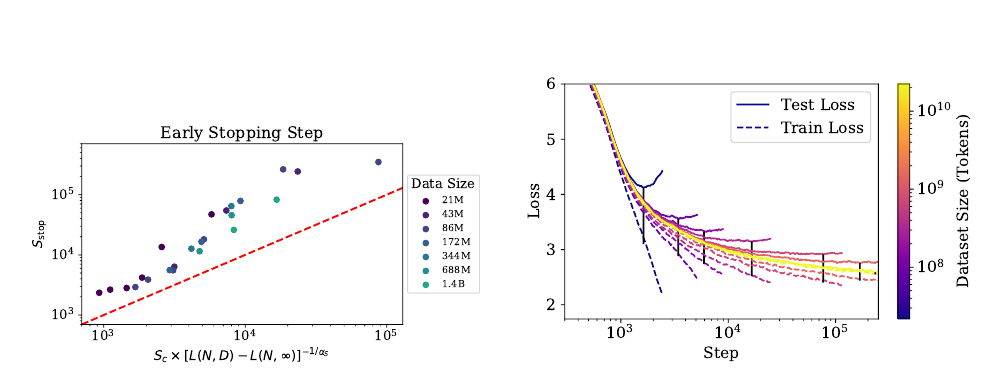

**图 16：** 左：把提前停止发生的步数刻画为过拟合程度的函数。红线表示第 5.3 节推导的提前停止下界。右：一系列 3 亿参数模型在不同规模数据子集上训练时的训练损失与测试损失。测试损失通常会沿着不受数据限制的运行下降，随后开始偏离。需要注意，相比无限数据极限，用 $L_{\text{test}}-L_{\text{train}}$ 衡量会大幅高估过拟合程度；图中每次运行的黑条表示这一差值。

- 对远超已探索损失范围的 $B_{\text{crit}}(L)$ 预测，我们并没有特别强的信心。$B_{\text{crit}}$ 的变化会显著影响数据并行与所需串行训练步数之间的权衡，进而对训练时间产生重大影响。
- 我们没有彻底研究小数据区间；对最小 $D$，即一个训练轮次只有 40 步的情况，$L(N,D)$ 拟合很差。此外，我们没有试验正则化与数据增强。改进这些方法可能在定量甚至定性层面改变结果。
- 我们使用估计训练计算量 $C\approx6NBS$，没有计入与 $n_{\text{ctx}}$ 成比例的部分，见第 2.1 节。因此，在 $n_{\text{ctx}}$ 非常大的区间，特别是 $n_{\text{ctx}}\gtrsim12d_{\text{model}}$ 时，实践中的计算缩放可能受到混杂影响。
- 我们调节了学习率，也试验了学习率日程；但某些对缩放有重要影响的超参数，例如初始化尺度或动量，可能没有得到调节。
- 最优学习率对目标损失敏感。训练接近收敛时，可能必须使用较小学习率来避免发散；执行短训练运行时，例如计算量有限时，则可能使用更大的学习率。对于不训练至收敛的运行，我们没有试验更高的学习率。

## D. 补充图

### D.1 提前停止及测试损失与训练损失

第 5.3 节描述了图 16 的结果，它预测提前停止步数的下界。图中还展示固定模型规模、使用不同规模数据集训练时的训练损失与测试损失。

### D.2 通用 Transformer

图 17 比较标准 Transformer 与循环式 Transformer [DGV+18]。后者重复使用参数，因此按 $N$ 衡量时性能略好，但按计算量 $C$ 衡量时略差。我们纳入了几种不同的参数复用方式。

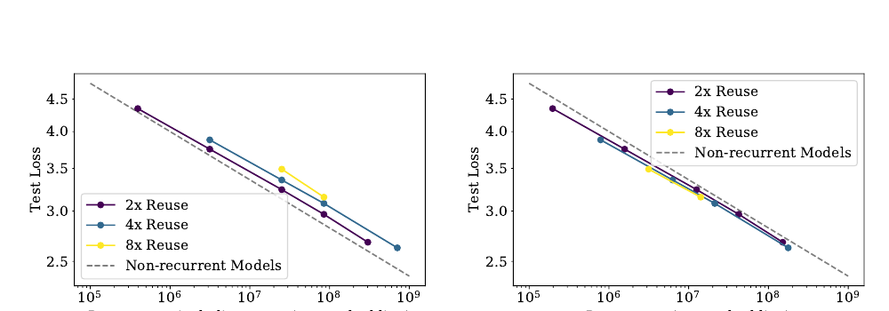

**图 17：** 把重复使用参数的循环式 Transformer [DGV+18] 与标准 Transformer 比较。参数量相同时，循环式 Transformer 的表现略好；如果计入参数复用，并按每 FLOP 比较，则表现略差。

### D.3 批量规模

我们用图 18 所示数据测量临界批量规模，从而能够估计图 10 中的 $B_{\text{crit}}(L)$。

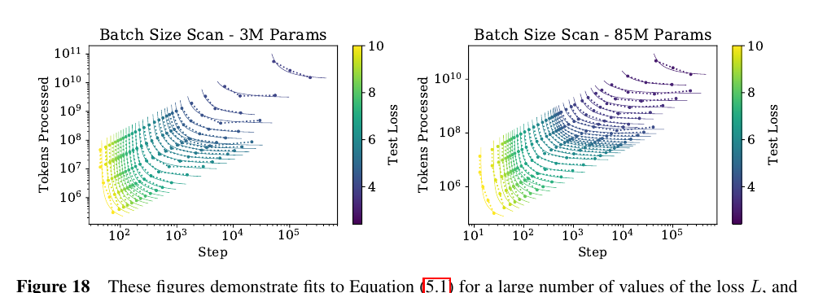

**图 18：** 对两个不同规模的 Transformer 模型，以及大量不同损失 $L$，这些图展示了式（5.1）的拟合。图 10 中的 $B_{\text{crit}}(L)$ 就是由这些拟合测得。

### D.4 样本效率与模型规模

图 2 很容易看出，大模型训练得更快，因此样本效率更高。图 19 从另一角度展示该现象，标出不同模型在何时达到多个固定损失值。

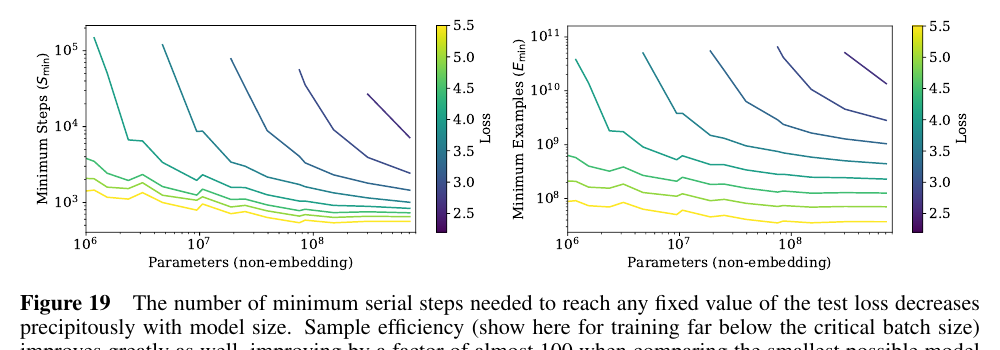

**图 19：** 达到任意固定测试损失所需的最少串行步数会随模型规模急剧下降。样本效率也显著提升；这里展示远低于临界批量规模的训练，把可能的最小模型与很大的模型相比，样本效率提高近 100 倍。

### D.5 上下文依赖

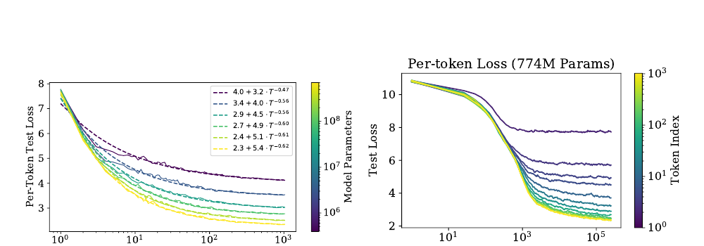

**图 20：** 该图展示逐词元性能如何随模型规模与训练时间变化。左：逐词元损失是其在 1,024 词元上下文中位置 $T$ 的函数，并以可预测方式随 $T$ 呈幂律缩放。右：逐词元测试损失随训练步数的变化。

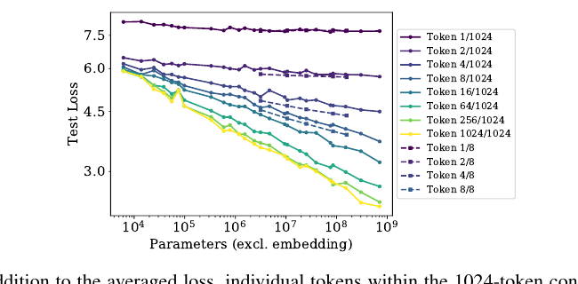

**图 21：** 除平均损失外，1,024 词元上下文中的单个词元也会随模型规模增大而平滑改善。上下文更短、$n_{\text{ctx}}=8$ 的训练运行用虚线表示；因为它们可以把全部容量用于早期词元，所以早期词元表现更好。

图 21 给出了上下文中不同词元位置的损失随模型规模变化的趋势。可以看到，使用 $n_{\text{ctx}}=1024$ 训练的模型，除第一个词元外，所有位置都随模型规模稳定改善。

固定模型规模后，损失似乎会随上下文位置 $T$ 呈幂律缩放，见图 20。这可能源自语言中的底层幂律相关性 [EP94；ACDE12；LT16]，也可能是模型架构与优化更一般的特征。该结果提示了在更长上下文上训练的潜在收益，或收益的缺失。大模型不仅在 $T=1024$ 时收敛到更好性能，在早期词元上改善也更快，说明它们可以用更少上下文信息更高效地识别模式。右图展示固定模型的逐词元性能如何随训练步数变化：模型先学习短程信息，到训练后期才学会更长程相关性。

为了与长上下文模型比较，我们还纳入了在极短上下文 $n_{\text{ctx}}=8$ 上训练的模型。即便规模一般，使用 $n_{\text{ctx}}=8$ 训练的模型在很早的词元上也能超过最大的 $n_{\text{ctx}}=1024$ 模型。这同样说明，在长上下文上训练更大的模型，仍有继续改进的空间。

### D.6 学习率日程与误差分析

我们试验了多种学习率和日程。图 22 给出一个小型语言模型采用多种日程时的测试性能。结论是，只要学习率总和足够大，而且日程包含预热期和最终衰减至接近零的阶段，具体学习率日程基本无关紧要。日程之间的差异似乎只是统计噪声，也粗略反映了不同训练运行之间的波动尺度。对更大模型的实验表明，不同随机种子造成的最终测试损失波动，在不同模型规模上大致具有相同量级。

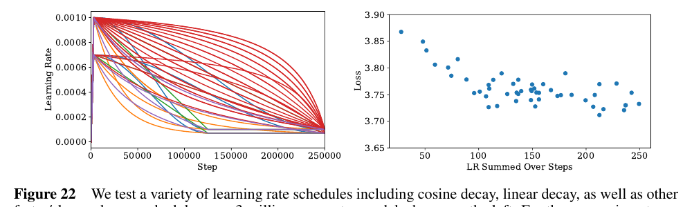

**图 22：** 左图在 300 万参数模型上测试余弦衰减、线性衰减以及其他更快或更慢的学习率日程。这些实验没有把学习率衰减到零，因为那往往会在训练即将结束时带来一个固定增益。只要学习率不过小且衰减不过快，性能便不会强烈依赖学习率。不同运行的损失波动约为 0.05，因此若要验证小于这一水平的性能变化，必须对多次运行取平均。

我们发现，大模型需要较小学习率来防止发散，小模型则能容忍较大学习率。多数运行采用以下经验规则：

$$
\operatorname{LR}(N)\approx0.003239-0.0001395\log(N). \tag{D.1}
$$

该公式仍有改进空间。学习率可能依赖网络宽度，而这种依赖可能由初始化尺度决定；当 $N>10^{10}$ 个参数时，公式也会失效。不过，对本文研究的模型而言，它已经足够有效。

### D.7 拟合细节与幂律质量

我们为 $L(N)$、$L(C)$ 与 $L(D)$ 试验了多种拟合函数形式；从定性上看，幂律拟合远比对数等其他函数准确，见图 23。

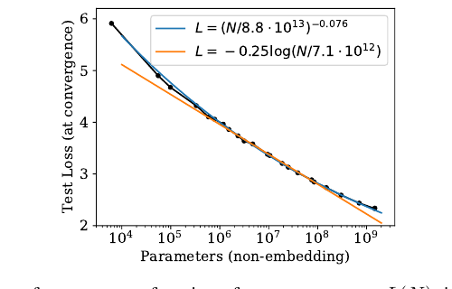

**图 23：** 从定性层面看，以参数量为自变量的性能趋势 $L(N)$ 更适合用幂律拟合，而不是用对数等其他函数拟合。

对 $L(C)$，拟合中不包含只有一层的小模型，因为从一层到两层的转变会在数据中形成明显突起。对 $L(N)$，拟合也不包含只有一层的极小模型，并排除尚未充分训练至收敛的最大模型。即便把它们纳入，拟合参数也只会轻微变化，而且无论是否纳入，趋势在两个方向上都能良好外推。

### D.8 泛化与架构

图 24 表明，在固定总参数量时，对其他数据分布的泛化不依赖网络深度。泛化似乎只取决于训练分布上的性能。

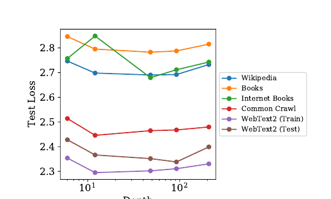

**图 24：** 在一系列数据集上评价约 15 亿参数的模型。深度对泛化没有影响；泛化性能主要取决于训练分布上的性能。12 层模型在互联网图书数据集上过拟合，因此图中给出其提前停止后的性能；其他实验中没有观察到这一意外结果。

### 图目录

1. 简单幂律总结，第 3 页。
2. 样本效率与计算效率示意，第 4 页。
3. 如何扩展模型规模、批量规模与串行步数，第 4 页。
4. 同时改变模型与数据规模，或模型与训练步数时的性能，第 5 页。
5. 性能对超参数调节的弱依赖，第 8 页。
6. 计入或排除嵌入参数时的性能趋势比较，第 8 页。
7. LSTM 与 Transformer 性能比较，第 9 页。
8. 对其他测试数据集的泛化，第 10 页。
9. 过拟合的普适性，第 11 页。
10. 临界批量规模，第 12 页。
11. 性能与计算预算或参数更新次数的关系，第 14 页。
12. 在次优模型上训练，第 15 页。
13. 经验计算趋势与校正后计算趋势的比较，第 15 页。
14. 最优模型规模、串行步数与计算预算的关系，第 16 页。
15. 计算趋势与数据趋势之间的矛盾，第 17 页。
16. 提前停止下界与过拟合模型的训练曲线，第 23 页。
17. 通用 Transformer，第 24 页。
18. 批量规模扫描，第 24 页。
19. 样本效率的另一种观察方式，第 24 页。
20. 性能对上下文位置的幂律依赖，第 25 页。
21. 不同上下文位置的性能与模型规模，第 25 页。
22. 学习率日程扫描，第 26 页。
23. 幂律拟合与对数拟合的比较，第 26 页。
24. 泛化与深度，第 27 页。

### 表目录

1. Transformer 的参数量与计算量，第 7 页。
2. $L(N,D)$ 的拟合，第 11 页。
3. $L(N,S)$ 的拟合，第 14 页。
4. 关键趋势方程，第 20 页。
5. 关键趋势拟合参数，第 20 页。
6. 计算高效训练趋势，第 20 页。

## 参考文献

- **[ACDE12]** Eduardo G. Altmann、Giampaolo Cristadoro、Mirko Degli Esposti。《文本中长程相关性的起源》。《美国国家科学院院刊》，109(29):11582-11587，2012。
- **[AS17]** Madhu S. Advani、Andrew M. Saxe。《神经网络泛化误差的高维动力学》。arXiv:1710.03667，2017。
- **[BB01]** Michele Banko、Eric Brill。《面向自然语言消歧扩展到超大规模语料库》。计算语言学协会第 39 届年会论文集，第 26-33 页，2001。
- **[BHMM18]** Mikhail Belkin、Daniel Hsu、Siyuan Ma、Soumik Mandal。《调和现代机器学习与偏差-方差权衡》。arXiv:1812.11118，2018。
- **[Bia12]** Gérard Biau。《一种随机森林模型的分析》。《机器学习研究期刊》，13:1063-1095，2012。
- **[CGRS19]** Rewon Child、Scott Gray、Alec Radford、Ilya Sutskever。《使用稀疏 Transformer 生成长序列》。arXiv:1904.10509，2019。http://arxiv.org/abs/1904.10509
- **[DCLT18]** Jacob Devlin、Ming-Wei Chang、Kenton Lee、Kristina Toutanova。《BERT：面向语言理解的深度双向 Transformer 预训练》。arXiv:1810.04805，2018。
- **[DGV+18]** Mostafa Dehghani、Stephan Gouws、Oriol Vinyals、Jakob Uszkoreit、Lukasz Kaiser。《通用 Transformer》。arXiv:1807.03819，2018。http://arxiv.org/abs/1807.03819
- **[EP94]** Werner Ebeling、Thorsten Pöschel。《文学英语中的熵与长程相关性》。《欧洲物理学快报》，26(4):241，1994。
- **[Fou]** Common Crawl 基金会。《Common Crawl》。http://commoncrawl.org
- **[GARD18]** Guy Gur-Ari、Daniel A. Roberts、Ethan Dyer。《梯度下降发生在一个极小子空间中》。arXiv:1812.04754，2018。
- **[GJS+19]** Mario Geiger、Arthur Jacot、Stefano Spigler、Franck Gabriel、Levent Sagun、Stéphane d'Ascoli、Giulio Biroli、Clément Hongler、Matthieu Wyart。《深度学习中泛化随参数量变化的缩放描述》。arXiv:1901.01608，2019。
- **[GKX19]** Behrooz Ghorbani、Shankar Krishnan、Ying Xiao。《通过 Hessian 特征值密度研究神经网络优化》。arXiv:1901.10159，2019。http://arxiv.org/abs/1901.10159
- **[Goo01]** Joshua Goodman。《语言建模的一点进展》。arXiv:cs.CL/0108005，2001。http://arxiv.org/abs/cs.CL/0108005
- **[GRK17]** Scott Gray、Alec Radford、Diederik P. Kingma。《面向块稀疏权重的 GPU 核函数》。OpenAI，2017。
- **[HAD19]** Joel Hestness、Newsha Ardalani、Gregory Diamos。《超越人类水平准确率：深度学习中的计算挑战》。第 24 届并行编程原理与实践研讨会论文集，第 1-14 页，2019。doi:10.1145/3293883.3295710
- **[HCC+18]** Yanping Huang、Yonglong Cheng、Dehao Chen、HyoukJoong Lee、Jiquan Ngiam、Quoc V. Le、Zhifeng Chen。《GPipe：利用流水线并行高效训练巨型神经网络》。arXiv:1811.06965，2018。http://arxiv.org/abs/1811.06965
- **[HNA+17]** Joel Hestness、Sharan Narang、Newsha Ardalani、Gregory Diamos、Heewoo Jun、Hassan Kianinejad、Md. Mostofa Ali Patwary、Yang Yang、Yanqi Zhou。《从经验上看，深度学习的缩放是可预测的》。arXiv:1712.00409，2017。
- **[JGH18]** Arthur Jacot、Franck Gabriel、Clément Hongler。《神经切线核：神经网络中的收敛与泛化》。神经信息处理系统进展，第 8571-8580 页，2018。
- **[KB14]** Diederik P. Kingma、Jimmy Ba。《Adam：一种随机优化方法》。arXiv:1412.6980，2014。
- **[Kom19]** Aran Komatsuzaki。《一个训练轮次就足够》。arXiv:1906.06669，2019。
- **[KSH12]** Alex Krizhevsky、Ilya Sutskever、Geoffrey E. Hinton。《使用深度卷积神经网络进行 ImageNet 分类》。第 25 届神经信息处理系统国际会议论文集，第 1 卷，第 1097-1105 页，2012。http://dl.acm.org/citation.cfm?id=2999134.2999257
- **[LCG+19]** Zhenzhong Lan、Mingda Chen、Sebastian Goodman、Kevin Gimpel、Piyush Sharma、Radu Soricut。《ALBERT：用于语言表示自监督学习的轻量 BERT》。arXiv:1909.11942，2019。
- **[LOG+19]** Yinhan Liu、Myle Ott、Naman Goyal、Jingfei Du、Mandar Joshi、Danqi Chen、Omer Levy、Mike Lewis、Luke Zettlemoyer、Veselin Stoyanov。《RoBERTa：经过稳健优化的 BERT 预训练方法》。arXiv:1907.11692，2019。http://arxiv.org/abs/1907.11692
- **[LSP+18]** Peter J. Liu、Mohammad Saleh、Etienne Pot、Ben Goodrich、Ryan Sepassi、Lukasz Kaiser、Noam Shazeer。《通过摘要长序列生成维基百科》。arXiv:1801.10198，2018。http://arxiv.org/abs/1801.10198
- **[LT16]** Henry W. Lin、Max Tegmark。《形式语言与统计物理中的临界性》。arXiv:1606.06737，2016。
- **[LXS+19]** Jaehoon Lee、Lechao Xiao、Samuel S. Schoenholz、Yasaman Bahri、Roman Novak、Jascha Sohl-Dickstein、Jeffrey Pennington。《任意深度的宽神经网络在梯度下降下均如线性模型般演化》。arXiv:1902.06720，2019。
- **[MKAT18]** Sam McCandlish、Jared Kaplan、Dario Amodei、OpenAI Dota 团队。《大批量训练的经验模型》。arXiv:1812.06162，2018。
- **[Pap18]** Vardan Papyan。《大规模深度网络 Hessian 的完整谱：随样本规模变化的动力学》。arXiv:1811.07062，2018。http://arxiv.org/abs/1811.07062
- **[RNSS18]** Alec Radford、Karthik Narasimhan、Tim Salimans、Ilya Sutskever。《通过生成式预训练改进语言理解》。OpenAI，2018。https://s3-us-west-2.amazonaws.com/openai-assets/research-covers/language-unsupervised/language_understanding_paper.pdf
- **[RRBS19a]** Jonathan S. Rosenfeld、Amir Rosenfeld、Yonatan Belinkov、Nir Shavit。《跨尺度泛化误差的构造性预测》。arXiv:1909.12673，2019。
- **[RRBS19b]** Jonathan S. Rosenfeld、Amir Rosenfeld、Yonatan Belinkov、Nir Shavit。《跨尺度泛化误差的构造性预测》。arXiv:1909.12673，2019。
- **[RSR+19]** Colin Raffel、Noam Shazeer、Adam Roberts、Katherine Lee、Sharan Narang、Michael Matena、Yanqi Zhou、Wei Li、Peter J. Liu。《使用统一文本到文本 Transformer 探索迁移学习的极限》。arXiv:1910.10683，2019。
- **[RWC+19]** Alec Radford、Jeff Wu、Rewon Child、David Luan、Dario Amodei、Ilya Sutskever。《语言模型是无监督多任务学习器》。OpenAI，2019。
- **[SCP+18]** Noam Shazeer、Youlong Cheng、Niki Parmar、Dustin Tran、Ashish Vaswani、Penporn Koanantakool、Peter Hawkins、HyoukJoong Lee、Mingsheng Hong、Cliff Young、Ryan Sepassi、Blake Hechtman。《Mesh-TensorFlow：面向超级计算机的深度学习》。arXiv:1811.02084，2018。
- **[SHB15]** Rico Sennrich、Barry Haddow、Alexandra Birch。《使用子词单元进行罕见词神经机器翻译》。arXiv:1508.07909，2015。
- **[SLA+18]** Christopher J. Shallue、Jaehoon Lee、Joe Antognini、Jascha Sohl-Dickstein、Roy Frostig、George E. Dahl。《测量数据并行对神经网络训练的影响》。arXiv:1811.03600，2018。
- **[SS18]** Noam Shazeer、Mitchell Stern。《Adafactor：采用次线性内存成本的自适应学习率》。arXiv:1804.04235，2018。http://arxiv.org/abs/1804.04235
- **[THK18]** Stefan Thurner、Rudolf Hanel、Peter Klimek。《复杂系统理论导论》。牛津大学出版社，2018。
- **[TL19]** Mingxing Tan、Quoc V. Le。《EfficientNet：重新思考卷积神经网络的模型缩放》。arXiv:1905.11946，2019。http://arxiv.org/abs/1905.11946
- **[VSP+17]** Ashish Vaswani、Noam Shazeer、Niki Parmar、Jakob Uszkoreit、Llion Jones、Aidan N. Gomez、Łukasz Kaiser、Illia Polosukhin。《注意力机制就是一切》。神经信息处理系统进展 30，第 5998-6008 页，2017。http://papers.nips.cc/paper/7181-attention-is-all-you-need.pdf
- **[VWB16]** Andreas Veit、Michael Wilber、Serge Belongie。《残差网络的行为类似较浅网络的集成》。arXiv:1605.06431，2016。
- **[Was06]** Larry Wasserman。《非参数统计大全》。施普林格科学与商业媒体，2006。
- **[WPN+19]** Alex Wang、Yada Pruksachatkun、Nikita Nangia、Amanpreet Singh、Julian Michael、Felix Hill、Omer Levy、Samuel R. Bowman。《SuperGLUE：更具挑战性的通用语言理解基准》。arXiv:1905.00537，2019。
- **[WRH17]** Yu-Xiong Wang、Deva Ramanan、Martial Hebert。《让大脑成长：通过增加模型容量进行微调》。2017 年 IEEE 计算机视觉与模式识别会议，2017。doi:10.1109/cvpr.2017.323
- **[WYL19]** Wei Wen、Feng Yan、Hai Li。《AutoGrow：深度卷积网络的自动增层》。arXiv:1906.02909，2019。
- **[YDY+19]** Zhilin Yang、Zihang Dai、Yiming Yang、Jaime Carbonell、Ruslan Salakhutdinov、Quoc V. Le。《XLNet：面向语言理解的广义自回归预训练》。arXiv:1906.08237，2019。
- **[ZK16]** Sergey Zagoruyko、Nikos Komodakis。《宽残差网络》。英国机器视觉会议论文集，2016。doi:10.5244/c.30.87
- **[ZKZ+15]** Yukun Zhu、Ryan Kiros、Rich Zemel、Ruslan Salakhutdinov、Raquel Urtasun、Antonio Torralba、Sanja Fidler。《对齐图书与电影：通过观看电影和阅读图书生成故事式视觉解释》。2015 年 IEEE 国际计算机视觉会议，2015。doi:10.1109/iccv.2015.11
- **[ZLN+19]** Guodong Zhang、Lala Li、Zachary Nado、James Martens、Sushant Sachdeva、George E. Dahl、Christopher J. Shallue、Roger B. Grosse。《哪些算法选择在何种批量规模下至关重要？来自带噪二次模型的见解》。arXiv:1907.04164，2019。http://arxiv.org/abs/1907.04164

---

1. 此处展示的是批量规模足够小时的预测计算量。纯经验数据的比较见图 13。 [↩](#fnref:1)
2. 例如，可以采用 $L(N,D)=\left[(N_c/N)^{\alpha_N}+(D_c/D)^{\alpha_D}\right]^\beta$，但它不能按 $1/D$ 展开。 [↩](#fnref:2)
3. 尽管临界批量规模与梯度噪声尺度大致吻合，但后续所有分析都使用图 18 与图 10 对 $B_{\text{crit}}$ 的直接测量结果。 [↩](#fnref:3)
4. 可能有人会问，为何不从一开始就在 $B_{\text{crit}}$ 上训练。原因是它不仅取决于模型，还取决于希望达到的目标损失，因此是一个不断移动的目标。 [↩](#fnref:4)
5. 按 `wc` 工具定义单词时，WebText2 平均每词 1.4 个词元，每词元 4.3 个字符。 [↩](#fnref:5)
6. 本文完成之后，[RRBS19a] 也发表了类似结论，对损失如何依赖模型规模与数据集规模作出相似预测。 [↩](#fnref:6)
7. 此处存在一个细微歧义：可以在恒定批量规模 $B(L_{\text{target}})$ 上训练，也可以在可变批量规模 $\widetilde B(L)$ 上训练；其中 $\widetilde B$ 是瞬时临界批量规模，而 $B$ 是平均版本。两种方案产生相同的训练步数，所以可以忽略这一区别，见 [MKAT18]。 [↩](#fnref:7)
