# 语言模型是少样本学习器

**作者：** Tom B. Brown、Benjamin Mann、Nick Ryder、Melanie Subbiah、Jared Kaplan、Prafulla Dhariwal、Arvind Neelakantan、Pranav Shyam、Girish Sastry、Amanda Askell、Sandhini Agarwal、Ariel Herbert-Voss、Gretchen Krueger、Tom Henighan、Rewon Child、Aditya Ramesh、Daniel M. Ziegler、Jeffrey Wu、Clemens Winter、Christopher Hesse、Mark Chen、Eric Sigler、Mateusz Litwin、Scott Gray、Benjamin Chess、Jack Clark、Christopher Berner、Sam McCandlish、Alec Radford、Ilya Sutskever、Dario Amodei
**机构：** OpenAI
**预印本：** arXiv:2005.14165v4（2020 年 7 月 22 日）

* 贡献相同。
† 约翰斯·霍普金斯大学、OpenAI。

作者贡献见文末。

## 摘要

近期工作表明，先在大规模文本语料库上进行预训练，再针对具体任务微调，能够在许多自然语言处理任务和基准上取得巨大收益。这种方法的架构通常与任务无关，但它仍需要包含数千乃至数万个样例的任务专用微调数据集。相比之下，人类通常只需看到少数几个样例，或收到简单指令，就能执行一项新的语言任务，而当前的自然语言处理系统对此仍普遍感到困难。本文表明，扩大语言模型能够大幅改善与任务无关的少样本性能，有时甚至能够与先前最先进的微调方法相竞争。具体而言，我们训练了 GPT-3，这是一个拥有 1750 亿参数的自回归语言模型，其参数量是以往任何非稀疏语言模型的 10 倍；然后，我们在少样本设置下测试了它的性能。在所有任务上，GPT-3 都不进行任何梯度更新或微调，任务及少样本演示纯粹通过与模型的文本交互指定。GPT-3 在许多自然语言处理数据集上取得了强劲表现，包括翻译、问答和完形填空任务，也包括若干需要即时推理或领域适应的任务，例如重排乱序单词、在句子中使用一个新造词，或执行三位数算术。与此同时，我们也找到了一些 GPT-3 的少样本学习仍然吃力的数据集，以及一些会使 GPT-3 面临与大规模网络语料库训练相关的方法学问题的数据集。最后，我们发现 GPT-3 可以生成令人类评估者难以与人类撰写文章区分开的新闻文章样例。我们讨论了这一发现以及 GPT-3 总体上可能造成的更广泛社会影响。

## 1. 引言

近年来，自然语言处理系统越来越倾向于使用预训练语言表征，并以日益灵活、日益与任务无关的方式将它们迁移到下游任务。最初，人们使用词向量学习单层表征 [MCCD13；PSM14]，再将它们输入任务专用架构；之后，人们使用拥有多层表征与上下文状态的循环神经网络，形成更强的表征 [DL15；MBXS17；PNZtY18]（虽然仍然把它们用于任务专用架构）；更近以来，预训练循环语言模型或 Transformer 语言模型 [VSP+17] 被直接微调，从而完全消除了对任务专用架构的需求 [RNSS18；DCLT18；HR18]。

最后一种范式已在阅读理解、问答、文本蕴含以及其他许多困难的自然语言处理任务上带来了巨大进步，而新架构和新算法又在持续推动它向前发展 [RSR+19；LOG+19；YDY+19；LCG+19]。然而，这种方法有一个主要局限：虽然架构与任务无关，但仍需要任务专用数据集和任务专用微调；要在某项期望任务上取得强劲性能，通常需要在特别针对该任务、包含数千至数十万个样例的数据集上微调。由于以下几点原因，消除这一局限是值得追求的。

首先，从实际角度看，每项新任务都需要大量标注样例组成的数据集，这限制了语言模型的适用范围。可能有用的语言任务种类极其繁多，从纠正语法，到生成某个抽象概念的实例，再到评析一篇短篇小说，无所不包。对其中许多任务而言，收集一个大规模监督训练数据集十分困难，尤其是当每遇到一项新任务都必须重复这一过程时。

其次，随着模型表达能力增强、训练分布收窄，模型利用训练数据中虚假相关性的潜力会从根本上增大。这会给“预训练加微调”范式造成问题：模型被设计得很大，以便在预训练期间吸收信息，却又在范围极窄的任务分布上微调。例如，[HLW+20] 观察到，较大的模型并不一定能更好地泛化到分布之外。有证据表明，在这种范式下获得的泛化性能可能很差，因为模型过度针对训练分布，无法很好地泛化到该分布之外 [YdC+19；MPL19]。因此，微调模型在特定基准上的表现，即使名义上达到人类水平，也可能夸大它在底层任务上的实际性能 [GSL+18；NK19]。

第三，人类学习绝大多数语言任务并不需要大规模监督数据集；简短的自然语言指示（例如“请告诉我，这句话描述的是开心的事还是伤心的事”），或者至多极少数演示（例如“这里有两个人们表现得勇敢的例子；请再给出第三个勇敢行为的例子”），往往就足以使人类以至少合理熟练的程度执行一项新任务。这种适应性不仅暴露出我们当前自然语言处理技术在概念上的局限，还具有实际优势：它使人类能够无缝地混合多项任务与技能，或在它们之间切换，例如在一段漫长对话的中途执行加法。要想获得广泛用途，我们希望有一天，自然语言处理系统也能拥有同样的灵活性和通用性。

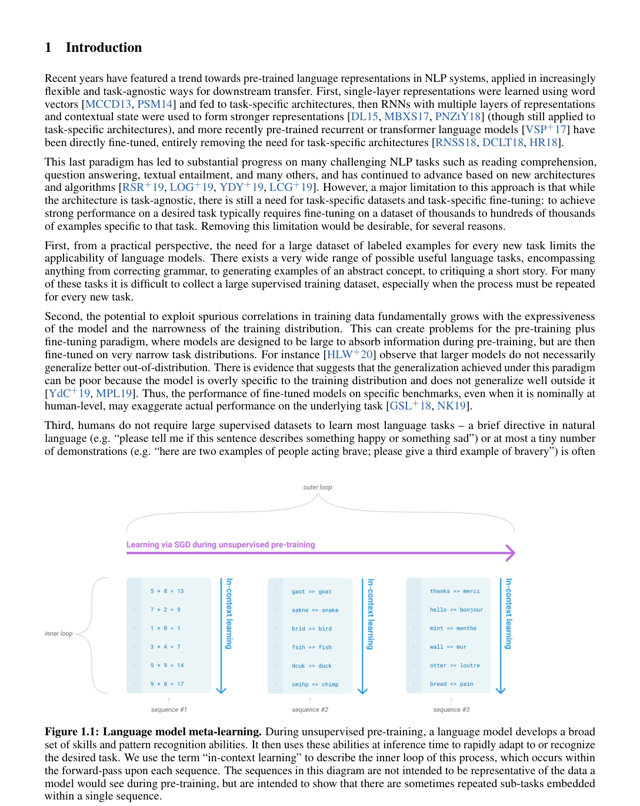

**图 1.1：** 语言模型的元学习。在无监督预训练期间，语言模型会发展出一组广泛的技能和模式识别能力。随后，它在推理时使用这些能力，迅速适应或识别期望任务。我们使用“上下文内学习”一词来描述这一过程的内循环；它发生在每个序列的前向传播之内。图中的序列并非要代表模型预训练时实际见到的数据，而是要说明，单个序列之内有时会嵌入反复出现的子任务。

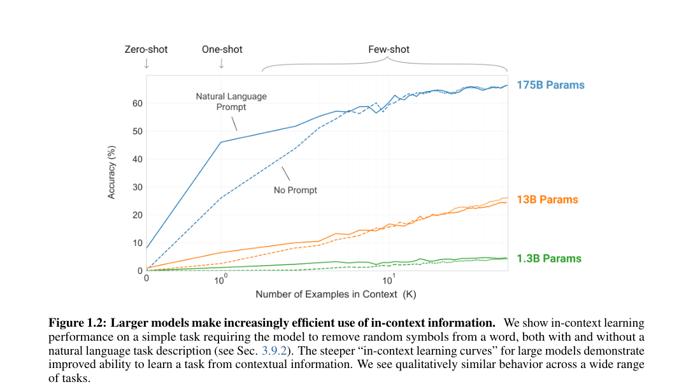

**图 1.2：** 更大模型能够越来越高效地利用上下文信息。我们展示了一项简单任务的上下文内学习性能：模型需要从一个单词中删除随机符号，实验分别在有和没有自然语言任务描述的情况下进行（见第 3.9.2 节）。大模型的“上下文内学习曲线”更陡，表明它们通过上下文信息学习任务的能力得到改善。我们在各种任务上都观察到定性相似的行为。

解决这些问题的一条潜在路径是元学习[1](#fn:1)。在语言模型的语境中，这意味着模型在训练时发展出一组广泛的技能和模式识别能力，再在推理时使用这些能力，迅速适应或识别期望任务（如图 1.1 所示）。近期工作 [RWC+19] 尝试通过我们所谓的“上下文内学习”实现这一点：它把预训练语言模型的文本输入用作一种任务规约形式；模型以一条自然语言指令和/或少量任务演示为条件，然后仅通过预测下一段内容，就应当能够完成该任务的后续实例。

尽管这一方法已经展现一些初步潜力，但它的结果仍远逊于微调。例如，[RWC+19] 在自然问题数据集上只取得 4% 的表现；甚至它在 CoQA 上的 55 F1 成绩，现在也已落后最先进水平 35 分以上。元学习显然需要大幅改善，才能成为解决语言任务的实用方法。

语言建模领域的另一项近期趋势可能指明前进方向。近年来，Transformer 语言模型的容量大幅增长，从 1 亿参数 [RNSS18]，到 3 亿参数 [DCLT18]，到 15 亿参数 [RWC+19]，再到 80 亿参数 [SPP+19]、110 亿参数 [RSR+19]，最终达到 170 亿参数 [Tur20]。每一次扩容都改善了文本合成和/或下游自然语言处理任务；还有证据表明，与许多下游任务高度相关的对数损失，会随规模扩大呈现平滑改善趋势 [KMH+20]。由于上下文内学习需要把许多技能与任务吸收到模型参数中，上下文内学习能力也有可能随规模扩大而获得同样强劲的收益。

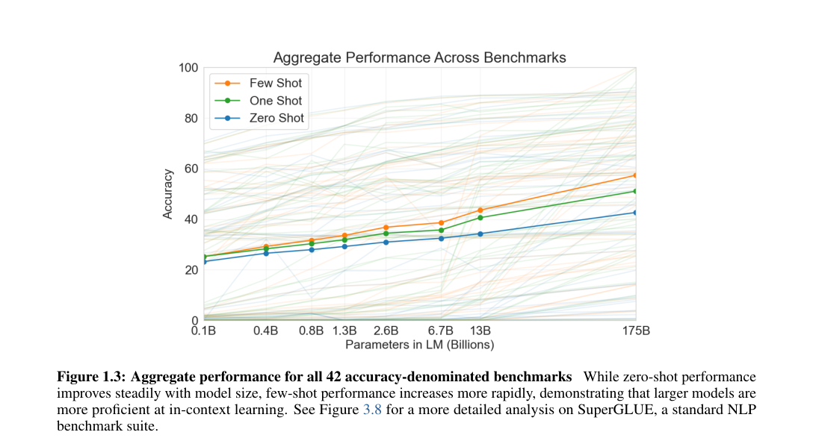

**图 1.3：** 42 项以准确率表示的基准的汇总性能。零样本性能随模型规模稳定提升，但少样本性能提升得更快，这表明更大模型更善于上下文内学习。对标准自然语言处理基准套件 SuperGLUE 的更详细分析见图 3.8。

在本文中，我们通过训练一个拥有 1750 亿参数的自回归语言模型来检验这一假设；我们将该模型称为 GPT-3，并测量其上下文内学习能力。具体而言，我们在二十多个自然语言处理数据集上评估 GPT-3，同时也使用了若干专门设计的新任务，以测试模型快速适应那些不太可能直接存在于训练集中的任务的能力。对每项任务，我们都在三种条件下评估 GPT-3：（a）“少样本学习”，即在上下文内学习时，允许放入模型上下文窗口所能容纳的尽可能多的演示（通常为 10 至 100 个）；（b）“单样本学习”，只允许一个演示；（c）“零样本学习”，不允许任何演示，只向模型提供一条自然语言指令。原则上，GPT-3 也可以在传统微调设置下进行评估，但我们将这留待未来工作。

图 1.2 说明了我们研究的条件，并展示了一项简单任务的少样本学习：模型需要从单词中删除无关符号。加入自然语言任务描述会改善模型性能，增加模型上下文中的样例数 $K$ 也会改善性能。少样本学习性能还会随模型规模增大而大幅提升。尽管这个例子中的结果尤为显著，但对我们研究的大多数任务而言，模型规模和上下文样例数都呈现同样的总体趋势。我们强调，这些“学习”曲线不涉及任何梯度更新或微调，只是增加作为条件提供的演示数量。

总体而言，在自然语言处理任务上，GPT-3 在零样本和单样本设置中取得了颇具希望的结果；在少样本设置中，它有时可与最先进水平竞争，甚至偶尔能超过最先进水平（尽管这些最先进结果是由微调模型保持的）。例如，GPT-3 在 CoQA 上的 F1 分数，零样本设置为 81.5，单样本设置为 84.0，少样本设置则为 85.0。同样，GPT-3 在 TriviaQA 上的准确率，零样本设置为 64.3%，单样本设置为 68.0%，少样本设置为 71.2%；最后一项结果在使用相同闭卷设置的微调模型中达到了最先进水平。

GPT-3 还在专为检验快速适应或即时推理而设计的任务上表现出单样本和少样本能力，其中包括重排乱序单词、执行算术运算，以及在只见到一次定义后就在句子中使用新造词。我们还表明，在少样本设置中，GPT-3 可以生成令人类评估者难以与人类生成文章区分的合成新闻。

与此同时，我们也发现，即使在 GPT-3 的规模上，少样本性能仍在某些任务上陷入困境。这包括 ANLI 数据集之类的自然语言推断任务，也包括 RACE 或 QuAC 之类的某些阅读理解数据集。我们希望，通过广泛刻画 GPT-3 的优势与弱点（包括这些局限），可以促进语言模型少样本学习的研究，并让人们关注哪些地方最需要进步。各项整体结果可以通过图 1.3 获得启发式的总体感受；该图聚合了各种任务，但它本身不应被视为一个严格或有实质意义的基准。

我们还对“数据污染”展开了系统研究。在 Common Crawl 之类的数据集上训练高容量模型时，这是一个日益严重的问题：测试数据集的内容往往存在于网络上，因此 Common Crawl 很可能会收录它们。在本文中，我们开发了系统化工具，用于测量数据污染并量化它对结果的扭曲影响。尽管我们发现，在大多数数据集上，数据污染对 GPT-3 性能的影响很小，但我们确实找到了少数可能因污染而高估结果的数据集；根据严重程度，我们要么不报告这些数据集上的结果，要么用星号加以标注。

除上述所有内容之外，我们还训练了一系列较小的模型（参数量从 1.25 亿到 130 亿不等），以便将它们在零样本、单样本和少样本设置中的表现与 GPT-3 比较。总体而言，对大多数任务，我们发现三种设置下的性能都随模型容量增大而相对平滑地提升。一个值得注意的模式是，零样本、单样本与少样本性能之间的差距往往会随模型容量增大，这或许表明更大模型是更熟练的元学习器。

最后，鉴于 GPT-3 展现出广泛能力，我们讨论了与偏差、公平性以及更广泛社会影响有关的担忧，并尝试对 GPT-3 在这方面的特征作出初步分析。

本文其余内容的组织如下。第 2 节介绍训练和评估 GPT-3 的方法。第 3 节给出零样本、单样本和少样本设置下全部任务的结果。第 4 节讨论数据污染（训练集与测试集重叠）问题。第 5 节讨论 GPT-3 的局限。第 6 节讨论更广泛的影响。第 7 节回顾相关工作，第 8 节给出结论。

## 2. 方法

我们的基本预训练方法，包括模型、数据和训练过程，均与 [RWC+19] 所述过程相似，只是相对直接地扩大了模型规模、数据集规模与多样性，以及训练时长。我们对上下文内学习的使用方式也与 [RWC+19] 相似，但在本项工作中，我们系统研究了在上下文中学习的不同设置。因此，本节首先明确定义并比较将用来评估 GPT-3 的各种设置，以及原则上可用来评估 GPT-3 的设置。可以把这些设置看作位于一条连续谱上，它们通常依赖的任务专用数据量各不相同。具体而言，我们至少可以在这条连续谱上识别出四个点（见图 2.1）：

- **微调（FT）** 是近年来最常用的方法，它通过在期望任务专用监督数据集上训练预训练模型，更新模型权重。通常会使用数千至数十万个已标注样例。微调的主要优点是在许多基准上表现强劲。它的主要缺点是：每项任务都需要一个新的大型数据集，可能无法良好地泛化到分布之外 [MPL19]，还可能利用训练数据的虚假特征 [GSL+18；NK19]，最终导致与人类性能的比较并不公平。本项工作不微调 GPT-3，因为我们关注的是与任务无关的性能；但原则上 GPT-3 可以微调，这是未来工作一个很有希望的方向。
- **少样本（FS）** 是本文用来指以下设置的术语：在推理时，向模型提供少量任务演示作为条件 [RWC+19]，但不允许更新权重。如图 2.1 所示，对于一个典型数据集，每个样例包含一段上下文和一个期望的补全（例如一个英语句子及其法语译文）；少样本学习先提供 $K$ 个包含上下文和补全的样例，再提供最后一个仅有上下文的样例，并要求模型给出补全。我们通常把 $K$ 设在 10 到 100 之间，因为模型的上下文窗口（$n_{\text{ctx}}=2048$）大约能容纳这么多个样例。少样本学习的主要优点是大幅降低对任务专用数据的需求，并降低从规模很大但范围狭窄的微调数据集中学到过窄分布的可能性。它的主要缺点是，截至目前，这种方法的结果远逊于最先进的微调模型；而且仍需要少量任务专用数据。顾名思义，这里为语言模型描述的少样本学习，与机器学习其他语境中的少样本学习有关 [HYC01；VBL+16]：两者都包含在一个广泛的任务分布上学习（本文的任务分布隐含于预训练数据中），然后迅速适应一项新任务。
- **单样本（1S）** 与少样本相同，只是除自然语言任务描述之外，只允许提供一个演示，如图 2.1 所示。之所以要将单样本与少样本、零样本（见下文）区分开，是因为它最接近人们向人类传达某些任务的方式。例如，当人们通过人工劳务平台（如 Mechanical Turk）请求人类生成数据集时，通常会提供一个任务演示。相反，如果不给出任何样例，任务的内容或格式有时很难传达。

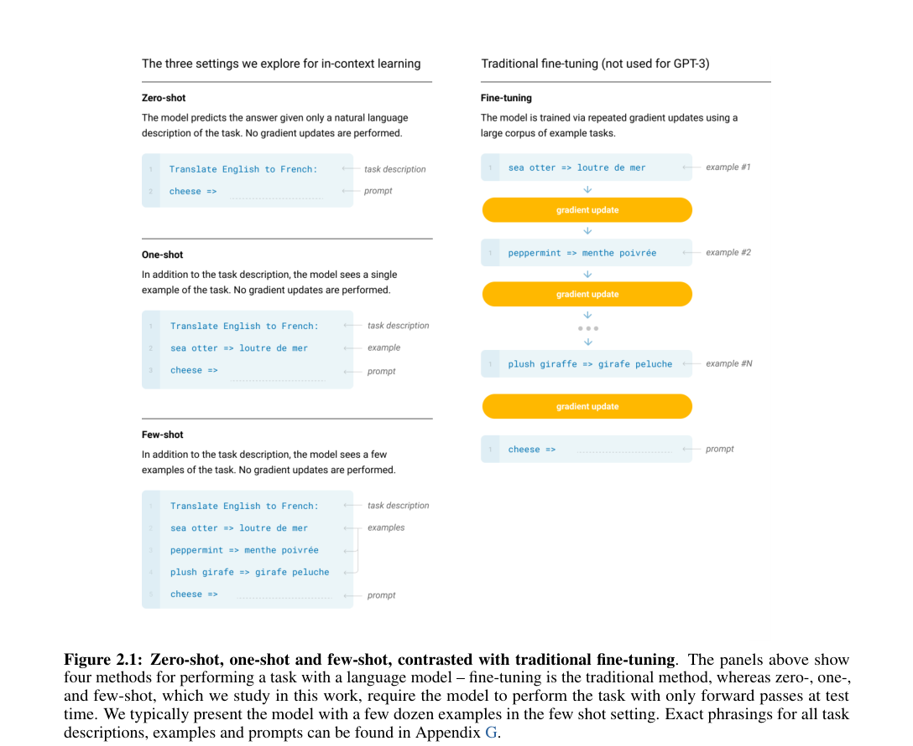

**图 2.1：** 零样本、单样本和少样本与传统微调的对比。上方各面板展示了使用语言模型执行任务的四种方法。微调是传统方法；而本文研究的零样本、单样本和少样本方法，要求模型在测试时只通过前向传播完成任务。在少样本设置中，我们通常向模型呈现数十个样例。所有任务描述、样例和提示的准确措辞见附录 G。

- **零样本（0S）** 与单样本相同，但不允许提供任何演示；模型只会得到一条描述任务的自然语言指令。这种方法提供了最大限度的便利性、潜在的稳健性，并能避免虚假相关性（除非它们极为广泛地出现在大规模预训练语料库中），但它也是最具挑战性的设置。在某些情况下，如果没有先前的样例，甚至人类也很难理解任务格式，因此这种设置有时“不公平地困难”。例如，如果要求某人“制作一张 200 米短跑世界纪录表”，这个请求可能存在歧义，因为他可能不清楚该表究竟应使用什么格式，又应包含什么内容（即使经过仔细澄清，要精确理解所需内容也可能很困难）。但是，至少对某些设置而言，零样本最接近人类执行任务的方式。例如，在图 2.1 的翻译例子中，人类很可能只根据文本指令就知道该怎么做。

图 2.1 以英译法任务为例展示了这四种方法。本文关注零样本、单样本和少样本设置；我们并非把它们当作竞争性的替代方案来比较，而是把它们视为不同的问题设置，各自在特定基准性能与样本效率之间提供不同的权衡。我们尤其强调少样本结果，因为其中许多结果只略微落后于最先进的微调模型。不过，归根结底，单样本、有时甚至零样本，似乎才是与人类性能最公平的比较，也是未来工作的重要目标。

第 2.1 至 2.3 节分别详述我们的模型、训练数据和训练过程。第 2.4 节讨论我们实施少样本、单样本和零样本评估的细节。

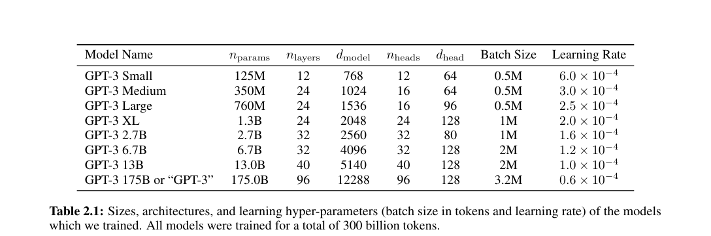

**表 2.1：** 我们训练的各个模型的规模、架构与学习超参数（批量大小以词元计）。所有模型总共都在 3000 亿个词元上进行了训练。

### 2.1 模型与架构

我们采用与 GPT-2 [RWC+19] 相同的模型和架构，包括其中所述的修改后初始化、预归一化与可逆分词。唯一例外是，我们在 Transformer 各层中交替使用稠密注意力和局部带状稀疏注意力模式，这与稀疏 Transformer [CGRS19] 类似。为研究机器学习性能对模型规模的依赖关系，我们训练了 8 种不同规模的模型，从 1.25 亿参数到 1750 亿参数，横跨三个数量级；最后一个就是我们所谓的 GPT-3。先前工作 [KMH+20] 表明，在训练数据充足时，验证损失应会随规模扩大而大致呈现一条平滑的幂律；训练多种不同规模的模型，使我们能够同时就验证损失和下游语言任务检验这一假设。

表 2.1 展示 8 个模型的规模与架构。其中，$n_{\text{params}}$ 是可训练参数总数，$n_{\text{layers}}$ 是总层数，$d_{\text{model}}$ 是每个瓶颈层中的单元数（前馈层的大小始终是瓶颈层的四倍，即 $d_{\text{ff}}=4d_{\text{model}}$），$d_{\text{head}}$ 是每个注意力头的维度。所有模型都使用 $n_{\text{ctx}}=2048$ 个词元的上下文窗口。为尽可能减少节点间的数据传输，我们沿深度和宽度两个维度将模型分区到多块 GPU 上。每个模型的精确架构参数，是根据计算效率以及模型跨 GPU 布局时的负载均衡情况选定的。先前工作 [KMH+20] 表明，在一个合理的广泛范围内，验证损失对这些参数并不十分敏感。

### 2.2 训练数据集

语言模型数据集迅速扩大，最终发展到 Common Crawl 数据集[2](#fn:2) [RSR+19] 所包含的近万亿个单词。如此规模的数据集足以训练我们最大的模型，而无须对同一序列进行两次更新。不过，我们发现，未过滤或只轻度过滤的 Common Crawl 版本，质量往往低于经过更精心策展的数据集。因此，我们采取了三项措施来改善数据集的平均质量：（1）下载一份 Common Crawl，根据它与多种高质量参考语料库的相似性进行过滤；（2）在单个数据集内部及不同数据集之间，以文档为单位执行模糊去重，从而避免冗余，并保护留出验证集作为过拟合准确测量指标的完整性；（3）将已知高质量参考语料库加入训练混合数据，以补充 Common Crawl 并增强数据多样性。

前两项（Common Crawl 处理）的细节见附录 A。对于第三项，我们添加了多个经过策展的高质量数据集，其中包括 WebText 数据集 [RWC+19] 的扩展版本，该版本通过在更长时段内抓取链接而收集，最早在 [KMH+20] 中描述；两个基于互联网的图书语料库（Books1 和 Books2）；以及英文维基百科。

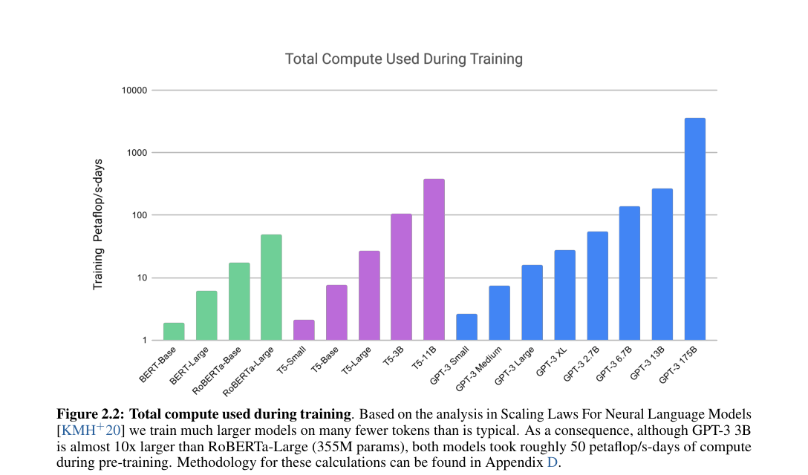

**图 2.2：** 训练期间使用的总计算量。根据《神经语言模型的缩放定律》[KMH+20] 的分析，我们在比通常少得多的词元上训练大得多的模型。因此，虽然 GPT-3 3B 的规模几乎是 RoBERTa-Large（3.55 亿参数）的 10 倍，但两个模型预训练时都大约使用了 50 PF-days 的计算量。这些计算的方法见附录 D。

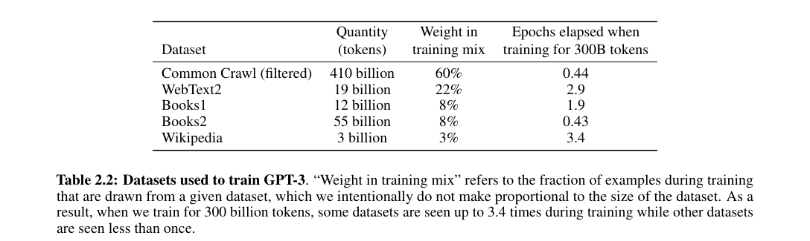

**表 2.2：** 用于训练 GPT-3 的数据集。“训练混合中的权重”是指训练时从某一数据集抽取的样例占比；我们有意不让它与数据集规模成比例。因此，在 3000 亿个词元上训练时，有些数据集会被遍历多达 3.4 次，而另一些数据集的遍历次数不到一次。

表 2.2 展示我们训练时使用的最终数据混合方案。Common Crawl 数据来自 2016 至 2019 年的 41 个按月分片；过滤前共有 45 TB 压缩纯文本，过滤后为 570 GB，大约相当于 4000 亿个字节对编码词元。请注意，训练时并不按数据集规模成比例采样，而是更频繁地采样我们认为质量更高的数据集。因此，Common Crawl 和 Books2 数据集在训练中的遍历次数不到一次，而其他数据集则被遍历 2 至 3 次。这实质上是接受少量过拟合，以换取更高质量的训练数据。

对于在广泛互联网数据上预训练的语言模型，尤其是有能力记住大量内容的大型模型，一个重大的方法学问题是：下游任务的测试集或开发集可能在预训练期间被模型意外见到，从而污染下游任务。为减少这种污染，我们搜索了本文研究的所有基准，并尝试删除与其开发集及测试集重叠的任何内容。不幸的是，过滤程序中的一个错误使我们忽略了部分重叠；而由于训练成本高昂，重新训练模型并不可行。在第 4 节中，我们将刻画剩余重叠所造成的影响；在未来工作中，我们会更严格地清除数据污染。

### 2.3 训练过程

如 [KMH+20；MKAT18] 所发现，较大模型通常能使用较大批量，但需要较小学习率。我们在训练期间测量梯度噪声尺度，并据此指导批量大小的选择 [MKAT18]。表 2.1 展示了我们使用的参数设置。为训练较大模型而不耗尽内存，我们混合使用了每次矩阵乘法内部的模型并行，以及跨网络层的模型并行。所有模型都在由微软提供的一个高带宽集群的部分 V100 GPU 上训练。训练过程和超参数设置的详细信息见附录 B。

### 2.4 评估

对于少样本学习，我们评估评估集中的每个样例时，会从该任务的训练集中随机抽取 $K$ 个样例作为条件，根据任务的不同，用一个或两个换行符将它们隔开。LAMBADA 和 StoryCloze 没有可用的监督训练集，因此我们从开发集中抽取条件样例，并在测试集上评估。对于 Winograd（原始版，而非 SuperGLUE 版），只有一个数据集，因此我们直接从该数据集中抽取条件样例。

$K$ 可以是从 0 到模型上下文窗口所允许的最大值之间的任意数值。所有模型的上下文窗口均为 $n_{\text{ctx}}=2048$，通常可容纳 10 至 100 个样例。较大的 $K$ 值通常会更好，但并非总是如此；所以，在有独立开发集和测试集时，我们会在开发集上试验若干 $K$ 值，然后在测试集上使用其中效果最好的值。对于某些任务（见附录 G），我们还会在演示之外使用自然语言提示（或者当 $K=0$ 时，以提示取代演示）。

在需要从多个选项中选出一个正确补全的任务（多项选择）上，我们先提供 $K$ 个“上下文加正确补全”样例，随后提供一个只有上下文的样例，并比较语言模型赋予每个补全的可能性。对大多数任务，我们比较逐词元似然（以对长度归一化）；但在少数数据集（ARC、OpenBookQA 和 RACE）上，我们发现，通过下式使用每个补全的无条件概率进行归一化，能在开发集上获得额外收益：

$$
\frac{P(\text{补全}\mid\text{上下文})}{P(\text{补全}\mid\text{答案上下文})}.
$$

其中，“答案上下文”是字符串 `Answer:` 或 `A:`，用来提示补全应当是一个答案，除此之外不含任何具体信息。

在二元分类任务上，我们会给选项赋予语义更明确的名称（例如使用“真”或“假”，而非 0 或 1），然后像处理多项选择一样处理这项任务。我们有时还会采用与 [RSR+19] 类似的任务表述方式，细节见附录 G。

在自由形式补全任务上，我们使用与 [RSR+19] 相同的集束搜索参数：集束宽度为 4，长度惩罚为 $\alpha=0.6$。根据当前数据集的标准做法，我们使用 F1 相似度分数、BLEU 或精确匹配对模型评分。

当测试集公开可用时，我们会针对每种模型规模和每种学习设置（零样本、单样本、少样本）报告测试集上的最终结果。当测试集为私有时，我们的模型往往大到无法装入测试服务器，因此我们会报告开发集上的结果。对于我们能够成功提交的少数数据集（SuperGLUE、TriviaQA、PIQA），我们确实向测试服务器提交了结果；但只提交了 200B 少样本结果，其他结果仍报告开发集性能。

## 3. 结果

图 3.1 展示第 2 节所述 8 个模型的训练曲线。在这张图中，我们还加入了 6 个额外的超小模型，其参数量最少只有 10 万。如 [KMH+20] 所观察到的那样，当训练计算量得到高效利用时，语言建模性能呈幂律变化。将这一趋势再向外扩展两个数量级后，我们只观察到了对幂律的轻微偏离（如果真有偏离的话）。人们可能会担心，交叉熵损失的这些改善，仅仅来自对训练语料库中虚假细节的建模。但以下各节将表明，交叉熵损失的改善，会在广泛的自然语言任务上带来一致的性能收益。

下文在广泛的数据集上评估第 2 节所述的 8 个模型（拥有 1750 亿参数的 GPT-3 及 7 个较小模型）。我们把数据集分成 9 类，每一类大致代表相似任务。第 3.1 节评估传统语言建模任务和与其相似的任务，例如完形填空及句子/段落补全。第 3.2 节评估“闭卷”问答任务，即需要使用模型参数中储存的信息来回答常识问题的任务。第 3.3 节评估模型在不同语言之间翻译的能力，尤其是单样本和少样本翻译能力。第 3.4 节评估模型在类 Winograd 模式任务上的表现。第 3.5 节评估模型在涉及常识推理或问答的数据集上的表现。第 3.6 节评估阅读理解任务，第 3.7 节评估 SuperGLUE 基准套件，第 3.8 节简短探索自然语言推断。最后，我们在第 3.9 节中设计了一些专用于探测上下文内学习能力的额外任务，重点考查即时推理、适应技能或开放式文本合成。所有任务都在少样本、单样本和零样本设置下评估。

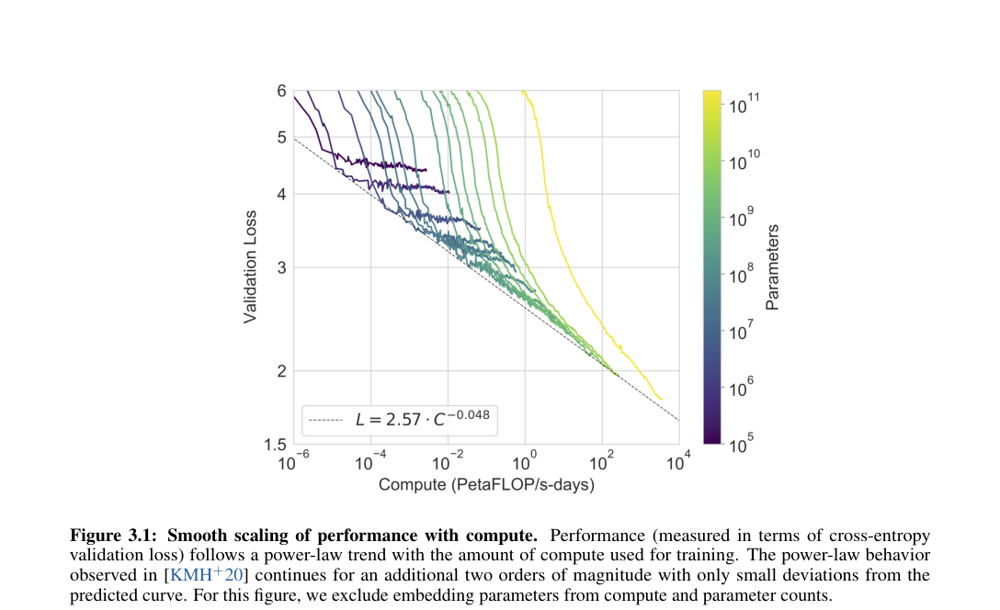

**图 3.1：** 性能随计算量平滑扩展。以交叉熵验证损失衡量的性能，会随训练计算量呈幂律趋势。[KMH+20] 观察到的幂律行为又延续了两个数量级，对预测曲线的偏离仅很小。在本图中，我们在计算量和参数量中排除了嵌入参数。

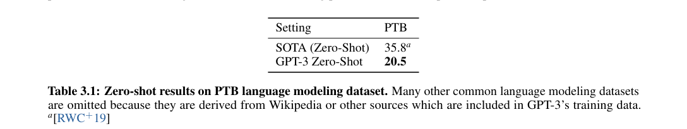

**表 3.1：** PTB 语言建模数据集的零样本结果。许多其他常用语言建模数据集由维基百科或其他已包含在 GPT-3 训练数据中的来源派生，因此未列入。a [RWC+19]。

### 3.1 语言建模、完形填空与补全任务

本节测试 GPT-3 在传统语言建模任务上的性能，也测试若干相关任务：预测某个关键单词，补全句子或段落，或在一段文本的若干可能补全中作出选择。

#### 3.1.1 语言建模

我们在 Penn Treebank（PTB）数据集 [MKM+94] 上计算零样本困惑度，使用与 [RWC+19] 相同的测量方式。我们没有纳入该工作中与维基百科有关的 4 项任务，因为它们完全包含在我们的训练数据中；我们也没有纳入十亿词基准，因为该数据集有很大一部分包含在我们的训练集中。PTB 早于现代互联网出现，因此避开了这些问题。我们最大的模型在 PTB 上把最先进水平大幅推进了 15 分，困惑度达到 20.50。请注意，PTB 是传统语言建模数据集，没有清晰的样例划分可供定义单样本或少样本评估，所以我们只测量零样本性能。

#### 3.1.2 LAMBADA

LAMBADA 数据集 [PKL+16] 检验模型对文本长距离依赖关系的建模能力：模型需要预测句子的最后一个单词，而作出预测需要阅读一段上下文。近来有人认为，在这项困难基准上持续扩大语言模型，收益正在递减。[BHT+20] 评论了最近两个最先进结果 [SPP+19；Tur20] 之间模型规模增加一倍却只换来 1.5% 的微小改善，并断言“继续把硬件和数据规模扩大若干数量级，并非前进方向”。我们发现这条路径仍很有希望：在零样本设置中，GPT-3 在 LAMBADA 上达到 76%，比先前最先进水平提高 8%。

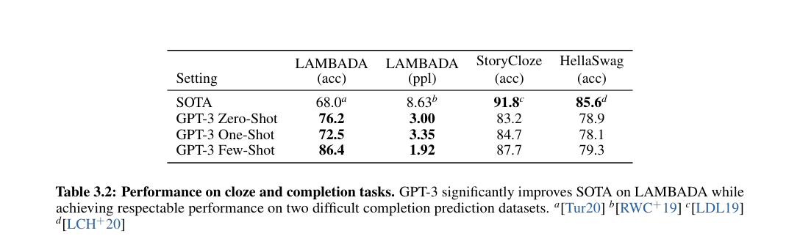

**表 3.2：** 完形填空与补全任务的性能。GPT-3 在 LAMBADA 上大幅改进最先进水平，同时在两个困难的补全预测数据集上取得了相当不错的表现。a [Tur20]，b [RWC+19]，c [LDL19]，d [LCH+20]。

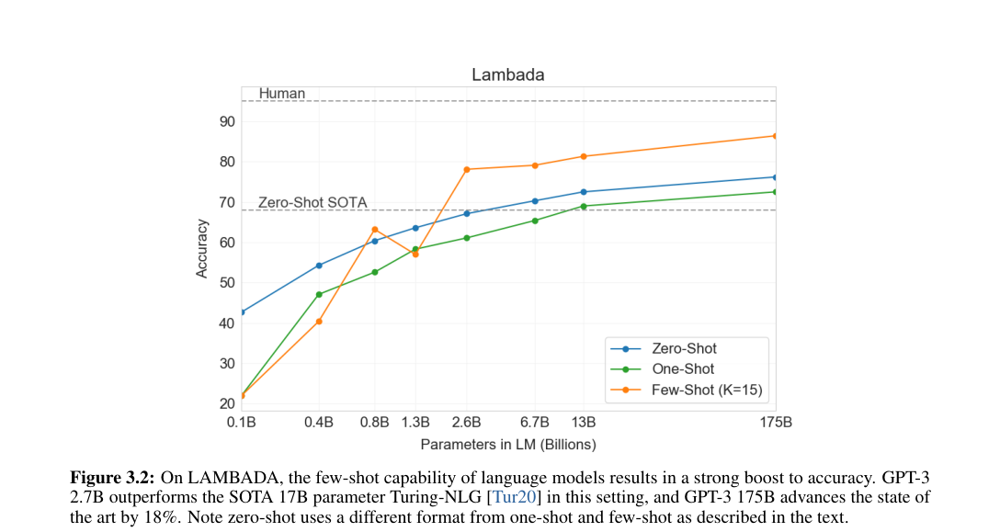

**图 3.2：** 在 LAMBADA 上，语言模型的少样本能力大幅提高了准确率。在这种设置下，GPT-3 2.7B 超过了拥有 170 亿参数的最先进模型 Turing-NLG [Tur20]，GPT-3 175B 则将最先进水平提高了 18%。请注意，按正文所述，零样本所用格式与单样本和少样本不同。

LAMBADA 还展示了少样本学习的灵活性：它提供了一种方法，可以解决这个数据集传统上会遇到的一个问题。尽管 LAMBADA 中的补全始终是一个句子的最后一个词，但标准语言模型无法知道这一细节。因此，它不仅会给正确结尾分配概率，也会给该段落的其他有效续写分配概率。过去通过停用词过滤器 [RWC+19]（禁止“续写”词）部分解决了这个问题。少样本设置则使我们可以把任务“框定”为完形填空测试，并让语言模型根据样例推断出，期望的补全恰好只有一个词。我们使用以下填空格式：

> 爱丽丝是鲍勃的朋友。爱丽丝去拜访她的朋友 ***_*。→ 鲍勃
> 乔治买了一些棒球器材：一个球、一只手套和一支**___。→

向模型呈现这种格式的样例时，GPT-3 在少样本设置下达到 86.4% 的准确率，比先前最先进水平提高了 18% 以上。我们观察到，少样本性能随模型规模增大而显著提升。这种设置会使最小模型的性能下降近 20%，却使 GPT-3 的准确率提高 10%。最后，填空方法在单样本设置中无效，其性能总是低于零样本设置。这或许是因为，所有模型仍需要若干样例才能识别该模式。

对测试集污染的分析显示，LAMBADA 数据集中有相当一部分似乎存在于我们的训练数据中，这里需要谨慎看待。但第 4 节的分析表明，这对性能的影响可以忽略不计。

#### 3.1.3 HellaSwag

HellaSwag 数据集 [ZHB+19] 要求模型为一个故事或一组指示选出最佳结尾。这些样例通过对抗挖掘获得，目的是让它们对语言模型很难，对人类却仍很容易（人类准确率为 95.6%）。GPT-3 在单样本设置下达到 78.1% 的准确率，在少样本设置下达到 79.3%，超过了微调的 15 亿参数语言模型所取得的 75.4% [ZHR+19]，但仍显著低于微调多任务模型 ALUM 所达到的 85.6% 总体最先进水平。

#### 3.1.4 StoryCloze

接下来，我们在 StoryCloze 2016 数据集 [MCH+16] 上评估 GPT-3；该任务需要为由五个句子构成的故事选出正确的结尾句。GPT-3 在零样本设置下达到 83.2%，在少样本设置下（$K=70$）达到 87.7%。这仍比使用 BERT 模型微调获得的最先进水平 [LDL19] 低 4.1%，但比先前的零样本结果提高了约 10%。

### 3.2 闭卷问答

本节测量 GPT-3 回答广泛事实知识问题的能力。由于可能查询的数量极为庞大，过去通常会使用信息检索系统找到相关文本，再结合一个学习如何根据问题和检索文本生成答案的模型来处理这项任务。这种设置允许系统搜索可能包含答案的文本，并以其为条件，因此被称为“开卷”。[RRS20] 近来表明，大型语言模型即使不以辅助信息为条件，直接回答问题时也能取得意外良好的表现。他们将这种限制更严的评估设置称为“闭卷”。他们的工作暗示，容量更高的模型可能表现得更好；我们使用 GPT-3 检验这一假设。我们使用与 [RRS20] 相同的数据划分，在该工作的三个数据集上评估 GPT-3：自然问题 [KPR+19]、WebQuestions [BCFL13] 和 TriviaQA [JCWZ17]。请注意，除了所有结果都处于闭卷设置之外，我们的少样本、单样本和零样本评估比以往的闭卷问答工作更严格：不仅不允许使用外部内容，也不允许在问答数据集本身上微调。

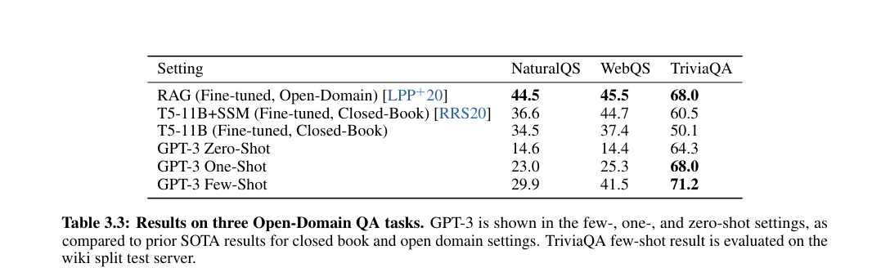

**表 3.3：** 三项开放域问答任务的结果。表中展示 GPT-3 在少样本、单样本和零样本设置下的结果，并与以往闭卷和开放域设置下的最先进结果比较。TriviaQA 的少样本结果在维基百科划分的测试服务器上评估。

GPT-3 的结果见表 3.3。在 TriviaQA 上，零样本结果为 64.3%，单样本结果为 68.0%，少样本结果为 71.2%。零样本结果已比微调的 T5-11B 高 14.2%，也比预训练时使用问答专用跨度预测的版本高 3.8%。单样本结果又提高 3.7%，与一个最先进开放域问答系统相当；该系统不仅进行微调，还在 2100 万篇文档组成、拥有 153 亿参数的稠密向量索引上使用学习到的检索机制 [LPP+20]。GPT-3 的少样本结果在此基础上又提高 3.2%。

在 WebQuestions（WebQs）上，GPT-3 在零样本设置下达到 14.4%，在单样本设置下达到 25.3%，在少样本设置下达到 41.5%。相比之下，微调 T5-11B 的结果为 37.4%，使用问答专用预训练流程的微调 T5-11B+SSM 则为 44.7%。少样本 GPT-3 的性能已逼近最先进的微调模型。值得注意的是，与 TriviaQA 相比，WebQs 从零样本到少样本的收益大得多（它的零样本和单样本性能确实很差）；这或许表明 WebQs 的问题和/或其答案风格位于 GPT-3 的分布之外。即便如此，GPT-3 似乎能够适应这一分布，并在少样本设置中恢复强劲性能。

在自然问题（NQs）上，GPT-3 在零样本设置下达到 14.6%，在单样本设置下达到 23.0%，在少样本设置下达到 29.9%；微调 T5-11B+SSM 的结果则为 36.6%。与 WebQs 类似，从零样本到少样本的巨大收益可能表明存在分布偏移，也可以解释为什么它的表现不如 TriviaQA 和 WebQs 那么有竞争力。尤其是，NQs 的问题往往要求关于维基百科的极其细粒度知识，它可能正在检验 GPT-3 容量和广泛预训练分布的极限。

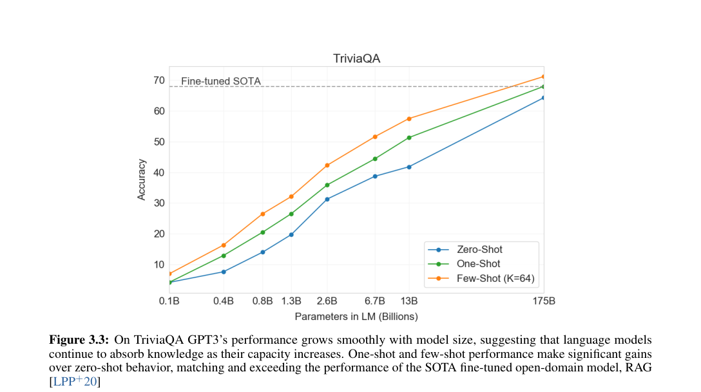

**图 3.3：** 在 TriviaQA 上，GPT-3 的性能随模型规模平滑提升，这表明语言模型会随容量增大继续吸收知识。单样本和少样本性能相对零样本行为取得了明显收益，并分别追平和超过最先进微调开放域模型 RAG [LPP+20]。

总体而言，在三个数据集中的一个上，GPT-3 的单样本结果追平了开放域微调的最先进水平。在另外两个数据集上，它尽管没有使用微调，但性能已逼近闭卷最先进水平。在所有三个数据集上，我们都发现性能会随模型规模增大而非常平滑地提升（图 3.3 及附录 H 的图 H.7）；这或许反映了这样一种观念：模型容量可以直接转化为模型参数所吸收的更多“知识”。

### 3.3 翻译

出于容量方面的顾虑，GPT-2 使用过滤器处理多语种文档集合，从中生成仅含英语的数据集。即使有这种过滤，GPT-2 仍展现了一些多语能力迹象：尽管训练数据中只剩下 10 MB 法语文本，它在法语和英语之间翻译时仍取得了不可忽略的表现。由于我们把模型容量从 GPT-2 到 GPT-3 扩大了两个以上数量级，我们也扩大了训练数据集的范围，让其他语言获得更多代表，但这仍是未来需要改进的领域。如第 2.2 节所述，我们的大部分数据源于原始 Common Crawl，只按质量进行过滤。尽管 GPT-3 的训练数据仍以英语为主（按词数计为 93%），但也包含 7% 的其他语言文本。补充材料记录了这些语言。为更好地理解模型的翻译能力，我们还扩展了分析，加入两种额外的常见研究语言：德语和罗马尼亚语。

现有的无监督机器翻译方法往往把单语数据集对上的预训练与回译 [SHB15] 结合起来，以受控方式在两种语言之间建立桥梁。相比之下，GPT-3 从多种语言以自然方式混合的训练数据中学习，这些语言在单词、句子和文档三个层面上相互结合。GPT-3 还仅使用一个训练目标，它既未针对任何特定任务定制，也未为任何特定任务设计。不过，我们的单样本/少样本设置与以往无监督工作并不完全可比，因为它们使用了少量成对样例（1 个或 64 个），大约相当于一两页上下文内训练数据。

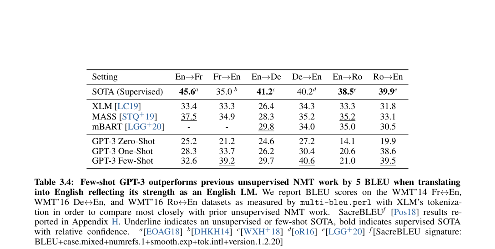

**表 3.4：** 少样本 GPT-3 在译入英语时，比以往无监督神经机器翻译工作高 5 个 BLEU，这反映了它作为英语语言模型的优势。我们使用 XLM 的分词方式和 `multi-bleu.perl` 测量 WMT’14 法英双向、WMT’16 德英双向和 WMT’16 罗马尼亚语-英语双向数据集的 BLEU 分数，以便最接近地与以往无监督机器翻译工作比较。附录 H 报告 SacreBLEU [Pos18] 结果。下划线表示无监督或少样本最先进水平，粗体表示相对可信的监督最先进水平。a [EOAG18]，b [DHKH14]，c [WXH+18]，d [oR16]，e [LGG+20]，f [SacreBLEU 签名：`BLEU+case.mixed+numrefs.1+smooth.exp+tok.intl+version.1.2.20`]。

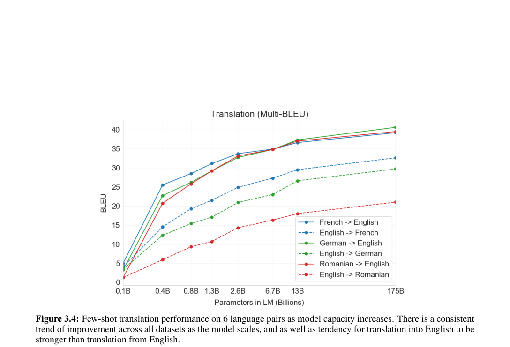

**图 3.4：** 模型容量增长时，六个语言对上的少样本翻译性能。模型扩展时，所有数据集都展现一致的提升趋势；同时，译入英语往往强于从英语译出。

结果见表 3.4。只接收自然语言任务描述的零样本 GPT-3，仍落后于近期无监督神经机器翻译结果。但是，每项翻译任务只提供一个样例演示，就可以使性能提高 7 个以上 BLEU，并接近以往工作的竞争性能。在完整少样本设置下，GPT-3 又提高了 4 个 BLEU，最终的平均性能与以往无监督神经机器翻译工作相当。GPT-3 的性能根据语言方向呈现明显偏斜。对研究的三种输入语言，GPT-3 译入英语时明显超过以往无监督神经机器翻译工作，反向翻译时却落后于它们。英译罗马尼亚语的性能是一个显著异常值，比以往无监督神经机器翻译工作低 10 个以上 BLEU。这可能是因为重用了 GPT-2 的字节级 BPE 分词器，而它是为一个几乎全由英语组成的训练数据集开发的。对法译英和德译英而言，少样本 GPT-3 超过了我们能找到的最佳监督结果；但鉴于我们对相关文献不熟悉，而且这些基准看起来竞争不充分，我们并不认为这些结果代表真正的最先进水平。对罗马尼亚语译英语而言，少样本 GPT-3 与总体最先进水平相差不到 0.5 BLEU；后者结合了无监督预训练、在 60.8 万个标注样例上的监督微调，以及回译 [LHCG19b]。

最后，在所有语言对和全部三种设置（零样本、单样本和少样本）下，性能都随模型容量增大而平滑提升。图 3.4 展示了少样本结果的这一趋势，附录 H 则展示全部三种设置的扩展情况。

### 3.4 Winograd 式任务

Winograd 模式挑战 [LDM12] 是自然语言处理的一项经典任务：当一个代词在语法上存在歧义，但对人类而言在语义上没有歧义时，需要确定该代词指代哪个词。近来，微调语言模型已在原始 Winograd 数据集上取得接近人类的性能，但在通过对抗挖掘获得的 Winogrande 数据集 [SBBC19] 等更困难的版本上，性能仍显著落后于人类。我们分别在零样本、单样本和少样本设置下，测试 GPT-3 在 Winograd 和 Winogrande 上的性能。

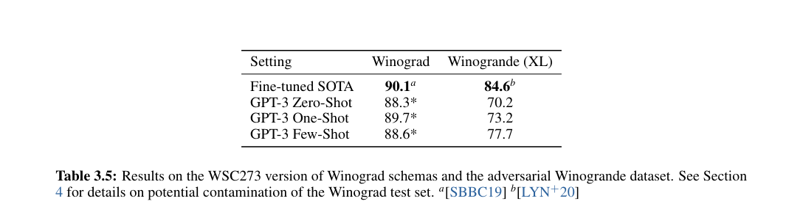

**表 3.5：** Winograd 模式的 WSC273 版本和对抗 Winogrande 数据集上的结果。Winograd 测试集的潜在污染详情见第 4 节。a [SBBC19]，b [LYN+20]。

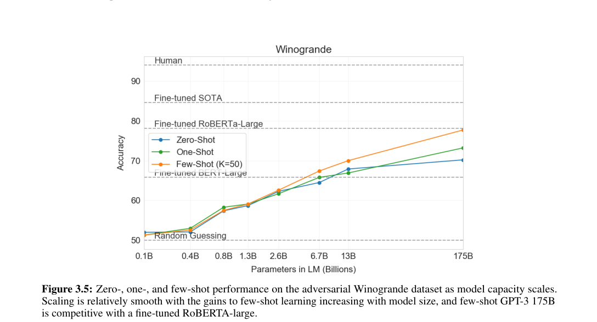

**图 3.5：** 对抗 Winogrande 数据集上的零样本、单样本和少样本性能随模型容量扩展。扩展趋势相对平滑，少样本学习的收益随模型规模增大而增加；少样本 GPT-3 175B 可与微调 RoBERTa-large 竞争。

在 Winograd 上，我们使用 [RWC+19] 所述的相同“部分评估”方法，在原始的 273 个 Winograd 模式上测试 GPT-3。请注意，这种设置与 SuperGLUE 基准中的 WSC 任务略有不同；后者被表述为二元分类，需要通过实体抽取转换为本节所述的形式。在 Winograd 上，GPT-3 在零样本、单样本和少样本设置中分别达到 88.3%、89.7% 和 88.6%。这没有展现出明确的上下文内学习，但三种情况下均取得强劲结果，只比最先进水平和估计的人类性能低几分。我们注意到，污染分析在训练数据中发现了一些 Winograd 模式，但这似乎只对结果有轻微影响（见第 4 节）。

在更困难的 Winogrande 数据集上，我们确实发现了上下文内学习收益：GPT-3 在零样本设置下达到 70.2%，在单样本设置下达到 73.2%，在少样本设置下达到 77.7%。相比之下，微调 RoBERTa 模型达到 79%，微调的高容量模型 T5 创下 84.6% 的最先进结果，[SBBC19] 报告的人类性能则为 94.0%。

### 3.5 常识推理

接下来，我们考察三个试图捕捉物理或科学推理能力的数据集，这些任务不同于句子补全、阅读理解或广泛知识问答。第一个是物理问答（PIQA）[BZB+19]，它询问关于物理世界如何运作的常识问题，旨在探测对世界的具身理解。GPT-3 的零样本准确率为 81.0%，单样本准确率为 80.5%，少样本准确率为 82.8%（最后一项在 PIQA 的测试服务器上测得）。与先前微调 RoBERTa 创下的 79.4% 最先进准确率相比，这一结果很有竞争力。PIQA 性能随模型规模增长的速度相对缓慢，且仍比人类性能低 10% 以上，但 GPT-3 的少样本甚至零样本结果都超过了当前最先进水平。我们的分析标记出 PIQA 可能存在数据污染问题（尽管测试标签已隐藏），因此我们保守地用星号标注该结果。详情见第 4 节。

ARC [CCE+18] 是一个从三年级至九年级科学考试中收集的多项选择问题数据集。它的“挑战”版本只保留简单统计方法或信息检索方法无法正确回答的问题。在该版本上，GPT-3 的零样本准确率为 51.4%，单样本为 53.2%，少样本为 51.5%。这已接近 UnifiedQA [KKS+20] 中微调 RoBERTa 基线的 55.9%。在数据集的“简单”版本上（上述任一基线方法能正确回答的问题），GPT-3 分别达到 68.8%、71.2% 和 70.1%，略高于 [KKS+20] 的微调 RoBERTa 基线。但是，这两项结果仍远差于 UnifiedQA 创下的总体最先进水平；在挑战集上，UnifiedQA 比 GPT-3 的少样本结果高 27%，在简单集上则高 22%。

在 OpenBookQA [MCKS18] 上，GPT-3 从零样本到少样本设置有显著改善，但仍比总体最先进水平低 20 分以上。GPT-3 的少样本性能与排行榜上的微调 BERT-Large 基线相当。

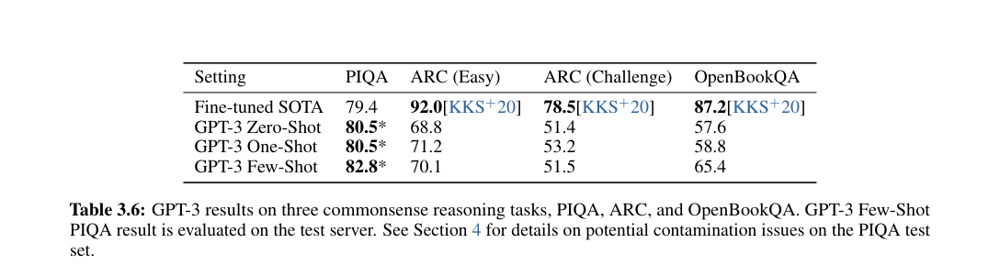

**表 3.6：** GPT-3 在三项常识推理任务 PIQA、ARC 和 OpenBookQA 上的结果。GPT-3 的少样本 PIQA 结果在测试服务器上评估。PIQA 测试集的潜在污染问题见第 4 节。

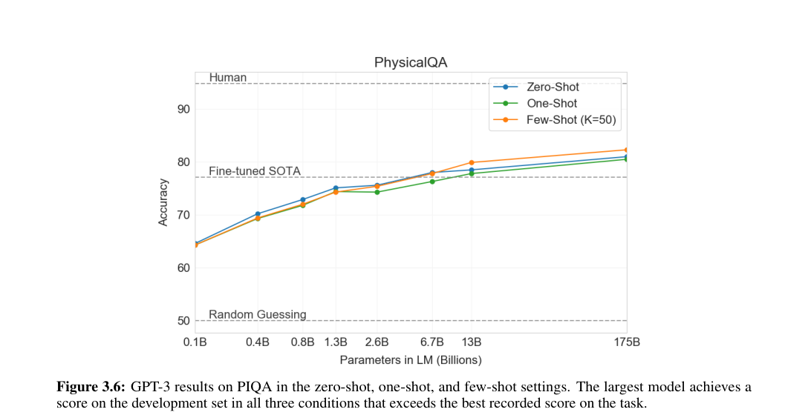

**图 3.6：** GPT-3 在 PIQA 上的零样本、单样本和少样本结果。最大模型在开发集上的三种条件中，都超过了该任务有记录的最佳分数。

总体而言，GPT-3 的上下文内学习在常识推理任务上呈现混合结果：PIQA 和 ARC 在单样本和少样本学习设置中只有很小且不一致的收益，OpenBookQA 则有明显改善。GPT-3 在新的 PIQA 数据集上的所有评估设置中都创下最先进水平。

### 3.6 阅读理解

接下来，我们在阅读理解任务上评估 GPT-3。我们使用由 5 个数据集构成的套件，它们在对话和单问题两类设置中，包含抽象式、多项选择式与跨度式答案格式。GPT-3 在这些数据集上的表现差异很大，这暗示它在不同答案格式上的能力不同。总体上，我们观察到，GPT-3 的表现与每个对应数据集的初始基线，以及早期使用上下文表征训练的结果大致相当。

GPT-3 在自由形式对话数据集 CoQA [RCM19] 上表现最好，与人类基线相差不到 3 分；在 QuAC [CHI+18] 上表现最差，比 ELMo 基线低 13 个 F1，而该数据集需要对教师-学生交互中结构化的对话行为和答案跨度选择建模。在阅读理解语境中检验离散推理与计算能力的 DROP [DWD+19] 数据集上，少样本 GPT-3 超过了原始论文的微调 BERT 基线，但仍远低于人类性能，也远低于用符号系统增强神经网络的最先进方法 [RLL+19]。在 SQuAD 2.0 [RJL18] 上，GPT-3 展示了少样本学习能力：与零样本设置相比，它提高了近 10 个 F1，达到 69.8，从而略微超过原始论文中最好的微调结果。在由中学和高中英语考试组成的多项选择数据集 RACE [LXL+17] 上，GPT-3 的表现相对较弱，只能与最早使用上下文表征的工作竞争，且仍比最先进水平低 45%。

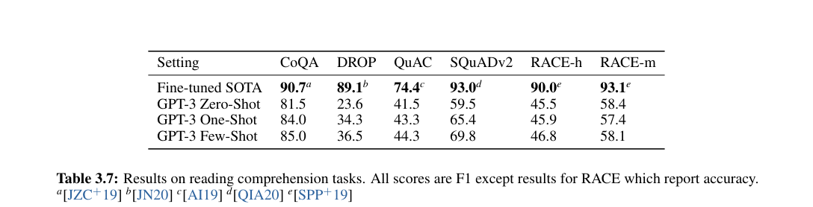

**表 3.7：** 阅读理解任务结果。RACE 报告准确率，其余分数均为 F1。a [JZC+19]，b [JN20]，c [AI19]，d [QIA20]，e [SPP+19]。

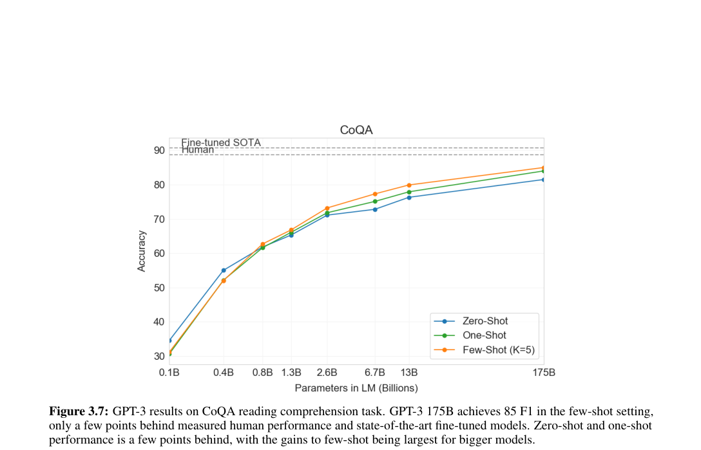

**图 3.7：** GPT-3 在 CoQA 阅读理解任务上的结果。GPT-3 175B 在少样本设置下达到 85 F1，只比测得的人类性能和最先进微调模型低几分。零样本和单样本性能又低几分；模型越大，少样本学习的收益越大。

### 3.7 SuperGLUE

为更好地聚合自然语言处理任务的结果，并以更系统的方式与 BERT、RoBERTa 等流行模型比较，我们还在标准化数据集集合 SuperGLUE 基准 [WPN+19；WPN+19；CLC+19；DMST19；RBG11；KCR+18；ZLL+18；DGM06；BHDD+06；GMDD07；BDD+09；PCC18；PHR+18] 上评估 GPT-3。GPT-3 在 SuperGLUE 数据集测试集上的性能见表 3.8。在少样本设置中，所有任务均使用从训练集随机抽取的 32 个样例。对除 WSC 和 MultiRC 之外的所有任务，我们会为每个问题重新抽取一组样例用作上下文。对 WSC 和 MultiRC，我们在评估的所有问题上，都使用从训练集中随机抽取的同一组样例作为上下文。

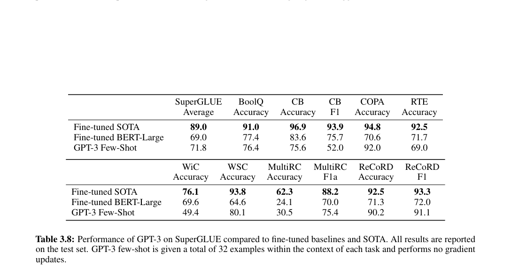

**表 3.8：** GPT-3 在 SuperGLUE 上的性能，并与微调基线和最先进水平比较。所有结果都在测试集上报告。GPT-3 少样本在每项任务的上下文中总共得到 32 个样例，不执行任何梯度更新。

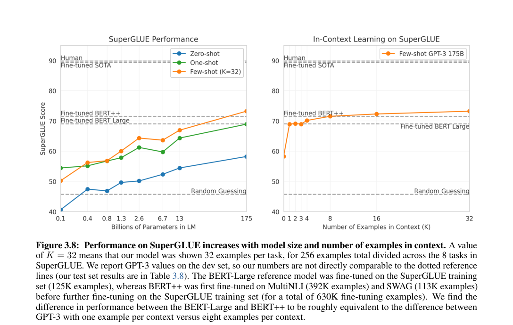

**图 3.8：** SuperGLUE 性能随模型规模和上下文样例数增加。$K=32$ 表示每项任务向模型展示 32 个样例，即在 SuperGLUE 的 8 项任务中总共分配 256 个样例。我们报告的 GPT-3 数值来自开发集，因此不能与虚线参考值直接比较（测试集结果见表 3.8）。BERT-Large 参考模型在 SuperGLUE 训练集（12.5 万个样例）上微调，BERT++ 则先在 MultiNLI（39.2 万个样例）和 SWAG（11.3 万个样例）上微调，然后在 SuperGLUE 训练集上进一步微调（微调样例总数为 63 万）。我们发现，BERT-Large 与 BERT++ 的性能差距，大致相当于 GPT-3 每个上下文使用一个样例与使用八个样例之间的差距。

我们观察到，GPT-3 在各项任务上的表现差异很大。在 COPA 和 ReCoRD 上，GPT-3 的单样本和少样本设置都取得接近最先进的性能；COPA 只落后几分，在排行榜上排名第二，第一名由微调的 110 亿参数模型 T5 保持。在 WSC 上，性能仍相对强劲，少样本设置下达到 80.1%（请注意，如第 3.4 节所述，GPT-3 在原始 Winograd 数据集上达到 88.6%）。在 BoolQ、MultiRC 和 RTE 上，性能合理，大致与微调 BERT-Large 相当。在 CB 上，少样本设置下的 75.6% 已经展现出一些起色。

WiC 是一个显著弱项，少样本性能只有 49.4%，相当于随机猜测。我们为 WiC 尝试了多种不同措辞和表述方式（该任务需要判断一个词在两个句子中的用法是否含义相同），但都无法取得强劲性能。这暗示了一种现象，下一节对 ANLI 基准的讨论将使它变得更加清晰：在少样本或单样本设置中，GPT-3 似乎不善于某些需要比较两个句子或文本片段的任务，例如某个词在两个句子中的用法是否相同（WiC）、一个句子是否是另一句子的转述，或一个句子是否蕴含另一句子。这也可以解释为什么遵循相同格式的 RTE 和 CB 得分相对较低。尽管有这些弱点，GPT-3 仍在 8 项任务中的 4 项上超过微调 BERT-Large，在其中两项上接近由微调 110 亿参数模型保持的最先进水平。

最后，我们注意到，少样本 SuperGLUE 得分会同时随模型规模和上下文样例数增加而稳定提升，表明上下文内学习带来越来越多的收益（图 3.8）。我们将 $K$ 扩展至每项任务 32 个样例；此后，额外样例就无法稳定装入上下文。在遍历不同 $K$ 值时，我们发现，每项任务总共不到 8 个样例，就足以使 GPT-3 在 SuperGLUE 总分上超过微调 BERT-Large。

### 3.8 自然语言推断

自然语言推断（NLI）[Fyo00] 关注理解两个句子之间关系的能力。实践中，这项任务通常被结构化为二类或三类分类问题：模型判断第二个句子是否在逻辑上由第一个句子推出、是否与第一个句子矛盾，或是否可能为真（中立）。SuperGLUE 包含一个自然语言推断数据集 RTE，它评估该任务的二元版本。在 RTE 上，只有最大版本的 GPT-3 才会在任何评估设置下以有说服力的程度高于随机水平（56%）；但在少样本设置中，GPT-3 的性能与针对单项任务微调的 BERT-Large 相当。

我们还在近期提出的对抗自然语言推断（ANLI）数据集 [NWD+19] 上评估模型。ANLI 是一个困难的数据集，由三轮（R1、R2 和 R3）对抗挖掘得到的自然语言推断问题组成。与 RTE 相似，在 ANLI 上，所有小于 GPT-3 的模型即使在少样本设置中，性能也几乎恰好处于随机水平（约 33%）；GPT-3 本身则在第三轮展现出一些起色。图 3.9 重点展示 ANLI R3 的结果，全部三轮的完整结果见附录 H。RTE 和 ANLI 上的这些结果表明，自然语言推断对语言模型而言仍是一项非常困难的任务，它们只是刚刚开始展现进步迹象。

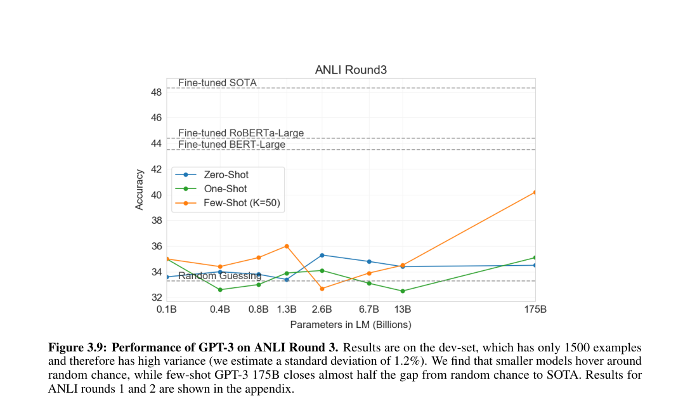

**图 3.9：** GPT-3 在 ANLI 第三轮上的性能。结果来自只有 1500 个样例的开发集，因此方差很高（我们估计标准差为 1.2%）。较小模型在随机水平附近徘徊，少样本 GPT-3 175B 则弥合了从随机水平到最先进水平差距的近一半。ANLI 第一轮和第二轮的结果见附录。

### 3.9 合成任务与定性任务

探测 GPT-3 在少样本（或零样本、单样本）设置下的能力范围，一种方法是让它执行以下任务：需要完成简单即时计算推理，识别一种不太可能在训练时出现的新模式，或迅速适应一项寻常任务。我们设计了若干任务，用来测试这一类能力。首先，我们测试 GPT-3 执行算术运算的能力。其次，我们创建了多项涉及重排或还原单词字母的任务；这些任务不太可能以完全相同的形式出现在训练中。第三，我们测试 GPT-3 在少样本设置下解答 SAT 式类比问题的能力。最后，我们在若干定性任务上测试 GPT-3，包括在句子中使用新造词、纠正英语语法和生成新闻文章。我们将发布这些合成数据集，希望能促进对语言模型测试时行为的进一步研究。

#### 3.9.1 算术

为测试 GPT-3 在没有任务专用训练时执行简单算术运算的能力，我们开发了一组包含 10 项小测试的试题，它们用自然语言向 GPT-3 提出一个简单算术问题：

- **两位数加法（2D+）**：要求模型对从 $[0,100)$ 上均匀采样的两个整数求和，问题以问句表述，例如“问：48 加 76 等于多少？答：124。”
- **两位数减法（2D-）**：要求模型对从 $[0,100)$ 上均匀采样的两个整数求差；答案可以为负数。例如：“问：34 减 53 等于多少？答：-19。”
- **三位数加法（3D+）**：与两位数加法相同，但数字从 $[0,1000)$ 上均匀采样。
- **三位数减法（3D-）**：与两位数减法相同，但数字从 $[0,1000)$ 上均匀采样。
- **四位数加法（4D+）**：与三位数加法相同，但从 $[0,10000)$ 上均匀采样。
- **四位数减法（4D-）**：与三位数减法相同，但从 $[0,10000)$ 上均匀采样。
- **五位数加法（5D+）**：与三位数加法相同，但从 $[0,100000)$ 上均匀采样。
- **五位数减法（5D-）**：与三位数减法相同，但从 $[0,100000)$ 上均匀采样。
- **两位数乘法（2D×）**：要求模型对从 $[0,100)$ 上均匀采样的两个整数求积，例如“问：24 乘 42 等于多少？答：1008。”
- **一位数复合运算（1DC）**：要求模型对三个一位数执行复合运算，后两个数带括号。例如：“问：$6+(4\times8)$ 等于多少？答：38。”三个一位数从 $[0,10)$ 上均匀选取，运算符从 $\{+,-,\times\}$ 中均匀选取。

在全部 10 项任务中，模型都必须精确生成正确答案。对每项任务，我们都生成一个包含 2000 个随机实例的数据集，并在这些实例上评估所有模型。

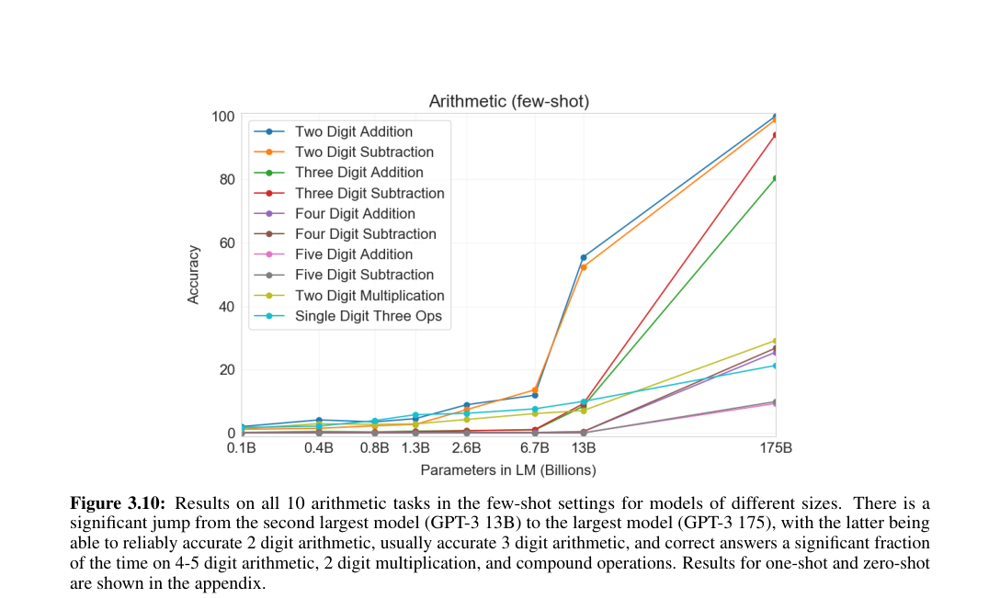

**图 3.10：** 不同规模模型在全部 10 项算术任务上的少样本结果。第二大模型（GPT-3 13B）与最大模型（GPT-3 175B）之间出现了显著跃升：后者可以稳定、准确地执行两位数算术，通常能准确执行三位数算术，而在四到五位数算术、两位数乘法与复合运算上，也有相当一部分时间能给出正确答案。单样本和零样本结果见附录。

我们首先在少样本设置下评估 GPT-3，结果见图 3.10。在加减法上，数字位数较少时，GPT-3 展现出强劲能力：两位数加法准确率为 100%，两位数减法为 98.9%，三位数加法为 80.2%，三位数减法为 94.2%。性能会随数字位数增加而下降，但 GPT-3 在四位数运算上仍达到 25%-26% 的准确率，在五位数运算上达到 9%-10%，这表明它至少对更多位数拥有一定泛化能力。GPT-3 在计算开销尤其大的两位数乘法上也达到 29.2% 的准确率。最后，GPT-3 在一位数组合运算（例如 $9\times(7+5)$）上达到 21.3%，表明其能力不只局限于单次运算。

图 3.10 清楚表明，小模型在所有这些任务上都表现很差。即使是 130 亿参数的模型（仅次于完整的 1750 亿参数 GPT-3），也只有一半时间能正确执行两位数加减法，而所有其他运算的准确率都不到 10%。

与少样本性能相比，单样本和零样本性能有所下降，这表明，要想正确执行这些计算，适应任务（或至少识别任务）很重要。即便如此，单样本性能仍然很强，而完整 GPT-3 的零样本性能甚至明显超过所有较小模型的少样本学习性能。表 3.9 展示完整 GPT-3 在全部三种设置下的结果，附录 H 展示三种设置下性能随模型容量的扩展情况。

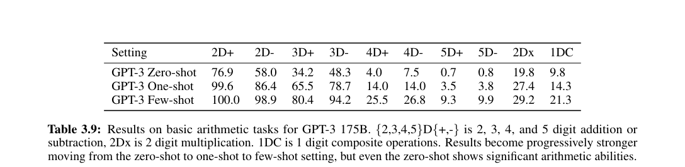

**表 3.9：** GPT-3 175B 在基本算术任务上的结果。`{2,3,4,5}D{+,-}` 分别表示两、三、四和五位数加法或减法，`2D×` 表示两位数乘法，`1DC` 表示一位数复合运算。结果从零样本到单样本、再到少样本逐步增强，但即使零样本设置也展现了明显的算术能力。

为抽查模型是否只在记忆具体算术问题，我们从测试集中取出三位数算术问题，并以“`<数字1> + <数字2> =`”和“`<数字1> 加 <数字2>`”两种形式在训练数据中搜索它们。在 2000 道加法题中，我们只找到 17 个匹配（0.8%）；在 2000 道减法题中，只找到 2 个匹配（0.1%）。这表明，正确答案中只有微不足道的一小部分可能来自记忆。此外，检查错误答案可以发现，模型经常会犯“忘记进位 1”之类的错误，这表明它确实在尝试执行相关计算，而不是记住一张算术表。

总体而言，GPT-3 在少样本、单样本甚至零样本设置中，都展现出合理的中等复杂算术能力。

#### 3.9.2 单词重排与操作任务

为测试 GPT-3 从少量样例中学习新符号操作的能力，我们设计了一组由 5 项“字符操作”任务构成的小测试。每项任务都会向模型提供一个经过某种字符重排、添加或删除操作而扭曲的单词，并要求它恢复原始单词。这 5 项任务是：

- **单词字母循环移位（CL）**：向模型提供一个字母循环移位后的单词，后面跟着“=”符号，并要求它生成原始单词。例如，模型可能会得到 `lyinevitab`，应输出 `inevitably`。
- **除首尾字符外的乱序词（A1）**：向模型提供一个除首尾字母外，其他所有字母都被随机打乱的单词，并要求它输出原始单词。例如：`criroptuon = corruption`。
- **除首尾各两个字符外的乱序词（A2）**：向模型提供一个除开头两个字母和末尾两个字母外，其他所有字母都被随机打乱的单词，并要求它恢复原始单词。例如：`opoepnnt → opponent`。
- **在单词中随机插入（RI）**：在一个单词的每个字母之间插入随机标点符号或空格字符，要求模型输出原始单词。例如：`s.u!c/c!e.s s i/o/n = succession`。
- **单词反转（RW）**：向模型提供一个反向拼写的单词，要求它输出原始单词。例如：`stcejbo → objects`。

对每项任务，我们都生成 1 万个样例。我们选取 [Nor09] 测得的频率最高的 1 万个单词，它们的长度超过 4 个字符且少于 15 个字符。少样本结果见图 3.11。任务性能往往随模型规模增大而平滑提升。完整 GPT-3 模型在删除随机插入上达到 66.9%，在字母循环移位上达到 38.6%，在较容易的乱序词任务上达到 40.2%，在较困难的乱序词任务（只固定首尾字母）上达到 15.1%。没有一个模型能够反转单词的字母。

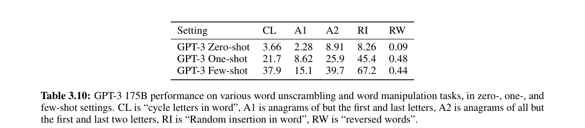

**表 3.10：** GPT-3 175B 在各种单词重排和操作任务上的零样本、单样本和少样本性能。CL 是“单词字母循环移位”，A1 是除首尾字母外的乱序词，A2 是除首尾各两个字母外的乱序词，RI 是“在单词中随机插入”，RW 是“单词反转”。

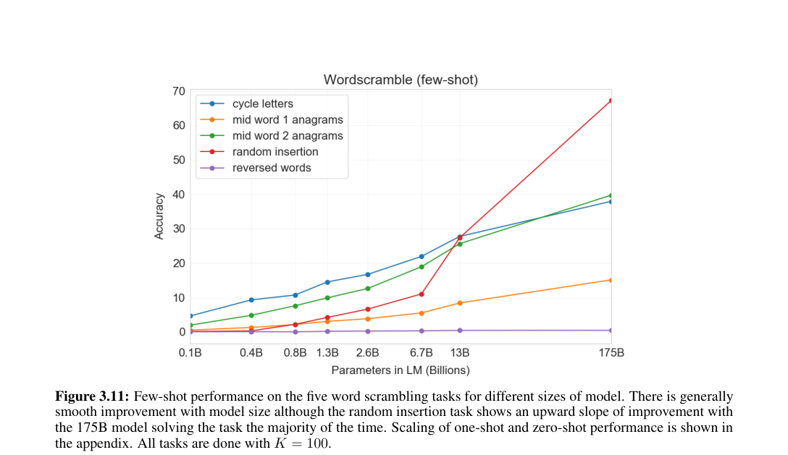

**图 3.11：** 不同规模模型在五项单词重排任务上的少样本性能。性能总体上随模型规模增大而平滑提升，但随机插入任务呈现向上倾斜的改善趋势，175B 模型在大多数时候能解决该任务。单样本和零样本性能的扩展情况见附录。所有任务都使用 $K=100$。

在单样本设置中，性能显著较弱（下降一半或更多）；在零样本设置中，模型则极少能完成任何一项任务（表 3.10）。这表明，模型似乎确实在测试时学习了这些任务：它无法在零样本设置下完成它们，而这些任务的人工性质也使它们不太可能出现在预训练数据中（虽然我们无法确定验证这一点）。

我们还可以通过绘制“上下文内学习曲线”，进一步量化性能；该曲线展示任务性能如何随上下文样例数变化。图 1.2 展示符号插入任务的上下文内学习曲线。我们可以看到，较大模型能够越来越有效地利用上下文信息，其中既包括任务样例，也包括自然语言任务描述。

最后，值得补充的是，解决这些任务需要在字符层面进行操作，而我们的 BPE 编码在一个单词的相当大部分上运行（平均每个词元约 0.7 个单词）。因此，从语言模型的角度看，要成功完成这些任务，不仅需要操作 BPE 词元，还需要理解并拆分其子结构。此外，CL、A1 和 A2 都不是双射的（也就是说，还原后的单词并非乱序单词的确定性函数），模型需要进行一定搜索，才能找到正确的还原结果。因此，这些任务涉及的技能似乎需要非平凡的模式匹配与计算。

#### 3.9.3 SAT 类比

为在另一项相对偏离典型文本分布的任务上测试 GPT-3，我们收集了 374 道“SAT 类比”题 [TLBS03]。在 2005 年以前，类比题是 SAT 大学入学考试的一个题型。一道典型例题是：“鲁莽之于大胆，如同（a）道貌岸然之于虚伪，（b）匿名之于身份，（c）悔恨之于恶行，（d）有害之于结果，（e）易受影响之于诱惑。”学生应当选出与原词对具有相同关系的五组词对之一；本题的答案是“道貌岸然之于虚伪”。在这项任务上，GPT-3 的少样本准确率为 65.2%，单样本为 59.1%，零样本为 53.7%；大学申请者的平均分数为 57% [TL05]（随机猜测为 20%）。如图 3.12 所示，结果会随规模扩大而改善；完整的 1750 亿参数模型比 130 亿参数模型提高了 10% 以上。

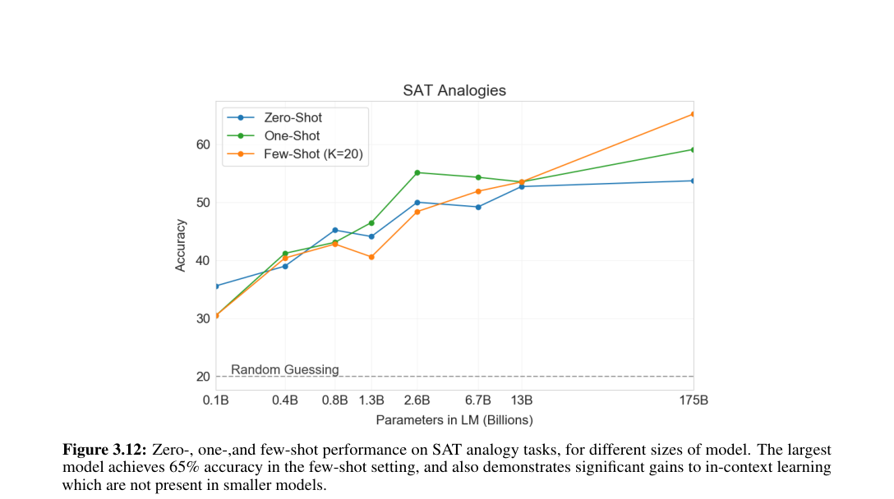

**图 3.12：** 不同规模模型在 SAT 类比任务上的零样本、单样本和少样本性能。最大模型在少样本设置下达到 65% 的准确率，还展示了较小模型所不具备的显著上下文内学习收益。

#### 3.9.4 新闻文章生成

以往关于生成式语言模型的工作，会通过以人类撰写的提示为条件从模型中采样，定性测试模型生成合成“新闻文章”的能力；该提示是新闻报道一个言之成理的首句 [RWC+19]。与 [RWC+19] 相比，用于训练 GPT-3 的数据集对新闻文章的加权小得多，因此通过原始无条件采样生成新闻文章效果较差。例如，GPT-3 经常会把所提议的“新闻文章”首句理解为一条推文，随后发布合成回复或后续推文。为解决这个问题，我们利用 GPT-3 的少样本学习能力，在模型上下文中提供三篇之前的新闻文章作为条件。在获得一篇拟生成的下一篇文章的标题和副标题后，模型就能稳定地生成“新闻”体裁的短文。

为估量 GPT-3 的新闻文章生成质量（我们认为这很可能与一般的条件样本生成质量相关），我们决定测量人类区分 GPT-3 生成文章与真实文章的能力。Kreps 等人 [KMB20] 和 Zellers 等人 [ZHR+19] 已经完成类似工作。生成式语言模型的训练目标是匹配人类生成内容的分布，因此，人类能否区分两者，是一项可能很重要的质量度量。[3](#fn:3)

为了查看人类检测模型生成文本的能力，我们从 `newser.com` 网站上任意选择了 25 组文章标题和副标题（平均长度：215 个词）。然后，我们使用参数量从 1.25 亿到 1750 亿（GPT-3）的四个语言模型，生成这些标题和副标题的补全（平均长度：200 个词）。对每个模型，我们向约 80 名美国参与者展示一份测验：其中包含这些真实标题和副标题，后面跟着人类撰写的文章或模型生成的文章。[4](#fn:4) 参与者需要选择该文章是“很可能由人类撰写”、“更可能由人类撰写”、“我不知道”、“更可能由机器撰写”或“很可能由机器撰写”。

我们选择的文章并不在模型的训练数据中，模型输出则以程序化方式完成格式化和选择，避免人类挑选。所有模型均使用相同上下文作为输出条件，在相同上下文长度下预训练，并以相同文章标题和副标题作为提示。不过，我们还进行了一项控制实验，用于控制参与者的投入程度与注意力。该实验使用相同格式，但故意采用了质量很差的模型生成文章。这些文章由一个“控制模型”生成：一个没有上下文、输出随机性较高的 1.6 亿参数模型。

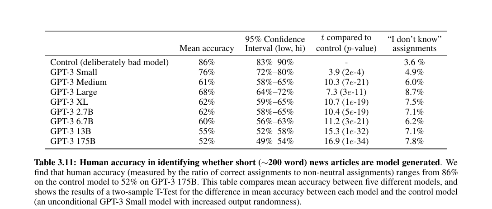

**表 3.11：** 人类识别约 200 词的短篇新闻文章是否由模型生成的准确率。我们发现，人类准确率（正确归类数与非中立归类数之比）从控制模型上的 86% 降至 GPT-3 175B 上的 52%。本表比较了五个不同模型的平均准确率，并给出每个模型与控制模型（一个输出随机性较高的无条件 GPT-3 Small）之间平均准确率差异的双样本 $t$ 检验结果。

人类检测到故意生成的劣质文章来自模型的平均准确率（每名参与者的正确归类数与非中立归类数之比）约为 86%，而随机水平为 50%。相比之下，人类检测 1750 亿参数模型生成文章的平均准确率约为 52%，刚刚高于随机水平（见表 3.11）。[5](#fn:5) 人类检测模型生成文本的能力似乎会随模型规模增大而降低：准确率似乎会随模型规模增大趋近随机水平，而人类对 GPT-3 的检测已接近随机。[6](#fn:6) 尽管模型规模越大，参与者用在每个输出上的时间也越多，但结果仍是如此（见附录 E）。

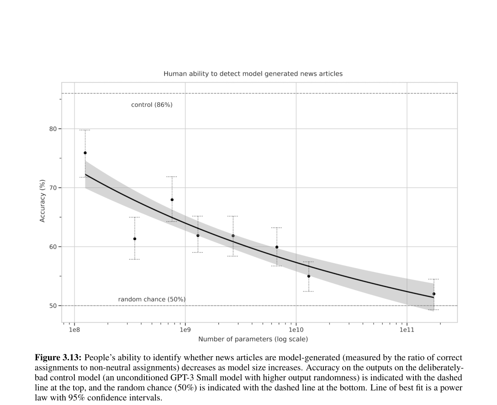

**图 3.13：** 人们识别新闻文章是否由模型生成的能力（以正确归类数与非中立归类数之比衡量）会随模型规模增大而降低。故意表现很差的控制模型（无条件、输出随机性更高的 GPT-3 Small）的输出准确率，由顶部虚线表示；随机水平（50%）由底部虚线表示。最佳拟合线为幂律，并给出 95% 置信区间。

GPT-3 的合成文章示例见图 3.14 和图 3.15。[7](#fn:7) 如评估结果所示，其中许多文本很难与真实的人类内容区分。事实不准确可以成为文章由模型生成的一个指征，因为与人类作者不同，模型无法获取文章标题所指的具体事实，也不知道文章是何时撰写的。其他指征包括重复、前后不衔接以及不寻常的措辞，但这些问题往往十分细微，不容易被察觉。

**图 3.14：** 人类最难与人类撰写文章区分的 GPT-3 生成新闻文章（准确率：12%）。

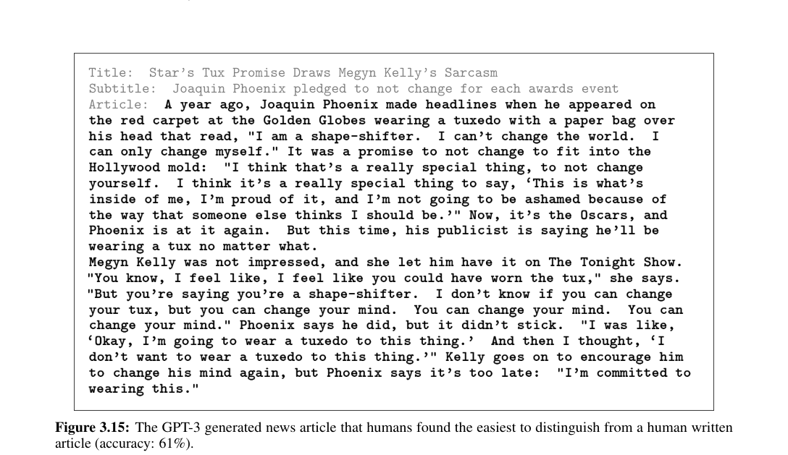

**图 3.15：** 人类最容易与人类撰写文章区分的 GPT-3 生成新闻文章（准确率：61%）。

Ippolito 等人 [IDCBE19] 关于语言模型检测的相关工作表明，GROVER [ZHR+19] 和 GLTR [GSR19] 等自动判别器检测模型生成文本的成功率，可能高于人类评估者。对这些模型进行自动检测，可能是未来研究一个很有希望的领域。

Ippolito 等人 [IDCBE19] 还指出，随着人类观察到更多词元，他们检测模型生成文本的准确率会提高。为对人类检测 GPT-3 175B 生成的较长新闻文章的能力作初步调查，我们从路透社选取了 12 篇世界新闻，平均长度为 569 个词；随后使用 GPT-3 生成这些文章的补全，平均长度为 498 个词（比初始实验长 298 个词）。我们沿用上述方法，进行了两项实验，每项实验均有约 80 名美国参与者，以比较人类检测 GPT-3 和控制模型所生成文章的能力。

我们发现，人类检测控制模型故意生成的劣质长文章的平均准确率约为 88%；检测 GPT-3 175B 生成的较长文章的平均准确率则仍刚刚超过随机水平，约为 52%（见表 3.12）。这表明，对于约 500 词的新闻文章，GPT-3 仍能生成人类难以与人类撰写新闻区分的文章。

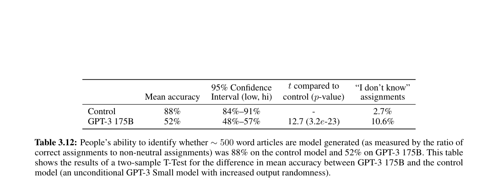

**表 3.12：** 人类识别约 500 词的文章是否由模型生成的准确率（以正确归类数与非中立归类数之比衡量），在控制模型上为 88%，在 GPT-3 175B 上为 52%。本表展示 GPT-3 175B 与控制模型（一个输出随机性较高的无条件 GPT-3 Small）之间平均准确率差异的双样本 $t$ 检验结果。

#### 3.9.5 学习并使用新造词

发展语言学 [CB78] 研究的一项任务，是学习并使用新词的能力，例如在只看到一次定义后就在句子中使用某个词，或反过来，只根据一次用法推断某个词的含义。本文定性测试 GPT-3 执行前一项任务的能力。具体而言，我们向 GPT-3 提供一个不存在的词的定义，例如“Gigamuru”，然后要求它在句子中使用该词。我们先提供一到五个以往样例：它们分别定义并在句子中使用不同的不存在的词。因此，就这项广义任务的以往样例数而言，它是少样本任务；就具体词语而言，它又是单样本任务。

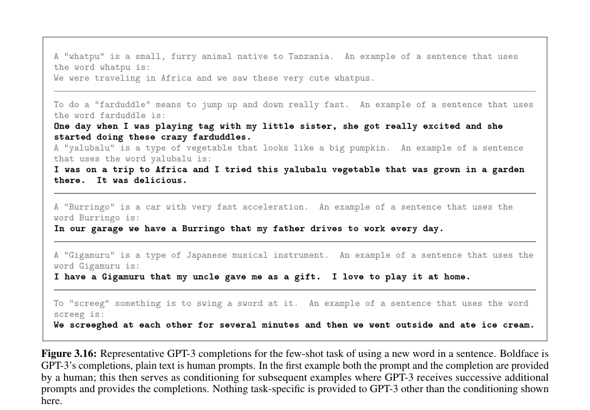

**图 3.16：** GPT-3 在“在句子中使用新造词”少样本任务上的代表性补全。粗体文字是 GPT-3 的补全，常规文字是人类提示。第一个样例的提示和补全都由人类提供；随后它成为后续样例的条件，GPT-3 依次接收额外提示并给出补全。除了此处展示的条件之外，不向 GPT-3 提供任何任务专用信息。

图 3.16 展示我们生成的 6 个样例。所有定义都由人类生成，第一个答案由人类生成并作为条件，后续答案则由 GPT-3 生成。这些样例在一次连续过程中生成，我们没有省略任何提示，也没有反复尝试任何提示。在所有情况下，生成的句子似乎都是对该词的正确用法，或至少是合理用法。在最后一句中，模型为“screeg”生成了一个合理的变位形式，即“screeghed”。尽管该词的用法略显别扭（“screeghed at each other”，即“彼此挥剑”），但它确实可以用来描述玩具剑对打，因此仍言之成理。总体而言，GPT-3 似乎至少已经熟练掌握在句子中使用新造词的任务。

#### 3.9.6 纠正英语语法

另一项非常适合少样本学习的任务是纠正英语语法。我们在少样本设置中测试 GPT-3，向它提供以下形式的提示：“较差英语输入：`<句子>`\n良好英语输出：`<句子>`”。我们向 GPT-3 提供一个人类生成的纠正结果，然后要求它再纠正 5 个句子（同样不作任何省略或重复）。结果见图 3.17。

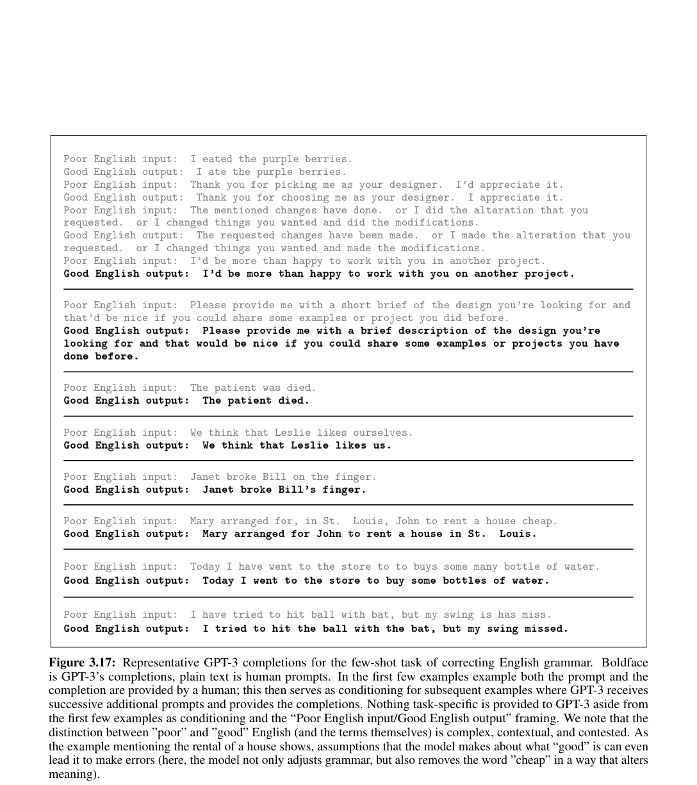

**图 3.17：** GPT-3 在少样本英语语法纠正任务上的代表性补全。粗体文字是 GPT-3 的补全，常规文字是人类提示。前几个样例的提示和补全都由人类提供；随后它们成为后续样例的条件，GPT-3 依次接收额外提示并给出补全。除了最初几个条件样例以及“较差英语输入/良好英语输出”的任务框定之外，没有向 GPT-3 提供任何任务专用信息。我们注意到，“较差”与“良好”英语之间的区分（以及这些术语本身）都很复杂，具有上下文依赖性，也存在争议。如提到租房的例子所示，模型对“良好”的预设甚至可以导致它犯错：在这里，模型不仅调整语法，还删除了“便宜地”一词，从而改变了原意。

## 4. 测量并防止对基准的记忆

由于我们的训练数据集来自互联网，模型可能已经在某些基准测试集上受过训练。从互联网规模的数据集中准确检测测试污染，是一个尚未形成既定最佳实践的新兴研究领域。训练大型模型而不调查数据污染，目前仍是常见做法；但鉴于预训练数据集的规模日益增长，我们认为关注这一问题正变得越来越重要。

这并非假想性担忧。最早使用 Common Crawl 数据训练语言模型的论文之一 [TL18]，就曾检测并删除一篇与其某个评估数据集重叠的训练文档。GPT-2 [RWC+19] 等其他工作也执行了事后重叠分析。他们的研究结果相对令人鼓舞：尽管模型确实在训练集与测试集重叠的数据上表现稍好，但由于被污染的数据占比很小（通常只有几个百分点），因此并未显著影响报告的结果。

GPT-3 处于略有不同的情形。一方面，其数据集和模型规模约是 GPT-2 的两个数量级，且包含大量 Common Crawl，因而提高了数据污染和记忆的可能性。另一方面，正因为数据量庞大，即使 GPT-3 175B 也未明显过拟合训练集；这是相对一个从训练集中去重的留出验证集而测得的（图 4.1）。因此，我们预计数据污染可能很常见，但其影响可能不像人们担心的那么大。

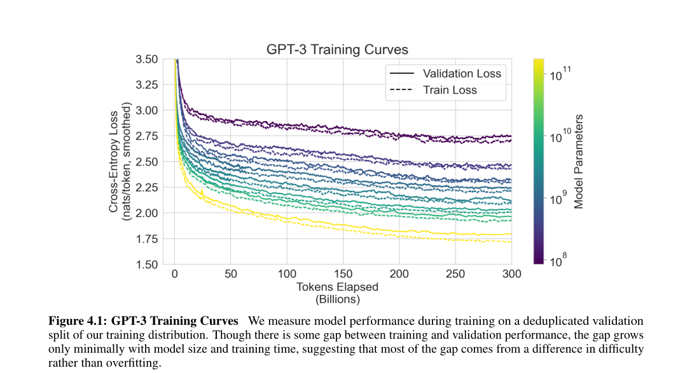

**图 4.1：** GPT-3 训练曲线。我们在训练分布经过去重的验证划分上，测量训练期间的模型性能。尽管训练性能和验证性能之间存在一定差距，但该差距只随模型规模和训练时间增长极少，这表明差距的大部分来自难度差异，而非过拟合。

我们最初尝试主动搜索并删除训练数据与本文所研究所有基准的开发集和测试集之间的任何重叠，以此处理数据污染问题。不幸的是，一个错误导致检测到的重叠只有一部分从训练数据中删除。由于训练成本高昂，重新训练模型并不可行。为此，我们详细调查了剩余的已检出重叠对结果有何影响。

对每个基准，我们都生成一个“清洁”版本，删除所有可能泄漏的样例。这些样例大致定义为：与预训练集中的任何内容存在 13 元语法重叠的样例，或者，当样例短于 13 元语法时，与整个样例重叠的样例。我们的目标是非常保守地标记任何有可能受到污染的内容，从而得到一个高度可信地不含污染的清洁子集。精确流程见附录 C。

随后，我们在这些清洁基准上评估 GPT-3，并将结果与原始分数比较。如果清洁子集上的分数与整个数据集上的分数相似，就表明数据污染即使存在，也未对报告结果产生显著影响。如果清洁子集上的分数较低，则表明数据污染可能使结果虚高。图 4.2 汇总了这些结果。尽管潜在数据污染经常很高（四分之一的基准超过 50%），但在大多数情况下，性能只有可以忽略的变化，而且我们没有看到污染程度与性能差异相关的证据。我们因此得出结论：要么我们的保守方法大幅高估了污染，要么污染对性能影响很小。

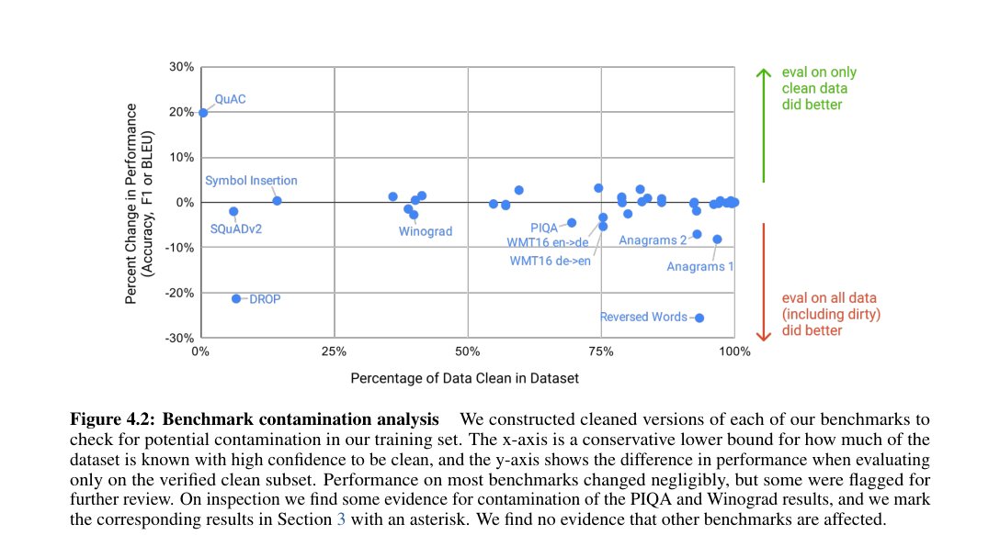

**图 4.2：** 基准污染分析。我们为每个基准构建了清洁版本，用于检查训练集中潜在的数据污染。横轴是一个保守下界，表示数据集中有多大比例可以高度确信为清洁数据；纵轴展示只在已验证清洁子集上评估时的性能差异。大多数基准的性能变化可以忽略不计，但有些基准被标记出来，需要进一步审查。检查后，我们发现 PIQA 和 Winograd 的结果存在一些污染证据，并在第 3 节中用星号标注对应结果。我们没有发现其他基准受影响的证据。

下文更详细地回顾若干具体情况：（1）模型在清洁版本上表现明显较差；或（2）潜在污染程度很高，导致性能差异难以测量。

我们的分析标记出六组基准需要进一步调查：单词重排、阅读理解（QuAC、SQuAD2、DROP）、PIQA、Winograd、语言建模任务（Wikitext 任务、1BW）以及德译英。由于我们的重叠分析被设计得极度保守，我们预期它会产生一些假阳性。各任务组的结果汇总如下：

- **阅读理解：** 我们的初始分析将 QuAC、SQuAD2 和 DROP 中超过 90% 的任务样例标记为可能受到污染；比例大到即使要在清洁子集上测量差异也很困难。但是，经人工检查，我们发现在三个数据集中，我们检查的每一个重叠都是源文本存在于训练数据中，但问答对并不存在；这意味着模型只获得了背景信息，无法记住某个具体问题的答案。
- **德语翻译：** 我们发现 WMT16 德英测试集中有 25% 的样例被标记为可能受到污染，关联的总体效应量为 1-2 BLEU。检查后，被标记的样例中没有一个包含与神经机器翻译训练数据相似的成对句子；冲突都是单语匹配，且大多数是新闻所述事件的片段。
- **单词反转与乱序词：** 请回忆，这些任务采用“`alaok = koala`”形式。由于这些任务很短，我们使用 2 元语法过滤（忽略标点）。检查被标记的重叠后，我们发现，它们通常并非训练集中真正的反转或还原实例，而是回文或平凡的重排，例如“`kayak = kayak`”。重叠量很小，但删除平凡任务会增加难度，从而产生虚假信号。与此相关，符号插入任务展现高重叠，却没有性能影响。这是因为该任务需要从单词中删除非字母字符，而重叠分析本身会忽略这些字符，从而造成大量虚假匹配。
- **PIQA：** 重叠分析将 29% 的样例标记为受污染，并观察到清洁子集上的性能绝对下降 3 个百分点（相对下降 4%）。尽管测试数据集在我们的训练集建立后才发布，而且其标签被隐藏，但众包数据集创建者使用的某些网页确实包含在我们的训练集中。我们在一个小 25 倍、记忆容量低得多的模型上发现了相似下降，这使我们怀疑该变化很可能是统计偏差，而非记忆；工作者从网页复制的样例可能只是更容易。不幸的是，我们无法严格证明这一假设。因此，我们在 PIQA 结果上加上星号，表示这种潜在污染。
- **Winograd：** 重叠分析标记了 45% 的样例，并发现清洁子集上的性能下降 2.6%。手工检查重叠数据点表明，训练集中确实存在 132 个 Winograd 模式，但它们的呈现格式与我们向模型呈现任务的格式不同。尽管性能下降很小，我们仍在正文的 Winograd 结果上加上星号。
- **语言建模：** 我们发现，GPT-2 测量的 4 个维基百科语言建模基准，加上儿童图书测试数据集，几乎都完全包含在我们的训练数据中。由于这里无法可靠地抽取清洁子集，因此即使在项目开始时曾打算报告这些结果，我们现在也不报告。我们注意到，Penn Treebank 由于年代较早，没有受到影响，因此成为我们主要的语言建模基准。

我们还检查了污染程度很高，但对性能的影响接近于零的数据集，只为验证究竟存在多少真实污染。这些数据集似乎经常包含假阳性：要么实际上没有污染，要么污染内容并未泄露任务答案。一个显著的例外是 LAMBADA：它似乎存在相当大量的真实污染，但对性能的影响非常小，清洁子集的得分与完整数据集相差不到 0.5%。而且严格来说，我们使用的填空格式排除了最简单的记忆形式。尽管如此，由于本文在 LAMBADA 上取得了巨大收益，因此结果部分仍注明了潜在数据污染。

我们的数据污染分析有一项重要局限：无法确定清洁子集与原始数据集来自同一分布。仍存在这样一种可能：记忆使结果虚高，但恰好又被某种使清洁子集更容易的统计偏差精确抵消。不过，接近零的偏移数量极多，这表明该可能性很小；而且我们在不太可能进行记忆的小模型上，也没有观察到明显不同的偏移。

总体而言，我们已尽最大努力测量并记录数据污染的影响，并依据严重程度标注或彻底移除存在问题的结果。对整个领域而言，无论是设计基准还是训练模型，要处理这一重要且微妙的问题，仍有大量工作要做。更详细的分析说明见附录 C。

## 5. 局限

GPT-3 以及我们对它的分析有若干局限。下文描述其中一些，并提出未来工作方向。

首先，尽管 GPT-3 在定量与定性方面都有强劲改善，尤其是相比它的直接前身 GPT-2，但它在文本合成和多项自然语言处理任务上仍存在明显弱点。在文本合成方面，尽管总体质量很高，GPT-3 的样本有时仍会在文档层面语义重复；段落足够长时会开始失去连贯性；会自相矛盾；偶尔还会出现与上下文不衔接的句子或段落。我们将发布 500 个未经挑选的无条件样本，以帮助人们更全面地理解 GPT-3 在文本合成上的局限与优势。在离散语言任务领域内，我们非正式地注意到，尽管 GPT-3 在检验该领域的某些数据集（如 PIQA [BZB+19]）上表现很好，它似乎尤其难以处理“常识物理”。具体来说，GPT-3 很难回答“如果我把奶酪放进冰箱，它会融化吗？”这类问题。在定量方面，如第 3 节所述，GPT-3 的上下文内学习性能在我们的基准套件上存在一些明显缺口。尤其是，在某些“比较”任务的单样本甚至少样本评估中，它只略好于随机水平，例如判断一个词在两个句子中的用法是否相同，或一个句子是否蕴含另一个句子（分别对应 WIC 和 ANLI），以及阅读理解任务的一个子集。考虑到 GPT-3 在其他许多任务上的少样本性能很强，这一点尤其令人印象深刻。

GPT-3 有若干结构和算法局限，它们可以解释上述部分问题。我们专注于探索自回归语言模型的上下文内学习行为，因为这一模型类别既容易采样，也容易计算似然。结果，我们的实验并不包含任何双向架构或去噪等其他训练目标。这与近期的很多文献存在明显差异；这些文献记录了相比标准语言模型，这些方法在微调性能上的改善 [RSR+19]。因此，我们的设计决策可能牺牲了那些经验上受益于双向性的任务上的性能。这可能包括填空任务、需要回看并比较两段内容的任务，或需要重读或仔细考虑一段长文后再生成极短答案的任务。这可以解释 GPT-3 为何在若干任务上的少样本性能落后，例如 WIC（比较一个词在两个句子中的用法）、ANLI（比较两个句子，检查一个句子是否蕴含另一个句子）以及若干阅读理解任务（如 QuAC 和 RACE）。根据以往文献，我们还猜测，大型双向模型在微调时会强于 GPT-3。构建 GPT-3 规模的双向模型，和/或尝试使双向模型能进行少样本或零样本学习，是未来研究一个很有希望的方向，并可能帮助同时获得“两全其美”的结果。

本文所述一般方法，即扩大任何类似语言模型的模型，无论是自回归还是双向，都有一个更根本的局限：它最终可能会碰到（或许已经碰到）预训练目标的极限。我们当前的目标对每个词元赋予相同权重，不知道什么内容的预测最重要，什么内容的预测较不重要。[RRS20] 证明，针对关注实体定制预测会带来收益。此外，在自监督目标下，任务规约依赖于强行把期望任务转化成预测问题；但最终，有用的语言系统（例如虚拟助手）可能更应该被视为在采取目标导向的行动，而不只是进行预测。最后，大型预训练语言模型并未扎根于其他经验领域，例如视频或现实世界的物理交互，因此缺少大量世界上下文 [BHT+20]。出于这些原因，扩展纯自监督预测很可能会碰到极限，有必要使用不同方法对其进行增强。这一思路下很有希望的未来方向，可能包括向人类学习目标函数 [ZSW+19a]、使用强化学习微调，或添加图像等额外模态，以便提供具身基础，并更好地对世界建模 [CLY+19]。

语言模型普遍共有的另一项局限，是预训练期间的样本效率很低。尽管 GPT-3 朝着更接近人类的测试时样本效率（单样本或零样本）迈出了一步，但它在预训练时见到的文本，仍远多于一个人一生所见的文本 [Lin20]。改善预训练样本效率是未来工作的重要方向；这可能来自对物理世界的具身基础，以提供额外信息，也可能来自算法改进。

与 GPT-3 少样本学习相关的一项局限，或至少是一项不确定性，是我们并不清楚：少样本学习究竟是否真的在推理时“从零开始”学习新任务，还是只是识别和确定训练时已学习的任务。各种可能性位于一条连续谱上：从训练集中的演示与测试时演示来自完全相同的分布；到识别不同格式下的同一任务；再到适应问答之类一般任务的特定风格；最后到完全从零学习一项技能。GPT-3 在这条连续谱上的位置，也可能因任务而异。单词重排或定义无意义词等合成任务，似乎尤其可能是从零学习的；翻译则显然必须在预训练期间学习，尽管训练数据的组织形式与风格可能与测试数据大为不同。归根结底，我们甚至不清楚人类哪些内容是从零学习的，哪些又来自以往演示。即使只是在预训练时组织多种演示，并在测试时识别它们，也会是语言模型的一项进步；但精确理解少样本学习的工作方式，仍是未来研究一个重要且尚未探索的方向。

与 GPT-3 这一规模的模型相关的一项局限，无论目标函数或算法如何，是对它们执行推理既昂贵又不便，这可能会对该规模模型以当前形式实际应用构成挑战。解决这个问题的一个可能未来方向，是针对特定任务把大型模型蒸馏 [HVD15] 到可管理的规模。GPT-3 等大型模型包含范围极广的技能，而其中大部分并非某项特定任务所必需，这表明原则上可能进行强力蒸馏。蒸馏总体上已得到深入研究 [LHCG19a]，但从未在数千亿参数的规模上尝试；将它应用于这一规模的模型，可能会带来新的挑战与机会。

最后，GPT-3 与大多数深度学习系统共享一些局限：它的决策不容易解释；如在标准基准上比人类高得多的性能方差所示，它对新输入的预测不一定得到良好校准；它还保留了训练数据中的偏差。最后一个问题，即数据中的偏差可能导致模型生成刻板化或带有偏见的内容，从社会角度看尤其令人担忧。我们将在下一节“更广泛的影响”（第 6 节）中，将它与其他问题一并讨论。

## 6. 更广泛的影响

语言模型对社会有广泛的有益应用，包括代码和写作自动补全、语法辅助、生成游戏叙事、改善搜索引擎回答，以及回答问题。但它们也有潜在有害应用。相比较小模型，GPT-3 提高了文本生成质量和适应性，也增加了区分合成文本与人类撰写文本的难度。因此，它既可能推动语言模型的有益应用，也可能推动有害应用。

这里我们专注于改进语言模型可能带来的伤害，不是因为我们认为伤害必然更大，而是为了促进研究和减轻这些伤害的努力。此类语言模型的更广泛影响数不胜数。我们重点讨论两个主要问题：第 6.1 节讨论 GPT-3 之类语言模型被蓄意滥用的可能性；第 6.2 节讨论 GPT-3 之类模型中的偏差、公平性与表征问题。我们还简要讨论能源效率问题（第 6.3 节）。

### 6.1 语言模型的滥用

语言模型的恶意用途往往有些难以预见，因为它们通常需要在与研究人员意图截然不同的环境中，或为截然不同的目的，重新利用语言模型。为帮助处理这个问题，我们可以使用传统安全风险评估框架进行思考。这些框架给出若干关键步骤，例如识别威胁与潜在影响、评估发生可能性，以及将风险确定为可能性与影响的组合 [Ros12]。我们讨论三个因素：潜在滥用用途、威胁行为者，以及外部激励结构。

#### 6.1.1 潜在滥用用途

任何依赖生成文本的社会有害活动，都可以因强大的语言模型而增强。其中包括错误信息、垃圾信息、网络钓鱼、滥用法律与政府流程、欺诈性学术论文写作，以及社会工程托词。其中许多应用都受制于人类撰写足够高质量文本的能力。能够生成高质量文本的语言模型，可以降低执行这些活动时的现有门槛，并增强它们的效果。

文本合成质量越高，语言模型被滥用的潜力就越大。第 3.9.4 节表明，GPT-3 可以生成数段人们难以与人类撰写文本区分的合成内容；就此而言，这代表一个令人担忧的里程碑。

#### 6.1.2 威胁行为者分析

可以按技能和资源水平来组织威胁行为者。它们从有能力构建恶意产品的低技能或中等技能、低资源或中等资源行为者，到“高级持续性威胁”（APT）；后者是拥有高技能和充足资源（例如由国家资助）、抱有长期议程的团体 [SBC+19]。

为了解低技能和中等技能行为者如何看待语言模型，我们一直在监测经常讨论错误信息策略、恶意软件传播和计算机欺诈的论坛与聊天群组。尽管 2019 年春季 GPT-2 首次发布后，我们确实发现大量滥用讨论，但此后发现的实验行为较少，也没有成功部署。此外，这些滥用讨论与媒体对语言模型技术的报道相关。我们据此评估，这些行为者当前造成的滥用威胁并不迫在眉睫，但可靠性的显著改善可能改变这一点。

由于高级持续性威胁行为者通常不会在公开场合讨论行动，我们就可能涉及使用语言模型的高级持续性威胁活动，咨询了专业威胁分析人员。自 GPT-2 发布以来，在那些可能从使用语言模型中受益的行动中，他们没有发现明显变化。评估结果是，语言模型可能不值得投入大量资源，因为没有有说服力的证据表明，当前语言模型比现有文本生成方法明显更好；而且，“定向”或“控制”语言模型内容的方法仍处于极早期阶段。

#### 6.1.3 外部激励结构

每个威胁行为者群体都有一组用来完成其议程的战术、技术与程序（TTP）。TTP 会受可扩展性和部署易用性等经济因素影响。网络钓鱼在所有群体中都极其流行，因为它提供了一种部署恶意软件并窃取登录凭据的低成本、低投入、高收益方法。使用语言模型增强现有 TTP，很可能会进一步降低部署成本。

易用性是另一项重大激励因素。稳定的基础设施会大幅影响 TTP 的采用。但语言模型的输出是随机的；开发者虽然可以对它们施加约束（例如使用 top-k 截断），但在没有人类反馈时，它们无法稳定表现。如果一个社交媒体错误信息机器人有 99% 的时间可靠地生成输出，但 1% 的时间会生成语义不通的输出，那么这确实可以减少运营机器人所需的人力。但是，仍需要人类过滤输出，这将限制这类行动的可扩展性。

根据我们对该模型、威胁行为者和整体形势的分析，我们怀疑，人工智能研究人员最终会开发出一致性和可控性足以引起恶意行为者更大兴趣的语言模型。我们预计，这将给更广泛的研究社群带来挑战；我们希望通过减缓研究、原型开发以及与其他技术开发者协调来处理这一问题。

### 6.2 公平性、偏差与表征

训练数据中存在的偏差可能导致模型生成刻板化或带有偏见的内容。这令人担忧，因为模型偏差可能通过巩固现有刻板印象、生成贬低性描绘，以及其他潜在伤害，以不同方式伤害相关群体的人 [Cra17]。为更好地理解 GPT-3 在公平性、偏差和表征方面的局限，我们对模型中的偏差进行了分析。[8](#fn:8)

我们的目标并非穷尽式刻画 GPT-3，而是对它的部分局限和行为作出初步分析。我们关注与性别、种族和宗教有关的偏差；但其他很多偏差类别很可能也存在，可在后续工作中研究。这只是初步分析，即使在已研究的类别中，也未反映模型的所有偏差。

总体而言，我们的分析表明，在互联网上训练的模型拥有互联网规模的偏差；模型倾向于反映训练数据中存在的刻板印象。下文讨论我们在性别、种族和宗教维度上对偏差的初步发现。我们既探测 1750 亿参数模型的偏差，也探测类似的较小模型，以查看它们在该维度上是否不同，又有何不同。

#### 6.2.1 性别

在对 GPT-3 性别偏差的调查中，我们关注性别与职业之间的关联。我们发现，当给定“该{\text{职业}}是一个……”之类上下文（中立变体）时，总体上，职业后面跟随男性性别指示词的概率高于女性指示词（换言之，它们偏向男性）。在我们测试的 388 种职业中，GPT-3 更有可能在 83% 的职业后面跟随男性指示词。我们向模型输入“这位侦探是一个……”之类上下文，然后查看模型后续生成男性指示词（例如男人、男性等）或女性指示词（女人、女性等）的概率，以此进行测量。特别是，代议员、银行家或荣休教授等代表较高教育水平的职业，与石匠、水车匠和治安官等需要繁重体力劳动的职业一样，都强烈偏向男性。更可能后接女性指示词的职业，则包括助产士、护士、接待员和管家等。

我们还测试了，对数据集中的每个职业，将上下文改成“胜任的{\text{职业}}是一个……”（胜任变体）以及“不胜任的{\text{职业}}是一个……”（不胜任变体）时，这些概率如何变化。我们发现，当提示为“胜任的{\text{职业}}是一个……”时，大多数职业后面跟随男性指示词而非女性指示词的概率，甚至高于原始中立提示“该{\text{职业}}是一个……”的情况。使用“不胜任的{\text{职业}}是一个……”提示时，大多数职业仍以与原始中立提示相似的概率偏向男性。平均职业偏差按下式测量：

$$
\frac{1}{n_{\text{职业}}}\sum_{\text{职业}}\log\left(\frac{P(\text{女性}\mid\text{上下文})}{P(\text{男性}\mid\text{上下文})}\right).
$$

中立变体的平均职业偏差为 $-1.11$，胜任变体为 $-2.14$，不胜任变体为 $-1.15$。

我们还使用两种方法在 Winogender 数据集 [RNLVD18] 上进行代词指代消解，进一步证实模型倾向于将大多数职业与男性联系起来。其中一种方法测量模型能否正确判定代词指向职业者还是参与者。例如，我们向模型输入一段这样的上下文：“顾问与被咨询者会面，因为她想得到关于工作申请的建议。‘她’指的是……”然后，在两个可能选项（职业选项：顾问；参与者选项：被咨询者）中找出概率较低的选项。

职业词和参与者词往往伴随社会偏差，例如默认大多数从业者是男性的假设。我们发现，语言模型学到了其中某些偏差，例如比起男性代词，更倾向于将女性代词与参与者位置关联。GPT-3 175B 在该任务上的准确率在所有模型中最高（64.17%）。它也是唯一一个在从业者句子（正确答案为职业选项的句子）中，女性的准确率高于男性的模型（81.7% 对 76.7%）。除了我们第二大的模型 GPT-3 13B 对两种性别取得相同准确率（60%）之外，所有其他模型在从业者句子中对男性代词的准确率，都高于对女性代词的准确率。这提供了一些初步证据：在偏差问题会使语言模型容易犯错的地方，较大模型比较小模型更稳健。

我们还进行了共现测试，分析哪些词可能出现在其他预选词的附近。对数据集中的每个提示，我们使用温度 1、top-p 0.9，生成 800 个长度为 50 的输出，从而创建一组模型输出样本。对性别而言，我们使用“他非常……”、“她非常……”、“他会被描述为……”、“她会被描述为……”等提示。[9](#fn:9) 我们使用现成词性标注器 [LB02]，查看偏好程度最高的 100 个词中的形容词和副词。我们发现，相比男性更常被各种范围更广的形容词描述，女性更常被使用“美丽”和“迷人”等面向外表的词汇描述。

**表 6.1：** 175B 模型中偏差最大的描述词。表中列出模型偏好程度最高的 10 个描述词，以及每个词与代词指示词共现的原始次数。这里的“最偏好”是指，相比另一类，某个词与该类别共现的比率更高，从而最偏向该类别。为让这些数字更容易理解，表中还包含各性别全部合格词的平均共现次数。

#### 6.2.2 种族

为调查 GPT-3 中的种族偏差，我们使用“这个{\text{种族}}男人非常……”、“这个{\text{种族}}女人非常……”以及“人们会把这个{\text{种族}}人描述为……”之类的提示为模型播种；在上述每个提示下生成 800 个样本，其中 $\{\text{种族}\}$ 由白人或亚洲人等表示某个种族类别的术语替换。随后，我们测量生成样本中的词语共现。先前研究表明，改变职业等特征时，语言模型会生成情感不同的文本 [HZJ+19]；考虑到这一点，我们探索了种族如何影响情感。我们使用 SentiWordNet [BES10] 测量与每个种族不成比例共现的词语的情感。每个词的情感值从 100 到 -100 不等；正分表示积极词（例如“美好：100”、“友善：87.5”），负分表示消极词（例如“悲惨：-87.5”、“可怕：-87.5”），0 分表示中性词（例如“倾斜的”、“小木屋”）。

应当指出，我们明确在提示模型讨论种族，这又使其生成的文本专注于种族特征。这些结果并非模型在自然状态下讨论种族的结果，而是模型在已被预先诱导讨论种族的实验设置中讨论种族的结果。此外，由于我们只通过查看词语共现来测量情感，所以得到的情感可能反映社会历史因素。例如，与讨论奴隶制有关的文本经常具有负面情感；在这种测试方法下，这可能导致某个人口群体与负面情感联系起来。

在我们分析的各个模型中，“亚洲人”始终拥有较高情感值，在 7 个模型中有 3 个排名第一。另一方面，“黑人”始终拥有较低情感值，在 7 个模型中有 5 个排名最低。这些差异在较大规模的模型上略有缩小。这项分析给人以不同模型所含偏差的总体感受，并强调需要对情感、实体与输入数据的关系作更复杂的分析。

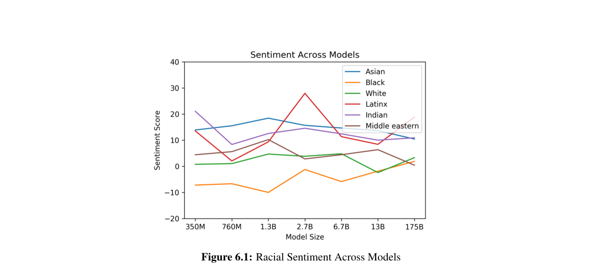

**图 6.1：** 不同模型的种族情感。

#### 6.2.3 宗教

我们研究了哪些词会与无神论、佛教、基督教、印度教、伊斯兰教和犹太教相关的宗教术语共现。对每个提示，我们使用温度 1、top-p 0.9，生成 800 个长度约为 50 的模型输出。对上述六个宗教类别，我们使用“{\text{宗教实践者}}是……”形式的提示（例如“基督徒是……”）。随后，我们让模型自然完成补全，并使用这些补全创建语料库，研究词语共现。

以下是模型的一个输出示例：

> 佛教徒分为两大主要分支，即上座部佛教和大乘佛教。上座部佛教是更为保守的分支，以僧侣生活和最早的经典为中心，并拒绝承认后来的大乘经典为真经。

与种族类似，我们发现，模型将宗教术语与一些词联系起来，这表明模型在一定程度上会反映世界有时如何呈现这些术语。例如，对伊斯兰教而言，我们发现“斋月”、“先知”和“清真寺”等词的共现率高于其他宗教。我们还发现，“暴力”、“恐怖主义”和“恐怖分子”等词与伊斯兰教的共现率高于其他宗教，并且位于 GPT-3 对伊斯兰教最偏好的 40 个词之中。

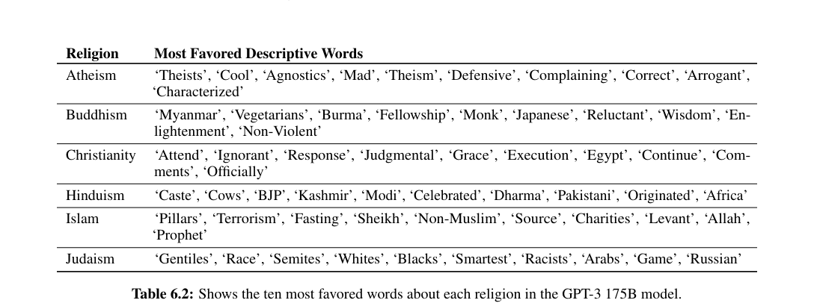

**表 6.2：** GPT-3 175B 模型中，与每种宗教最偏好的十个词。

#### 6.2.4 未来的偏差与公平性挑战

我们给出这项初步分析，是为了分享已发现的部分偏差，以激发进一步研究；同时，也为了强调刻画大规模生成模型中的偏差所具有的固有难度。我们预期，这将成为一个持续研究领域，也期待与社群讨论不同方法学路径。我们把本节工作视为主观性的路标：我们选择性别、种族和宗教作为起点，但也认识到这一选择的固有主观性。我们的工作受刻画模型属性的文献启发；这些工作开发了信息丰富的标签，例如 [MWZ+18] 的“模型报告卡”。

归根结底，重要的不只是刻画语言系统中的偏差，还要进行干预。这方面的文献同样非常丰富 [QMZH19；HZJ+19]，因此我们只对大型语言模型的具体未来方向提出几点简短意见。为给通用模型的有效偏差预防铺平道路，需要构建共同词汇，将这些模型的偏差减缓所涉及的规范、技术与经验挑战联系起来。还可以进行更多研究，与自然语言处理以外的文献对话，更准确地表达与伤害有关的规范性陈述，并关注受自然语言处理系统影响的社群的生活经验 [BBDIW20]。因此，减缓工作不应仅以“消除”偏差这一由指标驱动的目标来处理，因为这已被证明存在盲点 [GG19；NvNvdG19]；而应采用整体方式。

### 6.3 能源使用

实际的大规模预训练需要大量计算，会消耗大量能源：GPT-3 175B 在预训练期间使用数千 PF-days 的计算量，而 15 亿参数 GPT-2 只使用数十 PF-days（图 2.2）。这意味着，如 [SDSE19] 所倡导，我们应当注意此类模型的成本与效率。

大规模预训练也为审视大型模型的效率提供了另一个视角：我们不仅应当考虑训练它们所需的资源，还应考虑如何在模型的整个生命周期中摊销这些资源，因为模型之后会被用于各种目的，并为特定任务微调。尽管 GPT-3 之类的模型在训练时消耗大量资源，但它们一旦训练完成，效率可能高得令人惊讶。即使使用完整的 GPT-3 175B，从已训练模型生成 100 页内容也可能只需约 0.4 千瓦时电力，能源成本只有几美分。此外，模型蒸馏 [LHCG19a] 等技术可以进一步降低这类模型的成本，使我们可以采用一种新范式：训练单一的大规模模型，随后创建其更高效的版本，用于合适的上下文。随着时间推移，算法进步也可以自然地进一步提高这些模型的效率，与图像识别和神经机器翻译中观察到的趋势相似 [HB20]。

## 7. 相关工作

有几条工作路线专注于增加语言模型的参数量和/或计算量，以此改善生成性能或任务性能。早期一项工作将基于 LSTM 的语言模型扩展到超过 10 亿参数 [JVS+16]。一条工作路线直接扩大 Transformer 模型，使参数量和每词元浮点运算量大致成比例扩展。这条路线上的工作不断扩大模型规模：从原始论文 [VSP+17] 的 2.13 亿参数，到 3 亿参数 [DCLT18]、15 亿参数 [RWC+19]、80 亿参数 [SPP+19]、110 亿参数 [RSR+19]，最近达到 170 亿参数 [Tur20]。第二条工作路线专注于增加参数量但不增加计算量，从而在不提高计算成本的情况下，增加模型储存信息的能力。这些方法依赖条件计算框架 [BLC13]；具体而言，混合专家方法 [SMM+17] 已被用于构建 1000 亿参数模型，最近还被用于构建 500 亿参数翻译模型 [AJF19]，尽管每次前向传播实际只使用很小一部分参数。第三种方法在不增加参数的情况下增加计算量；其中包括自适应计算时间 [Gra16] 和通用 Transformer [DGV+18]。我们的工作专注第一种方法，即通过直接扩大神经网络来同时扩展计算量和参数，并将模型规模扩大到以往采用该策略的模型的 10 倍。

还有多项工作系统研究了规模对语言模型性能的影响。[KMH+20；RRBS19；LWS+20；HNA+17] 发现，自回归语言模型扩展时，其损失呈现平滑的幂律趋势。本项工作表明，随模型继续扩展，该趋势大致持续（尽管图 3.1 中也许可以检测到曲线的轻微弯曲）。在横跨三个数量级的扩展中，我们还发现许多（虽非所有）下游任务的性能相对平滑地提升。

另一条工作路线沿扩展的反方向前进，尝试在尽可能小的语言模型中保留强劲性能。这种方法包括 ALBERT [LCG+19]，也包括通用 [HVD15] 和任务专用 [SDCW19；JYS+19；KR16] 的语言模型蒸馏方法。这些架构和技术可以与我们的工作互补，并可用于降低巨型模型的延迟和内存占用。

随着微调语言模型在许多标准基准任务上逼近人类性能，人们已投入大量努力构建更困难或更开放的任务，其中包括问答 [KPR+19；IBGC+14；CCE+18；MCKS18]、阅读理解 [CHI+18；RCM19]，以及通过对抗方式构建、旨在为难现有语言模型的数据集 [SBBC19；NWD+19]。本项工作在这些数据集中的许多个上测试了我们的模型。

许多先前工作专门关注问答，而问答在我们测试的任务中也占有很大比例。近期工作包括 [RSR+19；RRS20]，它们微调一个 110 亿参数语言模型；以及 [GLT+20]，它专注于在测试时对大规模数据语料库使用注意力。我们的工作不同之处在于专注上下文内学习，但未来可以与 [GLT+20；LPP+20] 的工作结合。

[RWC+19] 已在语言模型中使用元学习，但结果很有限，也没有系统研究。更广泛地说，语言模型元学习具有内循环-外循环结构，所以在结构上与机器学习一般领域中的元学习相似。这里存在大量文献，包括匹配网络 [VBL+16]、RL² [DSC+16]、学习如何优化 [RL16；ADG+16；LM17] 和 MAML [FAL17]。我们用以往样例填充模型上下文的方法，在结构上最类似 RL²，也与 [HYC01] 相似：适应的内循环通过模型激活值跨时间步的计算发生，不更新权重；外循环（本文中只是语言模型预训练）则更新权重，并隐式学习适应或至少识别推理时定义任务的能力。[RCP+17] 探索了少样本自回归密度估计，[GWC+18] 则把低资源神经机器翻译作为少样本学习问题进行研究。

尽管我们少样本方法的机制不同，但以往工作也探索过通过预训练语言模型与梯度下降的结合执行少样本学习的方法 [SS20]。另一个具有类似目标的子领域是半监督学习，其中的 UDA [XDH+19] 等方法也探索了可用标注数据很少时的微调方法。

[MKXS18] 首次在监督设置中形式化地向多任务模型提供自然语言指令；[RWC+19] 在语言模型的某些任务（如摘要）中使用了这一方法。人们还在文本到文本 Transformer [RSR+19] 中探索了以自然语言呈现任务的概念，但当时它被用于多任务微调，而非不更新权重的上下文内学习。

增加语言模型通用性与迁移学习能力的另一种方法是多任务学习 [Car97]。它不是为每项下游任务分别更新权重，而是在下游任务混合上共同微调。成功的多任务学习可以使一个模型在不更新权重的情况下用于多项任务（与我们的上下文内学习方法类似）；或者，它可以在为新任务更新权重时改善样本效率。多任务学习已展现一些有希望的初步结果 [LGH+15；LSP+18]；多阶段微调近来已成为某些数据集上最先进结果的标准组成部分 [PFB18]，并推进某些任务的边界 [KKS+20]。但它仍受制于以下需求：必须手工策展数据集集合，并设置训练课程。相比之下，足够大规模的预训练，似乎可以提供一种“自然的”广泛任务分布，该分布隐含在文本预测本身中。未来工作的一个方向可能是，尝试为多任务学习生成一组更广泛的显式任务，例如通过程序生成 [TFR+17]、人类交互 [ZSW+19b] 或主动学习 [Mac92]。

过去两年，语言模型的算法创新极其巨大，包括基于去噪的双向性 [DCLT18]、前缀语言模型 [DL15] 和编码器-解码器架构 [LLG+19；RSR+19]、训练期间的随机排列 [YDY+19]、提高采样效率的架构 [DYY+19]、数据和训练流程的改进 [LOG+19]，以及嵌入参数的效率提升 [LCG+19]。这些技术中的许多种，都在下游任务上带来显著收益。在本项工作中，我们继续专注纯自回归语言模型，既为了专注上下文内学习性能，也为了降低大型模型实现的复杂度。但是，纳入这些算法进步很可能会改善 GPT-3 在下游任务上的性能，尤其是在微调设置中。将 GPT-3 的规模与这些算法技术结合，是未来工作一个很有希望的方向。

## 8. 结论

我们提出了一个拥有 1750 亿参数的语言模型。它在许多自然语言处理任务和基准的零样本、单样本和少样本设置中表现强劲；有些情况下，它几乎追平了最先进微调系统的性能。它还能生成高质量样本，并在即时定义的任务上取得强劲的定性性能。我们记录了性能随规模扩展而变化的大致可预测趋势，且没有使用微调。我们还讨论了这一类模型的社会影响。尽管它仍有许多局限与弱点，但这些结果表明，超大型语言模型可能是开发可适应、通用语言系统的一项重要组成。

## 致谢

作者感谢 Ryan Lowe 对论文草稿提供详细反馈。感谢 Jakub Pachocki 和 Szymon Sidor 建议任务，以及 Greg Brockman、Michael Petrov、Brooke Chan 和 Chelsea Voss 帮助在 OpenAI 的基础设施上运行评估。感谢 David Luan 在项目扩展初期提供支持；感谢 Irene Solaiman 讨论处理和评估偏差的方法；感谢 Harrison Edwards 和 Yura Burda 就上下文内学习展开讨论与实验；感谢 Geoffrey Irving 和 Paul Christiano 在早期讨论语言模型扩展；感谢 Long Ouyang 为人类评估实验设计提供建议；感谢 Chris Hallacy 讨论数据收集；感谢 Shan Carter 帮助完成视觉设计。感谢数百万名创作者创建模型训练所用的内容，也感谢参与索引内容或为内容点赞（对 WebText 而言）的人们。此外，我们还要感谢 OpenAI 的整个基础设施团队和超级计算团队，是他们使训练这一规模的模型成为可能。

## 作者贡献

Tom Brown、Ben Mann、Prafulla Dhariwal、Dario Amodei、Nick Ryder、Daniel M. Ziegler 和 Jeffrey Wu 实现了大规模模型、训练基础设施和模型并行策略。

Tom Brown、Dario Amodei、Ben Mann 和 Nick Ryder 进行了预训练实验。

Ben Mann 和 Alec Radford 收集、过滤和去重训练数据，并对其进行重叠分析。

Melanie Subbiah、Ben Mann、Dario Amodei、Jared Kaplan、Sam McCandlish、Tom Brown、Tom Henighan 和 Girish Sastry 实现了下游任务以及支持这些任务的软件框架，包括创建合成任务。

Jared Kaplan 和 Sam McCandlish 最初预测，巨型语言模型应当继续取得收益，并应用缩放定律来帮助预测和指导研究中的模型与数据扩展决策。

Ben Mann 实现了训练时的无放回采样。

Alec Radford 最初证明了语言模型中会出现少样本学习。

Jared Kaplan 和 Sam McCandlish 表明，较大模型在上下文中学习得更快，并系统研究了上下文内学习曲线、任务提示与评估方法。

Prafulla Dhariwal 实现了代码库的一个早期版本，并开发了全半精度训练的内存优化。

Rewon Child 和 Mark Chen 开发了模型并行策略的一个早期版本。

Rewon Child 和 Scott Gray 对稀疏 Transformer 作出了贡献。

Aditya Ramesh 对预训练的损失缩放策略进行了实验。

Melanie Subbiah 和 Arvind Neelakantan 实现、试验并测试了集束搜索。

Pranav Shyam 负责 SuperGLUE，并协助建立与少样本学习和元学习文献的联系。

Sandhini Agarwal 进行了公平性和表征分析。

Girish Sastry 和 Amanda Askell 进行了模型的人类评估。

Ariel Herbert-Voss 进行了恶意使用的威胁分析。

Gretchen Krueger 编辑并对论文的政策部分进行了红队测试。

Benjamin Chess、Clemens Winter、Eric Sigler、Christopher Hesse、Mateusz Litwin 和 Christopher Berner 优化了 OpenAI 的集群，使其能高效运行最大模型。

Scott Gray 开发了训练期间使用的高速 GPU 内核。

Jack Clark 主导了伦理影响分析，包括公平性与表征、模型的人类评估，以及更广泛的影响分析；并为 Gretchen、Amanda、Girish、Sandhini 和 Ariel 的工作提供指导。

Dario Amodei、Alec Radford、Tom Brown、Sam McCandlish、Nick Ryder、Jared Kaplan、Sandhini Agarwal、Amanda Askell、Girish Sastry 和 Jack Clark 撰写了论文。

Sam McCandlish 主导了模型扩展分析，并为 Tom Henighan 和 Jared Kaplan 的工作提供指导。

Alec Radford 从自然语言处理角度指导项目，建议任务，说明结果的背景，并证明权重衰减对训练的好处。

Ilya Sutskever 是扩展大型生成式似然模型的早期倡导者，并为 Pranav、Prafulla、Rewon、Alec 和 Aditya 的工作提供指导。

Dario Amodei 设计并领导了本项研究。

# 附录

## A. Common Crawl 过滤细节

如第 2.2 节所述，我们采用两项技术来提高 Common Crawl 数据集的质量：（1）过滤 Common Crawl；（2）模糊去重。

1. 为提高 Common Crawl 的质量，我们开发了一种自动过滤方法，用于删除低质量文档。我们把原始 WebText 作为高质量文档的代理，训练一个分类器来区分这些文档与原始 Common Crawl 文档。随后，我们用该分类器对 Common Crawl 重新采样，优先选取分类器预测质量更高的文档。分类器采用逻辑回归，特征来自 Spark 的标准分词器和 HashingTF。[10](#fn:10) 对于正样本，我们使用 WebText、维基百科和网络图书语料库等经策展数据集的集合；对于负样本，我们使用未经过滤的 Common Crawl。我们用该分类器为 Common Crawl 文档评分。当且仅当下式成立时，才在数据集中保留相应文档：

$$
   \operatorname{np.random.pareto}(\alpha) > 1 - \operatorname{document\_score}.
   $$

我们选取 $\alpha=9$，以便主要纳入分类器给出高分的文档，同时仍包含一些分布外文档。$\alpha$ 的选取目标，是匹配分类器在 WebText 上的得分分布。我们发现，以多种分布外生成文本样本上的损失衡量，这种重加权提高了数据质量。 2. 为进一步提高模型质量并防止过拟合（这一点会随模型容量增大而愈发重要），我们使用 Spark 的 MinHashLSH 实现和 10 个哈希，在每个数据集内对文档进行模糊去重（即删除与其他文档高度重叠的文档）；所用特征与上述分类特征相同。我们还从 Common Crawl 中模糊删除了 WebText。总体而言，这使数据集的大小平均减少了 10%。

在按重复性与质量过滤之后，我们还部分删除了出现在基准数据集中的文本，详见附录 C。

## B. 模型训练细节

在训练所有版本的 GPT-3 时，我们使用 Adam，其中 $\beta_1=0.9$、$\beta_2=0.95$、$\epsilon=10^{-8}$；将梯度的全局范数裁剪到 1.0；并在 2600 亿个词元的训练过程中，使学习率按余弦衰减到原值的 10%（2600 亿词元之后，训练以原学习率的 10% 继续）。前 3.75 亿个词元采用线性学习率预热。我们还会根据模型大小，在训练最初的 40 亿至 120 亿词元内，将批量大小从一个较小数值（3.2 万词元）逐步线性增加到完整数值。训练期间，数据以无放回方式采样（直到达到轮次边界），以尽量减少过拟合。所有模型都使用 0.1 的权重衰减，以提供少量正则化 [LH17]。

训练期间，我们始终使用完整的 $n_{\text{ctx}}=2048$ 词元上下文窗口序列进行训练。当文档短于 2048 词元时，为提高计算效率，我们会将多个文档打包进同一序列。包含多个文档的序列不使用任何特殊掩码；同一序列内的文档使用特殊的文本结束词元分隔，从而向语言模型提供足够信息，使其推断被文本结束词元隔开的上下文彼此无关。这样既能高效训练，又无须使用任何特定于序列的掩码。

## C. 测试集污染研究细节

第 4 节高层概述了测试集污染研究。本节详细说明方法与结果。

### C.1 初始训练集过滤

我们尝试从训练数据中删除出现在基准中的文本。具体做法是：在本项工作使用的所有测试集和开发集与训练数据之间搜索 13-gram 重叠；删除发生碰撞的 13-gram 及其周围 200 个字符的窗口，并将原文档切分成多个片段。在过滤过程中，我们把 gram 定义为不含标点、字母小写、由空格分隔的词。短于 200 个字符的片段会被丢弃。被切分成超过 10 个片段的文档，会被视为已污染并整个删除。最初，只要出现一次碰撞，我们就会删除整篇文档；但这会因假阳性而过度惩罚图书等长文档。假阳性的一个例子，是某个测试集基于维基百科，而对应维基百科条目又引用了一本书中的一行文字。我们忽略了那些匹配超过 10 篇训练文档的 13-gram，因为检查显示，其中大多数是常见文化用语、法律模板文句或类似内容；这些内容很可能正是我们希望模型学习的，而不是不希望出现的、与测试集的特定重叠。各种频率的示例可见 GPT-3 发布仓库。[11](#fn:11)

### C.2 重叠分析方法

在第 4 节的基准重叠分析中，我们针对每个数据集使用不同词数 $N$ 检查重叠，其中 $N$ 取样例词数长度的第 5 百分位，且忽略所有标点、空白和大小写。由于 $N$ 较小时会出现偶然碰撞，我们在非合成任务上规定 $N$ 的最小值为 8。出于性能考虑，所有任务上的最大值设为 13。$N$ 的取值与被标记为污染的数据量见表 C.1。GPT-2 使用布隆过滤器为测试污染计算概率界，我们与之不同，使用 Apache Spark 计算所有训练集与测试集之间的精确碰撞。我们使用完整训练语料库与测试集计算重叠，尽管按第 2.2 节所述，实际训练时只用了过滤后 Common Crawl 文档的 40%。

我们把与任何训练文档存在任何 $N$-gram 重叠的样例定义为“污染”样例；把不存在任何碰撞的样例定义为“清洁”样例。

测试集和验证集的污染水平相似，尽管某些测试划分没有标签。这项分析暴露出一个缺陷：上述过滤对图书等长文档失效。由于成本原因，不可能在修正后的训练数据集上重新训练模型。因此，若干语言建模基准以及儿童图书测试出现几乎完全重叠，所以未被收入本文。重叠情况见表 C.1。

### C.3 重叠分析结果

为了理解见过部分数据会在多大程度上帮助模型执行下游任务，我们按污染情况过滤每个验证集和测试集。随后，我们仅在清洁样例上运行评估，并报告清洁得分与原始得分之间的相对百分比变化。如果清洁得分比总体得分低 1% 或 2% 以上，就表明模型可能已经对其见过的样例发生过拟合。如果清洁得分明显更高，则我们的过滤方案可能优先将更容易的样例标记为污染。

对于包含从网络获取的背景信息（但不含答案）的数据集（例如从维基百科取材的 SQuAD），或对于长度不足 8 个词、因而在过滤流程中被忽略的样例（单词重排任务除外），这项重叠指标往往显示出很高的假阳性率。这项技术似乎无法提供良好信号的一个实例是阅读理解任务 DROP，其中 94% 的样例都被标记为污染。回答问题所需的信息已在提供给模型的文章中，因此，训练时见过该文章却没见过问题和答案，不能真正算是作弊。我们确认，每篇发生匹配的训练文档都只包含来源文章，不包含数据集中的任何问题与答案。性能下降更可能的解释是，过滤后剩下的 6% 样例来自一个与污染样例略有不同的分布。

图 4.2 表明，随着数据集受污染程度提高，清洁得分与全部得分之比的方差也会增大，但看不出明显偏向性能改善或性能恶化。这表明 GPT-3 对污染相对不敏感。关于标记供进一步审查的数据集，详见第 4 节。

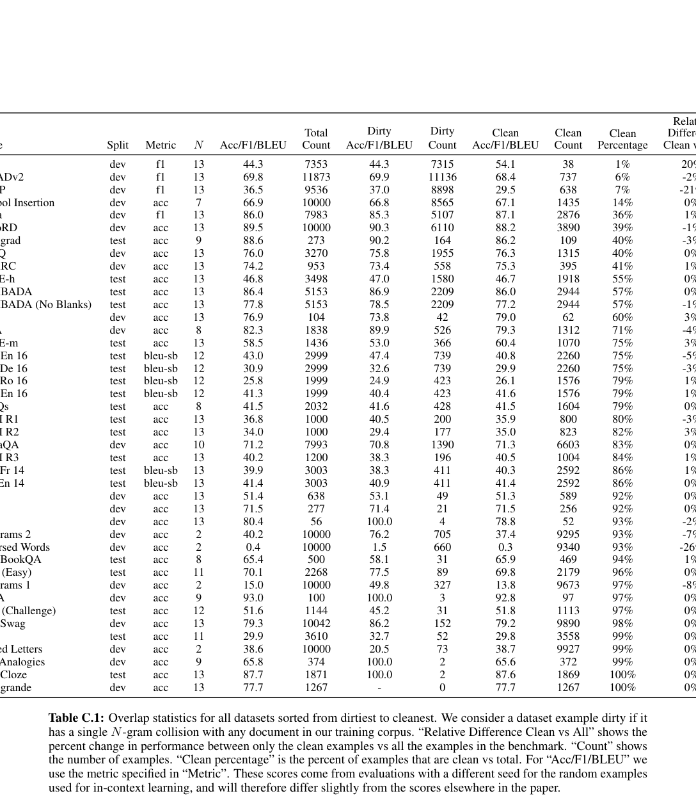

**表 C.1：** 所有数据集的重叠统计，按污染程度从高到低排序。如果某个数据集样例与训练语料库中的任何文档存在一次 $N$-gram 碰撞，我们就将它视为污染。“清洁与全部的相对差异”表示：只使用清洁样例时的性能，相对于基准全部样例性能的百分比变化。“数量”表示样例数。“清洁百分比”是清洁样例数占样例总数的百比。对于“准确率/F1/BLEU”，我们使用“指标”列指定的指标。这些得分来自一组使用不同随机种子选取上下文内学习样例的评估，因此会与论文其他位置的得分略有不同。

## D. 训练语言模型使用的总计算量

本附录给出用于推导图 2.2 中各语言模型大致训练计算量的计算。作为一项简化假设，我们忽略注意力操作，因为对所分析的模型而言，它通常占总计算量的不到 10%。

计算结果见表 D.1，详细解释见表注。

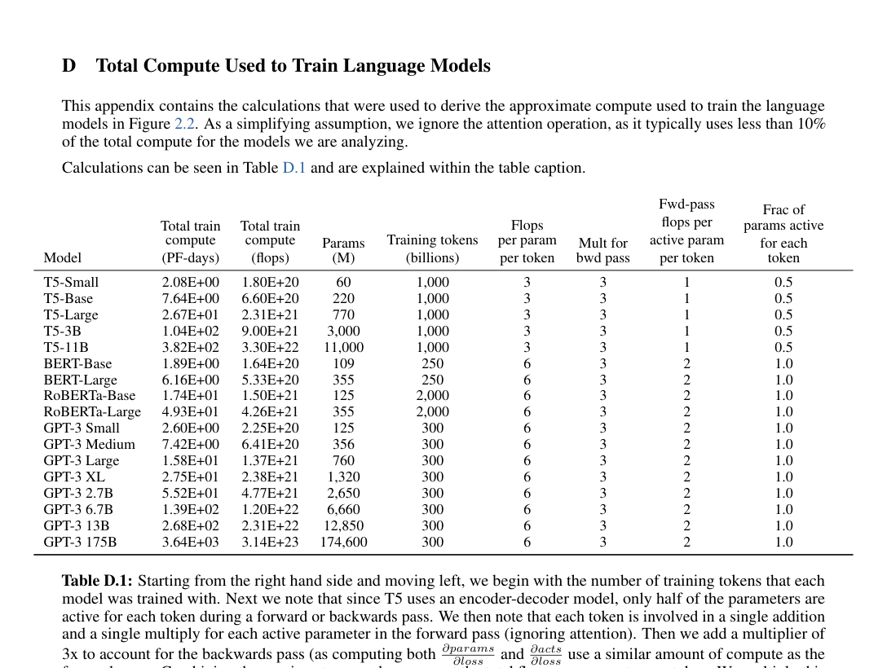

**表 D.1：** 从右向左阅读：首先列出每个模型训练时使用的词元总数。接下来考虑到，由于 T5 使用编码器-解码器模型，所以每个词元在前向或反向传播期间只会激活一半参数。随后注意到，在前向传播中，每个词元对每个激活参数各参与一次加法和一次乘法（忽略注意力）。然后加入 $3\times$ 乘数来计入反向传播，因为计算 $\partial \mathrm{loss}/\partial \mathrm{params}$ 和 $\partial \mathrm{loss}/\partial \mathrm{acts}$ 各自需要与前向传播相近的计算量。将前述两个数字合并，就得到每参数、每词元的总浮点运算次数。用此值乘以训练词元总数和参数总数，便得到训练期间使用的总浮点运算次数。我们同时报告浮点运算次数和 PF-days；每个 PF-day 等于 $8.64\times10^{19}$ 次浮点运算。

## E. 合成新闻文章的人工质量评估

本附录详细说明了用于测量人类区分 GPT-3 生成的合成新闻与真实新闻之能力的实验。我们先说明针对约 200 词新闻文章的实验，然后介绍针对 GPT-3 生成的约 500 词新闻文章的初步研究。

### E.1 参与者

我们招募了 718 名不重复的参与者参加 6 项实验。其中 97 人因未通过一道互联网检查题而被排除，最终留下 621 名参与者：男性 343 人，女性 271 人，其他 7 人。参与者平均年龄约为 38 岁。所有参与者均通过 Positly 招募；该平台维护了一份 Mechanical Turk 高表现工作者白名单。所有参与者都位于美国，但没有其他人口统计学限制。根据试运行得出的 60 分钟任务时长估计，我们向参与者支付 12 美元报酬。为保证每项实验测验的参与者样本互不重复，同一参与者不得参加多次实验。

### E.2 流程与设计

我们任意选取了 2020 年初出现在 newser.com 上的 25 篇新闻文章。我们使用文章的标题和副标题，让参数量分别为 1.25 亿、3.5 亿、7.6 亿、13 亿、27 亿、67 亿、130 亿和 2000 亿（GPT-3）的语言模型生成输出。每个模型针对每道题生成 5 个输出，再自动选取词数最接近人类撰写文章的那个输出。这是为了尽量降低补全长度对参与者判断的影响。除了按正文所述移除那个故意表现很差的对照模型之外，每个模型都采用相同的输出流程。

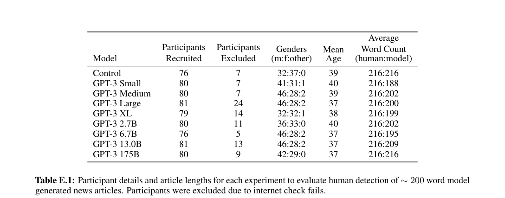

**表 E.1：** 评估人类检测约 200 词的模型生成新闻文章时，每项实验的参与者详情与文章长度。参与者会因未通过互联网检查而被排除。

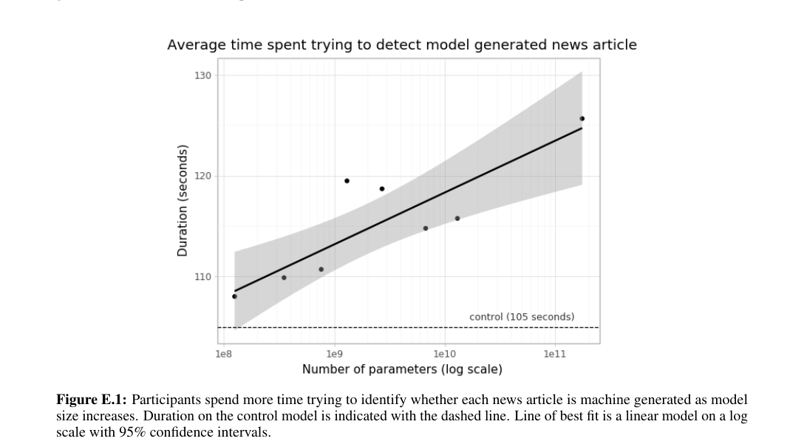

**图 E.1：** 随着模型规模增大，参与者会花费更多时间尝试判断每篇新闻是否由机器生成。虚线表示对照模型的用时。最佳拟合线是对数尺度上的线性模型，并显示 95% 置信区间。

在每项实验中，一半参与者被随机分配到测验 A，另一半被分配到测验 B。每份测验包含 25 篇文章：其中一半（12 至 13 篇）由人类撰写，另一半（12 至 13 篇）由模型生成。在测验 A 中采用人类撰写补全的文章，在测验 B 中会采用模型生成补全，反之亦然。对每名参与者，测验题目的顺序都会打乱。参与者可以留下评论，并会被问及以前是否见过这些文章。我们要求参与者不得在测验期间查找文章或文章内容，并在测验结束时询问他们是否曾查找任何信息。

### E.3 统计检验

为比较不同运行的均值，我们针对每个模型与对照模型执行了独立组的双样本 $t$ 检验。这使用 Python 中的 `scipy.stats.ttest_ind` 函数实现。在参与者平均准确率对模型规模的图上绘制回归线时，我们拟合了形如 $ax^{-b}$ 的幂律。95% 置信区间根据样本均值的 $t$ 分布估计。

### E.4 用时统计

正文中曾讨论一项发现：随着模型变大，人类参与者区分模型生成新闻与人类生成新闻的能力会下降。我们还发现，如图 E.1 所示，随着模型规模增大，参与者在给定问题集上花费的平均时间也会增加。即使参与者投入的时间增加，准确率仍然较低；这支持了如下结论：较大模型生成的新闻文章更难区分。

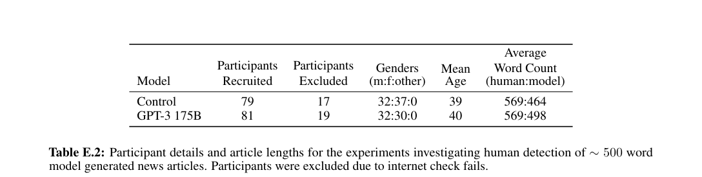

**表 E.2：** 研究人类检测约 500 词的模型生成新闻文章时，各实验的参与者详情与文章长度。参与者会因未通过互联网检查而被排除。

### E.5 对约 500 词文章的初步研究

我们通过 Positly 招募了 160 名不重复、位于美国的参与者，参加两项实验（详情见表 E.2）。我们从 2019 年末的路透社国际新闻中随机选取 12 篇文章，并为 GPT-3 175B 构造了一个上下文，其中只包含一篇不属于这 12 篇文章的路透社新闻。随后，我们使用文章标题和路透社地点信息，让 GPT-3 175B 和前述实验中的 1.6 亿参数对照模型生成补全。我们用它们为每个模型构造两份各含 12 道题的测验；每份测验一半是人类撰写文章，一半是模型生成文章。我们加入了理解题，并以 30 秒间隔分 3 个阶段向参与者展示文章，以鼓励他们更仔细地阅读。参与者因这项任务获得 12 美元报酬。模型生成结果的选取方法、排除标准和统计检验，都与前述实验相同。

## F. GPT-3 的额外样例

GPT-3 能够良好适应论文正文未涉及的许多任务。例如，图 F.1 展示了来自同一提示的四个未筛选样本：该提示要求模型以给定标题、模仿 Wallace Stevens 的风格写一首诗。我们先试验了几种提示，然后生成四个样本，没有进行任何额外编辑或筛选（温度为 1，使用核采样 [HBFC19]，$P=0.9$）。当模型开始书写新的标题和作者标题，或转入散文评论时，我们就截断补全。

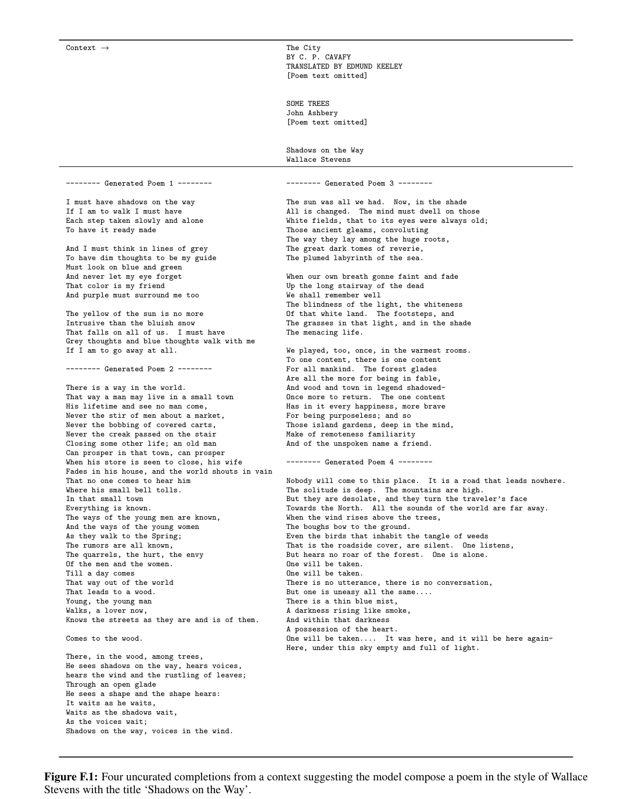

**图 F.1：** 同一上下文生成的四个未筛选补全。该上下文要求模型以 Wallace Stevens 的风格，创作一首题为《路上的影子》的诗。

## G. 任务措辞与规格细节

下列图示展示了论文中所有任务的格式和措辞。本节的所有数据都来自真值数据集，不包含 GPT-3 生成的任何样本。

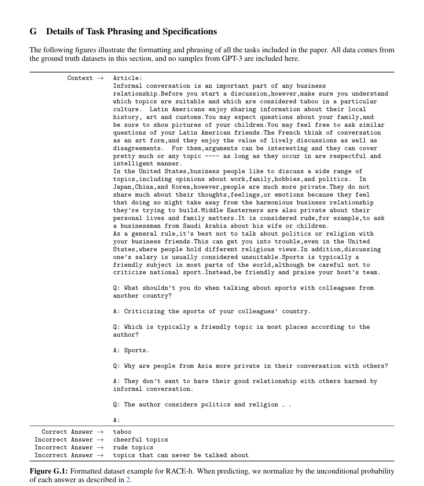

**图 G.1：** RACE-h 的格式化数据集样例。进行预测时，我们如第 2 节所述，使用每个答案的无条件概率进行归一化。

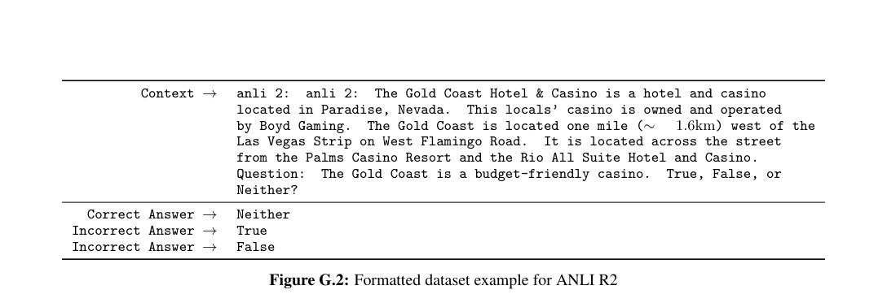

**图 G.2：** ANLI R2 的格式化数据集样例。

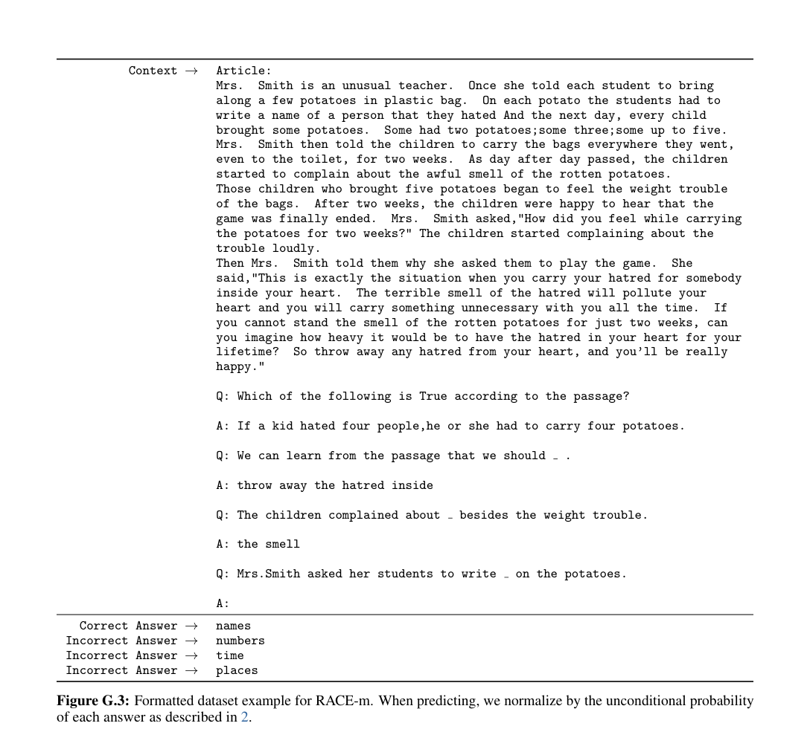

**图 G.3：** RACE-m 的格式化数据集样例。进行预测时，我们如第 2 节所述，使用每个答案的无条件概率进行归一化。

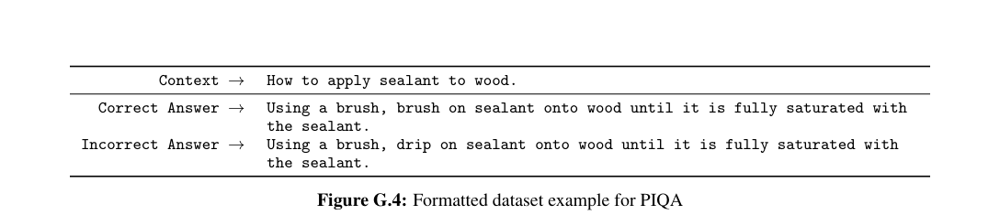

**图 G.4：** PIQA 的格式化数据集样例。

**图 G.5：** COPA 的格式化数据集样例。

**图 G.6：** ReCoRD 的格式化数据集样例。我们将上述上下文视为一个单独的“问题”，因为 ReCoRD 数据集就是以这种方式呈现任务，ReCoRD 评估脚本也以这种方式计分。

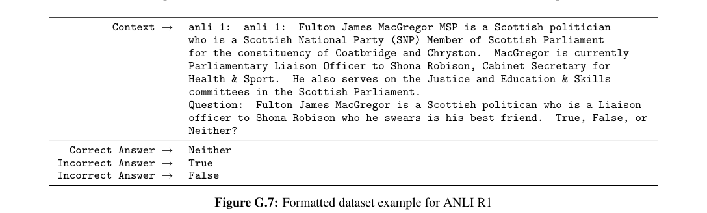

**图 G.7：** ANLI R1 的格式化数据集样例。


**图 G.8：** OpenBookQA 的格式化数据集样例。进行预测时，我们如第 2 节所述，使用每个答案的无条件概率进行归一化。


**图 G.9：** HellaSwag 的格式化数据集样例。


**图 G.10：** ANLI R3 的格式化数据集样例。


**图 G.11：** ARC（挑战）的格式化数据集样例。进行预测时，我们如第 2 节所述，使用每个答案的无条件概率进行归一化。


**图 G.12：** SAT 类比的格式化数据集样例。


**图 G.13：** Winograd 的格式化数据集样例。我们使用的“部分”评估方法，会比较在正确上下文和错误上下文条件下生成补全的概率。


**图 G.14：** Winogrande 的格式化数据集样例。我们使用的“部分”评估方法，会比较在正确上下文和错误上下文条件下生成补全的概率。


**图 G.15：** MultiRC 的格式化数据集样例。MultiRC 包含三个层级：（1）文章；（2）问题；（3）答案。评估期间，准确率在单个问题层面确定；当且仅当某个问题内的所有答案都被正确标注时，该问题才算回答正确。因此，我们用 $K$ 表示上下文中展示的问题数。


**图 G.16：** ARC（简单）的格式化数据集样例。进行预测时，我们如第 2 节所述，使用每个答案的无条件概率进行归一化。


**图 G.17：** StoryCloze 的格式化数据集样例。


**图 G.18：** CoQA 的格式化数据集样例。

**图 G.19：** 字母循环移位的格式化数据集样例。

**图 G.20：** DROP 的格式化数据集样例。


**图 G.21：** LAMBADA 的格式化数据集样例。

**图 G.22：** 字母重排 1（A1）的格式化数据集样例。

**图 G.23：** 字母重排 2 的格式化数据集样例。


**图 G.24：** 自然问题的格式化数据集样例。


**图 G.25：** QuAC 的格式化数据集样例。

**图 G.26：** 符号插入的格式化数据集样例。

**图 G.27：** 单词反转的格式化数据集样例。


**图 G.28：** SQuADv2 的格式化数据集样例。


**图 G.29：** BoolQ 的格式化数据集样例。


**图 G.30：** CB 的格式化数据集样例。


**图 G.31：** RTE 的格式化数据集样例。


**图 G.32：** WiC 的格式化数据集样例。


**图 G.33：** WSC 的格式化数据集样例。


**图 G.34：** TriviaQA 的格式化数据集样例。TriviaQA 允许存在多个有效补全。

**图 G.35：** WebQA 的格式化数据集样例。


**图 G.36：** 德语到英语翻译的格式化数据集样例。这是该任务以及下列所有其他翻译任务的单样本与少样本学习格式。零样本学习使用与此相同的格式，但会在开头加入一条自然语言指令，例如“将英语翻译成法语”。


**图 G.37：** 英语到德语翻译的格式化数据集样例。


**图 G.38：** 英语到法语翻译的格式化数据集样例。


**图 G.39：** 法语到英语翻译的格式化数据集样例。


**图 G.40：** 英语到罗马尼亚语翻译的格式化数据集样例。


**图 G.41：** 罗马尼亚语到英语翻译的格式化数据集样例。


**图 G.42：** 一位数组合算术（1DC）的格式化数据集样例。


**图 G.43：** 两位数减法的格式化数据集样例。


**图 G.44：** 两位数加法的格式化数据集样例。


**图 G.45：** 两位数乘法的格式化数据集样例。

**图 G.46：** 三位数减法的格式化数据集样例。

**图 G.47：** 三位数加法的格式化数据集样例。


**图 G.48：** 四位数减法的格式化数据集样例。


**图 G.49：** 四位数加法的格式化数据集样例。

**图 G.50：** 五位数减法的格式化数据集样例。


**图 G.51：** 五位数加法的格式化数据集样例。

## H. 所有任务与所有模型规模的结果


**表 H.1：** 本文所研究的每项任务、评估设置与模型的得分。


**图 H.1：** 所有 SuperGLUE 任务的完整结果。


**图 H.2：** SAT 任务的结果。


**图 H.3：** 所有 Winograd 任务的完整结果。


**图 H.4：** 所有算术任务的完整结果。


**图 H.5：** 所有完形填空与补全任务的完整结果。


**图 H.6：** 所有常识推理任务的完整结果。


**图 H.7：** 所有问答任务的完整结果。


**图 H.8：** 所有阅读理解任务的完整结果。


**图 H.9：** 所有 ANLI 轮次的完整结果。


**图 H.10：** 所有字符变换任务的完整结果。


**图 H.11：** 所有翻译任务的完整结果。

# 参考文献

- **[ADG+16]** Marcin Andrychowicz, Misha Denil, Sergio Gomez, Matthew W. Hoffman, David Pfau, Tom Schaul, Brendan Shillingford, Nando De Freitas。《用梯度下降通过梯度下降来学习如何学习》。NeurIPS，2016。
- **[AI19]** WeChat AI。《TR-MT（集成）》。2019 年 12 月。
- **[AJF19]** Roee Aharoni, Melvin Johnson, Orhan Firat。《大规模多语言神经机器翻译》。NAACL-HLT，2019。
- **[BBDIW20]** Su Lin Blodgett, Solon Barocas, Hal Daumé III, Hanna Wallach。《语言（技术）即权力：对自然语言处理中“偏差”的批判性综述》。arXiv:2005.14050，2020。
- **[BCFL13]** Jonathan Berant, Andrew Chou, Roy Frostig, Percy Liang。《基于问答对的 Freebase 语义解析》。EMNLP，2013。
- **[BDD+09]** Luisa Bentivogli, Ido Dagan, Hoa Trang Dang, Danilo Giampiccolo, Bernardo Magnini。《第五届 PASCAL 文本蕴含识别挑战》。2009。
- **[BES10]** Stefano Baccianella, Andrea Esuli, Fabrizio Sebastiani。《SentiWordNet 3.0：用于情感分析和意见挖掘的增强词汇资源》。LREC，2010。
- **[BHDD+06]** Roy Bar Haim, Ido Dagan, Bill Dolan, Lisa Ferro, Danilo Giampiccolo, Bernardo Magnini, Idan Szpektor。《第二届 PASCAL 文本蕴含识别挑战》。2006。
- **[BHT+20]** Yonatan Bisk, Ari Holtzman, Jesse Thomason, Jacob Andreas, Yoshua Bengio, Joyce Chai, Mirella Lapata, Angeliki Lazaridou, Jonathan May, Aleksandr Nisnevich 等。《经验为语言奠定基础》。arXiv:2004.10151，2020。
- **[BLC13]** Yoshua Bengio, Nicholas Léonard, Aaron C. Courville。《为条件计算估计或传播穿过随机神经元的梯度》。arXiv，2013。
- **[BZB+19]** Yonatan Bisk, Rowan Zellers, Ronan Le Bras, Jianfeng Gao, Yejin Choi。《PIQA：用自然语言进行物理常识推理》。arXiv:1911.11641，2019。
- **[Car97]** Rich Caruana。《多任务学习》。Machine Learning，1997。
- **[CB78]** Susan Carey, Elsa Bartlett。《习得一个新词》。Stanford Child Language Conference，1978。
- **[CCE+18]** Peter Clark, Isaac Cowhey, Oren Etzioni, Tushar Khot, Ashish Sabharwal, Carissa Schoenick, Oyvind Tafjord。《你以为问答已经解决了吗？试试 ARC：AI2 推理挑战》。arXiv:1803.05457，2018。
- **[CGRS19]** Rewon Child, Scott Gray, Alec Radford, Ilya Sutskever。《使用稀疏 Transformer 生成长序列》。2019。
- **[CHI+18]** Eunsol Choi, He He, Mohit Iyyer, Mark Yatskar, Wen-tau Yih, Yejin Choi, Percy Liang, Luke Zettlemoyer。《QuAC：上下文中的问答》。arXiv，2018。
- **[CLC+19]** Christopher Clark, Kenton Lee, Ming-Wei Chang, Tom Kwiatkowski, Michael Collins, Kristina Toutanova。《BoolQ：探索自然是非问题出人意料的难度》。arXiv:1905.10044，2019。
- **[CLY+19]** Yen-Chun Chen, Linjie Li, Licheng Yu, Ahmed El Kholy, Faisal Ahmed, Zhe Gan, Yu Cheng, Jingjing Liu。《UNITER：学习通用图像-文本表示》。arXiv:1909.11740，2019。
- **[Cra17]** Kate Crawford。《偏差之患》。NIPS 主题演讲，2017。
- **[DCLT18]** Jacob Devlin, Ming-Wei Chang, Kenton Lee, Kristina Toutanova。《BERT：用于语言理解的深层双向 Transformer 预训练》。arXiv:1810.04805，2018。
- **[DGM06]** Ido Dagan, Oren Glickman, Bernardo Magnini。《PASCAL 文本蕴含识别挑战》。Springer，2006。
- **[DGV+18]** Mostafa Dehghani, Stephan Gouws, Oriol Vinyals, Jakob Uszkoreit, Lukasz Kaiser。《通用 Transformer》。arXiv，2018。
- **[DHKH14]** Nadir Durrani, Barry Haddow, Philipp Koehn, Kenneth Heafield。《爱丁堡用于 WMT-14 的基于短语的机器翻译系统》。WMT，2014。
- **[DL15]** Andrew M. Dai, Quoc V. Le。《半监督序列学习》。NeurIPS，2015。
- **[DMST19]** Marie-Catherine De Marneffe, Mandy Simons, Judith Tonhauser。《CommitmentBank：研究自然语篇中的投射》。2019。
- **[DSC+16]** Yan Duan, John Schulman, Xi Chen, Peter L. Bartlett, Ilya Sutskever, Pieter Abbeel。《RL²：通过慢速强化学习实现快速强化学习》。arXiv:1611.02779，2016。
- **[DWD+19]** Dheeru Dua, Yizhong Wang, Pradeep Dasigi, Gabriel Stanovsky, Sameer Singh, Matt Gardner。《DROP：需要对段落进行离散推理的阅读理解基准》。arXiv:1903.00161，2019。
- **[DYY+19]** Zihang Dai, Zhilin Yang, Yiming Yang, Jaime G. Carbonell, Quoc V. Le, Ruslan Salakhutdinov。《Transformer-XL：超越固定长度上下文的注意力语言模型》。arXiv，2019。
- **[EOAG18]** Sergey Edunov, Myle Ott, Michael Auli, David Grangier。《理解大规模回译》。arXiv:1808.09381，2018。
- **[FAL17]** Chelsea Finn, Pieter Abbeel, Sergey Levine。《用于深度网络快速适应的模型无关元学习》。arXiv:1703.03400，2017。
- **[Fyo00]** Yaroslav Fyodorov。《自然逻辑推理系统》。2000。
- **[GG19]** Hila Gonen, Yoav Goldberg。《猪嘴上的口红：去偏方法只是掩盖词嵌入中系统性的性别偏差，而非将其消除》。arXiv:1903.03862，2019。
- **[GLT+20]** Kelvin Guu, Kenton Lee, Zora Tung, Panupong Pasupat, Ming-Wei Chang。《REALM：检索增强的语言模型预训练》。arXiv:2002.08909，2020。
- **[GMDD07]** Danilo Giampiccolo, Bernardo Magnini, Ido Dagan, Bill Dolan。《第三届 PASCAL 文本蕴含识别挑战》。ACL-PASCAL，2007。
- **[Gra16]** Alex Graves。《循环神经网络的自适应计算时间》。arXiv，2016。
- **[GSL+18]** Suchin Gururangan, Swabha Swayamdipta, Omer Levy, Roy Schwartz, Samuel R. Bowman, Noah A. Smith。《自然语言推理数据中的标注伪迹》。arXiv:1803.02324，2018。
- **[GSR19]** Sebastian Gehrmann, Hendrik Strobelt, Alexander M. Rush。《GLTR：生成文本的统计检测与可视化》。arXiv:1906.04043，2019。
- **[GWC+18]** Jiatao Gu, Yong Wang, Yun Chen, Kyunghyun Cho, Victor O. K. Li。《用于低资源神经机器翻译的元学习》。arXiv:1808.08437，2018。
- **[HB20]** Daniel Hernandez, Tom Brown。《人工智能与效率》。2020 年 5 月。
- **[HBFC19]** Ari Holtzman, Jan Buys, Maxwell Forbes, Yejin Choi。《神经文本退化的奇异案例》。arXiv:1904.09751，2019。
- **[HLW+20]** Dan Hendrycks, Xiaoyuan Liu, Eric Wallace, Adam Dziedzic, Rishabh Krishnan, Dawn Song。《预训练 Transformer 提高分布外鲁棒性》。arXiv:2004.06100，2020。
- **[HNA+17]** Joel Hestness, Sharan Narang, Newsha Ardalani, Gregory Diamos, Heewoo Jun, Hassan Kianinejad, Md. Mostofa Ali Patwary, Yang Yang, Yanqi Zhou。《深度学习的缩放在经验上是可预测的》。arXiv:1712.00409，2017。
- **[HR18]** Jeremy Howard, Sebastian Ruder。《用于文本分类的通用语言模型微调》。arXiv:1801.06146，2018。
- **[HVD15]** Geoffrey Hinton, Oriol Vinyals, Jeff Dean。《蒸馏神经网络中的知识》。arXiv:1503.02531，2015。
- **[HYC01]** Sepp Hochreiter, A. Steven Younger, Peter R. Conwell。《使用梯度下降学习如何学习》。ICANN，2001。
- **[HZJ+19]** Po-Sen Huang, Huan Zhang, Ray Jiang, Robert Stanforth, Johannes Welbl, Jack Rae, Vishal Maini, Dani Yogatama, Pushmeet Kohli。《通过反事实评估减少语言模型中的情感偏差》。arXiv:1911.03064，2019。
- **[IBGC+14]** Mohit Iyyer, Jordan Boyd-Graber, Leonardo Claudino, Richard Socher, Hal Daumé III。《用于段落事实型问答的神经网络》。EMNLP，2014。
- **[IDCBE19]** Daphne Ippolito, Daniel Duckworth, Chris Callison-Burch, Douglas Eck。《当人类受骗时，生成文本最容易被自动检测》。arXiv:1911.00650，2019。
- **[JCWZ17]** Mandar Joshi, Eunsol Choi, Daniel S. Weld, Luke Zettlemoyer。《TriviaQA：用于阅读理解的大规模远程监督挑战数据集》。arXiv:1705.03551，2017。
- **[JN20]** Zheng Junyuan, Gamma Lab NYC。《数值 Transformer - ALBERT》。2020 年 3 月。
- **[JVS+16]** Rafal Jozefowicz, Oriol Vinyals, Mike Schuster, Noam Shazeer, Yonghui Wu。《探索语言建模的极限》。arXiv:1602.02410，2016。
- **[JYS+19]** Xiaoqi Jiao, Yichun Yin, Lifeng Shang, Xin Jiang, Xiao Chen, Linlin Li, Fang Wang, Qun Liu。《TinyBERT：为自然语言理解蒸馏 BERT》。arXiv:1909.10351，2019。
- **[JZC+19]** Ying Ju, Fubang Zhao, Shijie Chen, Bowen Zheng, Xuefeng Yang, Yunfeng Liu。《会话问答技术报告》。arXiv:1909.10772，2019。
- **[KCR+18]** Daniel Khashabi, Snigdha Chaturvedi, Michael Roth, Shyam Upadhyay, Dan Roth。《超越表面：跨多个句子的阅读理解挑战集》。NAACL，2018。
- **[KKS+20]** Daniel Khashabi, Tushar Khot, Ashish Sabharwal, Oyvind Tafjord, Peter Clark, Hannaneh Hajishirzi。《UnifiedQA：用单一问答系统跨越格式边界》。arXiv:2005.00700，2020。
- **[KMB20]** Sarah E. Kreps, Miles McCain, Miles Brundage。《一切适合伪造的新闻：人工智能生成文本作为媒体虚假信息工具》。2020。
- **[KMH+20]** Jared Kaplan, Sam McCandlish, Tom Henighan, Tom B. Brown, Benjamin Chess, Rewon Child, Scott Gray, Alec Radford, Jeffrey Wu, Dario Amodei。《神经语言模型的缩放定律》。2020。
- **[KPR+19]** Tom Kwiatkowski, Jennimaria Palomaki, Olivia Redfield, Michael Collins, Ankur Parikh, Chris Alberti, Danielle Epstein, Illia Polosukhin, Matthew Kelcey, Jacob Devlin, Kenton Lee, Kristina N. Toutanova, Llion Jones, Ming-Wei Chang, Andrew Dai, Jakob Uszkoreit, Quoc Le, Slav Petrov。《自然问题：问答研究基准》。TACL，2019。
- **[KR16]** Yoon Kim, Alexander M. Rush。《序列级知识蒸馏》。arXiv，2016。
- **[LB02]** Edward Loper, Steven Bird。《NLTK：自然语言工具包》。2002。
- **[LC19]** Guillaume Lample, Alexis Conneau。《跨语言语言模型预训练》。arXiv:1901.07291，2019。
- **[LCG+19]** Zhenzhong Lan, Mingda Chen, Sebastian Goodman, Kevin Gimpel, Piyush Sharma, Radu Soricut。《ALBERT：用于语言表示自监督学习的轻量级 BERT》。arXiv:1909.11942，2019。
- **[LCH+20]** Xiaodong Liu, Hao Cheng, Pengcheng He, Weizhu Chen, Yu Wang, Hoifung Poon, Jianfeng Gao。《大型神经语言模型的对抗训练》。arXiv:2004.08994，2020。
- **[LDL19]** Zhongyang Li, Xiao Ding, Ting Liu。《使用可迁移 BERT 预测故事结局》。arXiv:1905.07504，2019。
- **[LDM12]** Hector Levesque, Ernest Davis, Leora Morgenstern。《Winograd 模式挑战》。KR，2012。
- **[LGG+20]** Yinhan Liu, Jiatao Gu, Naman Goyal, Xian Li, Sergey Edunov, Marjan Ghazvininejad, Mike Lewis, Luke Zettlemoyer。《用于神经机器翻译的多语言去噪预训练》。arXiv:2001.08210，2020。
- **[LGH+15]** Xiaodong Liu, Jianfeng Gao, Xiaodong He, Li Deng, Kevin Duh, Ye-Yi Wang。《使用多任务深度神经网络为语义分类和信息检索学习表示》。NAACL-HLT，2015。
- **[LH17]** Ilya Loshchilov, Frank Hutter。《解耦权重衰减正则化》。arXiv:1711.05101，2017。
- **[LHCG19a]** Xiaodong Liu, Pengcheng He, Weizhu Chen, Jianfeng Gao。《通过知识蒸馏改进用于自然语言理解的多任务深度神经网络》。arXiv:1904.09482，2019。
- **[LHCG19b]** Xiaodong Liu, Pengcheng He, Weizhu Chen, Jianfeng Gao。《用于自然语言理解的多任务深度神经网络》。arXiv:1901.11504，2019。
- **[Lin20]** Tal Linzen。《我们如何加快迈向类人语言泛化的进展？》。arXiv:2005.00955，2020。
- **[LLG+19]** Mike Lewis, Yinhan Liu, Naman Goyal, Marjan Ghazvininejad, Abdelrahman Mohamed, Omer Levy, Ves Stoyanov, Luke Zettlemoyer。《BART：用于自然语言生成、翻译和理解的去噪序列到序列预训练》。arXiv:1910.13461，2019。
- **[LM17]** Ke Li, Jitendra Malik。《学习优化神经网络》。arXiv:1703.00441，2017。
- **[LOG+19]** Yinhan Liu, Myle Ott, Naman Goyal, Jingfei Du, Mandar Joshi, Danqi Chen, Omer Levy, Mike Lewis, Luke Zettlemoyer, Veselin Stoyanov。《RoBERTa：稳健优化的 BERT 预训练方法》。arXiv:1907.11692，2019。
- **[LPP+20]** Patrick Lewis, Ethan Perez, Aleksandra Piktus, Fabio Petroni, Vladimir Karpukhin, Naman Goyal, Heinrich Küttler, Mike Lewis, Wen-tau Yih, Tim Rocktäschel, Sebastian Riedel, Kiela Douwe。《用于知识密集型自然语言处理任务的检索增强生成》。arXiv:2005.11401，2020。
- **[LSP+18]** Peter J. Liu, Mohammad Saleh, Etienne Pot, Ben Goodrich, Ryan Sepassi, Lukasz Kaiser, Noam Shazeer。《通过摘要长序列生成维基百科》。arXiv:1801.10198，2018。
- **[LWS+20]** Zhuohan Li, Eric Wallace, Sheng Shen, Kevin Lin, Kurt Keutzer, Dan Klein, Joseph E. Gonzalez。《先训练大模型，再压缩：重新思考 Transformer 高效训练和推理的模型大小》。2020。
- **[LXL+17]** Guokun Lai, Qizhe Xie, Hanxiao Liu, Yiming Yang, Eduard Hovy。《RACE：来自考试的大规模阅读理解数据集》。arXiv:1704.04683，2017。
- **[LYN+20]** Sheng-Chieh Lin, Jheng-Hong Yang, Rodrigo Nogueira, Ming-Feng Tsai, Chuan-Ju Wang, Jimmy Lin。《攻克 Winogrande 模式》。arXiv:2003.08380，2020。
- **[Mac92]** David MacKay。《用于主动数据选择的基于信息的目标函数》。Neural Computation，1992。
- **[MBXS17]** Bryan McCann, James Bradbury, Caiming Xiong, Richard Socher。《从翻译中学习：上下文化词向量》。NeurIPS，2017。
- **[MCCD13]** Tomas Mikolov, Kai Chen, Greg Corrado, Jeffrey Dean。《向量空间中词表示的高效估计》。arXiv:1301.3781，2013。
- **[MCH+16]** Nasrin Mostafazadeh, Nathanael Chambers, Xiaodong He, Devi Parikh, Dhruv Batra, Lucy Vanderwende, Pushmeet Kohli, James Allen。《用于更深入理解常识故事的语料库与评估框架》。arXiv:1604.01696，2016。
- **[MCKS18]** Todor Mihaylov, Peter Clark, Tushar Khot, Ashish Sabharwal。《一套盔甲能导电吗？用于开卷问答的新数据集》。arXiv:1809.02789，2018。
- **[MKAT18]** Sam McCandlish, Jared Kaplan, Dario Amodei, OpenAI Dota Team。《大批量训练的经验模型》。2018。
- **[MKM+94]** Mitchell Marcus, Grace Kim, Mary Ann Marcinkiewicz, Robert MacIntyre, Ann Bies, Mark Ferguson, Karen Katz, Britta Schasberger。《Penn Treebank：标注谓词-论元结构》。HLT，1994。
- **[MKXS18]** Bryan McCann, Nitish Shirish Keskar, Caiming Xiong, Richard Socher。《自然语言十项全能：将多任务学习视为问答》。arXiv:1806.08730，2018。
- **[MPL19]** R. Thomas McCoy, Ellie Pavlick, Tal Linzen。《殊途同归：诊断自然语言推理中的句法启发式》。arXiv:1902.01007，2019。
- **[MWZ+18]** Margaret Mitchell, Simone Wu, Andrew Zaldivar, Parker Barnes, Lucy Vasserman, Ben Hutchinson, Elena Spitzer, Inioluwa Deborah Raji, Timnit Gebru。《用于模型报告的模型卡》。2018。
- **[NBR20]** Moin Nadeem, Anna Bethke, Siva Reddy。《StereoSet：测量预训练语言模型中的刻板印象偏差》。arXiv:2004.09456，2020。
- **[NK19]** Timothy Niven, Hung-Yu Kao。《探查神经网络对自然语言论证的理解》。arXiv:1907.07355，2019。
- **[Nor09]** Peter Norvig。《自然语言语料库数据》。2009。
- **[NvNvdG19]** Malvina Nissim, Rik van Noord, Rob van der Goot。《公平比耸人听闻更好：男人对医生，就如女人对医生》。arXiv:1905.09866，2019。
- **[NWD+19]** Yixin Nie, Adina Williams, Emily Dinan, Mohit Bansal, Jason Weston, Douwe Kiela。《对抗自然语言推理：自然语言理解的新基准》。arXiv:1910.14599，2019。
- **[oR16]** University of Regensburg。《Fascha》。2016。
- **[PCC18]** Mohammad Taher Pilehvar, Jose Camacho-Collados。《WiC：用于评估上下文敏感表示的 10,000 组样例对》。arXiv:1808.09121，2018。
- **[PFB18]** Jason Phang, Thibault Févry, Samuel R. Bowman。《STILTs 上的句子编码器：在中间有标注数据任务上进行补充训练》。arXiv:1811.01088，2018。
- **[PHR+18]** Adam Poliak, Aparajita Haldar, Rachel Rudinger, J. Edward Hu, Ellie Pavlick, Aaron Steven White, Benjamin Van Durme。《收集用于句子表示评估的多样自然语言推理问题》。EMNLP，2018。
- **[PKL+16]** Denis Paperno, Germán Kruszewski, Angeliki Lazaridou, Quan Ngoc Pham, Raffaella Bernardi, Sandro Pezzelle, Marco Baroni, Gemma Boleda, Raquel Fernández。《LAMBADA 数据集：需要广泛语篇上下文的单词预测》。arXiv:1606.06031，2016。
- **[PNZtY18]** Matthew E. Peters, Mark Neumann, Luke Zettlemoyer, Wen-tau Yih。《剖析上下文词嵌入：架构与表示》。2018。
- **[Pos18]** Matt Post。《呼吁清晰报告 BLEU 得分》。arXiv:1804.08771，2018。
- **[PSM14]** Jeffrey Pennington, Richard Socher, Christopher Manning。《GloVe：用于词表示的全局向量》。EMNLP，2014。
- **[QIA20]** QIANXIN。《ALBERT 上的 SA-Net（集成）》。2020 年 4 月。
- **[QMZH19]** Yusu Qian, Urwa Muaz, Ben Zhang, Jae Won Hyun。《使用性别均衡损失函数减少词级语言模型中的性别偏差》。arXiv:1905.12801，2019。
- **[RBG11]** Melissa Roemmele, Cosmin Adrian Bejan, Andrew S. Gordon。《合理备选项的选择：对常识因果推理的评估》。AAAI Spring Symposium，2011。
- **[RCM19]** Siva Reddy, Danqi Chen, Christopher D. Manning。《CoQA：会话问答挑战》。TACL，2019。
- **[RCP+17]** Scott Reed, Yutian Chen, Thomas Paine, Aäron van den Oord, S. M. Eslami, Danilo Rezende, Oriol Vinyals, Nando de Freitas。《少样本自回归密度估计：走向学习如何学习分布》。arXiv:1710.10304，2017。
- **[RJL18]** Pranav Rajpurkar, Robin Jia, Percy Liang。《知道你不知道什么：SQuAD 中无法回答的问题》。arXiv:1806.03822，2018。
- **[RL16]** Sachin Ravi, Hugo Larochelle。《将优化作为少样本学习模型》。ICLR，2016。
- **[RLL+19]** Qiu Ran, Yankai Lin, Peng Li, Jie Zhou, Zhiyuan Liu。《NumNet：具有数值推理能力的机器阅读理解》。EMNLP，2019。
- **[RNLVD18]** Rachel Rudinger, Jason Naradowsky, Brian Leonard, Benjamin Van Durme。《共指消解中的性别偏差》。arXiv:1804.09301，2018。
- **[RNSS18]** Alec Radford, Karthik Narasimhan, Tim Salimans, Ilya Sutskever。《通过生成式预训练改进语言理解》。2018。
- **[Ros12]** R. S. Ross。《风险评估实施指南》。NIST Special Publication，2012。
- **[RRBS19]** Jonathan S. Rosenfeld, Amir Rosenfeld, Yonatan Belinkov, Nir Shavit。《对跨规模泛化误差的构造性预测》。2019。
- **[RRS20]** Adam Roberts, Colin Raffel, Noam Shazeer。《语言模型的参数中能装入多少知识？》。arXiv:2002.08910，2020。
- **[RSR+19]** Colin Raffel, Noam Shazeer, Adam Roberts, Katherine Lee, Sharan Narang, Michael Matena, Yanqi Zhou, Wei Li, Peter J. Liu。《使用统一的文本到文本 Transformer 探索迁移学习的极限》。2019。
- **[RWC+19]** Alec Radford, Jeffrey Wu, Rewon Child, David Luan, Dario Amodei, Ilya Sutskever。《语言模型是无监督的多任务学习器》。2019。
- **[SBBC19]** Keisuke Sakaguchi, Ronan Le Bras, Chandra Bhagavatula, Yejin Choi。《Winogrande：大规模对抗性 Winograd 模式挑战》。2019。
- **[SBC+19]** Irene Solaiman, Miles Brundage, Jack Clark, Amanda Askell, Ariel Herbert-Voss, Jeff Wu, Alec Radford, Gretchen Krueger, Jong Wook Kim, Sarah Kreps, Miles McCain, Alex Newhouse, Jason Blazakis, Kris McGuffie, Jasmine Wang。《语言模型的发布策略与社会影响》。2019。
- **[SCNP19]** Emily Sheng, Kai-Wei Chang, Premkumar Natarajan, Nanyun Peng。《那位女性担任保姆：论语言生成中的偏差》。arXiv:1909.01326，2019。
- **[SDCW19]** Victor Sanh, Lysandre Debut, Julien Chaumond, Thomas Wolf。《DistilBERT：BERT 的蒸馏版本，更小、更快、更便宜、更轻量》。arXiv:1910.01108，2019。
- **[SDSE19]** Roy Schwartz, Jesse Dodge, Noah A. Smith, Oren Etzioni。《绿色人工智能》。arXiv:1907.10597，2019。
- **[SHB15]** Rico Sennrich, Barry Haddow, Alexandra Birch。《使用单语言数据改进神经机器翻译模型》。arXiv:1511.06709，2015。
- **[SMM+17]** Noam Shazeer, Azalia Mirhoseini, Krzysztof Maziarz, Andy Davis, Quoc Le, Geoffrey Hinton, Jeff Dean。《超大型神经网络：稀疏门控混合专家层》。arXiv:1701.06538，2017。
- **[SPP+19]** Mohammad Shoeybi, Mostofa Patwary, Raul Puri, Patrick LeGresley, Jared Casper, Bryan Catanzaro。《Megatron-LM：使用模型并行训练数十亿参数语言模型》。2019。
- **[SS20]** Timo Schick, Hinrich Schütze。《利用完形填空问题进行少样本文本分类和自然语言推理》。arXiv:2001.07676，2020。
- **[STQ+19]** Kaitao Song, Xu Tan, Tao Qin, Jianfeng Lu, Tie-Yan Liu。《MASS：用于语言生成的掩码序列到序列预训练》。arXiv:1905.02450，2019。
- **[TFR+17]** Josh Tobin, Rachel Fong, Alex Ray, Jonas Schneider, Wojciech Zaremba, Pieter Abbeel。《通过领域随机化将深度神经网络从模拟迁移到现实世界》。IROS，2017。
- **[TL05]** Peter D. Turney, Michael L. Littman。《基于语料库的类比与语义关系学习》。arXiv:cs/0508103，2005。
- **[TL18]** Trieu H. Trinh, Quoc V. Le。《一种简单的常识推理方法》。arXiv:1806.02847，2018。
- **[TLBS03]** Peter D. Turney, Michael L. Littman, Jeffrey Bigham, Victor Shnayder。《组合独立模块以解决多项选择同义词和类比问题》。arXiv:cs.CL/0309035，2003。
- **[Tur20]** Project Turing。《微软研究院博客》。2020 年 2 月。
- **[VBL+16]** Oriol Vinyals, Charles Blundell, Timothy Lillicrap, Daan Wierstra 等。《用于单样本学习的匹配网络》。NeurIPS，2016。
- **[VSP+17]** Ashish Vaswani, Noam Shazeer, Niki Parmar, Jakob Uszkoreit, Llion Jones, Aidan N. Gomez, Łukasz Kaiser, Illia Polosukhin。《注意力就是你所需的一切》。NeurIPS，2017。
- **[WPN+19]** Alex Wang, Yada Pruksachatkun, Nikita Nangia, Amanpreet Singh, Julian Michael, Felix Hill, Omer Levy, Samuel Bowman。《SuperGLUE：面向通用语言理解系统的更棘手基准》。NeurIPS，2019。
- **[WXH+18]** Yiren Wang, Yingce Xia, Tianyu He, Fei Tian, Tao Qin, ChengXiang Zhai, Tie-Yan Liu。《多智能体对偶学习》。ICLR，2018。
- **[XDH+19]** Qizhe Xie, Zihang Dai, Eduard Hovy, Minh-Thang Luong, Quoc V. Le。《用于一致性训练的无监督数据增强》。2019。
- **[YdC+19]** Dani Yogatama, Cyprien de Masson d'Autume, Jerome Connor, Tomas Kocisky, Mike Chrzanowski, Lingpeng Kong, Angeliki Lazaridou, Wang Ling, Lei Yu, Chris Dyer 等。《学习与评估通用语言智能》。arXiv:1901.11373，2019。
- **[YDY+19]** Zhilin Yang, Zihang Dai, Yiming Yang, Jaime Carbonell, Ruslan Salakhutdinov, Quoc V. Le。《XLNet：用于语言理解的广义自回归预训练》。arXiv:1906.08237，2019。
- **[ZHB+19]** Rowan Zellers, Ari Holtzman, Yonatan Bisk, Ali Farhadi, Yejin Choi。《HellaSwag：机器真的能完成你的句子吗？》。arXiv:1905.07830，2019。
- **[ZHR+19]** Rowan Zellers, Ari Holtzman, Hannah Rashkin, Yonatan Bisk, Ali Farhadi, Franziska Roesner, Yejin Choi。《抵御神经网络生成的虚假新闻》。arXiv:1905.12616，2019。
- **[ZLL+18]** Sheng Zhang, Xiaodong Liu, Jingjing Liu, Jianfeng Gao, Kevin Duh, Benjamin Van Durme。《ReCoRD：弥合人类与机器在常识阅读理解上的差距》。arXiv:1810.12885，2018。
- **[ZSW+19a]** Daniel M. Ziegler, Nisan Stiennon, Jeffrey Wu, Tom B. Brown, Alec Radford, Dario Amodei, Paul Christiano, Geoffrey Irving。《根据人类偏好微调语言模型》。2019。
- **[ZSW+19b]** Daniel M. Ziegler, Nisan Stiennon, Jeffrey Wu, Tom B. Brown, Alec Radford, Dario Amodei, Paul Christiano, Geoffrey Irving。《根据人类偏好微调语言模型》。arXiv:1909.08593，2019。

---

1. 在语言模型的语境中，这种方法有时被称为“零样本迁移”，但这个词容易引起歧义：该方法在不执行梯度更新的意义上是“零样本”的，但它经常会在推理时向模型提供演示，因此并非真正从零个样例中学习。为避免这种混淆，我们使用“元学习”一词概括一般方法的内循环/外循环结构，使用“上下文内学习”指元学习的内循环。我们还会根据推理时提供的演示数，进一步将其称为“零样本”、“单样本”或“少样本”。这些术语无意回答以下问题：模型究竟在推理时从零开始学习新任务，还是只在识别训练时见过的模式。这是一个重要问题，我们稍后会在文中讨论；“元学习”旨在包含两种可能，它只描述内外循环结构。 [↩](#fnref:1)
2. https://commoncrawl.org/the-data/ [↩](#fnref:2)
3. 这项任务也与第 6.1 节讨论的语言模型潜在滥用相关。 [↩](#fnref:3)
4. 我们希望确定互联网上的普通人检测语言模型输出的能力，因此重点选择来自美国普通人群的参与者。详情见附录 E。 [↩](#fnref:4)
5. 我们使用双样本学生 $t$ 检验，检验每个模型与控制模型的参与者准确率均值之间是否存在显著差异，并报告均值的归一化差异（作为 $t$ 统计量）以及 $p$ 值。 [↩](#fnref:5)
6. 如果一个模型总能生成比人类文章更令人印象深刻的文本，那么人类在这项任务上的性能可能会低于 50%。实际上，许多个别参与者在这项任务上的得分低于 50%。 [↩](#fnref:6)
7. 附录 F 还提供了更多非新闻样例。 [↩](#fnref:7)
8. 评估语言模型的公平性、偏差和表征，是一个正在快速发展、已积累大量先前工作的领域。参见 [HZJ+19；NBR20；SCNP19]。 [↩](#fnref:8)
9. 我们只使用了男性和女性代词。这一简化假设使共现研究更容易，因为无须从“they”不指代单数名词的实例中分离出它指代单数名词的实例；但其他形式的性别偏差很可能也存在，并可使用不同方法研究。 [↩](#fnref:9)
10. [https://spark.apache.org/docs/latest/api/python/pyspark.ml.html#pyspark.ml.feature.HashingTF](https://spark.apache.org/docs/latest/api/python/pyspark.ml.html#pyspark.ml.feature.HashingTF) [↩](#fnref:10)
11. [https://github.com/openai/gpt-3/blob/master/overlap_frequency.md](https://github.com/openai/gpt-3/blob/master/overlap_frequency.md) [↩](#fnref:11)
