# Switch Transformer：用简单高效的稀疏性扩展到万亿参数模型

**作者：** William Fedus、Barret Zoph、Noam Shazeer
**机构：** Google（美国加利福尼亚州山景城）
**期刊：** Journal of Machine Learning Research，23（2022）1-40
**预印本：** arXiv:2101.03961v3（2022 年 6 月 16 日）
**提交/修订/发表：** 2021 年 8 月 21 日 / 2022 年 3 月 / 2022 年 4 月

## 摘要

在深度学习中，模型通常对所有输入重复使用同一组参数。混合专家（Mixture of Experts，MoE）模型打破了这一做法，为每个输入样例选择不同的参数。由此得到的是一种稀疏激活模型：它拥有数量惊人的参数，但计算成本保持不变。然而，尽管 MoE 已取得若干显著成果，其复杂性、通信成本和训练不稳定性阻碍了广泛采用。本文通过提出 Switch Transformer 处理这些问题。我们简化 MoE 路由算法，设计了更直观、通信和计算成本更低的改进模型；提出的训练技术能够缓解不稳定性，并首次展示可以用较低精度的 bfloat16 格式训练大型稀疏模型。我们以 T5-Base 和 T5-Large（Raffel 等，2019）为基础设计模型，在相同计算资源下将预训练速度最高提升 7 倍。这些改进还扩展到多语言场景：在全部 101 种语言上，我们都测得相对于 mT5-Base 的收益。最后，我们把语言模型的当前规模推进到万亿参数：在“海量清洁爬取语料库”上预训练万亿参数模型，相比 T5-XXL 实现 4 倍加速。

**关键词：** 混合专家；自然语言处理；稀疏性；大规模机器学习；分布式计算

> *本文的代码和模型检查点见 [https://github.com/google-research/t5x](https://github.com/google-research/t5x)；TensorFlow 代码见 [https://github.com/tensorflow/mesh/blob/master/mesh_tensorflow/transformer/moe.py](https://github.com/tensorflow/mesh/blob/master/mesh_tensorflow/transformer/moe.py)。作者 William Fedus 与 Barret Zoph 贡献相同。本文采用 CC-BY 4.0 许可。*

## 1. 引言

大规模训练一直是构建灵活而强大的神经语言模型的一条有效路径（Radford 等，2018；Kaplan 等，2020；Brown 等，2020）。在充足计算预算、数据集规模和参数数量支持下，简单架构往往能够超过更复杂的算法（Sutton，2019）。Radford 等（2018）、Raffel 等（2019）和 Brown 等（2020）所采用的一条路线，是扩大密集激活 Transformer（Vaswani 等，2017）的模型规模。虽然这种方法有效，但计算成本也极高（Strubell 等，2019）。受模型规模成功经验的启发，同时又希望提高计算效率，我们提出一种稀疏激活的专家模型：Switch Transformer。在我们的模型中，稀疏性来自对每个输入样例只激活神经网络权重的一个子集。

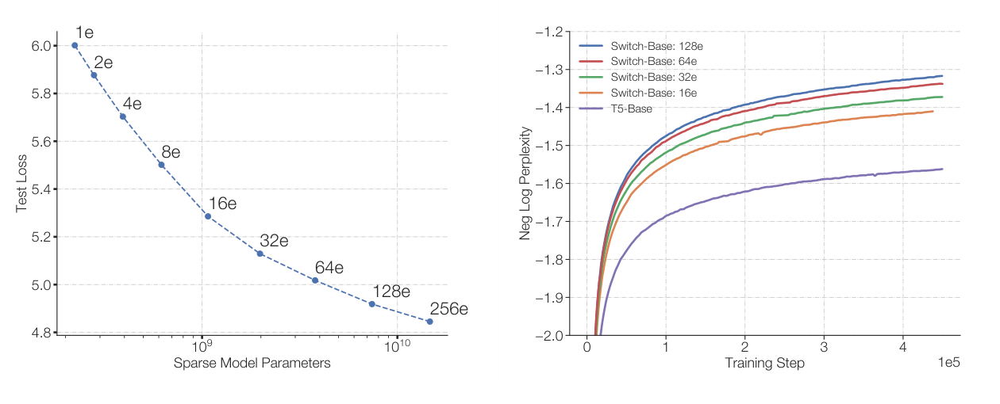

**图 1：** Switch Transformer 的扩展性与样本效率。左图：逐渐增加稀疏程度（即专家数量）的 Switch Transformer 的扩展性质。右图：在相同计算预算下，比较 Switch Transformer 与 T5（Raffel 等，2019）模型的负对数困惑度。

稀疏训练是一个活跃的研究和工程方向（Gray 等，2017；Gale 等，2020），但目前机器学习库和硬件加速器仍主要面向密集矩阵乘法。为了实现高效稀疏算法，我们从混合专家（MoE）范式出发（Jacobs 等，1991；Jordan 和 Jacobs，1994；Shazeer 等，2017），并对其进行简化，以获得训练稳定性和计算收益。MoE 模型已经在机器翻译中取得显著成功（Shazeer 等，2017、2018；Lepikhin 等，2020），但复杂性、通信成本和训练不稳定性阻碍了它的广泛采用。

我们处理这些问题，并进一步把方法扩展到翻译之外，发现这类算法在自然语言领域具有广泛价值。我们在多样化自然语言任务上测量了更优的扩展性质，并覆盖自然语言处理中的三个阶段：预训练、微调和多任务训练。本文虽然重点关注规模，但也表明 Switch Transformer 不只适用于超级计算机，即使只有少量计算核心，它的架构同样有益。此外，我们可以把大型稀疏模型蒸馏（Hinton 等，2015）成小型密集模型，同时保留稀疏模型收益的 30%。本文贡献如下：

- 提出 Switch Transformer 架构，相比混合专家模型更简单、更优。
- 研究扩展性质，并与经过充分调优的 T5 模型进行基准比较：在每个词元使用相同 FLOPs 的情况下，预训练速度提升超过 7 倍；即使只使用两个专家，改进仍然成立。
- 成功把稀疏预训练模型和专门微调模型蒸馏成小型密集模型。模型规模最多可缩小 99%，同时保留大型稀疏教师模型质量收益的 30%。
- 改进预训练和微调技术：（1）选择性精度训练，使较低的 bfloat16 精度训练成为可能；（2）允许扩展到更多专家的初始化方案；（3）增强专家正则化，改善稀疏模型的微调与多任务训练。
- 测量多语言数据上的预训练收益：全部 101 种语言都得到改进，其中 91% 的语言相对于 mT5 基线实现至少 4 倍加速。
- 通过高效结合数据并行、模型并行和专家并行，将神经语言模型扩展到最多万亿参数；相对于经过充分调优的 T5-XXL 基线，预训练速度提升 4 倍。

## 2. Switch Transformer

Switch Transformer 的指导性设计原则，是以简单且计算高效的方式最大化 Transformer 模型的参数量（Vaswani 等，2017）。Kaplan 等（2020）系统研究了规模收益，发现模型规模、数据集规模和计算预算都遵循幂律扩展。重要的是，该研究主张：从计算最优角度看，应当用相对较少的数据训练大型模型。

基于这一结论，我们考察第四个维度：在保持每个样例 FLOPs 不变的同时增加参数量。我们的假设是，参数量本身是一个独立的重要扩展轴，与执行的总计算量无关。为此，我们设计了能够高效利用 GPU、TPU 等密集矩阵乘法硬件的稀疏激活模型。本文聚焦 TPU 架构，但这类模型也可以类似地在 GPU 集群上训练。在我们的分布式训练设置中，稀疏激活层把不同的权重分配到不同设备。因此，模型权重会随设备数量增加，同时每个设备上的内存和计算负担仍保持在可管理范围内。

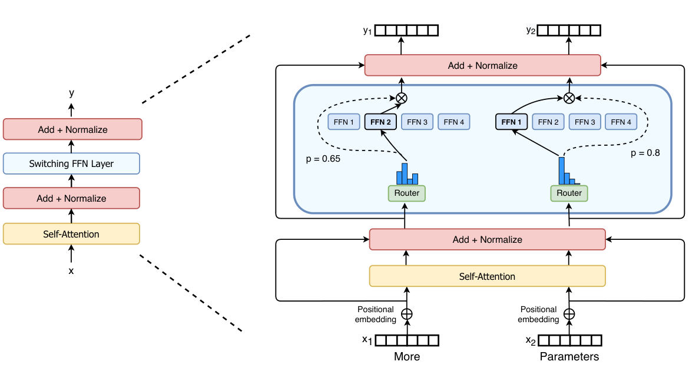

**图 2：** Switch Transformer 编码器块示意图。我们用稀疏 Switch 前馈网络层（浅蓝色）替换 Transformer 中的密集前馈网络（FFN）层。该层独立处理序列中的各个词元。图中展示两个词元（下方的 $x_1=$“More”和 $x_2=$“Parameters”）如何通过路由器，在四个 FFN 专家之间进行路由（实线）；路由器独立地为每个词元选择专家。Switch FFN 层返回所选 FFN 的输出，并乘以路由器门控值（虚线）。

### 2.1 简化稀疏路由

**混合专家路由。** Shazeer 等（2017）提出了自然语言混合专家层：输入词元表示 $x$，再从专家集合 $\{E_i(x)\}_{i=1}^{N}$ 中选出最优的 top-$k$ 个专家，将 $x$ 路由给它们。路由变量 $W_r$ 产生 logits $h(x)=W_r\cdot x$，并在该层可用的 $N$ 个专家上通过 softmax 归一化。专家 $i$ 的门控值为

$$
p_i(x)=\frac{e^{h(x)_i}}{\sum_{j=1}^{N}e^{h(x)_j}}. 
$$

随后选取 top-$k$ 个门控值进行路由。如果 $T$ 是选出的 top-$k$ 索引集合，那么该层输出是各专家对词元计算结果按门控值加权后的线性组合：

$$
y=\sum_{i\in T}p_i(x)E_i(x). 
$$

**Switch 路由：重新思考混合专家。** Shazeer 等（2017）猜测，为了让路由函数获得非平凡梯度，路由到 $k>1$ 个专家是必要的。作者直觉上认为，如果不能至少比较两个专家，学习路由就不会成功。Ramachandran 和 Le（2018）进一步研究了 top-$k$ 决策，发现对于包含许多路由层的模型，较低层使用较大的 $k$ 值很重要。与这些观点相反，我们采用一种简化策略，只路由到一个专家。我们表明，这一简化能够保持模型质量、减少路由计算，并取得更好表现。这种 $k=1$ 的路由策略后来被称为 Switch 层。需要注意，对于 MoE 路由和 Switch 路由，公式（2）中的门控值 $p_i(x)$ 都使路由器保持可微。

Switch 层有三项好处：（1）路由器只把一个词元路由给单个专家，因此路由器计算量减少；（2）每个专家的批量大小（专家容量）至少可以减半，因为每个词元只会被路由给一个专家；[1](#fn:3)（3）路由实现更简单，通信成本也更低。图 3 展示了不同专家容量因子下的路由示例。

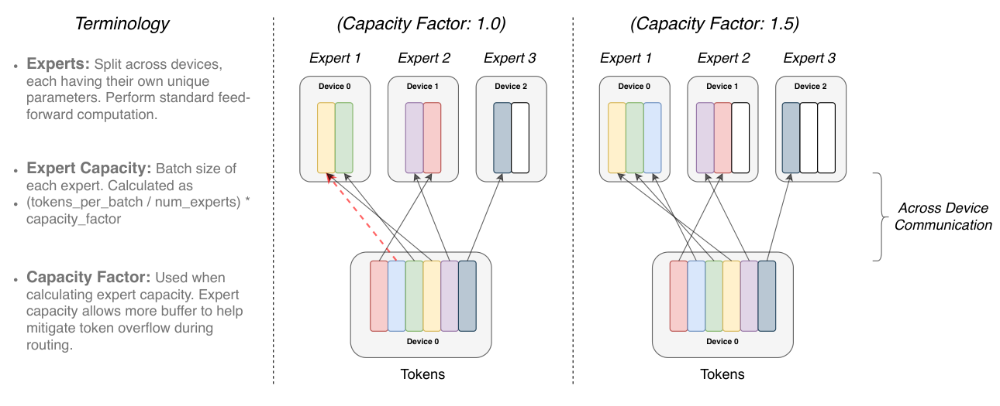

**图 3：** 词元路由动态示意图。每个专家处理固定批量大小的词元。当路由给某个专家的词元数量超过其容量时，多出的词元将被标记为溢出，并跳过该层的专家计算。

### 2.2 高效稀疏路由

我们使用 Mesh-Tensorflow（MTF）（Shazeer 等，2018）。这是一个在语义和 API 上类似 TensorFlow（Abadi 等，2016）的库，用于支持高效的分布式数据并行和模型并行架构。它把物理核心集合抽象为处理器的逻辑网格，然后可以按命名维度对张量和计算进行分片，从而容易地沿不同维度切分模型。我们在设计模型时考虑了 TPU，因为 TPU 要求在编译时静态声明张量尺寸。下面介绍我们的分布式 Switch Transformer 实现。

**分布式 Switch 实现。** 我们所有张量的形状都在编译时静态确定，但训练和推理中的路由决策会使计算本身动态变化。因此，一个重要的技术问题是如何设置专家容量。专家容量，即每个专家要计算的词元数量，先把批量中的词元数平均分配给专家，再乘以容量因子：

$$
\text{专家容量}=\left(\frac{\text{批量词元数}}{\text{专家数量}}\right)\times\text{容量因子}.
$$

容量因子大于 1.0 时，会创建额外缓冲区，以容纳词元没有完美均衡地分布到各专家的情况。如果过多词元被路由给某个专家（后文称为“被丢弃的词元”），就会跳过专家计算，并通过残差连接把词元表示直接传递到下一层。然而，提高专家容量也不是没有代价：容量值过高会造成计算和内存浪费。图 3 解释了这种权衡。根据经验，我们发现，较低的丢弃词元比例对于稀疏专家模型的扩展很重要。在全部实验中，我们没有发现丢弃词元数量依赖于专家数量；丢弃比例通常小于 1%。使用下一节介绍的辅助负载均衡损失，并设置足够高的系数，就能实现良好的负载均衡。表 1 研究了这些设计决策对模型质量和速度的影响。

**专家容量。** 每个专家的容量由下式计算：

$$
\text{expert capacity}=\left(\frac{\text{tokens\_per\_batch}}{\text{num\_experts}}\right)\times\text{capacity factor}.
$$

容量因子是一个手动设置的超参数，用于控制每个专家的缓冲区大小。容量因子大于 1.0 会增加额外缓冲，以容纳路由不均衡时的词元；但较高的值也会带来额外计算和内存开销。每个专家只处理落在其固定容量以内的词元，超过容量的词元会跳过专家计算，并通过残差连接直接传到下一层。较大的容量因子降低词元被丢弃的概率，但会增加通信和内存；较小的容量因子则相反。经验上，我们发现 Switch Transformer 在容量因子为 1.0 或 1.25 时依然表现良好，这对大型模型尤其重要，因为大型模型的内存通常非常紧张。

**可微负载均衡损失。** 为了鼓励各专家之间的负载均衡，我们加入辅助损失（Shazeer 等，2017、2018；Lepikhin 等，2020）。与 Shazeer 等（2018）和 Lepikhin 等（2020）一样，Switch Transformer 简化了 Shazeer 等（2017）中把负载均衡和重要性加权分开处理的原始设计。在每个 Switch 层中，训练期间都会把这个辅助损失加到模型总损失上。给定编号为 $i=1$ 到 $N$ 的 $N$ 个专家，以及包含 $T$ 个词元的批量 $B$，辅助损失计算为向量 $f$ 与 $P$ 的缩放点积：

$$
\mathrm{loss}=\alpha\cdot N\cdot\sum_{i=1}^{N}f_i\cdot P_i,
$$

其中 $f_i$ 是分派给专家 $i$ 的词元比例，

$$
f_i=\frac{1}{T}\sum_{x\in B}\mathbf{1}\{\arg\max p(x)=i\},\qquad
P_i=\frac{1}{T}\sum_{x\in B}p_i(x).
$$

其中 $P_i$ 是路由器分配给专家 $i$ 的概率比例：

$$
P_i=\frac{1}{T}\sum_{x\in B}p_i(x).
$$

由于我们希望批量词元在 $N$ 个专家之间均匀路由，因此希望两个向量的每个分量都为 $1/N$。公式（4）的辅助损失在均匀分布时达到最小，从而鼓励均匀路由。$P$ 向量可微，而 $f$ 向量不可微。最后将损失乘以专家数量 $N$，使专家数量变化时损失保持大致不变，因为在均匀路由下 $\sum_{i=1}^{N}(f_iP_i)=\sum_{i=1}^{N}(1/N\cdot1/N)=1/N$。超参数 $\alpha$ 是辅助损失的乘法系数；本文始终使用 $\alpha=10^{-2}$，它足以确保负载均衡，又不会压过主要的交叉熵目标。我们把 $\alpha$ 从 $10^{-1}$ 到 $10^{-5}$ 按 10 倍步长扫描，发现 $10^{-2}$ 能快速平衡负载，同时不干扰训练损失。

### 2.3 Switch Transformer 的整体设计

我们对 Switch Transformer 的首次测试，是在“海量清洁爬取语料库”（C4）上进行预训练。预训练目标采用掩码语言模型任务（Taylor，1953；Fedus 等，2018；Devlin 等，2018），训练模型预测被遮掩的词元。按照 Raffel 等（2019）确定的最优设置，我们丢弃 15% 的词元，并用单个哨兵词元替换被遮掩序列。为了比较模型，我们记录负对数困惑度。[2](#fn:4) 本文所有表格中，指标旁的 $\uparrow$ 表示数值越高越好，$\downarrow$ 表示数值越低越好。本文研究的全部模型比较见表 9。

我们在表 1 中对 Switch Transformer 与 MoE Transformer 进行直接比较。Switch Transformer 与 T5-Base 具有相同 FLOPs，即每个词元执行相同数量的计算。采用 top-2 路由的 MoE Transformer 有两个专家，每个专家都对每个词元应用一个独立 FFN，因此 FLOPs 更高。所有模型在相同硬件上训练相同步数。值得注意的是，在上面的实验设置中，MoE 模型把容量因子从 2.0 改为 1.25 后反而变慢（每秒 840 个样例降至 790 个），这出乎意料。[3](#fn:5)

表 1 显示三项关键发现：（1）从速度-质量权衡看，Switch Transformer 优于经过细致调优的密集模型和 MoE Transformer。在固定计算量和墙钟时间下，Switch Transformer 结果最好。（2）Switch Transformer 的计算负担小于 MoE 对手；如果把 Switch 模型扩大到与 MoE Transformer 相同的训练速度，它在每步性能上也超过所有 MoE 与密集模型。（3）Switch Transformer 在较低容量因子（1.0、1.25）下表现更好。较小的专家容量对应大型模型场景：模型内存非常有限，此时容量因子应尽可能小。

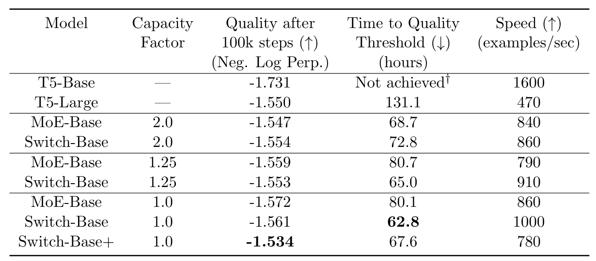

**表 1：** Switch 与 MoE 的基准比较。逐步和按时间比较 Switch Transformer 相对于 MoE Transformer 与 T5 密集基线的收益。质量用负对数困惑度表示，并记录达到任意选定质量阈值（负对数困惑度 $=-1.50$）所需的时间。所有 MoE 与 Switch Transformer 模型都使用 128 个专家，专家位于每隔一个 FFN 层。对于 Switch-Base+，我们把隐藏层维度从 768 增加到 896，把注意力头数从 14 增加到 16，直到训练速度与 MoE 模型相同。所有模型都使用相同计算量（32 个核心）和相同硬件（TPUv3）训练。所有模型都需要超过 100k 步才能达到 $-1.50$；符号 † 表示 T5-Base 在 100k 步内未达到该负对数困惑度。

### 2.4 改进训练与微调技术

稀疏专家模型可能比普通 Transformer 引入更多训练困难。每个稀疏层中的硬切换（路由）决策会导致不稳定；此外，bfloat16 等低精度格式（Wang 和 Kanwar，2019）可能放大 softmax 路由器中的问题。下面介绍这些训练困难，以及我们为实现稳定、可扩展训练所采用的方法。

**大型稀疏模型的选择性精度。** 模型不稳定会妨碍使用高效的 bfloat16 精度训练，因此 Lepikhin 等（2020）在整个 MoE Transformer 中使用 float32。我们则展示：只在模型的局部区域选择性地转换为 float32，就能实现稳定性，而不会产生 float32 张量的昂贵通信成本。这与现代混合精度训练策略一致：模型的某些部分以及梯度更新使用更高精度（Micikevicius 等，2017）。表 2 表明，我们的方法几乎保留 bfloat16 训练的速度，同时获得 float32 的训练稳定性。

具体做法是，把路由器输入转换为 float32。路由器接收词元作为输入，并产生用于选择和重新组合专家计算的 dispatch 张量与 combine 张量（详见附录代码块 15）。float32 只在路由器函数内部使用，而且只用于该设备上的局部计算。函数末尾会把 dispatch 与 combine 张量重新转换为 bfloat16，因此不会有昂贵的 float32 张量参与全互联通信；与此同时，我们仍然获得 float32 的稳定性收益。

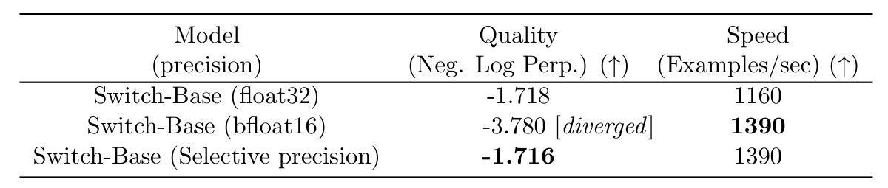

**表 2：** 选择性精度。只把局部路由操作转换为 float32，其余部分保留 bfloat16，以稳定模型，同时实现与不稳定的 bfloat16 训练几乎相同的速度。表中记录 32 专家模型在训练早期固定步数后的质量和速度。

**用于稳定性的更小参数初始化。** 恰当初始化对深度学习成功至关重要；我们尤其观察到，Switch Transformer 对初始化非常敏感。我们从截断正态分布中抽取权重矩阵元素，其均值为 $\mu=0$，标准差为 $\sigma=s/\sqrt n$，其中 $s$ 是缩放超参数，$n$ 是权重张量的输入单元数（例如 fan-in）。[4](#fn:6)

作为解决不稳定性的另一项措施，我们建议把普通 Transformer 的默认初始化尺度 $s=1.0$ 缩小 10 倍。这既改善了质量，也降低了实验中训练失稳的可能性。表 3 测量了模型质量的改善以及训练早期方差的下降。我们发现，平均模型质量（以负对数困惑度衡量）显著提升，运行之间的方差也大幅降低。同一初始化方案对跨越多个数量级的模型都有效；我们用它稳定训练从 2.23 亿参数基线到超过万亿参数的模型。

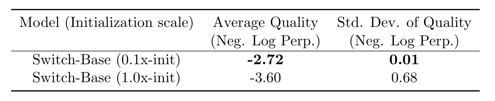

**表 3：** 减小初始化尺度提高稳定性。减小初始化尺度能带来更好的质量和更稳定的 Switch Transformer 训练。表中记录 32 专家模型训练 3.5k 步后的平均质量与标准差，每个设置使用 3 个随机种子。

**大型稀疏模型的正则化。** 本文采用自然语言处理中的常见方法：先在大型语料库上预训练，再在摘要或问答等规模更小的下游任务上微调。由于许多微调任务只有很少的样例，过拟合自然会成为一个问题。微调标准 Transformer 时，Raffel 等（2019）在每一层使用 dropout（Srivastava 等，2014）以防止过拟合。Switch Transformer 的参数量显著多于 FLOPs 匹配的密集基线，因此在这些较小的下游任务上可能出现更严重的过拟合。

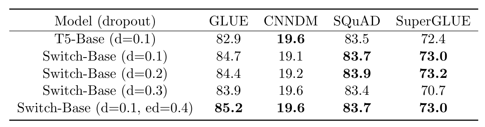

**表 4：** 微调正则化结果。微调阶段对专家 dropout 率进行扫描。质量以验证集上的负对数困惑度表示；对 Switch 层使用比其他层更大的 dropout 率能够改善微调表现。

因此，我们提出一种缓解微调过拟合的简单方法：提高专家内部的 dropout，并把它称为“专家 dropout”。微调期间，我们只在每个专家层的中间前馈计算中显著提高 dropout 率。表 4 给出专家 dropout 方案的结果。我们观察到，简单地提高所有层的 dropout 会使性能变差；而在非专家层设置较低的 dropout 率 0.1、在专家层设置高得多的 dropout 率 0.4，则能提高四个小型下游任务的性能。

## 3. 扩展性质

我们研究 Switch Transformer 架构在预训练期间的扩展性质。按照 Kaplan 等（2020）的设定，我们考虑模型既没有受到计算预算限制、也没有受到数据量限制的情形。为了避免数据瓶颈，我们使用包含超过 1800 亿目标词元的大型 C4 语料库（Raffel 等，2019），并持续训练，直到收益开始递减。

对我们的模型而言，专家数量是最高效的扩展维度。增加专家数量能够使计算成本近似保持不变，因为无论候选专家有多少，模型对每个词元只选择一个专家。不过，路由器必须在更多专家上计算概率分布；这只是一个轻量计算，成本为 $O(d_{model}\times\text{专家数量})$，其中 $d_{model}$ 是层间传递的词元嵌入维度。本节在固定计算预算下，分别从固定步数和固定时间两个角度考察扩展性质。

### 3.1 按步数考察扩展结果

图 4 展示了在训练所有模型相同步数时，专家数量增加带来的稳定扩展收益。我们观察到清晰趋势：当每个词元的 FLOPs 固定时，参数（专家）越多，训练越快。左图展示了在每词元 FLOPs 固定时，稀疏模型参数量与测试损失之间稳定的扩展关系，揭示了沿稀疏模型参数这一额外轴扩展的优势。右图测量了一个密集模型变体和四个 FLOPs 匹配的稀疏变体的样本效率。我们发现，增加专家数量会得到样本效率更高的模型。Switch-Base 的 64 专家模型在第 60k 步达到 T5-Base 模型在第 450k 步时的相同性能，按步数计算相当于 7.5 倍加速。与 Kaplan 等（2020）的发现一致，我们还发现更大的模型样本效率也更高：在观察到固定数量词元时，它们学习得更快。

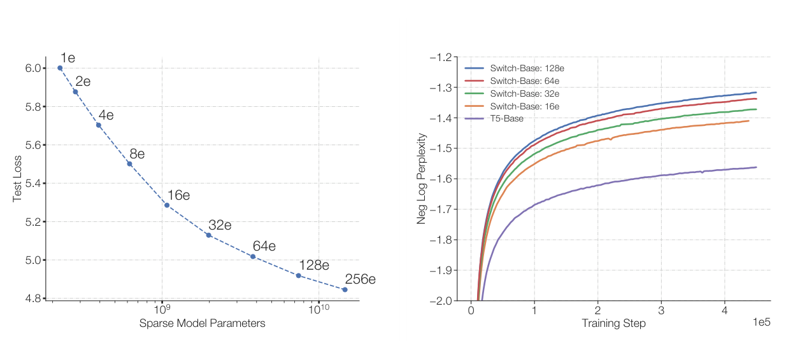

**图 4：** Switch Transformer 的扩展性质。左图：随着专家数量增加、模型参数量扩大，用困惑度衡量的质量持续提升。左上角点对应拥有 2.23 亿参数的 T5-Base。沿左上到右下方向，专家数量依次加倍为 2、4、8，直到右下角拥有 147 亿参数的 256 专家模型。尽管所有模型使用相同计算预算，增加专家数量仍带来持续改进。右图：扫描专家数量得到的每步负对数困惑度。紫色线表示密集基线，可以看到 Switch-Base 模型的样本效率更高。

### 3.2 按时间考察扩展结果

图 4 表明，按步数比较时，增加专家数量会持续提高性能。虽然我们的模型与基线每词元 FLOPs 大致相同，但 Switch Transformer 还要承担设备间的额外通信成本以及路由机制的额外计算。因此，按步数观察到的样本效率提升，不一定会转化为按墙钟时间衡量的更高模型质量。这引出一个问题：在固定训练时长和计算预算下，应该训练密集模型还是稀疏模型？

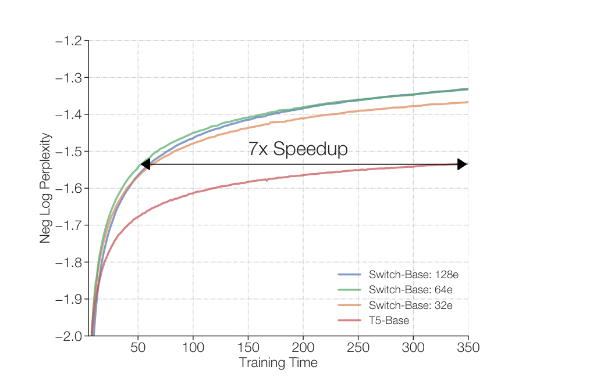

**图 5：** Switch Transformer 的速度优势。所有模型都在 32 个 TPUv3 核心上训练，并且每个样例的 FLOPs 相同。在固定计算量和训练时间下，Switch Transformer 显著优于密集 Transformer 基线。64 专家 Switch-Base 模型只需 T5-Base 达到相同性能所需时间的七分之一，并且还会继续提升。

图 5 和图 6 回答了这个问题。图 5 测量预训练模型质量随时间的变化。在固定训练时长和计算预算下，Switch Transformer 带来显著加速。在该设置中，64 专家 Switch-Base 达到相近困惑度所需的训练时间只有 T5-Base 的七分之一。

### 3.3 与更大的密集模型比较扩展

上面的分析表明，在计算量匹配时，密集模型会被 Switch 模型超过。图 6 考察另一种情形：如果我们把资源投入一个更大的密集模型，会怎样？这里将 Switch-Base 与下一个强基线 T5-Large 比较。尽管 T5-Large 每个词元使用多 3.5 倍的 FLOPs，Switch-Base 的样本效率仍更高，并实现 2.5 倍加速。此外，只需设计一个更大的稀疏版本 Switch-Large，并使其 FLOPs 与 T5-Large 匹配，就还能获得更多收益。我们在下一节展示它在扩展和微调上的优势。

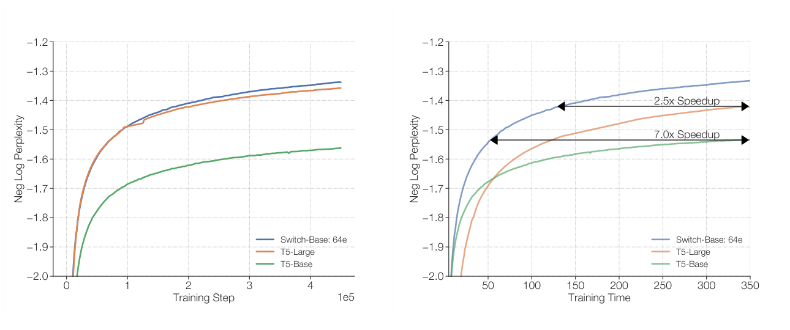

**图 6：** 使用 Switch 层或标准密集模型扩展来扩展 Transformer。左图：Switch-Base 的样本效率高于 T5-Base 和 T5-Large，后者每词元使用多 3.5 倍 FLOPs。右图：与前面一样，按墙钟时间比较时 Switch-Base 仍更快，并且相对于 T5-Large 实现 2.5 倍加速。

## 4. 下游结果

第 3 节展示了预训练期间更优的扩展性质，现在我们验证这些收益能否转化为下游任务中更强的语言学习能力。首先，我们在多样化自然语言处理任务上进行微调。接着，我们通过蒸馏把稀疏模型压缩为易于部署的小型密集基线，将内存占用降低 90% 以上。最后，我们在多任务、多语言设置下测量改进，展示 Switch Transformer 是强大的多任务学习器，在全部 101 种语言上都超过多语言 T5-Base 模型。

### 4.1 微调

**用于微调的基线和 Switch 模型。** 我们的基线是经过充分调优、拥有 2.23 亿参数的 T5-Base，以及拥有 7.39 亿参数的 T5-Large（Raffel 等，2019）。对于两个版本，我们都设计了 FLOPs 匹配、但拥有更多参数的 Switch Transformer，具体总结在表 9 中。[5](#fn:7) 我们的基线与 Raffel 等（2019）略有不同，因为我们在改进后的 C4 语料库上进行预训练，删除了样例内部的文本重复，从而提高了预训练任务的有效性（Lee 等，2021）。在实验流程中，我们以每批 $2^{20}$ 个词元，即 1,048,576 个词元进行预训练，训练 550k 步，总计 5760 亿词元。随后在多样化任务上微调：除 Switch 层使用 0.4 的 dropout 率外，所有层使用 0.1 的 dropout 率（见表 4）。微调时批量大小为 100 万，训练 16k 步；每个任务每 200 步评估一次，并报告验证集上的峰值性能。

**微调任务和数据集。** 我们选择考察语言能力的任务，包括问答、摘要和世界知识。GLUE（Wang 等，2018）和 SuperGLUE（Wang 等，2019）作为复合混合任务处理，所有子任务按所含词元数量的比例混合。这些基准包括：情感分析（SST-2）、词义消歧（WiC）、句子相似度（MRPC、STS-B、QQP）、自然语言推断（MNLI、QNLI、RTE、CB）、问答（MultiRC、ReCoRD、BoolQ）、指代消解（WNLI、WSC）、句子补全（COPA）和句子可接受性判断（CoLA）。我们使用 CNNDM（Hermann 等，2015）和 BBC XSum（Narayan 等，2018）数据集测量文章摘要能力。问答能力通过 SQuAD（Rajpurkar 等，2016）和 ARC 推理挑战（Clark 等，2018）进行考察。与 Roberts 等（2020）一样，我们还在三个闭卷问答数据集上微调模型以评估知识：Natural Questions（Kwiatkowski 等，2019）、Web Questions（Berant 等，2013）和 TriviaQA（Joshi 等，2017）。闭卷是指提出问题时不给模型额外的参考资料或上下文。为了衡量常识推理，我们在 Winogrande Schema Challenge（Sakaguchi 等，2020）上进行评估。最后，我们在对抗性自然语言推断基准 ANLI（Nie 等，2019）上测试自然语言推断能力。

**微调指标。** 全文使用以下评估指标：GLUE 和 SuperGLUE 报告所有子任务的平均分；CNNDM 和 XSum 都使用 Rouge-2；在 SQuAD 和闭卷任务（Web Questions、Natural Questions、Trivia Questions）中，报告答案与目标完全匹配的百分比（有关这一指标的更多细节和缺陷见 Roberts 等，2020）；在 ARC Easy、ARC Challenge、ANLI 和 Winogrande 中，报告生成回答的准确率。

**微调结果。** 我们在许多自然语言任务上观察到显著的下游改进。SuperGLUE 的改进尤其突出：FLOPs 匹配的 Switch 变体相对于 T5-Base 和 T5-Large 基线分别提高 4.4 个和 2 个百分点；Winogrande、闭卷 TriviaQA 和 XSum 也有较大改进。[6](#fn:8) 在我们的微调研究中，唯一没有观察到收益的是 AI2 推理挑战（ARC）数据集：在挑战集上 T5-Base 优于 Switch-Base，在简单集上 T5-Large 优于 Switch-Large。总体而言，改进同时覆盖推理任务和知识密集型任务。这验证了我们的架构不仅擅长预训练，也能通过微调把质量提升传递到下游任务。

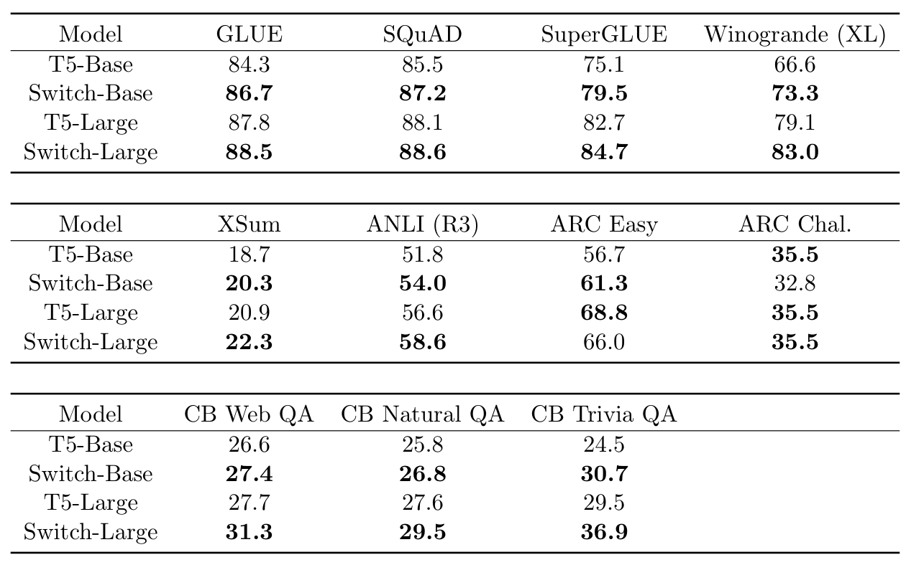

**表 5：** 微调结果。T5 基线和 Switch 模型在多种自然语言测试上的微调结果（验证集，数值越高越好）。我们把 FLOPs 匹配的 Switch 模型与 T5-Base、T5-Large 基线比较。在大多数任务上，Switch 变体都有显著改进；两种模型规模以及推理型和知识密集型任务都出现收益。

### 4.2 蒸馏

部署拥有数十亿甚至万亿参数的大型神经网络并不方便。为缓解这一问题，我们研究把大型稀疏模型蒸馏（Hinton 等，2015）成小型密集模型。未来还可以进一步研究把大型模型蒸馏成更小的稀疏模型。

**蒸馏技术。** 表 6 研究了多种蒸馏技术。这些技术建立在 Sanh 等（2019）对 BERT 模型蒸馏方法的研究之上。我们发现，用非专家权重初始化密集模型会带来适度改进。由于所有模型的 FLOPs 相匹配，非专家层具有相同维度，因此可以这样初始化。由于 Transformer 通常只在每个 FFN 层或每隔一个 FFN 层加入专家层，这使得许多权重都能使用已经训练好的参数初始化。此外，当教师概率与真实标签按 0.25 和 0.75 混合时，我们观察到蒸馏效果进一步提升。结合这两种技术，只用约二十分之一的参数，就能保留大型稀疏模型质量收益的约 30%。这里的“质量收益”指 Switch-Base（教师）与 T5-Base（学生）之间质量差异的百分比，因此 100% 表示学生达到教师性能。

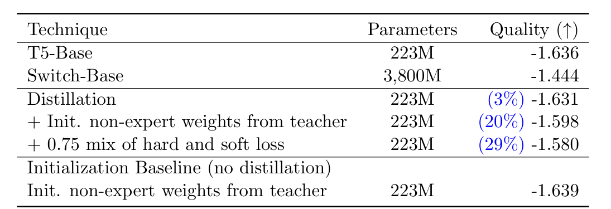

**表 6：** 用于语言建模的 Switch Transformer 蒸馏。用 Switch-Base 的非专家权重初始化 T5-Base，并混合教师标签和真实标签计算损失，可以获得最佳性能。我们可以把拥有多 100 倍参数的大型稀疏模型的 30% 性能提升蒸馏回小型密集模型。作为最终基线，我们发现，把 T5-Base 用专家权重初始化、但正常训练而不进行蒸馏，并不能带来改进。

**可实现的压缩率。** 使用表 6 中最优的蒸馏技术，我们把多种稀疏模型蒸馏成密集模型。我们扫描拥有不同专家数量的 Switch-Base 版本，对应 11 亿至 147 亿参数。通过蒸馏，在压缩 82% 的同时，可以保留 11 亿参数模型质量收益的 37%。在极端情况下，即使把模型压缩 99%，仍能保留教师模型质量改进的 28%。

**蒸馏微调模型。** 最后，我们研究把微调后的稀疏模型蒸馏成密集模型。表 8 展示了一个在 SuperGLUE 任务上微调的 74 亿参数 Switch-Base 模型如何蒸馏到 2.23 亿参数的 T5-Base。与预训练结果类似，我们发现，在 FLOPs 匹配的密集变体中蒸馏时能够保留稀疏模型收益的 30%。一个尚未研究、但可能有价值的未来方向，是分析微调任务实际使用的专家，并提取这些专家，以实现更好的模型压缩。

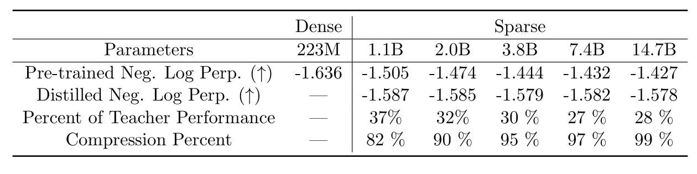

**表 7：** 蒸馏压缩率。我们测量把大型稀疏模型蒸馏成密集基线时的质量。基线 T5-Base 的负对数困惑度质量为 -1.636；右侧各列把规模逐渐增加的稀疏模型蒸馏到同一架构。结合权重初始化以及硬、软损失混合，我们可以把稀疏教师模型压缩 95% 以上，同时保留质量收益的 30%。不过，对于质量显著更高、规模更大的预训练教师模型，要实现这些压缩率，预计需要更大的学生模型。

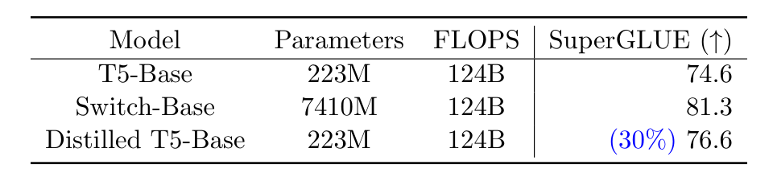

**表 8：** 蒸馏微调后的 SuperGLUE 模型。我们把在 SuperGLUE 任务上微调的 Switch-Base 模型蒸馏到 T5-Base。我们观察到，在较小数据集上，大型稀疏模型可以成为有效的蒸馏教师；在压缩 97% 的模型中，仍然实现了教师性能收益的 30%。

### 4.3 多语言学习

在最后一组下游实验中，我们测量在 101 种语言混合数据上预训练时的模型质量与速度权衡。我们以 mT5（Xue 等，2020）这一 T5 的多语言扩展为基础进行构建和基准测试。我们在 mT5 引入的多语言 Common Crawl 数据集变体 mC4 上预训练，该数据集覆盖 101 种语言；由于部分语言内部存在文字脚本变体，混合数据实际包含 107 个任务。

图 7 绘制了 FLOPs 匹配的 Switch 模型 mSwitch-Base 相对于密集基线 mT5-Base，在所有语言上的负对数困惑度改进。两个版本都预训练 1M 步后，我们发现，Switch Transformer 在考察的全部 101 种语言上都提高了最终负对数困惑度。图 8 从另一角度展示结果：统计 Switch Transformer 相对于 mT5-Base 的每步加速比。我们发现相对 mT5-Base 的平均加速为 5 倍，91% 的语言至少达到 4 倍加速。这说明 Switch Transformer 是有效的多任务、多语言学习器。

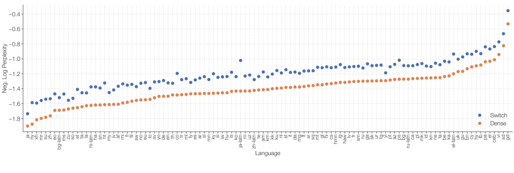

**图 7：** 101 种语言上的多语言预训练。图中展示在 101 种语言上进行多任务训练时，Switch T5-Base 相对于密集基线的改进。Switch Transformer 在多任务训练设置中表现良好，并在全部 101 种语言上获得改进。

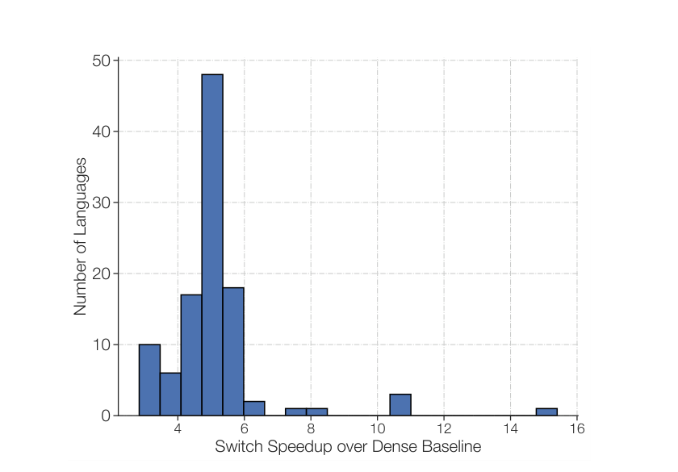

**图 8：** 101 种语言上的多语言预训练。对于每种语言，我们统计 Switch Transformer 相对于 FLOPs 匹配的 T5 密集基线、达到相同质量所需的步数加速。对全部 101 种语言而言，相对 mT5-Base 的平均步数加速为 5 倍；其中 91% 的语言达到 mT5-Base 最终困惑度所需的加速至少为 4 倍。

## 5. 使用数据并行、模型并行与专家并行设计模型

任意增加专家数量会遇到收益递减（图 4），因此这里介绍互补的扩展策略。扩展 Transformer 的常见方法，是同时增大 $d_{model}$ 或 $d_{ff}$ 等维度。这会同时增加参数量和计算量，并最终受到每个加速器内存容量的限制。一旦模型超过单个加速器的内存，就可以采用单程序多数据（SPMD）模型并行。本节研究结合数据并行、模型并行与专家并行时的权衡。

**回顾前馈网络（FFN）层。** 我们用 FFN 层作为示例，说明数据并行、模型并行和专家并行在 Mesh TensorFlow（Shazeer 等，2018）中如何工作。假设一个批量中有 $B$ 个词元，每个词元的维度为 $d_{model}$。FFN 的输入 $x$ 和输出 $y$ 大小均为 $[B,d_{model}]$，中间表示 $h$ 的大小为 $[B,d_{ff}]$，其中 $d_{ff}$ 通常比 $d_{model}$ 大数倍。在 FFN 中，中间表示为 $h=xW_{in}$，该层输出为 $y=\mathrm{ReLU}(h)W_{out}$。因此，$W_{in}$ 和 $W_{out}$ 独立应用于每个词元，形状分别为 $[d_{model},d_{ff}]$ 和 $[d_{ff},d_{model}]$。

我们描述两方面的切分：权重和数据批量如何分配到各个核心，如图 9 所示。把所有可用核心数记为 $N$，Mesh TensorFlow 可以把它们重新映射为处理器的逻辑多维网格。这里创建二维逻辑网格：一个维度表示数据并行分片数 $n$，另一个维度表示模型并行分片数 $m$。总核心数必须等于数据并行和模型并行两个方向分片数的乘积，即 $N=n\times m$。为了把层切分到多个核心，包含 $B$ 个词元批量的张量沿 $n$ 个数据并行核心分片，因此每个核心包含 $B/n$ 个词元。包含 $d_{ff}$ 维度的张量和变量再沿 $m$ 个模型并行核心分片。对于带专家层的变体，我们考虑 $E$ 个专家，每个专家最多处理 $C$ 个词元。

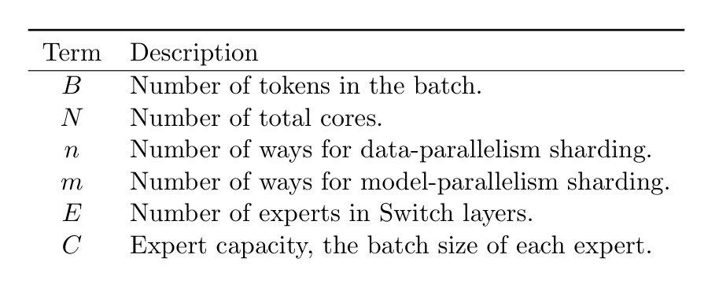

### 5.1 数据并行

训练数据并行模型时，这也是分布式训练的标准方式，所有核心都分配给数据并行维度，即 $n=N,m=1$。这样做的优点是，在整个前向传播和反向传播结束、需要跨核心聚合梯度之前，不需要任何通信。它对应图 9 最左侧的一列。

### 5.2 模型并行

现在考虑所有核心完全分配给模型并行维度的情形，因此 $n=1,m=N$。此时所有核心都必须保存完整的 $B$ 个词元，而每个核心只包含一份不同的权重切片。每次前向和反向传播都会产生通信成本。为了计算第二次矩阵乘法 $\mathrm{ReLU}(h)W_{out}$，每个核心需要发送一个形状为 $[B,d_{model}]$ 的张量，因为 $d_{ff}$ 维度已经被切分，必须对它求和。一般而言，只要需要对跨核心切分的某个维度求和，就要在前向和反向传播中各增加一次全归约操作。纯数据并行则不同，它只在整个前向和反向传播结束时进行一次全归约。

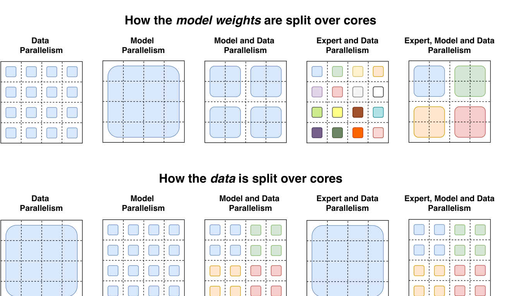

**图 9：** 数据与权重切分策略。每个 $4\times4$ 虚线网格代表 16 个核心，阴影方块表示该核心上存放的数据，即模型权重或词元批量。图中展示各种策略如何切分模型权重和数据张量。第一行：模型权重在各核心上的切分方式。该行不同大小的形状表示前馈网络层中更大的权重矩阵，例如更大的 $d_{ff}$；不同颜色的阴影方块表示不同的权重矩阵。每个核心的参数量固定，但更大的权重矩阵会对每个词元执行更多计算。第二行：数据批量在各核心上的切分方式。每个核心保存相同数量的词元，使所有策略下的内存用量固定。不同切分策略允许不同核心保存相同或不同的词元，图中的不同颜色表达这一差异。

### 5.3 模型并行与数据并行

大规模模型通常混合使用模型并行和数据并行，最大的 T5 模型（Raffel 等，2019；Xue 等，2020）以及 GPT-3（Brown 等，2020）都采用了这种做法。总核心数为 $N=n\times m$ 时，每个核心负责 $B/n$ 个词元，以及权重和中间激活的 $d_{ff}/m$ 部分。在前向和反向传播中，每个核心都通过全归约操作通信一个大小为 $[B/n,d_{model}]$ 的张量。

### 5.4 专家并行与数据并行

接下来介绍专家并行与数据并行的切分策略。Switch Transformer 把所有核心分配给数据切分维度 $n$，这个维度也对应模型中的专家数量。对每个核心上的每个词元，路由器在本地计算专家分配。输出是一个大小为 $[n,B/n,E,C]$ 的二值矩阵，它沿第一维切分并确定专家分配。随后用这个二值矩阵与形状为 $[n,B/n,d_{model}]$ 的输入张量进行矩阵乘法，从而执行收集：

$$
\mathrm{einsum}([n,B/n,d_{model}],[n,B/n,E,C],\text{求和维}=B/n). \tag{7}
$$

最终得到形状为 $[n,E,C,d_{model}]$ 的张量，它沿第一维分片。由于每个核心都有自己的专家，我们执行一次大小为 $[E,C,d_{model}]$ 的全互联通信，把分片维度从 $n$ 改为 $E$。前向传播还会额外通信大小为 $E\times C\times d_{model}$ 的 bfloat16 张量，以类似方式从位于不同核心上的各专家接收词元。专家切分代码的详细分析见附录 F。

### 5.5 专家并行、模型并行与数据并行

在设计最佳模型时，我们希望平衡每词元 FLOPs 和参数量。增加专家数量会提高参数量，但不会改变每词元 FLOPs。要增加 FLOPs，还必须提高 $d_{ff}$ 维度，这同样会增加参数量，但速度较慢。这里存在一种权衡：随着 $d_{ff}$ 增大，每个核心的内存会耗尽，因而必须增大 $m$。但总核心数 $N$ 固定且 $N=n\times m$，所以必须减小 $n$；为了保持每核心词元数不变，这又迫使我们使用更小的批量大小。

同时结合模型并行和专家并行时，既有把词元路由到正确专家所产生的全互联通信成本，也有模型并行内部的全归约通信。三种方法全部结合时，平衡 FLOPs、通信成本和每核心内存会变得相当复杂，最佳映射需要通过实验确定。专家数量对下游性能的影响还可参见第 5.6 节的进一步分析。

### 5.6 迈向万亿参数模型

通过结合专家并行、模型并行和数据并行，我们设计了两个大型 Switch Transformer，分别拥有 3950 亿和 1.6 万亿参数。我们研究这些模型作为语言模型的上游预训练表现，以及下游微调表现。两个模型的参数量、每序列 FLOPs 和超参数列于表 9。表中包括 Transformer 的标准超参数，如 $d_{model}$、$d_{ff}$、$d_{kv}$、注意力头数和层数，也包括较少见的 $\mathrm{FFN}_{GEGLU}$。后者表示 FFN 层的一种变体：把扩展矩阵替换成两组以非线性方式组合的权重（Shazeer，2020）。

Switch-C 只使用专家并行而不使用模型并行，正如第 5.4 节所述。因此，控制宽度、深度、注意力头数等的超参数都远小于 T5-XXL。相比之下，Switch-XXL 的 FLOPs 与 T5-XXL 匹配，因此可以使用更大的超参数维度，但代价是模型并行带来的额外通信成本（详见第 5.5 节）。

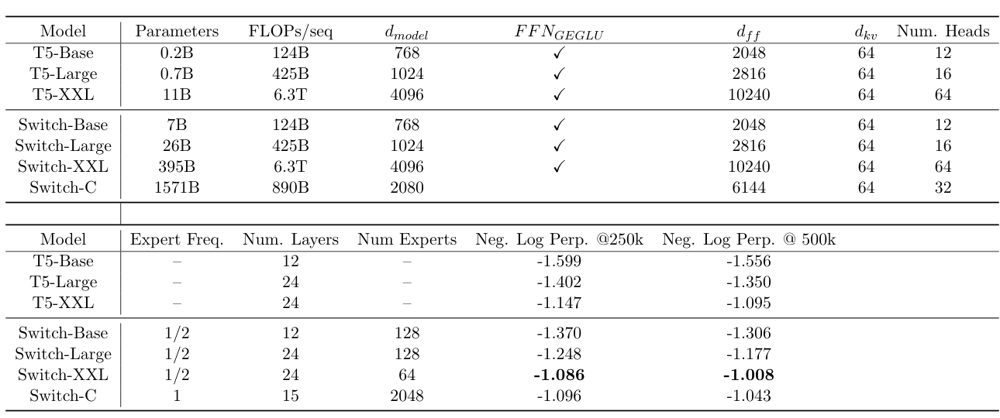

**表 9：** Switch 模型设计与预训练性能。比较 T5 模型与 Switch Transformer 变体的超参数和预训练性能。最后两列分别记录模型在 C4 数据集上训练 250k 步和 500k 步后的质量。使用相同计算预算时，Switch-C Transformer 达到固定困惑度的速度比 T5-XXL 快 4 倍，并且差距会随训练推进继续扩大。

**相对于 T5-XXL 的样本效率。** 表 9 最后两列分别记录训练 250k 步和 500k 步后在 C4 语料库上的负对数困惑度。250k 步后，两个 Switch Transformer 变体的负对数困惑度都比 T5-XXL 至少提高 0.061。[8](#fn:10) 为说明 0.061 差距的意义，T5-XXL 还需要额外训练 250k 步，才能提高 0.052。随着训练继续，差距进一步扩大；到 500k 步时，Switch-XXL 已比 T5-XXL 高 0.087。

**训练不稳定性。** 然而，正如引言所述，大型稀疏模型可能不稳定；随着规模扩大，我们遇到了一些偶发问题。拥有 1.6 万亿参数和 2048 个专家的更大 Switch-C 模型完全没有表现出训练不稳定。相反，每序列 FLOPs 近 10 倍于 Switch-C 的 Switch-XXL 有时会不稳定。因此，尽管 Switch-XXL 按步数比较是更好的模型，我们没有像 T5 最终报告结果（Raffel 等，2019）那样把它完整预训练 1M 步。

**推理任务的微调性能。** 为初步评估模型质量，我们使用一个在 5030 亿词元上完成部分预训练的 Switch-XXL 模型，所用文本约为 T5-XXL 的一半。为了提高效率，我们基于该检查点进行多任务训练，即联合学习所有任务，而不是分别微调。SQuAD 验证集准确率提高到 89.7，当时最先进结果为 91.3。SuperGLUE 测试集平均分为 87.5，T5 版本为 89.3，当时最先进结果为 90.0（Wang 等，2019）。在 ANLI（Nie 等，2019）上，Switch-XXL 超过此前最佳结果，准确率达到 65.7，而此前最佳为 49.4（Yang 等，2020）。需要指出，虽然 Switch-XXL 在上游预训练任务上取得了最先进的负对数困惑度，但这些收益尚未完全转化为最先进的下游性能。附录 E 对此进行了进一步研究。

**知识型任务的微调性能。** 最后，我们还在三个闭卷知识任务上初步考察模型知识：Natural Questions、WebQuestions 和 TriviaQA，而且不使用显著片段掩码进行额外预训练（Guu 等，2020）。在三个任务上，模型都超过此前最先进的 T5-XXL（不使用 SSM）。Natural Questions 的完全匹配率从此前最佳 32.8 提高到 34.4，WebQuestions 从 37.2 提高到 41.0，TriviaQA 从 42.9 提高到 47.5。

总而言之，尽管训练数据不到其他模型的一半，我们已经取得相当、并且有时达到最先进水平的模型质量。目前，Switch Transformer 能更好地把显著的上游收益转化到知识型任务，而不是推理任务（见附录 E）。如何从大型专家模型中取得更强的微调性能仍是一个活跃研究问题，而预训练困惑度表明未来应当还可以继续改进。

## 6. 相关工作

规模对神经网络的重要性已经得到广泛认可，人们也提出了多种方法。近期工作通过模型并行，把权重和张量切分到多个核心，将模型扩展到数十亿参数（Shazeer 等，2018；Rajbhandari 等，2019；Raffel 等，2019；Brown 等，2020；Shoeybi 等，2019）。另一类方法中，Harlap 等（2018）和 Huang 等（2019）提出基于流水线的模型并行，把不同层分配到不同设备，并将微批次以流水线方式送入这些层。最后，Lample 等（2019）提出乘积键网络：根据某一层收到的词元表示查找可学习嵌入，从而扩大神经网络容量。

我们的工作研究条件计算方法家族中的一种具体模型。这类方法会根据输入动态做出计算决策。Cho 和 Bengio（2014）提出，根据模型隐藏状态中出现的特定位模式自适应选择权重。Eigen 等（2013）构建了由密集矩阵乘法和 ReLU 激活组成的堆叠专家层，并在经过扰动的 MNIST 和单调语音数据上展示了有希望的结果。在计算机视觉中，Puigcerver 等（2020）在上游预训练期间按照语义类别手动路由词元，然后根据下游任务选择要使用的相关专家。

在现代深度学习架构中，混合专家（MoE）的有效性由 Shazeer 等（2017）证明。该工作在 LSTM（Hochreiter 和 Schmidhuber，1997）层之间加入 MoE 层，并把词元分别路由到不同专家组合，在语言建模和机器翻译基准上取得当时最先进结果。Mesh TensorFlow 库（Shazeer 等，2018）随后把 MoE 层重新引入 Transformer 架构，以其替代 FFN 层，但没有给出相应的自然语言处理结果。最近，随着机器学习基础设施进步，扩展 XLA 编译器的 GShard（Lepikhin 等，2020）使用 MoE Transformer，在 100 种语言的机器翻译上获得显著提升。最后，Fan 等（2021）选择了另一种确定性 MoE 策略，把模型参数切分为互不重叠的语言组。

沿 Transformer 注意力模式的序列长度维度 $L$ 引入稀疏性，已成为把注意力复杂度从 $O(L^2)$ 降低的成功技术（Child 等，2019；Correia 等，2019；Sukhbaatar 等，2019；Kitaev 等，2020；Zaheer 等，2020；Beltagy 等，2020），使模型能够学习比过去更长的序列。当前版本的 Switch Transformer 没有使用注意力稀疏性，但这些技术彼此互补；未来可以把它们结合起来，以改进需要长上下文的任务学习。

## 7. 讨论

下面提出并讨论关于 Switch Transformer 以及一般稀疏专家模型的问题；这里的稀疏性指权重稀疏，而不是注意力模式稀疏。

**Switch Transformer 难道不是只因为参数量巨大才更好吗？** 是的，而且这是有意设计的。参数量独立于所使用的总 FLOPs，是扩展神经语言模型的一个有用维度。大量研究已经充分表明，大模型表现更好（Kaplan 等，2020）。但在这里，我们的模型使用相同计算资源，却具有更高的样本效率和更快的速度。

**我没有超级计算机，这种方法对我仍有用吗？** 虽然本文重点研究极大模型，但我们也发现，只用两个专家就能提升性能，而且可以轻松装入常见 GPU 或 TPU 的内存限制之内（详见附录 D）。因此，我们认为这些技术在小规模环境中同样有用。

**在速度-准确率帕累托曲线上，稀疏模型是否优于密集模型？** 是的。在多种不同模型规模下，稀疏模型按步数和墙钟时间比较都优于密集模型。控制实验表明，在固定计算量和时间下，稀疏模型优于密集模型。

**我无法部署万亿参数模型，能否把它缩小？** 我们无法完整保留模型质量，但通过把稀疏模型蒸馏成密集模型，可以实现 10 到 100 倍的压缩，同时保留专家模型约 30% 的质量收益。

**为什么使用 Switch Transformer，而不是模型并行的密集模型？** 按时间比较，Switch Transformer 可以比参数分片的密集模型高效得多（图 6）。而且这两个选择并不互斥：我们可以在 Switch Transformer 中使用模型并行，而且实际也这样做了；这会增加每词元 FLOPs，但也会承担传统模型并行带来的减速。

**为什么稀疏模型还没有被广泛使用？** 扩展密集模型取得的巨大成功，抑制了人们尝试稀疏模型的动力；Hooker（2020）认为，这种成功有一部分来自密集模型与深度学习硬件的共同适应。此外，稀疏模型一直面临多项问题，包括：（1）模型复杂性；（2）训练困难；（3）通信成本。Switch Transformer 在缓解这些问题上向前迈进了一步。

## 8. 未来工作

本文给出了一种简化架构、改进的训练流程以及稀疏模型扩展规律的研究。不过，仍有许多开放的未来方向，简述如下：

1. 一个重大挑战是进一步提高最大模型的训练稳定性。我们的稳定性技术对 Switch-Base、Switch-Large 和 Switch-C 有效，这些模型没有观察到不稳定；但对 Switch-XXL 仍不足。我们已开始尝试稳定这些模型，包括使用提高稳定性的正则项和改进形式的梯度裁剪；这些方法可能也普遍适用于大型模型，但问题仍未解决。
2. 总体而言，我们发现预训练质量提高会带来更好的下游结果（附录 E），但有时也会遇到非常醒目的异常。例如，尽管在 C4 数据集建模上困惑度相近，拥有 1.6 万亿参数的 Switch-C 在 SQuAD 上的完全匹配分数只有 87.7，低于更小的 Switch-XXL 所取得的 89.6。一个显著差别是：Switch-XXL 每词元使用的 FLOPs 约为 Switch-C 的 10 倍，尽管其独立参数少约 4 倍，即 3950 亿对 1.6 万亿。这表明微调质量、每词元 FLOPs 与参数数量之间存在尚未理解清楚的依赖关系。
3. 对扩展关系进行全面研究，为混合数据并行、模型并行和专家并行的架构设计提供指导。理想情况下，给定某种硬件配置的计算、内存和通信规格，就能更快设计出最优模型。反过来，这也可能帮助设计未来硬件。
4. 我们的工作属于自适应计算算法家族。本文始终使用相同、同质的专家，但未来设计可以借助更灵活的基础设施支持异质专家。这样，当需要更多计算时，例如面对更难样例时，就可以路由到更大的专家，从而实现更灵活的适应。
5. 研究 Transformer 的 FFN 层之外的专家层。初步证据表明，这也能提高模型质量。附录 A 报告了在自注意力层中加入专家后的质量改进，其中专家层替换生成 Q、K、V 的权重矩阵。但由于 bfloat16 格式下存在训练不稳定性，我们把它留作未来工作。
6. 在新模态以及不同模态间研究 Switch Transformer。目前我们只考察了语言，但我们相信，模型稀疏性在新模态以及多模态网络中也能提供类似优势。

这份列表还可以轻易扩展，不过我们希望它足以让读者了解我们正在思考的挑战，以及我们认为有希望的未来方向。

## 9. 结论

Switch Transformer 是可扩展而有效的自然语言学习器。我们简化混合专家方法，得到一种容易理解、训练稳定、样本效率远高于同等计算规模密集模型的架构。我们发现，这些模型在多种自然语言任务和不同训练阶段中都表现出色，包括预训练、微调和多任务训练。这些进展使训练拥有数千亿到万亿参数的模型成为可能，并且相对于密集 T5 基线实现显著加速。我们希望本工作能够推动稀疏模型成为一种有效架构，并鼓励研究人员和实践者在自然语言任务以及更广泛的领域中考虑这些灵活模型。

## 致谢

作者感谢 Margaret Li，她连续数月为算法改进和实验研究建议提供了关键见解；感谢 Hugo Larochelle 的睿智指导以及对论文草稿的澄清意见；感谢 Irwan Bello 的详细评论和细致修订；感谢 Colin Raffel 和 Adam Roberts 对神经语言模型及 T5 代码库的及时建议；感谢 Yoshua Bengio 对自适应计算研究的指导和鼓励；感谢 Jascha Sohl-Dickstein 提供稳定新型大规模模型的有趣新方向并参与论文修订；感谢 Google Brain 团队围绕本文进行的有益讨论；还要感谢 Blake Hechtman，他在分析并提高模型训练性能方面提供了不可替代的帮助。

## 附录 A：在注意力中使用 Switch

Shazeer 等（2018）和 Lepikhin 等（2020）通过在 Transformer 的密集前馈网络（FFN）计算中加入 MoE 层，设计了 MoE Transformer（Shazeer 等，2017）。我们的工作也替换了 Transformer 的 FFN 层，不过这里简要探索另一种设计：把 Switch 层加入 Transformer 自注意力层。具体而言，如图 10 所示，我们用 Switch 层替换生成查询、键和值的可训练权重矩阵。

表 10 记录了多个变体在固定步数后的质量和训练时间。虽然观察到改进，但使用 bfloat16 精度时这些层也更不稳定，因此我们没有把它们纳入最终变体。不过，当这些层能够稳定训练时，我们认为初步的正面结果表明这是一条有希望的未来方向。

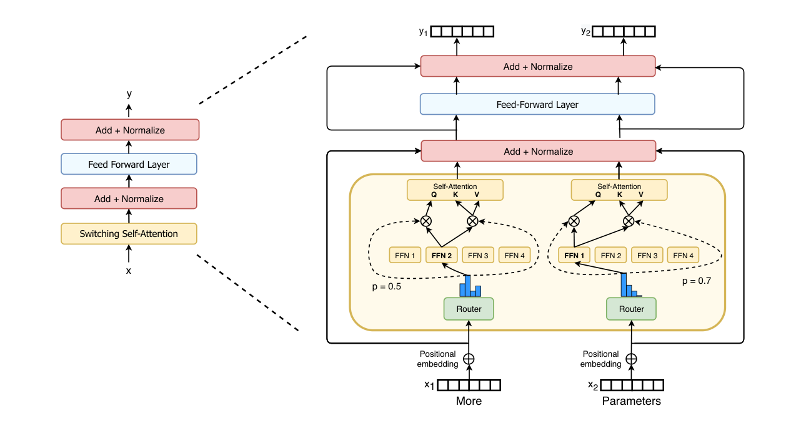

**图 10：** 注意力中的 Switch 层。图中展示如何把 Switch 层纳入 Transformer 自注意力块。对于每个词元，图中给出 $x_1=$“更多”和 $x_2=$“参数”两个词元，一组权重生成查询，另一组独立权重生成共享的键和值。我们既尝试让每个专家执行线性操作，也尝试让其作为全文所用的 FFN。虽然这种方法提高了质量，但在低精度数值格式下更不稳定，因此留作未来工作。

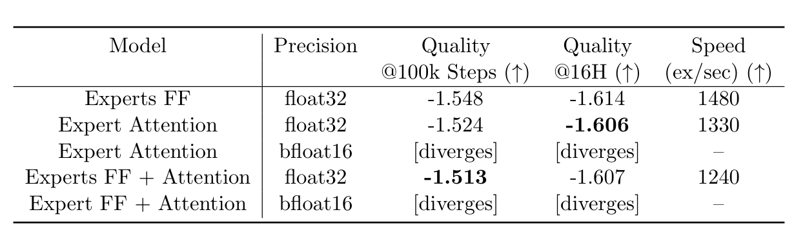

**表 10：** Switch 注意力层结果。所有模型都拥有 32 个专家，每批训练 524k 个词元。“专家 FF”表示由专家替换 Transformer 中的 FFN，这是全文的标准设置；“专家 FF + 注意力”表示同时用专家替换 FFN 和自注意力层。使用 bfloat16 精度训练时，包含专家注意力的模型会发散。

## 附录 B：用“不遗漏任何词元”防止词元丢弃

由于 TPU 加速器上的软件限制，张量形状必须静态确定。因此，每个专家处理词元表示的容量有限且固定。但模型在运行时动态路由词元，这可能导致词元在专家之间分布不均。如果发送给某个专家的词元少于其容量，可以简单地对计算进行填充；这会低效使用硬件，但在数学上仍然正确。然而，当发送给某个专家的词元超过其容量，即发生专家溢出时，就需要相应的处理规则。Lepikhin 等（2020）调整混合专家模型，通过残差连接把溢出词元的表示直接传给下一层而不做专家处理；我们也遵循这一做法。

我们怀疑，不对词元执行任何计算可能非常浪费，尤其是当一个专家发生溢出时，意味着另一个专家还会有空余容量。基于这一直觉，我们提出“不遗漏任何词元”路由，反复重新路由那些最初被分到已溢出专家的词元。图 11 以图形方式说明该方法；它能够保证训练和推理期间几乎没有词元被丢弃。我们曾假设这可以提高性能并进一步稳定训练，但没有观察到实验收益。我们猜测，一旦网络学会不同词元与专家之间的关联，改变这种关联，例如把一个词元发送给其概率第二高的专家，反而可能降低性能。

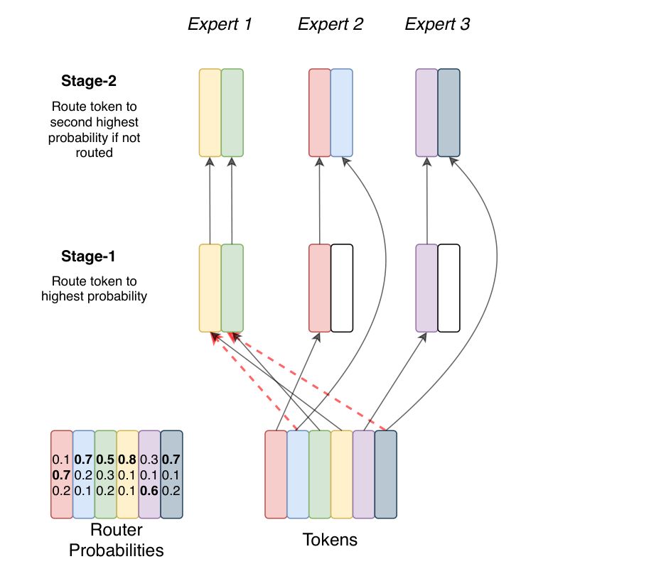

**图 11：** “不遗漏任何词元”路由示意图。阶段 1 等同于 Switch 路由，词元会被发送给路由器给出最高概率的专家。阶段 2 检查所有溢出词元，并把它们发送给概率第二高的专家。如果第二选择专家也接收了过多词元，词元仍可能溢出；但这种方法可以使大多数词元得到路由。反复执行这一过程，能够保证几乎不丢弃任何词元。

## 附录 C：鼓励在专家间探索

在每个专家层，路由器决定把词元发送给哪个专家。这是在可用专家之间做出的离散决策，以词元表示的信息为条件。路由器根据输入的词元表示判断最佳专家，但无法获得反事实信息，不知道选择另一个专家会表现得怎样。与强化学习一样，这里出现了经典的探索与利用困境（Sutton 和 Barto，2018）。Rosenbaum 等（2017）也注意到类似问题，并采用不同方法加以处理，在多任务学习上取得成功。这里的具体设置最接近上下文老虎机（Robbins，1952）。总是以确定性方式选择概率最高的专家，等同于纯利用策略；我们考虑加入探索，以寻找更好的专家分配。

为了引入探索，我们考虑四种方法：（1）确定性选择或 argmax；（2）从 softmax 分布中采样；（3）对输入表示应用 dropout；（4）对输入表示加入乘性抖动噪声。它们对模型质量的影响见表 11。本文始终使用输入抖动注入噪声，因为实验表明它的表现最好。

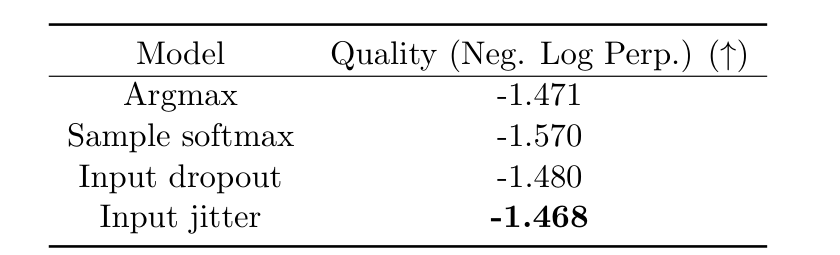

**表 11：** 路由器探索策略。使用不同随机策略选择专家时，Switch Transformer 以负对数困惑度衡量的质量；原表箭头与文字说明存在方向不一致，这里保留原始数值。各变体之间没有实质性的速度差异。

## 附录 D：较低计算量环境中的 Switch Transformer

Switch Transformer 不仅适用于拥有数千核心和万亿参数的环境，在小规模下同样是有效架构。前面的许多实验都使用超过 100 亿参数的模型，但图 12 表明，即使只有两个专家，也能相对于 FLOPs 匹配的对手获得显著收益。即使无法轻易使用超级计算机，训练拥有 2、4 或 8 个专家的 Switch Transformer 仍能可靠地超过 T5 密集基线；我们通常建议每个核心放置一个专家。

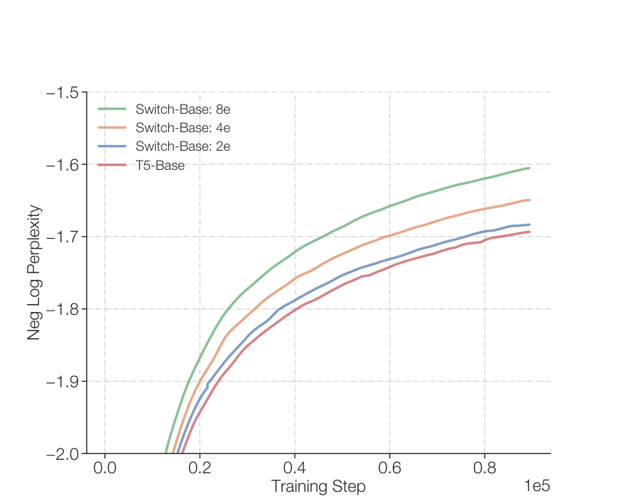

**图 12：** 使用少量专家的 Switch Transformer。即使专家很少，Switch Transformer 也能超过基线。图中展示极小规模下的扩展性质：使用 2、4 和 8 个专家都优于 T5-Base。

## 附录 E：上游与下游模型性能的关系

模型在预训练目标上的质量并不保证能转化为下游任务结果。图 13 展示密集模型和 Switch 模型在 C4 预训练任务上的上游质量，与两个下游指标之间的相关性：SuperGLUE 平均性能和 TriviaQA 分数。选择这两个任务，是因为前者考察模型的推理能力，后者考察事实知识。

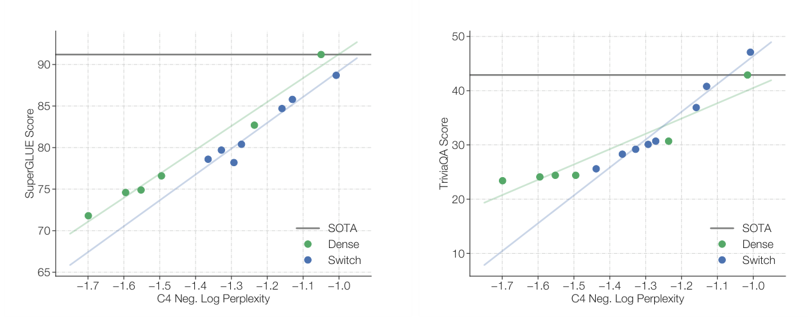

**图 13：** 上游预训练质量与下游模型质量。我们把上游性能与 SuperGLUE 和 TriviaQA 的下游质量相关联；二者分别是推理基准和知识密集型基准，使用验证集，最先进结果不使用 SSM。我们发现，与基线相同，Switch 模型的下游表现会随上游预训练任务的改进而扩展。在 SuperGLUE 上，负对数困惑度与 SuperGLUE 平均分之间呈现较宽松的线性关系；但在固定困惑度下，密集模型往往表现更好，特别是在大规模区间。相反，在知识密集型任务 TriviaQA 上，Switch Transformer 可能遵循更优的扩展关系：给定相同上游困惑度，它比密集对手表现更好。要确认这些观察，还需要更多统计数据；收集它们的成本很高，因此留作未来工作。

我们观察到稳定的相关性，说明无论基线模型还是 Switch 模型，预训练改进都会带来更好的下游结果。此外，在固定上游困惑度下，小到中等模型规模区间的 Switch 模型与密集模型表现相近。不过，在最大模型区间，即 T5-11B/T5-XXL 附近，正如第 5.6 节所述，最大的 Switch 模型不一定能把上游困惑度优势很好地转化为 SuperGLUE 微调表现。要充分发挥稀疏模型潜力，这一点值得继续研究。专家模型的微调动态非常复杂，并依赖正则化、负载均衡和微调超参数。

## 附录 F：Switch Transformer 伪代码

下面给出 Switch Transformer 在 Mesh TensorFlow（Shazeer 等，2018）中的伪代码。以下代码不使用模型并行，更多细节见第 5.4 节。为保持与论文实现逐项对应，代码主体直接以原论文截图呈现；函数说明和行内注释均包含在截图中。

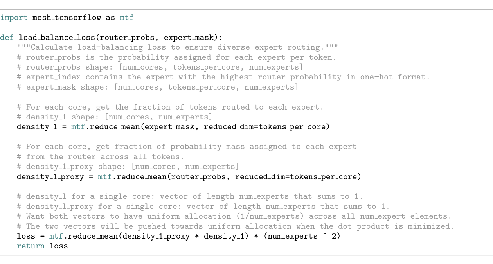

**图 14：** Switch Transformer 在 Mesh TensorFlow 中的负载均衡损失伪代码。

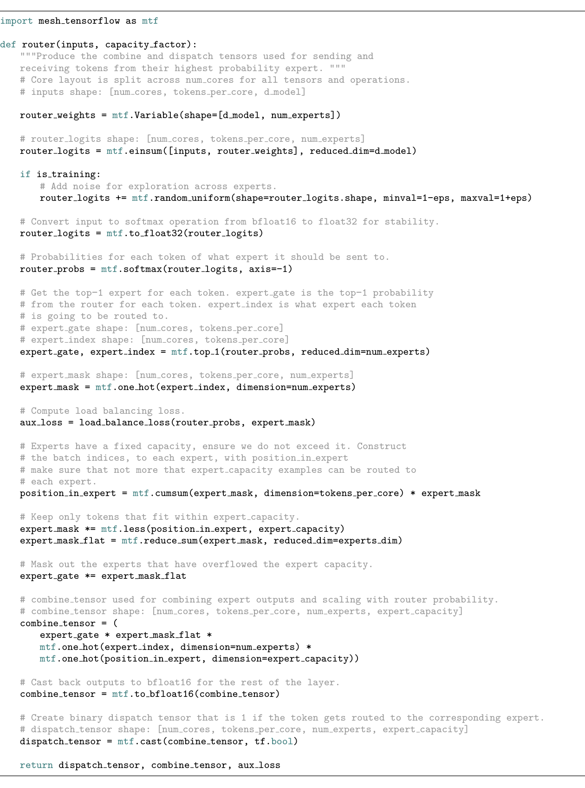

**图 15：** Switch Transformer 在 Mesh TensorFlow 中的路由器伪代码。路由器生成 dispatch 和 combine 张量，用于把词元发送给路由概率最高的专家并接收计算结果；其中包括探索噪声、float32 路由、top-1 选择、负载均衡损失、专家容量掩码及 bfloat16 转换。

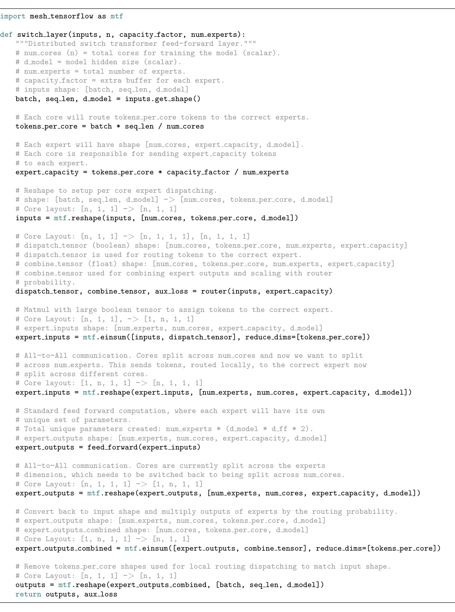

**图 16：** Switch Transformer 在 Mesh TensorFlow 中的层级伪代码。代码展示按核心重塑输入、路由词元、执行两次全互联通信、调用独立专家前馈网络并按路由概率合并输出的完整流程。

## 参考文献

1. Martín Abadi、Paul Barham、Jianmin Chen、Zhifeng Chen、Andy Davis、Jeffrey Dean、Matthieu Devin、Sanjay Ghemawat、Geoffrey Irving、Michael Isard 等。《TensorFlow：面向大规模机器学习的系统》。第 12 届 USENIX 操作系统设计与实现研讨会（OSDI 16），第 265-283 页，2016。
2. Iz Beltagy、Matthew E. Peters、Arman Cohan。《Longformer：长文档 Transformer》。arXiv:2004.05150，2020。
3. Jonathan Berant、Andrew Chou、Roy Frostig、Percy Liang。《从问答对进行 Freebase 语义解析》。2013 年自然语言处理经验方法会议论文集，第 1533-1544 页，2013。
4. Tom B. Brown、Benjamin Mann、Nick Ryder、Melanie Subbiah、Jared Kaplan、Prafulla Dhariwal、Arvind Neelakantan、Pranav Shyam、Girish Sastry、Amanda Askell 等。《语言模型是少样本学习器》。arXiv:2005.14165，2020。
5. Rewon Child、Scott Gray、Alec Radford、Ilya Sutskever。《使用稀疏 Transformer 生成长序列》。arXiv:1904.10509，2019。
6. Kyunghyun Cho、Yoshua Bengio。《在深度学习条件计算中以指数方式提高容量与计算量之比》。arXiv:1406.7362，2014。
7. Peter Clark、Isaac Cowhey、Oren Etzioni、Tushar Khot、Ashish Sabharwal、Carissa Schoenick、Oyvind Tafjord。《你以为问答已经解决了吗？试试 ARC：AI2 推理挑战》。arXiv:1803.05457，2018。
8. Gonçalo M. Correia、Vlad Niculae、André F. T. Martins。《自适应稀疏 Transformer》。arXiv:1909.00015，2019。
9. Jacob Devlin、Ming-Wei Chang、Kenton Lee、Kristina Toutanova。《BERT：面向语言理解的深度双向 Transformer 预训练》。arXiv:1810.04805，2018。
10. David Eigen、Marc'Aurelio Ranzato、Ilya Sutskever。《在深度混合专家模型中学习分解表示》。arXiv:1312.4314，2013。
11. Angela Fan、Shruti Bhosale、Holger Schwenk、Zhiyi Ma、Ahmed El-Kishky、Siddharth Goyal、Mandeep Baines、Onur Celebi、Guillaume Wenzek、Vishrav Chaudhary 等。《超越以英语为中心的多语言机器翻译》。机器学习研究期刊，22(107):1-48，2021。
12. William Fedus、Ian Goodfellow、Andrew M. Dai。《MaskGAN：通过填补空缺实现更好的文本生成》。arXiv:1801.07736，2018。
13. Trevor Gale、Matei Zaharia、Cliff Young、Erich Elsen。《用于深度学习的稀疏 GPU 内核》。arXiv:2006.10901，2020。
14. Scott Gray、Alec Radford、Diederik P. Kingma。《用于块稀疏权重的 GPU 内核》。OpenAI 博客，2017。
15. Kelvin Guu、Kenton Lee、Zora Tung、Panupong Pasupat、Ming-Wei Chang。《REALM：检索增强语言模型预训练》。arXiv:2002.08909，2020。
16. Aaron Harlap、Deepak Narayanan、Amar Phanishayee、Vivek Seshadri、Nikhil Devanur、Greg Ganger、Phil Gibbons。《PipeDream：快速高效的流水线并行深度神经网络训练》。arXiv:1806.03377，2018。
17. Karl Moritz Hermann、Tomas Kocisky、Edward Grefenstette、Lasse Espeholt、Will Kay、Mustafa Suleyman、Phil Blunsom。《教机器阅读与理解》。神经信息处理系统进展，第 28 卷，第 1693-1701 页，2015。
18. Geoffrey Hinton、Oriol Vinyals、Jeff Dean。《蒸馏神经网络中的知识》。arXiv:1503.02531，2015。
19. Sepp Hochreiter、Jürgen Schmidhuber。《长短期记忆》。神经计算，9(8):1735-1780，1997。
20. Sara Hooker。《硬件彩票》。arXiv:2009.06489，2020。
21. Yanping Huang、Youlong Cheng、Ankur Bapna、Orhan Firat、Dehao Chen、Mia Chen、HyoukJoong Lee、Jiquan Ngiam、Quoc V. Le、Yonghui Wu 等。《GPipe：使用流水线并行高效训练巨型神经网络》。神经信息处理系统进展，第 103-112 页，2019。
22. Robert A. Jacobs、Michael I. Jordan、Steven J. Nowlan、Geoffrey E. Hinton。《局部专家的自适应混合》。神经计算，3(1):79-87，1991。
23. Michael I. Jordan、Robert A. Jacobs。《分层混合专家与 EM 算法》。神经计算，6(2):181-214，1994。
24. Mandar Joshi、Eunsol Choi、Daniel S. Weld、Luke Zettlemoyer。《TriviaQA：面向阅读理解的大规模远程监督挑战数据集》。arXiv:1705.03551，2017。
25. Jared Kaplan、Sam McCandlish、Tom Henighan、Tom B. Brown、Benjamin Chess、Rewon Child、Scott Gray、Alec Radford、Jeffrey Wu、Dario Amodei。《神经语言模型的扩展定律》。arXiv:2001.08361，2020。
26. Nikita Kitaev、Lukasz Kaiser、Anselm Levskaya。《Reformer：高效 Transformer》。arXiv:2001.04451，2020。
27. Tom Kwiatkowski、Jennimaria Palomaki、Olivia Redfield、Michael Collins、Ankur Parikh、Chris Alberti、Danielle Epstein、Illia Polosukhin、Jacob Devlin、Kenton Lee 等。《Natural Questions：问答研究基准》。计算语言学协会会刊，7:453-466，2019。
28. Guillaume Lample、Alexandre Sablayrolles、Marc'Aurelio Ranzato、Ludovic Denoyer、Hervé Jégou。《具有乘积键的大型记忆层》。神经信息处理系统进展，第 8548-8559 页，2019。
29. Katherine Lee、Daphne Ippolito、Andrew Nystrom、Chiyuan Zhang、Douglas Eck、Chris Callison-Burch、Nicholas Carlini。《训练数据去重让语言模型更好》。arXiv:2107.06499，2021。
30. Dmitry Lepikhin、HyoukJoong Lee、Yuanzhong Xu、Dehao Chen、Orhan Firat、Yanping Huang、Maxim Krikun、Noam Shazeer、Zhifeng Chen。《GShard：使用条件计算和自动分片扩展巨型模型》。arXiv:2006.16668，2020。
31. Paulius Micikevicius、Sharan Narang、Jonah Alben、Gregory Diamos、Erich Elsen、David Garcia、Boris Ginsburg、Michael Houston、Oleksii Kuchaiev、Ganesh Venkatesh 等。《混合精度训练》。arXiv:1710.03740，2017。
32. Shashi Narayan、Shay B. Cohen、Mirella Lapata。《别告诉我细节，只给我摘要：用于极端摘要的主题感知卷积神经网络》。arXiv:1808.08745，2018。
33. Yixin Nie、Adina Williams、Emily Dinan、Mohit Bansal、Jason Weston、Douwe Kiela。《对抗性自然语言推断：自然语言理解新基准》。arXiv:1910.14599，2019。
34. Joan Puigcerver、Carlos Riquelme、Basil Mustafa、Cedric Renggli、André Susano Pinto、Sylvain Gelly、Daniel Keysers、Neil Houlsby。《使用专家模型实现可扩展迁移学习》。arXiv:2009.13239，2020。
35. Alec Radford、Karthik Narasimhan、Tim Salimans、Ilya Sutskever。《通过生成式预训练改进语言理解》。2018。
36. Colin Raffel、Noam Shazeer、Adam Roberts、Katherine Lee、Sharan Narang、Michael Matena、Yanqi Zhou、Wei Li、Peter J. Liu。《使用统一文本到文本 Transformer 探索迁移学习的极限》。arXiv:1910.10683，2019。
37. Samyam Rajbhandari、Jeff Rasley、Olatunji Ruwase、Yuxiong He。《ZeRO：面向万亿参数模型训练的内存优化》。arXiv:1910.02054，2019。
38. Pranav Rajpurkar、Jian Zhang、Konstantin Lopyrev、Percy Liang。《SQuAD：用于机器文本理解的十万问答数据集》。arXiv:1606.05250，2016。
39. Prajit Ramachandran、Quoc V. Le。《逐样例路由模型中的多样性与深度》。国际学习表征会议，2018。
40. Herbert Robbins。《实验序贯设计的若干方面》。美国数学学会通报，58(5):527-535，1952。
41. Adam Roberts、Colin Raffel、Noam Shazeer。《语言模型参数中能装入多少知识？》arXiv:2002.08910，2020。
42. Clemens Rosenbaum、Tim Klinger、Matthew Riemer。《路由网络：为多任务学习自适应选择非线性函数》。arXiv:1711.01239，2017。
43. Keisuke Sakaguchi、Ronan Le Bras、Chandra Bhagavatula、Yejin Choi。《WinoGrande：大规模对抗性 Winograd 模式挑战》。AAAI 人工智能会议论文集，第 34 卷，第 8732-8740 页，2020。
44. Victor Sanh、Lysandre Debut、Julien Chaumond、Thomas Wolf。《DistilBERT：BERT 的蒸馏版本，更小、更快、更便宜、更轻》。2019。
45. Noam Shazeer。《GLU 变体改进 Transformer》。2020。
46. Noam Shazeer、Azalia Mirhoseini、Krzysztof Maziarz、Andy Davis、Quoc Le、Geoffrey Hinton、Jeff Dean。《大得惊人的神经网络：稀疏门控混合专家层》。arXiv:1701.06538，2017。
47. Noam Shazeer、Youlong Cheng、Niki Parmar、Dustin Tran、Ashish Vaswani、Penporn Koanantakool、Peter Hawkins、HyoukJoong Lee、Mingsheng Hong、Cliff Young 等。《Mesh-TensorFlow：面向超级计算机的深度学习》。神经信息处理系统进展，第 10414-10423 页，2018。
48. Mohammad Shoeybi、Mostofa Patwary、Raul Puri、Patrick LeGresley、Jared Casper、Bryan Catanzaro。《Megatron-LM：使用 GPU 模型并行训练数十亿参数语言模型》。arXiv:1909.08053，2019。
49. Nitish Srivastava、Geoffrey E. Hinton、Alex Krizhevsky、Ilya Sutskever、Ruslan Salakhutdinov。《Dropout：防止神经网络过拟合的一种简单方法》。机器学习研究期刊，15(1):1929-1958，2014。
50. Emma Strubell、Ananya Ganesh、Andrew McCallum。《自然语言处理深度学习的能源与政策考量》。arXiv:1906.02243，2019。
51. Sainbayar Sukhbaatar、Edouard Grave、Piotr Bojanowski、Armand Joulin。《Transformer 中的自适应注意力跨度》。arXiv:1905.07799，2019。
52. Rich Sutton。《苦涩的教训》。2019。
53. Richard S. Sutton、Andrew G. Barto。《强化学习：导论》。斯坦福大学，2018。
54. Wilson L. Taylor。《完形填空程序：测量可读性的新工具》。新闻学季刊，30(4):415-433，1953。
55. Ashish Vaswani、Noam Shazeer、Niki Parmar、Jakob Uszkoreit、Llion Jones、Aidan N. Gomez、Lukasz Kaiser、Illia Polosukhin。《注意力机制就是一切》。神经信息处理系统进展，第 5998-6008 页，2017。
56. Alex Wang、Amanpreet Singh、Julian Michael、Felix Hill、Omer Levy、Samuel R. Bowman。《GLUE：自然语言理解的多任务基准与分析平台》。arXiv:1804.07461，2018。
57. Alex Wang、Yada Pruksachatkun、Nikita Nangia、Amanpreet Singh、Julian Michael、Felix Hill、Omer Levy、Samuel Bowman。《SuperGLUE：面向通用语言理解系统的更难基准》。神经信息处理系统进展，第 3266-3280 页，2019。
58. Shibo Wang、Pankaj Kanwar。《bfloat16：云端 TPU 高性能的秘密》。Google Cloud 博客，2019。
59. Linting Xue、Noah Constant、Adam Roberts、Mihir Kale、Rami Al-Rfou、Aditya Siddhant、Aditya Barua、Colin Raffel。《mT5：大规模多语言预训练文本到文本 Transformer》。arXiv:2010.11934，2020。
60. Zhilin Yang、Zihang Dai、Yiming Yang、Jaime Carbonell、Ruslan Salakhutdinov、Quoc V. Le。《XLNet：面向语言理解的广义自回归预训练》。2020。
61. Manzil Zaheer、Guru Guruganesh、Avinava Dubey、Joshua Ainslie、Chris Alberti、Santiago Ontanon、Philip Pham、Anirudh Ravula、Qifan Wang、Li Yang 等。《BigBird：面向更长序列的 Transformer》。arXiv:2007.14062，2020。

---

1. 见第 2.2 节的技术描述。 [↩](#fnref:3)
2. 该指标使用自然对数，因此单位是 nat。 [↩](#fnref:4)
3. 速度同时取决于算法和实现细节。Switch Transformer（算法层面）减少了相对于 MoE 的必要计算，但最终速度差异还会受到低层优化（实现层面）的影响。 [↩](#fnref:5)
4. 我们会重新采样距离均值超过两个标准差的值。 [↩](#fnref:6)
5. FLOPs 按照 Kaplan 等（2020）对前向传播的计算方式得到。 [↩](#fnref:7)
6. 为公平比较，T5 和 Switch 模型都在修订后的 C4 数据集上，以每批 $2^{20}$ 个词元训练 550k 步完成预训练。 [↩](#fnref:8)
7. 按步数计算的加速比，是基线达到某一质量所需步数除以我们的模型达到相同质量所需步数。 [↩](#fnref:9)
8. 这里报告的质量差异只是下界，实际差距可能更大。T5-XXL 预训练使用的 C4 数据集更容易，其中包含样例内部重复、因而很容易复制的文本片段。 [↩](#fnref:10)
