# 迈向大型语言模型推理：一篇综述

**作者：** Jie Huang、Kevin Chen-Chuan Chang  
**机构：** 伊利诺伊大学厄巴纳—香槟分校计算机科学系  
**论文版本：** arXiv:2212.10403v2，2023 年 5 月 26 日；初版发表于 2022 年 12 月 20 日

## 摘要

推理是人类智能的基本组成部分，在问题求解、决策和批判性思维中发挥核心作用。近年来，大型语言模型在自然语言处理领域取得显著进展，并且有研究观察到：当模型足够大时，它们可能表现出某些推理能力。然而，语言模型究竟能在多大程度上推理，仍然没有明确答案。本文全面综述大型语言模型推理的研究现状，包括改进和诱发推理的技术、评估推理能力的方法与基准、已有研究的发现和影响，以及未来方向。作者先澄清“推理”的概念，再讨论监督微调、提示与上下文学习、思维链、理由工程、问题分解、混合训练、自举和自我改进；随后总结终端任务指标与直接分析推理过程的方法。本文希望为快速发展的领域提供及时、细致的参考，并推动对语言模型是否真正推理的进一步讨论。

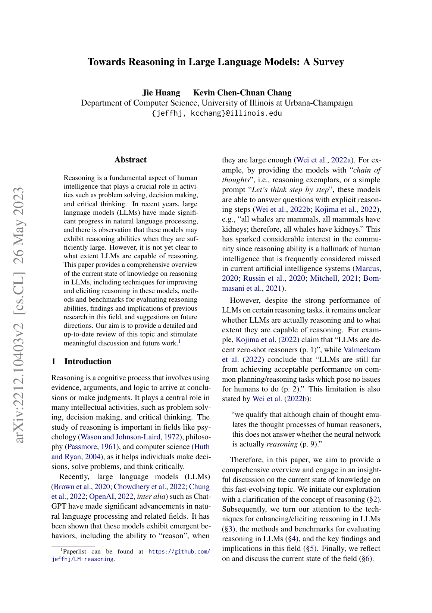

## 1 引言

推理是使用证据、论点和逻辑得出结论或做出判断的认知过程，在问题求解、决策和批判性思维等智力活动中占据中心位置。心理学、哲学和计算机科学长期研究推理，因为人们需要依靠推理做决定、解决问题和进行批判性思考。

近年来，ChatGPT 等大型语言模型在自然语言处理及相关领域取得了巨大进步。有研究发现，当模型足够大时，它们会表现出被称为“推理”的涌现行为。例如，在提示中提供“思维链”示例，或者简单加入“让我们一步一步地思考”，模型就能生成显式推理步骤，例如：“所有鲸鱼都是哺乳动物，所有哺乳动物都有肾脏，因此所有鲸鱼都有肾脏。”推理被认为是人类智能的重要标志，因此这些结果引起了广泛兴趣。

但模型在部分任务上的高分并不能证明它真的在推理。有人认为大型语言模型已经是不错的零样本推理器，也有人发现它们在普通人轻易完成的规划和推理任务上仍远未达到可接受水平。思维链能模拟人类推理过程，却不能回答神经网络是否真的在推理。本文因此从概念、技术、评测、发现和未来方向几个方面梳理现有证据。

## 2 什么是推理？

推理是以逻辑、系统的方式思考某件事，利用证据和过往经验得出结论或做出决定。它包含作出推断、评估论点，以及根据现有信息得到逻辑结论。由于“推理”是一个抽象且涵盖范围很广的词，本文总结几种常见形式。

### 演绎推理

演绎推理根据前提的真实性得出结论。结论必须从前提中必然推出：如果前提为真，结论也必须为真。例如：

- 前提：所有哺乳动物都有肾脏。
- 前提：所有鲸鱼都是哺乳动物。
- 结论：所有鲸鱼都有肾脏。

### 归纳推理

归纳推理根据观察或证据形成结论。结论依据现有证据很可能为真，但不是必然为真。例如，多次观察到有翅膀的生物都是鸟，又观察到某个生物有翅膀，于是推断它很可能是鸟。

### 溯因推理

溯因推理根据一组观察寻找最佳解释。结论是现有证据下最可能的解释，但不一定确定。例如，汽车无法启动且发动机下方有液体，最可能的解释是散热器漏液。其他形式还包括类比推理、因果推理和概率推理。

### 形式推理与非形式推理

形式推理遵循一组明确规则和原则，常见于数学和逻辑；非形式推理结构较弱，依靠直觉、经验和常识解决日常问题。形式推理更结构化、可靠，非形式推理更灵活、开放，但也可能不够可靠。本文特别关注大型语言模型中的非形式演绎推理，因为它是现有文献最常使用的形式。

### 语言模型中的推理

语言模型研究中长期使用“推理”一词，但很少给出清晰定义。不同任务、基准和方法可能使用演绎、归纳或溯因推理。本文把多种形式都纳入范围，同时重点讨论“非形式演绎推理”：只要前提为真，结论就应当为真。这里使用“推理”并不意味着语言模型真的以人类方式推理，后文会专门讨论这一点。

## 3 迈向大型语言模型推理

多步推理通常被视为语言模型和 NLP 模型的弱点。近期研究提出，当模型达到一定规模，尤其是超过千亿参数时，推理能力可能涌现。本文沿用相关工作，把 GPT-2、BERT 等小模型中很少出现的能力称为“推理”，并重点关注 GPT-3、PaLM 等大模型上的改进和诱发方法。

### 3.1 完全监督微调

在讨论大模型之前，已有工作通过特定数据集上的完全监督微调改善小模型推理。例如，利用包含解释理由的 CoS-E 数据集微调 GPT，可以提升常识问答；RoBERTa 可以结合预训练知识和显式自由文本状态进行推断；在数学竞赛题上训练模型生成完整逐步解答，也能取得一定准确率；Scratchpad 方法让模型先生成程序的中间计算，再执行或输出最终答案。

完全监督微调有两个主要限制。第一，需要包含显式推理过程的数据集，而这类数据往往难以创建且成本高。第二，模型只在特定数据集上训练，应用范围受限，还可能依赖训练数据中的表面模式而不是真正推理。

### 3.2 提示与上下文学习

GPT-3 等大模型展示了通过上下文学习获得少样本性能的能力。给定问题和若干“输入—输出”示例，模型可能隐式或显式地完成推理。然而，多步推理任务仍然困难，这可能是因为过去的研究没有充分探索模型的能力。

#### 3.2.1 思维链及其变体

思维链提示用显式中间步骤引导模型推理。它把普通的“输入—输出”示例改成“输入—思维链—输出”三元组。例如，题目是 Roger 有 5 个网球，又买了 2 罐、每罐 3 个，思维链会先计算 2×3=6，再计算 5+6=11，最后输出 11。实验显示，这个简单做法有时能显著提升算术、符号和常识推理的少样本性能。

**不同形式。** Zero-shot-CoT 在问题后加入“让我们一步一步地思考”，无需少样本示例即可诱发推理。针对代码模型的程序辅助提示把推理表述为代码生成；迭代思维链会反复提示模型；检索增强思维链在推理过程中引入外部知识，以提高事实性。

**特定任务和设置。** Scratchpad 使用中间计算改善程序合成和执行；多语言思维链可以在题目语言、本语言或英语中生成推理；表格推理有时只需一个示例；思维链还被用于多模态科学问题、隐喻释义选择和其他组合任务。

#### 3.2.2 理由工程

原始思维链依赖人工构造的中间步骤示例，并采用贪心解码。理由工程关注如何更有效地诱发和利用这些理由，包括理由改进、理由探索和理由验证。

**理由改进。** 示例选择会显著影响少样本性能。复杂度提示通过构造包含更多步骤的理由改善表现；算法式提示提供更完整的解法；Auto-CoT 把数据集问题聚类，再用 Zero-shot-CoT 为每个代表性问题生成理由。研究显示，示例多样性对生成更好的理由十分重要。

**理由探索。** 复杂问题可能有多种推理路径。自洽性解码不再只取贪心理由，而是采样多条不同理由，按最终答案的一致性进行边缘化或投票。为增加多样性，还可以为不同问题随机采样不同示例。

**理由验证。** 错误理由会导致错误答案，因此需要检查理由和解答。可以训练外部验证器给每条理由和答案打分，选择分数最高的解法；也可以让语言模型自身担任验证器。现有研究表明，理由必须与问题相关，步骤顺序也必须正确。

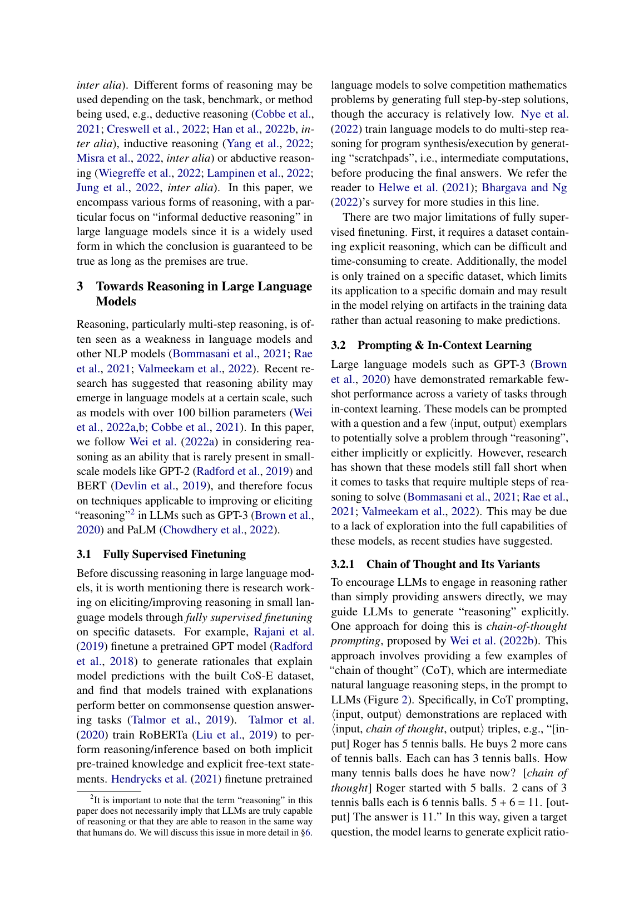

#### 3.2.3 问题分解

思维链对复杂任务和组合泛化仍可能失败。把复杂问题拆成更小、更易处理的子问题，再依次解决，是提高成功率的自然方法。

Least-to-Most Prompting 先分解复杂问题，再按特定顺序解决子问题，后一个子问题可以使用此前子问题的答案。动态 Least-to-Most 针对更真实的语义解析任务，利用提示式句法解析动态选择示例。Decomposed Prompting 把复杂问题拆成由共享提示库处理的子问题，每个模块专门处理一种能力。Successive Prompting 迭代地把复杂问题分解为简单问题，后一项预测能访问前面子问题的答案。也有工作尝试在一次前向传播中结合思维链完成分解。总体而言，问题分解有助于把复杂任务变成可管理的组合步骤。

#### 3.2.4 其他方法

Selection-Inference 把语言模型作为选择和推理模块，从事实集合中挑选相关信息并逐步得到答案；反向链式推理从目标出发寻找支持事实，而不是从事实向前推导；递归溯因方法让模型分别解释二元问题的每个选项；复数计算方法先用简单数字替代复数，生成简化表达式后再完成计算。另有研究把大模型的推理知识蒸馏到小模型，并提出统一理解思维链研究的语言模型级联框架。

### 3.3 混合方法

提示技术能够诱发或更好地利用推理，却不会改变模型参数。混合方法同时增强模型的推理能力，并通过提示有效利用这些能力解决复杂问题。

#### 3.3.1 推理增强训练与提示

在包含科学和数学数据的语料上预训练或继续预训练，能改善定量推理；加入 SQL 数据可以提升数值和逻辑推理。Flan 通过对 PaLM 和 T5 进行 1800 个任务的指令微调，发现 CoT 数据对于保持推理能力很关键。把 OPT 在 10 个推理数据集上微调也能改善部分能力。

长度泛化研究考察模型能否从短问题推广到长问题，发现少样本 Scratchpad 或思维链微调的组合能显著改善长问题泛化，而标准监督微调没有同样效果。代码训练也可能带来类似收益。

#### 3.3.2 自举与自我改进

Self-Taught Reasoner（STaR）让模型先用思维链生成初始理由，只保留能得到正确答案的理由进行微调，再重复这一过程。每次迭代都会让模型生成更好的训练数据，进而改善下一轮模型。后续研究表明，即使没有监督数据，模型也可以利用推理自洽性自我提升。

## 4 衡量大型语言模型的推理

本节总结评估大模型推理能力的方法和基准。

### 4.1 终端任务表现

一种直接方法是报告需要推理的终端任务准确率。

**算术推理。** 指理解并应用数学概念和运算规则解决问题，代表性基准包括 GSM8K、MATH、MathQA、SVAMP、ASDiv、AQuA 和 MAWPS。

**常识推理。** 指利用日常知识和理解对新情境做判断，包括 CSQA、StrategyQA 和 ARC。

**符号推理。** 指按照形式规则操作抽象符号，代表任务包括 Last Letter Concatenation 和 Coin Flip。

**其他任务。** BIG-bench 覆盖日期理解、词语排序和因果判断等数百项能力；SCAN 和相关数据集评估组合泛化；WikiTableQA、FetaQA 可测试表格推理；CommonGen 和 Open Relation Modeling 评估生成式关系推理。

终端任务分数便于比较模型，但不能说明模型是否真正执行了推理，因为模型可能依靠记忆或启发式规则取得高分。

### 4.2 对推理过程的分析

现有评测大多关注最终答案，而不是逐步理由。ROSCOE 提供语义对齐、逻辑推断、语义相似度和语言连贯性等可解释的逐步指标。PrOntoQA 由真实或虚构本体生成，每个例子都有唯一证明，便于形式化分析每一步。FOLIO 测试一阶逻辑推理，要求模型根据前提判断结论是否正确。

消融研究发现，即使理由无效，思维链也可能提升答案；因此“生成了理由”不等于“理由正确”。理由的相关性、步骤顺序、最终答案和中间结论都需要单独评估。

## 5 发现与影响

### 推理似乎是大型模型的涌现能力

研究显示，GPT-3 175B 等大模型在约千亿参数规模附近出现显著推理性能提升，而小模型通常没有这一能力。这提示在一般推理问题上，使用大模型可能比为小模型训练大量特定任务数据更有效。但涌现原因尚未被充分理解。

### 思维链能诱发模型的“推理”

思维链提示在算术、符号和常识任务上显著提升表现。在虚构或反事实本体中，模型也能生成有效的单步证明；但当存在多个候选步骤时，模型可能选择错误步骤，产生不完整或错误证明。

### 现有模型仍然难以处理复杂推理

即便使用本文讨论的技术，大模型仍会在复杂任务、组合泛化、蕴含关系和规划问题上失败。某些对人类非常简单的常识规划任务，GPT-3 和 BLOOM 也难以可靠完成。这说明现有基准可能过于简单，不能充分测量真实推理能力，需要更有挑战性的评测。

## 6 反思、讨论与未来方向

### 为什么需要推理？

推理是人类智能的关键方面。把推理能力加入语言模型，可以让它们执行复杂问题求解、规划、决策和科学发现，并提升解释性和可控性。另一方面，推理能力也可能被用于生成更有说服力的错误信息或自动化有害计划，因此需要同时研究安全和可靠性。

### 语言模型真的能推理吗？

支持“能推理”的证据包括：在许多推理任务上取得高分；使用思维链逐步生成理由；表现出类似人类的内容效应。但这些证据还不充分。高分可能来自启发式规则或记忆，而不是推理；理由可能错误、前后不一致，模型可能只是在生成“像推理的回答”；人类式模式也不意味着模型以人类方式工作。

反对证据包括：模型在复杂推理上仍失败；理由中经常出现错误；性能对训练数据中数字等词的出现频率敏感；模型难以把已经记住的相关信息正确关联起来。如果模型真正通过数学推理解决问题，这些现象就不应如此明显。

目前还不能给出最终结论。语言模型是否理解语言本身仍存在争论，必须继续研究训练数据、架构、优化目标和更强的推理基准。可以确定的是，当前模型还没有可靠、稳健的通用推理能力。

### 如何改进推理能力？

思维链可以诱发已有能力，但不能让模型解决超出能力边界的问题。真正增强推理需要共同设计训练数据、模型架构和优化目标。包含 CoT 数据的微调已被证明有效；自举过程也能让模型自我改进。未来需要研究如何生成高质量理由、验证理由、处理长程依赖，并让模型在真实任务中保持可靠性。

## 7 结论

本文综述了大型语言模型推理的研究现状，讨论了改进和诱发推理的技术、评估方法与基准，以及已有研究的发现和影响。大模型已经在自然语言处理和多类推理任务上取得进步，但仍不清楚它们在多大程度上具备真正推理能力，还是依靠记忆模式和启发式方法解决问题。仍需更深入地理解推理、改进模型能力、设计更严格的评测，并判断其在不同应用中的潜力。作者希望本综述能帮助读者了解领域现状并推动进一步研究。

## 局限

推理是涵盖多种形式的宽泛概念，不可能在一篇文章中总结全部相关工作，因此本文重点讨论文献中最常见的演绎推理，未深入展开归纳和溯因推理。大语言模型推理发展迅速，本文写作期间和之后可能出现新的成果，尤其是 ChatGPT 等模型的评测。作者建议读者结合引用本文的后续工作获得更完整、更新的认识。

## 致谢

作者感谢 Jason Wei 和 Denny Zhou 的建议与反馈，并感谢国家科学基金会、浙江大学、IBM、eBay、Microsoft Azure、UIUC 等机构的支持。文中观点仅代表作者，不一定反映资助机构立场。

## 参考文献

参考文献涉及算术推理、常识推理、思维链、提示、理由验证、模型自我改进、语言模型评估和推理理论。为保留作者、年份、标题、出版信息和链接，参考文献按原论文页面截图归档。

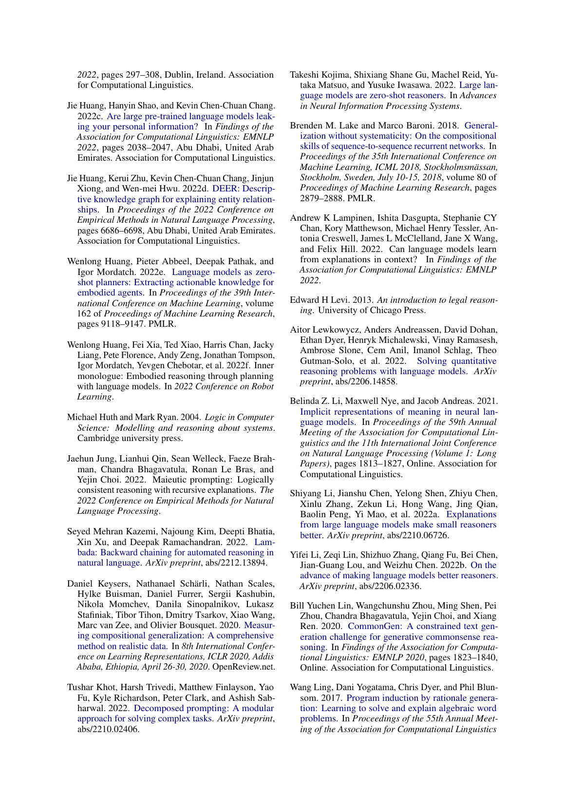
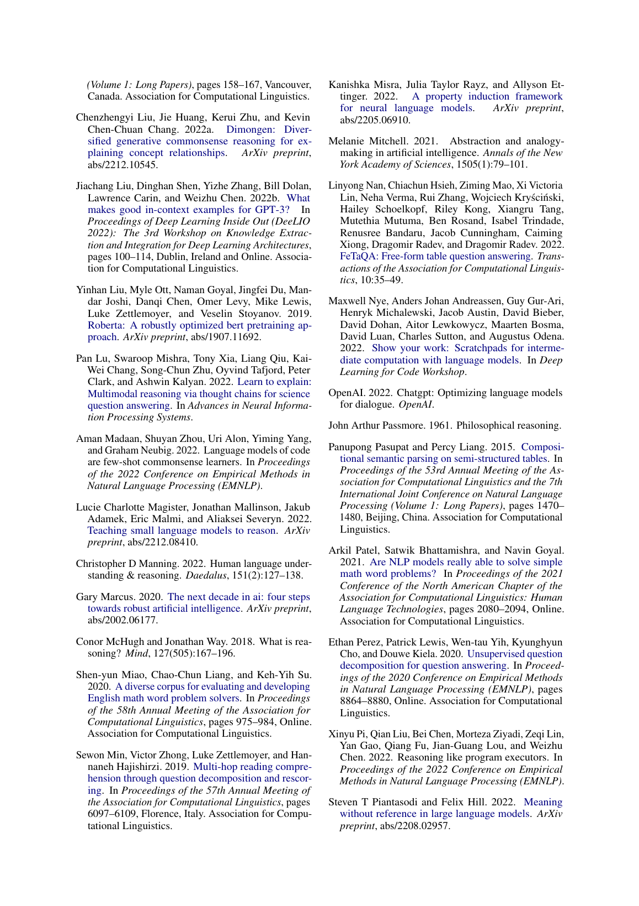

## 原论文页面归档

以下截图按 PDF 顺序完整保留 15 页，用于核对综述结构图、示例、方法分类、评测基准、讨论和参考文献。

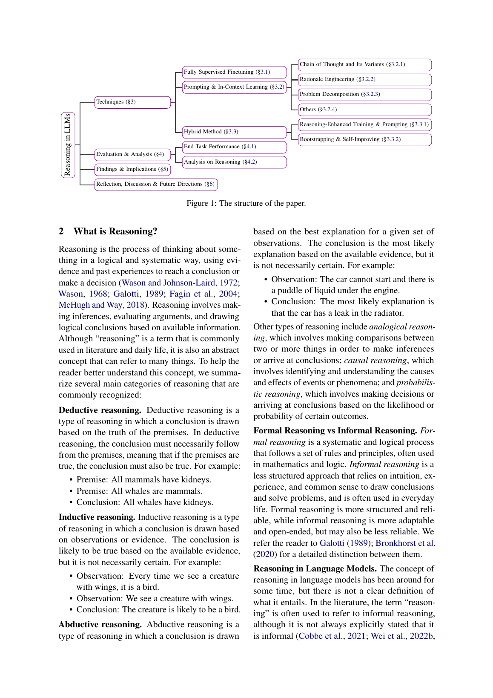

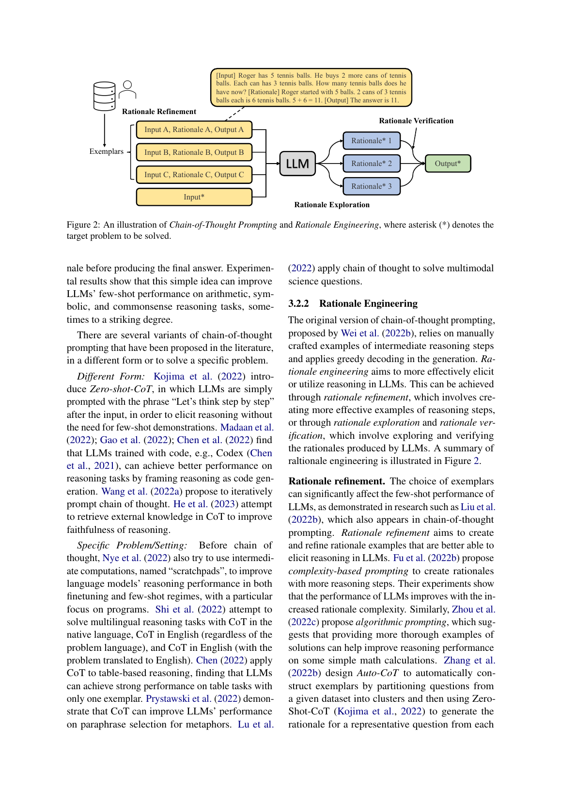
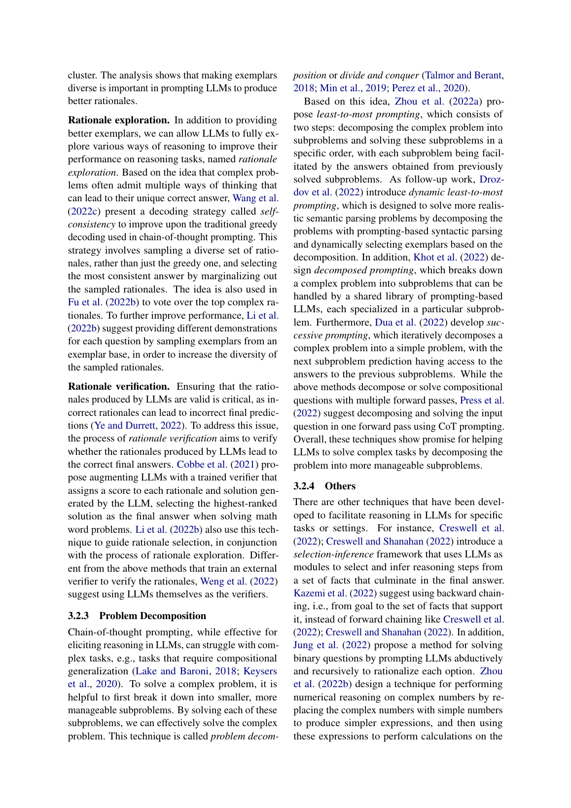
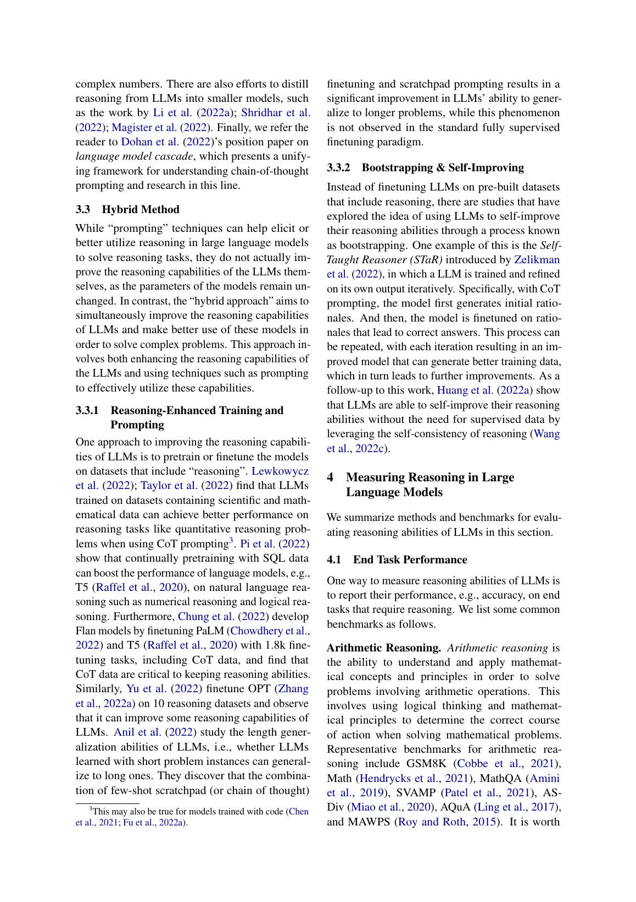
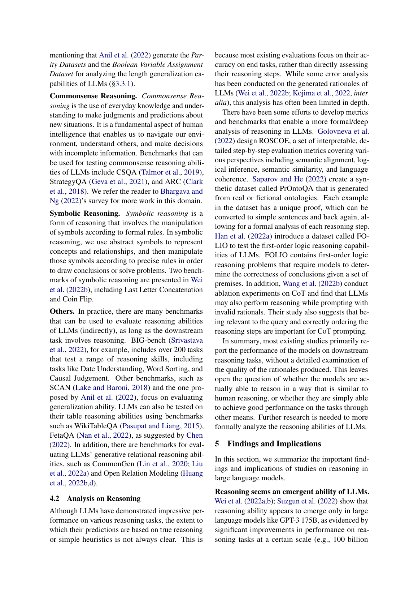
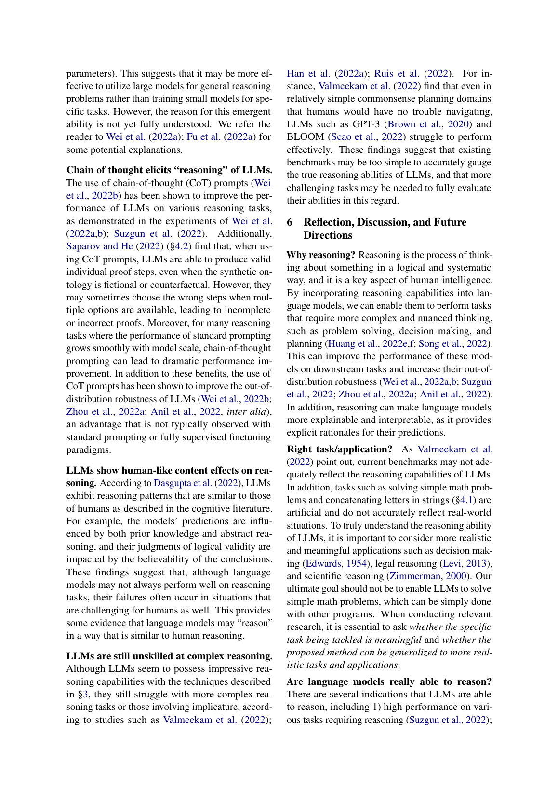
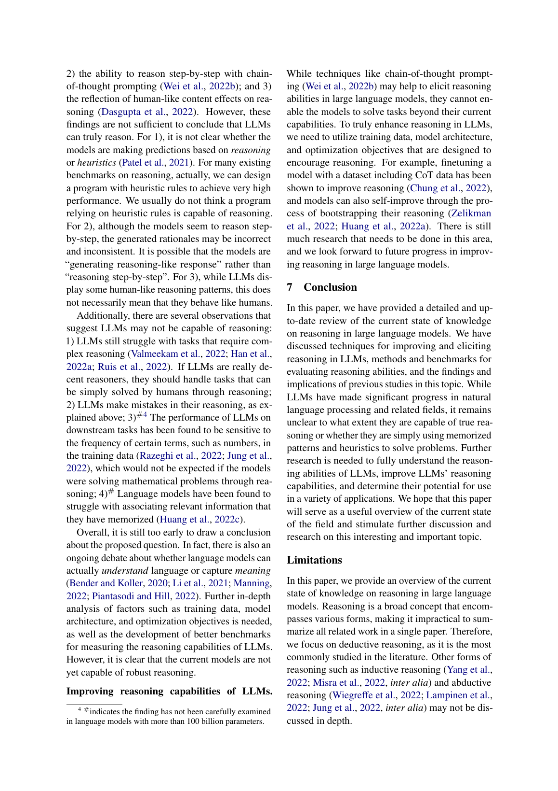
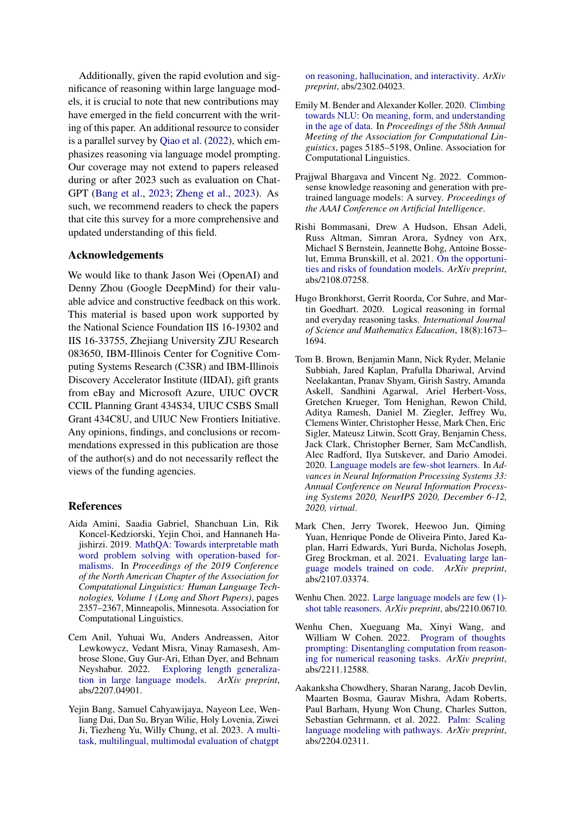
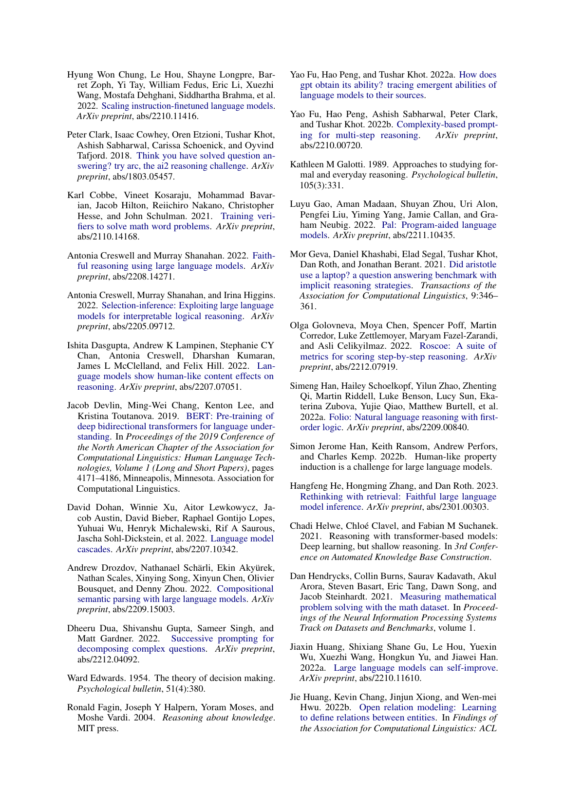

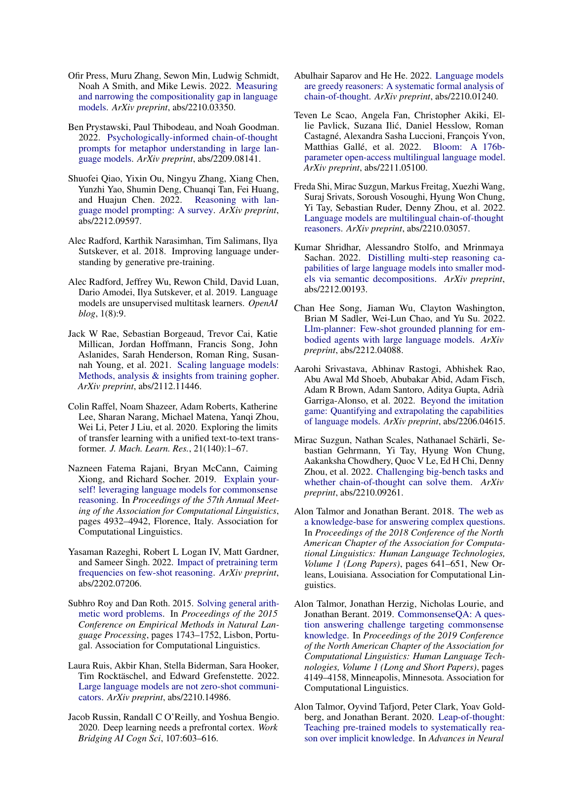
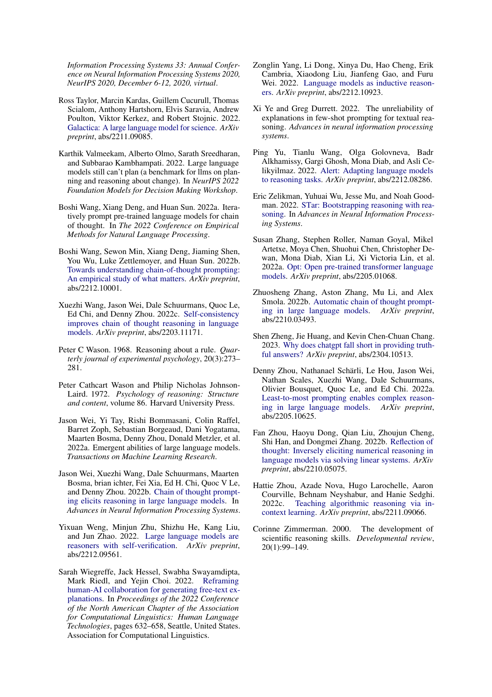
