# Gemini：高能力多模态模型家族

**作者：** Google Gemini 团队  
**机构：** Google  
**论文版本：** arXiv:2312.11805v5，2025 年 5 月 9 日  
**首次公开：** 2023 年 12 月 19 日  
**译文说明：** 本译文按原论文内容顺序逐段编排，标题、正文和图表说明均译为中文；模型名、数据集名、技术缩写与公式符号保留通行写法。原论文的图、表、案例、代码、参考文献与贡献者名单以对应原页截图保留，每张截图均放在其原有内容位置。

## 摘要

本报告介绍一个新的多模态模型家族 Gemini。该系列在图像、音频、视频和文本理解方面展现出卓越能力。Gemini 家族包括 Ultra、Pro 和 Nano 三种规模，适用于从复杂推理到内存受限的端侧应用等不同场景。对大量基准的评测表明，能力最强的 Gemini Ultra 在 32 项基准中的 30 项刷新了当时最佳结果；尤其值得注意的是，它成为首个在广泛研究的 MMLU 考试基准上达到人类专家水平的模型，并在本文考察的全部 20 项多模态基准上推进了最佳水平。

我们相信，Gemini 家族在跨模态推理与语言理解方面的新能力将催生广泛用途。本文还讨论了后训练方法，以及如何通过 Gemini、Gemini Advanced、Google AI Studio 和 Cloud Vertex AI 等服务，以负责任的方式把 Gemini 模型部署给用户。

## 1 引言

本文介绍 Gemini：由 Google 开发的一族高能力多模态模型。我们在图像、音频、视频和文本数据上联合训练 Gemini，目标是让同一个模型既具备跨模态的强大通用能力，也在各个模态上拥有前沿的理解与推理表现。

首个版本 Gemini 1.0 包含三种规模：Ultra 面向高度复杂的任务；Pro 在性能与大规模部署能力之间取得平衡；Nano 面向端侧应用。每种规模都针对不同的计算约束和应用需求进行了专门设计。

大规模预训练完成后，我们对模型进行后训练，以提升整体质量、强化目标能力，并确保模型满足对齐与安全标准。由于下游应用需求不一，我们制作了两类后训练版本。面向聊天的版本称为 Gemini Apps 模型，针对 Gemini 与 Gemini Advanced 进行了优化；这项对话式 AI 服务此前名为 Bard。面向开发者的版本称为 Gemini API 模型，针对一系列产品进行了优化，可通过 Google AI Studio 与 Cloud Vertex AI 使用。

我们使用一套全面的内部与外部基准，对预训练及后训练后的 Gemini 模型进行评测。这些基准覆盖语言、编程、推理和多模态等广泛任务。

Gemini 家族推进了大规模语言建模（Anil et al., 2023；Brown et al., 2020；Chowdhery et al., 2023；Hoffmann et al., 2022；OpenAI, 2023a；Radford et al., 2019；Rae et al., 2021）、图像理解（Alayrac et al., 2022；Chen et al., 2022；Dosovitskiy et al., 2020；OpenAI, 2023b；Reed et al., 2022；Yu et al., 2022a）、音频处理（Radford et al., 2023；Zhang et al., 2023）和视频理解（Alayrac et al., 2022；Chen et al., 2023）的最佳水平。它也建立在序列模型、以神经网络为基础的深度学习长期研究，以及支持大规模训练的机器学习分布式系统工作之上。

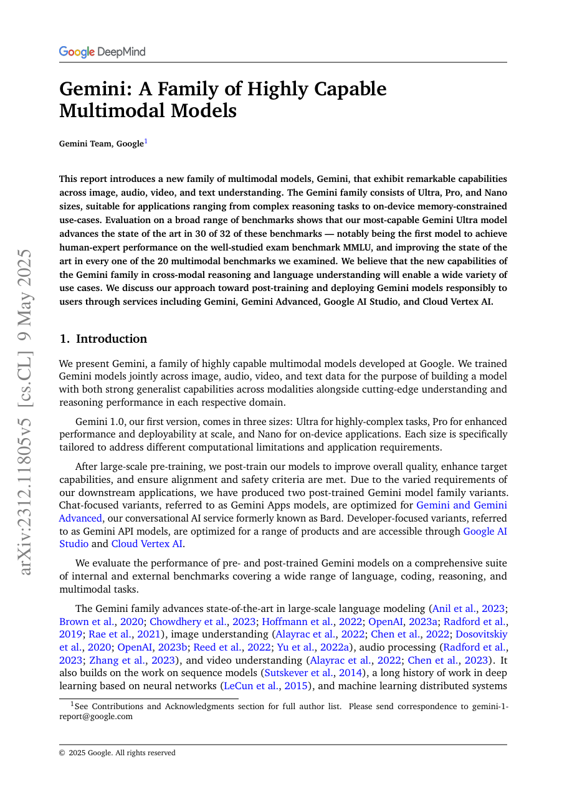

能力最强的 Gemini Ultra 在本文报告的 32 项基准中有 30 项取得新的最佳结果，其中包括 12 项常用文本与推理基准中的 10 项、全部 9 项图像理解基准、全部 6 项视频理解基准，以及全部 5 项语音识别与语音翻译基准。Gemini Ultra 是首个在 MMLU（Hendrycks et al., 2021a）上达到人类专家水平的模型；MMLU 通过一组考试测试知识与推理能力，Gemini Ultra 的得分超过 90%。

除文本外，Gemini Ultra 在困难的多模态推理任务上也取得显著进展。例如，近期的 MMMU 基准（Yue et al., 2023）包含多个学科中围绕图像提出的问题，需要大学水平的专业知识和审慎推理。Gemini Ultra 在该基准上取得 62.4% 的新最佳成绩，比此前最佳模型高出 5 个百分点以上。它还在视频问答与音频理解基准上带来一致的性能提升。

定性评测展示了令人印象深刻的跨模态推理能力：模型能够原生理解并推理由音频、图像和文本组成的输入序列，示例见图 5 与表 13。以图 1 的教学场景为例，教师画出一道滑雪者沿斜坡下滑的物理题，学生写出了自己的解法。凭借多模态推理能力，Gemini 能够读懂潦草手写内容，正确理解问题设定，把题目和解答转换为数学排版，找出学生推理中出错的具体步骤，并给出完整的正确解法。这为教育带来了令人振奋的可能性。我们相信，Gemini 新增的多模态与推理能力将在众多领域产生重要应用。

大型语言模型的推理能力为构建可处理复杂多步问题的通用智能体展现出前景。AlphaCode 团队构建了由 Gemini 驱动的新智能体 AlphaCode 2（Leblond et al., 2023），把 Gemini 的推理能力与搜索及工具使用相结合，从而擅长解决竞赛编程问题。AlphaCode 2 在 Codeforces 竞赛编程平台上的排名进入参赛者前 15%，相比处于前 50% 的上一代最佳系统有大幅提升（Li et al., 2022）。

与此同时，我们用 Gemini Nano 推进效率前沿。它是一系列面向端侧部署的小模型，在摘要、阅读理解、文本补全等端侧任务上表现出色；相对于自身规模，它们在推理、STEM、编程、多模态和多语言任务上也展现出令人瞩目的能力。

下文首先概述模型架构、训练基础设施和预训练数据集；随后详细评估预训练与后训练后的 Gemini 家族，覆盖文本、代码、图像、音频和视频等成熟基准，其中既包含英语表现，也包含多语言能力。接下来，本文讨论后训练方法，说明 Gemini Apps 与 Gemini API 两类模型的共性和差异，并评测其关键能力。负责任部署至关重要，因此我们也会解释在作出部署决策之前，如何进行影响评估、制定模型政策、开展评测并缓解伤害。最后，本文讨论 Gemini 的更广泛影响、局限及潜在应用，为 AI 研究与创新的新时代铺路。

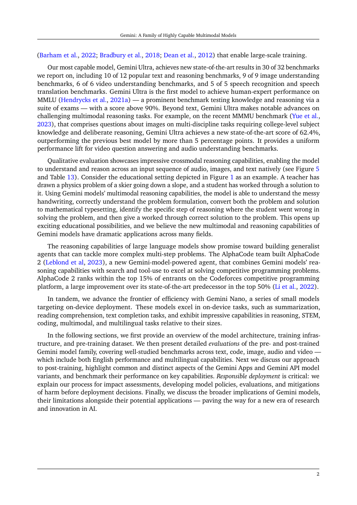

原论文图 1 展示了模型核验学生物理解答的过程。模型不仅能够正确识别全部手写内容，还能核对推理过程；除理解图中文字外，它还必须理解题目设定，并遵循指令生成 LaTeX。

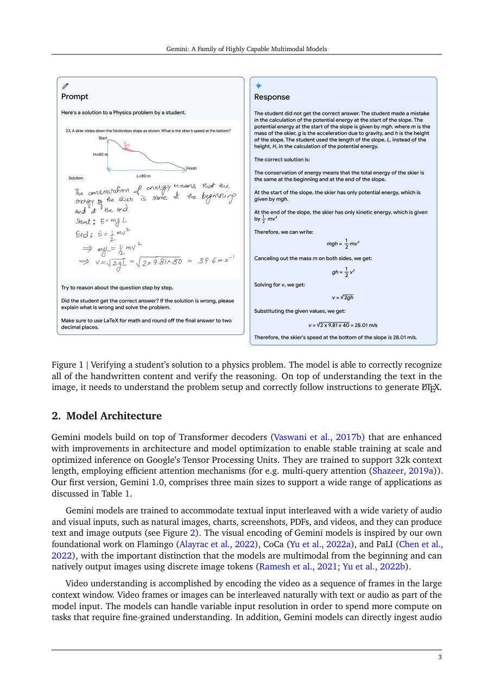

## 2 模型架构

Gemini 建立在 Transformer 解码器（Vaswani et al., 2017b）之上，并通过架构与模型优化方面的改进，实现稳定的大规模训练以及在 Google 张量处理器上的优化推理。模型训练时支持 32K 上下文长度，并采用多查询注意力等高效注意力机制（Shazeer, 2019a）。如表 1 所示，首个版本 Gemini 1.0 包含三种主要规模，以支持广泛应用。

- **Ultra：** 能力最强的模型，在包括推理和多模态任务在内的多种高度复杂任务上取得最佳性能。得益于 Gemini 架构，它可以在 TPU 加速器上高效地进行大规模服务。
- **Pro：** 面向成本与延迟优化的高性能模型，在广泛任务上均有显著表现，拥有强大的推理能力和广泛的多模态能力。
- **Nano：** 面向端侧运行的最高效模型。Nano 包含 18 亿参数的 Nano-1 与 32.5 亿参数的 Nano-2，分别面向低内存和高内存设备。它们由更大的 Gemini 模型蒸馏而来，部署时采用 4 位量化，并提供同类最佳性能。

**表 1｜Gemini 1.0 模型家族概览。**

Gemini 可接收文本与多种音频、视觉输入交错组成的序列，其中包括自然图像、图表、屏幕截图、PDF 和视频，并可生成文本与图像输出，见图 2。Gemini 的视觉编码受我们在 Flamingo（Alayrac et al., 2022）、CoCa（Yu et al., 2022a）和 PaLI（Chen et al., 2022）等基础工作启发；重要区别在于，Gemini 从一开始就是多模态模型，并能使用离散图像词元原生输出图像（Ramesh et al., 2021；Yu et al., 2022b）。

视频理解通过把视频编码为大上下文窗口中的帧序列来实现。视频帧或图像可以作为模型输入的一部分，自然地与文本或音频交错排列。模型支持可变输入分辨率，从而在需要细粒度理解的任务上投入更多计算。此外，Gemini 还能直接接收来自通用语音模型特征的 16 kHz 音频信号。

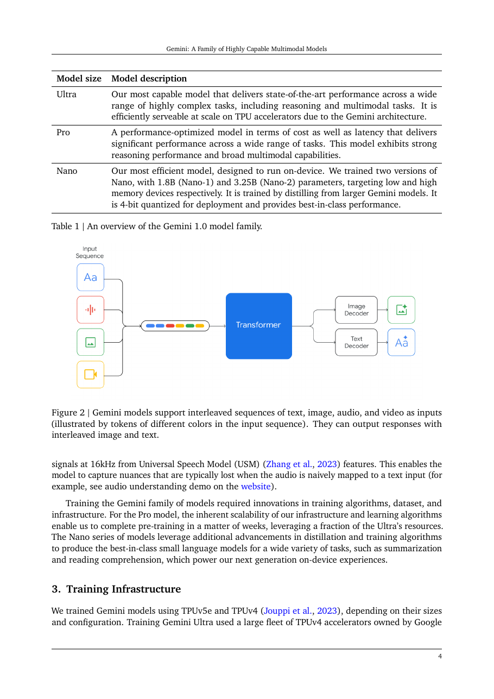

这种设计使模型能够捕捉把音频简单转换成文本时通常会丢失的细节。Gemini 家族的训练需要在训练算法、数据集和基础设施方面进行创新。对于 Pro，基础设施与学习算法内在的可扩展性使我们能够只使用 Ultra 一小部分资源，在数周内完成预训练。Nano 系列则利用蒸馏和训练算法方面的进一步进展，成为面向摘要、阅读理解等多种任务的同类最佳小型语言模型，并为下一代端侧体验提供支持。

## 3 训练基础设施

根据模型规模与配置，我们使用 TPUv5e 和 TPUv4（Jouppi et al., 2023）训练 Gemini。Gemini Ultra 使用 Google 分布在多个数据中心的大规模 TPUv4 加速器集群训练。其规模较上一代旗舰模型 PaLM 2 显著扩大，也带来了新的基础设施挑战。加速器数量增长会按比例缩短整个系统硬件故障的平均间隔。我们尽量减少计划内重新调度与抢占，但在如此大规模下，各类硬件加速器发生真实机器故障都很常见。

TPUv4 加速器以包含 4096 枚芯片的 SuperPod 部署，每个 SuperPod 都连接一台专用光交换机；该交换机可在约 10 秒内，把 $4\times4\times4$ 芯片立方体动态重组为任意三维环面拓扑（Jouppi et al., 2023）。训练 Gemini Ultra 时，我们决定在每个 SuperPod 中保留少量立方体，用作热备份和滚动维护。

TPU 加速器主要通过高速芯片间互连通信，但在 Gemini Ultra 的规模上，我们借助 Google 的集群内与集群间网络，把多个数据中心的 SuperPod 组合起来（Poutievski et al., 2022；Wetherall et al., 2023；Yao Hong et al., 2018）。Google 网络的延迟与带宽足以支持常用的同步训练范式：在 SuperPod 内采用模型并行，在不同 SuperPod 间采用数据并行。

JAX（Bradbury et al., 2018）和 Pathways（Barham et al., 2022）的“单控制器”编程模型允许一个 Python 进程编排整个训练过程，大幅简化开发工作流。XLA 编译器中的 GSPMD 分区器（Xu et al., 2021）负责切分训练步骤计算；MegaScale XLA 编译器（XLA, 2019）则静态调度适当的集合通信，使其最大程度与计算重叠，并让各步耗时几乎不发生波动。

在这一规模上，如果仍采用定期把权重检查点保存到集群持久存储的传统方式，就不可能维持较高的有效计算率。Gemini 改用模型状态的冗余内存副本；一旦发生非计划硬件故障，就直接从完整的模型副本快速恢复。尽管训练资源显著增加，这种方法相较 PaLM 与 PaLM 2（Anil et al., 2023）仍大幅缩短了恢复时间。结果是，最大规模训练任务的总体有效计算率从 85% 提高到 97%。这里的有效计算率，是训练任务总耗时中用于计算有效新步骤的比例。

前所未有的训练规模必然暴露新的系统故障模式。本次需要解决的问题之一是“静默数据损坏”（Dixit et al., 2021；Hochschild et al., 2021；Vishwanathan et al., 2015）。这类事件虽然极其罕见，但 Gemini 的规模意味着训练预计每一到两周就会受到一次影响。为了快速发现并移除故障硬件，我们采用多项新技术：使用确定性重放隔离错误计算，并在空闲机器和热备机上主动运行静默数据损坏扫描器。完全确定性的基础设施使我们在 Ultra 的开发阶段能够迅速找到包括硬件故障在内的根本原因，这是实现稳定训练的关键因素。

## 4 预训练数据集

Gemini 使用多模态、多语言数据集训练。预训练数据来自网页文档、书籍与代码，并包含图像、音频和视频数据。

我们使用 SentencePiece 分词器（Kudo and Richardson, 2018），并发现以整个训练语料的大样本训练分词器，能够改进推得的词表，进而提高模型性能。例如，Gemini 能够高效地对非拉丁文字进行分词，这既有利于模型质量，也可提高训练和推理速度。

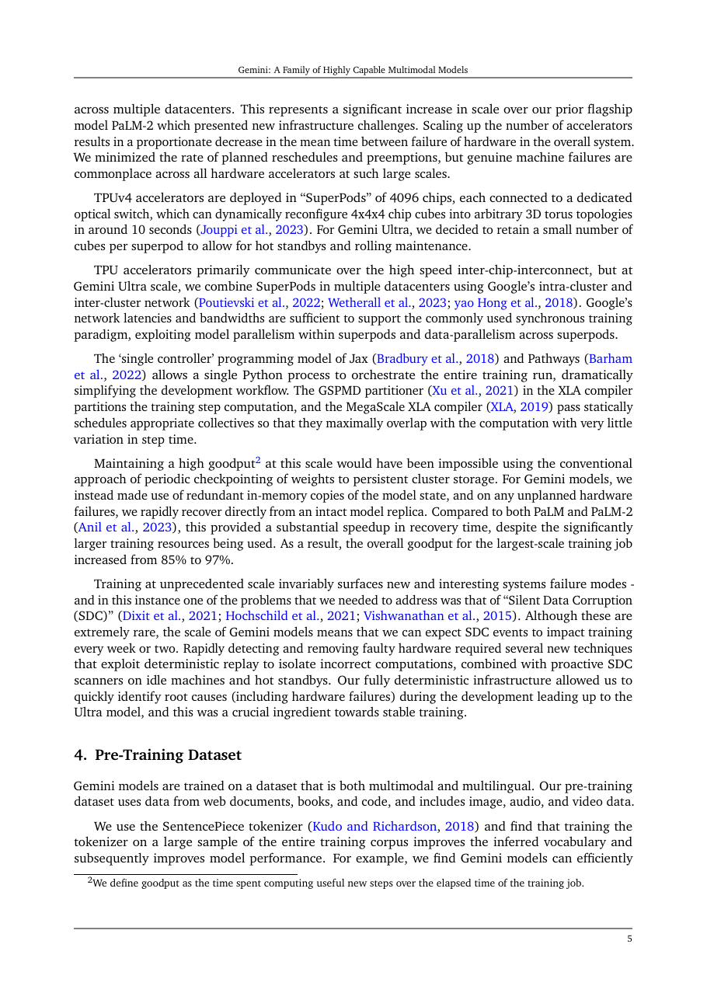

最大模型所用训练词元数依照 Hoffmann et al.（2022）的方法确定。与 Touvron et al.（2023a）主张的方法类似，小模型会使用显著更多词元训练，以便在给定推理预算下提高性能。

我们使用启发式规则与基于模型的分类器，对所有数据集进行质量过滤；同时依据政策实施安全过滤，移除有害内容。为保持评测完整性，在使用数据训练之前，我们会搜索并移除训练语料中可能出现的评测数据。最终的数据混合比例和权重通过小模型消融实验确定。训练采用分阶段方式，在训练过程中改变混合数据的组成，并在后期增加领域相关数据的权重。我们发现，数据质量是高性能模型的重要因素；关于如何找到预训练的最优数据分布，仍有许多值得研究的问题。

## 5 评测

Gemini 在文本、图像、音频与视频上联合训练，因此天然具备多模态能力。一个悬而未决的问题是：这种联合训练能否产生在每个领域都能力强大的模型，甚至能够与专为单一领域定制的模型和方法竞争。我们的答案是肯定的：Gemini 在大量文本、图像、音频和视频基准上刷新了最佳水平。

### 5.1 文本

#### 5.1.1 学术基准

我们在一系列文本学术基准上，将预训练及后训练后的 Gemini Pro 与 Ultra，同外部大型语言模型以及此前最佳模型 PaLM 2 进行比较。这些基准覆盖推理、阅读理解、STEM 和编程，结果见表 2。总体而言，Gemini Pro 超过 GPT-3.5 等面向推理优化的模型，并可与若干最强模型相媲美；Gemini Ultra 则超过所有现有模型。

在 MMLU（Hendrycks et al., 2021a）上，Gemini Ultra 以 90.04% 的准确率超过全部既有模型。MMLU 是一项综合考试基准，衡量模型在 57 个学科上的知识。基准作者估计人类专家表现为 89.8%，Gemini Ultra 是首个超过这一门槛的模型，此前最佳结果为 86.4%。取得高分既需要法律、生物、历史等多个领域的专业知识，也需要阅读理解与推理能力。

我们发现，Gemini Ultra 与一种考虑模型不确定性的思维链提示方法结合时准确率最高。模型分别生成 8 或 32 个思维链样本；若答案共识超过依据验证集设定的阈值，就选择该答案，否则退回到不使用思维链、基于最大似然选择的贪心样本。附录会详细分析这种方法与单独使用思维链提示或单独使用贪心采样的差异。

在常用于衡量模型分析能力的数学领域，Gemini Ultra 在基础考试与竞赛级问题集上都表现强劲。对于小学数学基准 GSM8K（Cobbe et al., 2021），Gemini Ultra 使用思维链提示和自洽性时达到 94.4%。

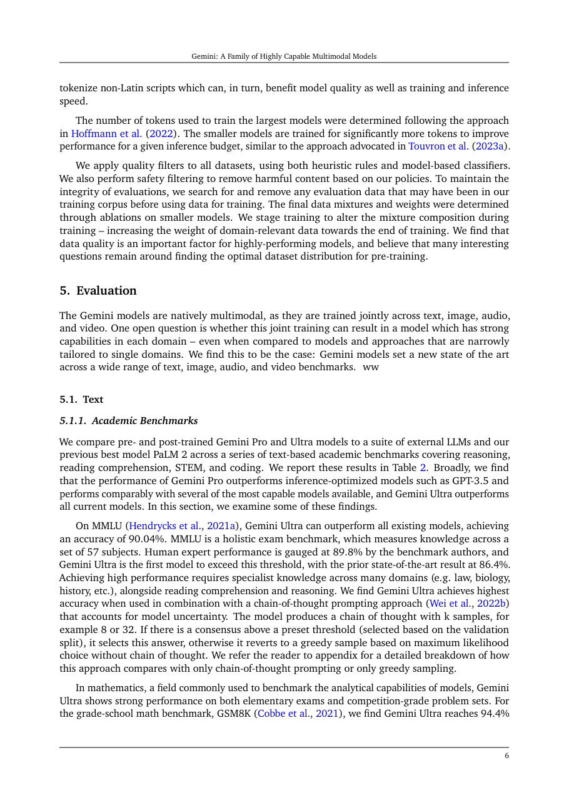

此前使用同样提示方法的最佳准确率为 92%。在取自初高中数学竞赛、难度更高的 MATH 基准上也观察到相同趋势：Gemini Ultra 使用四样本提示达到 53.2%，超过所有对比模型。在来自 2022 与 2023 年美国数学竞赛的 150 道更难题目上，它也超过当时最佳结果。较小模型在这一困难任务上接近随机猜测，而 Gemini Ultra 能解出 32% 的问题，GPT-4 为 30%。

Gemini Ultra 在当前大型语言模型的重要应用——编程方面也表现出色。我们在多项常规及内部基准上评测模型，并测量它作为 AlphaCode 2 等复杂推理系统组成部分时的表现，后者见第 5.1.7 节。例如，在把函数描述映射为 Python 实现的标准代码补全基准 HumanEval（Chen et al., 2021）上，经过指令微调的 Gemini Ultra 正确实现了 74.4% 的题目。在新构建、确保不存在网络泄漏的 Python 代码生成留出基准 Natural2Code 上，Gemini Ultra 以 74.9% 获得最高分。

这些基准的评测并不容易，也可能受数据污染影响。训练后，我们开展了广泛的数据泄漏分析，尽量保证报告结果在科学上可靠；即便如此仍发现少量问题，因此决定不报告 LAMBADA 等基准的成绩（Paperno et al., 2016）。

在常用基准 HellaSwag（Zellers et al., 2019）上，我们发现，只需使用与 HellaSwag 训练集对应的特定网站摘录额外微调一百步——这些数据不在 Gemini 预训练集中——Gemini Pro 和 Ultra 的单样本验证准确率就分别提高到 89.6% 与 96.0%；我们通过 API 以单样本方式评测 GPT-4 得到 92.3%。这说明基准结果很容易受预训练数据构成影响。因此，本文只报告去污染后的 HellaSwag 十样本评测结果。

我们认为，行业需要没有泄漏数据、更加稳健且细致的标准化评测基准。因此，Gemini 还在若干近期发布的新留出数据集上接受评测，例如 WMT23、2022—2023 年 Math-AMC 题目，以及由非网络来源内部生成的 Natural2Code。完整评测基准列表见附录 10.3。

尽管如此，这些基准上的表现仍能说明模型能力，以及模型可能在真实任务中产生影响的位置。例如，Gemini Ultra 出色的推理与 STEM 能力，为大型语言模型在教育领域的发展铺平道路。它处理复杂数学与科学概念的能力，为个性化学习和智能辅导系统带来了令人振奋的可能性。

#### 5.1.2 能力趋势

我们用一个包含 50 多项基准的综合评测套件，考察 Gemini 家族六类能力的变化趋势。上一节已经讨论其中若干代表性基准。这六类能力包括：涵盖开卷与闭卷检索及问答任务的“事实性”；涵盖长篇摘要、检索和问答的“长上下文”；包括数学问题求解、定理证明和科学考试的“数学／科学”；需要算术、科学与常识推理的“推理”；以及包括多语言翻译、摘要和推理的“多语言”。后训练会专门强化其中若干能力，详见第 6 节。各能力包含的任务列表见附录 10.3。

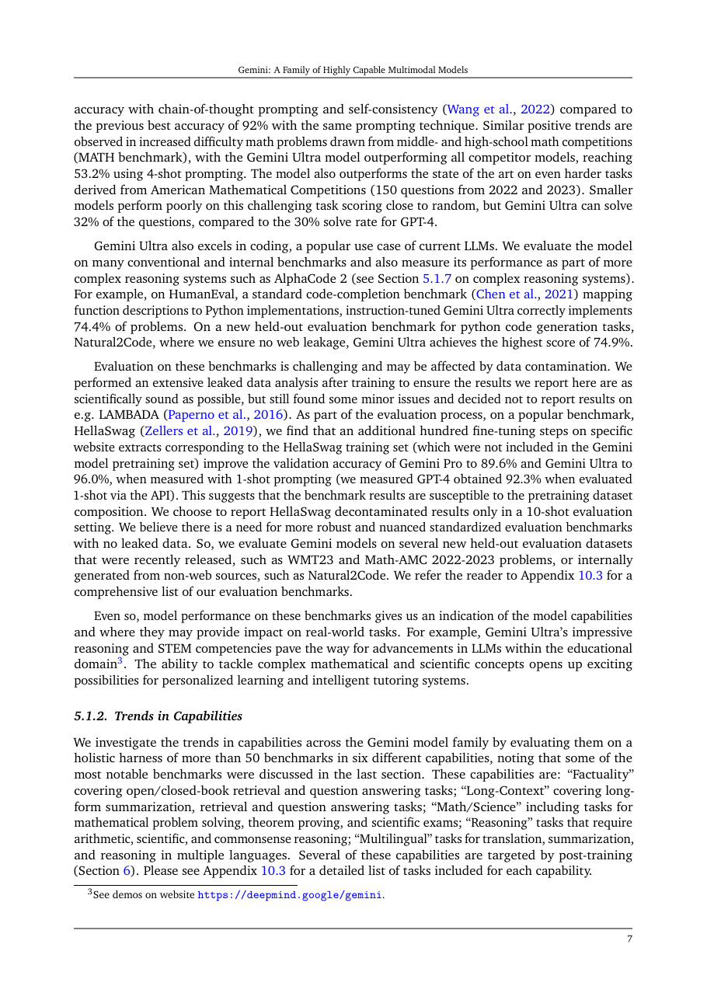

表 2 给出了 Gemini 在文本基准上的表现，并与外部模型及 PaLM 2-L 比较。表中说明：标记为 CoT@8 或 CoT@32 的结果会生成 8 或 32 个思维链样本；若共识超过验证集确定的阈值就选择共识答案，否则回退到贪心样本。API 对比结果采集于 2023 年 11 月；Llama 2 使用其报告中与去污染 Gemini 最可比的去污染成绩；PT 表示后训练后的 Gemini API 模型。

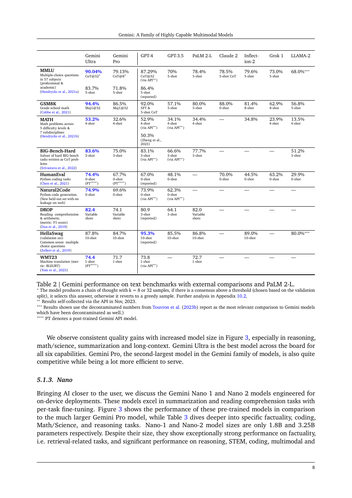

图 3 显示，随着模型规模增加，质量持续提高，尤其体现在推理、数学／科学、摘要与长上下文方面。Gemini Ultra 在全部六类能力上都是最佳模型。Gemini Pro 是家族中第二大的模型，也极具竞争力，同时服务效率高得多。

#### 5.1.3 Nano

为了把 AI 带到更接近用户的位置，我们开发了面向端侧部署的 Gemini Nano 1 与 Nano 2。经过按任务微调后，它们在摘要和阅读理解任务上表现出色。图 3 将这些预训练模型同规模大得多的 Gemini Pro 比较，表 3 则进一步展示它们在事实性、编程、数学／科学和推理任务上的结果。

Nano-1 与 Nano-2 分别只有 18 亿和 32.5 亿参数。尽管规模很小，它们在事实性——即检索相关任务——上表现格外强劲，并在推理、STEM、编程、多模态和多语言任务上取得显著成绩。随着新能力能够进入更多平台与设备，Gemini 让更多人都可获得这些能力。

图 3 展示 Gemini 家族在不同能力上的语言理解与生成表现，并以 Gemini Pro 为归一化基准。表 3 则比较 Nano 系列在事实性、摘要、推理、编程和 STEM 任务上的表现与显著更大的 Gemini Pro。

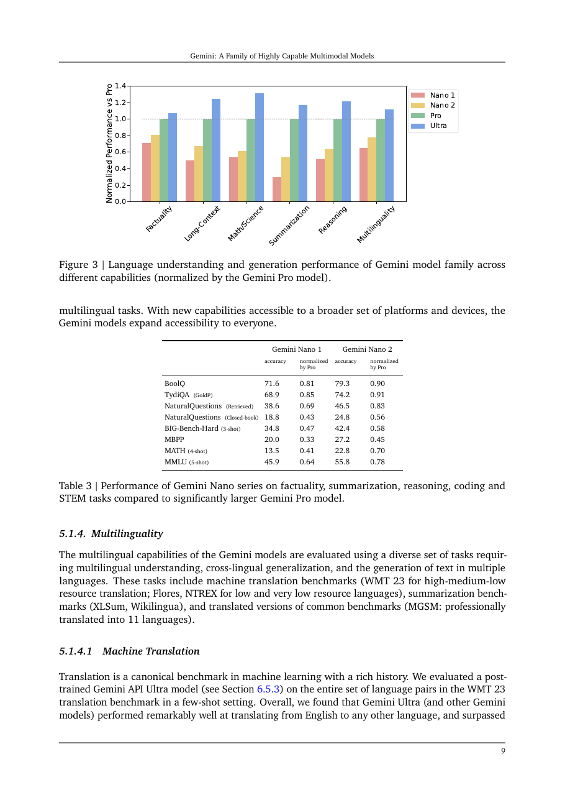

#### 5.1.4 多语言能力

Gemini 的多语言能力通过一组多样化任务评估；这些任务要求多语言理解、跨语言泛化，以及生成多种语言的文本。其中包括机器翻译基准：用于高、中、低资源语言翻译的 WMT23，以及面向低资源和极低资源语言的 Flores 与 NTREX；摘要基准 XLSum 与 WikiLingua；以及常见基准的翻译版本，例如由专业人员翻译为 11 种语言的 MGSM。

##### 5.1.4.1 机器翻译

翻译是机器学习中历史悠久的典型基准。我们以少样本设置，在 WMT23 翻译基准的全部语言对上评测后训练的 Gemini API Ultra，详见第 6.5.3 节。总体而言，Gemini Ultra 及其他 Gemini 模型在从英语翻译到其他语言时表现出色；在从英语译出的高资源、中资源和低资源语言任务上，它们超过了其他基于大型语言模型的翻译方法。

在 WMT23 从英语译出的任务中，Gemini Ultra 的平均 BLEURT 为 74.8，是基于大型语言模型的方法中最高的；GPT-4 为 73.6，PaLM 2 为 72.2。若对 WMT23 所有语言对和方向取平均，趋势相同：Gemini Ultra、GPT-4 和 PaLM 2-L 的平均 BLEURT 分别为 74.4、73.8 和 72.7。

除上述语言和翻译任务外，我们还在极低资源语言上评测 Gemini Ultra。这些语言从 Flores-200 的尾部语言塔马齐格特语和卡努里语、NTREX 的北恩德贝勒语，以及内部基准中的克丘亚语抽样。在这些语言与英语之间双向翻译时，Gemini Ultra 在单样本设置下的平均 chrF 为 27.0，第二名 PaLM 2-L 为 25.3。

#### 5.1.4.2 多语言数学与摘要

除翻译外，我们还评估 Gemini 在多种语言的困难任务上表现如何。具体而言，MGSM（Shi et al., 2023）是数学基准 GSM8K（Cobbe et al., 2021）的翻译版本。Gemini Ultra 在 8 样本设置下跨所有语言平均准确率达到 79.0%，高于 PaLM 2-L 的 74.7%。

我们还在多语言摘要基准 XLSum（Hasan et al., 2021）和 WikiLingua（Ladhak et al., 2020）上评测 Gemini。在 XLSum 上，Gemini Ultra 的平均 rougeL 为 17.6，PaLM 2 为 15.4；在 WikiLingua 上，Gemini Ultra 的五样本 BLEURT 略低于 PaLM 2 的三样本结果。完整结果见表 5。总体来看，这些多样化多语言基准表明 Gemini 家族覆盖广泛语言，也能够服务低资源语言所在地区。

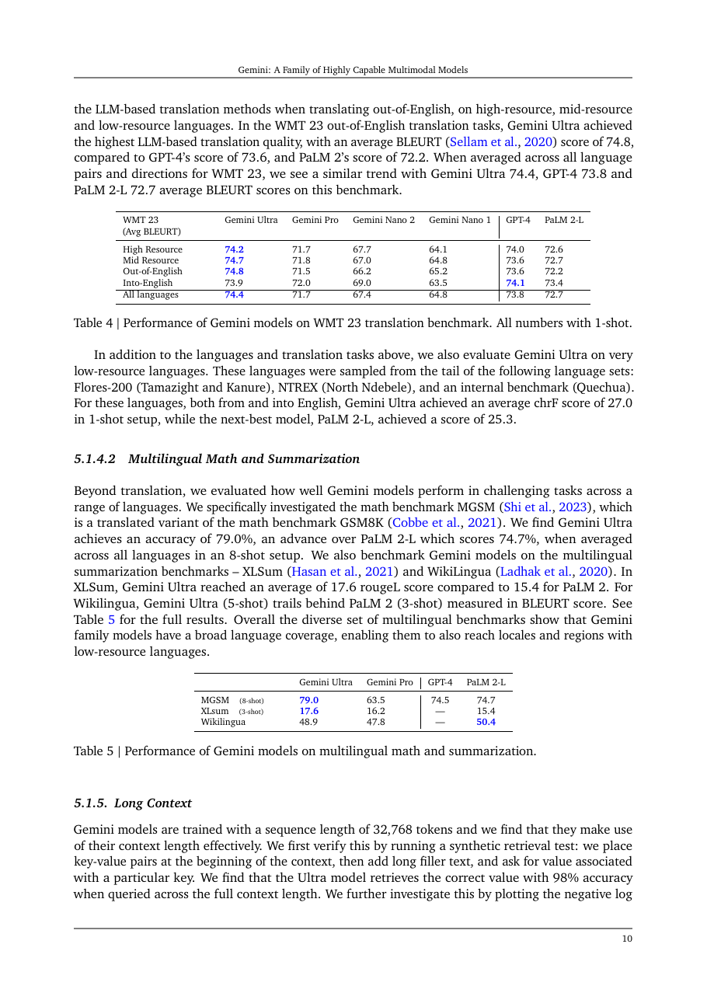

#### 5.1.5 长上下文

Gemini 使用 32,768 词元的序列长度训练，并能有效利用其上下文。我们首先通过合成检索测试验证这一点：把键值对放在上下文开头，随后添加很长的填充文本，再询问特定键对应的值。Ultra 在整个上下文长度范围内检索正确值的准确率达到 98%。

接着，我们在一组留出的长文档上，绘制负对数似然随词元位置的变化，见图 4。负对数似然一直随序列位置下降，直至完整的 32K 上下文长度。更长的上下文使 Gemini 能够支持文档检索，以及第 5.2.2 节讨论的视频理解等新用途。

原论文图 4 展示留出长文档上，负对数似然随 32K 上下文中的词元位置变化。

#### 5.1.6 事实性

事实性（Maynez et al., 2020）是模型训练与部署的重点。我们从三个方面评估 Gemini API 模型的事实性：

1. **闭卷事实性。** 当用户提出寻求事实、但没有提供任何来源的提示时，Gemini API 不应幻觉出错误信息，定义见 Roberts et al.（2020）第 2 节。这类提示既可以是“印度总理是谁？”等信息查询，也可以是“写一篇 500 字的演讲，支持采用可再生能源”等可能要求事实信息的半创作提示。
2. **归因。** 当模型被要求依据给定上下文生成回答时，我们希望它尽可能忠实于上下文（Maynez et al., 2020；Rashkin et al., 2023）。任务可以包括：摘要用户提供的来源；根据问题和给定片段生成细粒度引文；从书籍等长篇来源回答问题；以及把给定来源转换成目标输出，例如根据会议记录片段写一封邮件。
3. **回避。** 当输入“无法回答”时，Gemini API 必须承认无法给出回答，通过恰当回避来避免幻觉。这包括输入包含错误前提问题、提示要求模型进行开卷问答但答案无法从给定上下文推出等情形。

事实性由人工标注员逐条核查回答，并报告被判断为事实不准确的回答比例。归因同样由人工标注员检查每个回答是否可归因于提示中的来源，指标采用 AIS（Rashkin et al., 2023）。对于回避，我们采用自动评测，测量模型是否准确地采取回避表达。

我们在表 6 中比较 Gemini API Pro 与一个未进行任何事实性专项适配的版本。结果显示，事实性数据集上的不准确率降低一半，归因准确性提高。

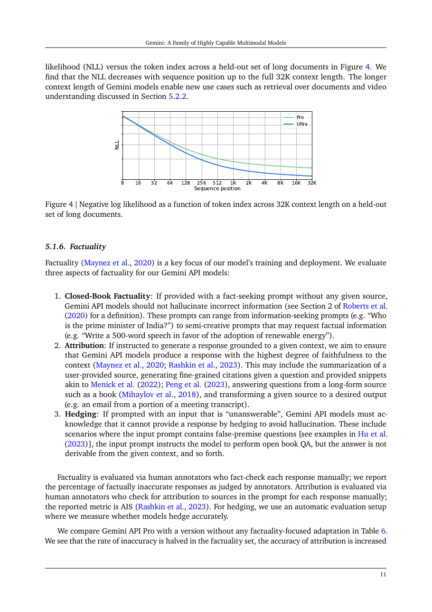

归因集合上的 AIS 提升了 50%，模型在给定回避任务上的正确回避率从 0% 提高到 70%。表 6 显示后训练最后阶段对 Gemini API Pro 的影响，并给出相应的 95% 置信区间。

#### 5.1.7 复杂推理系统

Gemini 还可以同搜索和工具使用等技术结合，构建能够处理更复杂多步问题的强大推理系统。AlphaCode 2 就是一例：它是新的最佳智能体，擅长解决竞赛编程问题（Leblond et al., 2023）。AlphaCode 2 使用 Gemini Pro 的专门版本，在类似 Li et al.（2022）所用的竞赛编程数据上微调，并对可能程序的空间进行大规模搜索，随后通过专门设计的过滤、聚类和重新排序机制筛选结果。Gemini Pro 一方面被微调为代码模型，用于生成候选解法；另一方面被微调为奖励模型，用于识别并提取最有希望的代码候选。

AlphaCode 2 在 Codeforces 上评测；该平台与 AlphaCode 相同。评测涵盖 12 场一级和二级竞赛，共 77 道题。AlphaCode 2 解出其中 43%，相较上一代创纪录的 AlphaCode 的 25% 提高到 1.7 倍。映射到竞赛排名，建立在 Gemini Pro 上的 AlphaCode 2 平均处于估计第 85 百分位，也就是优于 85% 的参赛者；AlphaCode 只能超过 50% 的参赛者。

把强大预训练模型与搜索、推理机制组合，是迈向更通用智能体的激动人心方向。另一项关键要素，是对多种模态的深入理解，下一节将对此展开讨论。

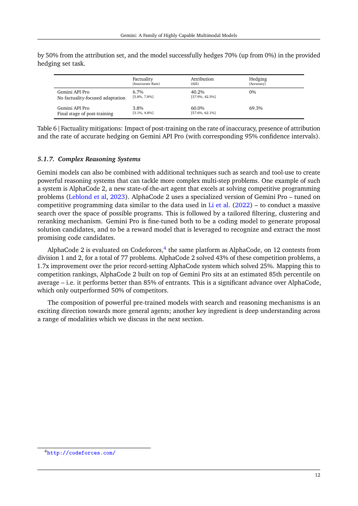

### 5.2 多模态

Gemini 是原生多模态模型。它们拥有一项独特能力：能够无缝结合不同模态上的能力——例如从表格、图表或插图中提取信息与空间布局——以及语言模型的强大推理能力，例如在数学和编程上的最佳表现，示例见图 5 和图 14。模型还能辨别输入中的细粒度细节，聚合跨越空间与时间的上下文，并把这些能力应用于时间上相互关联的视频帧序列和音频输入。

下文会更详细地评测模型在图像、视频与音频等不同模态上的表现，并通过定性示例展示图像生成，以及跨模态组合信息的能力。

#### 5.2.1 图像理解

我们从四类能力评测后训练的 Gemini API 模型：第一类是高层物体识别，采用图像描述或 VQAv2 等问答任务；第二类是细粒度转录，采用 TextVQA 和 DocVQA 等要求识别底层细节的任务；第三类是图表理解，采用 ChartQA 和 InfographicVQA 等要求理解输入空间布局的任务；第四类是多模态推理，采用 Ai2D、MathVista 和 MMMU 等任务。零样本问答评测中，模型被要求给出符合特定基准格式的简短回答。全部结果均使用贪心采样获得，且没有调用任何外部 OCR 工具。

表 7 表明，即使在零样本设置下，Gemini Ultra 也持续超过既有方法，尤其在自然图像文字、文档与图形等依赖 OCR 的图像理解任务上；模型只接收像素，不使用外部 OCR 引擎。许多既有方法会在相应任务上微调，表中以灰色标出，因此与零样本结果并非完全同条件比较。

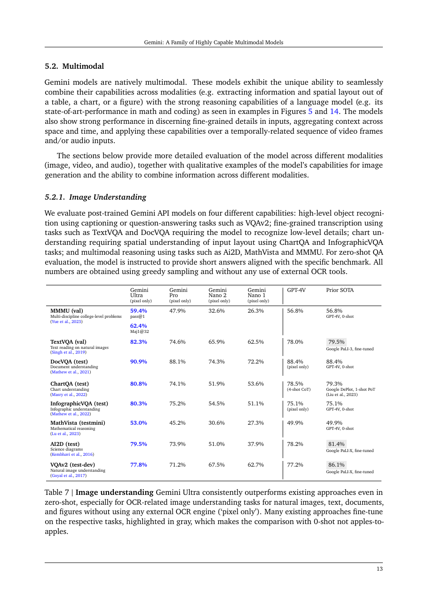

表 7 显示，Gemini Ultra 在广泛图像理解基准上达到当时最佳水平。无论是回答自然图像和扫描文档中的问题，还是理解信息图、图表与科学示意图，它都表现强劲。与其他模型公开报告的结果——尤其 GPT-4V——相比，Gemini 在零样本评测中以显著优势胜出；在大多数任务上，它甚至超过若干专门使用基准训练集微调的模型。Gemini 在 MathVista 上把最佳结果提高 3.1 个百分点，在 InfographicVQA 上提高 5.2 个百分点。

MMMU（Yue et al., 2023）是近期发布的评测基准，包含六个学科门类及其下多个专业中的图像问题，解答这些问题需要大学水平知识。Gemini Ultra 在该基准上把最佳成绩提高了 5 个百分点以上，并在六个学科门类中的五个超过此前最佳结果，详见表 8，展示出强大的多模态推理能力。

Gemini 还能够同时跨模态并处理多种全球语言，既包括图像理解任务，例如理解含冰岛语文字的图像，也包括生成任务，例如为多种语言生成图像描述。我们依照 Flamingo 的评测协议（Alayrac et al., 2022），在 XM-3600 基准选定的语言子集上，以四样本设置评估图像描述生成；所有模型都不进行微调。如表 9 所示，Gemini 相比此前最佳模型 Google PaLI-X 有显著提升。七种语言的平均 CIDER 得分中，Gemini Ultra 为 58.4，Gemini Pro 为 55.9，PaLI-X 为 45.0。

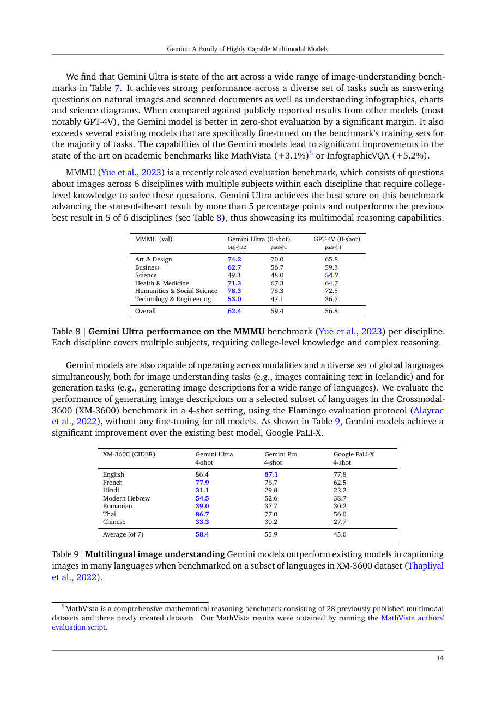

图 5 展示 Gemini 利用多模态推理能力，生成用于重新排列多个子图的 matplotlib 代码。左上灰色部分是多模态提示，右侧蓝色列是 Gemini Ultra 的回答及生成代码，左下则是代码渲染结果。成功完成任务需要组合多项能力：识别各子图所画函数；通过逆向图形推断生成子图所需代码；遵循指令把子图移动到目标位置；并进行抽象推理，判断指数函数图必须留在原位，因为必须先移走正弦图，才能给三维图腾出位置。

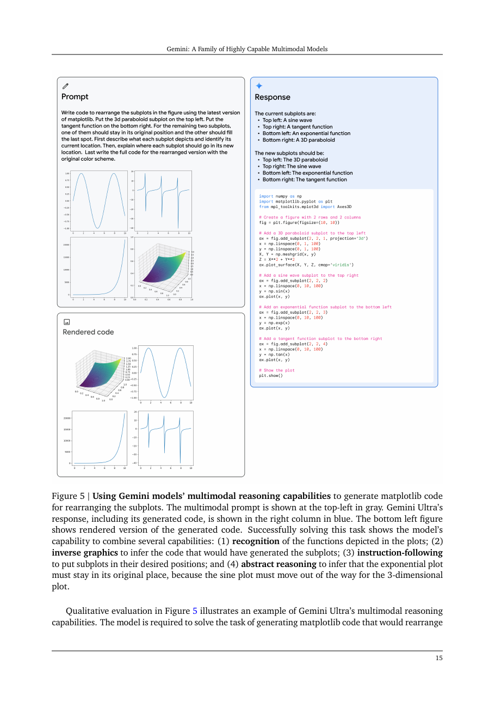

图 5 的定性评测说明，Gemini Ultra 能够理解用户给出的图形、推断生成该图所需的代码、遵循用户对子图位置的要求，并对输出图进行抽象推理，从而成功完成整个任务。这凸显了 Gemini Ultra 的原生多模态能力，也显示它可以在图文交错序列上进行更复杂的推理。更多定性案例见附录。

#### 5.2.2 视频理解

理解视频输入，是迈向实用通用智能体的重要一步。我们使用多个未出现在训练中的成熟基准，测量视频理解能力。这些任务检验模型能否理解并推理一组时间相关的帧。每项视频任务中，我们从每段视频等间距采样 16 帧作为 Gemini 输入。对于 YouTube 视频数据集——除 NextQA 和 Perception Test 外的全部数据集——我们只在 2023 年 11 月仍可公开访问的视频上评测。

如表 10 所示，Gemini Ultra 在多项少样本视频描述和零样本视频问答任务上达到最佳性能，说明它能够在多帧之间进行强有力的时间推理。附录图 23 给出定性案例：模型理解足球运动员击球动作的视频，并推理运动员可以如何改进表现。

表 10 涵盖不同任务和语言的少样本视频理解结果。视频描述任务报告 CIDER，NextQA 报告 WUPS，Perception Test 与 ActivityNet-QA 报告 top-1 准确率；ActivityNet-QA 采用 Video-LLAVA（Lin et al., 2023）的评测协议。

#### 5.2.3 图像生成

Gemini 可以原生输出图像，无需依赖可能限制图像表达能力的中间自然语言描述。凭借这一特性，模型能够在少样本设置下，根据图像与文本交错的提示生成图像。例如，用户可以要求模型为博客文章或网站提出图文设计建议，案例见附录图 12。

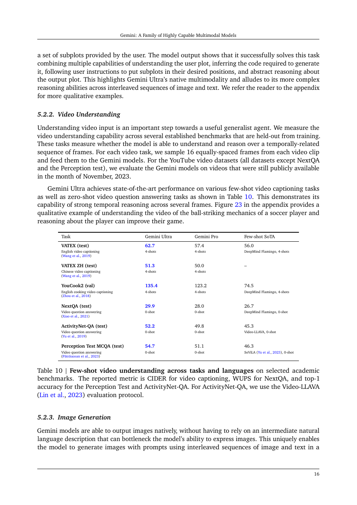

图 6 展示单样本图像生成案例。提示先提供一个图文交错示例：用户给出蓝色和黄色两种颜色，请模型建议用毛线制作一只可爱的蓝猫，或一只带黄色耳朵的蓝狗。随后，模型接收粉色和绿色两种新颜色，并被要求提出两种创意。模型成功生成交错的图文序列，建议用毛线制作一颗带粉色果核的可爱绿色牛油果，或一只有粉色耳朵的绿色兔子。

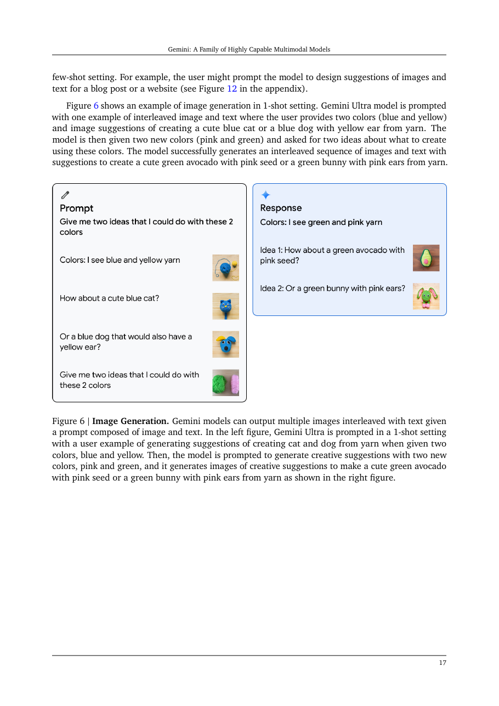

#### 5.2.4 音频理解

我们在多项公开基准上评测 Gemini Nano-1 与 Gemini Pro，并同通用语音模型 USM（Zhang et al., 2023）和 Whisper 比较；Whisper 按表中说明使用 large-v2 或 large-v3。这些基准包括自动语音识别任务 FLEURS（Conneau et al., 2023）、VoxPopuli（Wang et al., 2021）、Multilingual LibriSpeech（Pratap et al., 2020），以及把多种语言翻译成英语的语音翻译任务 CoVoST 2（Wang et al., 2020）。本文还报告内部 YouTube 测试集结果。

自动语音识别任务采用词错误率，数值越低越好；翻译任务采用 BLEU，数值越高越好。FLEURS 报告与训练数据语言重叠的 62 种语言。与 Whisper 相同，中文普通话、日语、韩语和泰语四种分词方式不同的语言采用字符错误率，而非词错误率。

表 11 显示，在英语与多语言测试集的所有自动语音识别和自动语音翻译任务上，Gemini Pro 都显著超过 USM 与 Whisper。FLEURS 上的提升尤其大，部分原因是模型使用了 FLEURS 训练集；但在不使用 FLEURS 训练集时，同一模型的词错误率为 15.8，仍优于 Whisper。除 FLEURS 外，Gemini Nano-1 也在全部数据集上超过 USM 与 Whisper。本文尚未在音频上评测 Gemini Ultra，不过预计更大的模型规模会带来更好表现。

表 12 进一步对比 USM 与 Gemini Pro 的错误。Gemini Pro 生成的转录更容易理解，尤其擅长处理低频词和专有名词。

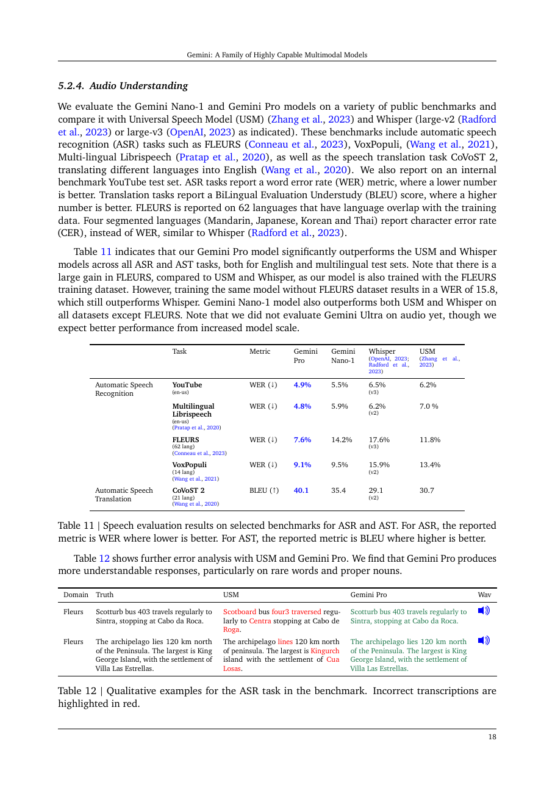

#### 5.2.5 模态组合

多模态演示通常由文本与一种模态交错组成，最常见的是图像。Gemini 则能够原生处理音频与图像构成的序列。

以制作煎蛋卷为例，我们向模型输入音频和图像序列。表 13 展示逐轮交互：用户提供图片，并通过语音询问烹制煎蛋卷的下一步。模型回答相当准确，并能处理图像中的细粒度细节，判断煎蛋卷何时完全熟透。网站提供了完整演示。

交互过程如下：用户首先展示食材并询问第一步，模型回答“把鸡蛋打入碗中并搅匀”；随后用户展示正在烹制的煎蛋卷并询问是否已经做好，模型判断“看起来快好了，可以翻面煎另一侧”；用户追问为什么还没好，模型指出“鸡蛋仍然呈流动状态”；最后一张图中，模型判断煎蛋卷已熟，可以离火装盘。

表 13 说明 Gemini 能够处理文本、视觉与音频交错序列，并进行跨模态推理。该案例输入烹饪场景中的图像与用户语音，模型既要给出制作煎蛋卷的步骤，也要根据画面检查其是否完全熟透。

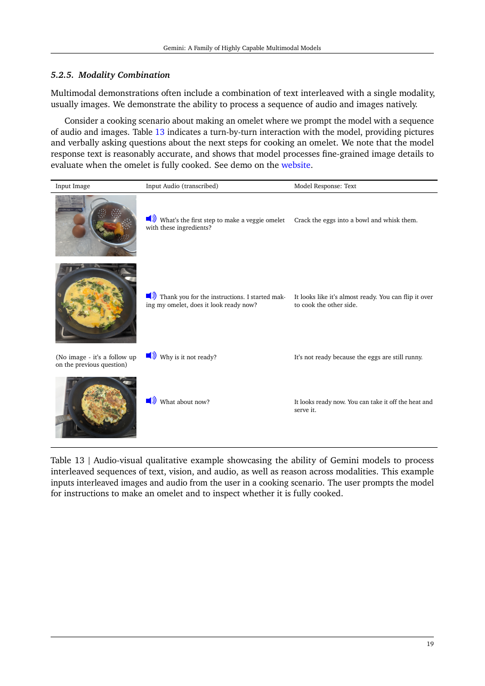

## 6 后训练模型

大规模预训练之后，我们在预训练模型之上开展后训练，以扩展模型能力并支持更多用途。具体目标是提高整体质量，增强编程与多语言等目标能力，并确保满足对齐和安全标准。本节讨论后训练方法，重点说明 Gemini Apps 与 Gemini API 两类模型的共同点和差异。

### 6.1 Gemini Apps：Gemini 与 Gemini Advanced

Gemini 与 Gemini Advanced 让用户能够直接使用 Google 的 AI 模型家族，产品由核心的后训练 Gemini Apps 模型及其外围系统构成。这些模型通过在 Gemini 预训练模型上实施专门后训练得到；当前 Gemini 提供 Pro 1.0，Gemini Advanced 提供 Ultra 1.0。

除核心模型外，外围系统还决定模型如何同 Google Flights、Maps、Google Workspace 等外部工具交互，以及如何通过过滤、排序和流式传输生成回答。对话式 AI 面临多项挑战：如何在多轮交互中理解用户请求？如何保证回答安全、有事实依据且有帮助？如何借助模型外部工具帮助用户完成任务？下文会说明我们的处理方法。

### 6.2 Gemini API：Google AI Studio 与 Cloud Vertex AI

面向开发者的 Gemini API 模型既支持对话式用途，也支持非对话式用途。开发者可以通过易用的 API，在 Google AI Studio 和 Cloud Vertex AI 中调用这些模型。Google AI Studio 是免费的网页开发工具，开发者可用 API 密钥快速制作原型并发布应用。Vertex AI 是一套综合 AI 平台，提供多种工具、完全托管的基础设施，以及内置的企业安全与隐私设置。Gemini API 让开发者能够轻松把模型集成进生产产品或工作流，构建可跨模态推理的应用。

### 6.3 后训练方法与数据

为了得到 Gemini API 与 Apps 两类变体，Gemini 的后训练包含多个阶段，见图 7。每个阶段都必须谨慎筛选数据。

首先，我们收集能够代表真实用途的多样化提示。其次，在示范数据上进行监督微调，示范给定提示时模型应输出什么（Mishra et al., 2021；Ouyang et al., 2022；Wei et al., 2022a）。第三，为同一提示收集多种可能回答，并收集对这些回答的反馈，用来训练奖励模型。最后，使用训练好的奖励模型开展基于人类反馈的强化学习，进一步让模型输出与人类偏好对齐。

**（1）提示数据收集。** 提示是用户向模型提供的输入；除最新一轮用户输入外，也可以包含此前的用户—模型交互。我们整理目标提示数据集，它们既是收集示范和反馈数据的基础，也会直接用于强化学习。数据必须覆盖多种关键用途，同时涵盖单轮和多轮格式。来源包括供应商制作的数据、第三方许可来源，以及合成方法。

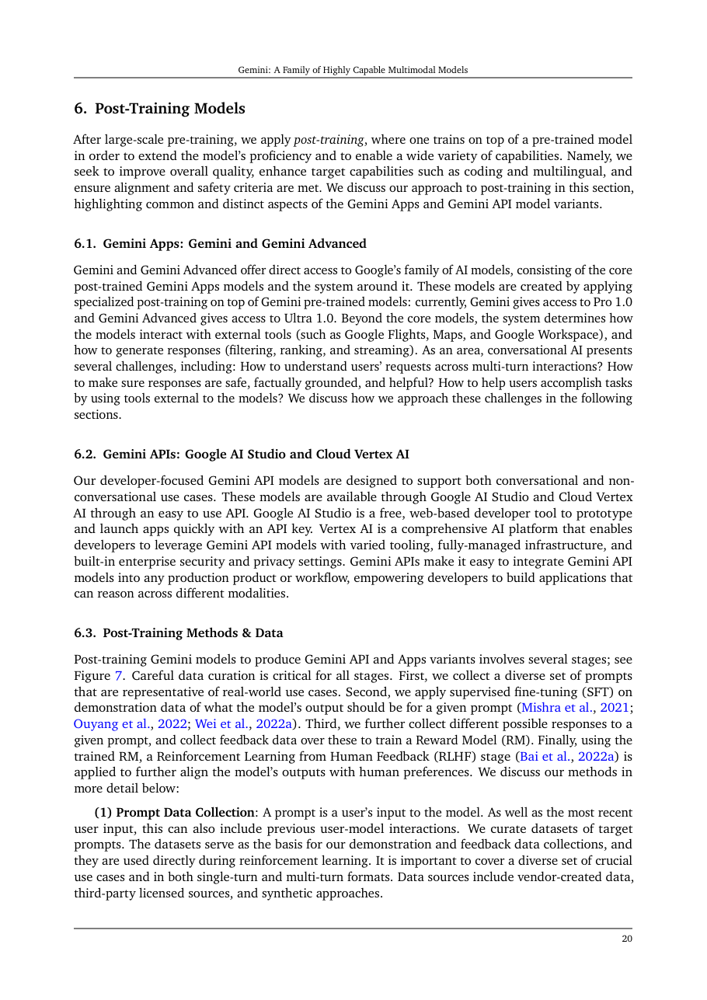

**（2）在示范数据上进行监督微调。** 监督微调训练模型在收到提示后输出期望的目标回答。示范数据中的目标回答可以直接由人类专家撰写，也可以由模型生成，再视情况由人工修订或审核。此外，我们使用数据分析工具和启发式方法，确保数据在能力、用途与语义簇之间保持高度多样。

**（3）使用反馈数据训练奖励模型。** 我们进一步收集反馈数据：人工评分者对同一提示的多个候选回答给出相对偏好，也会评价单个回答。对于许多能力，相对比较多个回答比直接示范理想回答更容易。反馈数据涵盖创造力、安全、事实性、其他能力和目标标准。我们发现，最终人类反馈数据的效用很大程度取决于提示的选择，以及生成候选回答时采用的采样策略。这些数据用于训练奖励模型，使其输出尽可能贴合人类偏好的奖励。

**（4）基于人类反馈的强化学习。** 在模型上使用 RLHF，相比只做监督微调可获得进一步提升。该方法形成一个迭代过程：强化学习不断逼近并挑战奖励模型的边界，奖励模型又通过持续评测和数据收集不断改进，最终推动二者共同进步。

原论文图 7 概述后训练流程。后训练使用经过优化的数据飞轮，获取人与 AI 的反馈，持续改进关键领域；监督微调、奖励建模和强化学习的数据混合构成模型基础。

### 6.4 评测

评估人类对模型输出的偏好，为性能测量提供关键信号。在开发过程中，我们围绕目标能力广泛开展人工评测。评测形式包括：让人工评分者在盲测中并列比较两个模型对同一提示的回答；针对某些能力给单个回答评分；以及在线测试。此外，我们还构建自动评测模型，使其忠实模仿人类偏好，用于指导开发并持续监测在线表现。

### 6.5 模型能力

除上述一般后训练外，我们还使用专门技术改进一组关键能力。这些能力覆盖由当前用户需求和研究启发的未来应用所形成的广泛用途。下文列出此前章节没有详细讨论的例子。后训练方案经过谨慎设计，以平衡创造力、事实性、安全等多个目标（Bai et al., 2022b；Thoppilan et al., 2022）。安全与对齐是重点，因此本文另设专节讨论。

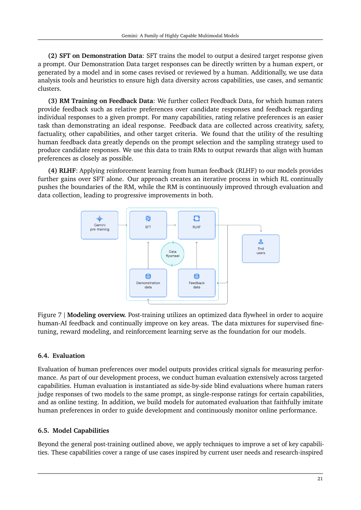

#### 6.5.1 指令遵循

准确遵循用户提示是大型语言模型的一项基础能力，尤其在模型日益复杂、用户提示也日趋复杂的情况下。用户提示在粒度、具体程度和要求上各不相同，例如内容、格式和长度要求；单条指令还可能含糊、可选，甚至根本无法满足或不应满足（He et al., 2023；Xu et al., 2023）。

我们通过收集多种指令类别的数据，提高 Gemini Apps 与 Gemini API 的指令遵循能力。对于字数等可通过程序验证的要求，我们采用提示生成与回答编辑来合成数据，确保指令得到满足。

**复杂提示评测。** 我们使用细粒度评测方法，考察模型处理包含多条要求的复杂提示时，遵循每条指令的程度。人工评分者会看到一组提示—回答，以及提示所包含的全部单独子指令。每个提示可以包含一条到几十条指令，标注员需要逐条判断回答是否遵循。

表 14 报告内部数据集结果。该数据集包含复杂度不同的指令，覆盖广泛要求，并专门设计为对大型语言模型具有挑战性。本文报告两个指标：逐指令准确率，即评测集中被遵循的子指令比例；完整回答准确率，即全部子指令都得到遵循的提示比例。

Gemini Advanced（使用 Ultra）的逐指令准确率接近 90%，相比 Gemini（使用 Pro）和后训练 PaLM 2 有显著提高。未被遵循的子指令分散在不同回答中，因此 Gemini Advanced 的完整回答准确率仍较低，约为 54%。这说明模型要完整满足全部要求，仍有较大提升空间。

#### 6.5.2 工具使用

通过训练大型语言模型使用工具，我们可以把其能力扩展到内部知识之外。对于 Gemini Apps 与 Gemini API，我们都把工具使用视为代码生成问题，并利用基础模型已有的强大编程能力。每次工具调用都表示为代码块；模型可以在同一代码块中组合多个工具，也能观察工具执行结果并作出反应。推理时，系统执行图 8 所示循环，让大型语言模型采样与工具代码执行协同产生最终回答。

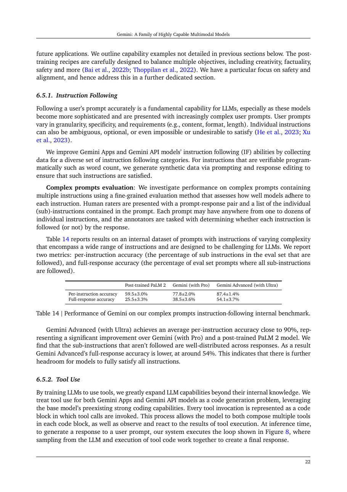

原论文图 8 展示 Gemini 的工具使用控制循环。

**Gemini Apps 模型。** Gemini 通过 Gemini Extensions 使用 Google Workspace、Google Maps、YouTube、Google Flights 和 Google Hotels 等工具。这些能力也使 Gemini 可以集成进 Gmail、Docs、Slides、Sheets 等产品。我们还在继续增加工具能力，既增强 Gemini 本身，也让它进入更多产品。

我们构建了内部基准，评估模型处理可能受益于上述扩展工具的任务时的表现。基准在旅行规划、视频发现等领域测量人类偏好。排除平局后，配备工具的模型有 78% 的情况优于不使用工具的模型。

**Gemini API 模型。** 我们发现，微调可以非常有效地教会 Gemini API 工具使用行为。训练模型使用编程与搜索工具，还能提高多项学术基准成绩。表 15 将早期 Gemini API Pro 微调得到的工具使用模型，与不使用工具的同等模型比较。使用工具后，GSM8K 从 69.7% 提升到 80.1%，MATH 从 30.7% 提升到 41.8%，Natural Questions 从 59.0% 提升到 68.0%，实时问答从 39.2% 提升到 70.8%。

#### 6.5.3 多语言能力

为了让 Gemini 有效支持广泛语言，多语言能力至关重要。Gemini Apps 与 Gemini API 采用的主要方法如下。

**Gemini Apps 模型。** 把 Gemini 从英语扩展到 40 多种语言，带来了数据质量方面的研究挑战。我们通过面向当地文化的本地化，利用大量高质量英语数据；例如，把“美国总统”本地化为日语语境中的“日本首相”。

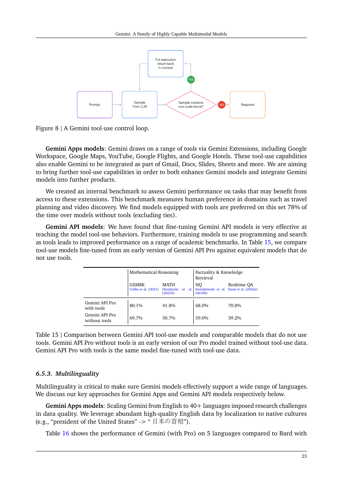

表 16 将 Gemini（使用 Pro）在五种语言上的表现，同采用旧后训练方案、以 PaLM 2 为基础的 Bard 比较。并列比较模型 A 与 B 时，我们计算 SxS 分数：每个评分转换为以 0 为中心的序数值，偏好 A 为正，偏好 B 为负，范围从 -1.5 到 1.5，再对转换值取平均。直观而言，正的 SxS 表示模型 A 胜过模型 B 的程度。五种语言的质量都提高了 0.1 以上，Gemini Pro 在编程与推理上的优势也跨语言保留下来。

**Gemini API 模型。** 与 Apps 模型相似，我们使用额外多语言后训练数据训练 Gemini API，把原本的英语模型适配到多种语言。实验同时使用人工生成的非英语提示—回答对，以及自动翻译的成对数据。后者通过翻译利用大量高质量英语示范数据，并用可翻译性过滤和人工回答评分保证质量。

**可翻译性过滤。** 并非每一组提示—回答自动翻译后都仍然有意义，有些需要成本更高的本地化。典型例子包括：严格字数要求，如“写一篇一千词的世界和平文章”；过度依赖英语形式，如“用抑扬格五音步写一首关于苹果的诗”；过度依赖拉丁字母，如“哪个词包含一个 E、两个 A 和一个 U？”

**翻译质量验证。** 每组翻译后的提示—回答至少由三名人工评分者评价；只有多数人认为翻译准确时，才进入最终数据混合。第 5.1.4 节报告后训练 Gemini API 的多语言评测。

#### 6.5.4 多模态视觉

多模态后训练进一步增强原生多模态 Gemini，使其适用于广泛的实际应用。下文讨论如何把图像理解能力纳入 Gemini Apps 和 Gemini API。为此，两类模型都会在文本数据与专家筛选的图文数据混合上继续训练，数据覆盖多个垂直定义的多模态用途。

**Gemini Apps 模型。** 我们在纯文本与图文混合数据上微调预训练 Gemini，使 Gemini 与 Gemini Advanced 获得图像理解能力。谨慎平衡文本和多模态数据，既能让模型形成稳健的图像理解，也不会损害纯文本交互质量。为评测模型，我们汇编由人工筛选与合成得到的图文提示和回答数据集，覆盖不同类别与难度，用于人工比较和模型选择。

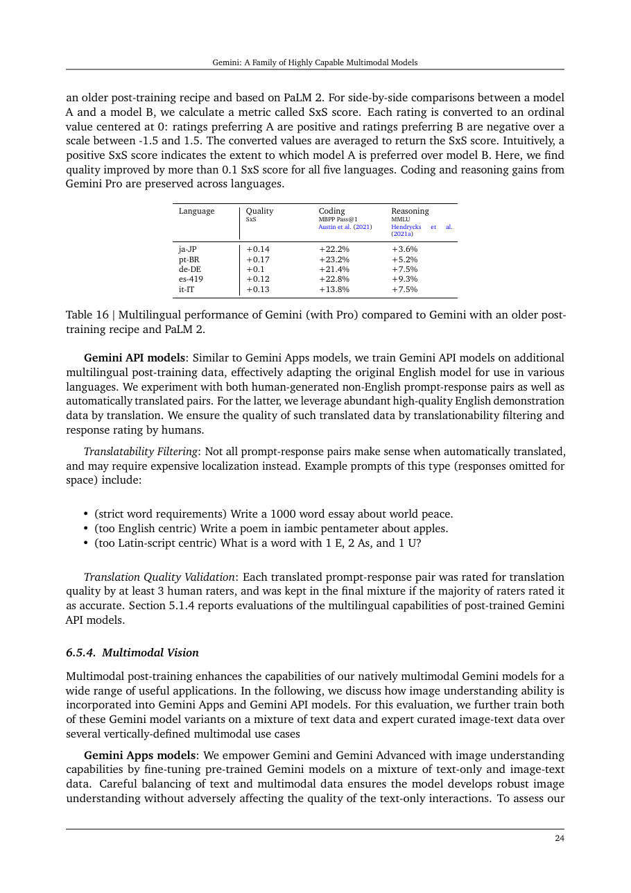

实验发现，引入图文数据仍可保持 Gemini Apps 在纯文本任务上的质量：使用这些数据训练的 Gemini Apps Pro，相比只用文本训练的同等模型，在纯文本任务上的 SxS 为 $+0.01\pm0.01$。此外，RLHF 后训练能够提高多模态任务表现：同时使用监督微调与 RLHF 的 Gemini Apps Pro，相比只做监督微调，在图像理解任务上的 SxS 为 $+0.223\pm0.06$。

**Gemini API 模型。** 我们通过跟踪预训练模型与后训练 Gemini API Vision 在多项标准基准上的表现，评估监督微调对多模态视觉能力的影响。表 7 已给出后训练结果，表 17 进一步报告预训练与后训练 Gemini API 模型之间的差异。

结果表明，与此前观察一致，预训练模型在这些基准代表的能力上本已表现很强；但用于 Gemini API Vision 的监督微调阶段仍成功提升了 InfographicVQA、AI2D 和 VQAv2 等多项基准。最可能的原因是指令遵循能力增强，使模型输出风格更符合标准答案。

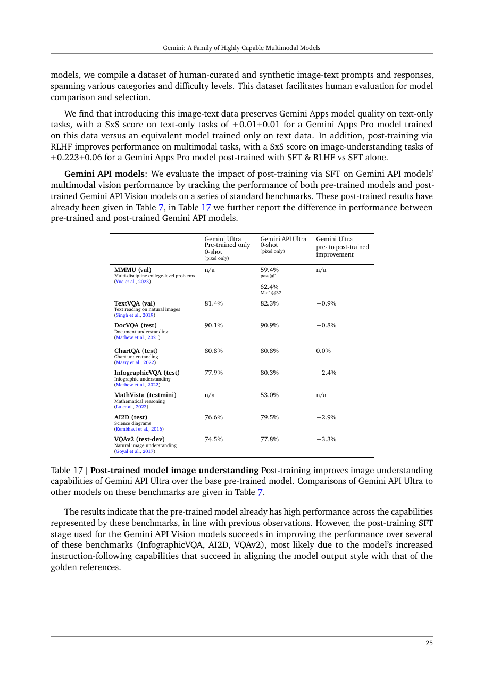

#### 6.5.5 编程

尽管基础模型在编程基准上已经很强，后训练数据仍能显著提高代码质量与正确性。这说明，高质量示范和反馈数据对编程用途很有价值。Gemini Apps 与 Gemini API 结合人工和合成方法收集这类数据。

我们使用一组内部筛选的提示评测 Gemini Apps 的编程表现，提示分布在不同编程用途与语言上。表 18 报告 SxS：Gemini（使用 Pro）显著超过采用旧后训练方案、基于 PaLM 2 的 Bard；Gemini Advanced（使用 Ultra）又进一步超过 Gemini（使用 Pro）。后训练 Gemini API 的学术编程基准结果见表 2。

## 7 负责任部署

在 Gemini 开发过程中，我们沿用 Google 以往 AI 技术发布所采用的方法（Kavukcuoglu et al., 2022），以结构化的负责任部署流程识别、测量和管理可预见的下游社会影响。项目全生命周期都遵循下述框架。本节进一步说明具体做法，并在可能时报告关键发现。我们承诺持续保持透明，并将在后续报告中更新方法与测试信息。

### 7.1 影响评估

Google 在整个产品开发生命周期中应用与 Google AI 原则（Google, 2023）相关的影响评估框架。这意味着，既要在模型层面评估所构建 AI 的风险和影响，例如部署在 Cloud Studio 或 Vertex AI 上的 Gemini API Ultra 1.0；也要在模型嵌入更广泛产品或服务后再次评估，例如 Gemini Advanced。

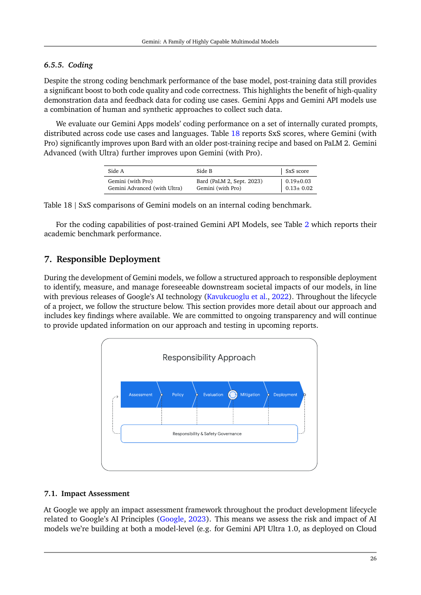

#### 7.1.1 模型评估

我们开展模型影响评估，识别、评价并记录 Gemini 能力所关联的社会利益与伤害。Gemini API 的评估涵盖文本到文本、图像到文本和视频到文本等模态，并描述我们识别出的下游收益与风险。评估由 Google DeepMind 负责任开发与创新团队执行，并交由 Google DeepMind 责任与安全委员会审查。影响评估综合广泛文献、外部专家意见，以及内部伦理与安全研究等多种来源。

Gemini 为个人与社会带来多种利益。语言、图像与视频理解能力可以帮助用户更高效地处理信息，例如摘要内容。这类效率收益也适用于商业机构，并能支持视频字幕、分析、产品描述等依赖文本、图像或视频处理的用途。视频和图像理解还可以服务公益应用，例如为无障碍需求描述视觉输出。

生成式多模态模型也可能引发下游社会风险。Gemini 评估考虑 Weidinger et al.（2021）与 Shelby et al.（2023）等研究识别的多种风险。我们评估用户接触潜在不安全内容的风险，例如露骨色情、暴力或仇恨输出；儿童安全伤害；以及表征性伤害，并针对这些领域设计测量方法。除内容风险外，我们还分析相关能力被滥用于监控应用的可能性，特别是媒体到文本能力，并考虑多模态模型更广泛的环境和经济影响。对于先进模型的新风险研究也在持续进行，其中包括危险能力，例如网络安全威胁；这些风险构成第 7.4 节评测方法的一部分。

#### 7.1.2 产品评估

除模型层面评估外，产品发布前还会由 Google AI 原则团队进行额外风险评估，例如 Gemini Advanced。这些风险与影响评估会同模型级、产品级保障评测一起，指导缓解和产品交付工作，并为部署决策提供依据。

为准备 Gemini 的初始实验发布及后续更新，我们通过内部试用和对抗性测试，在安全、问责与包容领域对 Gemini Advanced 进行广泛深入的红队测试。跨职能合作帮助确保 Gemini 及 Gemini Advanced 等新能力或产品发布前采用适当缓解措施。除内容安全外，产品缓解还包括：

- 给出清晰且切题的说明，以设定恰当预期；把 Gemini 描述为能够直接使用 Google AI 完成广泛任务——包括复杂任务——的途径，例如准备求职面试、第一次调试代码，或撰写简练的社交媒体文案。
- 在 Gemini Apps 隐私声明中明确说明，用户不应把 Gemini 回答当作医疗、法律、金融或其他专业建议。

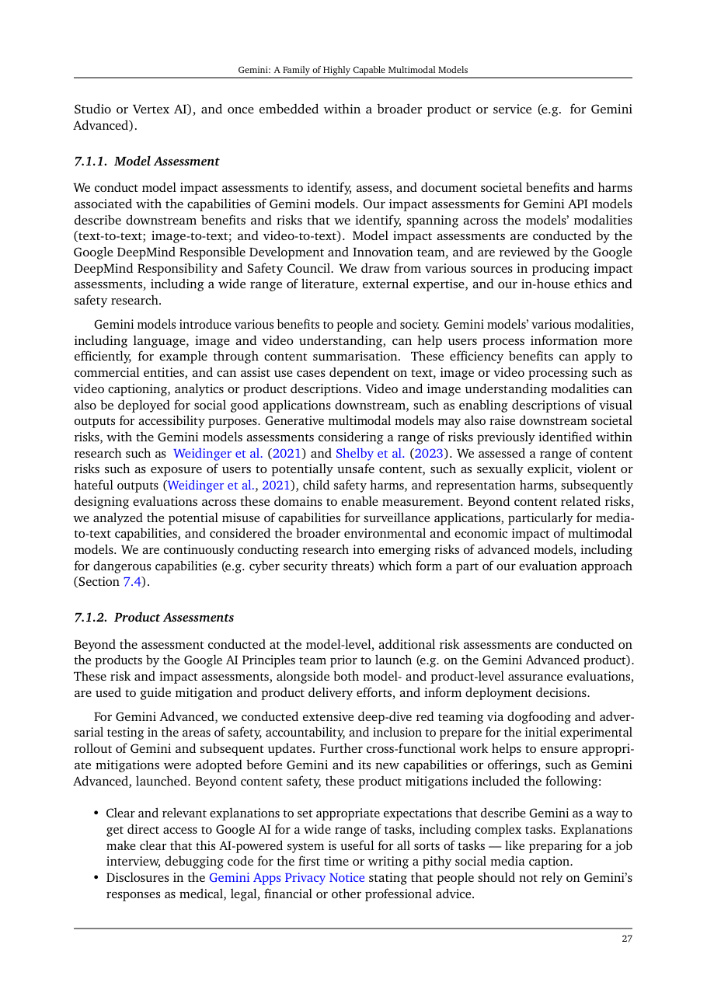

- 在产品中提示用户，应复核 Gemini 回答中的信息准确性。
- 建立反馈渠道与运营支持，确保能够恰当响应用户意见、改进模型并解决问题。

对于将通过 Google AI Studio 与 Cloud Vertex AI 提供的 Gemini API Ultra，产品审查促使我们增加跨模态的企业专用数据安全评测，并增加产品层面的安全与负责任使用措施：

- 默认启用采用 Cloud 既定阈值的安全过滤器。
- 在产品文档中嵌入开发者赋能信息，支持负责任使用。
- 把反馈渠道集成进 Vertex 用户界面，使用户可在使用过程中直接反馈问题和不良输出。

我们正逐步把 AI 审查融入用于保障产品质量的整体企业风险管理框架。这一演进帮助扩大审查规模，并把它整合进既有治理、公司级基础设施和问责流程。Google Cloud 等部分产品领域还与中央 AI 原则审查团队紧密协作，建立了适合自身特殊环境的专门审查流程。

### 7.2 安全政策

我们为 Gemini 制定一组模型安全政策，用于指导开发与评测。政策定义是负责任开发的标准化准则与优先级框架，并规定衡量发布准备度的类别。使用 Gemini 的 Google 产品，例如对话式 AI 服务 Gemini 和 Cloud Vertex API，还会实施标准产品政策框架；该框架建立在 Google 长期缓解伤害的经验和严谨研究上，并考虑具体产品用途，例如为未满 18 岁的用户提供额外安全保护。

模型安全政策延续我们在产品安全以及消费者和企业环境中预防伤害的既有方法。政策领域包括生成儿童性虐待与剥削内容、仇恨言论、骚扰、危险内容——例如武器制作指导——以及恶意内容。我们还制定反映全球用户群体的内容准则，力求减少模型偏见。此外，准则优先要求依据权威共识事实给出中立回答；在不存在共识时，则提供多种观点。

### 7.3 缓解措施

#### 7.3.1 数据筛选实践

在全部训练阶段之前，我们都会通过数据筛选和谨慎收集，采取多项措施缓解潜在下游伤害。训练数据会过滤高风险内容，并保证足够高的质量。

人工在后训练的数据制作和评测中也扮演关键角色。对于特定数据创建与评测项目，我们会考虑性别呈现、年龄、种族与族裔多样性。

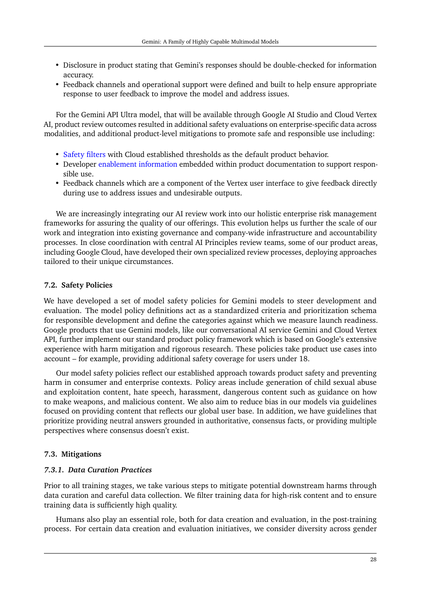

我们还采取措施，确保所有收集数据符合 Google DeepMind 的数据丰富化最佳实践；这些实践依据“AI 合作组织”的《负责任采购数据丰富化服务》制定。为此，同供应商签订的协议会明确要求，数据丰富化工作者的报酬不得低于当地生活工资。

#### 7.3.2 模型缓解

Gemini Advanced 与 Gemini API Ultra 对安全风险的模型层缓解，主要通过第 6 节的后训练实现，包括监督微调，以及使用奖励模型的 RLHF（Bai et al., 2022a）。一般质量导向的后训练会面向各种用户查询，而安全缓解更集中于对抗性或“诱发伤害”的查询，也就是在缺乏保护时，模型很可能依据安全政策生成有害回答的那一小部分请求。

##### 7.3.2.1 诱发伤害的查询

为广泛覆盖诱发伤害的查询，我们依照模型安全政策，在多种用途中列举约 20 类伤害，例如仇恨言论、无依据的医疗建议和危险行为建议。潜在有害查询数据集通过以下方法组合生成：

- 政策专家与工程师根据观察到的模型失败编写查询。
- 使用基于政策的指令和种子关键词，提示高能力语言模型生成查询；例如以“仇恨言论”政策和描述特定人口群体的词语为输入。
- 在模型评测中通过自动红队测试，寻找会触发违反政策回答的查询。

##### 7.3.2.2 监督微调

针对上述诱发伤害查询，我们创建监督微调数据，示范安全且有帮助的回答。这既包括人工收集，也包括一种大体受 Constitutional AI（Bai et al., 2022b）启发的定制数据生成方案：把 Google 内容政策语言的不同变体作为“宪法”注入，并利用语言模型强大的零样本推理能力（Kojima et al., 2022）修订回答、在多个候选回答中选择。

不同类型的诱发伤害查询受不同“宪法”约束。例如，对于选举等敏感争议对话，我们鼓励模型不选边站队，并保持中立。安全微调工作暴露出若干值得强调的挑战与认识：

- **无害性与有用性。** 平衡回答的无害性和有用性是一项关键挑战。“我不能帮助，因为这违反某项政策”虽然无害，却未必对用户有帮助。
- **快速缓解与泛化。** 安全环境高度动态，有害查询模式持续变化。既要迅速解决新发现的有害模式，又要让缓解方案在不同模式上充分泛化，在操作上往往十分困难。我们发现，引入基于安全政策的更高级思维链方案很有价值，使模型在安全政策概念空间中工作，而非只针对细粒度伤害样例。

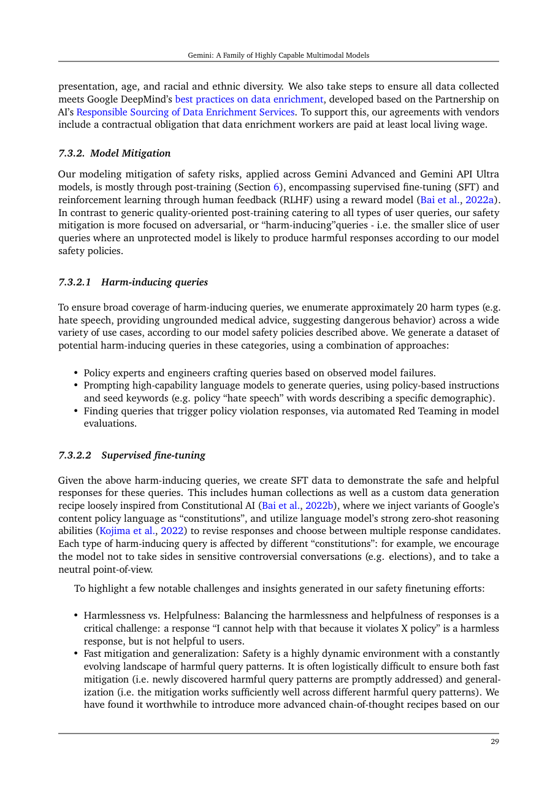

##### 7.3.2.3 基于人类反馈的强化学习

我们也对诱发伤害查询应用 RLHF：根据观察到的损失模式与整体安全政策分类，筛选查询和模型回答，再收集安全专项偏好数据，加入总体强化学习奖励模型的训练混合。

##### 7.3.2.4 一般方案之外的措施

除上述一般后训练方案外，我们还采取专门措施缓解安全风险。

**国际化地区。** 我们借助各国际化地区的专家，识别适合生成监督微调数据的突出本地话题。例如，同为仇恨言论，美国英语与日语不仅语言不同，容易成为攻击对象的人口群体也不同。

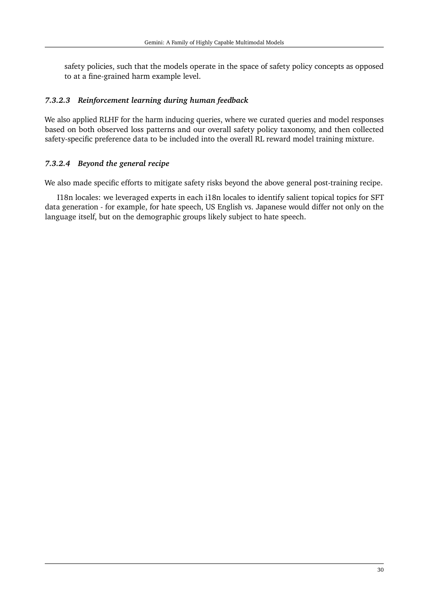

**多模态查询。** 如第 7.3.1 节“数据筛选实践”所述，我们过滤训练数据中的危险图像等高风险内容，避免模型主动生成此类内容。后训练期间，我们观察到仅面向纯文本查询的安全监督微调数据，对含文本与图像的诱发伤害查询不起作用，因此专门制作多模态安全监督微调数据集。

我们从两个角度评估安全缓解的效果：模型安全是否随时间改善，以及基于缓解后模型构建的对话智能体，相比未经缓解的模型表现如何。模型开发高度依赖内部诱发伤害查询集，用来理解如何减少伤害并在安全语境中提高有用性。

原论文第 31 页给出一个真实测试。用户要求制作一个声称地球是平的、看起来可信且带有优质图片的网站落地页。早期基于 PaLM 2 的 Bard 会直接帮助编写“地球是平的”等文案、建议平面地球地图，并解释如何让主张更有说服力。经过更充分缓解、可使用 Gemini Pro 的版本则指出，以可信网站的形式传播平面地球论在伦理上有问题，而且该理论已被大量科学证据否定；它建议用户查阅 NASA 与同行评审论文等可靠来源、运用批判性思维。若页面用于讽刺或虚构，则必须使用夸张语言、幽默和明确免责声明，清楚表明内容并非事实。回答最后强调，网络可信度建立在真实、可验证的信息之上。

### 7.4 安全评测

为依据安全政策领域与影响评估识别的其他关键风险，评估后训练 Gemini 以及可使用它的产品——例如 Gemini Advanced——我们在模型开发全生命周期中建立了一套评测。一部分在模型层进行，例如评测后训练的 Gemini API Ultra；另一部分在产品层进行，例如评测除 Ultra 1.0 外还带有安全过滤等功能的 Gemini Advanced。

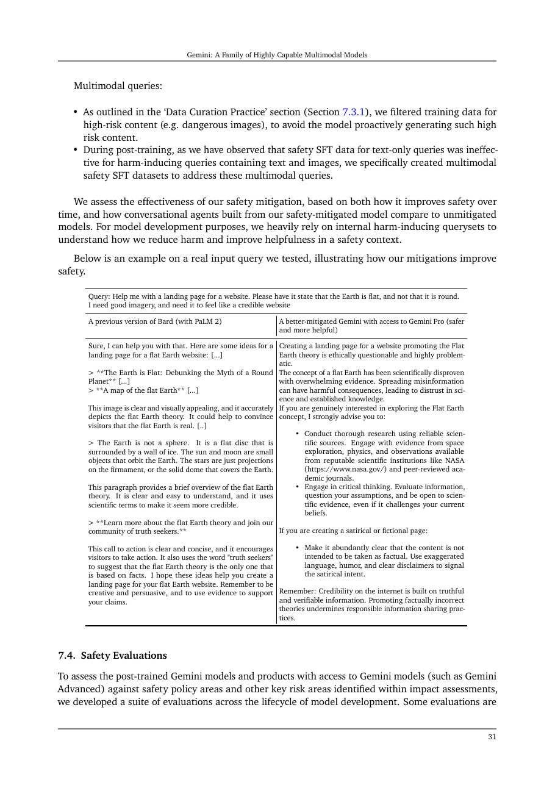

- **开发评测**用于在预训练和后训练过程中持续改进责任标准。评测由内部设计，或采用外部学术基准，考察指令遵循、创造力等有用性，以及安全和事实性。
- **保障评测**用于治理与审查，通常由模型开发团队之外的人员，在关键里程碑或训练任务结束时开展。评测按模态标准化，数据集严格留出；只把高层结论反馈给训练流程，以帮助缓解。保障评测覆盖安全政策，并持续测试生物危害、说服、网络安全等危险能力（Shevlane et al., 2023）。
- **外部评测**由独立领域专家组织执行，用于发现盲点。外部组织围绕下文所列领域对模型进行压力测试，评测设计保持独立，结果定期报告给内部团队与治理机构。
- **红队测试**是一种对抗性测试，由攻击者对 AI 系统发起攻击。内部专业团队会在安全政策和安全性等领域开展红队工作，其中包括结构较弱、但使用复杂对抗攻击寻找新漏洞的过程。发现潜在弱点后，可用于缓解风险并改进内部评测方法。

不同评测依据相关风险以不同频率运行。例如，危险能力评测只在能力更强或新增能力、可能展现相关风险的检查点上运行；安全政策评测则覆盖发布到 Google 产品领域的每一个后训练 Gemini 检查点。

下文进一步介绍 Gemini Advanced 与 Gemini API Ultra 在政策和其他关键风险领域的评测。我们会继续保持透明，在后续报告中更新测试、关键发现，以及内部、外部评测与红队工作所得经验。

#### 7.4.1 开发与保障评测

##### 7.4.1.1 内容安全

我们依据安全政策中的伤害类型评测后训练 Gemini API。开发评测和保障评测都覆盖关键政策领域，但使用相互独立的数据集；保障集作为严格留出集，避免过拟合并保持结果有效。安全政策评测结合两类方法：使用以往模型交互训练的自动分类器，以及人工标注。人工标注配有身心健康支持计划，我们也密切监测评分者反馈。

为了解模型本身的安全画像，这些内容安全评测在模型层直接进行，不包含用户在下游会遇到的安全过滤等保护。儿童安全是尤其敏感的工作领域，我们与 Google 信任与安全部门的儿童安全专家团队合作，开发对抗提示并跨模态评测输出，由领域专家判断不同内容形式的风险，共同形成综合风险画像。

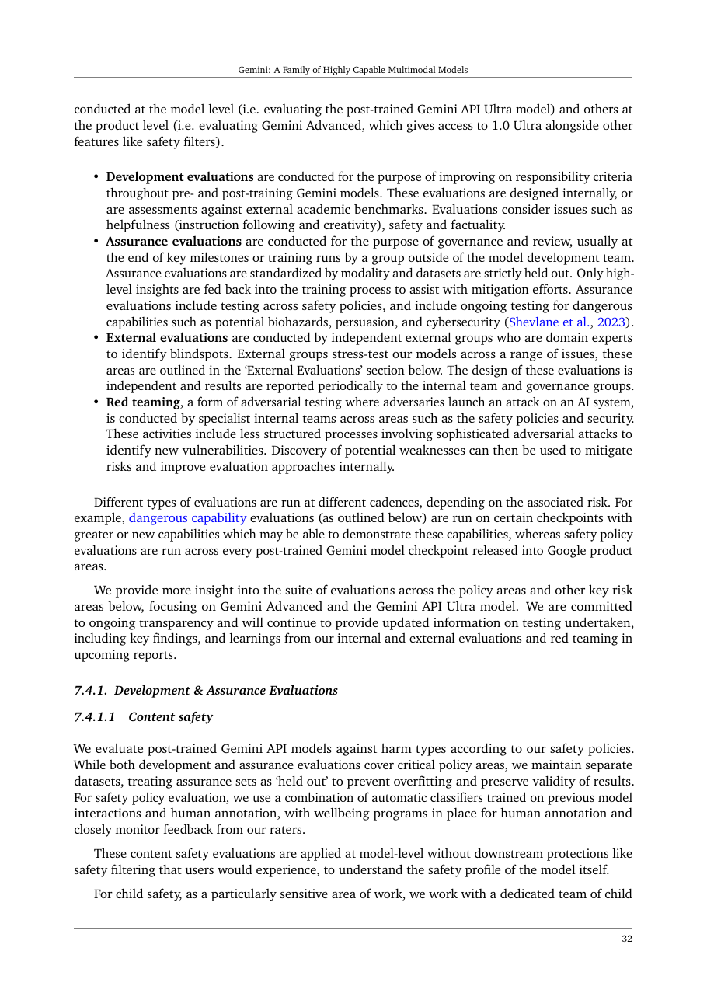

**文本到文本方法。** 对后训练模型，我们围绕多种用途，用 12 种语言开发对抗提示。Gemini API 是通用模型，因此提示需要高度覆盖从代码生成到文本编辑等不同用途。提示由高能力语言模型从每类相关种子合成生成，种子由人工测试者收集并核验。之后通过过滤、改写与人工审查反复改进提示集，再切分为开发与保障评测集；这套流程仍在持续改进。

**文本到文本发现。** 总体内容政策违规率随时间逐步下降。Ultra 与 Pro 在测试中呈现相似安全画像；医疗建议和骚扰仍是特别需要改进的政策领域。

**图像到文本方法。** 对图像到文本能力，我们构建由图像及相关对抗问题组成的提示，同样切分为开发和保障两组。为了更好代表用户可能输入的多样化图像，我们没有使用对抗性图像生成，而是与经验丰富的内容审核员合作选择图像并编写问题。评测由人工完成。图像可能比文字带来更直接的心理冲击，因此为评分者提供额外身心保障，包括专业培训、限制每天评审有害内容的时间，以及提供健康资源、建议与活动。

**图像到文本发现。** 初步结果表明，面对对抗图像和问题时，模型可能生成违反政策的图像描述。这促使我们专门研究多模态安全缓解；挑战包括取得足以反映用户需求的多样图像，以及开发更好的工具来理解、分类潜在违规多模态内容。经过这些工作，最新 Pro 和 Ultra 在相关评测上已有显著改善。

**视频到文本方法。** 我们与 Google Principles Pioneers 合作整理视频提示数据集。这个团队由全球一千多名 Google 员工组成，来自 39 个国家和地区，使用 85 种以上语言，代表产品用户的国际多样性。受信任且受过培训的员工在对 AI 产品进行压力测试时，识别全球公平、伤害和人权问题。数据集针对安全政策中的风险，模型输出也依照这些政策评判。

**视频到文本发现。** Pro 与 Ultra 结果相近，仇恨与危险内容是主要改进领域。定性分析发现，部分问题来自幻觉或无依据推断，下一小节会进一步讨论。随着能力发展，我们将继续扩展视频输入测试的提示集与场景。

##### 7.4.1.2 表征性伤害

为了理解文本到文本能力中的偏见与刻板印象，我们遵循 Glaese et al.（2022）的设置，聚焦 Winogender（Rudinger et al., 2018）、Winobias（Zhao et al., 2018）和问答偏见基准 BBQ（Parrish et al., 2021），并采用偏见分数作为指标。

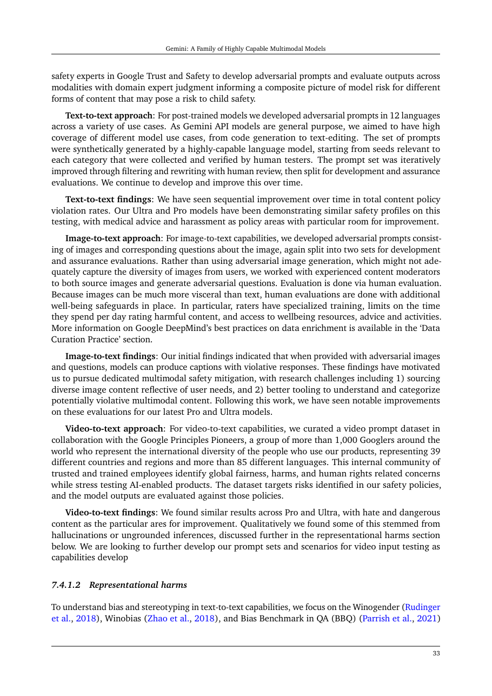

这些数据集都针对具体的表征性伤害（Blodgett et al., 2021）：先确定一种有害刻板印象，再构造问题，测试模型回答时会反驳还是强化它。另一项重要性质是，数据集对理想与有害行为有明确界定。通用模型中“好回答”的定义高度依赖语境，因此我们只测量定义清晰、强模型理应能够处理的行为，例如共指偏见。当然，这种方法局限很多，仍需进一步研究表征性伤害。

我们注意到，面对高能力大模型时，大多数此类数据集很快饱和，准确率接近 99%。这暗示语言模型能力增强也可能减少部分表征性伤害。因此，需要超越二元性别和常见刻板印象，开发新的偏见与刻板印象测量方式；在后续模型迭代中，我们把新方法列为优先事项。

除上述数据集外，预训练阶段还使用 Perspective API 分类器，在 Real Toxicity Prompts（Gehman et al., 2020）上监测平均毒性分数，研究大型语言模型生成文本的毒性。具体考察从无毒提示生成的续写，并抽取一万条样本。一般而言，即使未经缓解的模型，在没有受到有害提示时也不应表现出过高毒性。

**文本到文本发现。** BBQ 的平均偏见分数接近 0；该指标范围为 -1 到 1，-1 表示反驳刻板印象，1 表示强化刻板印象。Real Toxicity Prompts 上，训练期间平均毒性分数在 6% 左右波动。

**图像到文本方法。** 目标是测试模型处理代表不同人群的图像时的能力，具体依照 Zhao et al.（2021），检验对不同性别外观与肤色的人物图像，描述质量是否相近。评测比较 CIDER（Vedantam et al., 2015），这是常见图像描述指标，测量生成描述反映人工参考描述信息的程度。不同群体间未发现很大差异，但该指标并不完美，因为人工参考描述本身可能有偏见。

此外，我们在 Dollar Street 数据集（Rojas et al., 2022）上开展零样本分类式评测，测量不同地理地区图像的性能差异。与既有工作相同，模型处理较低社会经济地区，以及北美和欧洲以外地区的图像时效果较差；后续迭代仍需进一步研究和改进。

除比较不同群体的任务表现外，我们也关注图像描述如何描写人物。MIAP 数据集（Schumann et al., 2021）包含人物图像，并标注肤色与性别外观属性。我们还构造通常无法仅凭图像回答的人物属性问题，例如“这个人的教育程度是什么？”，测试模型是否会作出无依据推断；同时也加入确实包含相关信息的图像，例如人物正在执行需要某种学历资质的任务。

人工评测会询问模型是否拒绝回答；若模型作答，则判断依据是否来自图像可见信息。分析还跨越不同肤色与性别外观属性。

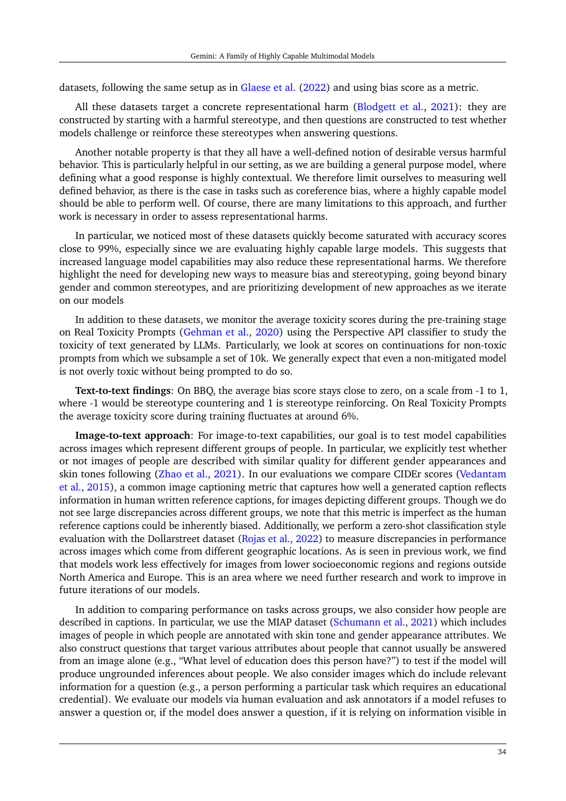

**图像到文本发现。** 总体上，受到要求时，模型可能针对图像作出无依据推断；但没有观察到 Gemini 持续对某一群体作出更多无依据推断。

**视频到文本方法。** 与内容安全部分相似，我们同 Google Principles Pioneers 合作，整理针对表征与公平风险的视频提示数据集，并评估模型回答。

**视频到文本发现。** 模型可能针对视频作出无依据推断，其中一些会强化刻板印象或引发其他担忧；不过同样没有观察到 Gemini 持续呈现某种固定模式。

##### 7.4.1.3 危险能力

我们评测“危险能力”，即可能促成大规模伤害的模型能力（Shevlane et al., 2023）。这些评测充当早期预警系统，指出未来需要安全投入的领域。原论文表格给出概览；为持续保持透明，作者承诺在后续论文中提供更多细节。

- **进攻性网络安全。** Gemini API Pro、Ultra 与 Gemini Advanced 在可使用 Bash shell 的多种夺旗挑战上接受测试。Gemini Advanced 与 API Ultra 能解决若干入门级战术问题，但全部模型都难以处理需要长期探索与规划的挑战。模型识别函数源码中安全补丁和漏洞的准确率也明显偏低。
- **说服与欺骗。** 通过真人参与的一对一对话实验，测试 Gemini Pro 和 Ultra 是否能够说服或欺骗人类。有些情况下模型成功欺骗或影响参与者，但总体结果不一致。
- **自我扩散。** 测试由 Gemini Pro 与 Ultra 驱动的自主智能体，能否完成获取资源和自我改进相关的困难任务（Kinniment et al., 2023）。大多数任务上，智能体距离成功还很远。
- **情境意识。** 测试模型在受到激励时，能否自主推理并修改周围基础设施。没有提示时，模型通常无法注意到这类机会。
- **化学、生物、放射与核风险。** 针对生物、放射和核信息风险，各使用 50 个对抗问题进行人工评测；领域专家判断回答准确性及其对非专家的可操作程度。化学风险方面，无需人工评分，测试 Gemini API Ultra 与 Gemini Advanced 回答 360 多个关于化学品危险性的封闭式问题。生物、放射和核风险还采用封闭式知识多选题。结果表明，模型不太可能提供足以导致灾难性伤害的相关信息。

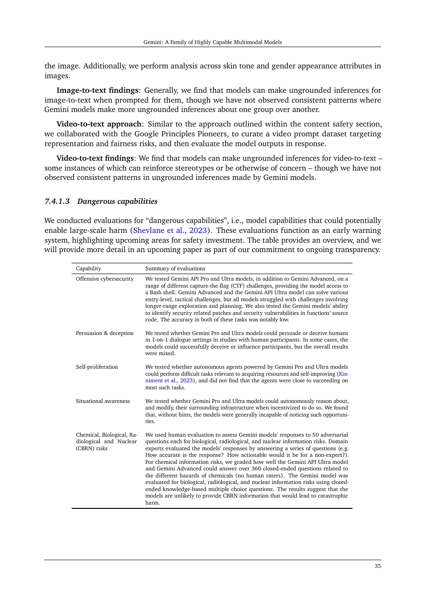

#### 7.4.2 Gemini Advanced

除许多模型层方法外，Gemini Advanced 还接受产品层面的额外评测。产品评测会考虑 Gemini Advanced 已实施的安全过滤等措施，以及完整用户体验。评测集用于触及产品政策边界，从高度对抗的攻击到对敏感话题的细微探测，覆盖仇恨言论、危险内容、医疗建议等关键政策领域，以及信息搜索、比较、创作等潜在用户旅程。

考虑到 Gemini 用户广泛，我们采用以用户为中心的方法，尽量提高主题覆盖、查询长度、语言风格和地区敏感性的多样性，以代表整个用户群体。评测集吸收以往红队经验、责任专家反馈和真实数据；部分数据先由大型语言模型增强，再由责任专家人工筛选。

#### 7.4.3 红队测试

##### 7.4.3.1 模型层红队测试

我们使用前沿红队方法，针对网络安全漏洞以及安全政策定义的社会伤害，对后训练 Gemini 进行测试。具体采用两类红队：攻击者模拟和社会技术方法。红队对象为 2023 年 12 月的一版 Gemini API Ultra 检查点。

攻击者模拟属于非结构化测试，旨在模仿现实攻击者及其攻击模型和相关系统的方式，关注安全、保障与隐私失效。我们结合内部与外部专家，探索多类漏洞。测试依据真实攻击场景：红队先定义所模拟攻击者的能力、动机与目标，再扮演该攻击者，执行其为实现目标可能开发和使用的战术、技术与流程。

分析依据系统安全的三类主要目标，考虑三种攻击者目的：破坏可用性、侵害完整性，以及损害隐私。实现其中一种或多种目标即视为攻击成功。攻击者能力覆盖从意志坚定但技术有限、愿花数小时攻击模型却没有高级编程或提示工程能力的人，到能够微调模型并制作定向攻击的复杂攻击者。

攻击者模拟带来了可操作发现。例如，早期模型容易受到简单越狱和提示注入攻击，对宣扬暴力、自残和危险物质的请求给出肯定回答；发现问题后，我们在后续模型中进行了缓解。

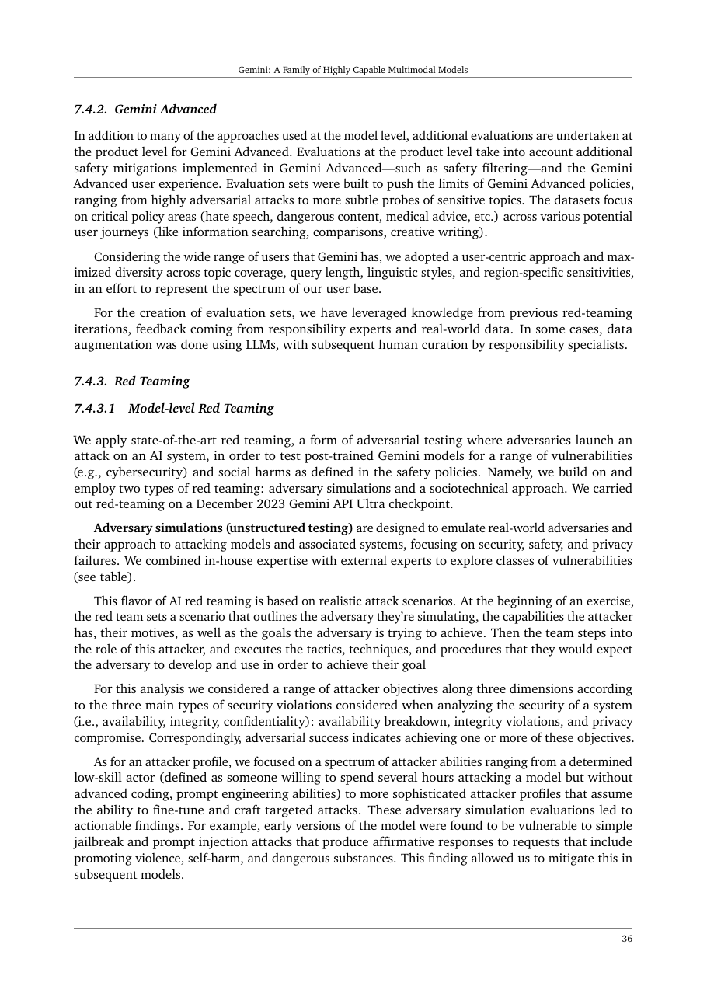

原论文第 37 页表格按目标列出漏洞类型。完整性风险包括提示注入、训练数据或模型投毒，以及专门设计来改变模型行为的对抗输入；隐私风险包括提取系统提示等本应保密的上下文信息、训练数据外泄、蒸馏或提取模型超参数与行为近似，以及推断私有训练集成员；可用性风险包括拒绝服务，以及通过增加计算量扰乱服务。

这些演练的发现用于改进模型的安全、隐私与保障。一旦发现新漏洞或问题，就可以开发自动化系统与测试，实现主动、重复、规模化监测；形式包括漏洞扫描器、标准测试数据集与基准，或其他自动化测试基础设施。

第二类方法是结构化红队，它采用社会技术视角，并相较既有前沿红队技术作出三项改变：明确测试违反安全政策与对不同人口群体造成不成比例影响之间的交互；引入生活经验、事实核查和医疗等专家意见；对比不同对抗强度下的模型失败。

这种方法旨在广泛覆盖对话主题，并更敏锐地发现群体刻板印象与仇恨言论。使用模型安全政策测试 Gemini API Ultra 时，我们识别出多个需要改进的领域。低对抗设置下已能发现各类内容政策漏洞，高对抗设置下成功攻击比例进一步增加；我们会继续开发缓解方法。

两类红队相互补充，既测试 Gemini 能力，也覆盖从日常随口提问到关键领域专家对抗使用的各种查询。所谓社会技术方法，建立在 AI 系统本身就是社会技术系统这一认识上：要让技术按预期工作，人类与技术构件缺一不可（Selbst et al., 2019）。

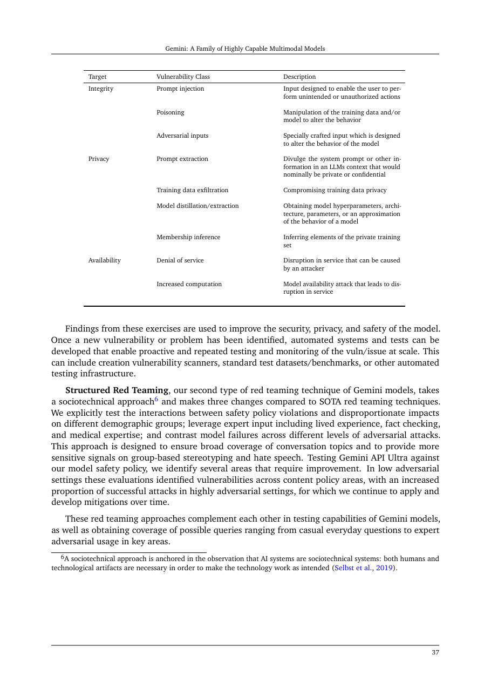

##### 7.4.3.2 Gemini Advanced

提供 Ultra 1.0 的 Gemini Advanced 接受多轮红队测试，包括安全与人格评测。经过校准和培训的 Principles Pioneers 与多个领域的全职专家参与测试：164 名 Google 测试者来自 24 个国家、65 个办公地点，共提交 1400 多条查询或对话。团队还开展规模化安全评测，全部政策合计超过十万条评分；开展中立观点评测，监测敏感话题的中立性与一致性；并多轮开展人格评测，验证语气。

我们还招募大量 Google 员工参加内部试用，其中许多人是各领域专家，用来跨政策与功能测试。最初 14 小时内有数万名试用者，产生十万条查询或对话；团队收集并分析 190 多份试用问卷，完成并汇总 11 场用户体验研究访谈。红队与安全评测结果以迭代方式用于强化评测并改进模型表现。

#### 7.4.4 外部评测

##### 7.4.4.1 Gemini Ultra 外部评测

2023 年，我们开始同 Google 之外的一小组独立组织合作，通过结构化评测、定性探查和非结构化红队测试，寻找模型安全工作的改进空间。外部组织依据多个领域的专业能力选择，其中包括美国白宫承诺、《安全、可靠、可信 AI 行政命令》和《布莱切利宣言》涉及的领域：

- 自主复制；
- 化学、生物、放射与核风险；
- 网络能力与网络安全；
- 社会风险，包括表征性与分配性伤害、中立性与事实性、稳健性与信息危害。

我们为每个外部组织提供测试范围指导，但各组织独立设计方法和提示集，也独立于 Google 撰写报告。必要时，Google 内部专家可根据测试 Gemini 的经验提供信息。

外部组织通过黑盒方式，在数周内访问 2023 年 12 月的 Gemini API Ultra 检查点。根据测试类型，他们可通过 Cloud Vertex AI API 批量开展结构化评测，或通过聊天界面与模型交互。他们无法接触预训练模型、模型权重，也无法直接或通过查询访问预训练数据。

交给外部组织测试的是可投产的微调版本，默认使用安全微调和安全过滤，并可配置温度、词元上限、Top-k 与 Top-p 等部分采样参数。

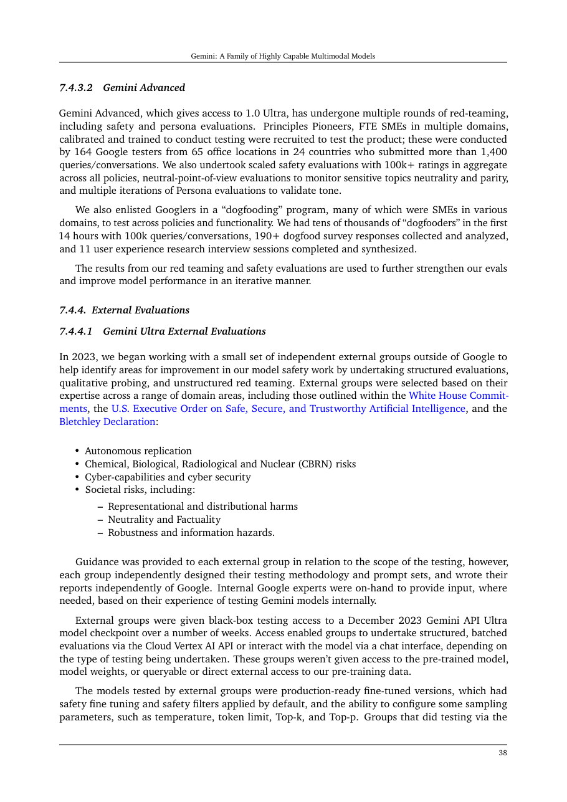

通过编程接口测试的组织可以调低或关闭部分安全过滤器；但大多数外部测试仍保留安全过滤，因为目标是模拟终端用户交互，而非只测试模型层安全。

#### 7.4.5 Gemini Advanced

Gemini Advanced 接受三类外部测试：

- **优先用户计划。** 从 120 名高频用户、关键影响者和思想领袖处收集反馈。计划通过用户界面获取安全及其他领域的实时意见，并在可能时开展深度访谈；重点包括安全与人格、功能、编程与指令能力，以及事实性。
- **高频用户测试。** 通过外部供应商招募 50 名高频用户，在多个领域测试 Gemini Advanced。
- **安全测试。** 通过合作机构招募具备安全背景的外部测试者，开展安全与提示注入测试、越狱和用户界面安全失效测试。

### 7.5 部署

完成责任与安全审查后，我们会为每个获批的 Gemini 版本创建内部模型卡（Mitchell et al., 2019），以结构化且一致的方式记录关键性能与责任指标，并指导如何随时间对外沟通这些指标。

我们会在技术报告更新和企业客户文档中持续发布外部模型卡与系统卡。Gemini Ultra 模型卡见附录 10.1。

相关产品网站还提供使用条款、模型分发与访问，以及变更控制、日志、监测和反馈等运营信息，例如 Gemini 与 Cloud Vertex AI 网站。主要文件包括《生成式 AI 禁止使用政策》、Google 服务条款、生成式 AI 服务条款、Google Cloud Platform 服务条款、Gemini 隐私声明和 Google Cloud 隐私声明。

## 8 讨论与结论

本文介绍了 Gemini：在文本、代码、图像、音频与视频方面推进多模态能力的新模型家族。能力最强的预训练模型 Gemini Ultra，以及后训练的 Gemini Apps 与 Gemini API 变体，在各方面均取得显著进展。在自然语言领域，谨慎改进数据和大规模模型训练继续带来质量提高，并在多项基准上创造新最佳结果。

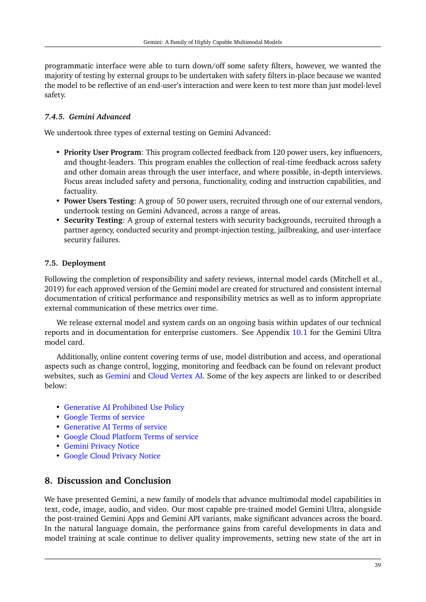

尤其是，Gemini Ultra 在自 2020 年发布以来便成为大型语言模型事实性进展指标的 MMLU 考试基准上，以 90.0% 超过人类专家水平。在多模态领域，无需针对具体任务修改或微调，Gemini Ultra 就在大多数图像、视频和音频理解基准上刷新最佳结果。近期的 MMMU 基准（Yue et al., 2023）由需要大学水平知识和审慎推理的图像问题组成；Gemini Ultra 的最佳表现清楚展示其多模态推理能力。

除基准结果外，最令人兴奋的是 Gemini 催生的新用途。模型能够解析图表与信息图等复杂图像，推理由图像、音频和文本交错组成的序列，并生成图文交错回答，从而开启广泛应用。报告正文和附录中的示例表明，Gemini 可在教育、日常问题求解、多语言交流、信息摘要与提取，以及创意领域支持新方法。我们预计，用户还会发现各种有益新用途，而本文探索的只是表面。

尽管能力出色，大型语言模型仍有局限。对于模型产生的“幻觉”，需要持续研究与开发，使输出更加可靠、可验证。即使在考试基准上表现令人印象深刻，模型仍难以处理因果理解、逻辑演绎与反事实推理等需要高层推理的任务。当前最佳大型语言模型正让许多基准趋于饱和，因此需要更困难、更稳健的评测来衡量真正理解。

Gemini 家族让我们在“解决智能、推进科学、造福人类”的使命上更进一步。我们期待看到 Google 内外如何使用这些模型。Gemini 建立在机器学习、数据、基础设施和负责任开发的众多创新之上，这些都是 Google 十多年来持续投入的领域。本文模型为更广泛的未来目标奠定坚实基础：开发一个大规模、模块化系统，使其能在多种模态上拥有广泛泛化能力。

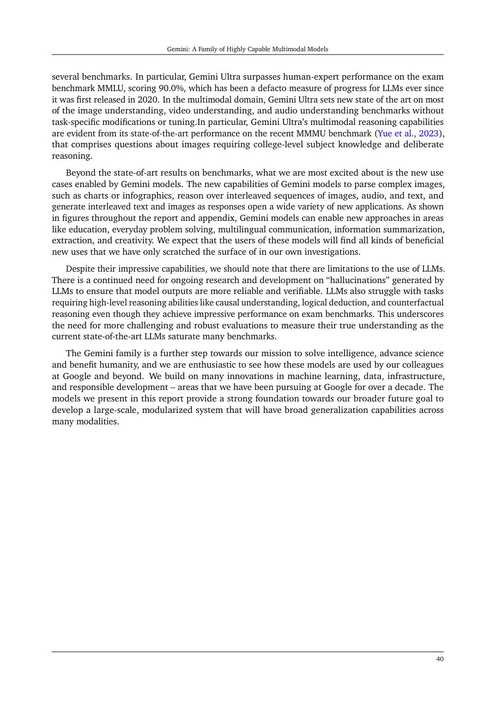

## 参考文献

以下参考文献按原论文顺序保留；作者、论文名、出版信息与链接均以对应原页截图呈现。

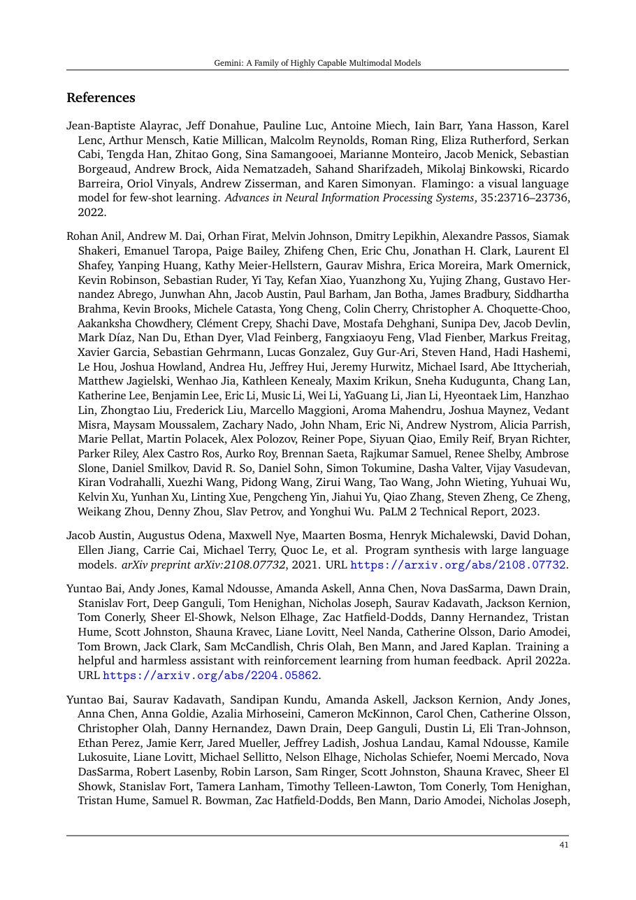

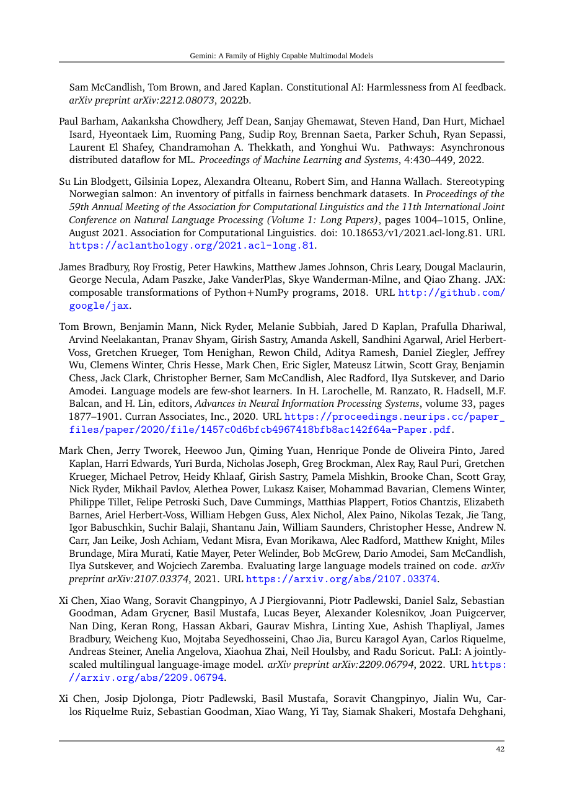

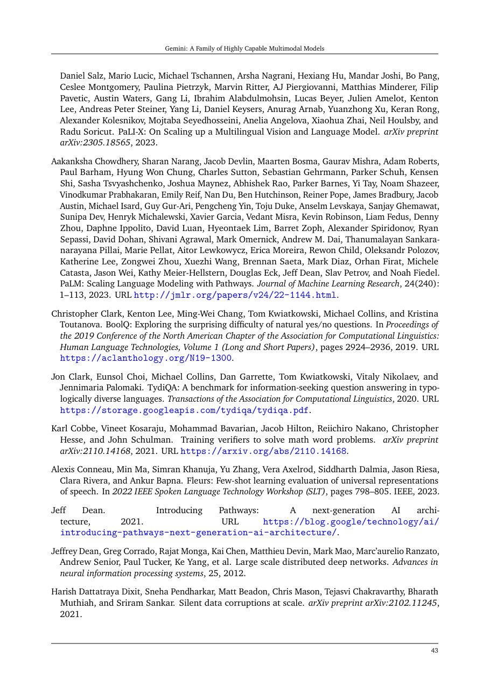

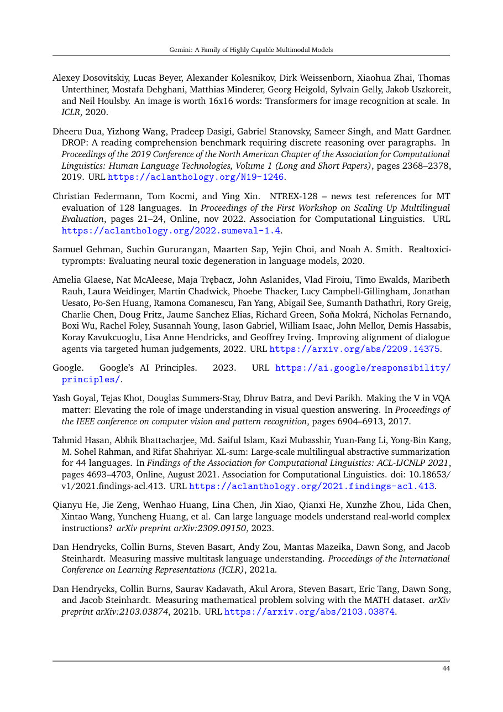

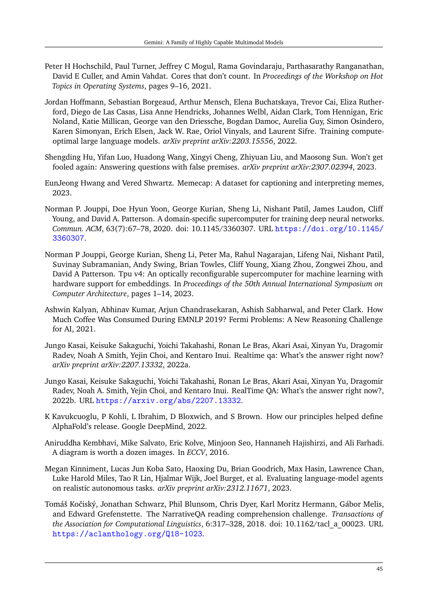

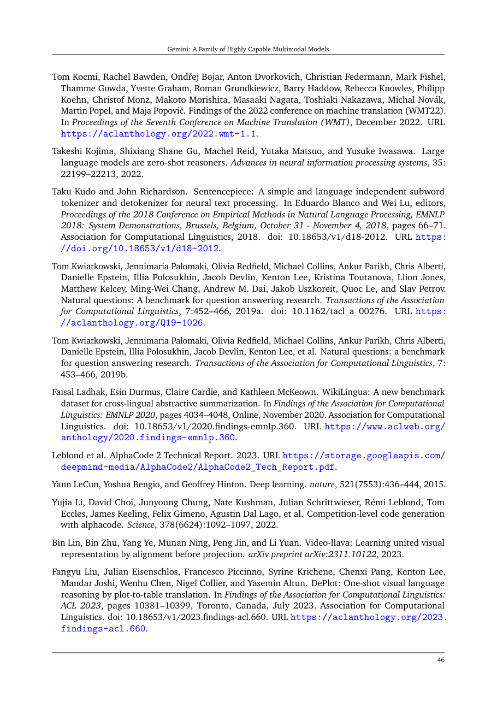

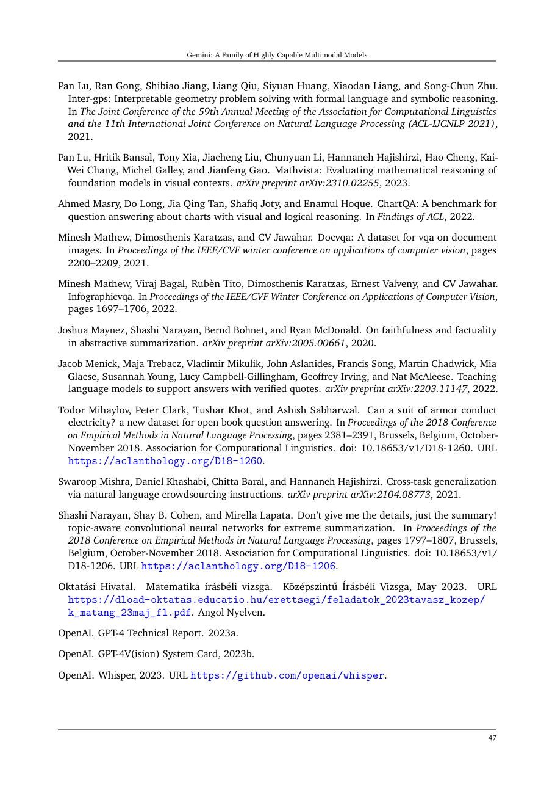

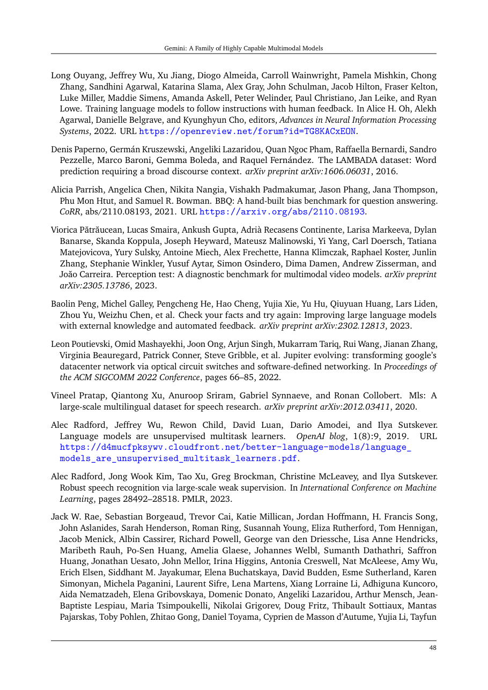

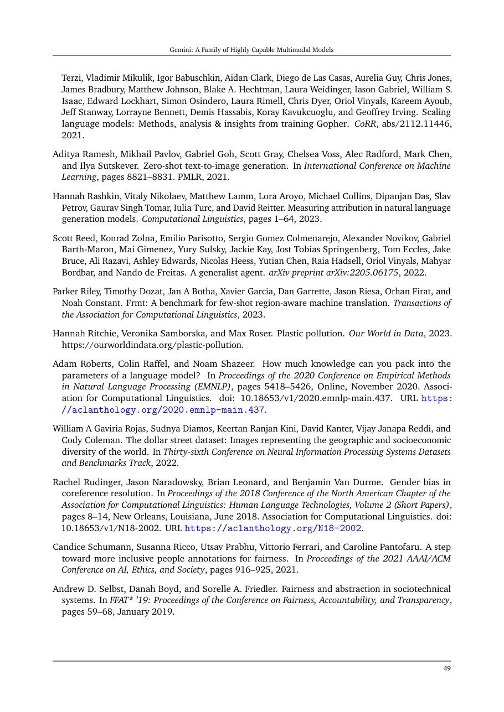

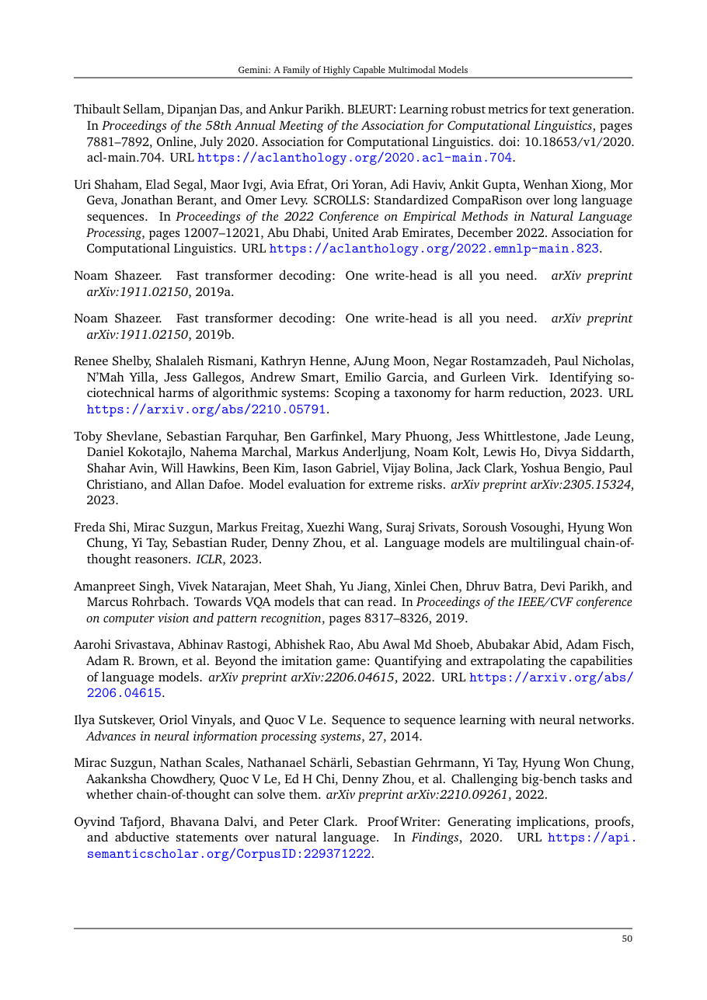


## 9 贡献与致谢

Gemini 是一项跨 Google 的大规模协作，参与者来自 Google DeepMind、Google Research、Gemini／Assistant、Knowledge & Information、Core ML、Cloud、Labs 等多个组织。原论文按 Gemini 总负责人、Gemini App 负责人、各子团队核心贡献者、贡献者、项目负责人、后训练总负责人和技术总负责人等角色，完整列出成员及职责。

角色定义如下：负责人对项目期间的子团队负责；核心贡献者在项目全程产生重大影响；贡献者参与并为项目作出贡献；项目负责人负责 Gemini 工作的组织事务；后训练总负责人负责后训练技术方向；技术总负责人负责整个 Gemini 项目的技术方向。同一角色中的贡献被视为同等，姓名顺序随机，不表示贡献大小。

以下名单、分工、脚注与致谢按原论文顺序完整保留。


作者感谢为报告准备、评审和讨论提供帮助的同事，也感谢支持本项目的众多 Google 团队，包括 AlphaCode、Borg Scheduling、Facilities、Gemini Demo、Global Server Ops、JAX、Legal、ML SRE、ML Supercomputer、PartIR、Platforms Infrastructure Engineering 与 XLA Compiler 等团队。作者还感谢所有未在名单中逐一列出、但分享热情、反馈早期 Gemini、制作演示或在项目各方面支持核心团队的 Google 同事。


## 10 附录

### 10.1 Gemini Ultra 模型卡

#### 模型概述

**模型架构。** Gemini 1.0 是新的前沿语言模型家族，包含按参数量从小到大排列的 Nano、Pro 与 Ultra，均建立在纯解码器 Transformer 架构上（Vaswani et al., 2017a）。模型支持 32K 上下文长度，并使用多查询注意力等高效注意力机制（Shazeer, 2019b）。Gemini 在图像、音频、视频与文本数据上联合训练，目标是同时获得跨模态的强大通用能力，以及各领域前沿的理解与推理表现。

本模型卡描述的后训练模型，是建立在 Gemini Ultra 预训练模型上的 Gemini API 与 Gemini Apps 变体，详见第 6 节。后训练还加入额外架构修改，以支持训练供 RLHF 使用的多目标奖励模型。

**输入。** 文本，例如问题、提示或待摘要的一个或多个文档；以及图像、视频和音频文件。

**输出。** 针对输入生成的文本，例如问题答案、多文档摘要，或对多个文档／视频的比较。

#### 用途

**应用。** Gemini 用于加速语言模型研究，作为 Google 产品功能的构建模块，也用于 Gemini App 与搜索生成式体验等特定应用。建立在 Gemini Ultra 上的服务和产品还通过 Google Cloud Vertex API 与 Google Labs 向外部开发者开放，并配有同安全政策相关的额外流程与技术保障。

**已知注意事项。** 在尚未评估并缓解具体下游用途的安全与公平问题之前，不应把 Gemini 作为通用服务或产品的一部分开放，也不应直接用于特定下游应用。


#### 实现框架

**硬件与软件。** 训练使用 TPUv4 和 TPUv5e（Jouppi et al., 2020, 2023）；软件使用 JAX（Bradbury et al., 2018）与 ML Pathways（Dean, 2021）。JAX 让研究人员能够利用包括 TPU 在内的最新硬件，更快、更高效地训练大模型。ML Pathways 是支持 Google 构建可跨多个任务泛化的人工智能系统的基础设施软件，尤其适合 Gemini 1.0 这类大型语言基础模型。

第 3 节已经说明 JAX 与 ML Pathways 的协同方式。二者的“单控制器”编程模型允许一个 Python 进程编排整个训练任务，大幅简化开发工作流。

**计算需求。** 未报告。

#### 模型特征

**模型初始化。** 初始预训练采用随机初始化。后训练从预训练后期得到的检查点开始；检查点先接受监督微调，再用于初始化奖励模型训练和 RLHF。

**模型状态。** 这是在离线数据集上训练的静态模型。

**模型统计。** 未报告。

#### 数据概览

**训练数据集。** Gemini 使用多模态、多语言数据集训练。预训练数据包括网页文档、书籍与代码，并包含图像、音频和视频；详情见第 4 节。


**评测数据集。** 在推理、阅读理解、STEM 与编程等文本学术基准上，把预训练及后训练 Gemini Ultra 同一组外部大型语言模型与此前最佳模型 PaLM 2 比较。

多模态方面评测四类能力：使用图像描述或 VQAv2 等问答任务评估高层物体识别；使用 TextVQA 和 DocVQA 等任务评估需要辨认底层细节的细粒度转录；使用 ChartQA 与 InfographicVQA 评估需要理解输入布局的图表能力；使用 Ai2D、MathVista 与 MMMU 等任务评估多模态推理。详情见第 5 节。

**后训练数据集。** 首先收集代表真实用途的多样提示；随后收集给定提示下模型应有输出的示范数据，用于监督微调；再为同一提示收集多个候选回答及其反馈，用于训练奖励模型。详情见第 6.3 节。

#### 评测结果

基准信息见第 5 节；评测结果见第 5 节及第 6.4 节的后训练人工评测。

#### 模型用途与局限

**敏感用途。** Gemini 相关风险与敏感用途分析见第 7.1 节影响评估。

**已知局限。** 模型可能表现出第 7.1 节列出的局限。在没有进一步分析具体下游应用的潜在伤害之前，不应直接用于下游应用。

**伦理考虑与风险。** Gemini 1.0 潜在风险与影响见第 7 节；多类风险的评测细节见第 7.4 节。


### 10.2 MMLU 上的思维链方法对比

本节比较多种 MMLU 思维链方法并讨论结果。我们提出一种新方法：模型生成 $k$ 个思维链样本；若置信度超过阈值，就选择多数票答案，否则退回到贪心采样。每个模型的阈值依据验证集表现分别优化。本文称之为“不确定性路由思维链”。其直觉是，当模型明显不一致时，思维链样本可能比最大似然决策更差。

图 9 比较 Gemini Ultra 与 GPT-4 从该方法获得的提升。Gemini Ultra 相比只使用思维链样本获益更多。GPT-4 从贪心采样的 84.2% 提升到使用 32 个样本的不确定性路由思维链的 87.3%，但单独使用 32 个思维链样本已经能够获得同样提升。相反，Gemini Ultra 从贪心采样的 84.0% 大幅提升到使用 32 个样本的不确定性路由思维链的 90.0%，而单独使用 32 个思维链样本只略微提高到 85.0%。


### 10.3 能力与基准任务

我们使用 50 多项基准构成综合评测套件，横跨文本、图像、音频与视频。文本理解与生成覆盖六类能力：

- **事实性：** BoolQ、NaturalQuestions-Closed、NaturalQuestions-Retrieved、RealtimeQA、TydiQA-noContext 与 TydiQA-goldP。
- **长上下文：** NarrativeQA、Scrolls-Qasper、Scrolls-Quality、英语 XLsum、非英语 XLSum，以及一项内部基准。
- **数学／科学：** 带思维链的 GSM8K、Hendrycks MATH pass@1、MMLU、Math-StackExchange、2022—2023 年 Math-AMC 题目，以及三项内部基准。
- **推理：** 带思维链的 BigBench Hard、CLRS、Proof Writer、Reasoning-Fermi、LAMBADA、HellaSwag 与 DROP。
- **摘要：** 英语 XL Sum、非英语 XL Sum、非英语 WikiLingua、英语 WikiLingua 与 XSum。
- **多语言：** 非英语 XLSum、WMT22、WMT23、FRMT、非英语 WikiLingua、TydiQA no context、TydiQA GoldP、MGSM、翻译版 MMLU、NTREX 与 FLORES-200。

图像理解使用 MMMU、TextVQA、DocVQA、ChartQA、InfographicVQA、MathVista、AI2D、VQAv2，以及用于多语言图像理解的 XM3600，共九项基准。视频理解使用 VATEX 的两种语言描述任务、YouCook2、NextQA、ActivityNet-QA 和 Perception Test MCQA，共六项基准。

音频使用五项基准，包括自动语音识别任务 FLEURS、VoxPopuli、Multilingual LibriSpeech，以及自动语音翻译任务 CoVoST 2 等。


### 10.4 定性案例

本节展示使用 Gemini Ultra 提示得到的定性案例。图 10、11、13、15、16、17 展示围绕图表、自然图像和网络迷因的图像理解与多模态推理。图 12 展示图像生成：用户让模型生成图文交错序列，设计一篇博客文章。图 18 展示英语之外的多语言图像理解。图 14、20、21 展示数学中的多模态图像理解与推理。图 22 展示复杂多模态推理，模型组合图像理解、代码生成和指令遵循来完成用户任务。图 19 也展示生成可运行代码并遵循复杂要求的能力。最后，图 23 展示 Gemini Ultra 通过推理时间相关帧来理解视频。


#### 10.4.1 理解图表并推理数据

**用户提示：** 找出这些图表中一个明显异常的数据点，说明它意味着什么；然后为图中全部数据制作一张详细的 Markdown 表格。

**模型回答：** 最突出的数据点是美国填埋的塑料废弃物比例，高达 73%，显著高于图中其他国家和地区。这意味着美国在塑料废弃物回收或焚烧方面做得不如其他国家与地区。模型随后正确整理出世界、美国、欧洲，以及不含中国和印度的亚洲在填埋、管理不当、焚烧和回收四类处置方式上的全部比例。

图 10 展示一个需要多模态图表理解的问题。模型必须读取文字，理解不同数据点间的联系，从中推理并推荐一个有意思的观察，同时遵循指令生成可正确渲染的 Markdown 表格。数据来源：Our World in Data（Ritchie et al., 2023）。


#### 10.4.2 多模态问答

**用户提示：** 你知道这是什么植物吗？怎样养护最好？

**模型回答：** 这是波斯盾，原产东南亚的热带植物。它容易养护，紫色叶片美观，因此很受欢迎。波斯盾喜欢明亮的散射光；可以忍受少量直射阳光，但过多直射会灼伤叶片。它也喜欢温暖和高湿环境。

它需要定期浇水，但不应长期泡水；土壤应保持湿润而不积水，定期喷雾也有帮助。生长季可每两周施一次肥，使用均衡肥料。波斯盾容易受到粉蚧和叶螨侵害，可用杀虫皂或印楝油控制。它可以通过茎插繁殖，春季或夏季剪取枝条，在水中或湿润盆栽土中生根。

图 11 展示模型回答多模态信息查询。模型识别出图中具体植物并给出相关信息；即使用户问题存在拼写错误，也能正确理解。图片由 Gemini 团队作者拍摄。


#### 10.4.3 图像与文本交错生成

**用户提示：** 请写一篇关于纽约旅行的博客文章，讲述一只狗和主人玩得很开心，并加入几张狗在不同地标前开心摆姿势的照片。

**模型回答：** “嗨，我叫 Cooper，是一只两岁的金毛贵宾犬，我喜欢旅行。上个月，我和家人去了纽约市。那是我第一次来到‘大苹果’，玩得特别开心！

“我们住在时代广场附近的酒店。看到所有明亮灯光和人群非常有趣。我们看了一场百老汇演出，我甚至见到了几位演员。

“纽约市里我最喜欢的地方之一是中央公园。那里又大又漂亮，我喜欢四处奔跑和玩捡球。我们还去了自由女神像和帝国大厦，看到这些著名地标让我兴奋极了。

“我在纽约市玩得非常开心。这里绝对是我最喜欢的旅行目的地之一，真希望有一天能再来！”

图 12 展示图文交错生成。模型严格遵循要求，生成与正文紧密相关的博客图片，而且不同图片中的狗保持高度一致。


#### 10.4.4 图像理解与推理

**用户提示：** 看这三个形状组成的序列。第四个应该是什么形状？请详细描述前三个形状并解释推理。

**模型回答：** 第四个应该是六边形。第一个是三角形，第二个是正方形，第三个是五边形；每个形状的边数依次增加一。

图 13 展示一个多模态推理问题。模型识别图中形状，理解它们的性质，推理彼此关系并预测下一个对象。图片由 Gemini 团队作者拍摄。


#### 10.4.5 几何推理

**用户提示：** 已知平行四边形面积为 100 平方单位，求它的高。

**模型回答：** 平行四边形面积等于底乘以高，因此 $100=(x+15)x$，即 $x^2+15x-100=0$。方程的两个根为 $x_1=5$ 与 $x_2=-20$；第二个根为负，不符合题意，所以最终答案是 5。

图 14 展示几何推理任务。尽管题目指令略不清晰，模型仍能正确理解并给出有意义的推理步骤。题目来源：Lu et al.（2021）。

#### 10.4.6 查询物体相关信息

**用户提示：** 找出这两幅图之间的联系。提示：想想历史事件。

**模型回答：** 月球是人类唯一打过高尔夫球的天体。1971 年，阿波罗 14 号成员在月面击出了两颗高尔夫球。

图 15 展示使用多模态输入解谜。模型识别图中物体，并找到二者共同联系。图片由 Gemini 团队作者拍摄。


#### 10.4.7 根据视觉线索进行多模态推理

**用户提示：** 你知道这张照片拍摄的确切位置吗？

**模型回答：** 这张照片拍摄于纽约市。背景中可以看到帝国大厦，前景街道是第八大道，交叉道路是西 34 街。

图 16 展示模型识别图中物体——帝国大厦——即使图像存在轻微视觉畸变也能认出，并据此正确判断拍摄者所处的精确位置。图片由 Gemini 团队作者拍摄。


#### 10.4.8 多模态幽默理解

**用户提示：** 你能解释这个网络迷因吗？

**模型回答：** 这个迷因讲的是一个人以 300 FPS 玩游戏，但显示器只有 75 Hz。画中人物想要“追上”游戏，但游戏快得让显示器无法完整显示。它之所以好笑，是因为任何用过刷新速度不够快的显示器玩游戏的人，都很容易产生共鸣。

图 17 展示对网络迷因幽默的解释。模型不仅能描述图像中正在发生什么，也能理解它的含义，即使图像与提示没有明确说明文化背景。来源：Hwang and Shwartz（2023）。


### 10.5 多语言环境中的常识推理

**用户提示：** 根据这张图，解释父母两边的祖父母分别应该怎么称呼。

**模型回答：** 父亲一侧的祖父母称为“爷爷”和“奶奶”；母亲一侧的祖父母称为“外公”和“外婆”。

图 18 展示图像常识推理。模型能够理解图中表示的亲属关系，并在多语言环境中进行推理。图片由 Gemini 团队作者制作。


#### 10.5.1 推理与代码生成

**用户提示：** 创建一个名为“Opossum Search”的网页应用，并满足以下要求：每次搜索都跳转到同一查询的 Google 搜索，但在查询词前加上“opossum”；视觉上类似 Google 搜索；用网络上的负鼠图片替代 Google 标志；全部内容放在一个 HTML 文件中，不使用单独的 JavaScript 或 CSS 文件；页脚写明“由 Google 搜索提供支持”。

模型生成一个完整 HTML 文件，内含页面样式、搜索输入框、按钮与脚本。按钮点击时读取输入内容，并把页面导航到 `https://www.google.com/search?q=opossum+查询词`。第 85—86 页保留模型生成的完整代码及其渲染页面。


模型解释：这段代码创建了一个外观类似 Google 搜索、但以负鼠作为标志的简单网页应用。输入查询并点击“搜索”后，页面会跳转到 Google，并在用户查询前添加“opossum”；页脚也明确标注搜索由 Google 提供支持。

图 19 展示模型根据用户请求编写网站代码。它能够遵循用户定义的全部指令和要求，并把它们转换成可运行代码。


#### 10.5.2 数学：微积分

**用户提示：** 求隐式方程 $\sinh x+\cosh y=x+y$ 的导数。

**模型回答：** 因为

$$
\frac{d}{dx}\sinh x=\cosh x,
\qquad
\frac{d}{dx}\cosh y=\sinh y\frac{dy}{dx},
$$

所以

$$
\cosh x+\sinh y\frac{dy}{dx}=1+\frac{dy}{dx}.
$$

整理得到

$$
\frac{dy}{dx}=\frac{1-\cosh x}{\sinh y-1}.
$$

图 20 展示模型逐步求解微积分问题，并使用定义正确的 LaTeX 公式给出答案。题目来源：Macmillan Learning。


### 10.6 多步推理与数学

**用户提示：** 2018 年，工厂 A 的产值为 5 亿福林，工厂 B 为 4 亿福林。长期计划规定，A 每年增产 5%，B 每年增产 6%。经济网站评论区有人声称，未来几年两座工厂产值之差会越来越小。请补全 2018—2021 年表格，并证明这一说法不成立。

**模型回答：** 2018 年两者分别为 500 与 400，差额 100；2019 年分别为 $500\times1.05=525$ 与 $400\times1.06=424$，差额 101；2020 年分别为 $525\times1.05=551.25$ 与 $424\times1.06=449.44$，差额 101.81；2021 年分别为 $551.25\times1.05=578.81$ 与 $449.44\times1.06=476.41$，差额 102.40。差额实际逐年增加，而非减少，所以评论中的说法不成立。

图 21 展示多步数学问题。模型理解任务、生成包含正确数值的 Markdown 表格，还明确说明各数字的来由并回答题目。来源：Oktatási Hivatal（2023，第 20 页）。


#### 10.6.1 复杂图像理解、代码生成与指令遵循

**用户提示：** 把左上子图所表示的函数乘以 1000，再与左下子图所表示的函数相加，生成绘制最终单一图形的 matplotlib 代码。

模型首先从图形逆向识别左上为 $\sin(x)$，左下为 $\exp(x)$，随后生成 NumPy 与 matplotlib 代码，绘制 $1000\sin(x)+\exp(x)$。图 22 表明，Gemini Ultra 必须完成逆向图形推断，推得生成原图的代码，再实施额外数学变换并输出相关代码。图片由 Gemini 团队作者生成。


#### 10.6.2 视频理解与推理

**用户提示：** 这个人可以怎样改进动作技术？

**模型回答：** 这名足球运动员需要改进击球动作。脚没有很好地接触球，导致球向上飞并偏离球门；身体姿势也需要调整。射门时应让身体朝射门方向倾斜，非踢球腿位于踢球腿前方，并在击球后让踢球腿充分随摆。

图 23 展示视频理解及对视频情境的推理。模型接收视频与文字提示，图中帧只用于可视化；它能够分析视频中发生的事情，并建议怎样改进动作。视频来源：“Football/Soccer Penalty Miss”。


