# Mamba：基于选择性状态空间的线性时间序列建模

**作者：** Albert Gu、Tri Dao（按名字字母顺序排列）  
**机构：** 卡内基梅隆大学机器学习系、普林斯顿大学计算机科学系  
**论文版本：** arXiv:2312.00752v2，2024 年 5 月 31 日  
**首次公开：** 2023 年 12 月 1 日  
**译文说明：** 本译文按原论文内容顺序逐段编排，标题、正文和图表说明均译为中文；模型名、数据集名、技术缩写与公式符号保留通行写法。原论文的图、表、算法、曲线和参考文献以对应整页截图保留，每张截图均处于其原有内容位置。

## 摘要

如今为深度学习中大多数令人振奋的应用提供动力的基础模型，几乎无一例外都建立在 Transformer 架构及其核心注意力模块之上。为解决 Transformer 处理长序列时的计算低效问题，研究者已经开发出许多次二次时间架构，例如线性注意力、门控卷积与循环模型，以及结构化状态空间模型（SSM）；然而，在语言等重要模态上，这些架构的表现始终不及注意力。我们发现，这类模型的一个关键弱点，是缺乏基于内容进行推理的能力，并据此作出多项改进。

首先，只需让 SSM 参数成为输入的函数，就能缓解模型面对离散模态时的弱点，使模型能够依据当前词元，沿序列长度维度选择性地传播或遗忘信息。其次，尽管这一改变使模型无法继续使用高效卷积，我们仍为循环模式设计了一种硬件感知并行算法。我们把这些选择性 SSM 整合进一种简化的端到端神经网络架构；该架构既没有注意力，甚至也没有 MLP 块，我们将其称为 Mamba。

Mamba 推理速度很快，吞吐量可达到 Transformer 的 5 倍，并且计算量随序列长度线性扩展；在真实数据上，其性能能够随着序列长度一直增加到百万级而继续提高。作为一种通用序列模型骨干，Mamba 在语言、音频和基因组等多种模态上取得了当时最佳性能。在语言建模中，Mamba-3B 不仅超过同等规模的 Transformer，而且在预训练和下游评估中都能媲美参数量为其两倍的 Transformer。

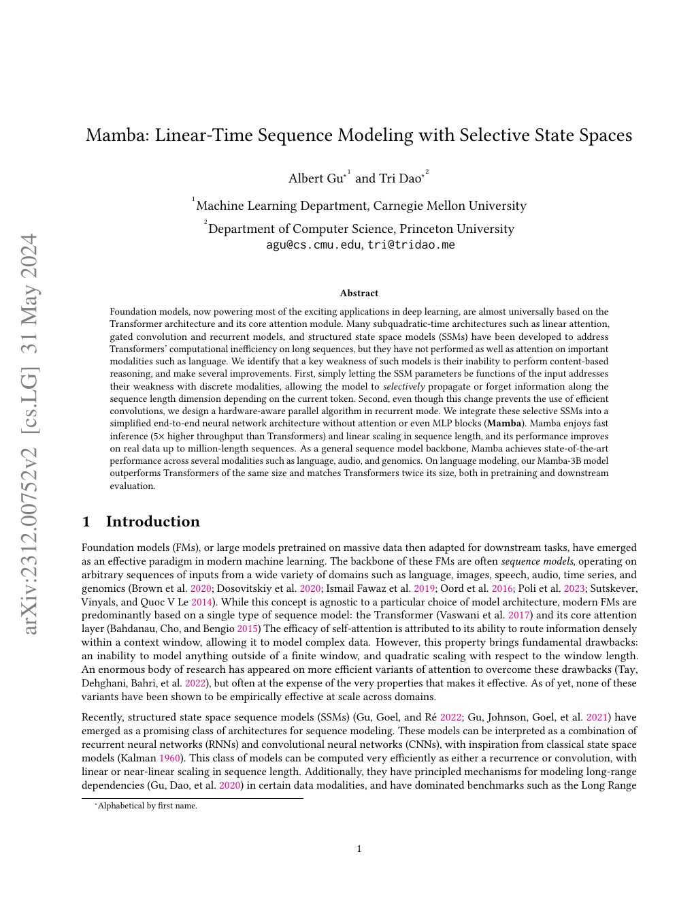

## 1 引言

基础模型（FM）是先在海量数据上预训练、再适配到下游任务的大模型，已经成为现代机器学习的一种有效范式。这些基础模型的骨干通常是序列模型，用来处理来自语言、图像、语音、音频、时间序列和基因组等不同领域的任意输入序列。基础模型这一概念本身并不限定具体架构，但现代基础模型主要建立在同一种序列模型之上：Transformer 及其核心注意力层。

自注意力的有效性通常归因于它能够在一个上下文窗口内密集路由信息，从而对复杂数据进行建模。然而，这一性质也带来根本缺点：它无法对有限窗口之外的内容建模，计算量还会随窗口长度呈二次增长。围绕如何克服这些缺点，已经出现大量更高效的注意力变体，但它们往往以牺牲注意力之所以有效的性质为代价。到本文发表时，还没有任何此类变体被证明能够在多个领域中以大规模实验证实其有效性。

近来，结构化状态空间序列模型（SSM）成为一种很有前景的序列建模架构。这类模型受到经典状态空间模型启发，可以理解为循环神经网络（RNN）与卷积神经网络（CNN）的结合。它们既可以作为循环高效计算，也可以作为卷积高效计算，计算量随序列长度呈线性或近线性增长。此外，它们还拥有若干有原则的长距离依赖建模机制，并在 Long Range Arena 等基准上占据领先地位。

多种 SSM 已经在音频和视觉等连续信号数据领域取得成功，但在文本这类离散、信息密集的数据上效果较弱。为此，我们提出一种新的选择性状态空间模型，在多个方面改进以往方法，目标是在保持序列长度线性扩展的同时，获得 Transformer 的建模能力。

### 1.1 选择机制

我们首先识别出以往模型的一项关键局限：它们无法以依赖输入的方式高效选择数据，也就是不能根据输入聚焦或忽略特定内容。根据选择性复制和归纳头等重要合成任务提供的直觉，我们让 SSM 参数由输入决定，从而设计出一种简单的选择机制。它使模型能够过滤无关信息，并无限期地记住相关信息。

### 1.2 硬件感知算法

这一简单改变给模型计算带来技术难题。事实上，以往所有 SSM 若想获得计算效率，就必须在时间上和输入上保持不变。我们用硬件感知算法克服这一问题：模型不再使用卷积，而是在循环模式下通过扫描进行计算；同时不把扩展后的状态物化到显存中，以避免 GPU 不同内存层级之间的输入输出访问。由此得到的实现无论在理论上还是现代硬件上都快于以往方法：理论复杂度随序列长度线性增长，而所有基于卷积的 SSM 都只能做到伪线性；在 A100 GPU 上，速度最高可提高 3 倍。

### 1.3 架构

我们把以往 SSM 架构的设计与 Transformer 的 MLP 块合并为一个块，简化了以往的深层序列模型架构，最终得到一种简单、同质且包含选择性状态空间的架构，即 Mamba。

选择性 SSM 以及由此构成的 Mamba 都是完全循环的模型，具有几项适合作为通用序列基础模型骨干的关键性质：

1. **高质量。** 选择性使模型在语言和基因组等密集模态上表现强劲。
2. **训练和推理速度快。** 训练期间的计算和内存都随序列长度线性增长；自回归推理时不需要缓存以往元素，因此每一步只需要常数时间。
3. **长上下文。** 模型质量与计算效率结合后，在真实数据上的性能能够持续提高到 100 万词元的序列长度。

我们从预训练质量和领域特定任务表现两方面，在多种模态和设置中验证 Mamba 作为通用序列基础模型骨干的潜力：

- **合成任务。** 在复制和归纳头等被认为对大型语言模型至关重要的合成任务上，Mamba 不但可以轻松求解，还能把所学解法无限外推到超过 100 万词元的长度。
- **音频与基因组。** 在音频波形和 DNA 序列建模上，Mamba 的预训练质量与下游指标均超过 SaShiMi、Hyena 和 Transformer 等以往最佳模型。例如，在一项具有挑战性的语音生成数据集上，其 FID 降低一半以上；在两类设置中，模型性能都能随上下文长度提升到百万级。
- **语言建模。** Mamba 是第一个在预训练困惑度和下游评估中真正达到 Transformer 质量的线性时间序列模型。在最高 10 亿参数的缩放定律实验中，它超过大量基线，其中包括基于 LLaMA 的强大现代 Transformer 训练配方。Mamba 语言模型的生成吞吐量是同等规模 Transformer 的 5 倍；Mamba-3B 的质量则与两倍规模的 Transformer 相当，例如常识推理平均得分比 Pythia-3B 高 4 分，甚至超过 Pythia-7B。

模型代码和预训练检查点已开源于论文给出的项目仓库。

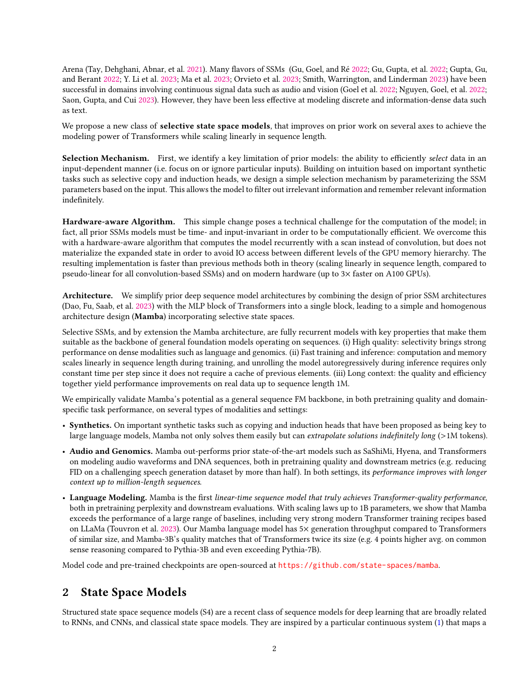

## 2 状态空间模型

结构化状态空间序列模型（S4）是深度学习中一类较新的序列模型，与 RNN、CNN 和经典状态空间模型均有广泛联系。它们受到一种特定连续系统启发；该系统通过隐式潜在状态 $h(t)\in\mathbb{R}^N$，把一维函数或序列 $x(t)\in\mathbb{R}$ 映射为 $y(t)\in\mathbb{R}$。具体而言，S4 模型由四个参数 $(\Delta,\mathbf A,\mathbf B,\mathbf C)$ 定义，并通过两个阶段给出序列到序列的变换。

连续形式为：

$$
h'(t)=\mathbf A h(t)+\mathbf Bx(t),\qquad y(t)=\mathbf Ch(t).
$$

离散循环形式为：

$$
h_t=\bar{\mathbf A}h_{t-1}+\bar{\mathbf B}x_t,\qquad y_t=\mathbf Ch_t.
$$

与之等价的卷积核及卷积形式为：

$$
\bar{\mathbf K}=(\mathbf C\bar{\mathbf B},\mathbf C\bar{\mathbf A}\bar{\mathbf B},\ldots,\mathbf C\bar{\mathbf A}^{k}\bar{\mathbf B},\ldots),\qquad y=x*\bar{\mathbf K}.
$$

### 2.1 离散化

第一阶段使用固定公式，把“连续参数” $(\Delta,\mathbf A,\mathbf B)$ 变换为“离散参数” $(\bar{\mathbf A},\bar{\mathbf B})$。其中一组常用规则是零阶保持（ZOH）：

$$
\bar{\mathbf A}=\exp(\Delta\mathbf A),\qquad
\bar{\mathbf B}=(\Delta\mathbf A)^{-1}(\exp(\Delta\mathbf A)-\mathbf I)\cdot\Delta\mathbf B.
$$

离散化与连续时间系统存在深刻联系，可以赋予模型分辨率不变性等附加性质，并自动确保模型被适当归一化。它也与 RNN 的门控机制有关，本文将在第 3.5 节回到这一联系。从机械计算角度看，离散化也可以简单理解为 SSM 前向传播计算图的第一步。其他 SSM 变体可以绕过离散化，直接参数化 $(\bar{\mathbf A},\bar{\mathbf B})$，这有时更容易理解。

### 2.2 计算

参数从 $(\Delta,\mathbf A,\mathbf B,\mathbf C)$ 变换为 $(\bar{\mathbf A},\bar{\mathbf B},\mathbf C)$ 后，模型可以采用两种计算方式：线性循环或全局卷积。通常，训练阶段能够提前看到整个输入序列，因此使用易于并行的卷积模式；自回归推理阶段则一次只接收一个时间步的输入，因此切换到高效的循环模式。

### 2.3 线性时不变性

上述方程的一项重要性质，是模型动力学不随时间改变。换言之，$(\Delta,\mathbf A,\mathbf B,\mathbf C)$ 以及由它们得到的 $(\bar{\mathbf A},\bar{\mathbf B})$ 在所有时间步都固定不变。这一性质称为线性时不变性（LTI），与循环和卷积有着深刻联系。本文把 LTI SSM 非正式地视为任意线性循环或卷积的等价形式，并用 LTI 作为这些模型类别的统称。

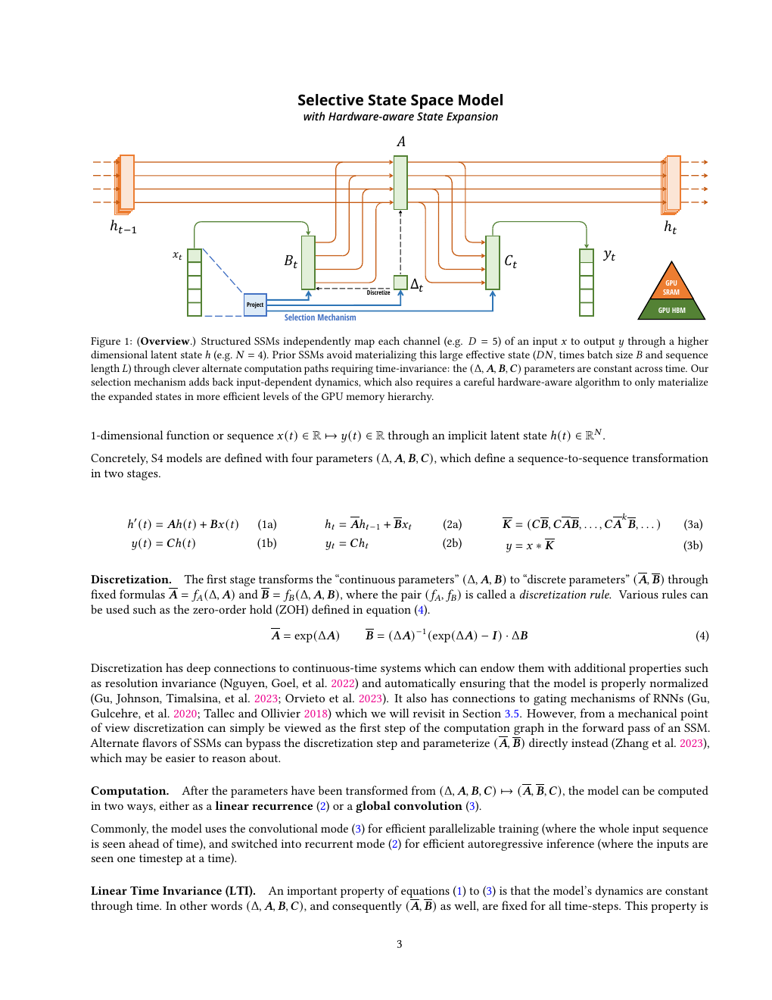

到本文为止，受根本效率约束，所有结构化 SSM 都是 LTI 模型，例如通过卷积计算。然而，本文的核心认识是：LTI 模型在若干数据类型上存在根本建模局限。本文的技术贡献，就是在移除 LTI 约束的同时克服相应效率瓶颈。

### 2.4 结构与维度

“结构化”状态空间模型之所以得名，是因为要高效计算它们，还必须对矩阵 $\mathbf A$ 施加结构。最常见的结构是对角形式，本文也采用这一形式。此时，$\mathbf A\in\mathbb{R}^{N\times N}$、$\mathbf B\in\mathbb{R}^{N\times1}$ 和 $\mathbf C\in\mathbb{R}^{1\times N}$ 都只需用 $N$ 个数表示。

对批大小为 $B$、序列长度为 $L$、通道数为 $D$ 的输入序列 $x$，SSM 会独立作用于每个通道。于是，每个输入的总隐藏状态维度为 $DN$，沿序列长度计算需要 $O(BLDN)$ 的时间和内存。这正是第 3.3 节处理的根本效率瓶颈。

### 2.5 广义状态空间模型

“状态空间模型”一词本身含义很广，只表示任何带有潜在状态的循环过程。在不同学科中，它被用于指称许多彼此不同的概念，包括强化学习中的马尔可夫决策过程、计算神经科学中的动态因果建模、控制领域的卡尔曼滤波、机器学习中的隐马尔可夫模型与线性动力系统，以及深度学习中广义的循环模型乃至卷积模型。

本文始终只用“SSM”指结构化 SSM 或 S4 模型，并交替使用这两个名称。为方便起见，有时也把聚焦线性循环或全局卷积视角的派生模型纳入其中，并在必要时说明细微区别。

### 2.6 SSM 架构

SSM 是独立的序列变换，可以纳入端到端神经网络架构。本文有时也把 SSM 架构称为状态空间神经网络（SSNN）；SSNN 与 SSM 层的关系，就像 CNN 与线性卷积层的关系。若干最知名的 SSM 架构也将作为本文主要基线：

- **线性注意力**是自注意力的一种近似，其中包含一个可视为退化线性 SSM 的循环。
- **H3**把这一循环推广为使用 S4；它可以看作把 SSM 夹在两个门控连接之间的架构。H3 还在主 SSM 层之前插入标准局部卷积，并把它描述为移位 SSM。
- **Hyena**采用与 H3 相同的架构，但用由 MLP 参数化的全局卷积替换 S4 层。
- **RetNet**在架构中增加一个门，并使用更简单的 SSM；这使它可以采用另一条可并行计算路径，即使用多头注意力的一种变体而非卷积。
- **RWKV**是为语言建模设计的一种较新 RNN，建立在无注意力 Transformer 这一线性注意力近似之上。它的主要 WKV 机制包含 LTI 循环，可以看作两个 SSM 的比值。

附录 B 进一步讨论其他密切相关的 SSM 与架构，其中特别包括 S5、准 RNN 和 SRU；作者认为，这些方法与本文的选择性 SSM 最为接近。

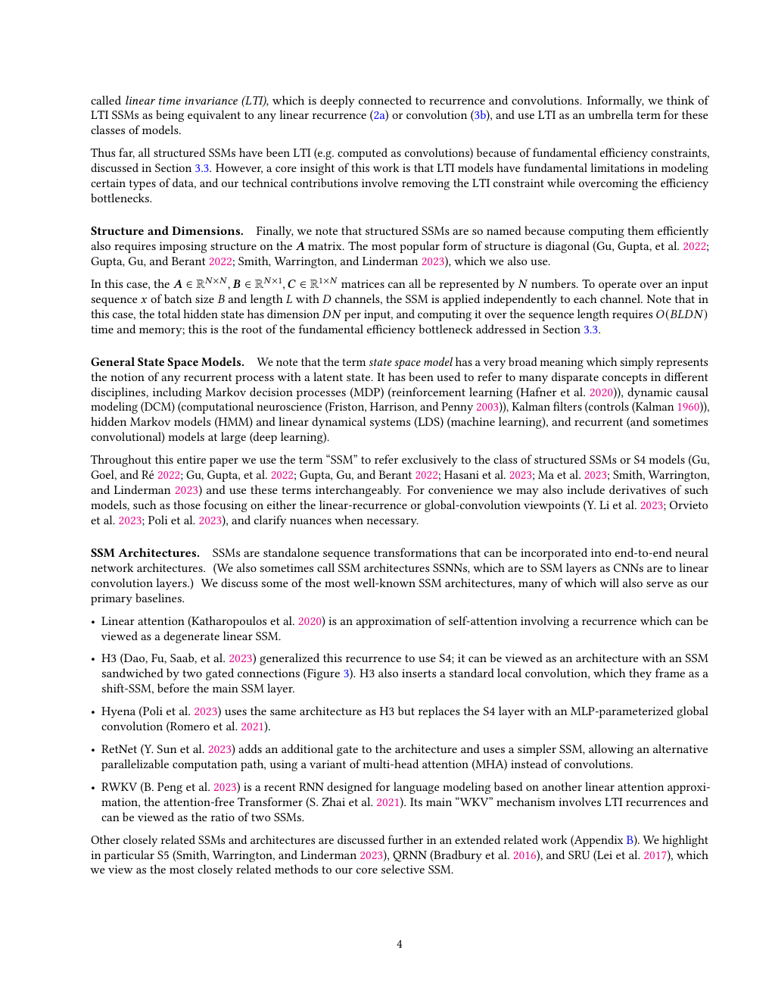

## 3 选择性状态空间模型

本节先借助合成任务说明选择机制的动机，再解释如何把它纳入状态空间模型。由此得到的时变 SSM 无法使用卷积，因此必须解决高效计算这一技术挑战。本文提出利用现代硬件内存层级的硬件感知算法，随后给出一种既没有注意力、甚至也没有 MLP 块的简单 SSM 架构，最后讨论选择机制的其他性质。

### 3.1 动机：把选择视为压缩手段

序列建模的一个根本问题，是把上下文压缩进更小的状态。常见序列模型的取舍可以从这一角度理解。例如，注意力有效却低效，恰恰因为它明确不压缩上下文。自回归推理时必须显式存储整个上下文，即 KV 缓存；这直接造成 Transformer 的线性时间推理和二次时间训练。相反，循环模型因为状态有限而更高效，能够实现常数时间推理和线性时间训练，但其有效性取决于该状态能否把上下文压缩好。

为理解这一原则，本文使用两个贯穿全篇的合成任务：

- **选择性复制。** 它改变经典复制任务中待记忆词元的位置。模型必须进行内容感知推理，记住相关的彩色词元，同时过滤白色无关词元。
- **归纳头。** 这是一种广为人知的机制，被认为可以解释大型语言模型大部分上下文学习能力。模型必须进行上下文感知推理，知道何时应在适当上下文中输出正确的黑色词元。

这些任务揭示了 LTI 模型的失败方式。从循环视角看，固定动力学无法使模型从上下文中选出正确信息，也不能以依赖输入的方式影响沿序列传递的隐藏状态。从卷积视角看，全局卷积能够求解普通复制任务，因为该任务只要求时间感知；但由于缺乏内容感知，它们难以求解选择性复制。更具体地说，输入与输出之间的间距会变化，静态卷积核无法对它建模。

因此，序列模型的效率与有效性取舍，取决于其状态压缩得有多好：高效模型必须拥有小状态，有效模型的状态又必须包含上下文中的全部必要信息。由此，本文提出构建序列模型的一项根本原则——选择性，即依据上下文把输入聚焦或过滤进序列状态的能力。选择机制具体控制信息如何沿序列维度传播或交互。

### 3.2 用选择机制改进 SSM

把选择机制纳入模型的一种方法，是让那些影响序列交互的参数依赖输入，例如 RNN 的循环动力学参数或 CNN 的卷积核。算法 1 与算法 2 展示了本文使用的主要选择机制。核心变化很简单：让 $\Delta$、$\mathbf B$、$\mathbf C$ 成为输入的函数，并相应改变整个过程中的张量形状。

这些参数现在都带有长度维度 $L$，意味着模型已经从时不变变为时变，也因此不再与卷积等价。本文具体选择：

$$
s_B(x)=\operatorname{Linear}_N(x),\quad
s_C(x)=\operatorname{Linear}_N(x),\quad
s_\Delta(x)=\operatorname{Broadcast}_D(\operatorname{Linear}_1(x)),\quad
\tau_\Delta=\operatorname{softplus}.
$$

其中 $\operatorname{Linear}_d$ 表示投影到 $d$ 维的参数化线性层。$s_\Delta$ 与 $\tau_\Delta$ 的选择来自它们与 RNN 门控机制的联系。

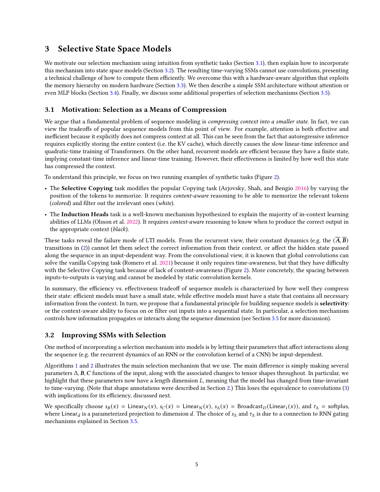

原论文图 2 对比了普通复制、选择性复制和归纳头：普通复制的输入输出间距固定，线性循环与全局卷积等时不变模型无需检查实际输入便能完美求解；选择性复制的间距随机，模型必须依据内容选择性记忆或忽略输入；归纳头则要求依据上下文进行关联回忆。算法 1 与算法 2 分别列出传统 S4 和加入选择机制的 S6，并明确显示后者的 $\mathbf B$、$\mathbf C$ 与 $\Delta$ 都带有批、长度或通道相关的输入依赖维度，只能通过循环扫描计算。

### 3.3 选择性 SSM 的高效实现

卷积和注意力等硬件友好原语得以广泛应用；本文的目标，是让选择性 SSM 在现代 GPU 上同样高效。选择机制本身很自然，以往工作也尝试过某些特例，例如让循环 SSM 中的 $\Delta$ 随时间变化。但 SSM 的核心限制一直是计算效率，因此 S4 及其所有派生模型都使用 LTI 非选择性模型，最常见形式是全局卷积。

#### 3.3.1 以往模型的动机

- 从宏观上看，SSM 等循环模型始终要在表达能力与速度之间权衡：隐藏状态维度越大，模型通常越有效，但也越慢。理想做法是在不付出速度和内存代价的情况下，尽可能增大隐藏状态维度。
- 循环模式比卷积模式更灵活，因为卷积形式本来就是展开循环形式得到的。然而，直接循环需要计算并物化形状为 $(B,L,D,N)$ 的潜在状态 $h$，比形状为 $(B,L,D)$ 的输入 $x$ 和输出 $y$ 大 $N$ 倍。为绕过状态计算，过去才引入更高效的卷积模式；它只需物化大小为 $(B,L,D)$ 的卷积核。
- 以往 LTI 状态空间模型利用循环与卷积的双重形式，把有效状态维度扩大 $N$ 倍，通常约为 10–100 倍，远大于传统 RNN，同时不承担额外效率代价。

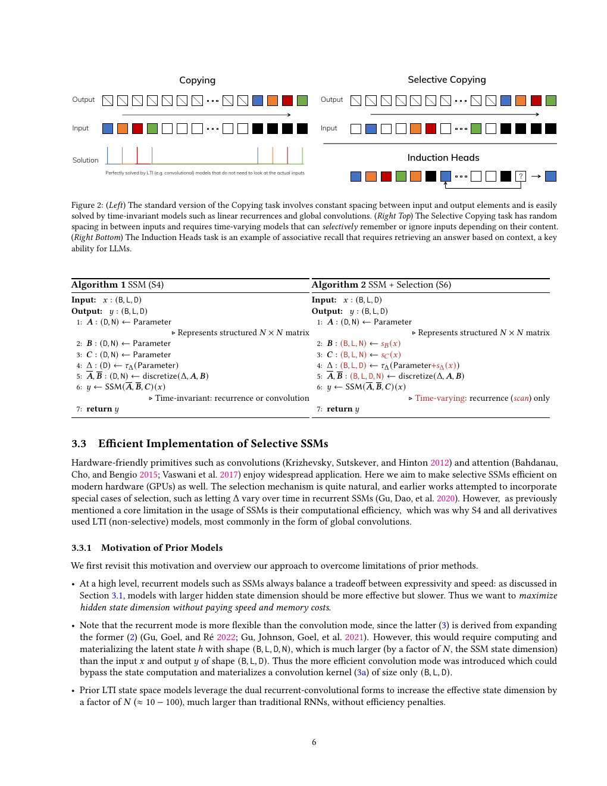

#### 3.3.2 选择性扫描总览：硬件感知状态扩展

选择机制用于克服 LTI 模型的局限，但也迫使我们重新处理 SSM 的计算问题。本文结合三项经典技术：算子融合、并行扫描和重计算。这里有两项主要观察：

- 朴素循环计算需要 $O(BLDN)$ 次浮点运算，卷积计算需要 $O(BLD\log L)$ 次浮点运算，而循环形式的常数因子更小。因此，当序列很长且状态维度 $N$ 不太大时，循环模式实际可能使用更少的计算量。
- 循环面临两个难点：顺序性和高内存占用。对于后者，可以像卷积模式一样，设法不真正物化完整状态 $h$。

核心思想是利用现代 GPU 的性质，只在更高效的内存层级中物化状态 $h$。除矩阵乘法外，大多数运算都受内存带宽限制，扫描也不例外。本文用算子融合减少内存输入输出次数，相比标准实现获得显著加速。

具体而言，系统不再先把大小为 $(B,L,D,N)$ 的扫描输入 $(\bar{\mathbf A},\bar{\mathbf B})$ 准备在 GPU 高带宽显存（HBM）中，而是把 SSM 参数 $(\Delta,\mathbf A,\mathbf B,\mathbf C)$ 从较慢的 HBM 直接载入较快的 SRAM，在 SRAM 内完成离散化和循环，再把大小为 $(B,L,D)$ 的最终输出写回 HBM。

为消除循环的顺序瓶颈，作者注意到该过程即使不再是线性的，仍可使用工作量高效的并行扫描算法并行化。反向传播还需要中间状态，因此也必须避免保存它们。本文谨慎使用重计算：前向时不存储中间状态，反向时在输入从 HBM 载入 SRAM 后重新计算。最终，融合后的选择性扫描层与使用 FlashAttention 的优化 Transformer 实现具有相同的内存需求。

#### 3.4 简化的 SSM 架构

选择性 SSM 与结构化 SSM 一样，是可以灵活纳入神经网络的独立序列变换。大多数著名 SSM 架构都建立在 H3 之上，通常把受线性注意力启发的块与 MLP 块交替排列。本文受门控注意力单元启发，把两个组成部分合并成一个块，再同质地重复堆叠。

该架构用可控扩展因子 $E$ 扩大模型维度 $D$。每个块的大多数参数位于线性投影中：输入投影占 $2ED^2$，输出投影占 $ED^2$，合计 $3ED^2$；内部 SSM 的参数量相对很小，包括 $\Delta$、$\mathbf B$、$\mathbf C$ 的投影和矩阵 $\mathbf A$。这些块与标准归一化层、残差连接交错重复，形成 Mamba 架构。

所有实验都固定 $E=2$，并使用两层 Mamba 块，使参数量与 Transformer 中交错的多头注意力和 MLP 块所需的 $12D^2$ 相匹配。激活函数采用 SiLU/Swish，使门控 MLP 对应常用的 SwiGLU 变体。模型还可选用归一化层，本文选择 LayerNorm，这一设计受到 RetNet 在相似位置使用归一化层的启发。

### 3.5 选择机制的性质

选择机制是一个更广泛的概念，可以用不同方式应用于传统 RNN 或 CNN，可以作用于不同参数，例如算法 2 中的 $\mathbf A$，也可以采用不同的变换 $s(x)$。

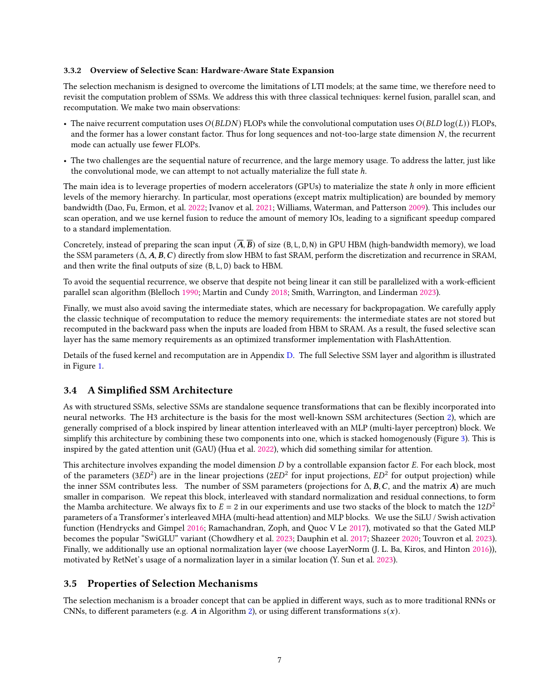

原论文图 3 展示了架构变化：简化后的 Mamba 块把大多数 SSM 架构所依据的 H3 块与神经网络中普遍存在的 MLP 块合并，不再让二者交替，而是同质地重复 Mamba 块。与 H3 相比，Mamba 用激活函数替代第一道乘法门；与 MLP 相比，它在主分支增加一个 SSM。

#### 3.5.1 与门控机制的联系

最重要的联系是：经典 RNN 门控机制正是 SSM 选择机制的一个实例。RNN 门控与连续时间系统离散化之间的联系早已确立。本文的定理 1 把以往结果推广到 ZOH 离散化和依赖输入的门。更广泛地说，SSM 中的 $\Delta$ 可以被看作 RNN 门控机制的推广。本文沿用以往观点，把 SSM 离散化视为启发式门控机制的原则性基础。

**定理 1。** 当 $N=1$、$\mathbf A=-1$、$\mathbf B=1$、$s_\Delta=\operatorname{Linear}(x)$ 且 $\tau_\Delta=\operatorname{softplus}$ 时，选择性 SSM 循环为：

$$
g_t=\sigma(\operatorname{Linear}(x_t)),\qquad
h_t=(1-g_t)h_{t-1}+g_tx_t.
$$

这也解释了第 3.2 节中 $s_\Delta$ 和 $\tau_\Delta$ 的具体选择。若某个输入 $x_t$ 应被完全忽略，所有 $D$ 个通道都应忽略它，因此模型先把输入投影到一维，再对 $\Delta$ 重复或广播。

#### 3.5.2 选择机制的解释

选择机制具有三种具体机械效应。

**可变间距。** 选择性可以过滤感兴趣输入之间出现的无关噪声词元。选择性复制任务直接体现这一点，而这种情况在常见数据模态中普遍存在，特别是离散数据，例如语言中的“呃”等填充词。模型可以机械地过滤任意输入 $x_t$；在门控 RNN 情形中，当 $g_t\to0$ 时便会忽略该输入。

**过滤上下文。** 实验中常发现，很多序列模型并不会随上下文变长而改善，尽管从原则上说，更多上下文本应带来严格更好的性能。一种解释是，这些模型无法在必要时有效忽略无关上下文；全局卷积以及一般 LTI 模型便是直观例子。选择性模型则可以随时重置状态，清除多余历史，因此原则上其性能能够随上下文长度单调改善。

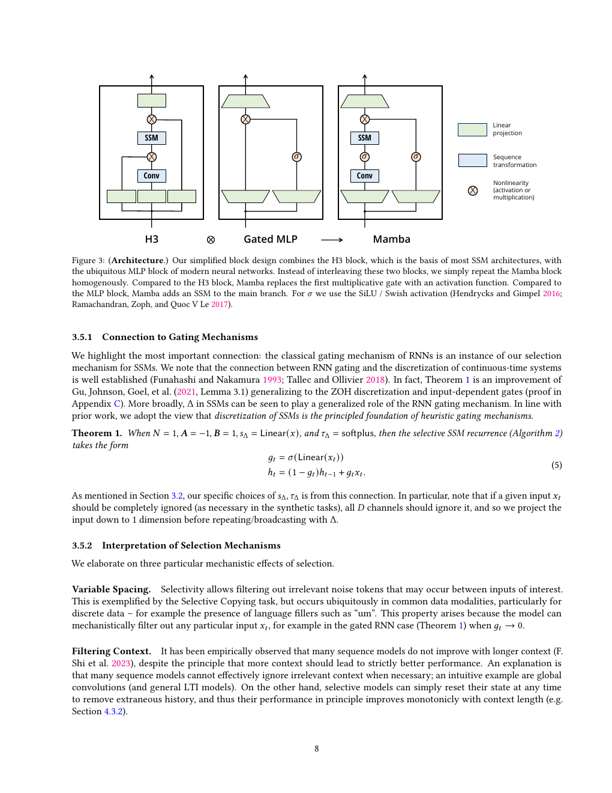

**边界重置。** 当多个彼此独立的序列被拼接在一起时，Transformer 可以通过特定注意力掩码保持它们相互隔离，而 LTI 模型会让序列间发生信息泄漏。选择性 SSM 也能在边界重置状态，例如令 $\Delta_t\to\infty$，或在定理 1 中令 $g_t\to1$。这种场景既可能由人工产生，例如为提高硬件利用率而打包文档；也可能自然出现，例如强化学习中的回合边界。

各个选择性参数还可分别解释如下。

**$\Delta$ 的解释。** 一般而言，$\Delta$ 控制模型聚焦或忽略当前输入 $x_t$ 的平衡。它推广了 RNN 门：较大的 $\Delta$ 会重置状态 $h$ 并聚焦当前输入，较小的 $\Delta$ 会保持状态并忽略当前输入。把 SSM 理解为用时间步长 $\Delta$ 离散化的连续系统时，$\Delta\to\infty$ 表示系统用更长时间聚焦当前输入，从而选择它并忘记原状态；$\Delta\to0$ 则表示当前输入转瞬即逝，因而被忽略。

**$\mathbf A$ 的解释。** 参数 $\mathbf A$ 也可以做成选择性的，但它最终只通过离散化关系 $\bar{\mathbf A}=\exp(\Delta\mathbf A)$ 与 $\Delta$ 的交互影响模型。因此，只让 $\Delta$ 具有选择性，已经足以使 $(\bar{\mathbf A},\bar{\mathbf B})$ 具有选择性，并构成主要改进来源。作者推测，让 $\mathbf A$ 也具有选择性，或者以它代替 $\Delta$，可能会得到相似性能；为保持简单，本文没有这样做。

**$\mathbf B$ 和 $\mathbf C$ 的解释。** 选择性最重要的性质，是过滤无关信息，使序列模型能把上下文压缩进高效状态。让 $\mathbf B$ 和 $\mathbf C$ 具有选择性，可以更细致地控制是否允许输入 $x_t$ 进入状态 $h_t$，以及是否允许状态进入输出 $y_t$。它们可以分别理解为允许模型根据内容即输入和上下文即隐藏状态调制循环动力学。

### 3.6 其他模型细节

**实数与复数。** 以往大多数 SSM 的状态 $h$ 使用复数，这对许多感知模态任务的强性能是必要的。但实验也发现，全实数 SSM 在某些设置中同样有效，甚至可能更好。本文默认使用实数；除了一个任务以外，这一选择在所有任务上都表现良好。作者推测，实数与复数的取舍同数据模态的连续—离散谱有关：复数有利于音频、视频等连续模态，但对文本、DNA 等离散模态帮助不大。

**初始化。** 以往大多数 SSM 还建议采用特殊初始化，尤其在复数情形中，这会帮助低数据量等设置。本文复数模型默认使用 S4D-Lin，实数模型默认使用 S4D-Real；二者都建立在 HIPPO 理论上，分别把 $\mathbf A$ 的第 $n$ 个元素定义为 $-1/2+ni$ 和 $-(n+1)$。作者预计，尤其在大数据和实数 SSM 环境中，多种初始化都能正常工作。

**$\Delta$ 的参数化。** 选择性调整原定义为 $s_\Delta(x)=\operatorname{Broadcast}_D(\operatorname{Linear}_1(x))$，也可以从一维推广到更大的维度 $R$。本文把 $R$ 设为 $D$ 的一小部分，因此相比块中的主要线性投影，新增参数可以忽略。广播也可以理解为另一层按特定 0、1 模式初始化的线性投影；若允许它训练，就得到低秩投影 $s_\Delta(x)=\operatorname{Linear}_D(\operatorname{Linear}_R(x))$。实验中，作为偏置项的 $\Delta$ 按照以往 SSM 工作，初始化为 $\tau_\Delta^{-1}(\operatorname{Uniform}([0.001,0.1]))$。

**说明 3.1。** 为简化实验结果中的表述，本文有时把选择性 SSM 简写为 S6，因为它是在 S4 上加入选择机制，并用扫描进行计算。

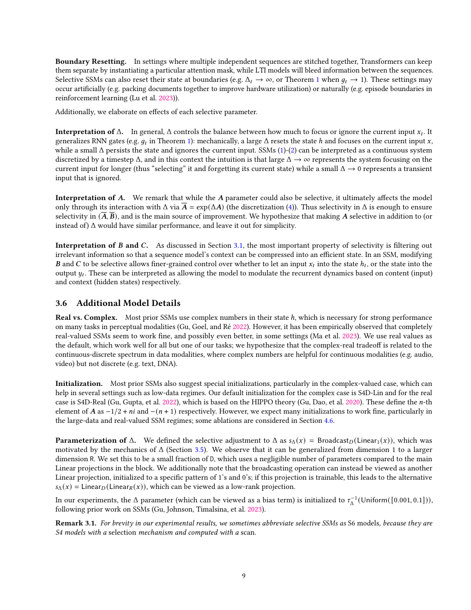

## 4 实证评估

本节先测试 Mamba 求解前述两个合成任务的能力，再在语言、DNA 和音频三个领域中，同时评估自回归预训练与下游任务：第 4.2 节进行语言模型预训练缩放与零样本下游评估；第 4.3 节进行 DNA 序列预训练并在长序列分类任务上微调；第 4.4 节进行音频波形预训练并评估自回归语音生成质量；第 4.5 节评测训练和推理效率；第 4.6 节消融架构和选择性 SSM 的各个组成部分。

### 4.1 合成任务

完整任务定义和训练协议见附录 E.1。

#### 4.1.1 选择性复制

复制任务是序列建模研究最充分的合成任务之一，最初用于检验循环模型的记忆能力。LTI SSM，也就是线性循环和全局卷积，可以只跟踪时间而不对数据推理，轻易求解该任务，例如构造长度刚好正确的卷积核。以往全局卷积研究已经明确验证这一点。选择性复制任务则随机化词元间距，阻止这种捷径。该任务过去也曾以“去噪任务”的名称提出。

很多工作认为，增加架构门控即乘法交互可以赋予模型“数据依赖性”，从而求解相关任务。但作者认为这一解释在直觉上不充分，因为这种门控不沿序列轴交互，也不能影响词元间距。具体来说，架构门控并不是选择机制的一个实例。表 1 证实，H3 和 Mamba 等门控架构只能部分改善性能，而选择机制把 S4 修改为 S6 后可以轻松求解任务；若再与更强架构结合，效果尤其突出。

#### 4.1.2 归纳头

从机制可解释性角度看，归纳头是一项简单任务，却能惊人地预测大型语言模型的上下文学习能力。它要求模型执行关联回忆与复制：例如，若模型在序列中见过“Harry Potter”这一二元词组，那么同一序列中再次出现“Harry”时，应能从历史复制并预测下一个词是“Potter”。

**数据集。** 研究在长度 256、词表大小 16 的归纳头任务上训练两层模型。为考察泛化和外推能力，测试时又在 $2^6=64$ 到 $2^{20}=1,048,576$ 的序列长度范围内评估。

**模型。** 沿用归纳头研究的惯例，实验使用两层模型，这使注意力在机制上能够求解任务。测试对象既包括使用不同位置编码的八头多头注意力，也包括 SSM 变体。Mamba 的模型维度为 64，其他模型为 128。

**结果。** 表 2 表明，Mamba——更准确地说，是它的选择性 SSM 层——能够完美求解任务，因为它可以选择性记住相关词元，并忽略二者之间的一切内容。它可以完美泛化到百万长度序列，即训练所见长度的 4,000 倍；其他方法没有一个能够超过 2 倍。

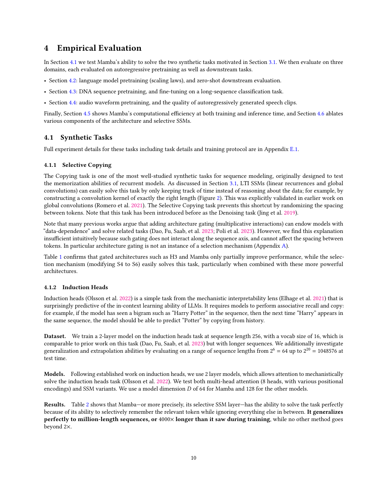

在注意力的位置编码变体中，专为长度外推设计的 xPos 略好于其他方法；由于内存限制，所有注意力模型最多只测试到 $2^{14}=16,384$。其他 SSM 中，H3 与 Hyena 表现相近，这与 Hyena 原论文的结论相反。

### 4.2 语言建模

本文在标准自回归语言建模任务上，将 Mamba 与其他架构比较，指标包括预训练困惑度和零样本评估。模型深度与宽度参照 GPT-3 规格，数据集采用 Pile，训练配方沿用 GPT-3。

#### 4.2.1 缩放定律

基线包括标准 GPT-3 Transformer，以及作者所知的最强 Transformer 配方 Transformer++。后者基于 PaLM 和 LLaMA 架构，采用旋转位置编码、SwiGLU MLP、以 RMSNorm 代替 LayerNorm、移除线性偏置并提高学习率。实验还比较其他近期次二次架构。

图 4 展示标准 Chinchilla 协议下，从约 1.25 亿到约 13 亿参数模型的缩放定律。Mamba 是第一个能够匹配强大现代 Transformer 配方 Transformer++ 的无注意力模型，序列越长，这一特点越明显。RWKV 和 RetNet 等强循环基线在 8K 上缺少完整结果，是因为高效实现不足，导致显存溢出或计算需求不现实。

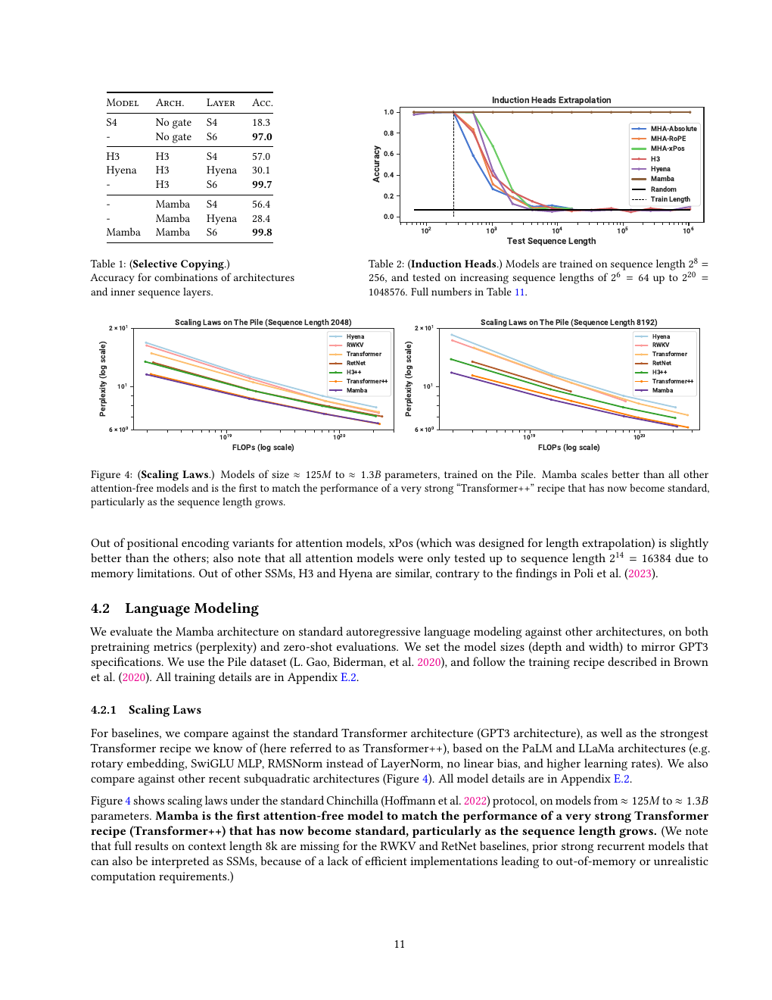

#### 4.2.2 下游评估

表 3 给出 Mamba 在一系列常用零样本下游任务上的表现。比较对象是相应规模最著名的开源模型，尤其是 Pythia 与 RWKV；它们与 Mamba 使用相同分词器、数据集和 3000 亿词元训练长度。Mamba 和 Pythia 的训练上下文长度为 2048，RWKV 为 1024。

在每个模型规模上，Mamba 的每一项评估结果都处于同规模最佳水平，并且通常能匹配两倍规模的基线。Mamba-130M 的平均准确率为 44.7，Mamba-370M 为 50.0，Mamba-790M 为 57.1，Mamba-1.4B 为 59.7，Mamba-2.8B 为 63.3。最后一个结果高于 Pythia-2.8B 的 59.1 和 Pythia-6.9B 的 61.7，并与 GPT-J-6B、OPT-6.7B 等更大模型相当。

### 4.3 DNA 建模

受大型语言模型成功启发，近期研究开始把基础模型范式用于基因组学。DNA 与语言相似，都是由有限词表中的离散词元组成的序列，同时又需要对长距离依赖建模。本文沿用近期 DNA 长序列模型研究的设置，考察 Mamba 作为预训练与微调基础模型骨干的表现，重点研究模型规模和序列长度两条缩放定律，以及一个需要长上下文的困难合成分类任务。

预训练大体遵循标准因果语言建模，即预测下一个词元。数据采用 HyenaDNA 的 HG38 设置；训练集包含单个人类基因组，约有 45 亿个 DNA 碱基对词元。

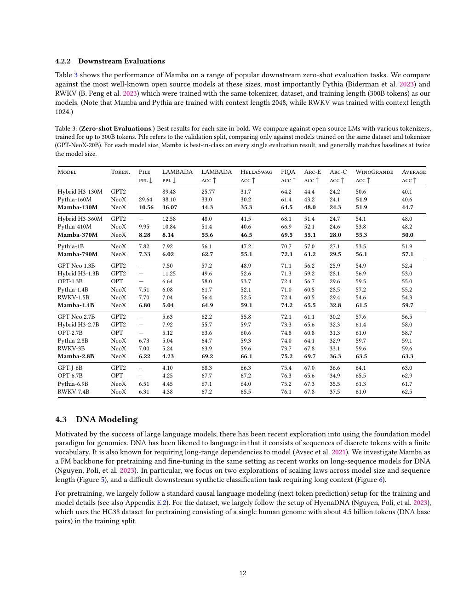

#### 4.3.1 模型规模缩放

实验研究不同骨干的基因组基础模型随规模变化的性质。为使基线占优，训练采用较短的 1024 序列长度；第 4.3.2 节表明，序列更长时结果应更有利于 Mamba。全局批大小固定为 1024，即每批约 $2^{20}$、约 100 万词元。模型训练 1 万次梯度更新，共处理 100 亿词元。

结果显示，Mamba 的预训练困惑度随模型规模平滑改善，缩放效果好于 HyenaDNA 和 Transformer++。在约 4000 万参数这一最大规模上，Mamba 可以用少约 3–4 倍的参数匹配 Transformer++ 与 HyenaDNA。

#### 4.3.2 上下文长度缩放

随后考察模型随序列长度变化的缩放性质。由于二次注意力在超长序列上代价过高，只比较 HyenaDNA 与 Mamba。预训练序列长度为 $2^{10}$、$2^{12}$、$2^{14}$、$2^{16}$、$2^{18}$ 和 $2^{20}$，即 1,024 到 1,048,576。模型固定为 6 层、宽度 128，约 130 万至 140 万参数；训练 2 万次梯度更新，总计约 3300 亿词元，较长序列采用序列长度预热。

Mamba 能利用一直延伸到 100 万长度的更长上下文，预训练困惑度随上下文增长而改善；HyenaDNA 却随序列变长而变差。这与选择机制的性质相符：LTI 模型无法选择性忽略信息；从卷积视角看，超长卷积核会聚合长序列中的全部信息，其中可能包含大量噪声。HyenaDNA 虽声称可从更长上下文获益，但其结果没有控制计算时间。

#### 4.3.3 合成物种分类

下游任务是从连续 DNA 片段判断其来自五个物种中的哪一个。HyenaDNA 原任务使用人、狐猴、小鼠、猪和河马；本文把任务显著加难，改为区分人、黑猩猩、大猩猩、红毛猩猩和倭黑猩猩这五种大型类人猿，它们的 DNA 相似度达到 99%。图 6 与附录表 13 显示，随着上下文变长，Mamba 的分类准确率显著提高；在 100 万长度时，140 万参数 Mamba 达到 71.67%，700 万参数 Mamba 达到 81.31%，而 HyenaDNA 为 54.87%。

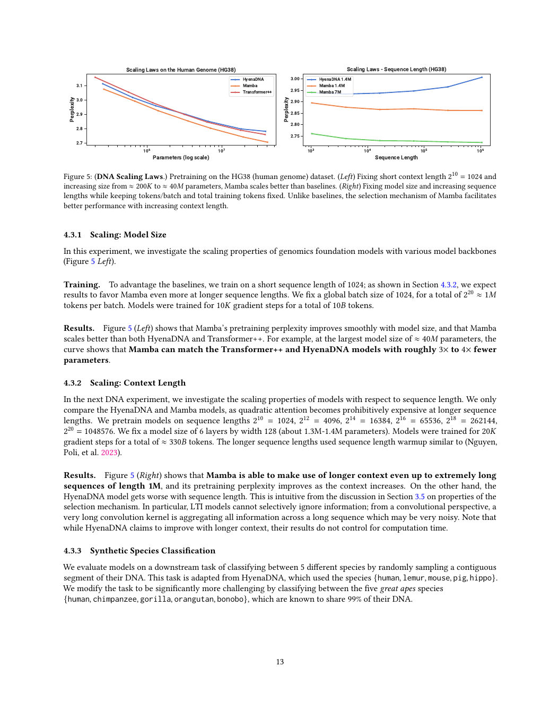

### 4.4 音频建模与生成

对于音频波形，本文主要沿用 SaShiMi 架构与训练协议。SaShiMi 包含一个 U-Net 骨干：模型经过两个按因子 $p$ 池化的阶段，每个阶段将模型维度 $D$ 翻倍；每个阶段内部交替使用 S4 与 MLP 块。本文用 Mamba 块替换 S4+MLP 块。

#### 4.4.1 长上下文自回归预训练

预训练质量通过 YouTubeMix 上的自回归下一采样点预测评估。该数据集是以往工作使用的标准钢琴音乐数据集，包含 4 小时独奏钢琴，以 16,000 Hz 采样。图 7 在保持计算量固定的情况下，把训练序列从 $2^{13}=8,192$ 增加到接近 $2^{20}$、约 100 万。数据只有最长一分钟的片段，所以最大序列实际受 $60\text{s}\times16,000\text{Hz}=960,000$ 限制。

Mamba 与 SaShiMi 基线都会随上下文变长持续改善，但 Mamba 在所有长度上都更好，且长度越长差距越大。主要指标是每字节比特数（BPB），它与其他模态预训练中常用的负对数似然损失只差常数因子 $\log 2$。值得注意的是，这是全文唯一把实数参数化切换为复数参数化的实验。

#### 4.4.2 自回归语音生成

SC09 是一个语音生成基准，包含数字 0 到 9 的一秒钟、16,000 Hz 语音片段，声音特征变化很大。实验大体沿用 SaShiMi 的自回归训练设置与生成协议。

表 4 把 Mamba-UNet 与 WaveNet、SampleRNN、WaveGAN、DiffWave 和 SaShiMi 等基线比较。小型 Mamba 已超过当时最佳且规模大得多的 GAN 和扩散模型；参数量与基线匹配的更大 Mamba 又显著改善保真度指标。6.1M 参数 Mamba 的 FID 为 0.94，24.3M 参数 Mamba 为 0.67，而 SaShiMi 为 1.99，DiffWave 为 1.92。

表 5 则在小型 Mamba 上组合不同的外部阶段和中心阶段架构。结果显示，外部块中 Mamba 始终优于 S4+MLP；中心块中的排序为 Mamba 优于 S4+MLP，后者又优于 MHA+MLP。

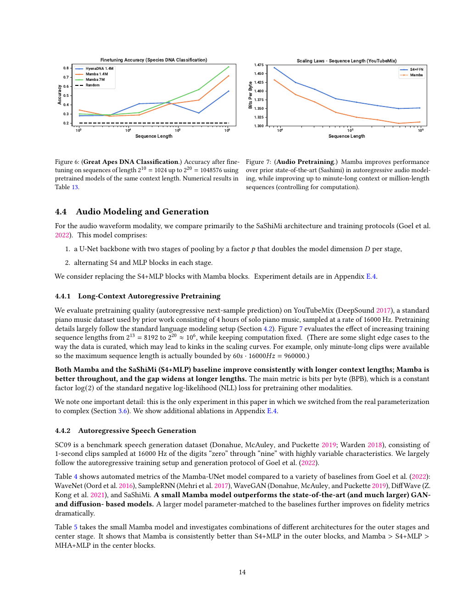

### 4.5 速度与内存基准

图 8 评测状态扩展 $N=16$ 时 SSM 扫描操作的速度，以及 Mamba 的端到端推理吞吐量。序列长度超过 2K 后，高效 SSM 扫描快于作者所知最快的注意力实现 FlashAttention-2；与 PyTorch 标准扫描相比，它可快 20–40 倍。由于没有 KV 缓存，Mamba 能使用更大批量，因此推理吞吐量比同等规模 Transformer 高 4–5 倍。例如，一个未经训练的 Mamba-6.9B，其推理吞吐量可以高于小五倍的 Transformer-1.3B。

### 4.6 模型消融

消融实验聚焦约 3.5 亿参数的语言模型，并采用与图 4 相同的 Chinchilla 词元数量。

#### 4.6.1 架构

表 6 研究块架构及其内部 SSM 层的影响。结果如下：

- 以往非选择性 LTI SSM 都等价于全局卷积，彼此性能非常接近。
- 把以往复数 S4 换成实数变体，性能变化不大；若考虑硬件效率，至少在语言建模中，实数 SSM 可能是更好选择。
- 把其中任何一种模型替换为选择性 SSM（S6），都会显著改善性能，从而验证第 3 节的动机。
- Mamba 架构与 H3 架构表现相近；采用选择性层时，Mamba 似乎略好。

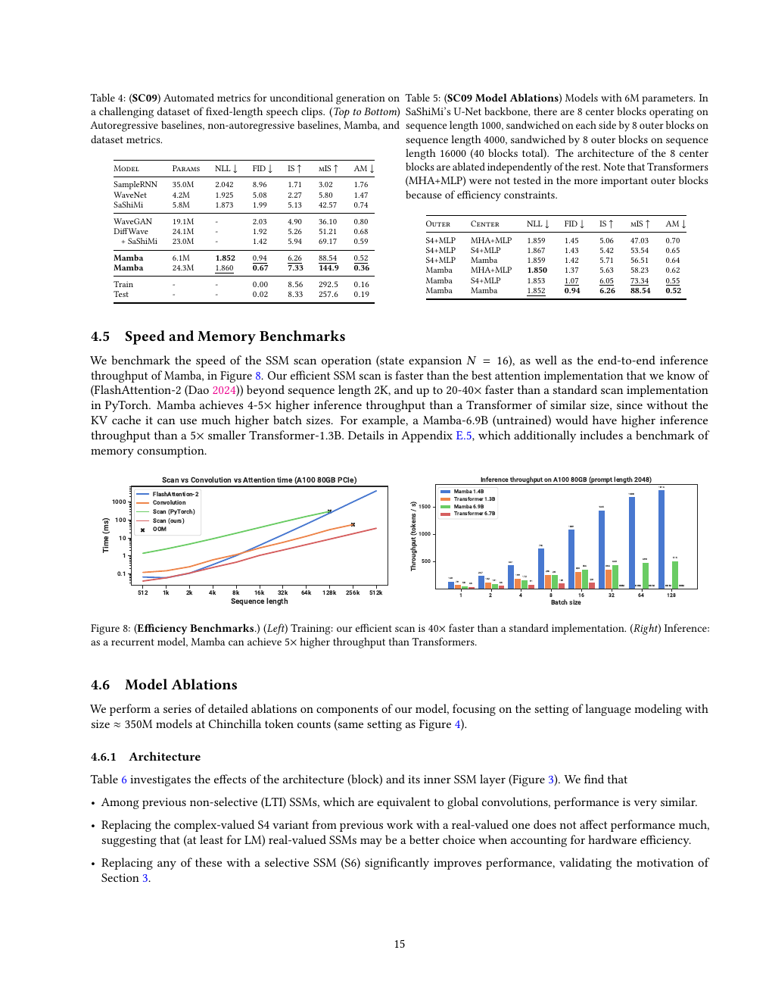

作者还在附录 E.2.2 中考察了让 Mamba 块与传统 MLP 块或多头注意力块交错排列的效果。

#### 4.6.2 选择性 SSM

表 7 分别组合具有选择性的 $\Delta$、$\mathbf B$ 和 $\mathbf C$。由于 $\Delta$ 与 RNN 门控的联系，它是最重要的参数；三者共同使用又具有协同效应，困惑度从全部静态时的 10.93 降到 8.71。

表 8 比较不同 SSM 初始化。语言建模中，简单的实数对角初始化 S4D-Real 优于更标准的复数参数化 S4D-Lin；随机初始化也表现良好，与以往发现一致。

表 9 和表 10 分别改变 $\Delta$ 投影以及 $\mathbf B、\mathbf C$ 投影的维度。把参数从静态改为选择性带来的收益最大；继续提高维度通常还能小幅改善性能，参数量只略微增加。

尤其值得注意的是，选择性 SSM 的状态规模 $N$ 增大后，困惑度提高超过 1.0，而额外参数成本只有 1%。这验证了第 3.1 和第 3.3 节的核心动机：只有在 $\mathbf B$ 和 $\mathbf C$ 也具有选择性时，扩展循环状态维度才能以极低代价显著改善性能。

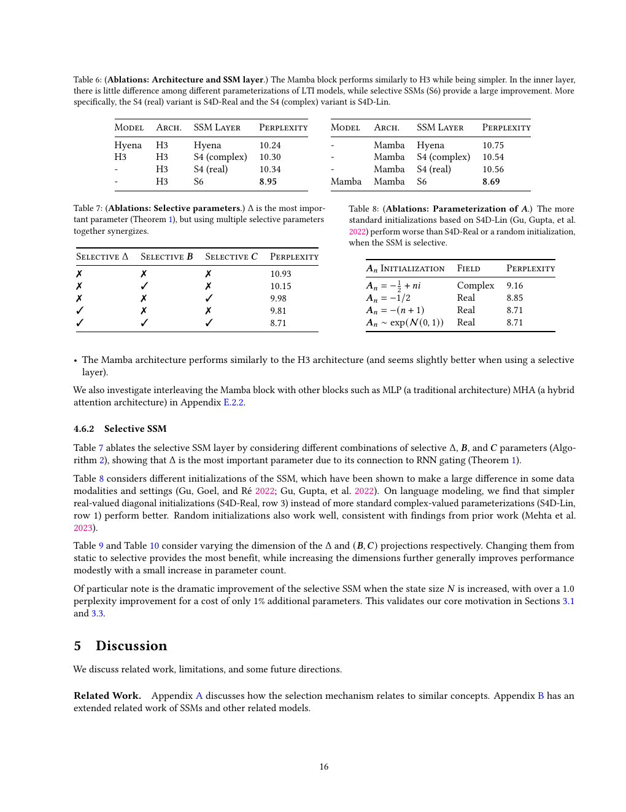

## 5 讨论

### 5.1 没有免费午餐：连续—离散谱

结构化 SSM 最初被定义为连续系统的离散化，因此对音频、视频等连续时间感知信号具有强归纳偏置。选择机制克服了它们面对文本和 DNA 等离散模态时的弱点，但反过来也可能阻碍它们在 LTI SSM 擅长的数据上发挥性能。附录中的音频波形消融进一步考察了这一取舍。

### 5.2 下游可用方式

基于 Transformer 的基础模型，尤其大型语言模型，已经形成丰富生态，包括微调、适配、提示、上下文学习、指令微调、RLHF 和量化等性质与交互方式。作者特别关心 SSM 等 Transformer 替代方案能否拥有相似的性质和使用方式。

### 5.3 规模扩展

本文实证评估只覆盖较小模型，仍低于 Llama 等强开源大型语言模型的规模阈值，也小于已经扩展到 70 亿参数以上的 RWKV 和 RetNet 等循环模型。Mamba 在更大规模上是否仍具优势，有待进一步评估。SSM 的大规模扩展还可能带来新的工程挑战，需要对模型作出本文尚未讨论的调整。

## 6 结论

本文把选择机制引入结构化状态空间模型，使其能够进行依赖上下文的推理，同时保持计算量随序列长度线性扩展。选择性 SSM 被纳入一种简单的无注意力架构后，Mamba 在语言、DNA 和音频等多种领域取得当时最佳结果，达到或超过强大 Transformer 模型的表现。

作者期待把选择性状态空间模型广泛用于不同领域的基础模型，尤其是基因组、音频和视频等需要长上下文的新兴模态。实验结果表明，Mamba 是通用序列模型骨干的有力候选。

## 致谢

作者感谢 Karan Goel、Arjun Desai 和 Kush Bhatia 对论文草稿提供的有益反馈。

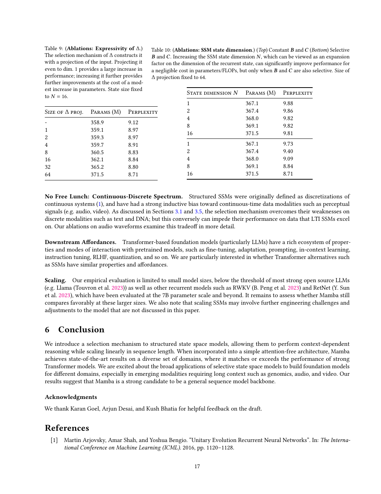

## 参考文献

原论文第 18–23 页为完整参考文献。为保留作者姓名、题名、会议信息、页码和排版细节，以下按原页截图收录。

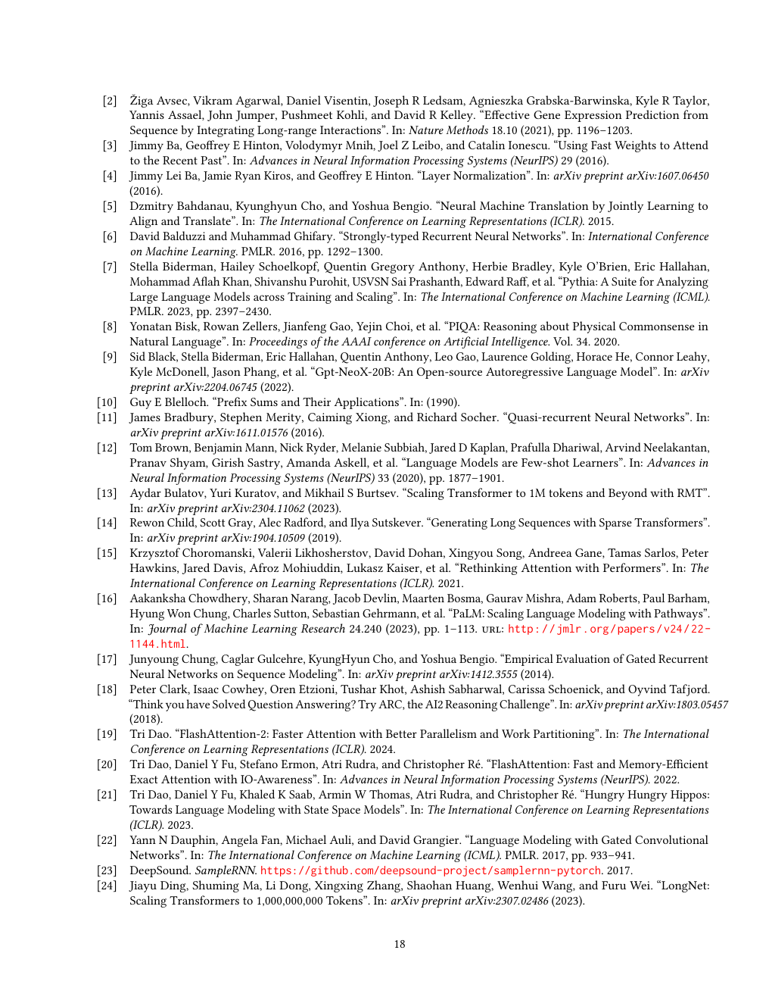

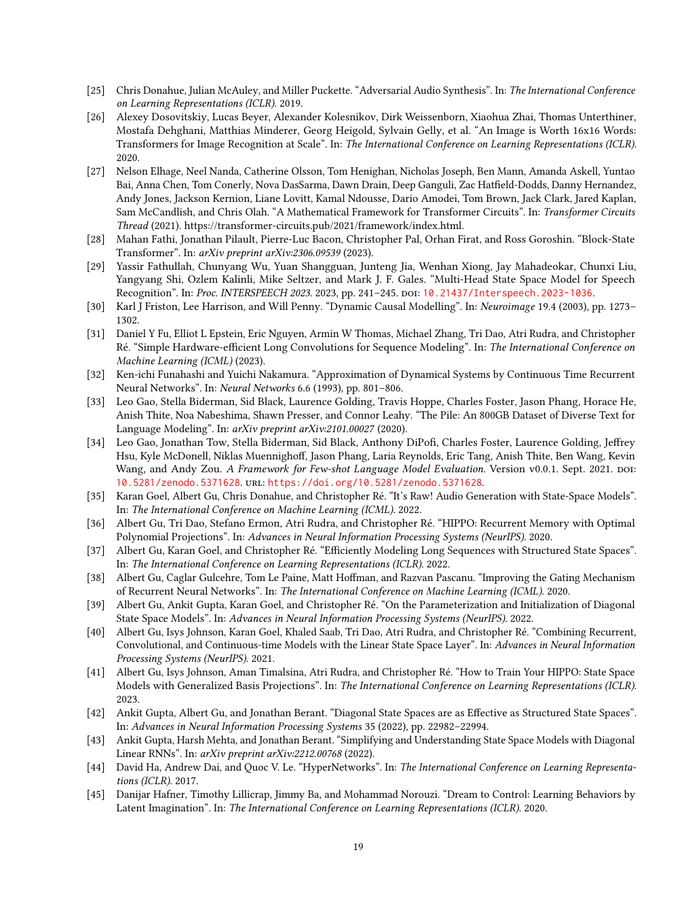

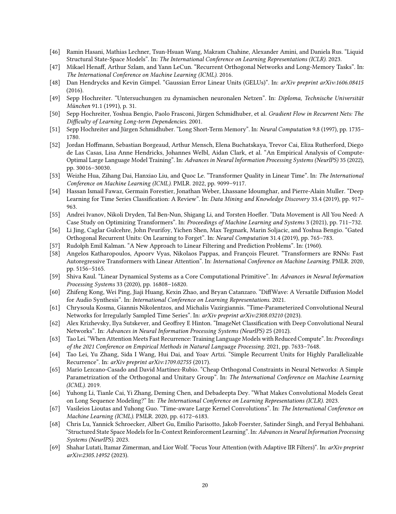

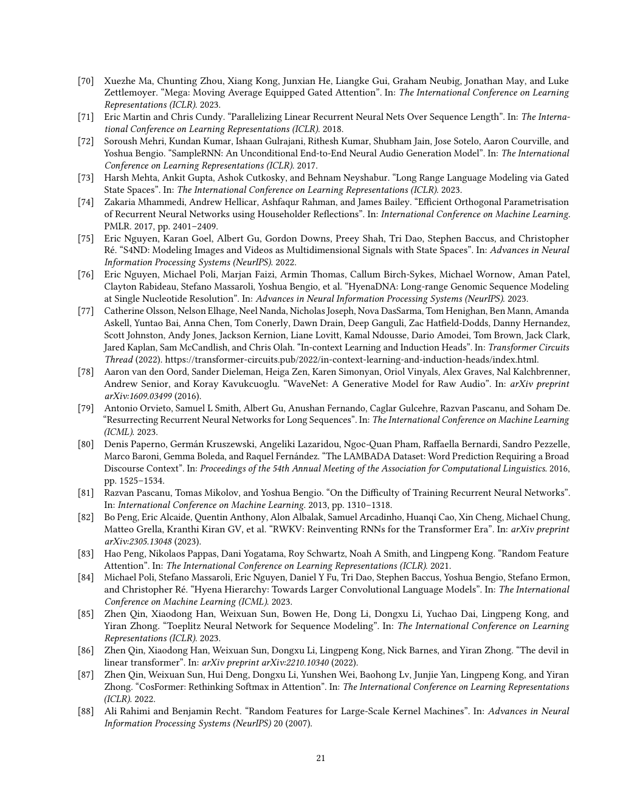

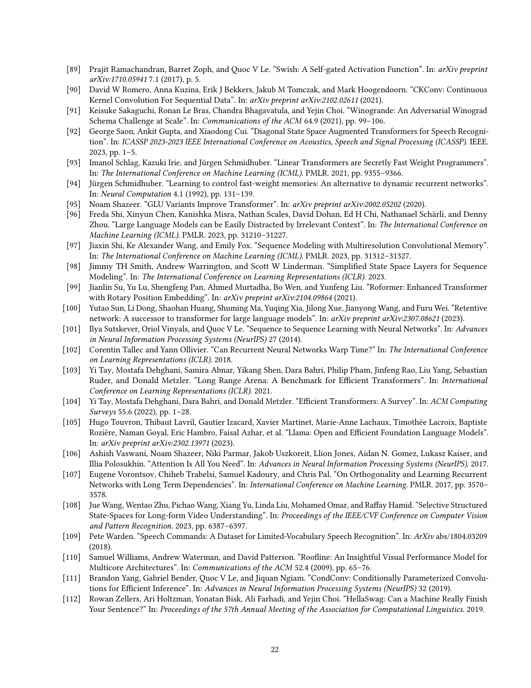

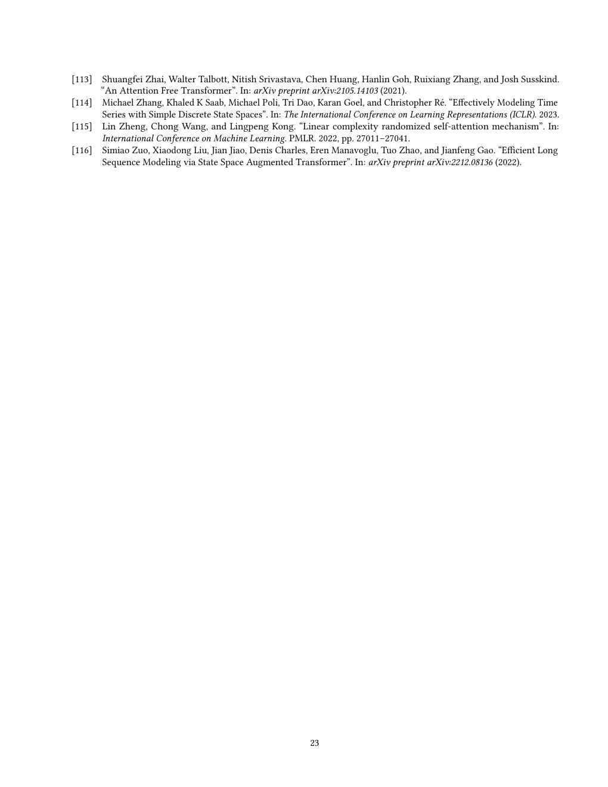

## 附录 A 选择机制讨论

本文的选择机制受到门控、超网络和数据依赖等概念启发，也与它们相关。它还可视为与“快速权重”有关；快速权重把经典 RNN 与线性注意力机制连接起来。不过，作者认为选择机制是一个值得单独澄清的不同概念。

### A.1 门控

门控最初指 LSTM、GRU 等 RNN 的门控机制，或定理 1 方程中的门控形式。它被理解为控制是否允许输入进入 RNN 隐藏状态的特定机制，因而会影响信号随时间传播，并使输入沿序列长度维度发生交互。

但在当下的常见用法中，“门控”已经被放宽为任意乘法交互，通常还带激活函数。例如，神经网络架构中的逐元素乘法组件，即使不沿序列长度交互，也经常被称为门控架构。作者因此认为，RNN 门控的原始概念与乘法门控的流行用法，实际具有非常不同的语义。

### A.2 超网络与数据依赖

超网络指其参数本身由较小神经网络生成的神经网络。最初的狭义定义，是让较大 RNN 的循环参数由较小 RNN 生成；相关变体已有很长历史。与超网络类似，“数据依赖”可以指模型某些参数依赖数据的任意形式。

### A.3 示例：GLU 激活

考虑简单的对角线性层 $y=\mathbf D x$，其中 $\mathbf D$ 是对角权重参数。再假设 $\mathbf D$ 本身由 $x$ 的线性变换生成，并可选非线性：$\mathbf D=\sigma(\mathbf W x)$。由于它是对角矩阵，乘法变成逐元素乘积：

$$
y=\sigma(\mathbf W x)\circ x.
$$

这是一项相当平凡的变换，却在技术上同时满足门控、超网络和数据依赖的常见定义：它有乘法分支，参数 $\mathbf D$ 由另一层生成，同时 $\mathbf D$ 又依赖数据 $x$。然而，它实际上只定义了一个 GLU 函数，简单到常被视为激活函数，而不是有意义的独立层。

### A.4 选择

选择机制可以被看作架构门控、超网络或数据依赖的特例，但范围极广的其他结构也都可以如此归类——本质上，任何含乘法的结构都可以，包括标准注意力。作者认为这种归类并不能提供有效信息。

相反，选择机制与传统 RNN 的门控机制最接近。传统门控是其特例，并且通过依赖输入的可变 $\Delta$ 离散化，与 SSM 有更深的历史联系。为避免“门控”一词的重载，本文改用“选择”。更狭义地说，选择指模型选取或忽略输入，并促进数据沿序列长度交互的机械行为。除选择性 SSM 和门控 RNN 外，依赖输入的卷积乃至注意力也可能属于其他例子。

## 附录 B 相关工作

本文方法最接近的工作包括 S4、S5、准 RNN 等循环层，以及 H3、RetNet、RWKV 等端到端架构。

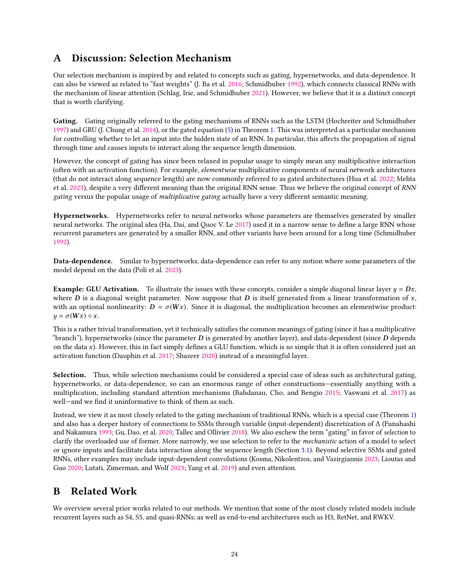

### B.1 S4 变体与派生方法

- **S4**提出第一个结构化 SSM，描述了对角结构及对角加低秩结构。由于它与连续时间在线记忆 HIPPO 的联系，S4 聚焦 DPLR SSM 的高效卷积算法。
- **DSS**首先通过近似 HIPPO 初始化发现对角结构化 SSM 的实证有效性；S4D 随后从理论上扩展这一结果。
- **S5**独立发现对角 SSM 近似，也是第一个用并行扫描循环计算的 S4 模型。但它必须降低有效状态维度，因此把 SSM 从单输入单输出改为多输入多输出。本文的 S6 同样使用扫描，但保持更大有效循环状态的 SISO 维度，用硬件感知算法克服计算难题，并增加选择机制。
- 有工作把 S5 用于元强化学习，以处理不同回合轨迹之间的 SSM 状态重置。这可以看作一种硬编码选择机制：手工把 $\mathbf A$ 设为 0，而不是像本文一样学习依赖输入的机制。把通用选择性 SSM 用于这一设置，并检查模型是否学会在回合边界自动重置状态，是一个有趣方向。
- **Mega**把 S4 从复数简化为实数，并将其解释为指数移动平均。它还把 SSM 离散化步骤与 EMA 阻尼项联系起来。与早期 S4 论文不同，Mega 首次表明，实数 SSM 在特定设置或结合不同架构组件时具有实证效果。
- **Liquid S4**同样以使用依赖输入的状态转移增强 S4 为动机。从这一角度看，它与选择机制相似，但形式受限，仍通过卷积计算并接近 LTI。
- **SGConv、Hyena、LongConv、MultiresConv 和 Toeplitz Neural Network**都聚焦 S4 的卷积表示，并用不同参数化构造全局或长卷积核；但它们不能直接进行快速自回归推理。

值得强调的是，作者所知的所有上述方法和其他结构化 SSM 都是非选择性的，而且通常严格满足线性时不变性。

### B.2 SSM 架构

本文用 SSM 架构或状态空间神经网络（SSNN）指把上述 SSM 作为黑箱层纳入的深度神经网络。

- **GSS**是第一个纳入 SSM 的门控神经网络架构，受门控注意力单元启发，外观与 Mamba 块相似，但包含额外投影。最重要的区别是：GSS 的投影收缩模型维度以减小 SSM 状态，Mamba 则扩展模型维度以增大状态。
- **Mega**把前述 S4 的 EMA 简化形式纳入使用高效注意力近似的混合架构。
- **H3**以结合 S4 和线性注意力为动机，是第一个把线性注意力形式推广到更一般循环的模型，也成为后续架构的基础。
- **Selective S4**把 S4 作为黑箱生成与输入相乘的二值掩码。虽然名称同样含“选择”，作者认为这是更接近架构门控的架构修改，而不是选择机制。它很可能无法求解选择性复制，因为只屏蔽无关输入不会改变相关输入之间的间距；若噪声词元嵌入为 0，选择性复制本身甚至可以看作已经预先屏蔽。

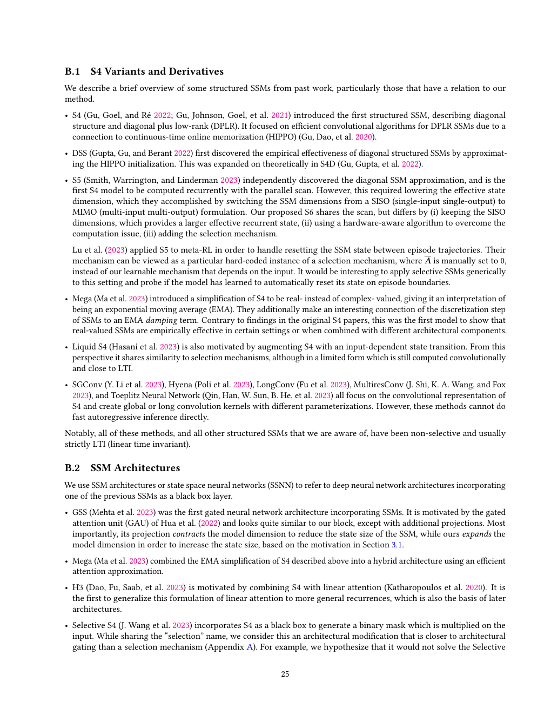

- **RetNet**同样建立在线性注意力之上，与 H3 很相似，但把内部 S4 层缩减为状态维度 $N=1$ 的特例。它的循环虽未被如此描述，但可以看作线性 SSM 的一个特例。RetNet 的主要改进来源，是采用较大头维度的线性注意力；这也可以理解为另一种依赖输入的状态扩展。H3 最先在线性注意力变体中使用较大头维度，但因为计算量同比增加而未得到广泛采用。RetNet 的特殊 SSM 只是简单 EMA，因此可以用标准多头注意力的变体而非卷积来并行计算，从而规避这一问题。
- **RWKV**是另一种为语言建模设计的较新 RNN，基于无注意力 Transformer 这一线性注意力变体。其主要 WKV 机制包含 LTI 循环，可视为两个 SSM 的比值。

门控注意力单元把 Transformer 的多头注意力和 MLP 块合并，对本文把 H3 与 MLP 块合并的架构也构成启发。

### B.3 与 RNN 的关系

RNN 与 SSM 都在潜在状态上执行循环，因此有广泛联系。强类型 RNN、准 RNN 和简单循环单元等较早模型，包含没有逐时间非线性的门控 RNN。由于门控机制与选择机制的联系，它们可以视为选择性 SSM 的特例，从某种意义上说，比前述 LTI 结构化 SSM 家族更强。主要区别是：

- 它们不使用状态扩展，即 $N=1$，也没有选择性 $\mathbf B、\mathbf C$；实验表明两者都对性能重要。
- 它们采用启发式门控；本文把门控推广为选择机制与离散化的结果。与原则性 SSM 理论的联系带来更好的参数化和初始化。

较早 RNN 还因顺序性而受到效率低和梯度消失问题困扰。某些模型的效率问题可以用并行扫描解决，但在后来的 SSM 理论出现以前，梯度消失较难处理。现代结构化 SSM 通过受经典状态空间理论启发的离散化或直接分析，更谨慎地参数化循环动力学。

正交 RNN 的长期研究路线通过限制转移矩阵 $\mathbf A$ 为正交或酉矩阵，控制特征值并防止梯度消失；但它们也有其他局限。作者认为根源在于正交或酉 RNN 仍然是 LTI。它们几乎总是在可以完美求解的普通复制任务上评估，却被观察到难以处理选择性复制。

### B.4 线性注意力

线性注意力框架推广了核注意力，并揭示它与循环自回归模型的关系。许多变体提出不同核与修改：随机特征注意力用高斯核的随机傅里叶特征近似 softmax 的指数特征映射；Performer 找到只含正特征的指数核近似，并能保留 softmax 归一化项；TransNormer 指出线性注意力分母可能不稳定，提议用 LayerNorm 替代；cosFormer 增加余弦重加权，把位置信息纳入并强调局部性；线性随机注意力则从重要性采样角度推广随机特征注意力，更好地估计完整 softmax 核。

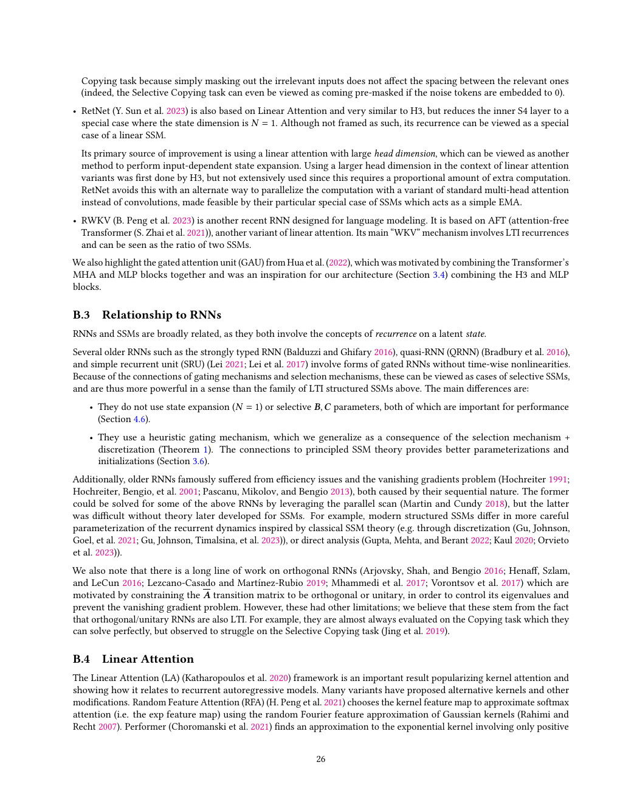

### B.5 长上下文模型

长上下文已成为热门主题，不少近期模型声称能够扩展到越来越长的序列，但这些说法往往只从计算角度出发，缺乏充分实证验证：

- **Recurrent Memory Transformer**是 Transformer 骨干的轻量封装，曾在合成记忆任务上泛化到 100 万长度；其主要结果与本文归纳头外推实验相似。
- **LongNet**声称可扩展到 10 亿长度，但真实任务只评估到不足 10 万。
- **Hyena 与 HyenaDNA**声称能够利用 100 万上下文，但它们在更长上下文上按比例使用更多数据，因而难以判断质量改善来自上下文长度，还是更多数据与计算。
- **Sparse Transformer**用跨步稀疏注意力对长度 $2^{20}=1,048,576$ 的音频波形建模，展示了概念验证，但没有讨论控制计算量和模型规模后的性能取舍。

相比之下，作者认为本文是最早真正证明性能能够随上下文变长而提升的方法之一。

## 附录 C 选择性 SSM 的机制

### C.1 定理 1 的证明

考虑满足 $N=1$、$\mathbf A=-1$、$\mathbf B=1$、$s_\Delta=\operatorname{Linear}(x)$、$\tau_\Delta=\operatorname{softplus}$ 的选择性 SSM。对应的连续时间系统为：

$$
h'(t)=-h(t)+x(t),
$$

这也称为泄漏积分器。离散化步长为：

$$
\Delta_t=\operatorname{softplus}(\text{Parameter}+\operatorname{Linear}(x_t))
=\operatorname{softplus}(\operatorname{Linear}(x_t)),
$$

其中参数可以视为可学习偏置，并入线性投影。应用零阶保持离散化公式可得：

$$
\bar{\mathbf A}_t=\exp(\Delta\mathbf A)
=\frac{1}{1+\exp(\operatorname{Linear}(x_t))}
=1-\sigma(\operatorname{Linear}(x_t)),
$$

$$
\bar{\mathbf B}_t=(\Delta\mathbf A)^{-1}(\exp(\Delta\mathbf A)-\mathbf I)\Delta\mathbf B
=1-\bar{\mathbf A}
=\sigma(\operatorname{Linear}(x_t)).
$$

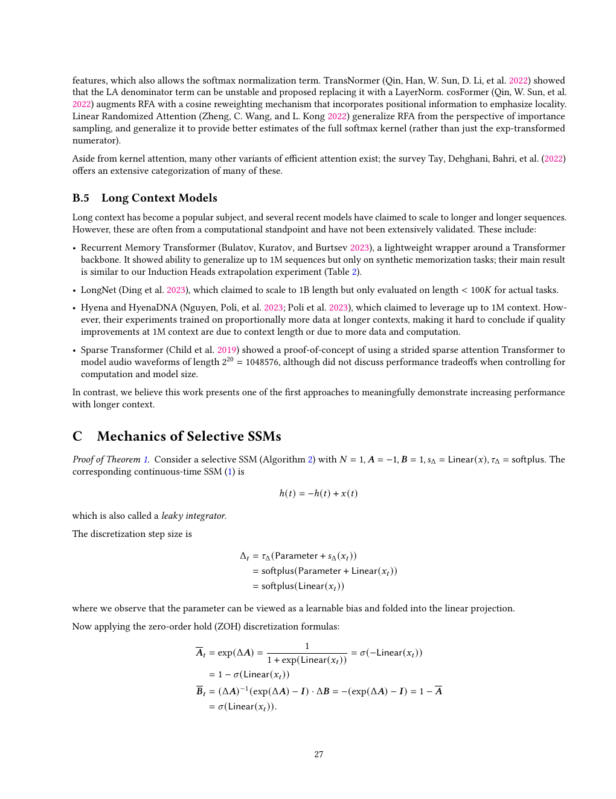

因此最终离散循环为：

$$
g_t=\sigma(\operatorname{Linear}(x_t)),\qquad
h_t=(1-g_t)h_{t-1}+g_tx_t,
$$

证毕。

## 附录 D 选择性 SSM 的硬件感知算法

没有输入依赖选择性时，SSM 可以借助快速傅里叶变换作为原语，高效实现为卷积。加入选择性后，SSM 不再等价于卷积，但仍可利用并行结合扫描。SSM 扫描在理论上需要 $O(BLDN)$ 次浮点运算，随 $L$ 线性增长；若要用它训练基础模型，还必须让它在现代 GPU 上实际高效。本文通过算子融合与重计算，使扫描兼具速度和内存效率。速度实验表明，序列长度 32K 时，它最高比注意力快 7 倍，并与最佳注意力实现 FlashAttention 一样节省内存。

### D.1 速度

现代 GPU 上除矩阵乘法外的大多数操作受内存带宽约束，扫描同样如此。本文用算子融合减少内存输入输出，相比标准实现显著加速。

标准扫描实现会先在 GPU HBM 中准备大小为 $(B,L,D,N)$ 的 $\bar{\mathbf A}$ 和 $\bar{\mathbf B}$，调用并行结合扫描，把同样大小的扫描输出写回 HBM，再用 $\mathbf C$ 与扫描输出相乘，生成大小为 $(B,L,D)$ 的输出。这需要 $O(BLDN)$ 量级的内存读写。本文把离散化、扫描和与 $\mathbf C$ 相乘融合为一个核：

1. 从较慢 HBM 向较快 SRAM 读取 $O(BLD+DN)$ 字节的 $\Delta、\mathbf A、\mathbf B、\mathbf C$。
2. 在 SRAM 中离散化，生成大小为 $(B,L,D,N)$ 的 $\bar{\mathbf A}、\bar{\mathbf B}$。
3. 执行并行结合扫描，在 SRAM 中得到大小为 $(B,L,D,N)$ 的中间状态。
4. 与 $\mathbf C$ 相乘并求和，得到大小为 $(B,L,D)$ 的输出，再写回 HBM。

这样把输入输出访问量减少了 $O(N)$ 倍，实际使操作加速 20–40 倍。若序列过长，无法完整装入远小于 HBM 的 SRAM，就把序列切成分块，逐块执行融合扫描；只要保存块间扫描状态，就可以继续处理下一块。

### D.2 内存

本文使用经典重计算技术，降低选择性 SSM 层训练的总内存需求。融合前向传播不会保存大小为 $(B,L,D,N)$ 的中间状态，以避免内存爆炸；但反向传播需要这些状态，所以改为在反向传播时重新计算。

从 HBM 读入 SRAM 的 $\Delta、\mathbf A、\mathbf B、\mathbf C$ 与输出梯度为 $O(BLN+DN)$，输入梯度也为同一量级。重计算因此避免从 HBM 读取 $O(BLND)$ 个元素，反而比存下中间状态再读回更快。

除了扫描本身，本文还重计算整个选择性 SSM 块中的高内存、低重算代价中间激活，包括输入投影、卷积、激活、扫描和输出投影。例如，激活函数输出和短卷积结果都不保存。最终，选择性 SSM 层与使用 FlashAttention 的优化 Transformer 具有相同内存需求。

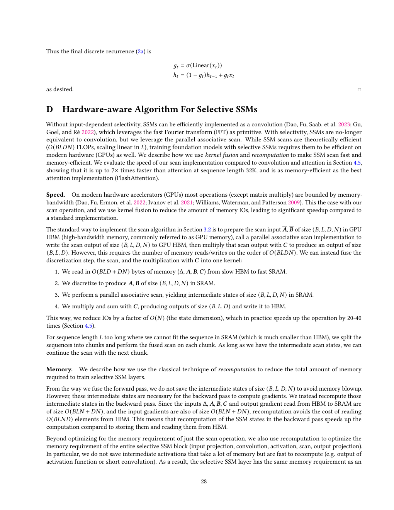

每个 FlashAttention 注意力层每词元约保存 12 字节激活，每个 MLP 层约保存 20 字节；假设采用 FP16 或 BF16 混合精度，合计约 32 字节。每个选择性 SSM 每词元约保存 16 字节，所以两层选择性 SSM 与一个注意力层加一个 MLP 层的激活内存大致相同。

## 附录 E 实验细节与补充结果

### E.1 合成任务

**选择性复制。** 序列长度为 4096，词表包含 16 种可能词元，其中包括图 2 的白色噪声词元；模型需要记住 16 个数据词元。采用两层模型，模型维度 $D=64$。训练 40 万步，恒定学习率 0.0001，批大小 64。

**归纳头。** 每一步随机生成训练数据，批大小 8。一个“轮次”定义为 8192 步，并在各目标长度的固定随机验证集上跟踪准确率。MHA-Abs 与 Mamba 报告第 25 轮、共 204,800 步的结果；MHA-RoPE 与 MHA-xPos 报告第 50 轮、共 409,600 步的结果；LTI H3 与 Hyena 在第 10 轮即已收敛且不再改善，因此报告第 10 轮、81,920 步的结果。

优化器使用 Adam，不使用权重衰减。所有模型都分别以恒定学习率 $2\times10^{-4}$ 和 $10^{-3}$ 训练，并报告较好结果；除 Mamba 外，其他模型最佳学习率都是前者。注意力与 Hyena 在 $10^{-3}$ 下没有学会任务。H3 在两种学习率下都能学习，但较小学习率对较短序列的泛化更好。Mamba 在两种学习率下都能学习，但较大学习率的外推能力更强。

### E.2 语言建模

#### E.2.1 缩放定律细节

缩放定律实验总体沿用 GPT-3 配方；所有模型都在 Pile 上使用 GPT-2 分词器训练。表 12 的规模基本直接来自 GPT-3 规格，只作两处微调：第一，13 亿参数模型的批大小从 100 万词元改为 50 万，因为本文没有采用需要更大批量的高度并行；第二，训练步数与总词元数改为大致符合 Chinchilla 缩放定律，使训练词元随模型规模成比例增长。

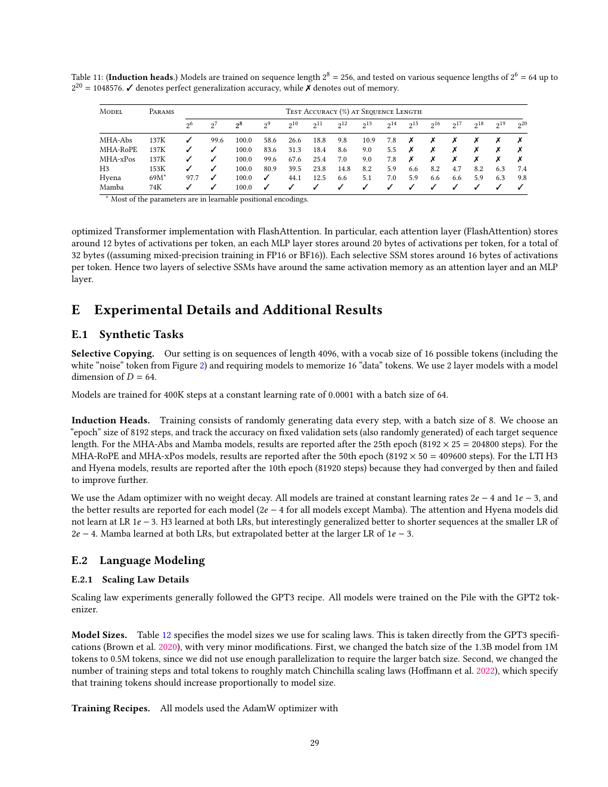

所有模型都使用 AdamW，并采用梯度裁剪 1.0、权重衰减 0.1、不使用 dropout、线性学习率预热与余弦衰减。默认峰值学习率采用 GPT-3 规格。

若干模型使用受 PaLM 与 LLaMA 等大型语言模型启发的“改进配方”：学习率先线性预热，再余弦衰减到 $10^{-5}$，峰值为 GPT-3 值的 5 倍；不使用线性偏置；用 RMSNorm 代替 LayerNorm；AdamW 的 $\beta$ 从 PyTorch 默认 $(0.9,0.999)$ 改为 GPT-3 使用的 $(0.9,0.95)$。

各架构与训练方式如下：

- **Transformer：** 基于 GPT-3 的标准 Transformer。
- **Transformer++：** 采用旋转位置编码、SwiGLU MLP 与上述改进训练配方。
- **Hyena：** 交替使用 Hyena 块与标准 MLP 块；Hyena 块即把 H3 中的 S4 换成由 MLP 参数化的全局卷积。MLP 扩展因子从 4 改为 2，同时层数增加 1.5 倍以保持参数量。
- **H3++：** 对 H3 作三项修改：采用 Hyena 的“窄”维度、使用改进训练配方、把线性注意力头维度设为 8。
- **RWKV：** 使用原论文默认模型和修改后的 MLP 块，并尽可能沿用其训练配方，例如把部分参数的学习率提高 2–3 倍。
- **RetNet：** 使用默认 RetNet 并套用改进训练配方。
- **Mamba：** 使用标准 Mamba 架构与改进训练配方。

#### E.2.2 其他缩放定律消融

**Mamba 架构：交错块。** 以“Mamba 块就是在标准 SwiGLU 块中增加一条卷积到 SSM 路径”为视角，得到两个自然消融：一是让 Mamba 与标准 MLP 交错，而非同质堆叠，这也等于移除一半 SSM；二是让 Mamba 与多头注意力块交错，这也等于在 Transformer++ 的 MLP 块中增加 SSM。

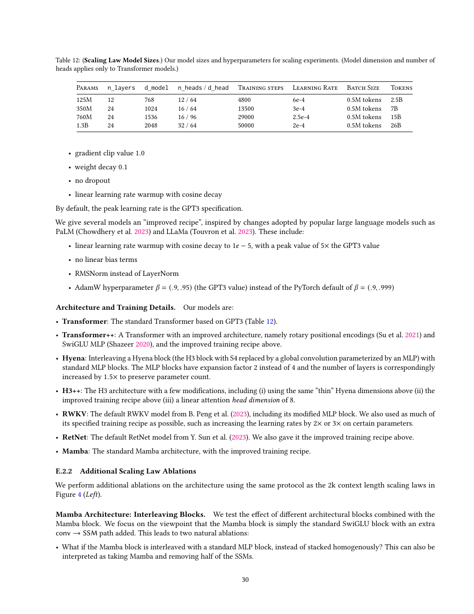

图 9 表明，两项变化影响都不大。Mamba-MLP 只稍差于原版，但仍优于除 Transformer++ 外的所有模型；Mamba-MHA 只稍好于原版。考虑到许多近期工作发现，LTI SSM 与注意力结合可带来显著改善，这一结果有些出乎意料。

**H3 架构：训练配方。** 研究进一步消融 Hyena 与 H3++ 的差异，以隔离训练配方的影响：Hyena 使用原始架构与 GPT-3 配方；Hyena+ 只改用前述改进配方；H3+ 再把 Hyena 卷积核替换为 S4D 卷积核；H3++ 又把线性注意力头维度设为 8，增加 SSM 循环内部计算但不增加参数。一般约定是“模型+”只改进训练配方，“模型++”还允许架构变化。

结果表明：改进训练配方带来巨大提升，主图中的 RetNet、H3++、Transformer++ 和 Mamba 都采用它；内部 LTI SSM 的具体选择并不重要，例如 Hyena 与 S4 几乎相同；扩大头维度会改善性能，与“扩展状态维度有益于 SSM”这一主题一致。

#### E.2.3 下游评估细节

预训练过程与缩放定律协议相同，但延长到 3000 亿词元，并把 GPT-2 分词器换为 GPT-NeoX。13 亿参数模型使用 100 万词元批大小，与 GPT-3 规格保持一致。Pile 验证集困惑度只与使用相同数据集、分词器训练的 Pythia 和 RWKV 比较。

下游评估使用 EleutherAI 的语言模型评估框架，任务包括 LAMBADA、HellaSwag、PIQA、ARC-challenge、较简单的 ARC-easy 子集与 WinoGrande。LAMBADA、WinoGrande、PIQA、ARC-easy 报告准确率；HellaSwag 与 ARC-challenge 报告按序列长度归一化的准确率，因为几乎所有模型在这两项任务上的归一化准确率更高。

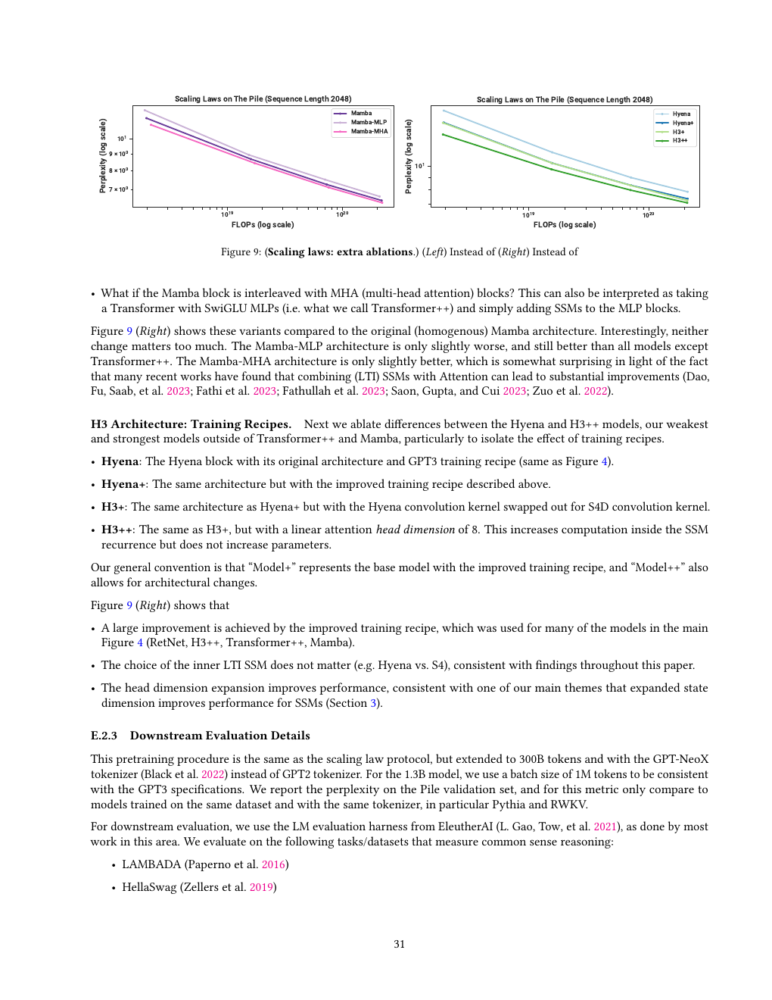

### E.3 DNA 建模

#### E.3.1 预训练细节

HG38 数据集沿用 Enformer 的基因组划分。训练集包含 $S=34,021$ 个长度 $2^{17}=131,072$ 的片段，覆盖整个基因组，总计约 45 亿词元即 DNA 碱基对。片段以“染色体编号、起始索引、结束索引”表示，并可在需要时扩展。

当训练序列长度不等于 $2^{17}$ 时，本文与 HyenaDNA 的处理不同。HyenaDNA 总是截取固定子片段，所以无论训练长度如何，每个轮次都固定为 34,021 个样本，也不一定遍历整个基因组。本文则使用全部训练数据：

- 当上下文长度 $L\le2^{17}$ 时，把每个片段切成不重叠的长度 $L$ 子片段；每轮样本数为 $S\times2^{17}/L$，总计仍约 45 亿词元。
- 当 $L>2^{17}$ 时，每个片段构造两个样本，一个以规定片段开头，一个以规定片段结尾。每轮包含 $2S$ 个项目和 $2SL$ 个词元。例如，长度 $2^{18}$ 时的词元是默认值的 4 倍，长度 $2^{20}$ 时为 16 倍。

其他训练细节大体沿用语言建模实验：AdamW 的 $(\beta_1,\beta_2)=(0.9,0.95)$，无 dropout，权重衰减 0.1，余弦学习率调度，前 10% 步数线性预热。

#### E.3.2 模型规模缩放细节

比较模型为使用 RoPE 的 Transformer++、用 H3 全局卷积替换注意力的 HyenaDNA，以及标准 Mamba。规模从 4 个块、维度 64、约 25 万参数，一直到 12 个块、维度 512、约 4070 万参数。Mamba 的块数加倍，因为 Transformer 或 Hyena 的一“层”同时包含注意力/H3 与 MLP，而两个 Mamba 块才能匹配相同参数量。

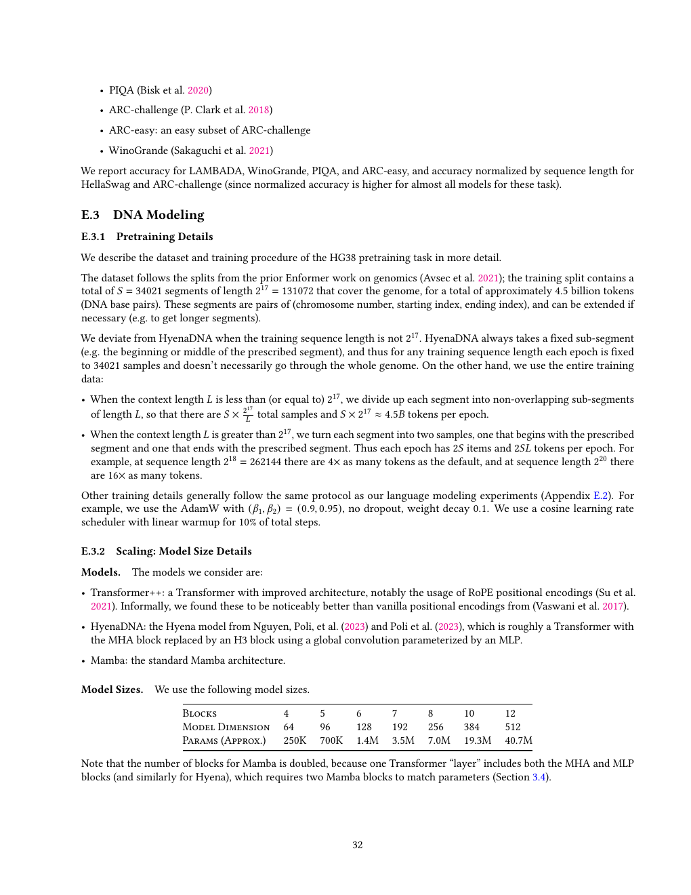

**训练。** 每种模型都在 $10^{-3}$、$2\times10^{-3}$、$4\times10^{-3}$、$8\times10^{-3}$ 四个学习率上扫描。Transformer 与 HyenaDNA 在所有规模下最佳学习率都是 $2\times10^{-3}$；Mamba 为 $8\times10^{-3}$。Mamba 在与基线匹配的学习率下已经更好，在更高学习率下又更稳定、更优；由于最优值位于扫描范围上沿，结果甚至可能仍非最优。

为简化实验，这里与标准语言模型缩放定律不同，学习率不随模型规模变化。理论上大模型的最优学习率应降低，但在实验覆盖的最多数百万参数规模内，作者没有发现明显影响。

#### E.3.3 上下文长度缩放细节

每个序列长度都使用每步总计 $2^{24}$、约 1600 万词元的批量。例如，长度 $2^{20}$ 时每批 16 个片段，长度 $2^{10}$ 时每批 16,384 个片段。按常见语言模型标准，这一批量相对模型规模很大；但在 8 块 GPU、长度 $2^{20}$ 上，$2^{23}$ 已是可行的最小批量，而 HyenaDNA 使用了大得多的 $2^{28}$。

Mamba 学习率为 0.008，HyenaDNA 为 0.001。作者最初尝试让 HyenaDNA 使用上一节的 0.002，但发现它在最长上下文上不稳定。

**序列长度预热。** 预训练从 $2^{10}=1,024$ 开始，在每个 2 的幂长度上训练两轮。数据构造使更长长度按比例处理更多步数与词元：长度不超过 $2^{17}$ 的每个阶段处理相同词元量，$2^{18}$、$2^{19}$、$2^{20}$ 分别处理 4 倍、8 倍和 16 倍。与 HyenaDNA 不同，本文始终控制每次梯度更新的词元数，因此每当长度翻倍，批大小就减半。

**说明 E.1。** 该调度没有调优，作者也没有尝试关闭 DNA 预训练中的序列长度预热。后来在相似长度的音频预训练中发现预热没有明显帮助，所以 DNA 预训练也可能不需要它。

#### E.3.4 物种即大型类人猿分类

模型是因果的，所以分类头只使用模型输出沿序列长度的最后一个元素。预训练目标在所有位置计算损失，因此保持“批大小 × 序列长度”恒定，序列越长批量越小。分类任务只有最后一个位置进入损失，因此批大小本身保持恒定；这也意味着对更长序列模型微调的计算成本更高。

训练共 10 轮，每轮 1024 次梯度更新，每步批大小 64。每个样本独立随机生成：均匀选择物种、均匀选择染色体，再均匀选择一段连续 DNA。

最大上下文超过 $2^{14}=16,384$ 的模型使用序列长度预热：在 $2^{14}$、$2^{15}$、$2^{16}$ 等长度上各训练一轮，直到最大长度。例如，最大长度 $2^{20}$ 的模型先预热 6 轮，再在最大长度训练 4 轮。

Hyena 学习率统一为 $4\times10^{-5}$，Mamba 为 $10^{-4}$。这些值来自在较短序列上的学习率扫描，并在 $2^{18}$ 上用简化扫描复核；$2^{20}$ 只运行一次，因为计算成本与长度成比例。学习率经过 5 轮线性预热到峰值，再用 5 轮余弦衰减到 $10^{-6}$。预热之所以异常漫长，是因为序列长度预热本身也很长；例如最大长度 $2^{20}$ 的模型，10 轮中有 6 轮都处于序列长度预热。作者没有消融这一选择。

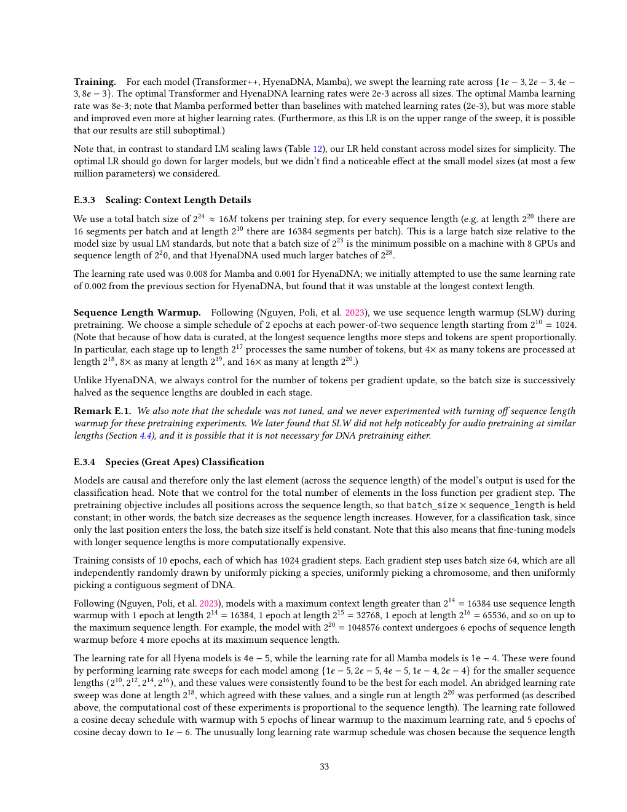

表 13 给出物种分类结果；随机猜测准确率为 20%。同上下文长度的预训练模型微调后，Mamba 在长序列上优势显著，尤其 700 万参数版本在 100 万长度达到 81.31%。

### E.4 音频细节

#### E.4.1 YouTubeMix 音频预训练

**模型。** 每个阶段使用 3 个块，共 $3\times5=15$ 个 Mamba 块；池化因子 $p=16$，外部维度 $D=64$，总参数约 350 万。

**数据集。** 音频用 8 位 μ-law 编码，因此模型处理词表大小 256 的离散词元。数据包含最长一分钟、长度 960,000 的片段，经下采样后切成所需序列长度。架构包含两次因子 16 池化，同时为硬件效率要求最终序列长度是 8 的倍数，因此最长可用序列为 $468\times2,048=958,464$。其他长度通过连续减半，再向上取整到 2,048 的最近倍数获得。不同长度除了批大小不同，有效训练片段数也不同，所以每个长度的每轮训练步数并不恒定，可能导致缩放曲线中的折点。

**训练。** 模型训练 20 万步，最大学习率 0.002，预热 2 万步即 10%，权重衰减 0.1，与跨模态通用预训练配方相近。

**补充消融：SSM 参数化。** 在长音频波形设置下进一步比较 SSM 参数化。实验稍作修改：模型变大为 8 层、$D=64$、约 600 万参数；序列改为 $2^{11}$ 到 $2^{18}$；学习率从 0.002 降到 0.001；训练从 20 万步缩短为 10 万步。

图 10 表明，从 S4 改为 S6，即增加选择机制，并非总有益。在长音频波形上，它反而显著损害性能。这可以从音频是均匀采样、非常平滑的连续信号理解，因此会受益于连续线性时不变方法的归纳偏置。

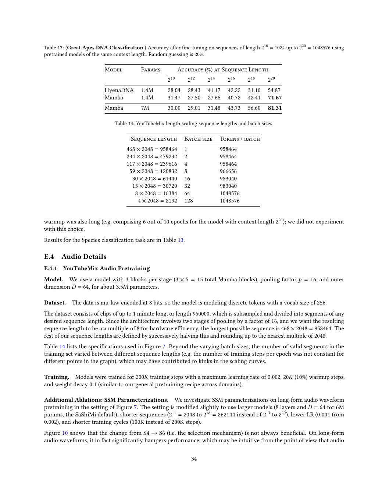

移除选择机制后，剩下的是 Mamba 块内部的 S4 层。为消除歧义，作者称其为 Mamba-S4，默认 Mamba 架构则称 Mamba-S6。

若保持 U-Net 外层为 Mamba-S4，只消融内部层，性能差异会大幅缩小。这进一步支持一个假设：越接近原始音频信号的层越应当满足 LTI；一旦信号被外层“词元化”和压缩，内部层便不再必须满足 LTI。不过在此设置中，实数 SSM 仍不及复数 SSM。

#### E.4.2 SC09 语音生成

自回归训练大体采用语言建模协议：权重衰减 0.1；前 10% 步数进行学习率预热；AdamW 的 $\beta=(0.9,0.95)$；梯度裁剪阈值 0.1。学习率为 0.002，训练 20 万步，批大小 16。

表 4 的大型 Mamba 每阶段 15 层，外部维度 $D=96$，池化因子 4。数据集很小，训练遍历约 100 轮，因此大型模型的 BPB 或 NLL 明显过拟合；但生成样本的自动指标仍在整个训练过程中持续改善。

表 5 的架构消融模型每阶段 8 层，外部维度 $D=64$，池化因子 4。S4+MLP 块约有 $2D^2+4D^2$ 参数，Transformer 块约有 $4D^2+2D^2$ 参数，Mamba 块约有通常的 $6D^2$ 参数；所有模型总参数都约为 600 万。

### E.5 效率基准

**扫描操作。** 核心选择性 SSM 并行扫描与卷积、注意力在一块 A100 80GB PCIe GPU 上比较。这里不计核心操作之外的成本，例如全局卷积模型生成卷积核或注意力计算 QKV 投影的成本。

基线是在 PyTorch 中不做算子融合的标准并行扫描，需要在 HBM 中物化 $\bar{\mathbf A}、\bar{\mathbf B}、\mathbf C$。本文实现把离散化与并行扫描融合，避免在 HBM 中物化全部大型参数。

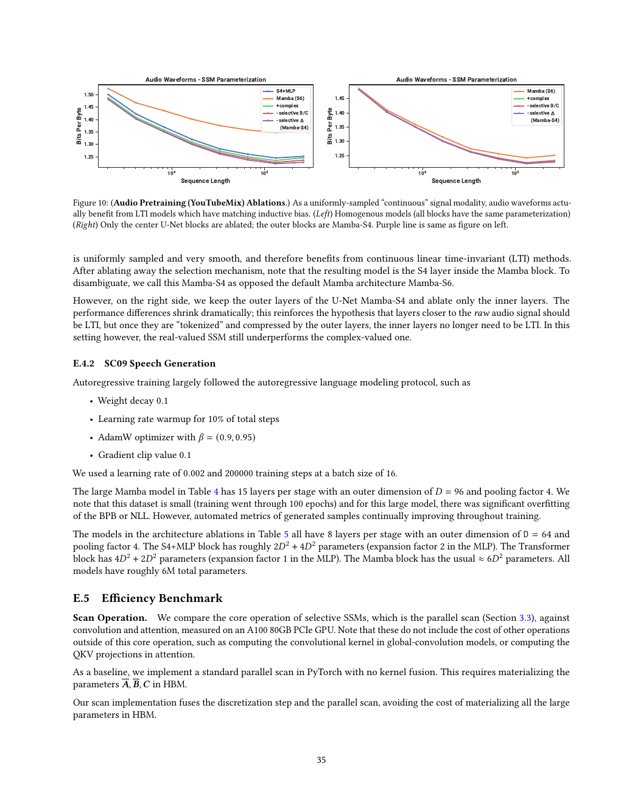

卷积使用 PyTorch 标准实现：分别对输入和滤波器执行 FFT，在频域相乘，再逆 FFT 得到结果；理论复杂度为 $O(L\log L)$。注意力使用作者所知最快的带因果掩码 FlashAttention-2；因果掩码只需计算约一半注意力项，所以比无掩码版本快约 1.7 倍。

测试批大小为 1，序列从 $2^9=512$ 增加到 $2^{19}$、约 50 万；部分基线在达到 50 万前已显存溢出。模型维度 $D=1,024$，状态维度 $N=16$，输入采用大规模训练常用的 BF16。

**端到端推理。** 比较 Mamba-1.4B 与未经训练的 Mamba-6.9B，同标准 GPT-3 Transformer-1.3B 和 Transformer-6.7B 的吞吐量。Transformer 使用 Hugging Face `transformers` 标准实现。提示长度为 2,048，生成长度为 128；批大小从 1、2、4、8、16、32、64 增加到 128。测量生成 128 个词元所需时间，并按“批大小 × 128 ÷ 时间”计算每秒词元数。每项重复三次取平均，硬件为 A100 80GB PCIe。

**内存基准。** 与大多数深层序列模型一样，内存使用随激活张量大小成比例增长。实验在一块 A100 80GB 上测量 1.25 亿参数模型的训练内存，每批序列长度 2,048；比较对象是作者所知最节省内存的 Transformer 实现，使用 `torch.compile` 算子融合与 FlashAttention-2。表 15 显示，Mamba 的内存需求与高度优化的同规模 Transformer 相近。批大小从 1 增至 32 时，Transformer 使用 4.6GB 到 34.5GB，Mamba 使用 4.8GB 到 38.2GB。作者预计 Mamba 的内存占用未来还能进一步改善。

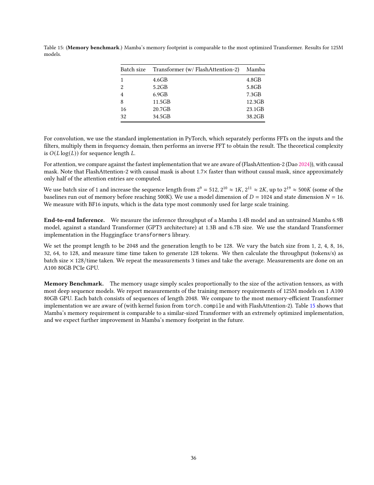
