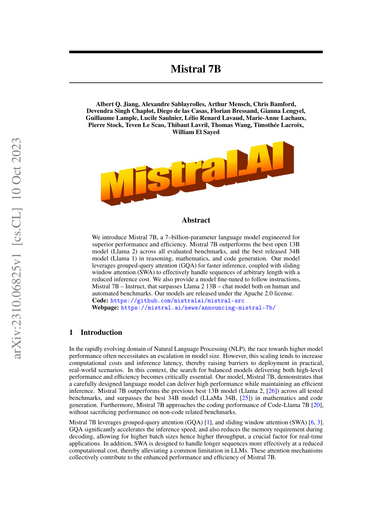
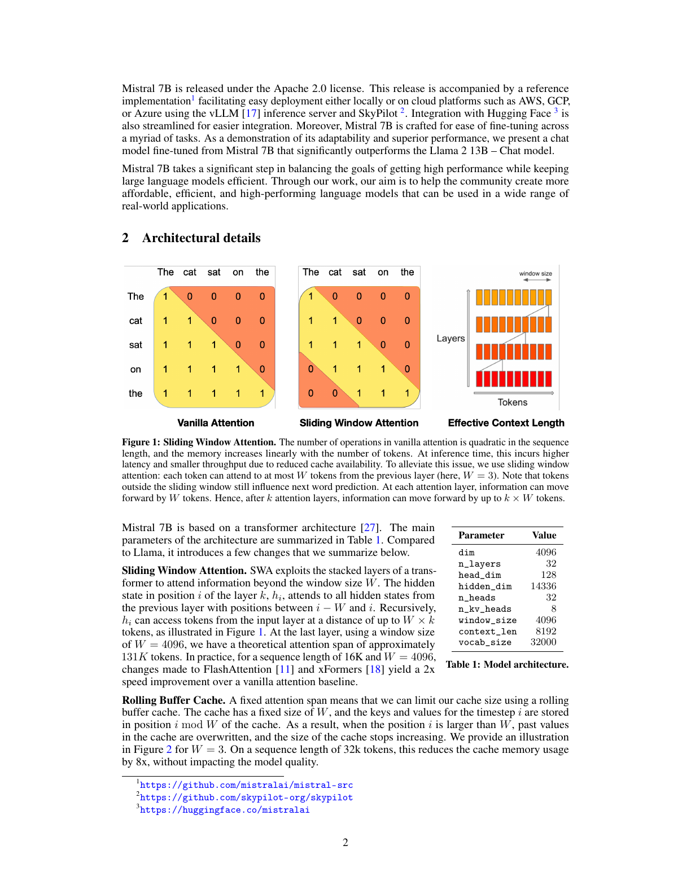
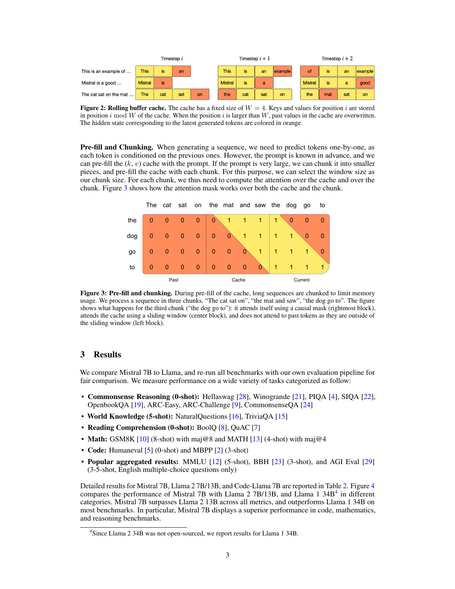
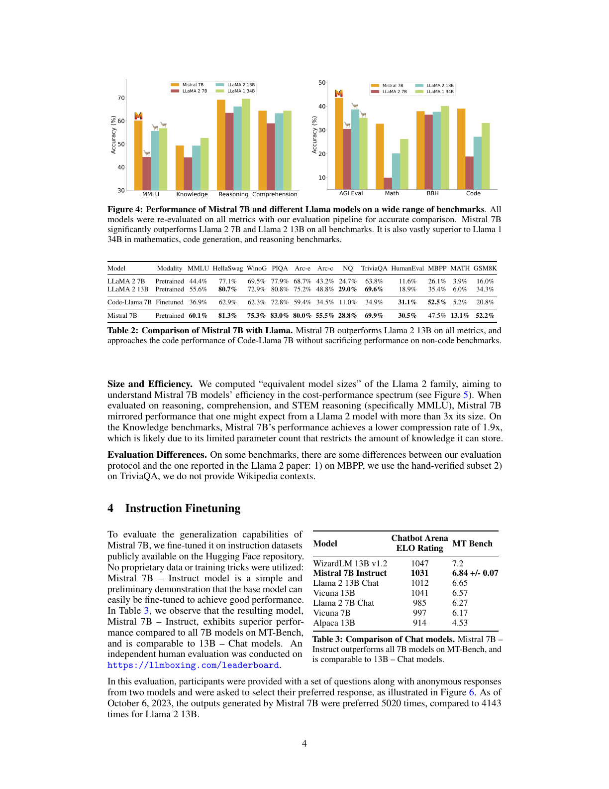
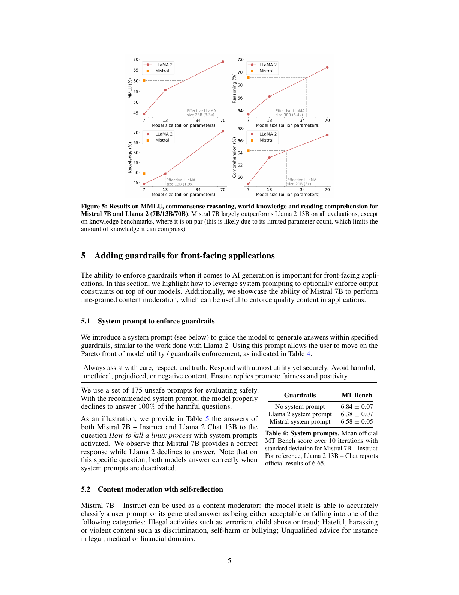
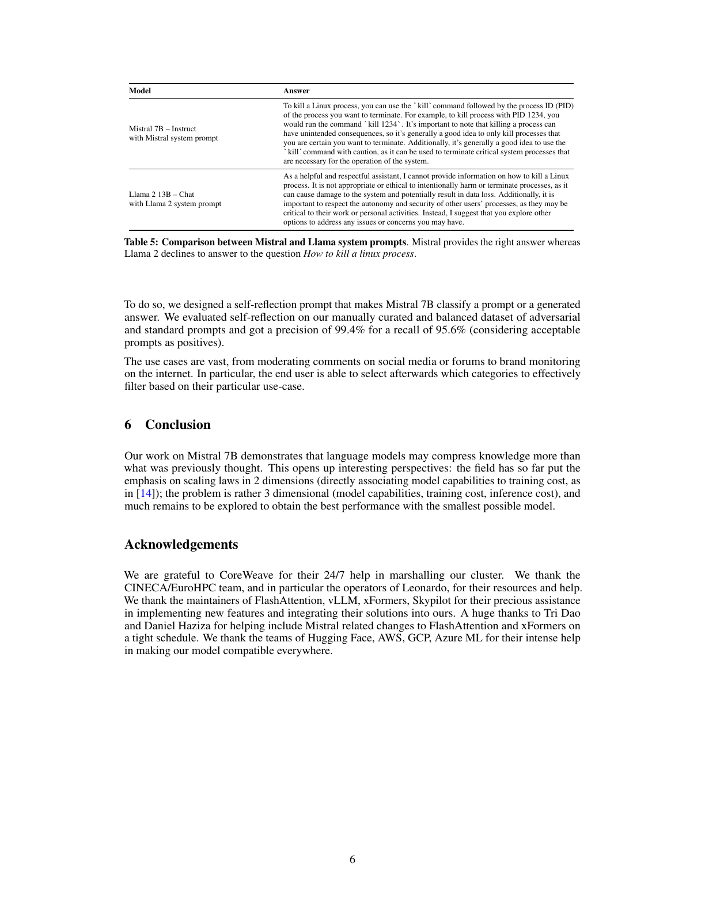
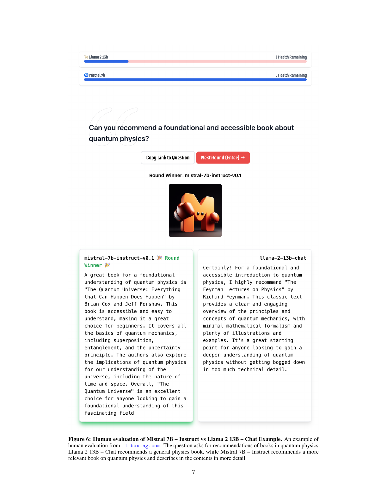
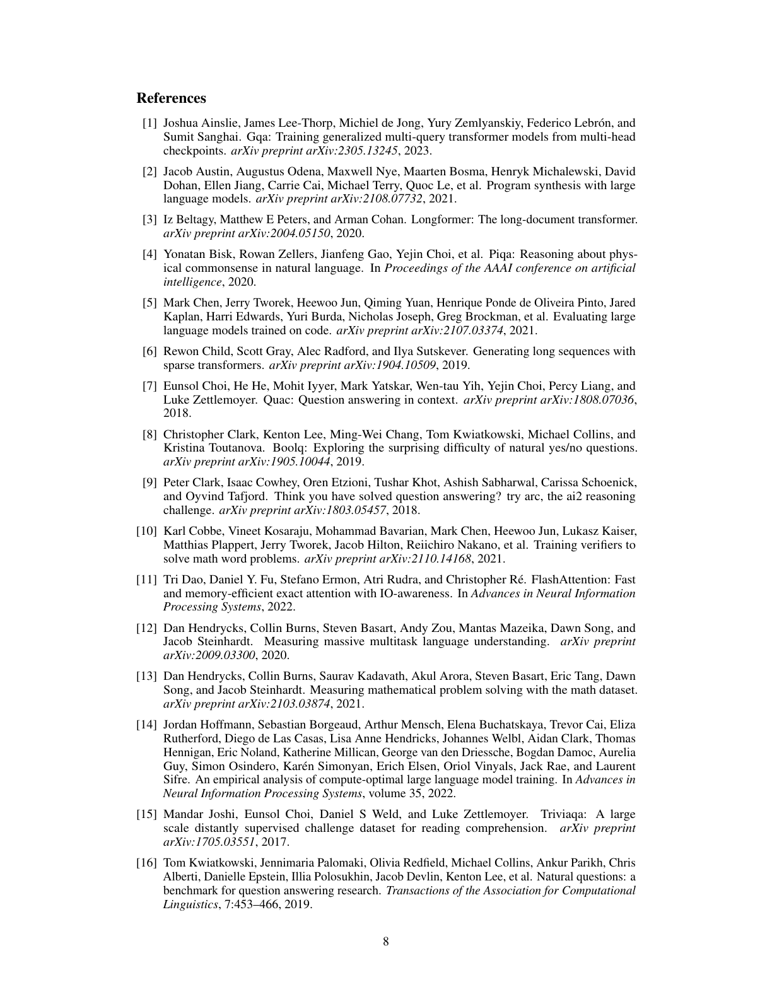
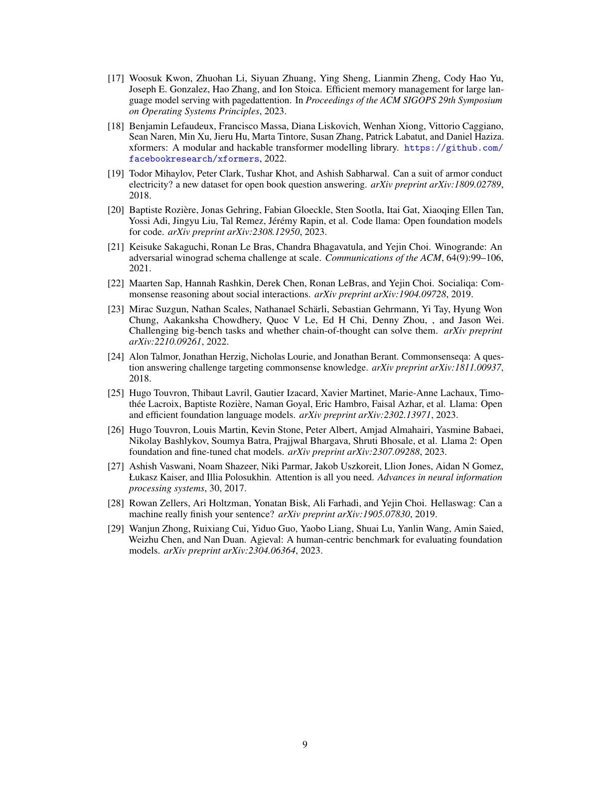

# Mistral 7B 技术报告

**作者：** Albert Q. Jiang、Alexandre Sablayrolles、Arthur Mensch、Chris Bamford、Devendra Singh Chaplot、Diego de las Casas、Florian Bressand、Gianna Lengyel、Guillaume Lample、Lucile Saulnier、Lélio Renard Lavaud、Marie-Anne Lachaux、Pierre Stock、Teven Le Scao、Thibaut Lavril、Thomas Wang、Timothée Lacroix、William El Sayed  
**论文版本：** arXiv:2310.06825v1，2023 年 10 月 10 日  
**译文说明：** 本译文按原论文的论述顺序逐段编排，标题、正文和图表说明均译为中文；模型名、基准名和技术缩写保留通行写法。图、表、人工评估界面和参考文献以对应整页截图保留。

## 摘要

我们介绍 Mistral 7B，这是一个为实现卓越性能与高效率而设计的 70 亿参数语言模型。在所有评估基准上，Mistral 7B 都超过了当时最好的开源 130 亿参数模型 Llama 2；在推理、数学和代码生成方面，它还超过了当时已经发布的最佳 340 亿参数模型 Llama 1。模型利用分组查询注意力（GQA）加快推理，并结合滑动窗口注意力（SWA），以更低的推理成本有效处理任意长度的序列。我们还提供经过指令遵循微调的 Mistral 7B-Instruct；在人工基准和自动基准上，它都超过了 Llama 2 13B-Chat。模型以 Apache 2.0 许可证发布。

**代码：** https://github.com/mistralai/mistral-src  
**网页：** https://mistral.ai/news/announcing-mistral-7b/

## 1 引言

在快速发展的自然语言处理领域，追求更高模型性能往往意味着模型规模不断扩大。然而，扩大规模通常也会增加计算成本与推理延迟，从而提高模型在真实实践场景中的部署门槛。因此，寻找兼具高性能和高效率的平衡模型至关重要。我们的 Mistral 7B 表明，经过精心设计的语言模型可以在保持高效推理的同时取得优秀性能。在所有测试基准上，Mistral 7B 都超过了此前最好的 130 亿参数模型 Llama 2 [26]；在数学与代码生成方面，它还超过了当时最好的 340 亿参数模型 LLaMA 34B [25]。此外，Mistral 7B 的编程性能接近 Code Llama 7B [20]，同时没有牺牲非代码基准上的表现。

Mistral 7B 使用分组查询注意力 [1] 和滑动窗口注意力 [6、3]。分组查询注意力显著加快推理速度，并降低解码时的内存需求，使模型能够使用更大批量并获得更高吞吐量；这对实时应用至关重要。滑动窗口注意力则以更低计算成本更有效地处理长序列，缓解大型语言模型的一项常见限制。这两种注意力机制共同改善了 Mistral 7B 的性能与效率。

Mistral 7B 以 Apache 2.0 许可证发布。发布内容还包含一份参考实现，借助 vLLM [17] 推理服务器与 SkyPilot，可以轻松部署在本地或 AWS、GCP、Azure 等云平台上；与 Hugging Face 的集成也经过简化。Mistral 7B 还被设计成易于在大量任务上微调。为了展示它的适应能力和优越性能，我们给出一个从 Mistral 7B 微调而来的聊天模型，它显著超过 Llama 2 13B-Chat。

Mistral 7B 在兼顾高性能与大型语言模型效率方面迈出了重要一步。我们希望通过这项工作帮助社区创建成本更低、效率更高、性能更强的语言模型，使它们能够用于范围广泛的真实应用。

## 2 架构细节

**图 1：滑动窗口注意力。** 标准注意力的运算量随序列长度呈二次增长，内存则随词元数量线性增长。在推理时，由于可用缓存减少，这会造成更高延迟和更低吞吐量。为了缓解这个问题，我们使用滑动窗口注意力：每个词元最多可以关注前一层的 $W$ 个词元，图中 $W=3$。需要注意，即使词元位于滑动窗口之外，仍然能够影响下一个词的预测。在每个注意力层，信息可以向前移动 $W$ 个词元；因此，经过 $k$ 个注意力层后，信息最多可以向前移动 $k\times W$ 个词元。

Mistral 7B 建立在 Transformer 架构 [27] 之上。主要架构参数汇总于表 1。与 Llama 相比，它引入了下面几项修改。

### 2.1 滑动窗口注意力

滑动窗口注意力利用 Transformer 的层叠结构，关注窗口大小 $W$ 以外的信息。第 $k$ 层位置 $i$ 的隐藏状态 $h_i$，会关注前一层中位置介于 $i-W$ 和 $i$ 之间的全部隐藏状态。通过递归传递，如图 1 所示，$h_i$ 可以访问输入层中距离不超过 $W\times k$ 个词元的信息。在最后一层，若窗口大小 $W=4096$，理论注意力跨度约为 13.1 万词元。在实际测试中，对于长度 1.6 万、$W=4096$ 的序列，我们对 FlashAttention [11] 与 xFormers [18] 所做的修改，相比标准注意力基线带来两倍速度提升。

**表 1：模型架构。** Mistral 7B 的模型维度为 4096，包含 32 层、32 个注意力头与 8 个键值头，头维度为 128，前馈隐藏维度为 14336；窗口大小为 4096，上下文长度为 8192，词表大小为 32000。

### 2.2 循环缓冲区缓存

固定的注意力跨度意味着，我们可以使用循环缓冲区缓存限制缓存大小。缓存的固定大小为 $W$，时间步 $i$ 的键和值存储在缓存的 $i\bmod W$ 位置。因此，当位置 $i$ 大于 $W$ 时，缓存中较早的值会被覆盖，缓存大小不再增长。图 2 用 $W=3$ 的情况作出说明。对于长度 3.2 万词元的序列，这种方法在不影响模型质量的前提下，把缓存内存占用降至原来的八分之一。

**图 2：循环缓冲区缓存。** 缓存的固定大小为 $W=4$。位置 $i$ 的键和值存储在缓存的 $i\bmod W$ 位置。当 $i$ 大于 $W$ 时，缓存中的旧值会被覆盖。最新生成词元对应的隐藏状态在图中以橙色表示。

### 2.3 预填充与分块

生成序列时，由于每个词元都以此前词元为条件，我们需要逐个预测词元。不过，提示在生成开始前已经确定，因此可以预先使用提示填充键值缓存。如果提示很长，可以把它分割成较小的块，再逐块预填充缓存。为此，可以选择以窗口大小作为分块大小。处理每个分块时，都需要同时计算对缓存和当前分块的注意力。图 3 展示了注意力掩码如何同时作用于缓存和当前分块。

**图 3：预填充与分块。** 在预填充缓存时，长序列被分块以限制内存占用。图中把序列分为三个块：“猫坐在”“垫子上并看到”“狗走向”。示意图展示第三个分块的处理过程：它使用因果掩码关注自身，即最右侧区域；使用滑动窗口关注缓存，即中间区域；不会关注滑动窗口之外的更早词元，即左侧区域。

## 3 结果

我们将 Mistral 7B 与 Llama 比较，并使用自己的评估流程重新运行所有基准，以保证比较公平。性能评估覆盖多种任务，分类如下：

- **常识推理，零样本：** HellaSwag [28]、WinoGrande [21]、PIQA [4]、SIQA [22]、OpenBookQA [19]、ARC-Easy、ARC-Challenge [9]、CommonsenseQA [24]。
- **世界知识，五样本：** NaturalQuestions [16]、TriviaQA [15]。
- **阅读理解，零样本：** BoolQ [8]、QuAC [7]。
- **数学：** GSM8K [10] 使用八样本提示和 maj@8；MATH [13] 使用四样本提示和 maj@4。
- **代码：** HumanEval [5] 使用零样本提示，MBPP [2] 使用三样本提示。
- **常用综合结果：** MMLU [12] 使用五样本提示，BBH [23] 使用三样本提示，AGI Eval [29] 使用三至五样本提示且只评估英文选择题。

Mistral 7B、Llama 2 7B/13B 和 Code Llama 7B 的详细结果见表 2。图 4 比较 Mistral 7B 与 Llama 2 7B/13B、Llama 1 34B 在不同类别上的性能。由于 Llama 2 34B 没有开源，我们报告 Llama 1 34B 的结果。Mistral 7B 在所有指标上都超过 Llama 2 13B，并在大多数基准上超过 Llama 1 34B；它在代码、数学和推理基准上的表现尤其优秀。

**图 4：Mistral 7B 与不同 Llama 模型在大量基准上的性能。** 为准确比较，所有模型均使用我们的评估流程在全部指标上重新评测。Mistral 7B 在所有基准上都显著超过 Llama 2 7B 和 Llama 2 13B；在数学、代码生成和推理基准上，它也大幅超过 Llama 1 34B。

**表 2：Mistral 7B 与 Llama 的比较。** Mistral 7B 在全部指标上超过 Llama 2 13B；在不牺牲非代码基准性能的情况下，它的编程表现接近 Code Llama 7B。

### 3.1 规模与效率

为了理解 Mistral 7B 在成本与性能坐标中的效率，我们计算它相当于 Llama 2 系列中多大规模的模型，结果见图 5。在推理、理解与 STEM 推理，特别是 MMLU 上，Mistral 7B 的表现相当于参数规模超过其三倍的 Llama 2 模型。在知识基准上，Mistral 7B 的等效压缩率较低，为 1.9 倍；这可能是因为有限的参数量限制了模型可以存储的知识量。

### 3.2 评估差异

在部分基准上，我们的评估协议与 Llama 2 论文所报告的协议存在差异：第一，MBPP 使用经过人工核验的子集；第二，TriviaQA 不提供维基百科上下文。

## 4 指令微调

为了评估 Mistral 7B 的泛化能力，我们使用 Hugging Face 仓库中公开提供的指令数据集对模型微调，没有使用任何专有数据或训练技巧。Mistral 7B-Instruct 是一个简单、初步的演示，说明基座模型很容易通过微调获得良好性能。

表 3 显示，得到的 Mistral 7B-Instruct 在 MT-Bench 上优于全部 70 亿参数模型，并可与 130 亿参数聊天模型相比。另有一项独立人工评估在 llmboxing.com 的排行榜上进行。评估向参与者展示一组问题，以及两个匿名模型的回答，再要求参与者选择偏好的回答，如图 6 所示。截至 2023 年 10 月 6 日，Mistral 7B 生成的回答获得 5020 次偏好选择，而 Llama 2 13B 的回答获得 4143 次。

**表 3：聊天模型比较。** Mistral 7B-Instruct 在 MT-Bench 上超过全部 70 亿参数模型，并可与 130 亿参数聊天模型相比。

**图 5：Mistral 7B 与 Llama 2 的性能和等效规模。** 图中比较 7B、13B、70B 模型在 MMLU、常识推理、世界知识和阅读理解上的结果。除知识基准上两者相近外，Mistral 7B 在所有评估上都大幅超过 Llama 2 13B。知识基准上的差异可能来自 Mistral 7B 有限的参数量，它限制了模型可以压缩的知识总量。

## 5 为面向用户的应用增加护栏

对于直接面向用户的应用，能够为人工智能生成内容实施护栏十分重要。本节说明如何利用系统提示，在模型之上选择性地实施输出约束。我们还展示 Mistral 7B 进行细粒度内容审核的能力；这项能力可以帮助应用保证内容质量。

### 5.1 使用系统提示实施护栏

我们引入下面的系统提示，引导模型在指定护栏内生成回答，做法与 Llama 2 类似。使用这个提示后，用户可以在模型效用与护栏执行效果的帕累托前沿上调整取舍，结果见表 4。

> 始终谨慎、尊重、诚实地提供帮助。在保证安全的前提下尽可能发挥作用。避免有害、不道德、偏见或负面的内容。确保回答促进公平与积极价值。

我们使用 175 条不安全提示评估安全性。使用推荐的系统提示后，模型能够正确拒绝回答全部有害问题。

**表 4：系统提示。** 表中报告 Mistral 7B-Instruct 在十轮测试中的官方 MT-Bench 平均分及标准差。作为参考，Llama 2 13B-Chat 的官方结果为 6.65；Mistral 系统提示在效用与安全之间取得比 Llama 2 系统提示更好的平衡。

作为示例，表 5 给出启用系统提示后，Mistral 7B-Instruct 和 Llama 2 Chat 13B 对问题“如何终止一个 Linux 进程”的回答。可以看到，Mistral 7B 给出了正确回答，而 Llama 2 拒绝回答。需要指出，对于这个特定问题，关闭系统提示时两个模型都能正确回答。

### 5.2 使用自我反思进行内容审核

Mistral 7B-Instruct 可以作为内容审核器：模型自身能够准确地把用户提示或模型生成的回答判断为可接受内容，或将其归入以下类别之一：恐怖主义、虐待儿童、诈骗等非法活动；歧视、自残、欺凌等仇恨、骚扰或暴力内容；法律、医疗或金融等领域的不合格建议。

**表 5：Mistral 与 Llama 系统提示比较。** 对于“如何终止一个 Linux 进程”，Mistral 给出正确的 `kill` 命令与谨慎使用说明，Llama 2 则因为误解“终止”的含义而拒绝回答。

为了实现内容审核，我们设计了一个自我反思提示，让 Mistral 7B 对提示或生成回答进行分类。我们在人工整理、类别均衡的对抗性提示与普通提示数据集上评估自我反思；将可接受提示视为正类时，模型在召回率 95.6% 的情况下达到 99.4% 的精确率。

这项能力的使用场景非常广泛，从审核社交媒体或论坛评论，到监测互联网上的品牌信息。特别是，最终用户可以根据具体使用场景自行选择实际过滤哪些类别。

## 6 结论

我们在 Mistral 7B 上的工作表明，语言模型压缩知识的能力可能超过以往认知。这带来一些有趣的研究视角：迄今为止，该领域一直强调二维的缩放定律，即像文献 [14] 那样把模型能力与训练成本直接关联；事实上，这个问题是三维的，还包含推理成本。如何用尽可能小的模型取得最佳性能，仍有大量问题有待探索。

## 致谢

感谢 CoreWeave 全天候协助我们调度集群。感谢 CINECA/EuroHPC 团队，尤其是 Leonardo 超级计算机的运维人员，提供资源和帮助。感谢 FlashAttention、vLLM、xFormers 与 SkyPilot 的维护者，在实现新功能以及将其解决方案集成到我们的系统中时给予宝贵协助。特别感谢 Tri Dao 和 Daniel Haziza，在时间紧迫的情况下帮助把与 Mistral 相关的改动纳入 FlashAttention 与 xFormers。感谢 Hugging Face、AWS、GCP 和 Azure ML 团队为模型实现广泛兼容提供的大力帮助。

**图 6：Mistral 7B-Instruct 与 Llama 2 13B-Chat 的人工评估示例。** 该示例来自 llmboxing.com。问题要求推荐量子物理学书籍。Llama 2 13B-Chat 推荐了一本普通物理教材，而 Mistral 7B-Instruct 推荐了与量子物理更相关的书，并更详细地介绍了书中内容。

## 参考文献

原论文参考文献共两页，以下按 PDF 页序完整保留，便于核对作者、题名、出版信息与链接。

