# 多模态大型语言模型综述

**作者：** Yin Shukang、Fu Chaoyou、Zhao Sirui、Li Ke、Sun Xing、Xu Tong、Chen Enhong  
**论文版本：** arXiv:2306.13549v4，2024 年 11 月 29 日  
**首次公开：** 2023 年 6 月 23 日  
**发表信息：** IEEE Transactions on Pattern Analysis and Machine Intelligence  2024  
**说明：** 本译文按论文原文顺序编排。正文标题和论述译为中文，表格、模型时间线、复杂示例和参考文献使用对应原页截图保留。

## 摘要

以 GPT-4V 为代表的多模态大型语言模型正在成为新的研究热点。这类模型把强大的大型语言模型作为“大脑”，处理图像、视频、音频等多模态任务。根据图像编写故事、无需光学字符识别的数学推理等涌现能力，在传统多模态方法中很少见，显示出一条通向通用人工智能的潜在路径。学术界和产业界因此快速推进多模态大型语言模型，希望在能力上接近甚至超过 GPT-4V。

本文首先给出多模态大型语言模型的基本形式化定义，并系统介绍架构、训练策略、训练数据和评估方法；随后讨论如何扩展输入粒度、模态、语言和应用场景；再介绍多模态幻觉及其缓解方法，以及多模态上下文学习、多模态思维链和语言模型辅助视觉推理等扩展技术；最后总结挑战和未来方向。由于多模态大型语言模型仍处于早期阶段，作者会持续更新综述，并维护一个收集最新论文的开源页面。

**关键词：** 多模态大型语言模型；视觉语言模型；大型语言模型

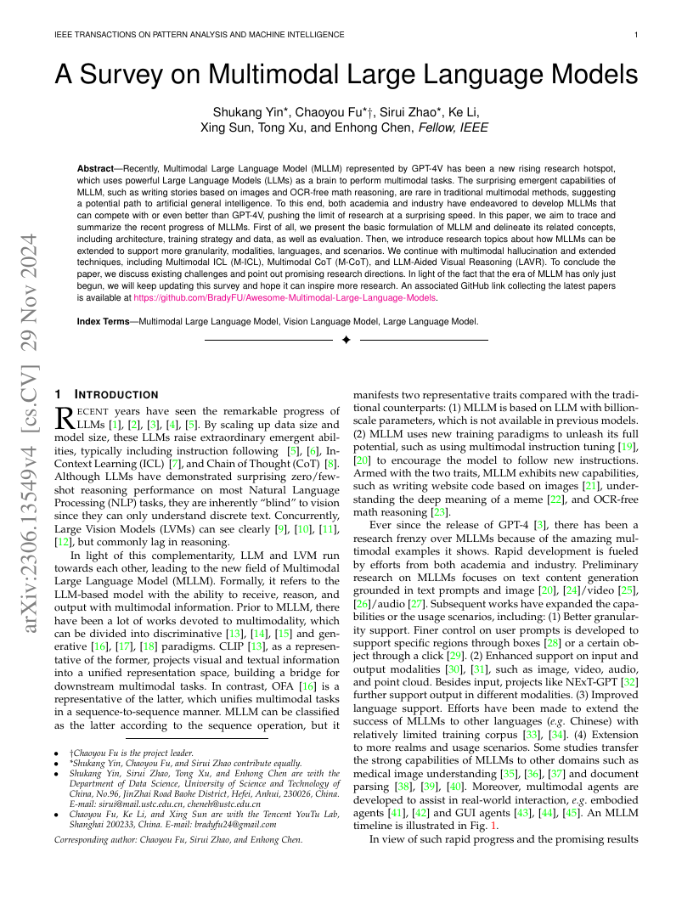

## 1 引言

近年大型语言模型通过扩大数据和参数规模，出现了指令遵循、上下文学习和思维链等能力。它们在许多自然语言处理任务上表现出强大的零样本和少样本推理能力，但只能理解离散文本，天然“看不见”视觉世界。大型视觉模型可以清晰地看到图像，却通常缺乏语言模型所具有的广泛知识和复杂推理能力。

多模态大型语言模型正是在二者互补的基础上形成的。本文将其定义为：以大型语言模型为基础，能够接收、推理并输出多模态信息的模型。在此之前，多模态研究主要分为判别式和生成式两类。CLIP 把视觉和文本映射到统一表示空间，服务于下游匹配和分类；OFA 则把多模态任务统一为序列到序列生成。多模态大型语言模型继承了生成式路线，但通过大规模语言模型和新的训练范式获得了更强的通用能力。

与传统多模态模型相比，多模态大型语言模型有两个显著特征：一是建立在数十亿参数的大型语言模型上；二是使用多模态指令微调等训练范式，把视觉、语言和任务指令放进统一交互框架。由此，模型能够根据图片编写网页代码、理解表情包背后的含义、直接进行视觉数学推理，而不必先把图像完全转换为文字。

自 GPT-4 发布以来，相关研究快速扩展。早期工作主要处理图片、视频或音频输入与文本输出，后来逐渐支持区域框、点击点、像素级掩码、三维点云、多种输出模态和多语言。应用也从通用问答扩展到医疗图像、文档解析、具身智能体和图形界面智能体。本文围绕架构、训练与数据、评估、能力扩展、多模态幻觉以及多模态上下文学习、思维链和视觉推理展开整理。

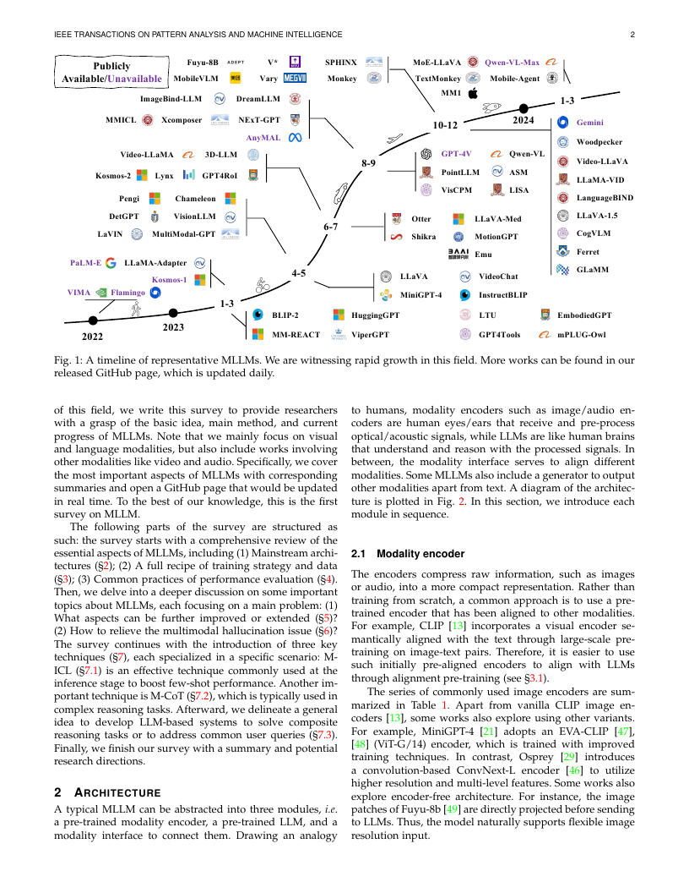

## 2 架构

典型多模态大型语言模型可以抽象为三个模块：预训练的模态编码器、预训练的大型语言模型，以及连接二者的模态接口。类比人类，图像或音频编码器像眼睛和耳朵，负责接收和预处理信号；大型语言模型像大脑，负责理解、推理和生成；中间的接口负责把不同模态对齐。部分模型还连接生成器，以输出文本以外的图像、音频或视频。

### 2.1 模态编码器

编码器把图像、音频或视频等原始信息压缩为更紧凑的特征。实践中通常使用已经完成跨模态对齐的预训练编码器，而不是从零开始训练。例如，CLIP 通过大规模图文对预训练，把视觉编码器与文本语义对齐，因而更容易继续与大型语言模型连接。常用图像编码器包括 CLIP、OpenCLIP、EVA-CLIP 和 ConvNeXt 变体。

编码器选择主要考虑输入分辨率、参数量和预训练语料。提高分辨率通常能显著改善视觉问答和细粒度理解。直接缩放方法把更高分辨率图像送入编码器，可能需要继续调优编码器或换用高分辨率编码器；分块方法把大图切成多个局部图块，同时保留一张低分辨率全局图，以兼顾局部细节和整体语义。部分模型采用双编码器分别处理高低分辨率输入，也有无编码器架构直接把图像图块投影后送入语言模型。

其他模态也可以复用专门编码器。Pengi 使用音频编码器，ImageBind 支持图像、文本、音频、深度、热成像和惯性测量单元等多种信号。强大的编码器能扩大模型输入范围，但预训练分辨率、数据组成和模态间对齐方式会影响最终能力。

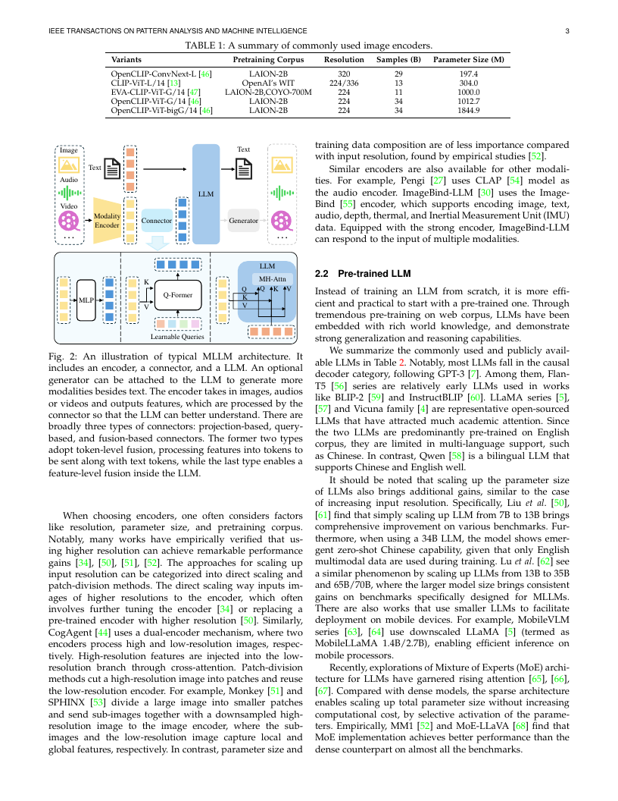

### 2.2 预训练大型语言模型

从零训练大型语言模型成本很高，因此多模态模型通常在已有语言模型上构建。语言模型经过海量网页语料预训练，已经包含丰富世界知识、语言规律和推理能力。常见基础模型包括 Flan-T5、LLaMA、Vicuna、LLaMA-2 和 Qwen。以英语为主训练的模型多语言能力有限，双语模型在中文等语言上更有优势。

扩大语言模型参数量通常能带来系统性提升。研究发现，从 70 亿扩大到 130 亿参数会改善多个多模态基准；更大模型还可能在只使用英语多模态数据训练时，涌现零样本中文能力。另一方面，移动设备需要更小的模型和量化技术，MobileLLaMA 等模型通过缩小语言骨干实现高效推理。稀疏专家架构还可以在不按比例增加计算的情况下扩大总参数量，已有研究在多模态基准上观察到稀疏专家优于稠密模型。

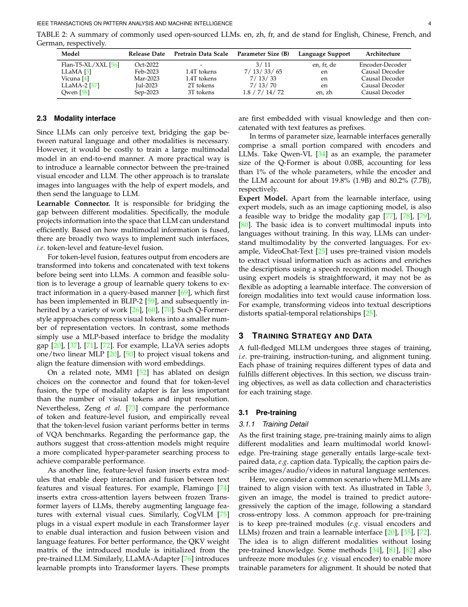

### 2.3 模态接口

大型语言模型只能直接感知文本，因此需要在预训练编码器与语言模型之间加入可学习连接器，或使用专家模型把图像先转成语言。连接器的作用是把视觉特征投影到语言模型能够有效理解的空间，主要有词元级融合和特征级融合两种方式。

词元级融合把编码器输出转换成词元，与文本词元拼接后送入语言模型。查询式接口使用一组可学习查询向量提取并压缩视觉信息，BLIP-2 的 Q-Former 是代表性方案；多层感知机接口则直接把视觉词元投影到词嵌入维度，LLaVA 系列采用了这种简单结构。消融研究表明，词元级接口中，视觉词元数量和输入分辨率往往比适配器的具体类型更重要。

特征级融合在语言模型内部加入跨注意力或视觉专家模块，让文本特征与视觉特征在多层深度交互。Flamingo 在冻结的 Transformer 层之间插入跨注意力；CogVLM 在每层加入视觉专家；LLaMA-Adapter 则把可学习提示注入 Transformer 层。可学习接口通常只占总参数的一小部分，便于保留预训练知识和降低训练成本。

另一条路线使用图像描述、动作识别或语音识别等专家模型，把外部模态转换为文本后交给语言模型。这种方法实现简单、无需训练接口，但转换会丢失信息，尤其会破坏视频中的空间和时间关系。因此，在需要细粒度定位或复杂视觉推理时，可学习接口通常更灵活。

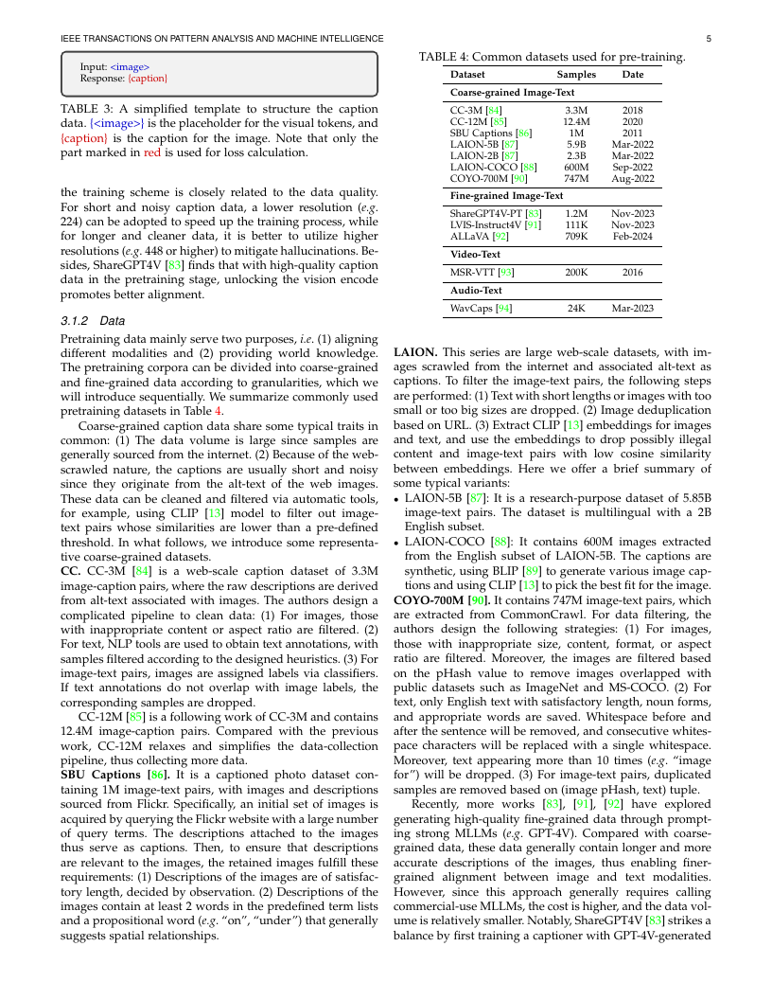

## 3 训练策略与数据

完整的多模态大型语言模型通常经过预训练、指令微调和对齐微调三个阶段。每个阶段使用不同数据并承担不同目标：预训练建立模态对齐和世界知识，指令微调使模型理解用户任务，对齐微调则让输出更符合人类偏好并减少幻觉和有害内容。

### 3.1 预训练

#### 3.1.1 训练细节

预训练的首要目标是对齐不同模态并学习多模态世界知识。最常见的图文设置以图片和自然语言描述为成对输入，模型在视觉词元之后自回归预测描述文本，损失只计算目标描述部分。为了不破坏已有知识，通常冻结视觉编码器和语言模型，只训练连接器；也有工作解冻视觉编码器或更多模块，以获得更充分的对齐能力。

数据质量决定分辨率和训练策略。短而嘈杂的描述可以使用较低分辨率以提高吞吐；长而干净的描述适合更高分辨率，以降低模型因视觉细节不足而产生幻觉。高质量描述数据还可以帮助视觉编码器学习更可靠的语义对齐。

#### 3.1.2 数据

预训练数据同时承担模态对齐和世界知识学习。粗粒度图文数据包括网页图文对和图片描述，规模大但噪声、重复和版权风险较高；细粒度数据包含区域描述、对象属性、关系和详细问答，规模较小但更适合视觉定位和复杂指令。视频文本、音频文本和多语言图文数据进一步扩展模型的输入范围。

数据清洗包括去重、图文相关性筛选、质量打分、敏感内容过滤和版权检查。网页图文对经常存在标题与图片不匹配、描述过短或含有水印等问题，直接增加数量并不一定带来收益。高分辨率数据能提高细节理解，但也增加显存和计算，因此训练配方需要在分辨率、样本质量和数量之间平衡。

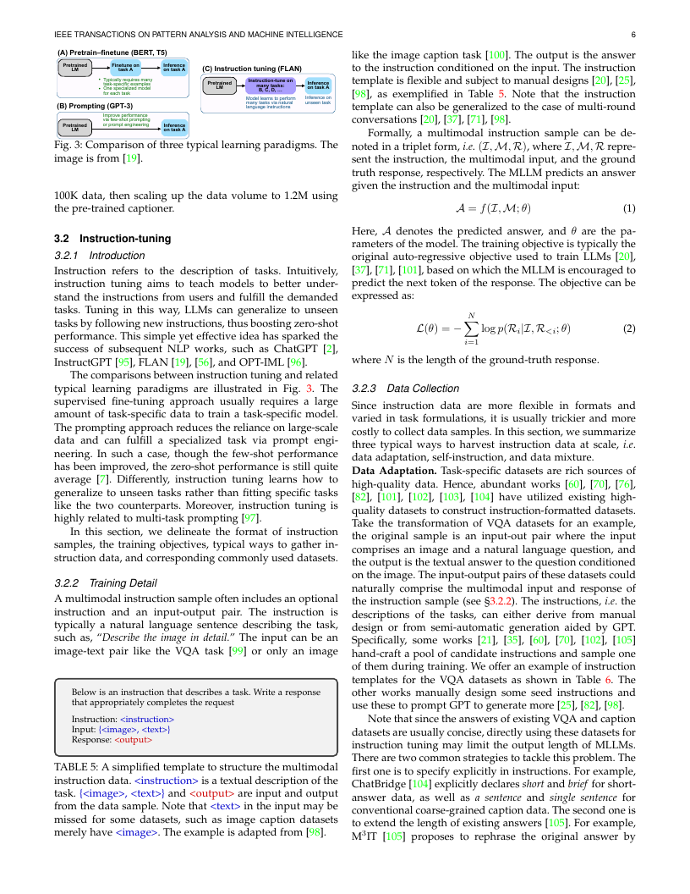

### 3.2 指令微调

指令微调把多模态样本改写为“图像、指令、回答”的对话格式，让模型学会遵循用户要求。数据来源包括视觉问答、图像描述、区域定位、OCR、图表理解、科学问题和多轮对话。高质量人工指令能覆盖复杂任务，但成本高；使用语言模型生成指令可以扩大规模，却需要过滤错误、幻觉和重复。

指令模板应清楚区分视觉输入、用户问题和目标回答。训练时通常冻结大部分编码器，只更新连接器、语言模型的一部分或全部参数。单模态文本对话数据也可以混入训练，以保持语言流畅和指令遵循能力；多模态与单模态数据的比例会影响视觉能力、语言能力和灾难性遗忘。

多模态指令数据还可以用来学习工具调用和跨模态推理。复杂问题可以要求模型先定位图像区域、再读取文字、最后进行推理；对于视频，则要学习按时间顺序选择关键帧。指令微调不等于事实对齐，模型仍可能把语言先验误当成视觉证据，因此需要后续偏好训练和幻觉评估。

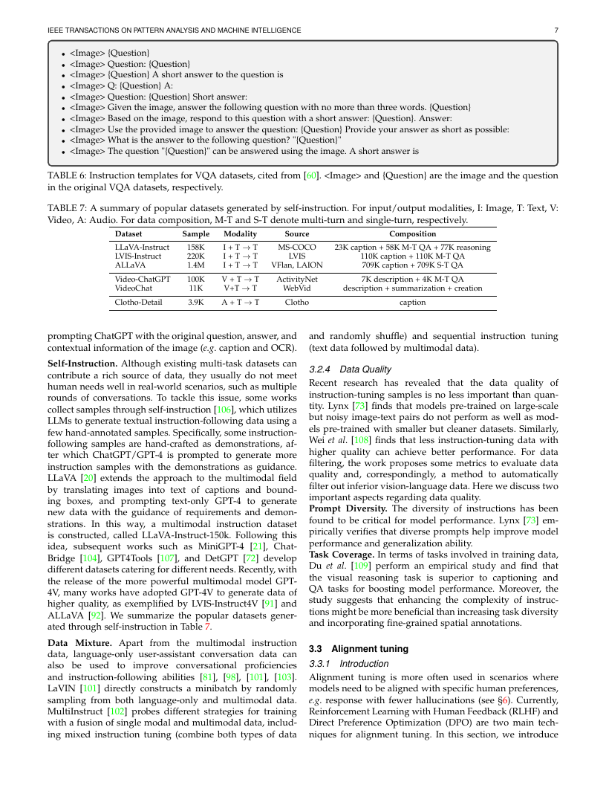

### 3.3 对齐微调

#### 3.3.1 基本概念

对齐微调用于让模型符合特定人类偏好，例如回答更诚实、更有帮助、更少出现视觉幻觉。目前常见方法是基于人类反馈的强化学习和直接偏好优化。

#### 3.3.2 训练细节

强化学习通常包含三步。第一，用监督数据微调预训练或指令模型，得到初始策略；第二，给定多模态输入和两个回答，用人工偏好训练奖励模型，使偏好回答获得更高分；第三，用近端策略优化更新策略，并加入相对于参考模型的词元级 KL 惩罚，防止策略偏移过大。多模态奖励模型需要同时判断回答是否有帮助、是否忠实于图像以及是否安全。

直接偏好优化把偏好学习写成二分类式目标，不单独训练显式奖励模型，也不运行完整强化学习流程，因此更简单、更稳定。LLaVA-RLHF 收集诚实性和帮助性偏好，减少幻觉；RLHF-V 使用细粒度的片段级纠错；VLFeedback 使用更强的视觉语言模型生成帮助性、忠实性和伦理维度的偏好数据，再用直接偏好优化蒸馏。

#### 3.3.3 对齐数据

对齐数据的核心是比较同一输入下的不同回答。相比预训练和指令微调，偏好数据更昂贵、规模通常更小。数据应覆盖对象存在性、属性、关系、引用证据、拒答和安全边界。人工反馈更能表达真实偏好，但成本和标注一致性是问题；模型反馈规模大，却会把评审模型的偏差带入多模态助手。

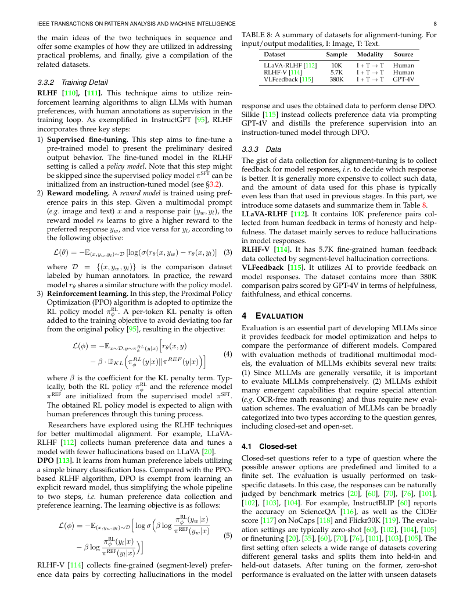

## 4 评估

评估是开发多模态大型语言模型的重要环节，用于反馈模型优化和比较不同系统。与传统多模态模型相比，多模态大型语言模型需要更全面的评估，因为它们具有通用对话能力和新的涌现能力，例如无需显式 OCR 的数学推理。根据问题形式，评估可分为封闭集和开放集。

### 4.1 封闭集

封闭集问题的答案选项预先限定在有限集合中，可以用准确率、CIDEr、BLEU、ROUGE 或可执行性等指标自动判断。常见做法是把任务划分为已见数据和未见数据，先在前者上微调，再在未见任务或未见数据集上零样本评估；领域模型也会直接报告在医学问答、科学问答和图表理解上的微调结果。

为了进行更全面的量化比较，研究者提出 MME、MMBench、Video-ChatGPT、Video-Bench 和 POPE 等基准。MME 覆盖感知和认知任务，所有指令答案由人工设计以减少泄漏；MMBench 用语言模型把开放式回答匹配到预定义选项；视频基准专门评估时间理解；POPE 则以二元问题测量模型是否虚构图像中不存在的对象。

### 4.2 开放集

开放集问题允许更自由的回答，模型通常扮演聊天助手，因此评价更困难。人工评分可以针对自然图像、图表、流程图、思维过程、动作和工具参数设计维度，但成本很高。使用文本语言模型评分可以提高效率，常见指标包括帮助性、准确性和整体偏好；然而只看图像描述或框坐标的文本评审无法直接验证图像事实，不能简单把文本 GPT-4 当作视觉能力上限。

具备视觉输入的评审模型可以直接检查回答是否忠实于图像。案例研究则通过精心设计的样例比较模型在对象计数、笑话理解、室内导航和自动驾驶等任务上的行为。可靠评估应结合自动指标、人工评分、视觉评审和错误案例，报告模型在不同模态、分辨率、语言和提示条件下的差异。

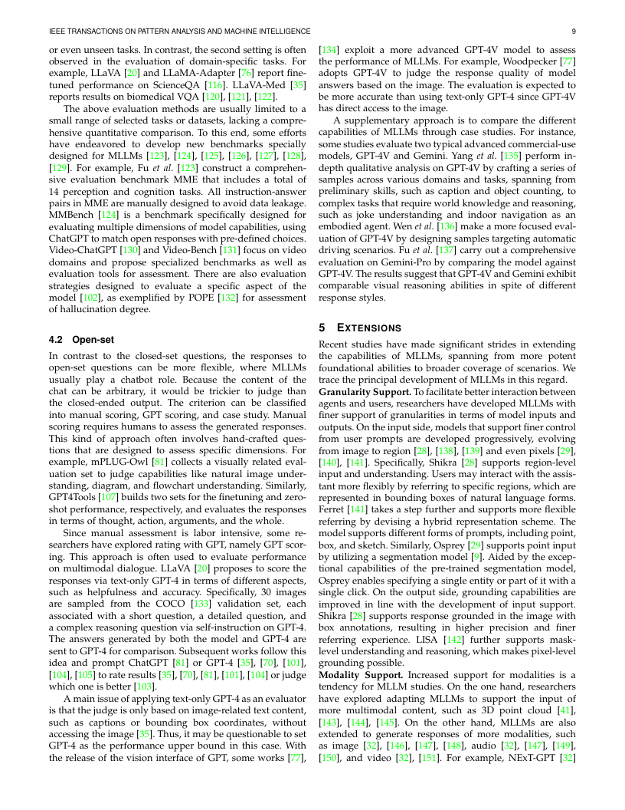

## 5 扩展

### 5.1 更细粒度的输入和输出

多模态模型的输入粒度从整张图像逐渐扩展到区域、点、草图和像素级掩码。Shikra 用自然语言表达的边界框支持区域理解；Ferret 统一支持点、框和草图；Osprey 借助分割模型让用户通过一次点击指定对象或对象的一部分；LISA 进一步支持掩码级理解和推理。更细粒度的输入能实现精确指代和交互，但要求编码器保留高分辨率空间信息。

输出也从文字扩展到区域框、掩码和其他模态。更精确的 grounding 让模型不仅回答“是什么”，还说明答案对应图像中的哪里。输入和输出粒度必须配套，否则模型可能给出语言上正确、但无法在图像中定位的回答。

### 5.2 更多模态

研究者正在把三维点云、音频、视频、深度、热成像和惯性信号加入统一框架。NExT-GPT 使用语言模型作为中枢，连接图像、音频和视频编码器与扩散式生成器，支持多模态输入和输出。多模态扩展需要新的编码器、时间对齐、跨模态接口和生成评估，不能简单把所有特征拼接在一起。

### 5.3 更多语言

高质量非英语多模态语料稀缺，当前模型大多仍以英语为主。VisCPM 以英语作为能力枢纽，先学习丰富的英语视觉语言数据，再通过翻译样本把能力迁移到中文；Qwen-VL 建立在双语语言模型上，并在预训练中混入中文数据以保持双语能力。多语言扩展还要评估文化语境、文字体系、性别一致性和低资源语言的视觉 grounding。

### 5.4 更多场景和任务

移动端模型通过缩小语言骨干、量化和高效连接器满足资源限制。图形界面和手机智能体使用视觉感知、规划和动作执行完成点击、滑动、表单填写等任务。文档模型处理页面布局、表格、公式和位置关系；医疗模型通过领域知识蒸馏处理医学图像和问答。场景扩展必须同时考虑专业准确性、隐私、工具权限和实际交互失败的恢复能力。

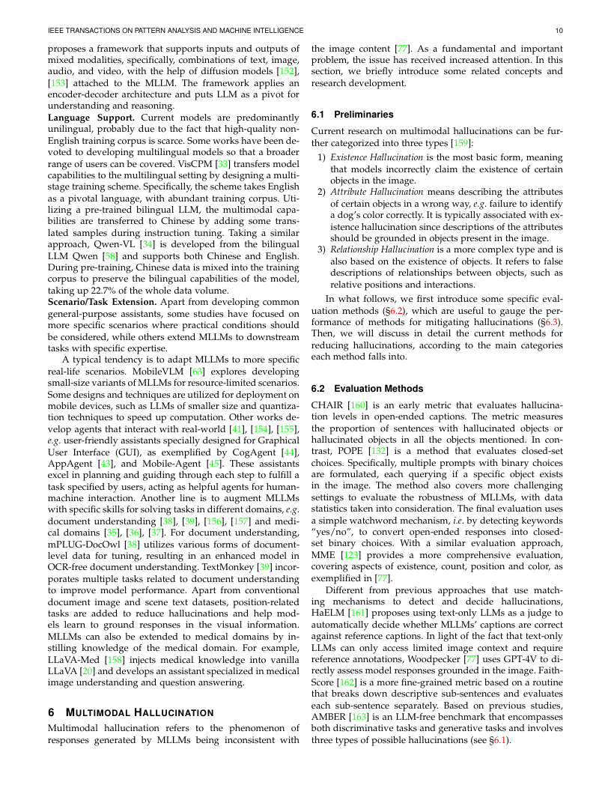

## 6 多模态幻觉

多模态幻觉指模型回答与图像内容不一致。模型可能受语言先验、训练数据偏差或视觉编码器信息缺失影响，生成图像中不存在的对象，错误描述对象属性，或虚构对象之间的关系。

### 6.1 基本类型

1. **存在性幻觉：** 模型错误声称图像中存在某个对象。
2. **属性幻觉：** 模型错误描述对象属性，例如把狗的颜色说错。它通常建立在存在性判断之上，因为属性描述必须先对应真实对象。
3. **关系幻觉：** 模型错误描述对象之间的相对位置、动作或交互，是更复杂的一类幻觉。

### 6.2 评估方法

CHAIR 衡量开放式图像描述中出现幻觉对象的句子比例，或幻觉对象占所有提及对象的比例。POPE 把评估转成是否存在某个对象的二元问题，并设置随机、流行度和对抗性采样以检验鲁棒性。MME 进一步覆盖存在性、数量、位置和颜色。

文本语言模型可以根据参考描述判断回答是否正确，但无法直接访问图像；Woodpecker 使用视觉语言模型直接核验图像中的对象和关系；FaithScore 把长描述拆成原子陈述，逐条判断是否有视觉证据；AMBER 同时覆盖判别式和生成式任务，并包含三种幻觉类型。不同评估方法的证据粒度和偏差不同，应联合使用。

### 6.3 缓解方法

缓解方法可分为生成前校正、生成过程校正和生成后校正。生成前校正收集负面指令、错误描述和人类偏好数据，通过指令微调或强化学习让模型更忠实于图像。LRV-Instruction 在正向指令之外加入不同语义层级的负向指令；LLaVA-RLHF 通过人类偏好训练减少幻觉。

生成过程校正从架构和表示入手。HallE-Switch 假设存在性幻觉来自视觉编码器没有 grounding 的对象，并加入连续控制因子调节语言模型的想象程度；VCD 认为训练语料统计偏差和语言先验共同导致幻觉，通过向图像注入噪声并进行放大-对比解码来抵消错误偏置；HACL 则在跨模态嵌入空间中拉近配对表示、推远幻觉文本表示。

生成后校正在模型输出后再核查和修正。Woodpecker 使用专家模型补充图像上下文，逐步检查对象并改写回答；LURE 训练专门修订器，屏蔽高不确定性对象并重新生成描述。后校正不需要重新训练基础模型，且中间结果可检查，但它仍依赖检测器、专家模型和可靠的图像 grounding。

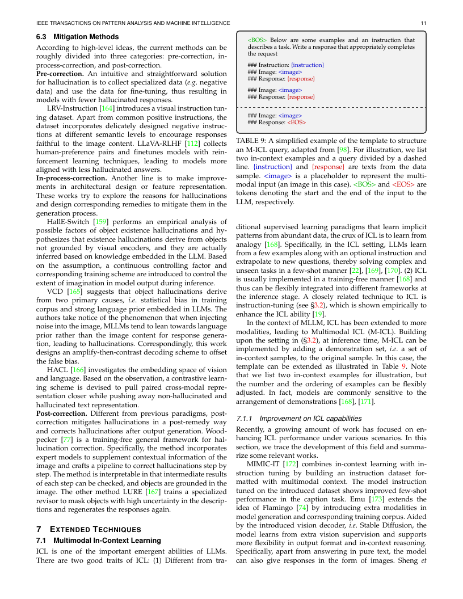

## 7 扩展技术

### 7.1 多模态上下文学习

上下文学习是大型语言模型的重要涌现能力。它通过少量示例和可选指令，让模型在不更新参数的情况下类比解决新的问题。多模态上下文学习把示例中的文本和图像一起加入提示，模型需要学习图像-标签映射、任务格式和输出规范。

#### 7.1.1 能力改进

多模态上下文学习可以与指令微调结合。MIMIC-IT 构建带多模态上下文的指令数据，提升模型在图像描述上的少样本表现；Emu 引入视觉解码器和额外模态监督，让模型不仅输出文字，也能生成图像；其他工作通过对比学习强化图像-描述因果联系，用多张相关图像构造统一的交错上下文，或过滤上下文中的无关图像和文字。

提示中示例的数量、顺序和质量会影响结果。格式化模板需要明确图像、指令和回答边界，示例可以按任务难度或视觉内容多样性选择。少量不一致图文会误导模型，因此上下文预过滤和证据检查是多模态上下文学习的重要组成。

#### 7.1.2 应用

多模态上下文学习主要用于视觉推理和外部工具使用。视觉推理任务通过相似图像问答示例帮助模型学习新的问题格式；工具示例则提供从观察、选择工具到读取返回结果的一系列步骤。后者与思维链密切相关，因为模型需要按顺序执行多个动作才能完成任务。

### 7.2 多模态思维链

思维链要求模型不仅输出最终答案，还输出导致答案的一系列中间推理步骤。多模态思维链把图像内容、文字证据和推理过程统一起来，适合科学问答、图表分析、空间推理和复杂视觉问答。

#### 7.2.1 学习范式

获取多模态思维链主要有微调、少样本和零样本三种方式。微调方法构造带讲义、解释和答案的 ScienceQA 等数据，让模型学习视觉证据到结论的路径；少样本方法在提示中提供几条图像-问题-理由-答案示例；零样本方法不提供特定示例，只用“让我们逐帧思考”或“这两帧之间发生了什么”等指令诱发推理。与微调相比，少样本和零样本成本低，但更依赖模型已有知识和提示质量。

#### 7.2.2 推理链配置

推理链的结构可以是单链或树形。单链按“问题-理由-答案”顺序逐步生成；树形链把问题拆成多个子问题，分别由语言模型或视觉专家解决，再汇总各条理由。链长度可以自适应，由模型判断何时停止，也可以预先规定固定步数。复杂任务通常需要检查中间状态，避免错误在后续步骤中累积。

#### 7.2.3 生成模式

多模态思维链有填空式和预测式两类。填空式根据前后文补出中间缺失步骤，预测式根据指令和已有推理历史继续生成后续步骤。二者都要求生成步骤与图像证据一致且逻辑正确。对于视觉数学和空间问题，可以把中间测量、区域选择、关系判断和最终计算分别记录，便于验证。

### 7.3 语言模型辅助视觉推理

语言模型辅助视觉推理系统把语言模型作为控制器、决策者或语义改写器，并调用视觉基础模型、搜索、代码解释器和其他工具。相比传统视觉推理模型，这些系统具有更强的开放世界泛化、涌现推理能力以及自然语言交互控制。

#### 7.3.1 基本概念

复杂视觉任务通常需要先拆分为更简单的步骤，再把步骤交给合适模块。语言模型可以读取视觉模块结果、规划程序、选择工具、总结历史并把结构化结果组织成用户可理解的回答。这样可以解释为什么一个表情包好笑、在室内环境中规划路线，或根据网页截图生成可执行代码。

#### 7.3.2 训练范式

训练免除方法冻结预训练模型，直接用少样本或零样本提示生成程序和执行步骤。少样本系统用手工示例指导工具调用，零样本系统直接利用语言模型的语义知识和推理能力。微调方法则收集工具相关指令、定位数据或规划轨迹，使模型更可靠地选择模块和生成参数。

#### 7.3.3 语言模型的角色

1. **控制器：** 把复杂任务分解成子任务，并为每个子任务选择视觉模块或外部工具。
2. **决策者：** 在多轮交互中总结当前状态和历史，判断信息是否足够，并决定继续观察、调用工具还是输出答案。
3. **语义改写器：** 利用丰富的语言知识把视觉结果整合成连贯句子，或按用户要求改变风格、粒度和格式。

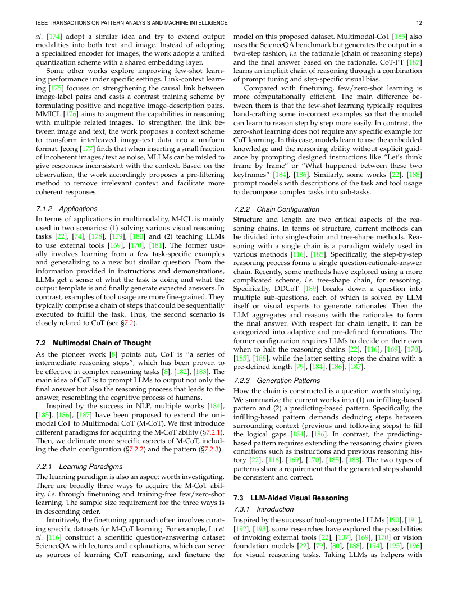
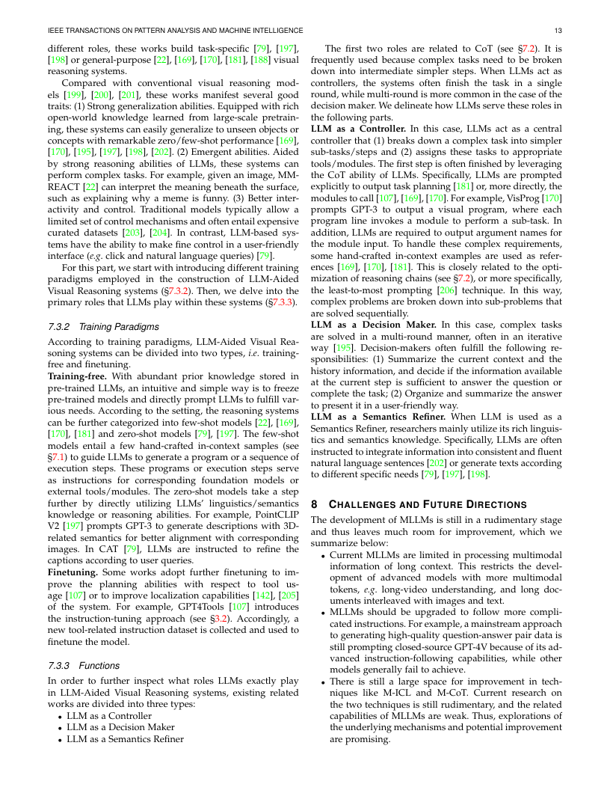

## 8 挑战与未来方向

多模态大型语言模型仍处于早期阶段，主要挑战包括：

1. **长多模态上下文。** 现有模型处理长视频、长文档中交错出现的图片和文本时能力有限，需要更高效的时间建模、记忆和检索。
2. **复杂指令遵循。** 高质量多模态问答数据仍常依赖 GPT-4V 等闭源模型生成，其他模型在多约束指令、格式和工具编排上容易失败。
3. **多模态上下文学习和思维链。** 这两个方向的研究仍较为初步，机制和改进方法尚未成熟，需要研究示例选择、视觉证据、推理结构和错误传播。
4. **具身智能体。** 让模型与真实世界交互，需要同时具备感知、推理、规划和执行能力，并处理环境变化、延迟、权限和安全。
5. **安全。** 精心构造的图像、文本和跨模态提示可能诱导偏见、有害或隐私泄露的回答。未来需要对抗测试、模态级安全过滤、可解释证据和应用级权限控制。
6. **高质量数据和评估。** 多模态数据的版权、隐私、图文相关性和文化覆盖仍需治理；评估还应覆盖长尾语言、细粒度 grounding、幻觉、工具调用和真实交互成本。

## 9 结论

多模态大型语言模型通过预训练模态编码器、连接器和大型语言模型，把视觉、语言以及其他信号纳入统一的推理接口。预训练、指令微调和偏好对齐共同决定模型的能力；封闭集基准、开放式评分和幻觉评估则提供互补的反馈。研究正在把模型扩展到更细粒度输入、更多模态、更多语言和更复杂场景，并探索多模态上下文学习、思维链和语言模型辅助视觉推理。

未来的关键不只是扩大参数，而是让模型能够在长上下文中可靠地定位证据、遵循复杂指令、调用工具、解释中间推理并在不确定时拒答。多模态能力越接近真实世界，数据治理、隐私保护、对抗安全和应用级监控就越重要。只有把强大的语言推理与准确的视觉 grounding、可验证的工具执行和负责任的部署结合起来，多模态大型语言模型才能从演示能力发展为可靠的通用助手。

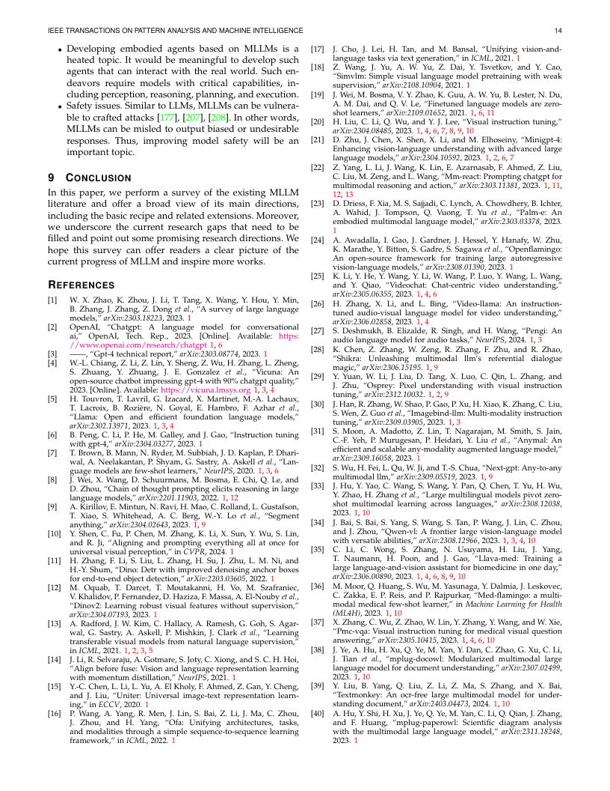

## 参考文献

原论文第 14 至第 18 页包含完整参考文献。为保留作者、论文题名、出版信息和编号，按原页顺序嵌入截图。

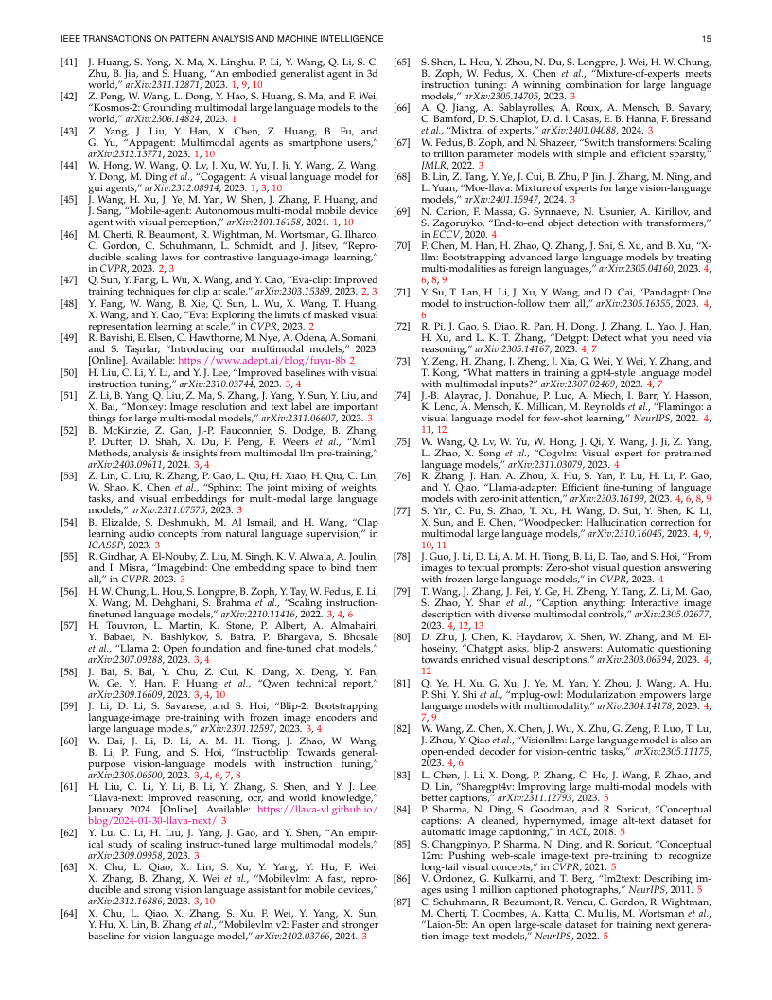
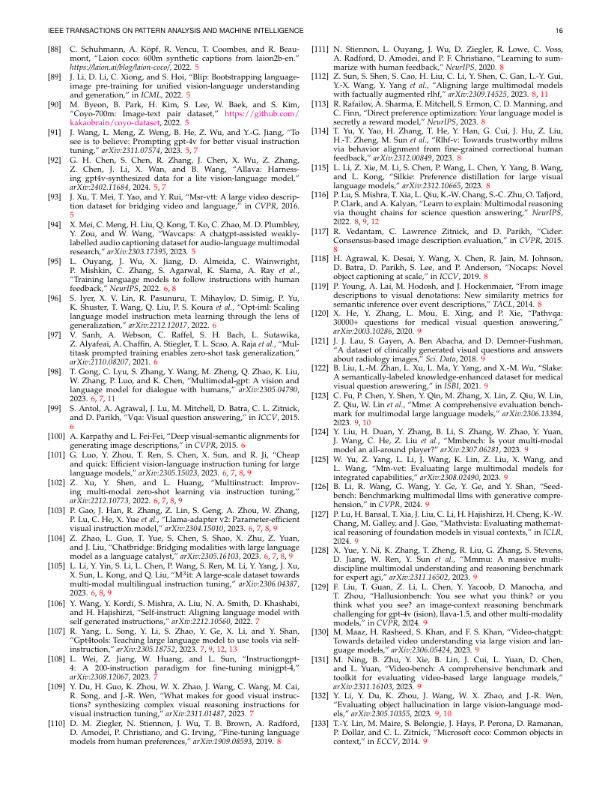
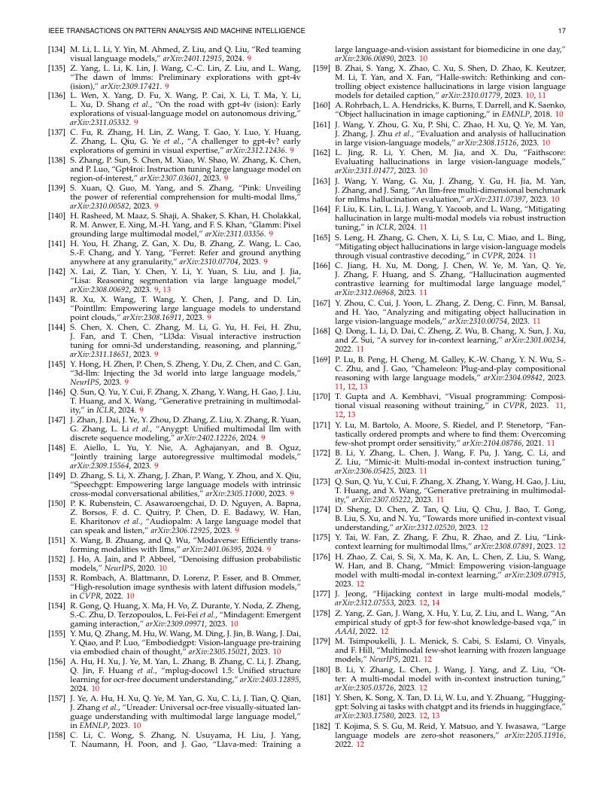
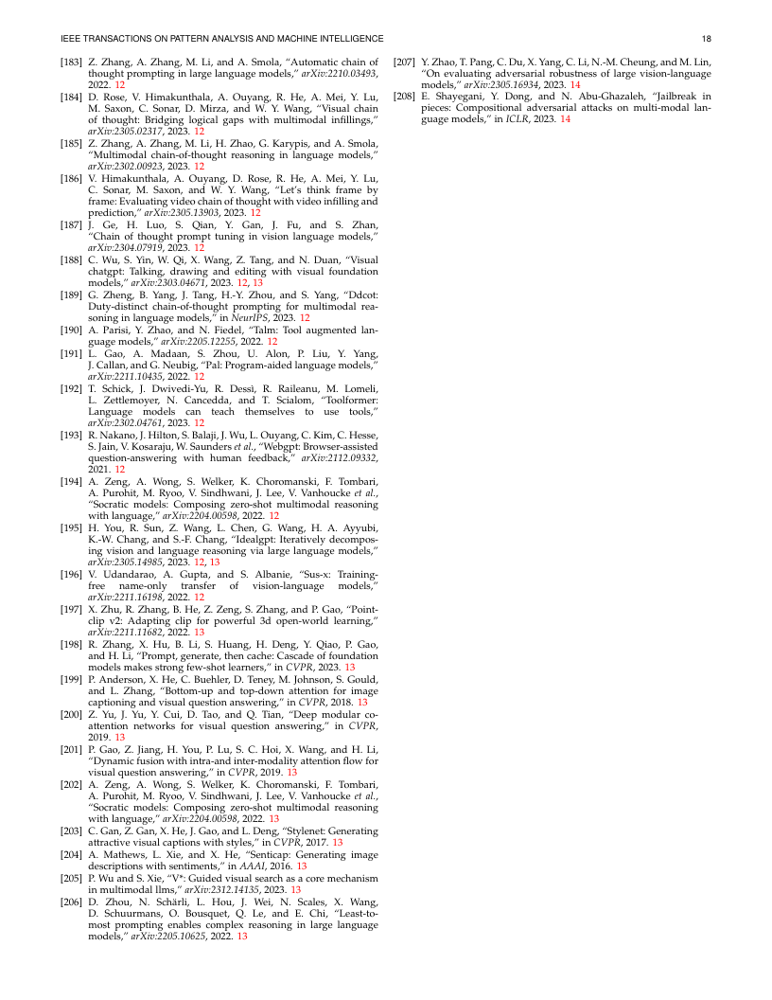
