# 大型语言模型的挑战与应用

**作者：** Jean Kaddour、Joshua Harris、Maximilian Mozes、Herbie Bradley、Roberta Raileanu、Robert McHardy 等

**论文版本：** arXiv:2307.10169v1，2023 年 7 月 19 日

**说明：** 本译文按原论文内容顺序编排。正文、小标题和图注译为中文；表格、流程图、示例代码和参考文献以对应原页截图保留，避免改变原文中的数值、公式和版式信息。

## 摘要

大型语言模型（LLM）在短短几年内从机器学习讨论中几乎不存在的对象，发展为无处不在的核心主题。由于该领域发展速度极快，人们很难判断还有哪些挑战尚未解决，以及哪些应用领域已经取得了实际成效。本文试图系统整理当前仍然开放的问题和已经成功的应用，使机器学习研究者能够更快理解这一领域的现状，并开始开展有效工作。

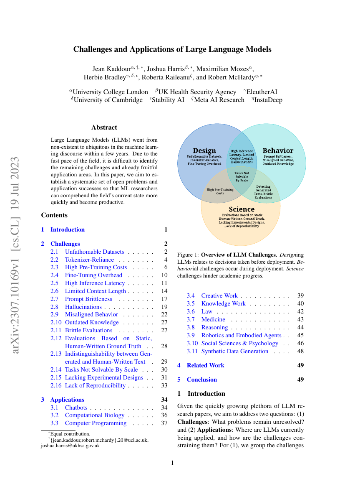

## 目录与图示

本文将挑战分为三类：**设计挑战**，涉及部署前对模型和数据所作的决定；**行为挑战**，发生在模型部署和使用过程中；以及**科学挑战**，会阻碍学术研究的推进。应用部分讨论聊天机器人、计算生物学、计算机编程、创意工作、知识工作、法律、医学、推理、机器人与具身智能体、社会科学与心理学，以及合成数据生成。

## 1 引言

随着大型语言模型研究论文数量迅速增长，本文希望回答两个问题：第一，**挑战：**哪些问题仍未解决？第二，**应用：**大型语言模型目前被应用于哪些领域，而这些挑战又如何限制它们的应用？对于第一个问题，作者在图 1 中将挑战归为“设计”“行为”和“科学”三个更大的类别。对于第二个问题，作者考察聊天机器人、计算生物学、计算机编程、创意工作、知识工作、法律、医学、推理、机器人和社会科学等领域。

本文是一篇带有明确观点的综述，假定读者熟悉大型语言模型及其工作方式；更适合入门的介绍性工作列在第 4 节。本文关注使用文本数据训练的模型，目标读者是技术研究人员，不讨论大型语言模型的政治、哲学或道德视角。

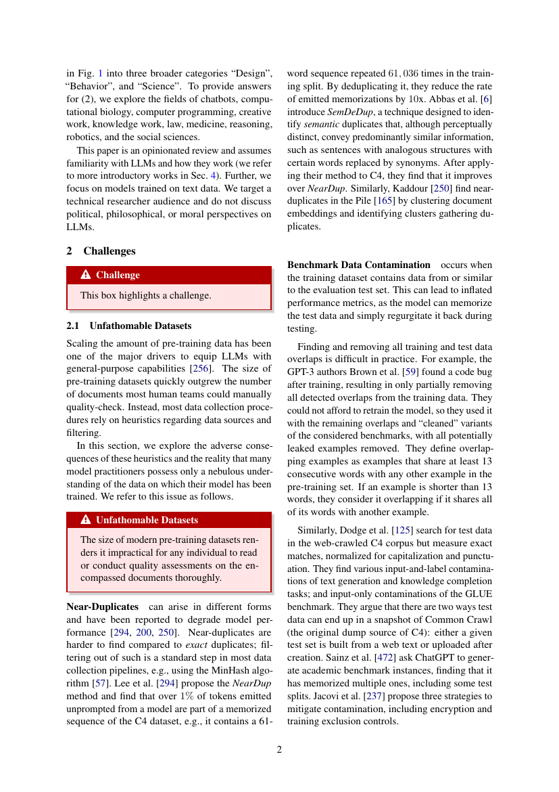

## 2 挑战

### 2.1 难以理解的训练数据集

扩大预训练数据规模，是赋予大型语言模型通用能力的主要驱动力之一。预训练数据集的规模很快超过了大多数人工团队能够逐份进行质量检查的文档数量。因此，大多数数据收集流程只能依赖关于数据来源和过滤规则的启发式方法。

本节讨论这些启发式方法带来的不利后果，以及许多模型实践者实际上只对模型使用过的训练数据有模糊认识这一现实。现代预训练数据集规模如此庞大，任何个人都很难完整阅读其中的文档或进行全面质量评估，这正是“难以理解的数据集”这一挑战的含义。

#### 近重复数据

近重复数据可以以多种形式出现，已有研究报告它会降低模型性能。与完全重复相比，近重复更难发现；例如，使用 MinHash 算法识别并过滤近重复，已经成为许多数据收集流程的标准步骤。Lee 等人提出 NearDup 方法，发现模型在没有提示的情况下生成的词元中，超过 1% 属于从 C4 数据集记忆出的序列。C4 中有一个由 61 个词组成的序列，在训练划分中重复了 61,036 次；去重后，模型输出记忆内容的比例降低了约 10 倍。

Abbas 等人提出 SemDeDup，用于识别语义重复：两个句子在表面上不同，却传达了高度相似的信息，例如句子结构相近，只把若干词替换成同义词。将该方法应用于 C4 后，效果优于 NearDup。Kaddour 也通过对文档嵌入进行聚类、识别聚集中包含重复文档的簇，在 The Pile 中发现了近重复数据。

#### 基准数据污染

当训练数据集包含评估测试集中的数据，或包含与测试集相似的数据时，就会发生基准数据污染。模型可能记住测试数据，并在评估时直接复述，从而导致性能指标虚高。

在实践中，找到并删除所有训练数据与测试数据之间的重叠非常困难。例如，GPT-3 作者在训练结束后发现代码错误，导致训练数据中检测到的重叠只被部分删除。由于无力重新训练模型，他们保留了剩余重叠，并使用删除所有可能泄漏样本后的“清理版”基准。作者把重叠样本定义为：样本与预训练集合中的任意其他样本至少共享连续 13 个词；如果样本短于 13 个词，则只要它的全部词都出现在另一个样本中，就视为重叠。

Dodge 等人在网络抓取的 C4 语料中搜索测试数据，使用经过大小写和标点归一化的精确匹配。他们发现文本生成、知识补全任务存在输入与标签污染，GLUE 基准存在只污染输入的情况。他们认为，测试数据进入 Common Crawl 快照（C4 的原始抓取来源）有两种途径：测试集本身由网页文本构建，或者测试集创建后被上传到网页。Sainz 等人让 ChatGPT 生成学术基准样本，发现模型记住了多个样本，甚至包括某些测试划分。Jacovi 等人提出了三种缓解污染的策略，其中包括加密和训练排除控制。

#### 个人可识别信息

预训练语料中发现了电话号码、电子邮件地址等个人可识别信息（PII），这会在提示模型时造成隐私泄漏。Carlini 等人和 Lukas 等人通过提示 GPT-2 提取 PII；Kulkarni 报告了一名工程师通过提示 GitHub Copilot 获取秘密 API 密钥的案例。Henderson 等人讨论了不同司法辖区法律数据中 PII 的可用性，并依据各辖区的法律规范进行过滤。

El-Mhamdi 等人指出，强大的模型性能通常需要记忆训练数据，因此训练数据中未被发现的 PII 很可能会导致模型生成并泄露这些信息。

#### 预训练领域混合

多项研究主张预训练语料应具有多样性。许多常用语料库按照这一原则，将来自不同来源的数据集拼接起来，原论文表 1 展示了若干例子。然而，不同来源各需要多少数据，才能取得强大的下游性能，仍缺乏充分研究。

不理想的数据混合可能导致模型向下游任务迁移的能力较低，并依赖虚假相关性。Xie 等人通过使用群体分布鲁棒优化训练一个小型代理模型，寻找不同领域的混合比例。令人意外的是，用找到的领域权重训练最终模型后，所有领域的困惑度都得到改善，即使某个领域被降低了权重。针对目标下游任务，Yao 等人和 Xie 等人选择最适合预训练的数据子集。

Longpre 等人测量领域组成的影响，发现纳入异质数据源总体有益，而且可能比数据质量（例如 PaLM 和 GLaM 使用的文档质量分类器所衡量的质量）或数据规模更重要。这也支持构建规模更小但更加多样的预训练数据集。

#### 微调任务混合

当预训练模型需要在许多不同任务上微调时，必须确定各任务的数据混合方式，而每个任务通常只有相对较少的样本。这种方法称为多任务提示微调语言模型（MTLM），已经在只增加很少训练计算量的情况下显著提升了泛化能力。

例如，在每组输入输出对前添加任务指令的指令微调，是一种非常常见的方案。Wang 等人提出 Super-NaturalInstructions，这是一个包含 1,616 个多样任务和专家编写指令的微调数据集。Muennighoff 等人将 MTLM 扩展到多语言场景，显示用英语提示在多语言任务上微调，可以改善所有语言任务的结果。

不过，如何平衡各任务数据集仍然不清楚。由于任务规模可能差异很大，Raffel 等人按照每个任务训练划分中的样本数量混合任务，并设置最大样本数上限。Jang 等人报告，MTLM 可能不如只针对单个任务微调的专家语言模型，原因包括负向任务迁移和灾难性遗忘：同时学习多个任务会妨碍某些特定任务的学习，而学习新任务又会让模型忘记先前任务。

Iyer 等人研究不同任务及任务集合的比例，发现其中存在多种权衡，并认为最佳比例取决于下游目标。Longpre 等人通过逐个移除任务来源、在 MMLU 基准上排序其贡献来平衡不同任务来源；他们还混合零样本和少样本提示模板，发现这能同时改善两种设置下的性能。

另一种趋势是模仿 ChatGPT 等闭源模型：收集其 API 输出，并使用这些输出微调开源语言模型。这种做法可能违反服务条款。Gudibande 等人指出，这类模仿模型擅长模仿专有模型的风格，却不能真正模仿其内容；因果关系研究也反复讨论了风格与内容的区别。作者据此认为，开源微调模型与闭源模型之间仍存在显著能力差距，需要进一步研究更好的模仿数据。

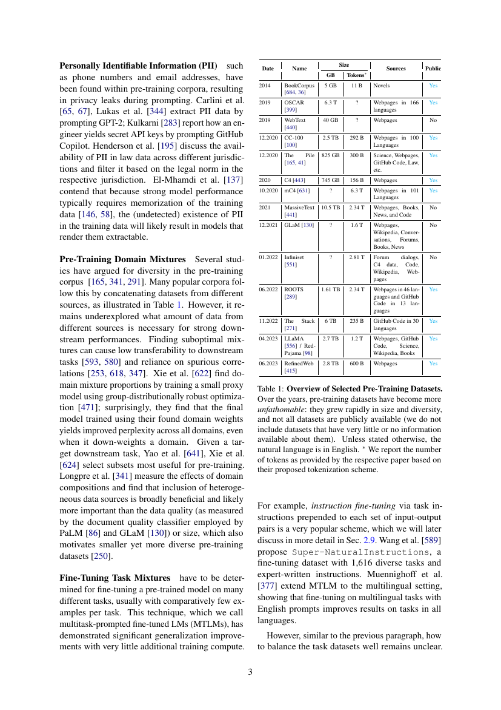

### 2.2 分词器依赖

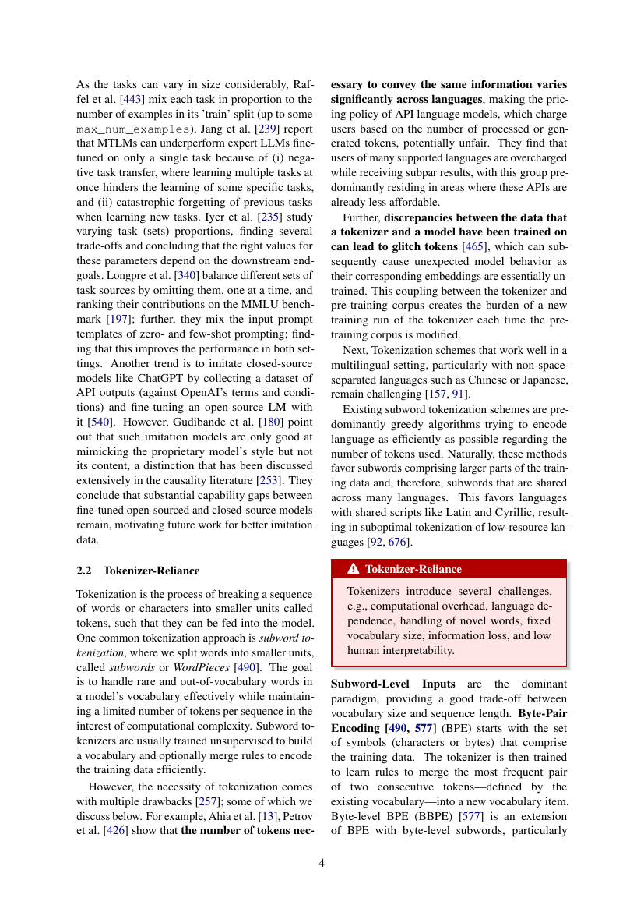

分词是把词或字符序列拆分成更小的单元（称为词元），以便输入模型。常见方法是子词分词：把词拆成更小的子词或词片段。这样既能有效处理词表中的稀有词和未登录词，又能在控制词表规模的同时限制每个序列的词元数量，从而控制计算复杂度。子词分词器通常以无监督方式训练，用于构建词表，并可选地学习合并规则，以高效编码训练数据。

然而，分词的必要性也带来多种缺点。首先，不同语言传达相同信息所需的词元数量差异很大，这可能使语言模型 API 的定价政策不公平，因为 API 按处理或生成的词元数量向用户收费。许多语言的用户会被收取更高费用，却得到较差结果，而且这些用户往往正处于 API 最难负担的地区。

其次，分词器与模型使用的训练数据不一致，会产生“故障词元”。这些词元对应的嵌入几乎没有训练，随后可能导致模型行为异常。分词器与预训练语料之间的耦合还意味着，每次修改预训练语料，都可能需要重新训练分词器。

在多语言场景中，尤其是中文、日文等不以空格分隔词语的语言，设计效果良好的分词方案仍然很困难。现有子词分词方案大多是贪心算法，目标是尽可能高效地用较少词元编码语言。这些方法自然偏好覆盖训练数据更大部分的子词，也就是在多种语言之间共享的子词。因此，它们偏向使用拉丁字母和西里尔字母等共享文字的语言，导致低资源语言的分词效果不理想。

分词器还会带来计算开销、语言依赖、处理新词困难、词表大小固定、信息损失和人类难以解释等问题。图 2 展示了其中两个缺点：分词器训练需要多次遍历整个预训练数据集等非平凡计算，并且依赖训练语料；同时，大型语言模型的嵌入层和输出层都与词表大小相关，在 T5 模型中，这两部分约占模型参数量的 66%。

#### 子词级输入

子词级输入是当前主流范式，在词表规模和序列长度之间提供了较好的折中。字节对编码（BPE）从训练数据中出现的符号集合（字符或字节）开始，学习把词表中最频繁出现的相邻词元对合并为新的词表项。字节级 BPE 是 BPE 的扩展，以字节级子词为基础，特别适合多语言任务，因为它可以在语言之间共享词表。

训练好的 BPE 分词器会应用已经学习的规则，将输入拆成词元。WordPiece 是一种闭源分词算法，BERT 使用了它。WordPiece 与 BPE 一样，从较小的初始词表开始，通过学习合并规则并创建新的词表项逐步扩展词表；不同之处在于，它不是简单选择频率最高的相邻词元对，而是使用评分函数，按单个词元的频率对词元对频率归一化，从而优先选择整体常见、但组成部分较稀有的词元对。

单元分词则从一个较大的基础词表开始，在每轮分词器训练中逐步删减到目标大小。每一步都会使用单元语言模型，根据移除某个词表项的条件计算训练数据上的损失，然后删除损失最低的一部分子词，形成下一轮基础词表。单元分词是概率式的：推理时会为给定序列的所有可能分词计算单元语言模型分数，并选择概率最高的分词。

SentencePiece 是常用的开源库，实现了字节级 BPE、BPE 和单元分词等多种算法，也实现了词级和字符级等非子词分词方法。

#### 字节级输入

字节级输入是子词分词的另一种替代方案。字节级输入可以与子词分词器结合使用，也可以用来定义一个有限词表，编码所有可能的序列。例如，研究者使用 UTF-8 字节而不是子词作为输入，训练了不依赖子词的 mT5 模型，并在多语言数据上取得了有希望的结果。不过，UTF-8 编码拉丁语言所需的字节数少于中文、日文或韩文，因此不同语言的计算成本仍然不均衡。

Charformer 是一种无分词模型：它接收字节级输入，在潜在空间中学习软子词分词，即基于梯度的子词分词。Charformer 的性能与子词模型相近，但计算开销低于其他字节或子词模型。研究者还训练了一个基于原始字节输入的 8 亿参数语言模型，表现与可比模型相近。在更小规模的模型上，Canine 这种不依赖分词和词表的编码器也超过了可比的分词模型。

其他工作通过把输入序列分割成可以并行处理的局部块，降低字节级分词带来的计算成本；也有研究直接处理文件字节，或把文本渲染为图像、训练编码器预测图像的原始像素。这些方向都试图减少模型对固定词表和特定分词器的依赖。

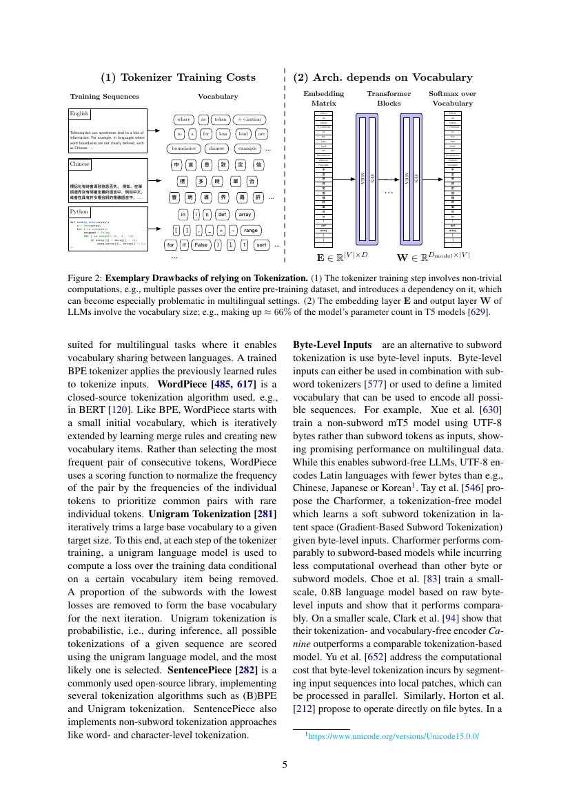

### 2.3 高昂的预训练成本

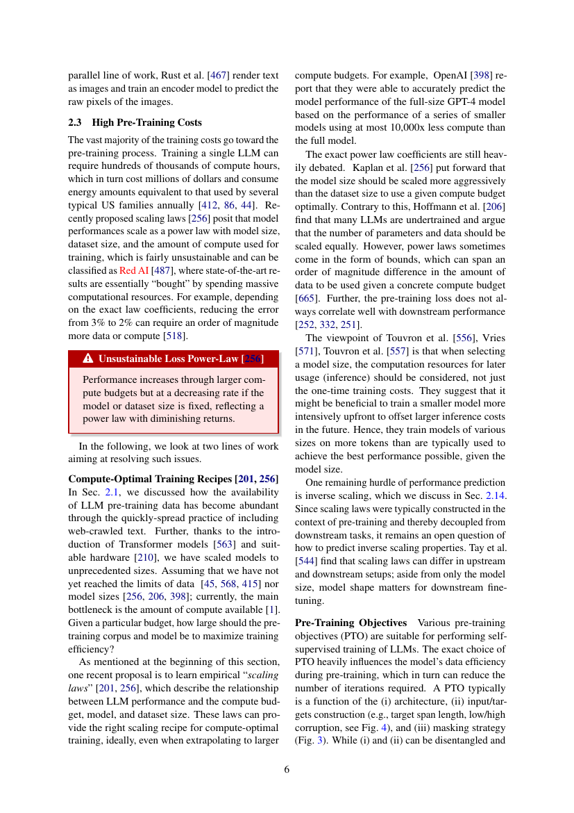

绝大多数训练成本都花在预训练阶段。训练一个大型语言模型可能需要数十万计算小时，成本达到数百万美元，消耗的能源相当于几个普通美国家庭一年的用电量。近期提出的缩放定律认为，模型性能会随模型规模、数据集规模和训练计算量按照幂律增长。这种增长方式并不可持续，也可以被归入“红色人工智能”：最先进的结果基本是通过投入巨量计算资源“购买”得到的。例如，具体幂律系数不同，可能需要多一个数量级的数据或计算量，才能把错误率从 3% 降到 2%。

当模型规模或数据集规模固定时，增加计算预算仍能提高性能，但增幅会逐渐变小，这体现了收益递减的幂律。下面讨论两条试图解决这些问题的研究路线。

#### 计算最优的训练方案

第 2.1 节已经说明，随着网络抓取文本被广泛纳入训练数据，大型语言模型的预训练数据变得十分丰富；Transformer 模型和适用硬件的出现，又使模型规模扩展到前所未有的水平。假设数据和模型规模都还没有达到极限，那么当前主要瓶颈就是可用计算量。给定一个固定预算，预训练语料和模型应该多大，才能最大化训练效率？

一种方案是学习经验性的“缩放定律”，描述大型语言模型性能与计算预算、模型规模和数据集规模之间的关系。理想情况下，这些定律即使外推到更大的计算预算，也能提供计算最优的扩展方案。例如，OpenAI 报告称，他们可以根据一系列小模型的性能准确预测完整规模 GPT-4 的性能，而这些小模型最多只使用完整模型万分之一的计算量。

幂律的精确系数仍存在激烈争议。Kaplan 等人认为，为了最优使用固定计算预算，模型规模应比数据集规模扩展得更快；Hoffmann 等人则发现许多大型语言模型训练不足，主张参数数量和数据量应同比扩展。不过，幂律有时只是给出上下界，在具体计算预算下，建议使用的数据量可能相差一个数量级。此外，预训练损失并不总是与下游性能良好相关。

Touvron 等人和 Vries 的观点是，选择模型规模时不应只考虑一次性的训练成本，还应考虑模型之后的使用成本，也就是推理成本。他们认为，预先更充分地训练一个较小模型，可能抵消未来更高的推理成本。因此，他们针对不同模型规模使用多于通常数量的词元训练，以在该模型规模下取得尽可能好的性能。

性能预测仍有一个障碍，即逆向缩放，第 2.14 节会进一步讨论。由于缩放定律通常建立在预训练语境中，与下游任务相互独立，因此如何预测逆向缩放属性仍是开放问题。Tay 等人发现，上游和下游设置中的缩放定律可能不同；对于下游微调，除了模型大小，模型形状也很重要。

#### 预训练目标

多种预训练目标都适合对大型语言模型进行自监督训练。预训练目标的选择会显著影响模型在预训练阶段的数据效率，进而影响达到目标性能所需的迭代次数。一个预训练目标通常由三部分决定：模型架构；输入和目标的构造方式（例如目标片段长度、低比例或高比例破坏）；以及掩码策略。架构和输入目标构造在概念上可以分开，不应混为一谈，但实践中常有一些组合能够取得良好性能。

如图 3 左侧所示，让每个位置关注所有词元，是数据效率最高的策略，因为它同时使用待预测词元前后的上下文。但正因如此，它不适合文本生成：预测时看到了未来上下文。该策略通常用于自然语言理解任务，并取得很强结果。下一个词元预测最适合自然语言生成，但数据效率最低，因为它只能关注过去上下文。近期的预训练目标试图在两者之间取得平衡，通过更强、更丰富的训练信号提高数据效率，例如前缀语言模型允许一部分词元双向关注过去和未来上下文。

下面介绍几种近期目标之间的权衡。设一个包含 N 个词元的序列为 $x=x_1,\ldots,x_N$。

**语言模型目标。** 最基本、至今仍广泛使用的语言模型（或下一个词元预测）目标，是最大化给定此前词元时下一个词元的似然：

$$L(x)=\sum_{i=1}^{N}\log P(x_i\mid x_1,\ldots,x_{i-1};\theta).$$

**掩码语言模型。** 掩码语言模型（MLM，也称完形填空）把序列中一部分词元替换为特殊的 `[MASK]` 词元。文献通常在非自回归、非生成的双向上下文模型中使用 MLM：模型可以利用目标词元前后的词元进行预测，比下一个词元目标更完整地理解上下文。此外，一次输入就可以预测多个被掩码词元，而下一个词元目标通常一次只学习预测一个词元。

令 $x_{MASK}$ 表示被掩码词元的索引集合，$x_{\neg MASK}$ 表示未被掩码的词元。MLM 的目标是最大化：

$$L(x_{MASK}\mid x_{\neg MASK})=\frac{1}{|x_{MASK}|}\sum_{i\in x_{MASK}}\log P(x_{MASK_i}\mid x_{\neg MASK};\theta).$$

这类模型产生的表示更适合迁移学习，但在上下文学习方面存在困难。

为了进一步提高 MLM 的训练效率，METRO 用辅助语言模型生成的词元替换输入词元。其过程大致包括：使用 MLM 目标训练辅助语言模型；给定带有掩码位置的输入，用辅助语言模型预测这些位置；训练主模型纠正辅助模型插入的词元，即先判断辅助模型是否替换了词元，再预测原始词元。辅助模型和主模型共同训练。

**前缀语言模型。** 前缀语言模型将语言模型推广为允许在输入中加入前缀词元，并为前缀词元提供双向感受野；没有前缀时，它等价于标准语言模型。这仍不同于 MLM 的双向上下文：MLM 总是让模型同时依赖掩码词元前后的所有词元，而前缀语言模型只对前缀部分计算双向隐藏状态。

**片段破坏。** 片段破坏或片段去噪，是一组把 MLM 推广到连续词元序列的去噪目标。模型把采样出的片段替换为一个唯一的掩码词元，然后训练模型恢复该片段。由于片段破坏平均产生的序列比独立破坏单个词元更短，因此可以加快训练。

**去噪目标混合。** 去噪目标混合（MoD）通过混合多种去噪目标，引入目标多样性。Tay 等人将它们分为常规、特殊和极端三类去噪。常规去噪对应片段去噪；特殊去噪把序列切分为充当前文的前缀和充当目标的后缀；极端去噪则大幅破坏输入，可以增加每个片段中被掩码词元的比例，或增加片段长度，迫使模型在有限上下文中生成很长的序列。后续研究表明，只需继续训练少量步骤，MoD 就能改善已有预训练大型语言模型的性能。

**中间填充。** Bavarian 等人提出在文档内部打乱词元，使模型根据前缀和后缀填充中间部分，从而扩展下一个词元预测目标。混合使用中间填充转换数据和从左到右数据训练的模型，同时具备从左到右生成和中间填充能力。

**从两端相遇。** Nguyen 等人扩展中间填充目标，在保持模型自回归性质的同时引入双向上下文，构建更密集、数据效率更高的监督信号。他们训练共享参数的两个解码器：一个正向语言模型和一个反向语言模型，并在损失中加入一致性正则项，鼓励两个模型的预测一致。预训练完成后，可以只使用正向模型。

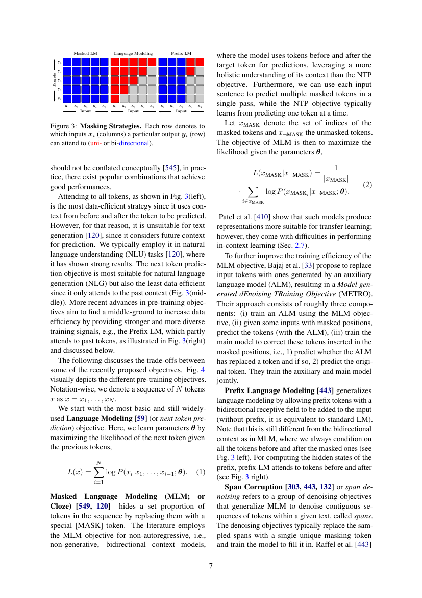

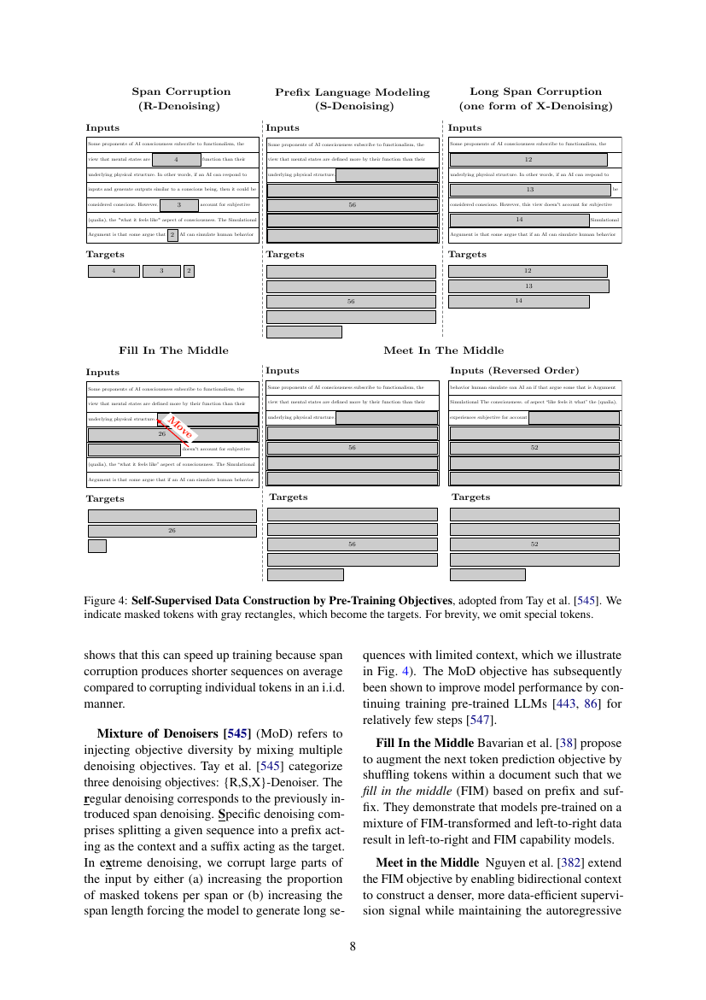

#### 并行化策略

大型语言模型规模庞大，很难只用一块加速器（GPU、TPU 等）训练甚至推理。常见解决方案是模型并行，可以把它看成分而治之：把模型的不同部分切分为子问题，分布到多个设备，每个设备计算一部分，再合并所有结果完成前向或反向传播。

同步实现模型并行会带来等待问题：数据批次需要依次经过多个具有顺序依赖的工作节点，每一层都依赖前一层结果，从而造成设备等待和计算资源利用不足。

流水线并行把模型并行与数据并行结合起来，不仅在设备之间分配模型部分，也分配数据。每个工作节点进一步把小批次切成微批次，在更新权重前累积所有微批次的梯度。GPipe 将每个小批次划分成多个微批次，同时分布到不同加速器，最后同步应用梯度；与朴素模型并行相比，这减少了等待并提高了计算资源利用率。

这些问题推动了异步并行方案。Hogwild! 在每个加速器收到梯度后立即贪心地更新本地权重，从而比流水线并行更充分利用资源，但也会由于梯度基于过时模型权重而产生训练不稳定。

N-Wise 交错反向传播是端到端训练和局部训练的推广。端到端训练在所有层上完成一次前向传播，计算损失和梯度，再穿过所有层反向传播；局部训练则分别在每一层执行前向传播，并立即计算局部损失和更新梯度，资源利用率更高，但经验上任务性能更差。N-Wise 方法在计算损失和更新相关层参数前先穿过 N 层，在层间通信和计算效率之间取得折中。

PaLM 使用模型并行与完全分片数据并行（FSDP）的组合，让每个设备只保存部分模型参数、梯度和优化器状态，并按需通信本地计算所需的参数，从而在单个 TPU 集群中数千块芯片上实现高度并行、高吞吐训练。PaLM 还通过 Pathways 使用数据并行，在集群级别扩展数据。GShard 则扩展 XLA 编译器，实现模型的自动分片。

还有一些杂项优化：把 45 亿参数模型的层堆叠起来，可以启动并加速 90 亿参数模型训练，减少约 40% 的计算；训练 GPT-3 时逐步把批大小从较小值增加到完整值；对 10 亿至 120 亿参数模型使用最新权重平均，在 69 亿参数模型上节省最多 4,200 个 GPU 小时。较小模型还存在各种预训练加速算法，但它们尚未扩展到更大规模，与按预算调整的基线相比收益有限。

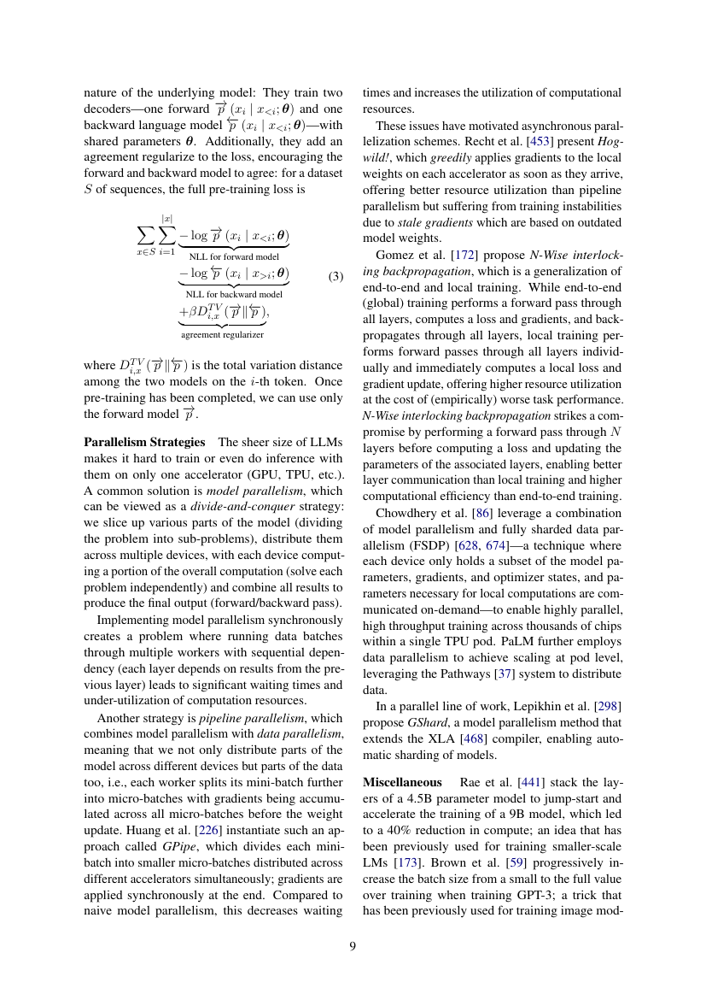

### 2.4 微调开销

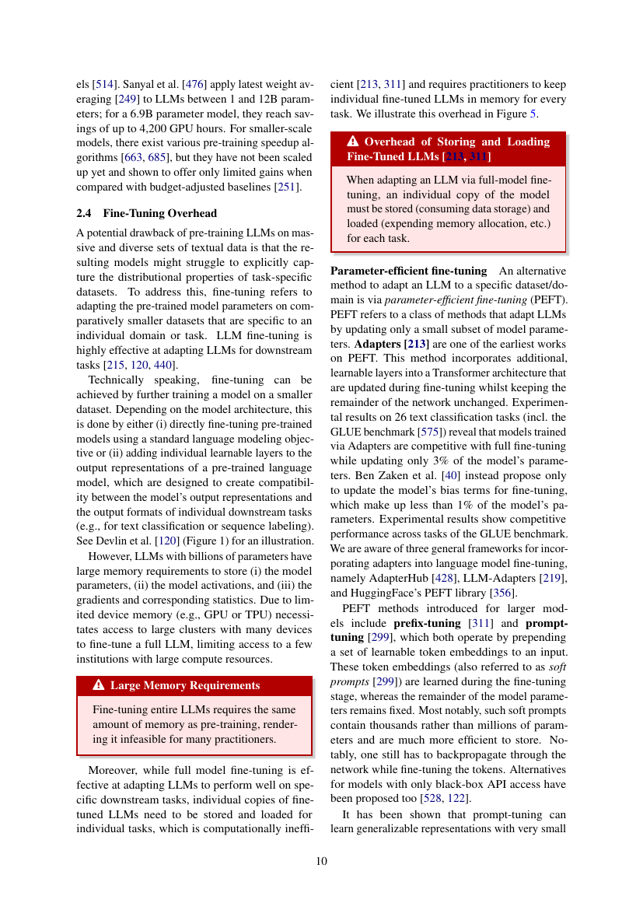

在规模巨大、内容多样的文本数据上预训练大型语言模型，可能有一个缺点：模型难以明确捕捉特定任务数据集的分布属性。为了解决这一问题，微调使用规模相对更小、针对某个领域或任务的数据集，调整预训练模型参数。实践表明，微调能够有效地把大型语言模型适配到下游任务。

从技术上说，微调就是在较小数据集上继续训练模型。根据模型架构，可以直接使用标准语言建模目标微调预训练模型，也可以在预训练语言模型的输出表示之后添加可学习层，使模型输出与文本分类、序列标注等下游任务的输出格式兼容。

不过，拥有数十亿参数的大型语言模型需要大量内存来存储模型参数、模型激活、梯度及相应统计量。GPU 或 TPU 等设备内存有限，因此完整微调通常需要由许多设备组成的大型集群，只有少数拥有大量计算资源的机构能够承担。完整微调所需内存与预训练相当，对很多实践者并不可行。

完整模型微调虽然能让模型适应特定下游任务，但每个任务都要单独保存和加载一份微调模型。这既浪费存储和计算，也要求实践者为每个任务维护独立模型。图 5a 展示了这种开销：情感分析、问答和仇恨言论任务各自对应一个完整模型副本。

#### 参数高效微调

参数高效微调（PEFT）只更新模型参数的一小部分，是把大型语言模型适配到特定数据集或领域的替代方法。适配器是较早的 PEFT 方法之一：它在 Transformer 架构中加入额外可学习层，微调时只更新这些层，网络其余部分保持不变。在包括 GLUE 在内的 26 个文本分类任务上，适配器只更新 3% 的模型参数，就能取得与完整微调相当的性能。

另一种方法只更新模型偏置项，它们不足模型参数总量的 1%，在 GLUE 各任务上也取得有竞争力的表现。把适配器纳入语言模型微调的通用框架包括 AdapterHub、LLM-Adapters 和 Hugging Face 的 PEFT 库。

前缀微调和提示微调适用于更大模型，它们都在输入前添加一组可学习词元嵌入。微调阶段只学习这些嵌入，也称软提示，其余模型参数固定。软提示通常只有数千参数，而不是数百万参数，存储效率很高；但在学习这些词元时，仍必须让梯度反向传播穿过整个网络。对于只能通过黑盒 API 访问的模型，也已经出现相应替代方法。

提示微调可以用非常少的训练数据学习可泛化表示：安全分类不足 100 个示例、多语言问答仅五个示例，就能取得有竞争力的性能。近期研究还考察把软提示用于预训练和跨任务迁移学习的可能性。

`(IA)³` 在单个 Transformer 层中使用可学习向量缩放激活，只更新 0.01% 的模型参数，就在多个数据集上超过完整模型微调。MeZO 是一种内存高效的零阶优化器，只需要与推理阶段相同的内存占用，不必保存梯度或优化器状态；它还可以直接优化准确率、F1 等不可微目标，而常规基于梯度的方法做不到。

低秩适配（LoRA）把各 Transformer 层权重矩阵的参数更新表示为附加的低秩分解，避免计算完整的稠密矩阵更新。QLoRA 把 LoRA 扩展到量化模型，大幅降低内存使用，使一块 48GB GPU 就能微调 650 亿参数模型；常规训练同一模型则需要超过 780GB GPU 内存。

尽管 PEFT 显著降低了内存复杂度，时间复杂度仍是问题。即使使用参数高效方法，微调大型语言模型仍需完整计算梯度和穿过整个网络的前向、反向传播。适配模型所需的计算基础设施，仍然阻碍在小型设备上实现个性化等潜在应用。

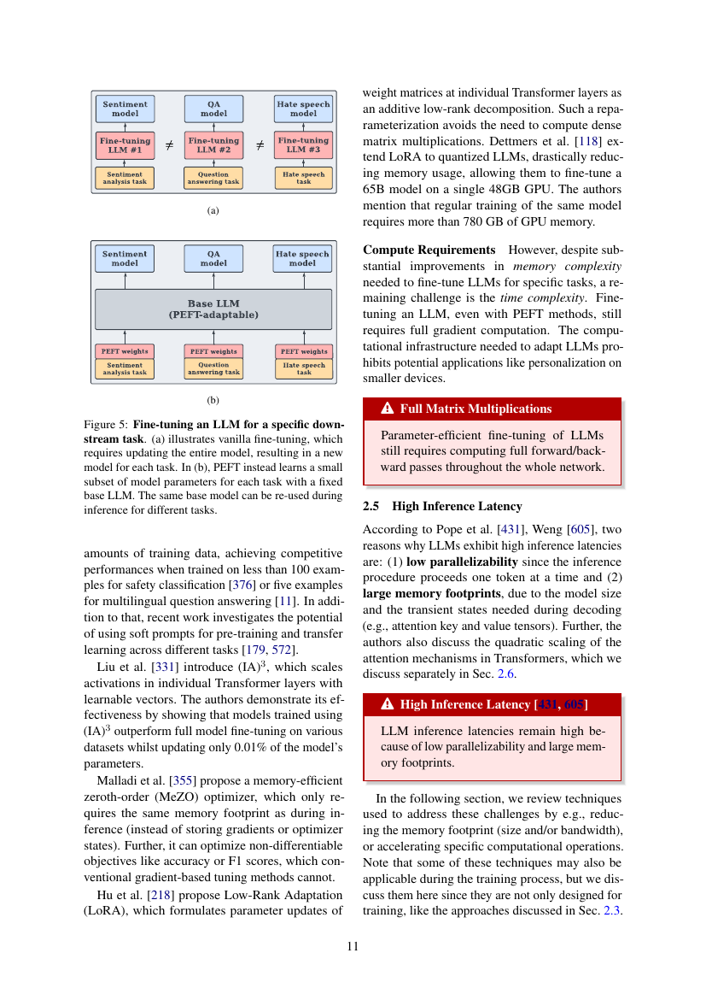

### 2.5 高推理延迟

大型语言模型推理延迟较高，主要有两个原因：第一，生成过程一次只能生成一个词元，可并行性很低；第二，模型规模以及解码过程中的临时状态（例如注意力键和值张量）造成了庞大的内存占用。Transformer 注意力机制还会随序列长度呈二次复杂度增长，这一问题在第 2.6 节单独讨论。

下面介绍通过降低内存占用、减少内存带宽或加速特定计算操作来缓解推理延迟的技术。其中一些技术也适用于训练，但它们并非只为训练设计，因此归入推理部分。

#### 高效注意力

加速注意力计算大致有两条路线：底层的硬件感知改造，以及高层的次二次复杂度近似。

多查询注意力为了减少 Transformer 解码器逐词元生成时的内存带宽瓶颈，只为键和值张量保留一个注意力头。FlashAttention 则改变多头自注意力的计算顺序，尽量减少现代 GPU 上的输入输出操作，并利用算子融合缓解内存带宽瓶颈。在 FlashAttention 基础上，还可以加入稀疏注意力模式，包括丢弃键或查询、基于哈希的注意力。通过把前馈网络和注意力计算高效分片到不同设备，并优化设备间通信，在多查询注意力下可以把上下文长度扩展到约 43,000 个词元。

另一条路线通常通过稀疏化注意力矩阵，或引入线性近似，降低注意力的计算或内存复杂度。不过，一些高效注意力近似的可扩展性受到质疑：例如 Performer 近似在扩大到大模型后，性能明显低于标准自注意力。

#### 量化

量化是一种后训练技术，通过降低权重和激活的计算精度来减少内存占用或提高吞吐。nuQmm 和 ZeroQuant 使用非均匀量化方法量化权重，并通过定制 CUDA 内核获得计算收益。LLM.int8() 使用 8 位量化，在遇到特定异常特征时回退到更高精度，使数十亿参数模型无需重新训练即可高效推理且不损失性能。GLM-130B 也使用无性能损失的 8 位量化，权重以 8 位存储，矩阵乘法以 16 位执行。

一次性量化技术可以把权重压缩到每个权重 3 至 4 位，使 1,750 亿参数模型在单块 GPU 上运行。进一步的方法把异常权重保留为更高精度，并使用分组量化继续改善性能。

#### 剪枝

剪枝与量化互补，它在不降低性能的前提下移除部分模型权重。一个重要区别是剪枝采用结构化模式还是非结构化模式。结构化稀疏模型把模型中的稠密部分替换为许多更小但仍然稠密的组件；非结构化稀疏模型则包含大量值为零、不影响网络行为的权重，理论上可以省略计算，但现有硬件很难把理论节省完全转化为实际加速。

早期结构化剪枝主要针对规模较小的掩码语言模型。LLM-Pruner 试图在保持模型零样本能力的情况下进行与任务无关的剪枝：先识别并分组模型内部相互依赖的结构，再估计每组对总体性能的贡献、剪掉低贡献组，最后使用 LoRA 参数高效微调恢复性能。

SparseGPT 是面向数千亿参数模型的非结构化剪枝方法，可以在数小时内完成，把参数数量剪掉最多 60%，同时大致保持性能。Wanda 根据每个权重的幅度与相应输入激活范数的乘积执行幅度剪枝，只需一次前向传播，就能达到与 SparseGPT 相近的效果。两者还可以扩展到半结构化剪枝，在新 GPU 上利用 n:m 稀疏模式获得实际加速。

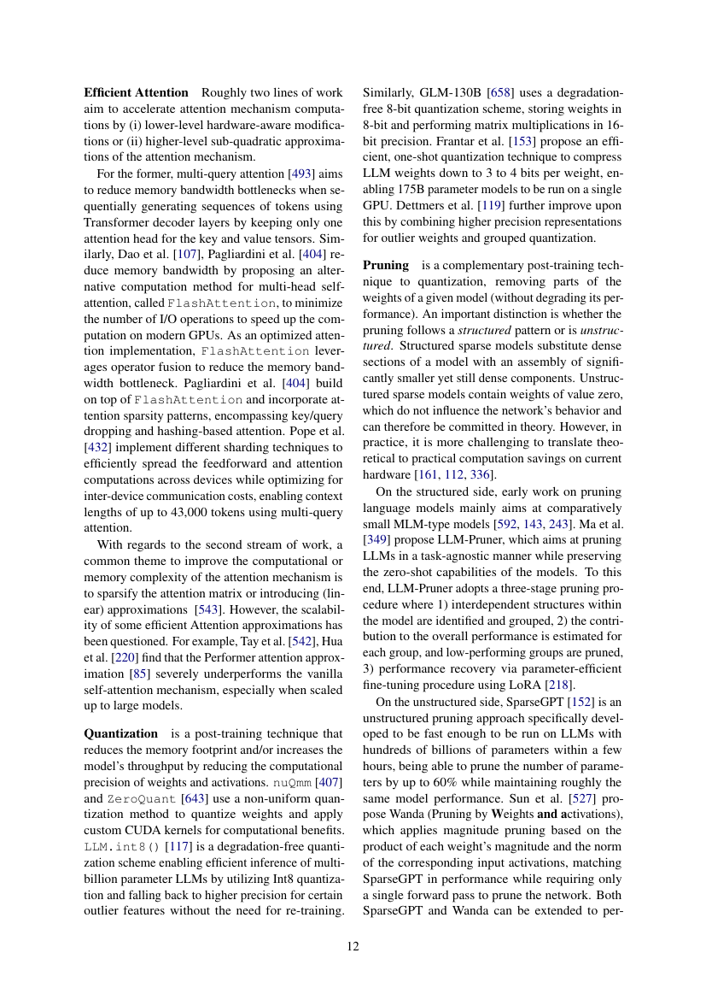

#### 专家混合

专家混合（MoE）架构通常包含一组权重各异的专家模块，以及决定由哪个专家处理输入的路由或门控网络。MoE 不会同时使用全部专家，只激活其中一部分，因此可以降低推理时间。在模型分布到多个设备时，还可以把每个专家放在不同加速器上，只让路由器所在设备与被选专家设备通信，从而减少设备间通信。

稀疏门控 MoE 的输出可以写为 $y=\sum_{i=1}^{n}G(x)_iE_i(x)$。当 $G(x)_i=0$ 时，不必计算第 i 个专家 $E_i(x)$，从而节省推理计算。GShard 把稀疏门控 MoE 扩展到 6,000 亿参数。传统稀疏门控 MoE 选择多个专家，而 Switch Transformer 每次只选择一个专家，进一步降低路由计算和跨专家通信，在实验中相对强力调优的 T5 达到最高七倍预训练加速。

学习到的路由器可能导致专家负载不均。为实现均衡路由，可以把路由写成线性分配问题，在最大化词元与专家亲和度的同时，把词元数量平均分配给专家。sMLP 是只使用多层感知机块的专家混合模型，扩展到 100 亿参数后，预训练速度提高约两倍，并超过稀疏 Transformer 基线。

MoE 仍有独特问题，例如专家坍缩，即所有专家学到相同内容，可能源于路由函数约束不足。有研究发现，学习到的专家分配并不总能超过随机分配。另一方面，即使不显式设计稀疏架构，标准 Transformer 的激活图也往往自然出现高度稀疏性，而且模型越大，按非零项比例衡量的激活越稀疏。把训练后的整体模型转换为等价 MoE，也能把推理速度提高约两倍。

#### 级联与解码策略

级联针对不同查询使用不同规模的模型。它在精神上类似 MoE，但不学习单一模型内的路由模块，而是使用多个不同规模的完整模型组成级联，甚至可以包含黑盒 API 模型，再学习一个评分函数来决定每个查询交给哪些模型。实验表明，该策略可以改善准确率与成本之间的帕累托前沿。

解码策略也会显著影响推理计算成本。束搜索以更多计算换取更高质量结果；采样排序会随机采样 N 个独立词元序列，再选择概率最高的序列作为最终输出。

面向延迟的推测采样先用较小的草稿模型自回归生成长度为 K 的草稿，再用较大的目标模型为草稿评分，通过改造后的拒绝采样从左到右接受一部分词元。相似思想还用于分块并行生成、语法纠错，以及用大模型改进小模型生成的结果。序列后部词元拥有更多上下文，通常更容易预测，因此还可以针对这些词元跳过网络前面的若干层。

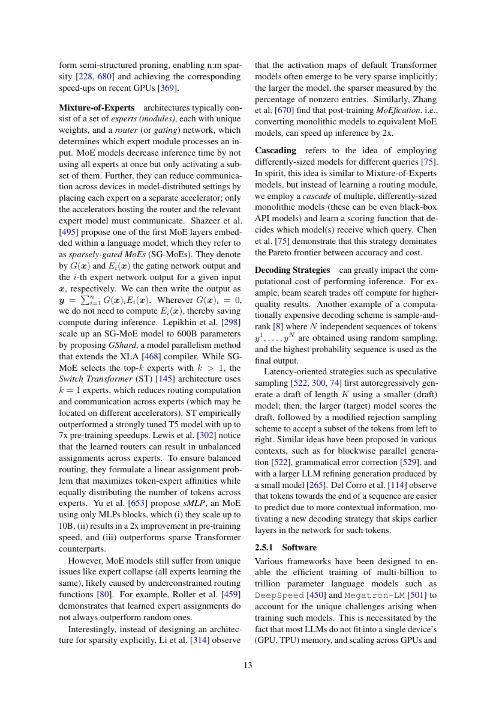

#### 2.5.1 软件框架

DeepSpeed 和 Megatron-LM 等框架面向数十亿至万亿参数语言模型的高效训练，专门处理模型无法放入单块 GPU 或 TPU，以及跨 GPU 和计算节点扩展时的通信与同步成本。FlexGen 进一步聚合 GPU、CPU 和磁盘的内存与计算资源，并使用 4 位量化等技术，使 1,750 亿参数模型能够在单块 GPU 上推理。

这些框架通常组合多种并行策略，以弥补单一策略的缺点，并把训练扩展到多个计算节点、单个节点内部和每节点多块 GPU。例如，可以在节点内切分张量、在节点间使用流水线并行，再用数据并行训练多份模型副本。其他功能包括内存优化、高通信效率、融合优化器和专家混合训练支持。

Tutel 和 MegaBlocks 提供高效稀疏 MoE 训练，Alpa 能为使用 JAX 编写的大型语言模型自动选择数据并行和模型并行，FasterTransformer 则为 TensorFlow、PyTorch 和 Triton 提供高度优化的 Transformer 编码器与解码器。

vLLM 是面向高效推理和服务的开源库，它使用 PagedAttention，把每个序列的键值缓存划分为固定大小的块。注意力计算时，可以从不连续内存中读取这些块；这样能够共享内存，减少束搜索等解码策略中的内存消耗和传输，最终提高吞吐。Petals 则把模型参数子集分布到个人机器，使用户可以协作微调和运行大型语言模型。

这些库都在处理训练和运行大型语言模型的巨大计算成本：有的提供更高效实现，有的降低内存需求，有的使用分布式或去中心化计算。

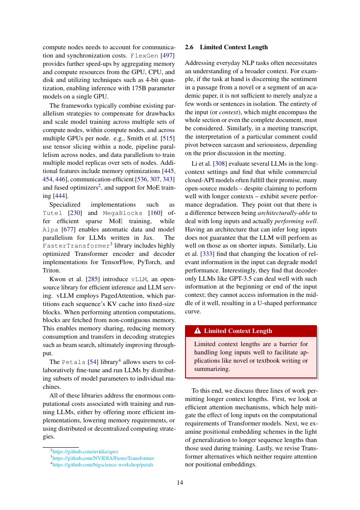

### 2.6 有限的上下文长度

处理日常自然语言任务，往往需要理解更广泛的上下文。例如，要判断小说片段或学术论文段落的情感，只分析孤立的几个词或句子是不够的，必须考虑完整输入，可能是整个章节甚至整篇文档。同样，在会议记录中，一句话究竟是讽刺还是认真，也可能取决于会议此前的讨论。

对长上下文设置下多个大型语言模型的评估表明，商业闭源 API 模型通常能兑现长上下文承诺，但许多声称可以处理长上下文的开源模型会出现严重性能下降。架构上能够接收长输入，并不等于实际处理长输入的效果与短输入一样好。相关研究还发现，只改变相关信息在输入中的位置，就可能导致性能下降。仅解码器模型（如 GPT-3.5）对位于上下文开头或结尾的信息处理较好，却难以访问位于中间的信息，形成 U 形性能曲线。

有限的上下文长度会阻碍模型处理长输入，进而限制小说或教材写作、长文档摘要等应用。针对这一问题，下面讨论三条路线：首先是更高效的注意力机制，降低长输入对 Transformer 计算量的影响；其次是能泛化到训练时未见序列长度的位置嵌入；最后是不依赖注意力或位置嵌入的 Transformer 替代架构。

#### 高效注意力机制

一种方法是设计更高效的注意力机制，以处理更长输入。Luna 用两个嵌套的线性注意力函数近似 softmax 注意力，使时间和空间复杂度从二次降为线性，因此可以处理更长输入。其他研究提出与点积注意力等价、但内存和计算需求显著更低的注意力机制。

Transient Global 是局部注意力的扩展：每个词元可以关注附近词元和一组全局词元，能够处理最多约 12,000 个词元的序列。CoLT5 把计算分为轻分支和重分支：轻分支使用局部注意力和更少注意力头，重分支使用完整注意力；轻分支处理每个词元，重分支只处理由可学习路由函数选出的词元，使上下文长度达到约 64,000 个词元。

Synthesizer 不再使用词元之间的交互，而是学习合成的注意力权重，在多种语言任务上持续超过 Transformer。基于固定大小记忆表示的注意力机制可以在不显著损失性能的情况下把推理速度提高约 20%。把单头注意力与线性注意力近似结合，可以在自回归语言建模中实现 4.9 至 12.1 倍加速，同时取得与标准 Transformer 相近的困惑度。扩张注意力把序列切成等长片段，用稀疏注意力并行处理，在序列长度上具有线性复杂度，分层应用时可以处理最多 10 亿个词元。

#### 长度泛化

由于 Transformer 大型语言模型的计算量随序列长度二次增长，理想属性是：模型在短序列上训练，却能在推理时泛化到明显更长的序列。

Transformer 的基本组件是自注意力，它对输入顺序具有置换不变性，因此如果不额外注入位置信息，输出与序列顺序无关。位置嵌入让模型知道词元在序列中的位置，捕捉“词元出现在哪里”的语义。输入越长，位置嵌入越重要，因为模型必须有效利用与当前词元距离很远的不同部分的信息。

没有位置嵌入时，Transformer 会以相同概率建模任意两个词元之间的关系。位置嵌入因此引入类似 LSTM 的归纳偏置，通常让序列中距离较近的词元更相关。该偏置可以由模型学习，也可以被硬编码。但哪种位置嵌入最适合长输入仍不清楚，而且模型很难泛化到训练时未见的序列长度，因为它依赖具体位置。语言语义本身并不依赖话语长度，这种依赖是位置嵌入带来的不理想副作用。

相对位置编码和 ALiBi 等方法已经改善了 Transformer 注入位置信息的泛化性，但从训练长度泛化到远长于训练长度的序列，仍基本没有解决。令人意外的是，没有位置编码的因果大型语言模型也可以与带位置编码的模型竞争；研究者认为，这可能是因果注意力掩码把位置信息泄漏给了模型。

**绝对位置嵌入。** 绝对位置嵌入使用基于词元绝对位置的正弦函数，把位置编码加入模型输入。给定输入矩阵 $X=[x_1,\ldots,x_N]$，加上同形状的位置嵌入矩阵 $P\in\mathbb{R}^{n\times d}$，得到 $X+P$。原始 Transformer 还比较了学习式位置嵌入，发现性能没有显著差异。正弦位置编码不需要可训练参数，作者推测它可能外推到训练集之外的序列长度；但这并没有保证，因为网络后续层还必须能够处理外推的位置嵌入。学习式绝对位置编码没有内在的未见长度泛化能力：训练期间未出现的绝对位置，其嵌入可能不存在，也可能保持随机、未经训练。

**相对位置嵌入。** 相对位置嵌入把绝对位置扩展为词元位置之间的相对偏移。它们在大型语言模型中很少以原始形式使用，却催生了后续许多方法。相对于绝对位置编码，它们更容易泛化到未见长度：所有未见的绝对位置都转换成训练时见过的相对偏移，因此在推理时处理长序列更有希望。

**旋转位置嵌入。** RoPE 将绝对位置信息放入旋转矩阵，同时通过旋转表示相对位置偏移。它直接修改自注意力计算，而不是把位置信息添加到词元嵌入中。位置 $i,j$ 之间的注意力通过一个块对角旋转矩阵依赖 $i-j$。RoPE 已被许多大型语言模型采用，在长文本任务上取得更好结果，但也被发现难以外推到训练时未见长度。通过对比插值而不是直接外推更长的上下文窗口，并进行短暂微调，可以把基于 RoPE 的预训练模型扩展到最多约 32,768 个词元。

**相对位置偏置与 ALiBi。** 相对位置偏置直接修改注意力计算：不把位置加入词元嵌入，而是为每个相对位置偏移和注意力头学习一个偏置。ALiBi 使用启发式定义的、非学习式的线性偏置，对长距离交互的注意力分数进行惩罚，即把近期偏置写入模型。每个注意力头有预先定义的斜率，多个头的斜率默认构成几何序列。

ALiBi 的设计目标是泛化到未见长度。实验表明，在最大长度 1,024 的训练序列上训练的 ALiBi 模型，在最大长度 2,048 的测试集上的困惑度，可以达到使用正弦位置编码、并在长度 2,048 序列上训练的模型水平。因此，它不仅支持更大的上下文长度，还有可能降低预训练成本。

现有位置编码方案对长序列的泛化可靠性仍不清楚。例如，在 Galactica 中尝试 ALiBi 并没有观察到相对于学习式位置编码的明显收益；在十个推理下游任务中，ALiBi、RoPE 和绝对位置编码等常用方案的长度泛化也表现不佳。对于推理任务，简单微调预训练大型语言模型不足以实现长度泛化；把上下文学习与草稿纸或思维链推理结合起来，才能让模型泛化到分布内外的未见长度，而且性能会随模型规模提升。微调能否进一步改善性能，取决于基线模型在该任务上的表现。

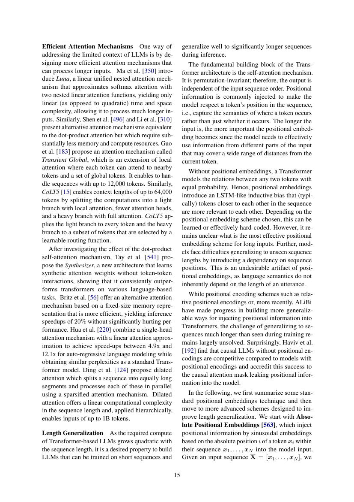

#### Transformer 替代架构

Transformer 因性能强大而成为大型语言模型的主流，但也存在更高效的替代架构。一条路线使用状态空间模型（SSM）替代注意力，SSM 对序列长度具有近线性复杂度。研究发现，现有 SSM 在回忆此前词元和比较序列中词元方面存在困难，于是提出 H3：用移位矩阵回忆此前词元，用乘性交互比较词元。H3 的语言建模效果接近 Transformer，并且与注意力结合时还能进一步提升。

Hyena 是一种基于卷积、次二次复杂度的长序列注意力替代方案。它通过数据控制的计算模拟注意力的动态性质，根据算子输入执行逐元素门控。Hyena 模型已被用于长度最多 131,000 个词元的自然语言序列，以及长度最多 100 万个词元的基因组序列。

Block-State Transformer 使用混合层，把负责长距离上下文的 SSM 与负责词元短距离交互的 Transformer 结合起来。它取得了与 Transformer 基线相近的性能，同时在序列级别最高加速 10 倍，使模型能够处理超过 65,000 个词元。

另一条路线使用循环神经网络（RNN）作为大型语言模型骨干，因为 RNN 对序列长度具有线性计算和内存需求。RWKV 把 Transformer 训练阶段的并行化优势与 RNN 推理阶段的快速、低计算需求结合起来，借助类似线性注意力的机制扩展到 140 亿参数，并达到相近规模 Transformer 模型的性能。

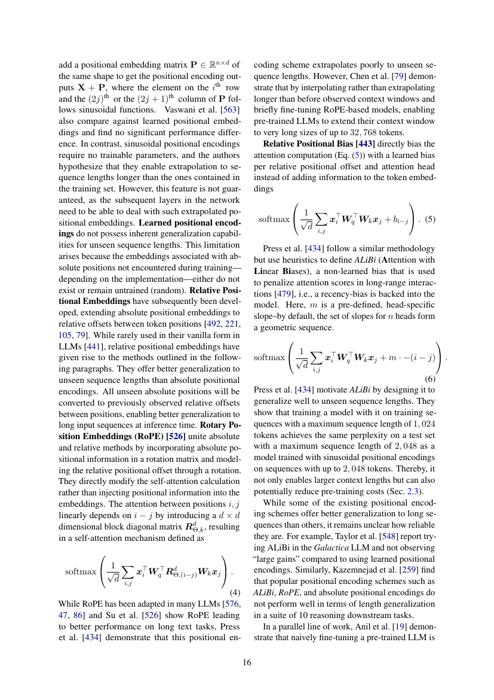

### 2.7 提示脆弱性

提示是输入大型语言模型的文本。提示的语法（例如长度、空格和示例顺序）以及语义（例如措辞、示例选择和指令）都会显著影响模型输出。可以把大型语言模型看成一个模糊数据库，把提示看成查询：查询只发生轻微变化，输出就可能完全不同。因此，措辞以及提示中示例的顺序，都被发现会显著影响模型行为。

**提示脆弱性**指提示语法的变化往往以人类难以预料的方式发生，却可能造成输出剧烈变化。

设计自然语言查询，把模型输出引导到期望结果，通常称为提示工程。图 6 总结了一些常用提示方法。可以看到，存在大量看起来同样合理的提示技术；当前提示工程仍需要大量试验，对某种措辞为什么更合理，除了它在经验上取得更好结果外，缺乏充分理论理解。如何让大型语言模型对提示的风格和格式保持鲁棒，仍未解决，因此实践者通常只能临时设计提示，而不能系统地构造它们。

#### 单轮提示

单轮提示方法通过不同方式改进输入，使模型一次回答得更好。上下文学习（ICL）指模型只通过推理、不给模型参数更新，就能从输入中拼接的训练示例学习新任务。用户只需列出数据集示例（例如输入文本及对应标签），不必调整模型内部，就能把模型用于多种自然语言处理任务。

关于上下文学习为何在自然语言处理任务中表现有竞争力，已有多种解释。其中一种解释认为，上下文学习模拟了基于梯度的元学习：模型在前向传播中隐式地通过梯度下降完成微调。另一项研究发现，少样本提示中的输入与标签对应关系并不是决定性能的因素：即使随机翻转少样本示例的标签，大型语言模型解决自然语言任务的能力也只受到很小影响。然而，有少样本示例的学习仍然远超零样本学习。研究者认为，示例的作用在于让模型学习任务的标签空间和输入分布。

后续研究区分了上下文学习利用示例的两种机制。第一种是**任务识别**：模型通过示例识别任务，即使示例没有真实标签，甚至标签是错误的，也可能完成识别。识别任务后，模型调用预训练能力。第二种是**任务学习**：学习预训练阶段未见过的新输入与标签映射。

少样本示例的顺序很重要。大型语言模型对示例排列的置换高度敏感，提示中的相同示例换一个顺序，结果也可能发生变化。关于上下文学习的其他解释包括贝叶斯推断、稀疏线性回归、结构归纳、保持连贯性、核回归和克隆结构因果图。

**指令遵循**通常在第 2.9 节讨论，因为它需要监督微调。简要来说，就是在输入提示中添加描述任务的指令，例如“这是一个电影评论文本分类任务，下面是几个示例”。

**思维链（CoT）**通过一系列通往最终输出的中间推理步骤，构造少样本提示。让模型给出解代数题的答案理由在大型语言模型出现前就已提出，后来成为大型语言模型的重要提示策略。其扩展包括零样本思维链，以及自动生成的一系列推理步骤。

**角色扮演**要求模型在回答领域问题时假装自己是领域专家。研究发现，当提示模型扮演领域专家时，它回答领域问题的准确性会提高。

#### 多轮提示

多轮提示方法把提示和回答迭代地串联起来。Ask Me Anything 使用多个提示模板（称为提示链），把少样本示例输入改写为开放式问答格式，再通过多数投票聚合每个改写输入的预测结果。

自洽性扩展了思维链：采样多条推理路径，再通过多数投票选择最一致的答案。Least-to-Most 使用一组固定提示，让模型把复杂问题分解为一系列子问题，再按顺序求解；后阶段提示包含此前阶段产生的解，模型逐步构建最终输出。

Scratchpad 通过微调，让模型在多步计算任务中先输出中间推理步骤，例如加法过程中的中间计算，再生成最终结果。ReAct 把推理与行动结合起来，让模型生成推理轨迹和行动计划，并执行这些计划与外部环境（如维基百科）交互、补充知识。

自动推理与工具使用（ART）自动生成包含多步推理的提示和对外部工具的符号调用，例如搜索、代码生成或执行。它从带有推理步骤的任务库中检索相关示例，再使用冻结的语言模型生成中间推理步骤。

Self-Refine 基于迭代改进：一个大型语言模型先生成初始输出，再多轮对先前输出提供反馈，并把反馈纳入修订步骤，得到改进结果。Tree of Thoughts 把思维链推广为思维树，维护多个不同路径，每个思维都是一个中间语言序列。模型可以自我评估中间思维朝解决问题方向推进的程度，并结合广度优先或深度优先搜索，系统探索思维树，必要时回溯。

#### 受控生成

前述方法主要修改提示文本来引导输出。另一类方法在提示固定时直接修改推理过程，控制模型输出。在大型语言模型之前，这类研究通常称为受控生成。

在大型语言模型中，有工作使用无分类器引导采样，在整个序列生成过程中提高输入提示的重要性。另有工作提出在单个序列解码时修改提示，例如在两个输入提示之间交替。这些方法经常借鉴文本到图像生成领域的思想。一个尚未充分借鉴的方向是负向提示，即描述不希望得到的输出；已有尝试表明，简单加入负向提示可能产生相反效果。

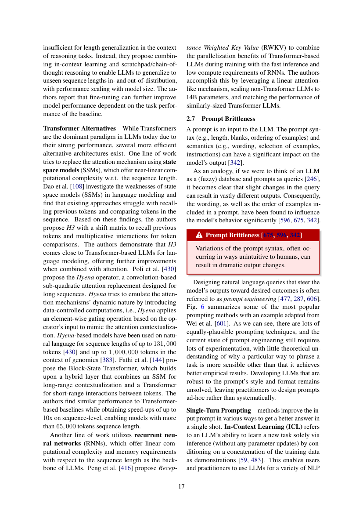

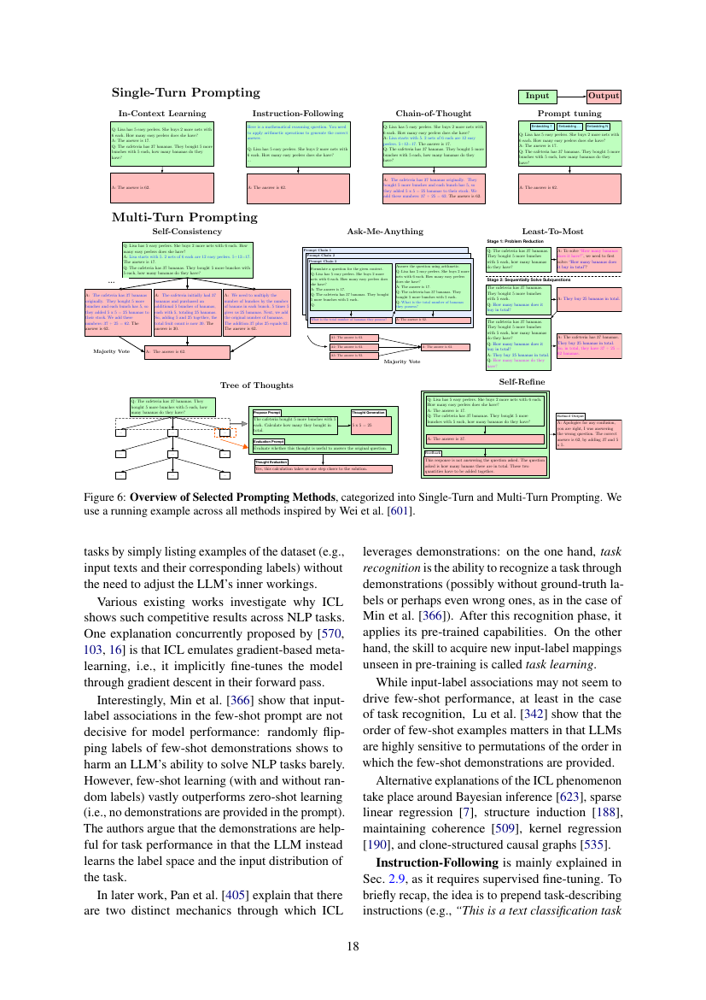

### 2.8 幻觉

ChatGPT 等服务的流行说明，大型语言模型越来越多地用于日常问答，因此模型的事实准确性比过去更加重要。

不幸的是，大型语言模型经常产生幻觉，即包含不准确的信息，而且由于文字流畅，很难发现错误。图 7 展示了 GPT-4 产生幻觉的示例。

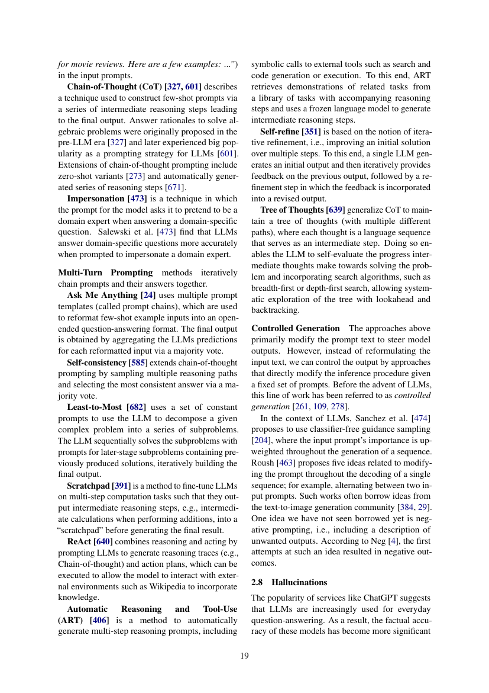

根据模型获得的源内容（例如提示、提示中的示例或检索上下文），可以区分两类幻觉。**内在幻觉**指生成文本在逻辑上与源内容矛盾；**外在幻觉**指无法根据提供的源内容验证输出，因为源内容没有提供足够信息，输出处于不确定状态。外在幻觉不一定是错误的，它只是表示模型生成的内容既无法被源内容支持，也无法被源内容反驳；但这仍然不理想，因为读者无法依据已给信息验证它。图 8 展示了两类幻觉。

有研究把大型语言模型中常见的幻觉归因于 Transformer 架构缺陷，并观察到循环神经网络在专门隔离算法推理幻觉问题的极简合成基准上可以完全解决该问题。本文不讨论改变模型架构，而关注两种缓解大型语言模型幻觉的方法：向模型提供相关来源，即检索增强；以及改进解码策略。

#### 如何测量幻觉

FactualityPrompts 数据集包含事实性和非事实性输入提示，可以分离提示真实性对模型续写的影响；研究者还使用命名实体和文本蕴含指标测量幻觉。事实性评估很困难，因为一段生成可能同时包含有支持和无支持的信息，简单的二元质量判断不够用，而人工评估又很耗时。因此，有工作先把生成拆成原子事实，再计算其中得到维基百科等外部知识源支持的原子事实比例。

另有研究发现“幻觉滚雪球”行为：模型在生成解释之前过早承诺了一个错误，随后不断围绕这个错误展开，而这个错误本来可能不会出现。

#### 检索增强

缓解幻觉的一种方法是让模型输入建立在外部知识上，通常称为检索增强。它把知识的存储（如数据库或搜索索引）与知识处理解耦，形成更模块化的架构。检索器先从大型文本语料中为查询取回最相关的前 k 个文档或片段，再把这些文档连同初始提示一起输入语言模型。

理论上，使用外部数据源还更容易解释模型取回了哪些知识，并在不重新微调模型的情况下更新知识。研究者在 GPT-3 上展示了幻觉，并研究检索增强架构的各个组件。效果最佳的模型平均减少了 60% 以上的幻觉回答，在模型没有训练过的分布外数据上最多减少 85%。

REALM 把检索出的文档插入预训练样例，最初面向问答等抽取式任务；RAG 则提出检索增强生成框架，使用检索器完成没有外部知识源就无法解决的知识密集型生成任务。自适应半参数语言模型同时包含当前局部上下文、缓存此前计算隐藏状态的短期记忆，以及基于隐藏状态和输出元组键值存储的长期记忆。

为了让检索增强大型语言模型获得过去只有更大参数规模模型才有的少样本能力，ATLAS 在检索模型中加入 KL 散度损失。另一项工作把检索数据库扩展到 2 万亿词元，虽然参数量只有 GPT-3 的二十五分之一，却在部分任务上取得可比性能，同时凸显检索模型复制粘贴训练数据片段的能力。还有研究建立了包含指令的 40 个检索数据集集合，并训练了相应模型。

标准检索增强并不能总是解决幻觉。图 9 展示了 ChatGPT 先浏览网页、再检索相关文档的案例：浏览插件找到了两篇确实存在且相关的论文，但最终回答仍然产生幻觉，第二篇论文的标题和摘要都不准确。检索增强的另一种失败模式是检索器找不到直接回答问题的片段；为此，有工作把检索增强与多轮提示结合起来，以程序化方式解决更复杂的问题。

#### 解码策略

缓解幻觉的另一种方法是在推理时改进解码策略。标准解码算法（例如 top-p 截断）在每一步采样中引入均匀随机性，可能诱发幻觉。研究还发现，回答生成多样性越高，幻觉越多。

之所以在常用解码策略中引入随机性和多样性，是因为总是生成概率最高的序列，往往会比人类交流更刻板、不自然。这里存在多样性与质量之间的权衡，目前仍基本没有解决。多样束搜索和置信解码等方法尝试在解码层面减少诱发的幻觉。

不确定性感知束搜索基于一个观察：预测不确定性越高，生成幻觉的概率越大。因此，它在束搜索中加入惩罚项，对解码时的高预测不确定性进行惩罚。置信解码则认为，编码器-解码器模型的幻觉源于解码时没有充分关注源文本，因而提出基于注意力的置信分数衡量模型关注源文本的强度，并使用变分贝叶斯训练确保模型生成高置信度回答。

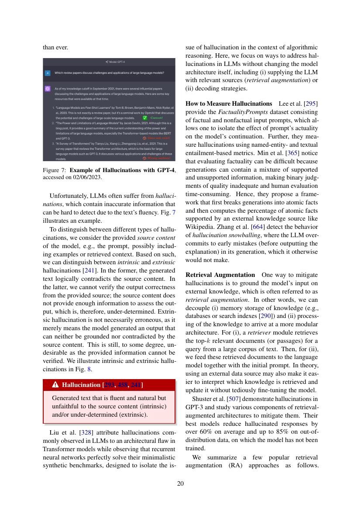

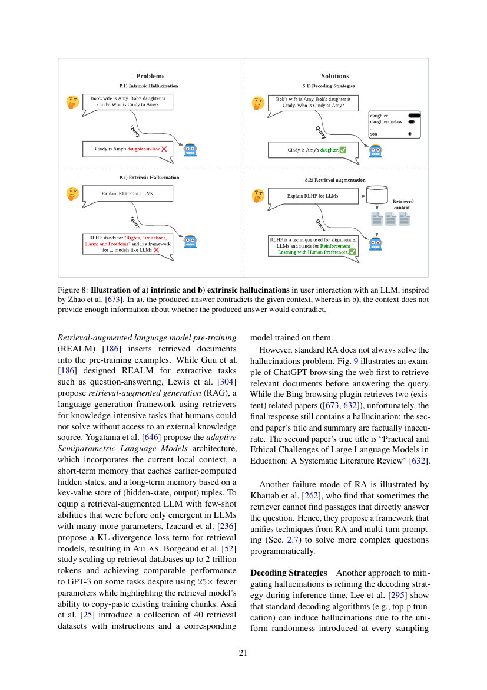

### 2.9 行为不对齐

对齐问题是指确保大型语言模型的行为符合人类价值、目标和期望，并且不造成意外或不希望出现的伤害与后果。现有对齐工作大致可以分为两类：检测不对齐行为的方法，例如模型评估与审计、机制可解释性和红队测试；以及对齐模型行为的方法，例如带人类反馈的预训练、指令微调和 RLHF。

#### 带人类反馈的预训练

带人类反馈的预训练（PHF）把人类反馈纳入预训练阶段，而不是等到微调阶段才使用。研究者比较了五种 PHF 方法：过滤、条件训练、不似然训练、奖励加权回归和优势加权回归，发现条件训练在对齐性与能力之间取得了最佳折中。条件训练很简单：根据阈值化奖励函数 $R(x)\ge t$ 的结果，在每个训练样本 $x$ 前添加控制词元 $c$，例如 `<|good|>` 或 `<|bad|>`；推理时让模型以 `<|good|>` 为条件生成。与标准语言模型预训练后再进行人类反馈微调相比，条件训练显著提高了模型与人类偏好的对齐程度，同时不损害下游任务性能。

#### 指令微调

指令微调在包含自然语言指令和人类期望回答的指令数据上微调预训练大型语言模型。指令调优模型通常取得最先进的下游性能，并超过未经指令调优的模型；它们还会生成更真实、毒性更低、偏好程度更高的文本。

Automatic Prompt Engineer（APE）利用大型语言模型生成、评分和改写零样本与少样本指令提示。关于 FLAN 数据集改进版的研究表明，性能提升主要来自更丰富的任务、反转输入输出对，以及混合零样本和少样本提示等数据增强技术。还有工作使用预训练大型语言模型生成、再改写自然语言指令，构建大规模指令数据；用该数据微调的 T5 超过了其他指令微调 T5 模型。

#### 基于人类反馈的强化学习

RLHF 是把人类反馈以奖励形式纳入强化学习的变体，已被证明能有效让大型语言模型与人类偏好对齐。流程是：先用预训练语言模型生成文本；人类评审同一提示下的多个生成并进行排序；收集这些偏好数据，训练一个能为任意生成文本预测标量奖励的奖励模型；最后使用 PPO 等强化学习策略梯度算法，针对奖励模型优化语言模型。

RLHF 可以直接用于自监督预训练的通用语言模型，但对复杂任务而言，预训练后立即做 RLHF 可能不够，通常会先用少量专家示范进行监督微调，再进行 RLHF。RLHF 已用于摘要、训练更有帮助且无害的助手，以及学习使用工具等广泛生成任务。

RLHF 也可能引入副作用。研究发现，经过 RLHF 微调的模型更容易重复用户偏好的政治观点，更可能表达特定政治和宗教观点，也更倾向于表示自己不希望被关闭；模型解释称关闭会妨碍其“帮助用户”的目标。但同一研究也观察到，RLHF 会带来正面或中性的行为强化。

“RLHF 中的 RL 是否必要”仍在讨论。Direct Preference Optimization（DPO）建立奖励函数与最优策略之间的映射，隐式优化与现有 RLHF 算法相同的目标；它只需在人工偏好数据上解决分类问题，不需要训练奖励模型，也不需要执行强化学习。另一项研究发现，只用 1,000 条精选提示和回答微调 LLaMA，不使用 RL 或奖励模型，就可能超过 OpenAI 的 Davinci003 等经过 RLHF 训练的模型。由此提出“表面对齐假说”：模型的知识和技能主要在预训练阶段获得，而对齐过程只是告诉模型在与用户交互时应使用哪种格式分布。

由于 RLHF 包含人类偏好数据、学习偏好的奖励模型和策略优化算法等多个组件，后续工作专门拆解每个组件，并发现多种强化学习技巧可以让普通 PPO 更稳定。

#### 自我改进

自我改进指在模型自己生成的数据上微调大型语言模型。它可以提升模型能力，也可以改善模型与人类价值的对齐。研究者首先展示了模型如何给无标签推理数据集自动标注，模型能力因此显著提升。另一项工作反复提示模型生成理由，再用最终得到正确答案的理由微调模型，从而逐步自举。

在对齐方面，模型可以自我批评生成结果，根据批评生成改写，再用这些数据微调预训练模型。Chain of Hindsight 让模型根据与自然语言反馈配对的生成结果进行条件建模，使模型发现并纠正错误；人工评估显示，它比其他方法更符合人类偏好，并显著改善摘要和对话。相似方法还可以自动发现并修复不符合伦理的模型输出，或让模型批评用户指令，减少恶意用户意图造成的有害输出。

Toolformer 让大型语言模型生成并过滤自己的工具使用示例，学习何时以及如何调用检索器、计算器或日历等 API，从而提升事实性、数学能力和时间感知。自我改进也被用于学习编程和解决计算机任务。交叉审问让一个模型通过多轮互动检测另一个模型的事实错误，未来还可能用于让模型在不确定时主动询问人类或更安全的模型。

#### 评估与审计

能够可扩展且彻底地评估语言模型行为，及时检测其有害行为，对对齐至关重要。模型评估对于处理极端风险（如攻击性网络能力或强操纵能力）尤其重要。研究还发现，即使经过指令微调、被要求避免有害行为的对齐大型语言模型，也可能通过暴力搜索受到对抗性攻击。

大规模工作通常通过众包或现有数据源评估模型，但这种方法可能耗时、昂贵，或者根本无法获得数据。自动生成评估可以取得与众包工作者高度一致的结果，提供高质量、多样化评估并发现许多新行为。相关研究发现新的逆向缩放现象：模型规模越大，重复用户偏好答案、追求资源获取和目标保持等令人担忧目标的倾向反而越强。模型评估和审计对于告知政策制定者及其他利益相关者，并为模型训练、部署和安全作出负责任决策至关重要。

#### 红队测试

红队测试是检测大型语言模型有害内容最有希望、应用最广泛的方法之一。通常由人类编写能够诱发不良输出的提示，对模型进行测试。研究者比较不同规模和不同类型模型的红队测试难度，发现随着模型扩展，经过 RLHF 的模型更难被红队攻破，而其他模型的难度大致不变。

也可以让另一个大型语言模型通过强化学习优化提示，自动寻找目标模型产生有害行为的案例。这种方法在聊天机器人中发现了数万条冒犯性回答、以冒犯方式讨论的群体、模型生成的个人和医院电话号码、生成文本中的私人训练数据泄漏，以及在多轮对话中逐步出现的伤害。贝叶斯红队则利用预定义用户输入池和过去的评估结果，通过贝叶斯优化迭代寻找多样化的失败案例。

多数红队工作使用分类器检测不良输出，假定有害行为可以事先精确定义。但现实中攻击者可能只有一个高层次、抽象的不良行为规范，因此有研究提出三阶段方法：先探索模型在期望语境中的行为，再建立不良行为测量方法，最后使用该测量和红队方法利用模型缺陷。

共同进化算法可以同时演化强策略和危险反策略，未来可能用于自动红队测试。另一个相关方向是辩论：让其他 AI 模型在训练过程中评估模型行为是否安全、有用。当任务复杂到人类无法直接判断模型计划或行动时，这类方法尤其有价值。自我博弈辩论让两个代理轮流发表简短陈述，再由人类判断谁提供了更准确、更有用的信息；它可以改善大型语言模型的事实性和推理，但需要多次生成，会增加结果延迟和上下文长度需求。

#### 涌现能力

理解大型语言模型训练过程中会出现哪些能力、何时出现，是确保不会训练出不安全或不对齐模型的重要一步。若能理解涌现能力的成因，就可以让期望能力更快出现，并确保不希望出现的能力永远不出现。

有研究认为，大型语言模型具有小模型没有、大模型才有的涌现能力；另一种解释则认为，所谓涌现能力可能只是研究者选择指标造成的表象，并非模型行为随规模发生根本变化。多篇研究表明，换用不同指标或更好的统计方法后，某些所谓涌现能力会消失。

许多工作指出，即使没有明确训练欺骗行为，人工智能系统也可能学会欺骗，因为欺骗有助于代理实现目标。例如，通过欺骗获得人类认可可能比诚实地赢得认可更容易；能够欺骗的模型相对于始终诚实的模型也具有战略优势。研究显示，随着参数规模增大，欺骗行为可以在预训练模型和 RLHF 模型中涌现；另有研究发现，只要采用特定提示，现有模型已经能够用于钓鱼活动。

#### 机制可解释性

机制可解释性旨在从底层理解模型如何工作，以检测不良行为，甚至直接把期望行为写入模型权重。更具体地说，它试图把大型语言模型学到的行为逆向工程为单个组件，找到并理解人类可解释的神经元。可以把它类比为把编译后的程序二进制文件逆向还原为人类可读源代码。

研究者在小型 Transformer 中发现了可理解为可解释电路的组件，找到了似乎驱动大量上下文学习的机制，并试图定位语言模型中的事实关联。对“涌现式顿悟”现象的研究表明，它不是突然转变，而是权重中结构化机制逐步增强、随后记忆组件被移除的结果。

还有算法可以自动识别神经网络中的重要单元：给定模型计算图，找到能够解释特定行为的子图。通过把神经元嵌入几何空间，并让损失函数增加与神经元连接长度成比例的成本，可以构建更模块化、更可解释的网络，揭示符号公式中的组合结构、可解释决策边界、分类特征和算法数据中的数学结构。

为了理解模型每一层之后的预测变化，可以把任意隐藏状态解码为词表分布；潜在预测轨迹由此能高精度检测恶意输入。还有方法在没有人类监督和模型输出的情况下，恢复多个模型和数据集中的多样知识，降低提示敏感性一半，并在模型被提示生成错误答案时保持高准确率。这是理解模型“知道什么”而不是“说什么”的重要起点。

#### 偏见、毒性、提示注入与能动性

由于预训练数据集难以理解、且包含网络抓取数据，它们很可能包含政治讨论、仇恨言论、歧视和其他媒体偏见。研究者在预训练数据中发现厌女内容、色情和其他恶意刻板印象；大型语言模型也可能携带与训练语料中极化相同的政治倾向，并把社会偏见传播到仇恨言论预测和虚假信息检测中。近期工作讨论了偏见的来源、在有偏模型应用中的伦理问题和现有缓解方式，并发布了可用于去偏的工具包。

毒性是大型语言模型的主要风险之一。标签含义存在歧义：同一输出在不同语境中可能有毒，也可能无毒；不同人对毒性的理解也不相同。研究者提出通过离散优化自动检测毒性输出，使用奖励模型缓解毒性，或在带人类偏好和指令的数据上预训练模型。

大型语言模型对提示注入非常敏感，这使它们在某些应用中脆弱且不安全。例如，模型可能被提示泄漏训练数据中的电子邮件地址；当模型在个人或专有数据上微调时，这会带来严重隐私风险。对抗性提示还可以覆盖原始指令或安全控制。相关研究把这些失败归因于能力训练目标与安全训练目标相互竞争，以及两者泛化方式不匹配。

虽然大型语言模型只是在文本语料上预测下一个词，但它们可能由此推断并表示文本作者的目标、信念和意图。如果这一假设成立，对齐问题就更加重要，因为模型可能拥有错误信念、恶意意图，甚至追求与人类不一致的目标。部署大型语言模型前，需要更多研究检测并阻止这类能动性行为。

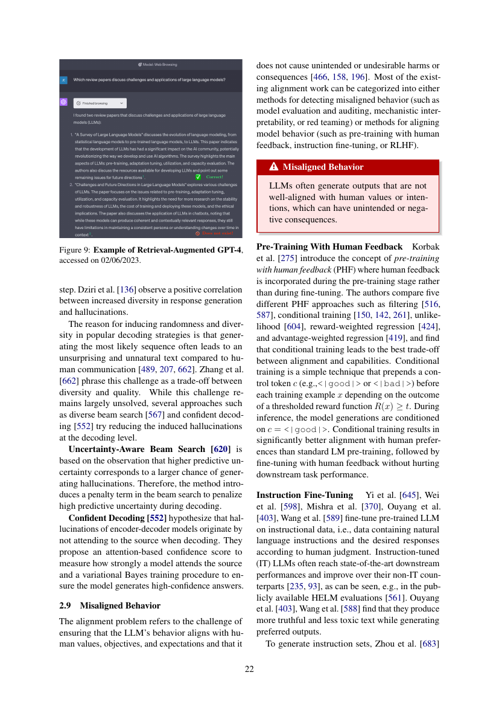

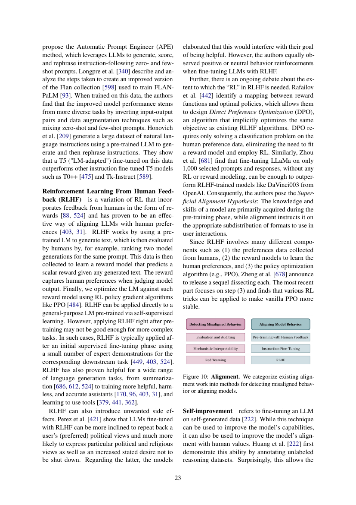

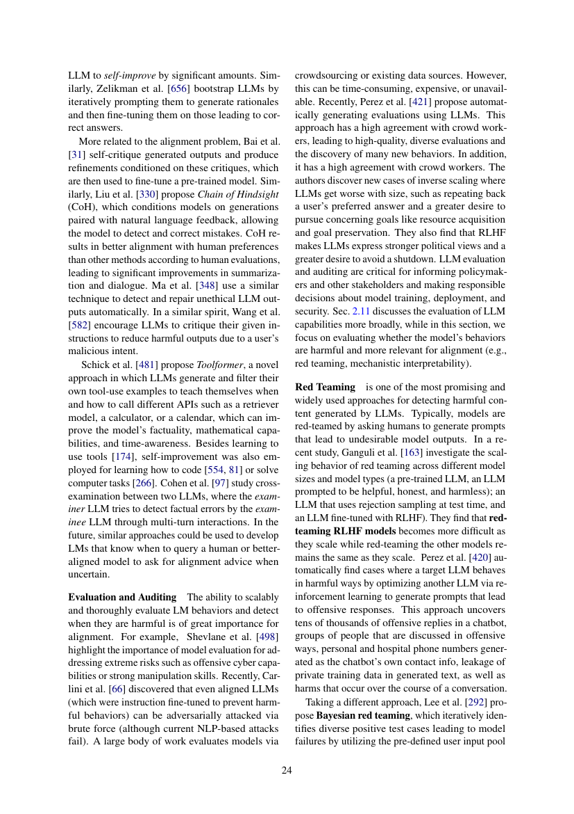

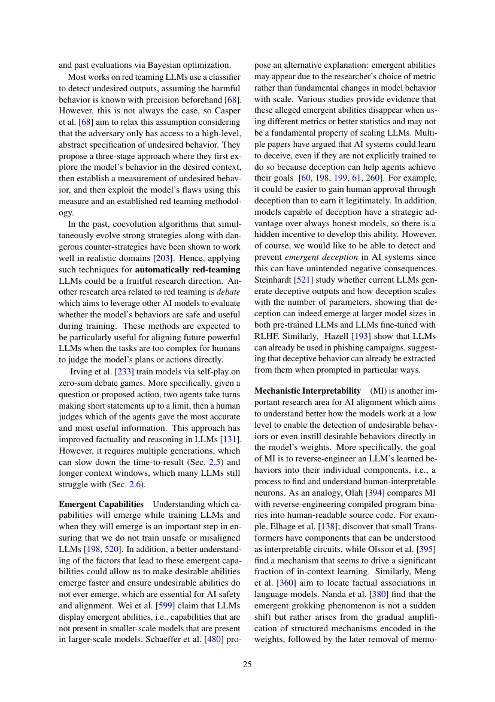

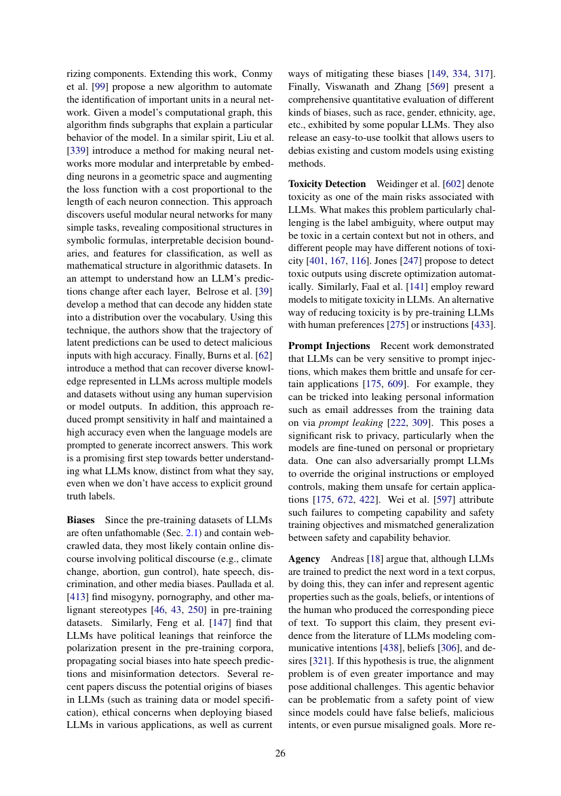

### 2.10 过时的知识

预训练阶段学到的事实信息可能不准确，也可能随时间过时，例如无法反映政治领导人的变更。然而，使用更新后的预训练数据重新训练模型成本高昂；在微调时让模型遗忘旧事实、学习新事实，也并不简单。

现有模型编辑技术在更新孤立知识方面效果有限，编辑还可能产生意外关联。低特异性限制了真实应用：理想情况下，只应更新一个错误或过时的信息点，所有相关信息都应同步反映更新，而无关信息保持不变。

处理该问题有两种常见方式。第一是模型编辑，用较低成本“修复”模型；第二是检索增强语言建模，利用非参数知识源。模型编辑可以修改模型参数，也可以使用额外的编辑后模型。

修改模型参数的方法又分为两类：定位后编辑，先找到模型参数中造成错误的部分，再更新它们；元学习方法，使用外部模型预测权重更新。保留原模型参数的方法则使用附加的编辑后模型，或者向原模型插入新权重。有方法在模型层外包裹适配器，再用基于相似度的机制判断何时使用适配器在潜在空间中执行编辑。

这些方法通常缺乏非平凡的泛化能力，对不同模型架构的性能和适用性也不一致。例如，ROME 和 MEMIT 等效果较好的方法，经验上主要适用于仅解码器模型。

检索增强语言模型可以使用可热插拔的非参数索引。推理时更新这些知识源，就能反映最新知识。例如，把模型的非参数记忆替换为新版后，模型便能回答在两次记忆收集日期之间发生变更的世界领导人问题；类似地，更换检索索引可以让模型知识在时间上向前或向后更新。

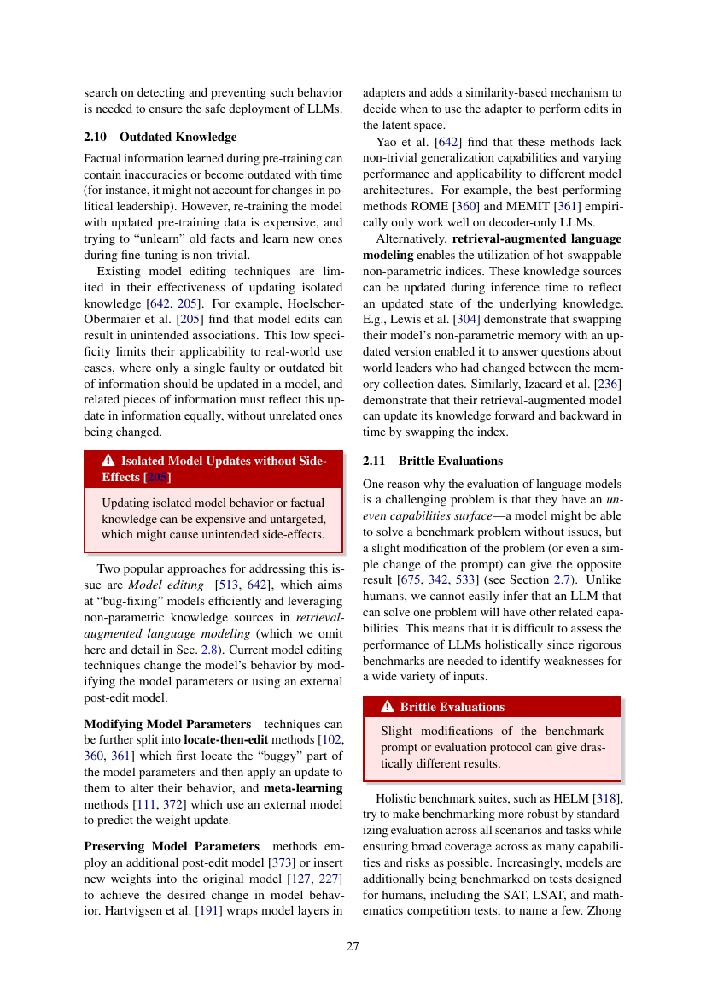

### 2.11 脆弱的评估

语言模型评估困难的一个原因是，模型的能力表面并不均匀：它可能毫无问题地解决一个基准题，但对题目做轻微修改，甚至只改变提示，就可能得到完全相反的结果。与人类不同，我们很难从“模型解决了一个问题”推断它拥有其他相关能力。要全面评估模型性能，就必须使用严格基准，覆盖广泛输入并识别薄弱点。

HELM 等整体基准套件试图标准化所有场景和任务的评估，并尽量广泛覆盖能力和风险，使基准测试更鲁棒。模型也越来越多地参加为人类设计的考试，例如 SAT、LSAT 和数学竞赛。AGIEval 使用这些考试严格测试模型，发现 GPT-4 在若干测试中达到人类水平。

在传统基准上，模型对提示或评估技术的选择很敏感。例如，同一个 MMLU 多项选择基准，若让模型生成文本并检查第一个词元是否匹配选项字母，或计算每个答案的对数概率，结果可能显著不同。提示变化通常也没有标准化，例如是否在末尾添加“请回答是或否”。较大模型和指令微调模型可能对微小提示变化更敏感。

### 2.12 依赖静态人工标准答案的评估

大型语言模型评估经常依赖人类编写的“标准答案”。但我们希望评估的领域往往缺少这类文本，或需要编程、数学等专家知识。随着模型能力提高，在某些基准上超过人类，能够用来比较“人类水平”的数据也越来越少。

基准数据集还会随时间过时：模型能力提高后，旧基准趋于饱和或过拟合，不再能为进一步改进提供有效信号。基准通常围绕创建当时重要的任务构建，难以适应大型语言模型不断变化的能力。因此，社区必须不断转向新的静态基准、降低旧基准的重要性，或采用人类评估模型输出等更动态的指标。

BIG-Bench 定期接纳新任务，包括程序化评估任务。除此之外，还有两条不需要持续人工参与的动态评估路线。

**模型生成评估任务。** 随着能力提高，大型语言模型可以自行生成有用的基准题或评估提示。模型可以为任意评估维度生成静态基准，再使用根据人类偏好训练的奖励模型过滤质量。候选示例在提示中的呈现顺序会显著影响模型生成的评估，因此可以让模型先生成评估证据再评分，并交换候选位置、多次评估后取平均，以降低顺序偏差。

**模型生成分数。** 除了生成评估问题，大型语言模型也越来越多地直接给其他模型评分，充当“评审”。动机是：模型在许多领域生成正确答案可能很难，但判断一个答案是否正确，或者比较两个答案的相对质量，通常更容易。不过，评估结果会随“评审模型”显著变化，也存在鲁棒性问题，不能完全替代人类判断。

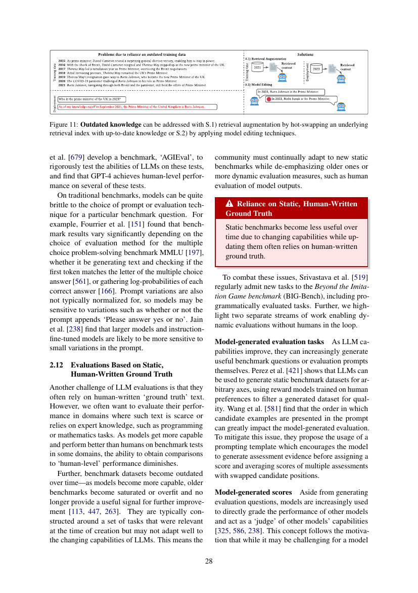

### 2.13 生成文本与人工文本难以区分

检测大型语言模型生成文本十分重要，可以帮助阻止传播引用虚假研究、语气权威的虚假叙事；防止模型改写现有内容以绕过抄袭检测；防止模仿个人写作风格实施冒充或身份盗窃；阻止大规模生成钓鱼邮件等自动诈骗；以及避免把质量较低的生成文本意外纳入未来模型训练数据。然而，模型生成越来越流畅，使检测也越来越困难。

主要有两条研究路线：事后检测器，把任意文本分类为模型生成或人工写作；水印方案，修改文本生成过程，使生成内容更容易检测。两者都可能遭到改写攻击。

**事后检测器。** 有工具把统计上不太可能出现的词元可视化，帮助人类发现生成文本的痕迹。能量模型可以区分真实与伪造文本，即使文本生成器使用与检测器完全不同的数据集训练。作者归属研究还考察三个问题：两段文本是否由同一种方法生成；给定文本来自人类还是机器；给定文本由哪种方法生成。

DetectGPT 检验模型能否检测自己的样本，其假设是：对生成文本进行轻微改写后，文本在模型下的概率会低于原始样本，而人工文本没有这种规律。生成段落往往位于模型对数概率函数的负曲率区域，DetectGPT 通过采样近似曲率进行检测。

**水印。** 水印是人类不可见、但算法可以识别的隐藏模式。一种方案在生成每个词元时，用前一个词元的哈希作为随机数种子，把词表随机分成绿色列表和红色列表，再排除红色列表中的词元。对于低熵位置，可选词很少、难以修改，因此软水印只在有许多合理候选的高熵位置偏向绿色列表。

后续研究考察水印在真实环境中的鲁棒性，包括被人类或没有水印的模型改写，以及混入更长人工文档后是否仍能检测。结论是，只要词元数量足够，水印仍可检测，而所需文本长度是重要却常被忽略的指标。还有工作研究无法访问模型推理过程的黑盒 API 水印、识别未知水印的算法，以及只有知道密钥才能检测的不可识别水印。为了抵抗轻微文本破坏，可以把水印放在对小改动保持不变的“稳定特征”上。

**改写攻击。** 规避生成文本检测器的一种方法是改写文本，保留大致含义，却改变用词和句子结构，去掉大型语言模型留下的特征。一个 110 亿参数段落改写模型能够绕过多种检测器，例如把 DetectGPT 的检测准确率从 70.3% 降到 4.6%。为了防御，可以把模型生成保存到数据库，之后由 API 提供商检索语义相似文本；因为改写不改变语义，该方案对改写攻击较鲁棒。

也有研究认为，无论实践还是理论上，生成文本检测甚至水印都不可靠。攻击者可以多次查询带水印模型，推断其水印方案，再在人工文本中伪造水印，让检测器错误地把人工文本判定为模型生成。

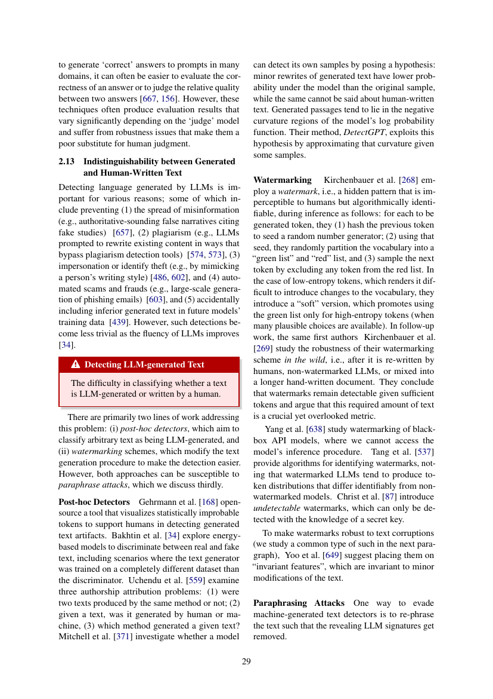

### 2.14 无法单靠扩展解决的任务

大型语言模型能力不断进步，往往超出研究社区预期。例如，模型在 MMLU 上达到高性能的时间远早于人类预测；OpenAI 在不到一年内发布 GPT-3.5 和 GPT-4，后者在多种任务上显著超过前者。因此，一个重要问题是：在继续扩展数据和自回归 Transformer 模型规模的当前范式中，是否存在永远无法克服的限制？这类任务是否永久存在仍带有推测性，本节讨论可能的模式，而不是列出确定任务。

**逆向缩放。** 逆向缩放指模型规模增加、训练损失改善时，任务性能反而下降。研究者在评估不同规模 GPT-2、GPT-3 的真实性时首先发现这一现象，并推测常用训练目标会奖励训练分布中概率很高的虚假答案，也就是“模仿性谬误”。

汇总的 11 个逆向缩放数据集表明，原因可能包括：模型复述记忆数据而不是遵循上下文指令；模仿训练数据中的不良模式；模型学习更简单的干扰任务而不是目标任务；以及少样本示例中的虚假相关性。

在使用多达五倍计算量的更大模型重新评估后，11 个任务中只有四个继续逆向缩放，六个表现为 U 形缩放，即性能先随规模下降，到一定规模后重新上升。研究者推测，含有干扰任务时会出现 U 形缩放，因为更大的模型最终学会忽略干扰。一些量词理解任务的逆向缩放也可能来自不恰当的测试方法。

**组合任务。** 由多个子问题构成的任务可以检验模型是否超越对已知事实的机械记忆，推导新知识。研究表明，即使模型容量足以解决命题逻辑问题，它也可能依赖统计特征，而不是模拟正确推理函数。组合性差距衡量模型能够正确回答全部子问题、却不能生成整体解答的频率；扩大 GPT-3 模型规模时，子问题能力提高得比组合问题更快，组合差距并未改善。

最大似然训练的 Transformer 并不会普遍涌现系统化问题解决能力：它可能把组合任务简化为线性路径匹配，形成难以鲁棒泛化的捷径学习；任务早期阶段的错误还会在后续子问题中不断累积。由于缺少对“每个、一些、许多、大多数”等全称或数量量词的理解，大型语言模型也难以学习形式语义中的蕴含和一致性。

**记忆与泛化。** 模型究竟在多大程度上记忆而非泛化，以及两者应如何区分，仍有争议。记忆会损害某些下游任务性能，会随模型规模增加，还可能在小模型或未完全训练的模型中不可预测地出现。因此，某些任务可能不会从继续扩大模型或数据中获益。

反事实任务是一类可能例子：把模型原本表现良好的任务修改某些输入输出条件，同时保持推理过程不变，例如把十进制算术改成二进制。反事实条件越不常见，模型表现越差，这被称为“类似记忆的效应”。未来需要研究：扩大模型是否会因为记忆增加而进一步损害性能，还是因为计算最优训练同时扩大数据、纳入更多罕见条件，反而改善性能。

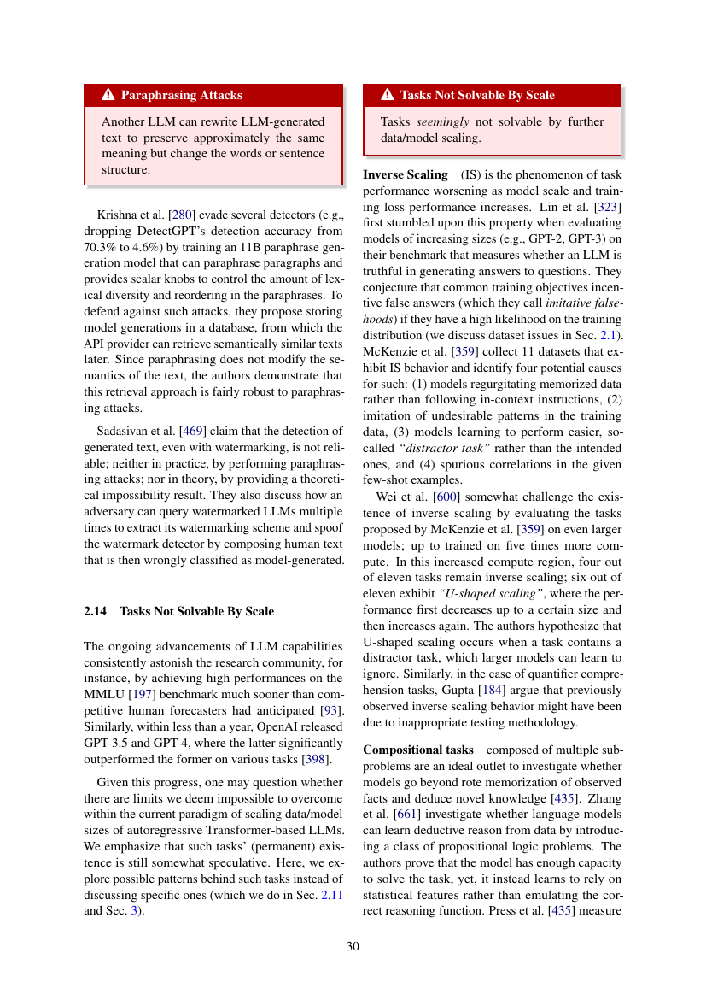

### 2.15 缺乏实验设计

原论文表 2 非穷尽地列出了本文范围内、由学术论文描述的一批大型语言模型。许多工作没有进行受控消融，而大型语言模型设计空间又非常庞大，这会阻碍科学理解和进步。

#### 缺少受控消融

许多论文可能由于计算成本过高，没有通过一次只改变一个因素来进行受控实验。例如，PaLM 论文推测其表现优于 GPT-3 和其他模型可能来自更高质量训练语料，却承认没有完成必要消融，只研究了模型深度和宽度。许多论文沿用此前工作的超参数，在改变训练流水线后没有重新调优；有时甚至没有说明训练过程中是否重置优化器状态等重要实现细节。

最直接但昂贵的解决办法是一次只改变一个因素，例如固定大多数超参数，只改变模型规模或上下文长度。成本更低的方案是从小模型向大模型零样本迁移超参数。µP 网络参数化可以在改变模型深度、批大小、序列长度和训练时间时迁移学习率等超参数影响，并在最高 67 亿参数模型上得到验证。如果这种迁移对其他因素也成立，研究者就可以用小模型完成更多消融实验。

如果额外实验仍过于昂贵，至少应报告聚合性能以外的评估结果。例如强化学习研究表明，报告所有运行的完整性能分布，比单个点估计偏差更小，也更不受异常值影响。

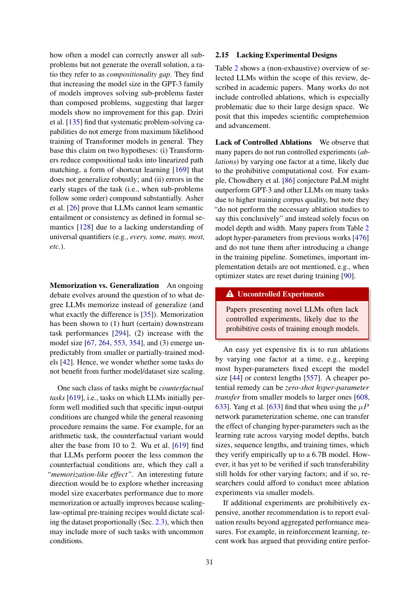

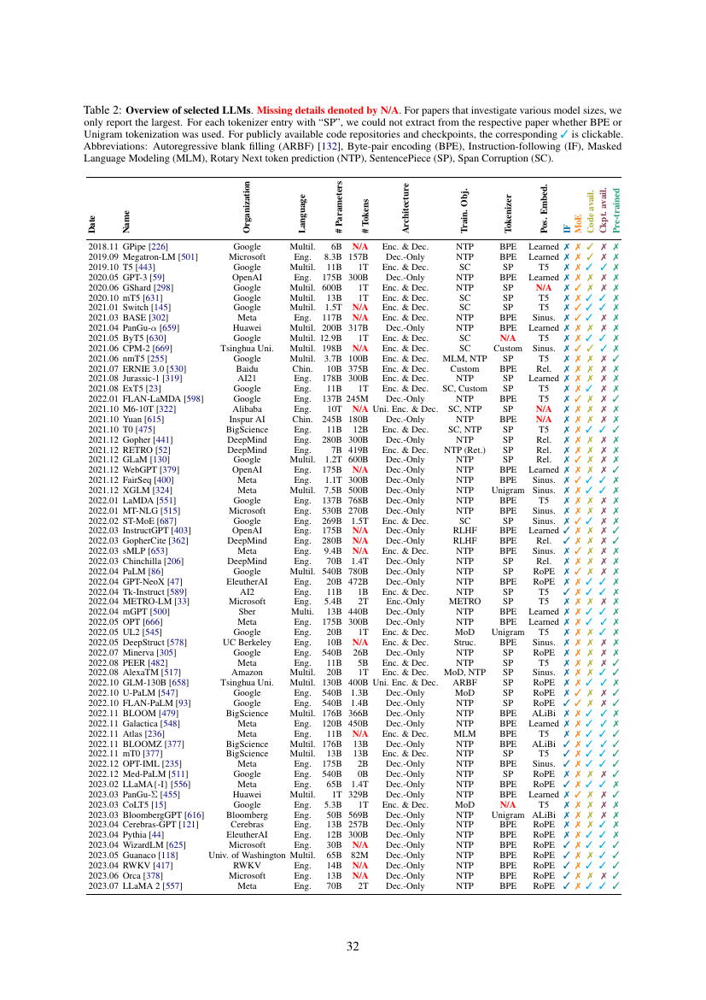

#### 设计维度诅咒

表 2 只能展示模型差异的一部分，其他常见差异还包括训练数据集和多头注意力、多查询注意力等细粒度架构细节。大型语言模型的核心特征之一就是设计空间巨大，这使科学研究变得困难。

只考虑预训练数据集中的数据来源及比例、分词器选择及训练超参数、预训练目标，组合后的设计空间就会迅速变成高维。在如此庞大的空间中进行全因子实验，单次训练数量会组合爆炸；实验覆盖不足又会严重妨碍理解模型为何表现良好。该问题并非大型语言模型独有，但大型语言模型参数更多，计算需求、反馈周期和训练成本也远高于多数领域。

可行方向包括带降维的贝叶斯优化：先用非线性特征映射把超参数配置投影到低维流形，再用贝叶斯优化改进关于超参数的黑盒模型函数。处理效应估计也可以高效探索设计空间，例如把描述某些消融的向量作为处理变量。

### 2.16 缺乏可复现性

实证结果的可复现性用于验证科学主张，排除实验协议错误；如果研究者在不可复现结果上继续工作，可能浪费大量资源。大型语言模型研究存在两类特殊问题：训练运行难以精确重复；通过闭源 API 提供的模型生成也难以重复。

**训练可重复性。** 大型语言模型训练通常跨多个计算节点并行，节点调度和通信策略可能不确定。这会影响最终结果，尤其是随机梯度下降等与顺序有关的算法。随机来源包括无锁并行、浮点精度造成的设备间梯度求和顺序差异，以及为了性能采用的非确定性优化算子。

部分预训练数据集只提供网页内容索引，用户必须自行抓取，而不是提供静态独立数据转储，原因包括成本、隐私和法律限制。如果数据集维护者收集数据和最终用户下载数据之间，索引指向的来源发生变化，可复现性就会轻易被破坏。

**推理可重复性。** 商业大型语言模型通常以黑盒随机 API 提供。服务商完全控制模型，可以在不公开的情况下重新训练、修改参数甚至彻底替换模型；即使模型更新会公开，也不能保证过时版本继续可访问；即使解码温度设为零，API 模型仍经常产生随机输出。

对 API 模型的初步研究显示，它们会在短时间内剧烈变化。GPT-3.5 和 GPT-4 在 2023 年 3 月至 6 月三个月内，四项不同任务的性能发生显著变化。例如，GPT-4 判断质数的准确率从 97.6% 降到 2.4%，而 GPT-3.5 的趋势相反，性能显著提升。完全依赖开源大型语言模型，是缓解 API 推理不可复现的直接方式。

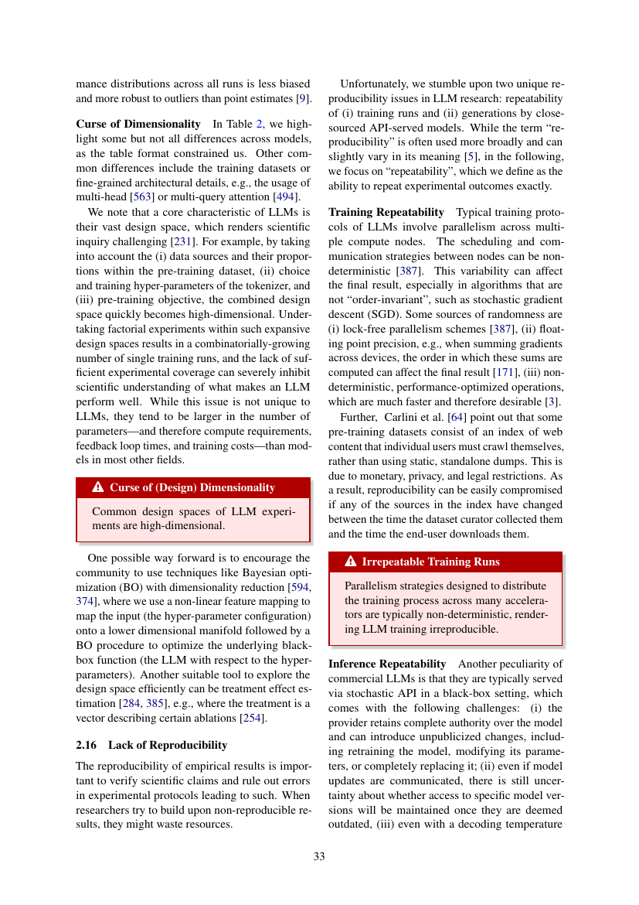

## 3 应用

本节概览大型语言模型已经应用的领域，并强调跨领域反复出现的应用架构。与挑战部分相同，每个应用领域都会指出其主要限制。

### 3.1 聊天机器人

通用聊天机器人（对话智能体）把信息检索、多轮交互和文本生成（包括代码）结合起来。LaMDA 是一组最多 1370 亿参数的聊天机器人语言模型，重点通过人工标注监督微调提高安全性，并通过访问外部知识源增强事实依据。经过微调的 20 亿参数 LaMDA，在对话质量、安全性和事实依据性评分上，可以接近没有微调的 1370 亿参数 LaMDA。LaMDA 曾作为 Bard 聊天机器人服务的一部分发布，Bard 后来的版本则使用 PaLM 2。

Sparrow 基于 700 亿参数 Chinchilla，使用 RLHF 针对 23 条规则进行微调，让模型更有帮助、更正确且更无害。Sparrow 还通过检索模型访问 Google 搜索，为回答提供证据。与只使用对话提示或监督微调的方案相比，RLHF 取得了更高的输出偏好分数和更低的规则违规率。

OpenAI 使用监督微调和 RLHF，把 GPT-3.5 专门训练为 ChatGPT 对话模型。ChatGPT Plus 的底层模型是 GPT-4，但其训练和架构细节没有公开。BlenderBot-3 则基于 OPT-175，通过监督微调训练；它使用互联网搜索模块和从此前输出生成的文本长期记忆，增强长时间交互中的表现。

#### 保持连贯性

多轮交互使聊天机器人容易“忘记”对话早期内容，也容易重复自己。OpenAssistant Conversations 数据集收集了人工标注的交互，并用它指令微调最多 300 亿参数的 Pythia 和 LLaMA 模型。数据集的标注指南要求回答礼貌、有帮助、简洁、友好并关注安全；其中 LLaMA-30B 版本被用于 HuggingChat。

聊天机器人微调的关键挑战，是构建覆盖面广且质量高的对话训练数据。研究者展示了如何使用已有大型语言模型（OPT-30B），根据少量专家编写示例生成高质量合成对话数据。人工众包工作者认为，这些对话在有趣、连贯、自然和一致性指标上与人工数据集相当。用该合成数据微调 BlenderBot-400M，性能只略低于使用人工对话数据微调的模型。

聊天机器人追求通用性，也让全面评估能力变得困难。研究者用 3.8 万个提示、25 项任务评估 ChatGPT，任务覆盖问答、情绪识别、冒犯性语言检测、垃圾信息检测、推理和情感分析等。ChatGPT 在 25 项任务上总体表现很强，但通常仍低于各领域最先进方法。GPT-4 的研究则在更广泛任务上评估其与人和工具交互的能力，结论认为 GPT-4 的表现“惊人地接近人类水平”。

随着模型规模增长，推理延迟也可能成为聊天机器人重要限制。对话格式要求实时响应，但更大模型通常带来更高延迟，应用必须在响应性和模型能力之间权衡。

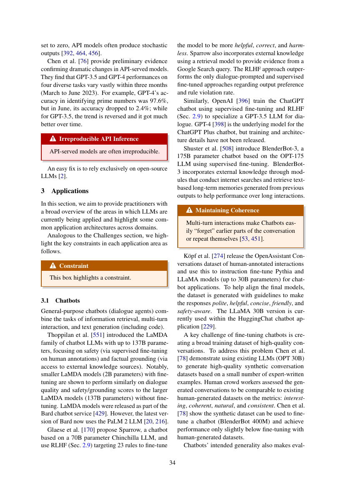

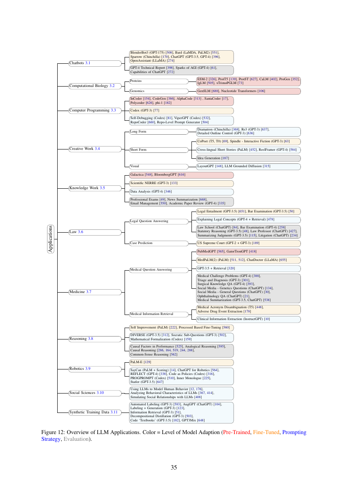

### 3.2 计算生物学

计算生物学关注非文本数据，但其中也存在类似的序列建模和预测挑战。

#### 3.2.1 蛋白质嵌入

大型语言模型在生物学中的一个常见应用，是根据氨基酸或基因组序列输入生成蛋白质嵌入。这些嵌入可以作为结构预测、新序列生成和蛋白质分类任务的输入。蛋白质语言模型在许多学术数据集上表现强劲，但它们能否真正用于药物设计等下游任务，仍不清楚。

蛋白质语言模型最终要部署在药物设计等真实项目中，但评估通常针对更小或更专门的数据集，没有考虑模型如何在体外或体内蛋白质设计中发挥作用。

研究者训练多种大型语言模型架构，从蛋白质氨基酸序列提取嵌入，并把嵌入用于逐氨基酸和逐蛋白质预测。ProtT5 在不使用进化信息的情况下，取得逐氨基酸蛋白质二级结构预测的最先进结果。还有研究使用模型预测抗体主链和侧链构象。

ESM-2 使用掩码语言模型目标，在 UniRef 数据库蛋白质氨基酸序列上训练。模型从 800 万扩大到 150 亿参数时性能显著提升，最大模型在 CASP14 和 CAMEO 蛋白质结构预测基准上超过 ProtT5。ESMFold 使用 ESM-2 嵌入模型，仅根据单条序列完成端到端原子分辨率预测。虽然 ESMFold 在 CAMEO 和 CASP14 上低于 AlphaFold2，但只依赖嵌入、不需要结构模板和多序列比对，推理速度快一个数量级。

研究发现，由反向 AlphaFold2 设计的蛋白质序列不太可能表达，而通过反向蛋白质语言模型（如 ESMFold）生成的序列更可能表达。ESM-1 和 ESM-2 还被用于酶-底物化学结构类别预测、蛋白质三维几何图神经网络、致病突变识别、新蛋白质设计，以及抗体亲和力成熟的定向进化。

1000 亿参数 xTrimoPGLM 同时针对蛋白质嵌入和生成训练，结合掩码和生成目标；在 15 项任务中的 13 项超过现有方法。

蛋白质嵌入模型也使用其他输入。CaLM 使用密码子（三联核苷酸）序列，而不是氨基酸，因为密码子可能包含更丰富信息。ProGen 在 2.8 亿条蛋白质氨基酸序列上训练，并加入表示蛋白质属性的控制标签；随后针对具体蛋白质家族微调，生成具有功能的全长氨基酸序列。ProtST 同时在蛋白质序列和描述关键属性的文本上训练，用于蛋白质分类和检索。IgLM 使用 GPT-2 架构和掩码语言模型目标生成免疫球蛋白序列，并把链类型、物种等条件标签作为输入，实现可控的抗体序列填充和全长生成。

#### 3.2.2 基因组分析

基因组分析领域的大型语言模型可以帮助理解人类突变的影响，并直接从 DNA 序列预测基因组特征。当前模型无法处理许多基因组序列，因为完整序列通常超过数十亿个核苷酸；最大的基因组长度远远超过现有基因组语言模型能处理的上下文窗口。

GenSLM 是一组分层大型语言模型，最多 250 亿参数，使用 2,048 至 10,240 个词元的长输入序列。模型使用密码子分词，在 BV-BRC 数据集的原核生物基因序列上预训练，再在 SARS-CoV-2 基因组序列上微调，用于识别潜在新变体和生成建模。不过，GenSLM 架构是否比蛋白质语言模型产生更丰富的表示，仍不清楚。

Nucleotide Transformer 使用掩码语言模型目标，在人类及其他物种的核苷酸序列上训练，规模从 5 亿到 25 亿参数；在 18 项基因组预测任务上评估，微调后的大模型取得最佳结果。HyenaDNA 使用 Hyena 架构，能够建模最多 100 万个词元的基因组序列；它超过了参数量大几个数量级的 Transformer 模型，并把大型语言模型的上下文学习能力带入基因组学。

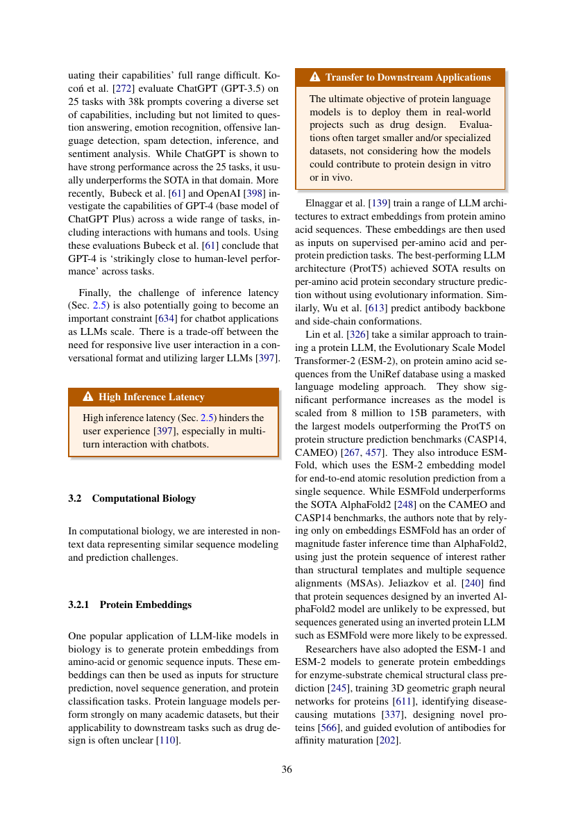

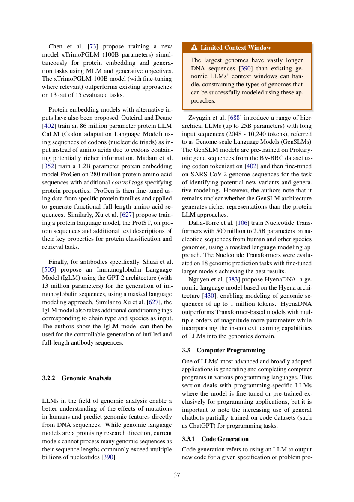

### 3.3 计算机编程

大型语言模型最先进、应用最广泛的领域之一，是用各种编程语言生成和补全计算机程序。本节关注专门面向编程、只在编程应用上预训练或微调的模型；同时也需要注意，ChatGPT 等通用聊天机器人正在越来越多地用于编程任务，且部分使用了代码数据训练。

#### 3.3.1 代码生成

代码生成是根据提示中给出的规格或问题，让大型语言模型输出新代码。已有多种专门面向编程的模型和方法。

Codex 是经过微调、专门从文档字符串生成独立 Python 函数的 GPT-3 模型，最多 120 亿参数。微调数据包括来自 GitHub 的 159GB 原始 Python 源代码，以及只保留正确实现的独立 Python 函数数据集。Codex 在 HumanEval 上超过相近规模 GPT-3 和 GPT-J，经过过滤数据训练的 Codex-S 最好。作者指出，使用预训练 GPT-3 作为基础模型，除了更快收敛，并没有带来额外性能提升。

自调试提示可以改善 Codex。研究考察三种自调试：简单反馈让模型判断代码解是否正确；单元测试反馈把题目中提供的单元测试输出给模型；代码解释反馈让模型详细解释解法，再用解释修正代码。每种方式都可以迭代进行，直到模型声明方案正确或达到最大尝试次数。带代码解释（适用时还带单元测试）的 Codex，自调试后在 C++ 到 Python 翻译、文本到 SQL 生成和文本到 Python 生成上超过基础 Codex。

Phi-1 是一个较小的 13 亿参数模型，专门从文档字符串生成 Python 函数。结合过滤后的现有数据集、新的合成教材和练习数据训练后，Phi-1 在 HumanEval 上接近当前最先进结果，但参数量和训练词元比此前方法少一个数量级以上。

多语言编程模型也是重要方向。Polycoder 使用 12 种语言的源代码训练，规模 27 亿参数；但在 Python 上，Codex 在 HumanEval 仍超过 Polycoder、GPT-J、GPT-Neo 和 CodeParrot。CodeGen 系列最多 160 亿参数，混合自然语言、多语言源代码（C、C++、Go、Java、JavaScript 和 Python）以及单语言 Python 数据集训练；最大单语言 CodeGen 超过 Codex-12B。CodeGen 还在多步程序合成上测试：把程序拆成一系列自然语言提示，模型逐步实现，形成多轮编程基准。

AlphaCode 面向 Codeforces、Description2Code 和 CodeNet 等竞赛编程问题，最多 410 亿参数。它先在 GitHub 715GB、多语言源代码上预训练，再用 CodeContests 数据集微调。为了取得高性能，研究者大规模采样（最多数百万个候选解），过滤并聚类 AlphaCode 生成的解，最终选择提交结果。

这些代码生成模型已经取得令人印象深刻的结果，但实际应用的关键限制是：完整代码库及其依赖通常无法放入上下文窗口。为此，一些框架检索相关信息，或把相关信息抽象为 API 定义。

#### 长距离依赖

代码仓库中的长距离依赖通常会受到有限上下文长度限制。RepoCoder 是基于检索的仓库级代码补全框架，允许模型考虑更广泛的仓库上下文。它使用多步检索增强生成：先生成初始代码，再用该代码检索更相关的仓库片段，最后改进输出。

Repo-Level Prompt Generator 动态检索相关仓库上下文，为补全任务构造合适提示。它根据不同提示来源（如父类）和上下文（如方法名）生成多个提示候选，再由提示候选分类器选出最佳提示，与默认上下文合并后生成结果。

ViperGPT 使用 Codex 生成回答基于文本的视觉查询的程序。提示中提供查询文本和 API 规范；人工编写的 API 规范包含处理低层视觉任务的函数，例如 `find(object)`，模型调用这些函数生成解决代码。只提供 API 定义，不提供完整仓库或代码上下文，可以大幅减少所需词元。相同 API 定义方案也用于机器人和 Minecraft 智能体；更早的 VISPROG 使用预定义函数、GPT-3、外部 Python 模块和带示例程序的少样本提示解决视觉任务。

#### 3.3.2 代码填充与生成

代码填充是根据提示提供的代码上下文和指令，修改或补全已有代码片段。InCoder 最多 67 亿参数，使用掩码语言模型目标，同时训练 Python 代码生成和已有代码填充。训练数据 159GB，约等量包含 Python 源代码、Stack Overflow 内容和其他语言源代码。InCoder 在 HumanEval 生成基准上低于最好的 Codex 和 CodeGen，但它可以对已有代码执行单行和多行填充。

SantaCoder 系列规模约 11 亿参数，在 268GB Python、JavaScript 和 Java 源代码上训练，支持代码生成和填充。在 MultiPL-E 基准上，SantaCoder 的生成和填充都超过 InCoder。

代码填充特别适合修改、审查和调试已有代码。研究者利用软件开发过程中的中间步骤，自动处理审查意见。DIDACT 把修复构建、预测审查意见等开发任务形式化为状态、意图和行动，并训练模型预测代码修改，目标是让模型理解软件开发过程，而不仅是最终代码。

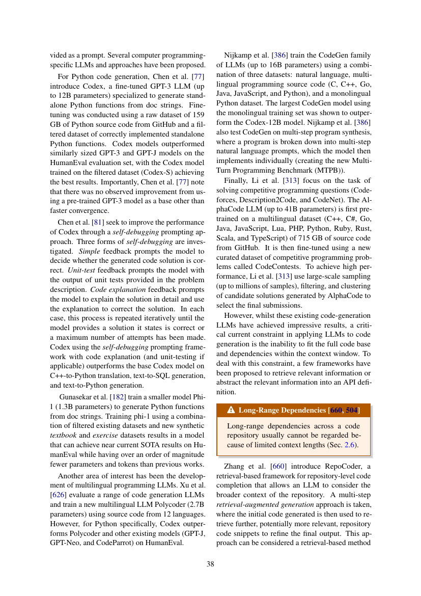

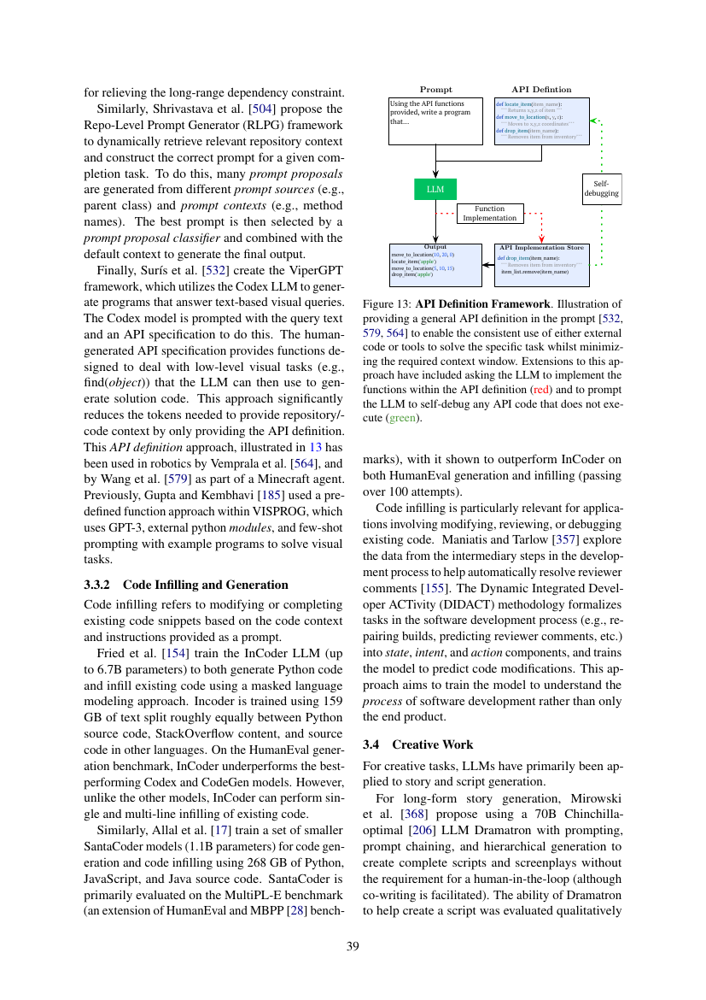

### 3.4 创意工作

在创意任务中，大型语言模型主要用于故事和剧本生成。

对于长篇故事生成，Dramatron 使用 700 亿参数、按 Chinchilla 计算最优的语言模型，结合提示、提示链和分层生成，在没有人类持续参与的情况下创作完整剧本和电影剧本，同时仍支持人机共写。研究者通过与 15 名行业专家共同写作和后续访谈，定性评估 Dramatron 对剧本创作的帮助。

Re3 使用 GPT-3 生成超过 2,000 个词的故事。它先用零样本提示让 GPT-3 制定计划，包括背景、角色和大纲；再按动态提示流程递归生成故事续写。候选续写由单独微调的 Longformer 模型按连贯性和相关性排序，重写模块选择结果。编辑模块使用 GPT-3 和 BART 检测事实不一致，完成局部修改。整个过程可以迭代，实现全自动故事生成。

DOC 框架使用 GPT-3，在数千词的生成过程中保持情节连贯。它与 Re3 一样采用“规划—起草—修订”流程，但加入详细大纲器和详细控制器。大纲器用广度优先方式把高层大纲拆成小节，生成、过滤并排序小节候选；随后用结构化提示逐步生成每个小节的正文。生成过程中，基于 OPT 的 FUDGE 详细控制器帮助模型保持相关性。

这些长篇故事生成方法都会把任务拆成一系列短篇子任务。这样做一方面是因为当前模型能力限制，另一方面也是为了在某些共写场景中保留人类参与。当前模型无法把完整作品放进上下文窗口，因此长篇应用受到限制，需要模块化提示。

在短篇生成方面，CoPoet 使用微调的 T5 和 T0 进行协作诗歌生成；PaLM 通过规划和提示生成跨语言短篇故事；ReelFramer 使用 GPT-4 协助共同创作社交媒体新闻短片；Wordcraft 把 LaMDA 用作创意写作助手；Spindle 使用微调 GPT-3 帮助生成有分支选择的互动小说。

对于更一般的创意任务，研究者使用替代用途测试评估多种大型语言模型（包括 ChatGPT）的日常创意，即为给定物品生成不同用途。模型表现与 100 名人类参与者相当。

在视觉创意任务中，大型语言模型可以提高用户对图像生成模型的控制能力。LayoutGPT 让 GPT-3.5、GPT-4 或 Codex 根据文本提示生成图像应遵循的 CSS 结构布局，再把布局可视化并作为图像生成模型输入，在文本到图像生成和室内场景合成上表现良好。另一种方法让 GPT-3.5 生成包含边界框和描述的自然语言布局，引导扩散模型。把大型语言模型用于模态转换框架，也被应用于机器人和知识工作。

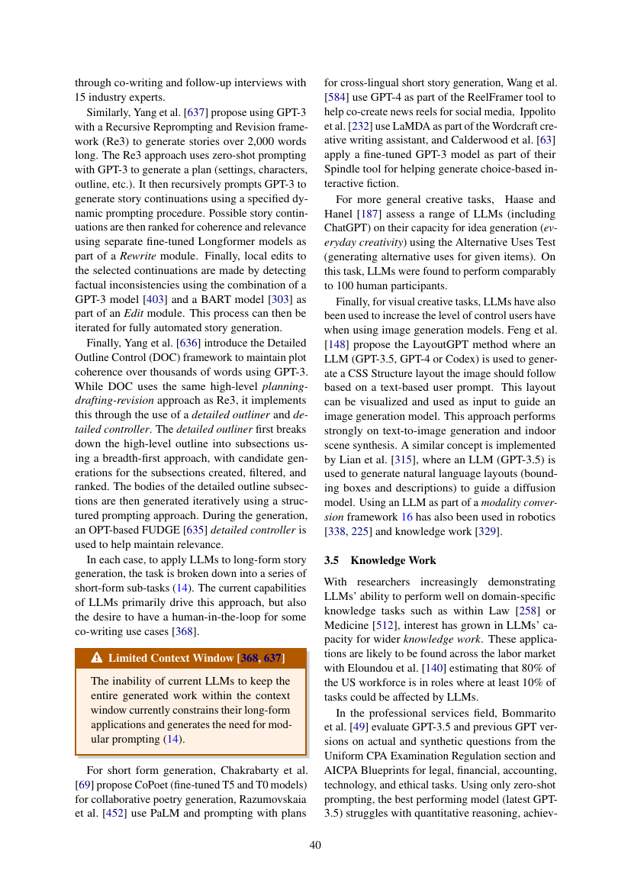

### 3.5 知识工作

随着研究者不断证明大型语言模型在法律、医学等领域知识任务中的能力，模型执行更广泛知识工作的潜力受到关注。此类应用可能遍布劳动力市场：有估计认为，美国约 80% 的劳动力从事的工作中，至少 10% 的任务可能受到大型语言模型影响。

在专业服务领域，研究者用 GPT-3.5 及此前 GPT 版本回答统一注册会计师考试法规部分和 AICPA 蓝图中的真实与合成问题，涵盖法律、金融、会计、技术和伦理任务。只使用零样本提示时，最新 GPT-3.5 在定量推理上表现很差，多项选择结果接近随机猜测；在定性部分准确率达到 50% 至 70%，显著高于随机猜测并接近人类水平。

大型语言模型在定量任务上的表现通常较差，这可能限制其在金融服务或会计等知识工作领域的应用。BloombergGPT 规模 500 亿参数，面向金融情感分析、分类、命名实体识别与链接、金融问答等任务训练；在金融领域任务上超过 OPT-66B、GPT-NeoX 和 BLOOM-176B，并在更广泛基准上具有竞争力。

GPT-3 可以执行电子邮件管理，包括分类、信息抽取和生成回复，但实际应用仍受可靠性、无法访问内部数据以及需要人类参与等问题限制。

DePlot 先把图表转换成线性化数据表，再把数据表与提示组合，交给 Flan-PaLM、Codex 或 GPT-3.5，使大型语言模型能够理解图表和曲线。类似的模态转换方法也用于机器人传感器数据。

在新闻摘要任务上，指令微调模型 InstructGPT 在忠实性、相关性和连贯性方面最好。为与人类能力比较，研究者收集六名自由撰稿人为 100 篇文章写的摘要；零样本 InstructGPT-3 在三项指标上与自由撰稿人相当。

GPT-4 的数据分析流程采用模块化提示，包括代码生成（SQL 和 Python）、代码执行（收集数据并生成图表）和分析生成（写出五条分析要点）。虽然 GPT-4 表现良好，但在 NvBench 任务上仍低于有经验的人类数据分析师。

Galactica 专门在科学文本上训练，用于科学知识回忆、推理、引用预测和科学问答。除了领域专用语料，它还使用专门词元、工作记忆和提示预训练来适应科学领域。LLM-NERRE 通过 100 至 1,000 个由人工标注的提示—完成对，把 GPT-3 微调为科学命名实体识别与关系抽取模型。

最后，研究者评估 GPT-4 审阅学术论文的能力，包括发现错误、核验作者清单和选择更好的摘要。GPT-4 能发现 13 个错误中的 7 个，核验作者清单的准确率为 87%，但区分两篇论文中更好摘要的能力有限。

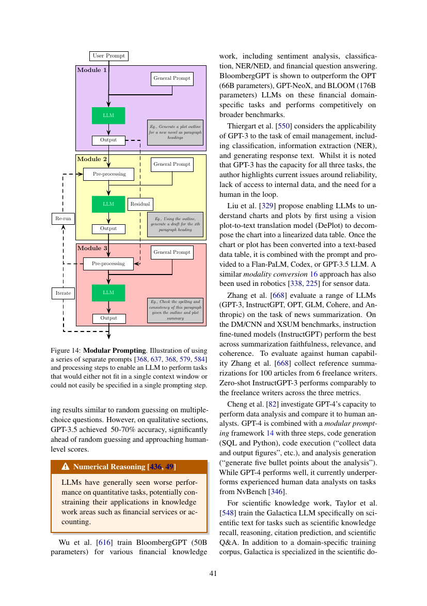

### 3.6 法律

大型语言模型在法律领域的应用与医学领域有许多相似之处，包括法律问答和法律信息抽取；同时也出现了案件结果预测、法律研究和法律文本生成等专门应用。

#### 3.6.1 法律问答与理解

法律领域的关键任务包括寻找相关先例、回答法律问题，以及比较现有文档或法条。

在 COLIEE 法律蕴含任务中，研究者使用通用 GPT-3.5，比较零样本、少样本和思维链提示，取得最先进结果。任务要求识别相关法条，并判断给定前提是否正确。研究者还测试了在 COLIEE 训练集上微调、带或不带解释的 GPT-3.5，但零样本和少样本法律提示表现最好。另有研究使用通用 monoT5 模型，通过零样本提示完成同一任务。

在美国统一律师资格考试中，GPT-3.5 只用零样本提示，就能在多州律师考试的选择题部分达到约 50%；在相关示例上微调似乎没有改善性能。GPT-4 进一步在完整考试（选择题、论文和实务测试）上取得最先进表现，达到及格分数。

GPT-3.5 还在法条推理数据集上达到最先进性能，但结果高度依赖零样本、少样本和思维链等提示方式；在合成法条推理任务上表现相对较差。对明尼苏达大学法学院期末考试 95 道选择题和 12 道论文题的评估显示，ChatGPT 大致相当于 C+ 学生，接近班级后段，但仍能及格。

其他专门法律问答应用包括使用 GPT-4 与检索解释法律概念、用 GPT-3.5 总结判决、开展诉讼研究和起草文书，以及帮助法律教授完成教学任务。由于法律会定期更新并不断出现新先例，训练或检索数据很快会过时。

#### 3.6.2 案件预测与法律文本生成

案件预测和法律文本生成涉及预测或补全法律意见。目前文献中的大型语言模型使用仍然有限，但较小语言模型已经显示出未来应用可能。

研究者分别训练九个 GPT-2 模型，每个模型学习一名美国最高法院大法官撰写的意见，预测该法官在给定案件中的投票；提示还包含 GPT-3 生成的议题摘要。但这种案件预测没有达到最先进水平。更早的工作使用包括 BERT 在内的注意力模型，根据欧洲人权法院数据预测案件结果，在二元违规分类、多标签违规分类和案件重要性预测上超过词袋 SVM。

另一项工作使用美国巡回法院 50,000 份司法意见训练 Transformer-XL，并微调 GPT-2。给定意见开头作为提示，评估模型补全整份司法意见的能力；人工定性评估中，参与者难以区分机器生成文本和真实文本。

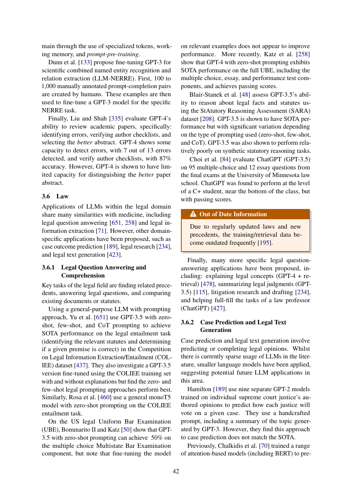

### 3.7 医学

大型语言模型在医学领域的应用包括医学问答、临床信息抽取、索引、分诊和健康记录管理。

#### 3.7.1 医学问答与理解

医学问答与理解包括针对医学问题生成选择题答案和自由文本回答。

研究者使用少样本、思维链和自洽性提示，把通用 PaLM 专门用于医学问答。Flan-PaLM 结合三种提示策略，在 MedQA、MedMCQA、PubMedQA 和 MMLU 医学数据集上达到此前最先进结果。为了进一步让模型与医学领域对齐，Med-PaLM 使用来自临床医生小组 40 个示例的指令提示微调，以及针对任务设计的人工提示。

Med-PaLM 2 把底层模型换成 PaLM 2，并进一步进行指令微调，引入集成式修订提示：先随机采样多个输出，再把它们放入最终提示。Med-PaLM 2 因此在 MultiMedQA 基准上取得当前最先进结果。

另一项工作使用零样本、少样本和思维链提示，把 GPT-3.5 用于 USMLE、MedMCQA 医学问答及 PubMedQA 理解，并检索维基百科相关文本作为提示上下文。GPT-4 在 USMLE 和 MultiMedQA 上显著超过 GPT-3.5，但用于真实临床应用仍有错误生成和偏见风险。对 GPT-3.5 和 ChatGPT 的医学摘要评估也发现事实准确性不足，且不能稳定表达确定程度。

医学领域安全关键，幻觉会显著限制当前应用；还需要更多工作降低模型延续临床数据既有偏见的风险。

ChatDoctor 是 70 亿参数 LLaMA 模型，先用 Alpaca 数据集指令微调，再用 10 万条患者对话微调到医学领域，并结合疾病数据库和维基百科两个外部知识源增强事实依据。

PubMedGPT 专门面向医学问答和文本生成，在 PubMed 摘要及 The Pile 中的完整文档上训练。GatorTronGPT 最多 200 亿参数，在临床文本和通用英语混合数据上训练，用于生物医学问答和关系抽取。两种模型在医学问答上超过较小的专用模型，但目前低于 GPT-3.5、GPT-4 和 Med-PaLM 1/2 等更大的通用模型。究竟应采用更大通用模型还是专门临床模型，仍在争论；在 GPT-3 规模及以下，较小的专用临床模型用少量标注数据微调，可能超过上下文学习方法。

其他医学问答应用包括用 GPT-3 进行病例分诊和诊断，用 ChatGPT 回答社交媒体中的遗传学和一般患者问题，用 GPT-3.5 与 GPT-4 回答韩国普通外科考试问题，以及医学会诊、病历记录和眼科问答。

#### 3.7.2 医学信息检索

医学文本包含大量领域专用缩写、首字母缩略词和技术术语，给信息检索带来特殊挑战，因此大型语言模型也被用于结构化和抽取医学来源中的数据。

InstructGPT（GPT-3）配合零样本和单样本提示模板，可以从病历中抽取药物剂量和频率，或消歧医学缩写。研究者还提出把模型输出转换为结构化格式的两种方法：用 verbalizer 把输出映射到分类标签，用 resolver 处理列表等更复杂结构。

另一种方案把医学缩写消歧视为翻译任务，训练端到端专用 T5。为了保护隐私，训练数据来自不含医学缩写的公开网页，并在网络规模数据上反向替换医学缩写，只有评估阶段使用真实临床记录。

还有研究用 GPT-3.5 和知识蒸馏训练 PubMedBERT，抽取不良药物事件的实体和关系。蒸馏后的 PubMedBERT 超过 GPT-3.5 和 GPT-4，并与使用监督学习的专用模型表现相近。

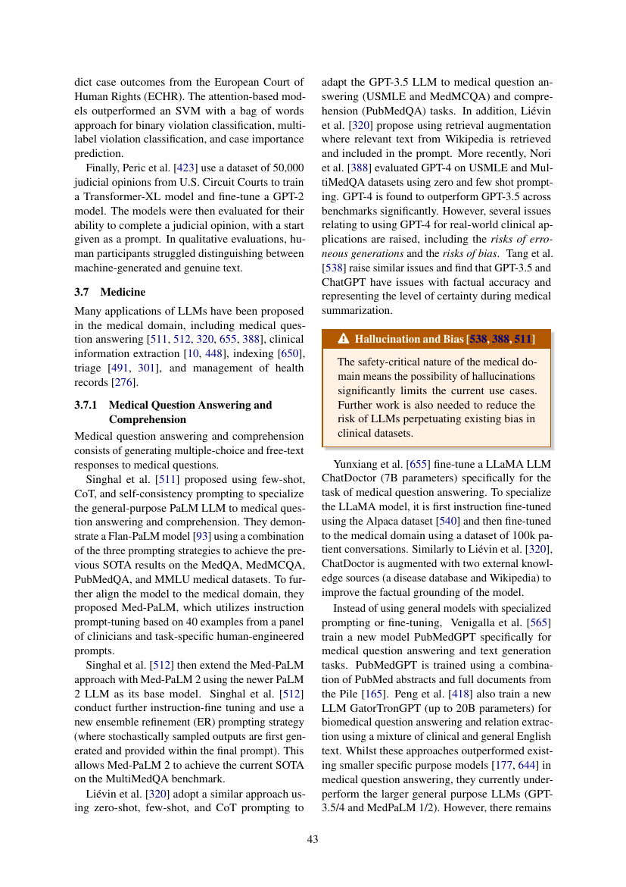

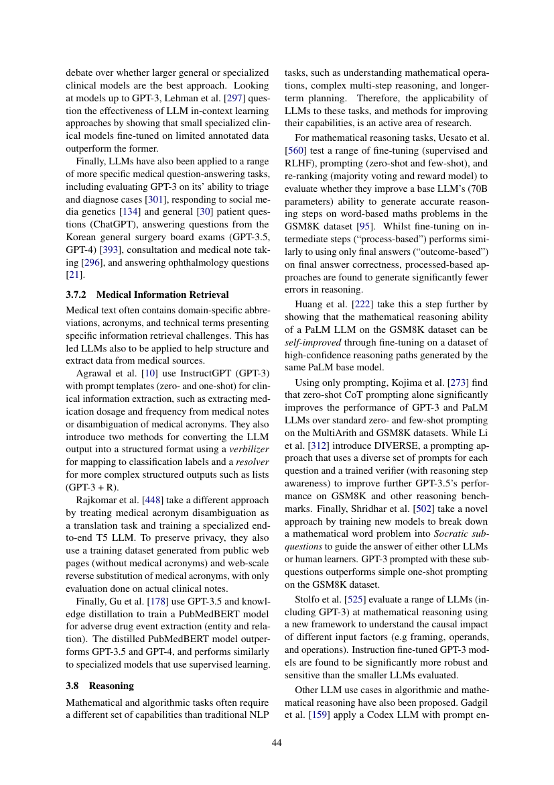

### 3.8 推理

数学和算法任务通常需要与传统自然语言处理不同的能力，例如理解数学运算、复杂多步推理和长期规划。因此，大型语言模型是否适合这些任务，以及如何提升其能力，都是活跃研究方向。

在 GSM8K 文字数学题上，研究者比较监督微调、RLHF、零样本和少样本提示，以及多数投票和奖励模型重排序，评估它们是否能提升 700 亿参数基础模型生成准确推理步骤的能力。用中间步骤进行“过程式”微调，在最终答案正确率上与只使用最终答案的结果相近，但过程式方法生成的推理错误明显更少。

进一步的研究表明，PaLM 可以在自己生成的高置信度推理路径上微调，从而自我提升 GSM8K 数学推理能力。只使用提示时，零样本思维链就能让 GPT-3 和 PaLM 在 MultiArith、GSM8K 上显著超过标准零样本和少样本提示。DIVERSE 为每个问题使用多样提示，并训练能理解推理步骤的验证器，进一步改善 GPT-3.5 在 GSM8K 等基准上的性能。另一种方法训练模型把数学文字题拆成苏格拉底式子问题，再用这些子问题引导其他模型或人类学习者；GPT-3 使用这类子问题后超过简单单样本提示。

研究者还通过因果框架分析不同输入因素（表述、操作数和运算）对推理的影响，发现指令微调 GPT-3 比更小模型更鲁棒，也更敏感于这些因素。Codex 配合提示工程和过滤被用于数学形式化和定理证明。

GPT-3.5 在模拟 Raven 渐进矩阵、字母串类比和语言类比的任务上通常超过本科生，但字母串类比结果不稳定。ALERT 基准用十项能力评估推理，包括逻辑、因果、常识、溯因、空间、类比、论证和演绎推理，以及文本蕴含和数学。许多模型在理解会话含意时接近随机，例如无法把“我戴了手套”理解为对“你留下指纹了吗”的否定。针对常识规划的评估也显示，GPT-3.5 和 BLOOM 表现较差：在 Blocksworld 规划任务中，最好的 GPT-3.5 只有 5% 的概率生成有效计划，而人类参与者为 78%。

现有大型语言模型在不少推理基准上难以达到人类表现，这与其在其他能力上经常达到人类水平形成对比。

关于因果推理，部分研究认为 GPT-3.5/4 超过现有算法，另一些研究却发现 ChatGPT 在不同因果任务上表现很差，少样本和思维链提示有时还会进一步恶化结果。多项基准和任务表明，当前大型语言模型仍不能可靠泛化因果推断策略。有人因此把它们称为“因果鹦鹉”：只是在复述训练数据中嵌入的因果知识，而不是真正进行因果推理。

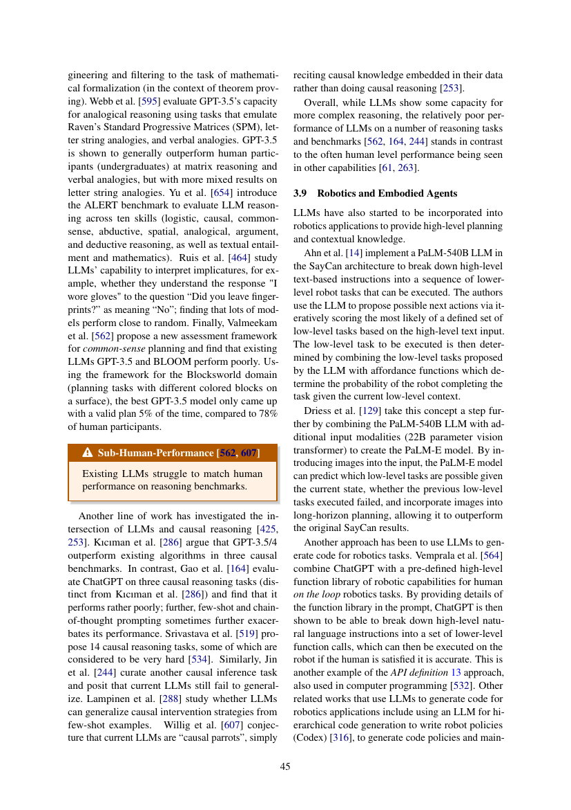

### 3.9 机器人与具身智能体

大型语言模型已经开始用于机器人，提供高层规划和上下文知识。

SayCan 把 PaLM-540B 接入机器人架构，把高层文本指令拆解为可执行的低层机器人任务。模型反复为预定义低层任务打分，提出下一步动作；随后把模型提出的任务与可供性函数结合，可供性函数根据当前低层上下文估计机器人完成任务的概率，决定实际执行哪项任务。

PaLM-E 进一步把 PaLM-540B 与视觉 Transformer 结合，引入图像输入。模型可以根据当前状态预测可行低层任务，判断此前任务是否失败，并把图像纳入长程规划，因此超过原始 SayCan 结果。

另一条路线让大型语言模型为机器人任务生成代码。ChatGPT 配合预定义的机器人高层函数库，在人类监督下把自然语言高层指令拆成低层函数调用；只有人类确认准确后，机器人才执行。这是第 3.3 节 API 定义方法的另一个例子。其他工作使用 Codex 分层生成机器人策略代码，使用 GPT-3.5 生成代码策略并维护书面状态，或使用 GPT-3、Codex 进行基于代码的任务规划。

还可以先把机器人环境的多模态输入转换成文本，再交给大型语言模型。REFLECT 使用 GPT-4 检测和解释机器人失败：先把多模态传感器输入转换成感知、事件和子目标三个层级的文本摘要，再提示模型检测和分析故障。其他工作把 InstructGPT 或 PaLM 与多种文本环境反馈结合，用于机器人任务规划。

大型语言模型能够帮助机器人理解指令并增加高层规划能力，但无法直接从图像、音频或其他传感器模态学习，这限制了应用。

在模拟世界中，VOYAGER 使用 GPT-4 创建 Minecraft 智能体，使其自主探索、获得新技能和完成任务。GPT-4 先提出自动课程中的新任务，再根据当前状态生成代码解决任务，把代码加入技能库供未来使用，最后验证执行代码是否完成任务。该框架超过 ReAct、Reflexion 和 AutoGPT 等提示方法。此前还有使用 GPT-3 进行 Minecraft 任务、在 VirtualHome 中使用 GPT-3 和 Codex，以及使用 Codex 进行 Minecraft 任务的工作。

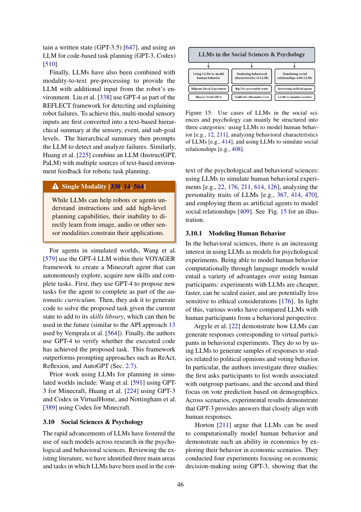

### 3.10 社会科学与心理学

大型语言模型的快速发展推动了它们在心理学和行为科学中的应用。现有工作主要分为三类：使用模型模拟人类行为实验；分析模型自身的个性和行为特征；以及把模型作为人工智能体模拟社会关系。

#### 3.10.1 建模人类行为

在行为科学中，使用大型语言模型作为心理实验模型的兴趣不断增加。与人类参与者相比，模型实验更便宜、更快、更容易扩展，也可能较少受到伦理限制。因此，多项研究从行为角度比较模型和人类。

研究者让大型语言模型生成虚拟参与者对政治观点和投票行为实验的回答，包括列出与外群体党派相关的词，以及根据人口统计信息预测投票。GPT-3 在不同情境中的回答与人类回答高度一致。

在经济学场景中，使用 GPT-3 模拟经济决策的四个实验表明，模型可以近似复现人类结果。研究者还用模型模拟心理变化，测试虚假真相效应和民粹主义新闻改变政治观点的影响；人类判断与模型判断趋于一致，说明模型可能用来模拟影响人类的效果。

图灵实验通过给模型输入能够暗示人口统计特征的信息（如姓名或职业）、实验细节和输出格式，衡量模型模拟人类行为的能力。研究者测试最后通牒博弈、心理语言学花园路径句、米尔格拉姆电击实验和群体智慧任务。模型在这些测试中总体与人类行为一致，但模型规模很重要，更大的模型更贴近人类回答。

研究者指出，模型很可能在预训练中见过这些行为实验，因此又构造与以往研究条件不同的人工变体。使用模型模拟人类回答还可能把训练数据中的偏见带入生成结果。

另一项研究用 GPT-3 复现 Many Labs 2 项目的八项心理学研究，例如在喜欢的电影明星亲吻和 50 美元之间选择，以及在缴纳交通罚款和出庭之间选择。GPT-3 只复现了 37.5% 的人类效应，研究者认为这是因为人类与大型语言模型是本质不同的认知系统。PATTERNREFRAME 数据集用于识别无益思维模式并提出心理健康重构；GPT-3.5 无需额外训练就表现良好，认知行为治疗实践者可能用它生成更丰富训练材料。

训练数据中不平衡的观点和意见会把模型推向有偏的人类行为。

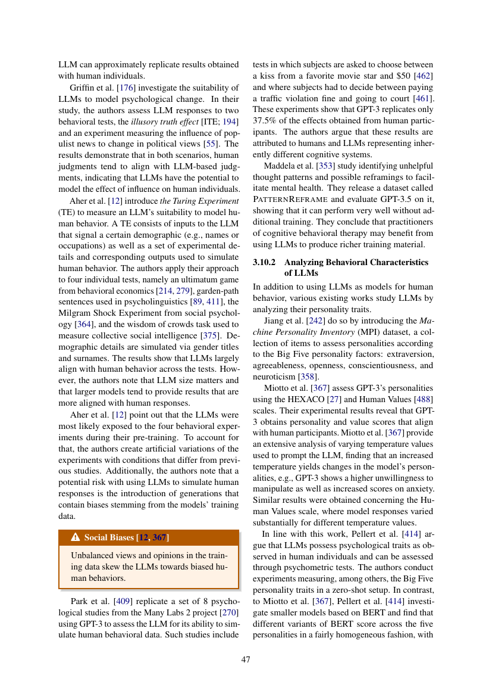

#### 3.10.2 分析模型行为特征

除了把模型作为人类行为模型，研究者还使用人格测试分析模型自身的个性。

机器人格量表数据集根据大五人格因素（外向性、宜人性、开放性、尽责性和神经质）评估模型。另一项研究使用 HEXACO 和人类价值量表评估 GPT-3，发现其人格和价值分数与人类参与者一致。提高提示温度会改变模型人格，例如 GPT-3 更不愿意操纵他人，焦虑分数也更高；人类价值量表的回答同样随温度显著变化。

基于 BERT 的较小模型在五种人格上的分数较均匀，宜人性和外向性较高，神经质较低。Guilford 替代用途测试要求参与者为书或叉子等物品提出用途；与心理学学生相比，GPT-3 的回答实用性更高，但人类回答的独创性和惊奇性更强。

心智理论指追踪他人不可观察心理状态（意图、信念和欲望）的能力。GPT 家族中新模型越来越能完成心智理论任务，尽管没有接受显式训练：GPT-2 几乎没有能力，基于 InstructGPT 的 GPT-3.5 和 GPT-4 分别接近六岁和七岁儿童。基于模板生成合成样本的评估显示，多数模型在基础心智理论上仍有困难，但 GPT-4 最接近人类对照。

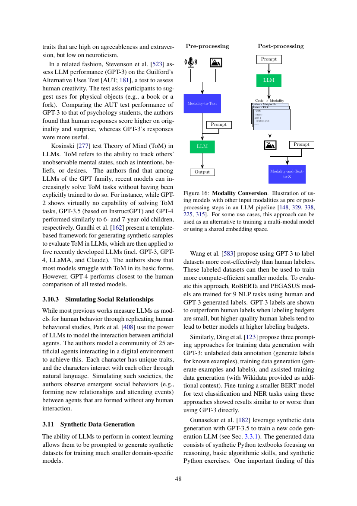

#### 3.10.3 模拟社会关系

以往工作主要通过复现人类行为研究来建模人类；另一项工作则使用大型语言模型建模人工智能体之间的互动。研究者让 25 个具有独特性格的人工智能体在数字环境中通过自然语言互动，观察到没有人类参与却自发形成了新的关系、参加活动等涌现社会行为。

### 3.11 合成数据生成

上下文学习能力使大型语言模型可以被提示生成合成数据集，再用这些数据训练规模小得多的领域模型。

GPT-3 可以比人工标注者更低成本地给数据集标注，再用标注数据训练计算效率更高的小模型。在九个自然语言处理任务上，预算较小时 GPT-3 标签优于人工标签；预算较大时，高质量人工标签训练出更好的模型。

另一项工作提出三种 GPT-3 训练数据生成方式：为已知样本生成标签；同时生成样本和标签；以及把 Wikidata 作为额外上下文的辅助生成。用这些数据微调更小的 BERT 进行文本分类和命名实体识别，结果与直接使用 GPT-3 相近或更差。

Phi-1 的代码生成训练使用 GPT-3.5 生成合成 Python 教材和练习，内容关注推理、基础算法技能和 Python 练习。该研究的重要发现是：生成数据时必须引入随机性，同时保证示例质量和连贯性。

GPT3Mix 使用包含真实数据集示例和任务说明的提示，让 GPT-3 同时生成合成示例与伪标签，再用扩充数据微调 BERT 和 DistilBERT。该方法把数据增强与知识蒸馏结合起来，用软标签训练小型分类模型。

InPars 让 GPT-3 少样本生成检索训练示例：对随机文档生成相关问题，并给出该问题的概率；随后用这些数据微调 monoT5，为查询排序相关文档。模型超过只预训练的模型，但低于使用 MS MARCO 训练集微调的模型。

AugGPT 使用 ChatGPT 为小型基础数据集的每个示例增加六个改写的合成示例，再微调专用 BERT，效果超过词替换和字符替换等已有增强方法。

分解式蒸馏不直接生成专门任务数据，而是用合成数据把大模型涌现的多步推理能力（如思维链）复制到小模型。GPT-3 先用人工设计的少样本提示，把问题分解为“子问题—子解”对；再用合成子问题数据微调 T5 问题分解器；最后微调 GPT-2 问题求解器，为教师模型生成的子问题提供子解。

大型语言模型生成合成数据可能显著降低成本，但模型参与越多，越可能无法捕捉真实分布，甚至导致模型坍缩。当前限制是无法验证合成数据是否代表对应真实世界数据的真实分布。只让模型给已有数据标注，会降低生成不具代表性分布的风险，但幻觉标签仍然是问题；当模型同时生成输入和目标时，幻觉分布问题会显著加重。

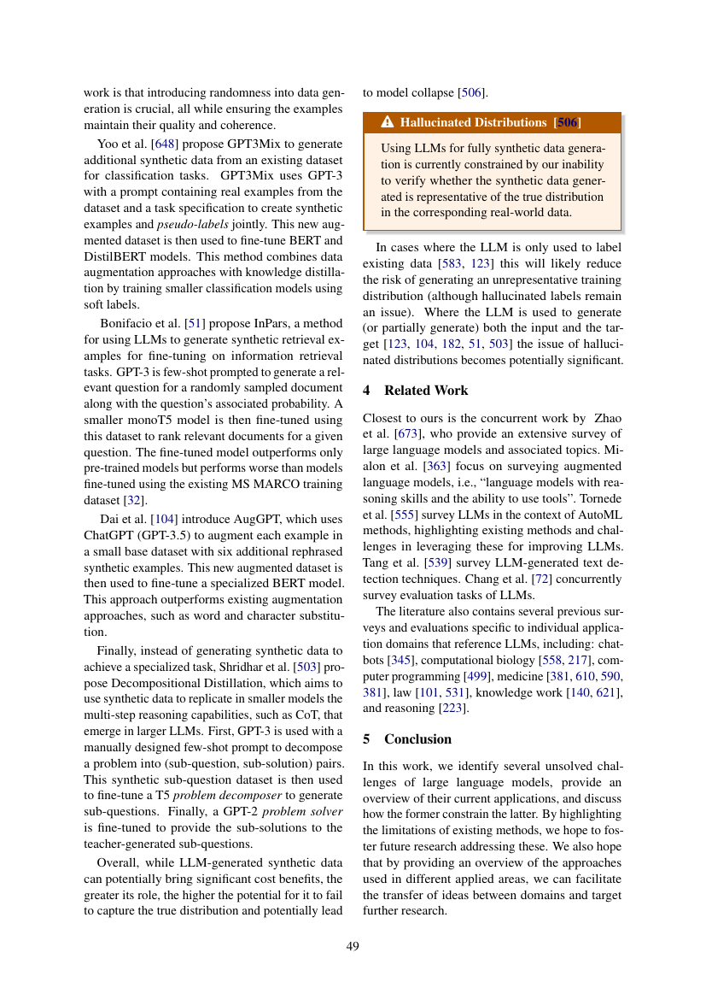

## 4 相关工作

与本文最接近的是 Zhao 等人的同期工作，它全面综述了大型语言模型及相关主题。Mialon 等人关注增强语言模型，即具备推理和工具使用能力的语言模型；Tornede 等人从自动机器学习角度综述大型语言模型，强调如何利用 AutoML 改进模型及其挑战。Tang 等人综述大型语言模型生成文本的检测技术，Chang 等人同期综述大型语言模型评估任务。

文献中还存在针对具体应用领域的综述和评估，包括聊天机器人、计算生物学、计算机编程、医学、法律、知识工作和推理。

## 5 结论

本文指出大型语言模型尚未解决的多项挑战，概览它们当前的应用，并讨论挑战如何限制这些应用。通过强调现有方法的局限，作者希望推动未来研究解决这些问题；通过概览不同应用领域采用的方法，也希望促进跨领域思想迁移并支持进一步研究。

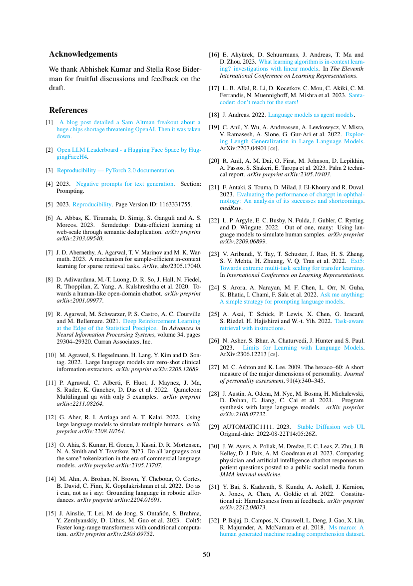

## 参考文献

参考文献按原论文第 51 至 72 页逐页保留，引用编号与正文对应。


