# 大型语言模型综合概览

**作者：** 胡姆扎·纳维德、阿萨德·乌拉·汗、邱思、穆罕默德·萨奇布、赛义德·安瓦尔、穆罕默德·乌斯曼、纳维德·阿赫塔尔、尼克·巴恩斯、阿杰马尔·米安

**论文版本：** arXiv:2307.06435v10，2024 年 10 月 17 日

**首次公开：** 2023 年 7 月 12 日

**说明：** 本译文按论文顺序编排。正文和章节标题译为中文；预训练模型与指令微调模型的长表格、架构参数表、数据集清单、复杂图示和参考文献以原 PDF 截图保留，便于逐项核对。

## 摘要

大型语言模型近来在自然语言处理及更广泛的任务中展现出令人瞩目的能力。这一成功带来了大量研究贡献，主题包括架构创新、更好的训练策略、上下文长度改进、微调、多模态大型语言模型、机器人、数据集、基准和效率等。随着技术快速发展、突破不断出现，要把握这一领域的整体进展变得越来越困难。面对快速涌现的海量文献，研究社区迫切需要一份简洁而全面的概览。

本文从广泛视角综述大型语言模型相关概念。文章在介绍必要背景的同时，覆盖大型语言模型研究前沿的高级主题，形成一份自包含的综合概览。作者希望它不仅是一篇系统综述，也是一份快速、全面的参考资料，使研究者和实践者能够从大量信息丰富的工作摘要中获得洞见，推进大型语言模型研究。

**关键词：** 大型语言模型；聊天模型；增强型大型语言模型；多模态大型语言模型；大型语言模型训练；大型语言模型基准评测

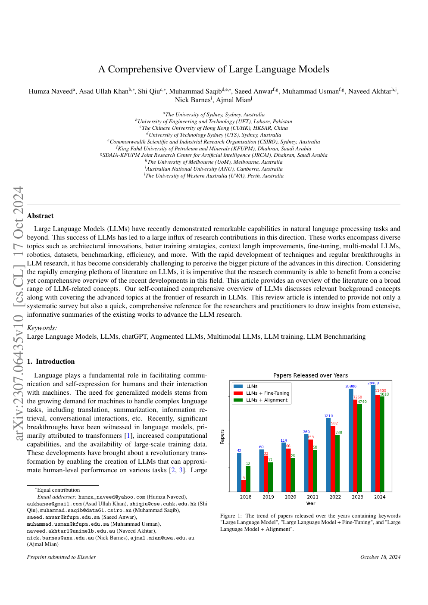

## 1 引言

语言在人类交流、自我表达以及人与机器互动中发挥基础作用。翻译、摘要、信息检索和对话交互等复杂语言任务不断增加，使人们需要能够处理多种任务的通用模型。近年来，Transformer、计算能力提升以及大规模训练数据带来了语言模型的重大突破，使大型语言模型能够在多项任务上接近人类水平。

大型语言模型是能够处理和生成连贯文本、并泛化到多个任务的前沿人工智能系统。自然语言处理的发展经历了从统计语言建模到神经语言建模，再到预训练语言模型和大型语言模型的过程。传统语言建模通常在监督设定下为每个任务训练专用模型；预训练语言模型则在大规模文本语料上以自监督方式训练通用表示，再通过下游微调完成任务。随着预训练模型参数增至数百亿甚至数千亿、训练数据扩展到数百 GB 或数 TB，预训练语言模型逐步演化为大型语言模型。

早期的 T5 和 mT5 使用迁移学习；GPT-3 进一步显示，大型语言模型无需微调，只需提供任务描述或少量示例即可迁移到下游任务。预训练模型可以回答大量任务，但在零样本设定下通常不如少样本，且未必理解用户意图。使用指令数据微调、再根据人类偏好进行对齐，可以增强未见任务泛化能力，提升零样本表现并减少不符合预期的行为。

除泛化与领域适应外，大型语言模型还出现推理、规划、决策、上下文学习和零样本回答等涌现能力。它们可以被用于多模态理解、机器人、工具操作、问答和自主智能体等场景。任务专用训练和更好的提示方法还在不断扩展这些能力。

这些能力的代价是训练和推理速度较慢、硬件需求高、运行成本大。研究者因此探索更高效的架构和训练策略，包括参数高效微调、剪枝、量化、知识蒸馏和上下文长度插值。由于大型语言模型应用广泛，相关文献数量快速增长；本文希望通过统一结构，为研究者提供架构、训练、微调、多模态、增强、数据集、评估、应用、挑战等主题的自包含概览。

本文的主要贡献包括：

1. 综述大型语言模型研究进展，提供简洁而全面的方向概览。
2. 对预训练模型进行广泛总结，提供架构和训练细节。
3. 总结重要工作的主要发现，并讨论关键设计与发展因素，帮助实践者有效使用大型语言模型。
4. 统一覆盖背景、预训练、微调、多模态、增强型模型、智能体、数据集、评估、应用和挑战等概念。

本文将参数量约 100 亿及以上的预训练模型视为大型语言模型；对更小的预训练模型，读者可参考其他专门综述。第 2 节介绍背景；第 3 节讨论大型语言模型、架构、训练流程、预训练和微调；第 4 节介绍配置参数；第 5 节总结训练与评估数据集及基准；第 6 节讨论应用；第 7 节讨论挑战和未来方向；第 8 节给出结论。

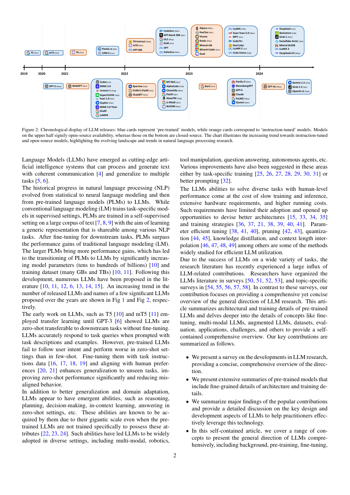

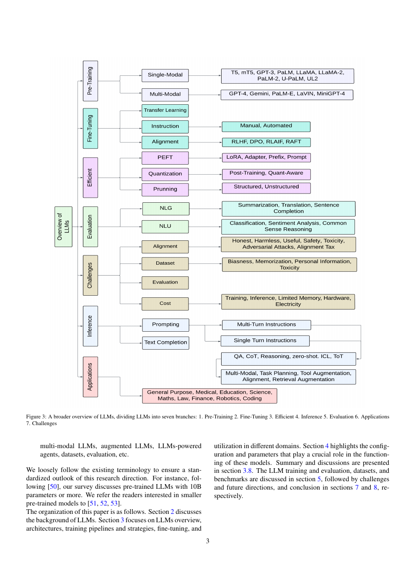

## 2 背景

本节介绍理解大型语言模型所需的基本概念，并说明模型组件、训练目标、扩展规律、适配阶段和提示方式。

### 2.1 分词

分词是大型语言模型训练的重要预处理步骤，把文本解析为不可再分的词元。词元可以是字符、子词、符号或完整单词。常用方案包括词片段、字节对编码和单元语言模型。分词器的词表大小与切分方式会影响序列长度、罕见词处理、多语言覆盖和计算效率。

### 2.2 位置编码

Transformer 并行处理序列，注意力模块本身不携带位置信息，因此需要把位置向量加入词元表示。位置编码可分为绝对位置、相对位置和学习式位置编码。ALiBi 在注意力分数中减去随位置距离增加的标量偏置，使模型更关注较近词元；旋转位置编码把查询和键表示旋转与绝对位置成比例的角度，形成随距离衰减的相对位置信息。

### 2.3 大型语言模型中的注意力

注意力按照重要性给输入词元分配权重，使模型更关注相关信息。Transformer 注意力先为输入计算查询、键和值，再用查询与键的乘积得到分数，并据此加权值。

- **自注意力：** 查询、键和值来自同一个编码器或解码器模块。
- **交叉注意力：** 用于编码器—解码器结构，编码器输出与解码器状态进行交互。
- **稀疏注意力：** 标准自注意力时间复杂度为 $O(n^2)$，稀疏注意力在滑动窗口中迭代计算，以处理长序列。
- **闪电注意力：** 通过输入分块减少 GPU 高带宽内存与片上 SRAM 之间的读写，缓解内存访问瓶颈。

### 2.4 激活函数

激活函数决定神经网络拟合非线性的能力。ReLU 定义为 $\mathrm{ReLU}(x)=\max(0,x)$；GeLU 将高斯误差线性单元与随机失活等思想结合。门控线性单元把线性变换与经 sigmoid 变换的线性投影逐元素相乘，常见变体包括 ReGLU、GEGLU 和 SwiGLU。SwiGLU 等门控激活在大型语言模型中广泛使用。

### 2.5 层归一化

层归一化能够加速收敛，是 Transformer 的组成部分。除 LayerNorm 和 RMSNorm 外，大型语言模型还采用前置归一化，即在多头注意力之前归一化。前置归一化通常能提升训练稳定性；DeepNorm 等变体用于修复大模型训练中梯度过大的问题。

### 2.6 分布式训练

大模型训练常结合多种并行方式：数据并行在多个设备复制模型并分片批次，迭代结束后同步参数；张量并行把一个张量计算切分到多个设备，也称层内或水平并行；流水线并行把模型层切分到不同设备，也称垂直并行；张量并行和流水线并行结合称为模型并行；数据、张量和模型并行结合称为三维并行。优化器并行则切分优化器状态、梯度和参数，降低显存占用，同时控制通信开销。

### 2.7 软件库

Transformer 库提供预训练模型以及训练、微调、推理和自定义模型接口；DeepSpeed 面向可扩展分布式训练和推理；Megatron-LM 提供 GPU 优化的大规模训练技术；JAX 支持高性能数值计算和可扩展机器学习；Colossal-AI、BMTrain 和 FastMoE 分别支持分布式训练、独立高效训练代码和混合专家模型；MindSpore、PyTorch、TensorFlow 和 MXNet 则提供从研究到移动端、边缘端和云端的训练与推理框架。

### 2.8 数据预处理

**质量过滤：** 分类器方法先在高质量数据上训练质量分类器，启发式方法则根据语言、统计指标、关键词等规则过滤文本。

**数据去重：** 重复数据会影响模型性能并增加记忆，因此需要在句子、文档和数据集多个层级去重。

**隐私削减：** 网页数据可能包含姓名、地址和电话号码等私人信息，许多模型使用启发式规则过滤这些内容，减少模型记忆个人信息的风险。

### 2.9 架构

**编码器—解码器：** 编码器通过双向自注意力处理完整输入，再把中间表示传给解码器；解码器逐步生成输出，并通过交叉注意力读取编码器表示。

**因果解码器：** 没有编码器，只由解码器处理和生成输出，预测词元只能依赖之前的位置。

**前缀解码器：** 也称非因果解码器，注意力不严格依赖过去信息，前缀部分可以双向关注。

**混合专家：** 在注意力块之后设置多个并行专家和一个路由器，每个词元只激活少数专家。稀疏混合专家可以在不按比例增加计算的情况下扩大总参数量，并取得接近稠密模型的性能。

### 2.10 预训练目标

**完整语言建模：** 自回归预测给定前文之后的未来词元。

**前缀语言建模：** 随机选择一个前缀，只对剩余目标词元计算损失。

**掩码语言建模：** 随机遮盖词元或连续词元片段，要求模型利用前后文预测被遮盖内容。

**统一语言建模：** 结合因果、非因果和掩码语言建模目标；掩码训练中的注意力可以改为单向，只关注左到右或右到左的上下文。

### 2.11 大型语言模型缩放定律

缩放定律研究模型参数、数据规模和计算资源的最优组合，并预测性能提升。已有研究显示，损失随模型规模、数据量和计算量呈幂律变化；一种结论强调扩大模型更重要，另一种计算最优结论则认为模型规模与训练词元数应同步增长。缩放规律为确定模型大小、数据量和训练计算预算提供依据，但实际性能还受到数据质量、训练稳定性和架构的影响。

### 2.12 大型语言模型适配阶段

#### 2.12.1 预训练

第一阶段是在大规模语料上以自监督方式训练模型，给定输入预测下一个词元。模型可以采用编码器—解码器、因果解码器或非因果解码器，并选择不同模块和损失函数。

#### 2.12.2 微调

迁移学习使用任务特定数据微调预训练模型，以提升下游任务性能。指令微调把样本格式化为“指令—输入—输出”对，使模型理解自然语言任务要求，提升零样本泛化。对齐微调则使用人类反馈，让模型更加有帮助、诚实和无害；训练通常包含示范监督微调、奖励模型和强化学习。

奖励建模把人类对模型回答的偏好转化为分类目标，学习排序生成回答；强化学习使用奖励模型区分偏好回答与非偏好回答，再通过近端策略优化反复更新模型。

#### 2.12.3 提示与使用

提示是向训练完成的模型提问并生成回答的方法。零样本提示不提供示例；上下文学习在提示中给出多组输入—输出示范；思维链提示把中间推理步骤加入示范，使模型逐步求解；自洽性生成多个推理结果并选择最常见答案；思维树探索多条推理路径，并允许前瞻和回溯。单轮指令一次提供全部信息，多轮指令则把模型回答、用户反馈或外部工具结果作为下一轮输入，这种方式常用于自主智能体。

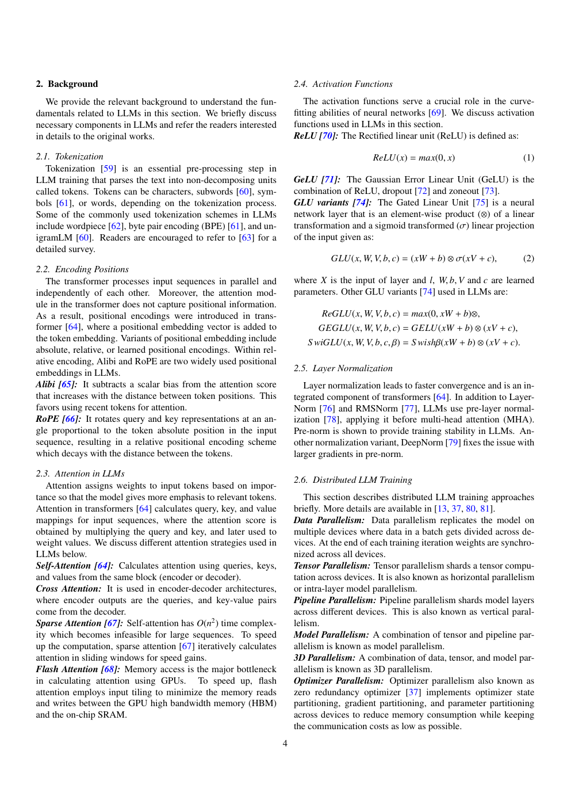

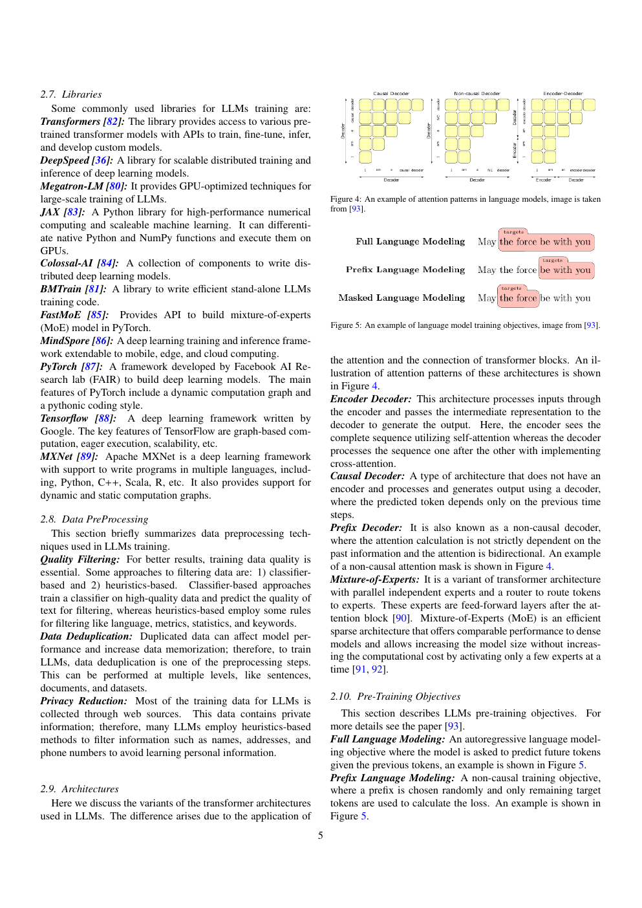

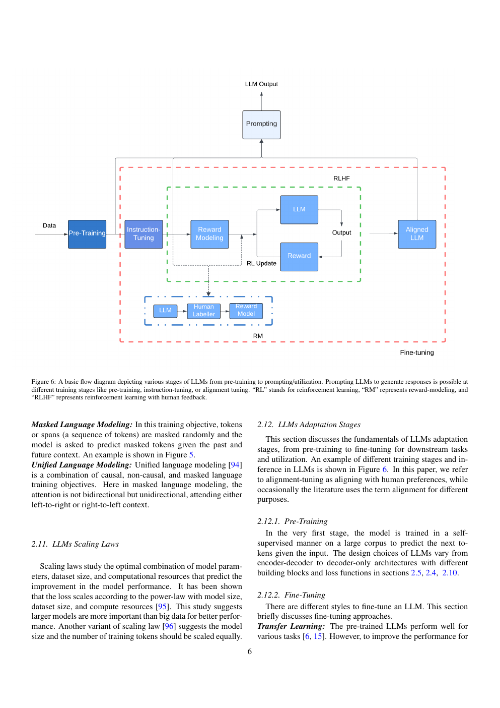

## 3 大型语言模型

本节回顾大型语言模型的架构、训练目标、训练流程、数据集和微调方法，并总结代表性模型的设计选择与主要发现。

### 3.1 预训练大型语言模型

#### 3.1.1 通用模型

**T5。** T5 使用编码器—解码器结构，把所有自然语言处理任务统一成文本到文本训练。它采用跨度破坏目标，用一个掩码替代连续词元片段，而不是为每个词元分别设置掩码，从而缩短序列并加速训练。预训练后，T5 通过适配器层微调下游任务。

**GPT-3。** GPT-3 延续 GPT-2 的架构，在 Transformer 层中加入稠密与稀疏注意力，参数规模达到 1750 亿。它显示，扩大模型和批次、降低学习率可以提升性能，大模型在零样本和少样本任务上能够接近经过微调的模型。

**mT5。** mT5 在 mC4 数据集上用 101 种语言训练，使用 25 万词表覆盖多语言文本，并通过语言采样避免某些语言过拟合或欠拟合。大规模多语言模型在下游任务上可以接近单语言模型，但较小多语言模型通常性能较差。

**PanGu-α。** PanGu-α 是 2000 亿参数的中文自回归模型，使用大规模中文语料和分布式训练，展示了大型语言模型较强的少样本能力。

**CPM-2。** CPM-2 使用编码器—解码器结构和跨度破坏目标，通过提示微调仅更新少量参数。把提示词元插入句子之间可以帮助模型理解跨句和长序列关系；INFMOE 通过把参数动态卸载到 CPU，使百亿级模型推理更节省内存。

**ERNIE 3.0。** ERNIE 3.0 使用 Transformer-XL 作为骨干，把所有任务共享的通用表示模块与任务特定表示模块组合起来，联合训练自然语言理解、生成和知识抽取，重点面向中文任务。

**Jurassic-1 与 HyperCLOVA。** Jurassic-1 包含 70 亿参数的 J1-Large 和 1780 亿参数的 J1-Jumbo，使用不受词边界限制的 SentencePiece 词表和更均衡的深度—宽度结构，在少样本任务中可以容纳更多示例。HyperCLOVA 采用 GPT-3 式架构，重点训练韩语文本。

**Yuan 1.0。** Yuan 1.0 在 5 TB 高质量中文语料上训练，并用基于 Spark 的大规模数据过滤系统清洗互联网文本。其架构和训练配置强调中文覆盖、数据质量与大规模并行。

**Gopher 与 ERNIE 3.0 Titan。** Gopher 是 2800 亿参数的因果解码器，使用相对位置编码，在长于训练长度的序列上仍能进行评估。ERNIE 3.0 Titan 在 ERNIE 3.0 基础上加入额外的自监督对抗损失，用于区分真实和生成文本并提升性能。

**GPT-NeoX-20B。** GPT-NeoX-20B 是公开的 200 亿参数模型，使用并行注意力与前馈层，并采用特殊初始化避免深度和宽度增加时激活值增长。在 The Pile 上训练后，它的五样本表现超过 GPT-3。

**OPT 与 BLOOM。** OPT 提供从小模型到 1750 亿参数的开放预训练 Transformer，训练过程中若损失发散，需要从较早检查点以更低学习率重启；模型也容易重复生成并陷入循环。BLOOM 是 BigScience 社区协作训练的 1760 亿参数多语言模型，强调开放数据治理、多语言覆盖和责任发布。

**Galactica。** Galactica 在论文、教材、讲义、化合物、蛋白质和科学网站等组成的 4800 万条科学知识语料上训练，并用工作记忆词元包装推理数据。即使多次重复语料，模型在验证集、域内和域外基准上仍持续提升，在 PubMedQA、MedMCQA 等任务上取得很强结果。

**GLaM。** GLaM 用混合专家替代每个 Transformer 层中的前馈层，通过只激活少数专家保持较大模型容量并降低计算。过滤后的预训练语料能稳定改善自然语言理解和生成，增加专家数量或专家规模可以扩展模型。

**LaMDA、MT-NLG 与 Chinchilla。** LaMDA 面向对话，使用公共文档、对话和网页数据训练，目标是生成高质量、安全且有事实依据的回答，并可微调为调用外部信息资源。MT-NLG 是 5300 亿参数模型，整合微软和英伟达的训练经验。Chinchilla 的计算最优研究表明，模型参数量每翻倍，训练词元数也应近似翻倍；在固定计算预算下，更小但训练更充分的模型可以超过更大的模型。

**PaLM 与 AlexaTM。** PaLM 是 5400 亿参数稠密 Transformer，使用 Pathways 扩展到 6144 个 TPU。研究发现，以英语为中心的模型更擅长翻译到英语；通用模型在翻译任务上可以达到专用小模型的水平；模型规模越大，训练数据记忆比例越高，但即使 5400 亿参数，性能也没有饱和。AlexaTM 使用编码器—解码器架构和去噪目标，并加入因果语言建模以改善上下文学习。

**U-PaLM、UL2 与 GLM-130B。** U-PaLM 在 PaLM 基础上使用多种去噪器，提升填空能力和开放式生成多样性。UL2 通过模式切换训练，在多种下游任务上优于标准方案，思维链提示也优于普通提示。GLM-130B 是中英双语模型，用自回归空白填充目标并加入少量多任务指令数据；嵌入层梯度缩减帮助稳定训练。

**LLaMA、PanGu-Σ 与代码模型。** LLaMA 提供 70 亿到 650 亿参数的开放模型，通过更多公开数据和训练词元取得强性能；较小模型在更长训练时间下也可以达到良好效果。PanGu-Σ 使用随机路由专家扩展到万亿规模，可抽取面向领域的子模型并减少持续学习中的灾难性遗忘。CodeGen、Codex、AlphaCode、CodeT5+ 和 StarCoder 分别探索自然语言到代码、多步程序合成、竞赛级代码、代码—文本双模态训练和长上下文代码生成。

**领域模型。** Galactica 面向科学知识；LaMDA 面向对话；BloombergGPT 使用金融语料与通用语料联合训练；Xuan Yuan 2.0 是中文金融聊天模型。将通用和领域数据结合，可以提升特定任务，同时避免损害其他能力；把预训练与微调合并，也有助于减少灾难性遗忘。

**更新模型。** 综述还整理 LLaMA-2、PaLM 2、LLaMA-3/3.1、Nemotron-4、DeepSeek、DeepSeek-V2、Mixtral 和 Snowflake Arctic 等模型。其共同趋势包括：提高数据质量、逐步扩大上下文、使用分组查询或多头潜在注意力降低 KV 缓存、利用稀疏专家降低计算，以及用合成数据迭代对齐。

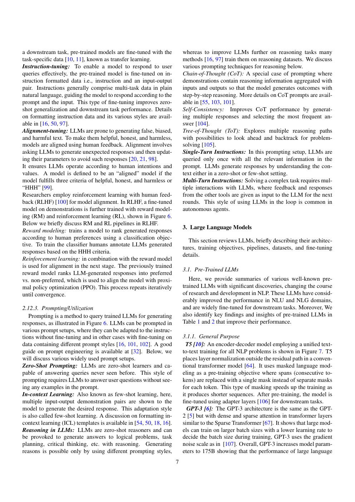

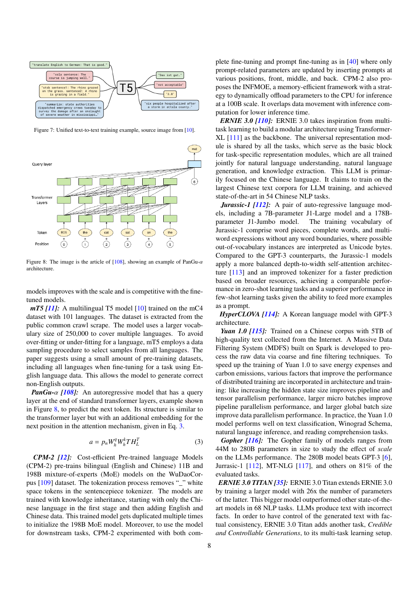

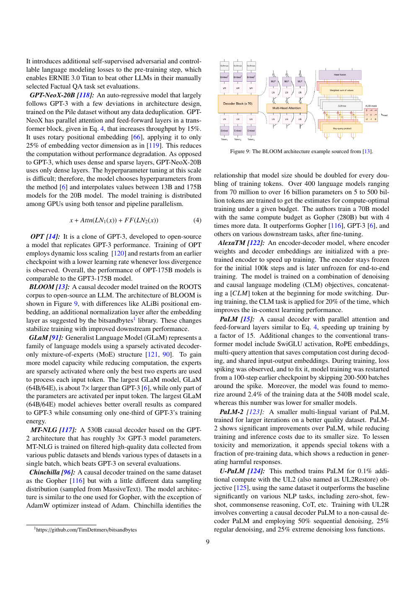

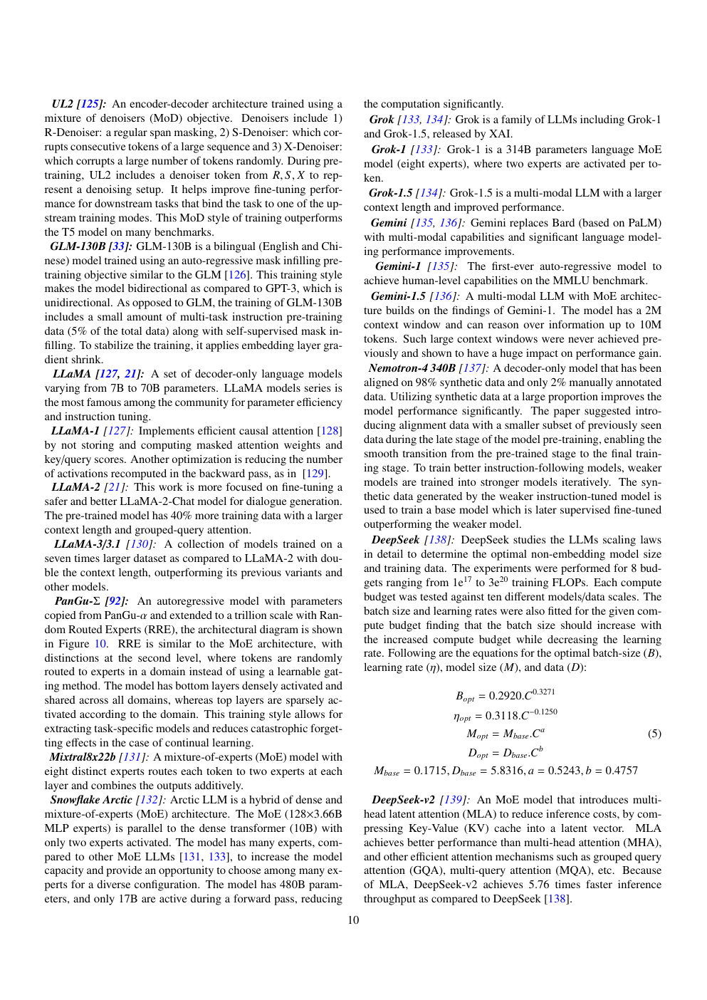

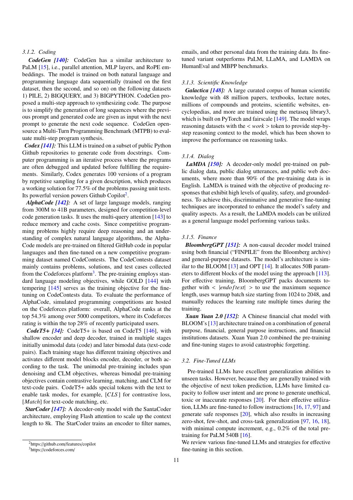

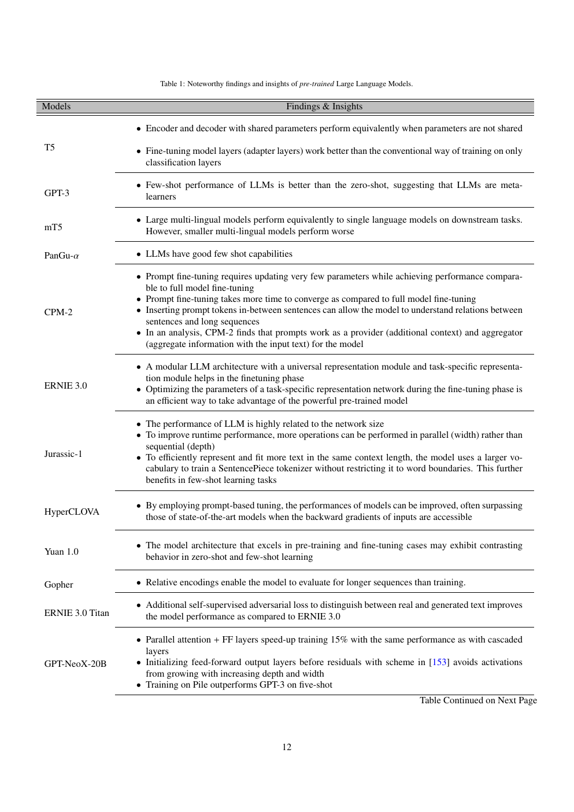

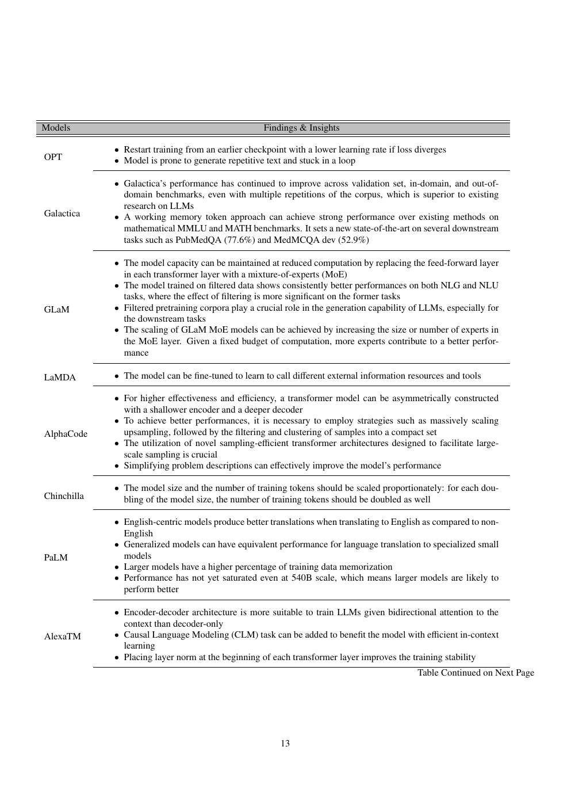

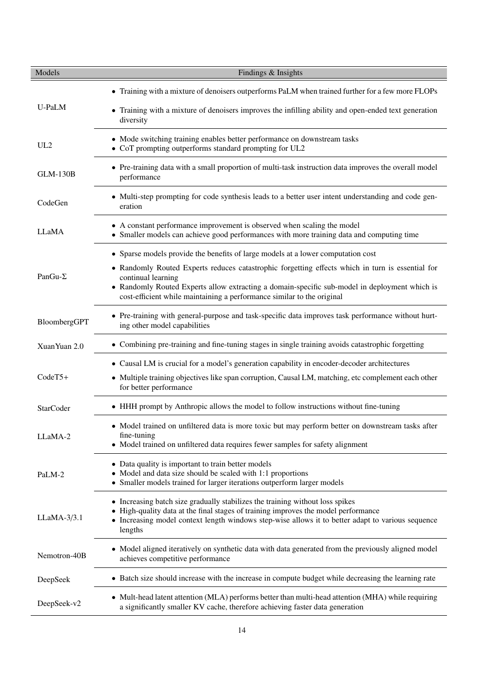

### 3.2 微调大型语言模型

预训练大型语言模型具有很强的泛化能力，但由于训练目标通常只是预测下一个词元，它们理解用户意图的能力有限，容易生成不道德、有毒或不准确的回答。指令微调和人类偏好对齐可以提升零样本、少样本及跨任务泛化，而且所需额外计算量相对较小。

#### 3.2.1 使用人工创建的数据集进行指令微调

T0 和多语言 mT0 用模板把已有数据集转换为提示数据，提升零样本和未见任务泛化。Tk-Instruct 在 T5 上使用 Super-NaturalInstructions，虽然只有 110 亿参数，却超过 1750 亿参数的 InstructGPT。OPT-IML 和 Flan 分别构造约 2000 和 1800 个任务，并同时加入零样本、少样本和思维链提示；仅增加任务实例并不足够，任务类型和提示形式也需要多样化。CoT Collection 进一步用约 188 万条思维链样本微调 Flan-T5。

#### 3.2.2 使用大型语言模型生成的数据集进行指令微调

人工编写指令和输入—输出对成本高、规模小且多样性有限。Self-Instruct 让已有大型语言模型生成新的指令数据：从 175 个种子任务开始，迭代产生约 52,000 条指令和 82,000 个输入—输出对，效果超过人工构建数据集。Alpaca 使用 text-davinci-003 生成约 52,000 条样本微调 LLaMA，Vicuna 使用 ShareGPT 对话，LLaMA-GPT-4 让 GPT-4 重新生成指令。Goat 专门微调算术任务，HuaTuo 面向医学问答。

复杂指令方法反复改写原始指令，使其包含更复杂的表达和约束。WizardLM 使用约 25 万条 Evol-Instruct 数据，WizardCoder 在代码指令上进一步改写，二者都显示出复杂指令数据的价值。

#### 3.2.3 与人类偏好对齐

InstructGPT 采用三步流程：示范监督微调、根据人工排序训练奖励模型、使用近端策略优化进行强化学习。LLaMA 2-Chat 把奖励拆为帮助性和安全性，并加入拒绝采样。GopherCite、WebGPT 和 Sparrow 让回答附带网页证据，奖励模型依据引用和人类偏好排序回答；Sparrow 还让标注员进行对抗性探测，测试模型是否违反规则。

直接偏好优化绕过复杂的奖励模型和强化学习流程，直接提高偏好回答相对于非偏好回答的似然。RAFT、PRO 和 RRHF 以奖励排序或偏好排序进行微调；Chain-of-Hindsight 用自然语言反馈告诉模型哪些回答好、哪些回答差。Constitutional AI 和 RLAIF 用 AI 生成的反馈代替部分人工反馈；AlpacaFarm 还故意注入噪声以模拟人类判断错误。自我对齐通过上下文示例告诉模型回答应包含哪些有用、诚实和合乎伦理的内容。

红队测试和越狱测试通过主动寻找能诱发有害回答的提示，暴露模型在安全对齐后的剩余缺陷，再用这些样本进行安全微调。

#### 3.2.4 继续预训练

微调可能造成灾难性遗忘。把少量随机预训练样本与微调数据在每次迭代中混合，可以保留原有知识；提示式继续预训练则先在任务相关文本和指令上训练，再进行下游指令微调。

#### 3.2.5 样本效率

微调数据虽然远少于预训练数据，但仍需足够规模。研究发现，约 25% 的下游数据就可能达到先进性能，基于核心集选取总指令数据的 0.5% 甚至能超过全量微调。LIMA 只使用 1000 条精心构造的高质量示范，就取得接近 GPT-4 的效果，说明数据质量和多样性比单纯数量更重要。

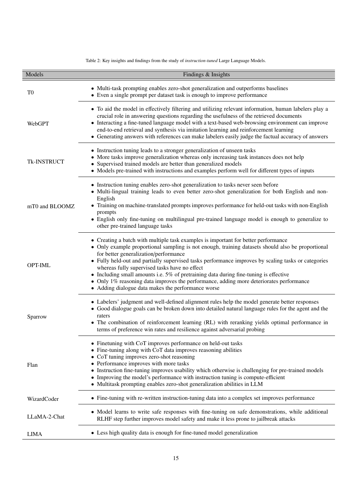

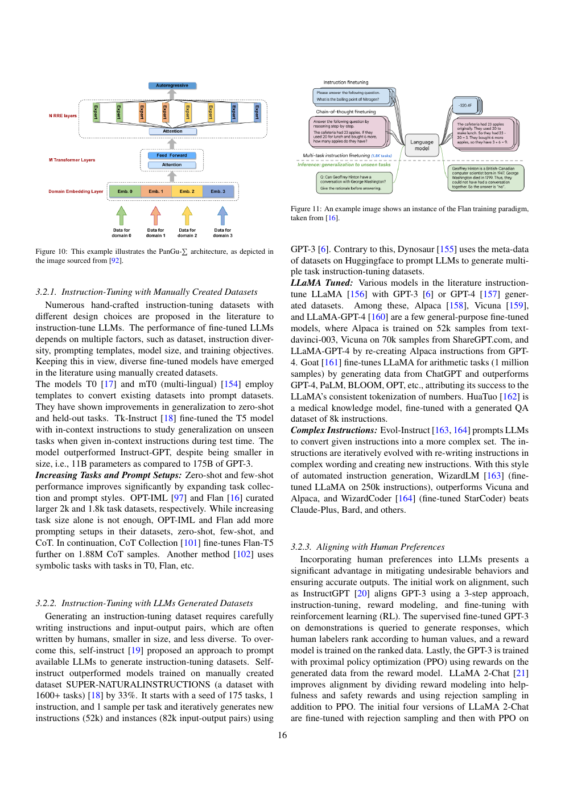

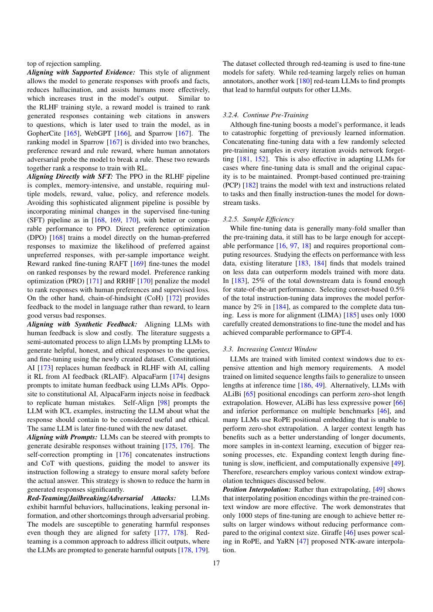

### 3.3 增大上下文窗口

大型语言模型通常因注意力成本和内存需求而使用有限上下文窗口。模型在短序列上训练后，推理时往往不能泛化到更长长度。扩大上下文能够理解更长文档、容纳更多上下文示例并执行更长推理，但直接微调大窗口速度慢、成本高。

位置插值把位置编码限制在原训练窗口范围内，少量微调就能适应更长上下文；Giraffe 在旋转位置编码中使用幂律缩放，YaRN 提出感知神经切线核的插值。高效注意力通过局部、稀疏或膨胀注意力降低成本：LongT5 使用瞬时全局注意力，COLT5 把轻量注意力和重量级注意力分支结合，LongNet 用膨胀注意力把序列长度扩展到十亿词元，LongLoRA 在微调阶段使用移位短注意力。

有些方法不需要重新训练就能外推长度。LM-Infinite 在原窗口内使用 Λ 形注意力，平行上下文窗口方法把长输入切成多个预训练长度片段，并对每个片段复用位置编码。

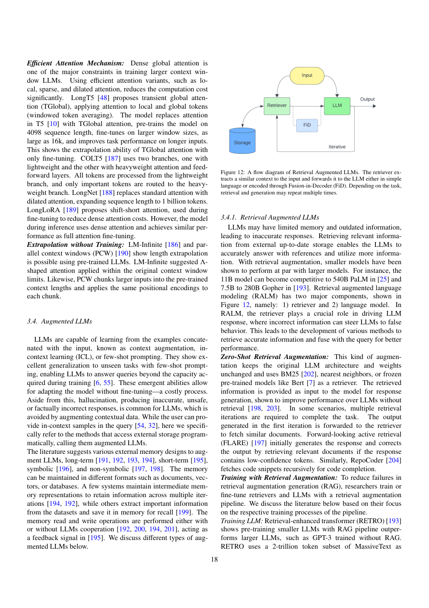

### 3.4 增强型大型语言模型

上下文增强、上下文学习和少样本提示，把示例直接拼接到输入中，使模型无需微调就能泛化到未见任务。另一方面，模型容易产生幻觉，访问外部信息能够补充记忆并减少事实错误。增强型大型语言模型通过程序化访问外部存储来解决这个问题，外部记忆可以是长期、短期、符号或非符号记忆，也可以用文档、向量或数据库保存。

#### 3.4.1 检索增强大型语言模型

检索增强系统由检索器和语言模型组成。检索器从外部存储找到与输入相关的内容，再把它以文本或编码形式提供给模型。即使模型规模更小，检索增强也能使其达到大模型水平。零样本检索增强保持原模型权重不变，使用 BM25、近邻方法或冻结的预训练模型检索内容；FLARE 在低置信度词元出现时主动检索并修正回答，RepoCoder 则递归检索代码片段。

RETRO 在两万亿词元数据库上预训练较小模型，结果超过不使用检索增强的更大模型。检索器也可以单独训练，用对比学习学习适合上下文学习的示例；还可以同时训练检索器和语言模型，让错误信号反向传播到两者。Fusion-in-Decoder 将检索文档编码后用交叉注意力融合，避免把大量文本直接拼接到输入。网络增强方法通过搜索引擎获取最新上下文，弥补本地存储信息有限和过时的问题。

#### 3.4.2 工具增强大型语言模型

工具增强系统让大型语言模型把复杂任务拆成子任务，选择工具、执行动作、读取结果并循环规划。零样本工具使用可以通过工具文档或任务示例实现；RestGPT 把任务分解为规划和应用程序接口选择；ToolkenGPT 把工具表示为词元，模型生成工具词元后暂停文本生成，再将工具执行结果送回模型。

训练式工具增强包括 Gorilla、TALM 和 ToolLLM。Gorilla 用应用程序接口文档和自指令流程微调 LLaMA；TALM 通过自博弈迭代完成工具操作任务；ToolLLM 从 RapidAPI 收集约 16,000 个应用程序接口，并使用深度优先搜索生成多样化推理与规划数据。多模态工具增强遵循“规划—选工具—执行—检查—生成”的循环，工具可以处理文本、图像、音频和其他模态。

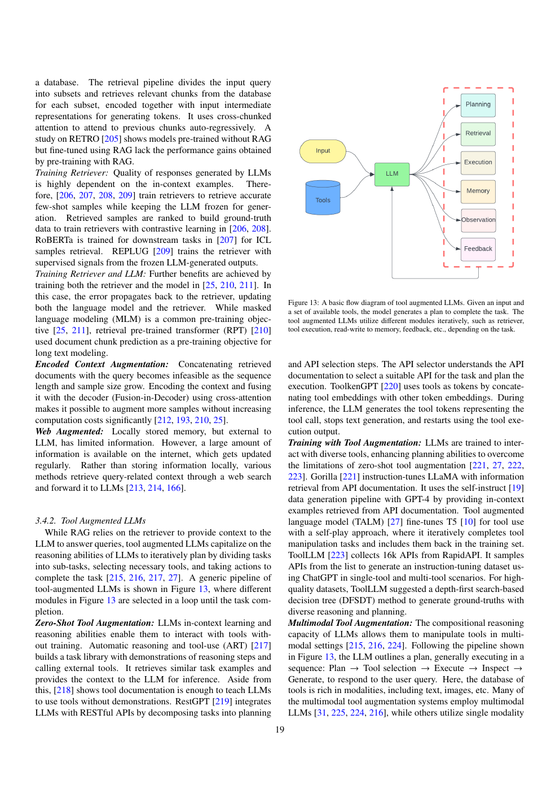

### 3.5 大型语言模型驱动的智能体

人工智能智能体是能够规划、决策并执行动作以实现复杂目标的自主实体。早期智能体多为规则系统，只能处理狭窄任务；大型语言模型能够应对动态场景，因而成为智能体的大脑，被用于网页、代码、工具、具身和对话智能体。

大型语言模型驱动智能体通常包含规划与推理、反馈、记忆和多智能体协作模块。思维链、思维树和自洽性提示帮助模型生成多步计划；RAP 把一个大型语言模型重新用作世界模型，预测未来结果并探索替代路径；Retroformer 使用回顾式模型改进主模型计划。闭环智能体把动作结果作为反馈，重新评估并更新计划；也有工作用大型语言模型作为奖励函数训练强化学习策略。

外部记忆保存响应历史，短期记忆记录近期回答，长期记忆则总结失败尝试并在后续提示中反思。多智能体系统给不同模型分配用户定义的角色，让它们模拟领域专家并协作完成复杂任务。

在物理环境中，大型语言模型缺乏真实世界知识，可能生成不合逻辑动作。SayCan 让模型规划高层任务，再由学习到的可供性函数判断低层动作是否可执行；PaLM-E 直接把传感器输入接入多模态语言模型。机器人操作任务包括物体识别、抓取和协作，导航任务则要求模型生成适应仓库、交通、医疗和住宅环境的路径。

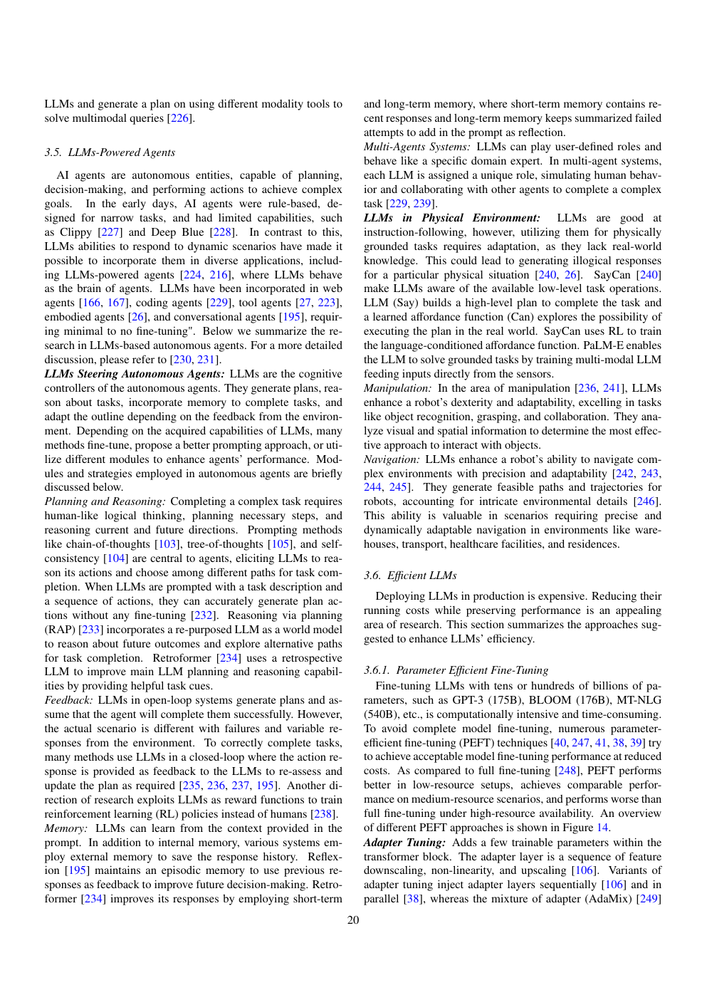

### 3.6 高效大型语言模型

部署大型语言模型的成本很高，研究重点是降低运行成本并保持性能。

#### 3.6.1 参数高效微调

全量微调百亿到千亿参数模型计算昂贵。参数高效微调只更新少量参数，在低资源场景通常优于全量微调，中等资源场景性能接近全量微调。适配器调优在 Transformer 块中加入少量可训练参数；LoRA 学习低秩分解矩阵，推理时与原权重融合，不增加额外延迟。

提示调优只更新约 0.001%—3% 的新增参数，将可训练提示与词嵌入拼接；P-Tuning 用可学习映射把离散提示转成连续提示；前缀调优把任务特定前缀向量附加到冻结层；BitFit 只更新偏置项，在小数据场景可以达到全量微调效果。

#### 3.6.2 量化

推理需要大量计算和内存，1750 亿参数 GPT-3 至少需要多张 80 GB A100 GPU。大模型还存在小模型没有的极大权重离群值，使量化更困难。后训练量化几乎不需要训练，LLM.int8 使用离群特征的全精度矩阵乘法和其余特征的 8 位计算；SmoothQuant 平滑激活分布，把量化困难转移到权重；OPTQ 逐层量化并更新权重补偿误差；离群感知量化给脆弱权重分配更高精度。量化感知训练进一步微调量化模型；QLoRA 在 4 位量化基础上结合 LoRA，性能优于简单的 4 位整数或浮点量化。

#### 3.6.3 剪枝

剪枝通过删除参数压缩模型。非结构化剪枝直接删除不重要权重，Wanda 根据权重与输入范数的乘积决定删除对象，通常不需要微调；OWL 根据不同层的离群值数量采用非均匀剪枝。结构化剪枝以组、行、列或矩阵为单位删除参数，更适合硬件张量核心。LLM-Pruner 保留前向传播中共同激活的重要隐藏状态组，再使用 LoRA 微调；SIMPLE 等方法学习掩码并删除不重要的秩一分量。

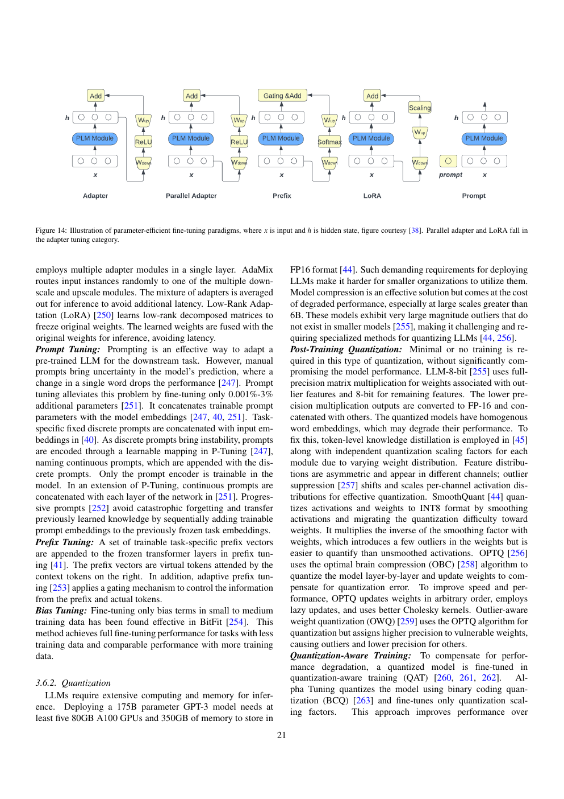

### 3.7 多模态大型语言模型

多模态模型让大型语言模型感知图像、视频、音频等信息，相比只处理文本的模型能够获得更完整的上下文，并更接近人类依赖多种感官理解世界的方式。现有多模态大型语言模型大致分为预训练、微调和提示三条路线。

预训练路线构造端到端统一模型。Flamingo 用门控交叉注意力融合冻结视觉编码器和语言模型；BLIP-2 用两阶段 Q-Former 对齐视觉和语言，先进行视觉—语言表示学习，再让冻结语言模型学习视觉到文本的生成；MiniGPT-4 只训练视觉与语言之间的线性投影。

微调路线使用多模态指令把预训练模型扩展为聊天机器人和任务求解器，主要难点是收集多模态指令数据。研究者使用基准适配、自指令和混合构成等方法构造数据，并引入 LLaMA-Adapter、LaVIN 等参数高效接口；也可以用 Whisper 等专家模型把视频或音频转成文本。

提示路线不更新模型参数，只提供上下文、示例或指令，因而需要更少的多模态数据。多模态思维链要求模型同时生成推理过程和答案；Multimodal-CoT 分为理由生成与答案推断两阶段，CoT-PT 结合提示调优与视觉偏置隐式生成推理。PointCLIP V2 使用大型语言模型生成三维提示，GPT4Tools 用 LoRA 微调工具指令。视觉推理系统还把模型作为控制器、决策器或语义精炼器，提升泛化、交互和复杂视觉任务能力。

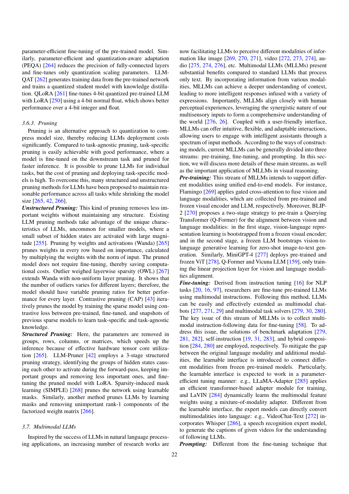

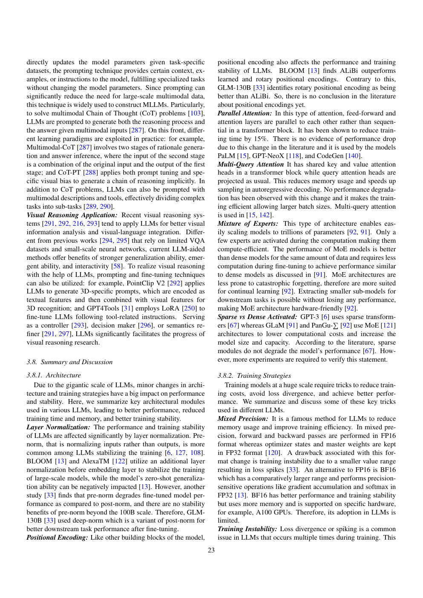

### 3.8 总结与讨论

#### 3.8.1 架构

编码器—解码器结构能够同时利用完整上下文，适合需要理解输入再生成输出的任务；因果解码器适合开放式生成。位置编码的选择会影响性能和稳定性，BLOOM 认为 ALiBi 优于学习式和旋转位置编码，而 GLM-130B 得出相反结论，因此尚无统一答案。并行注意力可以在性能不下降的情况下把训练时间降低约 15%；多查询注意力共享键和值头，降低内存并加快采样；混合专家只激活少数专家，能够把模型扩展到万亿参数并减少计算。

#### 3.8.2 训练策略

数据质量、模型规模、训练词元数和计算预算共同决定性能。过滤和去重通常有利于生成质量；在计算预算固定时，合理平衡模型大小和数据量比单纯扩大其中一项更有效。指令微调和偏好对齐能显著提升零样本泛化、帮助性和安全性，但数据质量、偏好标注和红队覆盖范围会影响最终结果。

#### 3.8.3 监督模型与通用模型

监督模型在特定任务上通常更强，通用模型则更擅长零样本和少样本迁移。任务数量、提示多样性和跨语言数据会影响泛化；增加任务类别往往比简单增加同一任务实例更有用。模型评估应同时报告零样本、少样本、微调和对齐后的结果。

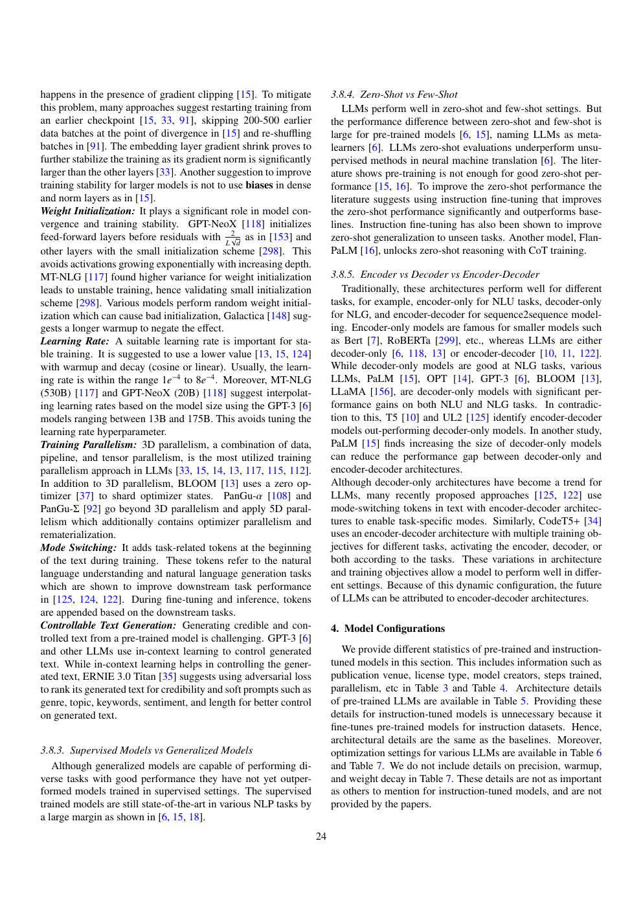

## 4 大型语言模型配置

模型参数表包含架构类型、训练目标、注意力、词表、分词器、归一化、位置编码、激活函数、层数、头数和隐藏状态大小；优化表还包括批大小、序列长度、学习率、预热、优化器、精度、权重衰减、梯度裁剪和随机失活。不同模型的具体配置和训练成本差异很大，不能只根据参数量判断性能。

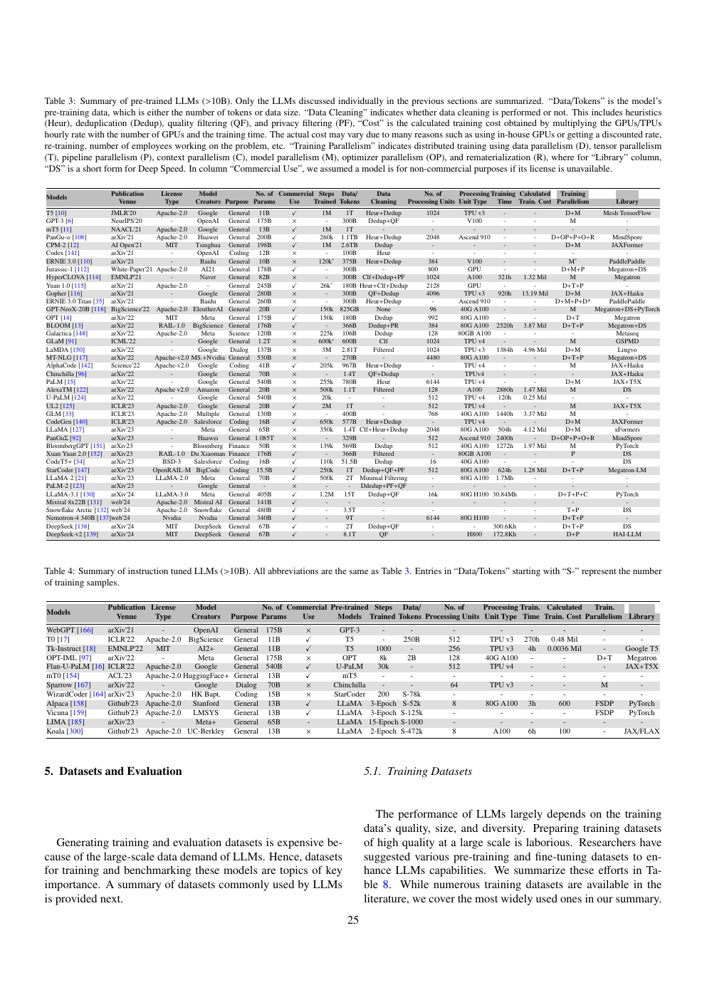

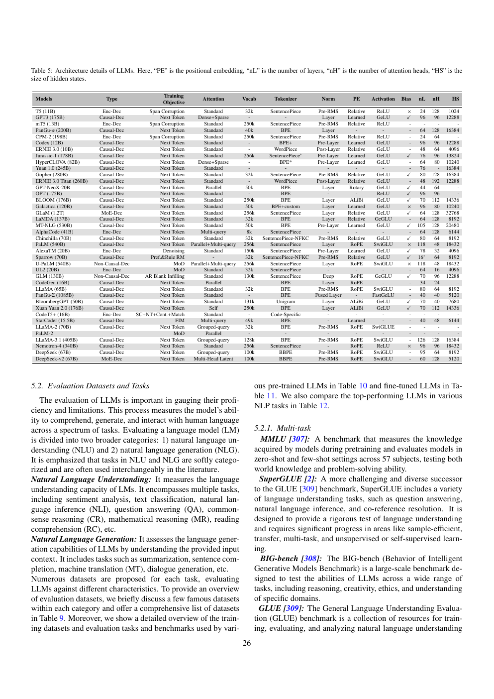

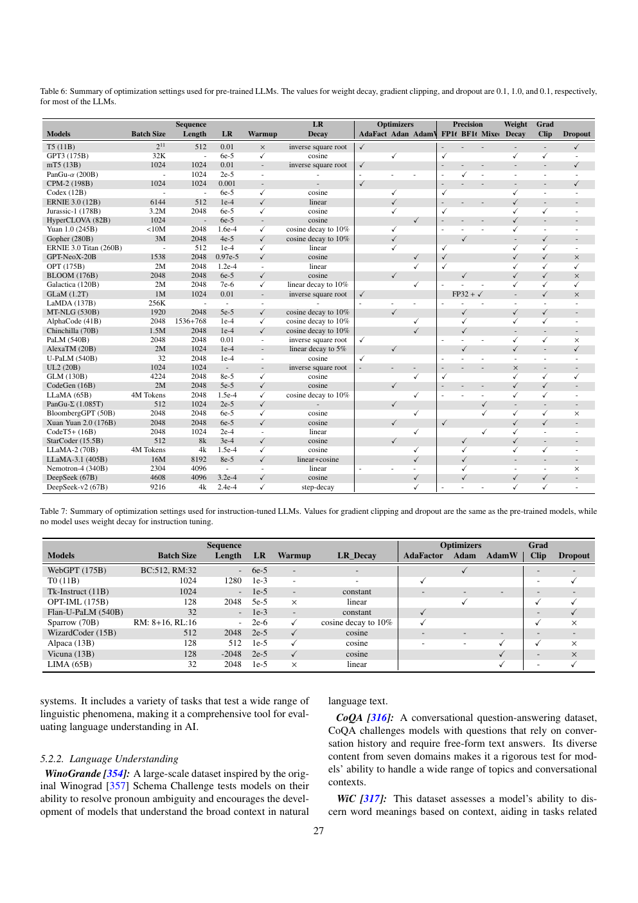

## 5 数据集与评估

大型语言模型训练和评估数据规模巨大，构建高质量数据集成本很高。训练数据的质量、规模和多样性会直接影响模型能力。本文将评估任务分为自然语言理解和自然语言生成两大类，实际研究中二者边界并不绝对。

### 5.1 训练数据集

预训练数据包括网页、书籍、百科、新闻、论文、代码、社交媒体和领域语料。常见处理包括质量过滤、去重、隐私削减、语言平衡和污染检查。指令微调数据包括人工指令、模板转换数据、模型生成指令、对话、思维链、工具调用和安全示范。数据来源、许可证、重复率、词元数和训练成本共同决定数据集可复用性。

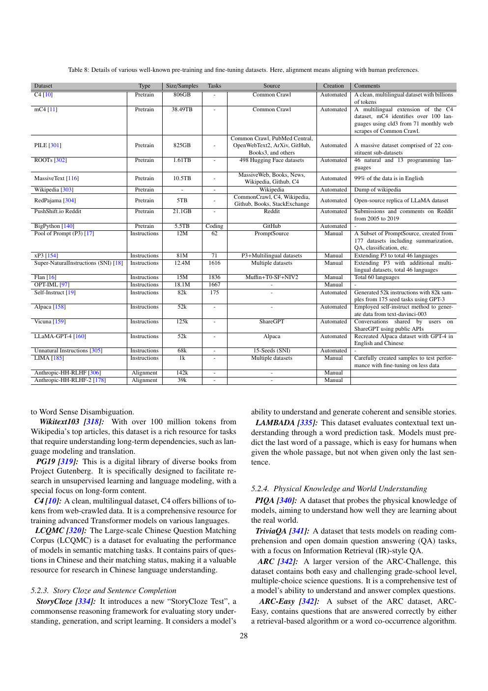

### 5.2 评估数据集与任务

#### 5.2.1 多任务

MMLU 在 57 个学科中以零样本和少样本方式测量预训练知识与问题求解；SuperGLUE 是 GLUE 的更困难后继，覆盖问答、自然语言推理和共指消解；BIG-bench 覆盖推理、创造力、伦理和领域知识；GLUE 用于训练、评估和分析自然语言理解。

#### 5.2.2 语言理解

CoQA、WiC、Wikitext103、PG19、LCQMC、QQP、WinoGender、FinRE、CLUENER、AQuA、OntoNotes 等数据集分别覆盖对话问答、词义消歧、语言建模、长文档、句对关系、性别偏见、金融关系、命名实体和数学问答。中文任务还包括 AFQMC、BQ Corpus、CNSS、CKBQA、微博和 COTE 等。

#### 5.2.3 故事完形与句子补全

StoryCloze 测试模型理解故事、生成结局和学习脚本的能力；LAMBADA 要求根据长上下文预测最后一个词；LCSTS、AdGen、E2E 和 CHID 分别覆盖中文短文本摘要、广告生成、结构化数据到文本和成语选择。

#### 5.2.4 物理知识与世界理解

PIQA 测试物理常识，TriviaQA 测试开放域事实问答，ARC 和 ARC-Challenge 使用小学科学选择题评估知识与推理，OpenBookQA 要求结合开放知识回答问题，WebNLG 评估知识图谱到文本生成。

#### 5.2.5 上下文语言理解

RACE 从中国英语考试收集长篇阅读理解题，RACE-Middle 和 RACE-High 对应不同教育阶段；QuAC 模拟学生与教师之间的信息寻求对话；StrategyQA 要求综合多条证据进行策略推理；Quiz Bowl 评估逐步提供线索时的知识检索。

#### 5.2.6 常识推理

HellaSwag 通过对抗过滤构造“人类觉得合理、模型容易误判”的结局选择；COPA 评估因果常识，要求从两个选项中选择更可能的原因或结果；WSC 测试代词指代消解；CommonsenseQA、SocialIQA 和 C3 分别覆盖常识问答、社会常识和中文阅读理解。

#### 5.2.7 阅读理解

BoolQ 要求根据维基百科段落回答自然产生的是非问题；SQuAD 和 SQuADv2 测试抽取式问答，并加入不可回答问题；DROP 测试段落中的离散推理；RTE 评估文本蕴含；WebQA 使用网页问答；CMRC2018 等数据集评估中文跨度抽取和综合推理。

#### 5.2.8 数学推理

MATH 覆盖从算术到微积分的数学题；Math23k 包含 23,000 道中文算术应用题；GSM8K 测试小学数学多步推理；MathQA、MGSM、MultiArith、ASDiv、MAWPS 和 SVAMP 提供不同语言、难度和形式的数学推理。

#### 5.2.9 问题求解与逻辑推理

ANLI 通过人类迭代对抗构造自然语言推理样本；HumanEval 评估代码问题求解；StrategyQA 要求跨证据推理。其他逻辑基准包括 MNLI、QNLI、HANS、LogiQA 等。

#### 5.2.10 跨语言理解

XNLI 把 MultiNLI 扩展到 15 种语言，包括低资源语言；PAWS-X 评估跨语言释义识别；MLQA、XSum、XCOPA、XWinograd 和 TyDiQA-GoldP 覆盖多语言问答、摘要、因果推理、代词推理和信息寻求。

#### 5.2.11 真实性

TruthfulQA 衡量模型生成答案时是否忠于事实，问题覆盖健康、法律和政治等主题，其中一部分专门用于测试模型是否重复常见误解。

#### 5.2.12 人工智能中的偏见与伦理

ETHOS 使用 YouTube 和 Reddit 评论检测仇恨言论；StereoSet 测量性别、职业、种族和宗教刻板印象；BBQ、Winobias 和 CrowS-Pairs 评估不同社会群体的偏见；RealToxicityPrompts 和 CivilComments 测量毒性。

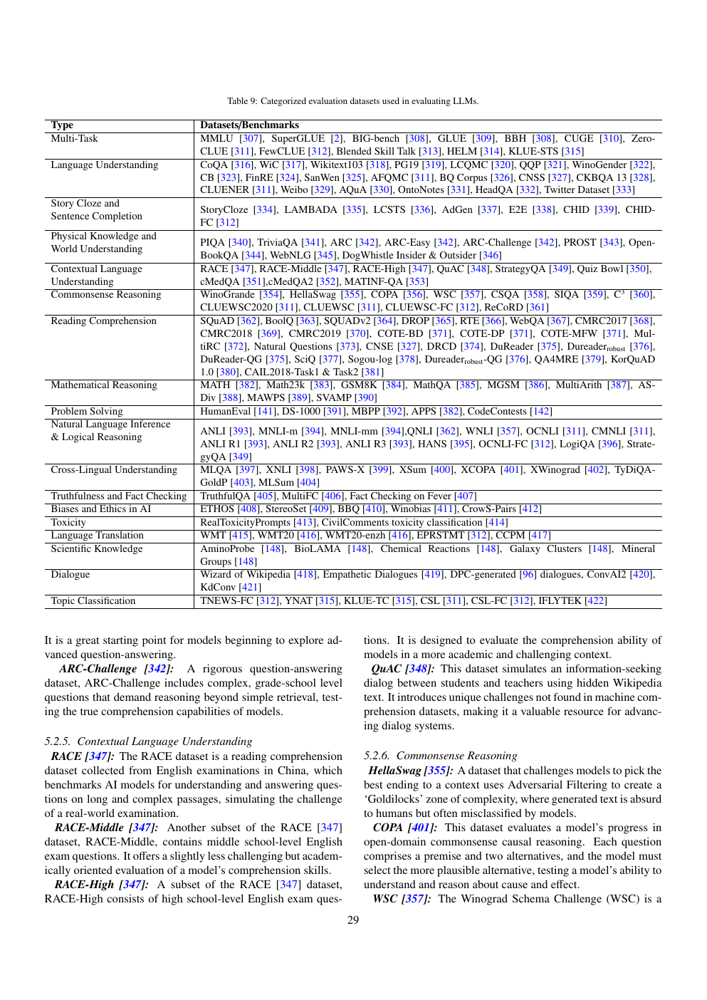

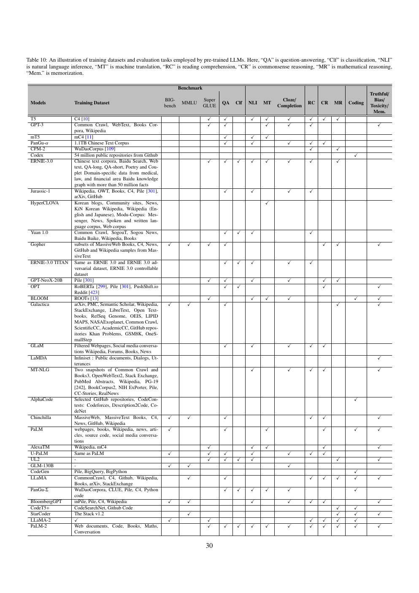

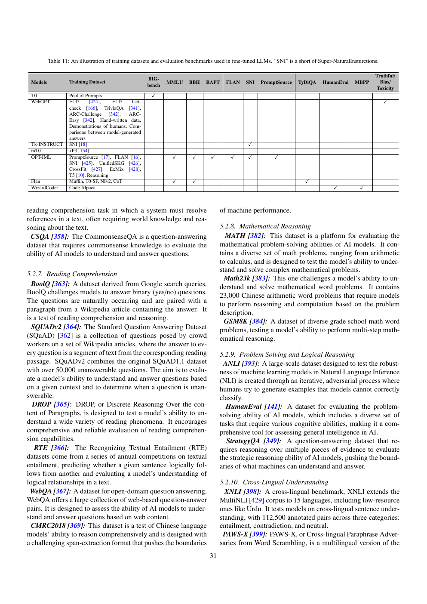

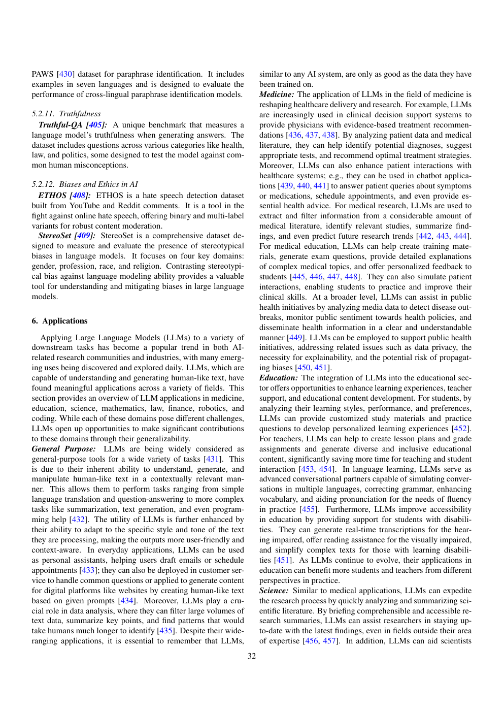

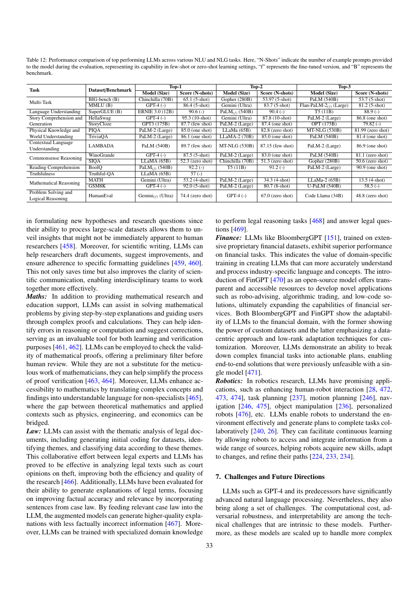

## 6 应用

大型语言模型可以理解、生成和操作具有人类风格的文本，因此被用于通用助手、医疗、教育、科学、数学、法律、金融、机器人和编程等领域。它们具有泛化能力，但每个领域仍需要专业数据、可靠评估和安全约束。

### 6.1 通用应用

大型语言模型能够完成翻译、问答、摘要、文本生成和编程辅助等任务。在日常应用中，它们可以起草邮件、安排日程、回答客户问题、生成网站内容，也能筛选海量文本、总结关键点和发现模式。然而，模型输出质量取决于训练数据，不能把通用能力等同于事实可靠性。

### 6.2 医疗

模型可以为临床决策提供基于证据的建议，分析患者资料与医学文献、提出潜在诊断、推荐检查和治疗方案；医疗聊天机器人可以回答症状和药物问题、安排预约并提供健康建议。模型还能提取和总结医学文献，生成教学材料、考试题和解释，模拟患者互动，帮助学生练习临床技能。公共卫生方面，模型可以分析媒体数据发现疫情、监测公众对政策的态度并传播健康信息，但必须处理隐私、可解释性和偏见风险。

### 6.3 教育

大型语言模型可以依据学生的学习风格、表现和偏好生成个性化材料与练习题，帮助教师制定课程计划、批改作业并生成多样化内容。在语言学习中，它们可以模拟多语言对话、纠正语法、扩充词汇和辅助发音；对残障学生，还可以生成实时转写、朗读辅助和简化文本。

### 6.4 科学与数学

模型能够快速分析和总结科学文献，帮助研究者跟踪最新发现；它们也可以提出假设和研究问题、起草论文、改进表达并遵循格式要求。数学应用包括逐步解释计算、检查证明、发现推理错误和把复杂概念翻译为非专家易懂的语言，但不能替代数学家的严谨验证。

### 6.5 法律与金融

在法律领域，模型可以对文书进行主题分析、识别主题、生成法律术语解释并结合判例提高事实准确性。金融模型如 BloombergGPT 利用专有金融语料提升行业任务，FinGPT 则强调开源、透明和低秩适配，可用于智能投顾、算法交易和低代码解决方案。

### 6.6 机器人与编程

机器人应用包括人机交互、任务规划、运动规划、导航、物体操作和个性化机器人。大型语言模型能够理解环境并生成合作计划，也可以访问外部信息持续学习。编程模型则可生成代码、修复错误、解释程序和完成竞赛题，但仍需测试、审计和人工复核。

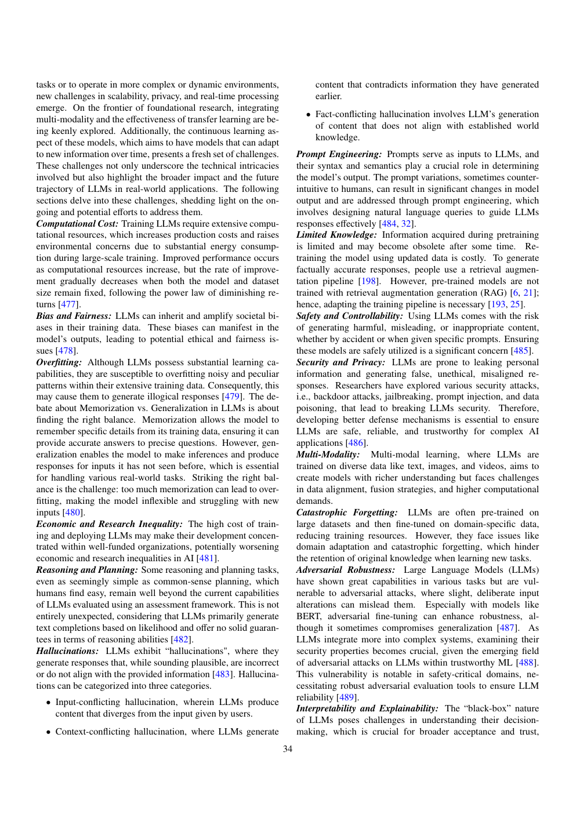

## 7 挑战与未来方向

GPT-4 及其前身显著推动了自然语言处理，但也带来计算成本、对抗鲁棒性、可解释性、可扩展性、隐私和实时处理等挑战。多模态整合、持续学习和迁移学习还处于快速发展阶段。

### 7.1 计算成本

训练大型语言模型需要大量计算资源，增加生产成本并带来能源消耗。固定模型和数据规模时，性能提升遵循收益递减的幂律，因此应研究更高效的架构、数据和训练策略。

### 7.2 偏见与公平

模型可能继承并放大训练数据中的社会偏见，使输出产生伦理和公平问题。需要更有代表性的数据、跨语言评估、偏见检测和可解释的缓解方法。

### 7.3 过拟合、记忆与泛化

大规模数据中噪声和特殊模式可能被模型过度记忆，造成不合逻辑回答。记忆有助于回答精确事实，但泛化能力决定模型能否处理未见输入；二者之间的平衡是重要研究问题。

### 7.4 推理与规划

即使是人类认为简单的常识规划，模型也可能失败。模型主要按概率生成文本，没有推理能力的形式化保证，因此需要更可靠的规划、验证、工具调用和环境反馈。

### 7.5 幻觉与提示工程

幻觉包括与用户输入冲突、与上下文中先前生成内容冲突，以及与世界知识冲突三类。提示的句法和语义会显著影响输出，提示工程需要设计清晰、稳定的自然语言查询，并结合检索、验证和自我纠错。

### 7.6 有限知识与安全可控性

预训练知识会过时，重新训练成本很高，因此需要检索增强。但预训练模型通常没有在检索增强生成流程中训练，适配训练管线仍是难点。模型可能生成有害、误导或不适当内容，需要安全对齐、红队测试、越狱防护和可控生成。

### 7.7 安全、隐私与对抗鲁棒性

模型可能泄露个人信息，产生错误或不对齐回答。后门攻击、越狱、提示注入和数据投毒都可能破坏安全，需要更强防御。轻微、刻意的输入修改也可能误导模型，尤其在安全关键领域必须建立系统化对抗评估。

### 7.8 多模态、灾难性遗忘与实时处理

多模态学习需要解决不同模态的数据对齐、融合策略和更高计算需求。领域微调可能导致模型忘记原有知识；大模型层数和参数量又会阻碍边缘设备上的实时处理。上下文保留和长文档处理仍可能出现不连贯或无关回答。

### 7.9 可解释性、隐私治理与监管

大型语言模型的黑箱性质使用户难以理解决策过程，降低敏感领域中的信任。训练数据记忆可能被攻击者利用来提取隐私。模型规模增长还加剧研究和经济不平等，需要监管、审计、责任分配和主动的伦理框架，确保模型在法律、技术和社会层面都稳健。

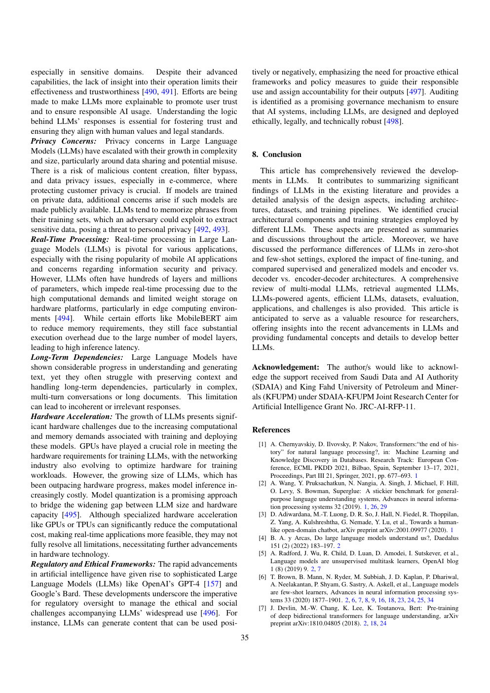

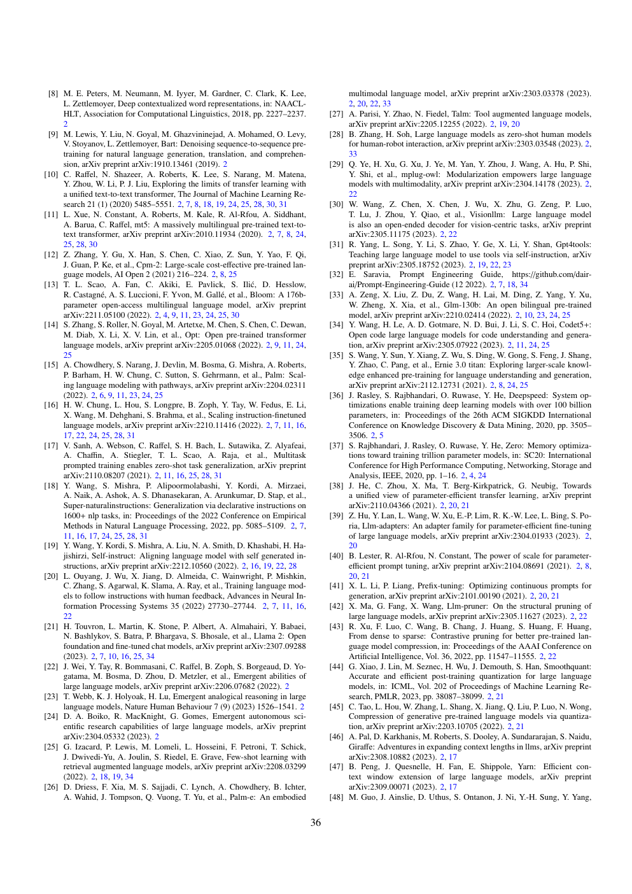

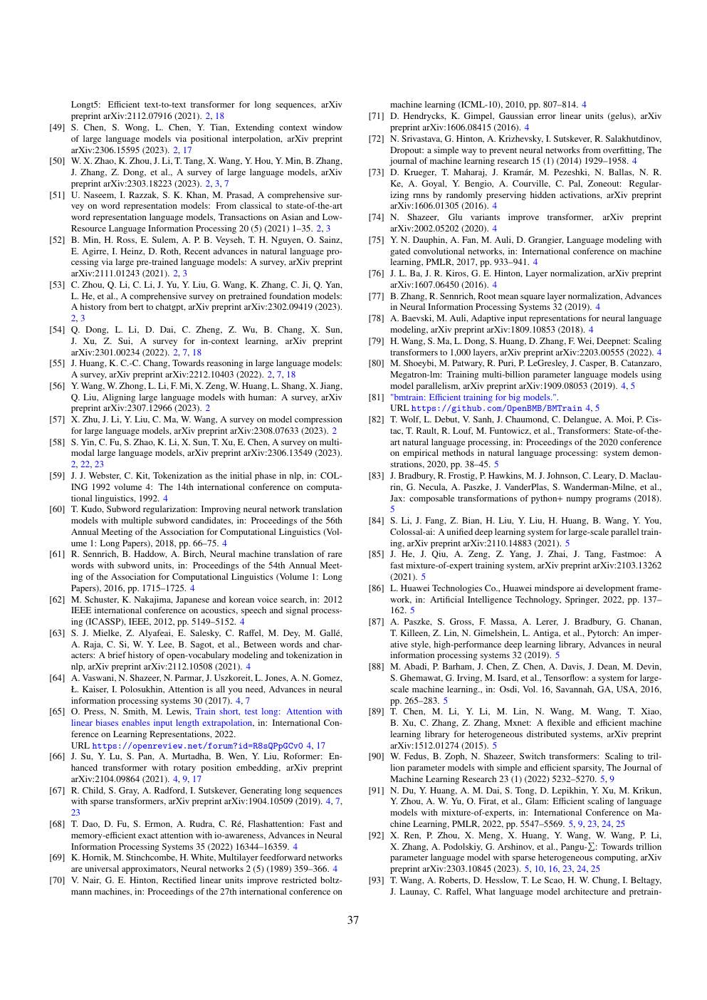

## 8 结论

本文全面回顾了大型语言模型的发展，系统总结架构、数据集和训练流程，分析不同模型的关键组件与训练策略，并讨论零样本、少样本、微调、监督模型与通用模型，以及编码器、解码器和编码器—解码器架构之间的差异。本文还综述多模态大型语言模型、检索增强模型、大型语言模型驱动智能体、高效模型、训练与评估数据集、应用和挑战。

作者希望这份概览能够帮助研究者了解大型语言模型的近期进展、掌握基础概念和设计细节，并进一步开发更强、更高效、更可靠的模型。

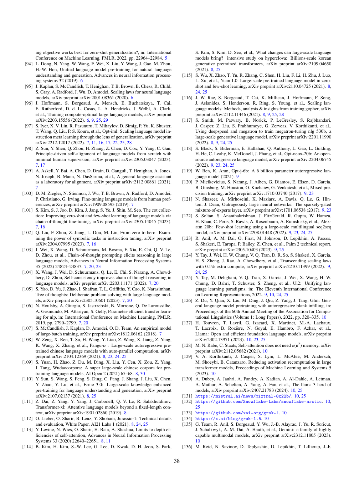

## 参考文献

参考文献和长表格按照原 PDF 第 39—47 页截图保留，确保作者、题名、出版信息、编号和链接完整。

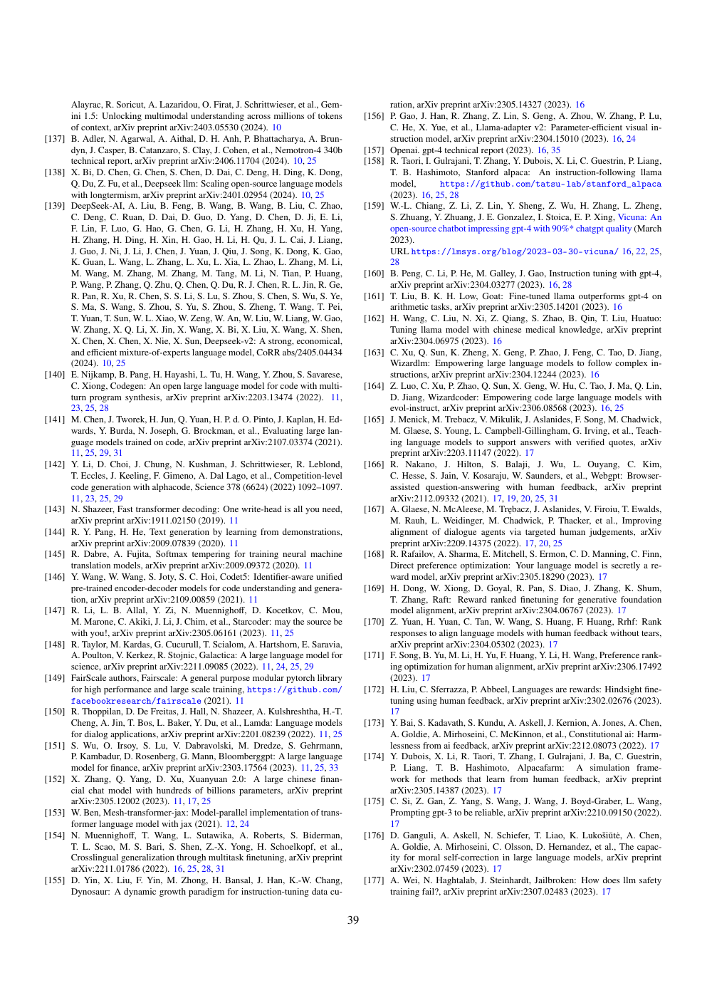

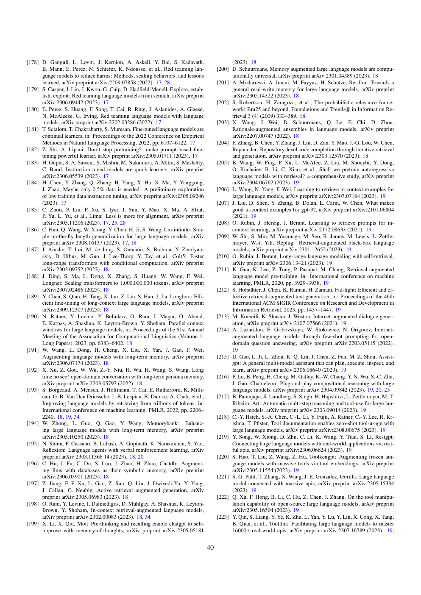

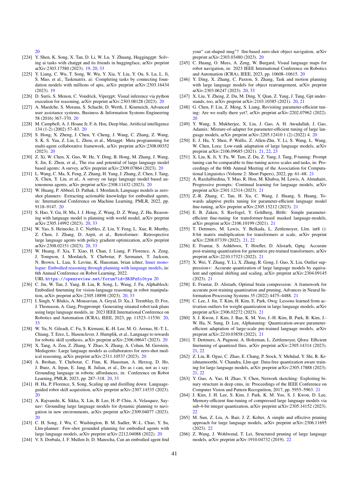

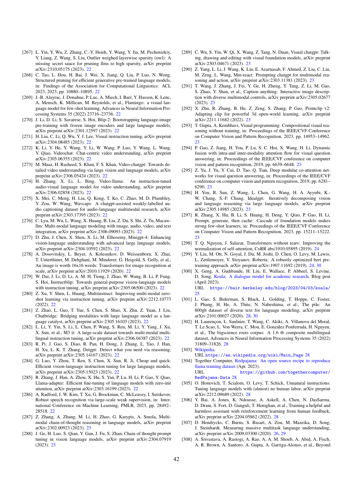

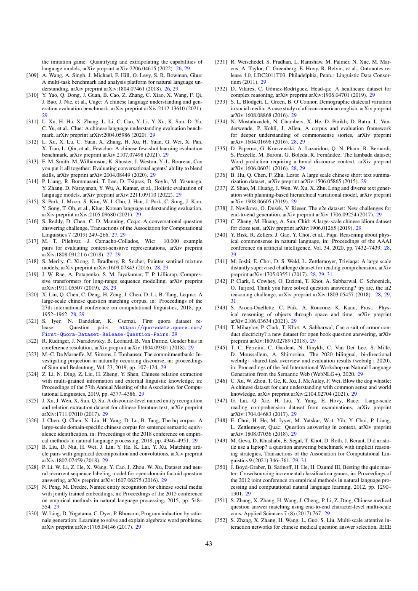

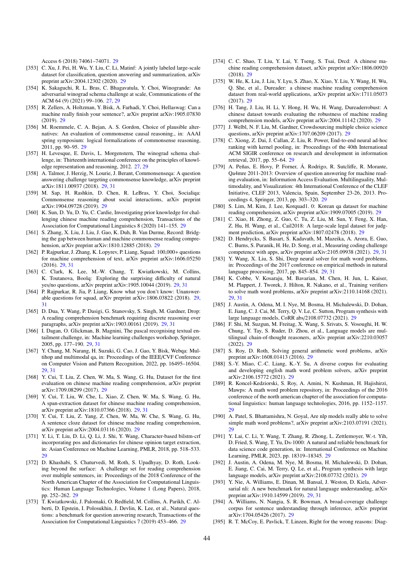

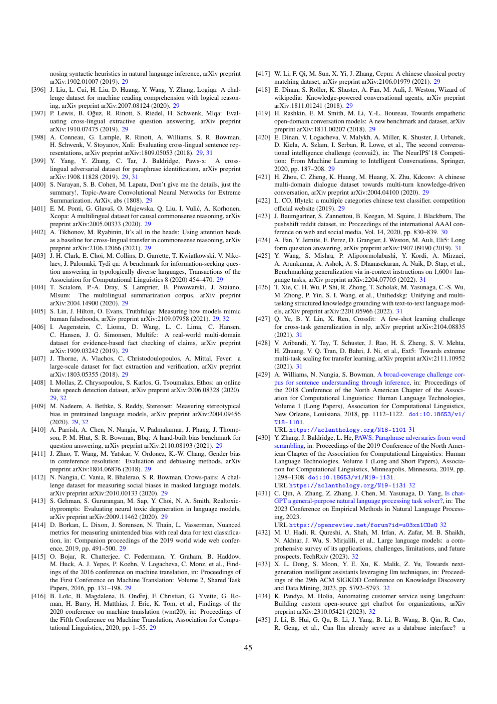

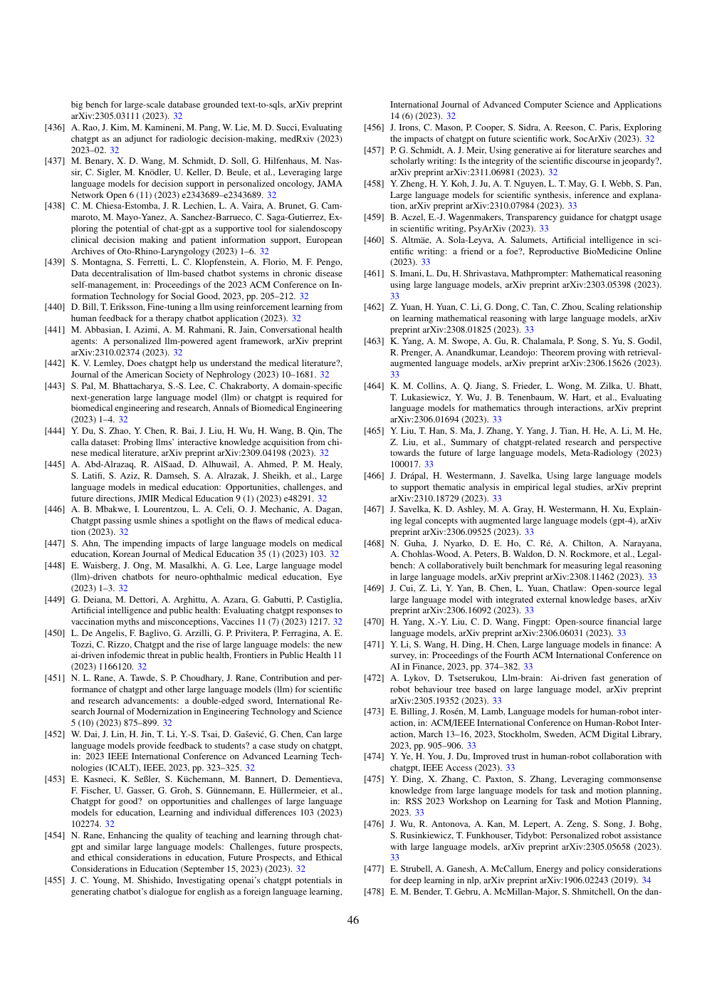

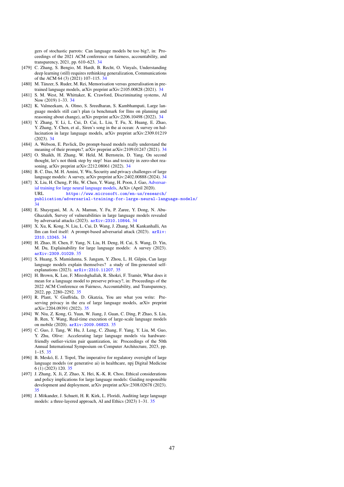
