# ChatGLM：从 GLM-130B 到 GLM-4 全工具的大型语言模型家族

**作者：** GLM 团队  
**机构：** 智谱 AI、清华大学

## 摘要

本文介绍不断演进的 ChatGLM 大型语言模型家族，重点是 GLM-4、GLM-4-Air 与 GLM-4-9B。这些模型汇集了前三代 ChatGLM 的经验和教训，是团队当时能力最强的模型。GLM-4 系列已在约 10 万亿个词元上预训练，语料以中文和英文为主，并包含来自 24 种语言的少量数据；对齐则主要面向中英文使用场景。高质量对齐通过多阶段后训练实现，包括监督微调和人类反馈学习。

评测显示，GLM-4 在 MMLU、GSM8K、MATH、BBH、GPQA、HumanEval 等通用指标上接近或超过 GPT-4；在 IFEval 衡量的指令遵循上接近 GPT-4 Turbo；在长上下文任务上与 GPT-4 Turbo 128K 和 Claude 3 相当；在 AlignBench 衡量的中文对齐上超过 GPT-4。

GLM-4 全工具版本经过进一步对齐，能够理解用户意图，自主决定何时以及使用哪些工具，包括网页浏览器、Python 解释器、文生图模型和用户定义函数，从而完成复杂任务。实际应用中，它在通过浏览器访问在线信息、使用 Python 解决数学问题等任务上可与 GPT-4 全工具版本相当，甚至超过后者。

团队先后开放 ChatGLM-6B 三代模型、GLM-4-9B 的 128K 与 1M 版本、GLM-4V-9B、WebGLM 和 CodeGeeX 等。仅 2023 年，这些模型在 Hugging Face 上下载量就超过 1000 万次。

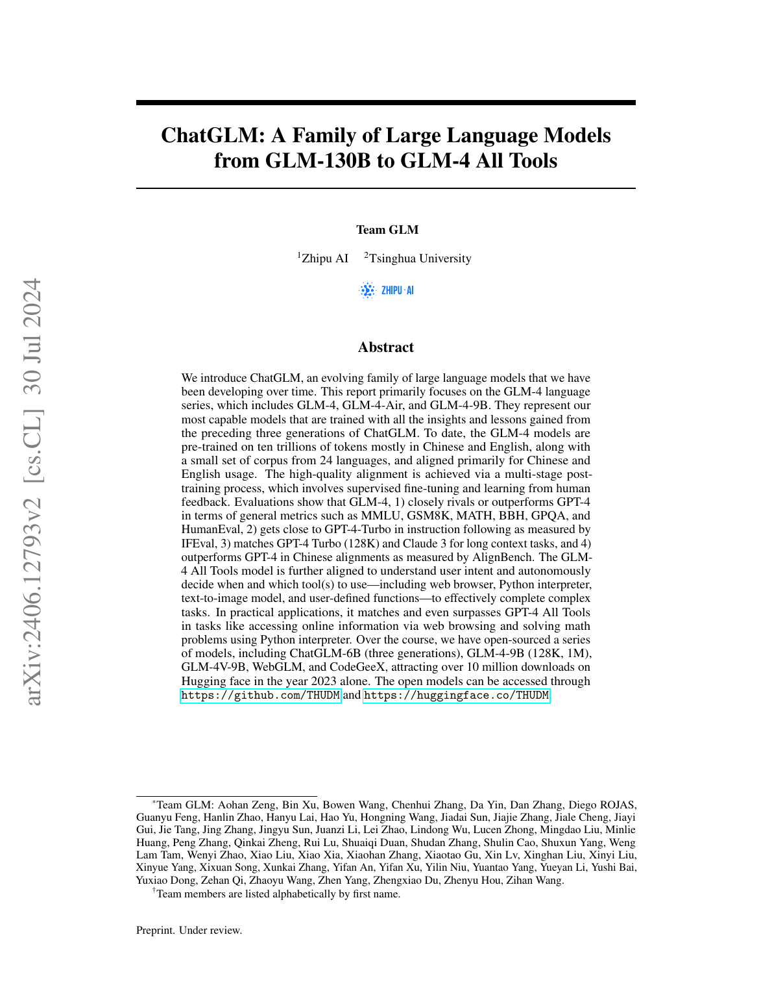

## 模型家族时间线

图 1 展示 GLM 语言、代码、视觉和智能体模型的发展历程：从 2021 年的 GLM、CogView，到 2022 年的 GLM-130B、CodeGeeX、CogView2、CogVideo，再到 2023 年的 ChatGLM、ChatGLM2、ChatGLM3、CodeGeeX2、WebGLM、CogVLM、CogAgent，最终发展到 2024 年的 GLM-4、GLM-4-Air、GLM-4-9B、GLM-4V-9B、CogVLM2 与 AutoWebGLM。本文重点讨论语言模型 ChatGLM。

## 1 引言

大型语言模型发展极为迅速。以 OpenAI GPT 系列为例，2020 年发布的 GPT-3 从 GPT-1 的 1.17 亿参数和 GPT-2 的 15 亿参数，跃升到 1750 亿参数。这一规模扩展使仅解码器 Transformer 的 GPT-3 获得上下文学习和通用能力。随后，GPT-3.5 系列通过指令调优、监督微调和人类反馈强化学习进一步改进。如今，这套流程已成为构建高性能 LLM 的标准做法，PaLM、LLaMA、Gemini 等模型都采用了类似路径。

在主流 LLM 发展路线之外，我们提出通用语言模型（GLM）架构，其特点是自回归空白填充目标，并于 2021 年开放 GLM-10B。2021 年末开始预训练 GLM-130B，目标是训练千亿级模型，在性能上达到或超过 GPT-3 davinci，同时验证在这一规模上成功训练模型的技术。同期也有 OPT-175B、BLOOM-176B 等项目。GLM-130B 于 2022 年 7 月完成 4000 亿词元训练与评测，8 月开放模型与预训练细节。2022 年 11 月的 HELM 结果显示，GLM-130B 在多个维度与 GPT-3 davinci 相当。

之后，团队开始对 GLM-130B 进行指令调优。ChatGPT 又推动团队使用 SFT 与 RLHF 对齐基础模型。团队从零构建提示—回答对并进行 SFT，同时研究如何有效应用 RLHF。2023 年 3 月 14 日，对齐后的 ChatGLM-130B 在 chatglm.cn 上线。

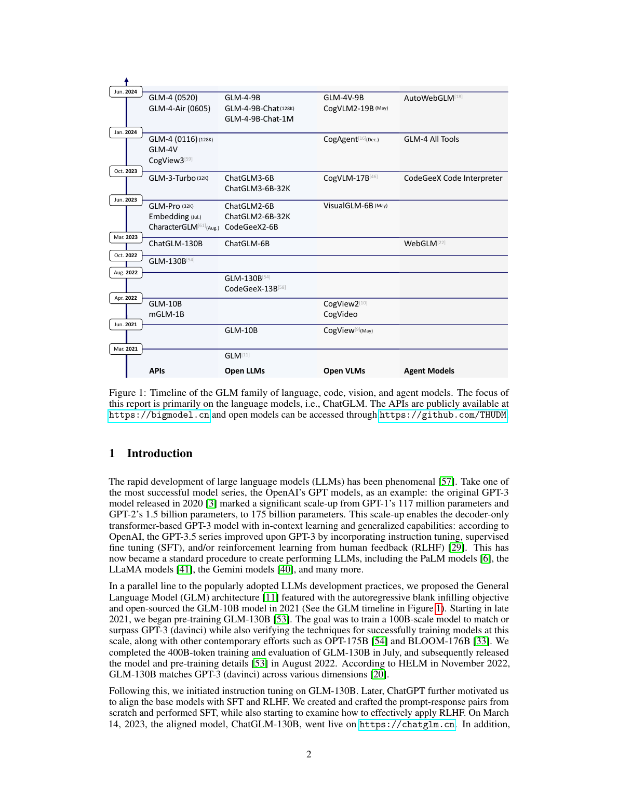

同一天还开放了更小的 ChatGLM-6B，受到的关注远超预期。它具有 62 亿参数，目的有二：快速迭代预训练、后训练和数据选择技术；通过 INT4 量化在消费级显卡上本地部署。此后，团队迅速探索并改进预训练与对齐技术，每隔约三个月推出第二、第三代 ChatGLM，且两代都完全从零预训练。

ChatGLM-6B 在约 1 万亿个中英文词元上预训练，上下文长度为 2K，后续主要通过 SFT 增强。2023 年 6 月发布的 ChatGLM2-6B 使用更多高质量数据进行预训练与对齐，相比上一代，MMLU 提升 23%，GSM8K 提升 571%，BBH 提升 60%。FlashAttention 把上下文扩展到 32K，多查询注意力又将推理速度提高 42%。

第二代代码模型 CodeGeeX2-6B 额外使用 6000 亿代码词元预训练。HumanEval-X 的 Pass@1 相比第一代 CodeGeeX-13B，在 Python、C++、Java、JavaScript、Go 上分别提高 57%、71%、54%、83% 和 56%。CharacterGLM 则针对角色对话进行适配，使 LLM 能安全、有效地定制角色。

通过更丰富的数据、更充分的训练步数和更优化的训练策略，ChatGLM3-6B 在语义、数学、推理、代码和知识等 42 项基准上取得领先。从这一代开始，ChatGLM 还支持函数调用、代码解释器和复杂智能体任务。在整个过程中，团队也开发了 1.5B、3B、12B、32B、66B 和 130B 等不同规模模型，以验证观察并建立自己的缩放定律。

积累这些经验后，团队启动 GLM-4 训练。第一个截止检查点接受多阶段后训练，包括 SFT、RLHF 和安全对齐，现阶段重点面向中英文。随后形成两个支持 128K 上下文的版本：GLM-4 与 GLM-4 全工具。GLM-4 0116 自 2024 年 1 月 16 日起通过 API 提供；全工具版本则可在网页和移动应用中使用，并支持用户创建自己的智能体 GLMs。

后续版本为 GLM-4 0520 与 GLM-4-Air 0605，预训练和对齐均有升级。GLM-4-Air 以更低延迟与推理成本达到接近 GLM-4 0116 的表现。评测覆盖英文通用能力、中英文指令遵循、中文对齐、长上下文与智能体能力。

图 2 的示例要求搜索 2000 至 2023 年全球人口并计算年均增长率。GLM-4 全工具先用浏览器搜索并汇总人口数据，再生成并执行 Python 代码计算复合年增长率，最终得到约 1.18%。

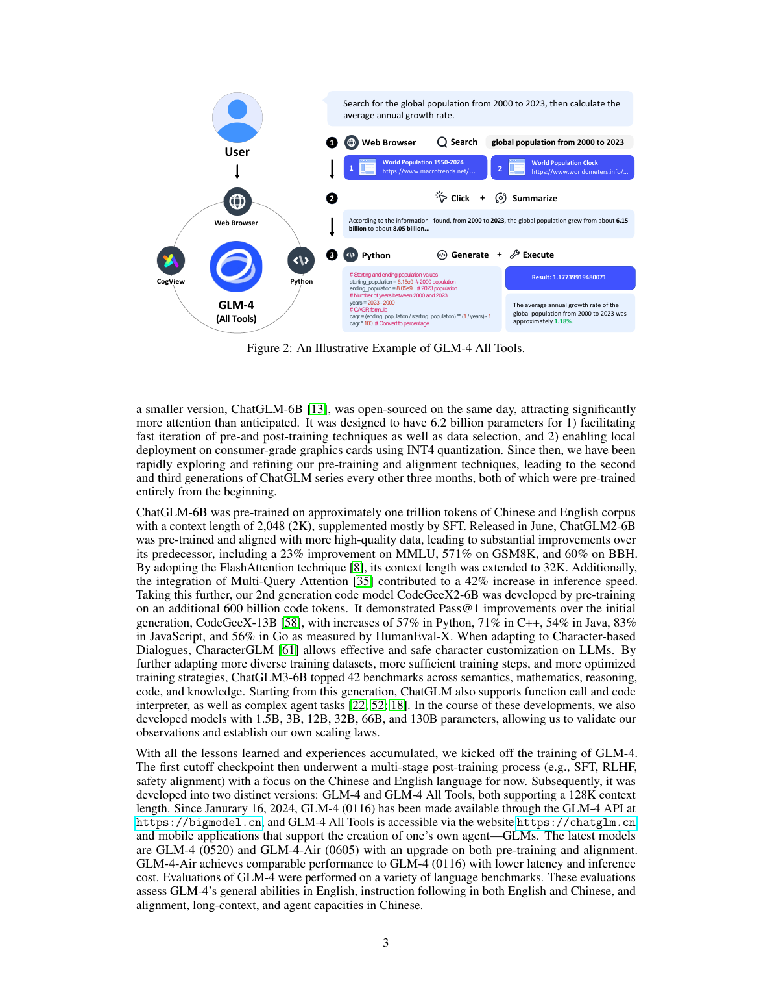

在常用英文基准 MMLU、GSM8K、MATH、BBH、GPQA 和 HumanEval 上，GLM-4 0520 与 GPT-4 0613、Gemini 1.5 Pro 很接近。例如 MMLU 分别为 83.3、86.4 与 83.7。IFEval 显示，GLM-4 在中英文提示级和指令级遵循能力上约等于 GPT-4 Turbo。AlignBench 的八个中文对齐维度中，GLM-4 超过 GPT-4，并与 GPT-4 Turbo 相当。LongBench-Chat 上，GLM-4 128K 与 GPT-4 Turbo、Claude 3 Opus 相当，得分分别为 87.3、87.2、87.7。

GLM-4 全工具经过专项对齐，可以更好理解用户意图，自主选择合适工具：多轮浏览网页、用 Python 解释器解决数学题、调用文生图模型生成图像，以及调用用户定义函数。团队实测表明，它在常见任务上不仅与 GPT-4 全工具相当，而且经常更强。

继三代 ChatGLM-6B 后，团队还开放 GLM-4-9B 的 128K 和 1M 上下文版本。GLM-4-9B 在约 10 万亿个多语言词元上预训练，预训练上下文为 8K，使用与 GLM-4 0520 相同的后训练流程和数据。它以更少计算超过 Llama 3 8B，并支持 GLM-4 全工具的全部功能。实验版本 GLM-4-9B-Chat-1M 支持 100 万词元上下文，约等于 200 万个中文字符。

表 1 展示 ChatGLM-6B 三代与 GLM-4-9B 的持续进步。例如 MMLU 从 25.2 提升至 45.2、61.4、74.7；GSM8K 从 1.5 提升至 25.9、72.3、84.0；HumanEval 从 0 提升至 9.8、58.5、70.1。

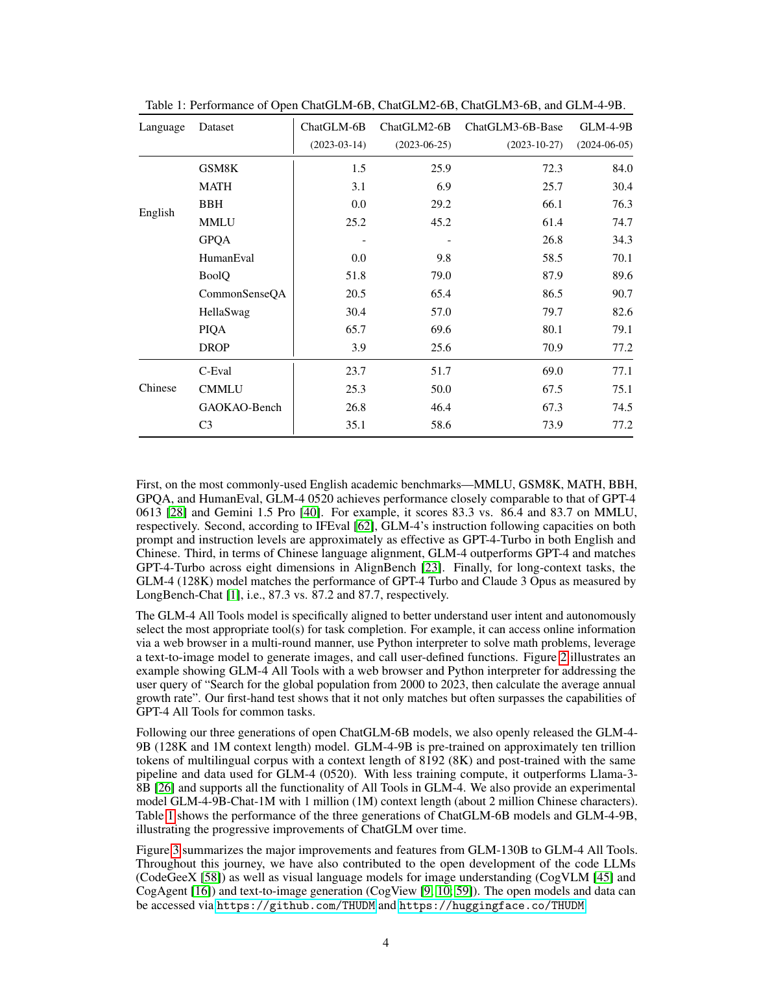

图 3 概括从 GLM-130B 到 GLM-4 全工具的关键变化：第一代 ChatGLM 面向人类意图对齐；ChatGLM2 使用更优架构和 32K 上下文；ChatGLM3 原生支持智能体与函数调用；GLM-4 全工具具备强大智能体和 128K 上下文，并实验性支持 1M 上下文和视觉。

## 2 ChatGLM 技术

本节介绍 ChatGLM 采用和开发的预训练、后训练技术，包括模型架构、预训练数据、对齐和全工具能力。各项主要技术另有详细报告。

### 2.1 预训练数据

预训练语料来自网页、维基百科、图书、代码、研究论文等多种来源，包含多语言文档，以英文和中文为主。处理流水线主要分为去重、过滤和分词三阶段。

去重通过精确与模糊方法删除重复或相似文档，增加数据多样性；网页过滤删除包含攻击性语言、占位文本、源代码等噪声文档，提高质量；分词把文本转换为词元序列。词元数量直接影响训练速度，因此使用字节级 BPE 分别学习中文与多语言词元，再与 tiktoken 中 `cl100k_base` 的词元合并为 15 万大小的统一词表。最终训练集重新调整来源权重，提高图书、维基百科等高质量教育来源的重要性，总规模约 10 万亿词元。

四代 ChatGLM 的经验与已有研究一致：数据质量和多样性对有效 LLM 至关重要。团队虽积累了许多经验性教训与洞见，但尚未找到可从根本上指导数据收集、清洗和选择的原则，这仍是未来研究方向。

### 2.2 架构

GLM 系列建立在 Transformer 上。GLM-130B 在当时硬件限制下探索了多种稳定预训练的方案，使用 DeepNorm 作为层归一化策略，并在 FFN 中使用 RoPE 与采用 GeLU 激活的门控线性单元。后续不断探索提高性能和推理效率的策略，GLM-4 使用以下设计：

- **除 QKV 外不使用偏置：** 为提高训练速度，除注意力层查询、键和值矩阵外删除全部偏置，并观察到长度外推略有改善。
- **RMSNorm 与 SwiGLU：** 分别替换 LayerNorm 与 ReLU，带来更好性能。
- **旋转位置编码：** 把 RoPE 扩展为二维形式，以适配 GLM 的二维位置编码。
- **分组查询注意力：** 用 GQA 替代 MHA，减少推理 KV 缓存。GQA 参数更少，因此增加 FFN 参数量以维持模型总规模，把 FFN 维度设为隐藏维度的 $10/3$。

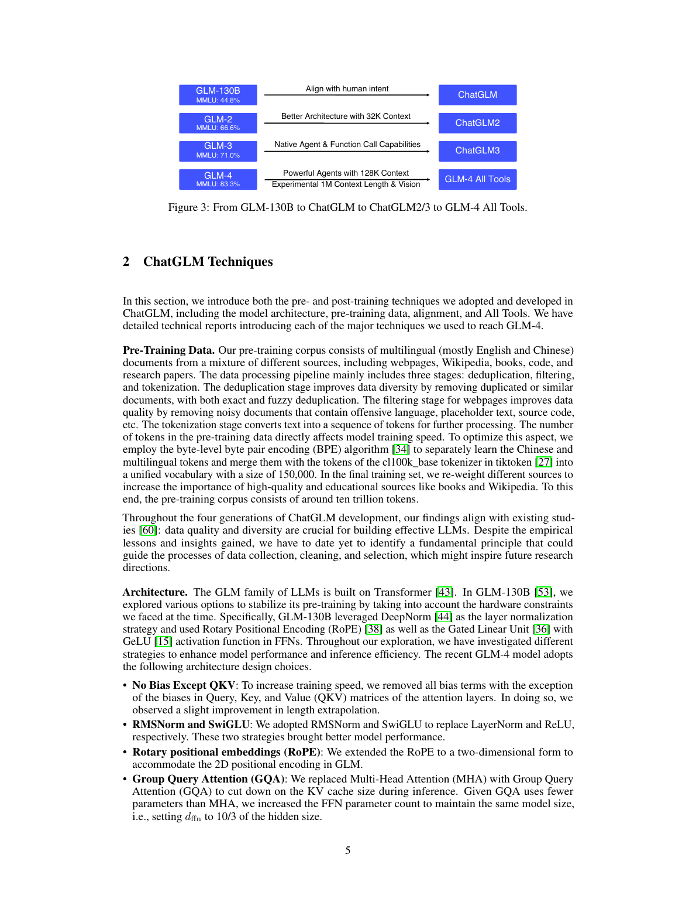

上下文长度从 ChatGLM 的 2K 扩展到 ChatGLM2/3 的 32K，再扩展到 GLM-4 的 128K 和 1M。这不仅依靠位置编码扩展和长文本继续训练，也包括长上下文对齐，使 GLM-4 能有效处理超长内容。

### 2.3 对齐

预训练奠定 LLM 基础，后训练则进一步使模型符合人类偏好，包括理解意图、遵循指令和进行多轮对话。GLM-4 主要使用 SFT 与 RLHF 完成对齐。SFT 中，真实人类提示与交互比模板式或模型生成回答更能决定对齐质量。SFT 已能让基础模型大体对齐人类偏好，RLHF 则进一步缓解拒答、安全、中英文词元混杂、多轮连贯性等问题。

第一代 ChatGLM-6B 和 ChatGLM-130B 的提示—回答对大多由模型开发者标注。后续模型的对齐数据由内部标注与第三方专有数据组成，并接受严格质量控制。标注员从安全性、事实性、相关性、有用性和人类偏好等多个维度为模型回答打分。

### 2.4 ChatGLM 专项技术

- **LLM 涌现能力：** 研究预训练损失与下游任务表现的关系，发现预训练损失相同时，不同模型规模和训练词元数会产生相同的下游表现；MMLU、GSM8K 等任务只有在损失低于某个阈值后才超过随机水平，因此把涌现能力重新定义为由更低预训练损失模型表现出的能力。
- **LongAlign：** 提供完整长上下文对齐方案，使 GLM-4 可处理最长 128K 内容，表现与 Claude 2、GPT-4 Turbo 1106 相当。
- **ChatGLM-Math：** 使用自我批评而非外部模型或人工标注选择数据，提高数学解题能力。
- **ChatGLM-RLHF：** 总结把 PPO 与 DPO 应用于 LLM 的实践。
- **Self-Contrast：** 无需昂贵人工偏好数据的对齐策略，由目标 LLM 自行生成大量负样本用于 RLHF。
- **AgentTuning：** 通过 AgentInstruct 指令数据集训练智能体，数据包含智能体与环境之间的高质量交互轨迹。
- **APAR：** 面向层级结构回答的自动并行自回归生成方法，通过指令调优让 LLM 规划并并行执行生成过程，提高推理速度。
- **开放基准：** AgentBench 评估智能体，LongBench 评估长上下文，AlignBench 衡量中文对齐，HumanEval-X 扩展多语言代码评测，NaturalCodeBench 衡量实用编程任务能力。

### 2.5 GLM-4 全工具

GLM-4 与全工具版本均使用上述技术训练和对齐。全工具版本进一步面向智能体任务，能够自主理解用户意图、规划复杂指令并调用一个或多个工具，例如网页浏览器、Python 解释器与文生图模型。

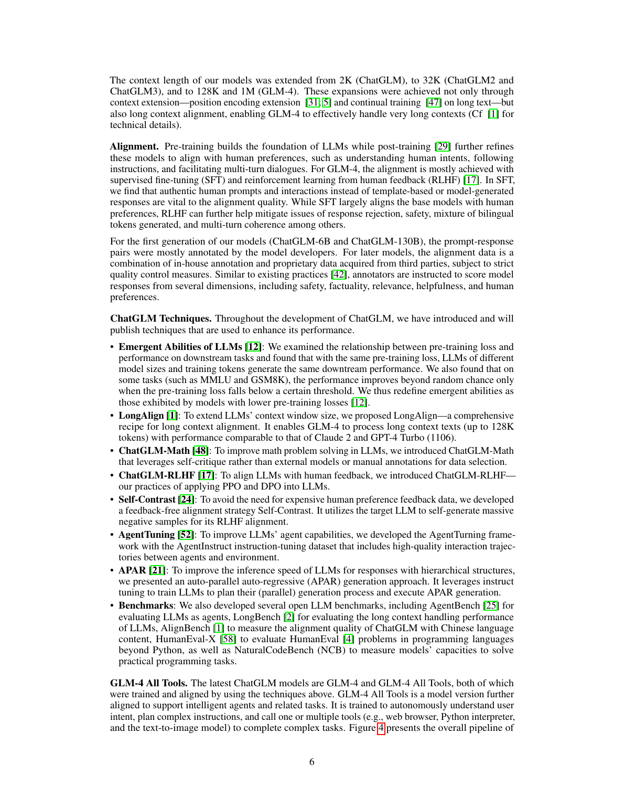

图 4 展示全工具系统。当用户提出复杂请求时，模型先分析任务并逐步规划解法；若判断自己无法独立完成，就按顺序调用一个或多个外部工具，并利用中间反馈和结果继续求解。基于 GLM-4 的全工具能力，团队还开发 GLMs 应用平台，让用户为具体任务创建并定制自己的智能体。除内置 Python、浏览器和文生图外，GLMs 还支持用户定义函数、API 与外部知识库。

## 3 GLM-4 能力

评测从多个角度考察 GLM-4：学术基准基础能力、代码问题解决、中英文指令遵循与长上下文、英文智能体能力、中文对齐。GLM-4 主要使用中英文预训练，并以中文对齐为主。本节主要报告 GLM-4 0520 和 GLM-4-Air 0605；0520 在各项基准上略优于原始 0116。两者均以 BFloat16 部署。基线包括 GPT-4、GPT-4 Turbo、Claude 2、Claude 3 Opus 与 Gemini 1.5 Pro，结果取自技术报告或公开 API 实测。

整体而言，GLM-4 在标准基准、指令遵循、长上下文、代码解题和英文智能体上接近 GPT-4 Turbo、Gemini 1.5 Pro、Claude 3 Opus。中文对齐方面，它在基础语言、高级中文理解、专业知识和开放问答等领域表现强劲，是中文任务上最好的模型之一。中文数学与逻辑推理能力可与 GPT-4、Claude 3 Opus 相比，但仍落后于 GPT-4 Turbo。

### 3.1 学术基准评测

基础模型使用六项常用基准：

- **MMLU：** 数学、历史、计算机科学等考试中的多项选择题，模型从给出的答案中选择字母。
- **GSM8K：** 8500 道小学数学应用题，测试集 1000 道，使用思维链提示。
- **MATH：** 12,500 道高难度竞赛数学题，测试集 5000 道，使用思维链提示。
- **BBH：** 23 项高难度 BIG-Bench 任务，使用思维链提示。
- **GPQA：** 生物、化学、物理的研究生级多项选择基准。
- **HumanEval：** 以自动测试用例检查合成函数正确性的代码基准。

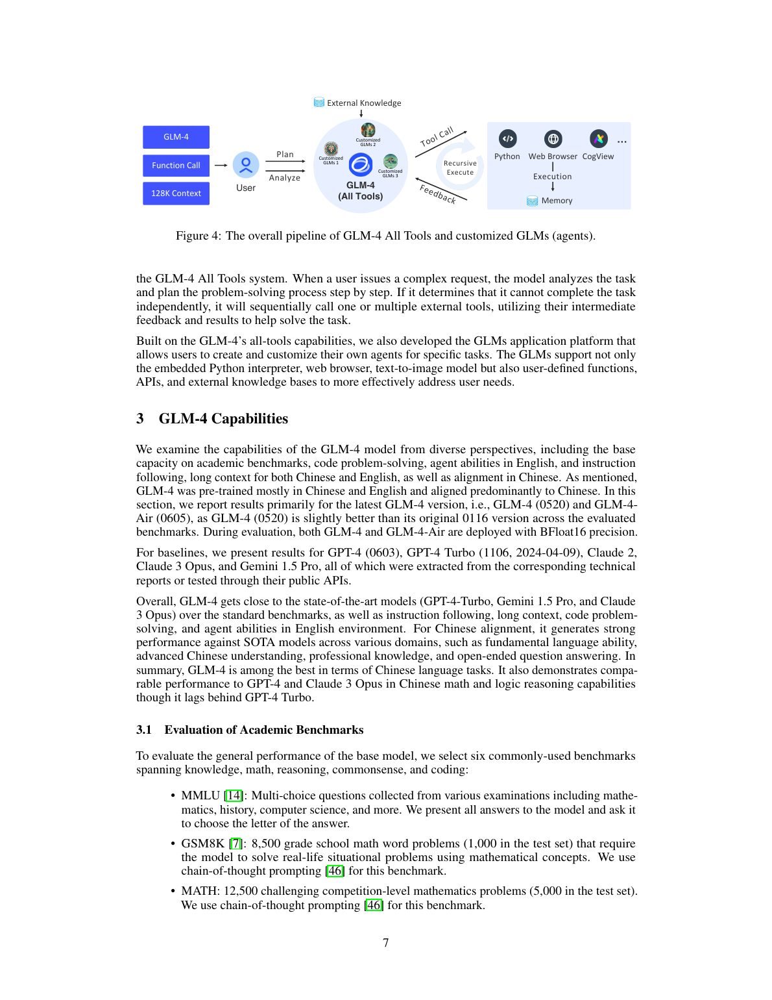

表 2 显示，GLM-4 在 MMLU 上达到 GPT-4 准确率的 96.3%，并在其他列出的学术基准上超过原版 GPT-4。GLM-4 0520 在 MMLU、GSM8K、MATH、BBH、GPQA、HumanEval 上分别为 83.3、93.3、61.3、84.7、39.9、78.5，基础能力整体接近 GPT-4 Turbo 与 Claude 3 Opus。

### 3.2 指令遵循评测

使用 IFEval 评测。数据集包含 541 条提示，来自 25 种可通过明确标准验证的指令，例如要求邮件以指定句子结尾，可以直接通过字符串匹配检查。按照原方法计算严格模式与宽松模式下的提示级、指令级准确率。

为了评价中文指令遵循，作者把原始提示翻译为中文，删除不适用于中文的指令，例如大小写要求，并调整评分脚本。宽松模式下，GLM-4 的中英文指令级准确率与 GPT-4 Turbo 相当；严格模式下，中英文分别达到 GPT-4 Turbo 2024-04-09 的 99.0% 和 98.6%。

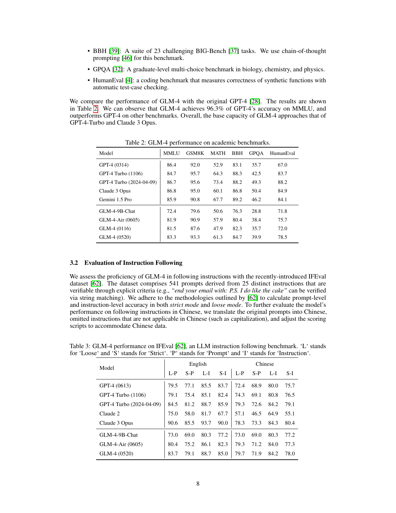

### 3.3 对齐评测

AlignBench 使用“LLM 作为裁判”的自动方法评估中文语境中的对齐。它包含 683 条查询，覆盖八个类别，以 GPT-4 为基础，使用多维规则校准、逐点评分和参考答案。实验采用 AlignBench v1.1，该版本改进了参考答案生成质量；知识类问题占总查询 66.5%，并增加人工从网页收集、带 URL 的证据。几乎所有 LLM 在此版本上的得分都低于旧版。

结果显示，GLM-4 0520 总分 8.00，整体超过 GPT-4 Turbo 1106、Claude 3 Opus 与 Gemini 1.5 Pro，在所列基线中并列最高。它在中文逻辑推理和语言理解上明显超过其他强模型，体现了对中文语言与知识的良好掌握。与 GPT-4 Turbo 2024-04-09 的主要差距在数学维度。团队正使用 ChatGLM-Math 的自我批评等技术持续增强数学推理。

### 3.4 长上下文处理评测

LongBench-Chat 的上下文长度为 10K 至 100K，覆盖文档问答、摘要、代码等常见长文本场景。为细致比较不同语言表现，数据按中英文分为两部分。模型输出由 GPT-4 评分，使用少样本策略；为减少分数波动并得到更可靠的统计结论，实验重复多次并报告均值。

结果清楚显示：英文提示上，GLM-4 0520 得分 87.3，与 GPT-4 Turbo 1106 的 87.2 和 Claude 3 Opus 的 87.7 相当；中文提示上，GLM-4 得分 84.0，超过表中最佳闭源基线 Claude 3 Opus 的 82.7。

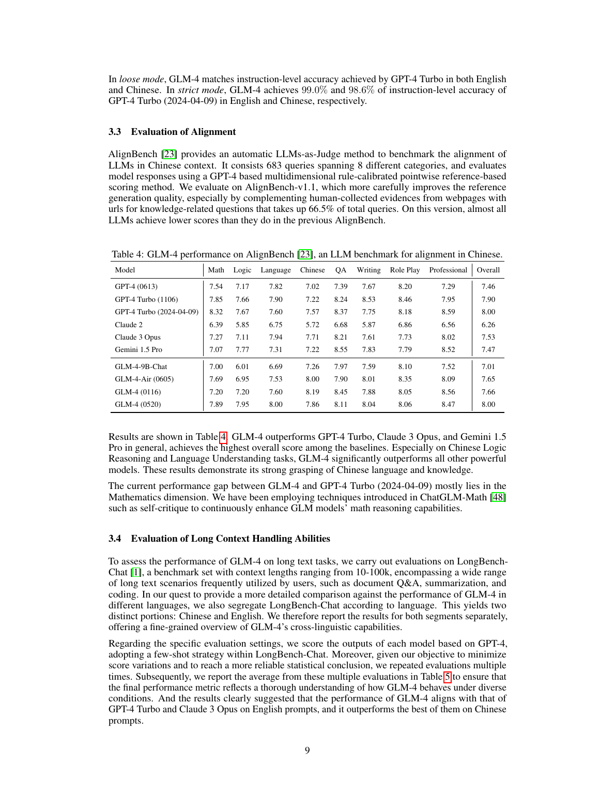

### 3.5 真实用户提示的代码能力

HumanEval 大多是入门算法题，而真实用户为完成日常工作提出的问题往往复杂得多。以往研究还报告 HumanEval 污染问题，使其结果可信度降低。因此，除 HumanEval 外，本文还使用 NaturalCodeBench：一个来自真实用户提示的高难度双语代码基准，更接近现实任务复杂度。

结果显示，GLM-4 在真实场景中的代码表现接近 Claude 3 Opus。与 GPT-4 系列仍有差距，但考虑到 GLM-4 的双语均衡特点，未来通过更好训练策略和数据整理，NCB 表现仍有较大提升潜力。GLM-4 0520 在英文 Python、英文 Java、中文 Python、中文 Java 上分别为 51.6、42.8、45.4、48.9，总分 47.1。

### 3.6 函数调用评测

函数调用使用 Berkeley Function Call Leaderboard，包含 2000 组问题—函数—答案。基准从三方面评价：抽象语法树（AST）检查、实际执行 API、相关性检测。第一类使用 AST 把输出函数与函数文档及可能答案比较；第二类执行生成的函数调用并检查结果；第三类评估模型能否识别不适合回答用户问题的函数。

GLM-4 0520 的函数调用能力与 GPT-4 Turbo 2024-04-09 相当，GLM-4-9B-Chat 明显超过 Llama 3 8B Instruct。总体准确率并不随模型增大而必然提高，9B 甚至能超过 GLM-4-Air；但反映真实 API 执行结果的执行汇总成绩会随模型规模平稳提高。

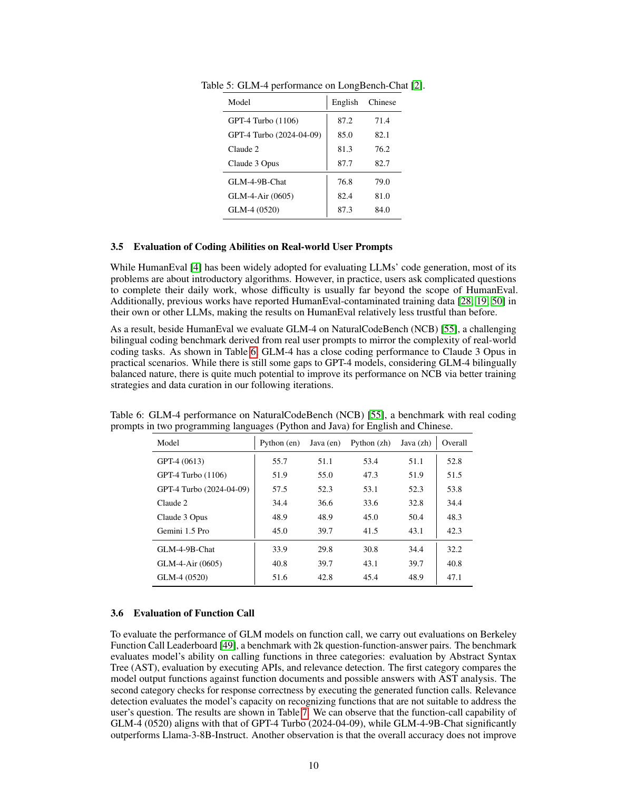

### 3.7 智能体能力评测

LLM 可在不同环境中作为智能体。实验使用 AgentBench，从代码、游戏、网页等实际环境综合评估文本 LLM。八个环境中排除交互耗时过长的数字卡牌游戏，评测其余七项，并使用 AgentBench 原始数据集权重计算总分。

GLM-4 智能体表现很强：GLM-4-Air 与 GPT-4 Turbo、Claude 3 Opus 相当，GLM-4 0520 总分 3.79，超过列出的对手。具体环境中，GLM-4 在数据库、家务管理和网页购物任务上尤其突出；在操作系统、知识图谱和横向思维谜题上仍落后于 GPT-4 系列。这说明代码相关智能体任务和高交互语言任务仍有提升空间。

### 3.8 全工具评测

GLM-4 进一步对齐后，可在 chatglm.cn 支持智能体与用户配置的 GLMs。它能自主理解意图、逐步规划并调用浏览器、Python 解释器、CogView3 等多个工具。表 9 显示，全工具版本在 Python 解决数学题和浏览器信息检索方面与 ChatGPT-4 Web 相近：GSM8K 为 91.59 对 92.72，MATH 为 63.60 对 65.00，Math23K 为 88.50 对 88.40；信息检索则以 78.08 超过 67.12。

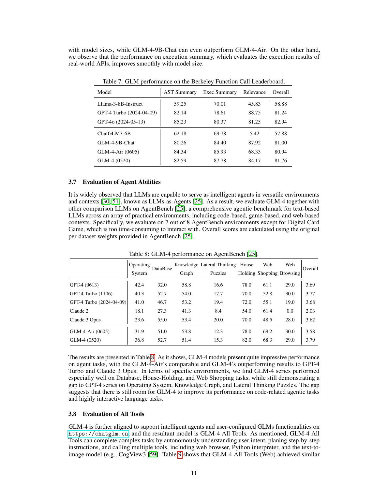

## 4 安全与风险

团队致力于让 GLM-4 成为安全、负责且无偏的模型。除了常见伦理与公平问题，也谨慎评估并缓解模型在真实情境中可能对用户造成的伤害。

### 4.1 风险缓解

预训练阶段通过删除含敏感关键词的文本和预定义黑名单网页清洗数据。对齐阶段逐条评估训练样本安全性，删除存在潜在风险的样本；在比较多个模型输出进行偏好对齐时，无害性也是重要标准。

红队持续用容易诱发不安全回答的棘手问题挑战模型。团队收集 GLM-4 的有害问答，再由人工标注改进，用于后续模型对齐。

### 4.2 安全评测

SafetyBench 从七个维度评价模型：伦理道德、违法活动、心理健康、冒犯性、身体健康、隐私与财产、不公平与偏见。实验使用中文子集，并删除容易因不同 API 安全策略而被审查的高度敏感问题，以减小干扰。

结果显示，GLM-4 0520 在多数维度具备有竞争力的安全表现，总体 87.2，与 Claude 3 Opus 的 87.5 相当。它略低于 GPT-4 系列，尤其是身体健康维度；该维度需要可靠的物理世界常识来避免潜在风险。团队已投入更多工作来开发能力更强、更安全的 GLM。

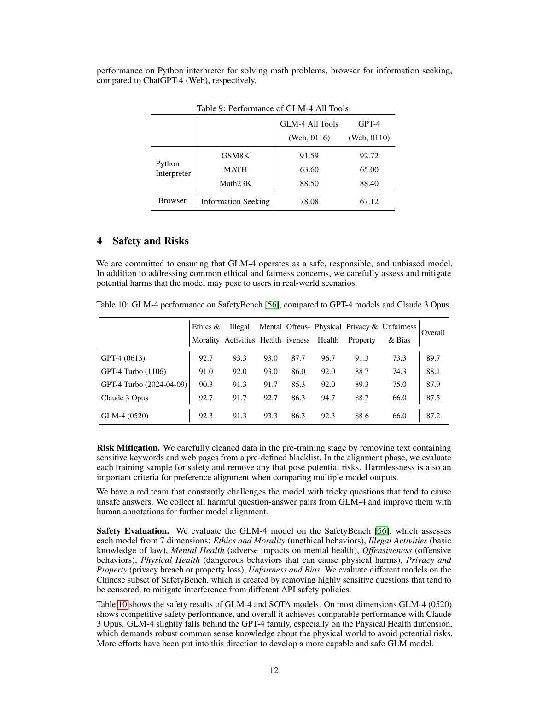

## 5 结论

本文介绍从 GLM-130B 到 GLM-4 全工具的 ChatGLM 大型语言模型家族。过去一年半中，团队从第一手实践出发，对 LLM 的多个方面取得了长足认识。随着每一代模型发展，预训练和对齐策略都变得更有效、更高效。

GLM-4 0116、0520、GLM-4-Air 0605 和 GLM-4 全工具在理解与执行复杂任务方面取得显著进步，能够自主使用外部工具与函数。它们在部分任务上达到或超过 GPT-4 Turbo、Claude 3 Opus、Gemini 1.5 Pro，尤其擅长中文相关任务。

团队还通过开放整个历程中的模型权重与技术，推动 LLM 的可访问性和安全性。语言、代码和视觉开放模型仅在 2023 年就在 Hugging Face 上取得超过 1000 万次下载。团队正利用迄今积累的全部经验开发更强模型；未来将继续通过开源普及前沿 LLM 技术，并以“教会机器像人一样思考”为使命推进模型能力边界。

### 致谢

作者感谢所有数据标注员、基础设施运维人员、合作者、合作伙伴，以及智谱 AI 和清华大学中未在报告中逐一列名但为 ChatGLM 提供支持、反馈和贡献的人；同时感谢智谱 AI 的 Yuxuan Zhang、Wei Jia，以及 Hugging Face、ModelScope、WiseModel 等团队对 GLM 模型家族开源工作的帮助。

## 参考文献

参考文献按原论文保留，避免改写作者、题名、出版信息和链接。第 13 页在结论与致谢之后开始列出文献。

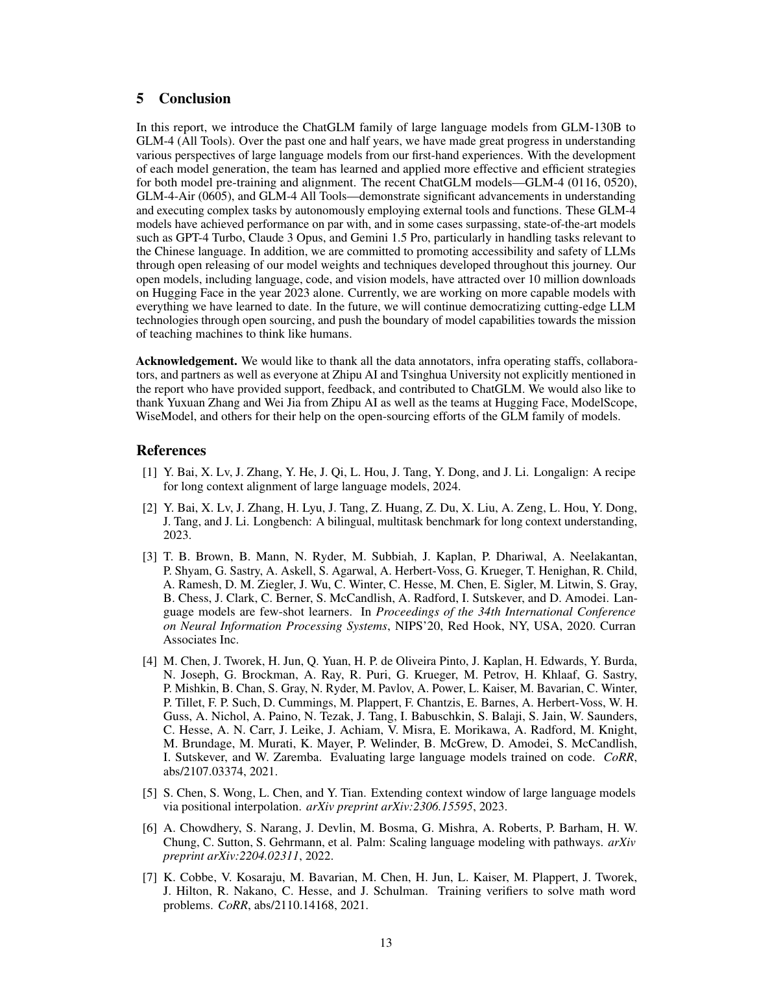

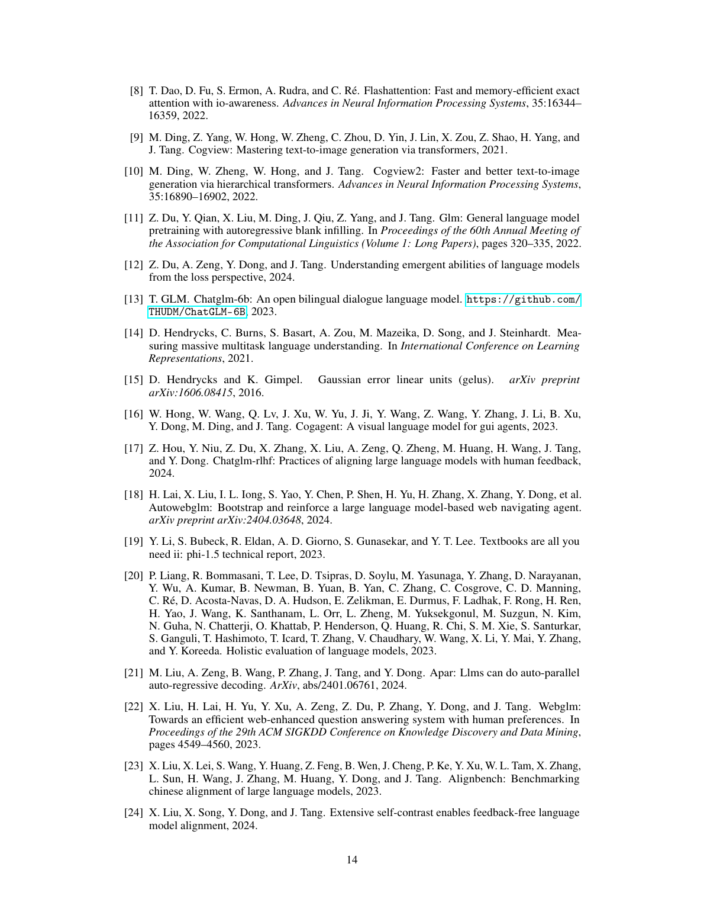

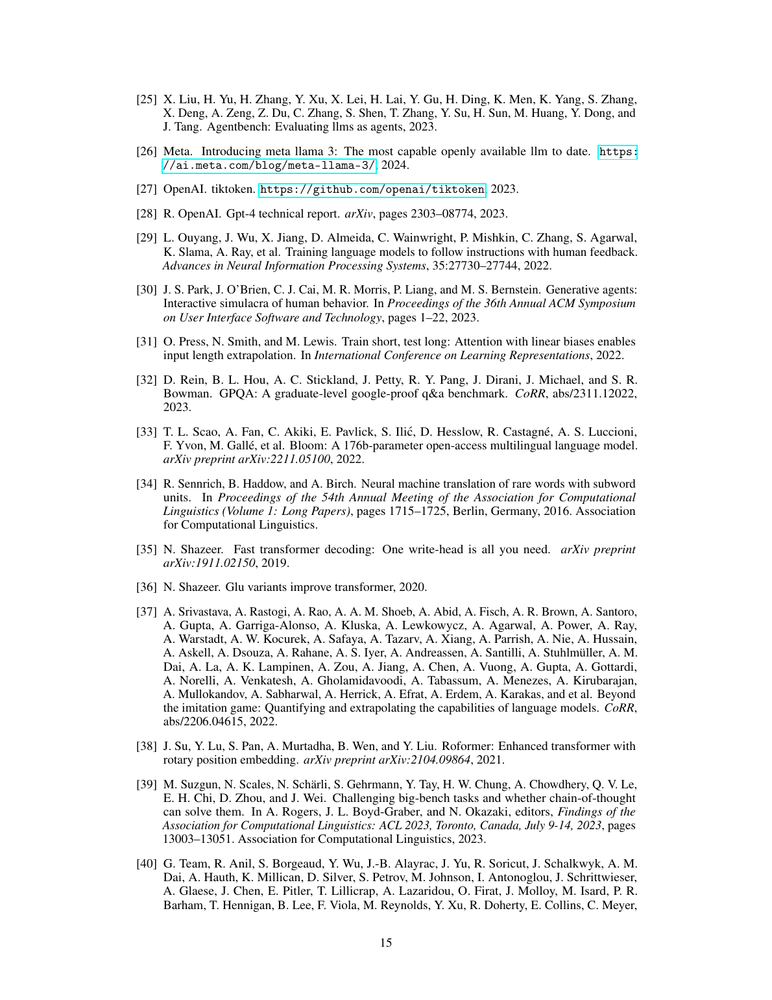

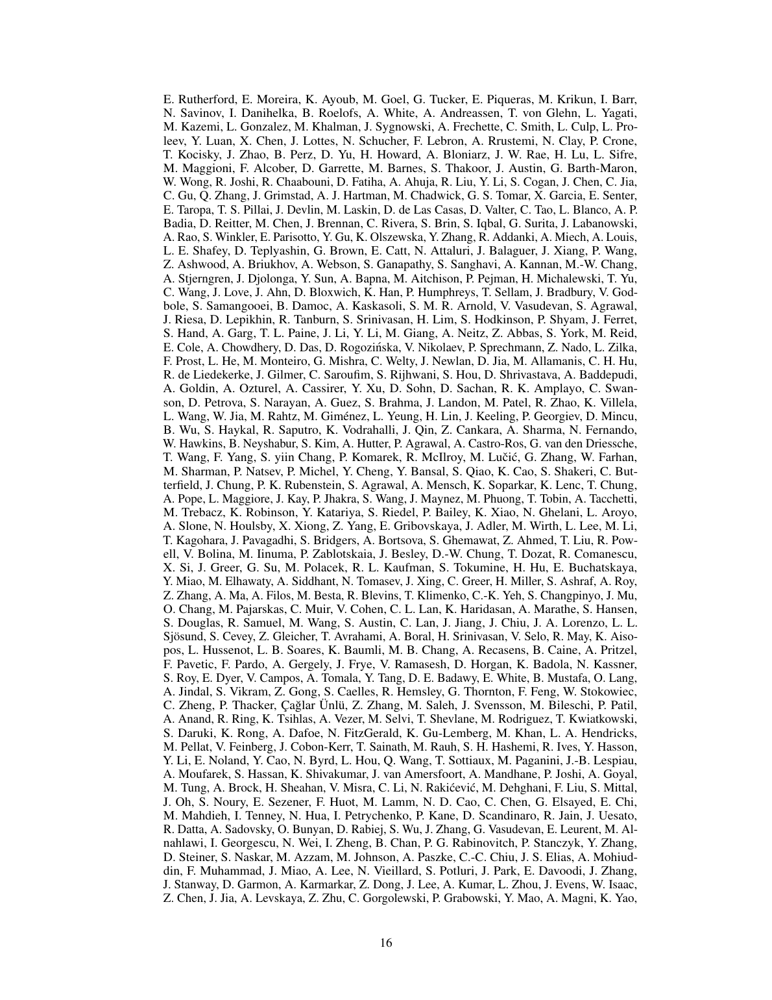

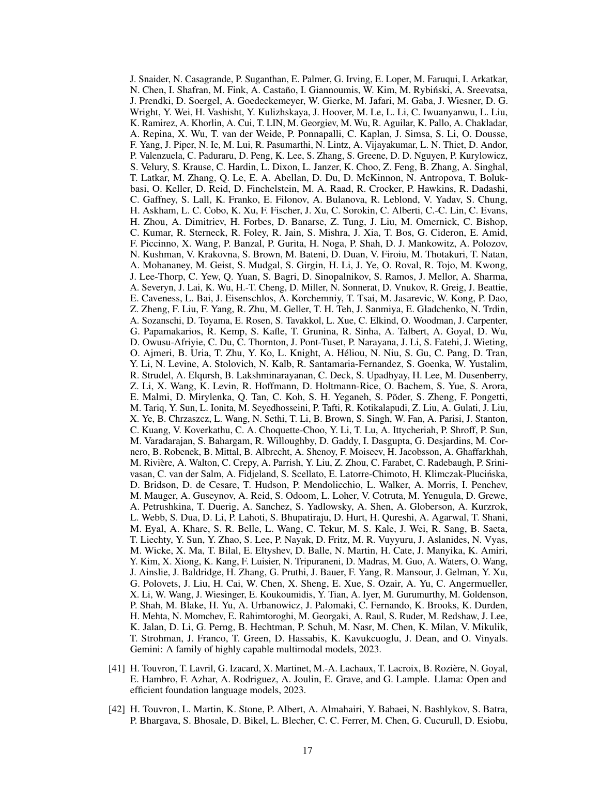

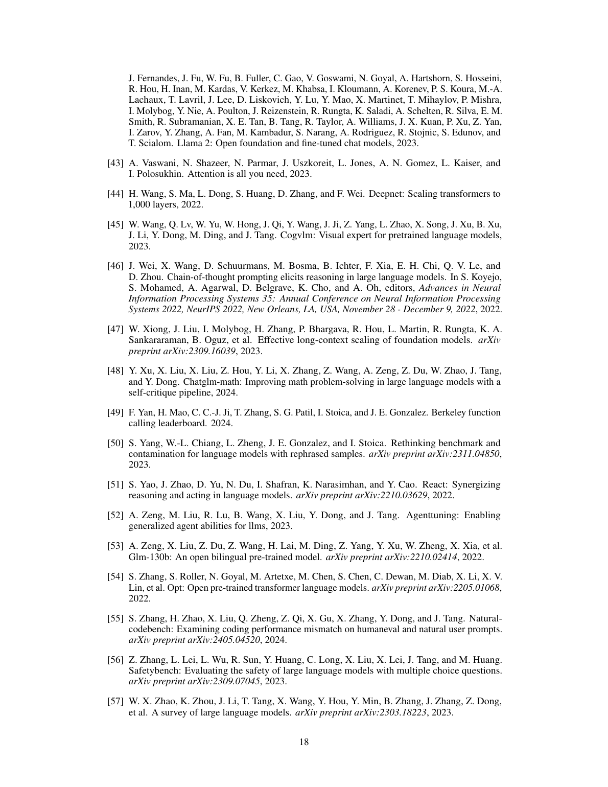

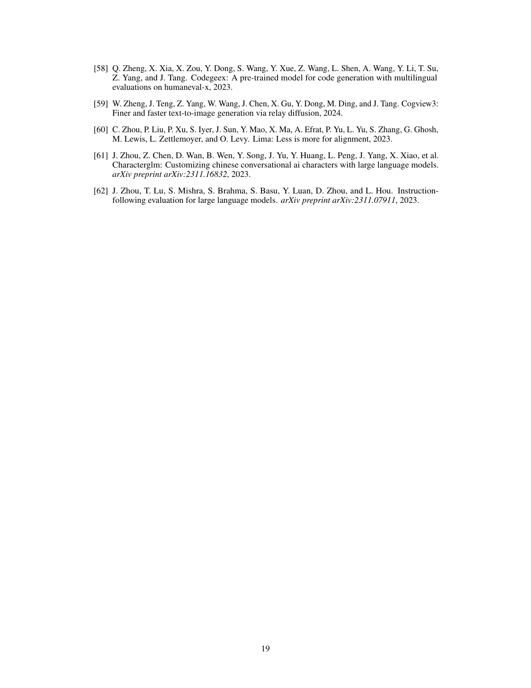
