# DeepSeek-Coder-V2：突破闭源模型的代码智能壁垒

**作者：** DeepSeek-AI 研究团队  
**项目地址：** DeepSeek-Coder-V2

## 摘要

我们提出 DeepSeek-Coder-V2：一种开源混合专家（MoE）代码语言模型，在代码专项任务上的性能可与 GPT-4 Turbo 相比。DeepSeek-Coder-V2 从 DeepSeek-V2 的中间检查点开始，使用额外 6 万亿词元继续预训练。经过这一阶段，模型的编程与数学推理能力得到显著增强，同时在通用语言任务上保持与 DeepSeek-V2 相当的表现。

与 DeepSeek-Coder 33B 相比，DeepSeek-Coder-V2 在各类代码任务、推理和通用能力上均有明显进步。它支持的编程语言由 86 种扩大到 338 种，上下文长度从 16K 延伸到 128K。在标准基准评测中，DeepSeek-Coder-V2 在代码和数学任务上优于 GPT-4 Turbo、Claude 3 Opus 与 Gemini 1.5 Pro 等闭源模型。

图 1 汇总模型在 HumanEval、MBPP+、MATH、GSM8K、Aider、LiveCodeBench 和 SWE-Bench 等代码与数学基准上的表现。

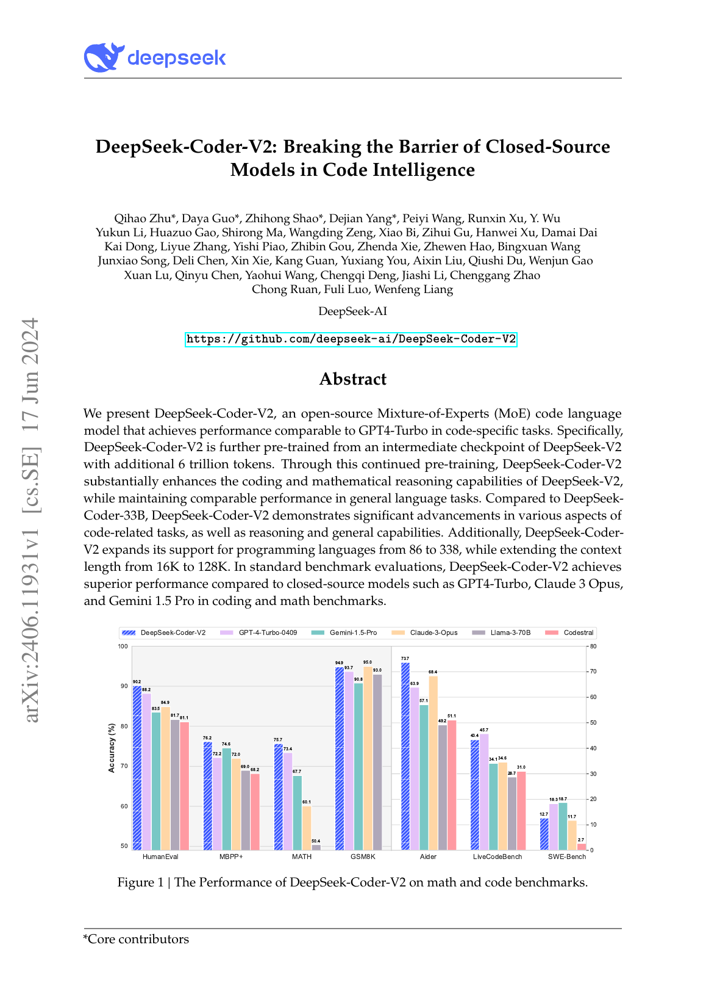

## 1 引言

开源社区通过 StarCoder、CodeLlama、DeepSeek-Coder、Codestral 等开源代码模型，在代码智能方面取得了重要进展。这些模型的表现不断接近闭源对手，推动了代码智能的发展；但与 GPT-4 Turbo、Claude 3 Opus 和 Gemini 1.5 Pro 等领先闭源模型相比，差距仍清晰可见。为弥合差距并进一步推动开源代码模型，本文提出 DeepSeek-Coder-V2 系列。模型建立在 DeepSeek-V2 之上，并使用额外 6 万亿词元语料继续预训练。

预训练数据由 60% 源代码、10% 数学语料和 30% 自然语言语料组成。源代码部分包含来自 GitHub 与 Common Crawl 的 1.17 万亿个代码相关词元，处理流程沿用 DeepSeekMath。与 DeepSeek-Coder 的代码语料相比，新语料覆盖的编程语言从 86 种增至 338 种。

为验证新代码语料的效果，我们对 1B 模型进行消融。在 HumanEval 上，准确率从 30.5% 提升至 37.2%，增加 6.7 个百分点；在 MBPP 上从 44.6% 提升至 54.0%，增加 9.4 个百分点。

数学语料同样通过 DeepSeekMath 流程从 Common Crawl 收集，共 2210 亿个数学词元，约为原 DeepSeekMath 1200 亿词元语料的两倍。自然语言语料则直接从 DeepSeek-V2 训练语料中采样。DeepSeek-Coder-V2 累计接触 10.2 万亿个训练词元，其中 4.2 万亿来自 DeepSeek-V2 已有训练，剩余 6 万亿来自新建数据集。

为了容纳更长代码输入，并适用于更多编程情境，我们把上下文长度从 16K 扩展到 128K，使模型能处理更复杂、更大规模的代码任务。在多来源语料上继续预训练后，DeepSeek-Coder-V2 的编程与数学推理能力显著提高，同时维持相当的通用语言表现。

对齐阶段首先构建指令训练数据集，其中包括 DeepSeek-Coder 的代码数据、DeepSeekMath 的数学数据和 DeepSeek-V2 的通用指令数据，并以此微调基础模型。强化学习阶段采用组相对策略优化（GRPO），使模型行为符合人类偏好。代码领域的偏好数据由编译器反馈和测试用例构建，并训练奖励模型来指导策略模型。这样可使代码回答同时面向正确性和人类偏好进行优化。为使对齐后的 16B 模型仍支持代码补全，基础模型微调期间还使用中间填充（FIM）方法。

### 1.1 贡献

本文主要贡献如下：

- 基于 DeepSeekMoE 框架推出 16B 和 236B 两种 DeepSeek-Coder-V2。二者实际激活参数分别仅为 2.4B 和 21B，能高效满足不同计算和应用需求；均支持 338 种编程语言，最大上下文长度为 128K。
- 首次尝试开发开源千亿参数级代码模型。实验显示，DeepSeek-Coder-V2 236B 在代码与数学任务上超过 GPT-4 Turbo、Claude 3 Opus 和 Gemini 1.5 Pro 等领先闭源模型。
- 以宽松许可证公开发布模型，允许研究和不受限制的商业使用。

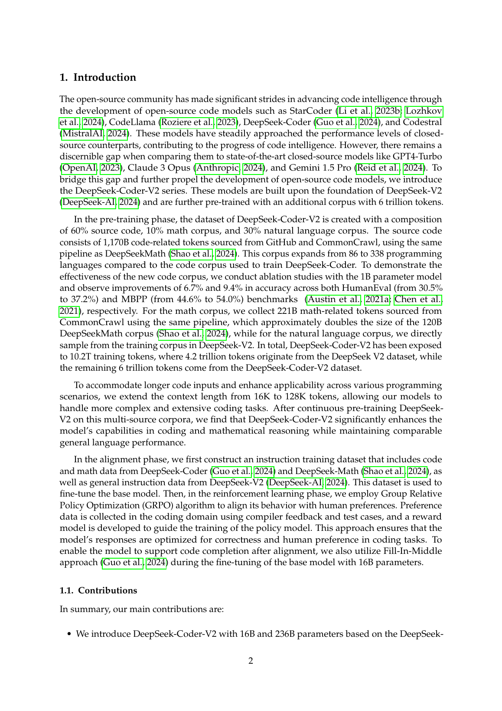

### 1.2 评测与指标摘要

#### 代码

在代码生成基准上，DeepSeek-Coder-V2 明显领先全部开源模型，并与 GPT-4 Turbo、Claude 3 Opus 和 Gemini 1.5 Pro 等领先闭源模型相当。HumanEval 得分 90.2%；MBPP 得分 76.2%，在 EvalPlus 流程下创下当时最佳结果；LiveCodeBench 得分 43.4%，题目来自 2023 年 12 月至 2024 年 6 月。它还是首个在 SWE-Bench 上超过 10% 的开源模型。

#### 数学

DeepSeek-Coder-V2 具有强大的数学推理能力。在 GSM8K 等基础基准以及 MATH、AIME、Math Odyssey 等高级竞赛基准上，可与 GPT-4o、Gemini 1.5 Pro、Claude 3 Opus 等顶尖闭源模型抗衡。MATH 准确率为 75.7%，接近 GPT-4o 的 76.6%；在 AIME 2024 上还超过这些闭源模型。

#### 自然语言

模型保持与 DeepSeek-V2 相当的通用语言性能。使用 OpenAI simple-eval 流程，MMLU 得分为 79.2%。以 GPT-4 作为裁判进行主观评测时，Arena-Hard 得分 65.0，MT-Bench 为 8.77，AlignBench 为 7.84。这些成绩明显优于其他代码专项模型，甚至可与通用开源模型相比。

## 2 数据收集

DeepSeek-Coder-V2 的预训练数据主要由 60% 源代码、10% 数学语料和 30% 自然语言语料组成。自然语言语料直接采样自 DeepSeek-V2，本节重点说明代码与数学数据的收集、清洗和过滤，并通过对比实验验证数据质量。

我们收集 GitHub 上 2023 年 11 月以前创建的公开仓库，沿用 DeepSeek-Coder 的过滤规则与近似去重方法，删除低质量和重复代码。过滤规则包括：

- 删除平均行长超过 100 字符，或最大行长超过 1000 字符的文件。
- 删除字母字符占比低于 25% 的文件。
- 除 XSLT 外，若文件前 100 个字符中出现 XML 版本声明，则删除该文件。
- 对 HTML 文件计算可见文本与 HTML 代码之比；仅保留可见文本至少占代码 20%，且不少于 100 字符的文件。
- JSON 与 YAML 通常含有较多数据，因此只保留字符数在 50 至 5000 之间的文件，以移除大部分数据密集型文件。

经过这些过滤与近似去重，得到覆盖 338 种编程语言的 8210 亿个代码词元，以及 Markdown、议题文本等 1850 亿个代码相关文本词元。支持语言清单见附录 A，分词器与 DeepSeek-V2 相同。

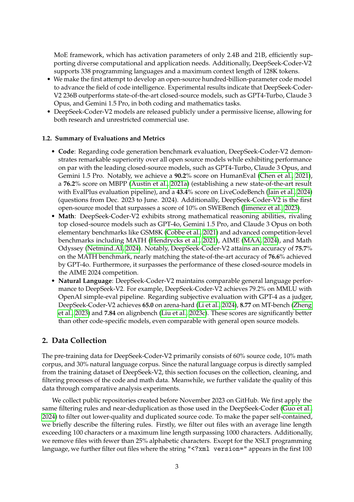

为了从 Common Crawl 收集代码与数学相关网页文本，我们沿用 DeepSeekMath 流程。首先选择 StackOverflow 等编程论坛、PyTorch 文档等库站点，以及 Math StackExchange 等数学网站作为种子语料；随后使用种子语料训练 fastText 模型，召回更多代码与数学网页。

中文等语言不能按空格分词，因此使用 DeepSeek-V2 的 BPE 分词器，显著提高 fastText 的召回准确率。对每个域名，计算第一轮收集到的网页比例；比例超过 10% 的域名被认定为代码或数学相关。再标注这些域名下与代码或数学内容相关的 URL，把尚未收集但与这些 URL 相连的网页加入种子语料。

经过三轮网页数据收集，得到 700 亿个代码相关词元和 2210 亿个数学相关词元。为进一步收集 GitHub 高质量源代码，同一流程又在 GitHub 上运行两轮，以人工收集、具有详细描述等特征的高质量代码作为初始种子，最终收集 940 亿个源代码词元。新代码语料总计包含来自 GitHub 与 Common Crawl 的 1.17 万亿个代码相关词元。

为验证新代码语料，作者用 1B 模型做消融。使用新语料训练 1 万亿词元后，HumanEval 从 30.5% 提升到 36.0%，MBPP 从 44.6% 提升到 49.0%；训练 2 万亿词元后，二者进一步达到 37.2% 和 54.0%。结果说明新语料优于 DeepSeek-Coder 原训练语料。

## 3 训练策略

### 3.1 训练目标

DeepSeek-Coder-V2 16B 同时使用下一词元预测和中间填充（FIM）两个训练目标；236B 仅使用下一词元预测。16B 的 FIM 采用“前缀—后缀—中间”（PSM）模式，按前缀、后缀、中间的顺序重构内容。该结构在预打包阶段应用于文档级数据，FIM 使用比例为 0.5，以提高训练效果与模型性能。

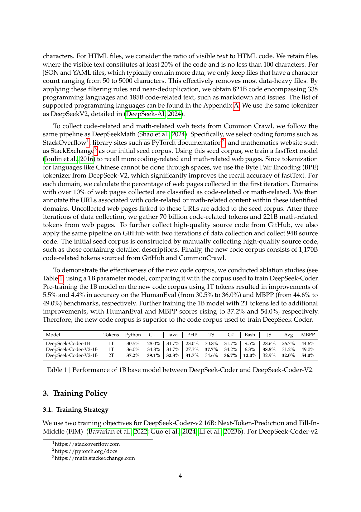

### 3.2 模型架构

模型架构与 DeepSeek-V2 一致。16B 和 236B 的超参数分别对应 DeepSeek-V2-Lite 与 DeepSeek-V2。训练中曾出现不稳定和梯度尖峰，作者认为原因是指数归一化技术，因此改回常规归一化方法。

### 3.3 训练超参数

与 DeepSeek-V2 一致，训练采用 AdamW 优化器，$\beta_1=0.9$、$\beta_2=0.95$、权重衰减 0.1；批量大小与学习率按 DeepSeek-V2 规格调整。学习率使用余弦衰减，先预热 2000 步，再逐渐下降至初始值的 10%。

DeepSeek-Coder-V2 和 Lite 版本使用相同训练方法。为了保留强大的自然语言理解能力，训练从已完成 4.2 万亿词元训练的 DeepSeek-V2 中间检查点继续。模型预训练阶段因此累计接触 10.2 万亿个高质量词元。16B/236B 总参数为 16B/236B，激活参数为 2.4B/21B；两者均使用余弦学习率，只有 16B 启用 FIM。

### 3.4 长上下文扩展

按照 DeepSeek-V2 的做法，使用 YaRN 把上下文长度扩展至 128K，参数同样设为尺度 $s=40$、$\alpha=1$、$\beta=32$。随后分两阶段继续训练以增强长上下文能力：第一阶段以 32K 序列、批量 1152 训练 1000 步；第二阶段以 128K 序列、批量 288 再训练 1000 步。

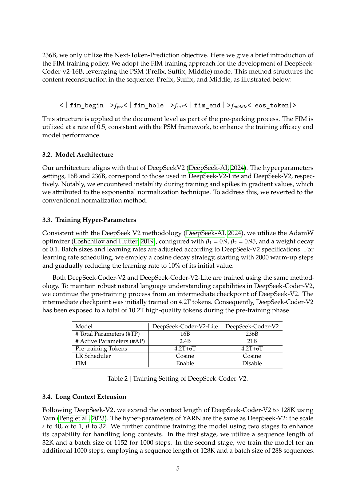

长上下文扩展期间提高了长文本数据的采样比例。图 2 的“大海捞针”测试表明，DeepSeek-Coder-V2 在最长 128K 的所有上下文窗口长度上都表现良好。

### 3.5 对齐

#### 3.5.1 监督微调

为构建 DeepSeek-Coder-V2 Chat，我们混合代码和数学指令数据。先从 DeepSeek-Coder 收集 2 万条代码指令，从 DeepSeekMath 收集 3 万条数学数据；为保持通用能力，还从 DeepSeek-V2 指令数据中采样。最终指令数据集共 3 亿词元。训练使用余弦调度，预热 100 步，初始学习率 $5\times10^{-6}$，批量大小为 100 万词元，总训练量 10 亿词元。

#### 3.5.2 强化学习

为充分激发模型能力，我们进一步采用强化学习。

##### 提示收集

团队投入大量精力从不同来源收集代码和数学提示，每条代码提示都带有对应测试用例；过滤后总计约 4 万条数据。

##### 奖励建模

奖励模型在强化学习中起关键作用。数学偏好数据使用标准答案获得。代码编译器虽能直接提供代码是否通过全部测试的 0/1 反馈，但部分代码提示的测试用例有限、覆盖不完整，直接使用编译器信号会带来噪声且并非最优。因此，我们仍用编译器产生的数据训练奖励模型，再让奖励模型为强化学习提供信号。与原始编译器信号相比，它更稳健，泛化能力也更好。

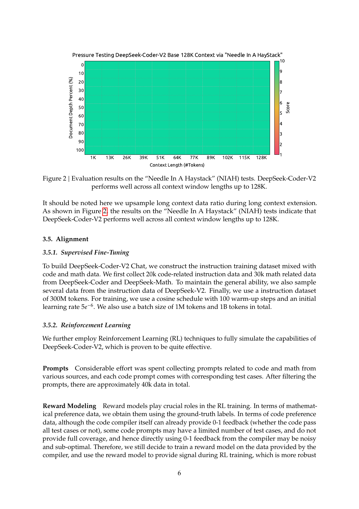

图 3 显示，在内部 LeetCode 与中文 LeetCode 测试集上，奖励模型信号明显优于直接编译器信号。因此，后续实验统一使用奖励模型信号。

##### 强化学习算法

强化学习采用与 DeepSeek-V2 相同的 GRPO。相比 PPO，GRPO 无须维护额外的评论模型，成本更低，而且实验已证明十分有效。

## 4 实验结果

本节从代码、数学和通用自然语言三类任务评测 DeepSeek-Coder-V2，并与此前领先模型比较。代码专项基线包括 CodeLlama、StarCoder、StarCoder2、DeepSeek-Coder 和 Codestral；通用语言基线包括 Llama 3 70B、GPT-4、Claude 3 Opus 与 Gemini 1.5 Pro。

CodeLlama 基于 Llama 2，在 5000 亿至 1 万亿代码词元上继续预训练，提供 7B、13B、34B 和 70B 四种规模。StarCoder 是公开的 15B 模型，在精心整理、覆盖 86 种编程语言的 Stack 子集上训练。StarCoder2 包含 3B、7B、15B 三种规模，在覆盖 619 种语言的 Stack2 数据集上训练 3.3 至 4.3 万亿词元。

DeepSeek-Coder 覆盖 1B 到 33B，均从零开始训练 2 万亿词元，数据由 87% 代码和 13% 中英文自然语言组成；模型在 16K 窗口的项目级代码语料上预训练，并加入代码填空任务，支持项目级补全与中间填充。Codestral 是 Mistral 开发的 22B 模型，在包括 Python、Java、JavaScript、Swift、Fortran 等 80 多种语言的数据上训练。

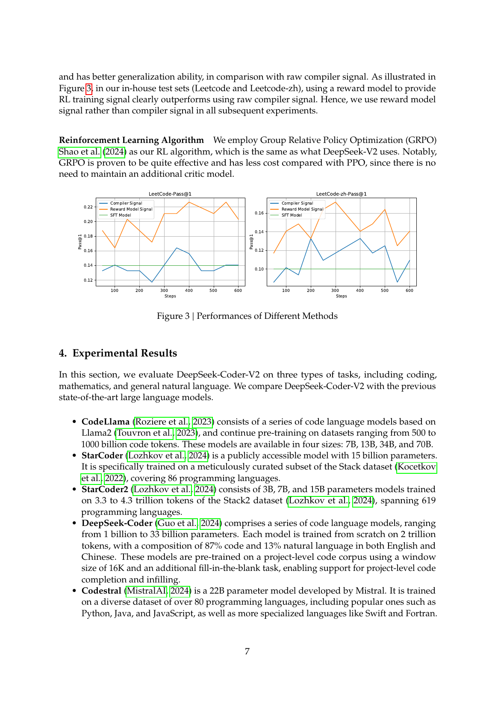

### 4.1 代码生成

#### HumanEval 与 MBPP

HumanEval 与 MBPP 常用于评估代码生成 LLM。HumanEval 包含 164 道 Python 题，由测试用例验证，评估零样本场景下的代码模型表现；MBPP 使用增强版 MBPP-Plus。为测试多语言能力，作者把 HumanEval 题目扩展到 C++、Java、PHP、TypeScript、C#、Bash、JavaScript、Swift、R、Julia、D、Rust 和 Racket 等额外语言。两项基准均采用贪心搜索，并在相同脚本和环境下重新运行基线，以保证公平比较。

表 3 汇总不同模型跨多种语言的 HumanEval 与 MBPP+ 指标。DeepSeek-Coder-V2-Instruct 的平均成绩为 75.3%，在所有模型中排名第二，打破了闭源模型长期占优的局面，仅次于平均 76.4% 的 GPT-4o。它在 Java 与 PHP 上取得最高分，在 Python、C++、C#、TypeScript 和 JavaScript 上也表现强劲，体现了处理多样化编程挑战时的稳健与通用性。

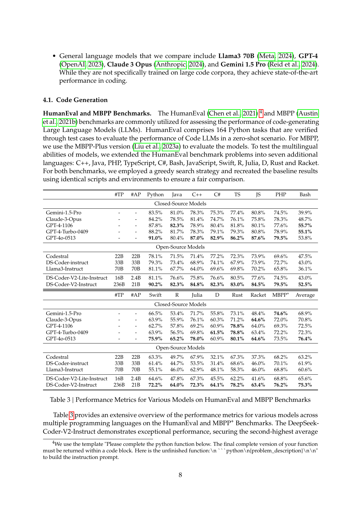

DeepSeek-Coder-V2-Lite-Instruct 同样表现突出，平均分 65.6%，超过更大的 DeepSeek-Coder 33B 的 61.9%。这说明 16B 模型虽然更小，却能凭借架构与训练方法进步提供有竞争力的结果。

#### 竞技编程

为验证模型在真实竞技编程题上的能力，使用 LiveCodeBench 与 USACO。LiveCodeBench 是严格、无污染的代码生成评测，会持续从 LeetCode、AtCoder、CodeForces 三个主要平台收集新题。由于训练数据截止到 2023 年 11 月以前，实验使用之后的 LiveCodeBench 1201-0601 子集。USACO 包含 307 道美国计算机奥林匹克题，并为每题提供高质量单元测试、参考代码和官方题解。

表 4 显示，DeepSeek-Coder-V2-Instruct 在 LiveCodeBench 上达到 43.4%，与 GPT-4o 并列大型模型最高分，总体仅次于 45.7% 的 GPT-4 Turbo 0409。它处理复杂编程挑战的能力使其成为领先竞争者。在 USACO 上达到 12.1%，接近 GPT-4 Turbo 的 12.3%。

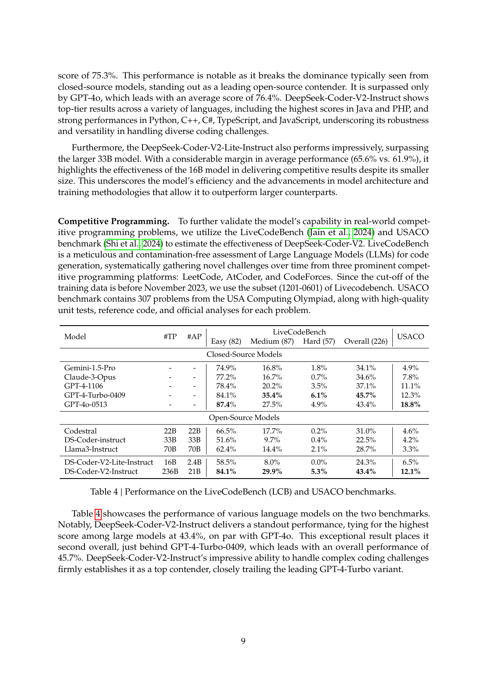

### 4.2 代码补全

#### 4.2.1 仓库级代码补全评测

使用 RepoBench 评估 35B 以下开源代码模型的仓库级代码补全能力。数据集来自 Python 与 Java 的真实开源宽松许可仓库。RepoBench v1.1 使用 2023 年 10 月 6 日至 12 月 31 日创建的 GitHub 仓库，而本文预训练数据包含 2023 年 11 月以前的代码。为避免泄漏，评测只采用 2023 年 12 月数据。

评测覆盖 2K、4K、8K、12K、16K 五个上下文长度，在跨文件优先、跨文件随机和文件内三种设置下进行。所有模型采用贪心搜索，每条提示最多生成 64 个新词元，输出中第一行非空、非注释内容作为预测。提示最大长度为 15,800 个词元，超出部分从跨文件上下文中截断。报告各上下文长度上的平均精确匹配率。

结果显示，DeepSeek-Coder-V2-Lite-Base 每个词元仅激活 2.4B 参数，却在 Python 代码补全上与 DeepSeek-Coder-Base 33B 相当，在 Java 上与 DeepSeek-Coder-Base 7B 相当。它的激活参数仅为 Codestral 的约十分之一，因此代码补全成绩较低；但作者认为，更少激活参数会使它在补全场景中运行更快。

#### 4.2.2 中间填充代码补全

DeepSeek-Coder-V2-Lite 预训练时以 0.5 的比例使用 FIM。这使模型能结合空缺之前和之后的代码，熟练填补中间内容，对代码补全工具尤其有利。SantaCoder、StarCoder 和 CodeLlama 等开源模型也具有类似能力，并在代码生成与补全领域建立了较高基线。

模型在覆盖 Python、Java、JavaScript 的单行填充基准上与领先模型比较，主要指标是单行精确匹配准确率。

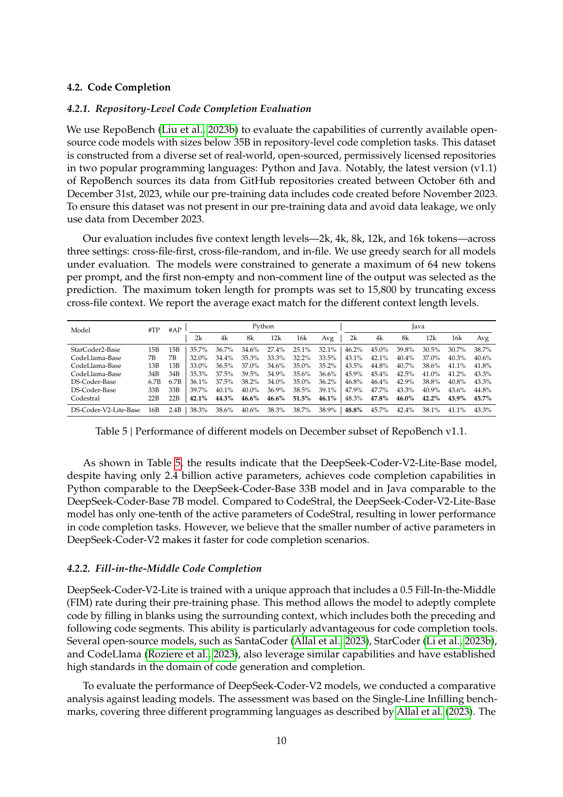

表 6 显示，DeepSeek-Coder-V2-Lite-Base 仅激活 2.4B 参数，在 Python、Java、JavaScript 上分别取得 80.0%、89.1%、87.2%，平均 86.4%，达到并列最高。结果说明它在多语言 FIM 任务中十分有效，能够与更大的模型相当。

### 4.3 代码修复

代码修复能力使用 Defects4J、SWE-Bench 与 Aider 测试。

Defects4J 是软件工程领域常用的数据集，专门评估程序修复技术，包含 Apache Commons、JFreeChart、Closure Compiler 等开源项目中的真实软件缺陷，每个缺陷均附有测试套件。原始缺陷可能需要改动仓库中的多个文件，导致上下文很长，因此本文选择其中只需修改一个方法的 238 个缺陷。

SWE-Bench 用于评估 LLM 解决 GitHub 真实软件议题的表现。它同时提供代码库与具体议题，要求模型生成能够修复所述问题的补丁，从而严格测试模型理解与解决真实软件问题的能力，并衡量其在软件开发中的实用性。

Aider 代码编辑基准包含 133 个不同的 Python 编码任务，评估 LLM 修改源文件的能力；除编码技能外，还检查模型能否持续按照提示规格生成代码改动。DeepSeek-Coder-V2 使用完整格式接受评测。

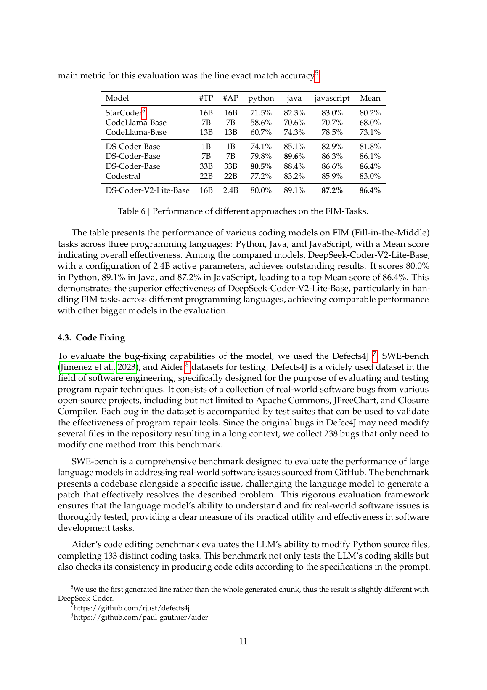

表 7 显示，DeepSeek-Coder-V2-Instruct 在开源模型中最突出：Defects4J 得分 21.0%，SWE-Bench 得分 12.7%，接近领先闭源模型，并体现了处理长代码序列的能力。它在 Aider 上取得 73.7%，超过表中包括闭源模型在内的所有模型，说明其自动代码修复效率与稳健性很强。

### 4.4 代码理解与推理

代码推理使用 CRUXEval。该基准包含 800 个 Python 函数及相应输入—输出示例，分为两项任务：CRUXEval-I 要求模型根据输入预测输出；CRUXEval-O 要求模型根据已知输出反推输入，从正向和反向两个方向考察对 Python 代码的理解与推理。

DeepSeek-Coder-V2-Instruct 在开源模型中明显领先：CRUXEval-I-COT 得分 70.0%，CRUXEval-O-COT 得分 75.1%。与更大的闭源模型相比仍有差距，可能主要因为它每个词元只激活 21B 参数，远少于 GPT-4o 等更大模型，模型复杂度限制了学习与解题能力。

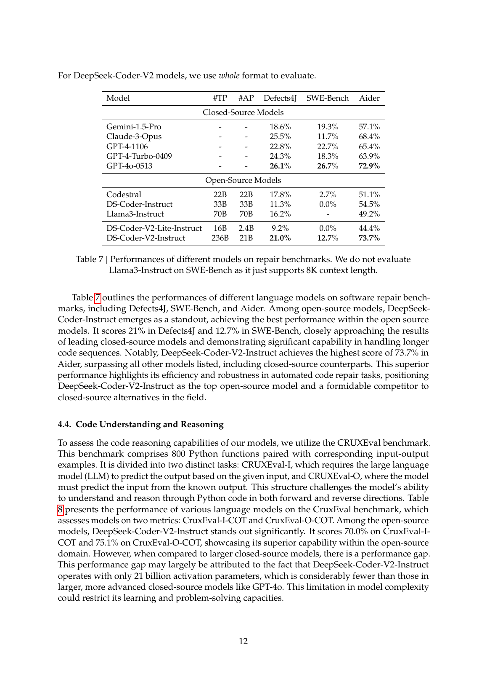

### 4.5 数学推理

数学推理使用小学数学基准 GSM8K，以及 MATH、AIME 2024 和 Math Odyssey 等高级竞赛基准。除特别说明外，表 9 均使用贪心解码，不借助工具或投票技术。

DeepSeek-Coder-V2 在 MATH 上达到 75.7%，在 Math Odyssey 上达到 53.7%，与领先的 GPT-4o 相当。它在 AIME 2024 上解决 4/30 道题，超过其他列出的模型；若使用 64 次多数投票，可达到 5/30，体现了强大的数学推理能力。四项数学评测采用零样本思维链提示，要求逐步推理，并把最终答案放在指定数学框中。

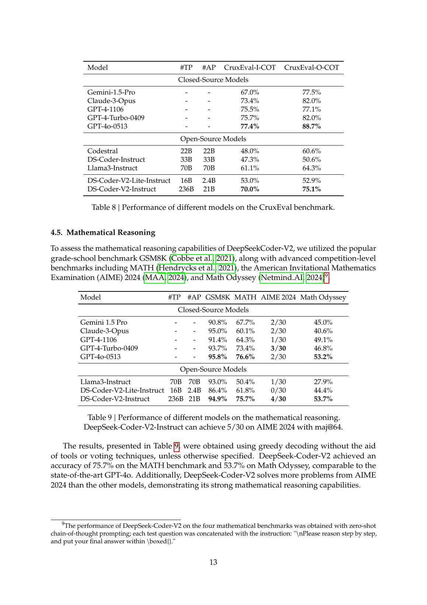

### 4.6 通用自然语言

DeepSeek-Coder-V2 建立在 DeepSeek-V2 之上，因此继承了强大自然语言能力，并在推理类基准上超过 DeepSeek-V2。表 10 比较 DeepSeek-Coder-V2 Instruct 与 DeepSeek-V2 Chat，覆盖 BBH、MMLU、ARC、TriviaQA、NaturalQuestions、AGIEval、CLUEWSC、C-Eval、CMMLU 等中英文标准基准，以及 Arena-Hard、AlpacaEval 2.0、MT-Bench、AlignBench 等开放式生成评测。评测流程和指标与 DeepSeek-V2 相同，MMLU 使用 OpenAI simple-eval。

16B 对比中，DeepSeek-Coder-V2-Lite-Instruct 在 BBH 和 Arena-Hard 等高度依赖推理的基准上超过 DeepSeek-V2-Lite-Chat；但在 TriviaQA 等知识密集型基准上落后，主要因为预训练所用网页数据相对较少。

236B 对比中，DeepSeek-Coder-V2 Instruct 在推理基准上更强，尤其是包含大量代码、数学和推理问题的 Arena-Hard。DeepSeek-V2 Chat 则在 MT-Bench、AlpacaEval 2.0 和 AlignBench 上略好，这一优势来自其通用对齐阶段。

## 5 结论

本文提出 DeepSeek-Coder-V2，以进一步推动代码智能。模型从 DeepSeek-V2 出发，使用来自高质量、多来源语料的额外 6 万亿词元继续预训练。这一过程显著增强了编程与数学推理能力，同时维持与 DeepSeek-V2 相当的通用语言表现。

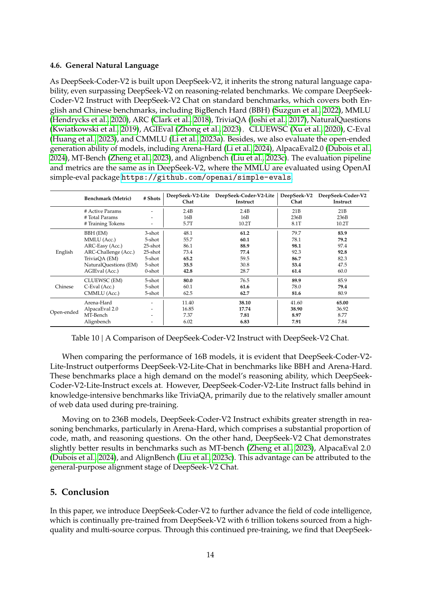

与 DeepSeek-Coder 相比，新模型支持的编程语言由 86 种大幅增至 338 种，最大上下文从 16K 扩展到 128K。实验表明，它在代码和数学专项任务上可与 GPT-4 Turbo、Claude 3 Opus、Gemini 1.5 Pro 等领先闭源模型相比。

尽管标准基准成绩突出，作者发现其指令遵循能力与 GPT-4 Turbo 等领先模型相比仍有显著差距，这会使模型在 SWE-Bench 等复杂场景和任务上表现欠佳。代码模型不仅需要强大编程能力，也需要卓越的指令遵循能力，才能处理真实世界的复杂编程场景。未来将重点提高这一能力，更好地处理复杂真实任务并提升开发生产力。

## 参考文献

参考文献按原论文保留，避免改写作者、论文名、出版信息和链接。第 15 页在结论之后开始列出文献。

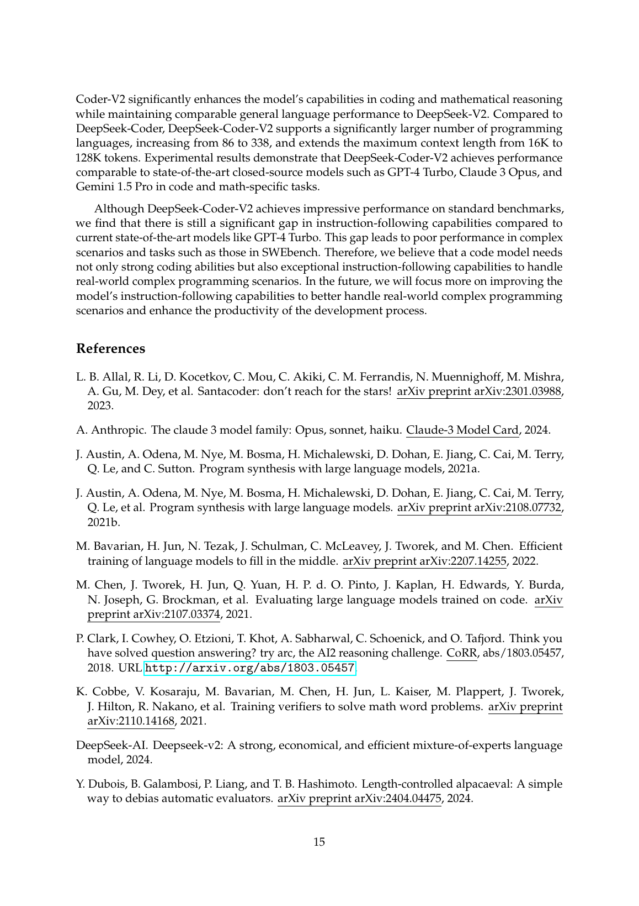

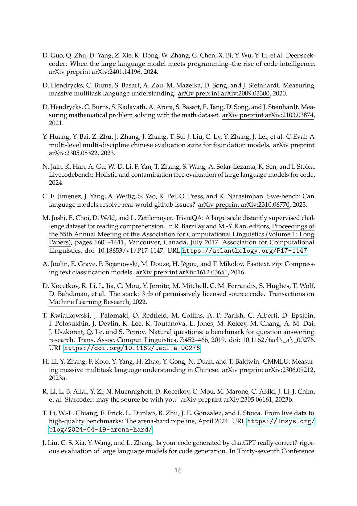

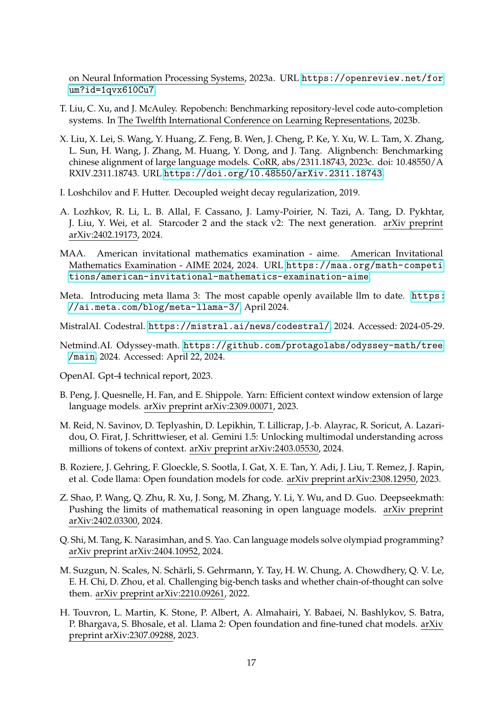

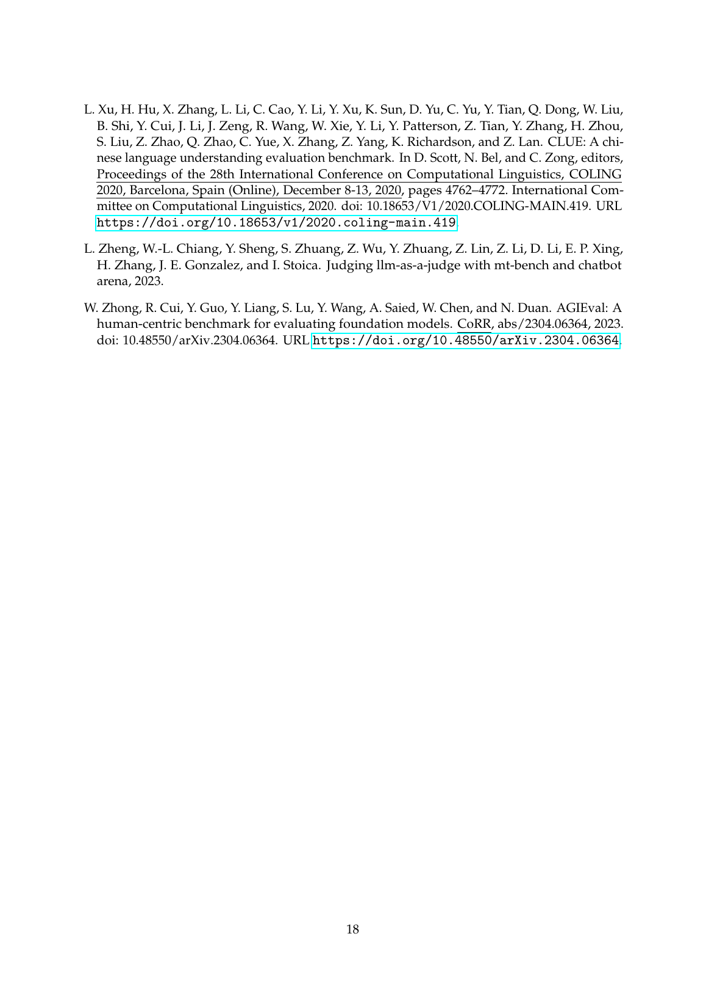

## 附录 A：支持的编程语言

附录列出 DeepSeek-Coder-V2 支持的 338 种编程语言和相关文件类型，涵盖主流通用语言、脚本语言、标记与配置语言、数据库与查询语言、硬件描述语言、科学计算语言、函数式语言、领域专用语言，以及大量历史和小众语言。为保持名称准确并避免语言名误译，完整清单按原页保留。

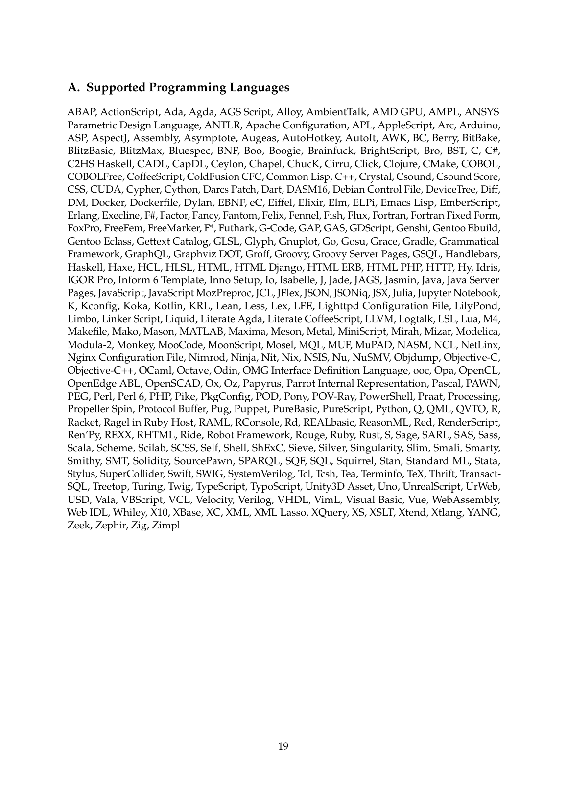
