# DeepSeek-Coder：当大型语言模型遇见编程——代码智能的崛起

**作者：** Daya Guo、Qihao Zhu、Dejian Yang、Zhenda Xie、Kai Dong、Wentao Zhang、Guanting Chen、Xiao Bi、Y. Wu、Y.K. Li、Fuli Luo、Yingfei Xiong、Wenfeng Liang  
**机构：** DeepSeek-AI；北京大学计算机科学技术系、高可信软件技术教育部重点实验室  
**论文版本：** arXiv:2401.14196v2，2024 年 1 月 26 日  
**代码：** https://github.com/deepseek-ai/DeepSeek-Coder  
**译文说明：** 本译文按原论文内容顺序逐段编排，标题、正文及图表说明均译为中文；模型名、编程语言名、数据集名和通行技术缩写保留原写法。算法、代码案例、数据表、参考文献与训练曲线以对应整页截图保留，并置于相关正文附近。

## 摘要

大型语言模型的快速发展已经彻底改变软件开发中的代码智能，但闭源模型占据主导地位，限制了广泛研究与开发。为此，我们推出 DeepSeek-Coder 系列：一组从 13 亿到 330 亿参数不等、从零开始在 2 万亿词元上训练的开源代码模型。这些模型在高质量、项目级代码语料上预训练，并使用 16K 上下文窗口的中间填空任务，增强代码生成与补全能力。大量评估表明，DeepSeek-Coder 不仅在多项基准上取得开源代码模型中的最佳表现，还超过 Codex 与 GPT-3.5 等现有闭源模型。DeepSeek-Coder 采用宽松许可证，可用于研究和不受限制的商业用途。

**图 1：DeepSeek-Coder 的性能。** 图中比较不同规模的 DeepSeek-Coder 与主流代码模型，显示其在开源代码模型中的领先地位。

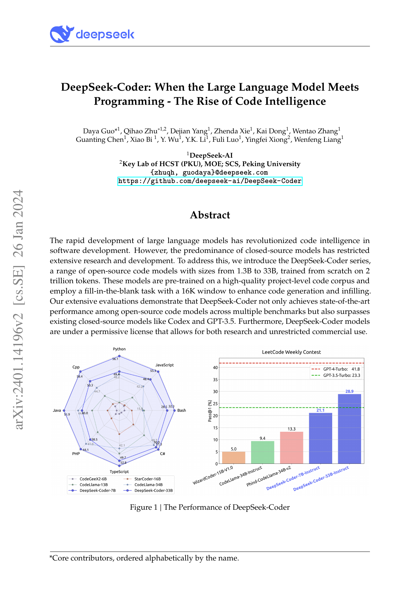

## 1 引言

大型语言模型的迅速进步显著改变了软件开发领域（OpenAI，2023；Touvron 等，2023），开启代码智能的新阶段。这些模型有潜力自动化并简化从缺陷检测到代码生成的许多环节，从而提高生产力、降低人为错误概率。然而，该领域的一项主要挑战，是开源模型（Li 等，2023；Nijkamp 等，2022；Roziere 等，2023；Wang 等，2021）与闭源模型（Gemini Team，2023；OpenAI，2023）之间仍有性能差距。大型闭源模型虽然强大，却因为专有性质而难以被许多研究者与开发者使用。

为应对这一挑战，我们推出 DeepSeek-Coder 系列。它包含 1.3B、6.7B 与 33B 等不同规模的开源代码模型，每个规模均提供基座版和指令版。每个模型都从零开始，在来自 87 种编程语言的 2 万亿词元上训练，从而全面理解编程语言与语法。我们还尝试在仓库级组织预训练数据，以增强模型理解同一仓库中跨文件上下文的能力。除下一词元预测损失外，预训练还加入中间填充（FIM）方法（Bavarian 等，2022；Li 等，2023），进一步加强代码补全。为了处理更长的代码输入，上下文长度扩展到 16K，使模型能应对更复杂、更大规模的编程任务，并提高在不同开发场景中的通用性。

我们在多种公开代码基准上进行了全面实验。结果显示，在开源模型中，DeepSeek-Coder-Base 33B 在所有基准上持续取得最优表现；DeepSeek-Coder-Instruct 33B 在大多数评估基准上超过 OpenAI GPT-3.5 Turbo，显著缩小开源模型与 GPT-4 的差距。即使参数更少，DeepSeek-Coder-Base 7B 也能与 CodeLlama-33B（Roziere 等，2023）等大约五倍规模的模型竞争。

本文贡献概括如下：

- 提出面向代码的 DeepSeek-Coder-Base 与 DeepSeek-Coder-Instruct。它们在大规模代码语料上充分训练，能够理解 87 种编程语言，并提供多种规模以适配不同计算条件与应用需求。
- 首次尝试在模型预训练阶段构建仓库级数据，并发现它能够显著提升跨文件代码生成能力。
- 严格分析 FIM 训练策略对代码模型预训练的影响，揭示不同 FIM 设置的特性，为代码预训练模型的改进提供依据。
- 在覆盖多类代码任务的大量基准上评估。DeepSeek-Coder-Base 超过全部现有开源代码大模型；经过高质量指令数据微调后，DeepSeek-Coder-Instruct 在代码任务上超过 OpenAI GPT-3.5 Turbo。

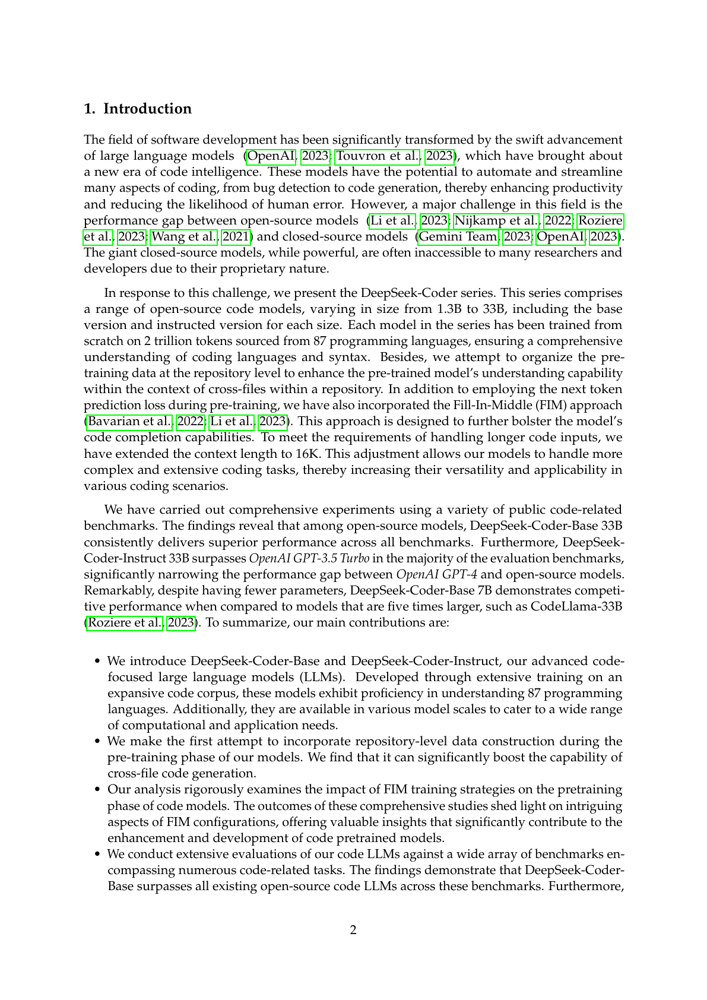

## 2 数据收集

DeepSeek-Coder 训练数据由 87% 的源代码、10% 与代码相关的英语自然语言语料，以及 3% 与代码无关的中文自然语言语料组成。英语语料来自 GitHub Markdown 与 StackExchange，用于增强模型对代码概念的理解，并改善库使用、缺陷修复等任务；中文语料由高质量文章组成，用于提高模型的中文理解能力。

代码训练数据构建流程包括数据抓取、基于规则的过滤、依赖解析、仓库级去重和质量筛选，如图 2 所示。

**图 2：数据集构建流程。** 数据依次经过抓取、规则过滤、依赖解析、仓库级去重和质量筛选。

### 2.1 GitHub 数据抓取与过滤

我们收集 GitHub 上 2023 年 2 月之前创建的公开仓库，只保留表 1 所列的 87 种编程语言。为了减少需要处理的数据量，先使用与 StarCoder 项目（Li 等，2023）相近的规则过滤低质量代码；过滤后数据只剩原始规模的 32.8%。为使本文自洽，下面简述 StarCoder Data 使用的规则。

首先，删除平均行长超过 100 个字符或最大行长超过 1000 个字符的文件，并删除字母字符占比低于 25% 的文件。除 XSLT 外，如果文件前 100 个字符中出现 `<?xml version=`，也将其删除。对 HTML，计算可见文本相对 HTML 代码的比例，只保留可见文本至少占 20% 且不少于 100 个字符的文件。JSON 与 YAML 通常包含较多数据，因此只保留字符数在 50 到 5000 之间的文件，从而去掉大多数以数据为主的文件。

### 2.2 依赖解析

此前的代码大模型（Chen 等，2021；Li 等，2023；Nijkamp 等，2022；Roziere 等，2023）主要在文件级源代码上预训练，忽略同一项目不同文件之间的依赖；实际应用中，这类模型很难有效扩展到完整项目级代码场景。因此，我们先解析文件之间的依赖，再按顺序排列文件，保证某个文件依赖的上下文先于该文件出现在输入序列中。按依赖关系对齐后，数据集更准确地反映真实编程实践与项目结构，也更适合项目级代码处理。

我们只考虑文件之间的调用关系，并用正则表达式提取，例如 Python 的 `import`、C# 的 `using` 与 C 的 `include`。

**算法 1：用于依赖分析的拓扑排序。** 算法先为项目文件建立邻接表 `graphs` 与入度字典 `inDegree`，遍历文件对以识别依赖并更新两者，再找出依赖图中的不连通子图。对每个子图执行修改后的拓扑排序：不同于标准方法只选择入度为零的节点，这里选择当前入度最小的节点，因此可以处理图中的环。节点加入结果后，降低相连节点的入度，直到为每个子图生成排序序列。

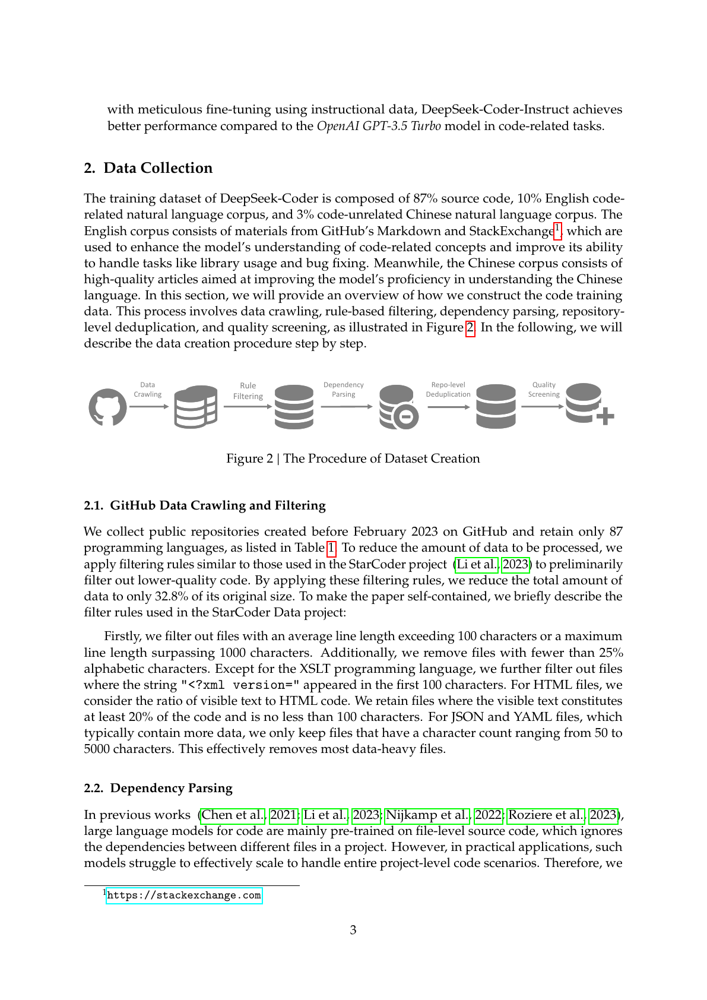

算法最终返回各个排序序列；每个序列中的文件被拼接成一条训练样本。为了包含文件路径信息，每个文件开头都会添加一条标明路径的注释，从而在训练数据中保留路径。

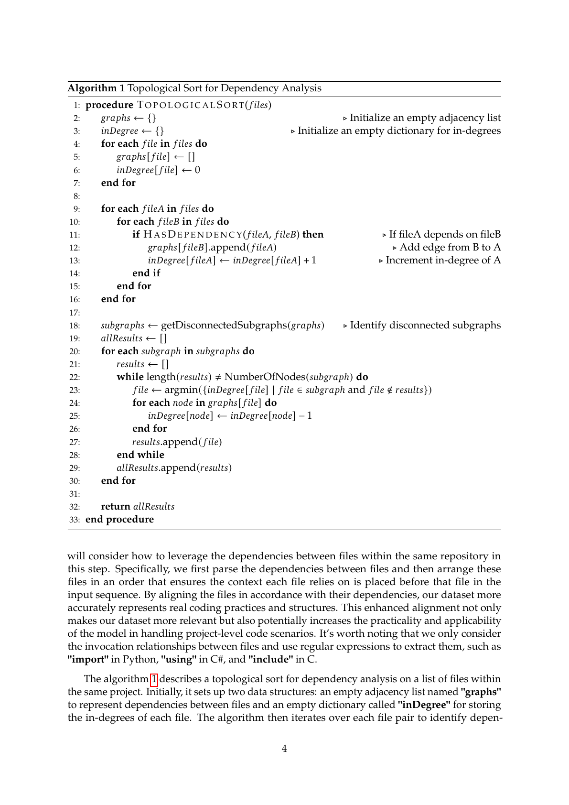

### 2.3 仓库级去重

近期研究表明，训练数据去重可以显著提高大模型性能。Lee 等（2022）发现语言模型训练语料往往包含大量近似重复内容，去除较长的重复子串可以改善性能；Kocetkov 等（2022）对训练数据执行近似去重后取得大幅提升，并强调近似去重是代码基准上获得有竞争力表现的关键预处理步骤。

我们的数据集同样采用近似去重，但与既有工作不同：去重在代码仓库级执行，而不是文件级。文件级做法可能过滤掉仓库中的部分文件，破坏仓库结构。我们把仓库级拼接后的代码视为一条样本，再应用相同的近似去重算法，以保证仓库结构完整。

### 2.4 质量筛选与去污染

除 2.1 节的过滤规则外，我们还使用编译器和质量模型，并结合启发式规则进一步过滤低质量数据，包括存在语法错误、可读性差、模块化程度低的代码。表 1 汇总清洗后源代码的统计：共 87 种语言、798GB、6.03 亿个文件，并列出每种语言的磁盘大小、文件数量与占比。

为避免 GitHub 中可能出现的测试集内容污染代码训练数据，我们使用 n-gram 过滤，删除满足条件的代码片段。具体而言，会过滤包含 HumanEval、MBPP、GSM8K 与 MATH 中说明字符串、问题或答案的文件。如果代码包含与测试数据完全相同的 10-gram，就从训练集中删除；若测试字符串短于 10-gram 但不少于 3-gram，则使用精确匹配过滤。

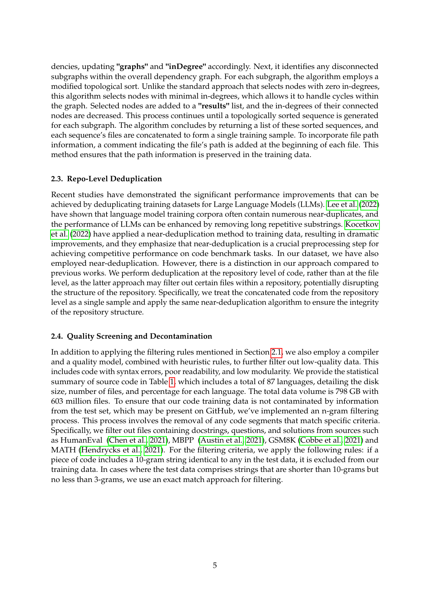

**表 1：所选编程语言的清洗后训练数据汇总。** 表中列出 87 种语言的数据大小、文件数与占比；总计 797.92GB、603,173 千个文件。

## 3 训练方案

### 3.1 训练策略

#### 3.1.1 下一词元预测

第一项训练目标是下一词元预测。多个文件被拼接成固定长度的条目，再用这些条目训练模型，使其根据给定上下文预测后续词元。

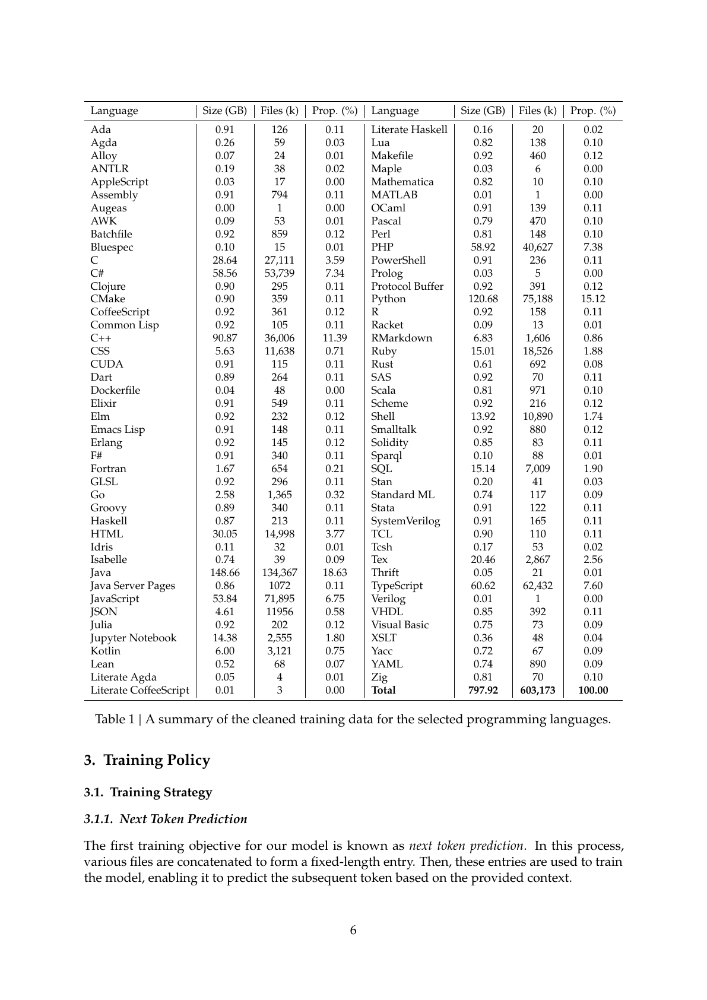

#### 3.1.2 中间填充

第二项训练目标是中间填充。在代码预训练场景中，经常需要根据给定上文和后续文本生成应插入的内容。由于编程语言具有特定依赖关系，只依靠下一词元预测不足以学会中间填充。因此，多项工作（Bavarian 等，2022；Li 等，2023）提出 Fill-in-the-Middle（FIM）预训练：随机把文本切成三部分，打乱顺序后用特殊字符连接，从而在训练中加入填空任务。

FIM 包含两种模式：PSM（前缀-后缀-中间）把语料组织为 $Prefix, Suffix, Middle$，让待填中间段由前缀和后缀夹住；SPM（后缀-前缀-中间）则组织为 $Suffix, Prefix, Middle$。两种模式让模型适应不同代码结构，为高级代码预测任务提供更稳健的训练框架。

为确定不同 FIM 超参数的有效性，我们进行一系列消融实验。

**实验设置。** 使用 DeepSeek-Coder-Base 1.3B，并仅使用训练集中的 Python 子集以简化实验。主要指标是 HumanEval-FIM（Fried 等，2022），它执行 Python 单行填充：随机遮盖 HumanEval 答案中的一行代码，测试模型预测缺失行的能力。我们推测 PSM 与传统下一词元预测略有差异，因为它改变原始文本顺序，可能影响学习动力学。因此测试四种设置：FIM 比例 0%、50%、100%，以及 50% 的 MSP。掩码片段预测（MSP）最早由 T5（Raffel 等，2023）提出，会遮盖多个文本片段并训练模型重建；CodeGen2.5（Nijkamp 等，2023）认为 MSP 的 FIM 表现可能优于 PSM，因此把它纳入比较。

**结果。** 图 3 显示，100% FIM 比例在 HumanEval-FIM 上表现最好，但代码续写能力最弱，说明 FIM 与代码续写之间存在取舍；50% PSM 则超过 MSP。为了平衡中间填充效率与代码续写能力，最终选用 50% PSM。

**图 3：FIM 目标的有效性。** 图中比较不同 FIM/MSP 比例在 HumanEval、HumanEval-FIM 与 MBPP 上随训练步数变化的结果。

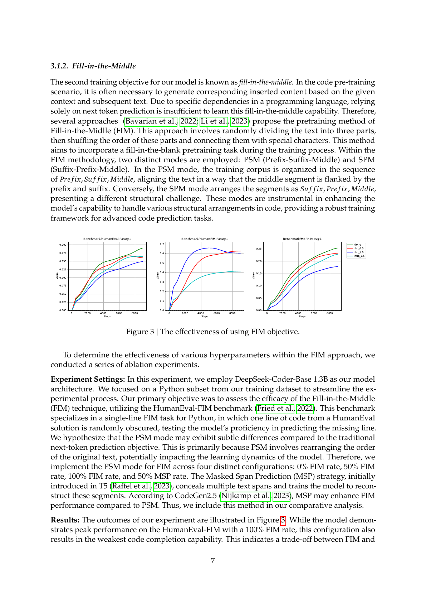

实现中为该任务引入三个哨兵词元。每个代码文件先被分成 $f_{pre}$、$f_{middle}$、$f_{suf}$ 三段；PSM 训练样本构造为：

```text
<｜fim_start｜> f_pre <｜fim_hole｜> f_suf <｜fim_end｜> f_middle <|eos_token|>
```

按照 Bavarian 等（2022）的原始工作，我们在文档级、打包之前应用 FIM，比例为 0.5，并使用 PSM 模式。

### 3.2 分词器

使用 HuggingFace Tokenizer 库，在训练语料子集上训练字节对编码（BPE）分词器（Sennrich 等，2015），最终词表大小为 32,000。

### 3.3 模型架构

为适配不同应用，我们开发 1.3B、6.7B 和 33B 三种规模。模型使用 DeepSeek LLM（DeepSeek-AI，2024）的同一框架，均为仅解码器 Transformer，并采用旋转位置编码（RoPE；Su 等，2023）。DeepSeek-Coder 33B 还使用分组查询注意力（GQA），组大小为 8，以提高训练与推理效率。注意力计算通过 FlashAttention v2（Dao，2023）加速。架构细节见表 2。

### 3.4 优化

沿用 DeepSeek LLM，使用 AdamW（Loshchilov 和 Hutter，2019），$\beta_1=0.9$、$\beta_2=0.95$；批量大小和学习率按 DeepSeek LLM 的缩放规律调整。学习率采用三阶段方案，包含 2000 个预热步，最终学习率设为初始值的 10%；每阶段学习率按 DeepSeek LLM 的规则缩放为前一阶段的 $1/\sqrt{10}$。

### 3.5 训练环境

实验使用高效、轻量的 HAI-LLM（High-Flyer，2023），并集成张量并行、ZeRO 数据并行和 PipeDream 流水线并行等策略。集群配备 NVIDIA A100 与 H800 GPU：每节点 8 张；A100 通过 NVLink 桥两两互联，H800 在节点内使用 NVLink 与 NVSwitch；节点间通信使用高吞吐、低延迟的 InfiniBand。

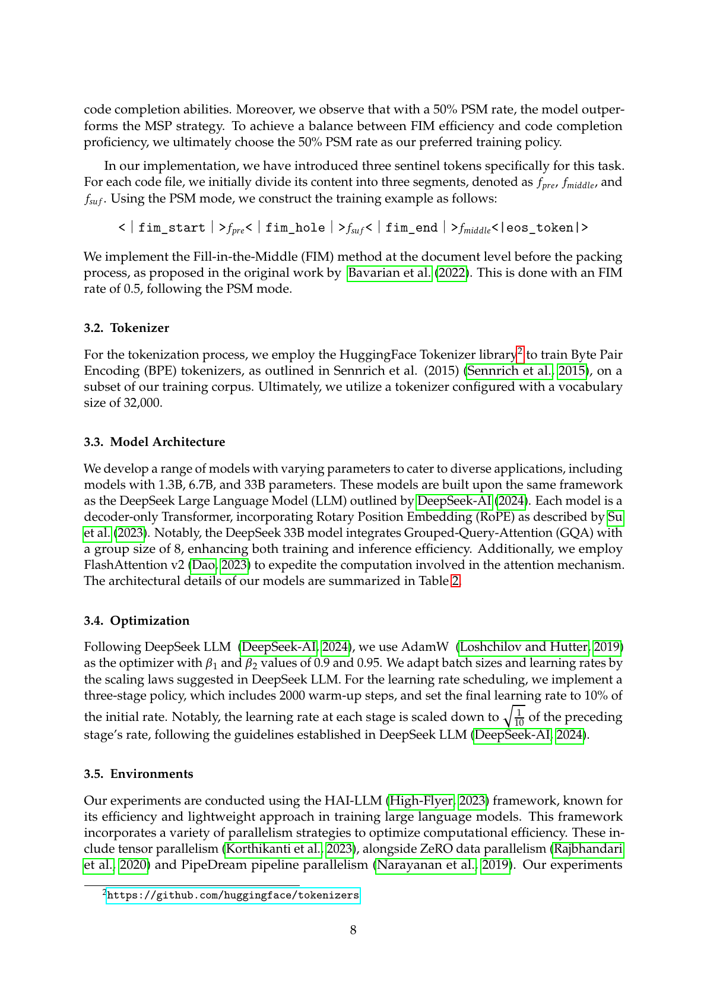

**表 2：DeepSeek-Coder 超参数。** 表中比较 1.3B、6.7B、33B 的隐藏维度、中间维度、层数、注意力头、批量大小与最大学习率；33B 使用组大小为 8 的 GQA，其余使用多头注意力。

### 3.6 长上下文

为了增强 DeepSeek-Coder 处理扩展上下文的能力，特别是仓库级代码场景，我们重新设置 RoPE 参数以扩大默认上下文窗口。沿用既有做法（Chen 等，2023；kaiokendev，2023），采用线性缩放，把缩放系数从 1 提高到 4，并把基频从 10000 改为 100000。模型额外训练 1000 步，批量大小 512、序列长度 16K，学习率保持为预训练最后阶段的值。

理论上，这些修改使模型能够处理最长 64K 词元；但经验观察表明，它在 16K 以内输出最可靠。未来将继续改进、评估长上下文适配方法，使 DeepSeek-Coder 处理长上下文时更高效、更易用。

### 3.7 指令微调

我们使用高质量数据对 DeepSeek-Coder-Base 进行指令微调，得到 DeepSeek-Coder-Instruct。数据由有帮助且公正的人类指令构成，并按 Alpaca Instruction 格式组织。每轮对话使用独特分隔词元 `<|EOT|>` 标记结束。训练采用余弦调度、100 个预热步、初始学习率 $10^{-5}$；批量大小为 400 万词元，总训练量 20 亿词元。

图 4 是 DeepSeek-Coder-Instruct 33B 构建贪吃蛇游戏的多轮对话示例。第一轮要求使用 pygame 编写游戏，模型生成可无缺陷运行的基础版本；第二轮要求在左上角增加计分系统，模型加入 `score` 变量与 `display_score` 函数，并解释如何集成。示例体现模型在多轮对话中给出完整解决方案的能力，附录 A 还有更多案例。

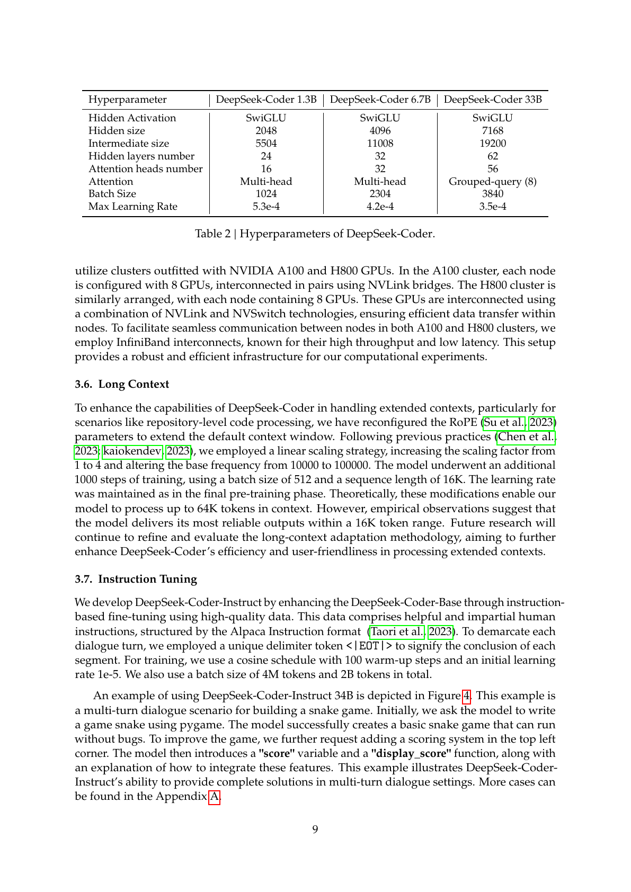

**图 4：DeepSeek-Coder-Instruct 33B 的多轮回答示例。** 第一轮生成 pygame 贪吃蛇，第二轮在已有代码上增加左上角计分系统。

## 4 实验结果

本节评估四类任务：代码生成、中间填充代码补全、跨文件代码补全，以及基于程序的数学推理。比较对象包括：

- **CodeGeeX2：** 多语言代码生成模型 CodeGeeX 的第二代，基于 ChatGLM2 架构，并用大量代码样例增强。
- **StarCoder：** 公开的 150 亿参数模型，在精心整理的 The Stack 子集上训练，覆盖 86 种编程语言。
- **CodeLlama：** 从 LLaMA2 派生的代码大模型系列，提供 7B、13B、34B 三种规模，并在 5000 亿词元代码语料上继续训练。
- **code-cushman-001：** OpenAI 开发的 120 亿参数模型，是 GitHub Copilot 最初使用的模型。
- **GPT-3.5 与 GPT-4：** OpenAI 的生成式人工智能模型。它们并非专门为代码生成训练，但巨大参数规模使其在该领域同样表现突出。

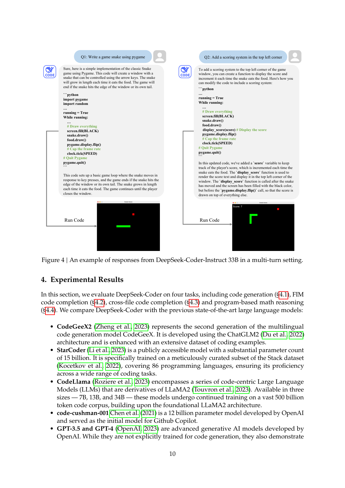

### 4.1 代码生成

#### 4.1.1 HumanEval 与 MBPP

HumanEval（Chen 等，2021）与 MBPP（Austin 等，2021）广泛用于评估代码大模型。HumanEval 包含 164 道人工编写的 Python 问题，在零样本设置下用测试用例验证生成代码；MBPP 包含 500 道问题，采用少样本设置。为评估多语言能力，我们把 HumanEval 的 Python 问题扩展到另外七种常用语言：C++、Java、PHP、TypeScript、C#、Bash 与 JavaScript（Cassano 等，2023）。两项基准均采用贪心搜索，并在相同脚本和环境下重新运行基线以保证公平。

表 3 显示，DeepSeek-Coder-Base 在 HumanEval 上取得 50.3% 的平均准确率，在 MBPP 上取得 66.0%，达到当时最佳。相比规模相近的 CodeLlama-Base 34B，两项准确率分别提高 9 与 11 个百分点；规模更小的 DeepSeek-Coder-Base 6.7B 也超过 CodeLlama-Base 34B。指令微调后，模型在 HumanEval 上超过闭源 GPT-3.5-Turbo，显著缩小开源模型与 GPT-4 的差距。

**表 3：多语言 HumanEval 与 MBPP 上的结果。** 表中分别报告基座模型与指令模型在八种编程语言以及 MBPP 上的 Pass@1。

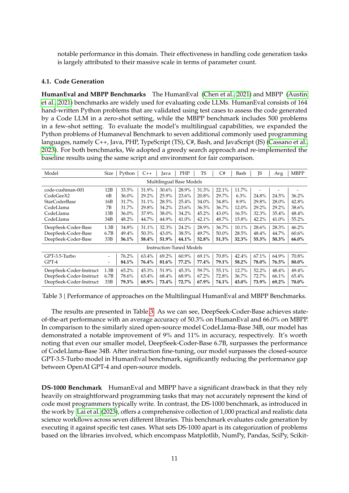

#### 4.1.2 DS-1000

HumanEval 与 MBPP 主要是较简单的编程题，未必能准确代表程序员日常编写的代码。DS-1000（Lai 等，2023）则收录 1000 个实际、真实的数据科学工作流，覆盖 Matplotlib、NumPy、Pandas、SciPy、Scikit-Learn、PyTorch 与 TensorFlow 七个库，并通过执行特定测试用例评估代码生成。基准按涉及的库分类，在代码补全设置下评估基座模型，并报告每个库及总体 Pass@1。

表 4 显示，DeepSeek-Coder 在所有库上都有较高准确率，说明它不仅能生成良好代码，也能在真实数据科学工作流中更准确地使用库。

**表 4：不同模型在 DS-1000 任务上的表现。** DeepSeek-Coder-Base 33B 总体得分 40.2%，高于比较中的全部开源基座模型。

#### 4.1.3 LeetCode Contest

为进一步验证真实编程能力，我们构建 LeetCode Contest 基准。LeetCode 提供竞赛级题目，对问题理解与代码生成提出很大挑战。为避免题目或答案进入预训练数据，我们收集 2023 年 7 月至 2024 年 1 月的最新竞赛题，共 180 道；每题收集 100 个测试用例以保证覆盖。提示模板要求模型根据问题描述补全给定 Python 代码模板。

结果显示，DeepSeek-Coder 明显超过现有开源代码模型。DeepSeek-Coder-Instruct 6.7B 与 33B 的 Pass@1 分别为 19.4% 与 27.8%，高于 CodeLlama-33B 等模型；其中 33B 是唯一超过 GPT-3.5-Turbo 的开源模型，但与更先进的 GPT-4-Turbo 仍有明显差距。

分析还表明，思维链提示能明显增强 DeepSeek-Coder-Instruct，尤其是在较难题目上。只需在原始提示后加入“先写出逐步解题纲要，再编写代码”，表现便会提高。先给出详细代码方案有助于模型理解复杂编程任务中的逻辑和依赖。因此，处理复杂代码问题时，我们强烈建议使用思维链提示，以形成更加系统、合乎逻辑的解题框架，并提高代码生成的准确性和效率。

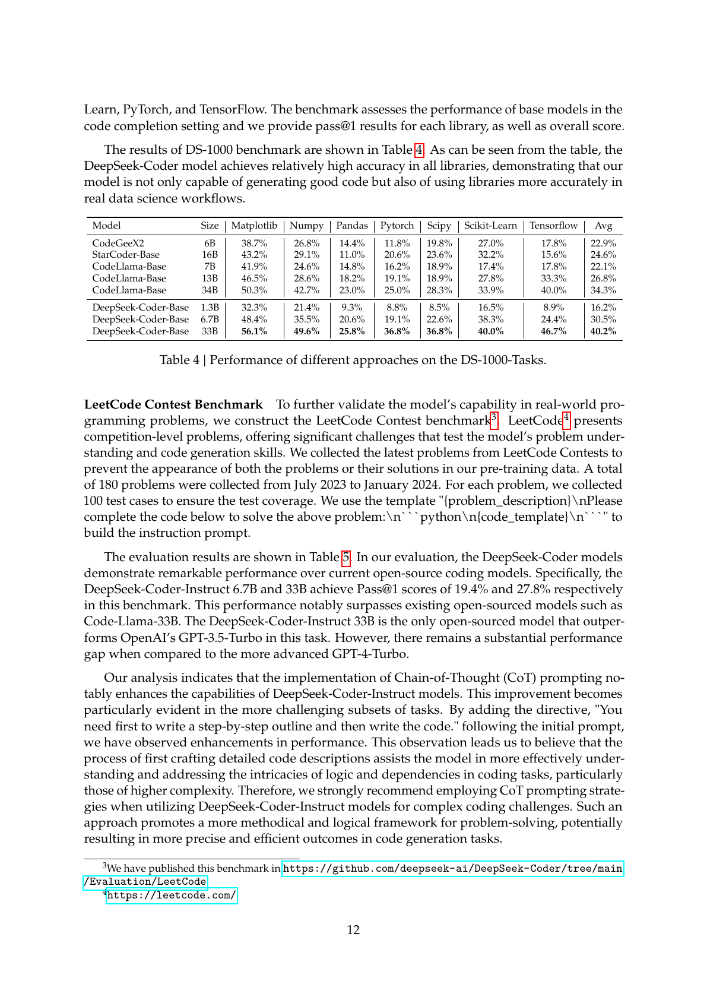

**表 5：不同模型在 LeetCode Contest 上的表现。** 表中按简单、中等、困难和总体报告结果；DeepSeek-Coder-Instruct 33B 加思维链达到 28.9%。

尽管我们尽力收集最新题目，仍无法完全排除数据污染。GPT-4-Turbo 与 DeepSeek-Coder 在 2023 年 7、8 月竞赛上的得分较高；我们建议研究社区使用已发布的 LeetCode 数据评估时，考虑潜在污染问题。

### 4.2 中间填充代码补全

DeepSeek-Coder 在预训练期间使用 0.5 的 FIM 比例，因此能够依据给定代码片段的前缀与后缀填空生成代码，这对代码补全工具尤其有利。SantaCoder、StarCoder 与 CodeLlama 也具备类似能力。我们使用 Allal 等（2023）提出的单行填充基准进行比较，覆盖 Python、Java 与 JavaScript，并以整行精确匹配率为指标。

表 6 显示，即使最小的 DeepSeek-Coder 只有 13 亿参数，也能在这些基准上超过规模更大的 StarCoder 与 CodeLlama，这可归因于高质量预训练数据。性能还会随模型规模稳定提升，说明模型容量对代码补全准确率十分重要。综合效率与准确率，我们建议在代码补全工具中部署 DeepSeek-Coder-Base 6.7B。

**表 6：不同模型在 FIM 任务上的表现。** DeepSeek-Coder-Base 6.7B 与 33B 的平均精确匹配率分别为 80.7% 与 81.2%。

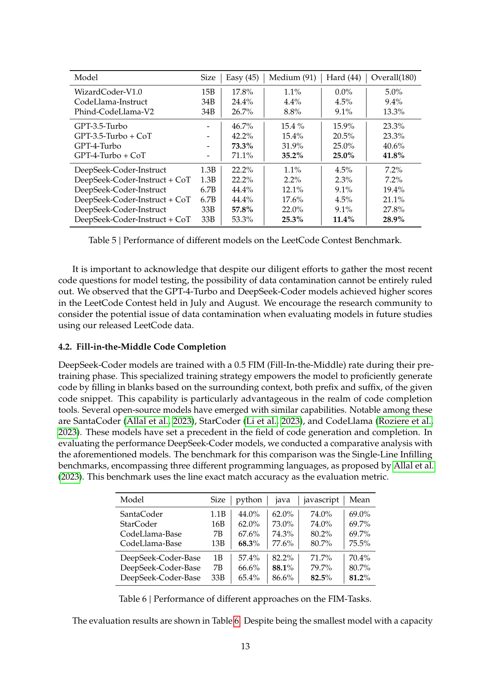

### 4.3 跨文件代码补全

跨文件代码补全要求模型访问并理解含有许多跨文件依赖的多文件仓库，不同于前面的单文件代码生成。我们使用 CrossCodeEval（Ding 等，2023）评估现有 7B 级开源代码模型。该数据集来自 Python、Java、TypeScript、C# 四种语言的真实、开源、许可证宽松的仓库，并被专门设计成只有利用跨文件上下文才能准确补全。仓库创建于 2023 年 3 月至 6 月，而预训练数据只包含 2023 年 2 月之前的代码，因此避免了数据泄漏。

评估把最大序列长度设为 2048，最大输出 50 词元，跨文件上下文上限 512 词元；跨文件上下文使用 Ding 等提供的官方 BM25 检索结果，指标为精确匹配与编辑相似度。表 7 显示，DeepSeek-Coder 在多种语言的跨文件补全上持续超过其他模型，体现更强的实际应用能力。若只用文件级代码语料预训练、取消仓库级预训练，Java、TypeScript 与 C# 性能都会下降，证明仓库级预训练有效。

**表 7：不同模型在跨文件代码补全上的表现。** 表中比较无检索、有检索，以及移除仓库级预训练后的结果。

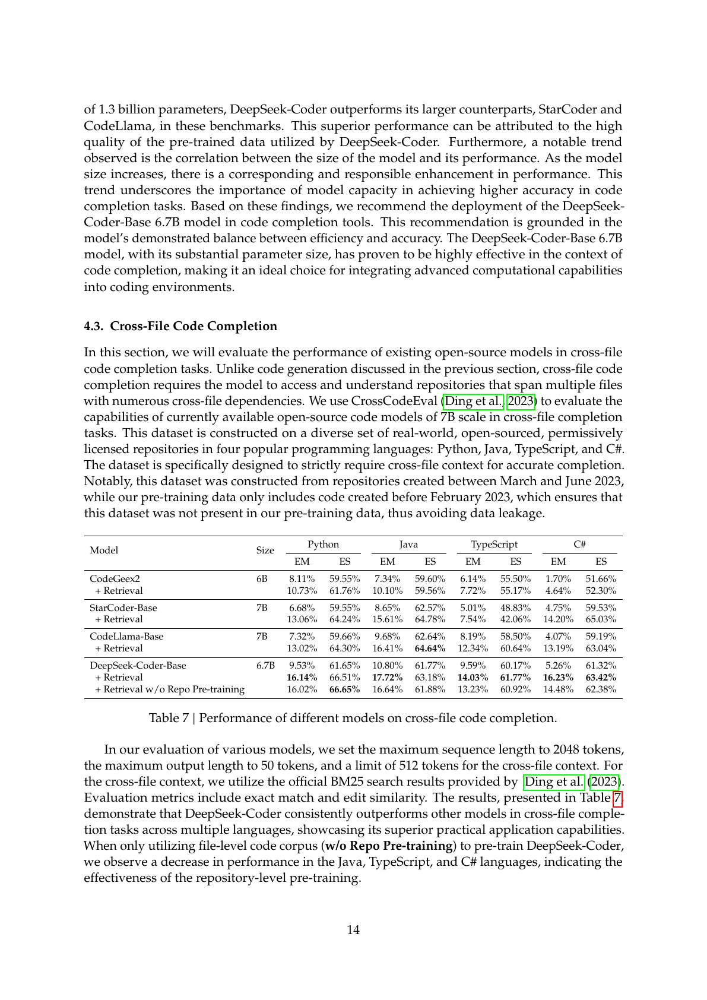

### 4.4 基于程序的数学推理

基于程序的数学推理评估模型通过编程理解并解决数学问题的能力，这对数据分析、科学计算等领域很重要。我们使用程序辅助语言模型（PAL；Gao 等，2023）方法，在 GSM8K、MATH、GSM-Hard、SVAMP、TabMWP、ASDiv 与 MAWPS 七项基准上评测。模型在每项任务中交替用自然语言描述一个解题步骤，再通过代码执行该步骤。

表 8 显示，DeepSeek-Coder 在全部基准上表现突出，33B 尤其优秀，体现了它用于复杂数学计算与问题求解应用的潜力。

**表 8：基于程序的数学推理结果。** DeepSeek-Coder-Base 33B 的七项平均准确率为 65.8%，高于比较中的全部开源基座模型。

## 5 从通用大模型继续预训练

为了进一步增强自然语言理解与数学推理能力，我们从通用语言模型 DeepSeek-LLM-7B Base 出发，在 2 万亿词元上继续预训练，得到 DeepSeek-Coder-v1.5 7B。与 DeepSeek-Coder 不同，v1.5 在预训练中只使用下一词元预测目标，上下文长度为 4K。

训练数据由 70% 源代码、10% Markdown 与 StackExchange、7% 代码相关自然语言、7% 数学相关自然语言，以及 6% 中英双语自然语言组成。

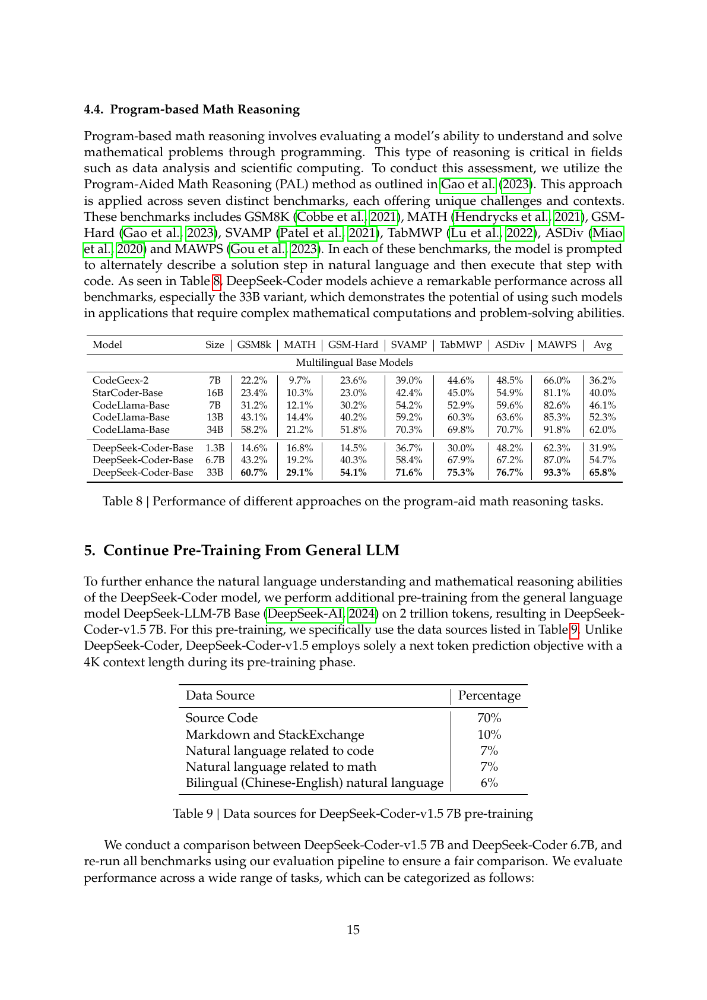

我们将 DeepSeek-Coder-v1.5 7B 与 DeepSeek-Coder 6.7B 比较，并使用同一评估流程重新运行全部基准。任务分为：

- **编程：** 多语言 HumanEval，以及 Python MBPP。
- **数学推理：** GSM8K 与 MATH，均通过生成程序解决数学问题。
- **自然语言：** MMLU、BBH、HellaSwag、WinoGrande 与 ARC-Challenge。

表 10 同时报告基座版与指令版。DeepSeek-Coder-Base-v1.5 的编程表现略有下降，但大多数其他任务显著改善；尤其在数学推理与自然语言类别，它在全部基准上明显超过前代，说明数学推理和自然语言处理能力获得大幅提升。

**表 10：DeepSeek-Coder 与 DeepSeek-Coder-v1.5 的性能比较。** 数学任务通过编程求解。

## 6 结论

本文介绍专门面向编程的 DeepSeek-Coder 大模型系列，提供 1.3B、6.7B 与 33B 三种规模。模型在精心整理的项目级代码语料上训练，并使用填空式预训练目标增强代码填充能力；上下文窗口扩展到 16,384 词元，显著改善长代码生成。最强的 DeepSeek-Coder-Base 33B 在多项标准测试上超过既有开源代码模型；规模更小的 6.7B 也达到 34B CodeLlama 的水平，体现预训练语料的高质量。

为了增强零样本指令能力，我们使用高质量指令数据微调基座模型。得到的 DeepSeek-Coder-Instruct 33B 在多项代码任务上超过 OpenAI GPT-3.5 Turbo，展现出优秀的代码生成与理解能力。

为了进一步提高自然语言理解，我们还从 DeepSeek-LLM 7B 检查点出发继续预训练，并处理由自然语言、代码和数学数据组成的多样语料，得到 DeepSeek-Coder-v1.5。它在保持前代高水平编程性能的同时增强了自然语言理解。这支持我们的判断：最有效的代码大模型应建立在强大的通用大模型之上，因为要准确理解并执行编程任务，模型也必须深入理解以多种自然语言形式表达的人类指令。未来，我们将继续基于更大规模通用大模型开发并开放更强的代码模型。

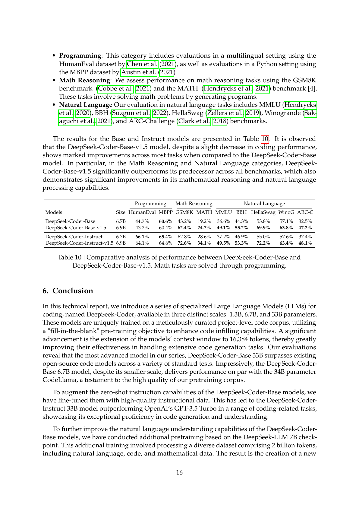

## 致谢

感谢 Bo Liu、Chengqi Deng、Chong Ruan、Damai Dai、Jiashi Li、Kang Guan、Mingchuan Zhang、Panpan Huang、Shuiping Yu、Shirong Ma、Yaofeng Sun、Yishi Piao、Zhihong Shao 与 Zhewen Hao 在 DeepSeek-Coder 训练期间提供宝贵讨论与帮助。

## 参考文献

原论文参考文献从第 17 页延续到第 20 页。为完整保留作者、题名、出版信息与链接，以下按 PDF 原始页序收录。

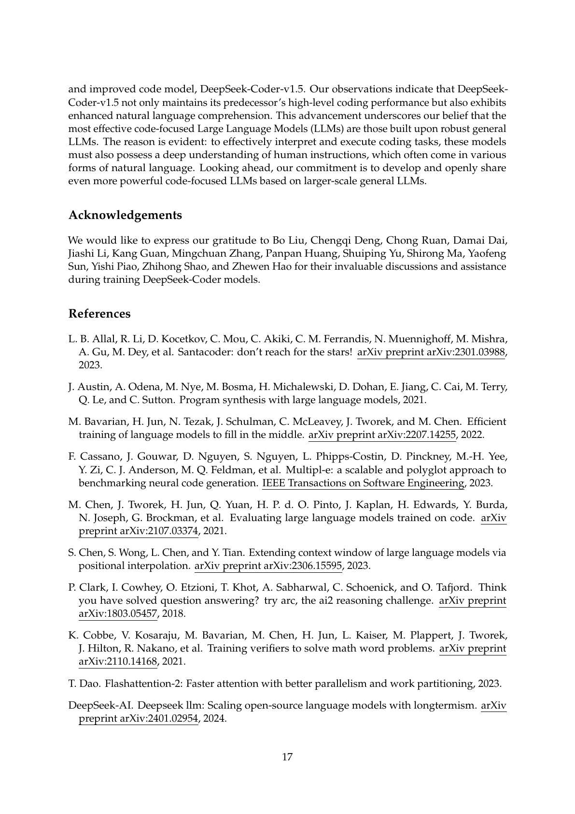

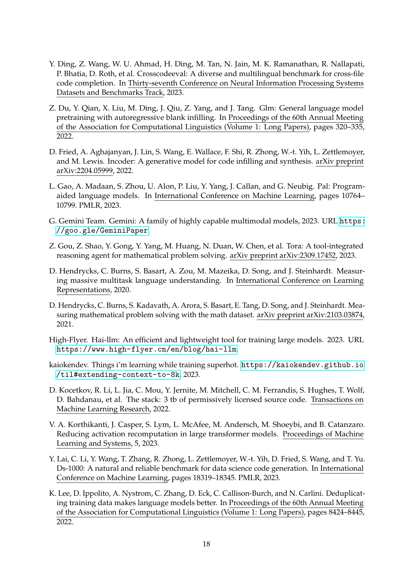

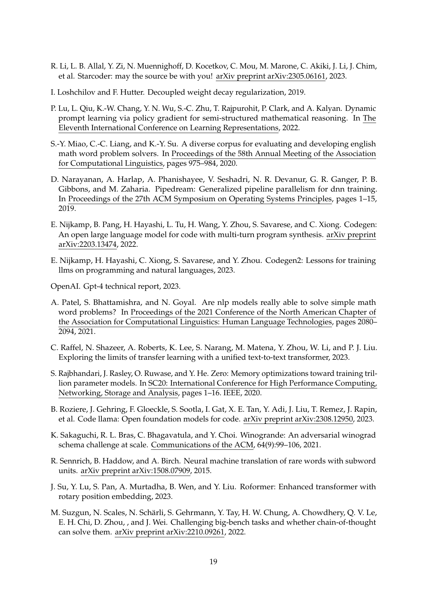

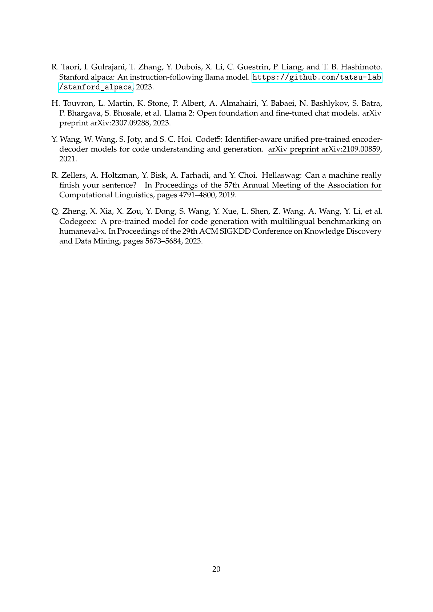

## 附录

### A DeepSeek-Coder-Instruct 对话案例

附录展示两则交互案例：一则是通过多轮对话创建数据库并分析数据，另一则是让模型解决一道 LeetCode 示例题。

第一则案例中，用户先要求模型使用 Python 构建学生数据库、随机插入 10 条信息并显示；第二轮继续要求分析学生年龄分布。图 5 表明，模型能够生成完整、没有缺陷的代码，并给出解释。第二则案例用一道分布外 LeetCode 竞赛题测试模型；题目在数据收集结束后的 2023 年 11 月发布，因此不在训练数据中。结果显示，模型能够出色解决超出训练分布的问题。

**图 5：构建数据库与数据分析案例。** 第一轮创建 SQLite 学生数据库并插入记录，第二轮读取数据并绘制年龄分布直方图。

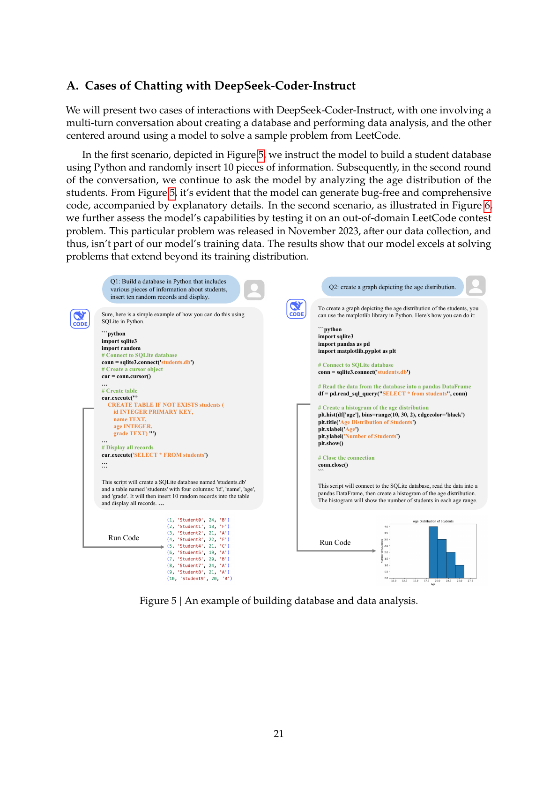

**图 6：解决 LeetCode 问题的案例。** 模型根据有向无环图中队伍强弱关系，利用入度与拓扑排序找出唯一冠军。

### B DeepSeek-Coder-Base 训练期间的基准曲线

图 7 展示 DeepSeek-Coder-Base 各模型训练期间的基准曲线。验证集是从训练语料中精心选出的 8000 个代码文件，保证多样性与代表性，从而准确评估模型能力；最后两幅子图还专门展示验证代码续写与 FIM 续写表现。

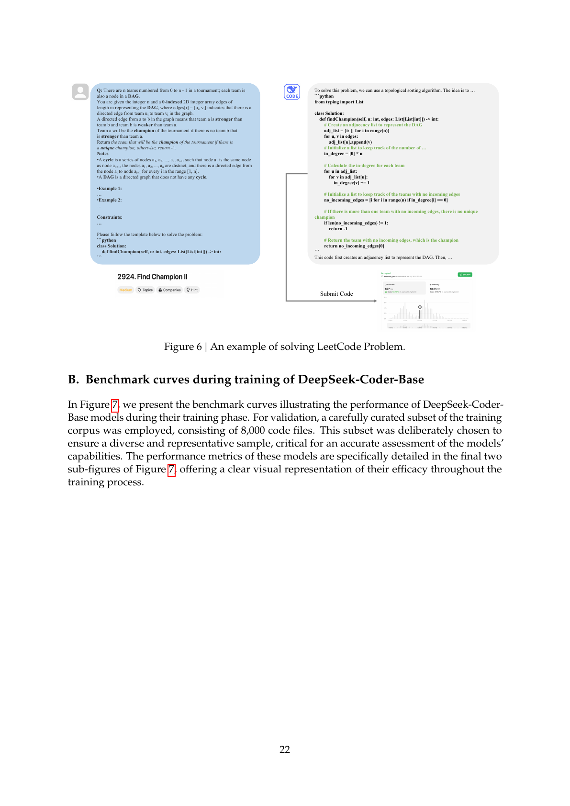

**图 7：DeepSeek-Coder-Base 训练期间的基准曲线。** 曲线比较 1.3B、6.7B 与 33B 在 HumanEval、C++/Java HumanEval、HumanEval-FIM、MBPP、多语言 HumanEval 均值、验证续写和验证 FIM 续写上的变化。

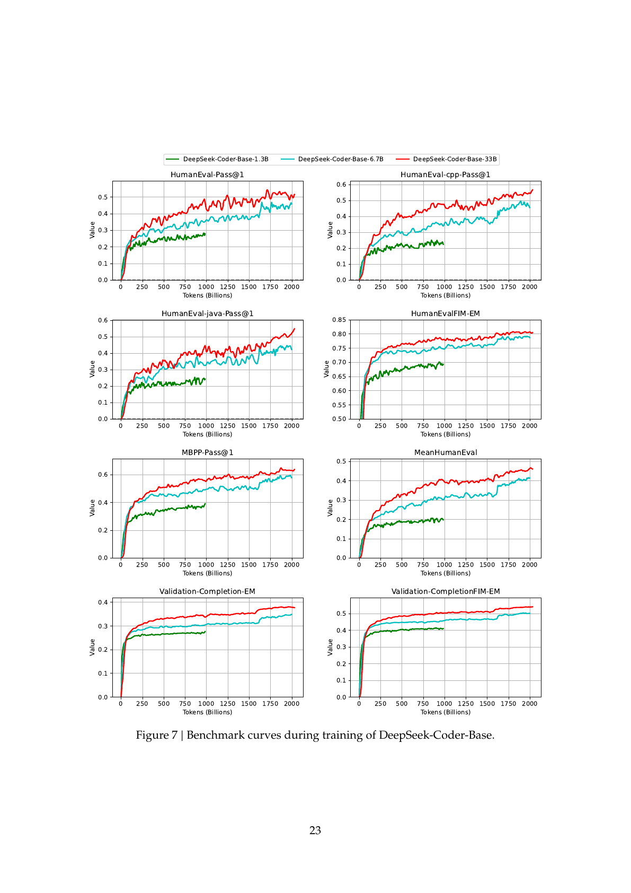
