# DeepSeek-Prover：通过大规模合成数据推进大型语言模型定理证明

**作者：** Huajian Xin、Daya Guo、Zhihong Shao、Z.Z. Ren、Qihao Zhu、Bo Liu、Chong Ruan、Wenda Li、Xiaodan Liang  
**机构：** DeepSeek、中山大学、爱丁堡大学、穆罕默德·本·扎耶德人工智能大学

## 摘要

Lean 等证明助手彻底改变了数学证明的验证方式，确保了高度准确性与可靠性。大型语言模型在数学推理上展现出潜力，但训练数据不足阻碍了它们在形式化定理证明方面的进步。为解决这一问题，我们提出一种方法，从高中和本科层次数学竞赛题中生成大规模 Lean 4 证明数据。该方法先把自然语言问题翻译为形式化陈述，再滤除低质量陈述，最后生成证明以构建合成数据。

我们在包含 800 万条“形式化陈述—证明”对的合成数据集上微调 DeepSeekMath 7B。模型在 Lean 4 miniF2F 测试集上，使用 64 次采样的完整证明生成准确率达到 46.3%，累计准确率达到 52%；相比之下，GPT-4 基线使用 64 次采样仅为 23.0%，基于树搜索的强化学习方法为 41.0%。此外，在由 148 道题组成的 Lean 4 形式化国际数学奥林匹克（FIMO）基准中，本模型成功证明 5 道，而 GPT-4 一道也未能证明。

结果表明，利用大规模合成数据可以增强 LLM 的定理证明能力。作者将开放合成数据集与模型，以推动这一重要方向的后续研究。

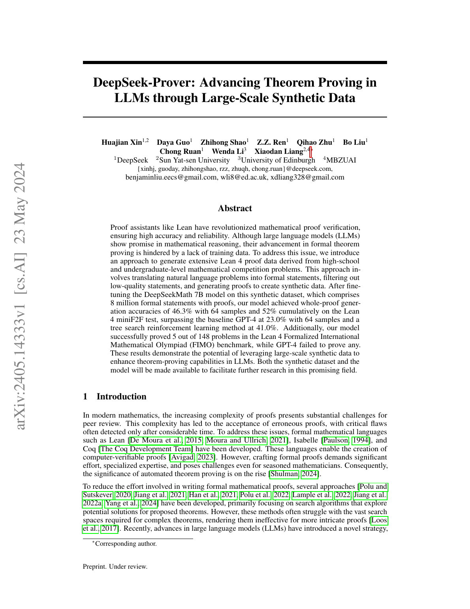

## 1 引言

现代数学证明日益复杂，给同行评审带来重大挑战。错误证明可能因此被接受，其中的关键缺陷往往经过很长时间才会被发现。为解决这些问题，研究者开发了 Lean、Isabelle 和 Coq 等形式化数学语言，使证明能够由计算机验证。然而，编写形式化证明需要投入大量精力，要求专业知识，即便对经验丰富的数学家也并不容易。因此，自动定理证明的重要性不断上升。

为了减少形式化数学证明的编写成本，已有多种方法主要通过搜索算法探索待证定理的候选解。然而，复杂定理对应的搜索空间极其庞大，这些方法常常因此失效。近年来，大型语言模型带来了新策略：用预训练模型引导搜索过程。这些方法虽然进步明显，却仍因缺少平行语料而无法实用化。不同于 Python、Java 等常规编程语言，形式化证明语言只被少数数学家使用，可用数据十分有限。自动形式化的进展使研究者能够合成更对齐的数据来训练基于 LLM 的自动定理证明器，但已有数据集仍太小，无法充分释放 LLM 能力。

为此，我们提出一种从非形式化数学题生成大规模 Lean 4 证明数据的方法。方法将高中与本科层次数学竞赛题翻译为形式化陈述，再使用 LLM 自动生成证明，并在 Lean 4 环境中验证证明是否正确。主要挑战是同时保证合成数据的规模和质量。

### 质量保证

我们通过多步骤流程提高生成证明的质量。首先使用质量评分模型过滤过于简单的陈述，再利用假设拒绝策略排除无效陈述。随后使用一种新的迭代框架：先让仅在少量数据上微调、训练尚不充分的 LLM 把非形式化数学题转为合成陈述；再为这些陈述生成对应证明，并用 Lean 4 验证器检查正确性；最后用验证正确的定理—证明对继续训练初始模型。

经过数轮迭代，在大规模合成数据上训练的模型会显著强于最初训练不足的模型，进而生成质量更高的定理—证明对。

### 规模保证

为了加快证明生成，我们还处理了证明搜索空间庞大的问题。延迟的重要来源是不可证明的陈述：系统会持续尝试，直至到达时间上限。为缓解这一点，我们让原陈述及其否定陈述并行接受证明搜索；一旦其中任意一个得到证明，就立即终止整个搜索过程。

我们在 miniF2F 的 488 道题和 FIMO 的 148 道题上评估 Lean 4 定理证明效果，并以领先数学模型 DeepSeekMath 7B 为基础。迭代训练后的模型表现强劲：miniF2F-test 上使用 64 次采样的完整证明生成准确率为 46.3%，高于 GPT-4 的 23.0% 和强化学习方法的 41.0%。FIMO 上，本方法使用每题 100 次采样证明了 4 道题，而 GPT-4 一道未证；使用 4096 次采样时，本方法证明了 5 道。消融实验还显示，每增加一轮迭代，模型都能在 miniF2F 上解决更多题目。

本文主要贡献如下：

- 提出一种迭代方法，从非形式化数学题合成 800 万条形式化陈述，并为每条陈述配套形式化证明。实验表明，该方法显著提高了合成数据的规模和质量。
- 在该合成数据集上训练的模型达到当时最先进的基准表现：Lean 4 miniF2F 测试集上，64 次采样完整证明生成准确率为 46.3%，累计准确率为 52%；超过 GPT-4 基线和树搜索强化学习方法。在 FIMO 上，模型成功证明 148 道题中的 5 道，而 GPT-4 一道未证。
- 创建并开放大规模高质量形式化数学证明数据集，为数学和人工智能社区进一步研究自动定理证明提供资源。

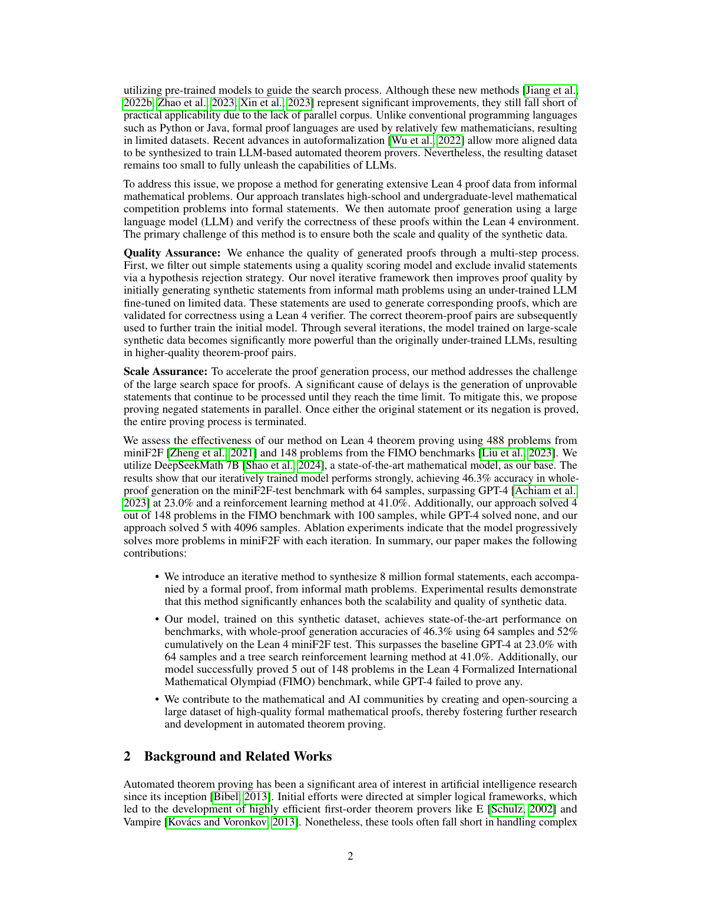

## 2 背景与相关工作

自动定理证明从人工智能研究诞生之初就是重要方向。早期工作聚焦较简单的逻辑框架，催生了 E、Vampire 等高效的一阶定理证明器。不过，这些工具在处理 Lean、Isabelle、Coq 等现代证明助手中的复杂定理时往往能力不足。深度学习模型和模型引导搜索的兴起重新激活了这一领域，不仅增强了自动定理证明系统的能力，也拓展了它们解决复杂数学问题的适用范围。

### 使用神经模型的自动定理证明

随着深度学习发展，多种方法开始把神经模型与自动定理证明结合。一类方法采用神经模型引导的树搜索算法，并主要借助强化学习提升模型准确率。但搜索空间非常大，搜索过程会消耗大量时间和计算资源。

另一类方法利用大型语言模型。通常先用开源证明数据微调语言模型，再通过状态—动作转移程序与验证器交互：系统迭代生成证明步骤，使用形式化验证器检查其正确性，然后根据验证器返回的证明状态继续生成下一步。这类方法性能很高，但计算成本也很高。为提高效率，近期研究让语言模型直接生成完整形式化证明，从而绕开证明生成期间的反复交互。

### 面向形式化数学的自动形式化

可用形式化语料有限，同样限制了当前 LLM 的表现。部分工作提出自动形式化，也就是把自然语言描述转换为可由证明助手验证的形式化陈述。一些研究使用基于规则的变换，从现有定理生成形式化证明合成数据。此类方法虽有效，却受预定义规则约束，难以灵活扩展到更广泛应用。

近期方法开始用 LLM 把自然语言题目翻译为形式化陈述，但所得数据集规模仍然不足，而且局限于小型数学基准，对语言模型训练结果的提升很有限。本文希望以远大于以往的规模，通过自动形式化合成形式化证明，从而增强神经定理证明器。

## 3 方法

如图 1 所示，方法包含四个关键过程。第一阶段从大量非形式化数学题生成仍待证明的形式化数学陈述。接着，通过模型评分和假设拒绝筛选自动形式化后的陈述，保留高质量内容。然后，由 DeepSeek-Prover 尝试证明这些陈述，并由 Lean 4 形式化验证器检查正确性，得到经过验证的形式化陈述和证明。这些数据作为合成数据继续微调 DeepSeek-Prover。

模型增强之后，再重复整个流程，直到 DeepSeek-Prover 的提升变得很小。为提高证明效率，原陈述及其否定会并行接受证明搜索；当否定陈述首先被证明时，可以迅速丢弃无效的原陈述。

### 3.1 自动形式化

生成形式化证明数据，首先需要大规模形式化陈述语料。人工编写大量形式化陈述十分困难，但互联网上存在大量以自然语言表达的数学题。通过自动形式化这些题目，可以构建庞大的形式化陈述库。

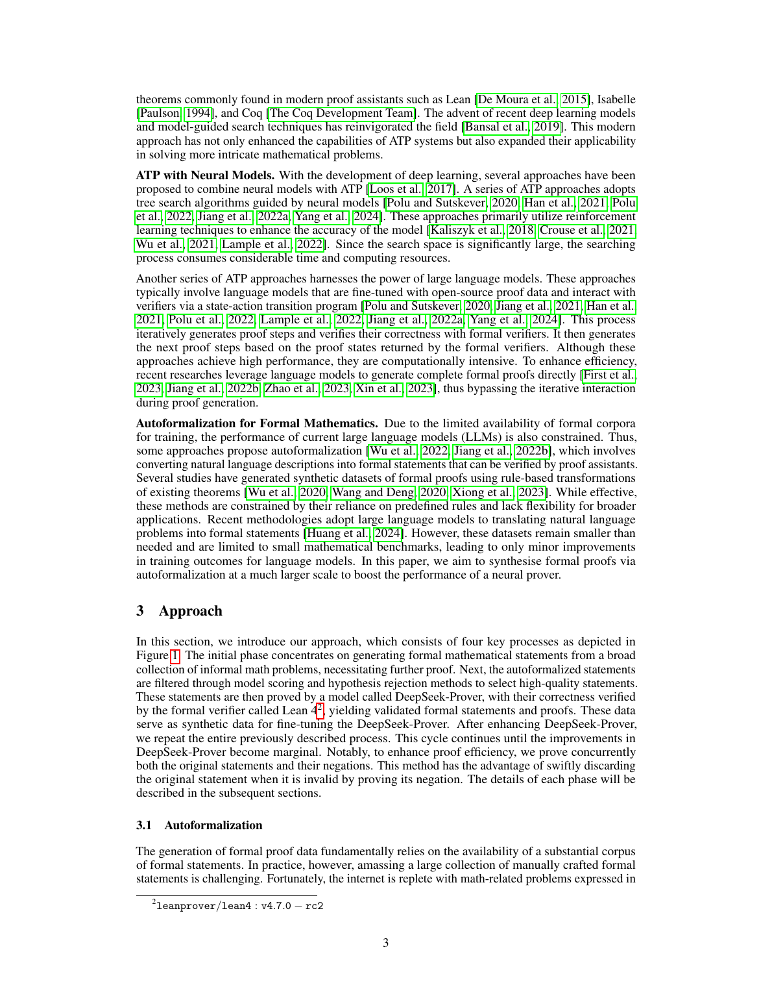

我们观察到，条件明确、目标清晰的问题通常比需要复杂定义和构造的高等数学题更容易形式化。因此，本文主要研究高中和本科层次的竞赛题，重点是代数与数论，也包含少量组合、几何和统计。尽管表面上不算高深，这些题目常需要复杂解法，适合用来构建证明数据并提升 LLM 的定理证明能力。

我们通过网页抓取和严格数据清洗，从高中、本科练习、考试与竞赛等在线资源中收集题目，最终得到 869,659 道高质量自然语言数学题。

具体来说，DeepSeek-Prover 以 DeepSeekMath-Base 7B 初始化。模型起初很难把非形式化数学题转成形式化陈述，因此我们先用 MMA 数据集进行微调。MMA 包含 Lean 4 `mathlib` 中的形式化陈述，这些陈述由 GPT-4 反向翻译为自然语言题目描述。随后，以结构化提示要求模型把自然语言问题翻译为 Lean 4 形式化陈述。原始提示模板和输出格式见原页。

### 3.2 质量过滤

自动形式化得到的陈述质量不够理想，主要有两个问题。

第一，许多形式化陈述过于简单。为此，我们制定评分标准，并从 miniF2F-valid 选取示例作为少样本样例，引导 DeepSeek-Prover 通过思维链评价陈述内容与质量。人工复核表明，模型评分与人的直觉和预期高度吻合。模型把每条形式化陈述分为“优秀”“良好”“中上”“一般”或“较差”，其中“一般”和“较差”会被排除。详细提示见附录 A.1。

图 1 展示完整闭环：自动形式化、模型评分与假设拒绝、陈述证明、证明器微调，以及重复迭代。证明阶段又分为原陈述证明与否定陈述证明，二者共享形式化验证器。

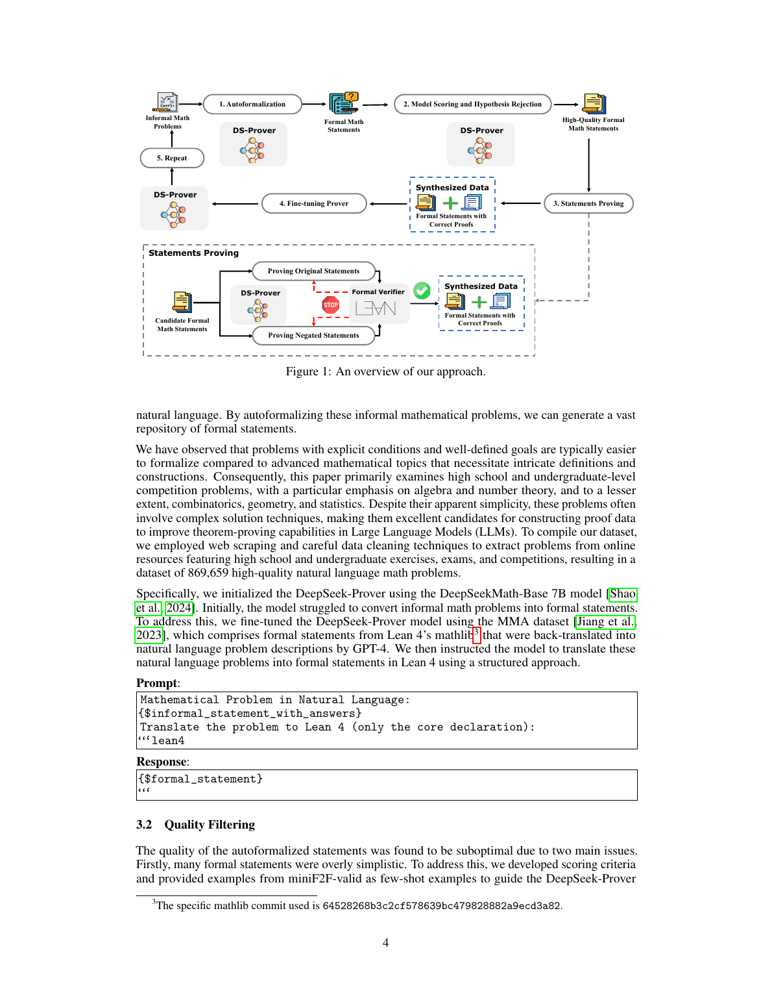

第二类问题是：有些形式化陈述虽然可证，但建立在相互矛盾的假设上，结论只是空洞成立，在数学上没有意义。原论文举例：模型声称所有复数都同时满足若干互相矛盾的幂等式，再由此推出一个三角函数结论。因为前提显然为假，任何结论都能从中推出。

为从数据集中排除这类样本，我们实现假设拒绝方法：让 DeepSeek-Prover 尝试把形式化陈述的结论改为 `False` 并加以证明。一旦证明成功，就意味着假设不一致，该陈述会被排除。结合模型评分与假设拒绝后，最终得到 712,073 条高质量形式化陈述，为后续证明合成提供坚实基础。

### 3.3 陈述证明

获得大规模高质量形式化陈述后，我们使用模型搜索它们的证明。传统上，语言模型常以暴力方式证明定理：不断尝试，直到找到有效证明或耗尽计算资源。这不适用于本文任务。以往模型面对的是人工精心编写、通常真实且可证的形式化陈述；自动形式化的陈述中却有很多可能不正确，而在可靠证明系统中，错误命题不可能被证明。

大规模自动形式化会放大这一问题。我们观察到，即使经过质量过滤，模型生成的形式化陈述中至少仍有 20% 不正确；若继续暴力搜索，将浪费大量计算资源。

为减少不可证陈述造成的资源浪费，我们利用命题与其否定之间的逻辑对称性加速证明合成。每条合成陈述同时启动两路证明搜索：一路证明 $\Gamma\vdash P$，另一路证明 $\Gamma\vdash\neg P$。任何一路先找到有效证明，搜索就立即结束，并由此确定另一路不可证明。若未提前找到证明，每路最多尝试 $k$ 次。

所有通过验证的证明，不论支持原定理还是其否定，都会汇总用于继续训练 DeepSeek-Prover。因此，这一双路方法也相当于数据增强：即使原命题被模型错误形式化，数据集仍能同时吸收命题或它的否定。

### 3.4 迭代增强

整个流水线高度依赖 DeepSeek-Prover，因此每轮之后增强模型至关重要。我们持续使用新生成数据微调模型，再将更新后的模型用于下一轮自动形式化。核心认识是，模型经过每轮“生成—训练—再应用”后，会逐步变得更强、更有效；直到不再出现提升才停止迭代。模型生成的定理—证明对因此会逐轮提高质量，DeepSeek-Prover 的性能也会通过持续改进稳定增强。

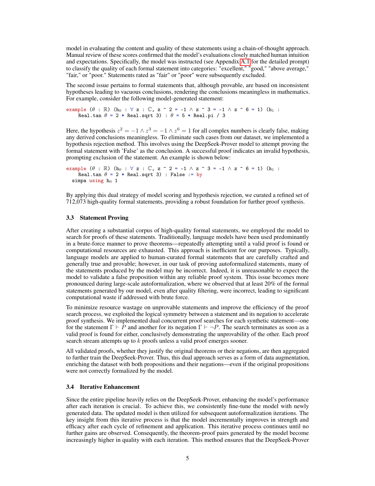

## 4 实验

### 4.1 实验设置

DeepSeek-Prover 建立在 DeepSeekMath-Base 7B 之上。该模型是仅解码器 Transformer，在包含 1200 亿个数学相关词元的语料上预训练。我们使用全局批量大小 512、恒定学习率 $1\times10^{-4}$ 和 6000 个预热步骤，在合成数据上微调模型。

DeepSeek-Prover 与以下基线比较：

- GPT-3.5 与 GPT-4 是 OpenAI 开发的先进生成式 AI 模型，在代码生成等多种任务上表现突出。它们虽然不是专为定理证明设计，但庞大的规模和参数量带来较强能力。DeepSeekMath 则是专门使用数学内容预训练的模型。我们使用 GPT-4-turbo 0409 与 DeepSeekMath，以类似于本文的方法为给定定理生成完整证明。
- GPT-f 采用受 GPT-2 启发的架构，通过迭代式最佳优先搜索，在形式化证明环境中逐步生成并验证证明步骤，直到完成证明或耗尽资源。后续的 Proof Artifact Co-Training、ReProver、Llemma 与 COPRA 进一步发展了这套方法，使用专门微调的模型，或 GPT-3.5、GPT-4 等通用模型生成证明步骤。

### 4.2 主要结果

本文处理代数和数论中的复杂数学问题，并使用 miniF2F 与 FIMO 基准评估定理证明效果。指标 pass@k 表示模型生成的前 $k$ 次尝试中至少有一次找到有效证明。

#### miniF2F 结果

miniF2F 包含 244 道验证题和 244 道测试题，难度从基础算术一直延伸到美国邀请数学考试（AIME）、美国数学竞赛（AMC）和国际数学奥林匹克（IMO）等竞赛题。实验使用 LeanDojo 项目发布的 Lean 4 版本 miniF2F。

表 1 比较各类领先方法。DeepSeek-Prover 在 miniF2F-valid 上累计达到 60.2%，在 miniF2F-test 上累计达到 52.0%，明显高于其他方法，包括分别取得 25.41% 与 22.95% 的 GPT-4。最佳树搜索方法 Hypertree Proof Search 使用 600M 模型，也只在 miniF2F-valid 上达到 58.6%、在 miniF2F-test 上达到 41.0%。

DeepSeek-Prover 的可扩展性体现在性能会随计算资源增加而提升：测试集成绩从贪心生成的 30.0% 提高到 65,536 次生成时的 50.0%，说明它能有效处理复杂证明场景。miniF2F 已证明定理示例见附录 A.3.1。

#### FIMO 结果

FIMO 包含 149 道从 IMO 候选题翻译为 Lean 4 的形式化问题。本文方法每题尝试 100 次时成功证明 4 道，而 GPT-4 一道也未证明；把每题尝试次数增加到 4096 后，又成功证明了 1 道。示例见附录 A.3.2。

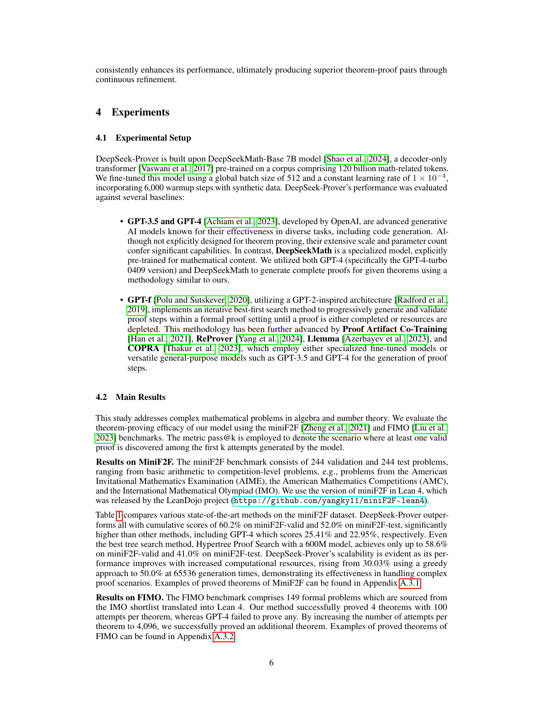

表 1 把方法分为树搜索与完整证明生成两类。DeepSeek-Prover 使用 7B 模型：64 次生成即可在测试集达到 46.3%，128 次仍为 46.3%，8192 次达到 48.8%，65,536 次达到 50.0%；累计成绩为 52.0%。

### 4.3 消融研究

#### 4.3.1 大规模自动形式化的有效性

为验证大规模自动形式化的效果，表 2 将本文自动形式化数据集与使用专家迭代的常规数据集比较。专家迭代会生成形式化证明、用成功结果微调模型并持续重复，直到不再提升。结果表明，使用本文自动形式化数据训练的模型明显优于只使用 `mathlib` 数据训练的模型。

在 pass@128 下，未继续训练的模型在 miniF2F-valid/test 上为 25.4%/27.5%；使用 2.38 亿词元 `mathlib` 证明数据后为 30.3%/31.2%；使用 31.08 亿词元自动形式化陈述后则达到 48.8%/42.6%。

#### 4.3.2 形式化陈述评分的有效性

为验证模型过滤低质量陈述的效果，我们分别使用等量的高分证明数据与低分证明数据微调 DeepSeekMath-Base。表 3 显示，高分数据训练的模型比低分数据训练的模型高 4.5 个百分点，说明模型评分能够准确识别并有效滤除质量较低的陈述。

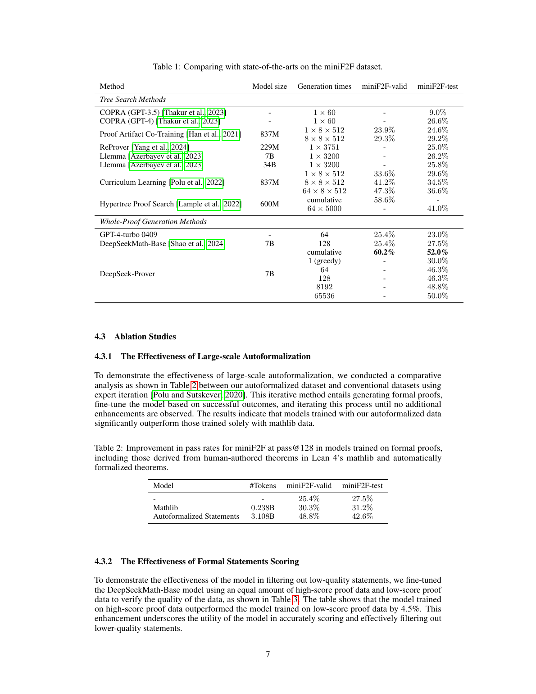

表 3 中，“优秀”“良好”和“中上”数据训练的模型在 miniF2F-valid/test 上达到 48.8%/42.6%；“一般”和“较差”数据对应成绩为 41.4%/38.1%。

#### 4.3.3 迭代增强的有效性

表 4 显示，数据合成迭代次数与定理证明性能提升之间存在明确相关性，证明迭代增强策略能提高定理证明能力。连续迭代不仅改善模型处理复杂证明的能力，还会显著增加合成数据的质量与数量。

从第 0 轮到第 4 轮，miniF2F-valid 的 pass@128 依次从 38.1% 提升至 45.1%、49.2%、54.5% 和 59.4%；测试集则从 34.0% 提升至 39.3%、41.4%、45.1% 和 46.3%。

#### 4.3.4 扩大合成定理证明数据规模的有效性

对合成定理证明数据的研究表明，数据集规模与模型效果清晰相关。通过考察 800 万条生成证明数据的不同子集，我们发现 miniF2F 性能会随着数据规模按数量级扩大而稳步上升。这一规律突出说明，大规模数据集对增强模型自动形式化自然语言问题的能力至关重要，也说明系统化数据建设对自动定理证明领域的发展具有巨大潜力和必要性。

表 5 的数据规模从 1000、1 万、10 万、100 万增加到 8,066,621 条。对应的 miniF2F-valid/test 成绩总体持续提高，最大规模时达到 42.62%/40.16%。

## 5 案例研究

本节用两个案例展示方法在定理自动形式化中的应用：一个展示成功证明，另一个展示系统如何在假设拒绝阶段识别不一致。

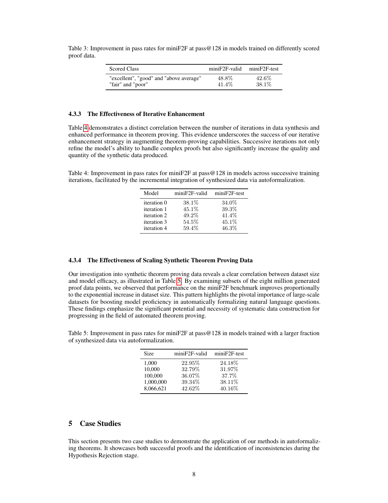

### 5.1 具有完整证明的自动形式化定理

案例 A 要求证明一个由 $1$、$\cos(a-b)$、$\cos(a)$ 与 $\cos(b)$ 组成的 $3\times3$ 矩阵行列式为零。自动形式化准确地把矩阵及其行列式的代数表达翻译为 Lean：以实数 $a$、$b$ 为参数定义具体矩阵，并断言其行列式为零。形式化使用 `Matrix.det` 计算行列式，并用 Lean 的嵌套列表记法表示矩阵各行。

### 5.2 假设不一致定理的自动形式化

案例 B 给定实数 $D$，题目在某些非零实数 $a$、$b$、$c$ 下定义一个行列式等于 $D$，要求证明 $D^2=154$。初始自动形式化却错误地假定：对所有非零 $a$、$b$、$c$，该行列式都等于同一个 $D$。原题并未声称这一条件普遍成立。正确形式化应寻找满足 $D^2=154$ 的特定 $a$、$b$、$c$，或证明不存在这样的值。

模型成功识别了矛盾，并选择两组不同的 $a$、$b$、$c$ 作为反例，由此证明假设为假。原页还给出一种修正后的形式化版本。这些示例体现了模型验证证明和识别假设不一致的能力，更多细节见附录 A.2。

## 6 结论

本文提出一种从高中和本科层次数学竞赛题生成大规模合成证明数据的方法。通过把自然语言题目翻译为形式化陈述、过滤低质量陈述并迭代生成证明，我们构建了 800 万条证明数据。在这些合成数据上训练后，DeepSeekMath 7B 的自动定理证明能力显著提高，在 miniF2F 与 FIMO 等基准上超过 GPT-4 和其他方法。

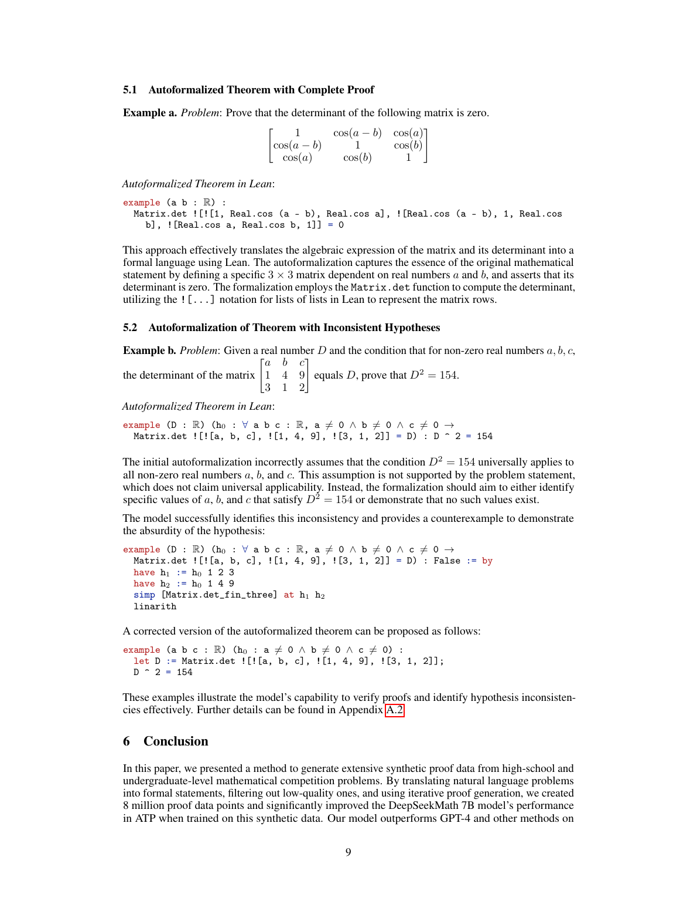

通过开放数据集和模型，我们希望推动自动定理证明研究，并增强 LLM 的形式化数学推理能力。目前工作主要关注中学到本科层次的代数与数论。未来将扩大数学题目的多样性，增强方法在自动定理证明中的通用适用范围。

## 更广泛的影响

本文研究利用从非形式化数学题生成的大规模合成证明数据，有望显著推进自动定理证明。这一进展可以增强 LLM 的形式化定理证明能力，促成更可靠的数学证明验证，并为学生与研究者提供有价值的教育资源。通过直接开放代码、模型和数据，作者希望保障成果被负责任地使用，推动进一步创新，同时维持较高的数据隐私与知识产权合规标准。

## 参考文献

参考文献条目依照原论文保留，避免改写作者、论文名、会议、页码和链接。第 10 页在更广泛影响之后开始列出文献。

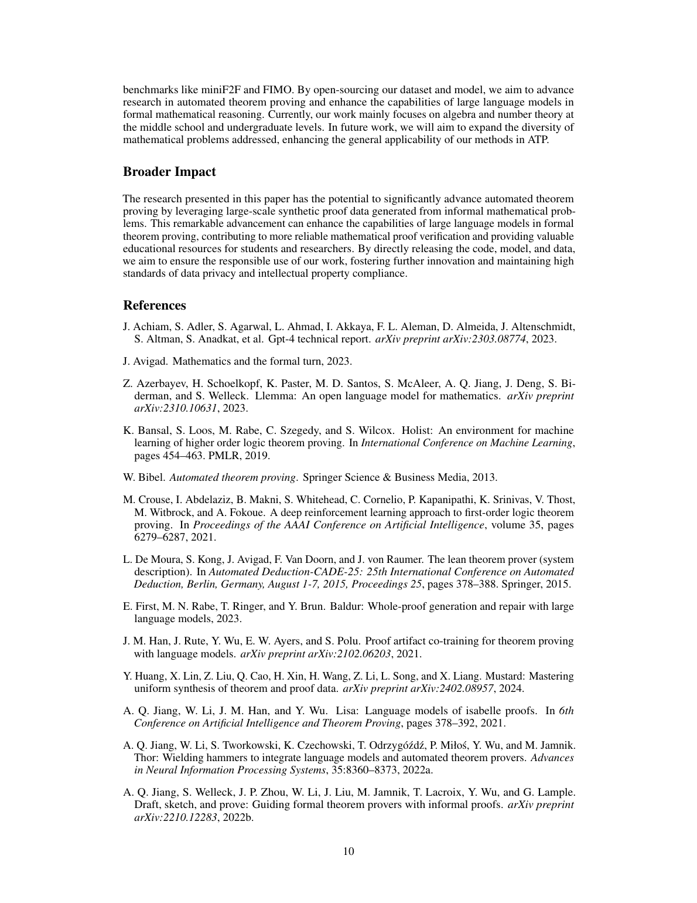

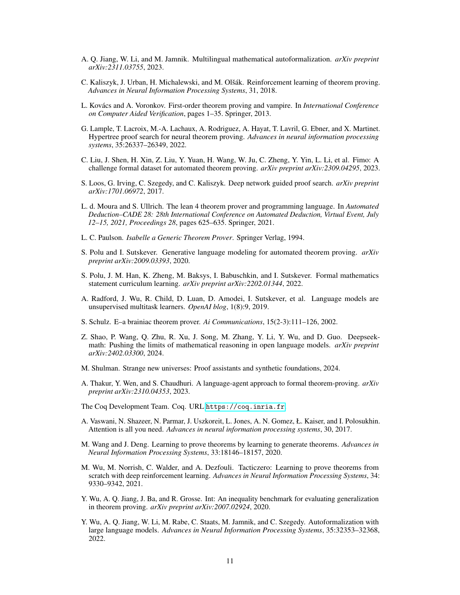

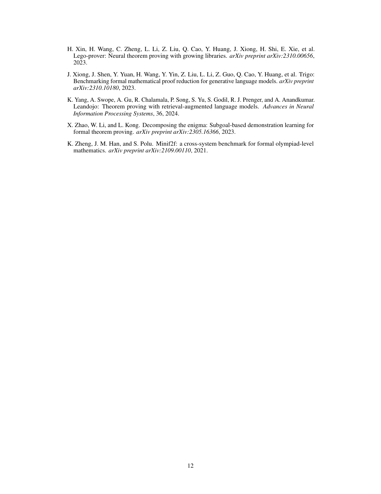

## 附录与补充材料

### A.1 提示模板

用于评价形式化陈述质量的提示包含五项标准：

1. **与当前研究的相关性：** 陈述是否涉及数学或相关领域正在积极研究的问题或概念；相关性越高，潜在关注度越高。
2. **复杂性与深度：** 陈述是否足以挑战现有理论与方法，同时能提供重要洞见或进步；复杂性和深度能够体现 Lean 4 的能力并吸引关注。
3. **跨学科潜力：** 陈述是否能连接数学与计算机科学、物理、生物等其他领域，为跨学科研究提供机会。
4. **社区需求与空白：** 陈述是否填补 Lean 4 社区或更广泛数学社区中已知的需求和空白。
5. **创新性：** 陈述是否提出新的方法、概念或应用；创新会推动兴趣与参与。

模型需要按具体题目定制评价，把陈述评为“优秀”“良好”“中上”“一般”或“较差”。回答应先把代码翻译为自然语言并给出相关背景、假设和定义，再逐项简要说明评分理由，最后给出总体等级。完整原始提示格式见截图。

### A.2 自动形式化案例

案例 A：对实数 $a$ 和实函数 $f(x)=x^3-ax-1$，若对所有 $x$，$f(x)\leq0$ 都意味着 $x<-1$ 或 $x>1$，则须有 $a=3$。这是自动形式化过程中的常见简单案例。模型需要识别自然语言并映射为恰当的数学运算符。这里，“小于 $-1$ 或大于 $1$”描述区间并集 $(-\infty,-1)\cup(1,+\infty)$，被准确形式化为 Lean 中两个开区间的并集。

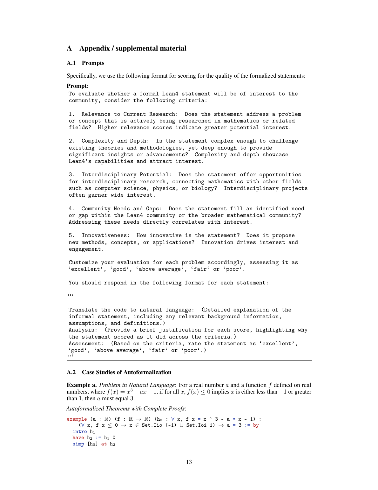

案例 B：定义 $F(k)=\binom{k+2}{2}$ 与 $f(k)=\binom{k+1}{1}$。对任意不小于 2 的自然数 $n$，存在自然数 $k$ 使 $f(k)=(n-1)n/2$；还存在自然数 $m$ 使 $F(m)=(n-1)n/2$，从而 $m=k$。形式化使用 `Nat.choose` 准确表示二项式系数，存在量词和蕴含组成的逻辑结构也与题目要求一致，语义忠实且有效。

案例 C：给定三个三维向量 $a$、$b$、$c$，满足 $a\cdot b=-3$、$a\cdot c=4$、$b\cdot c=6$，证明 $b\cdot(7c-2a)=48$。形式化用三个实数的笛卡尔积表示三维向量，并按定义把点积展开为各分量乘积之和。

### A.3 模型生成的 Lean 证明示例

#### A.3.1 miniF2F-test 数据集结果

案例 A 要证明伯努利不等式：对任意实数 $x$ 与自然数 $n$，若 $x>-1$，则 $1+nx\leq(1+x)^n$。模型生成的 Lean 证明通过自然数归纳法、幂与乘法恒等式化简，并以非线性算术完成证明。

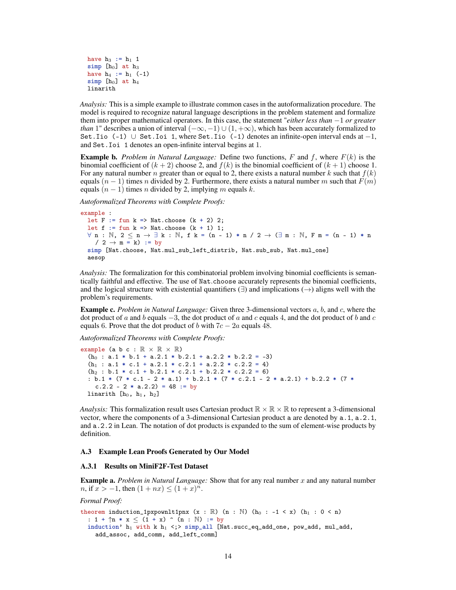

案例 B：Blackwell 女士给两个班考试，上午班平均分 84，下午班平均分 70，人数之比为 $3:4$，要求证明全体学生平均分为 76。模型处理非零条件、分式化简和线性算术，得到所需结论。

案例 C：询问有多少个正整数 $m$，使得至少存在一个正整数 $n$ 满足 $mn\leq m+n$，结论是有无穷多个。证明对任意 $n$ 选择 $m=n+1$、$p=1$，即可满足条件。

#### A.3.2 FIMO 数据集结果

案例 A：确定所有从正整数到正整数的函数 $f$，使任意 $x$、$y$ 都能与边长 $x$、$f(y)$、$f(y+f(x)-1)$ 构成非退化三角形，最终答案为恒等函数 $f(x)=x$。形式证明先推出 $f(0)=0$，再按 $x$ 归纳。

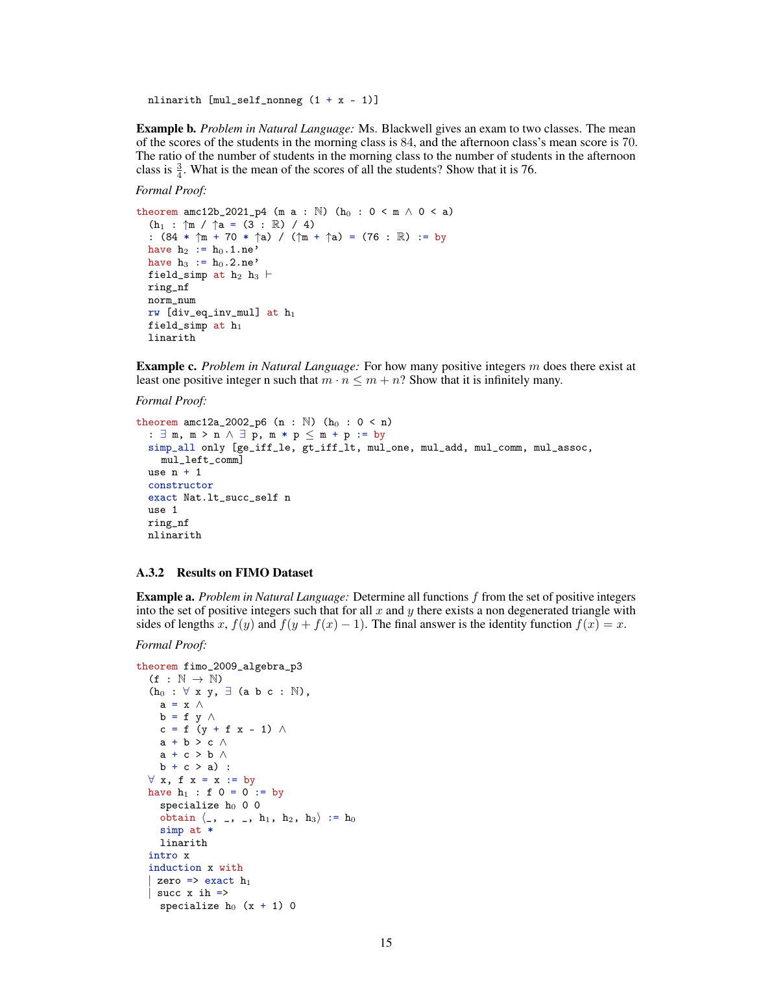

案例 B：证明对每个正整数 $n$，都存在由整数 $a$、$b$ 构成的分数 $a/b$，满足 $0<b\leq\sqrt n+1$ 且 $\sqrt n\leq a/b\leq\sqrt{n+1}$。形式证明选择 $a=\lfloor\sqrt n\rfloor$、$b=1$，再用自然数平方根的单调性和线性算术完成。

### A.4 形式化验证细节

作者以一组固定的 `Mathlib` 模块导入作为每段生成 Lean 4 代码的前缀，覆盖基础代数、有序结构、大运算、几何级数、复数与实数、组合数学、有限集、整数与自然数、数论、集合、线性代数、拓扑以及 Aesop 自动化。完整导入清单按原样保留在截图中。

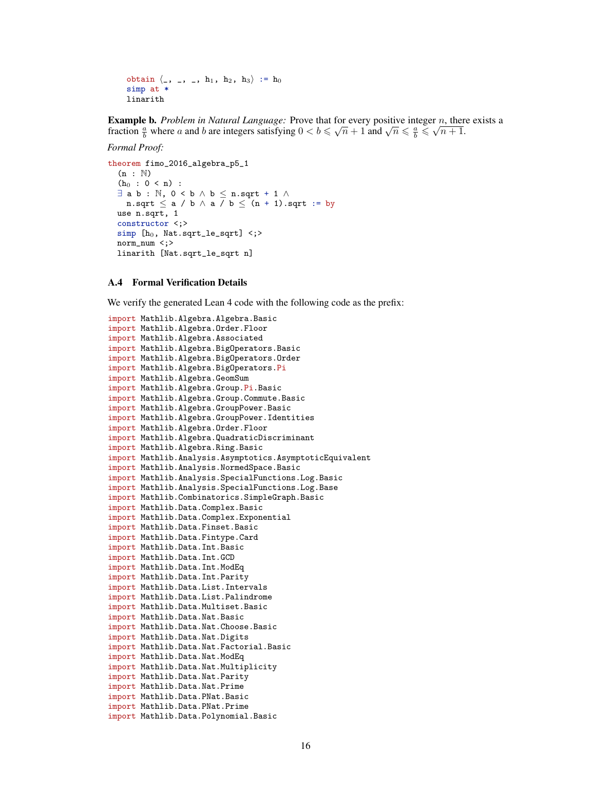

导入清单最后还包含多项式求值、无理数、非负实数、平方根、有限集合、对称结构、模整数、动力系统不动点、仿射空间、有限维线性代数、等价关系、滤子、局部有限序与良基关系等模块。验证环境取消最大心跳限制，开启 Aesop 及其证明轨迹，并打开常用的自然数、实数、有理数和大运算命名空间。

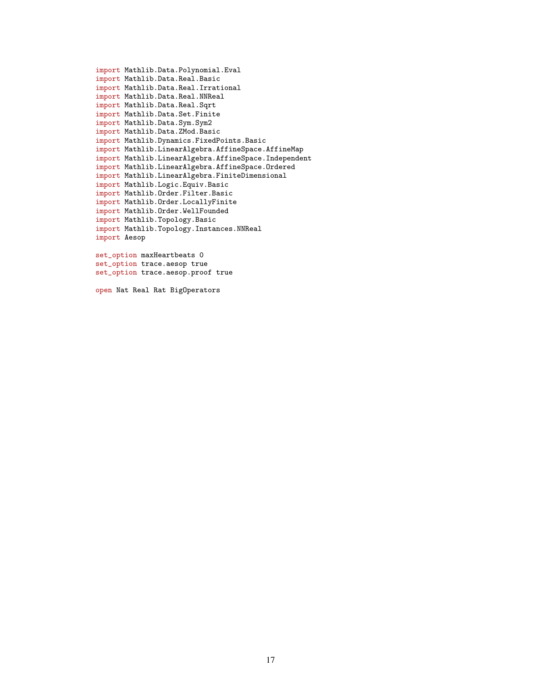
