# DeepSeek-V3 技术报告

**作者：** DeepSeek-AI

**联系邮箱：** research@deepseek.com

## 摘要

我们提出 DeepSeek-V3，一个强大的混合专家语言模型，总参数量为 671B，每个词元激活 37B 参数。为实现高效推理和低成本训练，DeepSeek-V3 采用已经在 DeepSeek-V2 中得到充分验证的多头潜在注意力与 DeepSeekMoE 架构。此外，DeepSeek-V3 首创无辅助损失的负载均衡策略，并设置多词元预测训练目标，以获得更强表现。我们先在 14.8 万亿个多样且高质量的词元上预训练 DeepSeek-V3，随后进行监督微调与强化学习，充分释放模型能力。

全面评测表明，DeepSeek-V3 超过其他开源模型，并达到可与领先闭源模型相当的表现。尽管能力出色，它的完整训练只使用了 278.8 万 H800 GPU 小时；训练过程也极其稳定，全程没有出现任何无法恢复的损失尖峰，也没有执行过回滚。模型检查点可从项目仓库获取。

**图 1：DeepSeek-V3 及其同类模型的基准表现。**

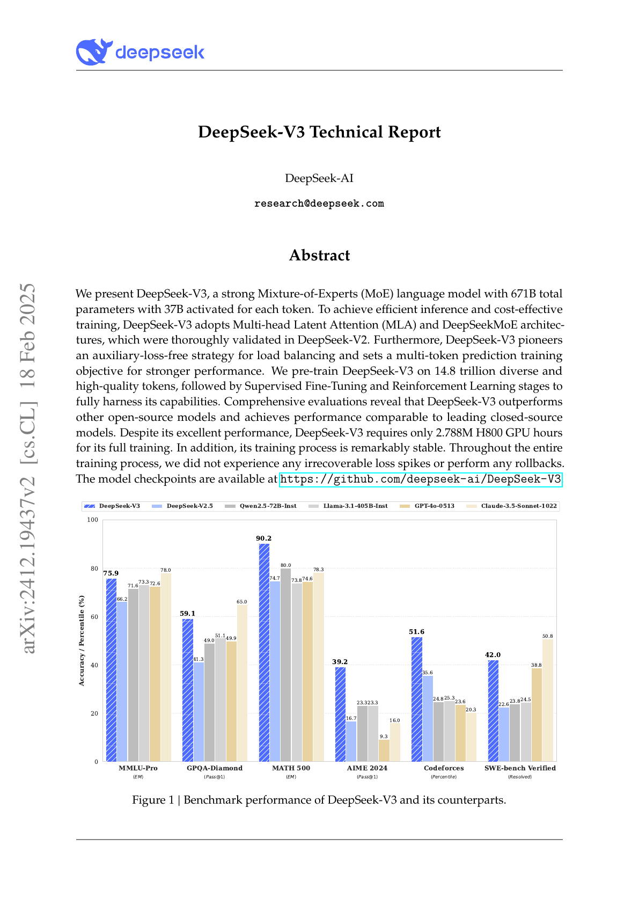

## 论文目录

原论文第 2 页列出以下章节：

- 1 引言
- 2 架构
  - 2.1 基础架构
    - 2.1.1 多头潜在注意力
    - 2.1.2 采用无辅助损失负载均衡的 DeepSeekMoE
  - 2.2 多词元预测
- 3 基础设施
  - 3.1 计算集群
  - 3.2 训练框架
    - 3.2.1 DualPipe 与计算—通信重叠
    - 3.2.2 跨节点全对全通信的高效实现
    - 3.2.3 以极小开销大幅节省显存
  - 3.3 FP8 训练
    - 3.3.1 混合精度框架
    - 3.3.2 通过量化与乘法改进精度
    - 3.3.3 低精度存储与通信
  - 3.4 推理与部署
    - 3.4.1 预填充
    - 3.4.2 解码
  - 3.5 对硬件设计的建议
    - 3.5.1 通信硬件
    - 3.5.2 计算硬件
- 4 预训练
  - 4.1 数据构建
  - 4.2 超参数
  - 4.3 长上下文扩展
  - 4.4 评测
    - 4.4.1 评测基准
    - 4.4.2 评测结果
  - 4.5 讨论
    - 4.5.1 多词元预测消融实验
    - 4.5.2 无辅助损失均衡策略消融实验

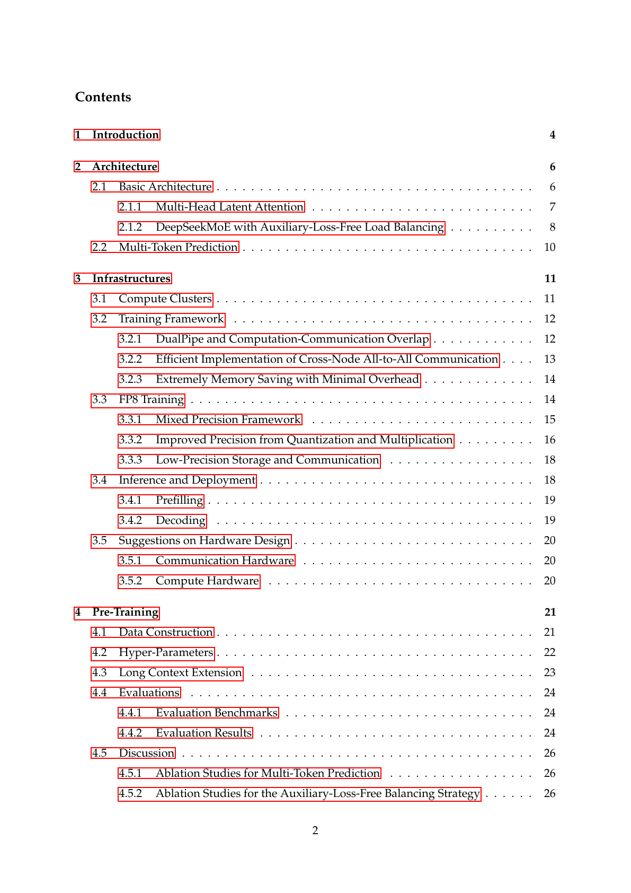

原论文第 3 页继续列出：

- 4.5.3 批次级负载均衡与序列级负载均衡
- 5 后训练
  - 5.1 监督微调
  - 5.2 强化学习
    - 5.2.1 奖励模型
    - 5.2.2 组相对策略优化
  - 5.3 评测
    - 5.3.1 评测设置
    - 5.3.2 标准评测
    - 5.3.3 开放式评测
    - 5.3.4 将 DeepSeek-V3 用作生成式奖励模型
  - 5.4 讨论
    - 5.4.1 从 DeepSeek-R1 蒸馏
    - 5.4.2 自奖励
    - 5.4.3 多词元预测评测
- 6 结论、局限与未来方向
- A 贡献与致谢
- B 低精度训练消融实验
  - B.1 FP8 与 BF16 训练对比
  - B.2 分块量化讨论
- C 采用辅助损失与无辅助损失的 16B 模型专家专门化模式

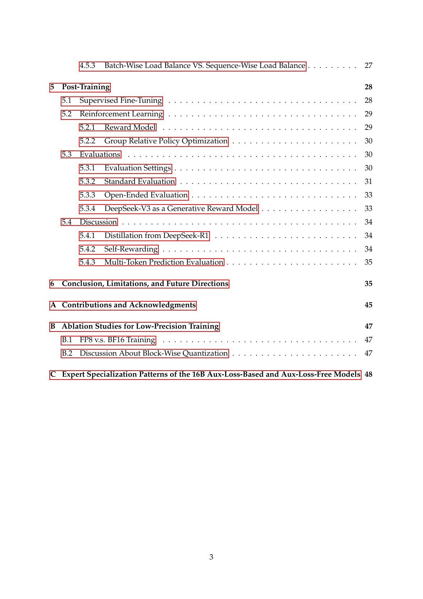

## 1 引言

近年来，大型语言模型快速迭代和演进（Anthropic，2024；Google，2024；OpenAI，2024a），与通用人工智能之间的差距逐步缩小。除闭源模型外，DeepSeek 系列、LLaMA 系列、Qwen 系列和 Mistral 系列等开源模型也取得了显著进展，努力追赶闭源同类模型。为进一步拓展开源模型的能力边界，我们扩大模型规模并推出 DeepSeek-V3：这是一个拥有 671B 参数的大型混合专家模型，每个词元激活 37B 参数。

我们始终以前瞻视角同时追求强劲的模型表现和经济的成本。因此，在架构上，DeepSeek-V3 继续采用多头潜在注意力实现高效推理，并采用 DeepSeekMoE 实现低成本训练。这两种架构已经在 DeepSeek-V2 中得到验证，证明它们能够在高效训练和推理的同时维持稳健表现。除基础架构外，我们又采用两项策略增强模型能力。第一，DeepSeek-V3 首创无辅助损失的负载均衡策略，目标是尽量降低鼓励负载均衡给模型表现带来的不利影响。第二，DeepSeek-V3 使用多词元预测训练目标；我们的观察表明，它能提高评测基准上的整体表现。

为实现高效训练，我们支持 FP8 混合精度训练，并对训练框架进行全面优化。低精度训练已经成为高效训练的一种很有前景的方案，其演进与硬件能力进步密切相关。在本文中，我们提出 FP8 混合精度训练框架，并首次在超大规模模型上验证其有效性。通过支持 FP8 计算与存储，我们既加快训练，也降低 GPU 显存占用。

在训练框架方面，我们为高效流水线并行设计 DualPipe 算法。它的流水线气泡更少，并借助计算—通信重叠隐藏训练期间的大部分通信。只要在模型继续扩展时保持固定的计算—通信比，这种重叠就能让我们继续跨节点使用细粒度专家，同时把全对全通信开销压到近乎为零。我们还开发高效的跨节点全对全通信内核，以充分利用 InfiniBand 与 NVLink 带宽；并细致优化显存占用，使 DeepSeek-V3 无需昂贵的张量并行即可训练。这些工作共同带来了很高的训练效率。

预训练阶段，我们在 14.8 万亿个高质量、多样化词元上训练 DeepSeek-V3。预训练过程极其稳定，全程未出现任何无法恢复的损失尖峰，也不曾需要回滚。随后对 DeepSeek-V3 执行两阶段上下文长度扩展：第一阶段把最大上下文扩展到 32K，第二阶段进一步扩展到 128K。之后，我们在 DeepSeek-V3 基础模型上进行监督微调和强化学习，使其与人类偏好对齐并进一步释放潜力。在后训练阶段，我们从 DeepSeek-R1 系列模型蒸馏推理能力，同时谨慎维持模型准确率与生成长度之间的平衡。

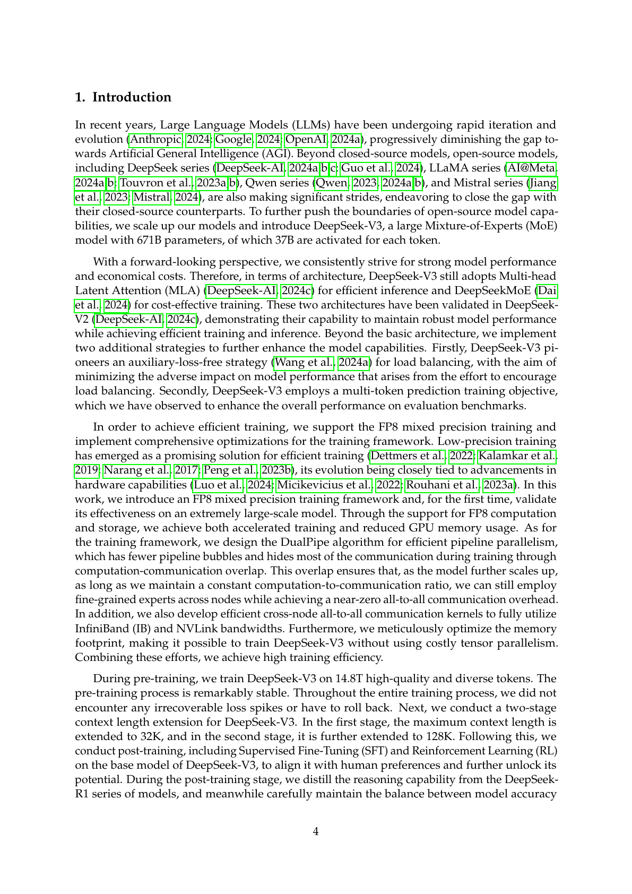

**表 1：DeepSeek-V3 的训练成本。** 按 H800 每 GPU 小时租金 2 美元计算，预训练使用 266.4 万 GPU 小时、上下文扩展使用 11.9 万 GPU 小时、后训练使用 5000 GPU 小时，总计 278.8 万 GPU 小时，对应总费用 557.6 万美元。

我们在一整套全面基准上评估 DeepSeek-V3。尽管训练成本经济，综合结果仍显示 DeepSeek-V3-Base 已成为当前最强的开源基础模型，在代码和数学方面尤其突出。它的对话版本也超过其他开源模型，并在一系列标准与开放式基准上达到可与 GPT-4o、Claude-3.5-Sonnet 等领先闭源模型相当的表现。

最后，我们再次强调表 1 汇总的经济训练成本，这是算法、框架与硬件协同优化的结果。在预训练阶段，DeepSeek-V3 每训练 1 万亿词元只需 18 万 H800 GPU 小时，也就是在由 2048 块 H800 GPU 组成的集群上训练 3.7 天。因此，预训练不到两个月即可完成，耗费 266.4 万 GPU 小时。加上上下文长度扩展的 11.9 万 GPU 小时与后训练的 5000 GPU 小时，完整训练只需 278.8 万 GPU 小时。若 H800 租金为每 GPU 小时 2 美元，总训练成本仅 557.6 万美元。上述成本只包括 DeepSeek-V3 的正式训练，不包括在架构、算法或数据方面进行前期研究和消融实验的成本。

我们的主要贡献如下。

**架构：创新的负载均衡策略与训练目标**

- 在 DeepSeek-V2 高效架构基础上，我们首创无辅助损失的负载均衡策略，把鼓励负载均衡造成的性能下降降到最低。
- 我们研究多词元预测目标，证明它有益于模型表现；它还可用于推测解码，加速推理。

**预训练：迈向极致训练效率**

- 我们设计 FP8 混合精度训练框架，并首次在超大规模模型上验证 FP8 训练的可行性和有效性。
- 通过算法、框架与硬件协同设计，我们克服跨节点 MoE 训练的通信瓶颈，实现近乎完全的计算—通信重叠。这显著提高训练效率并降低成本，让我们能够在不增加额外开销的情况下继续扩大模型规模。
- 我们只用 266.4 万 H800 GPU 小时，就完成 DeepSeek-V3 在 14.8 万亿词元上的预训练，得到当前最强的开源基础模型。预训练之后的各阶段只额外需要约 10 万 GPU 小时。

**后训练：从 DeepSeek-R1 蒸馏知识**

- 我们提出一种创新方法，把长思维链模型——具体而言是 DeepSeek-R1 系列中的一个模型——的推理能力蒸馏到 DeepSeek-V3 等标准大型语言模型中。该流水线以精巧方式把 R1 的验证和反思模式纳入 DeepSeek-V3，显著提高推理表现，同时仍能控制 DeepSeek-V3 的输出风格和长度。

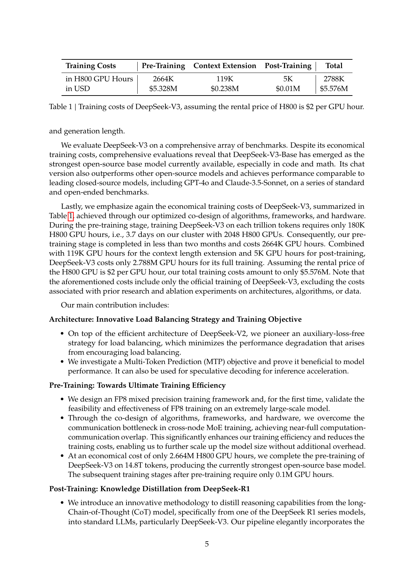

**核心评测结果概览**

- **知识。** 第一，在 MMLU、MMLU-Pro 和 GPQA 等教育基准上，DeepSeek-V3 超过所有其他开源模型，分别取得 88.5、75.9 和 59.1。它的表现可与 GPT-4o、Claude-Sonnet-3.5 等领先闭源模型相比，缩小了该领域开源与闭源模型的差距。第二，在事实性基准上，DeepSeek-V3 在 SimpleQA 与 Chinese SimpleQA 中都位居开源模型首位。尽管其英语事实知识在 SimpleQA 上仍落后于 GPT-4o 与 Claude-Sonnet-3.5，但中文事实知识在 Chinese SimpleQA 上超过二者，突显其中文事实知识优势。
- **代码、数学与推理。** 第一，在所有不采用长思维链的开源和闭源模型中，DeepSeek-V3 在数学相关基准上达到最先进水平；它在 MATH-500 等特定基准上甚至超过 o1-preview，展现出稳健的数学推理能力。第二，在代码相关任务上，DeepSeek-V3 在 LiveCodeBench 等编程竞赛基准中表现最佳，巩固了其在该领域的领先地位。对于工程任务，DeepSeek-V3 虽略低于 Claude-Sonnet-3.5，仍以明显优势超过其他所有模型，显示出跨多种技术基准的竞争力。

本文其余部分首先详细介绍 DeepSeek-V3 的模型架构（第 2 节）。随后介绍基础设施，包括计算集群、训练框架、FP8 训练支持、推理部署策略以及对未来硬件设计的建议。接着说明预训练过程，包括训练数据构建、超参数设置、长上下文扩展技术、相关评测与讨论（第 4 节）。之后讨论后训练工作，包括监督微调、强化学习、相应评测与讨论（第 5 节）。最后总结本文，讨论 DeepSeek-V3 现有局限，并提出未来可能的研究方向（第 6 节）。

## 2 架构

我们首先介绍 DeepSeek-V3 的基础架构：使用多头潜在注意力实现高效推理，使用 DeepSeekMoE 实现经济训练。随后介绍多词元预测训练目标；我们的观察表明，它能提高评测基准上的整体表现。对于未明确说明的其他次要细节，DeepSeek-V3 沿用 DeepSeek-V2 的设置。

### 2.1 基础架构

DeepSeek-V3 的基础架构仍处于 Transformer 框架之内。为实现高效推理与经济训练，它同样采用已经由 DeepSeek-V2 充分验证的多头潜在注意力和 DeepSeekMoE。与 DeepSeek-V2 相比，一个例外是我们额外引入了无辅助损失的负载均衡策略。

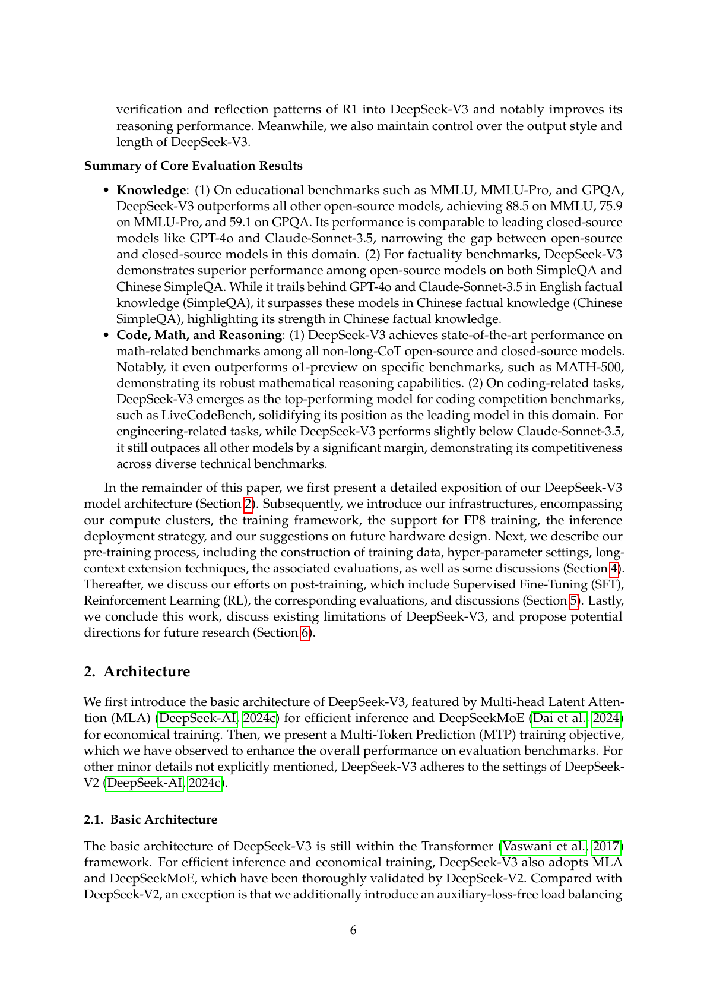

该策略用于 DeepSeekMoE，以缓解保证负载均衡时引起的性能下降。图 2 展示 DeepSeek-V3 的基础架构，本节将简要回顾多头潜在注意力与 DeepSeekMoE 的细节。

**图 2：DeepSeek-V3 基础架构示意图。** 与 DeepSeek-V2 一样，我们采用多头潜在注意力实现高效推理，并采用 DeepSeekMoE 实现经济训练。

#### 2.1.1 多头潜在注意力

DeepSeek-V3 的注意力采用多头潜在注意力架构。令 $d$ 表示嵌入维度，$n_h$ 表示注意力头数，$d_h$ 表示每个头的维度，$\mathbf{h}_t\in\mathbb{R}^d$ 表示某一注意力层中第 $t$ 个词元的注意力输入。多头潜在注意力的核心是对注意力键和值做低秩联合压缩，从而减少推理时的键值缓存。相应计算见公式（1）至（5）。

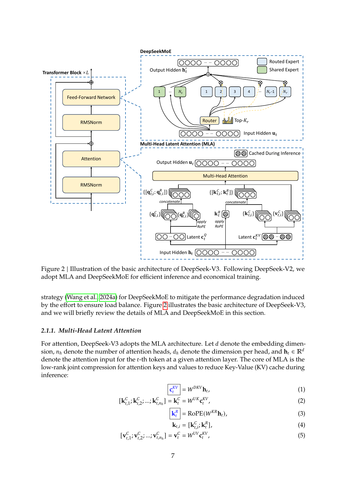

其中，$\mathbf{c}^{KV}_t\in\mathbb{R}^{d_c}$ 是键和值的压缩潜在向量，$d_c$ 远小于 $d_hn_h$，表示键值压缩维度；$W^{DKV}$ 是下投影矩阵；$W^{UK}$ 与 $W^{UV}$ 分别是键和值的上投影矩阵；$W^{KR}$ 用于生成携带旋转位置嵌入的解耦键；$\operatorname{RoPE}(\cdot)$ 表示应用旋转位置嵌入矩阵的操作，$[\cdot;\cdot]$ 表示拼接。需要注意，多头潜在注意力在生成时只需缓存图中蓝框向量，即 $\mathbf{c}^{KV}_t$ 和 $\mathbf{k}^{R}_t$；因此它能显著减少键值缓存，同时保持与标准多头注意力相当的表现。

对于注意力查询，我们同样执行低秩压缩，以减少训练期间的激活显存，计算见公式（6）至（9）。其中，$\mathbf{c}^{Q}_t$ 是查询的压缩潜在向量，$d'_c$ 是查询压缩维度；$W^{DQ}$ 与 $W^{UQ}$ 分别是查询的下投影和上投影矩阵；$W^{QR}$ 用于生成携带旋转位置嵌入的解耦查询。

最后，将注意力查询、键和值结合，得到最终注意力输出 $\mathbf{u}_t$，计算见公式（10）与（11）；其中 $W^O$ 表示输出投影矩阵。

#### 2.1.2 采用无辅助损失负载均衡的 DeepSeekMoE

**DeepSeekMoE 的基础架构。** 对于前馈网络，DeepSeek-V3 使用 DeepSeekMoE 架构。与 GShard 等传统 MoE 架构相比，DeepSeekMoE 使用粒度更细的专家，并把其中一些专家隔离为共享专家。令 $\mathbf{u}_t$ 表示第 $t$ 个词元的前馈网络输入，前馈网络输出 $\mathbf{h}'_t$ 按公式（12）至（15）计算。

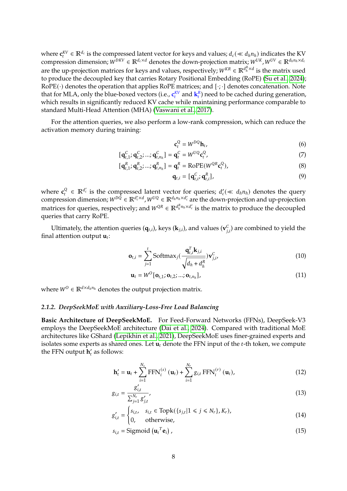

其中，$N_s$ 与 $N_r$ 分别表示共享专家数和路由专家数；$\operatorname{FFN}^{(s)}_i(\cdot)$ 与 $\operatorname{FFN}^{(r)}_i(\cdot)$ 分别表示第 $i$ 个共享专家和第 $i$ 个路由专家；$K_r$ 表示激活的路由专家数；$g_{i,t}$ 是第 $i$ 个专家的门控值；$s_{i,t}$ 是词元到专家的亲和度；$\mathbf{e}_i$ 是第 $i$ 个路由专家的质心向量；$\operatorname{Topk}(\cdot,K)$ 表示从第 $t$ 个词元与所有路由专家的亲和度分数中选出的最高 $K$ 个分数组成的集合。与 DeepSeek-V2 略有不同，DeepSeek-V3 使用 Sigmoid 函数计算亲和度，并在所有被选中的亲和度分数之间归一化，得到门控值。

**无辅助损失负载均衡。** 对 MoE 模型而言，专家负载不均衡会造成路由崩溃，并降低专家并行场景中的计算效率。传统方案通常依赖辅助损失避免负载失衡，但过大的辅助损失会损害模型表现。为了在负载均衡和模型表现之间取得更好平衡，我们首创无辅助损失的负载均衡策略。具体而言，为每个专家引入偏置项 $b_i$，把它加到对应亲和度分数 $s_{i,t}$ 上，以公式（16）决定 Top-K 路由。

偏置项只用于路由。与前馈网络输出相乘的门控值仍由原始亲和度分数 $s_{i,t}$ 得到。训练期间，我们持续监控每个训练步骤完整批次上的专家负载。每步结束时，若某个专家过载，就把对应偏置项减去 $\gamma$；若负载不足，则增加 $\gamma$。这里 $\gamma$ 是名为“偏置更新速度”的超参数。借助这种动态调整，DeepSeek-V3 在训练中保持专家负载均衡，并比单纯依靠辅助损失鼓励负载均衡的模型表现更好。

**补充性的序列级辅助损失。** 尽管 DeepSeek-V3 主要依赖无辅助损失策略实现负载均衡，为防止任意单条序列内部出现极端失衡，我们仍使用补充性的序列级均衡损失，见公式（17）至（20）。均衡因子 $\alpha$ 是一个超参数，在 DeepSeek-V3 中被设为极小值；$\mathbf{1}(\cdot)$ 表示指示函数，$T$ 表示序列中的词元数。序列级均衡损失鼓励每条序列上的专家负载保持均衡。

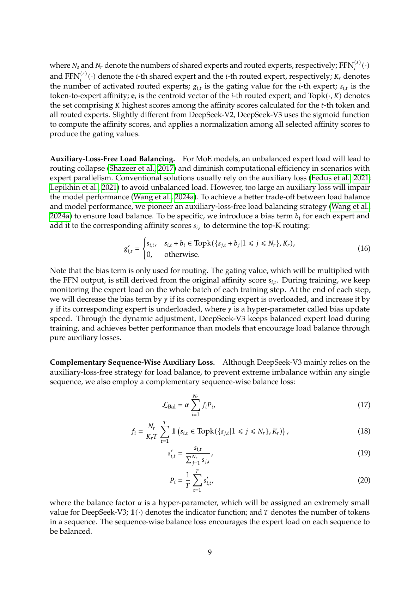

**节点受限路由。** 与 DeepSeek-V2 使用的设备受限路由类似，DeepSeek-V3 也使用受限路由机制控制训练期间的通信成本。简而言之，我们保证每个词元最多只发送到 $M$ 个节点；这些节点根据分布在各节点上的专家最高 $K^M_r$ 个亲和度分数之和来选择。在此约束下，MoE 训练框架可以实现近乎完全的计算—通信重叠。

**不丢弃词元。** 得益于有效的负载均衡策略，DeepSeek-V3 在完整训练过程中始终保持良好负载均衡，因此训练时不丢弃任何词元。我们还实现了专门的部署策略以保证推理负载均衡，所以推理时同样不丢弃词元。

### 2.2 多词元预测

受 Gloeckle 等人（2024）启发，我们研究并为 DeepSeek-V3 设置多词元预测目标，把每个位置的预测范围扩展到多个未来词元。一方面，多词元预测目标可使训练信号更密集，并可能提高数据效率；另一方面，它可能让模型预先规划自己的表示，从而更好地预测未来词元。图 3 展示我们的多词元预测实现。Gloeckle 等人的方法使用相互独立的输出头并行预测 $D$ 个附加词元，而我们按顺序预测附加词元，并在每个预测深度保留完整因果链。本节介绍具体实现。

**多词元预测模块。** 我们的实现使用 $D$ 个串联模块预测 $D$ 个附加词元。第 $k$ 个模块由共享嵌入层 $\operatorname{Emb}(\cdot)$、共享输出头 $\operatorname{OutHead}(\cdot)$、Transformer 块 $\operatorname{TRM}_k(\cdot)$ 和投影矩阵 $M_k\in\mathbb{R}^{d\times2d}$ 组成。对于第 $i$ 个输入词元 $t_i$，在第 $k$ 个预测深度，首先把该词元在第 $k-1$ 个深度的表示 $\mathbf{h}^{k-1}_i$ 与第 $i+k$ 个词元的嵌入 $\operatorname{Emb}(t_{i+k})$ 结合。

**图 3：多词元预测实现示意图。** 我们在每个深度预测每个词元时都保留完整因果链。

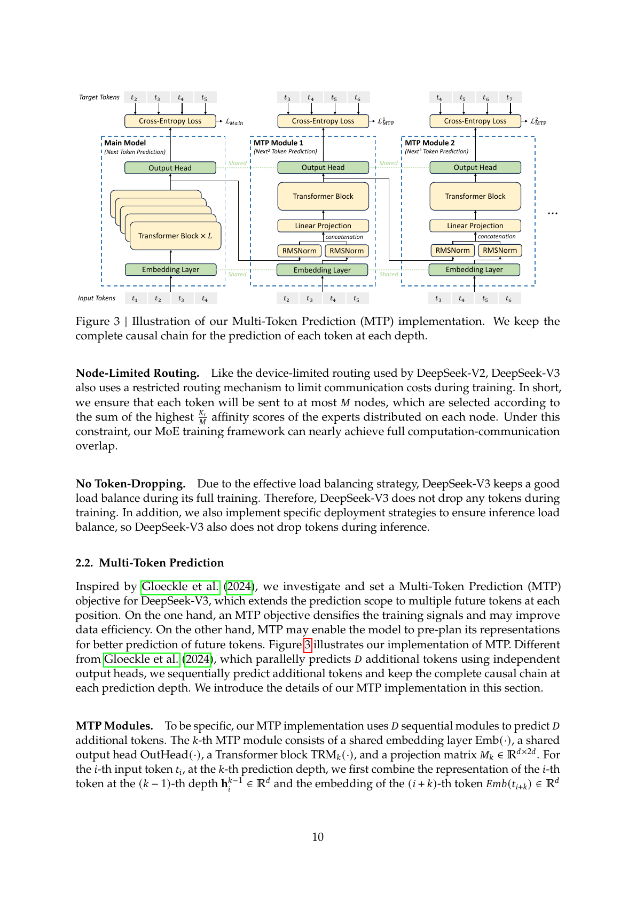

随后通过线性投影结合二者，计算见公式（21），其中 $[\cdot;\cdot]$ 表示拼接。特别地，当 $k=1$ 时，$\mathbf{h}^{k-1}_i$ 指主模型给出的表示。每个多词元预测模块的嵌入层都与主模型共享。结合后的 $\mathbf{h}'^{k}_i$ 作为第 $k$ 个深度 Transformer 块的输入，产生当前深度的输出表示 $\mathbf{h}^{k}_i$，如公式（22）。其中 $T$ 表示输入序列长度，$i:j$ 表示包含左右边界的切片操作。

最后，以 $\mathbf{h}^{k}_i$ 为输入，共享输出头计算第 $k$ 个附加预测词元的概率分布 $P^{k}_{i+k+1}\in\mathbb{R}^{V}$，其中 $V$ 为词表大小，见公式（23）。输出头先把表示线性映射为逻辑值，再应用 Softmax 函数，得到第 $k$ 个附加词元的预测概率。每个多词元预测模块的输出头也与主模型共享。我们维持预测因果链的原则与 EAGLE 类似，但 EAGLE 的主要目标是推测解码，而我们使用多词元预测改进训练。

**多词元预测训练目标。** 对每个预测深度，我们按公式（24）计算交叉熵损失。$T$ 表示输入序列长度，$t_i$ 表示第 $i$ 个位置的真实词元，$P^k_i[t_i]$ 表示第 $k$ 个多词元预测模块赋予 $t_i$ 的预测概率。最后，对所有深度的多词元预测损失取平均，并乘以权重因子 $\lambda$，得到公式（25）所示的总多词元预测损失；它作为 DeepSeek-V3 的附加训练目标。

**推理中的多词元预测。** 该策略的主要目标是提高主模型表现，因此推理时可以直接丢弃多词元预测模块，主模型仍能独立、正常工作。也可以把这些模块改用于推测解码，进一步降低生成延迟。

## 3 基础设施

### 3.1 计算集群

DeepSeek-V3 在配备 2048 块 NVIDIA H800 GPU 的集群上训练。H800 集群的每个节点包含 8 块 GPU，节点内部通过 NVLink 与 NVSwitch 连接；不同节点之间使用 InfiniBand 互连进行通信。

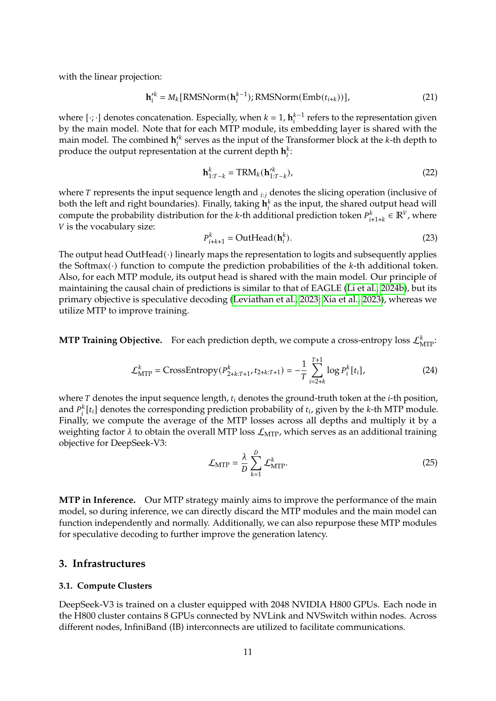

**图 4：单个前向块与反向块配对时的重叠策略。** Transformer 块边界并不对齐。橙色表示前向，绿色表示“输入反向传播”，蓝色表示“权重反向传播”，紫色表示流水线并行通信，红色表示屏障。全对全通信与流水线并行通信都能被完全隐藏。

### 3.2 训练框架

DeepSeek-V3 的训练由 HAI-LLM 支持，这是我们的工程师从零打造的高效、轻量训练框架。总体而言，DeepSeek-V3 使用 16 路流水线并行、跨 8 个节点的 64 路专家并行，以及 ZeRO-1 数据并行。

为高效训练 DeepSeek-V3，我们实施了细致的工程优化。第一，设计 DualPipe 算法实现高效流水线并行。相较现有流水线并行方法，DualPipe 的流水线气泡更少；更重要的是，它让前向和反向过程的计算阶段与通信阶段相互重叠，从而解决跨节点专家并行带来的沉重通信开销。第二，开发高效的跨节点全对全通信内核，充分利用 InfiniBand 与 NVLink 带宽，并节省专门用于通信的流式多处理器。最后，细致优化训练显存占用，使我们无需昂贵的张量并行即可训练 DeepSeek-V3。

#### 3.2.1 DualPipe 与计算—通信重叠

对 DeepSeek-V3 而言，跨节点专家并行引入的通信开销使计算—通信比约为低效的 1:1。为解决这个问题，我们设计创新的流水线并行算法 DualPipe。它通过有效重叠前向与反向阶段的计算和通信来加速模型训练，同时减少流水线气泡。

DualPipe 的关键思想，是让单个前向块与反向块配对后的内部计算和通信相互重叠。具体而言，我们把每个块分为四个组成部分：注意力、全对全分发、多层感知机和全对全合并。对于反向块，注意力和多层感知机还会像 ZeroBubble 那样，进一步拆成“输入反向传播”与“权重反向传播”两部分；此外还有流水线并行通信部分。

如图 4 所示，对一对前向块和反向块，我们重新排列这些组成部分，并手动调整用于通信和用于计算的 GPU 流式多处理器比例。该重叠策略保证全对全通信与流水线并行通信在执行中都能被完全隐藏。完整 DualPipe 调度见图 5：它使用双向流水线调度，同时从流水线两端送入微批次，使很大一部分通信完全重叠。这种重叠还保证，随着模型继续扩展，只要维持固定计算—通信比，我们仍可跨节点使用细粒度专家，同时让全对全通信开销接近于零。

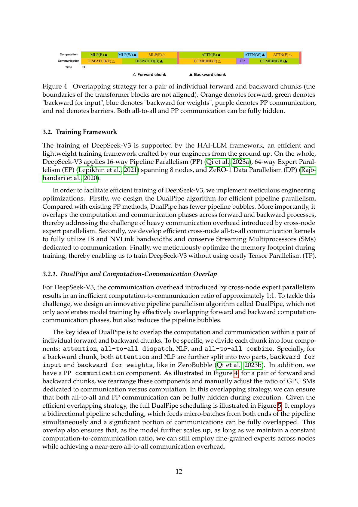

**图 5：8 个流水线并行秩、两个方向共 20 个微批次的 DualPipe 调度示例。** 反向微批次与前向微批次对称，为简化示意图省略其批次编号。共享黑色边框包围的两个单元，其计算与通信相互重叠。

**表 2：不同流水线并行方法的流水线气泡与显存用量比较。** $F$ 表示一个前向块的执行时间，$B$ 表示完整反向块的执行时间，$W$ 表示一个“权重反向传播”块的执行时间，$F\&B$ 表示两个相互重叠的前向块和反向块的执行时间。

即使在通信负担不重的更一般场景中，DualPipe 仍有明显效率优势。表 2 汇总不同流水线并行方法的气泡和显存用量。相较 ZB1P 与 1F1B，DualPipe 只把激活峰值显存提高 $1/PP$ 倍，却显著减少流水线气泡。DualPipe 需要保留两份模型参数，但训练时采用很大的专家并行规模，因此不会显著增加显存消耗。与 Chimera 相比，DualPipe 只要求流水线阶段数和微批次数都能被 2 整除，不要求微批次数能被流水线阶段数整除。除此之外，随着微批次数增长，DualPipe 的气泡和激活显存都不会增加。

#### 3.2.2 跨节点全对全通信的高效实现

为保证 DualPipe 有足够计算性能，我们定制高效的跨节点全对全通信内核，包括分发和合并，以减少专用于通信的流式多处理器数量。内核实现与 MoE 门控算法、集群网络拓扑协同设计。具体而言，集群中跨节点 GPU 通过 InfiniBand 完全互连，节点内通信则通过 NVLink 处理。NVLink 带宽为 160 GB/s，约为 InfiniBand 的 50 GB/s 的 3.2 倍。

为了有效利用两种不同带宽，我们把每个词元限制为最多分发到 4 个节点，从而减少 InfiniBand 流量。路由决策确定后，每个词元首先通过 InfiniBand 发送到目标节点中具有相同节点内索引的 GPU。到达目标节点后，系统尽量保证它立即经 NVLink 转发到承载目标专家的特定 GPU，不被随后抵达的词元阻塞。这样，InfiniBand 与 NVLink 通信完全重叠，每个词元能够在每个节点平均选择 3.2 个专家，而不引入额外 NVLink 开销。这意味着，尽管 DeepSeek-V3 实际只选择 8 个路由专家，在维持相同通信成本时最多可以扩展到 13 个专家，即 4 个节点乘以每节点 3.2 个专家。

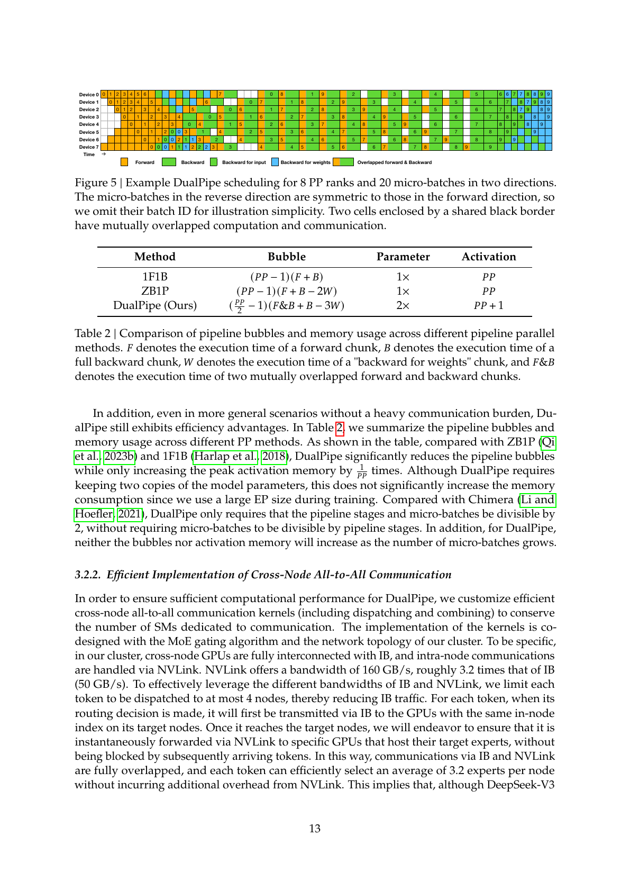

总体而言，在这种通信策略下，只需 20 个流式多处理器就能充分利用 InfiniBand 与 NVLink 带宽。具体而言，我们采用 Warp 专门化技术，把 20 个流式多处理器划分为 10 个通信通道。分发过程中，InfiniBand 发送、InfiniBand 到 NVLink 的转发、NVLink 接收分别由不同 Warp 处理；根据所有流式多处理器的实际工作负载，动态调整分配给每项通信任务的 Warp 数量。

类似地，在合并过程中，NVLink 发送、NVLink 到 InfiniBand 的转发与累加、InfiniBand 接收与累加，也分别由动态调整的 Warp 处理。分发和合并内核还会与计算流重叠，因此我们也考虑它们对其他流式多处理器计算内核的影响。具体做法是使用定制 PTX 指令，并自动调优通信块大小，从而显著减少二级缓存占用及其对其他流式多处理器的干扰。

#### 3.2.3 以极小开销大幅节省显存

为降低训练期间的显存占用，我们采用以下技术。

**重新计算 RMSNorm 与多头潜在注意力上投影。** 反向传播期间重新计算全部 RMSNorm 操作和多头潜在注意力上投影，因此无需持续存储它们的输出激活。这项策略只引入少量开销，却显著降低存储激活所需显存。

**在 CPU 中维护指数移动平均。** 训练时保存模型参数的指数移动平均，用于尽早估计学习率衰减后的模型表现。指数移动平均参数存储在 CPU 内存中，并在每个训练步骤后异步更新，从而无需额外显存或时间开销即可维护。

**多词元预测共享嵌入与输出头。** 使用 DualPipe 时，我们把模型最浅层——包括嵌入层——与最深层——包括输出头——部署在同一流水线并行秩上。这样，多词元预测模块与主模型之间便能物理共享嵌入层、输出头的参数和梯度，进一步提高显存效率。

### 3.3 FP8 训练

受近期低精度训练进展启发，我们提出一种使用 FP8 数据格式训练 DeepSeek-V3 的细粒度混合精度框架。低精度训练前景广阔，却常受激活、权重和梯度中异常值的限制。尽管推理量化已经取得显著进展，成功把低精度技术应用于大规模语言模型训练的研究仍相对较少。

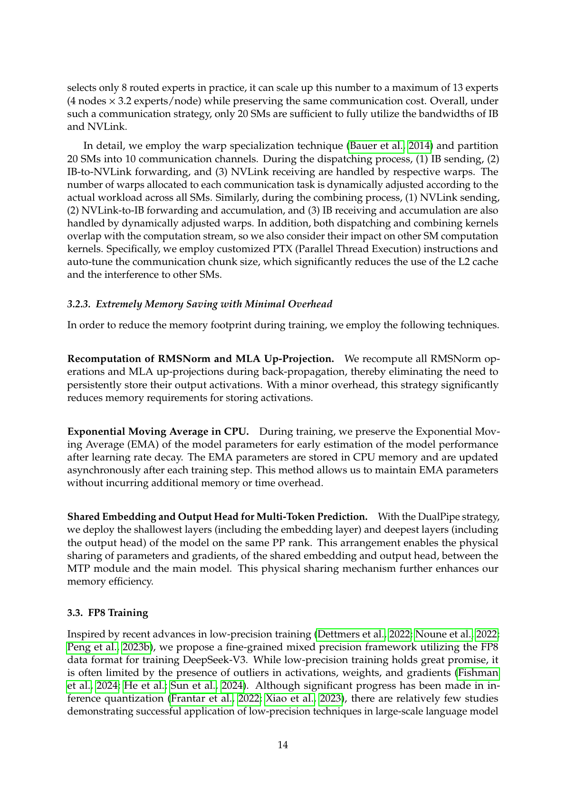

为解决这一挑战并有效扩大 FP8 格式的动态范围，我们采用细粒度量化策略：以 $1\times N_c$ 个元素为图块分组，或以 $N_c\times N_c$ 个元素为分块分组。提高累加精度的过程很大程度上抵消了相关反量化开销，而精确 FP8 通用矩阵乘法正依赖这一关键设计。为进一步降低 MoE 训练的显存和通信开销，我们还以 FP8 缓存并分发激活，同时用 BF16 存储低精度优化器状态。

我们在两个与 DeepSeek-V2-Lite、DeepSeek-V2 规模相近的模型上验证所提出的 FP8 混合精度框架，各训练约 1 万亿词元，更多细节见附录 B.1。值得注意的是，与 BF16 基线相比，FP8 训练模型的相对损失误差始终低于 0.25%，完全处于训练随机性可接受范围内。

#### 3.3.1 混合精度框架

在广泛采用的低精度训练技术基础上，我们提出 FP8 训练的混合精度框架。框架把大多数计算密集操作放在 FP8 中执行，同时有策略地让少数关键操作保留原始数据格式，以平衡训练效率与数值稳定性。整体框架见图 6。

首先，为加速模型训练，大多数核心计算内核，也就是通用矩阵乘法，都以 FP8 精度实现。这些运算接受 FP8 张量输入，并产生 BF16 或 FP32 输出。如图 6 所示，与线性算子相关的三种通用矩阵乘法——前向传播、激活反向传播和权重反向传播——全部使用 FP8。理论上，该设计相较原始 BF16 方法可把计算速度提高一倍。FP8 权重反向传播矩阵乘法还允许以 FP8 存储激活，供反向传播使用，从而显著减少显存消耗。

尽管 FP8 格式具有效率优势，某些算子对低精度计算很敏感，仍需更高精度；另一些成本较低的算子也能用几乎不影响总训练成本的方式采用更高精度。经过仔细研究，我们让嵌入模块、输出头、MoE 门控模块、归一化算子和注意力算子保留 BF16、FP32 等原始精度。这些有针对性的高精度保留保证 DeepSeek-V3 的训练动态稳定。为进一步保证数值稳定性，我们还以更高精度存储主权重、权重梯度和优化器状态。

**图 6：使用 FP8 数据格式的整体混合精度框架。** 为清晰起见，图中只展示线性算子。

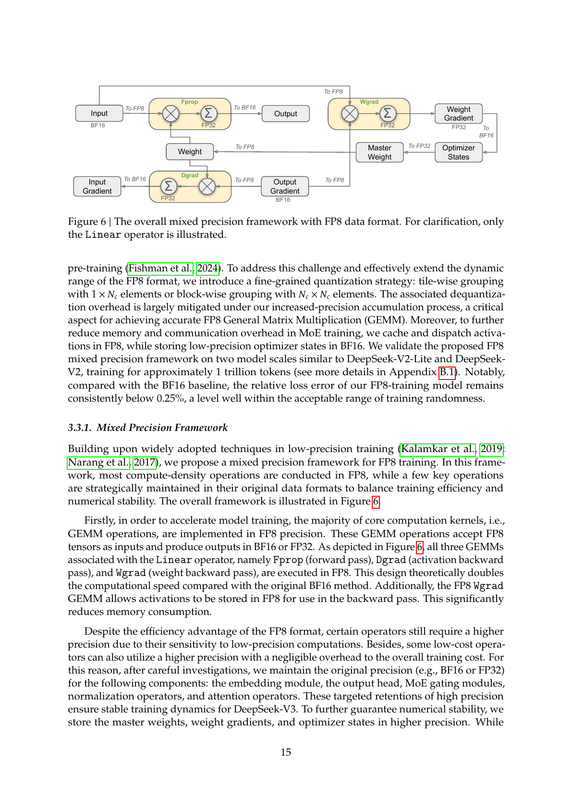

尽管这些高精度组成部分会带来一些显存开销，在分布式训练系统中跨多个数据并行秩进行高效分片，可把其影响降到最低。

#### 3.3.2 通过量化与乘法改进精度

基于 FP8 混合精度框架，我们从量化方法与乘法过程两方面引入若干策略，提高低精度训练的准确性。

**细粒度量化。** 由于 FP8 的指数位较少、动态范围有限，低精度训练框架常遇到上溢和下溢。标准做法是把输入张量最大绝对值缩放到 FP8 可表示的最大值，使输入分布与 FP8 可表示范围对齐。这让低精度训练对激活异常值极其敏感，并可能严重降低量化精度。

为解决该问题，我们提出在更细粒度上应用缩放的量化方法。如图 7（a）所示：第一，对激活按 $1\times128$ 图块分组并缩放，即每个词元、每 128 个通道一组；第二，对权重按 $128\times128$ 分块分组并缩放，即每 128 个输入通道和 128 个输出通道一组。由于能根据更小元素组调整缩放值，量化过程可以更好地适应异常值。附录 B.2 将进一步讨论，若像量化权重一样按分块方式分组和缩放激活，会引起怎样的训练不稳定。

我们方法的一项关键修改，是沿通用矩阵乘法内维度引入逐组缩放因子。标准 FP8 矩阵乘法不直接支持此功能，但结合精确的 FP32 累加策略即可高效实现。

**图 7：细粒度量化与累加精度提升。** （a）我们提出细粒度量化，缓解特征异常值引起的量化误差；为简化示意图，只展示前向传播。（b）结合量化策略，每进行 $N_C=128$ 个元素的矩阵乘加后便提升到 CUDA 核心做高精度累加，从而提高 FP8 通用矩阵乘法精度。

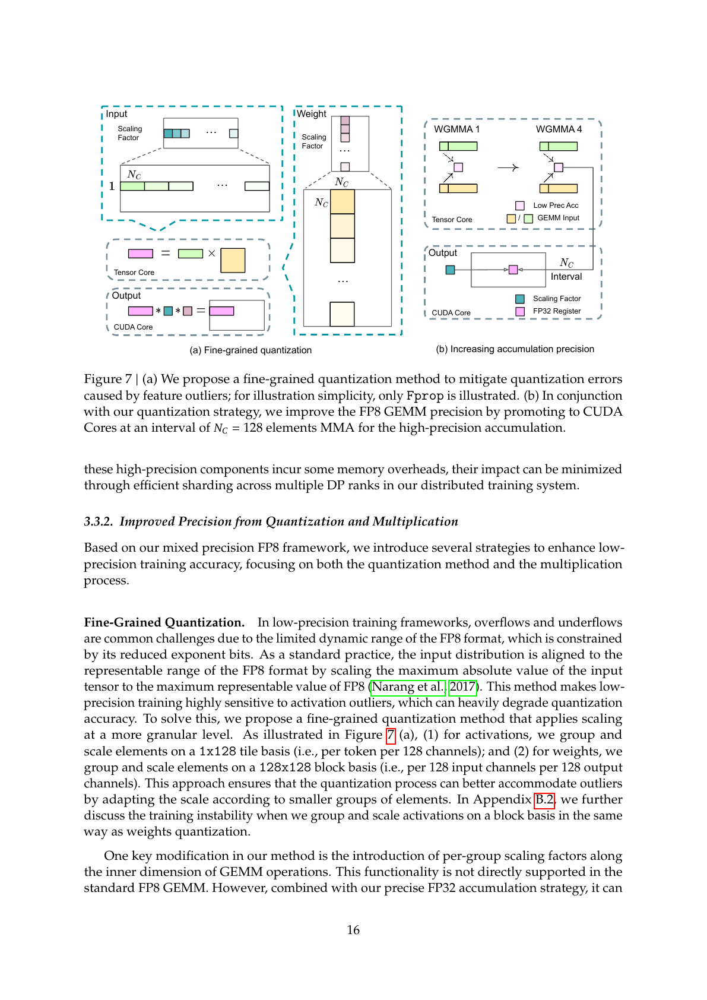

值得注意的是，我们的细粒度量化策略与微缩放格式的思想高度一致；NVIDIA 下一代 Blackwell 系列 GPU 的张量核心已经宣布支持量化粒度更小的微缩放格式。我们希望这一设计能为未来研究提供参考，与最新 GPU 架构保持同步。

**提高累加精度。** 低精度通用矩阵乘法经常出现下溢，其准确性高度依赖高精度累加，而后者通常以 FP32 执行。然而，我们观察到 NVIDIA H800 GPU 上的 FP8 矩阵乘法累加精度只能保留约 14 位，明显低于 FP32。当内维度 $K$ 很大时，这个问题会更加突出；大规模模型训练提高批大小和模型宽度时，正是典型场景。

以两个 $K=4096$ 的随机矩阵相乘为例，初步测试中，张量核心有限的累加精度导致最大相对误差接近 2%。尽管存在这些问题，少数 FP8 框架仍默认使用有限精度累加，严重限制训练准确性。

为解决该问题，我们采用提升到 CUDA 核心以获得更高精度的策略，过程见图 7（b）。具体而言，在张量核心执行矩阵乘加时，中间结果先以有限位宽累加；每达到 $N_C$ 的间隔，就把部分结果复制到 CUDA 核心的 FP32 寄存器中，以完整 FP32 精度累加。前述细粒度量化沿内维度 $K$ 应用逐组缩放因子；在反量化过程中，这些缩放因子可以在 CUDA 核心上高效相乘，额外计算成本很小。

这项修改会降低单个 Warp 组发出 WGMMA 指令的速率。不过在 H800 架构上，通常可让两个 WGMMA 并发驻留：一个 Warp 组执行精度提升操作时，另一个可执行矩阵乘加。该设计让两项操作重叠，保持张量核心高利用率。实验表明，把 $N_C$ 设为 128 个元素，即 4 次 WGMMA，是能够显著提高精度且不引入大量开销的最小累加间隔。

**尾数优先于指数。** 以往工作采用混合 FP8 格式：前向传播使用 E4M3，即 4 位指数、3 位尾数；激活与权重反向传播使用 E5M2，即 5 位指数、2 位尾数。与之不同，我们在所有张量上统一使用精度更高的 E4M3。之所以可行，是因为细粒度量化采用图块级和分块级缩放。在较小元素组上操作，相当于让组内元素有效共享指数位，从而缓解有限动态范围的影响。

**在线量化。** 张量级量化框架采用延迟量化，保存以往迭代中的最大绝对值历史，用它推断当前值。为保证缩放准确并简化框架，我们在线计算每个 $1\times128$ 激活图块或 $128\times128$ 权重块的最大绝对值，据此得到缩放因子，再在线把激活或权重量化为 FP8。

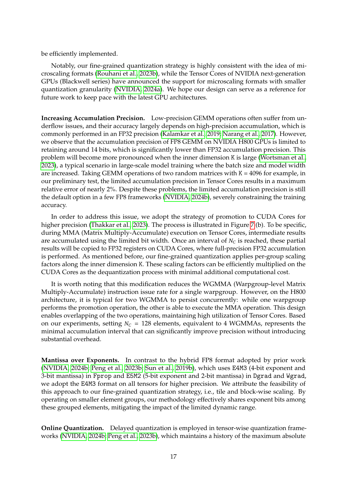

#### 3.3.3 低精度存储与通信

结合 FP8 训练框架，我们进一步把缓存激活与优化器状态压缩为低精度格式，从而减少显存消耗和通信开销。

**低精度优化器状态。** AdamW 优化器的一阶矩和二阶矩使用 BF16 而非 FP32 跟踪，没有出现可观察的性能下降。不过，为保证整个训练过程的数值稳定性，优化器存储的主权重以及用于批大小累加的梯度仍保留 FP32。

**低精度激活。** 如图 6 所示，权重反向传播使用 FP8。为了降低显存消耗，自然会选择以 FP8 缓存激活，供线性算子的反向传播使用。不过，为低成本地保持高精度，以下算子需要特殊处理：

1. **注意力算子之后线性层的输入。** 这些激活还用于注意力算子反向传播，因此对精度敏感。我们专门为它们使用定制 E5M6 数据格式。反向传播时，还把激活从 $1\times128$ 量化图块转换为 $128\times1$ 图块。为避免额外量化误差，全部缩放因子都舍入为 2 的整数次幂。
2. **MoE 中 SwiGLU 算子的输入。** 为进一步降低显存成本，我们缓存 SwiGLU 输入，并在反向传播时重新计算输出。这些激活也通过细粒度量化以 FP8 存储，在显存效率和计算准确性之间取得平衡。

**低精度通信。** 通信带宽是 MoE 模型训练的关键瓶颈。为缓解该问题，我们在 MoE 上投影之前先把激活量化为 FP8，再执行分发；这与 MoE 上投影中的 FP8 前向传播兼容。与注意力算子之后线性层的输入一样，该激活的缩放因子也是 2 的整数次幂。MoE 下投影之前的激活梯度采用相似策略。前向和反向的合并部分则都保留 BF16，以保护训练流水线关键环节的精度。

### 3.4 推理与部署

我们把 DeepSeek-V3 部署在 H800 集群上：节点内 GPU 通过 NVLink 互连，集群中的全部 GPU 通过 InfiniBand 完全互连。为同时保证在线服务的服务等级目标和高吞吐量，我们采用将预填充与解码阶段分离的部署策略。

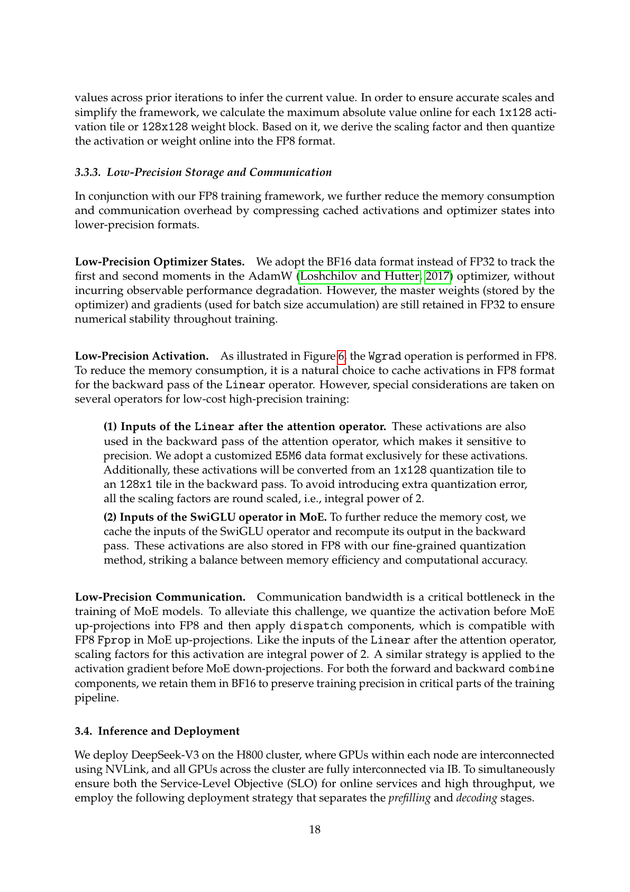

#### 3.4.1 预填充

预填充阶段的最小部署单元由 4 个节点、32 块 GPU 组成。注意力部分使用带序列并行的 4 路张量并行，并与 8 路数据并行结合；较小的 4 路张量并行限制了张量并行通信开销。MoE 部分使用 32 路专家并行，保证每个专家处理足够大的批次，从而提高计算效率。

MoE 全对全通信采用与训练相同的方法：先通过 InfiniBand 跨节点传输词元，再通过 NVLink 在节点内 GPU 间转发。尤其是在浅层稠密多层感知机中，我们使用单路张量并行，以节省张量并行通信。

为了在 MoE 部分的不同专家之间实现负载均衡，需要让每块 GPU 处理大致相同数量的词元。为此，我们引入冗余专家部署策略，复制负载较高的专家并冗余部署。高负载专家根据线上部署期间收集的统计信息检测，并定期调整，例如每 10 分钟一次。

确定冗余专家集合后，我们根据观察到的负载，在节点内各 GPU 之间仔细重新排列专家；目标是在不增加跨节点全对全通信开销的情况下，尽可能平衡 GPU 负载。部署 DeepSeek-V3 时，预填充阶段设置 32 个冗余专家。每块 GPU 除承载原有 8 个专家外，还额外承载 1 个冗余专家。

在预填充阶段，为提高吞吐量并隐藏全对全通信与张量并行通信的开销，我们还同时处理两个计算工作量相近的微批次，让一个微批次的注意力和 MoE 与另一个微批次的分发和合并相互重叠。

最后，我们正在探索动态专家冗余策略：每块 GPU 承载更多专家，例如 16 个，但每个推理步骤只激活其中 9 个。每层全对全操作开始前，实时计算全局最优路由方案。由于预填充阶段本身计算量很大，计算该路由方案的开销几乎可以忽略。

#### 3.4.2 解码

解码时，我们把共享专家视为路由专家。从这个角度看，每个词元在路由中选择 9 个专家；共享专家被视为始终选中的高负载专家。解码阶段的最小部署单元由 40 个节点、320 块 GPU 组成。注意力部分使用带序列并行的 4 路张量并行，并与 80 路数据并行结合；MoE 部分使用 320 路专家并行。

在 MoE 部分，每块 GPU 只承载一个专家，其中 64 块 GPU 负责承载冗余专家和共享专家。分发与合并部分的全对全通信通过 InfiniBand 上的直接点对点传输执行，以获得低延迟。我们还利用 IBGDA 技术进一步降低延迟、提高通信效率。

与预填充相似，我们依据在线服务统计出的专家负载，按固定时间间隔定期确定冗余专家集合。但由于每块 GPU 只承载一个专家，无需重新排列专家。我们也在探索解码阶段的动态冗余策略，不过这要求更谨慎地优化全局最优路由计算算法，并将其与分发内核融合，以降低开销。

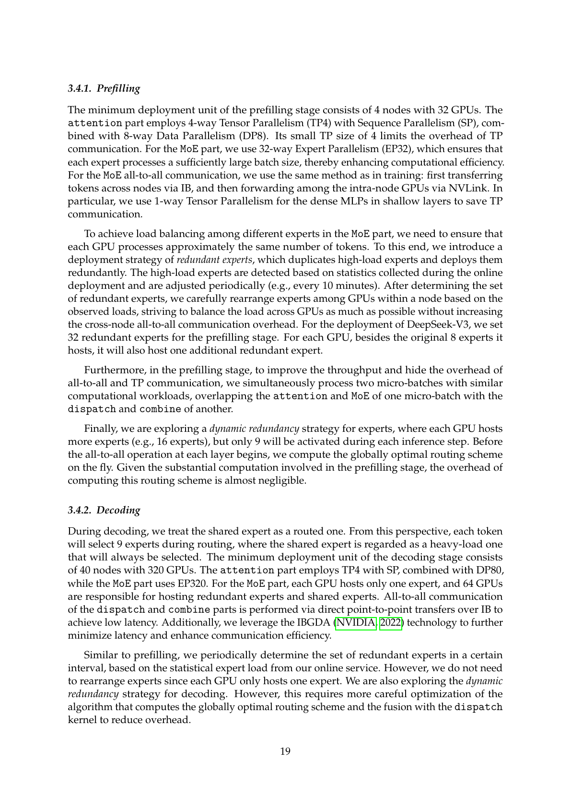

为提高吞吐量并隐藏全对全通信开销，我们还在探索解码阶段同时处理两个计算工作量相近的微批次。与预填充不同，注意力在解码阶段占用更多时间，因此让一个微批次的注意力与另一个微批次的“分发、MoE、合并”重叠。

解码阶段每个专家的批大小相对较小，通常不超过 256 个词元；瓶颈是显存访问而非计算。MoE 部分只需加载一个专家的参数，显存访问开销很小，因此使用较少流式多处理器不会显著影响整体表现。为避免影响注意力部分的计算速度，我们只需给“分发、MoE、合并”分配少量流式多处理器。

### 3.5 对硬件设计的建议

基于全对全通信与 FP8 训练方案的实现，我们向人工智能硬件厂商提出以下芯片设计建议。

#### 3.5.1 通信硬件

DeepSeek-V3 通过计算与通信重叠，在计算期间隐藏通信延迟。相较计算与通信串行执行，这显著降低了对通信带宽的依赖。然而，当前通信实现依赖昂贵的流式多处理器，例如在 H800 GPU 的 132 个流式多处理器中分配 20 个执行通信，从而限制计算吞吐量。使用流式多处理器做通信也极为低效，因为张量核心完全没有得到利用。

目前，流式多处理器主要为全对全通信执行以下任务：

- 在 InfiniBand 与 NVLink 域之间转发数据，同时由单块 GPU 聚合同一节点内发往多块 GPU 的 InfiniBand 流量。
- 在远程直接内存访问缓冲区，即注册的 GPU 显存区域，与输入、输出缓冲区之间搬运数据。
- 为全对全合并执行归约操作。
- 分块数据经 InfiniBand 与 NVLink 域传输到多个专家时，管理细粒度内存布局。

我们希望未来厂商开发硬件，把这些通信任务从宝贵的流式多处理器计算单元卸载出去，充当 GPU 协处理器，或类似 NVIDIA SHARP 的网络协处理器。为降低应用编程复杂度，我们还希望该硬件能从计算单元视角统一 InfiniBand 的横向扩展网络与 NVLink 的纵向扩展网络。借助统一接口，计算单元只需基于简单原语提交通信请求，就能在统一的 InfiniBand—NVLink 域中轻松完成读取、写入、多播与归约等操作。

#### 3.5.2 计算硬件

**张量核心应提供更高的 FP8 矩阵乘法累加精度。** NVIDIA Hopper 架构当前的张量核心实现中，FP8 矩阵乘法的累加精度有限。根据最大指数右移对齐 32 个尾数乘积后，张量核心只取每个尾数乘积最高的 14 位相加，超出范围的位会被截断；把加法结果累加进寄存器时同样使用 14 位精度。

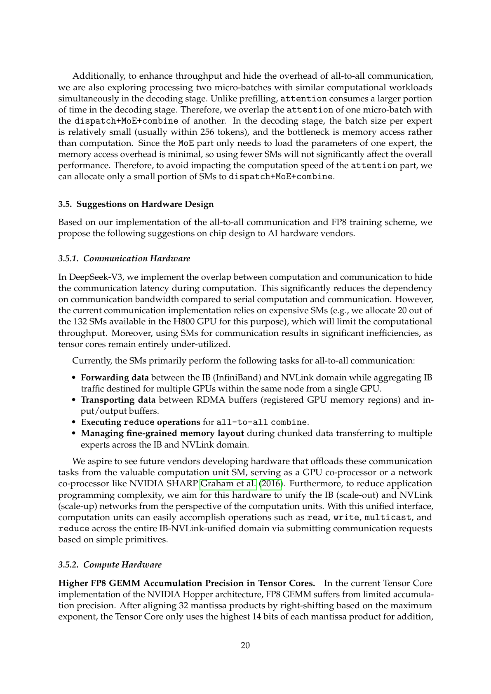

我们的实现把 128 次 FP8 乘 FP8 的加法结果提升到 CUDA 核心，以 FP32 精度累加进寄存器，部分缓解了这一限制。尽管这有助于成功完成 FP8 训练，但它只是在 Hopper 架构 FP8 矩阵乘法累加精度不足时的一种折中。未来芯片需要采用更高精度。

**支持图块级与分块级量化。** 当前 GPU 只支持逐张量量化，缺少对图块级、分块级等细粒度量化的原生支持。现有实现中，每达到 $N_C$ 间隔，部分结果就从张量核心复制到 CUDA 核心，与缩放因子相乘，再加到 CUDA 核心的 FP32 寄存器。虽然精确 FP32 累加策略显著缓解了反量化开销，张量核心与 CUDA 核心之间频繁搬运数据仍会限制计算效率。

因此，我们建议未来芯片让张量核心能够接收缩放因子，并实现带逐组缩放的矩阵乘加，从而支持细粒度量化。这样，直到产生最终结果为止，部分和累加与反量化都能直接在张量核心内部完成，避免频繁搬运数据。

**支持在线量化。** 尽管研究已经证明在线量化有效，现有实现仍难以高效支持。当前流程需要从高带宽显存读取 128 个 BF16 激活值，也就是上一项计算的输出，执行量化；随后把量化后的 FP8 值写回高带宽显存，矩阵乘加时又要再次读取。

为解决这种低效，我们建议未来芯片把 FP8 转换与张量内存加速器访问融合为一个操作，使激活从全局内存传到共享内存的过程中就完成量化，避免频繁读写显存。还建议支持 Warp 级转换指令以加速，从而更便于融合层归一化与 FP8 转换。另一种方案是采用近存计算，把计算逻辑放到高带宽显存附近；这样，从高带宽显存把 BF16 元素读入 GPU 时即可直接转为 FP8，使片外显存访问量减少约 50%。

**支持转置矩阵乘法操作。** 当前架构难以把矩阵转置与矩阵乘法融合。在我们的流程中，前向传播激活被量化成 $1\times128$ FP8 图块并存储；反向传播时，必须读出矩阵、反量化、转置、重新量化成 $128\times1$ 图块，再存回高带宽显存。

为减少显存操作，我们建议未来芯片对训练和推理都需要的精度，允许在矩阵乘加之前直接从共享内存转置读取矩阵。若再结合 FP8 格式转换与张量内存加速器访问的融合，这项改进将显著简化量化流程。

## 4 预训练

### 4.1 数据构建

相较 DeepSeek-V2，我们提高数学和编程样本比例，并把多语言覆盖范围扩展到英语和中文之外，从而优化预训练语料。数据处理流水线也经过改进，在保持语料多样性的同时尽量减少冗余。受 Ding 等人（2024）启发，我们采用文档打包方法保持数据完整性，但训练时不加入跨样本注意力掩码。最终，经过词元化器处理的 DeepSeek-V3 训练语料包含 14.8 万亿个高质量、多样化词元。

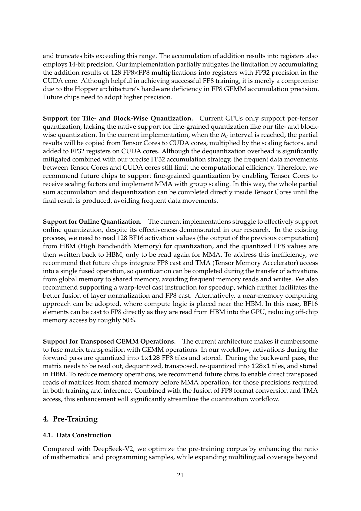

训练 DeepSeekCoder-V2 时，我们观察到中间填充策略不会损害下一词元预测能力，同时能让模型根据上下文线索准确预测中间文本。与 DeepSeekCoder-V2 一致，DeepSeek-V3 预训练也加入中间填充策略。具体使用“前缀—后缀—中间”框架，按以下方式组织数据：

```text
<|fim_begin|> 前缀 <|fim_hole|> 后缀 <|fim_end|> 中间文本 <|eos_token|>
```

该结构作为预打包过程的一部分，在文档级应用。与“前缀—后缀—中间”框架一致，中间填充策略的应用比例为 0.1。

DeepSeek-V3 词元化器采用字节级字节对编码，扩展词表包含 128K 个词元。我们修改预词元化器和训练数据，以优化多语言压缩效率。与 DeepSeek-V2 相比，新预词元化器还引入了把标点与换行符组合起来的词元。不过，当模型处理末尾没有换行符的多行提示，特别是少样本评测提示时，这种技巧可能引入词元边界偏差。为解决该问题，训练时随机拆分一定比例的此类组合词元，让模型接触更多特殊情况并缓解偏差。

### 4.2 超参数

**模型超参数。** Transformer 层数设为 61，隐藏维度设为 7168。全部可学习参数以标准差 0.006 随机初始化。多头潜在注意力使用 128 个注意力头，每个头的维度为 128；键值压缩维度设为 512，查询压缩维度设为 1536；携带旋转位置嵌入的解耦查询与键，每个头维度设为 64。

除前三层外，全部前馈网络都替换为 MoE 层。每个 MoE 层由 1 个共享专家和 256 个路由专家组成，每个专家的中间隐藏维度为 2048。每个词元激活 8 个路由专家，并保证最多发送到 4 个节点。多词元预测深度 $D$ 设为 1，即每个词元除准确预测下一词元外，再额外预测一个词元。与 DeepSeek-V2 一样，DeepSeek-V3 也在压缩潜在向量后使用额外 RMSNorm 层，并在宽度瓶颈处乘以额外缩放因子。在这套配置下，DeepSeek-V3 总参数量为 671B，每个词元激活 37B。

**训练超参数。** 使用 AdamW 优化器，$\beta_1=0.9$、$\beta_2=0.95$、权重衰减为 0.1。预训练最大序列长度设为 4K，在 14.8 万亿词元上训练 DeepSeek-V3。学习率在前 2000 步从 0 线性升至 $2.2\times10^{-4}$；随后保持不变，直到模型消耗 10 万亿训练词元；接着在 4.3 万亿词元内沿余弦衰减曲线逐渐降至 $2.2\times10^{-5}$。最后 5000 亿词元的训练中，前 3330 亿词元保持 $2.2\times10^{-5}$，之后切换到另一固定学习率。

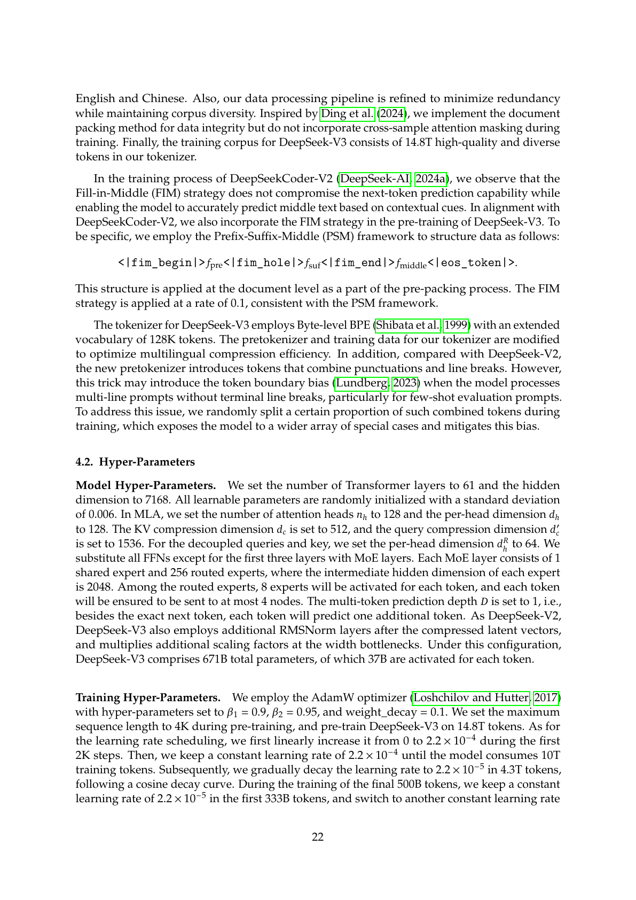

最后 1670 亿词元使用 $7.3\times10^{-6}$。梯度裁剪范数设为 1.0。我们采用批大小调度策略：在前 4690 亿词元的训练中，批大小从 3072 逐渐增至 15360，之后保持 15360 不变。

我们利用流水线并行把模型不同层部署到不同 GPU。每一层的路由专家均匀部署到 8 个节点的 64 块 GPU 上。节点受限路由把每个词元最多发送到 4 个节点，即 $M=4$。无辅助损失负载均衡在前 14.3 万亿词元中把偏置更新速度 $\gamma$ 设为 0.001，剩余 5000 亿词元中设为 0。均衡损失的 $\alpha$ 设为 0.0001，仅用于防止单条序列内部出现极端失衡。多词元预测损失权重 $\lambda$ 在前 10 万亿词元中设为 0.3，剩余 4.8 万亿词元中设为 0.1。

**图 8：大海捞针测试的评测结果。** DeepSeek-V3 在最长 128K 的全部上下文窗口长度上均表现良好。

### 4.3 长上下文扩展

我们采用与 DeepSeek-V2 相似的方法，使 DeepSeek-V3 获得长上下文能力。预训练完成后，使用 YaRN 扩展上下文，再额外执行两个各 1000 步的训练阶段，把上下文窗口从 4K 逐步扩展到 32K，再扩展到 128K。YaRN 配置与 DeepSeek-V2 相同，只应用于解耦共享键 $\mathbf{k}^{R}_t$。

两个阶段的超参数保持一致：缩放 $s=40$、$\alpha=1$、$\beta=32$，缩放因子 $t=0.1\ln s+1$。第一阶段序列长度设为 32K，批大小为 1920；第二阶段序列长度提高到 128K，批大小降低到 480。两个阶段的学习率都设为 $7.3\times10^{-6}$，与预训练末尾学习率一致。

经过两阶段扩展训练，DeepSeek-V3 可以处理最长 128K 的输入，同时保持强劲表现。图 8 显示，监督微调后的 DeepSeek-V3 在“大海捞针”测试中表现突出，在最长 128K 的各类上下文窗口长度上始终稳健。

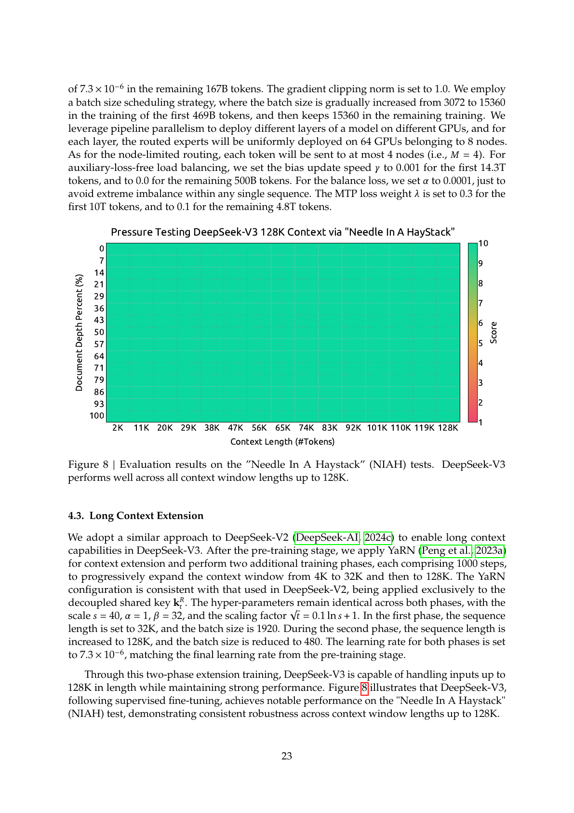

### 4.4 评测

#### 4.4.1 评测基准

DeepSeek-V3 基础模型在多语言语料上预训练，其中英语和中文占大多数，因此我们主要在一系列英语、中文基准以及一个多语言基准上评估。评测基于集成进 HAI-LLM 的内部评测框架。所用基准按类别列举如下；原文以下划线标记中文基准，以双下划线标记多语言基准。

- **多学科多项选择：** MMLU、MMLU-Redux、MMLU-Pro、MMMLU、C-Eval、CMMLU。
- **语言理解与推理：** HellaSwag、PIQA、ARC、BigBench Hard。
- **闭卷问答：** TriviaQA、NaturalQuestions。
- **阅读理解：** RACE、DROP、C3、CMRC。
- **指代消歧：** CLUEWSC、WinoGrande。
- **语言建模：** Pile。
- **中文理解与文化：** CCPM。
- **数学：** GSM8K、MATH、MGSM、CMath。
- **代码：** HumanEval、LiveCodeBench-Base（0801—1101）、MBPP、CRUXEval。
- **标准化考试：** AGIEval；其中同时包含英语和中文子集。

与前期工作一致，我们对 HellaSwag、PIQA、WinoGrande、RACE-Middle、RACE-High、MMLU、MMLU-Redux、MMLU-Pro、MMMLU、ARC-Easy、ARC-Challenge、C-Eval、CMMLU、C3、CCPM 采用基于困惑度的评测；对 TriviaQA、NaturalQuestions、DROP、MATH、GSM8K、MGSM、HumanEval、MBPP、LiveCodeBench-Base、CRUXEval、BBH、AGIEval、CLUEWSC、CMRC、CMath 采用基于生成的评测。Pile-test 则采用基于语言建模的评测，并以每字节比特数为指标，保证使用不同词元化器的模型得到公平比较。

#### 4.4.2 评测结果

表 3 将 DeepSeek-V3 基础模型与最先进的开源基础模型比较，包括前代 DeepSeek-V2-Base、Qwen2.5 72B Base 与 LLaMA-3.1 405B Base。所有模型均使用内部评测框架，并共享相同评测设置。需要说明的是，由于近几个月评测框架发生变化，DeepSeek-V2-Base 的表现与我们此前报告的结果略有差异。

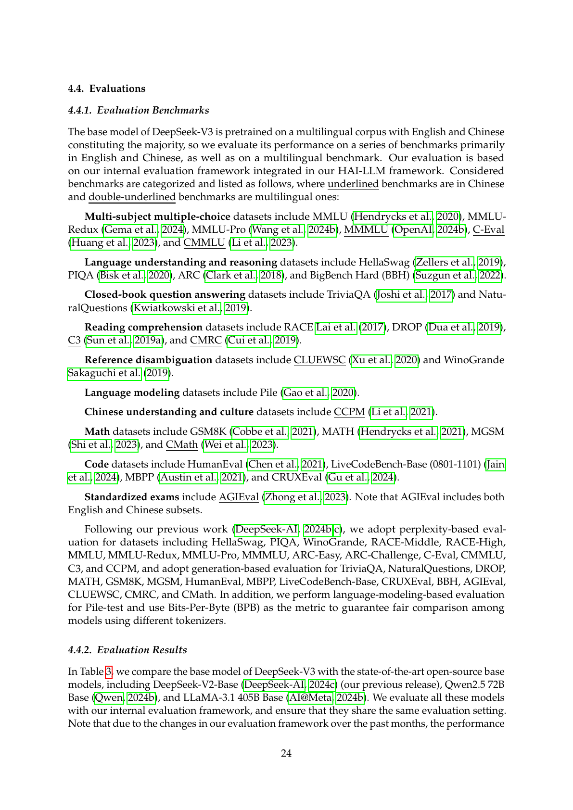

**表 3：DeepSeek-V3-Base 与其他代表性开源基础模型的比较。** 所有模型均在内部框架中使用相同设置评测；差距不超过 0.3 的分数视为同一水平。DeepSeek-V3-Base 在大多数基准上取得最佳表现，数学和代码任务尤其突出。

总体而言，DeepSeek-V3-Base 全面超过 DeepSeek-V2-Base 与 Qwen2.5 72B Base，并在大多数基准上超过 LLaMA-3.1 405B Base，实质上成为最强的开源基础模型。

从更细致的角度，我们逐一比较 DeepSeek-V3-Base 与其他开源基础模型：

1. 相较 DeepSeek-V2-Base，由于模型架构改进、模型与训练词元规模扩大、数据质量提升，DeepSeek-V3-Base 如预期般取得显著更好的表现。
2. 相较最先进的中文开源模型 Qwen2.5 72B Base，DeepSeek-V3-Base 只有一半激活参数，却依然表现出显著优势，尤其体现在英语、多语言、代码和数学基准上。在中文基准中，除中文多学科选择任务 CMMLU 外，DeepSeek-V3-Base 同样表现更好。
3. 相较激活参数量高达其 11 倍的最大开源模型 LLaMA-3.1 405B Base，DeepSeek-V3-Base 在多语言、代码与数学基准上也明显更强；在英语、中文语言基准上则表现相当或更好，并在 BBH、MMLU 系列、DROP、C-Eval、CMMLU、CCPM 上尤为出色。

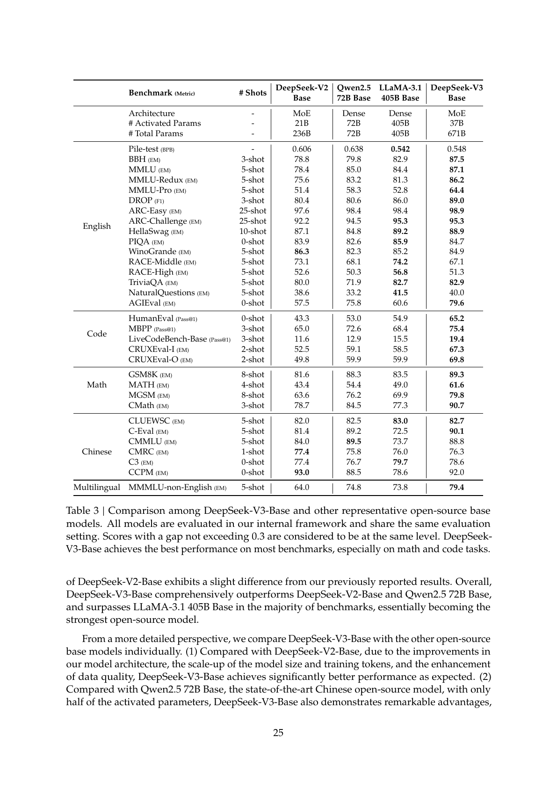

得益于高效架构和全面工程优化，DeepSeek-V3 达到极高训练效率。在我们的训练框架和基础设施下，每训练 1 万亿词元只需 18 万 H800 GPU 小时，远低于训练 72B 或 405B 稠密模型的成本。

**表 4：多词元预测策略的消融结果。** 多词元预测在大多数评测基准上一致提升模型表现。

### 4.5 讨论

#### 4.5.1 多词元预测消融实验

表 4 展示多词元预测策略的消融结果。我们在两种不同规模的基线模型上验证该策略。小规模实验在 1.33 万亿词元上训练一个总参数量 15.7B 的 MoE 基线模型；大规模实验在 5400 亿词元上训练一个总参数量 228.7B 的 MoE 基线模型。

在保持训练数据和其他架构不变的前提下，分别给两个基线模型附加深度为 1 的多词元预测模块，再训练两个使用多词元预测策略的模型作比较。推理时直接丢弃多词元预测模块，因此被比较模型的推理成本完全相同。表中可以看出，多词元预测在大多数评测基准上都能稳定提高模型表现。

#### 4.5.2 无辅助损失均衡策略消融实验

表 5 展示无辅助损失均衡策略的消融结果。我们同样在两个不同规模的基线模型上验证：小规模实验在 1.33 万亿词元上训练总参数量 15.7B 的 MoE 基线；大规模实验在 5780 亿词元上训练总参数量 228.7B 的 MoE 基线。

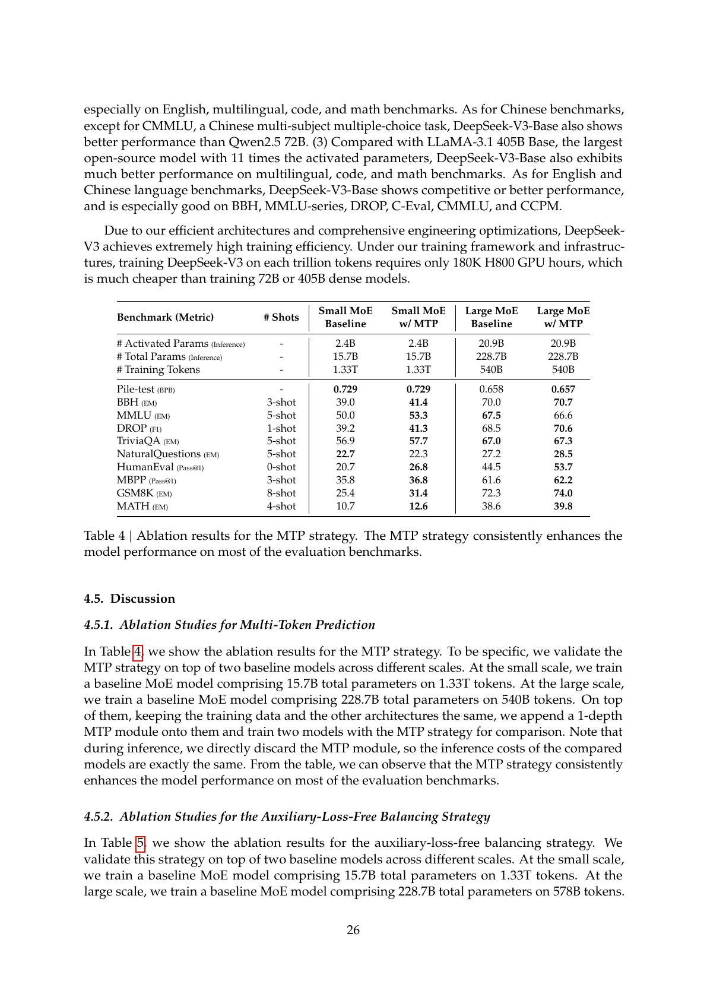

**表 5：无辅助损失均衡策略的消融结果。** 相较完全基于辅助损失的方法，无辅助损失策略在多数评测基准上稳定取得更好表现。

两个基线模型都只用辅助损失鼓励负载均衡，并采用带 Top-K 亲和度归一化的 Sigmoid 门控函数；控制辅助损失强度的超参数分别与 DeepSeek-V2-Lite 和 DeepSeek-V2 相同。在保持训练数据和其他架构不变的情况下，我们从两个基线中移除全部辅助损失，改用无辅助损失均衡策略作比较。结果显示，该策略在大多数评测基准上稳定取得更好表现。

#### 4.5.3 批次级负载均衡与序列级负载均衡

无辅助损失均衡与序列级辅助损失的关键区别在于均衡范围：前者是批次级，后者是序列级。相较序列级辅助损失，批次级均衡的约束更灵活，因为它不强制每条序列在自身领域内部保持均衡。这种灵活性允许专家更好地专门化到不同领域。

为验证这一点，我们记录并分析一个采用辅助损失的 16B 基线模型与一个采用无辅助损失的 16B 模型，在 Pile 测试集不同领域上的专家负载。如图 9 所示，无辅助损失模型如预期般呈现更强的专家专门化模式。

为进一步研究这种灵活性与模型性能优势之间的相关性，我们额外设计并验证一种批次级辅助损失：它在每个训练批次而非每条序列上鼓励负载均衡。实验表明，在达到相近批次级负载均衡水平时，批次级辅助损失也能取得与无辅助损失方法相近的模型表现。

具体而言，在 1B MoE 模型实验中，验证损失分别为：使用序列级辅助损失时 2.258，使用无辅助损失方法时 2.253，使用批次级辅助损失时 2.253。在 3B MoE 模型上也观察到相似结果：序列级辅助损失模型的验证损失为 2.085；无辅助损失方法与批次级辅助损失模型均为 2.080。

虽然批次级负载均衡方法展现出一致性能优势，它们在效率方面也面临两个潜在挑战。

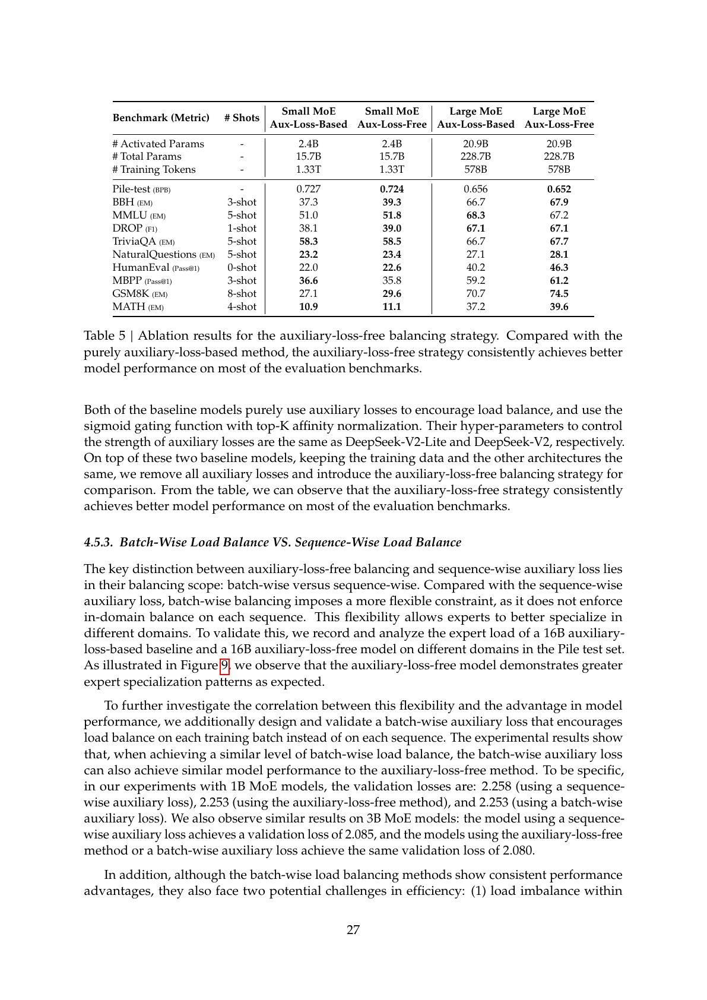

这两个挑战分别是：第一，某些序列或小批次内部可能失衡；第二，推理时可能因领域偏移而出现负载失衡。第一个挑战由使用大规模专家并行和数据并行的训练框架自然解决，因为它保证每个微批次足够大。对第二个挑战，我们也设计并实现了第 3.4 节所述带冗余专家部署的高效推理框架。

**图 9：采用无辅助损失和采用辅助损失的模型，在 Pile 测试集三个领域上的专家负载。** 无辅助损失模型呈现更强的专家专门化模式。相对专家负载是实际专家负载与理论均衡负载的比值。受篇幅限制，正文只以两层为例，所有层的结果见附录 C。

## 5 后训练

### 5.1 监督微调

我们整理出包含 150 万个实例的指令微调数据集，覆盖多个领域；每个领域根据具体要求采用不同的数据创建方法。

**推理数据。** 数学、编程竞赛题、逻辑谜题等推理数据由内部 DeepSeek-R1 模型生成。R1 生成的数据准确率很高，但存在思考过度、格式不佳、篇幅过长等问题。我们的目标是在 R1 推理数据的高准确率与常规格式推理数据的清晰、简洁之间取得平衡。

方法首先为代码、数学或通用推理等特定领域开发专家模型，使用监督微调与强化学习组合训练流水线。该专家模型随后作为最终模型的数据生成器。训练时，为每个实例生成两类不同的监督微调样本：第一类把问题与原始回答配成“问题、原始回答”；第二类把系统提示、问题与 R1 回答组合为“系统提示、问题、R1 回答”。

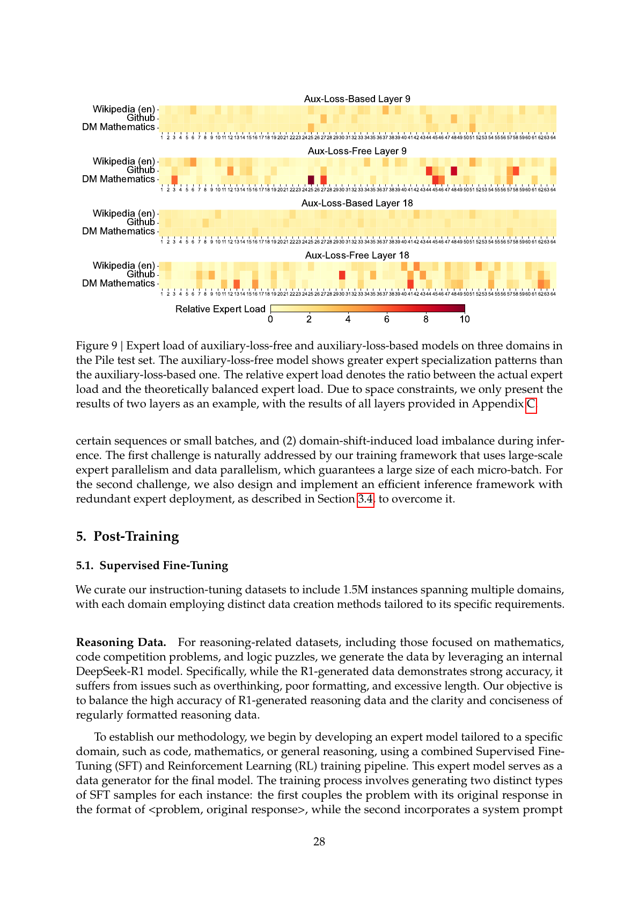

系统提示经过细致设计，其中包含引导模型生成带反思和验证机制回答的指令。在强化学习阶段，即使没有明确系统提示，模型也会通过高温采样生成同时融合 R1 数据与原始数据模式的回答。经过数百个强化学习步骤，中间强化学习模型学会纳入 R1 模式，以有策略的方式提升整体表现。

强化学习训练结束后，我们进行拒绝采样，以专家模型作为数据来源，为最终模型筛选高质量监督微调数据。该方法保证最终训练数据既保留 DeepSeek-R1 的优势，又能产生简洁有效的回答。

**非推理数据。** 对创意写作、角色扮演、简单问答等非推理数据，使用 DeepSeek-V2.5 生成回答，再由人工标注者验证数据的准确性与正确性。

**监督微调设置。** 使用监督微调数据集对 DeepSeek-V3-Base 微调两个轮次；学习率采用余弦衰减调度，从 $5\times10^{-6}$ 逐步降至 $1\times10^{-6}$。训练中，每条序列由多个样本打包而成，但通过样本掩码策略保证各样本相互隔离、彼此不可见。

### 5.2 强化学习

#### 5.2.1 奖励模型

强化学习过程同时采用基于规则的奖励模型与基于模型的奖励模型。

**基于规则的奖励模型。** 对可以用特定规则验证的问题，采用规则奖励系统确定反馈。例如，某些数学题有确定结果，我们要求模型按指定格式给出最终答案，例如放进方框，以便应用规则验证正确性。对于 LeetCode 题目，可使用编译器根据测试用例产生反馈。只要条件允许，就采用基于规则的验证；该方法不易被操纵或利用，因此可靠性更高。

**基于模型的奖励模型。** 对具有自由形式标准答案的问题，依靠奖励模型判断回答是否与预期标准答案一致。对创意写作等没有确定标准答案的问题，奖励模型则把问题和对应回答作为输入并给出反馈。奖励模型从 DeepSeek-V3 监督微调检查点训练而来。为增强可靠性，我们构建的偏好数据不仅提供最终奖励，也包含通向该奖励的思维链，从而帮助缓解特定任务上的奖励作弊风险。

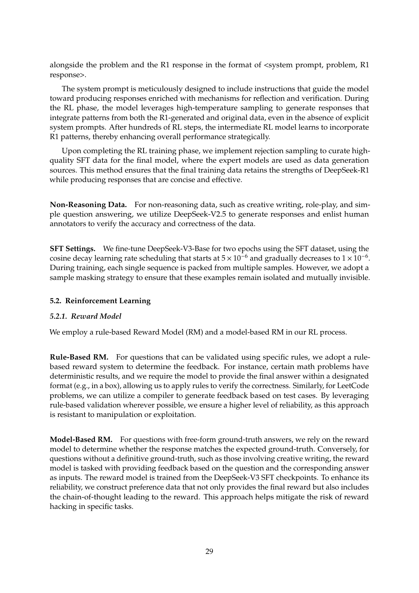

#### 5.2.2 组相对策略优化

与 DeepSeek-V2 类似，我们采用组相对策略优化。它不再使用通常与策略模型规模相同的评论家模型，而是通过组内分数估计基线。具体而言，对每个问题 $q$，组相对策略优化从旧策略模型中采样一组输出，再通过最大化公式（26）的目标优化策略模型。公式（27）给出与参考模型之间的 KL 散度；$\varepsilon$ 与 $\beta$ 是超参数，$A_i$ 是优势值，由组内各输出对应奖励按公式（28）标准化得到。

强化学习过程中，我们纳入代码、数学、写作、角色扮演、问答等多个领域的提示。这不仅使模型更贴近人类偏好，也提高模型的基准表现，尤其是在可用监督微调数据有限的场景中。

### 5.3 评测

#### 5.3.1 评测设置

**评测基准。** 除基础模型测试所用基准外，我们还在 IFEval、FRAMES、LongBench v2、GPQA、SimpleQA、C-SimpleQA、SWE-Bench Verified、Aider、LiveCodeBench、Codeforces、2024 年全国中学生数学奥林匹克竞赛和 2024 年美国数学邀请赛上评估指令模型。LiveCodeBench 使用 2024 年 8 月至 11 月的问题。

**比较基线。** 我们将对话模型与多种强基线全面比较，包括 DeepSeek-V2-0506、DeepSeek-V2.5-0905、Qwen2.5 72B Instruct、LLaMA-3.1 405B Instruct、Claude-Sonnet-3.5-1022 和 GPT-4o-0513。DeepSeek-V2 系列选择最具代表性的变体，闭源模型则通过各自 API 评测。

**详细评测配置。** MMLU、DROP、GPQA、SimpleQA 等标准基准使用 simple-evals 框架中的评测提示。

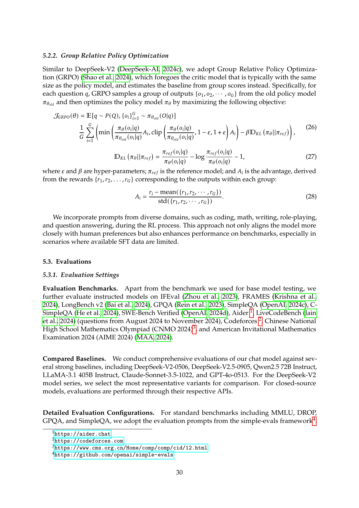

MMLU-Redux 在零样本设置下使用 Zero-Eval 提示格式。其他数据集遵循创建者提供的原始评测协议与默认提示。代码与数学评测的具体设置如下：

- HumanEval-Mul 共包含 Python、Java、C++、C#、JavaScript、TypeScript、PHP、Bash 八种主流编程语言。
- LiveCodeBench 同时用思维链和非思维链方法评测，数据来自 2024 年 8 月至 11 月。
- Codeforces 以参赛者百分位衡量。
- SWE-Bench Verified 使用无智能体框架评测。
- Aider 相关基准使用差异格式。
- AIME 与 2024 年全国中学生数学奥林匹克竞赛以温度 0.7 评测，结果取 16 次运行的平均值；MATH-500 使用贪心解码。
- 所有模型在每个基准上最多可输出 8192 个词元。

**表 6：DeepSeek-V3 与其他代表性对话模型的比较。** 所有模型的输出长度上限均为 8K。样本少于 1000 个的基准以不同温度多次测试，得到稳健最终结果。DeepSeek-V3 是表现最好的开源模型，也能与前沿闭源模型竞争。

#### 5.3.2 标准评测

表 6 给出评测结果，显示 DeepSeek-V3 是表现最好的开源模型；同时，它可以与 GPT-4o、Claude-3.5-Sonnet 等前沿闭源模型竞争。

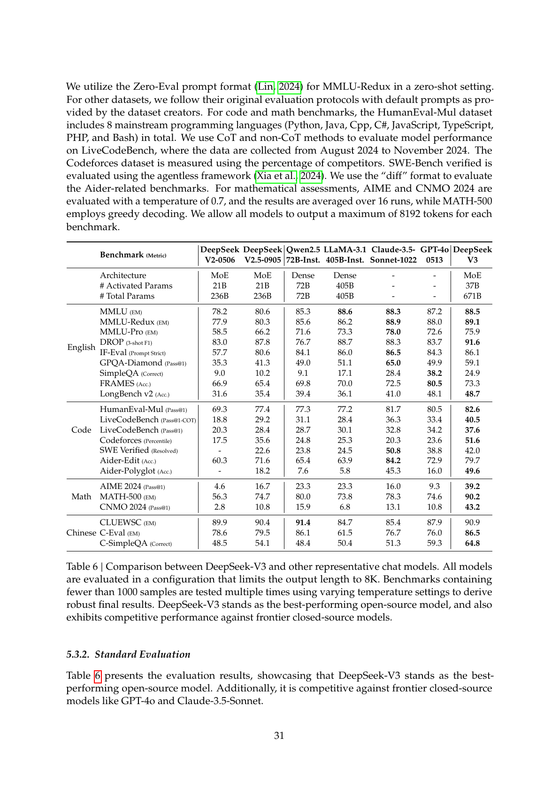

**英语基准。** MMLU 是广受认可的基准，用于评估大型语言模型在不同知识领域和任务上的表现。DeepSeek-V3 具有竞争力，与 LLaMA-3.1-405B、GPT-4o、Claude-Sonnet 3.5 等顶尖模型相当，并显著超过 Qwen2.5 72B。在难度更高的教育知识基准 MMLU-Pro 上，DeepSeek-V3 表现出色，仅略低于 Claude-Sonnet 3.5；在修正标签后的 MMLU 精炼版本 MMLU-Redux 上，DeepSeek-V3 超过所有同类模型；在博士级评测 GPQA-Diamond 上也取得突出结果，仅次于 Claude 3.5 Sonnet，并以明显优势超过其他竞争者。

在 DROP、LongBench v2、FRAMES 等长上下文理解基准上，DeepSeek-V3 继续展现顶尖模型地位。DROP 的三样本设置中，它取得 91.6 的 F1，超过该类别所有其他模型。在需要基于 10 万词元上下文问答的 FRAMES 上，DeepSeek-V3 略低于 GPT-4o，却显著高于所有其他模型，证明其处理超长上下文任务的强大能力。

DeepSeek-V3 在 LongBench v2 上达到同类最佳，进一步验证长上下文能力；该数据集在 DeepSeek-V3 发布前几周才刚公开。在事实知识基准 SimpleQA 上，DeepSeek-V3 落后于 GPT-4o 与 Claude-Sonnet，主要源于模型设计重点和资源分配。DeepSeek-V3 为学习中文知识分配了更多训练词元，因此在 C-SimpleQA 上表现卓越。在指令遵循基准上，它显著超过前代 DeepSeek-V2 系列，说明其理解并遵守用户指定格式约束的能力得到提高。

**代码与数学基准。** 代码是大型语言模型困难且实用的任务，既包含 SWE-Bench-Verified、Aider 等工程任务，也包含 HumanEval、LiveCodeBench 等算法任务。在工程任务上，DeepSeek-V3 低于 Claude-Sonnet-3.5-1022，却显著超过其他开源模型。开源 DeepSeek-V3 有望推动代码工程任务的发展：开放其强大能力能够促进软件工程、算法开发等领域的创新和改进，帮助开发者与研究者拓展开源模型在代码任务中的能力边界。

在算法任务上，DeepSeek-V3 表现优越，在 HumanEval-Mul、LiveCodeBench 等基准上超过全部基线。这一成功得益于先进的知识蒸馏技术，它有效增强了模型在算法任务上的代码生成与问题求解能力。

数学基准上，DeepSeek-V3 表现卓越，显著超过基线，为非 o1 类模型建立新的最先进水平。具体而言，在 AIME、MATH-500 和 2024 年全国中学生数学奥林匹克竞赛上，DeepSeek-V3 相较第二名 Qwen2.5 72B 的绝对分数高约 10%；对这些高难基准而言，这是巨大差距。该能力突显从 DeepSeek-R1 蒸馏技术的有效性，事实证明它对非 o1 类模型非常有益。

**中文基准。** Qwen 与 DeepSeek 是同时有力支持中文和英文的两个代表性模型系列。在中文事实基准 Chinese SimpleQA 上，DeepSeek-V3 比 Qwen2.5-72B 高 16.4 分；而 Qwen2.5 的训练语料包含 18 万亿词元，比 DeepSeek-V3 的 14.8 万亿多 20%。

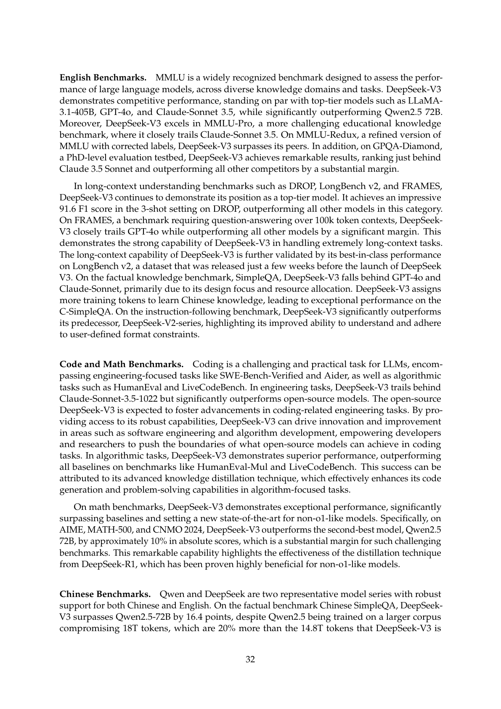

在代表性中文教育知识基准 C-Eval 和中文 Winograd 模式挑战 CLUEWSC 上，DeepSeek-V3 与 Qwen2.5-72B 表现相近，表明两者都针对高难中文推理与教育任务进行了良好优化。

**表 7：英语开放式对话评测。** AlpacaEval 2.0 使用长度受控胜率作为指标。

#### 5.3.3 开放式评测

除标准基准外，我们还在开放式生成任务上用大型语言模型担任评委，结果见表 7。具体遵循 AlpacaEval 2.0 与 Arena-Hard 的原始配置，由 GPT-4-Turbo-1106 担任评委进行成对比较。

在 Arena-Hard 上，DeepSeek-V3 对基线 GPT-4-0314 的胜率超过 86%，可与 Claude-Sonnet-3.5-1022 等顶尖模型相当。这说明 DeepSeek-V3 的能力十分稳健，尤其善于处理包含代码和调试任务在内的复杂提示。DeepSeek-V3 还是首个在 Arena-Hard 超过 85% 的开源模型。这项突破显著缩小开源与闭源模型的性能差距，为开源模型在困难领域可以达到的水平建立新标准。

DeepSeek-V3 在 AlpacaEval 2.0 上同样表现卓越，超过闭源和开源模型，说明它非常擅长写作任务和直接问答。尤其是，它比 DeepSeek-V2.5-0905 高出 20 个百分点，表明在处理简单任务方面有巨大进步，也证明各项改进有效。

#### 5.3.4 将 DeepSeek-V3 用作生成式奖励模型

我们把 DeepSeek-V3 的判断能力与 GPT-4o、Claude-3.5 等最先进模型比较。表 8 给出这些模型在 RewardBench 上的表现。DeepSeek-V3 与最佳版本 GPT-4o-0806、Claude-3.5-Sonnet-1022 相当，并超过其他版本。投票技术还能进一步增强 DeepSeek-V3 的判断能力。因此，我们让 DeepSeek-V3 结合投票，在开放式问题上提供自反馈，以提高对齐过程的有效性与稳健性。

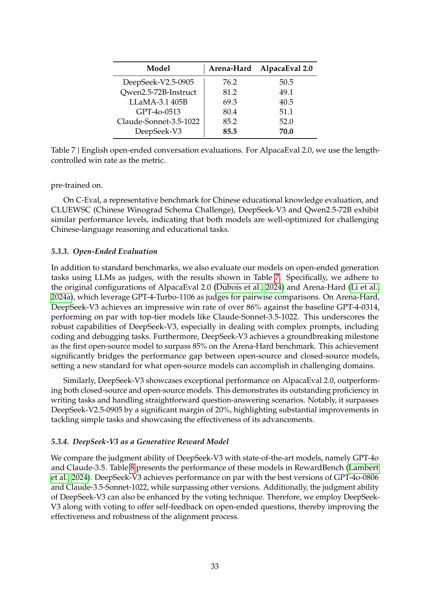

**表 8：GPT-4o、Claude-3.5-Sonnet 与 DeepSeek-V3 在 RewardBench 上的表现。**

**表 9：从 DeepSeek-R1 蒸馏的贡献。** LiveCodeBench 与 MATH-500 的评测设置同表 6。

### 5.4 讨论

#### 5.4.1 从 DeepSeek-R1 蒸馏

我们以 DeepSeek-V2.5 为基础，对从 DeepSeek-R1 蒸馏的贡献进行消融。基线模型使用短思维链数据训练，比较模型则使用前述专家检查点生成的数据。

表 9 证明蒸馏数据有效：LiveCodeBench 与 MATH-500 均显著提升。实验还揭示有趣的权衡：蒸馏带来更好表现，也使平均回答长度大幅增加。为平衡模型准确率与计算效率，我们谨慎选择 DeepSeek-V3 的最优蒸馏设置。

研究表明，从推理模型执行知识蒸馏，是后训练优化很有前景的方向。当前工作专注于蒸馏数学和代码领域数据，但这种方法可能广泛应用于更多任务领域。它在特定领域已经证明有效，说明长思维链蒸馏也可能提高其他需要复杂推理的认知任务表现。未来研究的重要方向之一，是进一步探索它在不同领域的作用。

#### 5.4.2 自奖励

奖励在强化学习中至关重要，负责引导优化过程。对于某些代码、数学场景，可以直接通过外部工具验证，强化学习表现极其有效。然而在更一般场景中，很难通过硬编码构建反馈机制。开发 DeepSeek-V3 时，我们在这些更广泛的情境中采用宪法式人工智能方法，把 DeepSeek-V3 自身的投票评测结果作为反馈来源。

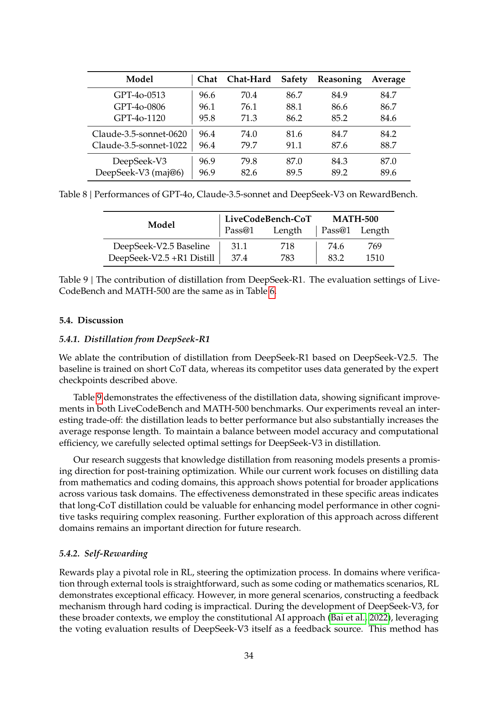

该方法产生了显著对齐效果，大幅提高 DeepSeek-V3 在主观评测中的表现。加入额外宪法输入后，DeepSeek-V3 可以沿宪法指定方向优化。我们认为，把补充信息与充当反馈源的大型语言模型结合，是极其重要的范式。大型语言模型是通用处理器，能够把不同场景的非结构化信息转化为奖励，最终促进大型语言模型自我改进。除自奖励外，我们也致力于发现其他通用、可扩展的奖励方法，持续提高模型在一般场景中的能力。

#### 5.4.3 多词元预测评测

DeepSeek-V3 不只预测下一个词元，而是通过多词元预测技术预测接下来两个词元。与推测解码框架结合后，可以显著提高模型解码速度。一个自然问题是：额外预测词元的接受率有多高？评测显示，在不同生成主题中，第二个词元预测的接受率处于 85% 至 90% 之间，始终可靠。如此高的接受率使 DeepSeek-V3 显著加快解码，达到原来 1.8 倍的每秒词元数。

## 6 结论、局限与未来方向

本文提出 DeepSeek-V3：一个总参数量 671B、激活参数量 37B，在 14.8 万亿词元上训练的大型 MoE 语言模型。除多头潜在注意力和 DeepSeekMoE 架构外，它还首创无辅助损失的负载均衡策略，并设置多词元预测训练目标以增强表现。FP8 训练支持与细致工程优化，使 DeepSeek-V3 的训练经济高效；后训练也成功从 DeepSeek-R1 系列模型中蒸馏出推理能力。

综合评测显示，DeepSeek-V3 已成为当前最强的开源模型，并达到可与 GPT-4o、Claude-3.5-Sonnet 等领先闭源模型相当的表现。尽管能力强劲，它仍保持经济训练成本：包括预训练、上下文长度扩展与后训练在内的完整训练只需 278.8 万 H800 GPU 小时。

在肯定其强劲表现和成本效益的同时，我们也认识到 DeepSeek-V3 存在一些局限，尤其是在部署方面。第一，为保证高效推理，推荐部署单元相对较大，可能给小团队带来负担。第二，尽管 DeepSeek-V3 的部署策略已使端到端生成速度达到 DeepSeek-V2 的两倍以上，仍有进一步提升空间。幸运的是，随着更先进硬件发展，这些局限有望自然得到解决。

DeepSeek 始终坚持开源模型的长期主义路线，目标是稳步接近通用人工智能。未来计划有策略地在以下方向投入研究：

- 持续研究并改进模型架构，进一步提高训练和推理效率，努力接近对无限上下文长度的高效支持；同时尝试突破 Transformer 的架构限制，拓展其建模能力边界。

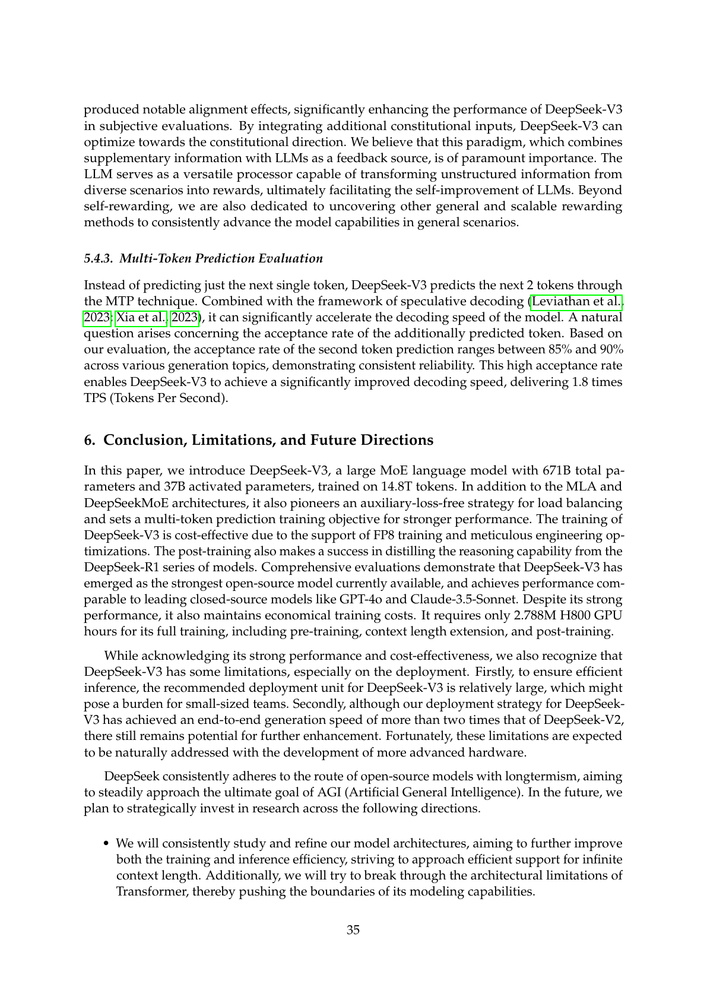

- 持续迭代训练数据的数量和质量，探索纳入更多训练信号来源，推动数据在更全面的维度上扩展。
- 持续探索并迭代模型的深度思考能力，通过扩展推理长度和深度，提高模型智能与问题求解能力。
- 探索更全面、多维的模型评测方法，避免研究过程中倾向于优化固定基准集合；这种倾向可能制造对模型能力的误导性印象，并影响基础判断。

## 参考文献

参考文献按原论文顺序保留于原页截图中。

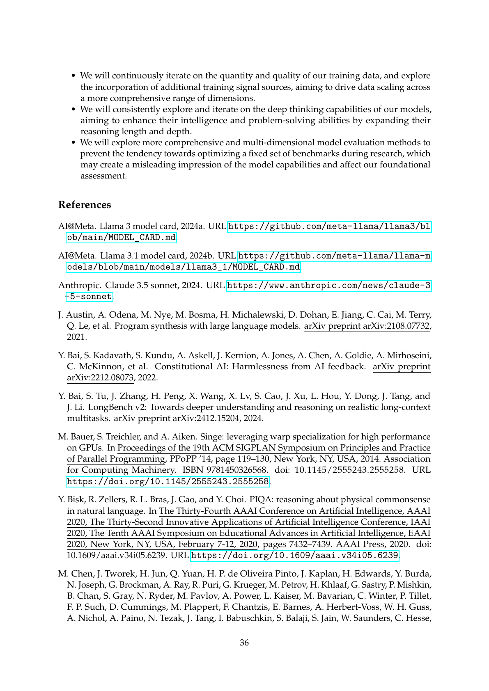

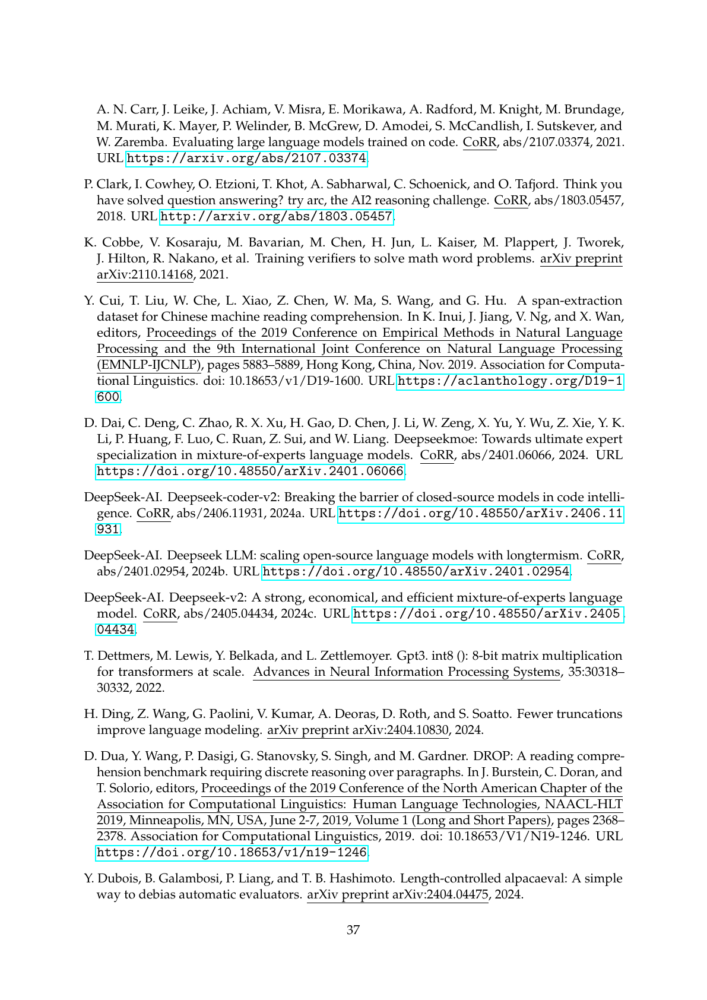

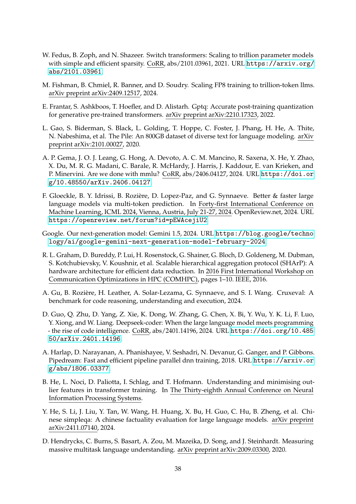

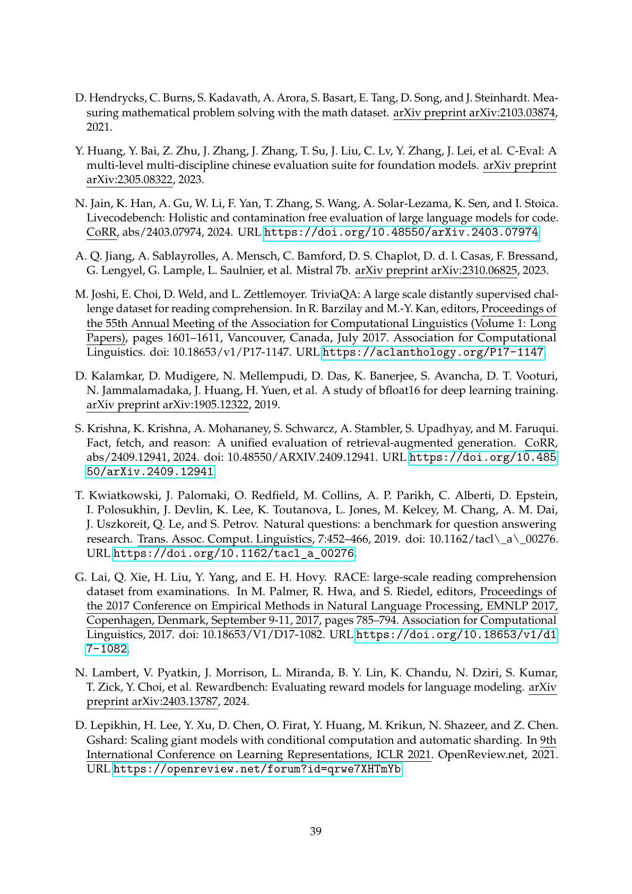

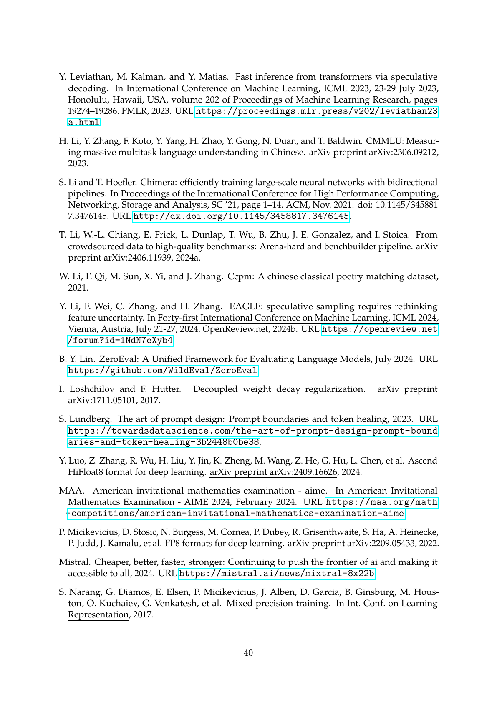

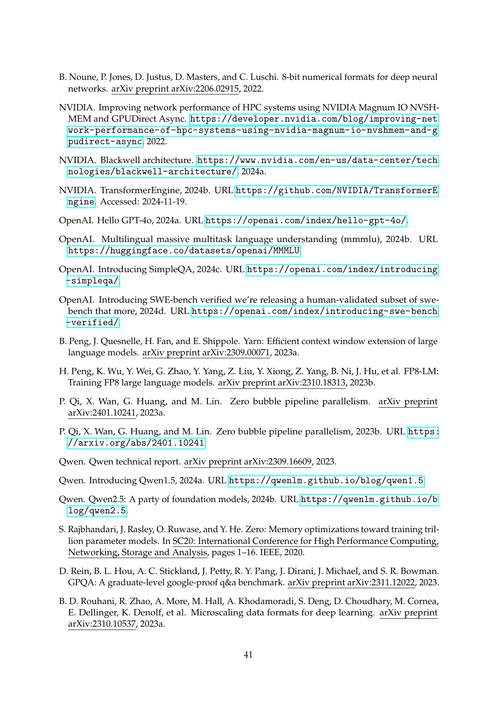

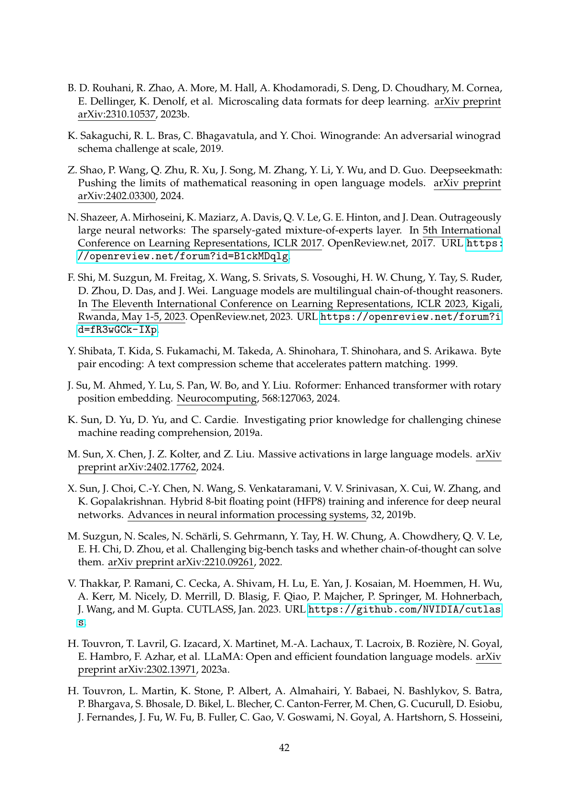

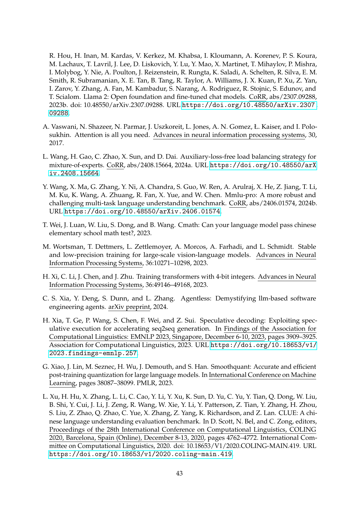

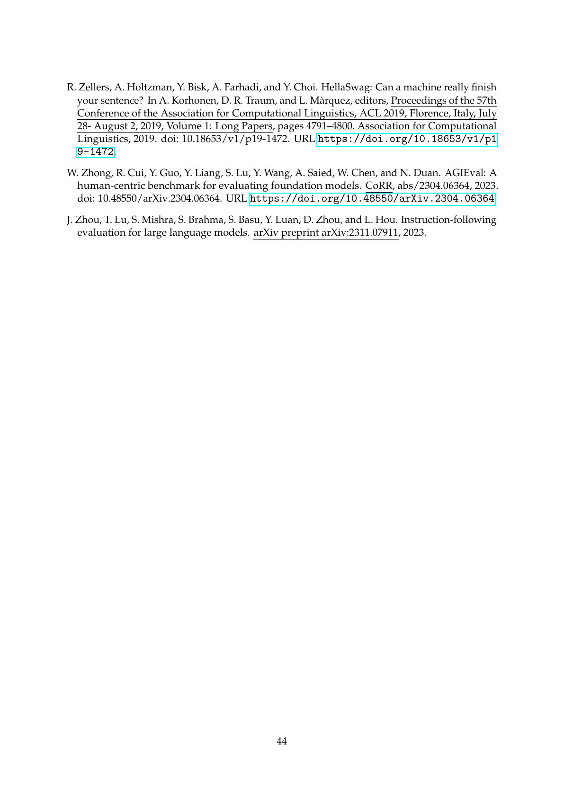

## 附录

### A 贡献与致谢

**研究与工程：** Aixin Liu、Bing Xue、Bingxuan Wang、Bochao Wu、Chengda Lu、Chenggang Zhao、Chengqi Deng、Chenyu Zhang*、Chong Ruan、Damai Dai、Daya Guo、Dejian Yang、Deli Chen、Erhang Li、Fangyun Lin、Fucong Dai、Fuli Luo*、Guangbo Hao、Guanting Chen、Guowei Li、H. Zhang、Han Bao*、Hanwei Xu、Haocheng Wang*、Haowei Zhang、Honghui Ding、Huajian Xin*、Huazuo Gao、Hui Qu、Jianzhong Guo、Jiashi Li、Jiawei Wang*、Jingchang Chen、Jingyang Yuan、Junjie Qiu、Junlong Li、Junxiao Song、Kai Dong、Kai Hu*、Kaige Gao、Kang Guan、Kexin Huang、Kuai Yu、Lean Wang、Lecong Zhang、Liang Zhao、Litong Wang、Liyue Zhang、Mingchuan Zhang、Minghua Zhang、Minghui Tang、Panpan Huang、Peiyi Wang、Qiancheng Wang、Qihao Zhu、Qinyu Chen、Qiushi Du、Ruiqi Ge、Ruisong Zhang、Ruizhe Pan、Runji Wang、Runxin Xu、Ruoyu Zhang、Shanghao Lu、Shangyan Zhou、Shanhuang Chen、Shengfeng Ye、Shirong Ma、Shiyu Wang、Shuiping Yu、Shunfeng Zhou、Shuting Pan、Tao Yun、Tian Pei、Wangding Zeng、Wanjia Zhao*、Wen Liu、Wenfeng Liang、Wenjun Gao、Wenqin Yu、Wentao Zhang、Xiao Bi、Xiaodong Liu、Xiaohan Wang、Xiaokang Chen、Xiaokang Zhang、Xiaotao Nie、Xin Cheng、Xin Liu。

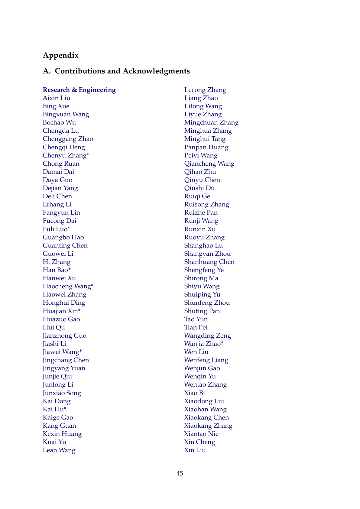

**研究与工程，续：** Xin Xie、Xingchao Liu、Xingkai Yu、Xinyu Yang、Xinyuan Li、Xuecheng Su、Xuheng Lin、Y.K. Li、Y.Q. Wang、Y.X. Wei、Yang Zhang、Yanhong Xu、Yao Li、Yao Zhao、Yaofeng Sun、Yaohui Wang、Yi Yu、Yichao Zhang、Yifan Shi、Yiliang Xiong、Ying He、Yishi Piao、Yisong Wang、Yixuan Tan、Yiyang Ma*、Yiyuan Liu、Yongqiang Guo、Yu Wu、Yuan Ou、Yuduan Wang、Yue Gong、Yuheng Zou、Yujia He、Yunfan Xiong、Yuxiang Luo、Yuxiang You、Yuxuan Liu、Yuyang Zhou、Z.F. Wu、Z.Z. Ren、Zehui Ren、Zhangli Sha、Zhe Fu、Zhean Xu、Zhenda Xie、Zhengyan Zhang、Zhewen Hao、Zhibin Gou、Zhicheng Ma、Zhigang Yan、Zhihong Shao、Zhiyu Wu、Zhuoshu Li、Zihui Gu、Zijia Zhu、Zijun Liu*、Zilin Li、Ziwei Xie、Ziyang Song、Ziyi Gao、Zizheng Pan。

**数据标注：** Bei Feng、Hui Li、J.L. Cai、Jiaqi Ni、Lei Xu、Meng Li、Ning Tian、R.J. Chen、R.L. Jin、Ruyi Chen、S.S. Li、Shuang Zhou、Tianyu Sun、X.Q. Li、Xiangyue Jin、Xiaojin Shen、Xiaosha Chen、Xiaowen Sun、Xiaoxiang Wang、Xinnan Song、Xinyi Zhou、Y.X. Zhu、Yanhong Xu、Yanping Huang、Yaohui Li、Yi Zheng、Yuchen Zhu、Yunxian Ma、Zhen Huang、Zhipeng Xu、Zhongyu Zhang。

**业务与合规：** Dongjie Ji。

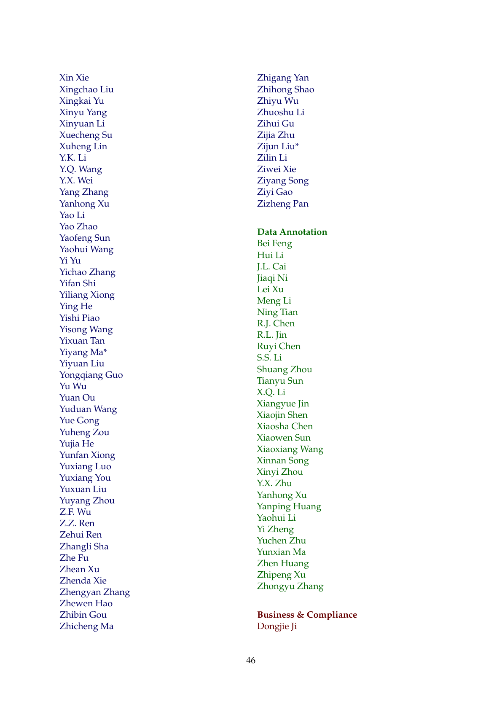

**业务与合规，续：** Jian Liang、Jin Chen、Leyi Xia、Miaojun Wang、Mingming Li、Peng Zhang、Shaoqing Wu、Shengfeng Ye、T. Wang、W.L. Xiao、Wei An、Xianzu Wang、Xinxia Shan、Ying Tang、Yukun Zha、Yuting Yan、Zhen Zhang。

在每一种角色内部，作者均按名字的字母顺序排列；带星号的姓名表示已经离开团队的成员。

### B 低精度训练消融实验

**图 10：BF16 与 FP8 训练的损失曲线比较。** 结果使用系数为 0.9 的指数移动平均进行平滑。

#### B.1 FP8 与 BF16 训练对比

我们在两个不同规模的基线模型上，把 FP8 混合精度框架与 BF16 训练比较。小规模实验在 1.33 万亿词元上训练一个总参数量约 16B 的 MoE 基线模型；大规模实验在约 0.9 万亿词元上训练一个总参数量约 230B 的 MoE 基线模型。图 10 给出训练曲线，表明结合高精度累加与细粒度量化策略后，相对误差始终低于 0.25%。

#### B.2 分块量化讨论

图块级细粒度量化能有效缓解特征异常值引入的误差，但激活量化在前向传播中需要按 $1\times128$ 分组，在反向传播中需要按 $128\times1$ 分组；激活梯度也需要类似过程。一种直接策略是像量化模型权重一样，每 $128\times128$ 个元素执行分块量化。这样，反向传播时只需转置。因此，我们进行实验，把与激活反向传播相关的全部张量按分块方式量化。

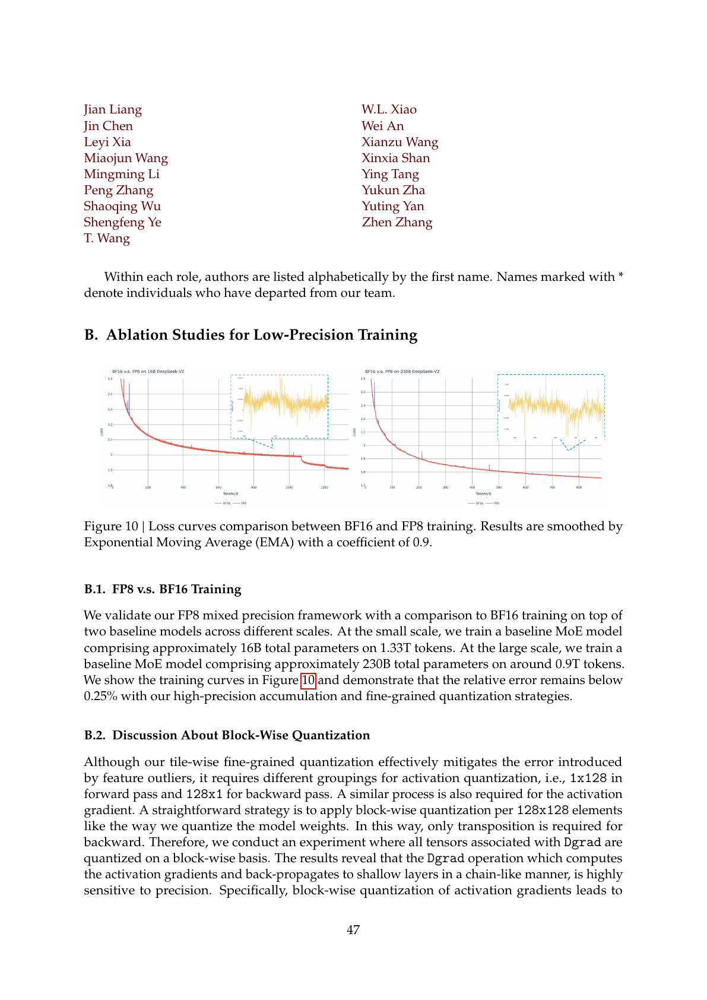

结果表明，负责计算激活梯度并以链式方式反向传播到浅层的激活反向传播操作对精度极其敏感。具体而言，在一个总参数量约 16B、训练约 3000 亿词元的 MoE 模型上，激活梯度分块量化会导致模型发散。我们推测，这是因为不同词元间的激活梯度高度不均衡，产生与词元相关的异常值；分块量化方法无法有效处理这些异常值。

### C 采用辅助损失与无辅助损失的 16B 模型专家专门化模式

我们记录了采用辅助损失的 16B 基线模型与采用无辅助损失的 16B 模型，在 Pile 测试集上的专家负载。如图 10 所示，无辅助损失模型在所有层中都倾向于形成更强的专家专门化。

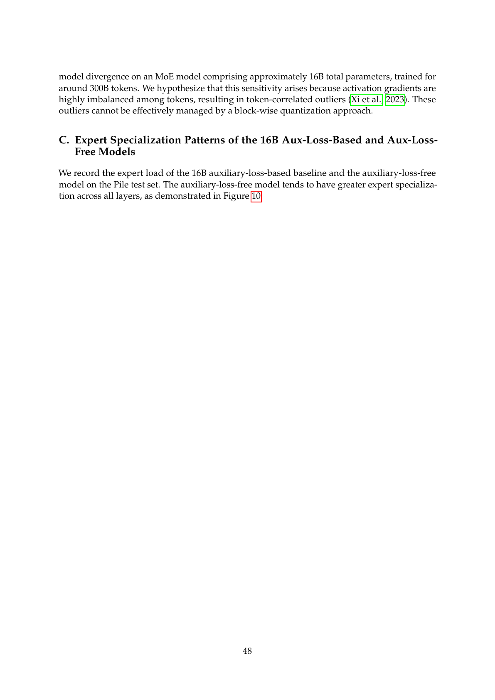

以下五页完整展示 Pile 测试集的英语维基百科、GitHub 与深度思维数学三个领域中，采用辅助损失与无辅助损失的模型在全部层上的相对专家负载。

**图 10（a）：第 1 至 7 层的专家负载。**

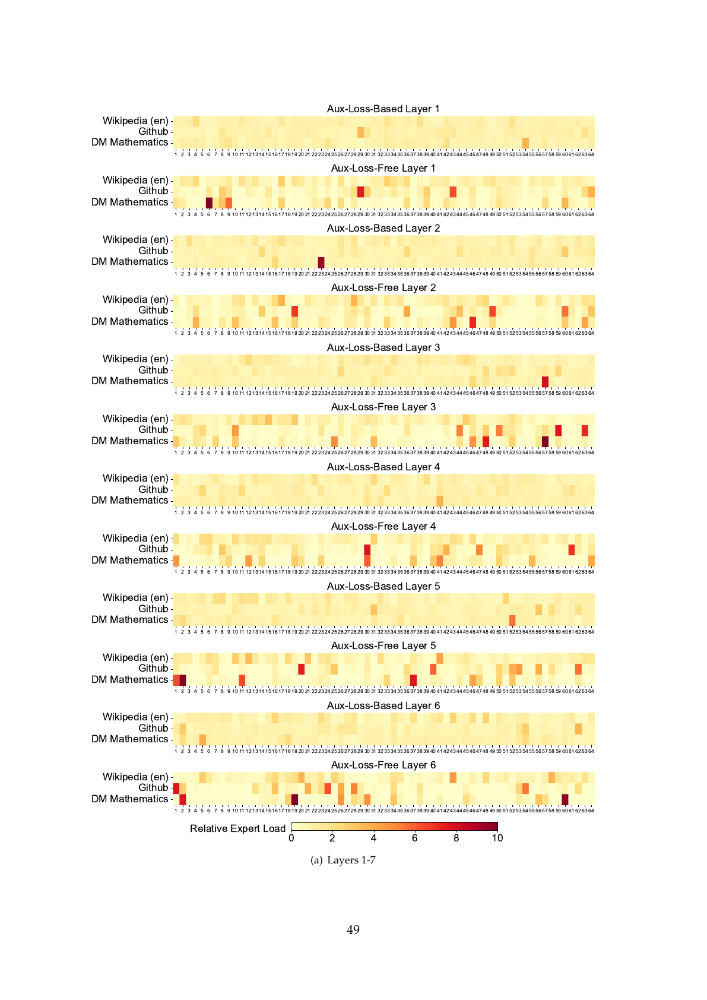

**图 10（b）：第 7 至 13 层的专家负载。**

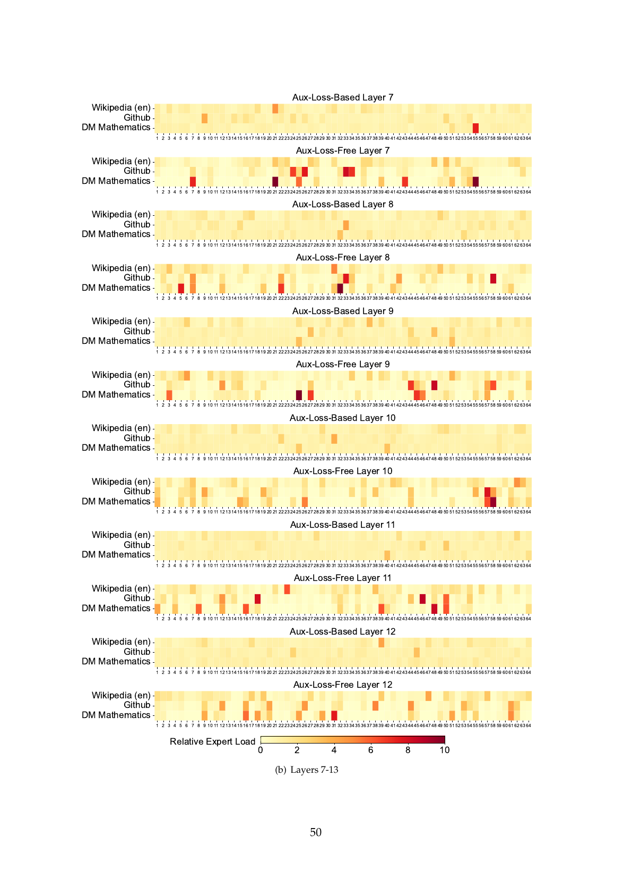

**图 10（c）：第 13 至 19 层的专家负载。**

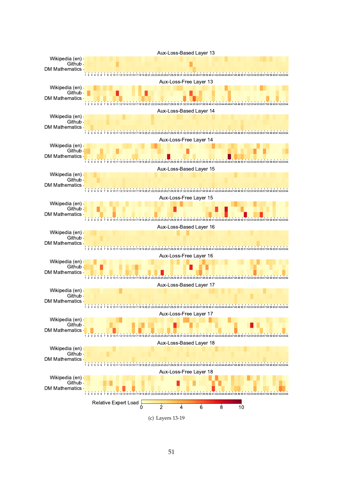

**图 10（d）：第 19 至 25 层的专家负载。**

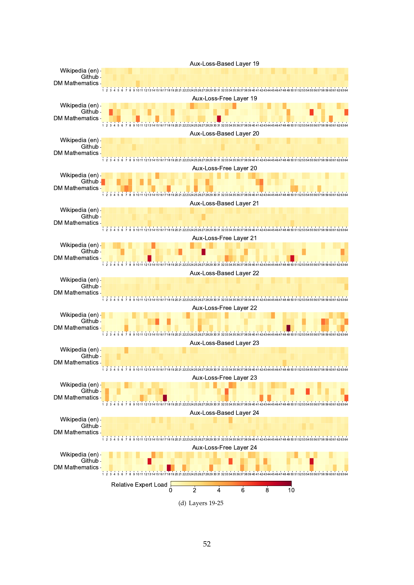

**图 10（e）：第 25 至 27 层的专家负载。** 无辅助损失模型比采用辅助损失的模型呈现更强的专家专门化模式。相对专家负载表示实际专家负载与理论均衡负载的比值。

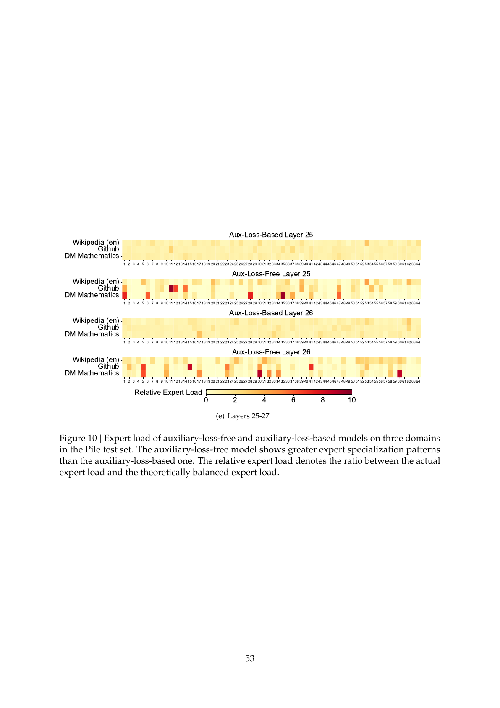
