# DeepSeek-VL2：用于高级多模态理解的混合专家视觉—语言模型

**作者：** Zhiyu Wu、Xiaokang Chen、Zizheng Pan、Xingchao Liu、Wen Liu、Damai Dai、Huazuo Gao、Yiyang Ma、Chengyue Wu、Bingxuan Wang、Zhenda Xie、Yu Wu、Kai Hu、Jiawei Wang、Yaofeng Sun、Yukun Li、Yishi Piao、Kang Guan、Aixin Liu、Xin Xie、Yuxiang You、Kai Dong、Xingkai Yu、Haowei Zhang、Liang Zhao、Yisong Wang、Chong Ruan

**机构：** DeepSeek-AI

## 摘要

我们提出 DeepSeek-VL2，一系列先进的大型混合专家视觉—语言模型。相较前代 DeepSeek-VL，它包含两项关键升级。视觉部分加入动态图块视觉编码策略，用于处理不同宽高比的高分辨率图像；语言部分采用带多头潜在注意力机制的 DeepSeekMoE，把键值缓存压缩为潜在向量，以实现高效推理和高吞吐量。模型使用改进的视觉—语言数据集训练，在视觉问答、光学字符识别、文档/表格/图表理解和视觉指代定位等任务上展示出色能力。系列包含 Tiny、Small 与标准版，激活参数量分别为 10 亿、28 亿和 45 亿。相较现有开源稠密与混合专家模型，DeepSeek-VL2 以相近或更少激活参数达到有竞争力或最先进的表现。代码和预训练模型已公开。

图 1 比较不同开源模型的平均性能与激活参数量。平均分由 MMBench v1.1、MMStar、MMMU 验证集、MathVista TestMini、AI2D 测试集和 OCRBench 准确率计算；OCRBench 分数除以 10，缩放到 0 至 100。DeepSeek-VL2 系列在参数—性能权衡上整体领先。

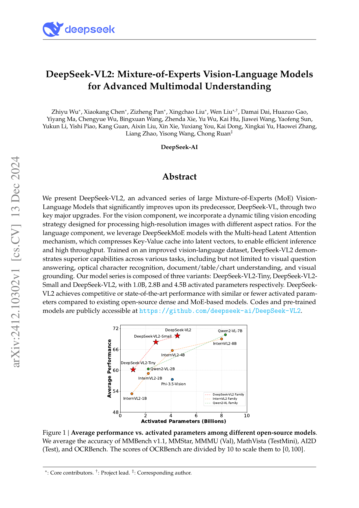

## 目录

论文依次介绍模型架构、数据构建、训练方法、评测和结论。数据构建包含视觉—语言对齐数据、预训练数据与监督微调数据；训练方法包含训练流水线、超参数和基础设施；评测包含多模态性能与定性研究。

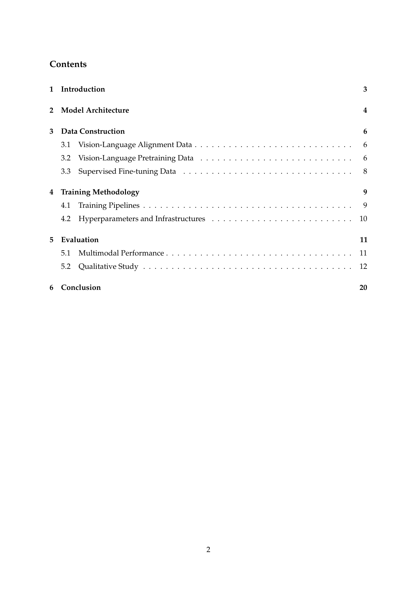

## 1 引言

大型视觉—语言模型已经成为人工智能中的变革力量，把大语言模型的卓越能力扩展到视觉与文本信息的无缝处理。这项进步大幅拓展了人工智能系统解决复杂真实应用的可能性，尤其是需要多模态理解的任务。

本文提出 DeepSeek-VL2，一系列使用混合专家架构的开源视觉—语言模型，相较 DeepSeek-VL 在性能与效率上均显著提升。改进聚焦三方面：（1）动态高分辨率视觉编码策略，增强视觉理解；（2）优化语言模型架构，显著提高训练与推理效率；（3）改进视觉—语言数据构建流水线，不仅提高总体性能，也把能力拓展到精确视觉指代定位等新领域。

视觉部分采用动态图块编码，高效处理不同宽高比的高分辨率图像。DeepSeek-VL 的混合视觉编码器固定以 $384\times384$ 和 $1024\times1024$ 两种分辨率提取特征，本文方法避免固定尺寸限制，在视觉指代定位、文档/表格/图表分析、详细特征提取等需要超高分辨率的任务上表现出色，同时把视觉词元数控制在可管理范围。

受成熟切片图块方法启发，系统把高分辨率输入动态切成局部图块，用共享视觉 Transformer 处理各图块，再把特征无缝集成到语言模型。这保留局部注意力视觉 Transformer 的优势，能够提取丰富特征，又不会因提高图像分辨率而承受典型的二次计算增长。

语言部分采用带多头潜在注意力的 DeepSeek 语言模型。MLA 把键值缓存压缩成潜在向量，显著降低计算成本、加快推理并提高吞吐容量。DeepSeekMoE 框架再通过稀疏计算增强效率。三个混合专家变体的总规模为 3B、16B 和 27B，激活参数分别为 0.57B、2.4B 和 4.1B。

我们还从质量、数量和多样性三方面大幅增强视觉—语言训练数据。完整数据集让模型在视觉问答、OCR、文档/表格/图表理解、视觉推理和通用聊天等广泛任务上获得更好的泛化与性能，并带来视觉指代定位、图形用户界面感知等新能力。

总之，DeepSeek-VL2 是大规模混合专家视觉—语言建模的一次显著跨越。新视觉处理策略和优化语言模型形成兼顾性能与效率的系列模型。我们开放预训练模型，希望加速领域进展并促进协作研究。

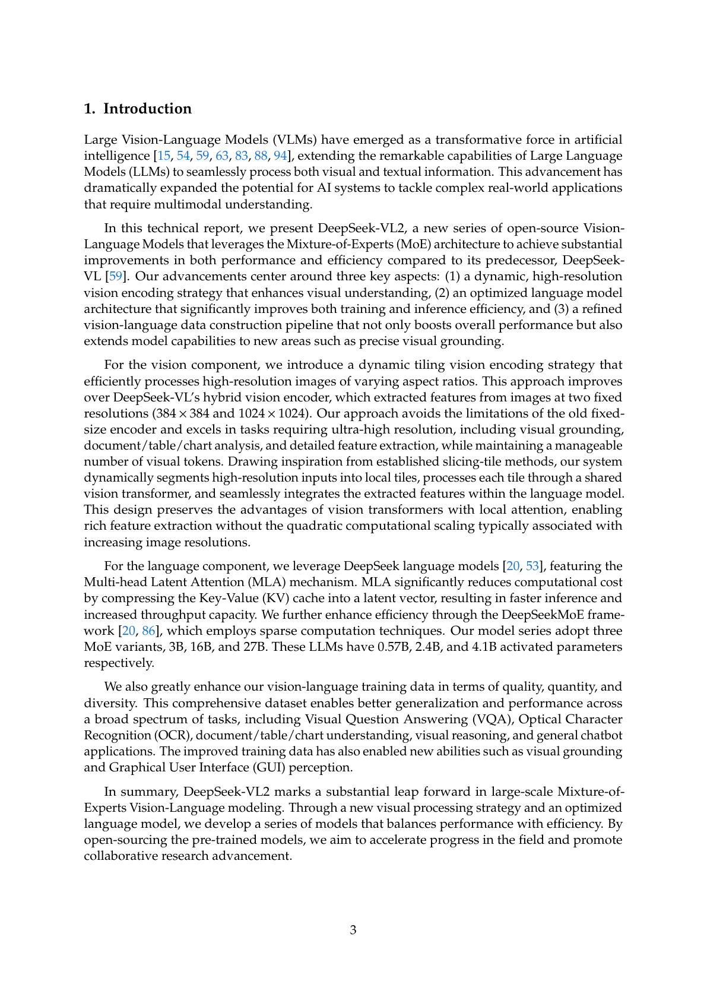

## 2 模型架构

DeepSeek-VL2 包含三个核心模块：（1）视觉编码器；（2）视觉—语言适配器；（3）混合专家语言模型。模型延续前代仅解码器的 LLaVA 式架构，并引入两项主要创新：动态图块策略，以及带多头潜在注意力的 DeepSeekMoE 语言模型，使高分辨率视觉输入与文本数据都能更高效处理。

**动态图块策略。** 原始 DeepSeek-VL 采用混合视觉编码器：SigLIP 在 $384\times384$ 分辨率提取粗粒度特征，SAM-B 在 $1024\times1024$ 提取细粒度特征。这种融合能产生适用于多类视觉—语言任务的丰富表示，但固定 $1024\times1024$ 分辨率成为限制，尤其难以处理更大分辨率或极端宽高比的图像，例如 InfographicVQA、密集 OCR 与详细视觉指代定位。

受近期 VLM 进展启发，我们把高分辨率图像切成图块，使单个 SigLIP-SO400M-384 编码器就能高效处理不同宽高比的高分辨率图像。预训练 SigLIP 基础分辨率为 $384\times384$。为适应不同宽高比，定义候选分辨率集合：

$$
C_R=\{(m\cdot384,n\cdot384)\mid m,n\in\mathbb{N},\ 1\leq m,n,\ mn\leq9\},
$$

其中 $m:n$ 表示宽高比。给定尺寸为 $(H,W)$ 的输入图像，计算按原宽高比缩放到每个候选分辨率后所需的填充面积，并选择填充最少的 $(m_i\cdot384,n_i\cdot384)$。图像先缩放到长边匹配目标分辨率，再保持宽高比填充另一维。

缩放后的图像被分成 $m_i\times n_i$ 个 $384\times384$ 局部图块，另加一个全局缩略图块。SigLIP-SO400M-384 处理全部 $1+m_i n_i$ 个图块，每个图块生成 $27\times27=729$ 个 1152 维视觉嵌入。为控制计算和上下文长度，当输入多于两幅图像时关闭动态图块。

图 2 展示总体结构：视觉词元经视觉编码器与适配器进入 DeepSeek-MoE，再与文本词元共同生成回答。

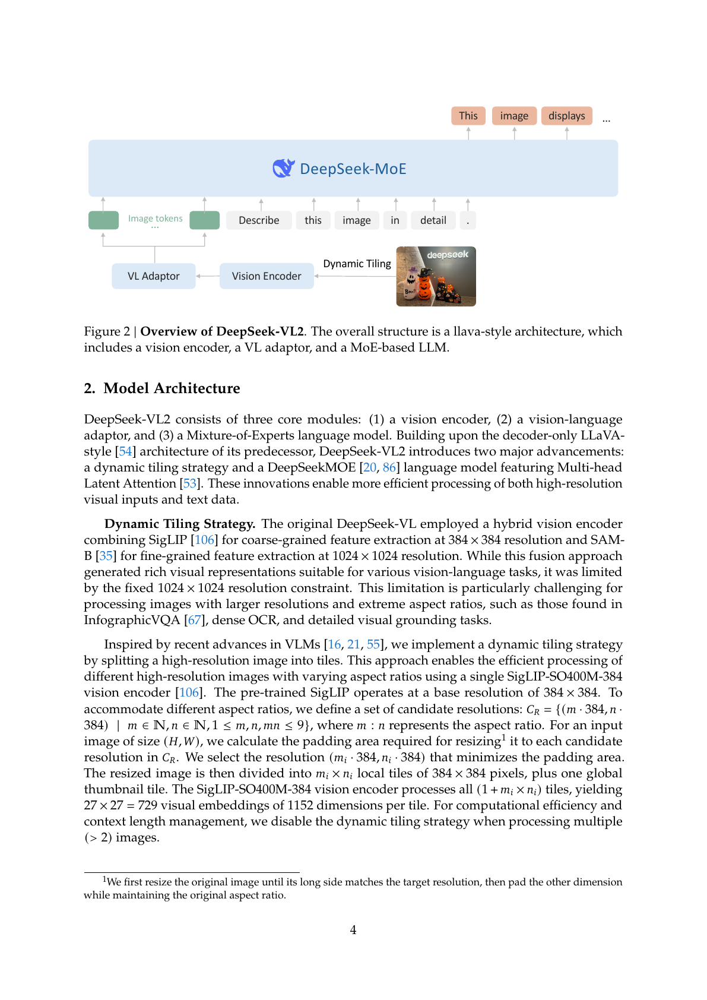

图 3 展示动态图块策略。将图像分成多个图块后，DeepSeek-VL2 相较 DeepSeek-VL 获得更强细粒度理解能力。表 1 给出三个模型变体的完整架构超参数和混合专家配置。

**视觉—语言适配器。** 处理视觉图块后，先用 $2\times2$ 像素重排，把每个图块的视觉词元从 $27\times27$ 压缩到 $14\times14=196$。随后在处理 $1+m_i n_i$ 个图块时加入三种特殊词元。

对 $14\times14$ 的全局缩略图块，每一行末尾加入一个“图块换行”词元，共得到 $14\times15=210$ 个词元。对排列成 $(m_i\cdot14,n_i\cdot14)$ 二维网格的局部图块，在最终列末端加入 $m_i\cdot14$ 个换行词元，表示全部局部图块中每一行结束。全局缩略图与局部图块之间再插入一个“视图分隔”词元。

完整视觉序列包含：

$$
210+1+m_i\cdot14\times(n_i\cdot14+1)
$$

个视觉词元，随后通过两层 MLP 投影到语言模型嵌入空间。

**DeepSeekMoE LLM。** 语言模型以 DeepSeekMoE 为基础并集成 MLA。MLA 把键值缓存压缩成潜在向量，提高推理效率和吞吐容量；混合专家架构通过稀疏计算进一步提高效率。训练时为每个专家加入全局偏置项，以较低成本改善专家之间的负载均衡。DeepSeek-VL2 三个变体的激活规模分别为 1.0B、2.8B 和 4.5B，完整配置见表 1。

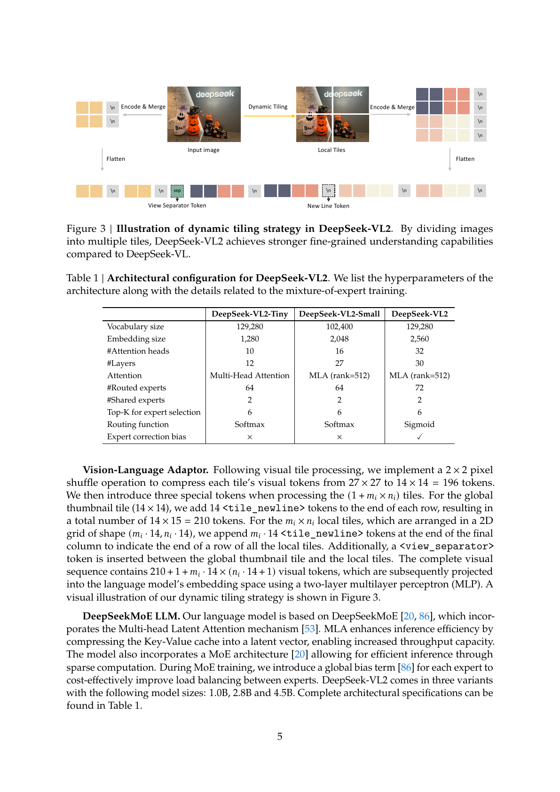

## 3 数据构建

我们从多种来源为 DeepSeek-VL2 构建完整视觉—语言数据集。训练分三阶段：（1）视觉—语言对齐；（2）视觉—语言预训练；（3）监督微调。下面分别说明各阶段数据。

### 3.1 视觉—语言对齐数据

对齐阶段训练 MLP 连接器，使预训练视觉编码器与 LLM 相连。初始预热使用 ShareGPT4V，其中约有 120 万条说明文字与对话样本。

### 3.2 视觉—语言预训练数据

沿用 DeepSeek-VL，预训练混合视觉—语言数据与纯文本数据，以平衡视觉—语言能力和纯文本性能。DeepSeek-VL2 维持约 70% 视觉—语言、30% 纯文本的比例，后者直接来自基础 LLM 预训练语料。

**图文交错数据。** 从 WIT、WikiHow 及 OBELICS 随机抽取的 30% 开源样本开始。混合比例由 DeepSeek-VL2-Tiny 初步实验确定。为增强多语言能力，在主要为英语的数据之外加入从万卷提取的中文内容，并开发内部集合以扩大通用真实世界知识覆盖。

**图像说明数据。** 图像说明在 VLM 训练中提供视觉与文本的直接对齐，是基础数据。我们最初使用多种开源数据集，但分析发现其质量差异严重：有的由先进 VLM 生成，密集且准确；另一些说明过短、图文不匹配或有明显幻觉。

为解决不一致问题，我们开发完整的图像说明流水线，把 OCR 提示、位置或相机设置等元信息，以及相关原始说明共同作为提示。内部说明模型采用类似 PixelProse 的策略，用不同指令引导 VLM 重新生成说明。整体质量提高后，大规模标注仍出现重复，于是再用 DeepSeek Chat 仅根据写作质量为全部说明评分，高效过滤低质量内容。

**光学字符识别数据。** 使用 LaTeX OCR、1200 万条 RenderedText 以及覆盖多种文档类型的大型内部 OCR 数据集。目前内部数据主要关注中英文字符识别，未来将扩展到更多语言。

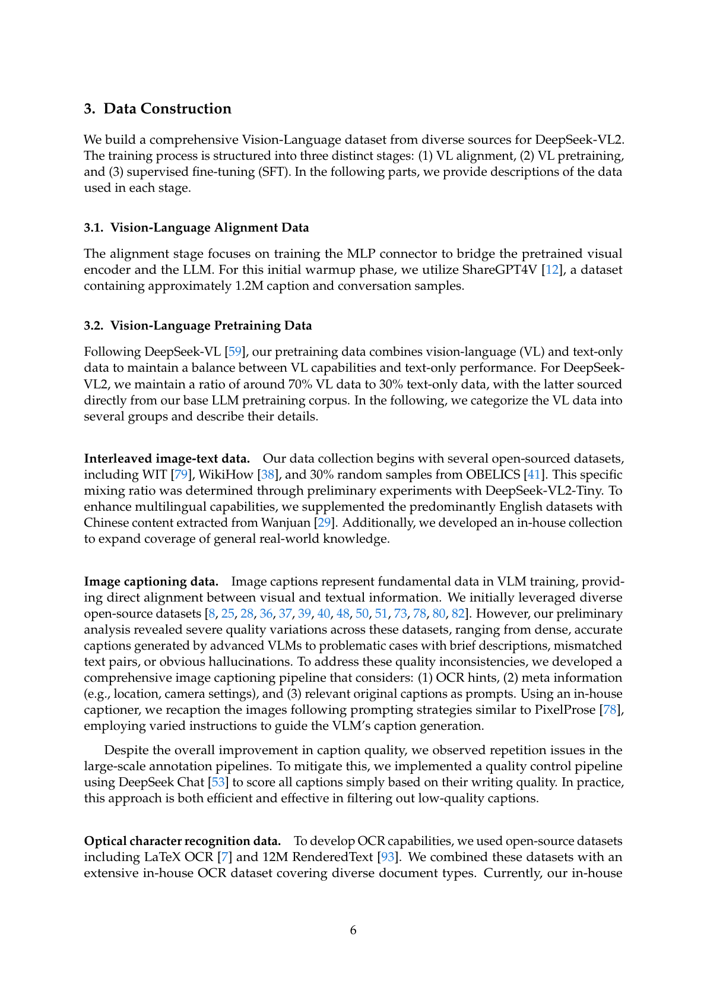

**视觉问答数据。** 早期探索发现通用问答数据明显有利于预训练，因此构建包含以下类别的完整视觉问答数据集：

- **通用视觉问答。** 继承 DeepSeek-VL 的通用 VQA 数据。
- **表格、图表与文档理解。** 使用 PubTabNet、FinTabNet 和 Docmatix 增强文档理解。
- **网页到代码与图表到 Python。** 使用 Websight 训练网页转代码，并沿用 DeepSeek-VL，从公开 Jupyter Notebook 获取 Python 图表。再用 DeepSeek V2.5 复刻部分 Websight，并利用其生成的 Python 绘图代码减轻图表到代码数据噪声。
- **带视觉提示的问答。** 在多项公开图像上叠加箭头、方框、圆圈和涂画等视觉指示，构建视觉提示理解数据，再围绕被标记对象生成问答对。

**视觉指代定位数据。** 从公开检测数据构建视觉指代定位。提示要求在图像中定位给定类别名或对象描述，回答用特殊词元包围查询和检测框列表。边界框坐标给出左上角与右下角，并按图像分辨率归一化到 0 至 999。训练时问题从候选池随机采样；还构造查询对象故意不在图像中的负样本，以提高模型稳健性。

**带定位对话数据。** 从公开数据生成带定位的图像描述对话，回答在自然语言中插入对象名称和归一化边界框，例如描述“两只狗正在草地上奔跑”时，同时标出“狗”的检测框。所用特殊词元和坐标归一化方案与视觉指代定位相同。

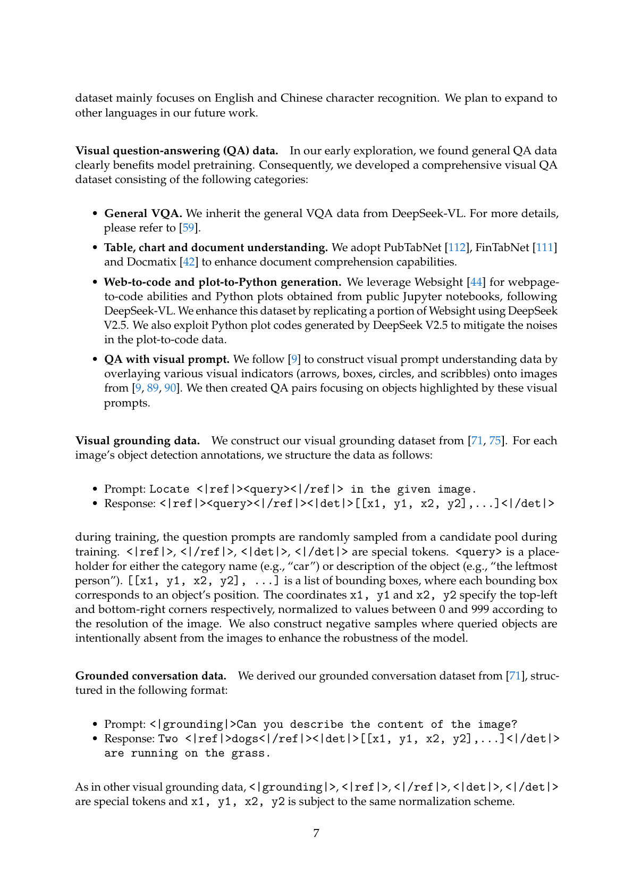

### 3.3 监督微调数据

SFT 数据混合多种开源数据集与高质量内部问答对。下面介绍提高其质量的工作。

**通用视觉问答。** 公共视觉问答数据虽然多样，却常有三项缺陷：（1）回答过短；（2）OCR 质量差；（3）含有幻觉。我们综合原问题、图像和 OCR 信息重新生成回答，实验表明所得结果更全面、准确。

开发中发现，DeepSeek-VL2 早期版本，尤其 Tiny，会偶尔在中文回答中不恰当地插入英文词；更大模型没有这一问题，说明原因可能是模型容量有限，以及视觉—语言预训练阶段中英文数据不平衡。为改善小模型，我们开发包含多样图像描述、单轮和多轮对话的内部中文问答数据，从而减轻语言混杂；另建内部数据集补充真实世界与文化视觉知识，包括动漫、表情包、美食和艺术。

**OCR 与文档理解。** 先进图像说明流水线已经使 DeepSeek-VL2 的 OCR 能力优于其他先进 VLM，因此 SFT 阶段不再重点加强 OCR，而是清洗已有开源数据，删除 OCR 质量差的样本。文档理解方面，从内部数据选择多样文档页面，生成面向文档理解的多轮问答；早期结果表明这能改善文档交互。

**表格与图表理解。** 除本身质量很高的 Cauldron 外，依据原问题为全部公共表格问答数据重新生成回答。与视觉—语言预训练阶段形成的 OCR 能力相似，模型无需额外处理便已展现很强图表理解性能。

**推理、逻辑与数学。** 为公共推理数据补充更详细的推理过程，并统一回答格式，把最终答案放在回答末尾。观察发现，过于详细的回答不利于较小 VLM；DeepSeek-VL2-Tiny 使用更简洁回答时表现更好。

**教材与学术问题。** 基于内部文档集合构建教材数据集，主要覆盖多个学科的大学水平内容。

**网页到代码与图表到 Python。** 在预训练所用规模之上，进一步扩充内部网页代码与 Python 绘图代码数据。

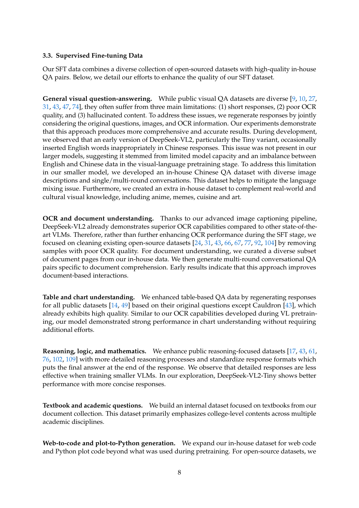

对于开源网页到代码与图表到 Python 数据，我们也通过重新生成回答提高质量。

**视觉指代定位。** 使用多个公开数据源构建 SFT 指代定位数据。为增强能力，把查询短语翻译成中文并增加负样本。还加入上下文视觉定位：给定第一幅图中由矩形或椭圆标出的参考对象，要求模型在第二幅图定位同类别对象。提示中的对象占位符可以表示“红色边界框内的对象”，回答则由模型给出对象描述，例如“猫”，并输出边界框。格式使用定位、指代与检测等特殊词元。

**带定位对话。** 使用公开数据构建带定位的对话，进一步增强预训练阶段形成的能力。

**纯文本数据集。** SFT 阶段同时使用多个纯文本指令调优数据集，以维持模型语言能力。

## 4 训练方法

### 4.1 训练流水线

DeepSeek-VL2 使用三阶段流水线：

1. 初始阶段用第 3.1 节图文配对数据训练视觉编码器和视觉—语言适配器 MLP，同时冻结语言模型。
2. 预训练阶段用第 3.2 节数据执行视觉—语言预训练。
3. 微调阶段用第 3.3 节数据执行监督微调。

预训练和微调阶段会解冻视觉编码器、适配器与语言模型的全部参数，并同时训练。所有阶段都强调视觉理解能力，只在文本词元上计算下一词元预测损失。

**视觉—语言对齐。** 以预训练 DeepSeekMoE 3B、16B、27B 为起点，目标是在视觉特征与语言特征之间建立稳健连接，使语言模型能够有效处理视觉输入。与保持视觉编码器和语言模型都冻结的既有方法不同，我们调整固定分辨率视觉编码器，使其适配动态高分辨率图像。该阶段优化视觉编码器与视觉—语言适配器，语言模型保持冻结。

**视觉—语言预训练。** 嵌入空间内完成视觉—语言对齐后，大部分计算资源用于预训练，在不同任务上发展完整联合视觉—语言知识。该阶段解冻视觉编码器、适配器 MLP 和 DeepSeekMoE LLM 的全部参数，使用约 8000 亿图文词元，显著增强多模态理解，同时保留大部分语言能力。

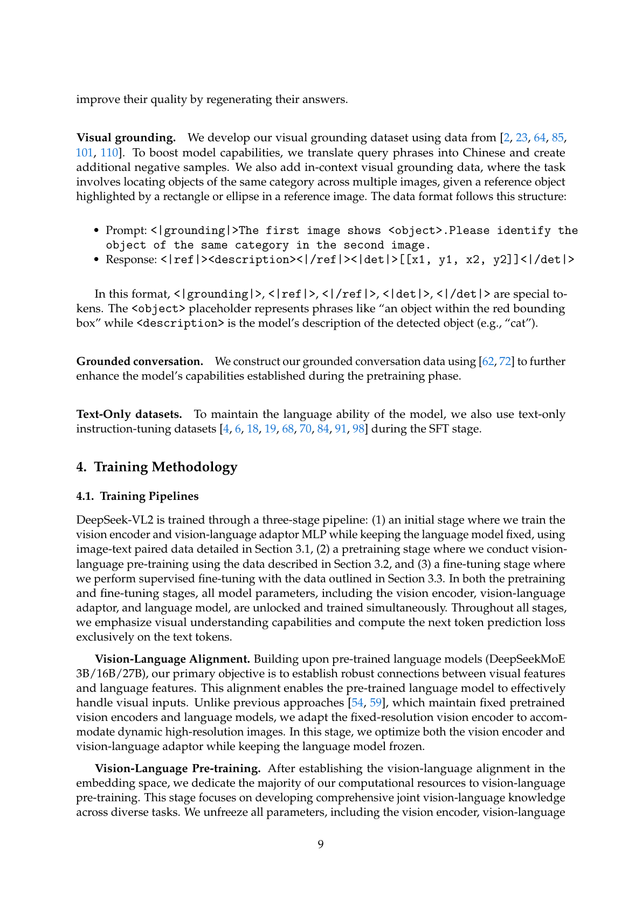

**监督微调。** 最终阶段通过监督微调增强预训练模型的指令遵循和对话能力。使用内部视觉—语言 SFT 数据优化全部参数，只监督回答与特殊词元，系统提示和用户提示都被遮盖。为加强对话理解，将多模态数据与 DeepSeek-V2 的纯文本对话数据结合，使模型在密集图像说明、通用 VQA、OCR、表格/图表/文档/示意图理解、视觉转代码、视觉推理、指代定位和语言理解等任务上都稳健表现。

### 4.2 超参数与基础设施

表 2 给出三个变体三个阶段的详细训练超参数。阶梯学习率调度器会在总训练步数 50% 和 75% 处把学习率除以 $\sqrt{10}$。

训练与评测使用面向大模型的高效轻量平台 HAI-LLM。流水线并行的显著挑战来自视觉编码器与 LLM 块不同的计算特征。视觉编码器位于模型流水线第一段，需要谨慎平衡不同 GPU 的负载，避免流水线气泡并提高 GPU 利用率。为此，我们在流水线并行中对视觉编码器进行细粒度分层。

前向与反向过程中，还在不同数据并行进程之间平衡图像图块负载，以缓解动态分辨率策略导致的图块数量不均。训练同时使用张量并行与专家并行以获得最高效率。由于有些数据批次只有文本、另一些包含图像，我们为两类数据设计不同流水线策略，并按需切换。

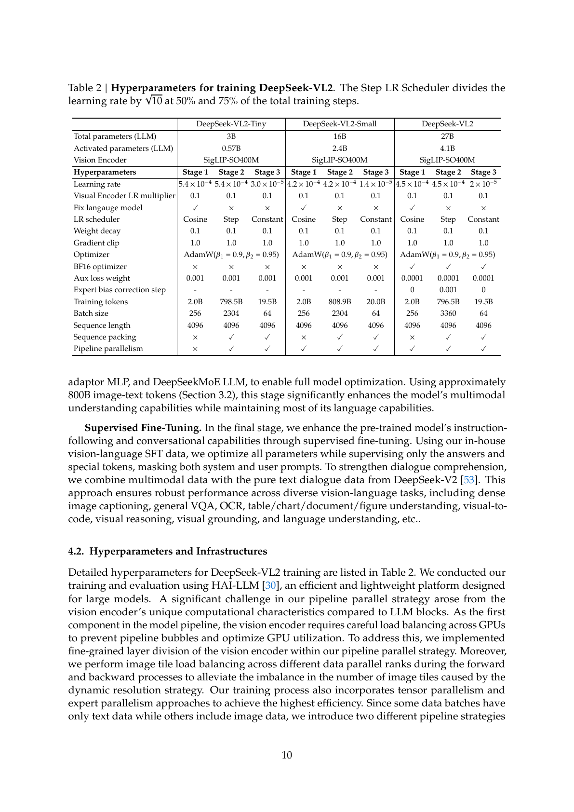

DeepSeek-VL2-Tiny、Small 和标准版分别在 16、33、42 个节点的集群上用 7、10、14 天完成训练，每节点配备 8 块 NVIDIA A100 GPU。

## 5 评测

### 5.1 多模态性能

**基准。** 我们在 DocVQA、ChartQA、InfoVQA、TextVQA、RealWorldQA、OCRBench、AI2D、MMMU、MMStar、MathVista、MME、MMBench、MMBench-V1.1 和 MMT-Bench 等常用基准上完整评测。这些基准从文档理解、图表解读到真实世界解题覆盖多类任务。视觉指代定位能力使用 RefCOCO、RefCOCO+ 与 RefCOCOg。

InfoVQA 含有极端宽高比和超大图像，评测时把候选分辨率集合上限从九个图块扩大到十八个图块。

表 3 比较 OCR 相关多模态基准，包括 DocVQA、ChartQA、InfoVQA、TextVQA 与 OCRBench；混合专家模型按激活参数计算。DeepSeek-VL2-Tiny 仅 1.0B 激活参数，OCRBench 达到 809；Small 以 2.8B 达到 834；标准版以 4.5B 在 ChartQA、InfoVQA 和 TextVQA 上分别达到 86.0、78.1 与 84.2。

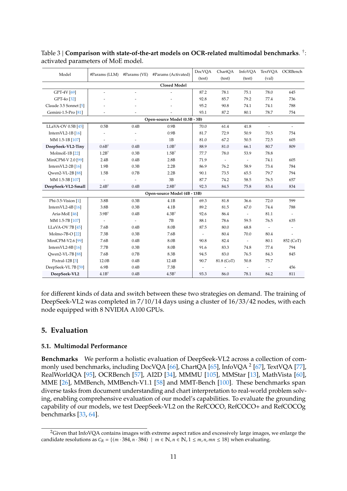

表 4 比较通用问答与数学相关多模态基准，包括 MMStar、AI2D、MMMU、MME、MMBench、MMT-Bench、RealWorldQA 与 MathVista。

**与最先进模型比较。** 在多模态理解基准上，我们与 LLaVA-OV、InternVL2、DeepSeek-VL、Qwen2-VL、Phi-3.5-Vision、Molmo、Pixtral、MM1.5 与 Aria-MoE 比较。表 3、4 显示，受益于混合专家架构，DeepSeek-VL2 以更少激活参数达到相近或更好的表现。

在指代定位基准上，比较对象包括 Grounding DINO、UNINEXT、ONE-PEACE、mPLUG-2、Florence-2、InternVL2、Shikra、TextHawk2、Ferret-v2、MM1.5 与 Qwen2。DeepSeek-VL2 在相近规模 VLM 中表现更好。

### 5.2 定性研究

本节展示 DeepSeek-VL2 从通用问答到视觉故事创作和视觉指代定位的不同能力。

**通用视觉问答。** 得益于新视觉—语言预训练集和多样 SFT 数据，DeepSeek-VL2 的通用视觉问答显著增强。模型擅长密集图像描述，能识别常见地标、通用视觉知识和中英文富文本；图表理解也表现良好，属性识别准确。图 5 还展示更强的表情包理解：模型可以描述正确语境，并结合有意义的文化背景解释幽默。

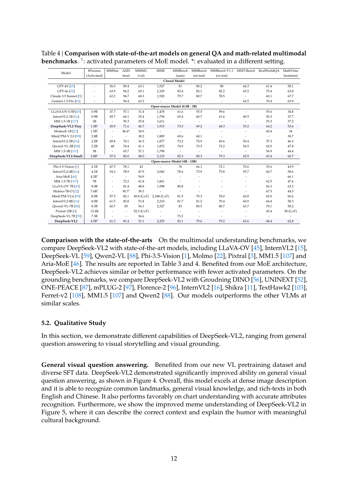

图 4 展示通用问答的多面能力，包括识别地标、看图作诗、回答常识、理解图表与识别文字。示例中，模型能介绍地标、根据自然景观写中文诗、解释《猫和老鼠》主题蛋糕的文化背景、分析多语言数据集曲线，并读取中英文招牌内容。

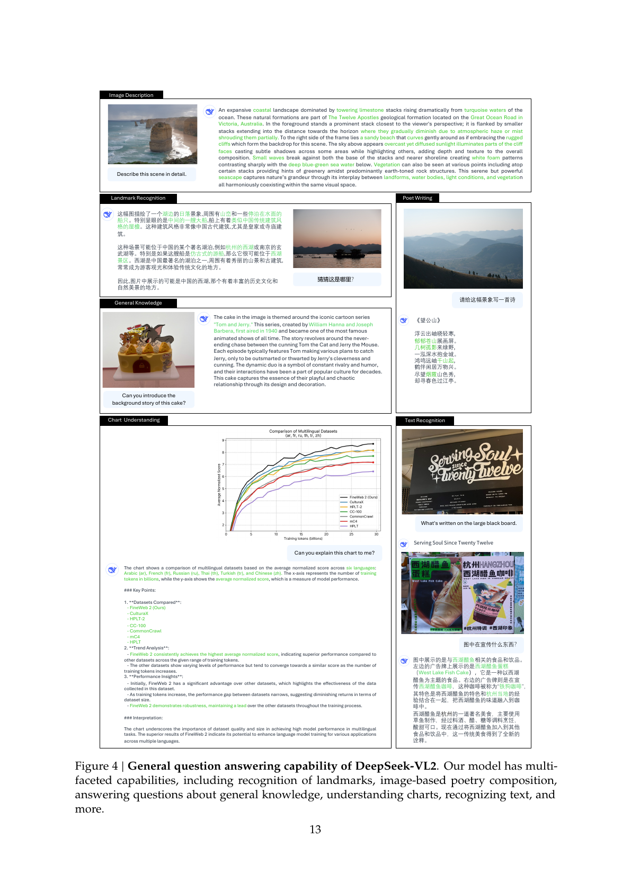

图 5 展示表情包理解。模型分别解释博士生即使度假仍想着工作、儿童违反母亲指令咬蛋糕、试图“钉住”即将结束的假期，以及备考充分却被第一题击中的反差幽默，能结合图像动作、文字内容和文化背景给出有条理分析。

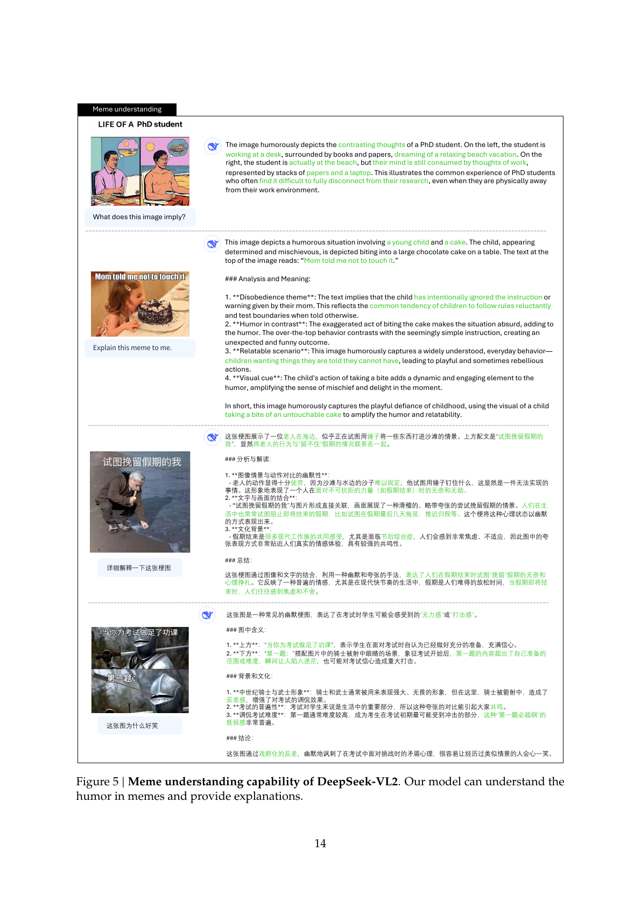

**多图对话。** 图 6 显示模型理解多幅图像之间的关系并据此推理。英语示例结合用户午餐和偏甜口味，从多个饮品候选中选择奶昔；中文示例识别胡萝卜、玉米和猪肋排，生成完整菜谱。

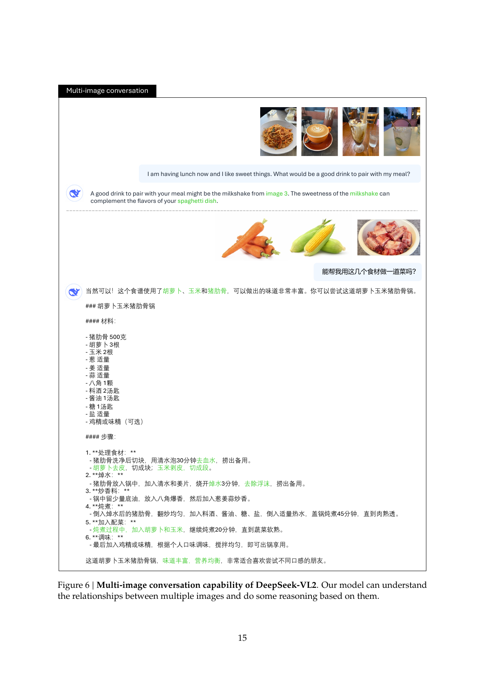

**视觉故事创作。** 图 7 显示模型接收多幅图像，并以中文或英文围绕图像内容组织连贯故事。英语示例从巴黎机场、飞机、凯旋门和《蒙娜丽莎》构成旅行叙事；中文示例用雪地老鼠、玫瑰、巫师和阳光田野创作《雪夜的奇遇》。

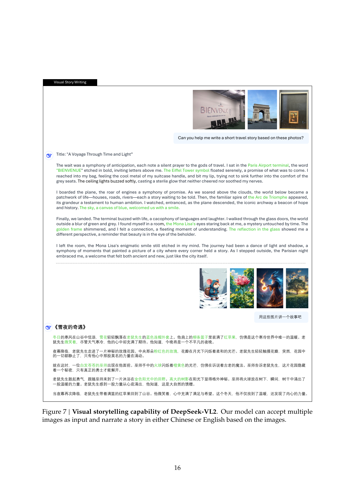

表 5 比较视觉指代定位基准。三个规模的 DeepSeek-VL2 在相近规模多模态大模型中都取得最佳结果；标准版在 RefCOCO 验证集、testA、testB 上分别达到 95.1、96.7、92.7，在 RefCOCO+ 上达到 91.2、94.9、87.4，在 RefCOCOg 上达到 92.8、92.9。

**多图对话。** DeepSeek-VL2 能分析多幅图像的联系与差异，并结合其内容进行简单推理，例如根据若干食材图像思考如何烹饪一道菜。

**视觉故事创作。** 给定几幅图像，模型能够创作故事。写作由地标识别、OCR 等通用视觉能力支撑。故事能力最初来自已经过良好安全对齐的纯文本 DeepSeek Chat，因此内部测试没有观察到明显有害或不适宜内容。不过，真实故事创作需要恐怖、喜剧、动作等更多类型，以及幸福或悲剧等不同结局，这可能与 LLM/VLM 安全要求产生内在冲突。未来将探索在考虑这些挑战的同时扩大故事创作范围。

**视觉指代定位。** 这是 DeepSeek-VL2 新增能力。图 8 展示通用定位。虽然训练图像大多来自自然场景，指代表达主要是对象类别名或具体描述，模型仍能泛化到表情包、动漫等场景，还能识别特定名人和抽象概念。

图 10 展示上下文视觉定位：第一幅图以视觉提示指出一个对象后，模型可以在第二幅图定位同类别对象。模型还表现出涌现能力，能够结合第一幅图和文本描述，在第二幅图中识别对应对象。

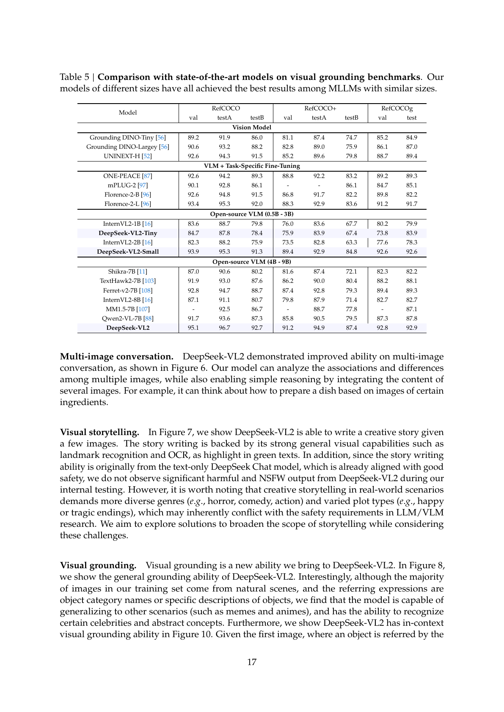

图 8 的示例覆盖自然场景、网页界面与截图、表情包和动漫。查询可以是类别名、对象描述或抽象概念，模型会输出相应对象的边界框；它能定位西瓜片、太空针塔、爱因斯坦、后排长颈鹿、通知按钮、DeepThink 按钮、孙悟空和葫芦娃等目标。

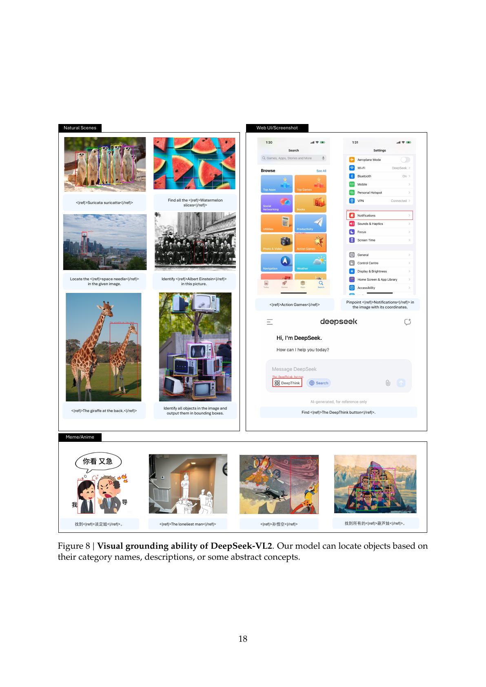

**带定位对话。** 使用特殊“定位”词元，DeepSeek-VL2 可以在回答中引用关键对象并给出准确位置，如图 9 所示。这使模型更好地与真实世界交互，为具身智能、计算机或手机智能体等领域提供机会。

图 9 的示例把推理与定位结合：模型会指出用来降温的风扇、推荐给无花果爱好者的蛋糕、与世界和平问题相关的炸弹，以及扔垃圾所需的垃圾桶。图 10 则展示跨图定位，包括寻找同类对象、判断第一幅图出现最多的水果并在第二幅图中定位，以及依据第一幅图的食材在第二幅图寻找相应菜肴。

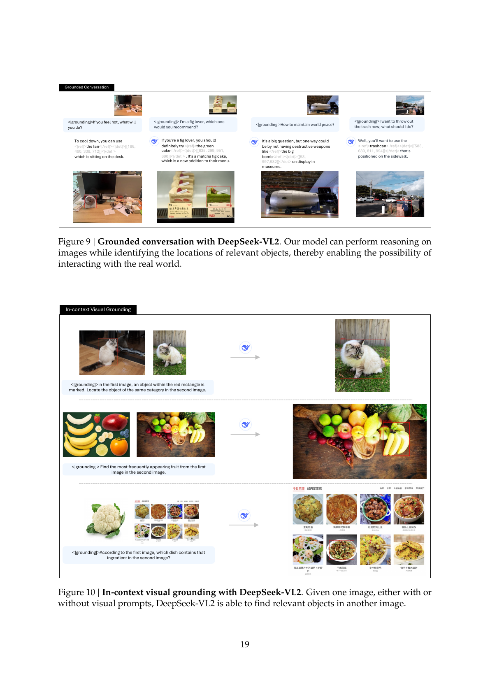

## 6 结论

本文提出 DeepSeek-VL2，一组增强的混合专家视觉—语言模型，总参数规模为 3B、16B、27B，对应激活参数 1.0B、2.8B、4.5B。这种配置使训练与推理计算都更高效。三个模型分别可以部署在显存为 10GB、40GB、80GB 的单块 GPU 上。动态图块视觉编码策略能够高效处理不同宽高比的高分辨率图像。通过开放代码与预训练模型，我们希望推动视觉和语言交叉领域进一步发展与应用。

### 局限与未来工作

虽然 DeepSeek-VL2 在多类任务上能力很强，仍有若干改进方向。目前上下文窗口只允许每次聊天包含少量图像；下一版本计划扩展上下文，以支持更丰富的多图交互。与其他现有 VLM 一样，模型偶尔难以处理模糊图像或未见对象，未来需要提高稳健性。最后，DeepSeek-VL2 擅长视觉感知与识别，但推理能力仍有加强空间。这些问题将指导后续研究。

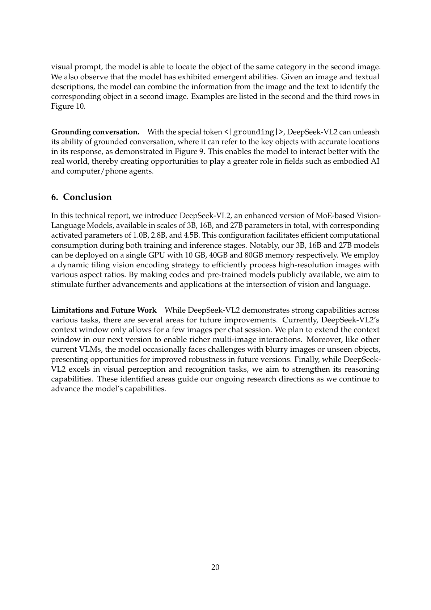

## 参考文献（原文截图）

参考文献中的作者姓名、英文题名、出版信息与链接按原论文准确保留。

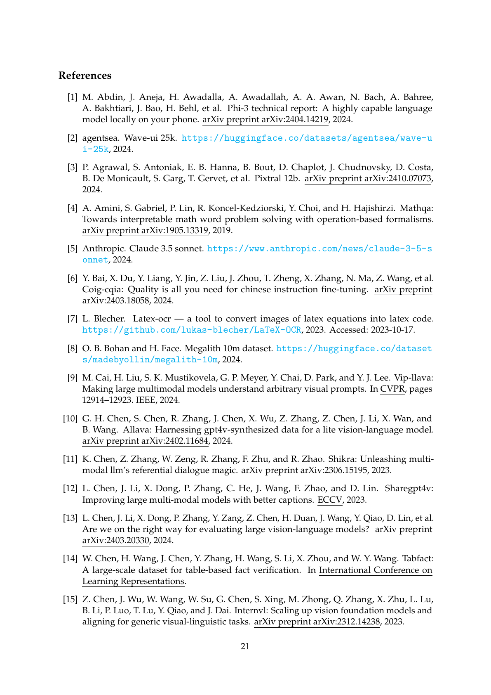

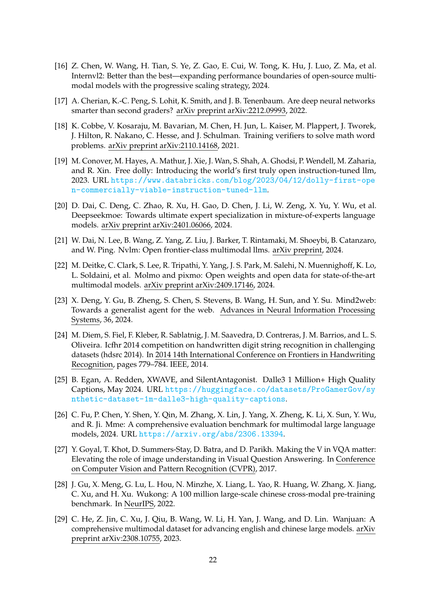

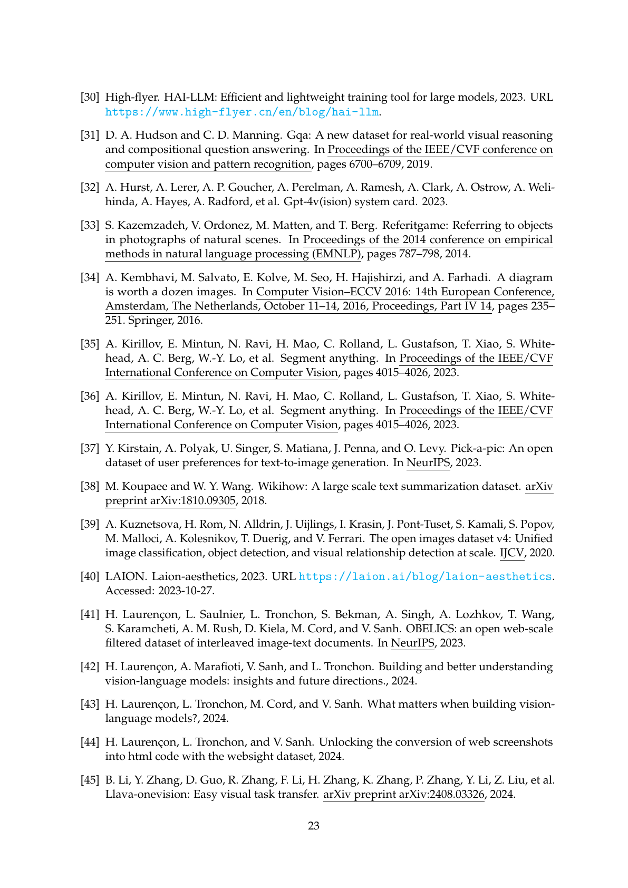

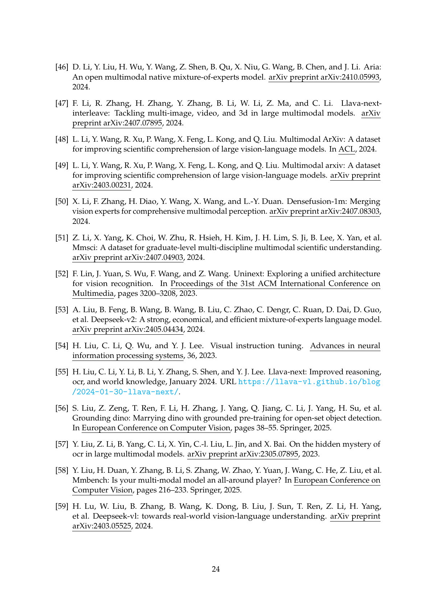

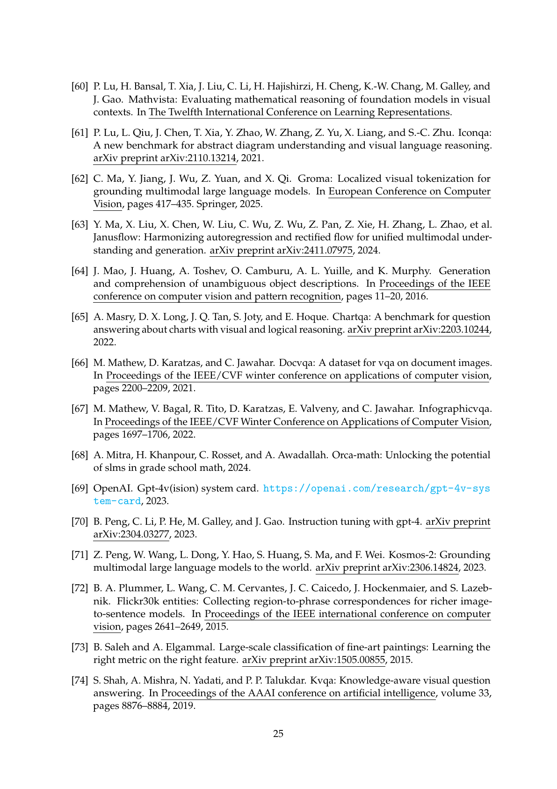

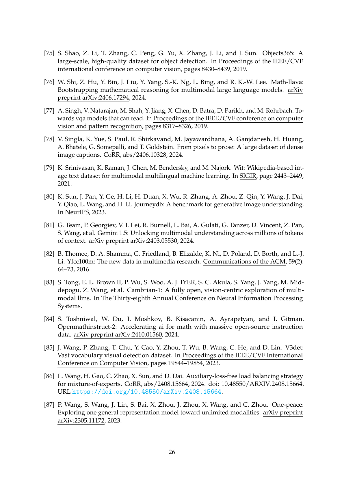

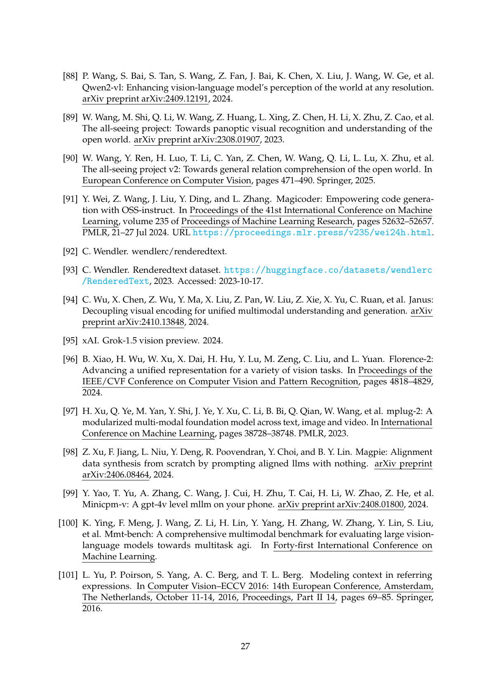

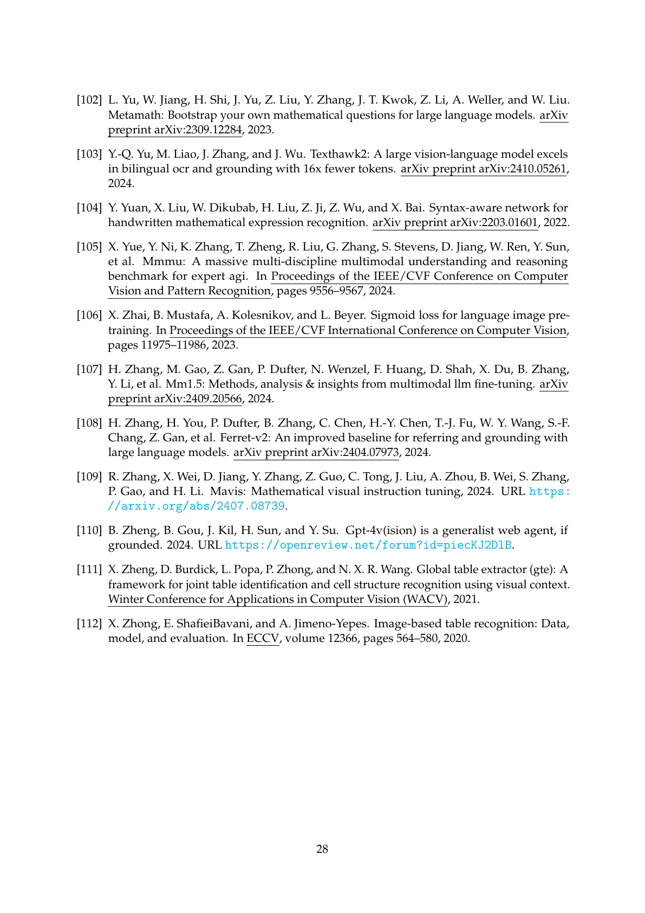
