# DeepSeek-VL：迈向真实世界视觉—语言理解

**作者：** Haoyu Lu、Wen Liu、Bo Zhang、Bingxuan Wang、Kai Dong、Bo Liu、Jingxiang Sun、Tongzheng Ren、Zhuoshu Li、Hao Yang、Yaofeng Sun、Chengqi Deng、Hanwei Xu、Zhenda Xie、Chong Ruan

**机构：** DeepSeek-AI

**代码：** https://github.com/deepseek-ai/DeepSeek-VL

**论文版本：** arXiv:2403.05525v2，2024 年 3 月 11 日

**译文说明：** 本文按论文内容顺序逐段翻译；模型、数据集与通行技术缩写保留原写法。图、表、复杂示例与参考文献以原论文整页截图呈现。

## 摘要

本文提出 DeepSeek-VL，一个面向真实世界视觉与语言理解应用的开源视觉—语言模型。方法围绕三个关键维度构建。

- **数据构造：** 力求让数据多样、可扩展，并广泛覆盖网络截图、PDF、OCR、图表和知识性内容——包括专家知识与教材——等真实世界场景，全面代表实际语境。我们还从真实用户场景建立用例分类体系，并据此构造指令微调数据集。使用该数据集微调，显著改善模型在实际应用中的用户体验。
- **模型架构：** 考虑效率与多数真实场景的需求，DeepSeek-VL 使用混合视觉编码器，在固定词元预算内高效处理 1024×1024 高分辨率图像，同时保持较低计算开销。它能在各种视觉任务中同时捕捉关键语义与细节信息。
- **训练策略：** 我们认为，一个熟练的视觉—语言模型首先应具备强大语言能力。为在预训练期间保留 LLM 能力，我们从一开始就整合语言模型训练，并谨慎管理视觉、语言模态之间的竞争动态。训练先侧重文本，再逐步调整比例，使两种模态均衡融合。

DeepSeek-VL 家族包括 13 亿和 70 亿参数模型，在真实应用中作为视觉—语言聊天机器人提供了更好用户体验；在相同模型规模下，它于广泛视觉—语言基准上取得领先或具有竞争力的表现，同时在语言基准上保持稳健。两个版本均已公开，以促进基于该基础模型的创新。

> 作者说明：星号表示同等贡献；匕首表示在 DeepSeek-AI 实习期间完成；双匕首表示项目负责人。

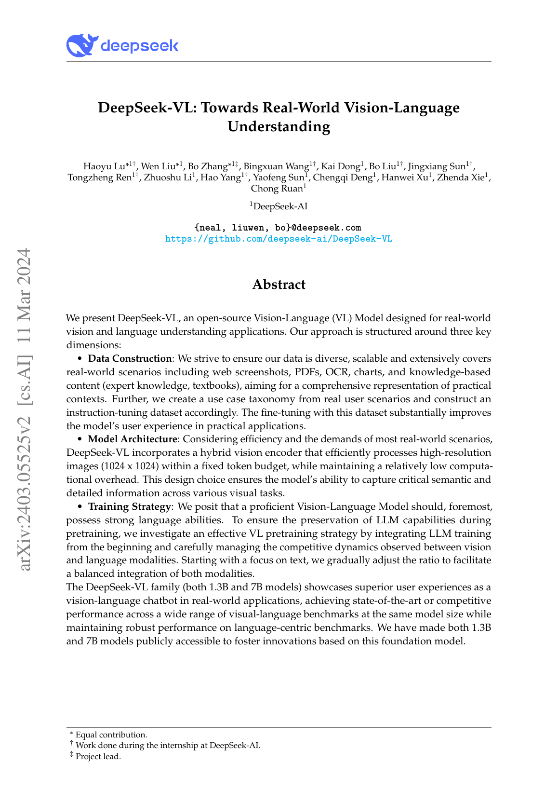

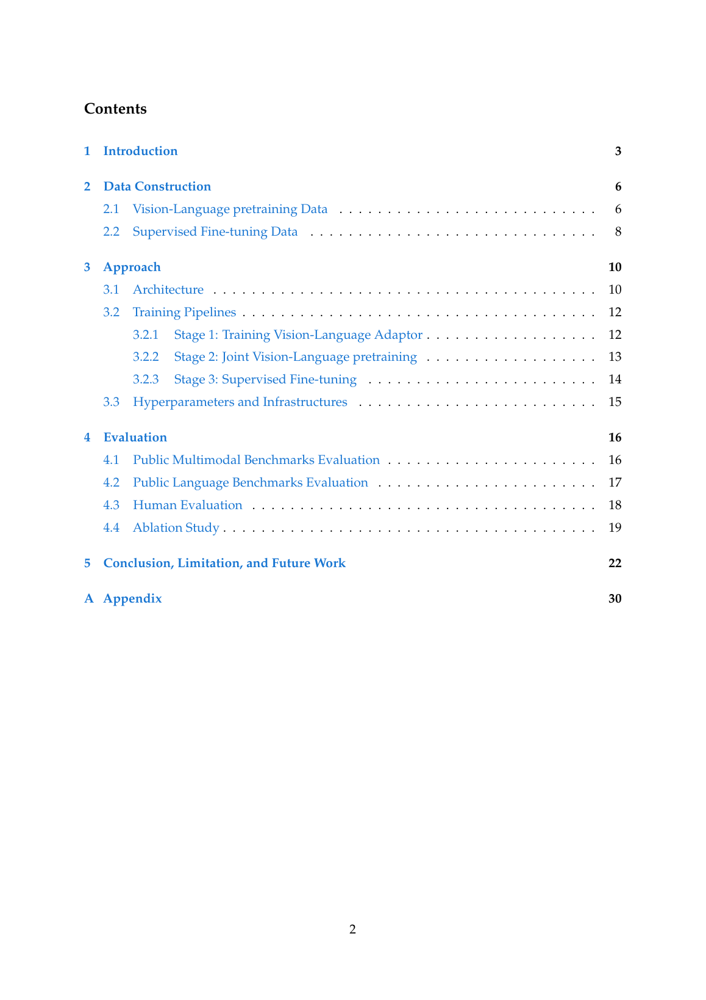

## 1 引言

大型语言模型的巨大成功，推动了对多模态通用接口的需求：它不应只处理语言，还要处理其他模态。GPT-4V 与 Gemini 等大型多模态模型由此出现，成为能理解并执行跨视觉与语言指令的通用助手。这些模型在完成复杂、多样的真实任务时展现出很大潜力，使交互更自然、更接近人类。

近期大量开源大型多模态模型试图缩小与专有模型的差距，尤其在基准成绩上已取得显著进展；但多数开源模型与最先进闭源模型之间，在真实表现和用户体验上仍有明显鸿沟。开源社群要开发适用于现实应用、具备稳健通用多模态能力的模型，仍很困难。

这种差距在真实场景中尤为突出，主要有四个原因：

1. 许多开源方案把大量计算资源投入指令微调，但强大语言模型的训练经验说明，充分预训练对发展通用智能至关重要。要让多模态模型获得丰富世界知识，应强调利用广泛视觉—语言数据进行全面预训练。
2. 常见做法是在指令微调时合并各种学术数据集。这样可能得到良好基准成绩，却往往无法提供真实的现实使用体验。
3. 在模型架构上，以往工作大多把通常已经与文本对齐的视觉 Transformer 接到预训练语言模型上，但输入分辨率往往只有 336×336 或 448×448。OCR、微小目标识别等复杂现实场景要求高分辨率处理能力。
4. 一些模型已经开始利用预训练，却常忽略语言能力的保存。长时间多模态训练后，语言能力往往下降。我们的目标是构建两种模态都很强的通才模型，因此需要一种训练策略，在发展新模态能力时妥善保留语言能力。

据此，本文提出建立在 DeepSeek 语言模型系列上的开源大型多模态模型 DeepSeek-VL。为追求真实场景中的熟练表现，我们进行大规模预训练，依据用例分类体系仔细策划数据，设计面向高分辨率处理的架构，并采用平衡多模态的训练策略。我们还开发一套训练方法，引导模型从十亿级扩展至 70 亿。这些全面探索使 DeepSeek-VL 在实际场景中，相比同等规模的大型多模态模型拥有明显优势。

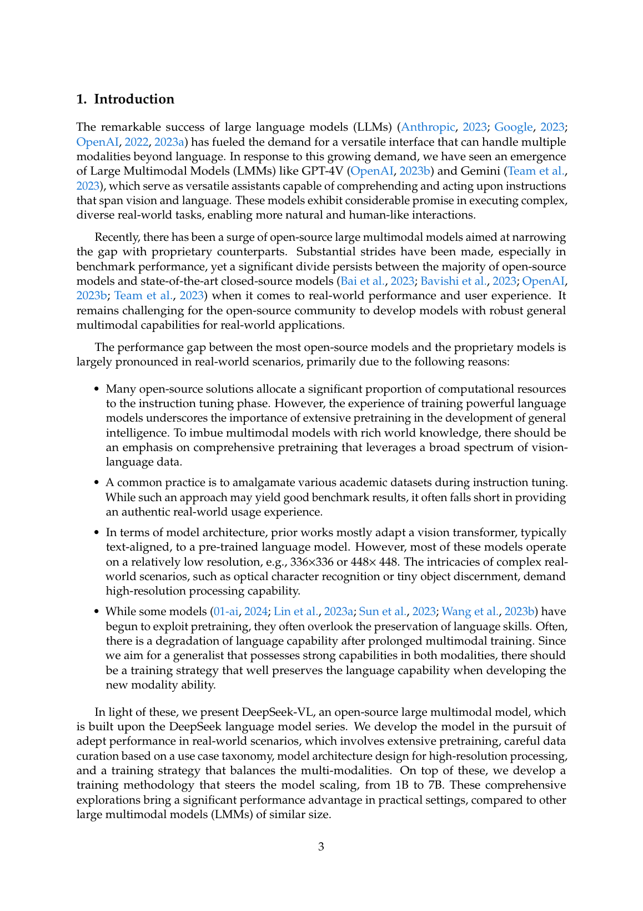

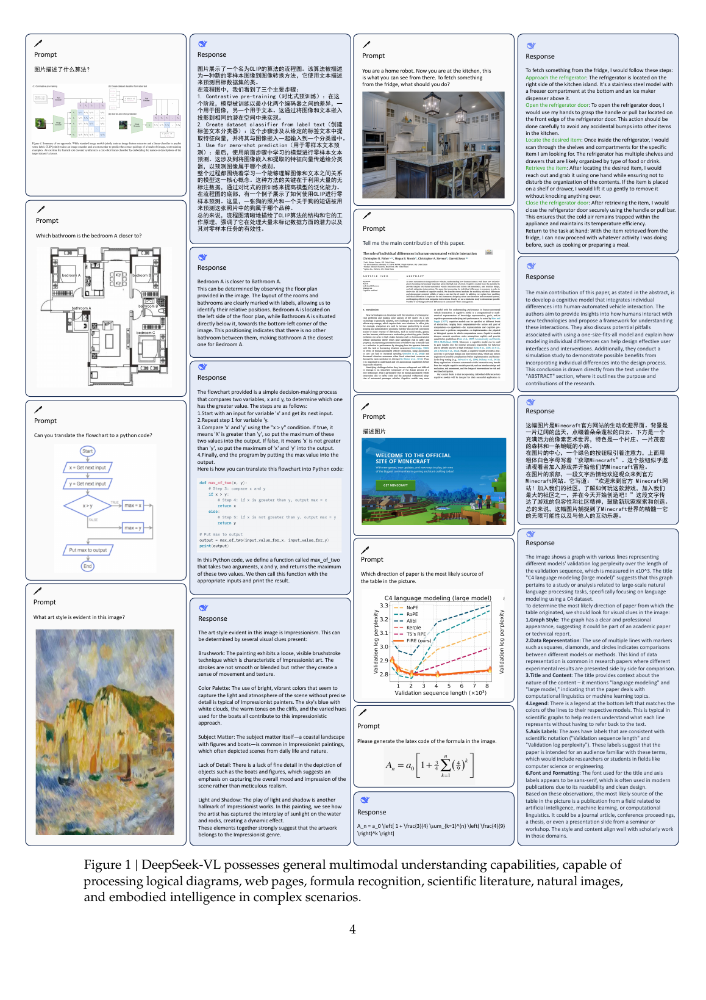

DeepSeek-VL 预训练数据来自 Common Crawl、网络代码、电子书、教育资料和 arXiv 论文等多种来源，全面覆盖网络截图、PDF、OCR、图表和知识性内容等现实场景，力求在保持可扩展性的同时获得广泛、实用的代表性。

预训练数据覆盖广泛世界知识，而指令微调数据则精心反映真实用例。我们从互联网上人工收集 GPT-4V 与 Gemini 的真实测试案例，系统整理为完整分类体系，再用它为每张测试图像选择提示，确保指令微调数据实用且相关。同一分类体系还用于构造能有效评估真实表现的数据集。

视觉模块要在固定词元预算下最大化高分辨率输入利用率，以有效控制推理成本。因此使用混合视觉编码器：一个与文本对齐的编码器以 384×384 分辨率提取粗粒度语义，一个高分辨率编码器以 1024×1024 捕捉细节。融合后，一张 1024×1024 图像被高效压缩为 576 个词元；对多数用例，这个分辨率已经足够。576 个词元在丰富视觉表示与词元经济性之间取得平衡，适合图文交错与多轮推理。

多模态预训练的一项常见挑战，是过度依赖视觉—语言数据会损害语言能力。研究发现，为维持模型中的语言知识完整性，语言数据必须占相当比例，至少为 70%。这种平衡使模型获得稳健多模态能力而不牺牲语言表现。

我们还提出新的“模态预热”策略，在训练中谨慎调整模态比例，逐步加入更多视觉—语言数据。精细调节比例并配合预热，使两种模态表现均衡。

模型迭代时先进行小规模实验，再扩展到大模型。但十亿参数左右的小模型无法在基准上展示合理表现，也难以忠实反映模型能力。为解决这一问题，采用两种方法：第一，把评估协议从直接多选生成改为比较各选项困惑度；第二，在预训练中混入少量指令微调数据，避免指令遵循能力成为瓶颈。这样，十亿级模型就能得到合理成绩，更准确地衡量每轮实验的影响。

广泛视觉、语言基准评估显示，DeepSeek-VL 在真实应用中提供了更好用户体验；相同规模下，它在多项视觉—语言基准上领先或具竞争力，同时维持稳健语言表现。我们公开 13 亿与 70 亿两个版本，以支持不同计算能力需求，促进创新和广泛应用。

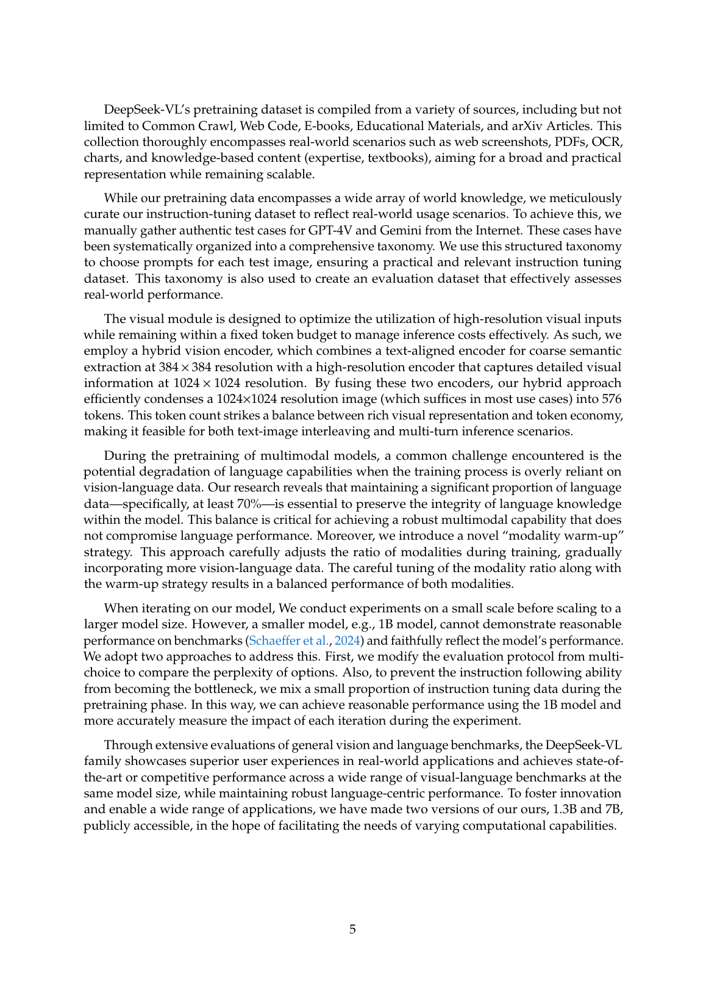

## 2 数据构造

多样且大规模的数据集，是视觉—语言模型训练最重要的成分。数据分为两部分：视觉—语言预训练数据与视觉—语言监督微调数据。预训练数据由多来源图文数据组成，用于增强基础跨模态理解；监督微调数据规模较小，目标是教模型完成具体下游任务。预训练数据在阶段一预热视觉—语言适配器、阶段二联合预训练模型；监督微调数据用于阶段三。

### 2.1 视觉—语言预训练数据

预训练数据包括多种公开来源和一部分专有数据，表 1 总结联合视觉—语言预训练阶段的数据源。这些数据帮助 LLM 理解图像中的实体。完整数据分为以下类别。

#### 2.1.1 交错图文数据

交错图文数据提高模型对多模态输入的上下文学习能力，使用 MMC4、英文与中文维基百科、WikiHow 以及 EPUB 教材。

#### 2.1.2 图像描述数据

图像描述数据来自 CapsFusion、TaiSu 和 Detailed Caption 三个高质量图文配对数据集。

#### 2.1.3 表格与图表数据

这类数据使模型学习通用表格和图表图像理解，来源包括 Chart2Text、Geo170K、UniChart、UReader、M-Paper、ScienceQA、ScreenQA、SciGraphQA-295K、Paper2Figure100K、Widget Captioning、Screen2Words 与 RefExp。

#### 2.1.4 网络代码数据

网络代码让模型能够根据图形界面或可视化图表重建代码。用户界面逆向渲染使用 WebSight；可视化图表逆向渲染采用类似 MATCHA 的策略。我们处理 The Stack 中约 146 万个 Jupyter Notebook，抽取所有图表及对应前置代码，形成约 200 万组图像—代码对。为提高质量，筛出 110 万个样本，每个只含一张图像且代码至少五行，作为主要训练数据。

#### 2.1.5 文档光学字符识别数据

文档 OCR 让模型即使面对复杂现实场景，也能在文档级识别字符。据我们所知，当时没有同时覆盖中英文文档的公开大规模数据集。除公开小型 LaTeX-OCR 外，我们又构造全面的中英文文档 OCR 数据集，分两部分：

1. **arXiv 论文：** 收集 140 万篇 arXiv 论文的源代码与编译 PDF，使用 Nougat 预处理工具把论文渲染成配对图像与文本。
2. **电子书与教育材料：** 从 Anna’s Archive 清洗 86 万本英文与 18 万本中文电子书，以及数百万道 K-12 教育考试题；再用 HTML 渲染工具和不同模板转换为配对图文格式。

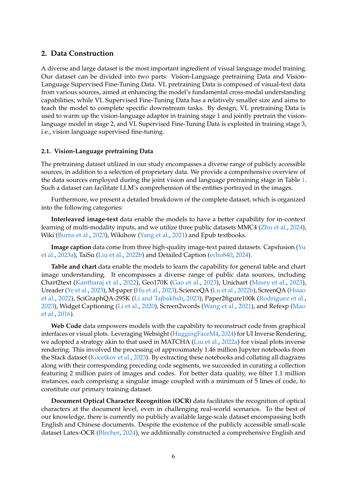

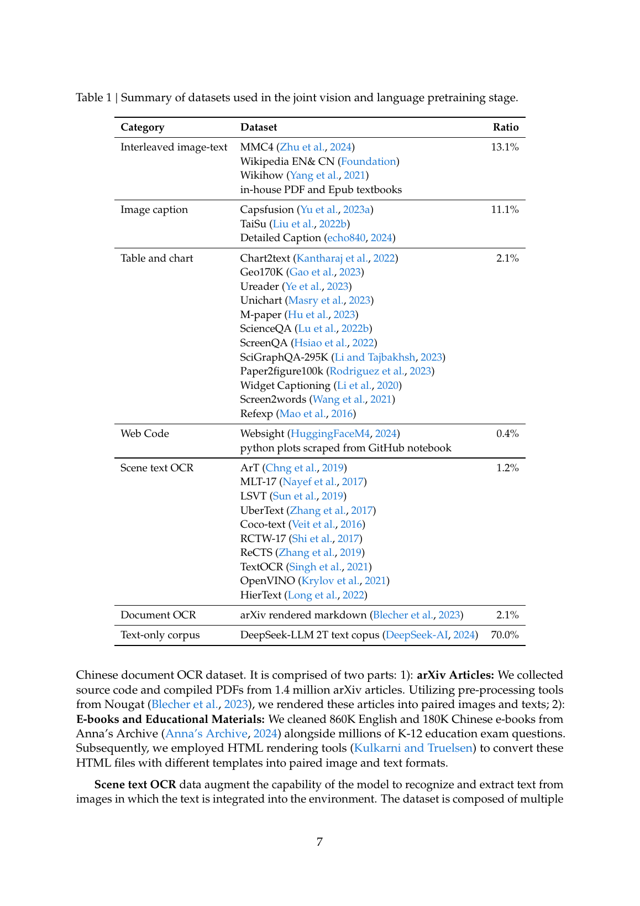

#### 2.1.6 场景文字光学字符识别数据

场景文字 OCR 增强模型识别、抽取融合在环境图像中的文字的能力。数据由 ArT、MLT-17、LSVT、UberText、COCO-Text、RCTW-17、ReCTS、TextOCR、OpenVINO 与 HierText 等公开数据集组成。

#### 2.1.7 纯文本语料

纯文本用于维持以语言为中心的任务能力，采用与 DeepSeek-LLM 相同的两万亿词元文本语料，占联合预训练数据 70%。

### 2.2 监督微调数据

监督微调数据包含多种多模态与语言来源，包括 ShareGPT4V、LAION-GPTV、LVIS-Instruct4V、TextOCR-GPT4V、LLaVA1.6-GPT4V、IconQA 等知名开源 GPT-4V 共享数据。还选取 UReader、ScreenQA、Geo170K、ScienceQA 的部分表格与图表数据，并加入 Screen-to-Code 的用户界面代码任务。

为提高多模态 SFT 质量，我们策划一部分高质量内部多模态数据，其中包含中文。内部指令数据精心反映真实使用场景，覆盖广泛任务。我们先从多种在线来源收集 GPT-4V 与 Gemini 的真实测试案例，再分析并整理成完整分类体系，包括识别、转换、分析、常识推理、逻辑推理、评价、多图与安全等类别，详见表 3。

这套结构化分类体系指导为每张测试图像选择代表性提示，确保指令数据实用、符合真实应用；同时也用于构造平衡、全面的评估数据，使不同任务和类别均能有效衡量。内部多模态 SFT 覆盖的类别因而与分类体系一致，并能代表真实用例。

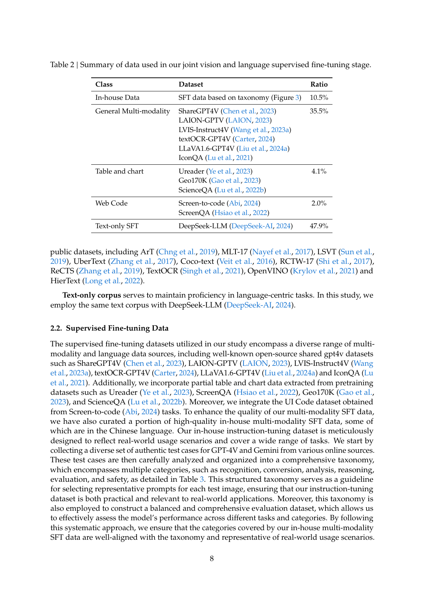

表 3 进一步细分每类用例。例如，识别包括全局描述、局部描述与 OCR 转录；转换包括图像转代码、图像转文本；分析包括数据图表、专业图示、专业图像与百科知识；常识推理包括关系、功能、环境、异常与幽默推理；逻辑推理包括数学与其他学科；多图任务包括时序理解与图像比较；安全包括诱导提问、反事实提问与提示注入。

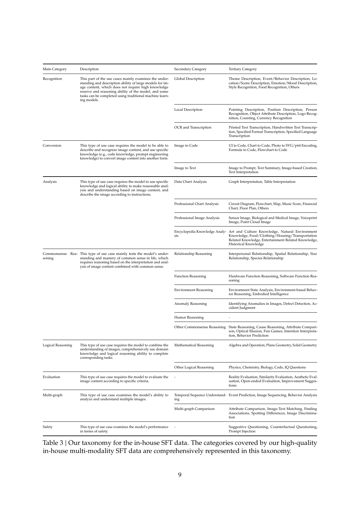

此外，联合视觉—语言 SFT 数据还包括 DeepSeek-LLM 使用的纯文本监督微调数据。

## 3 方法

### 3.1 架构

系统包含混合视觉编码器、视觉适配器和语言模型三个模块。

#### 3.1.1 混合视觉编码器

我们使用 SigLIP 提取视觉输入的高层语义特征，但单一 SigLIP 难以全面处理所有现实问题。包括 SigLIP 在内的 CLIP 系列主要为语义视觉表示设计，却会因编码歧义产生“CLIP 盲对”：视觉上不同的图像被编码为相似表示。CLIP 系列输入分辨率也相对较低，例如 224×224、336×336、384×384 或 512×512，难以完成密集 OCR 与视觉定位等要求低层细节的任务。

近期研究主张加入只处理视觉的自监督编码器，增强多模态模型的视觉定位能力。我们额外采用基于 SAM-B 的纯视觉编码器，即预训练 ViTDet 图像编码器，处理 1024×1024 高分辨率输入；同时保留处理 384×384 低分辨率输入的 SigLIP-L。两者构成混合编码器，在高效编码 1024×1024 图像的同时保留语义与细节。

SAM-B 首先把图像缩放到 1024×1024，产生 64×64×256 特征图。适配器先插值到 96×96×256，再用两层步幅为 2 的卷积产生 24×24×1024 特征图，重塑为 576×1024。SigLIP-L 同样产生 576×1024 低分辨率特征。两者沿维度拼接，得到 576 个、每个 2048 维的视觉词元；它们既增强高层语义识别，也支持低层视觉定位。随后经过 GeLU 激活与嵌入层，连接到语言模型。

#### 3.1.2 视觉—语言适配器

采用两层混合多层感知机连接视觉编码器与 LLM。先用不同单层感知机分别处理高、低分辨率特征，再沿特征维度拼接，最后通过另一层感知机投影到 LLM 输入空间。

#### 3.1.3 语言模型

语言模型基于 DeepSeek-LLM，微观设计大体沿用 LLaMA：采用带 RMSNorm 的前归一化结构，以 SwiGLU 为前馈网络激活函数，中间层维度为 8d_model/3；使用旋转位置嵌入和 DeepSeek-LLM 同一分词器。

为联合预训练多模态与语言，我们从 DeepSeek 预训练模型的中间检查点继续训练。DeepSeek-VL-1B 基于训练约 5,000 亿文本词元的 DeepSeek-LLM-1B；DeepSeek-VL-7B 基于训练约两万亿文本词元的 DeepSeek-LLM-7B。

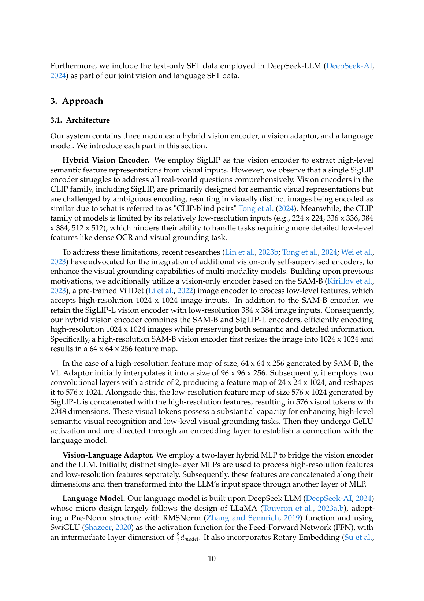

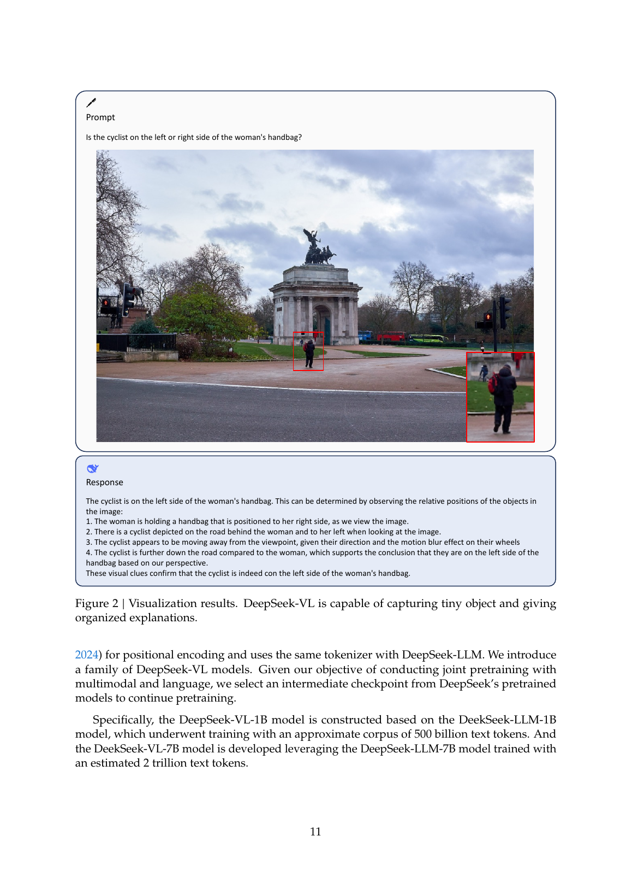

### 3.2 训练流水线

DeepSeek-VL 按图 3 连续分三阶段训练：视觉—语言适配器预热、视觉—语言联合预训练、监督微调。目前专注视觉理解能力，只在语言部分计算后续词元预测损失。

#### 3.2.1 阶段一：训练视觉—语言适配器

本阶段主要目标是在嵌入空间中建立视觉元素与语言元素的概念联系，使 LLM 能全面理解图像实体。与 LLaVA、InstructBLIP 一致，视觉编码器和 LLM 都冻结，只训练适配器。训练数据包含 ShareGPT4V 的 125 万个配对图像描述，以及 250 万个文档 OCR 渲染对。

视觉—语言适配器通常只是两层多层感知机，参数容量远小于 LLM，限制本阶段可学习能力。于是自然产生问题：数据缩放定律在这里是否有效？表 8 的简单实验表明，阶段一扩大数据不仅没有收益，甚至可能让表现变差。因此，阶段二解冻 LLM，探索高效视觉—语言预训练。

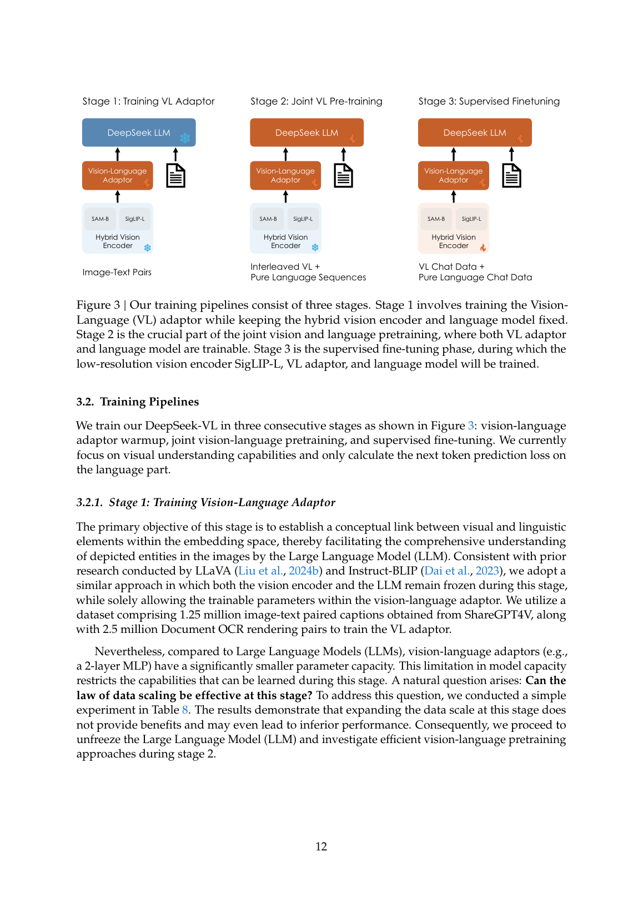

#### 3.2.2 阶段二：视觉—语言联合预训练

本阶段探索一种附加预训练方式，使 LLM 能理解多模态输入。视觉编码器继续冻结，优化语言模型与视觉—语言适配器。

起初，我们尝试只用多模态数据直接训练 LLM。多模态指标逐步提高，语言指标却如图 4 中“多模态:语言=100%:0%”曲线所示急剧、严重下降。这揭示了在 LLM 基础上直接进行多模态预训练的固有挑战：增强多模态能力与保留语言能力之间存在关键权衡。

我们认为有两个主要原因。第一，多数多模态语料过于简单，在复杂度与分布上同语言数据差别很大。第二，多模态与语言模态之间存在竞争，使 LLM 对语言能力产生灾难性遗忘。

##### 3.2.2.1 语言—多模态联合训练

为处理这一挑战，我们设计简单而有效的联合训练策略：不只训练多模态数据，还加入很大比例的语言数据，以平衡重点、缓解负面影响。图 4 在 DeepSeek-VL-1B 上比较不同模态混合比例，得到三项结论：

1. 加入语言数据显著缓解语言能力下降，大幅改善语言表现。
2. 语言数据不会明显损害多模态表现，说明模型仍保留多模态处理能力。
3. 各模态表现与其在训练数据中的比例高度相关，证实两者的竞争关系。

最终模型采用约 7:3 的语言—多模态数据比例，在维持语言能力的同时，更好地进行多模态预训练，平衡两类能力的发展。

##### 3.2.2.2 扩展视觉—语言预训练

预训练计算成本很高，直接在 7B 模型上迭代会耗费过多算力与时间。合适策略是先在 1.3B 小模型上实验，再扩展至 7B。许多由 1.3B 获得的结论可以通过 SFT 有效迁移到 7B，例如编码器设计。

然而阶段二训练时，1.3B 的生成式指标波动很大，难以有效监控。已有研究指出：“即使模型家族的逐词元错误率随规模平滑、连续且可预测地变化，研究者选择的测量方法也可能造成尖锐、不可预测的变化。”实验进一步表明，根因是 1.3B 容量有限，且训练数据不含 SFT，导致模型难以准确遵循指令。即使模型知道正确选项，也无法精确生成。

为缓解问题，我们双管齐下。第一，用多项选择困惑度方法监控进度：把提示、图像和所有答案一并输入网络，计算 A、B、C、D 等每个答案位置的困惑度，选模型认为正确的选项。第二，在训练数据中加入极少量 SFT，使模型获得一些指令遵循能力。两者结合让 1.3B 的训练指标保持稳定，并在阶段三后获得更好表现。

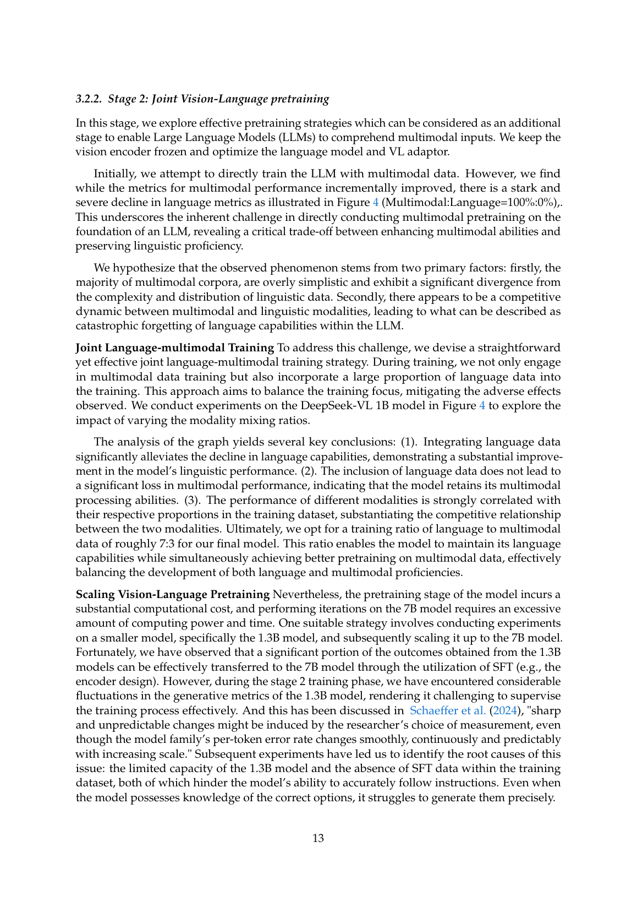

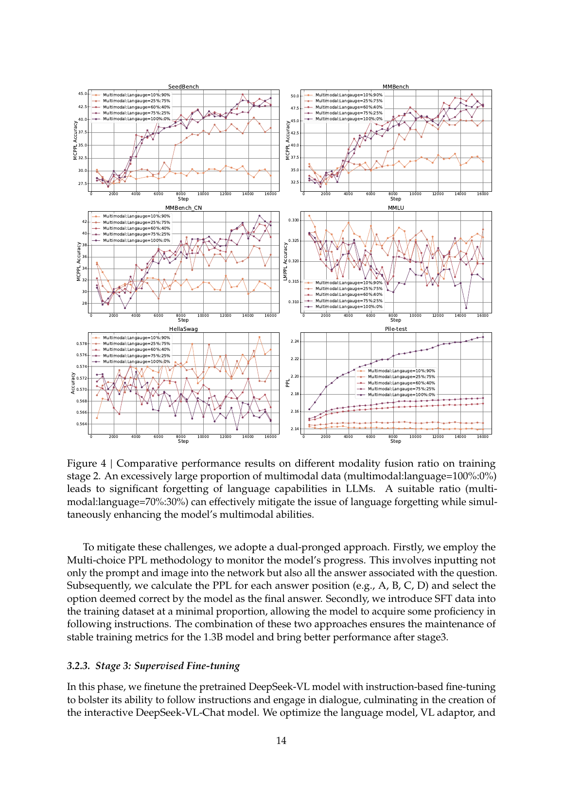

#### 3.2.3 阶段三：监督微调

本阶段使用基于指令的微调训练预训练 DeepSeek-VL，增强指令遵循与对话能力，最终形成可交互的 DeepSeek-VL-Chat。使用表 2 的视觉—语言 SFT 数据优化语言模型、适配器与混合视觉编码器；受 GPU 内存限制，SAM-B 保持冻结。只监督回答与特殊词元，遮蔽系统和用户提示。

为保证完整对话能力，训练混合多模态数据与 DeepSeek-LLM 使用的纯文本对话数据，使模型适用于多种对话场景。

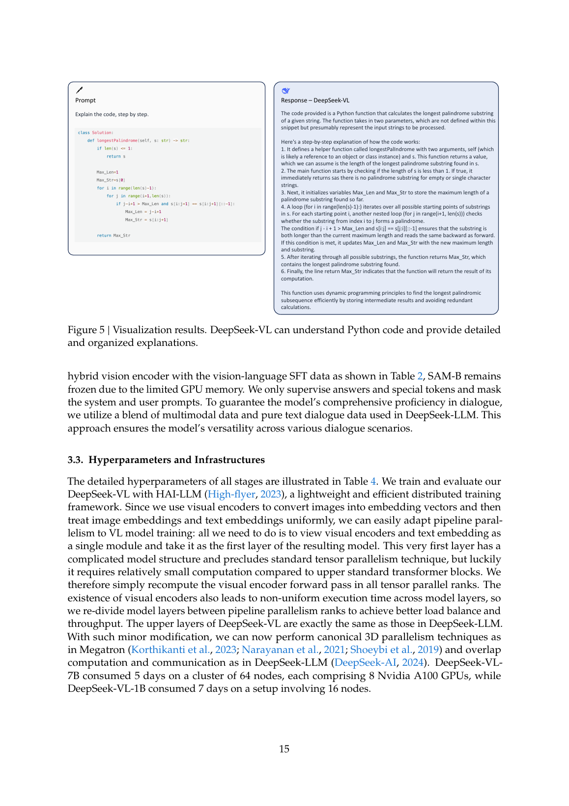

### 3.3 超参数与基础设施

各阶段详细超参数见表 4。我们使用轻量、高效的分布式训练框架 HAI-LLM 训练与评估。视觉编码器先把图像转为嵌入向量，再统一处理图像与文本嵌入，因此流水线并行很容易适配视觉—语言模型：只需把视觉编码器与文本嵌入视为一个模块，作为最终模型第一层。

第一层结构复杂，无法使用标准张量并行，但与上层标准 Transformer 块相比计算量较小，因此在所有张量并行秩上简单重算视觉编码器前向传播。视觉编码器还使各层执行时间不均匀，所以重新划分流水线并行秩之间的模型层，以改善负载均衡与吞吐量。

DeepSeek-VL 上层与 DeepSeek-LLM 完全相同。经过这点修改，即可像 Megatron 那样执行标准三维并行，并像 DeepSeek-LLM 那样重叠计算与通信。DeepSeek-VL-7B 在 64 个节点的集群上训练五天，每节点八块 NVIDIA A100；DeepSeek-VL-1B 在 16 个节点上训练七天。

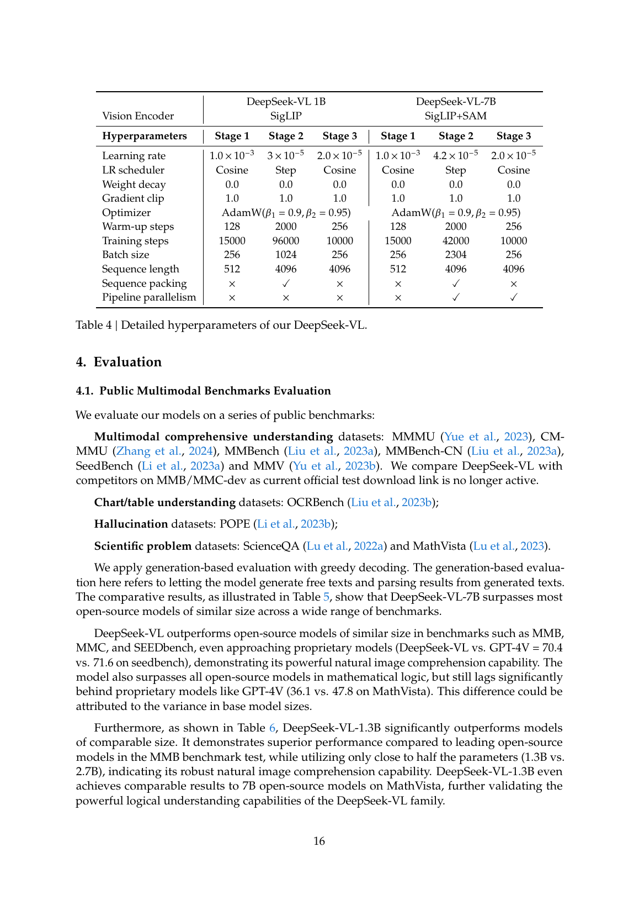

## 4 评估

### 4.1 公共多模态基准评估

评估使用以下公共基准：

- **多模态综合理解：** MMMU、CMMMU、MMBench、MMBench-CN、SeedBench 与 MM-Vet。由于官方测试下载链接失效，MMBench 与 MMBench-CN 比较开发集结果。
- **图表与表格理解：** OCRBench。
- **幻觉：** POPE。
- **科学问题：** ScienceQA 与 MathVista。

评估采用贪心解码的生成式方法，即让模型生成自由文本，再从生成文本解析结果。表 5 显示，DeepSeek-VL-7B 在广泛基准上超过多数同规模开源模型。

DeepSeek-VL 在 MMBench、MMBench-CN、SeedBench 等基准上优于同规模开源模型，甚至接近专有模型，例如 SeedBench 上 DeepSeek-VL 为 70.4、GPT-4V 为 71.6，证明其自然图像理解能力强。数学逻辑方面也超过所有开源模型，但仍明显落后 GPT-4V，例如 MathVista 为 36.1 对 47.8；差异可能来自基础模型规模。

表 6 还显示，DeepSeek-VL-1.3B 显著优于同规模模型。它只用接近一半参数——13 亿对 27 亿——便在 MMBench 上超过领先开源小模型，说明自然图像理解稳健；MathVista 上甚至达到 7B 开源模型水平，进一步验证 DeepSeek-VL 家族的逻辑理解能力。

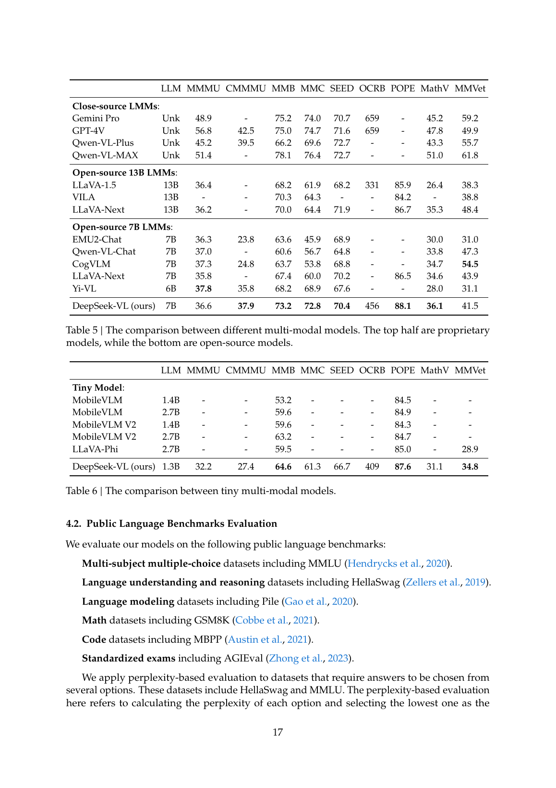

### 4.2 公共语言基准评估

语言评估包括：多学科多项选择 MMLU；理解与推理 HellaSwag；语言建模 Pile；数学 GSM8K；代码 MBPP；标准化考试 AGIEval。

HellaSwag 与 MMLU 等多选数据使用困惑度评估：计算每个选项的困惑度，以最低者为模型预测。这种方法可区分模型预测间细微概率差异，避免精确匹配式评估的不连续。GSM8K 与 AGIEval 使用贪心解码的生成式评估；Pile 测试集使用语言建模式评估，即计算测试语料的每字节比特数。结果见表 7。

多数语言基准上，DeepSeek-VL 与 DeepSeek-7B 相当，甚至更好。例如衡量通用语言能力的 HellaSwag 为 68.4 对 68.5。MMLU 与 AGIEval 上 DeepSeek-VL 超过 DeepSeek-7B，说明多模态训练甚至可能帮助语言任务。

但 DeepSeek-VL-7B 的数学 GSM8K 有一定下降，说明即便努力促进视觉与语言和谐，两者仍存在竞争。这可能来自 7B 容量有限，更大的模型或可显著缓解。总体而言，DeepSeek-VL 力求在处理这些挑战时把语言能力下降降到最低。

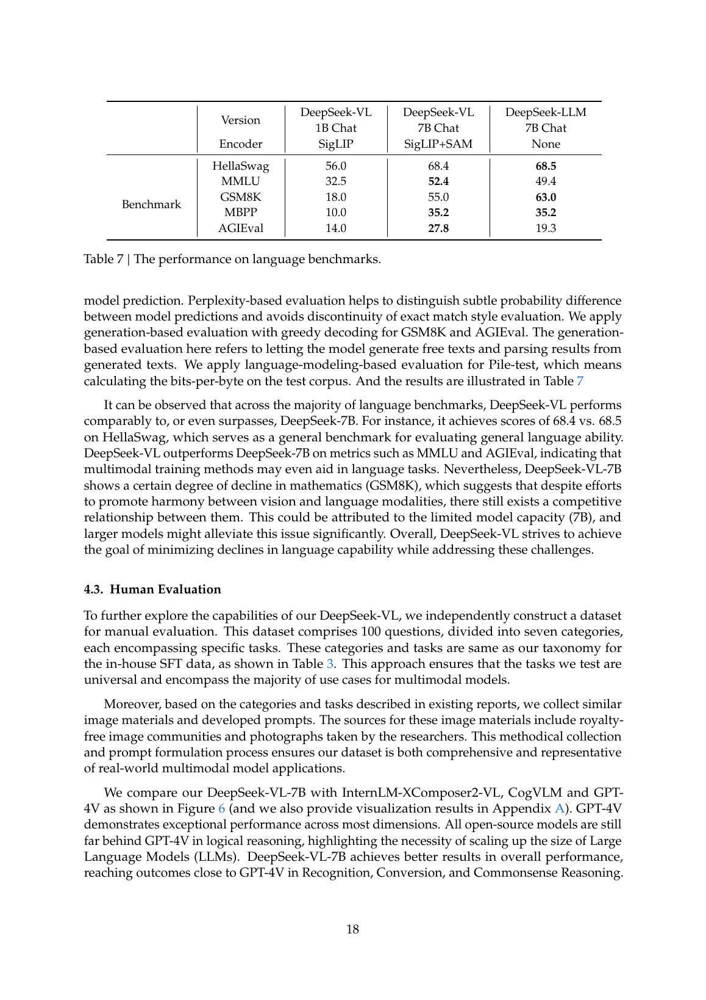

### 4.3 人工评估

为进一步探索能力，我们独立构造人工评估集，共 100 个问题，分七类，每类含具体任务；类别与表 3 的内部 SFT 分类相同，确保测试任务通用并覆盖多数多模态用例。

我们根据既有报告中的类别与任务，收集相似图像并设计提示。图像来自免版税社群和研究者拍摄照片，使数据既全面又能代表现实应用。

图 6 比较 DeepSeek-VL-7B、InternLM-XComposer2-VL、CogVLM 与 GPT-4V，附录 A 还提供可视化结果。GPT-4V 在多数维度表现卓越；所有开源模型在逻辑推理上仍远落后，说明扩大 LLM 规模很有必要。DeepSeek-VL-7B 总体优于其他开源模型，在识别、转换与常识推理上接近 GPT-4V。

我们还用 GPT-4V 比较 DeepSeek-VL 与其他模型，使用人工评估设计的 99 个测试样本。参照 Zheng 等人的方法，把问题和两个模型的回答同时展示给 GPT-4V，让它判断哪个更好或二者打平。多数情况下 GPT-4V 偏好 DeepSeek-VL 回答。图 7 显示，与 Fuyu-8B、CogVLM-17B、InternLM-XComposer2-VL 等开源多模态模型相比，DeepSeek-VL 在超过 60% 的样本中被判更优；与 GPT-4V 等专有模型相比也表现突出。

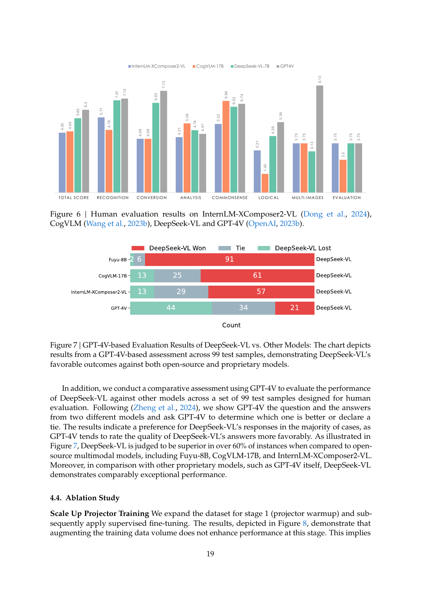

### 4.4 消融研究

#### 4.4.1 扩大投影器训练

我们扩大阶段一投影器预热数据，再做监督微调。图 8 与表 8 显示，增加本阶段数据量不会改善表现。这说明投影器容量天然受限，无法捕捉多模态任务所需的大量知识。

#### 4.4.2 训练阶段

表 9 分析每个阶段的贡献。阶段一、二、三结合，在所有指标上都明显优于只结合阶段一和三，证明多模态预训练有效。只结合阶段二、三仍略逊于三个阶段全用，说明视觉—语言适配器预热仍有意义。

#### 4.4.3 模态分组训练

混合语言与多模态数据时，直接在同一批次级别混合会显著降低训练效率，因为每批梯度反向传播必须等待最慢样本完成。处理更快的纯语言数据因此要等待多模态样本，降低整体效率。

为此，我们在每个全局步骤按模态分组并分别采样，使不同步骤的批次要么全是语言数据，要么全是多模态数据，而不是在批内混合。图 8 显示，这不会损害性能，却把训练效率提高 20%，绕开不同模态处理时间不一致造成的瓶颈。

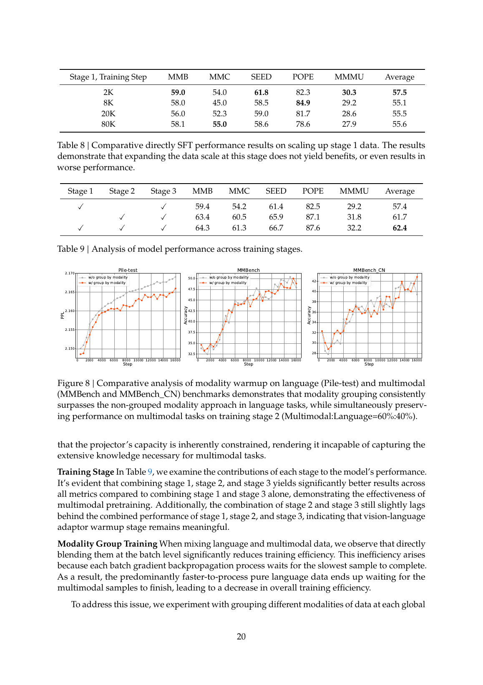

#### 4.4.4 模态预热

由于模型在语言基础上进行多模态训练，若从一开始就按固定比例混入多模态数据，模型可能不稳定。我们提出简单有效的模态预热：最初把语言数据比例设为 1，再逐步降至最终目标，例如 0.7。

图 9 显示，预热能防止训练初期语言能力大幅下降，并使最终语言与多模态领域都获得相对更好结果。渐进适应让模型更顺畅地接纳多模态数据，提高总体稳定性与表现。

#### 4.4.5 视觉编码器选择

为了更好获取和利用图像信息，我们比较不同视觉编码器的训练损失；除为提高效率把阶段二训练缩短到 8,000 步外，其余设置相同。图 10 显示，加入纯视觉自监督编码器能显著降低训练损失。为更有效处理高分辨率图像，最终采用 SigLIP 与 SAM 的混合编码器。

#### 4.4.6 视觉—语言适配器设计

在当前词元长度限制下，为提高视觉信息提取效率，可从视觉特征组合方法与多层感知机适配器设计两方面调整。

既有研究表明，沿序列维度组合视觉特征可能带来更好表现，但视觉词元序列更长，计算需求也更高。表 10 上半部分显示，为保持序列长度不变，先沿图像宽度或高度堆叠视觉特征以缩短序列、再做序列拼接，在多数指标上不如直接沿嵌入维度合并。

适配器架构方面，针对不同视觉编码器分别使用独立多层感知机，可更精确地适配各视觉特征的数值与分布，让训练更顺滑；共享多层感知机则有助于充分融合特征。我们采用混合策略，获得稳定且更好的表现，如表 10 下半部分所示。

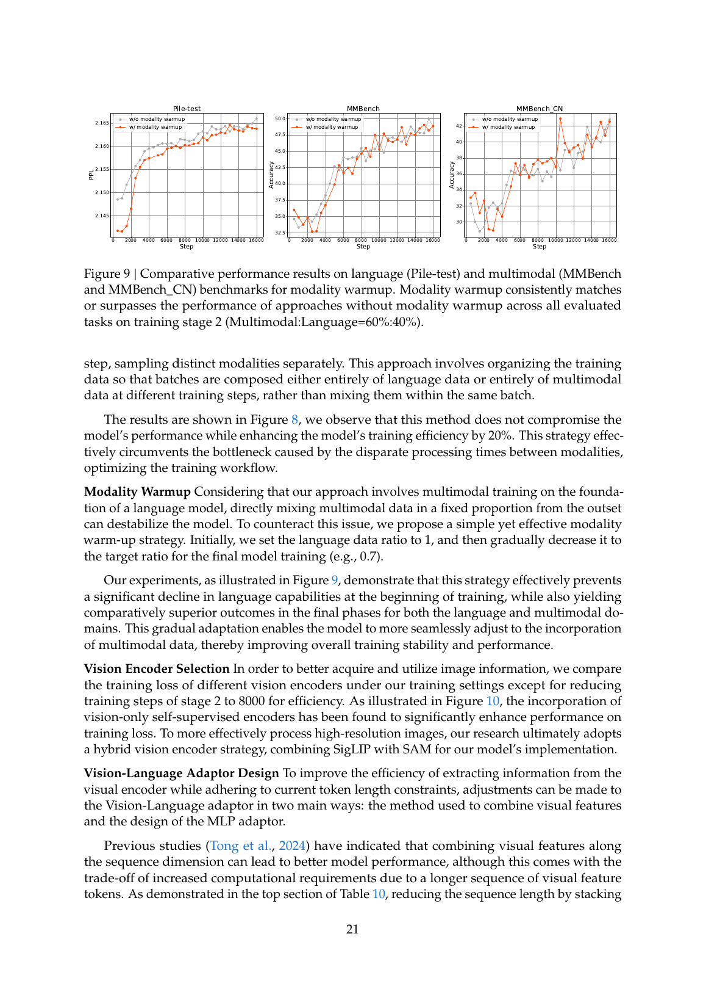

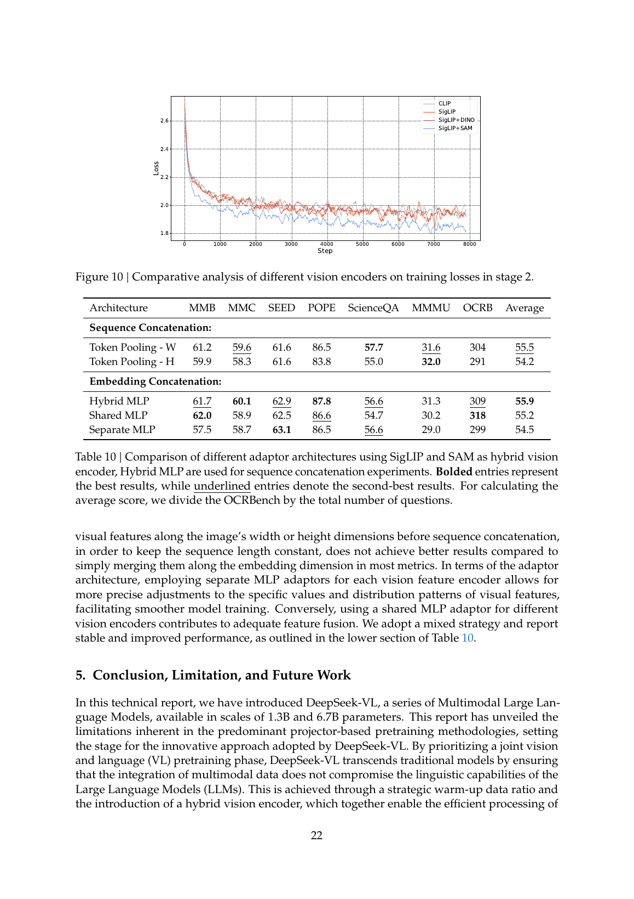

## 5 结论、局限与未来工作

本文介绍 DeepSeek-VL 系列多模态大型语言模型，规模为 13 亿与 67 亿参数。报告揭示了主流投影器式预训练方法的固有限制，并为 DeepSeek-VL 的创新方案奠定基础。DeepSeek-VL 把视觉—语言联合预训练置于核心，确保加入多模态数据不会牺牲 LLM 的语言能力；策略性预热数据比例与混合视觉编码器共同实现这一点，使模型能够高效处理高分辨率图像，同时保留丰富语义。

混合视觉编码器能在受限词元预算内处理 1024×1024 图像，体现了我们在不同任务中同时保留细微细节与语义完整性的目标。DeepSeek-VL 不仅达到、还超过同类通才模型的标准：在广泛视觉基准上表现突出，同时在语言评估中维持强大能力。

公开 DeepSeek-VL 的目的，是推动研究社群继续创新与探索，为未来研究提供稳健基础，并促进我们对多模态数据处理的集体理解与能力进步。

未来计划把 DeepSeek-VL 扩展到更大规模并加入专家混合技术。这将进一步提高效率与效果，为人工智能研究和应用开辟新的空间。

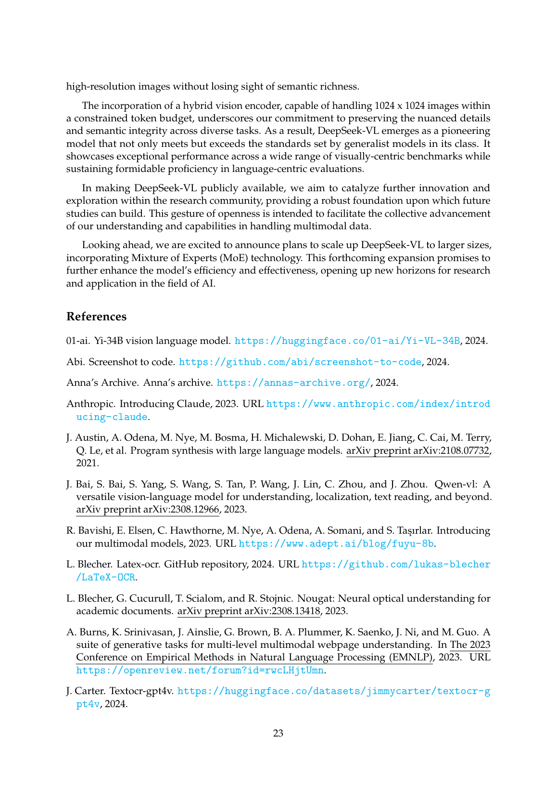

## 参考文献（原文截图）

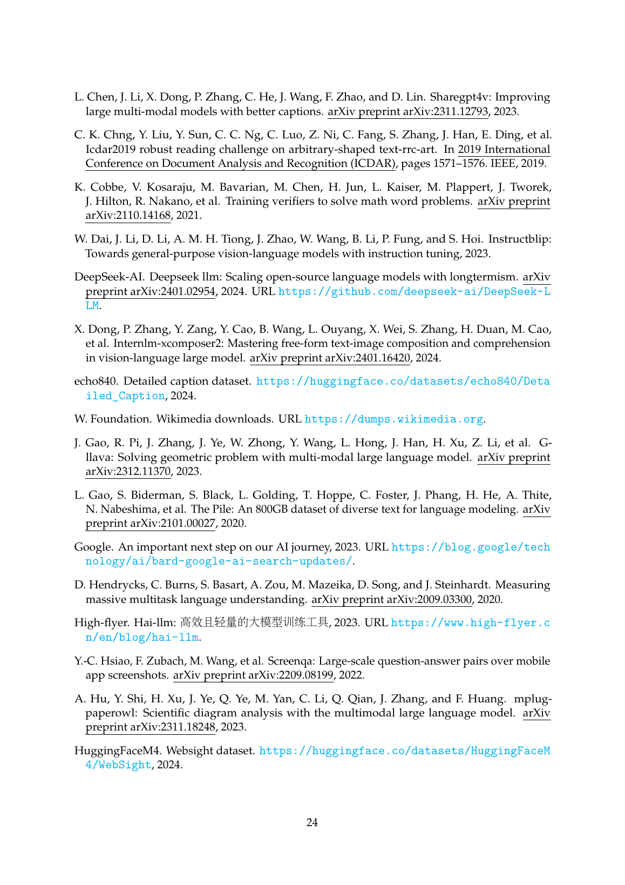

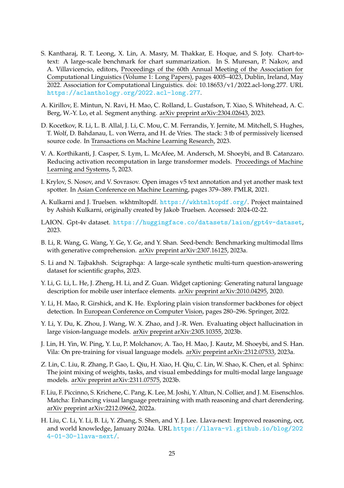

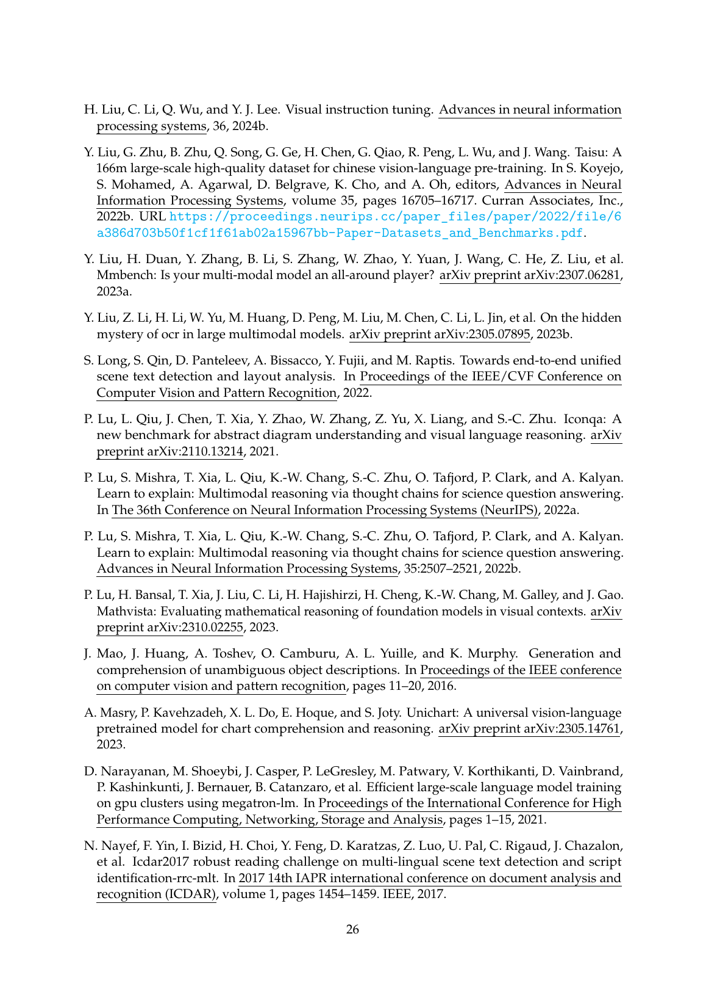

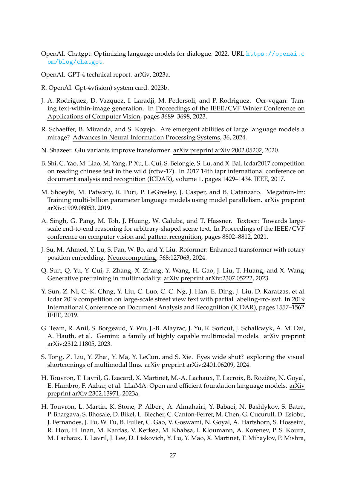

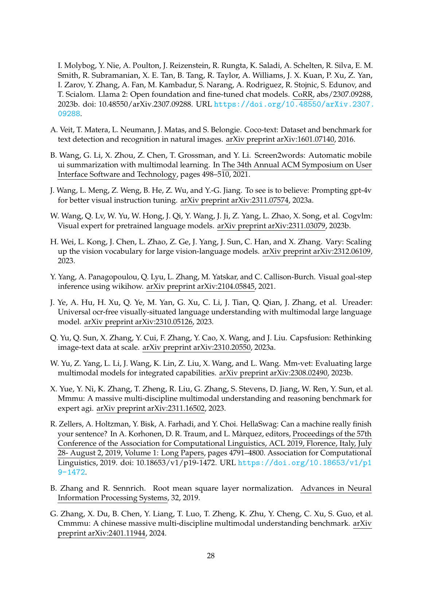

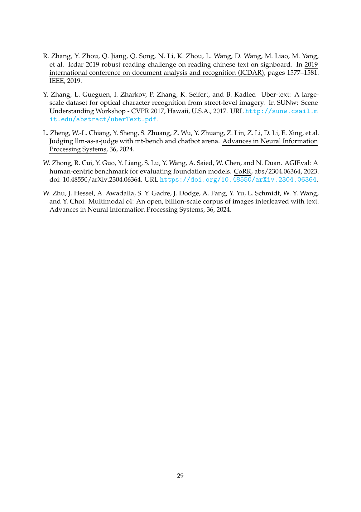

## 附录 A 可视化结果

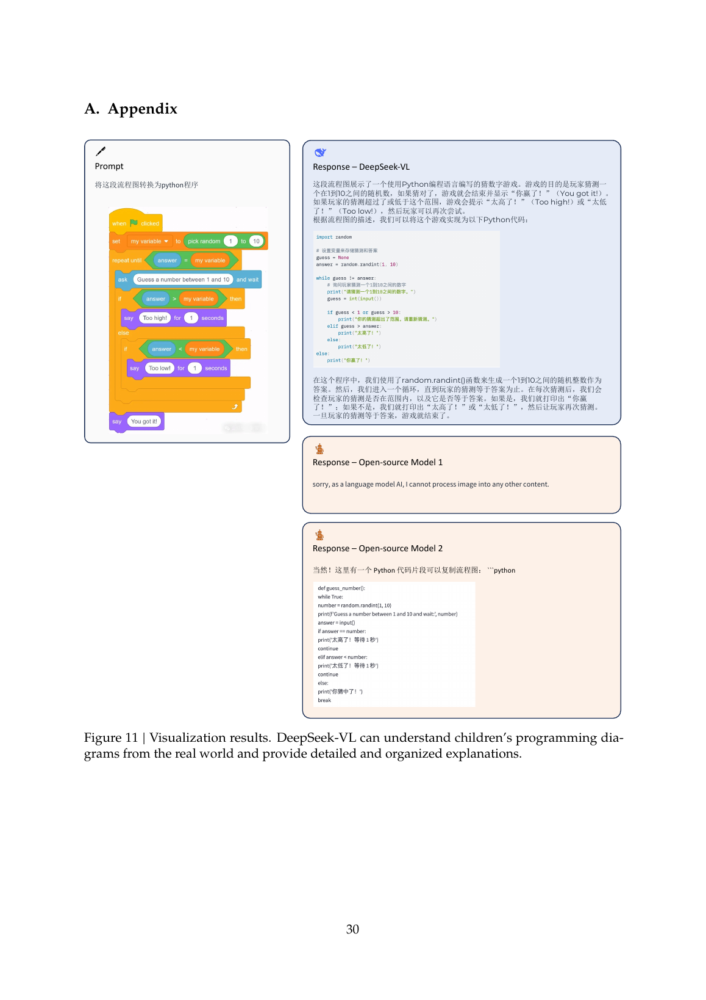

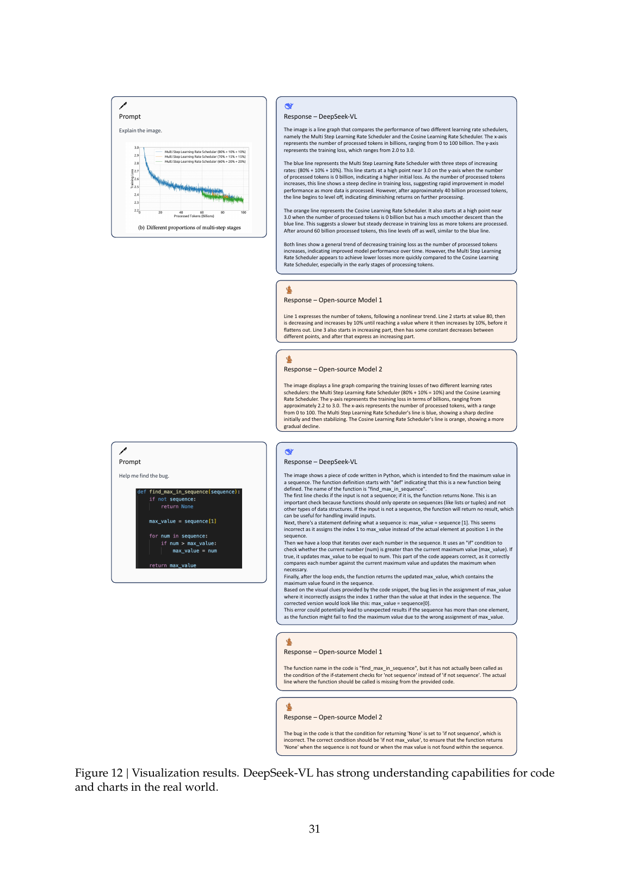

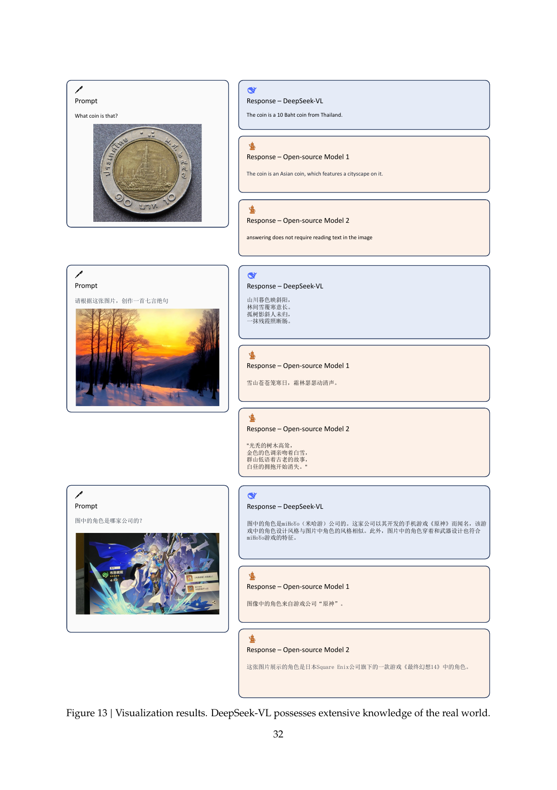

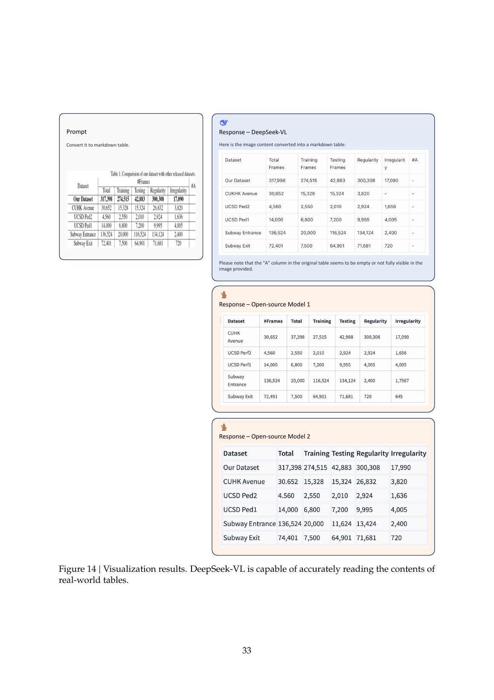
