# DeepSeekMoE：迈向专家混合语言模型中的极致专家专门化

**作者：** Damai Dai、Chengqi Deng、Chenggang Zhao、R.X. Xu、Huazuo Gao、Deli Chen、Jiashi Li、Wangding Zeng、Xingkai Yu、Y. Wu、Zhenda Xie、Y.K. Li、Panpan Huang、Fuli Luo、Chong Ruan、Zhifang Sui、Wenfeng Liang  
**机构：** DeepSeek-AI；北京大学多媒体信息处理全国重点实验室；清华大学交叉信息研究院；南京大学软件新技术全国重点实验室  
**论文版本：** arXiv:2401.06066v1，2024 年 1 月 11 日  
**代码：** https://github.com/deepseek-ai/DeepSeek-MoE  
**译文说明：** 本译文按原论文内容顺序逐段编排，标题、正文、公式说明及图表说明均译为中文；模型名、数据集名与通行技术缩写保留原写法。图、表、参考文献和附录曲线均以对应整页截图保留，并放置在相关正文附近。

## 摘要

在大型语言模型时代，专家混合（MoE）是扩展模型参数规模、同时控制计算成本的一种很有前景的架构。然而，GShard 等传统 MoE 架构从 $N$ 位专家中激活得分最高的 $K$ 位，很难保证专家专门化，也就是让每位专家获得互不重叠、彼此聚焦的知识。为此，我们提出以极致专家专门化为目标的 DeepSeekMoE。它采用两项核心策略：第一，把原有专家细分为 $mN$ 位较小专家，并从中激活 $mK$ 位，使专家组合更加灵活；第二，把 $K_s$ 位专家隔离为始终启用的共享专家，让它们承载共通知识，减少路由专家之间的冗余。从 20 亿参数规模开始，DeepSeekMoE 2B 达到 GShard 2.9B 的水平，而后者的专家参数和计算量均为其 1.5 倍；它还接近总参数量相同的稠密模型，而稠密模型构成 MoE 的性能上界。扩大到 160 亿参数后，DeepSeekMoE 16B 只使用约 40% 的计算量，便达到 LLaMA2 7B 的水平。进一步扩展到 1450 亿参数的初步实验持续验证了它相对 GShard 的显著优势；仅使用 DeepSeek 67B 的 28.5%，甚至可能只有 18.2% 的计算量，就取得了相当的性能。

## 1 引言

近期研究与实践已经从经验上证明，只要训练数据充足，通过增加参数量和计算预算扩展语言模型，便能得到能力显著更强的模型（Brown 等，2020；Hoffmann 等，2022；OpenAI，2023；Touvron 等，2023a）。不过必须承认，把模型扩大到极端规模也会带来极其高昂的计算成本。考虑到这些成本，专家混合（MoE）架构（Jacobs 等，1991；Jordan 和 Jacobs，1994；Shazeer 等，2017）已经成为一种流行方案：它允许扩展参数量，同时把计算成本保持在较低水平。

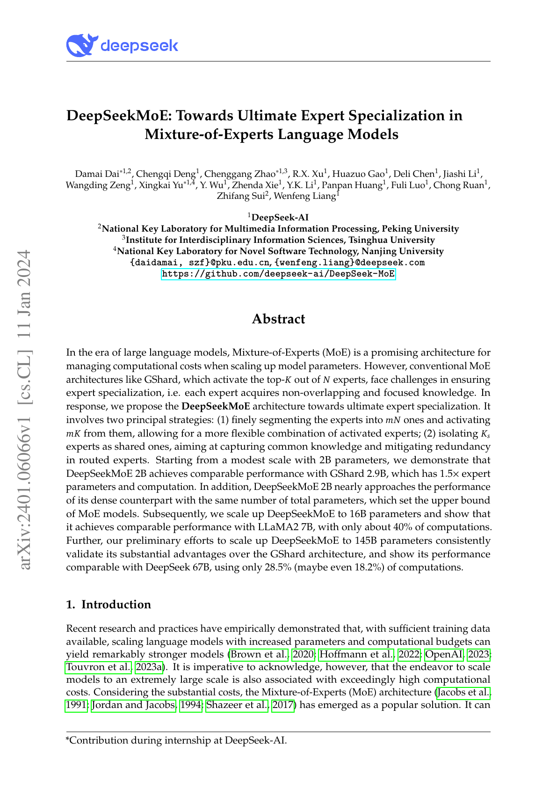

近期把 MoE 架构应用于 Transformer（Vaswani 等，2017）的工作，已经成功把语言模型扩大到相当可观的规模（Du 等，2022；Fedus 等，2021；Lepikhin 等，2021；Zoph，2022），并取得突出性能。这些成果体现了 MoE 语言模型的巨大潜力。

尽管 MoE 前景可观，现有架构仍可能受到知识混杂与知识冗余的影响，从而限制专家专门化，也就是让每位专家获得互不重叠且高度聚焦的知识。传统 MoE 用 MoE 层替换 Transformer 中的前馈网络（FFN）。每个 MoE 层包含多位专家，每位专家在结构上都等同于标准 FFN；每个词元会被分配给一位（Fedus 等，2021）或两位专家（Lepikhin 等，2021）。这种架构存在两个潜在问题：

- **知识混杂。** 现有 MoE 往往只使用数量有限的专家，例如 8 位或 16 位，因此分配给某位专家的词元很可能覆盖多种知识。该专家不得不在同一组参数中聚集差异极大的知识，而这些知识很难同时得到利用。
- **知识冗余。** 分配给不同专家的词元可能需要相同的共通知识。于是，多位专家可能分别在自己的参数中学习同一知识，造成专家参数冗余。

两类问题共同阻碍了现有 MoE 的专家专门化，使其无法达到 MoE 模型的理论性能上界。

作为回应，我们提出 DeepSeekMoE，这是一种专门以极致专家专门化为目标的新型 MoE 架构，包含两项核心策略：

1. **细粒度专家切分。** 在参数量保持不变的情况下，通过切分 FFN 的中间隐藏维度，把专家划分到更细粒度；同时在计算成本不变的情况下，激活更多细粒度专家，使激活专家的组合更加灵活、更具适应性。这样，多种知识可以被更细致地拆分并准确学习到不同专家中，每位专家也能保持更高的专门化程度；组合灵活性的提高还会带来更加准确、更具针对性的知识获取。
2. **共享专家隔离。** 把若干专家单独设为始终激活的共享专家，用于捕获并汇聚不同上下文中的共通知识。共通知识被压缩到共享专家后，其他路由专家之间的冗余便会降低；这不仅提高参数效率，也能让每位路由专家专注于独特知识并保持专门化。

**图 1：DeepSeekMoE 16B 与开源模型在 Open LLM Leaderboard 上的比较。** 红色虚线由除 DeepSeekMoE 16B 外的全部数据点线性拟合而成。DeepSeekMoE 16B 大幅超过激活参数量相近的模型，并达到 LLaMA2 7B 的水平，而后者的激活参数量约为其 2.5 倍。

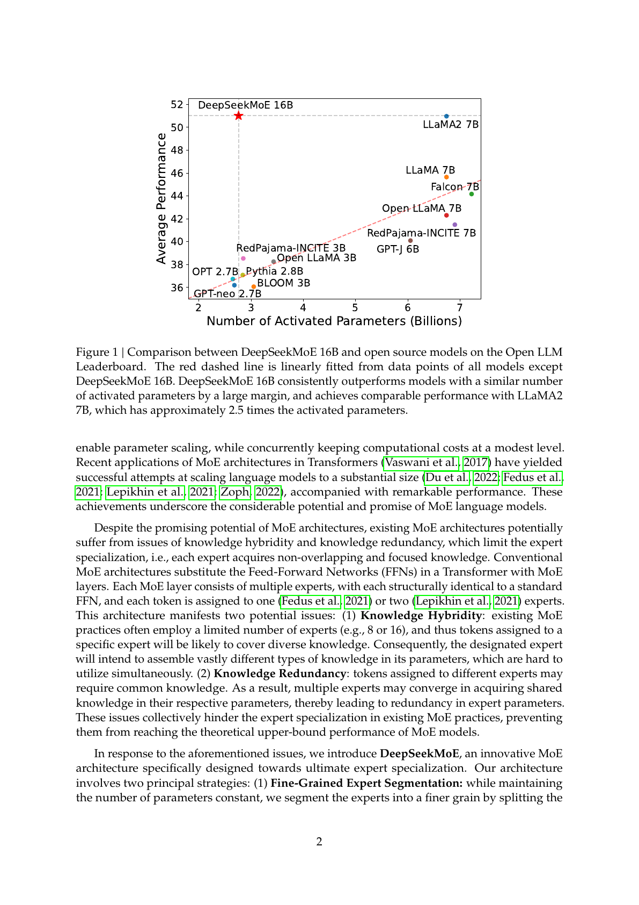

我们从 20 亿参数的小规模模型开始验证 DeepSeekMoE 架构的优势，并在覆盖多种任务的 12 项零样本或少样本基准上评估。结果显示，DeepSeekMoE 2B 大幅超过 GShard 2B，甚至达到更大的 GShard 2.9B 的水平；后者的专家参数量和计算量均为其 1.5 倍。更值得注意的是，DeepSeekMoE 2B 接近总参数量相同的稠密对应模型，而后者构成 MoE 语言模型的严格性能上界。我们还通过细致的消融研究和专家专门化分析，验证细粒度专家切分与共享专家隔离的有效性，并为 DeepSeekMoE 能达到较高专家专门化程度提供经验证据。

随后，我们利用这一架构把模型扩大到 160 亿参数，并在包含 2 万亿词元的大规模语料上训练 DeepSeekMoE 16B。只使用约 40% 的计算量，它便达到在相同 2 万亿词元语料上训练的稠密模型 DeepSeek 7B（DeepSeek-AI，2024）的水平。与开源模型比较时，DeepSeekMoE 16B 也持续大幅超过激活参数量相近的模型，并达到激活参数量约为其 2.5 倍的 LLaMA2 7B（Touvron 等，2023b）的水平；图 1 展示 Open LLM Leaderboard 上的评测结果。我们还通过监督微调（SFT）进行对齐，把模型转化为聊天模型。DeepSeekMoE Chat 16B 在聊天场景下同样达到 DeepSeek Chat 7B 与 LLaMA2 SFT 7B 的水平。

在这些结果鼓舞下，我们进一步初步尝试把 DeepSeekMoE 扩大到 1450 亿参数。实验持续验证了它相对 GShard 架构的显著优势；仅使用 DeepSeek 67B 的 28.5%，甚至可能只有 18.2% 的计算量，便取得了相当的性能。

本文贡献概括如下：

- **架构创新。** 提出以极致专家专门化为目标的 DeepSeekMoE，并采用细粒度专家切分与共享专家隔离两项核心策略。
- **经验验证。** 通过大量实验验证 DeepSeekMoE 的有效性。结果表明，DeepSeekMoE 2B 的专家专门化程度很高，并且接近 MoE 模型的性能上界。
- **可扩展性。** 将 DeepSeekMoE 扩大到 16B；它只用约 40% 的计算量就达到 DeepSeek 7B 与 LLaMA2 7B 的水平。对 145B 的初步扩展也显示出相对 GShard 的持续优势，并达到 DeepSeek 67B 的水平。
- **MoE 对齐。** 成功对 DeepSeekMoE 16B 进行监督微调，得到对齐的聊天模型，展示其适应性与通用性。
- **公开发布。** 为推动开放研究，我们公开 DeepSeekMoE 16B 模型检查点。无需量化，它就可以部署在一张拥有 40GB 显存的 GPU 上。

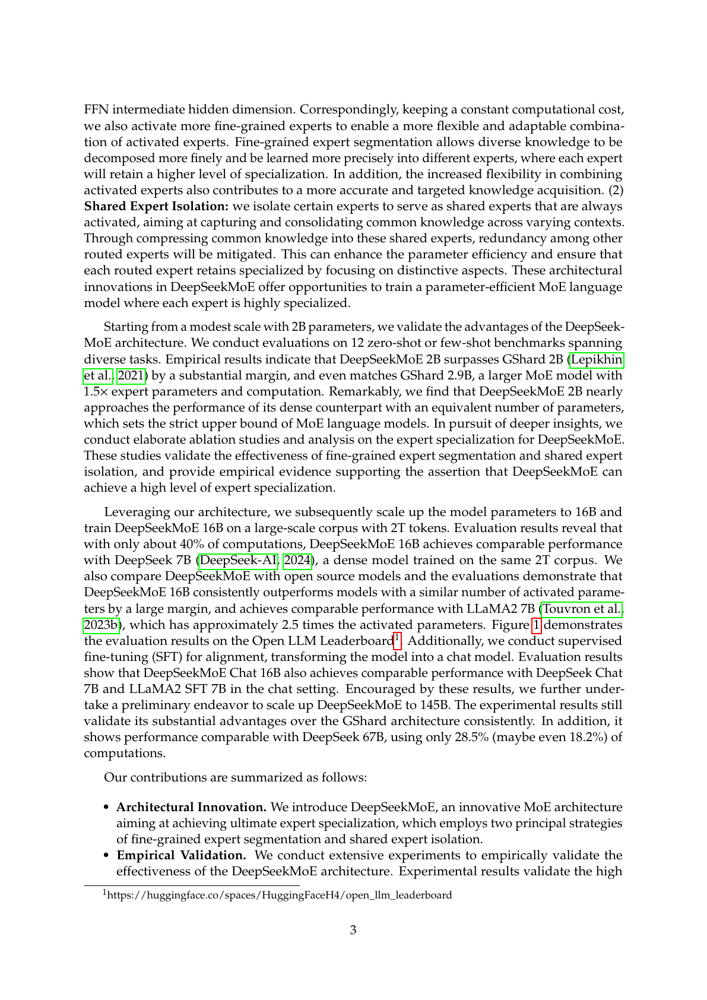

## 2 预备知识：用于 Transformer 的专家混合

首先介绍 Transformer 语言模型中常用的一般 MoE 架构。标准 Transformer 语言模型由 $L$ 层标准 Transformer 模块堆叠而成，每个模块可以表示为：

$$
\mathbf{u}_{1:T}^{l}=\operatorname{Self\text{-}Att}(\mathbf{h}_{1:T}^{l-1})+\mathbf{h}_{1:T}^{l-1}, \tag{1}
$$

$$
\mathbf{h}_{t}^{l}=\operatorname{FFN}(\mathbf{u}_{t}^{l})+\mathbf{u}_{t}^{l}. \tag{2}
$$

其中，$T$ 表示序列长度，$\operatorname{Self\text{-}Att}(\cdot)$ 表示自注意力模块，$\operatorname{FFN}(\cdot)$ 表示前馈网络；$\mathbf{u}_{1:T}^{l}\in\mathbb{R}^{T\times d}$ 是经过第 $l$ 个注意力模块后全部词元的隐藏状态，$\mathbf{h}_t^l\in\mathbb{R}^d$ 是第 $l$ 个 Transformer 模块处理后第 $t$ 个词元的输出隐藏状态。为简洁起见，上式省略层归一化。

构造 MoE 语言模型的一种典型做法，是按指定间隔用 MoE 层替换 Transformer 中的 FFN（Du 等，2022；Fedus 等，2021；Lepikhin 等，2021；Zoph，2022）。MoE 层由多位专家组成，每位专家在结构上等同于标准 FFN；每个词元随后被分配给一位（Fedus 等，2021）或两位专家（Lepikhin 等，2021）。若第 $l$ 个 FFN 被 MoE 层替换，其输出隐藏状态可写为：

$$
\mathbf{h}_{t}^{l}=\sum_{i=1}^{N}\left(g_{i,t}\operatorname{FFN}_i(\mathbf{u}_t^l)\right)+\mathbf{u}_t^l, \tag{3}
$$

$$
g_{i,t}=\begin{cases}
s_{i,t}, & s_{i,t}\in\operatorname{Topk}(\{s_{j,t}\mid 1\leq j\leq N\},K),\\
0, & \text{其他情况},
\end{cases} \tag{4}
$$

$$
s_{i,t}=\operatorname{Softmax}_i((\mathbf{u}_t^l)^T\mathbf{e}_i^l). \tag{5}
$$

这里，$N$ 是专家总数，$\operatorname{FFN}_i(\cdot)$ 是第 $i$ 位专家的 FFN，$g_{i,t}$ 表示第 $i$ 位专家的门值，$s_{i,t}$ 表示词元与专家之间的亲和度；$\operatorname{Topk}(\cdot,K)$ 表示第 $t$ 个词元与全部 $N$ 位专家的亲和度中最高的 $K$ 个分数所构成的集合，$\mathbf{e}_i^l$ 是第 $l$ 层第 $i$ 位专家的中心。$g_{i,t}$ 是稀疏的，$N$ 个门值中只有 $K$ 个非零；这一稀疏性质保证 MoE 层的计算效率，因为每个词元只会被分配给 $K$ 位专家并在其中计算。上式同样为简洁起见省略层归一化。

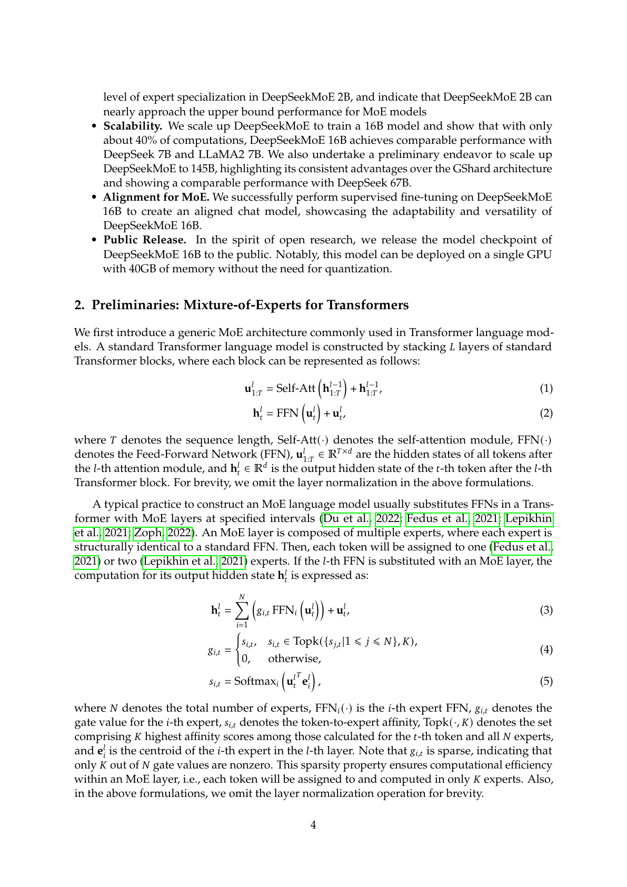

## 3 DeepSeekMoE 架构

在第 2 节的一般 MoE 架构之上，我们提出专门挖掘专家专门化潜力的 DeepSeekMoE。如图 2 所示，它包含细粒度专家切分与共享专家隔离两项核心策略，二者都旨在提高专家专门化程度。

**图 2：DeepSeekMoE 示意图。** 子图（a）是采用传统 Top-2 路由的 MoE 层；子图（b）加入细粒度专家切分；子图（c）进一步加入共享专家隔离，构成完整 DeepSeekMoE。三种架构的专家参数量与计算成本均保持不变。

### 3.1 细粒度专家切分

当专家数量有限时，分配给某位专家的词元更可能覆盖多种知识。结果是，该专家试图在自己的参数中学习差异极大的知识，而这些知识很难同时得到利用。相反，如果每个词元可以路由给更多专家，多种知识便有机会被拆分并分别交由不同专家学习；每位专家仍可保持较高的专门化程度，使知识在专家之间的分布更加聚焦。

为实现这一目标，我们在专家参数量与计算成本保持不变的同时，更细粒度地切分专家。更细的专家切分使激活专家的组合更加灵活、更具适应性。具体而言，在图 2（a）的典型 MoE 架构之上，我们把每位专家的 FFN 切分成 $m$ 位较小专家，方法是把 FFN 中间隐藏维度缩小为原来的 $1/m$。由于每位专家都变小，为保持计算成本不变，我们相应地把激活专家数量扩大到原来的 $m$ 倍，如图 2（b）所示。

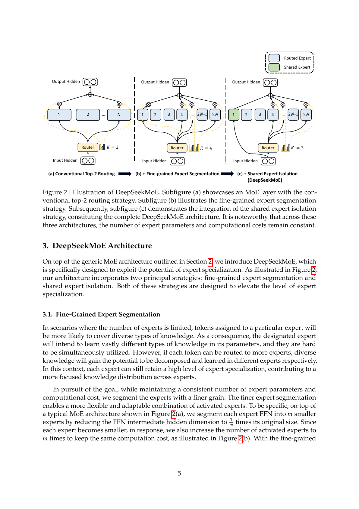

采用细粒度专家切分后，MoE 层输出可表示为：

$$
\mathbf{h}_{t}^{l}=\sum_{i=1}^{mN}\left(g_{i,t}\operatorname{FFN}_i(\mathbf{u}_t^l)\right)+\mathbf{u}_t^l, \tag{6}
$$

$$
g_{i,t}=\begin{cases}
s_{i,t}, & s_{i,t}\in\operatorname{Topk}(\{s_{j,t}\mid1\leq j\leq mN\},mK),\\
0, & \text{其他情况},
\end{cases} \tag{7}
$$

$$
s_{i,t}=\operatorname{Softmax}_i((\mathbf{u}_t^l)^T\mathbf{e}_i^l). \tag{8}
$$

专家参数总量仍等于标准 FFN 参数量的 $N$ 倍，$mN$ 是细粒度专家总数；采用该策略后，非零门值数量也增加到 $mK$。

从组合角度看，细粒度专家切分显著增强了激活专家的组合灵活性。以 $N=16$ 为例，传统 Top-2 路由只有 $\binom{16}{2}=120$ 种可能组合；若把每位专家切分成 4 位较小专家，细粒度路由便可以产生 $\binom{64}{8}=4,426,165,368$ 种可能组合。组合灵活性的剧增，提高了模型更准确、更有针对性地获取知识的潜力。

### 3.2 共享专家隔离

在传统路由策略下，分配给不同专家的词元可能需要某些相同知识或信息。因此，多位专家可能分别在自己的参数中学习同一知识，导致专家参数冗余。如果设置专门捕获并汇聚不同上下文共通知识的共享专家，其他路由专家之间的参数冗余便会减少；这种去冗余会带来参数效率更高、专家专门化程度更强的模型。

为此，在细粒度专家切分之外，我们进一步隔离 $K_s$ 位专家作为共享专家。无论路由模块输出如何，每个词元都会被确定性地分配给这些共享专家。为保持计算成本不变，其他路由专家中被激活的数量会减少 $K_s$，如图 2（c）所示。加入共享专家隔离后，完整 DeepSeekMoE 中的 MoE 层表示为：

$$
\mathbf{h}_{t}^{l}=\sum_{i=1}^{K_s}\operatorname{FFN}_i(\mathbf{u}_t^l)+\sum_{i=K_s+1}^{mN}\left(g_{i,t}\operatorname{FFN}_i(\mathbf{u}_t^l)\right)+\mathbf{u}_t^l, \tag{9}
$$

$$
g_{i,t}=\begin{cases}
s_{i,t}, & s_{i,t}\in\operatorname{Topk}(\{s_{j,t}\mid K_s+1\leq j\leq mN\},mK-K_s),\\
0, & \text{其他情况},
\end{cases} \tag{10}
$$

$$
s_{i,t}=\operatorname{Softmax}_i((\mathbf{u}_t^l)^T\mathbf{e}_i^l). \tag{11}
$$

最终，DeepSeekMoE 有 $K_s$ 位共享专家、$mN-K_s$ 位路由专家，非零门值数量为 $mK-K_s$。值得一提的是，共享专家隔离的原型可追溯到 Rajbhandari 等（2022）；关键区别在于，他们从工程角度得到这一策略，而我们从算法角度出发。

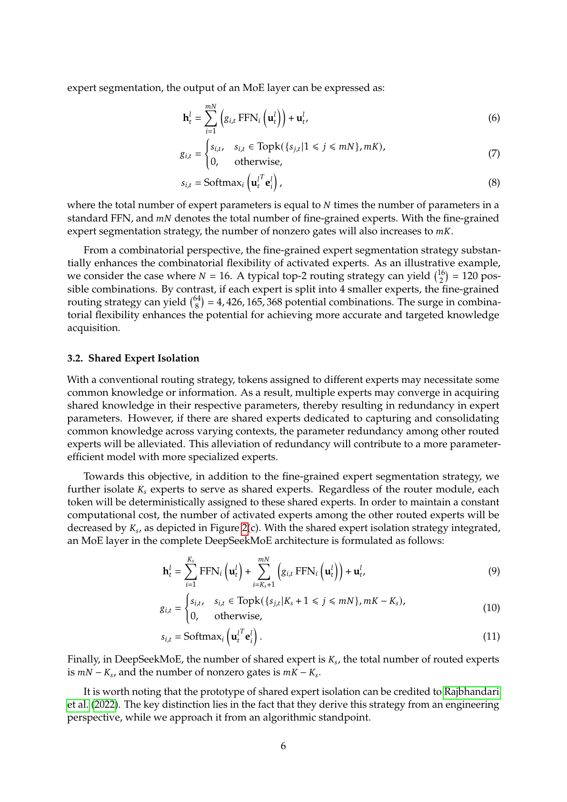

### 3.3 负载均衡考虑

自动学习的路由策略可能遭遇负载不均衡，并表现出两个明显问题。第一，存在路由坍缩风险（Shazeer 等，2017），即模型始终只选择少数专家，使其他专家得不到充分训练；第二，若专家分布在多个设备上，负载不均衡会加重计算瓶颈。

#### 3.3.1 专家级均衡损失

为降低路由坍缩风险，我们采用专家级均衡损失：

$$
\mathcal{L}_{\mathrm{ExpBal}}=\alpha_1\sum_{i=1}^{N'}f_iP_i, \tag{12}
$$

$$
f_i=\frac{N'}{K'T}\sum_{t=1}^{T}\mathbf{1}(\text{词元 }t\text{ 选择专家 }i), \tag{13}
$$

$$
P_i=\frac{1}{T}\sum_{t=1}^{T}s_{i,t}. \tag{14}
$$

其中，$\alpha_1$ 是专家级均衡系数；为简洁起见，$N'=mN-K_s$，$K'=mK-K_s$；$\mathbf{1}(\cdot)$ 是指示函数。

#### 3.3.2 设备级均衡损失

除专家级均衡损失外，我们还引入设备级均衡损失。当目标是缓解计算瓶颈时，没有必要在专家层面施加严格均衡约束，因为过强的负载均衡约束会损害模型性能；首要目标应是保证设备之间计算均衡。若把全部路由专家划分为 $D$ 组 $\{\mathcal{E}_1,\mathcal{E}_2,\ldots,\mathcal{E}_D\}$，并把每组部署到一个设备，设备级均衡损失为：

$$
\mathcal{L}_{\mathrm{DevBal}}=\alpha_2\sum_{i=1}^{D}f_i'P_i', \tag{15}
$$

$$
f_i'=\frac{1}{|\mathcal{E}_i|}\sum_{j\in\mathcal{E}_i}f_j, \tag{16}
$$

$$
P_i'=\sum_{j\in\mathcal{E}_i}P_j. \tag{17}
$$

其中，$\alpha_2$ 是设备级均衡系数。实践中，我们设置较小的专家级均衡系数以降低路由坍缩风险，同时设置更大的设备级均衡系数来促进设备间计算均衡。

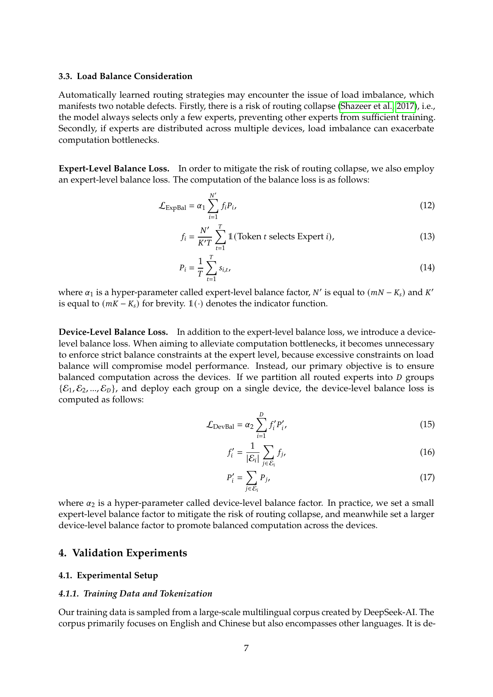

## 4 验证实验

### 4.1 实验设置

#### 4.1.1 训练数据与分词

训练数据采样自 DeepSeek-AI 构建的大规模多语言语料库。语料以英语和中文为主，也包含其他语言，来源包括网页文本、数学材料、代码脚本、出版物以及多种其他文本。验证实验从中采样一个包含 1000 亿词元的子集用于训练。分词方面，我们使用 HuggingFace Tokenizer 工具，在训练语料的一个较小子集上训练字节对编码（BPE）分词器（Sennrich 等，2016）。验证实验使用词表大小为 8K 的分词器；训练更大模型时会进一步扩大词表。

#### 4.1.2 基础设施

实验基于 HAI-LLM（High-Flyer，2023），这是一个高效、轻量的训练框架，集成张量并行（Korthikanti 等，2023；Narayanan 等，2021；Shoeybi 等，2019）、ZeRO 数据并行（Rajbhandari 等，2020）、PipeDream 流水线并行（Harlap 等，2018），以及通过组合数据并行与张量并行实现的专家并行（Lepikhin 等，2021）等多种并行策略。为优化性能，我们使用 CUDA 与 Triton（Tillet 等，2019）开发 GPU 内核，用于门控算法以及融合不同专家中跨线性层的计算。

全部实验都在配备 NVIDIA A100 或 H800 GPU 的集群上进行。A100 集群的每个节点包含 8 张 GPU，并通过 NVLink 桥两两连接；H800 集群同样每节点配备 8 张 GPU，节点内通过 NVLink 与 NVSwitch 互联。两个集群都使用 InfiniBand 在节点之间通信。

#### 4.1.3 超参数

**模型设置。** 验证实验使用 9 层 Transformer，隐藏维度为 1280；多头注意力包含 10 个注意力头，每头维度为 128。所有可学习参数均以标准差 0.006 随机初始化。我们用 MoE 层替换全部 FFN，并保证专家参数总量等于标准 FFN 的 16 倍；包括共享专家参数与被激活路由专家参数在内，激活专家参数保持为标准 FFN 的 2 倍。在该设置下，每个 MoE 模型总参数量约为 20 亿，激活参数量约为 3 亿。

**训练设置。** 使用 AdamW 优化器（Loshchilov 和 Hutter，2019），$\beta_1=0.9$、$\beta_2=0.95$、`weight_decay=0.1`。学习率采用预热加阶梯衰减：前 2000 步从 0 线性增长到最大值，在总训练步数的 80% 与 90% 位置分别乘以 0.316。验证实验最大学习率为 $1.08\times10^{-3}$，梯度裁剪范数为 1.0。批量大小为 2K，最大序列长度为 2K，因此每批包含 400 万词元；总训练步数为 25,000，对应 1000 亿训练词元。由于数据充足，训练不使用 dropout。

模型规模较小，因此包括专家参数在内的全部参数都部署在一张 GPU 上，以避免计算不均衡；相应地，训练不丢弃任何词元，也不使用设备级均衡损失。为防止路由坍缩，专家级均衡系数设为 0.01。附录 A 还给出不同规模 DeepSeekMoE 超参数的汇总表。

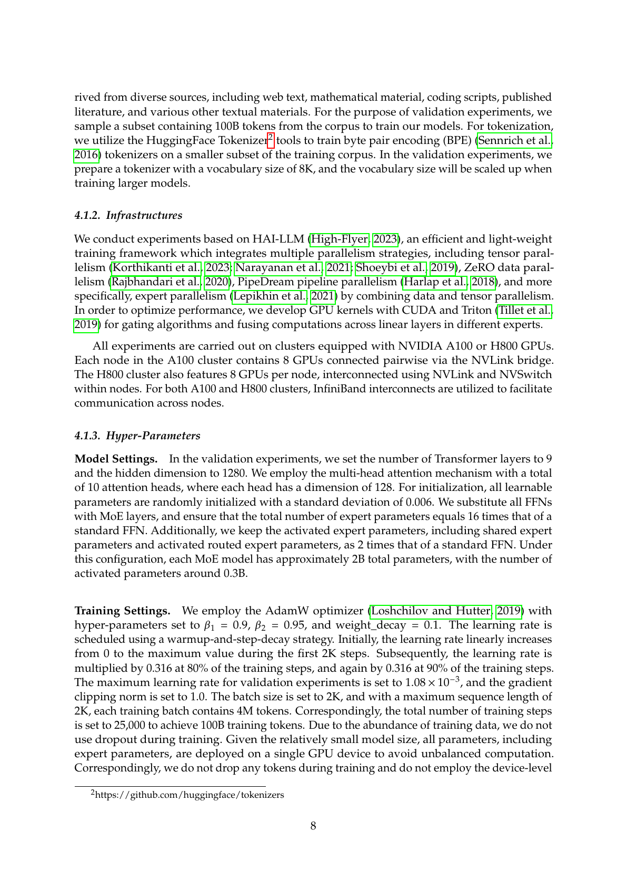

#### 4.1.4 评估基准

评估覆盖多种任务：

- **语言建模。** 在 Pile（Gao 等，2020）测试集上评估，指标为交叉熵损失。
- **语言理解与推理。** 使用 HellaSwag（Zellers 等，2019）、PIQA（Bisk 等，2020）、ARC-Challenge 与 ARC-Easy（Clark 等，2018），指标为准确率。
- **阅读理解。** 使用 RACE-High 与 RACE-Middle（Lai 等，2017），指标为准确率。
- **代码生成。** 使用 HumanEval（Chen 等，2021）与 MBPP（Austin 等，2021），指标为 Pass@1，即只生成一次时的通过率。
- **闭卷问答。** 使用 TriviaQA（Joshi 等，2017）与 NaturalQuestions（Kwiatkowski 等，2019），指标为完全匹配率（EM）。

### 4.2 评估结果

**基线。** 验证实验比较包括 DeepSeekMoE 在内的五个模型。Dense 是总参数量 2 亿的标准稠密 Transformer。Hash Layer（Roller 等，2021）采用 Top-1 哈希路由，总参数量 20 亿、激活参数量 2 亿，与稠密基线对齐。Switch Transformer（Fedus 等，2021）采用可学习 Top-1 路由，总参数量和激活参数量与 Hash Layer 相同。GShard（Lepikhin 等，2021）采用可学习 Top-2 路由，由于比 Top-1 多激活一位专家，总参数量为 20 亿、激活参数量为 3 亿。DeepSeekMoE 包含 1 位共享专家和 63 位路由专家，每位专家的大小为标准 FFN 的 0.25 倍。所有模型使用相同训练语料与训练超参数；全部 MoE 模型的总参数量相同，GShard 与 DeepSeekMoE 的激活参数量也相同。

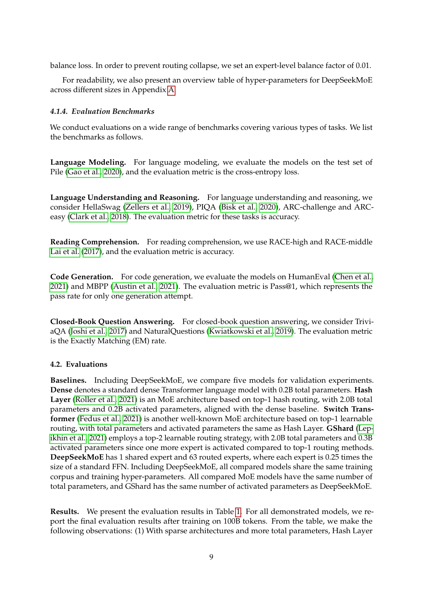

**结果。** 表 1 报告各模型训练 1000 亿词元后的最终结果。由此可见：第一，借助稀疏架构和更多总参数量，Hash Layer 与 Switch Transformer 在激活参数量与稠密基线相同的情况下明显更强；第二，GShard 的激活参数量高于 Hash Layer 与 Switch Transformer，表现略优于 Switch Transformer；第三，在总参数量和激活参数量相同的情况下，DeepSeekMoE 相对 GShard 显示出压倒性优势。这些结果说明，在现有 MoE 架构中，DeepSeekMoE 具有明显优越性。

**表 1：验证实验结果。** 粗体表示最佳结果。与其他 MoE 架构相比，DeepSeekMoE 显示出显著性能优势。

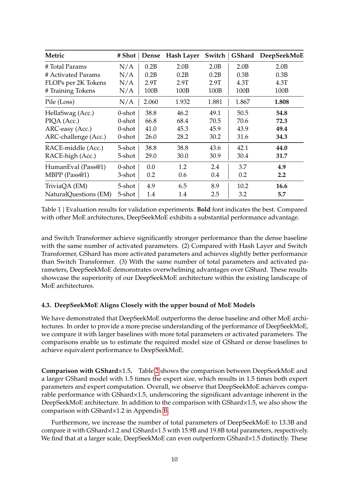

### 4.3 DeepSeekMoE 接近 MoE 模型上界

前文已经证明 DeepSeekMoE 超过稠密基线及其他 MoE 架构。为了更准确理解其性能，我们进一步将它与总参数量或激活参数量更大的基线比较，由此估算 GShard 或稠密基线需要扩大到多大，才能达到与 DeepSeekMoE 相同的表现。

#### 4.3.1 与 GShard×1.5 比较

表 2 比较 DeepSeekMoE 与专家规模扩大 1.5 倍的 GShard；后者的专家参数量与专家计算量也都扩大到 1.5 倍。总体来看，DeepSeekMoE 达到 GShard×1.5 的水平，体现该架构自身的显著优势。附录 B 还给出与 GShard×1.2 的比较。

我们也把 DeepSeekMoE 总参数量提高到 133 亿，并与总参数量分别为 159 亿与 198 亿的 GShard×1.2、GShard×1.5 比较。在更大规模下，DeepSeekMoE 甚至明显超过 GShard×1.5，结果同样见附录 B。

#### 4.3.2 与 Dense×16 比较

表 2 还比较 DeepSeekMoE 与更大的稠密模型。为了公平，不采用注意力参数与 FFN 参数之间常见的 1:2 比例，而是设置 16 位共享专家，每位专家的参数量都等于一个标准 FFN，从而模拟 FFN 参数量为标准模型 16 倍的稠密模型。结果显示，DeepSeekMoE 接近 Dense×16，而从模型容量角度看，Dense×16 构成 MoE 模型的严格上界。这说明至少在约 20 亿参数、1000 亿训练词元的规模上，DeepSeekMoE 已接近 MoE 的理论性能上界。附录 B 还给出与 Dense×4 的比较。

**表 2：DeepSeekMoE、更大 GShard 与更大稠密模型的比较。** “专家数”一行中的 $a+b$ 表示 $a$ 位共享专家与 $b$ 位路由专家；“激活专家数”中的 $a+b$ 表示激活 $a$ 位共享专家与 $b$ 位路由专家。DeepSeekMoE 达到专家参数与计算量为其 1.5 倍的 GShard 的水平；同时，它接近 FFN 参数量为标准模型 16 倍的稠密模型，而后者构成 MoE 模型容量上界。

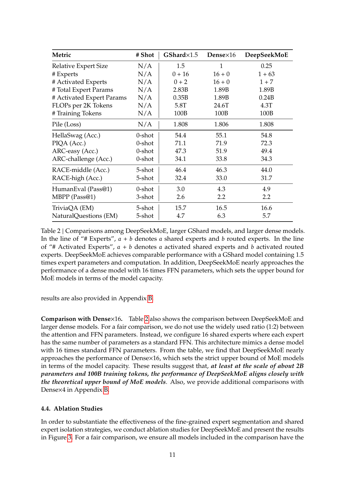

### 4.4 消融研究

为验证细粒度专家切分与共享专家隔离的有效性，我们对 DeepSeekMoE 进行消融研究，结果见图 3。为保证公平，所有比较模型的总参数量与激活参数量都相同。

**共享专家隔离。** 为评估共享专家隔离的影响，我们在 GShard 基础上把一位专家隔离为共享专家。图 3 显示，相比 GShard，主动隔离共享专家改善了大多数基准上的表现，说明该策略确实能增强模型性能。

**细粒度专家切分。** 为评估该策略，我们进一步把专家切分到更细粒度：每位专家被切成 2 位或 4 位较小专家，最终分别得到 32 位专家（1 位共享、31 位路由）或 64 位专家（1 位共享、63 位路由）。图 3 呈现出一致趋势：专家切分粒度越细，整体模型性能越强。这为细粒度专家切分的有效性提供了经验证据。

**共享专家与路由专家的比例。** 在总计 64 位专家的最细粒度设置下，我们保持总专家数与激活专家数不变，分别隔离 1、2、4 位共享专家。不同共享/路由比例并未显著影响性能，三种设置在 Pile 上的损失分别为 1.808、1.806 与 1.811。由于共享专家与激活路由专家之比为 1:3 时 Pile 损失略好，扩大 DeepSeekMoE 时我们保持这一比例。

**图 3：DeepSeekMoE 消融研究。** 为了清晰展示，图中以各项最佳成绩对性能归一化。全部模型具有相同总参数量与激活参数量；细粒度专家切分和共享专家隔离都能增强整体性能。

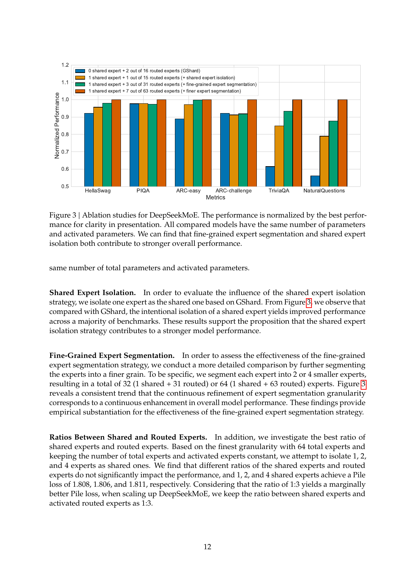

### 4.5 专家专门化分析

本节对 DeepSeekMoE 2B 的专家专门化进行经验分析。这里的 DeepSeekMoE 2B 指表 1 中总参数量 20 亿、包含 1 位共享专家，并从 63 位路由专家中激活 7 位的模型。

#### 4.5.1 路由专家之间冗余更低

为了评估路由专家之间的冗余，我们禁用不同比例的高分路由专家，再评估 Pile 损失。具体而言，对每个词元先屏蔽一定比例、路由概率最高的专家，再从剩余路由专家中选择 Top-K。为保证公平，我们与 GShard×1.5 比较，因为未禁用专家时两者的 Pile 损失相同。图 4 显示，DeepSeekMoE 对禁用高分路由专家更加敏感。这表明其参数冗余更低，因为每位路由专家都更加不可替代；GShard×1.5 的专家参数冗余更高，因此禁用高分专家时能够缓冲性能下降。

**图 4：禁用不同比例高分路由专家时的 Pile 损失。** DeepSeekMoE 对禁用比例更加敏感，说明其路由专家之间冗余更低。

#### 4.5.2 共享专家无法由路由专家替代

为研究共享专家的作用，我们禁用它，同时多激活一位路由专家。即使计算成本不变，Pile 损失仍从 1.808 显著升至 2.414。这突出了共享专家的关键功能：它获取了没有与路由专家重复的基础、必要知识，因此无法被路由专家替代。

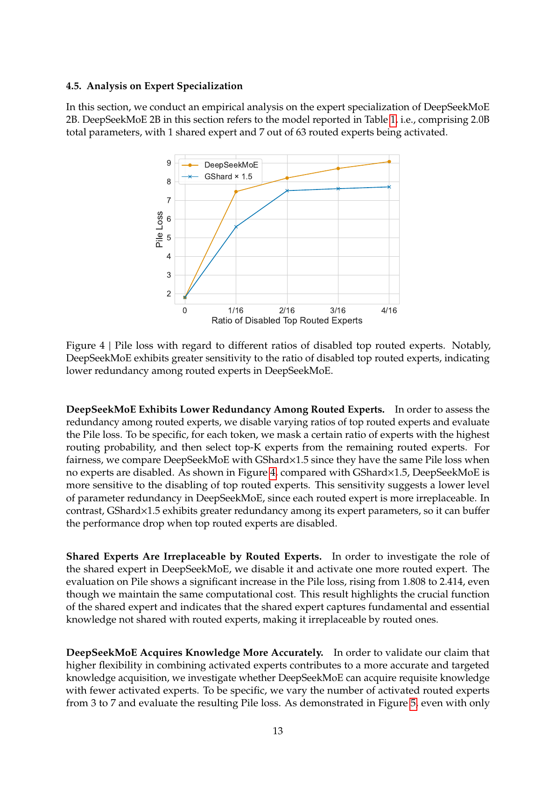

#### 4.5.3 DeepSeekMoE 更准确地获取知识

为验证“更灵活的专家组合有助于更准确、更有针对性地获取知识”，我们研究 DeepSeekMoE 能否用更少的激活专家取得所需知识。具体做法是把激活路由专家数量从 3 位变到 7 位，并评估对应 Pile 损失。如图 5 所示，即使只激活 4 位路由专家，DeepSeekMoE 的 Pile 损失也能与 GShard 相当。这支持 DeepSeekMoE 可以更准确、更高效地获取所需知识这一判断。

**图 5：DeepSeekMoE 激活不同数量路由专家时的 Pile 损失。** 只激活 4 位路由专家，DeepSeekMoE 便达到 GShard 的 Pile 损失水平。

受上述发现鼓舞，为了更严格验证专家专门化和知识获取准确性，我们从头训练一个新模型。该模型包含 1 位共享专家和 63 位路由专家，但只激活 3 位路由专家。图 6 显示，在总专家参数量相同、激活专家参数量只有一半的情况下，DeepSeekMoE 仍然超过 GShard。这体现出它能更高效地利用专家参数，也就是说，激活专家中有效参数所占比例远高于 GShard。

**图 6：GShard 与仅激活一半专家的 DeepSeekMoE 比较。** 两者总专家参数量相同，但 DeepSeekMoE 的激活专家参数量只有一半，性能仍然更好。

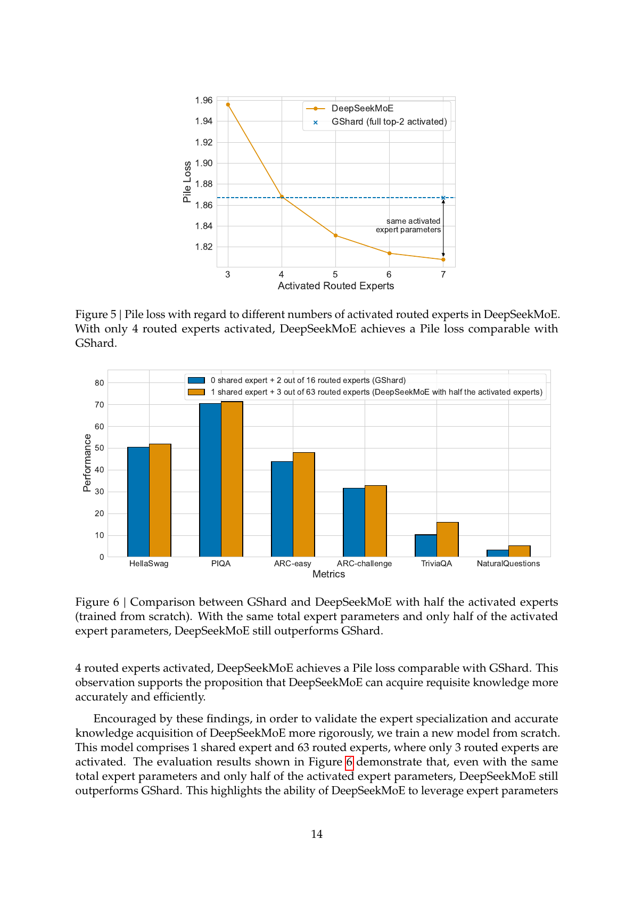

## 5 扩展到 DeepSeekMoE 16B

借助 DeepSeekMoE 架构，我们把 MoE 模型扩大到总计 160 亿参数，并在 2 万亿词元上训练。结果表明，相比 LLaMA2 7B，DeepSeekMoE 16B 只使用约 40% 的计算量便取得更好性能。

### 5.1 实验设置

#### 5.1.1 训练数据与分词

训练数据仍来自 4.1.1 节所述语料库。与验证实验不同的是，这里采样 2 万亿词元，与 LLaMA2 7B 的训练词元数量对齐。分词器同样使用 HuggingFace Tokenizer 训练 BPE，但 DeepSeekMoE 16B 的词表大小扩大到 100K。

#### 5.1.2 超参数

**模型设置。** DeepSeekMoE 16B 使用 28 层 Transformer，隐藏维度为 2048；多头注意力包含 16 个注意力头，每头维度 128。全部可学习参数以标准差 0.006 随机初始化。除第一层外，所有 FFN 都替换为 MoE 层，因为我们观察到第一层的负载均衡状态收敛尤其慢。每个 MoE 层包含 2 位共享专家和 64 位路由专家，每位专家为标准 FFN 的 0.25 倍；每个词元都会路由到 2 位共享专家和 64 位路由专家中的 6 位。没有采用更细切分，是因为专家过小可能降低计算效率；在超过 16B 的规模上仍可使用更细粒度。最终模型总参数量约 164 亿，激活参数量约 28 亿。

**训练设置。** 使用 AdamW，$\beta_1=0.9$、$\beta_2=0.95$、`weight_decay=0.1`。学习率同样采用预热加阶梯衰减：前 2000 步线性预热，在总训练步数的 80% 和 90% 位置分别乘以 0.316。最大学习率为 $4.2\times10^{-4}$，梯度裁剪范数为 1.0。批量大小为 4.5K，最大序列长度为 4K，每批包含 1800 万词元；训练 106,449 步，共处理 2 万亿词元。训练不使用 dropout。

我们通过流水线并行把不同模型层部署到不同设备，同一层的全部专家仍放在同一设备。因此训练不丢弃词元，也不使用设备级均衡损失。为防止路由坍缩，专家级均衡系数设为很小的 0.001；因为在这种并行策略下，更大的专家级均衡系数不会提高计算效率，反而会损害模型性能。

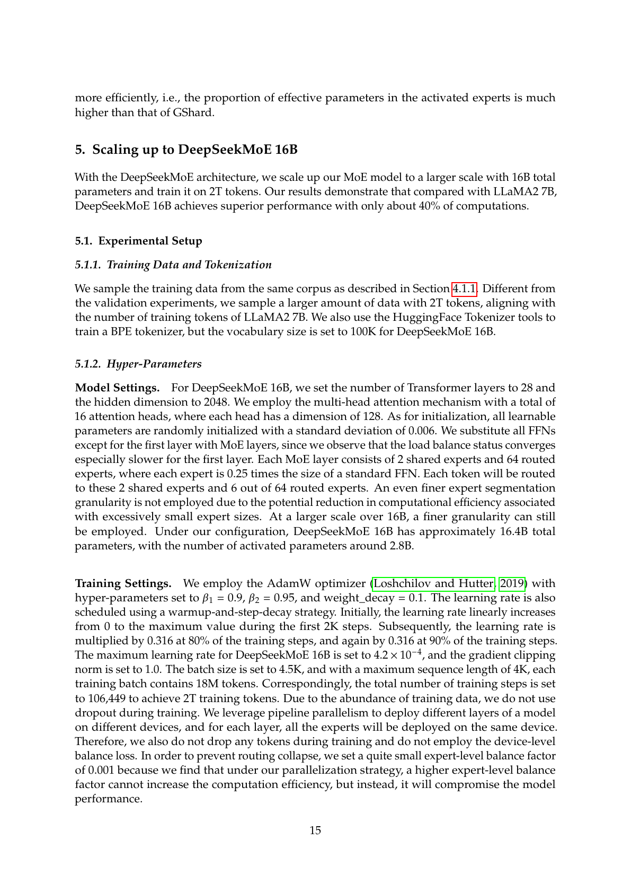

#### 5.1.3 评估基准

除验证实验使用的基准外，我们增加以下任务，以进行更全面的评估：

- **语言建模。** 仍使用 Pile 测试集。由于 DeepSeekMoE 16B 与 LLaMA2 7B 的分词器不同，为公平比较采用每字节比特数（BPB）。
- **阅读理解。** 新增 DROP（Dua 等，2019），指标为完全匹配率。
- **数学推理。** 新增 GSM8K（Cobbe 等，2021）与 MATH（Hendrycks 等，2021），指标为完全匹配率。
- **多学科选择题。** 新增 MMLU（Hendrycks 等，2020），指标为准确率。
- **消歧。** 新增 WinoGrande（Sakaguchi 等，2019），指标为准确率。
- **中文基准。** 由于模型在双语语料上预训练，还使用四项中文基准：CLUEWSC（Xu 等，2020）是中文消歧基准；CEval（Huang 等，2023）与 CMMLU（Li 等，2023）是形式类似 MMLU 的中文多学科选择题基准；CHID（Zheng 等，2019）是中文成语完形填空基准，用于评估对中华文化的理解。指标为准确率或完全匹配率。
- **Open LLM Leaderboard。** 内部评估框架运行上述基准；为了方便、公平地与开源模型比较，还在 HuggingFace 的 Open LLM Leaderboard 上评估。该榜单包含 ARC、HellaSwag、MMLU、TruthfulQA、WinoGrande 与 GSM8K 六项任务。

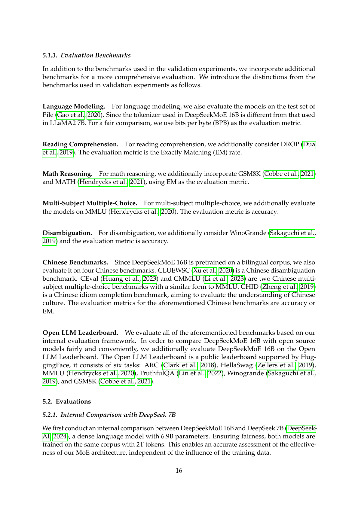

### 5.2 评估结果

#### 5.2.1 与 DeepSeek 7B 的内部比较

首先将 DeepSeekMoE 16B 与拥有 69 亿参数的稠密模型 DeepSeek 7B（DeepSeek-AI，2024）进行内部比较。为保证公平，两者都在同一套 2 万亿词元语料上训练，从而可以排除训练数据影响，准确评估 MoE 架构本身的有效性。

**表 3：DeepSeek 7B 与 DeepSeekMoE 16B 比较。** 粗体表示最佳或接近最佳的结果。只使用 40.5% 的计算量，DeepSeekMoE 16B 便达到 DeepSeek 7B 的整体水平。

评估结果带来三点观察。第一，整体而言，DeepSeekMoE 16B 只用约 40% 的计算量就达到 DeepSeek 7B 的水平。第二，它在语言建模与知识密集型任务上优势明显，包括 Pile、HellaSwag、TriviaQA 与 NaturalQuestions。由于 MoE 模型中的 FFN 参数远多于注意力参数，这与 Transformer 的 FFN 具备知识记忆能力这一观点一致（Dai 等，2022a）。第三，与其他任务上的优秀表现相比，DeepSeekMoE 在选择题任务上存在不足。这源于 DeepSeekMoE 16B 的注意力参数有限：它只有约 5 亿注意力参数，而 DeepSeek 7B 有 25 亿。此前对 DeepSeek 7B 的研究已经发现注意力容量与选择题性能正相关；例如，采用多查询注意力（Shazeer，2019）的 DeepSeek 7B MQA 同样不擅长 MMLU 类任务。附录 C 还给出两种模型训练过程中的基准曲线。

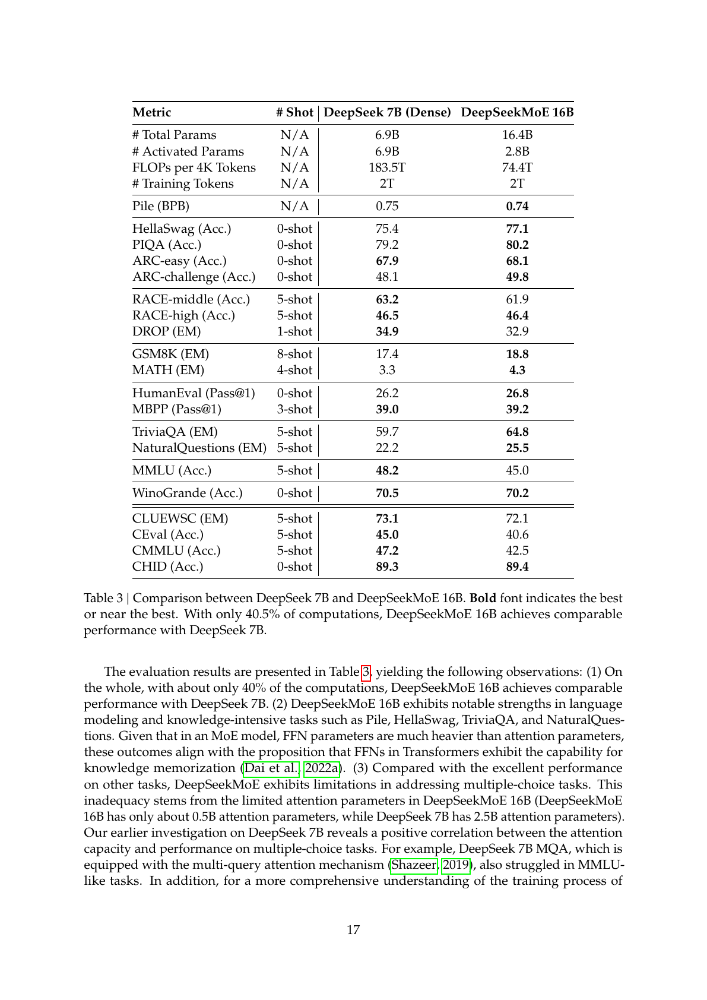

至关重要的是，DeepSeekMoE 16B 参数量适中，因此可以部署在一张拥有 40GB 显存的 GPU 上。经过适当算子优化，它的推理速度可以达到 7B 稠密模型的近 2.5 倍。

#### 5.2.2 与开源模型比较

**与 LLaMA2 7B 的内部比较。** 在开源模型中，我们主要与拥有 67 亿参数的知名强模型 LLaMA2 7B（Touvron 等，2023b）比较。两者均在 2 万亿词元上预训练。DeepSeekMoE 的总参数量是 LLaMA2 7B 的 245%，但所需计算量只有后者的 39.6%。表 4 的内部基准结果显示：第一，只使用约 40% 的计算量，DeepSeekMoE 16B 便在大多数基准上超过 LLaMA2 7B；第二，由于预训练语料含有更丰富的数学与代码文本，它的数学推理和代码生成能力更强；第三，由于语料包含中文，它在中文基准上具有巨大优势；第四，尽管训练所用英语文本更少，它在英语理解或知识密集型基准上仍达到或超过 LLaMA2 7B，体现出很强能力。

**表 4：LLaMA2 7B 与 DeepSeekMoE 16B 比较。** 只使用 39.6% 的计算量，DeepSeekMoE 16B 在大多数基准上超过 LLaMA2 7B。

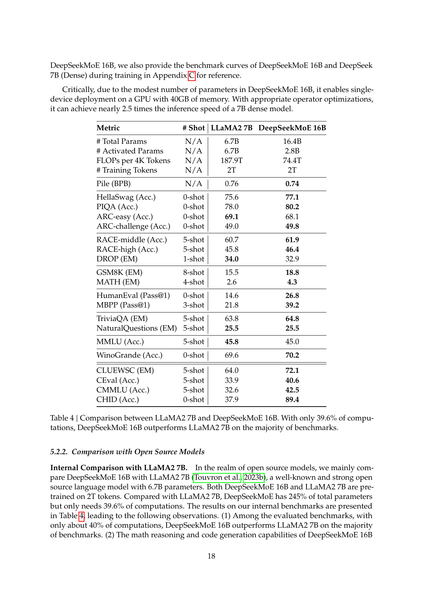

**Open LLM Leaderboard 评估。** 除内部评估外，我们还在 Open LLM Leaderboard 上评估 DeepSeekMoE 16B，并与更多开源模型比较，包括 LLaMA 7B、Falcon 7B、GPT-J 6B、RedPajama-INCITE 7B/3B、Open LLaMA 7B/3B、OPT 2.7B、Pythia 2.8B、GPT-neo 2.7B 与 BLOOM 3B。图 1 显示，DeepSeekMoE 16B 持续大幅超过激活参数量相近的模型，并达到激活参数量约为其 2.5 倍的 LLaMA2 7B 的水平。

## 6 DeepSeekMoE 16B 的对齐

以往研究指出，MoE 模型通常无法从微调中获得显著收益（Artetxe 等，2022；Fedus 等，2021）；但 Shen 等（2023）发现 MoE 确实可以受益于指令微调。为了评估 DeepSeekMoE 16B 能否从微调获益，我们对它进行监督微调并构建聊天模型。结果显示，DeepSeekMoE Chat 16B 也达到 LLaMA2 SFT 7B 与 DeepSeek Chat 7B 的水平。

### 6.1 实验设置

**训练数据。** 在内部整理的 140 万条训练样本上进行监督微调，内容覆盖数学、代码、写作、问答、推理、摘要等广泛类别。大多数 SFT 数据为英语和中文，因此聊天模型可以灵活用于双语场景。

**超参数。** 批量大小为 1024 条样本，使用 AdamW 训练 8 个周期。最大序列长度为 4K，并尽可能把训练样本紧密打包到长度上限。监督微调不使用 dropout，学习率固定为 $10^{-5}$，不采用学习率调度。

**评估基准。** 聊天模型使用与 5.1.3 节相近的基准，但有三项调整：第一，聊天模型很少用于纯语言建模，因此移除 Pile；第二，CHID 结果不稳定、难以得出可靠结论，因此移除；第三，新增 BBH（Suzgun 等，2022），以更全面评估聊天模型的推理能力。

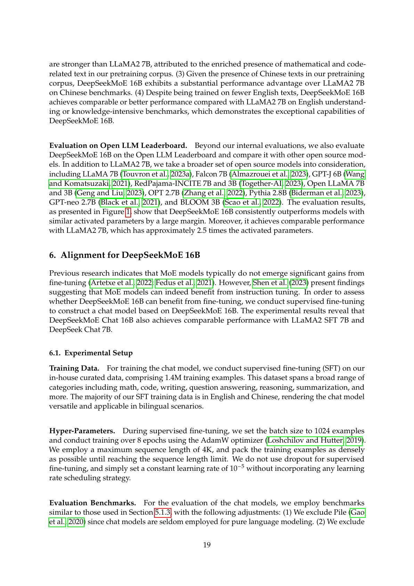

### 6.2 评估结果

**基线。** 为验证 DeepSeekMoE 16B 对齐后的潜力，我们使用完全相同的微调数据分别监督微调 LLaMA2 7B、DeepSeek 7B 与 DeepSeekMoE 16B，以保证公平，并得到 LLaMA2 SFT 7B、DeepSeek Chat 7B 与 DeepSeekMoE Chat 16B 三个聊天模型。随后在大量下游任务上，将 DeepSeekMoE Chat 16B 与另外两个 FLOPs 约为其 2.5 倍的稠密聊天模型比较。这里使用“LLaMA2 SFT”这一名称，是为了与官方 LLaMA2 Chat 区分。

**表 5：三种聊天模型的比较。** 三者使用相同 SFT 数据微调。与两个 7B 稠密模型相比，DeepSeekMoE Chat 16B 只用约 40% 的计算量，仍在大多数基准上达到相当或更好的表现。

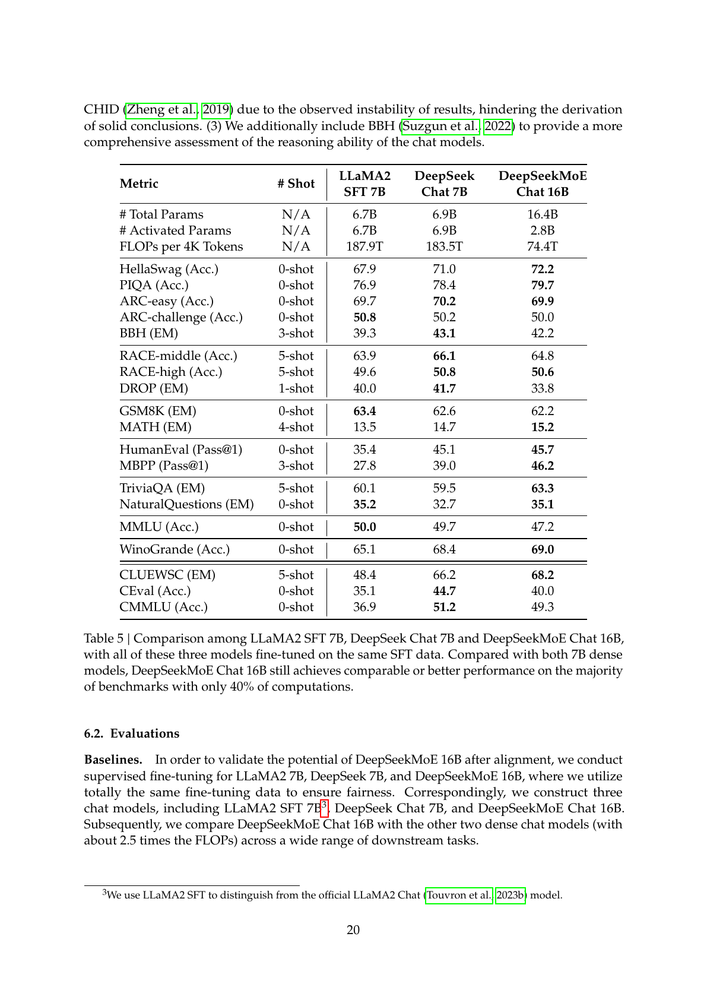

结果带来四点观察：

1. DeepSeekMoE Chat 16B 只消耗接近 40% 的计算量，便在语言理解与推理（PIQA、ARC、BBH）、机器阅读理解（RACE）、数学（GSM8K、MATH）以及知识密集型任务（TriviaQA、NaturalQuestions）上达到 7B 稠密模型的水平。
2. 在代码生成上，它在 HumanEval 与 MBPP 上明显超过 LLaMA2 SFT 7B，也超过 DeepSeek Chat 7B。
3. 在 MMLU、CEval、CMMLU 等选择题基准上，它仍落后于 DeepSeek Chat 7B，这与基座模型的观察一致；不过监督微调后，两者差距有所缩小。
4. 得益于双语语料预训练，它在全部中文基准上明显超过 LLaMA2 SFT 7B，体现中英文能力的均衡性，也提高了在不同场景中的通用性。

总体而言，聊天模型评估表明 DeepSeekMoE 16B 能够从对齐中获益，并继续保持“只用约 40% 计算量便达到稠密模型水平”的优势。

## 7 正在推进的 DeepSeekMoE 145B

在 DeepSeekMoE 16B 的优秀表现鼓舞下，我们初步尝试把模型扩大到 145B。该初始研究只训练了 2450 亿词元，但已经显示出相对 GShard 的持续优势，并有望达到或超过稠密模型 DeepSeek 67B。最终版本完成全部训练后，我们也计划公开发布 DeepSeekMoE 145B。

### 7.1 实验设置

**训练数据与分词。** 使用与 DeepSeekMoE 16B 完全相同的训练语料与分词器；唯一不同是初步研究中的 DeepSeekMoE 145B 只训练 2450 亿词元。

**模型设置。** 使用 62 层 Transformer，隐藏维度 4096；多头注意力包含 32 个注意力头，每头维度 128。全部可学习参数以标准差 0.006 随机初始化。与 16B 一样，除第一层外所有 FFN 都替换为 MoE 层。每个 MoE 层包含 4 位共享专家与 128 位路由专家，每位专家为标准 FFN 的 0.125 倍；每个词元会路由到 4 位共享专家和 128 位路由专家中的 12 位。最终总参数量约 1446 亿，激活参数量约 222 亿。

**训练设置。** 使用 AdamW，$\beta_1=0.9$、$\beta_2=0.95$、`weight_decay=0.1`；初步研究采用预热加恒定学习率：前 2000 步从 0 线性增长到最大值，随后保持不变。最大学习率为 $3.0\times10^{-4}$，梯度裁剪范数为 1.0。批量大小为 4.5K，最大序列长度 4K，每批 1800 万词元；训练 13,000 步，共处理 2450 亿词元，不使用 dropout。

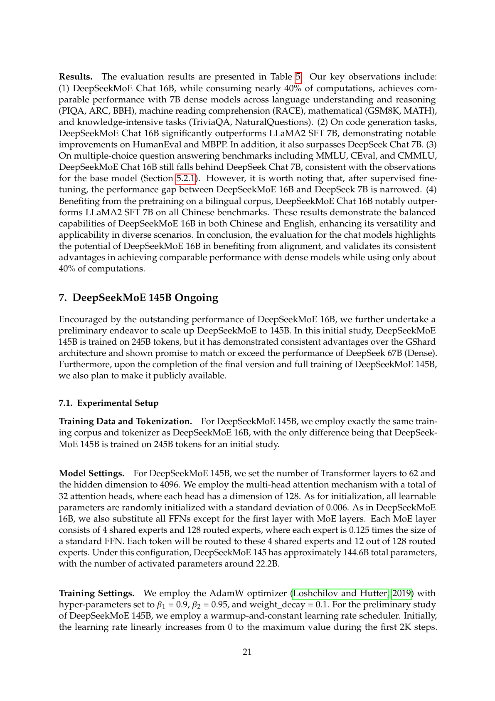

训练采用流水线并行把不同层部署到不同设备；每层全部路由专家均匀部署在 4 个设备上，即把专家并行与数据并行结合。由于使用专家并行，需要考虑设备级负载均衡以降低计算瓶颈，因此设备级均衡系数设为 0.05；专家级均衡系数仍设为较小的 0.003，以防路由坍缩。

**评估基准。** 使用与 DeepSeekMoE 16B 完全相同的内部基准，见 5.1.3 节。

### 7.2 评估结果

**基线。** 除 DeepSeekMoE 145B 外，还比较三个模型。DeepSeek 67B（Dense）是总参数量 674 亿的稠密模型。GShard 137B 与 DeepSeekMoE 145B 使用相同隐藏维度与层数，但采用 GShard 架构；由于 DeepSeekMoE 145B 为提高计算效率，把每位专家的中间隐藏维度对齐到 64 的倍数，因此模型比 GShard 137B 大 6%。DeepSeekMoE 142B（Half Activated）的架构与 145B 相近，但只有 2 位共享专家，并且只从 128 位路由专家中激活 6 位。全部模型使用相同训练语料，所有 MoE 模型都从头训练且共享相同训练超参数。

**结果。** 表 6 带来三点观察。第一，在总参数量与计算量相近的情况下，DeepSeekMoE 145B 显著超过 GShard 137B，再次体现架构优势。第二，整体而言，它只用 28.5% 的计算量便达到 DeepSeek 67B 的水平；与 16B 的发现一致，它在语言建模和知识密集型任务上很强，但在选择题任务上存在局限。第三，在更大规模上，激活量减半的 DeepSeekMoE 142B 并未明显落后于 145B；即使激活专家参数量只有一半，它仍然达到 DeepSeek 67B 的水平，计算量只有后者的 18.2%，同时也超过 GShard 137B。这与 4.5 节的结论一致。

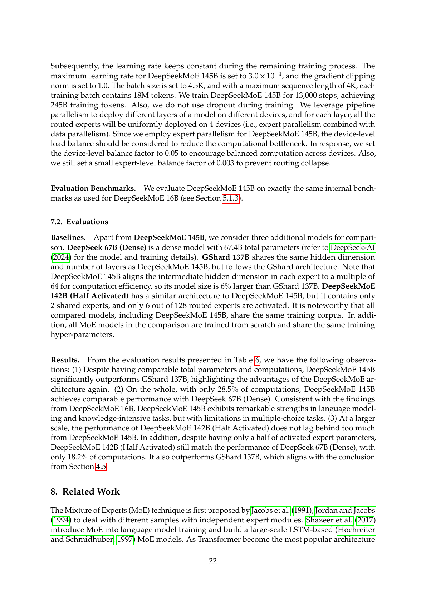

**表 6：DeepSeek 67B 与总参数规模约 140B 的 MoE 模型比较。** “专家数”和“激活专家数”中的 $a+b$ 分别表示 $a$ 位共享专家与 $b$ 位路由专家。DeepSeekMoE 145B，以及激活专家参数量只有其一半的 DeepSeekMoE 142B，均大幅超过 GShard 137B；同时，DeepSeekMoE 145B 仅使用 28.5% 的计算量便达到 DeepSeek 67B 的整体水平。

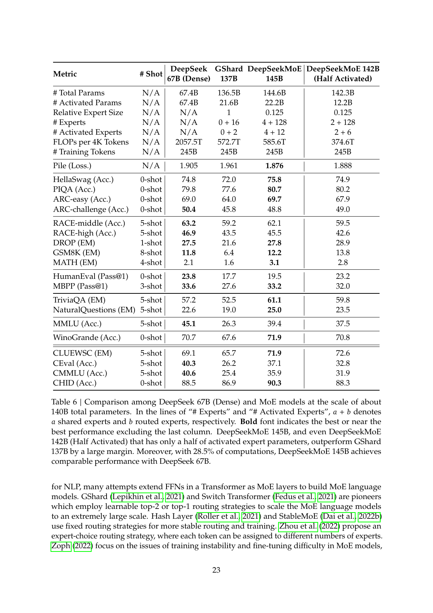

## 8 相关工作

专家混合技术最早由 Jacobs 等（1991）与 Jordan 和 Jacobs（1994）提出，用彼此独立的专家模块处理不同样本。Shazeer 等（2017）把 MoE 引入语言模型训练，并构建大规模、基于 LSTM（Hochreiter 和 Schmidhuber，1997）的 MoE 模型。Transformer 成为自然语言处理最流行的架构后，许多工作把 Transformer 中的 FFN 扩展为 MoE 层，构建 MoE 语言模型。

GShard（Lepikhin 等，2021）与 Switch Transformer（Fedus 等，2021）是先驱工作，分别使用可学习 Top-2 或 Top-1 路由，把 MoE 语言模型扩大到极大规模。Hash Layer（Roller 等，2021）与 StableMoE（Dai 等，2022b）采用固定路由策略，以获得更稳定的路由和训练。Zhou 等（2022）提出专家选择式路由，每个词元可以被分配给不同数量的专家。Zoph（2022）关注 MoE 的训练不稳定与微调困难，并提出 ST-MoE 克服这些问题。

除 MoE 架构和训练策略外，近年来还涌现出许多基于现有 MoE 架构的大规模语言或多模态模型（Du 等，2022；Lin 等，2021；Ren 等，2023；Xue 等，2023）。总体来看，此前大多数 MoE 仍采用传统 Top-1 或 Top-2 路由，专家专门化仍有很大提升空间。DeepSeekMoE 正是为把专家专门化提高到极致而设计。

## 9 结论

本文面向 MoE 语言模型提出 DeepSeekMoE，目标是实现极致专家专门化。通过细粒度专家切分与共享专家隔离，它相较主流 MoE 架构取得显著更高的专家专门化程度和性能。从 20 亿参数的小规模模型开始，我们验证了 DeepSeekMoE 的优势，并表明它能够接近 MoE 模型的性能上界；同时通过经验证据说明，它的专家专门化程度高于 GShard。

扩大到总计 160 亿参数后，我们在 2 万亿词元上训练 DeepSeekMoE 16B。只使用约 40% 的计算量，它便取得与 DeepSeek 7B、LLaMA2 7B 相当的优秀表现。我们还通过监督微调进行对齐，构建基于 DeepSeekMoE 16B 的 MoE 聊天模型，进一步展示其适应性与通用性。对 1450 亿参数的初步扩展表明，DeepSeekMoE 145B 继续保持相对 GShard 的显著优势，并只用 DeepSeek 67B 的 28.5%，甚至可能仅 18.2% 的计算量，就取得相当性能。

为研究目的，我们公开 DeepSeekMoE 16B 模型检查点；它可以部署在一张拥有 40GB 显存的 GPU 上。我们希望这项工作为学术界与工业界提供有价值的洞见，并推动大规模语言模型加速发展。

## 参考文献

原论文参考文献从第 24 页开始，共延续至第 30 页。为完整保留作者、题名、出版信息、DOI 与链接，以下按 PDF 原始页序收录。

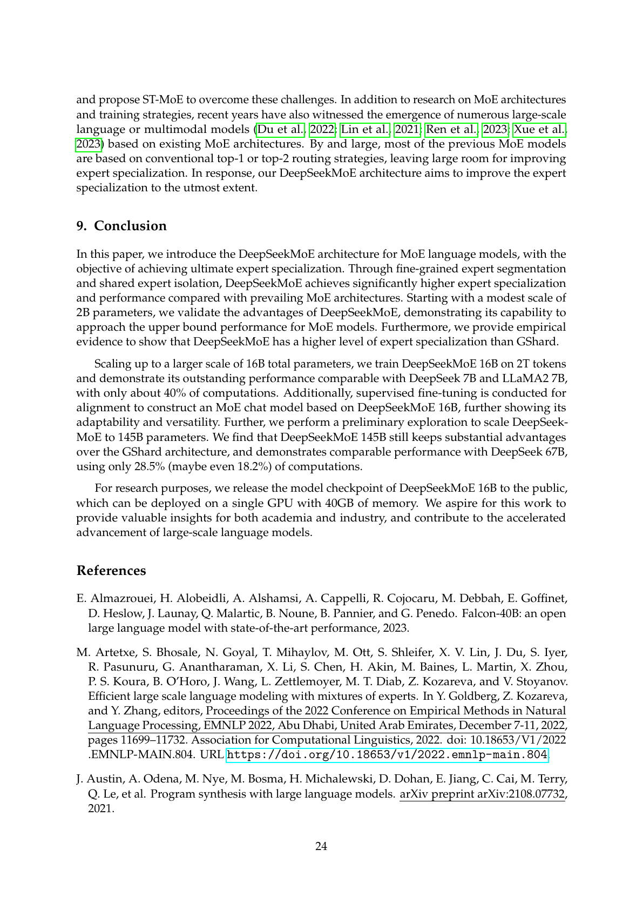

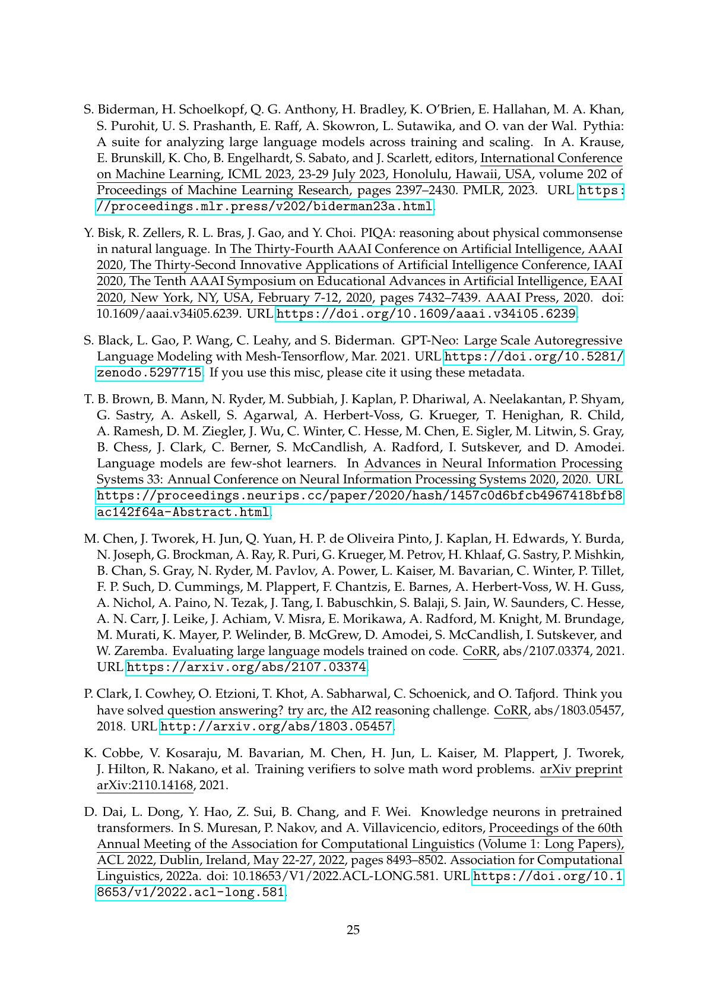

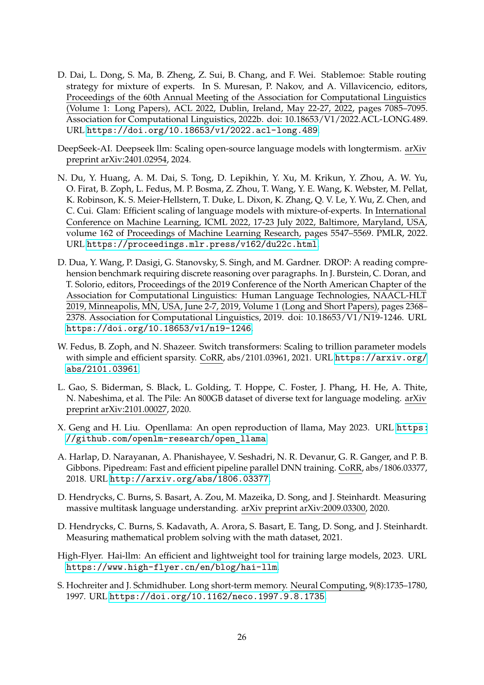

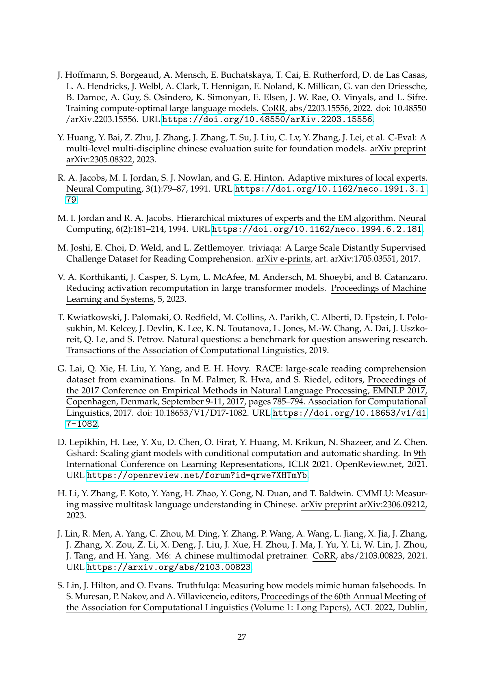

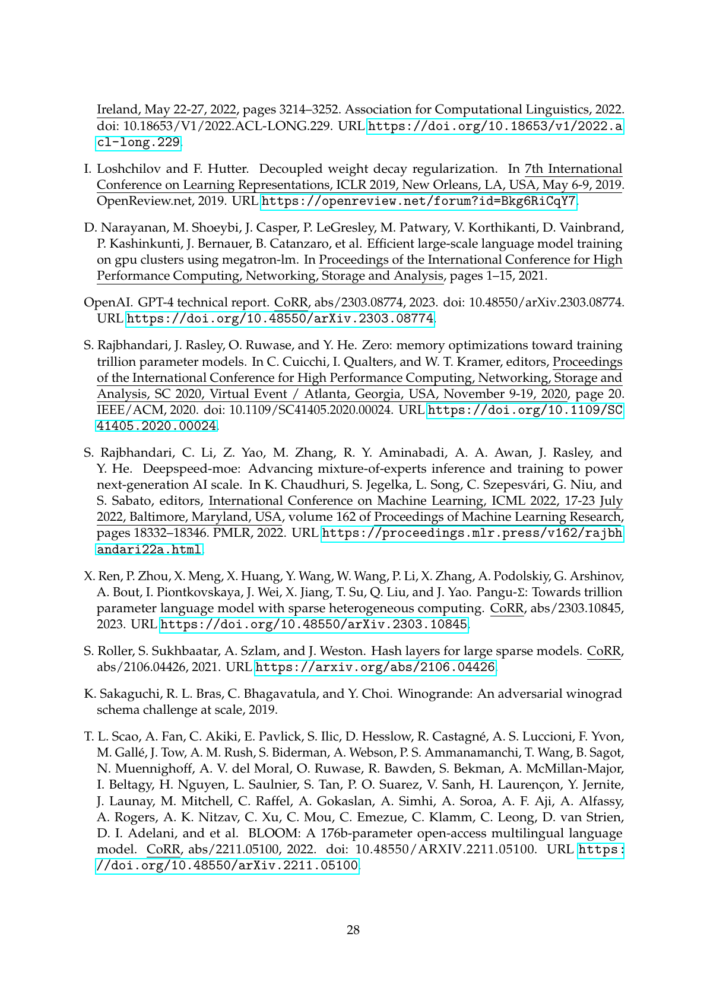

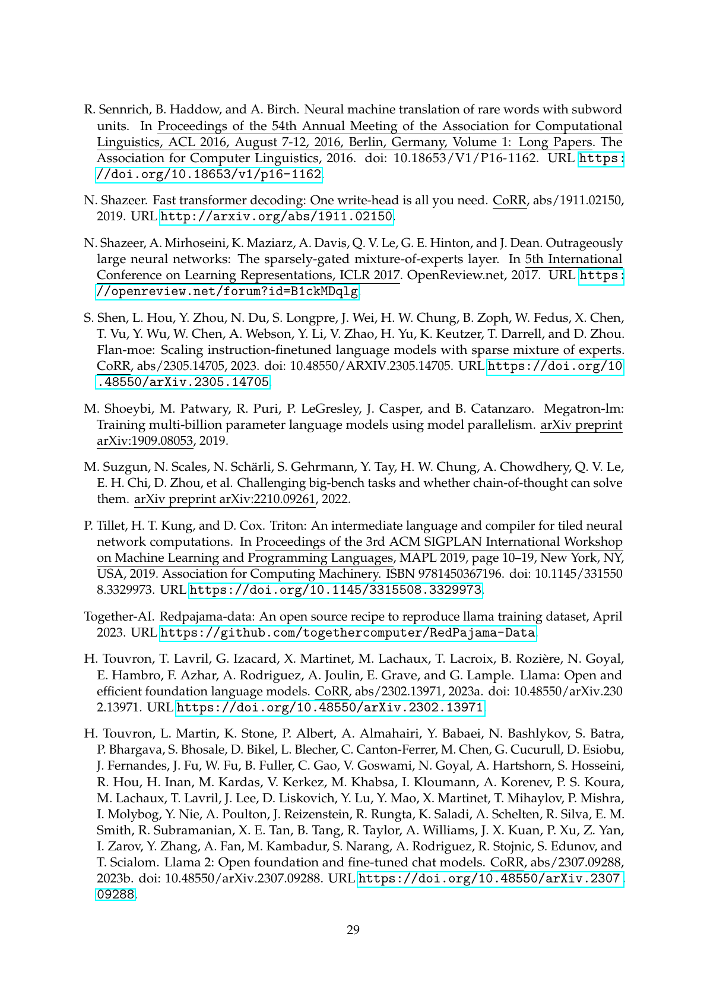

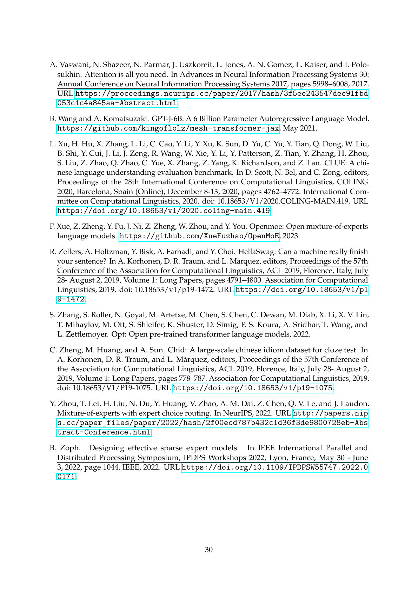

## 附录

### A 超参数概览

表 7 汇总不同规模 DeepSeekMoE 的超参数，包括参数量、层数、隐藏维度、注意力头数量、共享与路由专家数量、相对专家大小、序列长度、批量大小和学习率。

**表 7：不同规模 DeepSeekMoE 的超参数。** 相对专家大小以标准 FFN 为参照。2.0B、16.4B 与 144.6B 模型分别包含 1/2/4 位共享专家与 63/64/128 位路由专家，并分别激活 7/6/12 位路由专家。

### B DeepSeekMoE 与更大模型的比较

表 8 比较 DeepSeekMoE、GShard×1.2 与 GShard×1.5；表 9 比较 DeepSeekMoE、Dense×4 与 Dense×16。在总参数量扩大到 13B 后，表 10 还比较 DeepSeekMoE 与 GShard×1.2、GShard×1.5；在更大规模上，DeepSeekMoE 甚至明显超过 GShard×1.5。

**表 8：DeepSeekMoE 与更大 GShard 模型比较。**

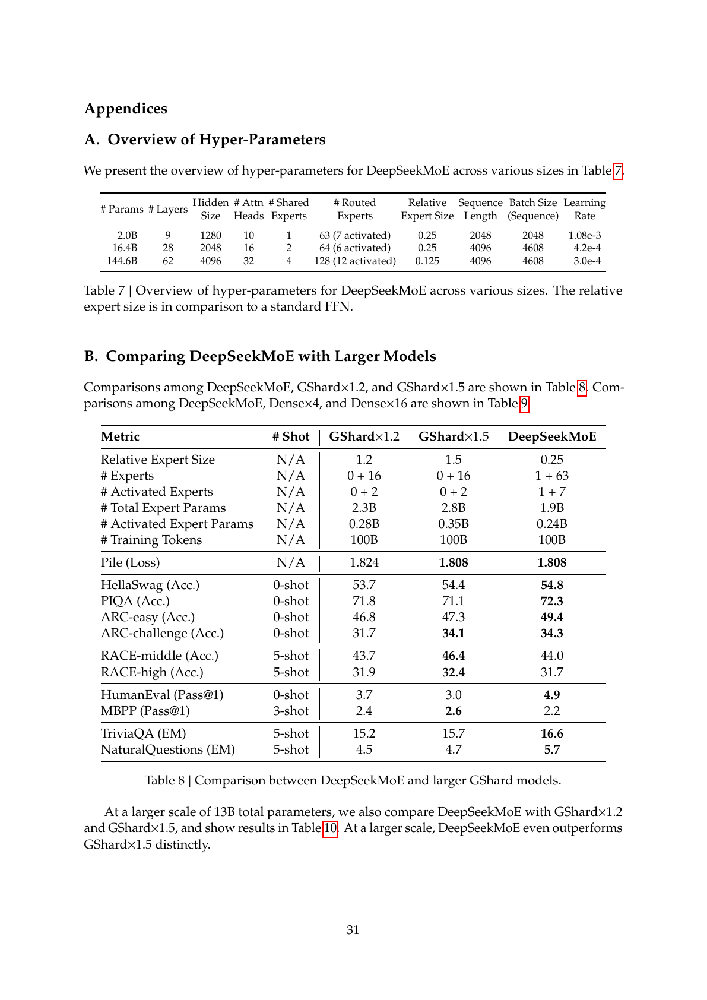

**表 9：DeepSeekMoE 与更大稠密基线比较。**

**表 10：更大规模下 DeepSeekMoE 与更大 GShard 模型比较。**

### C DeepSeekMoE 16B 的训练基准曲线

附录图 7 给出 DeepSeekMoE 16B 与稠密模型 DeepSeek 7B 在训练过程中的基准曲线。

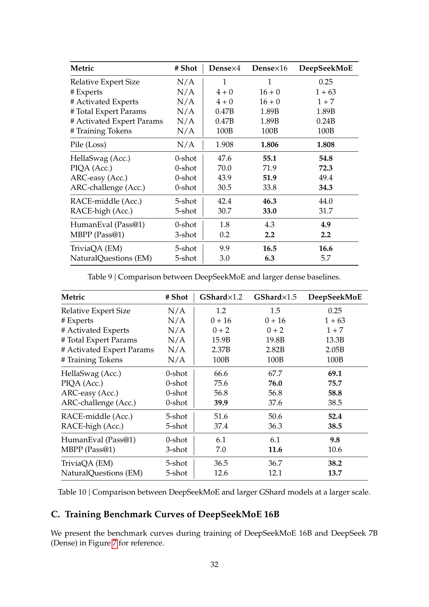

**图 7：DeepSeekMoE 16B 与 DeepSeek 7B 在训练过程中的基准曲线。** 曲线覆盖 HellaSwag、PIQA、ARC-Easy、ARC-Challenge、RACE-Middle、RACE-High、DROP、GSM8K、HumanEval、MBPP、TriviaQA、NaturalQuestions、MMLU、WinoGrande、CLUEWSC、CEval、CMMLU 与 CHID。

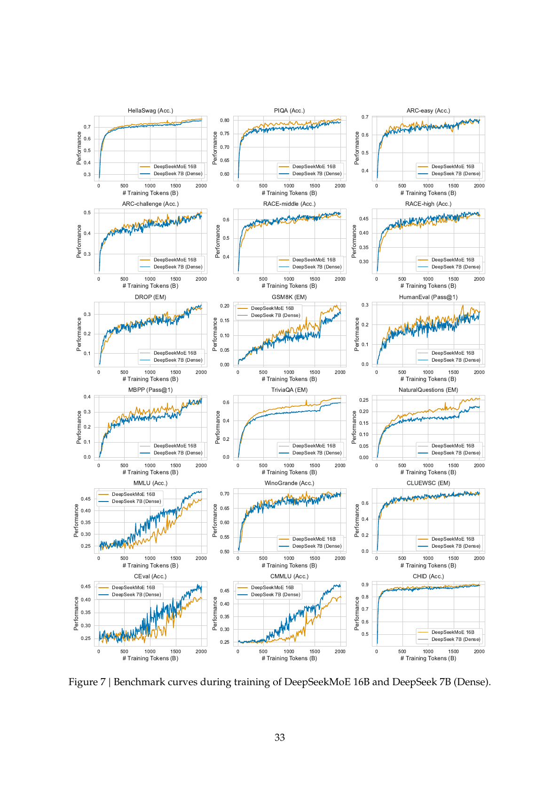
