# Gemma：基于 Gemini 研究与技术的开放模型

**作者：** Google DeepMind Gemma 团队

**论文版本：** arXiv:2403.08295v4，2024 年 4 月 16 日

**首次公开：** 2024 年 3 月 13 日

**译文说明：** 本文按论文内容顺序逐段翻译；模型名、数据集名和通行技术缩写保留原写法。图、表、参考文献及人员名单以原论文整页截图呈现，每一页截图均按原页顺序出现一次。

## 摘要

本文介绍 Gemma：一个轻量、先进的开放模型家族，其基础来自创建 Gemini 模型时所使用的研究成果与技术。Gemma 模型在语言理解、推理和安全等学术基准上表现强劲。我们发布两种模型规模，分别为 20 亿和 70 亿参数，并同时提供预训练检查点与微调检查点。在 18 项文本任务中，Gemma 有 11 项超过规模相近的开放模型。除详细说明模型开发过程之外，我们还全面评估了模型的安全性与责任性。我们认为，负责任地发布大型语言模型，对于提高前沿模型的安全水平以及促成下一轮大型语言模型创新至关重要。

## 1 引言

我们提出 Gemma，这是一个以 Google Gemini 模型为基础的开放模型家族。

我们采用从 Gemini 模型家族获得启发的架构、数据和训练方法，用最多 6 万亿个文本词元训练 Gemma。与 Gemini 一样，这些模型在文本领域具备强大的通用能力，并且在相应规模上拥有先进的理解和推理能力。本文同时发布预训练检查点、微调检查点，以及用于推理和服务部署的开源代码库。

Gemma 提供两种规模：70 亿参数模型面向 GPU 和 TPU 上的高效部署与开发；20 亿参数模型面向 CPU 和端侧应用。两种规模分别服务于不同的计算约束、应用场景与开发者需求。每种规模都发布未经微调的原始预训练检查点，以及针对对话、指令遵循、有用性和安全性微调后的检查点。我们通过一套定量与定性基准全面评估模型的不足。我们相信，同时发布预训练和微调检查点，可以支持研究者深入调查当前指令微调方案的影响，也有助于发展越来越安全、越来越负责任的模型开发方法。

与规模相当甚至更大的开放模型相比，Gemma 在自动化基准和人工评估涉及的广泛领域中推进了先进水平。这些领域包括问答、常识推理、数学与科学以及代码编写。完整结果见“评估”一节。

与 Gemini 一样，Gemma 建立在序列模型、Transformer、基于神经网络的深度学习方法，以及分布式系统大规模训练技术等近期成果之上。Gemma 也延续了 Google 长期建设开放模型与生态系统的历史，其中包括 Word2Vec、Transformer、BERT、T5 和 T5X。

我们认为，负责任地发布大型语言模型对于提高前沿模型安全性、确保人们能够公平使用这项突破性技术、严格评估并分析现有方法，以及促成下一轮创新都至关重要。尽管我们对全部 Gemma 模型进行了广泛测试，但测试不可能覆盖 Gemma 的所有应用和使用情境。因此，每位 Gemma 用户都应在部署或使用前，针对自己的具体用例开展严格的安全测试。关于安全方法的更多细节见“负责任的部署”一节。

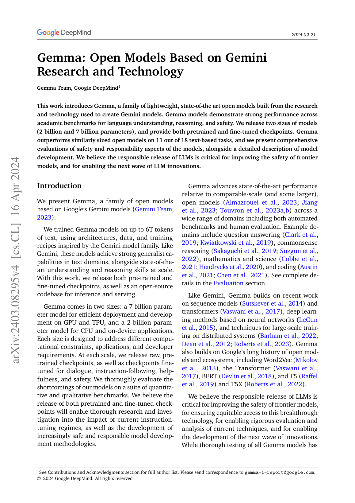

本技术报告详细介绍 Gemma 的模型架构、训练基础设施、预训练与微调方法，随后通过多种定量、定性基准、标准学术基准和人类偏好评估，对全部检查点进行全面评价。之后，我们详细讨论安全、负责任的部署方法，最后概述 Gemma 更广泛的影响、局限与优势。

图 1 按能力类别汇总标准学术基准并计算平均分，比较 Gemma 7B 与相近规模开放模型的语言理解和生成表现；各项明细见表 6。结果显示，Gemma 7B 在问答、推理、数学与科学、代码四类能力上都具有竞争力，尤其在数学、科学和代码任务上优势明显。

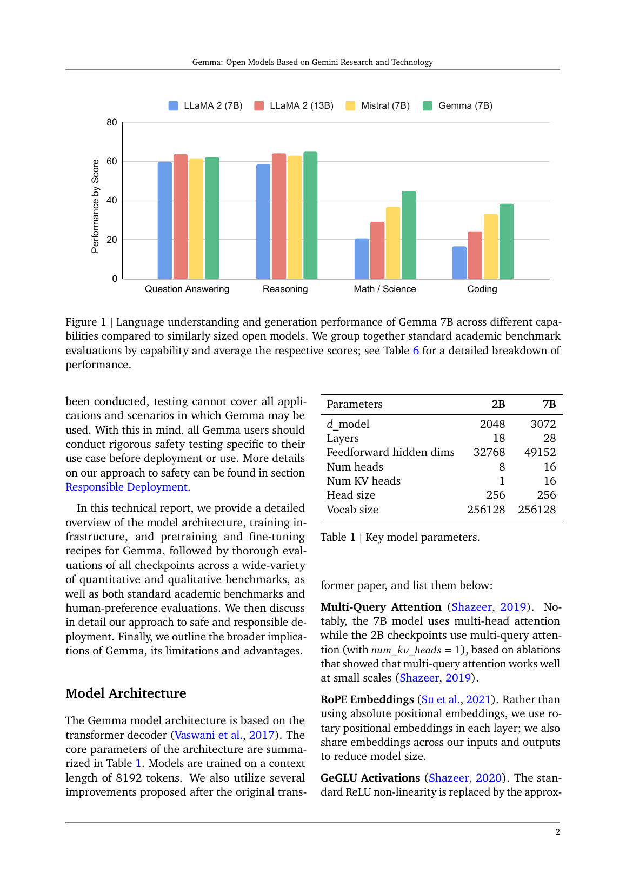

## 2 模型架构

Gemma 的模型架构以 Transformer 解码器为基础。表 1 汇总了架构的核心参数。模型使用 8192 个词元的上下文长度训练。我们还采用了原始 Transformer 论文发表后提出的若干改进，具体如下。

### 2.1 多查询注意力

需要特别说明的是，7B 模型使用多头注意力，而 2B 检查点使用多查询注意力，即 `num_kv_heads = 1`。这一选择来自消融实验：实验表明，多查询注意力在小规模模型上效果良好。

### 2.2 RoPE 嵌入

我们不使用绝对位置嵌入，而是在每一层使用旋转位置嵌入。输入和输出共享嵌入，从而减小模型规模。

### 2.3 GeGLU 激活函数

我们用 GeGLU 激活函数的近似版本取代标准 ReLU 非线性函数。

### 2.4 RMSNorm

为稳定训练，我们使用 RMSNorm 对每个 Transformer 子层、注意力层和前馈层的输入进行归一化。

表 2 给出 Gemma 模型的参数数量。2B 模型包含 524,550,144 个嵌入参数和 1,981,884,416 个非嵌入参数；7B 模型包含 786,825,216 个嵌入参数和 7,751,248,896 个非嵌入参数。模型沿用了 Gemini 的大型词表，共 256,000 个词条，设计目标是处理大量语言。因此，与仅支持一种或少数几种语言的模型相比，其嵌入参数更多。

## 3 训练基础设施

我们使用 TPUv5e 训练 Gemma。TPUv5e 以每个 Pod 256 块芯片的形式部署，并组成 16×16 的二维环面网络。训练 7B 模型时使用 16 个 Pod，共计 4096 块 TPUv5e；预训练 2B 模型时使用 2 个 Pod，共计 512 块 TPUv5e。在单个 Pod 内，7B 模型采用 16 路模型分片与 16 路数据复制；2B 模型则直接采用 256 路数据复制。优化器状态进一步使用类似 ZeRO-3 的技术进行分片。跨 Pod 时，我们依照 Pathways 方法，经数据中心网络执行数据副本规约。

我们沿用 Gemini 的做法，利用 JAX 和 Pathways 的“单控制器”编程范式。一个 Python 进程便可编排完整训练运行，从而简化开发流程。训练步骤计算还使用 GSPMD 分区器与 MegaScale XLA 编译器。

### 3.1 碳足迹

我们估算，Gemma 预训练产生的碳排放约为 131 吨二氧化碳当量。该数值先根据 TPU 数据中心直接报告的每小时能耗计算，再计入建设和维护数据中心所消耗的额外能源，得到训练实验的总能耗。之后，将每小时总能耗与数据中心逐单元、逐小时报告的碳排放数据结合，换算出总碳排放。

此外，Google 数据中心通过提高能源效率、购买可再生能源和进行碳抵消实现碳中和。这种碳中和同样覆盖我们的实验及承载实验的机器。

## 4 预训练

### 4.1 训练数据

Gemma 2B 和 7B 分别使用 3 万亿和 6 万亿个词元训练。训练数据以英语为主，来自网络文档、数学内容和代码。与 Gemini 不同，这些模型并非多模态模型，也没有以在多语言任务上达到先进水平为训练目标。

为保持兼容，我们采用 Gemini SentencePiece 分词器的一个子集。它会拆分数字，不会删除多余空白，并依照 PaLM 和 Gemini 使用的技术，以字节级编码处理未知词元。词表规模为 256,000 个词元。

### 4.2 过滤

我们过滤预训练数据集，以降低出现不需要或不安全言论的风险，并移除某些个人信息及其他敏感数据。过滤同时使用启发式规则和基于模型的分类器，以去除有害或低质量内容。我们还从预训练数据混合中滤除全部评估集，开展有针对性的污染分析以检查评估集泄漏，并通过减少敏感输出的重复传播来降低背诵风险。

最终数据混合由 2B 和 7B 模型上的一系列消融实验确定。与 Gemini 倡导的方法相似，我们采用分阶段训练，在训练过程中改变语料组合，使接近训练末期时相关、高质量数据的权重逐步提高。

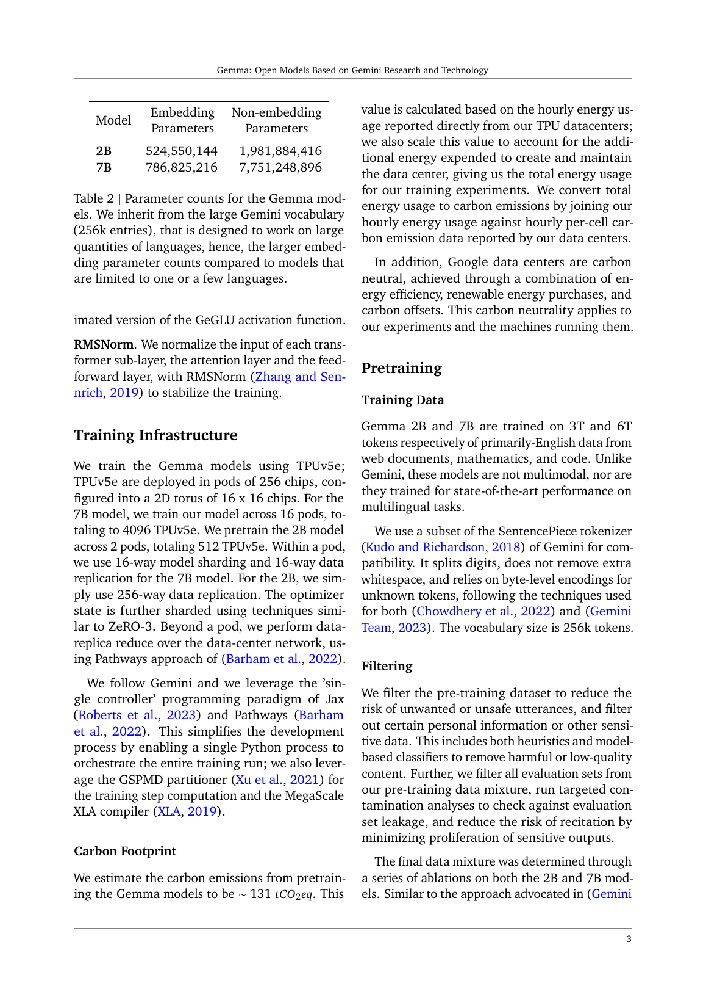

## 5 指令微调

我们对 Gemma 2B 和 7B 进行监督微调。数据由纯文本、纯英语的合成提示-回答对和人工生成提示-回答对混合而成。随后执行基于人类反馈的强化学习：奖励模型在带标签的纯英语偏好数据上训练，策略则以一组高质量提示为基础。我们发现，这两个阶段对于提高下游自动评估表现以及人类对模型输出的偏好都很重要。

### 5.1 监督微调

监督微调的数据混合根据基于语言模型的成对评估结果选择。给定一组留出的提示，我们分别让待测模型和基线模型对同一提示生成回答，随机打乱两份回答，再让能力更强的大模型表达对其中一份回答的偏好。不同提示集分别突出指令遵循、事实性、创造力和安全性等具体能力。为了让基于语言模型的裁判与人类偏好保持一致，我们采用思维链提示、评分准则和宪法等多种已知策略。

最终的数据混合和监督微调方案包括调优后的超参数。选择它们的依据，是在提升有用性的同时，尽量减少与安全和幻觉有关的模型危害。

#### 5.1.1 过滤

使用合成数据时，我们会执行多个过滤阶段，移除包含某些个人信息、不安全或有毒模型输出、错误自我身份信息以及重复样本的内容。与 Gemini 的发现相同，加入一部分鼓励模型更好地进行上下文归因、表达不确定性并在必要时拒答的数据，可以改善事实性指标，同时不会降低其他指标上的模型表现。

### 5.2 格式化

指令微调模型使用特定格式化器训练。无论训练还是推理，格式化器都会为所有指令微调样本增加额外信息。它有两个目的：第一，标记对话中的角色，例如用户角色；第二，划分对话轮次，尤其是多轮对话的各个轮次。为此，分词器预留了专用控制词元。即使不使用格式化器，模型也可能生成连贯内容，但这种输入会偏离模型训练分布，生成质量很可能更差。

表 3 给出相关格式控制词元，表 4 给出一个示例对话。`<start_of_turn>` 和 `<end_of_turn>` 分别标记对话轮次的开始与结束，`user` 和 `model` 分别标记用户与模型角色。

### 5.3 基于人类反馈的强化学习

我们进一步使用 RLHF 微调经过监督微调的模型。与 Gemini 类似，我们从人工评分者处收集成对偏好，并采用 Bradley-Terry 模型训练奖励函数。策略通过一种新的强化学习算法优化该奖励函数。与监督微调阶段相同，为调节超参数并进一步抑制奖励黑客行为，我们依靠高容量模型充当自动评分者，并与基线模型进行成对比较。

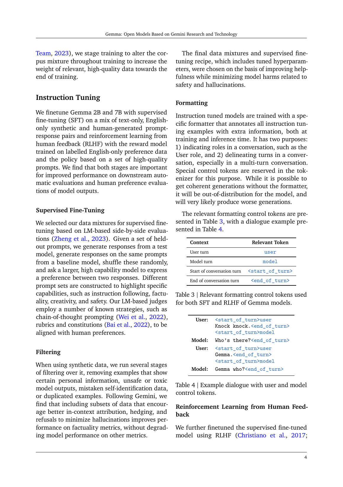

## 6 评估

我们通过自动化基准与人工评估，在广泛领域中评价 Gemma。

### 6.1 人类偏好评估

除了在微调模型上运行标准学术基准之外，我们还把最终发布候选模型送入人工评估研究，并与 Mistral v0.2 7B Instruct 比较。

在一组留出的约 1000 条提示上，任务以创意写作、编程和指令遵循为主。相对 Mistral v0.2 7B Instruct，Gemma 7B IT 的正向胜率为 61.2%，Gemma 2B IT 的胜率为 45%。在另一组留出的约 400 条提示上，任务侧重测试基本安全协议；Gemma 7B IT 的胜率为 63.5%，Gemma 2B IT 的胜率为 60.1%。相应数据见表 5。报告最终胜率时，平局会在双方之间平均分配；表中同时列出胜、平、负比例及 95% 置信区间。Gemma 1.0 的结果见附录。

### 6.2 自动化基准

我们测量 Gemma 在物理推理、社会推理、问答、编程、数学、常识推理、语言建模、阅读理解等领域的表现。

大多数自动化基准采用与 Gemini 相同的评估方法。凡是报告了与 Mistral 对比的基准，我们都尽可能复现 Mistral 技术报告的方法。这些基准包括 ARC、CommonsenseQA、Big Bench Hard 和仅英语的 AGIEval。由于许可证限制，我们无法自行评估 LLaMA-2，只引用其此前已经公布的指标。

表 6 和表 7 将 Gemma 2B、7B 与若干外部开源大型语言模型进行一系列学术基准比较。

在 MMLU 上，Gemma 7B 超过所有规模相同或更小的开源替代模型，也超过 LLaMA2 13B 等若干更大模型。不过，基准作者估计人类专家表现为 89.8%；Gemini Ultra 是第一个超过该阈值的模型。因此，要达到 Gemini 与人类水平，Gemma 仍有很大改进空间。

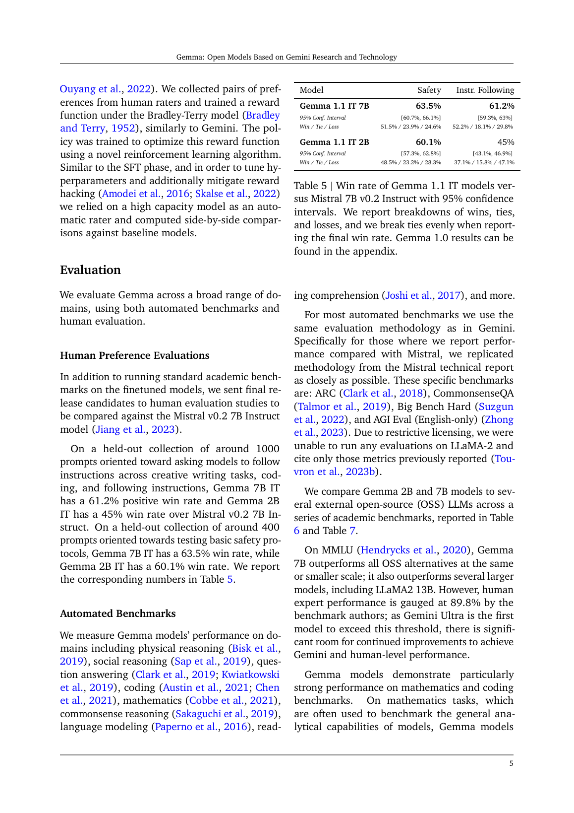

Gemma 在数学和代码基准上尤其强。在经常用于衡量模型通用分析能力的数学任务中，Gemma 在 GSM8K 和难度更高的 MATH 上至少领先其他模型 10 个百分点；在 HumanEval 上至少领先其他开放模型 6 个百分点。Gemma 7B 在 MBPP 上达到 44.4%，甚至超过专门针对代码微调的 CodeLLaMA-7B，其得分为 41.4%。表 6 中 18 项任务的平均分分别为：LLaMA-2 7B 为 46.9，LLaMA-2 13B 为 52.4，Mistral 7B 为 54.5，Gemma 2B 为 45.0，Gemma 7B 为 56.9。

表 7 还给出 HuggingFace H6 基准的独立结果。小模型的表现会受提示微小修改影响，因此我们通过一套对多个已知基准的独立实现进一步验证模型质量。全部评估由 HuggingFace 执行；Gemma 7B 的平均分为 63.8，高于 Mistral 7B 的 61.0。

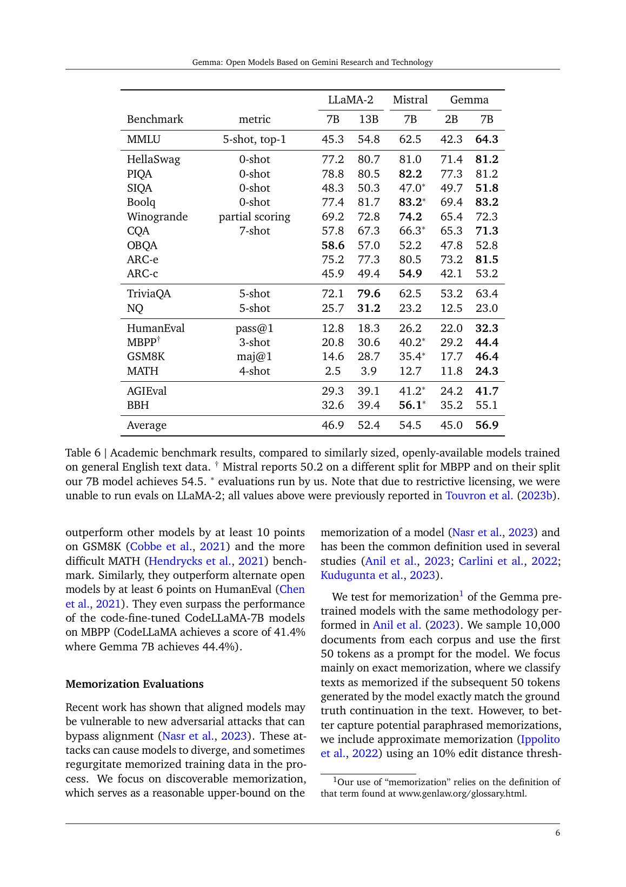

## 7 记忆评估

近期研究表明，对齐后的模型可能受到新型对抗攻击：这些攻击能够绕过对齐，使模型行为偏离预期，有时还会在过程中复述它记住的训练数据。我们关注“可发现记忆”，它可以作为模型记忆量的一个合理上界，也是多项研究采用的通行定义。本文所说“记忆”的定义遵循 GenLaw 术语表。

我们采用与 Anil 等人相同的方法，测试 Gemma 预训练模型的记忆现象。具体而言，从每个语料库采样 10,000 份文档，把前 50 个词元作为模型提示。我们主要研究逐字精确记忆：如果模型生成的后续 50 个词元与文本中的真实续写完全相同，就把该文本判定为已记忆。为了更好地捕捉可能经过改写的记忆，我们还以 10% 编辑距离阈值测量近似记忆。

图 2 将本次评估结果与规模最接近的 PaLM、PaLM 2 模型比较。PaLM 2 是在它与 PaLM 共有的训练语料子集上评估的；Gemma 预训练数据与 PaLM 模型之间的重叠更少，因此如果沿用同一方法，会观察到低得多的记忆率。相较之下，在整个预训练数据集上估计“总记忆量”更可靠。按后一估计，Gemma 对训练数据的记忆率与 PaLM 相当。总体而言，Gemma 预训练模型与规模相近的 PaLM、PaLM 2 模型都显示出相似且较低的记忆率。

### 7.1 个人数据

比一般记忆问题更重要的，是模型可能记住个人数据。为使 Gemma 预训练模型安全、可靠，我们使用自动化技术过滤训练集中的某些个人信息和其他敏感数据。

为识别可能出现的个人数据，我们使用 Google Cloud Sensitive Data Protection。该工具根据姓名、电子邮件等多种个人数据类别给出三个严重程度等级。我们把最高等级归为“敏感”，其余两个等级归为一般“个人”数据，再测量记忆输出中有多少包含敏感或个人数据。

如图 3 所示，我们没有观察到任何记住敏感数据的案例。模型确实记住了一些依照上述规则可能被归为“个人”的数据，但比例通常低得多。还需注意，这类工具只匹配模式而不考虑上下文，已知会产生大量误报，因此结果很可能高估了识别出的个人数据量。

### 7.2 近似记忆

图 4 显示，近似记忆的数据量约比精确记忆多 50%。图中使用对数刻度；这一比例在数据集的不同子类别中基本一致。

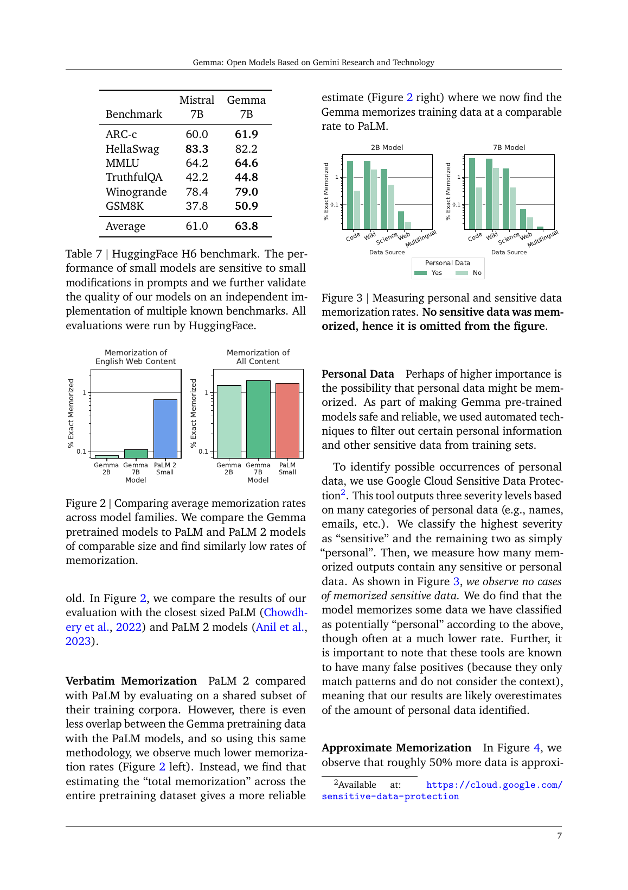

## 8 负责任的部署

与 Google 以往发布人工智能技术的做法一致，我们采用结构化方法负责任地开发、部署模型，从而识别、测量并管理可以预见的下游社会影响。与近期发布 Gemini 时一样，这套方法参考语言模型风险的既有学术文献、业内类似工作的发现、与内部及外部专家的持续交流，以及探索新模型漏洞的非结构化尝试。

### 8.1 收益

我们相信，人工智能科学与技术的开放可以带来显著收益。在多数情况下，开放源代码既是推动科学与创新的重要力量，也是一种负责任的做法；但它必须与当前和未来可能为行为者提供作恶工具的风险取得平衡。

Google 长期致力于让成功的研究创新得到更广泛的使用，例如 GraphCast、Transformer、BERT、T5 和 Word2Vec。我们认为，把 Gemma 引入人工智能开发生态后，下游开发者将能在科学、教育、艺术等领域创造大量有益应用。指令微调版本应能鼓励各种开发者利用 Gemma 的对话与代码能力支持自己的有益应用，同时又可通过定制微调，让模型能力专门适配具体用例。

为满足广泛的开发需求，我们发布两种模型规模，使其能够最优适配不同环境，并经由多个平台提供这些模型。以这种方式广泛开放 Gemma，可以降低新创企业或独立开发者在工作流中采用这些技术时面对的经济与技术门槛。

除了为开发者提供指令微调模型，我们也开放了相应的基础预训练模型。这样做旨在鼓励更多人工智能安全研究和社群创新，为开发者提供更丰富的模型选择，使他们能够继续推进透明性、可解释性等已经令整个社群受益的研究方法。

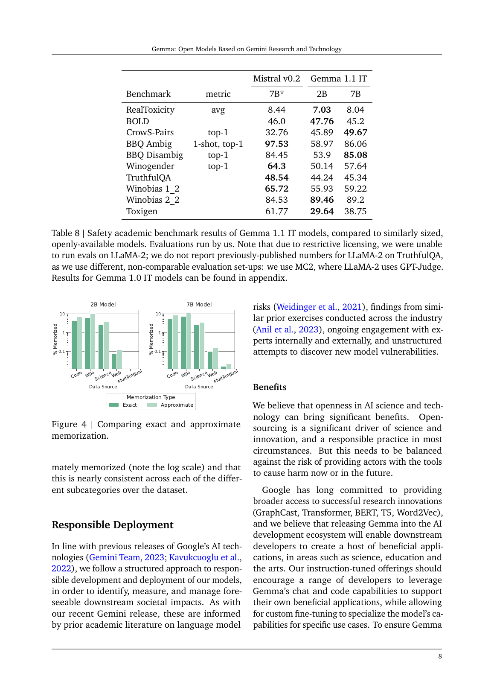

### 8.2 风险

我们知道，大型语言模型也可能被恶意使用。例如，制作深度伪造图像、人工智能生成的虚假信息，以及非法、令人不安的材料，都会在个人和机构层面造成伤害。与仅通过 API 提供模型相比，开放模型权重还会给负责任的部署带来新的挑战。

第一，即使 Gemma 的使用受服务条款约束，且 Gemma 禁止使用政策不允许恶意用途，我们仍无法阻止恶意行为者为恶意目的微调 Gemma。我们认识到，要形成更稳健的缓解策略来防范开放模型被蓄意滥用，仍需继续研究；Google DeepMind 将在内部以及与人工智能社群合作时持续探索这一问题。

第二项挑战，是保护开发者和下游用户免受开放模型非预期行为的影响。这些行为包括生成有毒语言、延续带有歧视性的社会危害、产生模型幻觉，以及泄露个人身份信息。模型部署在 API 后方时，可以通过多种过滤方法降低这些风险；开放权重则缺少这一防线。

### 8.3 缓解措施

为了在缺少 API 防线的情况下保护 Gemma 模型家族，我们采取多种措施防范风险：依照 Gemini 的方法过滤并测量预训练数据中的偏差；通过标准化人工智能安全基准评估安全性；开展内部红队测试，更好地理解外部使用 Gemma 的相关风险；对模型进行严格的伦理与安全评估。相关结果见表 8。

尽管我们为改进模型投入很多，但也认识到它的局限。为向下游用户保持透明，我们发布了详细模型卡，使研究者可以更全面地了解 Gemma。

我们还发布“生成式人工智能责任工具包”，帮助开发者负责任地构建人工智能。工具包包含一系列资源，用于协助开发者设计并实施负责任人工智能的最佳实践，保护其用户安全。

开放权重模型的发布仍相对新颖，人们还在不断发现它们的新用途和新型滥用方式。因此，Google DeepMind 承诺在未来模型开发的同时，持续研究并发展稳健的缓解策略。

### 8.4 综合评估

现有生态中已经能够使用能力更强的大型系统，因此我们认为，发布 Gemma 对整体人工智能风险组合的影响可以忽略。考虑到这一点，以及这些模型对研究、审计和下游产品开发的价值，我们相信 Gemma 为人工智能社群带来的收益大于上述风险。

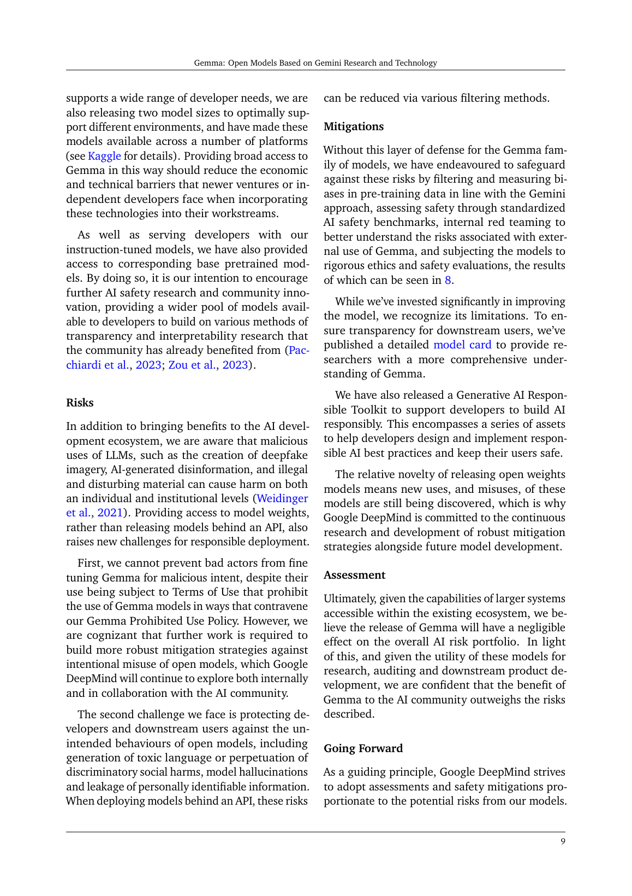

### 8.5 未来方向

Google DeepMind 遵循的一项指导原则，是让评估与安全缓解措施同模型的潜在风险相称。

虽然我们相信 Gemma 模型会为社群带来净收益，但此次发布不可逆，因此我们始终强调安全。开放模型可能造成的危害尚无清晰定义，也不存在成熟的开放模型评估框架；我们会继续遵循上述原则，以审慎、克制的方式开发开放模型。随着模型能力提高，我们可能采用更广泛的测试、分阶段发布或其他访问机制，确保人工智能得到负责任的发展。

随着生态不断演化，我们呼吁更广泛的人工智能社群超越简单的“开放对封闭”争论，既不要夸大也不要淡化潜在危害。我们认为，只有以细致、协作的方式同时处理风险和收益，才能取得必要进展。Google DeepMind 致力于开发高质量评估，也邀请社群共同参与，以加深对人工智能系统的理解。

## 9 讨论与结论

我们提出 Gemma，一个公开可用、面向文本和代码的生成式语言模型家族。Gemma 推进了公开语言模型在性能、安全性与负责任开发方面的先进水平。

我们尤其相信，广泛的安全评估和缓解措施使 Gemma 能够为社群带来净收益。不过，我们也承认发布不可逆，而开放模型造成的危害尚未得到清晰定义，因此会继续采用与模型潜在风险相称的评估和安全缓解措施。此外，Gemma 在 6 项标准安全基准和人工成对评估中都优于竞争模型。

Gemma 在对话、推理、数学和代码生成等广泛领域提高了表现。MMLU 的 64.3% 与 MBPP 的 44.4% 既展现了 Gemma 的强劲性能，也说明公开大型语言模型仍有很大提升空间。

除了基准任务上的先进成绩，我们也期待社群发掘新用例，并在共同推进这一领域的过程中发现新能力。我们希望研究者使用 Gemma 加速广泛研究，也希望开发者创造有益的新应用、用户体验和其他功能。

Gemma 受益于 Gemini 模型计划在代码、数据、架构、指令微调、基于人类反馈的强化学习以及评估等方面积累的大量经验。与 Gemini 技术报告相同，我们再次说明一组并不穷尽的大型语言模型局限：即使基准任务表现优异，要构建能够可靠按预期工作的稳健、安全模型，仍需进一步研究。需要继续探索的领域包括事实性、对齐、复杂推理和对抗输入稳健性；正如 Gemini 报告所指出的，我们也需要更困难、更稳健的基准。

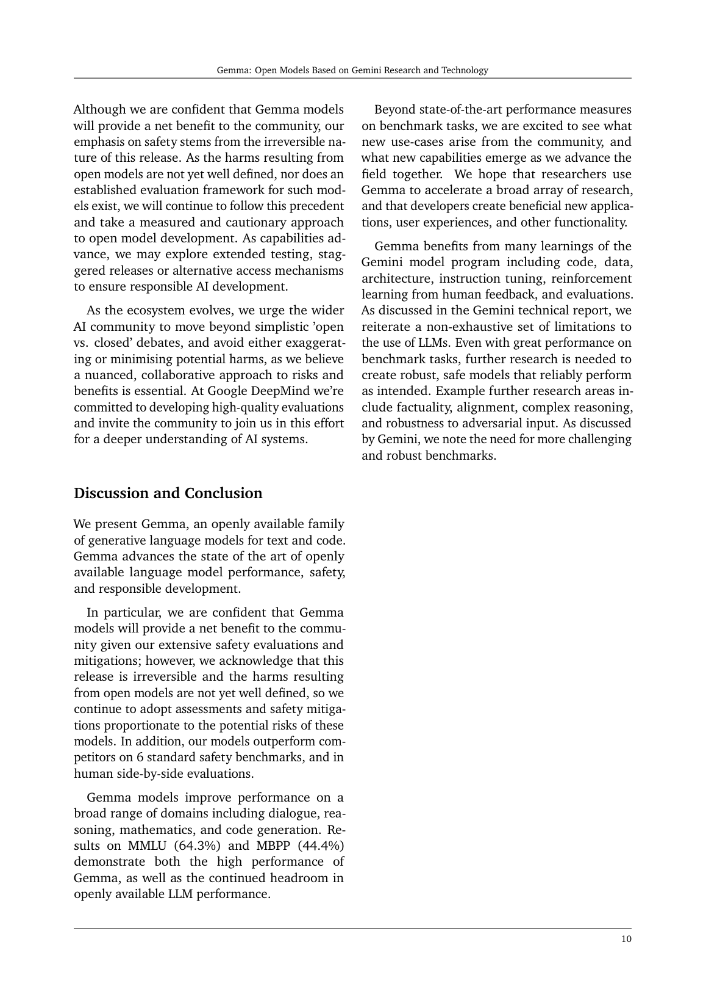

## 10 贡献者与致谢

论文第 11 页列出核心贡献者与其他贡献者。核心贡献者包括 Thomas Mesnard、Cassidy Hardin、Robert Dadashi、Surya Bhupatiraju、Shreya Pathak、Laurent Sifre、Morgane Rivière、Mihir Sanjay Kale、Juliette Love、Pouya Tafti、Léonard Hussenot 与 Pier Giuseppe Sessa。完整人员名单见原页截图。

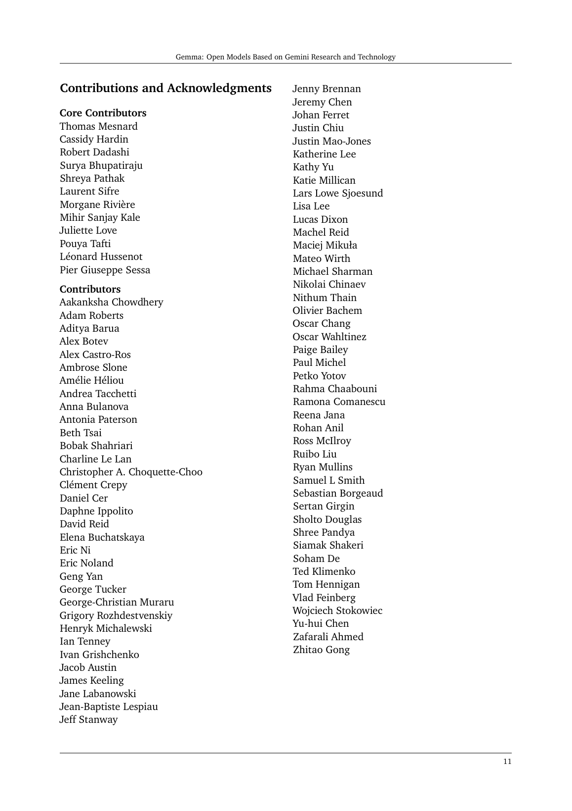

第 12 页列出产品管理、项目管理、执行发起人、负责人和技术负责人。技术负责人姓名后的匕首表示同等贡献。

这项工作得以完成，有赖于 Google 众多团队的投入与努力。作者感谢 Gemini、Gemini Safety、Gemini Infrastructure、Gemini Evaluation、Google Cloud、Google Research Responsible AI、Kaggle 和 Keras 团队的支持。

作者还特别感谢 Adrian Hutter、Andreas Terzis、Andrei Kulik、Angelos Filos、Anushan Fernando、Aurelien Boffy、Danila Sinopalnikov、Edouard Leurent、Gabriela Surita、Geoffrey Cideron、Jilin Chen、Karthik Raveendran、Kathy Meier-Hellstern、Kehang Han、Kevin Robinson、Kritika Muralidharan、Le Hou、Leonard Berrada、Lev Proleev、Luheng He、Marie Pellat、Mark Sherwood、Matt Hoffman、Matthias Grundmann、Nicola De Cao、Nikola Momchev、Nino Vieillard、Noah Constant、Peter Liu、Piotr Stanczyk、Qiao Zhang、Ruba Haroun、Seliem El-Sayed、Siddhartha Brahma、Tianhe（Kevin）Yu、Tom Le Paine、Yingjie Miao、Yuanzhong Xu 与 Yuting Sun。

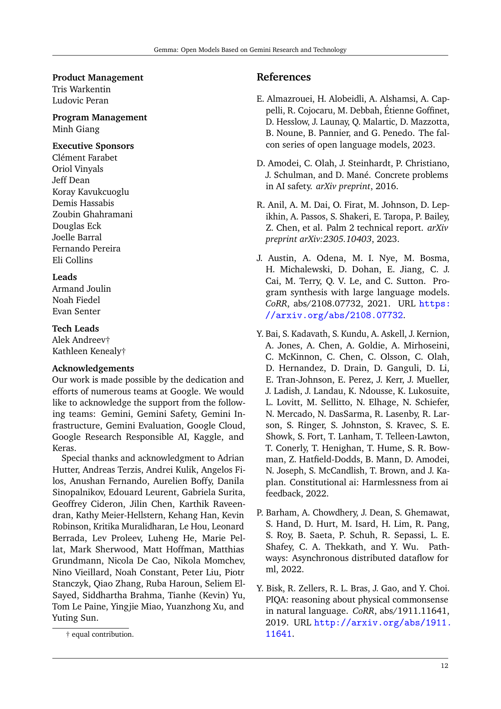

## 参考文献

参考文献依照原论文顺序列于第 12-16 页。为完整保留作者姓名、论文标题、出版信息与链接，以下使用原页截图呈现；第 12 页已在上一节出现，此处从第 13 页继续。

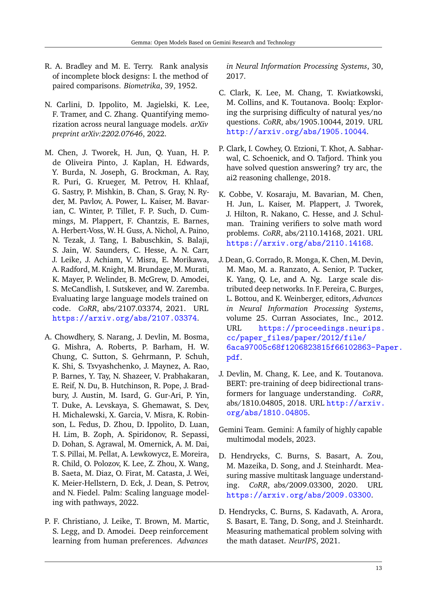

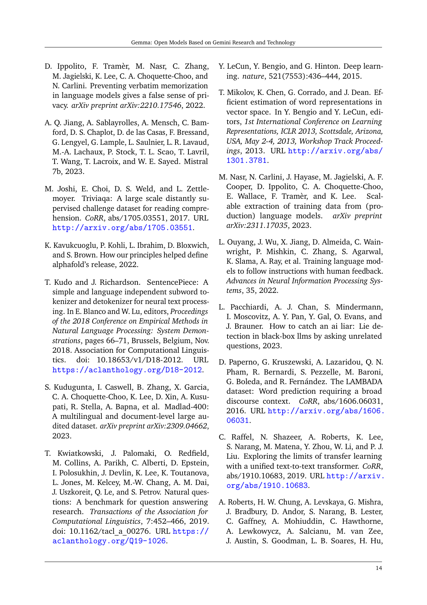

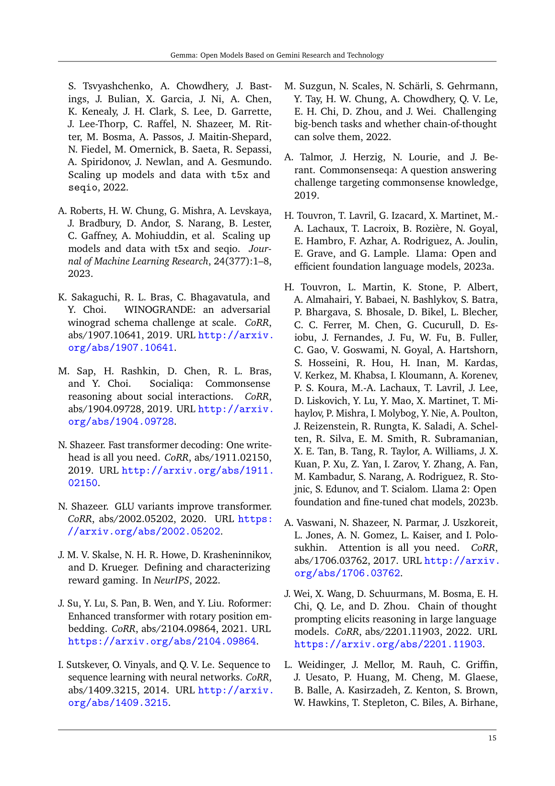

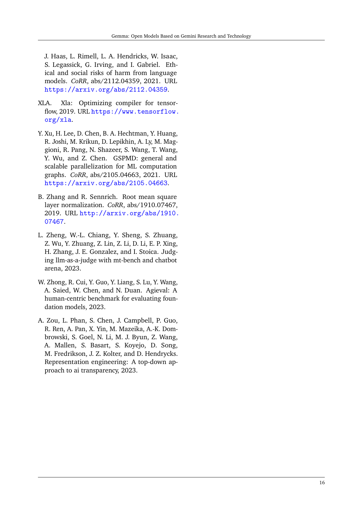

## 附录 A：Gemma 1.0 IT 结果

论文正文给出 Gemma 1.1 IT 模型的结果。本附录保留此前 Gemma 1.0 IT 模型的结果，以便比较。表 9 给出 Gemma 1.0 IT 与 Mistral 7B v0.2 Instruct 的成对评估，表 10 给出 1.0 版本的安全学术基准结果。

表 9 使用 95% 置信区间报告胜率，并列出胜、平、负的具体比例；计算最终胜率时，平局在双方之间平均分配。Gemma 7B IT 的安全胜率为 58%，指令遵循胜率为 51.7%；Gemma 2B IT 的安全胜率为 56.5%，指令遵循胜率为 41.6%。

表 10 将 Gemma 1.0 IT 与规模相近的开放模型在 RealToxicity、BOLD、CrowS-Pairs、BBQ、Winogender、TruthfulQA、Winobias 和 Toxigen 等安全学术基准上进行比较。评估由作者执行。由于许可证限制，作者无法评估 LLaMA-2，也没有报告 LLaMA-2 以往公布的 TruthfulQA 数字，因为两者的评估设置不可直接比较：本文使用 MC2，而 LLaMA-2 使用 GPT-Judge。

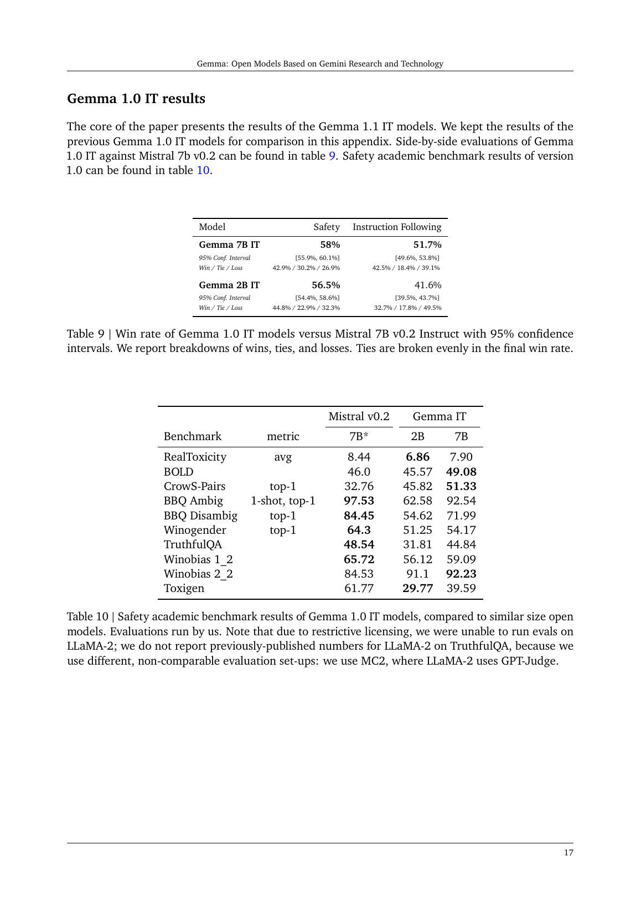
