# Janus：解耦视觉编码以统一多模态理解与生成

**作者：** Chengyue Wu、Xiaokang Chen、Zhiyu Wu、Yiyang Ma、Xingchao Liu、Zizheng Pan、Wen Liu、Zhenda Xie、Xingkai Yu、Chong Ruan、Ping Luo

**机构：** DeepSeek-AI、香港大学、北京大学

**项目地址：** <https://github.com/deepseek-ai/Janus>

## 摘要

本文提出 Janus，一个统一多模态理解与生成的自回归框架。以 Chameleon 为代表的既有研究通常让两项任务共用一个视觉编码器；然而，多模态理解与生成所需的信息粒度不同，这种做法可能造成次优性能，尤其会损害多模态理解。为解决该问题，我们把视觉编码解耦为两条独立路径，同时仍使用一个统一 Transformer 架构处理。解耦既缓解视觉编码器在理解与生成角色之间的冲突，也提高框架灵活性，例如两项组件可以分别选择最适合自己的编码方法。实验表明，Janus 超过此前统一模型，并达到或超过任务专用模型。其简单、高灵活性和有效性使它成为下一代统一多模态模型的有力候选。

## 1 引言

近年来，多模态大模型在理解与生成领域都取得显著进步。多模态理解通常沿用 LLaVA 设计，以视觉编码器充当桥梁，使大语言模型能够理解图像；视觉生成方面，扩散方法获得显著成功，更近期的自回归视觉生成也达到与扩散模型相当的表现。

为了构建更强、更通用的多模态模型，研究者尝试把多模态理解和生成结合。有些工作将多模态理解模型连接到预训练扩散模型，例如 Emu 使用 LLM 输出作为预训练扩散模型的条件，再依靠扩散模型生成图像。严格来说，这不能算真正统一的模型，因为视觉生成功能由外部扩散模型承担，多模态 LLM 本身没有直接生成图像的能力。

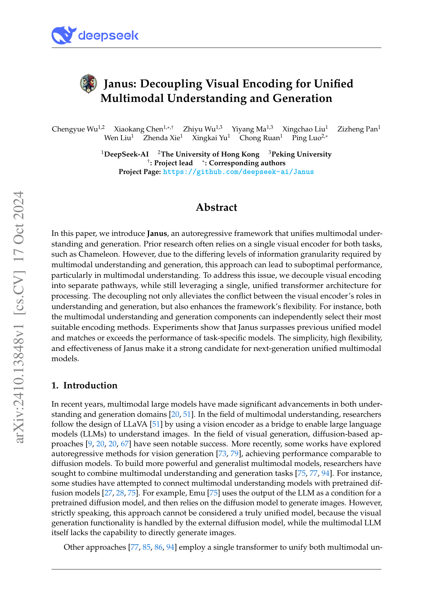

另一些方法使用单个 Transformer 统一理解与生成，这可以改善视觉生成的指令遵循、解锁潜在涌现能力并减少模型冗余。此类方法通常用同一个视觉编码器处理两种任务的输入，但两种任务所需表示明显不同。

多模态理解中，视觉编码器负责提取高层语义，例如图像中的对象类别或视觉属性；任务输出不仅要提取图像信息，还要执行复杂语义推理，因此编码器表示主要关注高维语义。视觉生成则重点生成局部细节并维持全局一致，需要能够表达细粒度空间结构与纹理细节的低维编码。把两种表示统一到同一空间会产生冲突与权衡。因此，既有统一理解与生成模型往往牺牲多模态理解性能，明显落后于最先进的专用理解模型。本文在消融研究中进一步分析这一问题。

为解决它，我们提出 Janus：一个把多模态理解与生成的视觉编码解耦的统一多模态框架。具体而言，建立两条独立视觉编码路径，一条服务理解，一条服务生成，再由同一 Transformer 统一处理。这带来两项主要收益：

1. 缓解理解与生成所需不同粒度造成的冲突，选择视觉编码器时不必在两项任务之间妥协。
2. 框架灵活、可扩展。解耦后，两项任务都能采用各自领域最先进的编码技术。

未来 Janus 还可以容纳点云、脑电、音频等额外输入类型，分别用独立编码器提取特征，再由统一 Transformer 处理。

“Janus”一名来自罗马神话中的双面神雅努斯，象征二元性与转变。它的两张脸朝向相反方向，体现矛盾力量共存；本文模型同样捕获视觉任务的内在张力：理解需要抽象、高层语义表示，生成需要具体、细致的信息。把两个过程分给专用编码器，便能在统一架构内化解张力。

图 1 汇总多模态理解与视觉生成结果。Janus 超过此前最先进统一多模态模型，也超过若干任务专用理解模型，同时展示强劲视觉生成能力；生成图像分辨率为 $384\times384$。

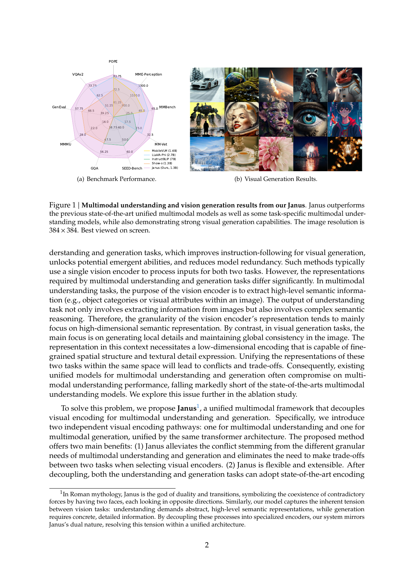

据我们所知，本文首次强调在统一多模态理解与生成框架内解耦视觉编码的重要性。实验显示，Janus 在理解与生成基准上都超过参数规模相当的现有统一模型，达到当时最先进水平，甚至超过参数多得多的某些任务专用模型。

具体而言，在 MMBench、SEED-Bench 和 POPE 多模态理解基准上，Janus 1.3B 分别得到 69.4、63.7 和 87.0，超过 LLaVA-v1.5 7B 与 Qwen-VL-Chat 7B。在 MSCOCO-30K 和 GenEval 视觉生成基准上，Janus 的 FID 为 8.53，准确率为 61%，超过 DALL-E 2、SDXL 等文本到图像生成模型。强性能与高灵活性、可扩展性相结合，使 Janus 成为下一代统一多模态模型的有力候选。

## 2 相关工作

### 2.1 视觉生成

视觉生成是一个迅速发展的领域，把自然语言处理概念与 Transformer 架构进展结合。受语言处理成功启发，自回归模型使用 Transformer 预测离散视觉词元，也就是码本编号；它们先把视觉数据词元化，再采用类似 GPT 的预测方式。遮盖预测模型则借鉴 BERT 式遮盖，预测视觉输入中被遮盖部分以提高合成效率，并已扩展到视频生成。与此同时，连续扩散模型在视觉生成中展现出色能力，从概率角度补充离散方法。

### 2.2 多模态理解

多模态大语言模型集成文本与图像。借助预训练 LLM，它们表现出强大的多模态信息理解与处理能力。近期研究尝试用预训练扩散模型扩展 MLLM，以支持图像生成。这些方法属于工具调用：扩散模型根据 MLLM 输出条件生成图像，而 MLLM 本身不能直接执行视觉生成。整个系统的生成能力还经常受到外部扩散模型限制，性能甚至不如直接单独使用该扩散模型。

### 2.3 统一多模态理解与生成

统一多模态理解与生成模型被认为能够跨不同模态无缝推理和生成，具有强大潜力。传统方法不论基于自回归还是扩散，通常都让理解与生成使用同一视觉表示。

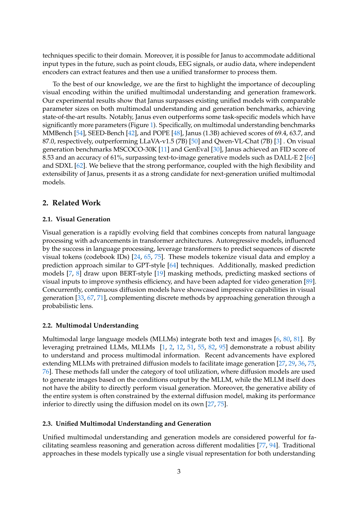

例如，Chameleon 使用 VQ 词元化器为理解与生成共同编码图像。然而，这可能产生次优结果，因为视觉编码器必须在两种任务需求之间权衡。Janus 则显式解耦理解与生成的视觉表示，承认不同任务可能需要不同信息层级。

## 3 Janus：简单、统一且灵活的多模态框架

### 3.1 架构

图 2 展示 Janus 架构。纯文本理解、多模态理解和视觉生成分别使用独立编码方式把原始输入转换为特征，再由统一自回归 Transformer 处理。

具体来说，文本理解使用 LLM 内置词元化器把文本转换为离散编号，并取得各编号对应特征表示。多模态理解使用 SigLIP 编码器从图像提取高维语义特征；这些特征由二维网格展平成一维序列，再由理解适配器映射到 LLM 输入空间。

视觉生成使用 VQ 词元化器把图像转换为离散编号。编号序列展平成一维后，由生成适配器把各编号对应的码本嵌入映射到 LLM 输入空间。随后拼接这些特征序列形成多模态特征序列，送入 LLM 处理。

纯文本和多模态理解使用 LLM 内置预测头预测文本；视觉生成则使用随机初始化的预测头预测图像。整个模型遵循自回归框架，无需专门设计注意力遮罩。

图 2 中“理解编码器”和“生成编码器”分别对应两条独立视觉编码路径，这正是 Janus 与此前假设两种任务应共用编码器的方法之间的关键差异。

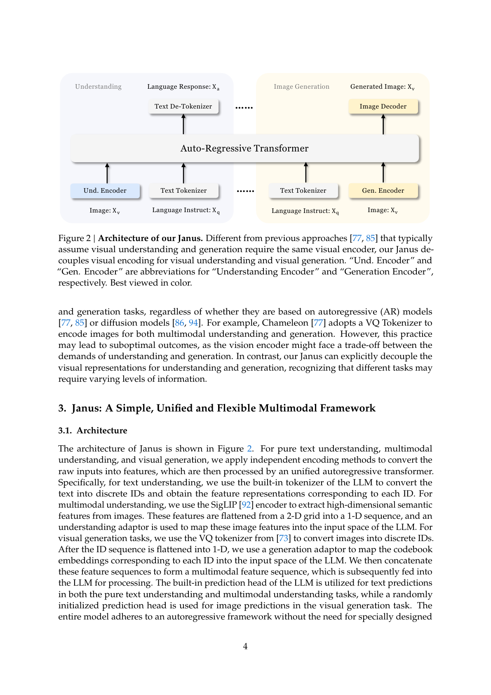

### 3.2 训练流程

图 3 所示的 Janus 训练分为三个阶段，火焰表示模块更新参数，雪花表示参数冻结。

**阶段一：训练适配器和图像头。** 目标是在嵌入空间内建立视觉元素与语言元素的概念连接，使 LLM 能理解图像中的实体并具备初步视觉生成能力。该阶段冻结视觉编码器和 LLM，只更新理解适配器、生成适配器与图像头。

**阶段二：统一预训练。** 使用多模态语料统一预训练，使 Janus 同时学习理解与生成。此时解冻 LLM，并使用全部训练数据：纯文本、多模态理解与视觉生成数据。受 PixArt 启发，先在 ImageNet-1k 上执行简单视觉生成训练，帮助模型掌握基本像素依赖；随后用通用文本到图像数据增强开放域生成能力。

**阶段三：监督微调。** 用指令调优数据微调预训练模型，提高指令遵循与对话能力。除生成编码器外全部参数都参与微调。训练重点监督回答，系统提示与用户提示被遮盖。为确保 Janus 同时擅长理解与生成，我们不为某项任务单独微调模型，而是混合纯文本对话、多模态理解和视觉生成数据，使模型适用于不同场景。

### 3.3 训练目标

Janus 是自回归模型，训练直接采用交叉熵损失：

$$
\mathcal{L}=-\sum_{i=1}\log P_\theta(x_i\mid x_{<i}).
$$

$P_\theta$ 表示 Janus 权重所建模的条件概率。纯文本理解与多模态理解只在文本序列上计算损失；视觉生成只在图像序列上计算损失。为保持设计简单，不为不同任务分配不同损失权重。

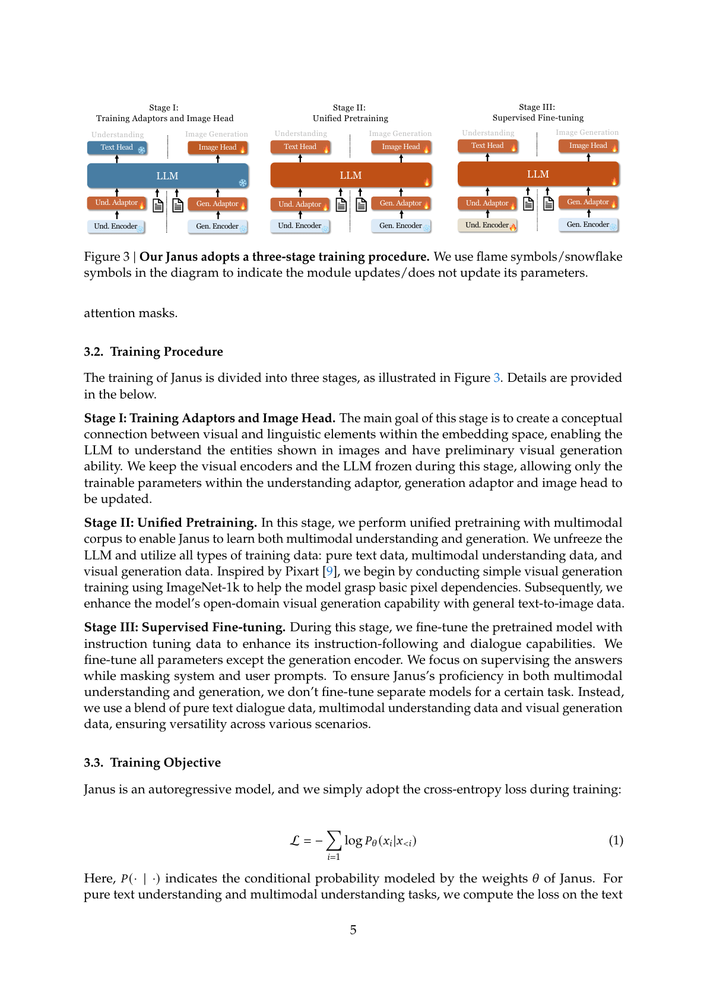

### 3.4 推理

推理时采用下一词元预测。纯文本与多模态理解按标准做法，从预测分布依次采样词元。图像生成采用无分类器引导。每个词元的逻辑值为：

$$
l_g=l_u+s(l_c-l_u),
$$

其中 $l_c$ 是条件逻辑值，$l_u$ 是无条件逻辑值，$s$ 是无分类器引导尺度，后续评测默认设为 5。训练时以 10% 概率把文本到图像数据的文本条件替换为填充词元，使模型获得无条件视觉生成能力。

### 3.5 可能的扩展

理解与生成使用独立编码器的设计直接、易扩展。

**多模态理解。** 一是可以选择 EVA-CLIP、InternViT 等更强视觉编码器，而无需担心它能否处理视觉生成。二是可以使用动态高分辨率技术处理高分辨率图像，使模型扩展到任意分辨率，而不必对 ViT 位置嵌入插值；还可用像素重排等方法进一步压缩词元，节省计算。

**视觉生成。** 一是可以选择 MoVQGAN 等粒度更细的编码器，在编码后保留更多图像细节；二是可以采用扩散损失等视觉生成专用损失；三是在视觉生成过程中结合自回归因果注意力与并行双向注意力，减少累积误差。

**支持更多模态。** Janus 的直接架构便于集成更多编码器，容纳三维点云、触觉、脑电等模态，因此有潜力成为更强大的多模态通用模型。

## 4 实验

本节以一系列完整实验评估方法在多种视觉理解与生成任务上的性能。先介绍模型架构、训练数据集与评测基准，再报告 Janus 表现并与各基准最先进模型比较；随后通过广泛消融验证方法有效性，最后给出定性结果。

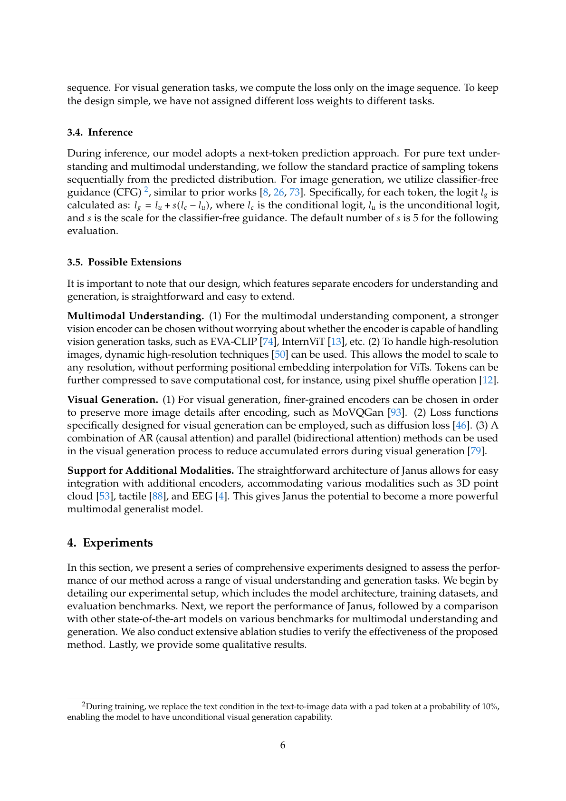

### 4.1 实现细节

实验使用最大序列长度 4096 的 DeepSeek-LLM 1.3B 作为基础语言模型。理解任务的视觉编码器采用 SigLIP-Large-Patch16-384；生成编码器码本大小为 16384，并以 16 倍下采样图像。理解适配器和生成适配器都是两层 MLP。各阶段详细超参数见表 1。

所有图像调整为 $384\times384$。多模态理解数据将长边缩放到 384，再以背景色 RGB（127，127，127）填充短边；视觉生成数据则把短边缩放到 384，再把长边裁剪到 384。训练使用序列装箱提高效率，并在单个训练步骤内按指定比例混合全部数据类型。

Janus 使用构建在 PyTorch 上的轻量高效分布式训练框架 HAI-LLM 训练和评测。完整训练在 16 个节点的集群上耗时 7 天，每节点配备 8 块 Nvidia A100 40GB GPU。

### 4.2 数据设置

本节介绍预训练与监督微调数据集。

**阶段一。** 多模态理解使用 ShareGPT4V 的 125 万个图像—文本说明对；视觉生成使用 ImageNet-1k 约 120 万个样本。ShareGPT4V 数据格式为“图像占位符后接文本”，ImageNet 则用类别名组织成文本到图像格式“类别名占位符后接图像”。

**阶段二。** 数据分为以下类别：

1. **纯文本数据。** 使用 DeepSeek-LLM 的预训练文本语料。
2. **图文交错数据。** 使用 WikiHow 与 WIT。
3. **图像说明数据。** 使用多项公开图像数据，其中部分由开源多模态模型重新生成说明。数据被格式化为问答对，例如“图像：请详细描述该图像。回答：说明文字”。
4. **表格与图表数据。** 使用 DeepSeek-VL 的相应表格和图表数据，格式为问题—回答。
5. **视觉生成数据。** 使用多个公开数据集的图像—说明对以及 200 万条内部数据。部分数据按美学分数和图像尺寸过滤，只保留 20%。训练时以 25% 概率只使用说明文字第一句，鼓励模型具备用短描述生成图像的强能力。

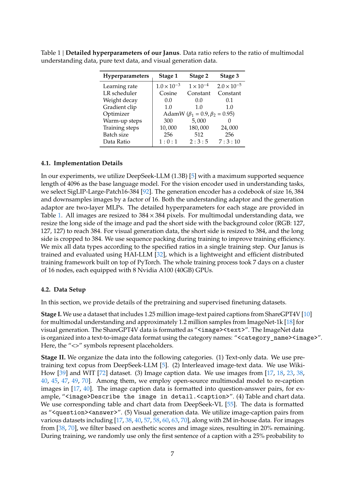

ImageNet 样本只在前 12 万训练步出现，其他数据集的图像则在后 6 万步出现。这使模型先学习基本像素依赖，再推进到更复杂场景理解。视觉生成数据格式为“说明文字后接图像”。

**阶段三。** 文本理解使用指令数据；多模态理解使用多项公开指令调优数据；视觉生成使用阶段二的一部分公开图像—文本对和 400 万条内部数据。指令调优格式为“用户：输入消息；助手：回答”，多轮对话则重复这一格式组织数据。

### 4.3 评测设置

**多模态理解。** 使用 VQAv2、GQA、POPE、MME、SEED、MMBench、MM-Vet 和 MMMU 等广泛认可的图像视觉—语言基准。

**视觉生成。** 使用 MSCOCO-30K、MJHQ-30K 与 GenEval。前两个基准把生成图像与 3 万幅高质量图像比较，采用 Fréchet Inception Distance 衡量整体生成效果。GenEval 是一个具有挑战性的文本到图像生成基准，用来反映模型综合生成能力。

表 2 比较多模态理解结果。“理解”和“生成”表示模型支持的任务类型，使用外部预训练扩散模型者以 † 标记。Janus 仅 1.3B 参数，却在 POPE、MMBench 与 SEED 等指标上优于多种更大模型。

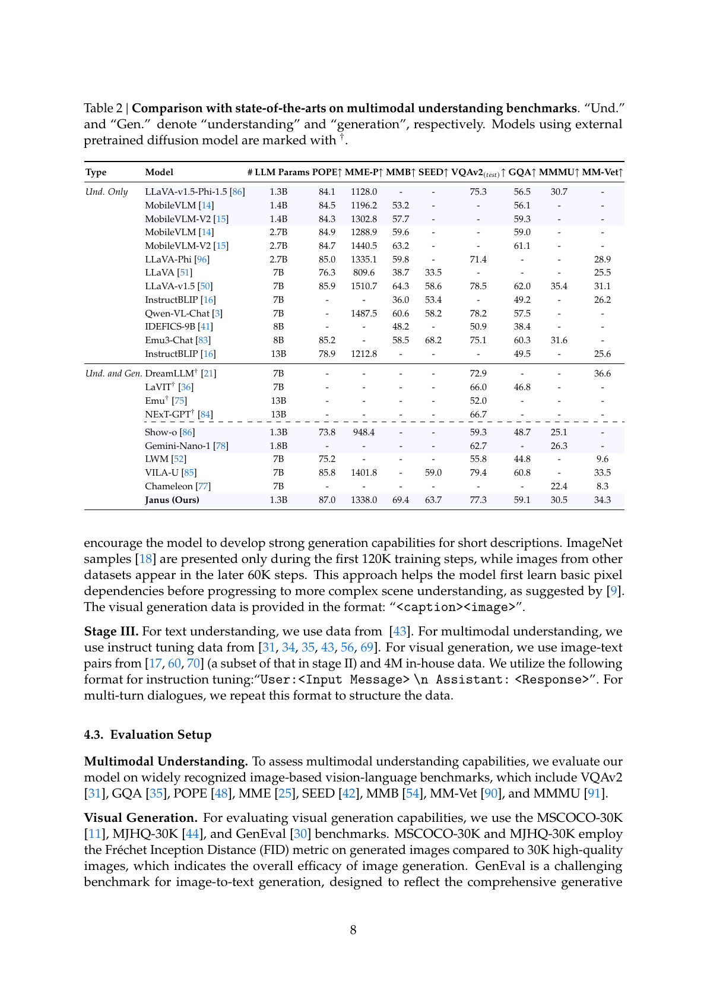

### 4.4 与最先进方法比较

**多模态理解性能。** 表 2 把本文方法与最先进统一模型和仅理解模型比较。Janus 在相近规模模型中总体最好。相较此前最佳统一模型 Show-o，Janus 在 MME 上由 948.4 提高到 1338.0，增幅 41%；GQA 由 48.7 提高到 59.1，增幅 30%。这归功于把理解与生成视觉编码解耦，从而缓解两项任务的冲突。即使与显著更大的模型比较，Janus 仍极具竞争力，例如在 POPE、MMBench、SEED-Bench 和 MM-Vet 上超过 LLaVA-v1.5 7B。

**视觉生成性能。** 我们在 GenEval、COCO-30K 和 MJHQ-30K 上报告视觉生成结果。表 3 显示，Janus 在 GenEval 上取得 61% 总体准确率，超过此前最佳统一模型 Show-o 的 53%，也超过 SDXL 的 55% 与 DALL-E 2 的 52% 等常用生成专用方法，证明本文方法具有更好的指令遵循能力。

表 4 显示，Janus 在 COCO-30K 和 MJHQ-30K 上的 FID 分别为 8.53 与 10.10，优于统一模型 Show-o 和 LWM，并能与若干知名生成专用方法竞争。这说明 Janus 生成图像质量良好，也凸显其视觉生成潜力。

### 4.5 消融研究

我们精心设计消融实验以验证 Janus 的设计理念。首先验证解耦视觉编码的重要性和收益，然后考察统一训练对多模态理解或视觉生成单项任务的影响，结果见表 5。

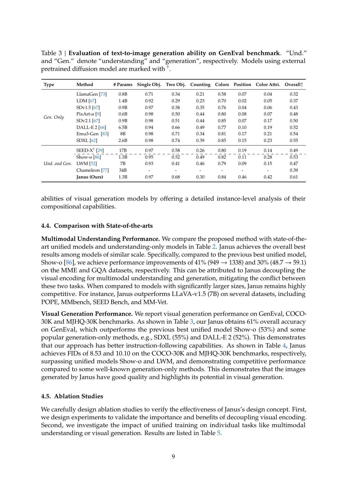

**基线构建。** 沿用既有工作，选择 VQ 词元化器同时编码理解与生成图像，形成实验 A 基线。考虑到该 VQ 词元化器提取语义信息可能较弱、因而不利于多模态理解，我们又构建更强的实验 B：用 SigLIP 蒸馏增强语义词元化器，使其既能提取图像高层语义，又能把图像转为离散编号，做法与相关工作相近。语义词元化器详情见附录 A.1；它只用于消融中的更强基线，主实验仍使用普通 VQ 词元化器以保持简单。

**解耦视觉编码的影响。**

1. 实验 A 在视觉生成上表现尚可，COCO FID 为 8.72；但多模态理解与本文实验 D 相比存在显著差距。
2. 实验 B 相较 A 明显改善理解，但仍远落后于本文方法。视觉生成上 B 优于 D，可能有两个原因：第一，语义词元化器产生语义更连贯的离散编号，为 LLM 提供更合理的预测目标；第二，实验 B 的视觉编码器参数显著多于实验 D 的生成编码器。
3. 为检验共用单一视觉编码器是否导致理解与生成权衡，我们在实验 B 基础上构建只训练多模态理解的实验 C。C 的理解能力显著好于 B，说明 B 的视觉编码器确实在两项任务之间妥协，最终牺牲理解能力。

这些实验共同说明了解耦视觉编码的重要性。

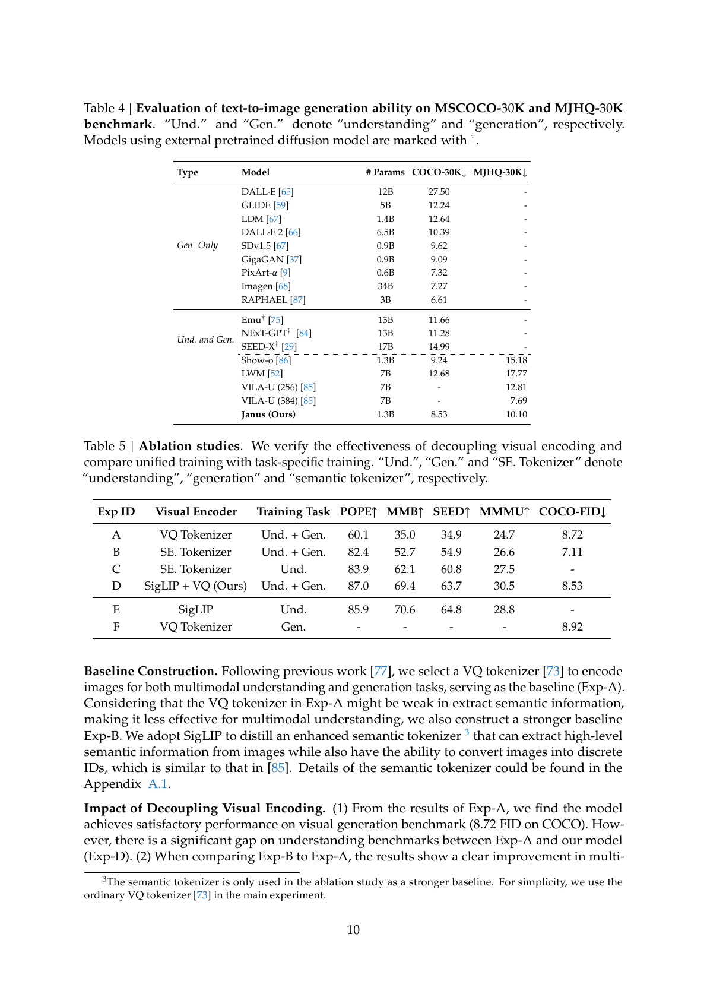

**统一模型与仅理解、仅生成模型。** 我们把统一训练实验 D 与仅理解实验 E、仅生成实验 F 比较。仅理解训练去除视觉生成数据，仅生成训练去除理解数据。统一训练与仅理解训练在理解部分经历相同步骤；统一训练与仅生成训练在生成部分也经历相同步骤。

结果表明，统一训练的性能与单独训练理解或生成相当。这说明 Janus 能够获得强大生成能力，同时只对多模态理解造成极小影响。

图 4 对 Janus、LlamaGen 和 SDXL 的视觉生成进行定性比较。Janus 生成图像与用户提示的一致性更好。SDXL、LlamaGen 与 Janus 的分辨率分别为 $1024\times1024$、$512\times512$ 和 $384\times384$。

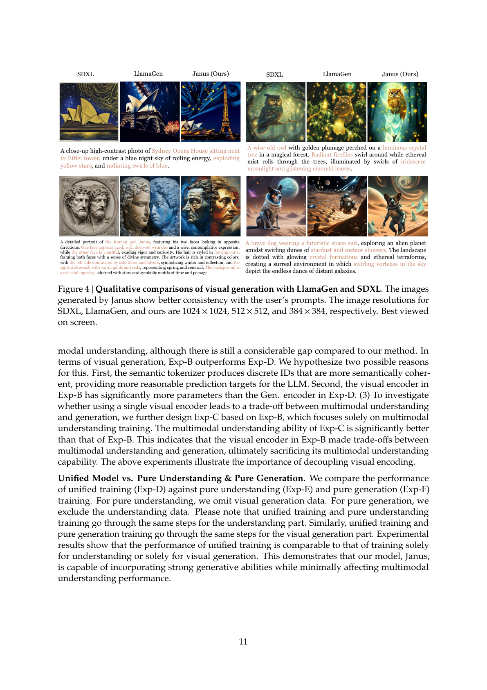

### 4.6 定性结果

**视觉生成可视化。** 图 4 比较 Janus、SDXL 等扩散模型以及自回归模型 LlamaGen。结果显示，Janus 的视觉生成指令遵循更强，能准确捕获用户提示中的大部分细节，体现统一模型在视觉生成领域的潜力。更多可视化见附录 B。

**表情包图像的多模态理解。** 图 5 比较 Janus、Chameleon 与 Show-o 对幽默表情包的理解。Janus 能准确解读文字并捕捉表情包传达的情绪；Chameleon 和 Show-o 都难以正确识别图中文字。此外，Chameleon 无法识别表情包中的对象，Show-o 则误判狗的颜色。

这些例子说明，相较 Chameleon 与 Show-o 共用的编码器，解耦视觉编码器显著提高 Janus 的细粒度多模态理解。更多示例见附录 B。

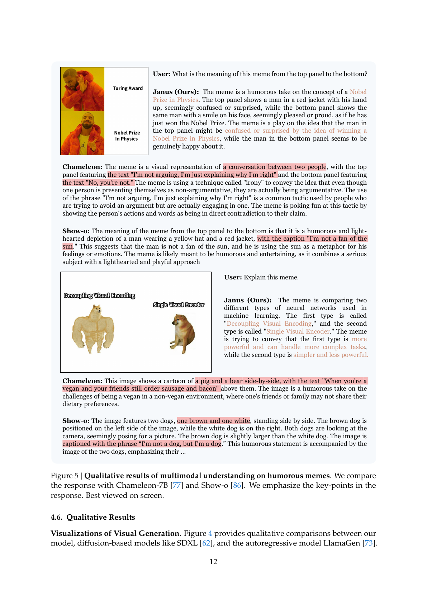

## 5 结论

本文提出 Janus，一个简单、统一、可扩展的多模态理解与生成模型。其核心思想是把多模态理解与生成的视觉编码解耦，从而缓解两项任务对视觉编码器提出不同要求所引发的冲突。大量实验验证了 Janus 的有效性与领先性能。

Janus 还具有灵活、易扩展的特点。除理解与生成两方面都具有显著提升潜力外，它也能轻松纳入更多输入模态。这些优势表明，Janus 可以为下一代多模态通用模型的开发提供启发。

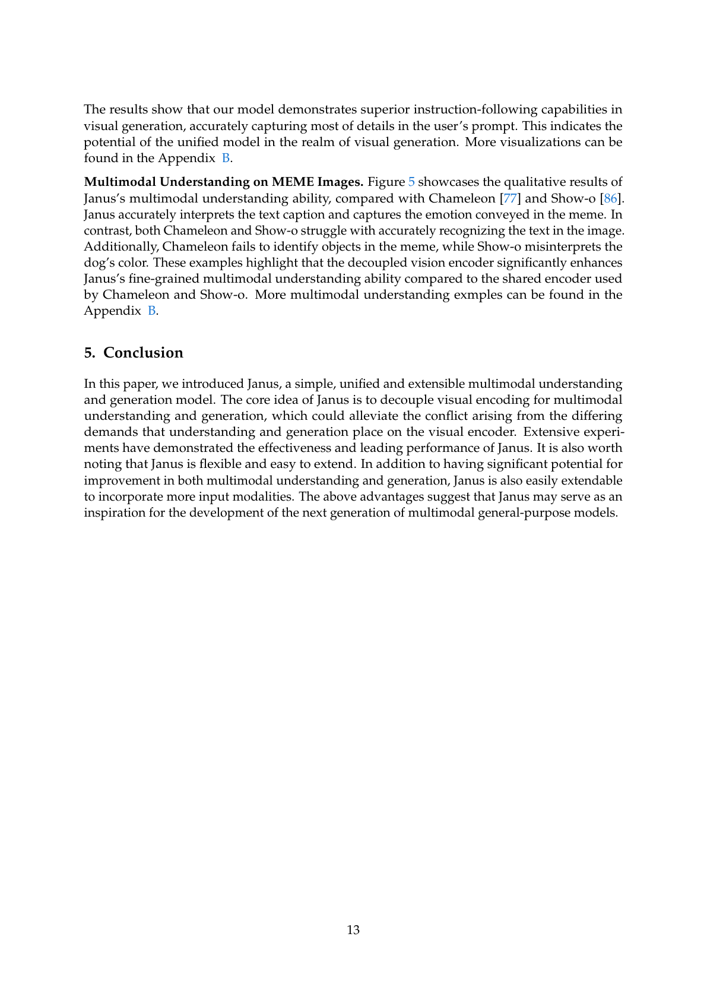

## 附录

## 附录 A 消融研究所用语义词元化器细节

### A.1 语义词元化器架构

图 6 展示语义词元化器的架构与使用方法。训练时，用预训练 SigLIP 监督语义信息重建，同时用原始图像监督 RGB 值重建。与 LLM 集成时，语义解码器输出具有高层语义的连续特征，经适配器后作为 LLM 输入。需要强调，语义词元化器只用于消融研究，不用于主实验。

我们以已有词元化器架构为基础构建语义词元化器，下采样率为 16。除原有 CNN 像素解码器外，在向量量化之后增加语义解码器分支。语义解码器是 12 层 ViT，含 12 个注意力头，隐含维度为 768。它采用因果注意力遮罩，以便与 LLM 集成时执行下一词元预测。

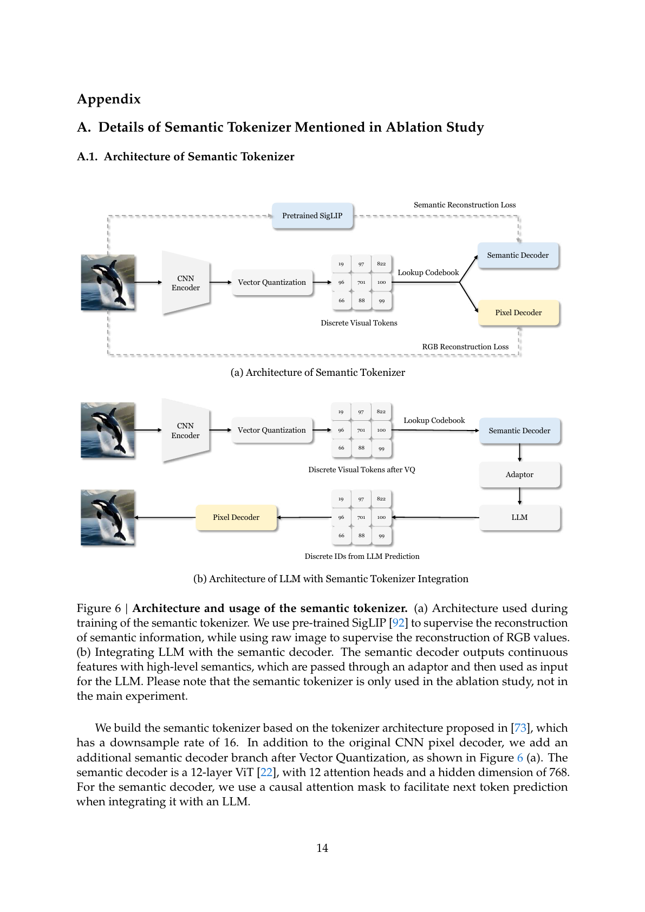

### A.2 训练

**训练流程。** 语义词元化器从头开始，分两阶段训练。第一阶段在 ImageNet-1k 上训练 40 个轮次；第二阶段在 5000 万幅图像上微调一个轮次，这些图像来自 Janus 预训练使用的视觉生成数据。恒定学习率为 $10^{-4}$，批大小为 128。

**训练损失。** 损失由两部分组成。一方面使用 RGB 重建损失；另一方面以 SigLIP-Large-Patch16-384 为教师，监督语义解码器的语义特征重建，并采用 BEiT-v2 的损失。具体而言，最大化语义解码器预测特征与 SigLIP 输出之间的余弦相似度。语义重建损失权重为 0.25。

### A.3 与 LLM 集成

图 6（b）展示语义词元化器与 LLM 的集成。图像先通过 CNN 编码器、向量量化和语义解码器转成连续特征，再由 LLM 处理并预测图像编号，最后由像素解码器把离散编号转换为 RGB 值。

## 附录 B 更多定性结果

**更多文本到图像生成可视化。** 图 7 给出更多生成结果，Janus 能生成高质量图像并紧密遵循提示。图 8 进一步探索多语言文本到图像能力。令人惊喜的是，尽管训练数据只有英语文本到图像样本，Janus 仍能处理其他语言。我们认为这来自原始大语言模型的内在特征：LLM 先把多种语言映射到统一语义空间，使 Janus 无需额外训练便能自然执行多语言生成。

**更多多模态理解结果。** 图 9 展示更多结果。Janus 在处理不同上下文输入时表现出色，体现强大理解能力。

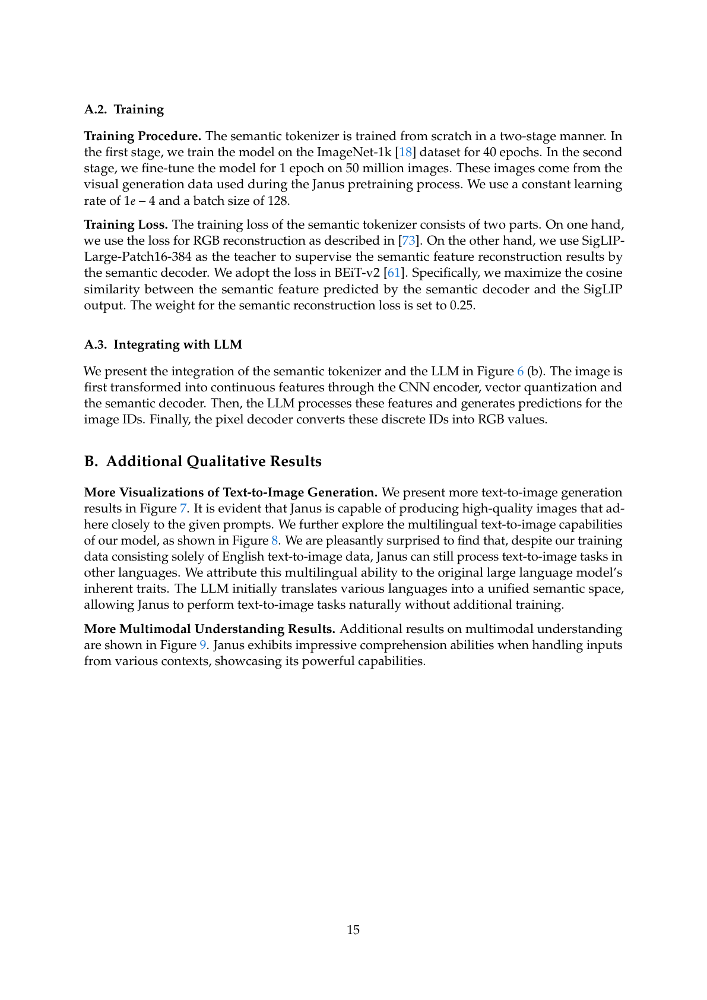

图 7 展示 12 组详细英语提示及相应文本到图像生成结果。为便于观察，图像被上采样到 $1024\times1024$。

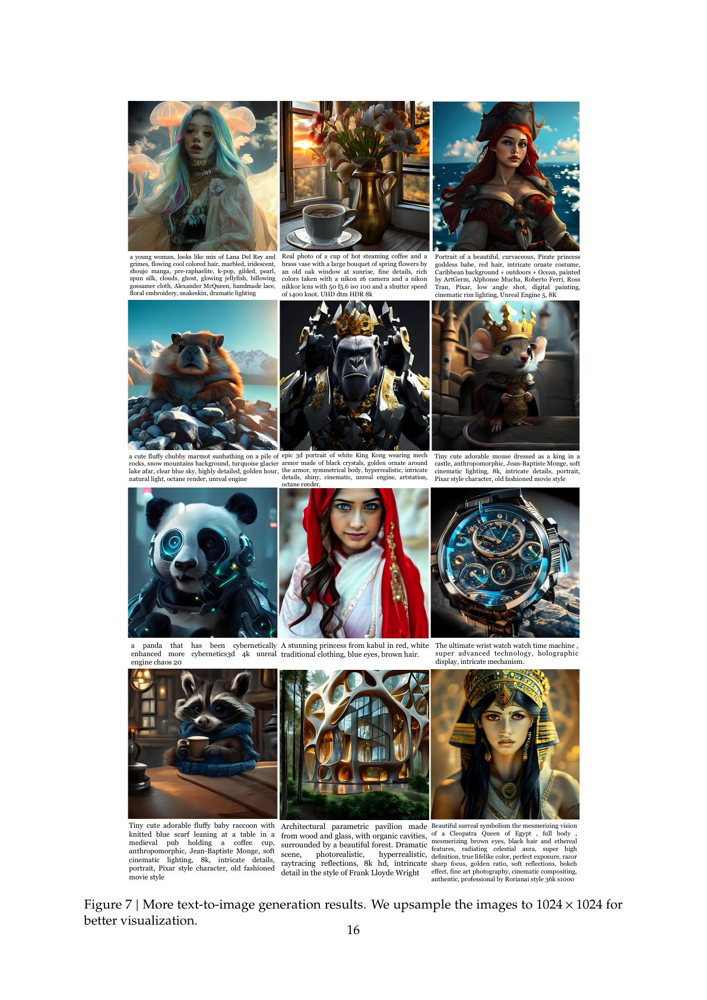

图 8 将 Janus 与 LlamaGen 的多语言文本到图像结果比较。训练只使用英语文本到图像数据，但 Janus 涌现出多语言能力。提示从左到右分别使用英语、中文、法语、日语，以及带表情符号的英语。

图 9 展示更多多模态理解能力。Janus 能处理科学图表、艺术图像、LaTeX 公式图像等不同上下文：它可以从公式图像生成 LaTeX 代码、从图表生成绘图代码、识别 CLIP 架构图，并解释艺术图像的趣味所在。

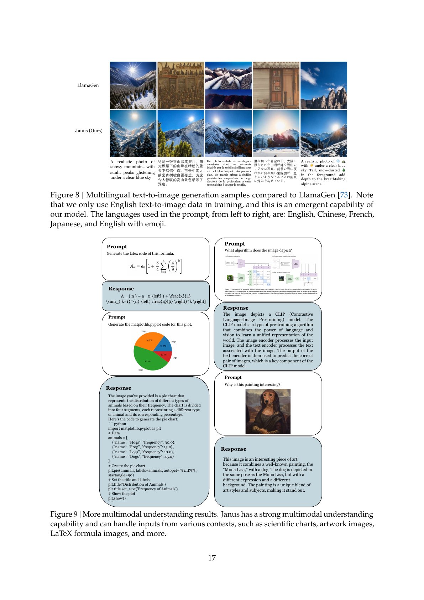

## 参考文献（原文截图）

参考文献中的作者姓名、英文论文题名、出版信息、链接和编号按原论文准确保留。

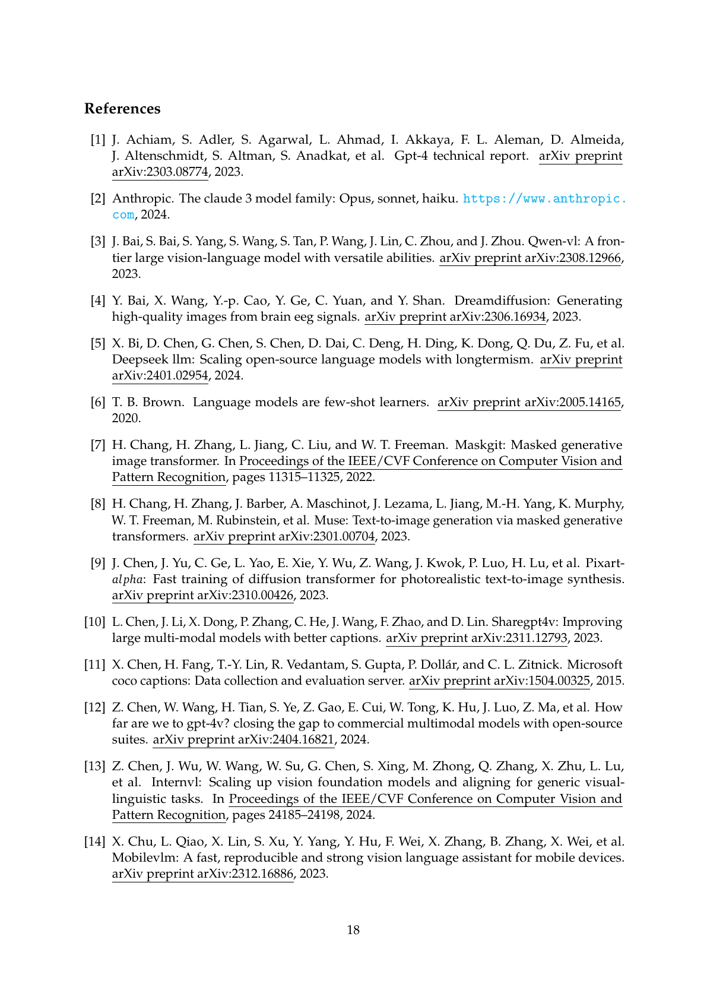

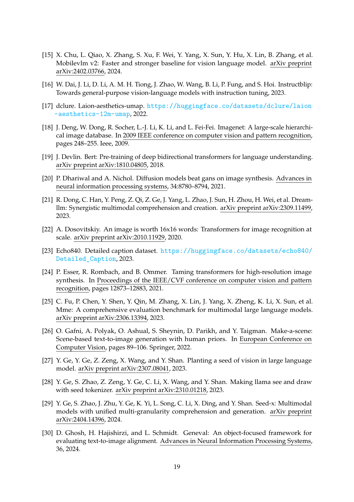

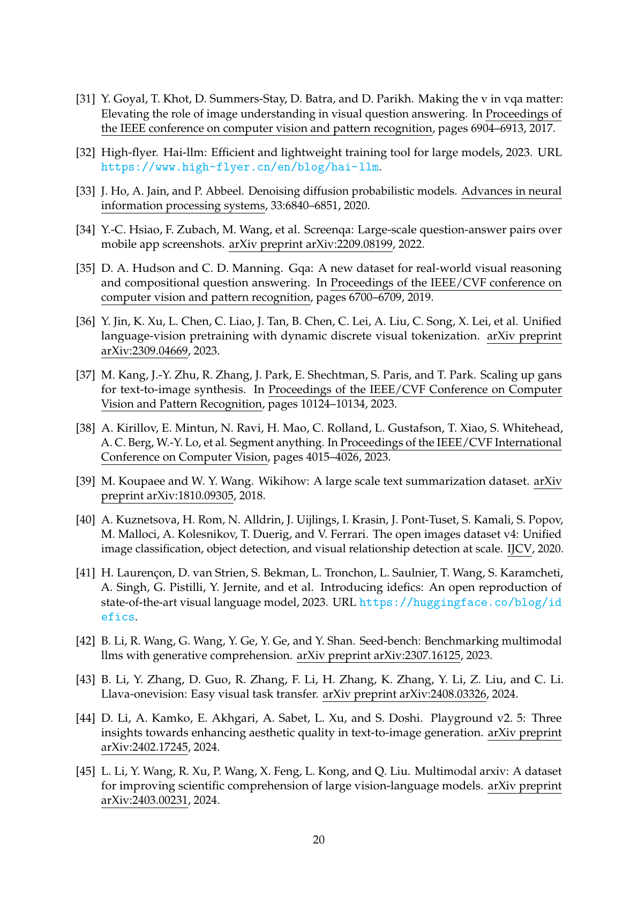

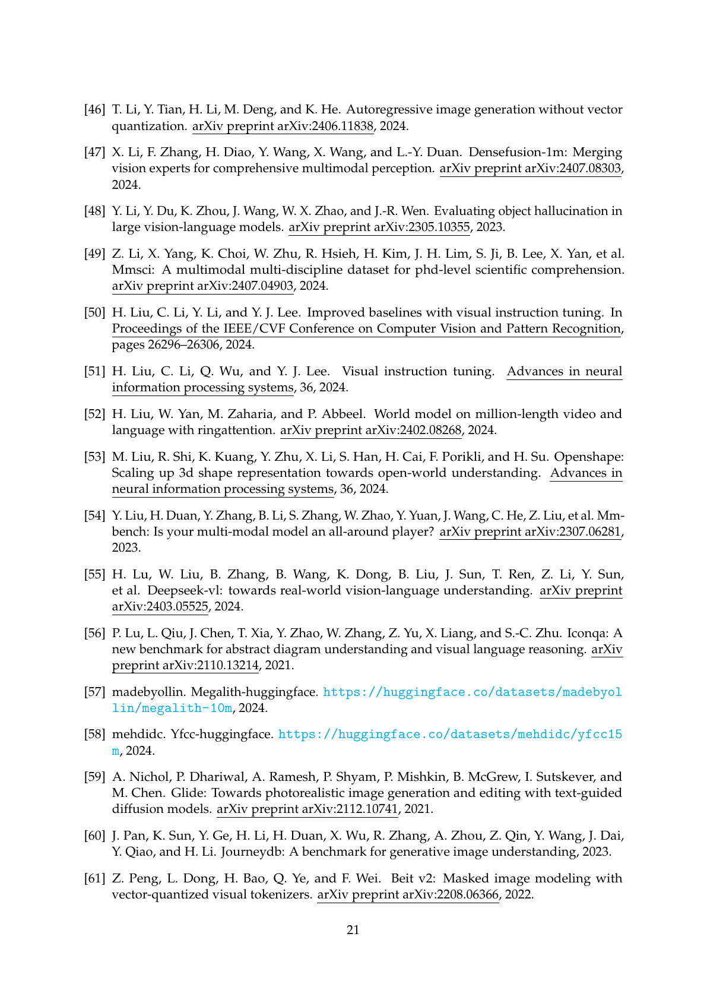

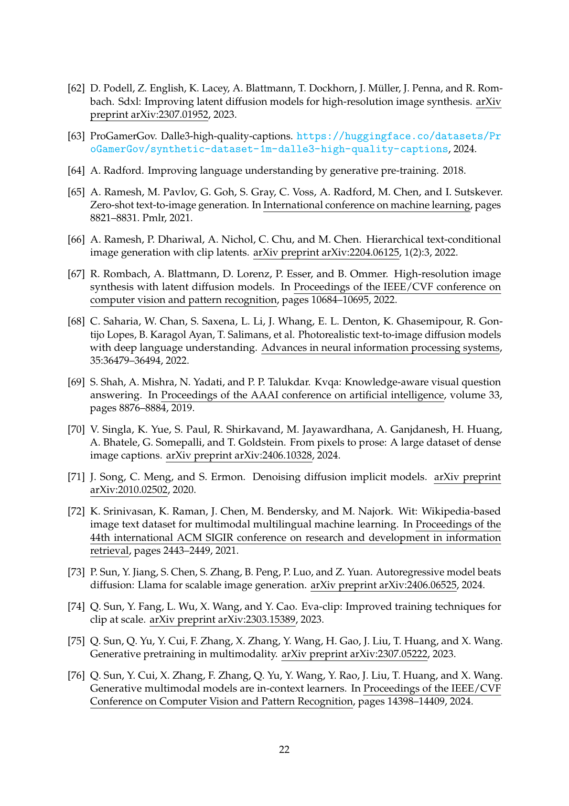

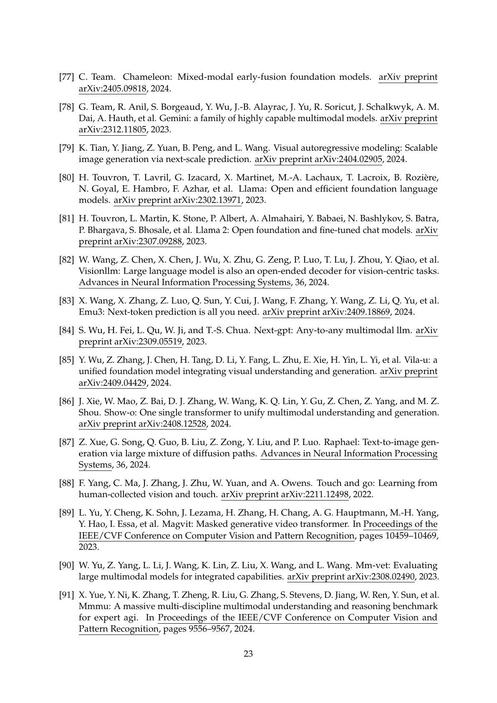

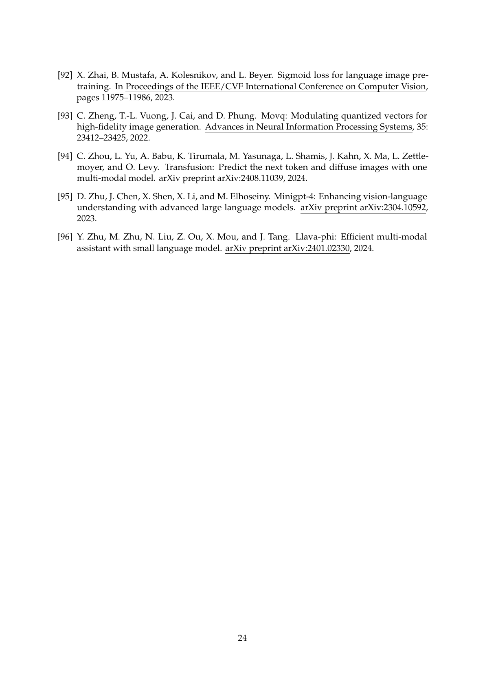
