# Mixtral：专家混合模型

**作者：** Albert Q. Jiang、Alexandre Sablayrolles、Antoine Roux、Arthur Mensch、Blanche Savary、Chris Bamford、Devendra Singh Chaplot、Diego de las Casas、Emma Bou Hanna、Florian Bressand、Gianna Lengyel、Guillaume Bour、Guillaume Lample、Lélio Renard Lavaud、Lucile Saulnier、Marie-Anne Lachaux、Pierre Stock、Sandeep Subramanian、Sophia Yang、Szymon Antoniak、Teven Le Scao、Théophile Gervet、Thibaut Lavril、Thomas Wang、Timothée Lacroix、William El Sayed  
**论文版本：** arXiv:2401.04088v1，2024 年 1 月 8 日  
**译文说明：** 本译文按原论文内容顺序逐段编排，标题、正文及图表说明均译为中文；模型名、数据集名与通行技术缩写保留原写法。原论文中的图、表、排行榜、参考文献与附录图均以对应整页截图保留，并置于相关正文附近。

## 摘要

我们介绍 Mixtral 8x7B，这是一种稀疏专家混合语言模型。Mixtral 的整体架构与 Mistral 7B 相同，区别在于每一层都包含 8 个前馈模块，也就是 8 位“专家”。对于每个词元，路由网络都会在每一层选择两位专家处理当前状态，再合并两者的输出。尽管每个词元一次只经过两位专家，不同时间步选中的专家却可以不同。因此，每个词元可以接触总计 470 亿个参数，而推理时实际激活的参数只有 130 亿。Mixtral 使用 3.2 万词元上下文长度训练，在所有评估基准上均达到或超过 Llama 2 70B 与 GPT-3.5；尤其在数学、代码生成和多语言基准上大幅领先 Llama 2 70B。我们还提供经过指令遵循微调的 Mixtral 8x7B - Instruct；在人类评测基准上，它超过 GPT-3.5 Turbo、Claude-2.1、Gemini Pro 与 Llama 2 70B-Chat。基座模型和指令模型均以 Apache 2.0 许可证发布。

**代码：** https://github.com/mistralai/mistral-src  
**网页：** https://mistral.ai/news/mixtral-of-experts/

## 1 引言

本文介绍 Mixtral 8x7B：一个采用稀疏专家混合架构、开放权重并以 Apache 2.0 许可证发布的模型。Mixtral 在大多数基准上超过 Llama 2 70B 和 GPT-3.5。由于它处理每个词元时只使用全部参数的一个子集，因此在小批量场景下能够获得更快的推理速度，在大批量场景下则能够实现更高吞吐量。

Mixtral 是一个稀疏专家混合网络。它采用仅解码器架构，其中前馈模块可以从 8 组彼此独立的参数中选择。对于每一层的每个词元，路由网络都会选择其中两组，也就是两位“专家”，由它们处理该词元，再把两者的输出相加合并。这项技术在控制成本和延迟的同时增加模型参数量，因为模型处理每个词元时只会使用全部参数中的一部分。

Mixtral 使用多语言数据进行预训练，上下文长度为 3.2 万词元。在多项基准上，它的表现达到或超过 Llama 2 70B 与 GPT-3.5。尤其是在数学、代码生成以及需要多语言理解的任务上，Mixtral 展现出更强的能力，在这些领域显著超过 Llama 2 70B。实验表明，无论序列长度如何，也无论信息出现在序列中的什么位置，Mixtral 都能从 3.2 万词元的上下文窗口中成功取回信息。

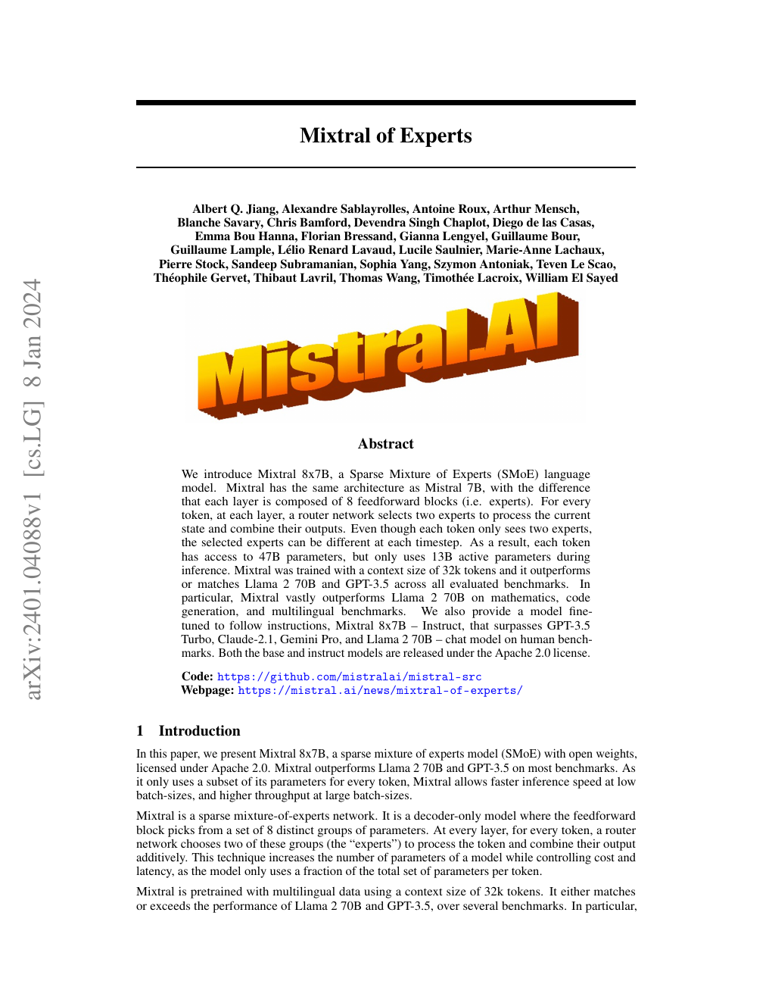

我们还介绍 Mixtral 8x7B - Instruct。这是一个使用监督微调与直接偏好优化（DPO）[25] 进行指令遵循微调的聊天模型。在人类评测基准上，它明显超过 GPT-3.5 Turbo、Claude-2.1、Gemini Pro 和 Llama 2 70B-Chat。Mixtral - Instruct 在 BBQ、BOLD 等基准上也表现出更少的偏见和更加均衡的情感倾向。

我们以 Apache 2.0 许可证发布 Mixtral 8x7B 和 Mixtral 8x7B - Instruct，允许免费用于学术和商业用途，从而保证广泛可用，并为多种应用创造可能。[^1]

为了让社区能够通过完全开源的软件栈运行 Mixtral，我们向 vLLM 项目提交了修改，使它能够集成 Megablocks CUDA 内核以实现高效推理。SkyPilot 还支持在云端任意实例上部署 vLLM 端点。

**图 1：专家混合层。** 路由器把每个输入向量分配给 8 位专家中的 2 位。该层的输出是两位入选专家输出的加权和。在 Mixtral 中，每位专家都是普通 Transformer 架构中的标准前馈模块。

## 2 架构细节

Mixtral 建立在 Transformer 架构 [31] 之上，并采用文献 [18] 所述的相同修改。主要区别在于：Mixtral 支持完整稠密的 3.2 万词元上下文长度，并且用专家混合层取代前馈模块，详见 2.1 节。模型架构参数汇总于表 1。

**表 1：模型架构。** 模型维度为 4096，共 32 层；注意力头维度为 128，隐藏维度为 14336，包含 32 个注意力头和 8 个键值头；上下文长度为 32768，词表大小为 32000；专家数量为 8，每个词元选择 2 位专家。

### 2.1 稀疏专家混合

下面简要介绍专家混合层，结构见图 1。更深入的概述可参阅文献 [12]。对于给定输入 $x$，MoE 模块的输出由各专家网络输出的加权和决定，其中权重来自门控网络的输出。也就是说，给定 $n$ 个专家网络 $\{E_0,E_1,\ldots,E_{n-1}\}$，专家层的输出为：

$$
\sum_{i=0}^{n-1}G(x)_i\cdot E_i(x).
$$

这里，$G(x)_i$ 表示门控网络 $n$ 维输出中对应第 $i$ 位专家的分量，$E_i(x)$ 是第 $i$ 个专家网络的输出。如果门控向量是稀疏的，我们便可以不计算门值为零的专家输出。$G(x)$ 有多种实现方式 [6、15、35]；一种简单且性能良好的实现，是对线性层输出中最大的 $K$ 个逻辑值应用 Softmax [28]。我们采用：

$$
G(x):=\operatorname{Softmax}(\operatorname{TopK}(x\cdot W_g)),
$$

其中，当 $\ell_i$ 属于逻辑值向量 $\ell\in\mathbb{R}^n$ 最大的 $K$ 个分量时，$(\operatorname{TopK}(\ell))_i:=\ell_i$；否则，$(\operatorname{TopK}(\ell))_i:=-\infty$。$K$ 表示每个词元使用的专家数量，是调节每个词元处理计算量的超参数。当 $K$ 保持不变而 $n$ 增大时，可以增加模型参数量，同时让计算成本基本保持不变。

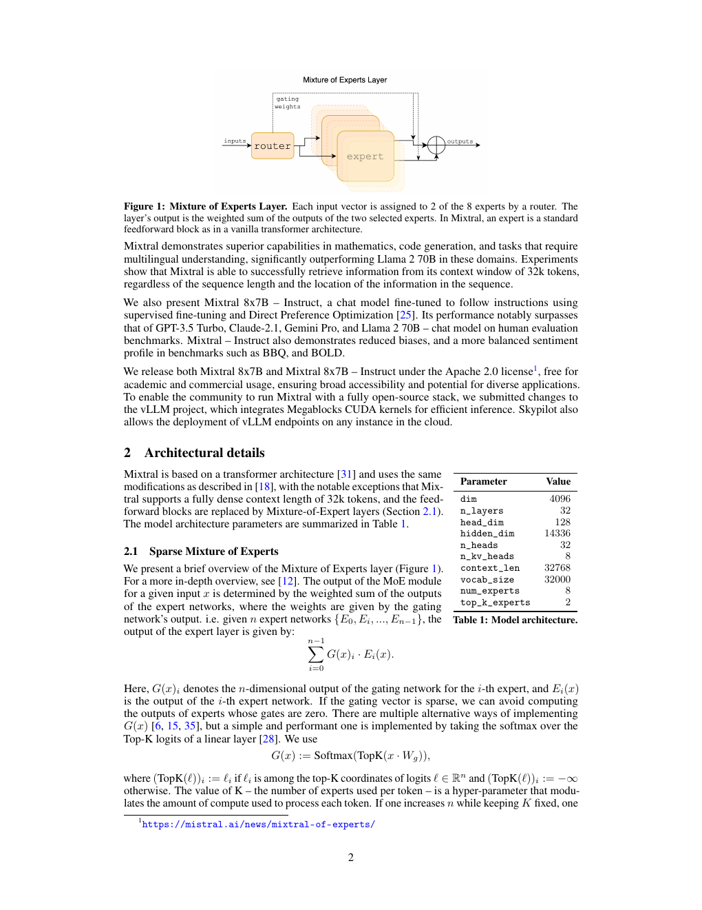

由此需要区分模型的总参数量与处理单个词元所用的参数量。前者通常称为稀疏参数量，会随 $n$ 增长；后者称为激活参数量，会随 $K$ 增长，最高不超过 $n$ 对应的全部参数。

MoE 层可以借助专用高性能内核在单张 GPU 上高效运行。例如，Megablocks [13] 把 MoE 层的前馈网络运算转化为大型稀疏矩阵乘法，不仅显著提高执行速度，还能自然处理不同专家被分配到数量不同的词元这一情况。此外，MoE 层可以通过标准模型并行技术分布到多张 GPU 上，也可以使用一种称为专家并行（EP）[28] 的专门切分策略。执行 MoE 层时，需要由特定专家处理的词元会被路由到承载该专家的 GPU，专家输出随后再返回词元原来的位置。需要注意，专家并行会带来负载均衡方面的挑战：必须把工作负载均匀分配到各张 GPU，避免个别 GPU 过载或形成计算瓶颈。

在 Transformer 模型中，MoE 层对每个词元独立应用，并取代 Transformer 模块中的前馈网络子层。Mixtral 使用与专家函数 $E_i(x)$ 相同的 SwiGLU 架构，并令 $K=2$。这意味着每个词元都会被路由到两个采用不同权重的 SwiGLU 子模块。综合起来，输入词元 $x$ 的输出 $y$ 计算如下：

$$
y=\sum_{i=0}^{n-1}\operatorname{Softmax}(\operatorname{Top2}(x\cdot W_g))_i\cdot\operatorname{SwiGLU}_i(x).
$$

这一形式与 GShard 架构 [21] 类似，但有两点不同：第一，我们用 MoE 层替换全部前馈网络子模块，而 GShard 每隔一个模块才替换一次；第二，GShard 对每个词元分配的第二位专家使用了更复杂的门控策略。

## 3 结果

我们将 Mixtral 与 Llama 比较，并使用自己的评估流程重新运行全部基准，以保证比较公平。性能评估覆盖多类任务，具体如下：

- **常识推理，零样本：** HellaSwag [32]、WinoGrande [26]、PIQA [3]、SIQA [27]、OpenBookQA [22]、ARC-Easy、ARC-Challenge [8]、CommonsenseQA [30]。
- **世界知识，五样本：** NaturalQuestions [20]、TriviaQA [19]。
- **阅读理解，零样本：** BoolQ [7]、QuAC [5]。
- **数学：** GSM8K [9] 使用八样本提示与 maj@8；MATH [17] 使用四样本提示与 maj@4。
- **代码：** HumanEval [4] 使用零样本提示；MBPP [1] 使用三样本提示。
- **常用综合结果：** MMLU [16] 使用五样本提示；BBH [29] 使用三样本提示；AGI Eval [34] 使用三至五样本提示，并且只评估英文选择题。

**图 2：Mixtral 与不同 Llama 模型在大量基准上的表现。** 为了准确比较，我们使用自己的评估流程在所有指标上重新评估全部模型。Mixtral 在所有基准上达到或超过 Llama 2 70B；尤其在数学和代码生成方面优势巨大。

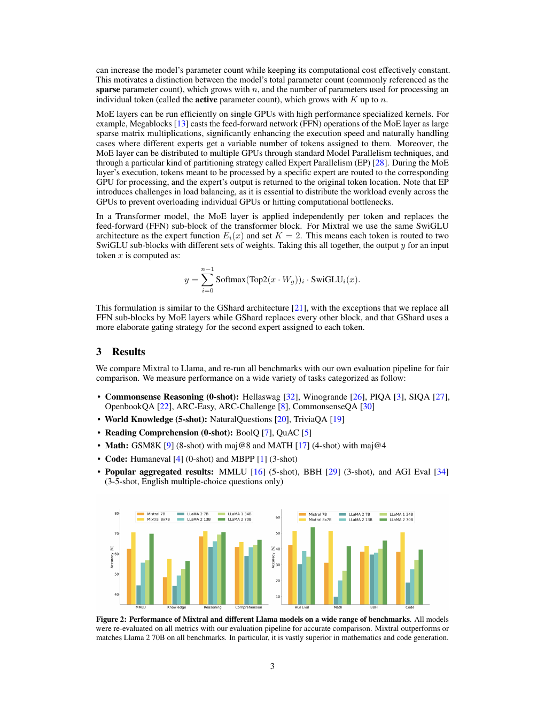

Mixtral、Mistral 7B、Llama 2 7B/13B/70B 与 Llama 1 34B 的详细结果见表 2。[^2] 图 2 按不同类别比较 Mixtral 与各个 Llama 模型。Mixtral 在大多数指标上超过 Llama 2 70B，尤其在代码和数学基准上展现出更强性能。

**表 2：Mixtral 与 Llama 的比较。** 推理时只使用约五分之一激活参数的情况下，Mixtral 在几乎所有常用基准上都达到或超过 Llama 2 70B。

**图 3：Mistral 与 Llama 2 的分组结果。** 图中比较 Mistral 7B、Mixtral 8x7B 与 Llama 2 7B/13B/70B 在 MMLU、常识推理、世界知识和阅读理解、数学与代码类别上的表现。除阅读理解基准外，Mixtral 在所有类别上都大幅超过 Llama 2 70B，同时激活参数量只有后者的五分之一；它在代码和数学上的优势尤其显著。

### 3.1 规模与效率

我们将 Mixtral 的表现与 Llama 2 系列比较，以理解它在成本与性能坐标中的效率，结果见图 3。作为稀疏专家混合模型，Mixtral 处理每个词元时只使用 130 亿个激活参数。即使激活参数量低五倍，它仍能在大多数类别上超过 Llama 2 70B。

需要注意，这项分析关注激活参数量，详见 2.1 节；它与推理计算成本直接成正比，但没有考虑内存成本与硬件利用率。为 Mixtral 提供服务时，内存成本与其 470 亿稀疏参数量成正比，但这仍小于 Llama 2 70B。就设备利用率而言，SMoE 层会因为路由机制以及单个设备运行多位专家时增加的内存读取而引入额外开销。因此，它更适合批处理工作负载，因为此时能够达到较好的算术强度。

### 3.2 与 Llama 2 70B 和 GPT-3.5 比较

表 3 报告 Mixtral 8x7B 与 Llama 2 70B、GPT-3.5 的性能比较。可以看到，Mixtral 与另外两个模型相当或更好。在 MMLU 上，尽管总容量显著更小，Mixtral 为 470 亿参数，而 Llama 2 为 700 亿参数，它仍取得更好表现。对于 MT-Bench，我们报告当时可用的最新 GPT-3.5-Turbo 模型 `gpt-3.5-turbo-1106` 的性能。

**表 3：Mixtral 与 Llama 2 70B、GPT-3.5 的比较。** Mixtral 在大多数指标上达到或超过 Llama 2 70B 和 GPT-3.5。表中包括 MMLU、HellaSwag、ARC Challenge、WinoGrande、MBPP、GSM8K 与面向指令模型的 MT-Bench。

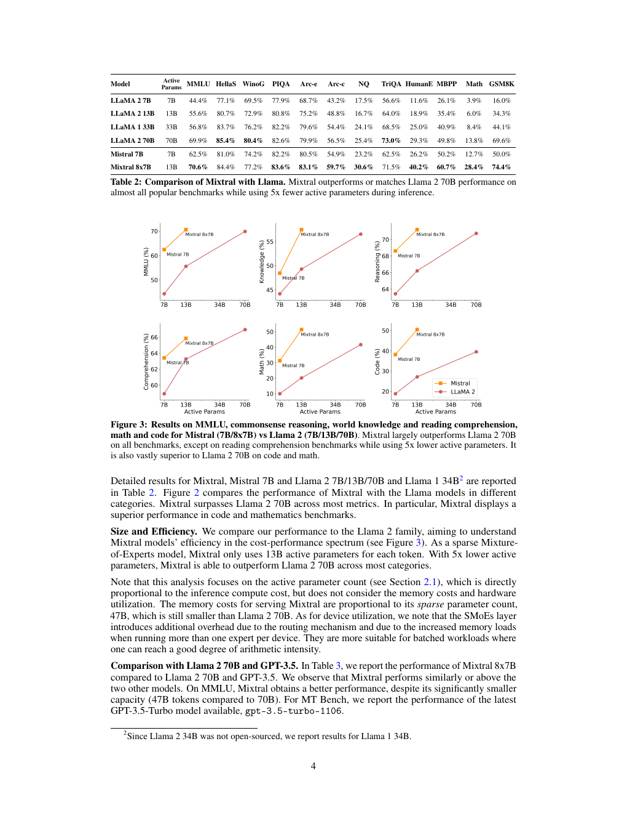

### 3.3 评估差异

在部分基准上，我们的评估协议与 Llama 2 论文报告的协议有所不同：第一，MBPP 使用经过人工核验的子集；第二，TriviaQA 不提供维基百科上下文。

### 3.4 多语言基准

与 Mistral 7B 相比，我们在预训练中显著提高了多语言数据的采样比例。额外的模型容量使 Mixtral 能够在保持较高英语准确率的同时，在多语言基准上取得良好表现。如表 4 所示，Mixtral 在法语、德语、西班牙语和意大利语上都显著超过 Llama 2 70B。

**表 4：Mixtral 与 Llama 在多语言基准上的比较。** 在法语、德语、西班牙语和意大利语四种语言的 ARC Challenge、HellaSwag 与 MMLU 上，Mixtral 均超过 Llama 2 70B。

### 3.5 长程性能

为了评估 Mixtral 处理长上下文的能力，我们在文献 [23] 提出的密钥检索任务上对其进行测试。这个合成任务专门衡量模型能否找回随机插入长提示中的密钥。图 4 左侧结果表明，无论上下文长度如何，也无论密钥位于序列中的什么位置，Mixtral 的检索准确率都是 100%。图 4 右侧显示，随着上下文长度增加，Mixtral 在 Proof-Pile 数据集 [2] 一个子集上的困惑度单调下降。

**图 4：Mixtral 的长程性能。** 左图显示，不论密钥位置与输入序列长度如何，Mixtral 在密钥任务上的检索准确率均为 100%；右图显示，随着上下文长度增加，Mixtral 在 Proof-Pile 数据集上的困惑度单调下降。

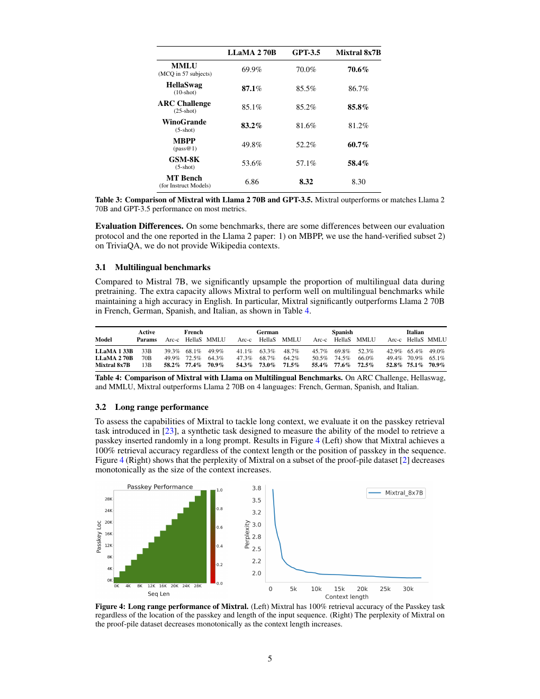

### 3.6 偏见基准

为了找出可以通过微调或偏好建模纠正的潜在缺陷，我们在问答偏见基准 BBQ [24] 与开放式语言生成偏见数据集 BOLD [10] 上测量基座模型的表现。BBQ 由人工编写的问题集构成，针对九类已得到实证记录、与社会相关的偏见：年龄、残障状态、性别认同、国籍、外貌、种族或族裔、宗教、社会经济地位与性取向。BOLD 是一个大规模数据集，包含 23,679 条英文文本生成提示，用于评测五个领域中的偏见。

我们使用自己的评估框架，在 BBQ 与 BOLD 上测试 Llama 2 和 Mixtral，并在图 5 中报告结果。与 Llama 2 相比，Mixtral 在 BBQ 基准上表现出更少的偏见，准确率分别为 56.0% 和 51.5%。对于 BOLD 中的每一类群体，更高的平均情感分数表示情感更积极，更低的标准差表示该群体内部偏见更少。总体而言，Mixtral 表现出的情感比 Llama 2 更积极，各群体内部的方差则与后者相近。

**图 5：偏见基准。** 与 Llama 2 70B 相比，Mixtral 偏见更少，在 BBQ 上准确率更高，在 BOLD 上标准差更低；它所表达的情感也更加积极，表现为 BOLD 平均分更高。

## 4 指令微调

我们先在指令数据集上对 Mixtral - Instruct 进行监督微调（SFT），再在成对反馈数据集上执行直接偏好优化（DPO）[25]。Mixtral - Instruct 在 MT-Bench [33] 上达到 8.30 分，见表 2；这使它成为截至 2023 年 12 月表现最好的开放权重模型。LMSys 进行的独立人工评估结果见图 6。[^3] 结果显示，Mixtral - Instruct 超过 GPT-3.5-Turbo、Gemini Pro、Claude-2.1 与 Llama 2 70B-Chat。

**图 6：LMSys 排行榜。** 截至 2023 年 12 月 22 日，Mixtral 8x7B Instruct v0.1 的 Arena Elo 评分达到 1121，超过 Claude-2.1 的 1117、全部 GPT-3.5-Turbo 版本中的最高分 1117、Gemini Pro 的 1111，以及 Llama-2-70B-Chat 的 1077。Mixtral 当时以明显优势成为最好的开放权重模型。

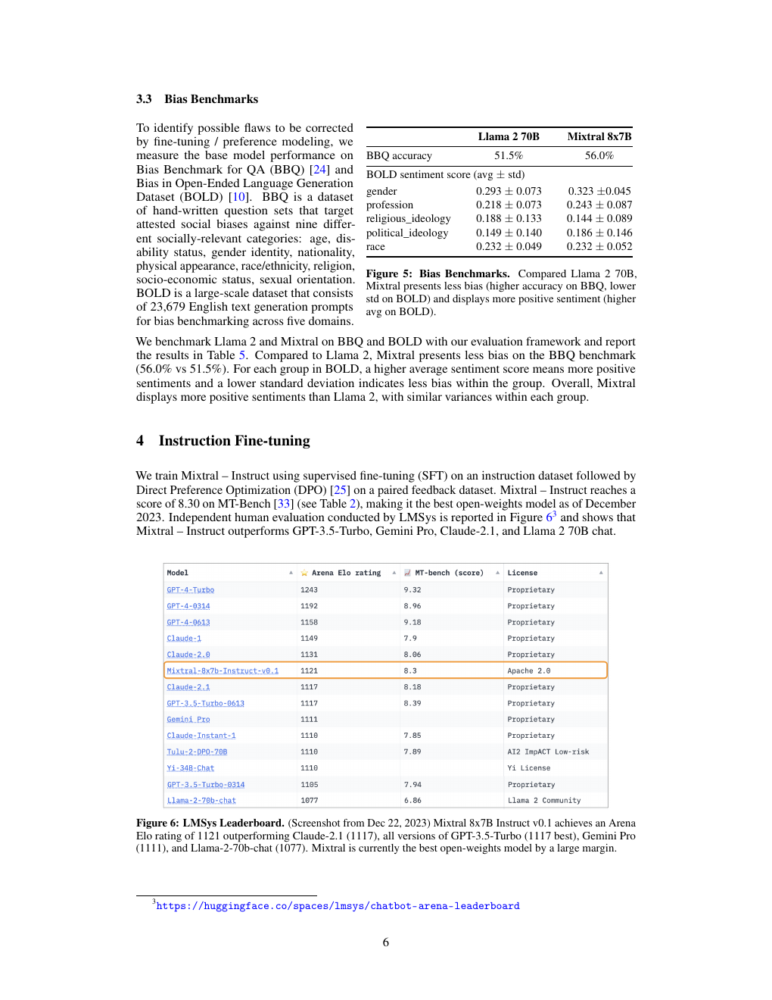

## 5 路由分析

本节对路由器的专家选择进行一项小规模分析。我们尤其希望了解，在训练过程中是否有部分专家专门负责某些特定领域，例如数学、生物学或哲学。

为此，我们测量 The Pile 验证集 [14] 不同子集上的专家选择分布。图 7 展示第 0、15 和 31 层的结果；其中第 0 层和第 31 层分别是模型的第一层与最后一层。令人意外的是，我们没有观察到基于主题分配专家的明显模式。例如，在全部这些层上，ArXiv 论文，也就是使用 LaTeX 编写的文本、生物学文本 PubMed Abstracts，以及哲学文本 PhilPapers 的专家分配分布都非常相似。

只有 DM Mathematics 的专家分布略有不同。这种差异很可能来自该数据集的合成性质，以及它对自然语言范围覆盖有限；这种现象在第一层和最后一层尤其明显，因为这两层的隐藏状态分别与输入嵌入和输出嵌入高度相关。

这些结果表明，路由器的确表现出某种结构化句法行为。图 8 给出来自不同领域的文本示例，包括 Python 代码、数学与英语；每个词元的背景颜色代表路由器为其选择的专家。图中可以看到，Python 中的 `self`、英语中的 `Question` 等词往往会被路由到同一位专家，即使这些词由多个词元组成也是如此。代码中的缩进词元也总是被分配给相同专家，这一现象在第一层和最后一层尤其明显，因为这些层的隐藏状态与模型输入和输出的相关性更强。

**图 7：The Pile 不同领域中的专家选择比例。** 图中展示第 0、15 和 31 层上，分配给各位专家的词元比例。灰色竖向虚线表示 $1/8$，即均匀采样时的预期比例。这里把被路由器选为第一或第二选择的专家都计算在内；附录图 9 进一步拆分了第一选择与第二选择各自的分配比例。

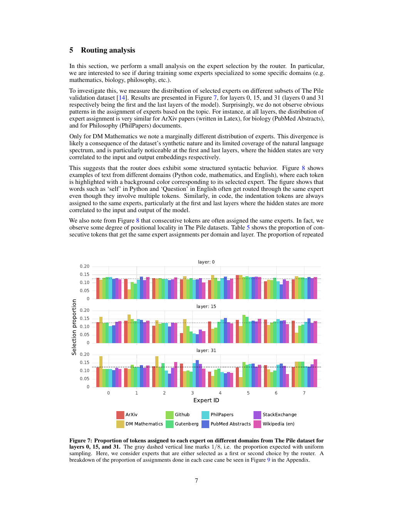

从图 8 还可以看到，连续词元往往会被分配给相同的专家。事实上，我们在 The Pile 各数据集中观察到一定程度的位置局部性。表 5 给出不同领域和不同层上，连续词元获得相同专家分配的比例。更高层中的连续重复分配比例显著高于随机分配。

**表 5：专家分配重复比例。** 我们计算同一位专家被分配给词元 $i$ 及其后继词元 $i+1$ 的比例，并分别报告“首选专家相同”与“连续词元的第一或第二选择中出现同一专家”两种情况。作为参照，随机分配时，首选专家重复的预期比例为 $1/8=12.5\%$；第一或第二选择中出现同一专家的预期比例为 $1-(6/8)(5/7)\approx46\%$。第一层的重复比例接近随机，但第 15 层和第 31 层明显更高。大量重复说明这些层的专家选择具有很强的时间局部性。

这一现象会影响模型快速训练和推理的优化方式。例如，在使用专家并行时，较高的局部性更可能造成某些专家接收过多词元。反过来，这种局部性也可以像文献 [11] 那样用于缓存。附录图 10 给出了全部层和各数据集上同一专家重复频率的更完整视图。

**图 8：按照首选专家着色的文本示例。** 图中每个词元的颜色表示路由器的第一专家选择。专家选择似乎与句法结构的关系比与文本领域的关系更强，这一现象在模型最前面和最后面的层中尤其明显。

## 6 结论

本文介绍 Mixtral 8x7B，这是第一个在开放模型中达到当时最先进性能的专家混合网络。在人类评测基准上，Mixtral 8x7B Instruct 超过 Claude-2.1、Gemini Pro 与 GPT-3.5 Turbo。由于每个时间步只使用两位专家，Mixtral 处理每个词元时仅激活 130 亿个参数，却超过了此前每个词元使用 700 亿参数的最佳模型 Llama 2 70B。我们以 Apache 2.0 许可证公开训练完成的基座模型和微调模型。通过共享这些模型，我们希望推动新技术与新应用的发展，让广泛行业和领域从中受益。

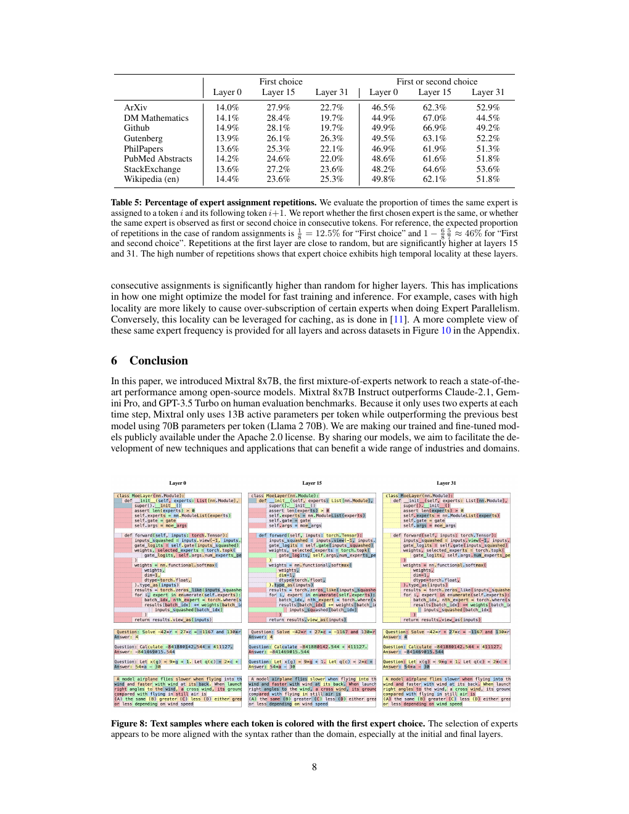

## 致谢

感谢 CoreWeave 与 Scaleway 团队在模型训练期间提供技术支持。感谢 NVIDIA 支持我们集成 TensorRT-LLM 与 Triton，并与我们共同使稀疏专家混合模型兼容 TensorRT-LLM。

## 参考文献

原论文参考文献共三页。为完整保留作者姓名、论文题名、出版信息与链接，以下按 PDF 原始页序收录。

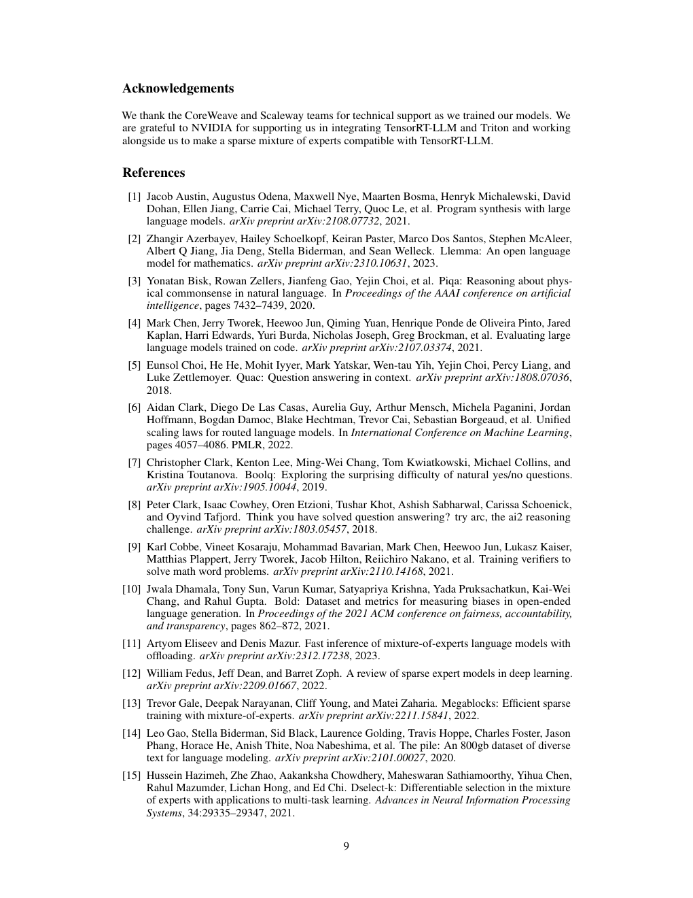

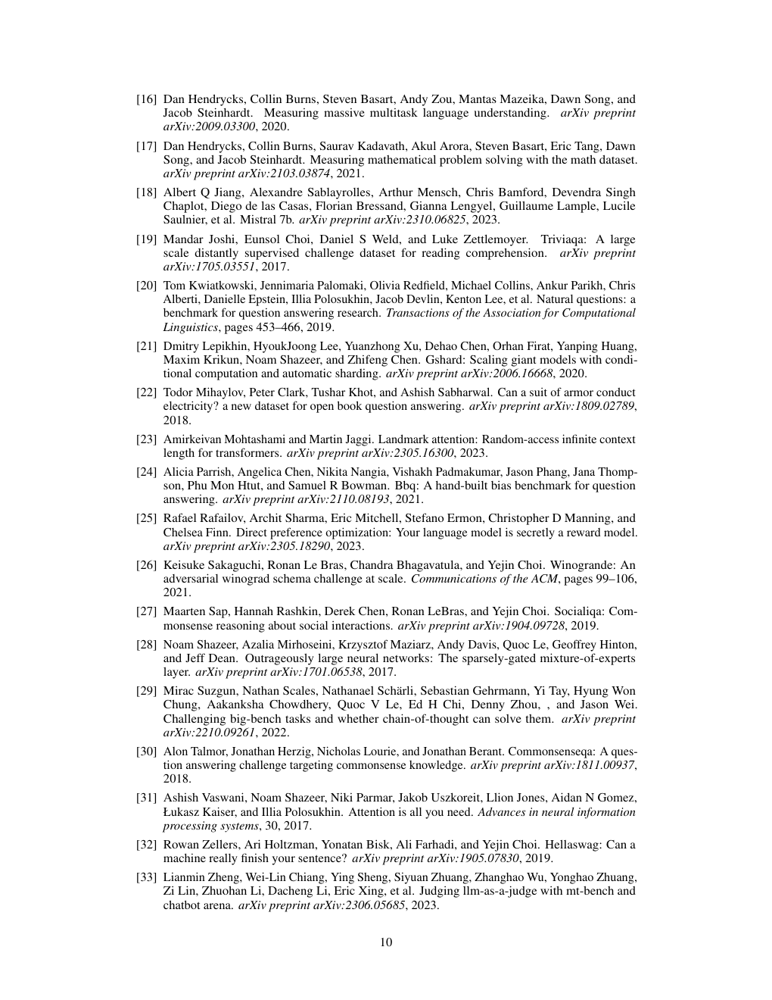

## 附录：专家路由补充结果

**图 9：The Pile 不同子集上的专家选择比例。** 图中分别展示专家被选为第一选择、第二选择或两者任一时的词元比例；“任一选择”与图 7 的统计口径相同。灰色竖向虚线表示 $1/8$，也就是均匀采样时的预期比例。

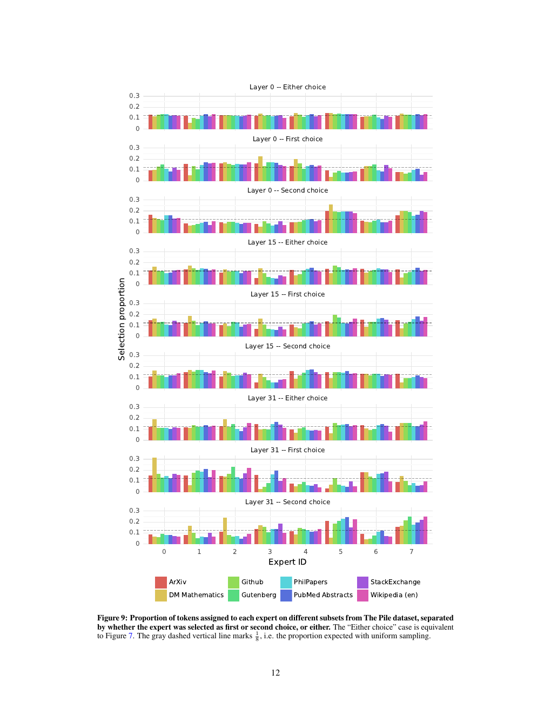

**图 10：各 MoE 层中连续重复分配的比例。** 连续重复分配的发生频率远高于均匀随机分配，虚线表示随机基线。不同数据集的整体模式相似，其中 DM Mathematics 的重复比例较低。

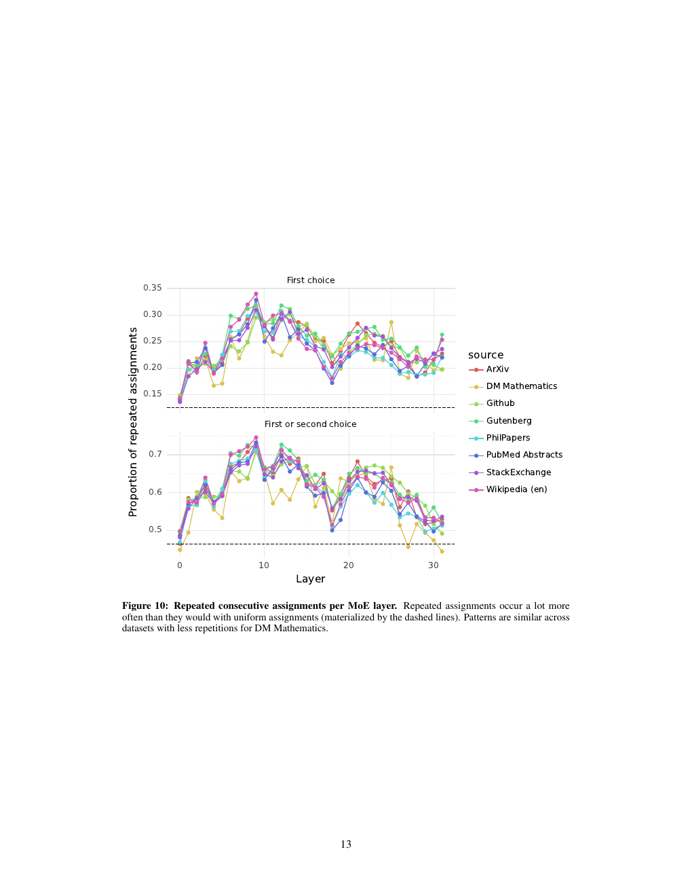

[^1]: Apache 2.0 发布说明：https://mistral.ai/news/mixtral-of-experts/
[^2]: Llama 2 34B 没有开源，因此这里报告 Llama 1 34B 的结果。
[^3]: LMSys Chatbot Arena 排行榜：https://huggingface.co/spaces/lmsys/chatbot-arena-leaderboard
