# OLMo：加速语言模型科学研究

**作者：** Dirk Groeneveld、Iz Beltagy、Pete Walsh、Akshita Bhagia、Rodney Kinney、Oyvind Tafjord、Ananya Harsh Jha、Hamish Ivison、Ian Magnusson、Yizhong Wang、Shane Arora、David Atkinson、Russell Authur、Khyathi Raghavi Chandu、Arman Cohan、Jennifer Dumas、Yanai Elazar、Yuling Gu、Jack Hessel、Tushar Khot、William Merrill、Jacob Morrison、Niklas Muennighoff、Aakanksha Naik、Crystal Nam、Matthew E. Peters、Valentina Pyatkin、Abhilasha Ravichander、Dustin Schwenk、Saurabh Shah、Will Smith、Emma Strubell、Nishant Subramani、Mitchell Wortsman、Pradeep Dasigi、Nathan Lambert、Kyle Richardson、Luke Zettlemoyer、Jesse Dodge、Kyle Lo、Luca Soldaini、Noah A. Smith、Hannaneh Hajishirzi  
**机构：** 艾伦人工智能研究所；华盛顿大学；耶鲁大学；纽约大学；卡内基梅隆大学  
**论文版本：** arXiv:2402.00838v4，2024 年 6 月 7 日  
**项目：** https://allenai.org/olmo  
**译文说明：** 本译文按原论文内容顺序逐段编排，标题、正文及图表说明均译为中文；模型名、数据集名与通行技术缩写保留原写法。原论文的表格、曲线、参考文献和附录结果均以对应整页截图保留，并置于相关正文附近。

## 摘要

语言模型已经广泛存在于自然语言处理研究与商业产品中。随着商业重要性激增，最强大的模型逐渐封闭在专有接口之后，训练数据、架构与开发过程中的重要细节都未公开。要科学研究这些模型，包括它们的偏见与潜在风险，这些细节至关重要；因此，研究社区必须能够使用强大且真正开放的语言模型。为此，我们构建 OLMo——一个有竞争力、真正开放的语言模型，旨在推动语言模型的科学研究。与多数只发布模型权重和推理代码的工作不同，我们同时公开训练数据、训练代码与评估代码，希望为开放研究社区赋能并激发新一轮创新。

## 1 引言

多年来，语言模型一直处于自然语言处理技术的中心（Rosenfeld，2000；Bengio 等，2003；Mikolov 等，2013；Peters 等，2018；Brown 等，2020）。近期，大规模预训练和用于对齐的人工标注使它们产生商业价值（OpenAI，2023）；但商业价值上升后，最大的模型被封闭在专有接口之后，重要细节不再披露。

我们认为，研究社区完整访问开放语言模型，对科学研究其优势、弱点、偏见和风险至关重要。因此，我们推出 OLMo：一个强大且真正开放的语言模型，并同时开放训练数据、训练与评估代码、中间检查点和训练日志。

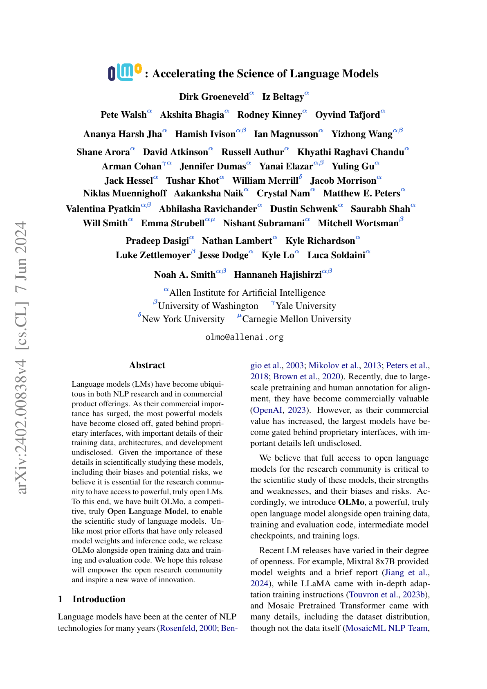

近期发布的语言模型开放程度各不相同。例如，Mixtral 8x7B 提供模型权重与简短报告，LLaMA 给出详细适配训练说明，Mosaic Pretrained Transformer 公开许多细节，包括数据集分布，但没有公开数据本身。Falcon 部分公开预训练数据；开放程度最高的 Pythia 套件与 BLOOM 则发布训练代码、模型检查点、数据等。

OLMo 公开从数据、训练到评估工具的完整框架，包括面向多种硬件的多个训练检查点、训练日志、实际使用的数据集，并采用宽松许可证。LLM360 近期也以类似目标开展工作；OLMo 则把真正开放模型与 Llama 2 等先进模型之间的能力差距进一步缩小。该项目吸收了此前不同开放程度工作的经验。我们相信，数量众多且多样化的开放模型，是推动语言模型理解科学进步、提升模型效用工程进步的最佳希望。

OLMo 框架包含构建和研究语言模型所需的工具与资源：

- 训练与建模方面，提供完整模型权重、训练代码、训练日志和推理代码。发布的 7B 模型包含四个由不同架构、优化器和训练硬件产生的变体，另有一个 1B 模型；全部至少训练 2 万亿词元。HuggingFace 上还以版本形式提供数百个中间检查点。
- 数据集方面，完整公开模型使用的 Dolma 训练数据、生成数据的代码，以及预训练数据分析工具。
- 评估方面，基于 Catwalk 做下游评估，基于 Paloma 做困惑度评估。
- 适配方面，使用 Open Instruct 在指令与反馈数据上训练。

全部代码与权重均以 Apache 2.0 许可证发布。

我们希望借此推动对语言模型中尚未充分理解的方面进行研究，例如预训练数据与模型能力之间的关系、设计与超参数选择的影响，以及不同优化方法如何影响训练。本文还报告在这一规模上成功训练语言模型所获得的经验与重要细节。

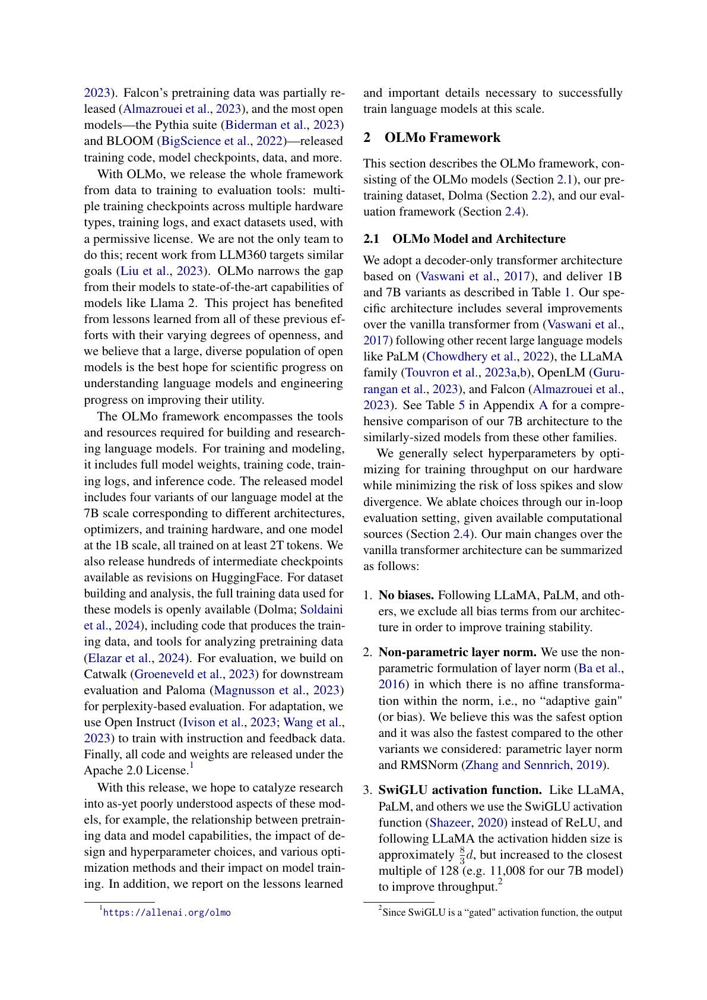

## 2 OLMo 框架

OLMo 框架由 OLMo 模型、预训练数据集 Dolma，以及评估框架构成。

### 2.1 OLMo 模型与架构

我们采用仅解码器 Transformer 架构，并提供表 1 所示的 1B 与 7B 版本。具体架构在原始 Transformer 的基础上吸收 PaLM、LLaMA 系列、OpenLM 与 Falcon 等近期大模型的改进。附录 A 的表 5 将 OLMo 7B 与这些系列中规模相近的模型作全面比较。

超参数通常通过两项目标确定：在现有硬件上优化训练吞吐量，同时尽量降低损失尖峰和缓慢发散的风险。我们借助训练循环中的评估消融不同选择。相对原始 Transformer 的主要修改如下：

1. **不使用偏置项。** 沿用 LLaMA、PaLM 等模型，去除架构中的全部偏置项，以提高训练稳定性。
2. **无参数层归一化。** 使用不带仿射变换的层归一化，即没有自适应增益或偏置。我们认为这是最安全的方案，而且比测试过的有参数层归一化和 RMSNorm 更快。
3. **SwiGLU 激活函数。** 不使用 ReLU，而采用 SwiGLU。与 LLaMA 一样，激活隐藏维度约为 $8d/3$，再向上取最接近的 128 倍数；7B 模型为 11,008。由于 SwiGLU 是门控激活，实际输入维度是其两倍，即 22,016。
4. **旋转位置编码。** 与 LLaMA、PaLM 等一致，用 RoPE 替代绝对位置编码。
5. **词表。** 使用修改版 GPT-NeoX-20B BPE 分词器，并增加用于屏蔽个人身份信息的词元。最终词表大小为 50,280；为了最大化吞吐量，把嵌入矩阵扩展到 50,304，使其成为 128 的倍数。

**表 1：OLMo 模型规模、训练词元数量与优化器设置。** 全部运行都使用 AdamW，$\beta_1=0.9$、$\beta_2=0.95$、$\epsilon=10^{-5}$。1B 与 7B 分别为 16/32 层、2048/4096 隐藏维度、16/32 个注意力头，训练 2T/2.46T 词元。

### 2.2 预训练数据：Dolma

即使模型参数开放程度有所进步，预训练数据仍然很少开放。数据通常不与开放模型一同发布，对数据的文档记录也往往不够详细，难以复现或充分理解研究。这阻碍了若干研究方向，例如理解训练数据如何影响能力与局限。

为推动开放预训练研究，我们构建并发布 Dolma：一个多来源、多样化语料库，包含从不同数据源获得的数十亿文档和数万亿词元。这些数据源既常见于大规模语言模型预训练，也可由公众访问。表 2概述各来源数据量。

Dolma 构建流水线依次执行语言过滤、质量过滤、内容过滤、去重、多来源混合与分词。Dolma 报告详细介绍设计原则、构建过程与内容，还报告在 Dolma 中间版本上训练模型的实验，分析内容/质量过滤、去重与多源混合等关键整理实践。不同来源的文档在整理和最终发布时都彼此分开。我们还开源高性能数据整理工具与 WIMBD 数据集分析工具。

**表 2：Dolma 组成。** 数据来自 Common Crawl 网页、GitHub 代码、Reddit、Semantic Scholar 论文、Project Gutenberg 图书与 Wikipedia，总计 11,519GB、43.67 亿文档、2.668 万亿词元。

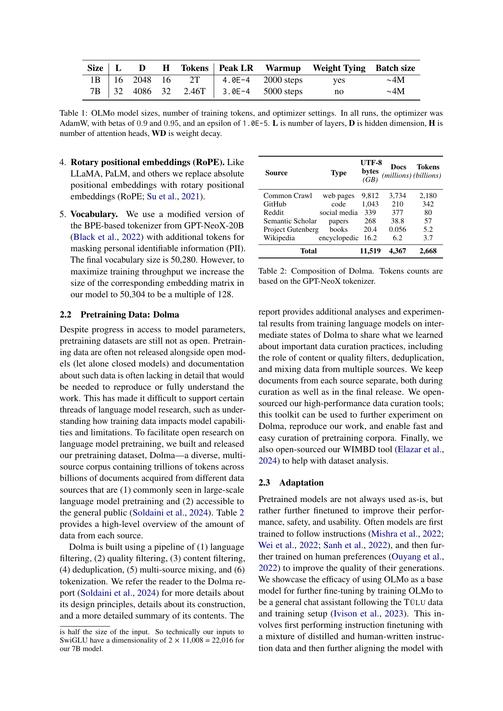

### 2.3 适配

预训练模型通常不会原样使用，而会进一步微调，以改善性能、安全性与可用性。常见流程是先训练模型遵循指令，再使用人类偏好训练提升生成质量。为了展示 OLMo 作为微调基座的有效性，我们沿用 Tülu 数据与训练设置，把 OLMo 训练为通用聊天助手：先在蒸馏与人工编写的指令数据混合物上做指令微调，再使用直接偏好优化（DPO）和蒸馏偏好数据进一步对齐。

### 2.4 评估

基座模型在两个阶段评估：训练中在线评估，用于模型设计决策；训练后离线评估，用于评价模型检查点。离线阶段使用公开的 Catwalk 框架完成下游评估，并在 Paloma 困惑度基准上进行内在语言建模评估。我们使用固定流水线，把下游与困惑度结果同公开模型比较；适配后的模型另行评估。

#### 2.4.1 训练循环中的消融

训练全程执行下游评估，用于决定架构、初始化、优化器、学习率调度和数据混合。在线评估每 1000 步，也就是约每 40 亿训练词元运行一次，持续提供模型质量信号。任务与设置主要来自 4.1 节的离线评估，也与 EleutherAI 评估框架的结构相近。

#### 2.4.2 下游评估

沿用此前工作，报告一组下游任务的零样本表现。核心套件包含 8 项任务，与 LLaMA 报告的常识推理任务集接近。选择这些任务，是因为它们形式自然，都可以表述成文本补全打分，而且在训练过程中能够提供有意义信号。

#### 2.4.3 内在语言建模评估

为了衡量 OLMo 对保留训练数据之外语言分布的拟合，使用 Paloma。该困惑度基准包含来自 18 个来源的 585 个文本领域，从 `nytimes.com` 到 Reddit 的 `r/depression`，并通过分层采样让原始语料中占比较小的领域得到更平等的纳入。

目标不只是比较最佳性能，还要展示 OLMo 如何支持更完整、更受控的科学评估。OLMo-7B 是当时在困惑度评估上执行显式去污染的最大模型：按照 Paloma 方法，删除所有含有 Paloma 评估数据泄漏段落的预训练文档。未去污染的模型可能低估困惑度，也就是高估样本外拟合。中间检查点的公开还允许与同样发布检查点的 Pythia-6.9B、RPJ-INCITE-7B 进行更丰富比较。

#### 2.4.4 适配模型评估

在指令微调和 DPO 后，使用 Tülu 评估套件测试，重点考察聊天能力与安全性，从而展示 OLMo 作为后续微调基座的有效性。

## 3 训练 OLMo

### 3.1 分布式训练框架

我们通过 PyTorch FSDP 使用 ZeRO 优化器策略，把模型权重与相应优化器状态分片到多张 GPU，以降低内存占用。在 7B 规模上，现有硬件可以做到每张 GPU 的微批量为 4096 词元。OLMo-1B 与 7B 的全局批量都约为 400 万词元，即 2048 个实例、每实例 2048 词元。

为提高吞吐量，通过 FSDP 内置设置与 PyTorch `amp` 使用混合精度训练。Softmax 等特定操作始终以全精度执行以提高稳定性，其余操作使用 bfloat16 半精度。每张 GPU 本地保存的模型权重分片和优化器状态为全精度；只有在前向、反向阶段将完整参数实例化到各张 GPU 时，Transformer 模块中的权重才转成 bfloat16。梯度在 GPU 之间以全精度归约。

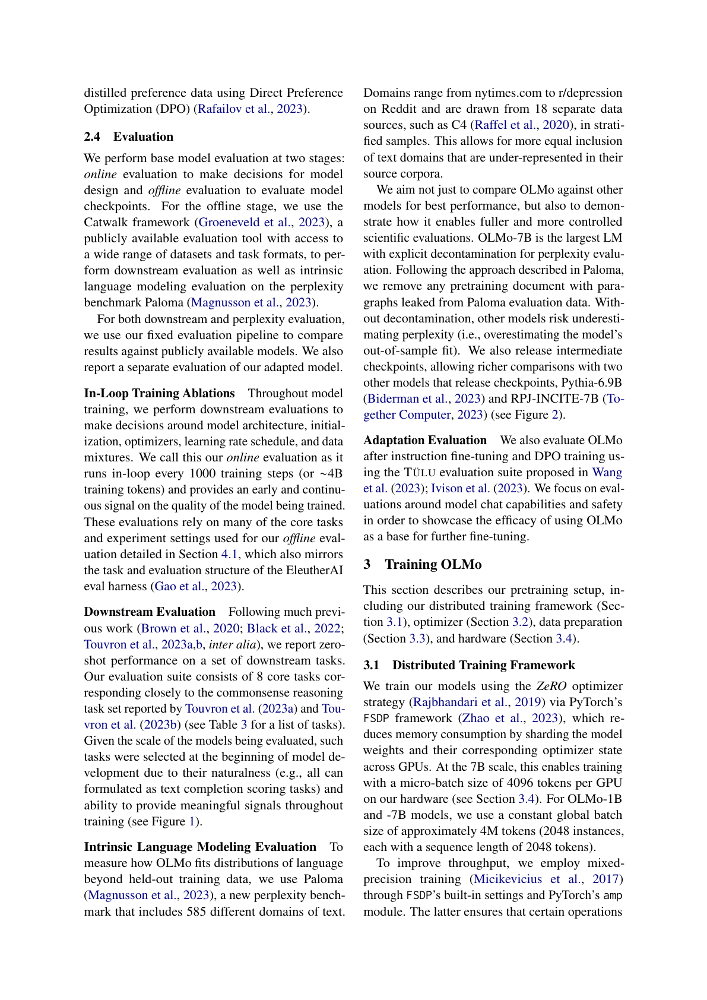

### 3.2 优化器

使用 AdamW 与表 1 的超参数。全部模型规模都在 5000 步，也就是约 210 亿词元内预热学习率，随后在剩余训练中线性衰减到峰值学习率的十分之一。预热结束后执行梯度裁剪，使全部参数梯度组成的大向量的 $\ell_2$ 范数不超过 1.0。附录 A 的表 5 与其他近期同样使用 AdamW 的 7B 模型比较优化器设置。

### 3.3 数据

训练数据来自开放数据集 Dolma 的 2 万亿词元样本。每个文档末尾追加特殊 EOS 词元，再把所有文档词元拼接，并按连续 2048 词元分块形成训练实例。所有训练运行以完全相同方式打乱实例；发布的工件可以重建数据顺序和每个训练批次的准确组成。

全部已发布模型至少训练 2 万亿词元，也就是完整遍历训练数据一轮；有些模型在第二轮以不同打乱顺序继续训练。根据既有研究，这种少量数据重复的影响应当可以忽略。

### 3.4 硬件

为了确认代码库可同时用于 NVIDIA 与 AMD GPU 而不损失性能，我们在两个集群上训练：

- **LUMI：** 最多使用 256 个节点，每节点配备 4 张 AMD MI250X GPU，显存 128GB，互联带宽 800Gbps。MI250X 是双芯片模块，因此每个物理设备实际包含两个逻辑设备，每节点为 8 个 64GB 逻辑 GPU。
- **MosaicML：** 使用 27 个节点，每节点配备 8 张 NVIDIA A100 40GB GPU，互联带宽 800Gbps。

尽管为了吞吐量而对批量大小略有不同，两次运行在训练到 2 万亿词元时，在评估套件上取得几乎相同的性能。

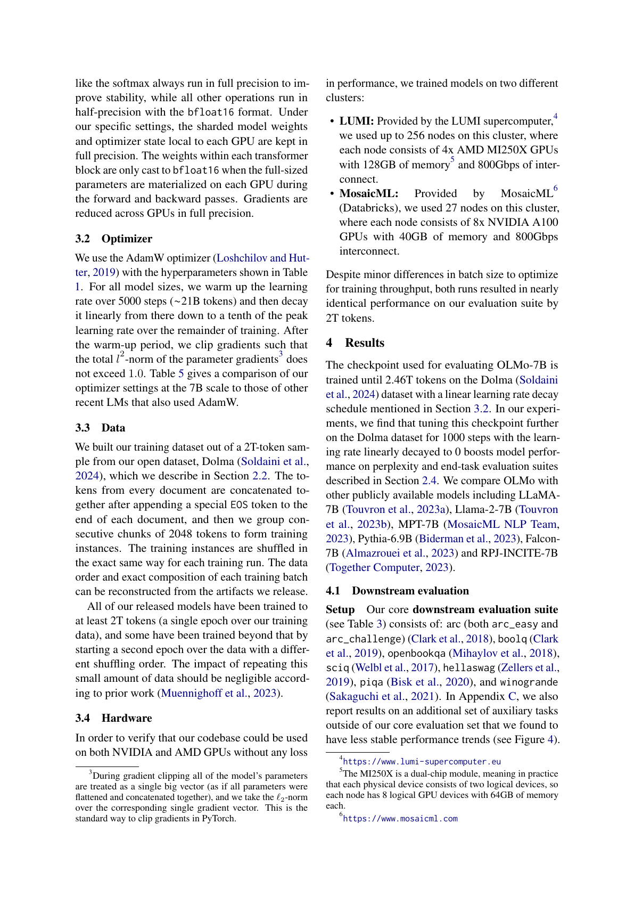

## 4 结果

评估使用的 OLMo-7B 检查点在 Dolma 上训练到 2.46 万亿词元，学习率按 3.2 节线性衰减。随后继续在 Dolma 上微调 1000 步，并把学习率线性降到 0，可以进一步改善困惑度和端任务表现。比较对象包括 LLaMA-7B、Llama-2-7B、MPT-7B、Pythia-6.9B、Falcon-7B 与 RPJ-INCITE-7B。

### 4.1 下游评估

**设置。** 核心评估套件包含 ARC-Easy/Challenge、BoolQ、OpenBookQA、SciQ、HellaSwag、PIQA 与 WinoGrande。附录 C 还报告一组训练趋势较不稳定的辅助任务。

全部任务都使用 Brown 等（2020）推广的排序分类式零样本评估：按似然对候选文本补全排序，再报告预测准确率。Catwalk 支持按词元数、字符数或答案无条件似然归一化。我们为不同数据集单独选择策略：ARC 与 OpenBookQA 使用无条件归一化；HellaSwag、PIQA、WinoGrande 按词元归一化；BoolQ 与 SciQ 不归一化。

**结果。** 表 3 汇总 8 项核心任务。OLMo-7B 的总体表现可与全部同规模模型竞争。StableLM 1.6B 也列入比较，但它明显更大，而且训练数据未知。

**表 3：OLMo-1B、OLMo-7B 与同规模公开模型的零样本结果。** OLMo-7B 使用 2.46T 词元检查点，八项平均得分为 69.3。

随着 OLMo-7B 看到的词元增加，除 OpenBookQA 外的全部任务准确率都总体上升。最后 1000 步把学习率线性降至 0 后，许多任务在最后一个点明显跃升。附录 C 的表 7 给出额外评估结果。

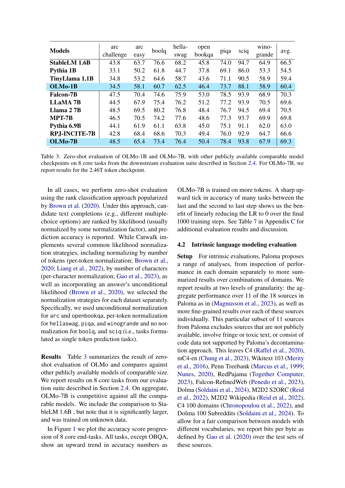

**图 1：OLMo-7B 在八项核心任务上的准确率进展。** 多数任务都能看出最后 1000 步把学习率衰减至 0 的收益。

### 4.2 内在语言建模评估

**设置。** Paloma 支持从单独领域到多领域汇总的不同粒度分析。我们报告两个粒度：18 个来源中 11 个的汇总表现，以及 11 个来源各自的细粒度结果。排除未公开、涉及边缘/有毒文本，或代码数据无法被 Paloma 去污染方法处理的来源。保留 C4、mC4-en、WikiText-103、Penn Treebank、RedPajama、Falcon-RefinedWeb、Dolma、M2D2 S2ORC、M2D2 Wikipedia、C4 100 Domains 与 Dolma 100 Subreddits。为公平比较不同词表的模型，指标采用每字节比特数。

**结果。** 图 2 的“来源合并”子图显示，OLMo-7B 与六个同规模模型相比具有竞争力，尤其考虑到其预训练数据已显式对 Paloma 去污染。最终模型与中间检查点总体遵循相近的数据缩放趋势。中间检查点所在的学习率阶段会影响表现，因此训练步数少的模型可能曲线更陡，却不代表在固定训练时长下样本效率更高。MPT-7B 的改善速度领先，可能来自训练数据组成与 Paloma 领域更加匹配，也可能来自语义去重等预处理决策。

各来源子图显示，样本效率差异很大，主要由训练分布与评估分布的相似性驱动。OLMo-7B 在 Common Crawl 占主导的 C4 上表现良好；而在 WikiText-103、M2D2 S2ORC、M2D2 Wikipedia 等与网页抓取关系较弱的来源上，样本效率较低。RedPajama 也有类似模式，因为七个领域中只有两个来自 Common Crawl，且 Paloma 对来源内领域等权。Wikipedia、ArXiv 论文等精选来源的异质数据比网页抓取文本更稀缺；随着预训练语料扩大，要维持对这些语言分布的拟合样本效率将更具挑战。

**图 2：Paloma 十一个来源及其合并结果上的每字节比特数。** OLMo 预训练数据已对这些评估去污染。模型整体遵循数据缩放趋势，但分布内数据的样本效率最好；例如 OLMo-7B 在 C4 上超过其他模型，可能因为其预训练数据中 88.8% 来自 Common Crawl。

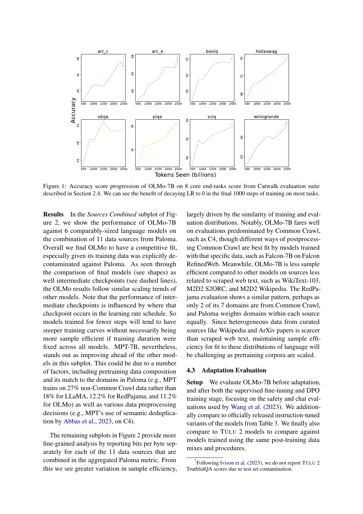

### 4.3 适配模型评估

**设置。** 评估 OLMo-7B 在适配前、监督微调后、DPO 后的表现，重点采用 Wang 等（2023）的安全与聊天评估；还与表 3 中各模型的官方指令版本比较，并与使用相同后训练数据混合和流程的 Tülu 2 比较。

**结果。** 指令微调大幅改善 OLMo-7B 的性能与安全性：MMLU 明显上升，ToxiGen 和 TruthfulQA 也改善，DPO 后尤其明显。OLMo+SFT 与 OLMo+SFT+DPO 超过大多数其他聊天变体，说明 OLMo-7B 是强大的基座模型，也说明 Tülu 数据混合有效。不过它与在 Llama 2 上应用同一 Tülu 混合的 Tülu 2 仍有差距，可能因为 Llama 2 的测试集污染，也可能因为 Tülu 混合主要针对 Llama 设计。总体而言，额外调优给 OLMo-7B 带来显著收益，它可以成为下游应用的强基座。

**表 4：多种 7B 指令模型及 OLMo 适配前后的评估。** ToxiGen 越低越好，其余指标越高越好。

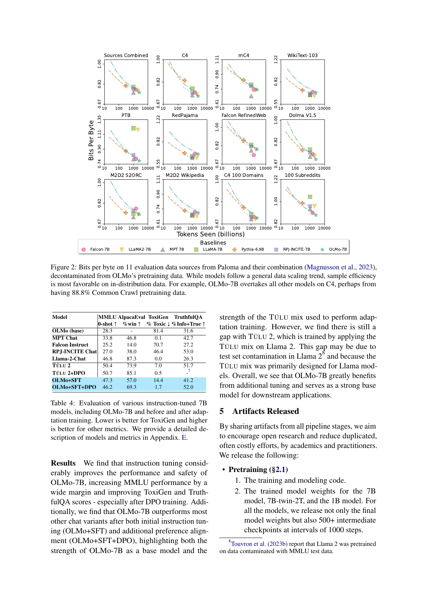

## 5 已发布工件

通过共享流水线所有阶段的工件，我们希望鼓励开放研究，并减少学术界与实践者重复付出的高昂成本。发布内容包括：

- **预训练：** 训练与建模代码；7B、7B-twin-2T、1B 模型权重；不仅发布最终权重，还按每 1000 步一次的间隔发布 500 多个中间检查点；训练期间记录到 Weights & Biases 的完整指标。
- **数据：** 完整 Dolma 预训练语料；重现完整训练数据顺序、检查每个训练步看到哪些数据的工具；重新创建训练数据与执行数据集分析的工具。
- **适配：** 适配训练代码与数据；OLMo+SFT 和 OLMo+SFT+DPO 权重。
- **评估：** Catwalk 离线下游与内在语言建模评估的代码、数据；适配模型使用的评估套件。

## 6 结论与未来工作

本文发布首版 OLMo：一个达到先进水平、真正开放的语言模型，以及用于构建并研究语言建模科学的完整框架。与多数只发布权重和推理代码的工作不同，我们公开训练数据、训练与评估代码，以及训练期间收集的详细指标；还发布适配后的模型及全部适配代码和数据。

我们将持续支持和扩展 OLMo 及其框架，继续推进开放语言模型的边界，为开放研究社区赋能。自本文描述的首版发布以来，数据与训练设置已得到改善并显著提升结果，例如 MMLU 提高 24 个百分点至 52%。未来还将把更多模型规模、模态、数据集、安全措施和评估纳入 OLMo 家族。我们希望这些发布能够加强开放研究社区并激发新一轮创新。

## 局限

构建大型语言模型存在许多局限，从数据、训练、适配到评估，每个步骤都有自身问题。人工智能系统还可能产生广泛社会影响，相关局限远超本节篇幅可以覆盖的范围。

### 数据

本工作聚焦英语预训练数据，希望开放框架能推动未来更多语言及多语言模型的发展。训练数据赋予模型能力，但在大模型规模上，数据很可能包含有毒语言、个人信息和受版权保护文本。我们已经尽力缓解，却承认目前不存在能完全移除这些内容的完美方法。

### 训练

训练大模型仍很困难，开源社区缺少重要支持。受篇幅限制，本文没有提供广泛训练日志，例如发散或未能学习的训练运行。

### 适配

预训练模型与其他大模型一样存在偏见、有毒生成和幻觉。适配模型更善于避免这些输出，但仍不完美。我们主要采用为另一个模型家族设计的 Tülu 数据混合；OLMo 可能需要不同混合来适配其特有的优势和弱点。Tülu 本身也依赖从多种模型蒸馏的数据，未来希望减少这种依赖。

### 评估

虽然本文在多种数据集上与现有模型比较，许多下游任务并不代表用户实际与语言模型交互的方式，例如聊天机器人。语言模型评估也有很大噪声。我们尽量只纳入能提供模型优劣信号的评估，但不存在完美自动评估，比较结果应谨慎看待。

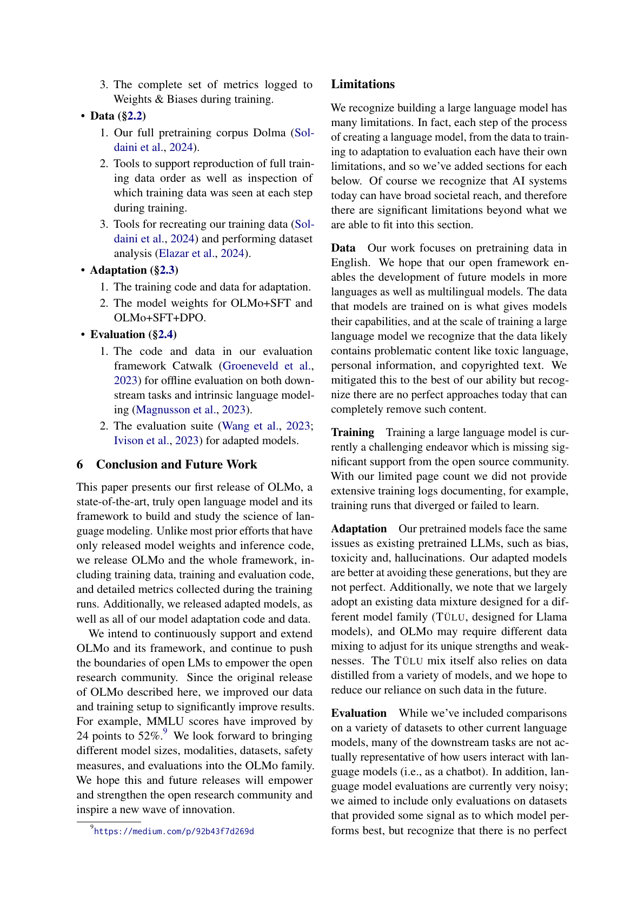

## 伦理声明

我们的立场是：提高语言模型开放程度，对科学理解其能力和局限、让更多人参与持续开发至关重要；在开放数据上训练会进一步增强这些收益。开放发布还允许实践者直接在模型之上开发，无需从零重复训练，从而减少资源消耗和环境影响。

开放当然并非没有风险，模型仍可能以非预期方式被用于造成伤害。但模型开放也会加速理解和缓解潜在伤害的研究与开发，并允许多样化方法和分析。过去一年已经有多个采用宽松许可证的同类模型发布，因此更严格的许可证也无法消除整个领域的风险。我们认为偏向更加开放是最佳取舍。

## 致谢

OLMo 离不开许多个人和机构支持。实验由 AMD、CSC 合作提供 LUMI 超级计算机，并得到哈佛大学 Kempner Institute 支持。感谢 Jonathan Frankle 与 MosaicML（现 Databricks）团队分享 FSDP 经验并构建 OLMo 基础代码；感谢所有协助网站、设计、内外沟通、预算及项目推进的团队成员；也感谢 AI2 同事与紧密合作伙伴提供讨论和反馈。

## 参考文献

原论文参考文献从第 10 页延续至第 16 页。为完整保留作者、题名、出版信息与链接，以下按 PDF 原始页序收录。

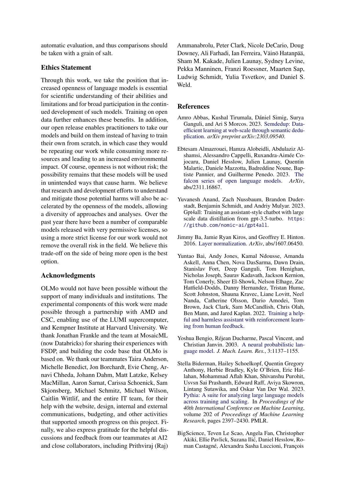

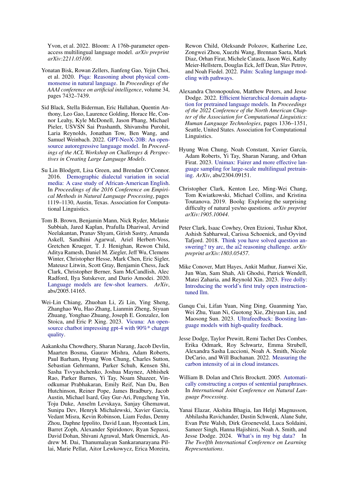

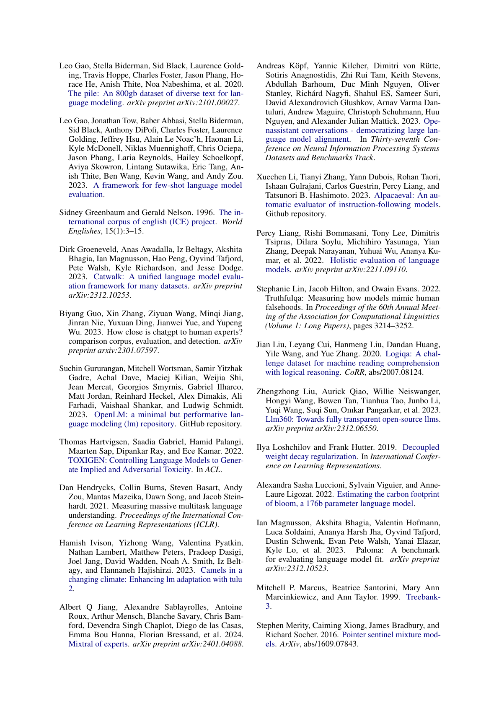

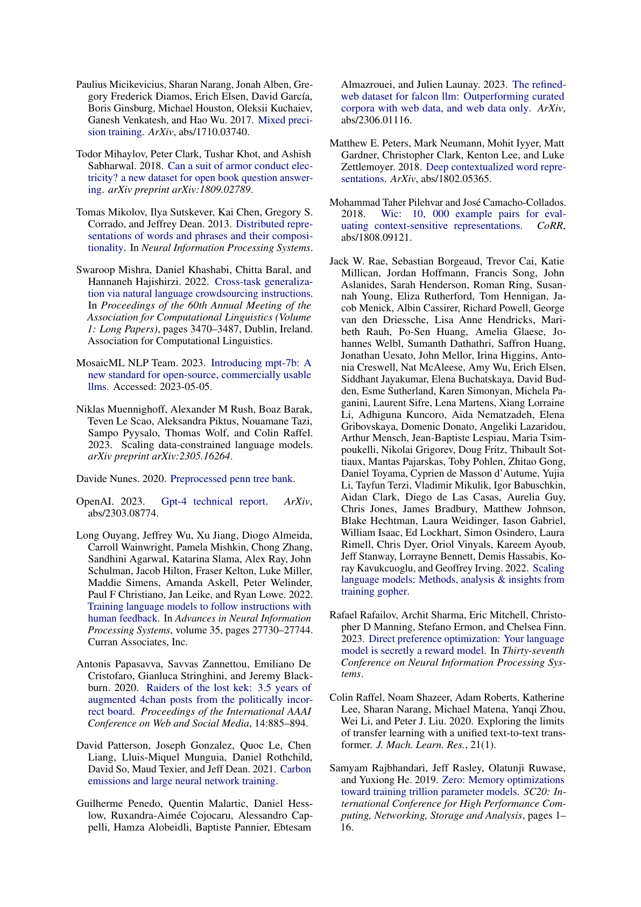

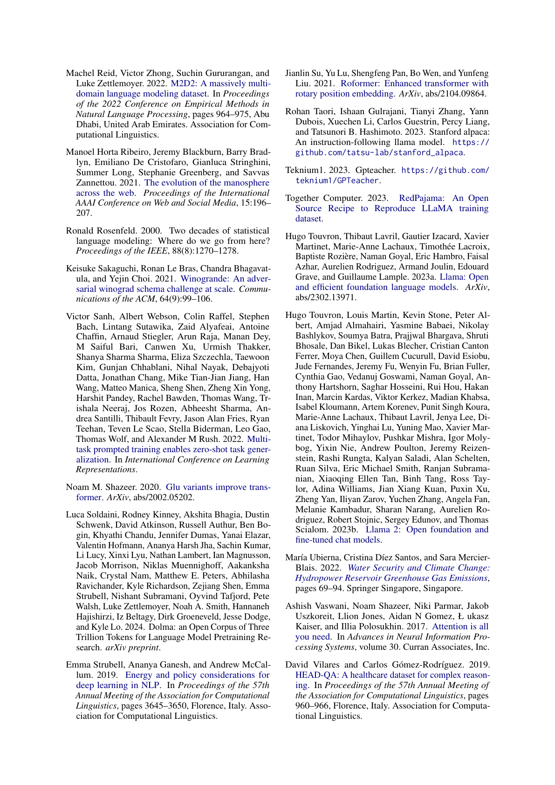

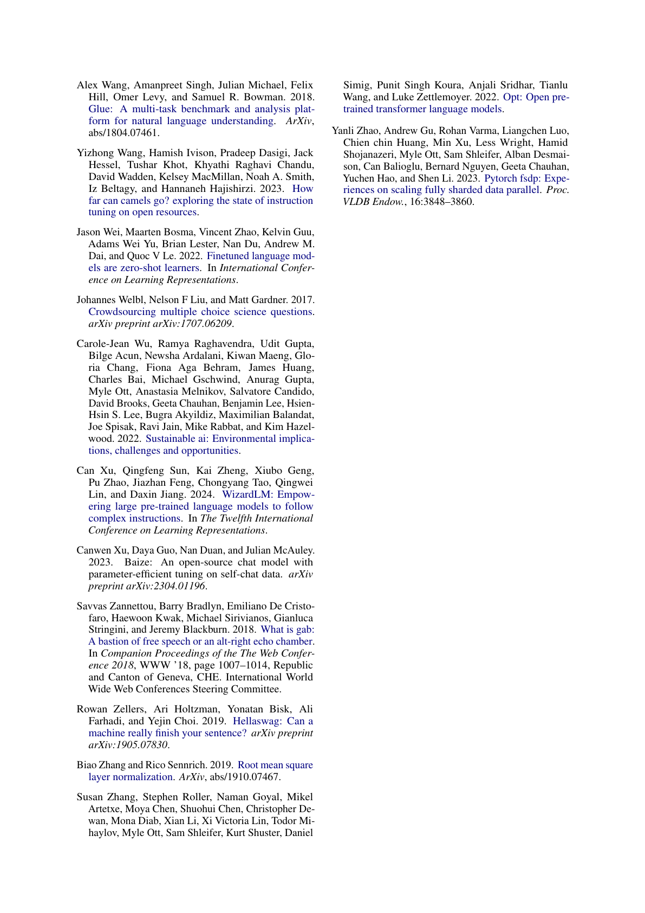

## 附录

### A 训练设置

表 5 汇总 OLMo-7B 与近期同规模模型的架构和优化器参数。

**表 5：7B 至 8B 规模语言模型架构与优化器比较。** “有参数/无参数层归一化”分别指带或不带自适应增益与偏置的通常实现。全部模型使用 AdamW。

### B 能耗与碳足迹

沿用既有文献，我们估算模型预训练的总能耗与碳排放：先计算训练所需总功耗，再乘以训练所在地电网的碳排放强度。运行排放并不包含硬件与数据中心制造、运输、报废所产生的隐含排放，也不包含使用期排放、反弹效应、用水或采矿等其他环境影响，因此估算应视为下界。

每 25 毫秒测量单节点功耗，取完整训练运行的平均值后乘节点总数；再乘以 1.1 的电能使用效率系数，表示高效数据中心较保守的 10% 能耗开销。7B 模型预训练估计消耗 239MWh。

计算碳排放时，按数据中心物理位置使用每千瓦时的碳强度。A100-40GB 模型在澳大利亚训练，采用 2022 年全国平均 0.610kg CO2/KWh；MI250X 模型在完全使用水电、官方称碳中和的 LUMI 训练，采用官方强度 0。部分来源估计水电强度为 0.024，对应 3.54tCO2e；但本文依官方数据计算，总预训练排放估为 69.78tCO2e。表 6 与其他公开模型比较。

这些估算仍是下界，因为未包含调试、超参数调优和停机等关键开发环节。开放模型有望让其他人避免从零预训练，减少未来排放，并帮助理解先进模型的真实开发成本。

### C 额外评估

图 3 给出未纳入图 2 汇总指标的七个 Paloma 来源。其中 Pile 与 ICE 当时未公开；Dolma 100 Programming Languages 的代码数据无法使用 Paloma 方法去污染；TwitterAAE 与 ICE 用于分析方言性能差异，应单独评估；Manosphere、Gab、4chan 用于研究边缘网络社区中仇恨与有毒语言，因而在这些语料上降低困惑度不一定值得追求。

OLMo-7B 在 Dolma 100 Programming Languages 上明显领先其他模型，这可能部分来自污染造成的低估，因为 Paloma 不处理代码去污染；不过同样可能含 GitHub 代码污染的 RPJ-INCITE-7B 表现远差，另一个因素可能是 OLMo 的训练代码数据与 100 PLs 使用完全相同的后处理。Pile 也体现分布内与潜在污染效应：Pythia-6.9B 即使训练词元少近一个数量级仍表现最佳。

其余五个目标来源的结果应谨慎解释。Paloma 发现这些来源的困惑度常受平均文档较短等表面特征主导，而不一定反映对相关语言社群重要内容的拟合。TwitterAAE 与 Gab 文档极短，因此每字节比特异常高；除两者外，ICE、Manosphere 与 4chan 上各模型高度聚集在同一缩放趋势中。

附加零样本任务包括 HeadQA、LogiQA、MRPC、QNLI、WiC 与 WNLI。OLMo-7B 六项平均结果超过其他公开模型，但这些任务在模型开发期间趋势更不稳定、信号有限。MRPC、WiC 虽较稳定，却容易受随机基线、固定标签预测和类别不平衡影响。因此，不应过度依赖这些任务衡量训练过程或比较模型。

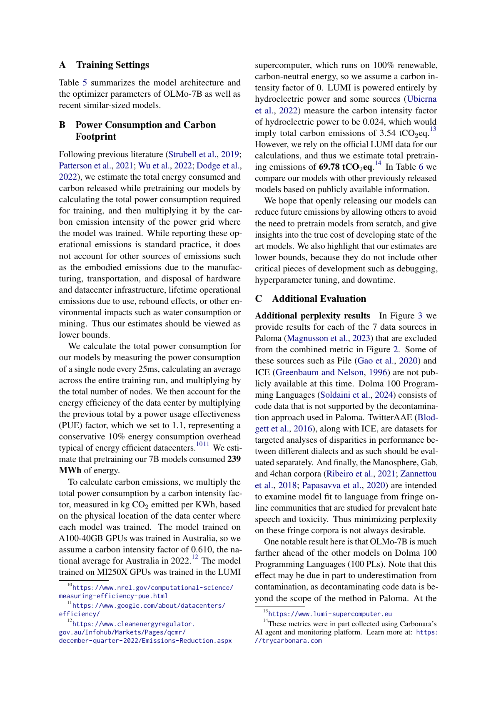

**表 6：预训练期间的二氧化碳排放。** 根据公开的 PUE、当地电网碳强度与功耗数据估算；LUMI 官方完全使用水电，因此主表计为零排放，若采用水电强度 0.024，则对应 3.54tCO2e。

**表 7：OLMo-7B 在六项附加任务上的零样本结果。** 六项平均 47.5，略高于比较模型，但这些任务在训练中提供的信号有限。

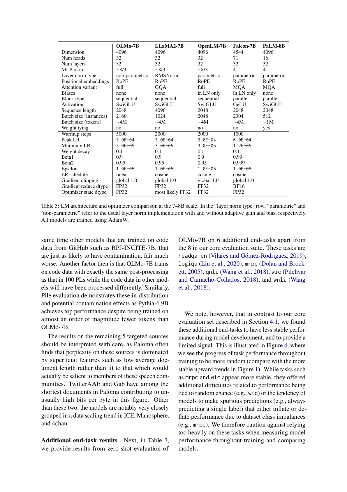

### D 适配训练细节

指令微调超参数通过小规模试验选择：学习率 $2\times10^{-6}$，训练 3 个周期；前 3% 线性预热，随后线性降到 0；权重衰减与梯度裁剪均为 0；最大序列长度 2048；数据为重新切分的 Tülu V2 SFT 混合，把长对话分为 2048 词元片段，并用公开 OLMo 元数据替换硬编码划分。

指令微调后执行 DPO：学习率 $5\times10^{-7}$，$\beta=0.1$，训练 3 个周期；前 10% 线性预热，随后降到 0；权重衰减与梯度裁剪为 0；最大序列长度 2048。数据为修改版 UltraFeedback，移除 TruthfulQA 提示，并使用 Argilla 发布的固定版本，以 GPT 生成的分项分数平均值确定偏好/拒绝对。

**图 3：未纳入图 2 汇总的七个 Paloma 来源上的每字节比特数。**

**图 4：OLMo-7B 在六项附加任务上的准确率进展。** 这些任务表现不稳定，在模型开发中提供的信号有限。

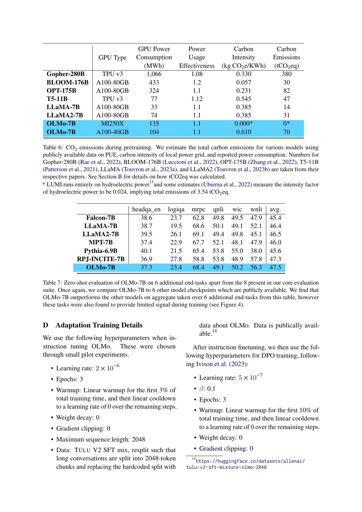

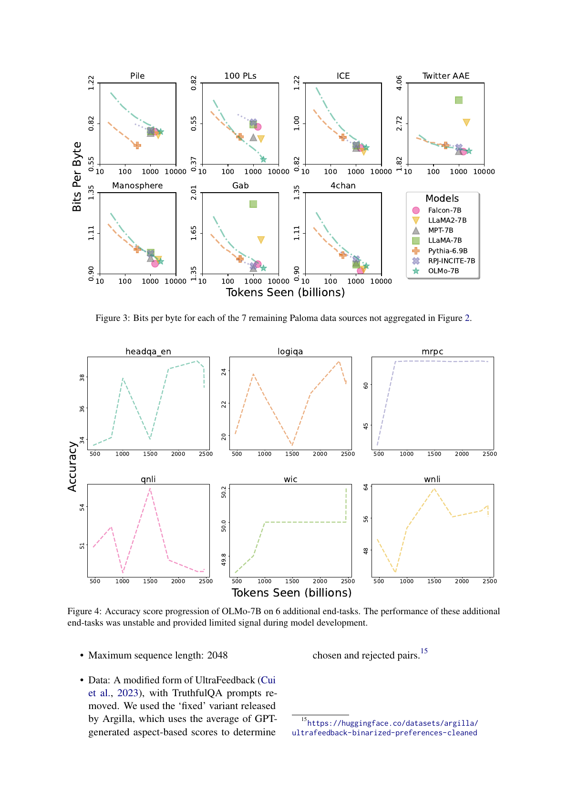

### E 适配评估与模型细节

表 4 的比较模型选择各机构发布的规范最佳适配版本；另加入 Tülu 2，展示使用与 OLMo 相同的 Tülu 数据混合训练出的先进模型。评估 MMLU、AlpacaEval、ToxiGen 与 TruthfulQA，分别考察总体能力、开放式聊天、安全性和真实性。提示格式尽可能使用模型官方聊天模板。

比较模型包括 MPT Chat、Falcon Instruct、RPJ-INCITE Chat、Llama-2 Chat、Tülu 2、Tülu 2+DPO、OLMo+SFT 与 OLMo+SFT+DPO。MMLU 使用官方零样本准确率；ToxiGen 使用引发特定群体有毒生成的提示，并由 RoBERTa 分类器判定有毒比例；TruthfulQA 使用 818 个问题和六条上下文示例，并用基于 LLaMA 2 的分类器判断回答是否真实且信息充分；AlpacaEval 让模型回答 805 条提示，由 GPT-4 与 Davinci-003 回答比较并报告胜率。

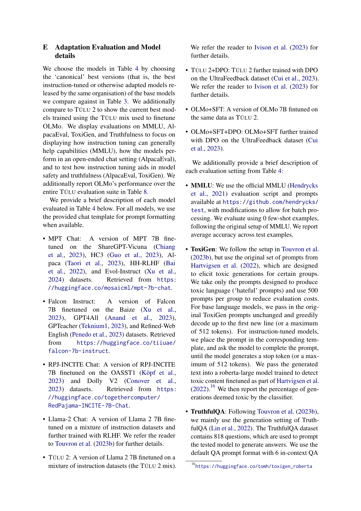

**表 8：OLMo-7B 在指令微调和 DPO 前后的完整 Tülu 套件结果。** ToxiGen 越低越好，其余指标越高越好。SFT 与 DPO 大幅降低有毒生成，并提升聊天胜率与真实性。

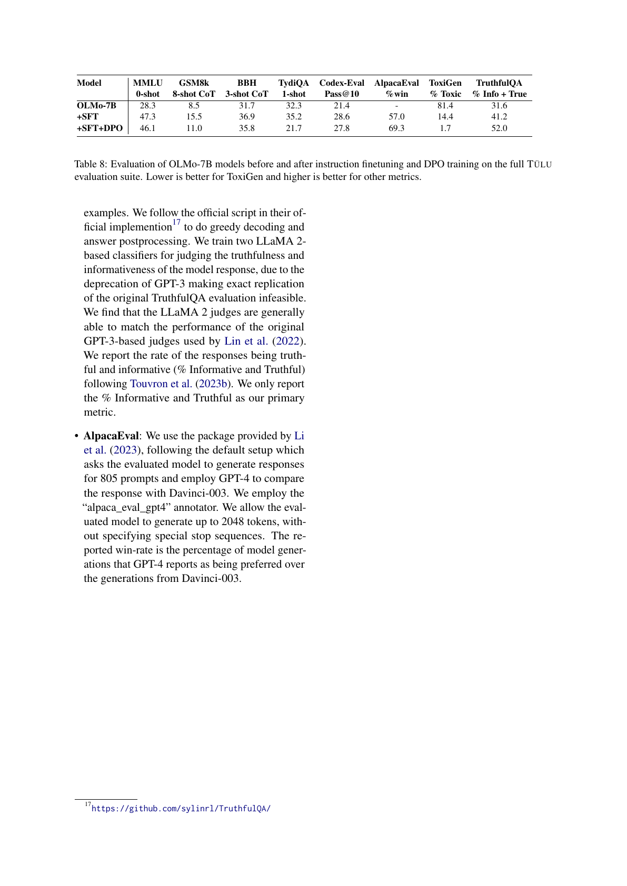
