# Phi-3 技术报告：在手机本地运行的高能力语言模型

**作者与机构：** Microsoft Phi-3 团队；完整作者名单见附录 B

**论文版本：** arXiv:2404.14219v4，2024 年 8 月 30 日

**首次公开：** 2024 年 4 月 22 日

**译文说明：** 本文按论文内容顺序逐段翻译；模型名、数据集名、算法名和通行技术缩写保留原写法。图、表、代码、复杂提示、参考文献和人员名单使用原论文整页截图，每一页截图按原页顺序出现一次。

## 摘要

本文介绍 phi-3-mini，一个使用 3.3 万亿词元训练的 38 亿参数语言模型。学术基准和内部测试显示，它的总体表现可与 Mixtral 8x7B、GPT-3.5 等模型竞争，例如 MMLU 达到 69%，MT-Bench 达到 8.38 分；同时，模型足够小，可以部署在手机上。训练数据是 phi-2 数据集的扩展版，由经过严格过滤的公开网络数据和合成数据组成。模型还针对稳健性、安全性和对话格式进一步对齐。

报告还给出参数扩展结果：phi-3-small 和 phi-3-medium 分别为 7B、14B，均使用 4.8 万亿词元训练，能力显著高于 phi-3-mini，例如 MMLU 分别达到 75% 和 78%，MT-Bench 分别达到 8.7 和 8.9。

为增强多语言、多模态和长上下文能力，本文加入 phi-3.5 系列的三种模型：phi-3.5-mini、phi-3.5-MoE 和 phi-3.5-Vision。phi-3.5-MoE 是 16×3.8B 的混合专家模型，每次激活 66 亿参数；在语言推理、数学和代码任务上超过 Llama 3.1、Mixtral 系列等相近规模开源模型，并可与 Gemini 1.5 Flash、GPT-4o mini 竞争。phi-3.5-Vision 从 phi-3.5-mini 派生，规模 42 亿参数，擅长推理，并能处理单图加文本或多图加文本的提示。

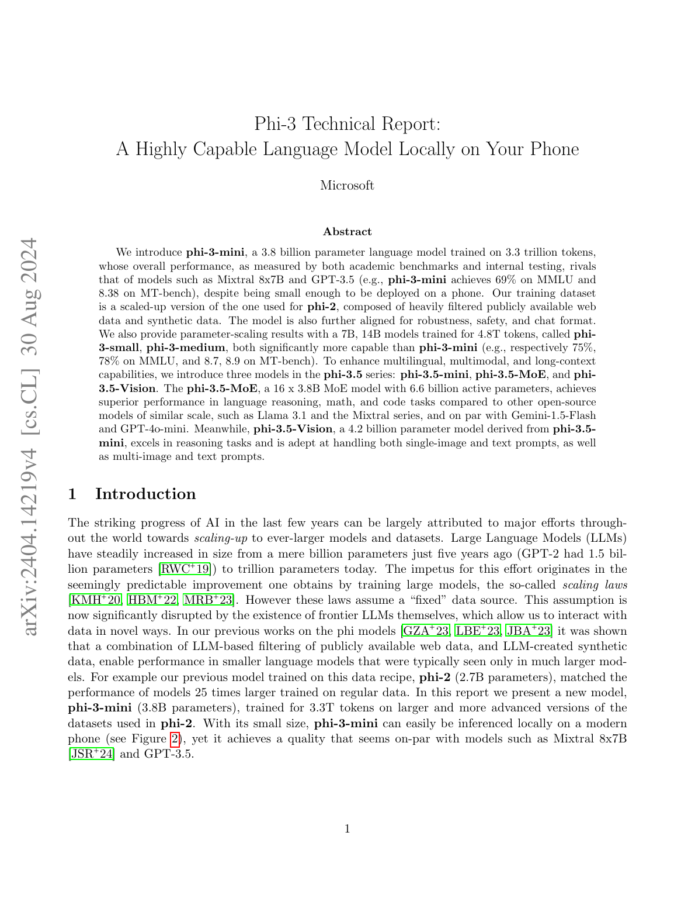

## 1 引言

近几年人工智能的惊人进步，很大程度上来自世界各地扩大模型和数据集规模的努力。大型语言模型在五年内从约十亿参数发展到万亿参数；推动这种努力的原因，是训练更大模型似乎会带来可预测的提升，即所谓缩放定律。不过，缩放定律假定数据来源“固定”。前沿大型语言模型本身已经出现，人们能够用全新方式与数据互动，这一假设因而受到显著冲击。

此前 Phi 系列工作表明，以大型语言模型过滤公开网络数据，再加入大型语言模型生成的合成数据，可以让小语言模型获得过去只有大得多的模型才有的性能。phi-2 只有 27 亿参数，却能追平按常规数据训练、参数多 25 倍的模型。本文提出 phi-3-mini：38 亿参数，使用 phi-2 数据集更大、更先进的版本训练 3.3 万亿词元。它足够小，可以直接在现代手机本地推理，却能达到 Mixtral 8x7B、GPT-3.5 一类模型的质量。

论文给出一段示例对话。用户先要求用一句有趣的话解释：为何能把接近 ChatGPT 能力的语言模型装进手机令人惊讶。phi-3-mini 回答：“这就像把一台超级计算机塞进翻盖手机，只不过它没有把手机撑爆，而是凭借微小却强悍的语言能力把互联网震撼了。”用户随后要求严肃回答，并强调成果完全来自训练数据改变。模型解释：精心策划并优化训练数据，可以显著缩小模型，同时不牺牲表现，体现了数据驱动机器学习的力量。

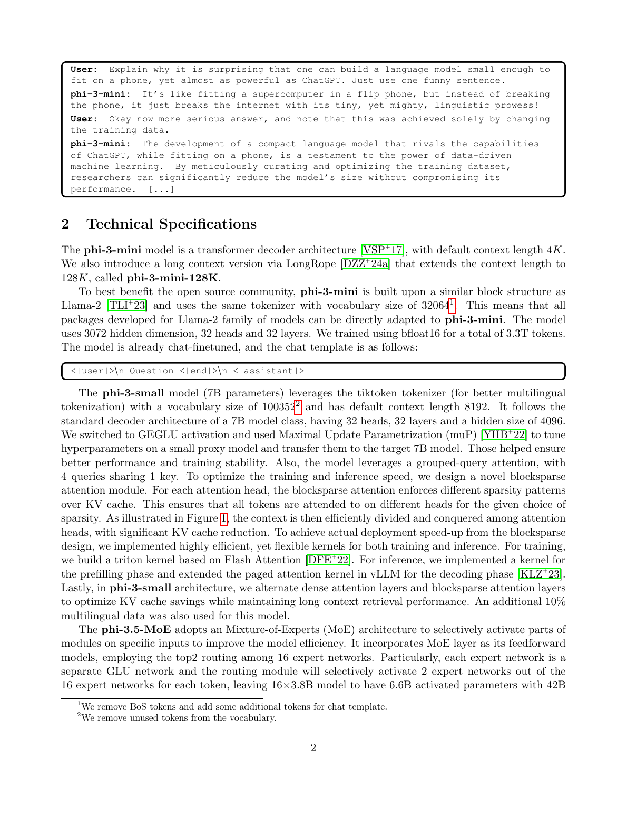

## 2 技术规格

### 2.1 phi-3-mini

phi-3-mini 使用 Transformer 解码器架构，默认上下文为 4K。通过 LongRoPE 还提供扩展到 128K 的长上下文版本 `phi-3-mini-128K`。

为最大程度服务开源社群，phi-3-mini 采用与 Llama-2 相似的块结构和相同分词器，词表规模 32,064；因此，为 Llama-2 模型家族开发的软件包可直接适配 phi-3-mini。模型隐藏维度 3072，32 个注意力头、32 层，以 bfloat16 训练 3.3 万亿词元。模型已经完成对话微调，对话模板使用专门的用户、助手和轮次结束词元。词表中删除了句首词元，并加入少量对话模板词元。

### 2.2 phi-3-small

phi-3-small 为 7B，使用更利于多语言分词的 `tiktoken` 分词器，词表 100,352，默认上下文 8192。它采用标准 7B 解码器结构，32 个注意力头、32 层、隐藏维度 4096。模型把激活函数换成 GEGLU，并使用最大更新参数化：先在小型代理模型上调超参数，再迁移到目标 7B，从而提高性能与训练稳定性。模型还使用分组查询注意力，每四个查询共享一个键。

为了提高训练和推理速度，我们设计新型块稀疏注意力。每个注意力头在键值缓存上执行不同稀疏模式，使给定稀疏设置下的全部词元都能在某些注意力头中被关注。图 1 以两个局部块、垂直步长 3 为例，展示第 8 块中的查询会关注哪些键和值：蓝色是局部块，橙色是远程或垂直块，灰色是跳过的块。上下文由多个注意力头高效“分而治之”，显著减少键值缓存。

为让块稀疏设计真正带来部署加速，训练、推理都实现了高效且灵活的内核。训练内核使用 Triton 并建立在 FlashAttention 上；推理阶段实现预填充内核，并扩展 vLLM 的分页注意力内核用于解码。phi-3-small 交替使用稠密注意力层和块稀疏注意力层，在保持长上下文检索能力的同时节省键值缓存。该模型还额外加入 10% 的多语言数据。

### 2.3 phi-3.5-MoE

phi-3.5-MoE 使用混合专家架构，根据输入选择性激活部分模块，提高效率。前馈模块是混合专家层，在 16 个专家网络中执行 top-2 路由。每个专家都是独立 GLU 网络；路由模块为每个词元激活 16 个专家中的 2 个。因此模型总参数为 16×3.8B，合计约 420 亿，但每次只激活 66 亿。稀疏路由器采用 SparseMixer 训练。为便于与其他 Phi 模型比较，phi-3.5-MoE 使用与 phi-3-medium、phi-3-mini 相同的 32,064 词表。

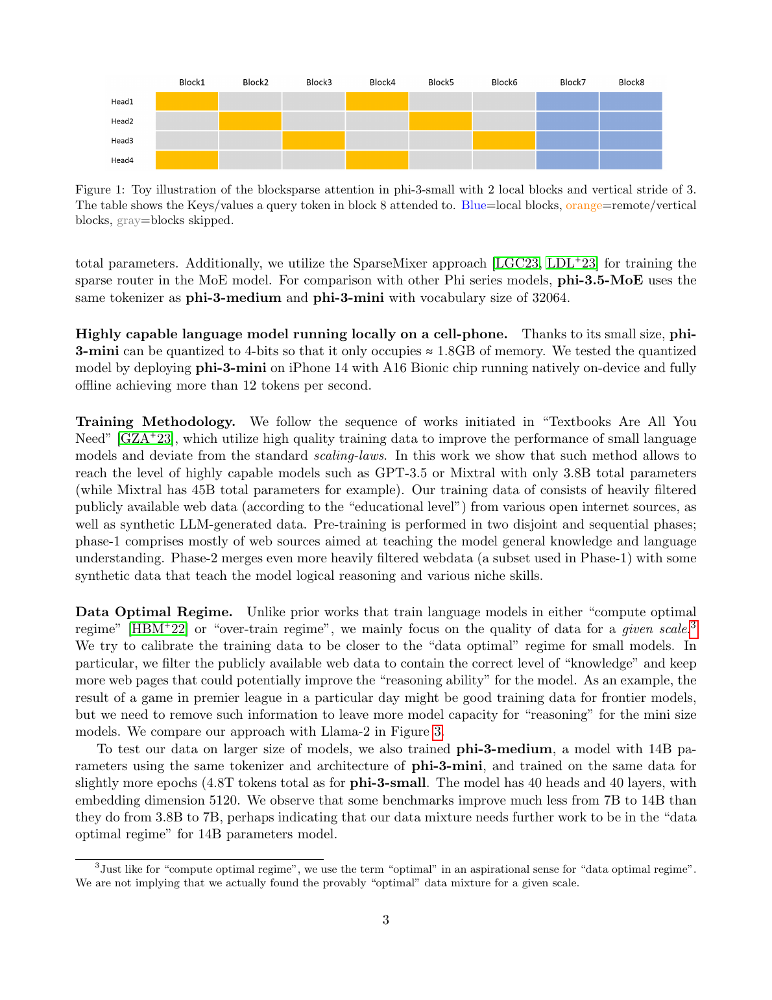

### 2.4 在手机本地运行

phi-3-mini 规模较小，可量化为 4 比特，内存占用约 1.8 GB。团队把量化模型部署在配备 A16 Bionic 芯片的 iPhone 14 上，完全离线、原生在设备端运行，生成速度超过每秒 12 个词元。

### 2.5 训练方法

本文延续《教科书就是你所需要的一切》开启的研究路线：用高质量训练数据改善小模型性能，突破标准缩放定律。结果表明，只有 38 亿总参数也能达到 GPT-3.5、Mixtral 等高能力模型水平；作为对照，Mixtral 总参数约 450 亿。

训练数据来自多种开放互联网来源，包括按“教育水平”严格过滤的公开网络数据，以及大型语言模型生成的合成数据。预训练分成前后相接且彼此分离的两阶段。第一阶段以网络来源为主，教授通用知识与语言理解；第二阶段把过滤更严格的第一阶段网页子集，与教授逻辑推理和多种小众技能的合成数据合并。

### 2.6 数据最优状态

以往工作把语言模型训练在“计算最优”或“过度训练”状态；本文主要关注给定规模下的数据质量，希望把小模型训练数据校准得更接近“数据最优”状态。我们过滤公开网络数据，使它包含适合小模型的知识水平，并保留更多可能提高推理能力的网页。例如某一天英超比赛结果可能适合前沿大模型，但对 mini 规模应删除这类事实，让更多模型容量用于推理。图 3 把这种方法与 Llama-2 比较；图中绘制 MMLU 错误率对数相对模型规模对数的关系。

文中“数据最优”与“计算最优”一样，是一种追求目标，并不声称已经为特定规模找到可以证明为最优的数据混合。

### 2.7 phi-3-medium

为测试数据对更大模型的效果，我们还训练 14B 的 phi-3-medium。它使用与 phi-3-mini 相同的分词器和架构，在相同数据上训练略多周期，与 phi-3-small 一样共处理 4.8 万亿词元。模型有 40 个注意力头、40 层，嵌入维度 5120。某些基准从 7B 扩到 14B 的提升远小于从 3.8B 扩到 7B，可能说明这套数据混合还需继续改进，才能让 14B 模型进入数据最优状态。

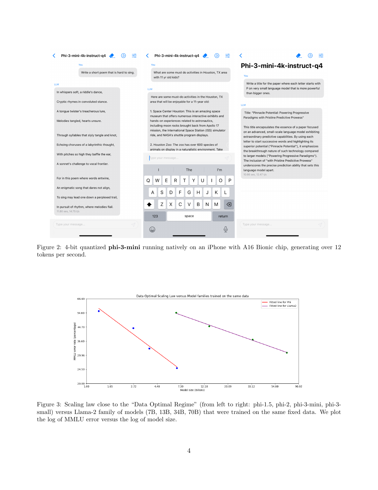

### 2.8 后训练

Phi-3 后训练包括监督微调和直接偏好优化两个阶段。SFT 使用经过精心策划的高质量数据，覆盖数学、编程、推理、对话、模型身份和安全等多种领域，起始数据混合只使用英语样本。DPO 数据覆盖对话格式、推理与负责任人工智能。DPO 把不期望的模型输出作为“拒绝”回答，引导模型远离相应行为。后训练不仅改善数学、编程、推理、稳健性和安全性，也把语言模型转变为用户能够高效、安全交互的人工智能助手。

## 3 学术基准

报告在标准开源基准上测量常识推理和逻辑推理，并与 phi-2、Mistral-7B-v0.1、Mixtral-8x7B、Gemma 7B、Llama 3 Instruct 8B 和 GPT-3.5 比较。全部数字使用完全相同的流水线得到，以保证可比性；由于评估选择略有差异，数字可能与其他公开结果不同。评估使用温度 0 的 few-shot 提示，每项基准的 shot 数在表中列出。提示和 shot 数来自 Microsoft 内部语言模型评估工具，未针对 Phi-3 优化。例如，团队发现问题前加入 `##` 能明显改善 phi-3-mini 的多项成绩，但没有这样改动提示。附录 A 给出一个 2-shot 示例。

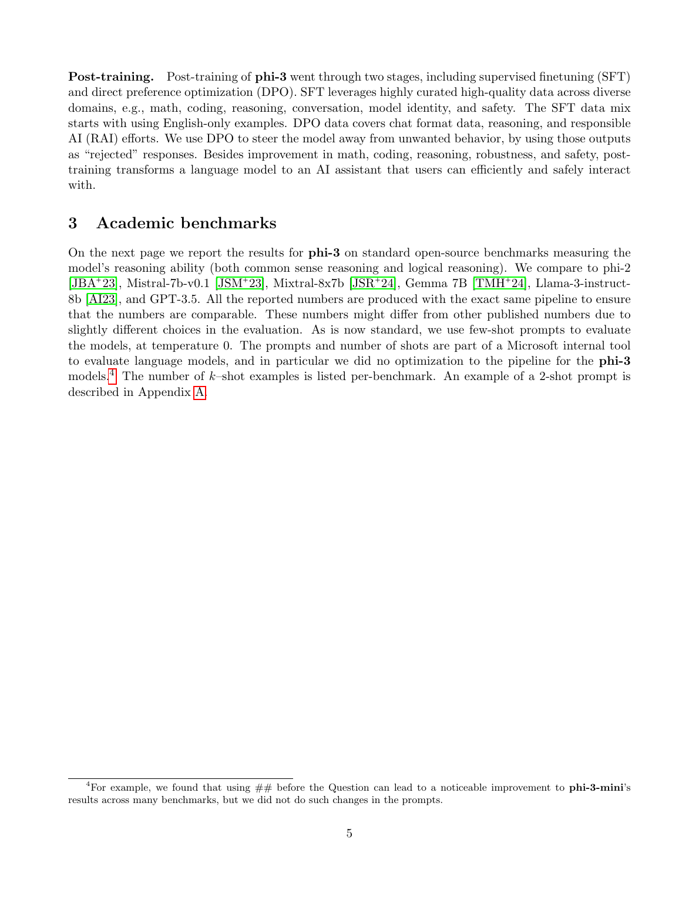

表中比较 20 多项基准。phi-3-mini 在 MMLU 为 68.8、GSM8K 为 82.5、MATH 为 41.3、BigBench Hard 为 71.7、HumanEval 为 58.5、MBPP 为 70.0，整体平均为 69.7；MT-Bench 为 8.38。phi-3-small 与 phi-3-medium 的平均分进一步升至 73.6 和 76.7，MT-Bench 分别为 8.70 和 8.91。小模型在许多推理、数学和编程任务上达到或超过更大模型。

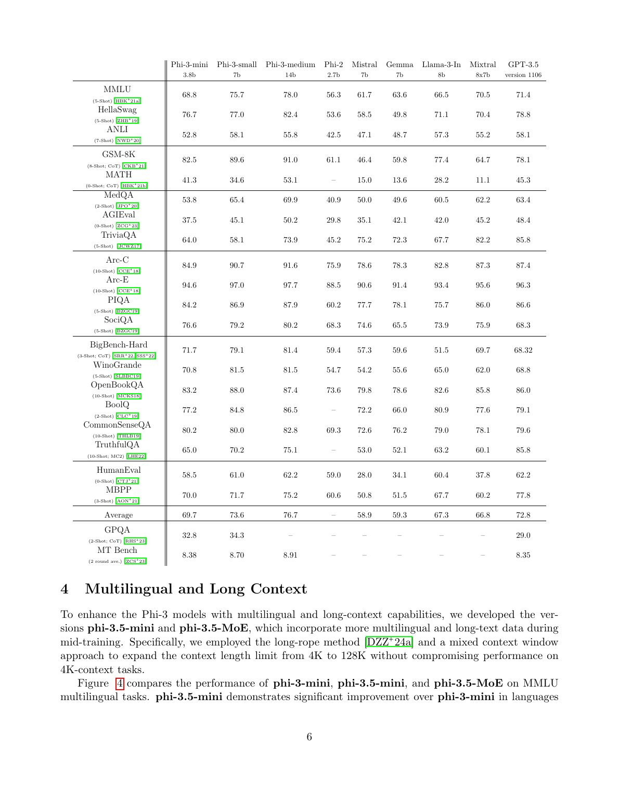

## 4 多语言与长上下文

为增强多语言和长上下文能力，我们开发 phi-3.5-mini、phi-3.5-MoE，在中期训练加入更多多语言与长文本数据。模型结合 LongRoPE 和混合上下文窗口，把上下文上限从 4K 扩展到 128K，同时不牺牲 4K 任务表现。

图 4 比较三种模型的 MMLU 多语言任务。phi-3.5-mini 在阿拉伯语、中文、俄语、乌克兰语和越南语等语言上相较 phi-3-mini 显著改善，平均分分别为 55.4 和 47.3。phi-3.5-MoE 容量更大，平均达到 69.9，明显高于 phi-3.5-mini。

长上下文评估使用 RULER 和 RepoQA。phi-3.5-MoE、phi-3.5-mini 在 RepoQA 上都超过 Llama-3.1-8B、Mixtral-8x7B 和 Mixtral-8x22B 等更大开源模型，在 RULER 上与 Llama-3.1-8B 相当。不过，RULER 测试到 128K 时出现明显性能下降，推测原因是中期训练缺少高质量长上下文数据，后续版本将处理该问题。

表 3 将 phi-3.5 与 GPT-4o mini、Gemini 1.5 Flash、Llama-3.1-8B、Mistral 等近期先进模型详细比较。phi-3.5-mini 可与规模大得多的 Mistral-Nemo-12B、Llama-3.1-8B 相比；phi-3.5-MoE 显著超过其他开源模型，与 Gemini 1.5 Flash 相当，并在多项语言基准上达到 GPT-4o mini 平均表现的 90% 以上。

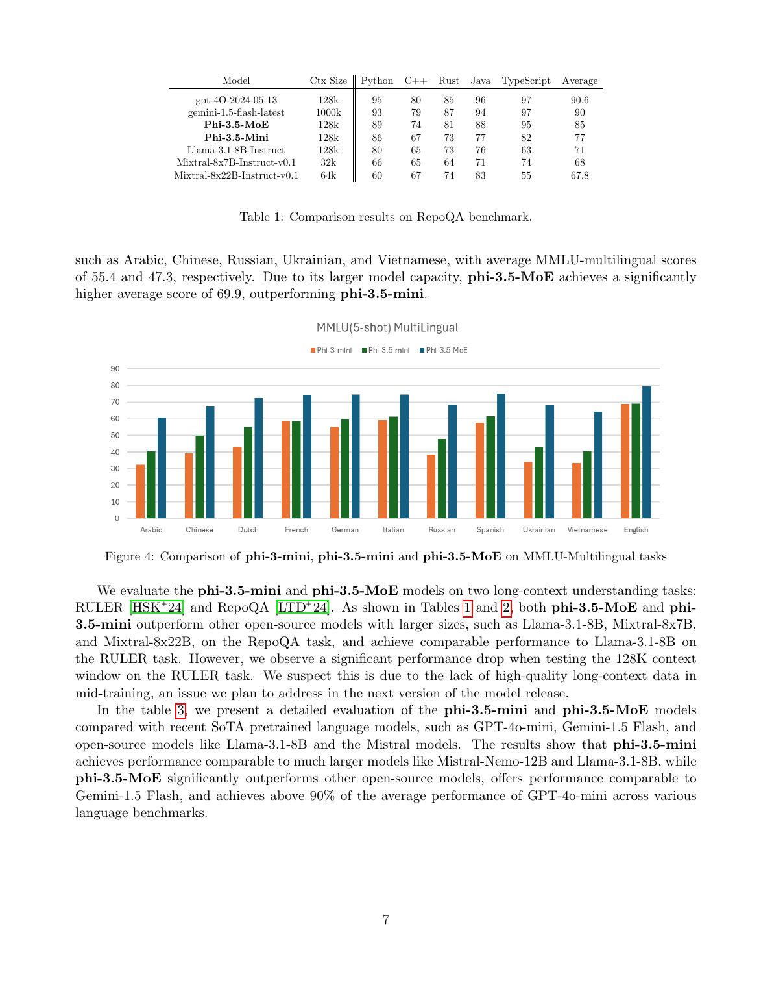

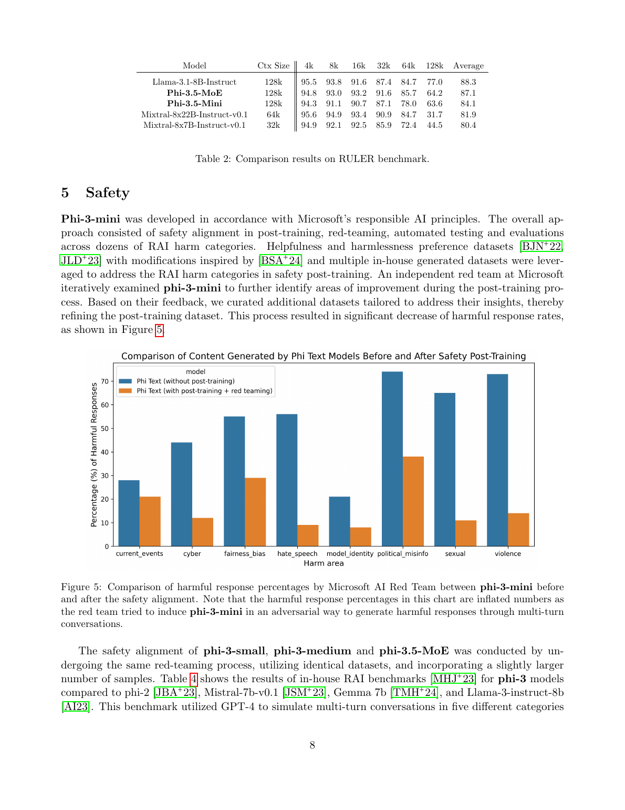

## 5 安全

phi-3-mini 依照 Microsoft 负责任人工智能原则开发。整体方法包括后训练安全对齐、红队测试、自动化测试，以及针对数十种负责任人工智能危害类别的评估。安全后训练使用有用性、无害性偏好数据集及多种内部生成数据，并借鉴相关研究作修改。

Microsoft 独立红队在后训练过程中迭代检查 phi-3-mini，继续发现需要改善的领域；团队根据反馈策划针对性附加数据，完善后训练数据集。这使有害回答率显著降低，如图 5 所示。图中数字被有意放大，因为红队通过对抗式多轮对话尝试诱导模型生成有害回答。

phi-3-small、phi-3-medium、phi-3.5-MoE 使用相同红队流程和数据集，并加入略多样本进行安全对齐。内部负责任人工智能基准用 GPT-4 模拟五类多轮对话并评价回答。“无依据性”从 0 到 4 衡量回答信息是否建立在给定提示之上，0 表示完全有依据，4 表示无依据；其他类别以 0 到 7 衡量危害严重度，再把严重度不低于阈值 $x$ 的样本比例计为缺陷率 DR-$x$。表 4 全部指标都是越低越好。

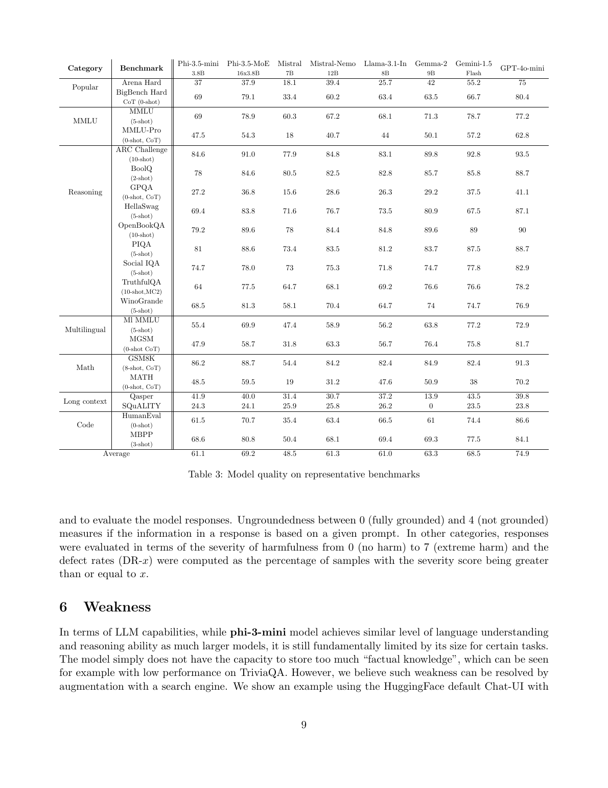

## 6 局限

phi-3-mini 的语言理解和推理可与大得多的模型相比，但某些任务仍从根本上受模型规模限制。它没有足够容量存储太多“事实知识”，TriviaQA 低分就是一例。我们认为可以通过搜索引擎增强解决这一弱点；图 6 展示使用 HuggingFace 默认 Chat-UI 搜索前后的回答。

另一个容量相关弱点，是模型语言主要限于英语。小语言模型的多语言能力是重要下一步，phi-3-small 加入更多多语言数据后已经显示初步积极结果。

即使进行了认真负责的人工智能工作，与多数大型语言模型一样，Phi-3 仍面临事实错误或幻觉、偏差复现或放大、不当内容生成和安全问题。精心策划训练数据、针对性后训练、吸收红队洞见能够显著缓解各维度问题，但要彻底解决仍有大量工作。下游使用必须针对具体用例与相应安全因素单独评估。

## 7 Phi-3.5-Vision

### 7.1 技术规格

#### 7.1.1 架构

Phi-3.5-Vision 是 42 亿参数多模态模型，输入图像或多图以及文本提示，生成文本。它由图像编码器 CLIP ViT-L/14 与 Transformer 解码器 phi-3.5-mini 组成。图像编码器提取的视觉词元与文本词元交错合并，图像和文本不要求固定顺序。

为适应高分辨率和不同宽高比，动态裁剪把输入图像分成二维块阵列，再连接各块词元表示整张图。多图输入则直接连接每张图的词元。

#### 7.1.2 预训练

预训练数据多样，包括交错图文文档、FLD-5B 图文对、由 PDF 光学字符识别产生的合成数据、图表理解数据集和纯文本。下一词元预测目标只应用于文本词元，图像词元损失忽略。预训练共处理 0.5 万亿个视觉和文本词元。多数训练图像小于 1344×1344，因此训练时最大图像分辨率限制在该值。

#### 7.1.3 后训练

后训练分 SFT 和 DPO。SFT 使用文本监督微调数据、公开多模态指令数据和团队自建大规模多模态指令数据，覆盖自然图像理解、图表与示意图理解推理、PowerPoint 理解、多图比较、视频摘要、模型安全等任务，共约 330 亿词元。DPO 主要使用文本偏好数据和规模较小的多模态偏好数据。两个阶段联合训练多模态任务与纯文本任务，使模型获得多模态推理能力，同时尽可能保持语言能力。

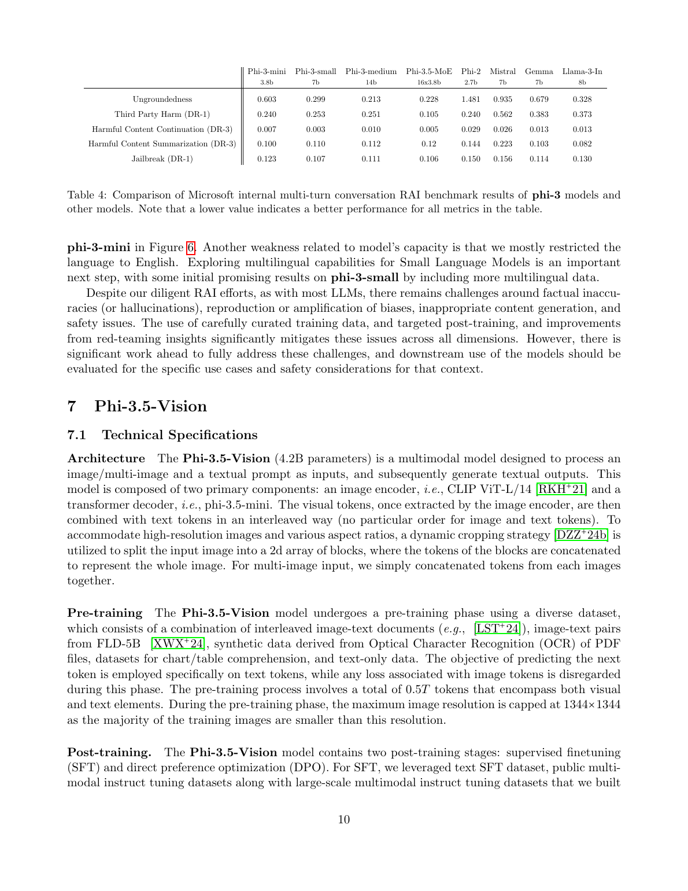

图 6 的搜索案例询问冬奥会信息。没有搜索时，phi-3-mini 回答错误；加入网络搜索后，回答不仅正确，还能给出更具体建议。作为参照，2026 年冬奥会在意大利米兰和科尔蒂纳举行，2022 年、2018 年分别在中国北京和韩国平昌举行。

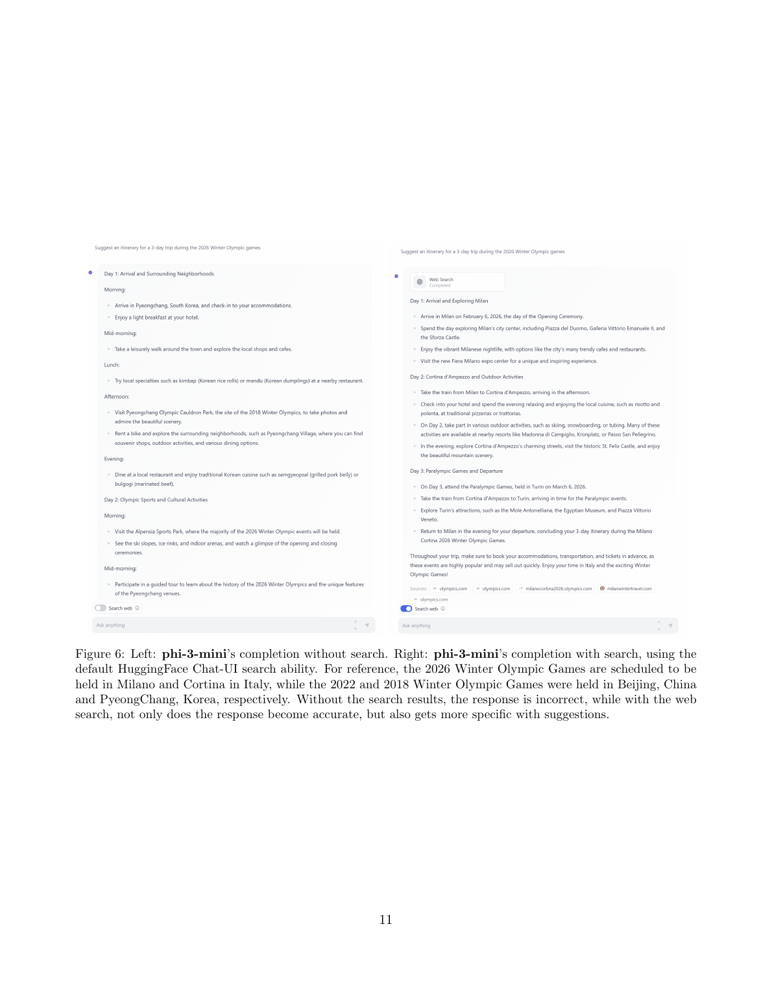

图 7 展示 Phi-3.5-Vision 对自然图像的理解和推理能力。

### 7.2 学术基准

#### 7.2.1 单图基准

表 5 在九项开源学术基准上评估视觉与文本输入的推理、感知能力，可分科学、图表、通用知识三类。比较模型包括 MM1-3B-Chat、MM1-7B-Chat、LLaVA-1.6 Vicuna 7B、LLaVA-1.6 Llama3-8B、Qwen-VL-Chat、Claude 3 Haiku、Gemini 1.0 Pro Vision 和 GPT-4o。除无法公开获取、只能引用公开数字的 MM1-3B-Chat 外，全部模型使用同一流水线公平比较。

评估刻意模拟不熟悉提示工程、也不知道特殊优化技巧的普通用户。采用 LLaVA-1.5 设置：提示要求从选项列表选择一个字母，或只用一个词、短语作答；没有为选择题使用特殊词元；基准系统不缩放、不预处理图像；图像通常放在提示首位，只有 MMMU 会把图像交错放在问题或答案中；全部采用 0-shot。因此结果可能与各模型公开数字不同。Phi-3.5-Vision 尽管更小，却在全部基准上高度有竞争力，并在多数基准超过其他模型。

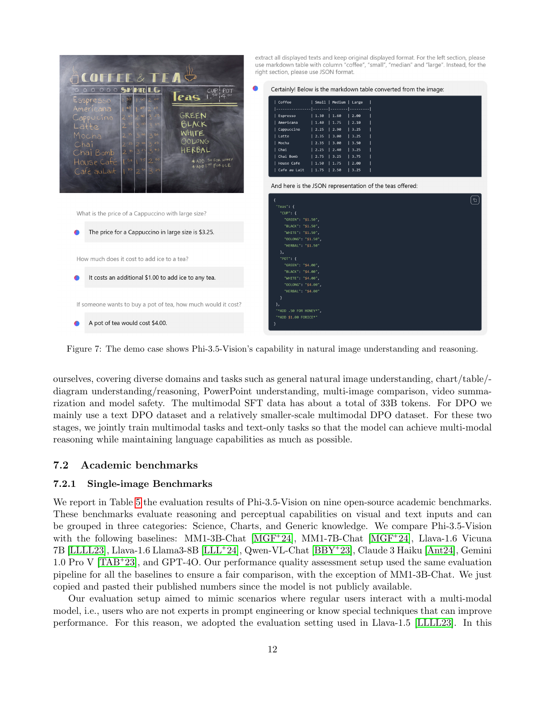

#### 7.2.2 多图基准

表 6 使用一项近期多图基准和一项视频基准，评估多个图像或帧配合文本时的感知能力，覆盖艺术风格识别、取证检测、视频理解等一般场景。比较对象包括 LLaVA Interleave-Qwen 7B、InternVL2 4B 与 8B、Gemini 1.5 Flash、GPT-4o mini、Claude 3.5 Sonnet、Gemini 1.5 Pro 与 GPT-4o。全部模型使用同一流水线。

多图评估同样采用 LLaVA 设置，提示要求从选项选一个字母或用单词、短语作答，不使用选择题特殊词元，不缩放、不预处理图像；多数基准把图像放在提示开头。

BLINK 与 VideoMME 的评估流程和原公开方法不同。BLINK 不让 ChatGPT 选择最终答案，而是要求待测模型直接从选项作答，确保错误或成功只由待测模型造成。VideoMME 按均匀时间覆盖采样视频的 16 帧，这是 Azure OpenAI 模型单条提示可容纳的最大图像数。不同于原基准为每个模型使用其最大帧数，本文为全部模型传入相同的 16 帧，确保输入信息完全相同。Phi-3.5-Vision 在多图理解场景中同样达到或超过相近规模基线。

### 7.3 安全

为使 Phi-3.5-Vision 符合 Microsoft 负责任人工智能原则，SFT 与 DPO 阶段都加入安全后训练。安全数据不仅包括纯文本负责任人工智能数据，还包括多种内部多模态安全数据，覆盖公开与内部多模态安全基准识别的多类危害。评估在公开、内部基准上进行严格定量测量，并结合 Microsoft 内部红队人工评价。

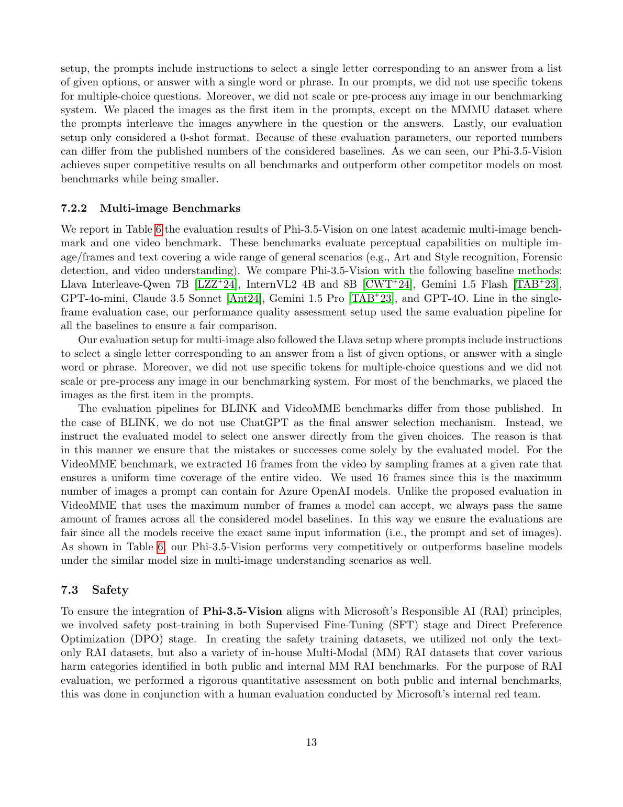

表 7 给出一项内部基准和 RTVLM、VLGuard 两项公开多模态负责任人工智能基准，并与 LLaVA-1.5、LLaVA-1.6、Qwen-VL-Chat、GPT-4V 比较。全部指标范围为 0 到 10，越高越好。安全后训练使 Phi-3.5-Vision 在全部基准显著改善；分类结果进一步表明，几乎所有 VLGuard 与内部基准危害类别都得到提升。

### 7.4 局限

Phi-3.5-Vision 在多个领域表现良好，但仍存在局限，尤其是需要高层推理的问题。模型偶尔生成缺乏依据的输出，在金融等敏感领域可能不可靠。未来将把更多推理导向和幻觉相关的 DPO 数据加入后训练。

从负责任人工智能角度看，安全后训练虽取得显著进展，模型有时仍不能拒绝有害或敏感询问，例如破解某些验证码，或描述包含虚假信息、幻觉的诈骗图像。部分原因是普通指令数据训练出的 OCR 等能力带来的副作用，体现有用性与无害性之间的权衡。未来需要继续探索更好的平衡。

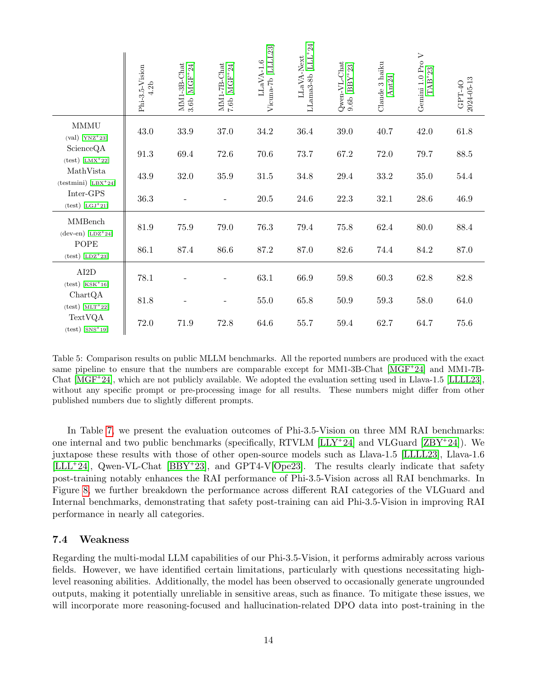

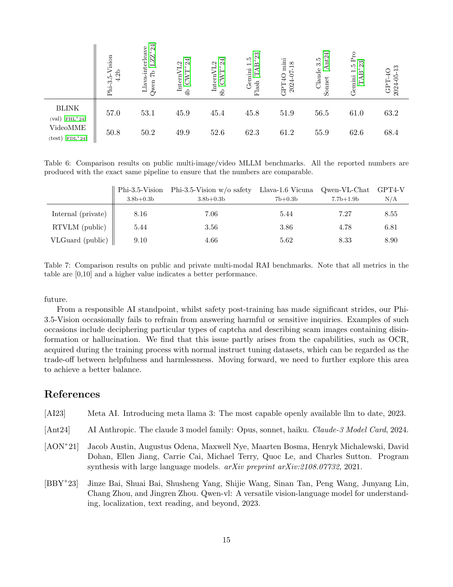

## 参考文献

参考文献按原论文顺序列于第 15-22 页。第 15 页已在上一节呈现，以下继续使用整页截图保留作者、标题、出版信息和链接。

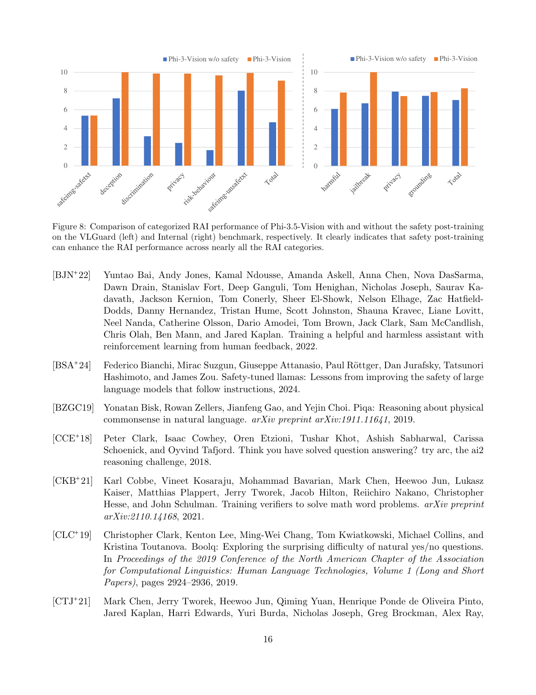

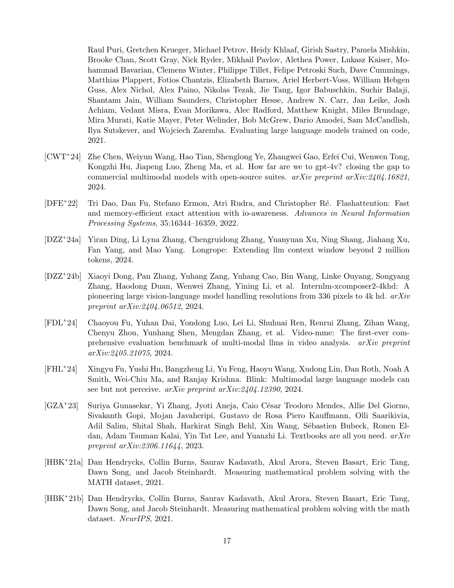

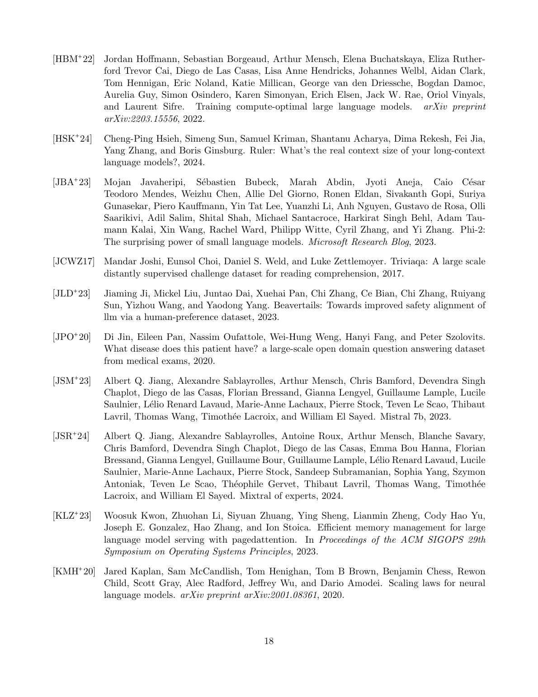

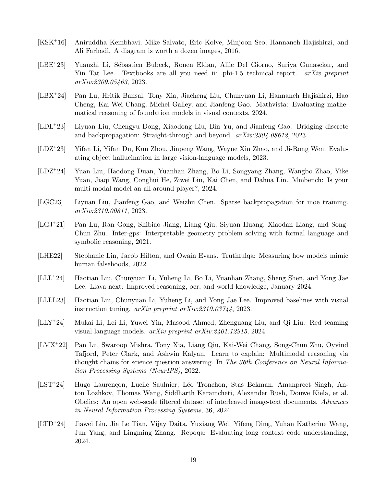

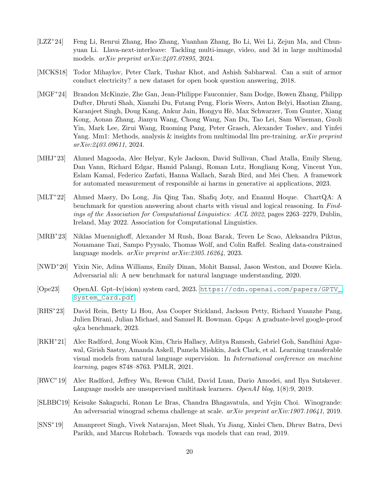

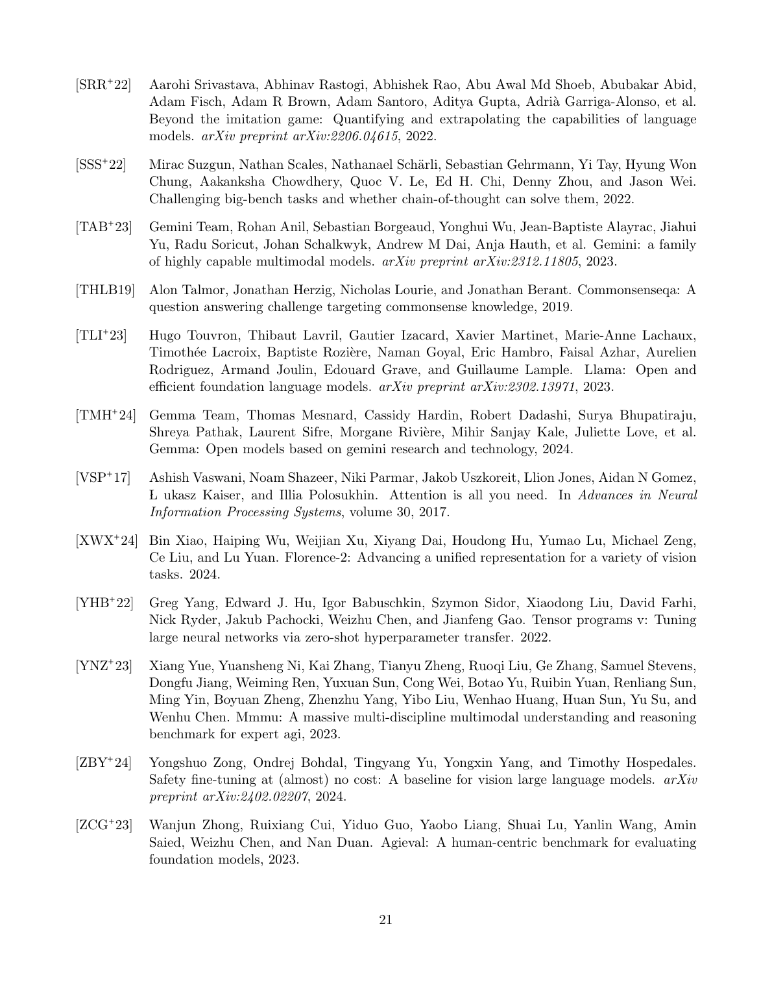

## 附录 A：基准评估提示示例

附录给出 2-shot 多项选择提示。前两道示例分别询问一元方程解和包含垂体的体腔，并标出正确答案；待回答的问题询问希腊最著名的神秘宗教遗址位于何处。复杂提示按原页截图保留。

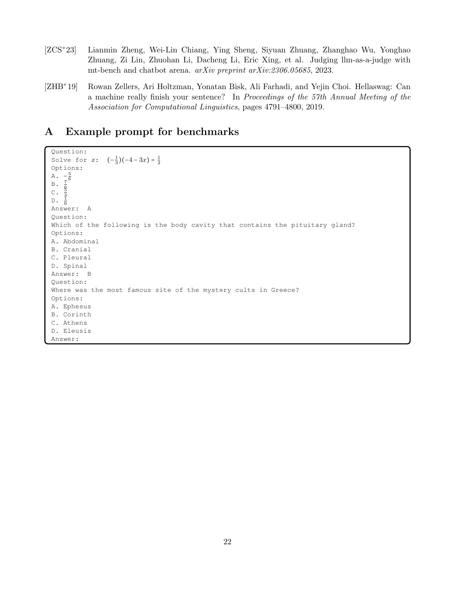

## 附录 B：作者名单

完整作者名单按字母顺序列于原论文第 23 页。

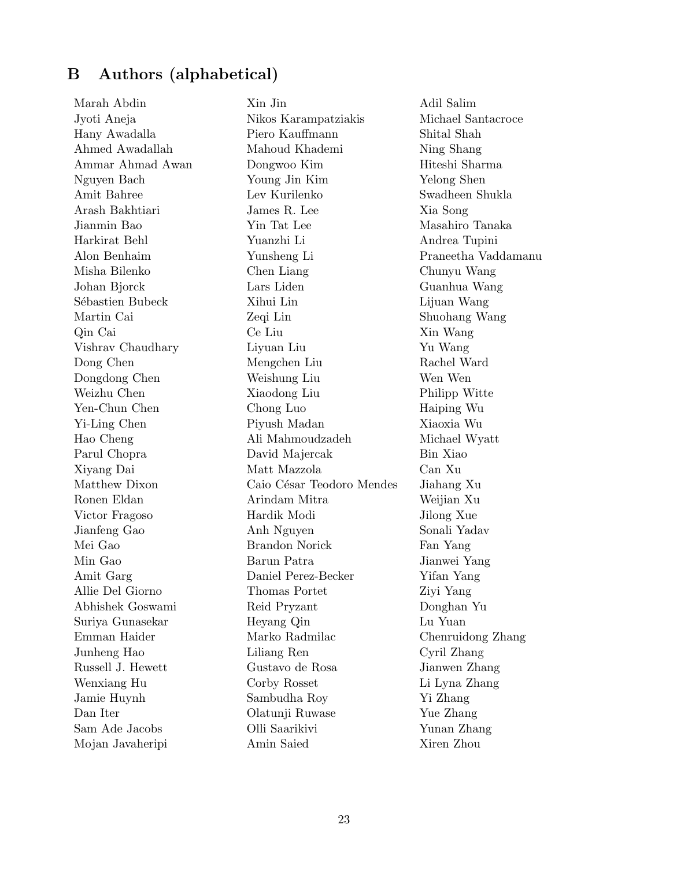

## 附录 C：致谢

作者感谢加州大学伯克利分校的 Zhuohan Li、Simon Mo，以及清华大学的 Kaichao You 分享有关 vLLM 内核的见解。

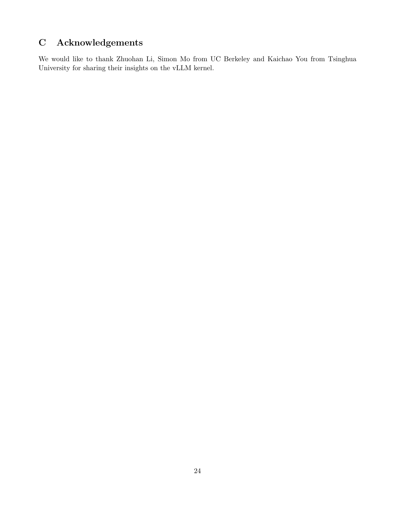
