# Qwen2 技术报告

**作者：** An Yang、Baosong Yang、Binyuan Hui、Bo Zheng、Bowen Yu、Chang Zhou、Chengpeng Li、Chengyuan Li、Dayiheng Liu、Fei Huang、Guanting Dong、Haoran Wei、Huan Lin、Jialong Tang、Jialin Wang、Jian Yang、Jianhong Tu、Jianwei Zhang、Jianxin Ma、Jianxin Yang、Jin Xu、Jingren Zhou、Jinze Bai、Jinzheng He、Junyang Lin、Kai Dang、Keming Lu、Keqin Chen、Kexin Yang、Mei Li、Mingfeng Xue、Na Ni、Pei Zhang、Peng Wang、Ru Peng、Rui Men、Ruize Gao、Runji Lin、Shijie Wang、Shuai Bai、Sinan Tan、Tianhang Zhu、Tianhao Li、Tianyu Liu、Wenbin Ge、Xiaodong Deng、Xiaohuan Zhou、Xingzhang Ren、Xinyu Zhang、Xipin Wei、Xuancheng Ren、Xuejing Liu、Yang Fan、Yang Yao、Yichang Zhang、Yu Wan、Yunfei Chu、Yuqiong Liu、Zeyu Cui、Zhenru Zhang、Zhifang Guo、Zhihao Fan  
**机构：** 阿里巴巴集团通义千问团队  
**说明：** 作者按名字的字母顺序排列。

## 摘要

本报告介绍 Qwen2 系列，这是我们大型语言模型和大型多模态模型家族的最新成员。我们发布了一套完整的基础模型与指令调优语言模型，参数规模覆盖 5 亿至 720 亿，既包括稠密模型，也包括一个混合专家模型。Qwen2 超过了包括其前代 Qwen1.5 在内的大多数既有开放权重模型；在语言理解、生成、多语言能力、代码、数学和推理等多类基准上，它相对于闭源模型也表现出竞争力。

旗舰基础模型 Qwen2-72B 展现出突出的性能：MMLU 为 84.2，GPQA 为 37.9，HumanEval 为 64.6，GSM8K 为 89.5，BBH 为 82.4。其指令调优版本 Qwen2-72B-Instruct 在 MT-Bench、Arena-Hard 和 LiveCodeBench 上分别取得 9.1、48.1 和 35.7。Qwen2 还具备稳健的多语言能力，能够熟练处理约 30 种语言，包括英语、中文、西班牙语、法语、德语、阿拉伯语、俄语、韩语、日语、泰语和越南语等，体现出广泛的适用性与全球覆盖能力。

为了促进社区创新并降低使用门槛，我们已在 Hugging Face 和 ModelScope 开放 Qwen2 模型权重，并在 GitHub 发布包含示例代码在内的补充材料。这些平台还提供量化、微调与部署资源，以支持广泛的应用和研究工作。

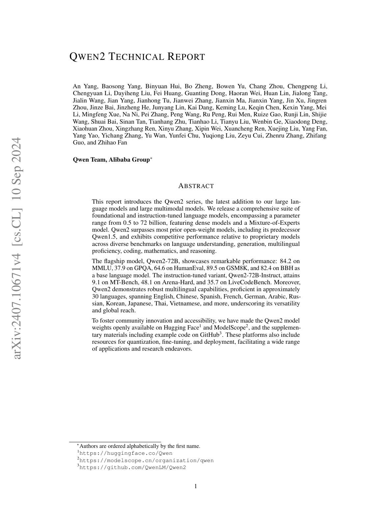

## 目录

全文依次介绍引言、分词器与模型、预训练、后训练、评测和结论。评测部分进一步分为基础语言模型、指令调优模型、开放基准、内部自动评测、长上下文、多语言、安全与责任以及污染分析。

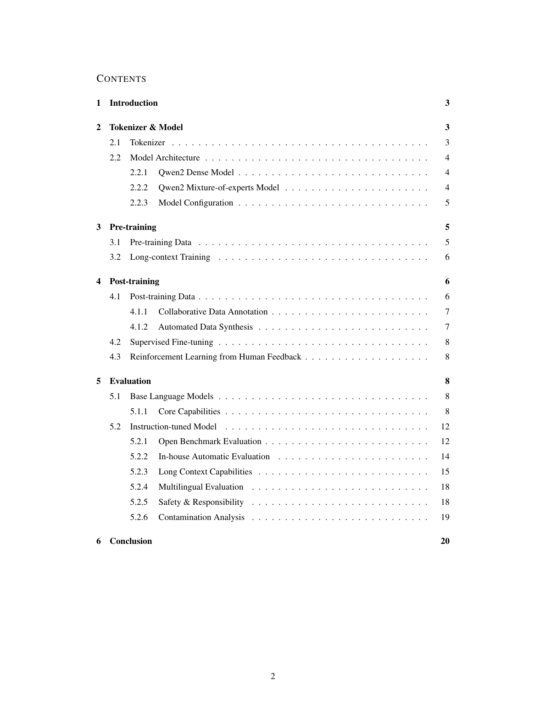

## 1 引言

自 ChatGPT 出现以来，全球对大型语言模型（LLM）的热情迅速升温。Llama 系列的发布进一步点燃了开源社区的兴趣，尤其推动了人们对具备 GPT 级能力、又能在本地运行的 LLM 的探索。近期，Claude-3 Opus 与更新后的 ChatGPT 模型 GPT-4o 先后登上 Chatbot Arena 顶端；该平台因采用真人方式评测 LLM 而广受认可。与此同时，Llama 3 已成为当时最先进的开放权重模型系列，缩小了与领先闭源模型之间的性能差距，并被广泛认为达到 GPT-4 级别。越来越多具有竞争力的 LLM 正沿着 OpenAI GPT 系列开辟的方向继续推进，其中 Qwen、Mistral、Gemma 等许多模型均以开放权重方式发布。

过去几个月，我们先后推出 Qwen 系列并迭代至 Qwen1.5，同时发布了视觉语言模型 Qwen-VL 与音频语言模型 Qwen-Audio。本文介绍 Qwen 大型语言模型和大型多模态模型家族的最新成员 Qwen2。Qwen2 是一系列以 Transformer 架构为基础、通过下一词元预测训练的 LLM。该系列既包含经过预训练但尚未按照人类偏好对齐的基础语言模型，也包含利用单轮和多轮指令跟随数据集微调、适用于对话和智能体场景的指令调优模型。本次发布包括参数量分别为 5 亿、15 亿、70 亿和 720 亿的四个稠密模型，以及一个总参数量 570 亿、每个词元激活 140 亿参数的混合专家（MoE）模型。较小的 Qwen2-0.5B 与 Qwen2-1.5B 面向手机、耳机、智能眼镜等便携设备的便捷部署，较大模型则适合部署在不同规模的 GPU 集群上。

全部模型都在由超过 7 万亿个词元组成的大规模高质量数据集上完成预训练，数据覆盖广泛领域和多种语言。与先前版本相比，Qwen2 纳入了更丰富的语言数据，并提高了代码与数学内容的数量和质量；我们推测，这种扩充有助于增强 LLM 的推理能力。后训练阶段，全部模型都接受监督微调与直接偏好优化（DPO），通过人类反馈学习实现人类偏好对齐，从而获得有效遵循指令的能力。

我们对 Qwen2 进行了全面评测，并选取可通过 API 使用的开放权重与闭源模型作为基线。无论是基础语言能力还是指令调优功能，Qwen2 均超过了多个竞争模型。具体而言，Qwen2-72B-Instruct 在 MT-Bench、Arena-Hard 和 LiveCodeBench 上分别取得 9.1、48.1 和 35.7；基础模型 Qwen2-72B 则在 MMLU、GPQA、HumanEval、GSM8K 和 BBH 上分别达到 84.2、37.9、64.6、89.5 和 82.4。

## 2 分词器与模型

本节介绍 Qwen2 的分词器和模型设计，并给出模型架构以及不同规模模型的配置。

### 2.1 分词器

我们沿用 Qwen 的字节级字节对编码分词器。与其他分词器相比，它具有更高的压缩率，因而编码效率较高，并为 Qwen2 的多语言能力提供支持。

所有规模的模型共用同一词表，其中包含 151,643 个常规词元和 3 个控制词元。更多信息见 Qwen 技术报告。需要指出的是，出于分布式训练方面的考虑，嵌入层实际采用的大小更大。

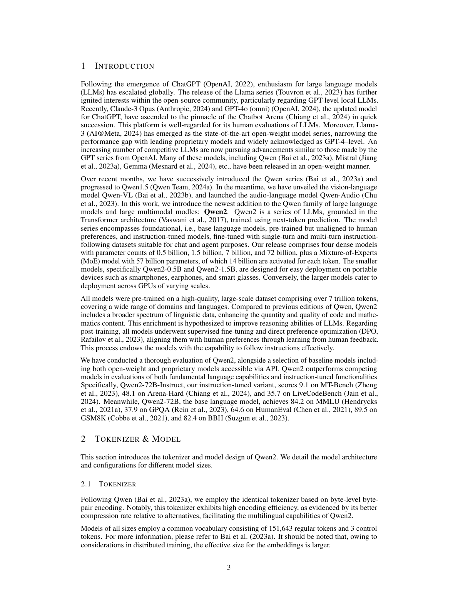

### 2.2 模型架构

Qwen2 系列本质上是基于 Transformer 架构、使用因果掩码自注意力的大型语言模型，包括四种规模的稠密模型和一个 MoE 模型。下文先介绍稠密模型的具体设计，再说明 MoE 模型的独特之处。

#### 2.2.1 Qwen2 稠密模型

Qwen2 稠密模型由多层 Transformer 构成，每层均包含因果注意力机制和前馈神经网络（FFN）。与 Qwen 相比，主要变化如下。

**分组查询注意力。** 我们采用分组查询注意力（GQA），而不是传统的多头注意力（MHA）。GQA 能优化推理期间的键值缓存用量，从而显著提高吞吐量；不同规模模型的键值头配置见 2.2.3 节。

**双块注意力与 YaRN。** 为扩展 Qwen2 的上下文窗口，我们使用双块注意力（DCA），把长序列分割成长度可控的块。如果输入能由单个块处理，DCA 与原始注意力产生相同结果；否则，它能有效捕获块内与跨块词元之间的相对位置信息，进而改善长上下文表现。我们还使用 YaRN 重新缩放注意力权重，以获得更好的长度外推能力。

此外，Qwen2 沿用 Qwen 的多项设计：以 SwiGLU 作为激活函数，以旋转位置嵌入（RoPE）表示位置，在注意力中加入 QKV 偏置，并使用 RMSNorm 与预归一化来维持训练稳定性。

#### 2.2.2 Qwen2 混合专家模型

Qwen2 MoE 的架构与 Qwen1.5-MoE-A2.7B 十分相近。MoE FFN 以 $n$ 个彼此独立、各自充当专家的 FFN 取代原始 FFN。门控网络 $G$ 为每个词元分配概率，再把词元送往选定专家 $E_i$ 计算：

$$p=\operatorname{softmax}(G(x)),$$

$$y=\sum_{i\in\operatorname{topk}(p)}p_iE_i(x).$$

下文说明 Qwen2 MoE 的关键设计取舍。

**专家粒度。** MoE 与稠密模型在结构上的关键区别是：MoE 层包含多个 FFN，每个 FFN 都是一个独立专家。从稠密架构转换为 MoE 架构的一种直接方法，是让每个专家的参数等于原稠密模型中单个 FFN 的参数。例如，从 Mistral-7B 转换到 Mixtral 8x7B 时，每次会激活八个专家中的两个。与之不同，我们采用细粒度专家：缩小单个专家的规模，同时激活更多专家。在专家总参数量和激活参数量相同的前提下，细粒度专家能形成更丰富的组合。借助这种设计，Qwen2 MoE 能以更多样、更动态的方式利用专家，从而提升整体性能与适应能力。

**专家路由。** 专家路由机制的设计对提升 MoE 性能至关重要。近来的一个明显趋势，是在 MoE 层中同时引入共享专家和路由专用专家。我们采用这一思路，让共享专家服务于不同任务，同时保留其他专家供特定路由场景选择使用。共享专家与专门化专家的结合，为构建 MoE 路由机制提供了更灵活、更高效的方式。

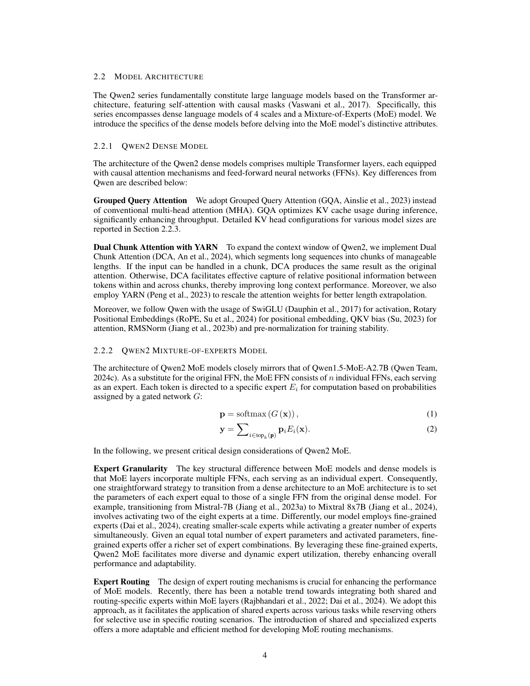

**专家初始化。** 我们借助稠密模型权重，以类似“升级复用”的方式初始化专家；不同之处在于，我们强调细粒度专家之间的多样化，以拓宽模型的表示范围。给定专家中间维度 $h_E$、专家数量 $n$ 和原 FFN 中间维度 $h_{FFN}$，先将 FFN 复制 $\lceil n h_E/h_{FFN}\rceil$ 次，从而在适配任意专家中间维度的同时满足指定专家数量。为提高每个 FFN 副本内部的多样性，我们沿中间维度打乱参数，使不同副本中抽取出的细粒度专家也具有独特特征。随后从这些 FFN 副本中截取专家并舍弃剩余维度，再随机重新初始化每个细粒度专家 50% 的参数。这一步给专家初始化增加了随机性，可能提升模型在训练期间的探索能力。

#### 2.2.3 模型配置

Qwen2 系列包含五种模型：Qwen2-0.5B、Qwen2-1.5B、Qwen2-7B、Qwen2-57B-A14B 和 Qwen2-72B。表 1 给出了层数、注意力头、键值头、中间维度、专家数量、词表大小和预训练词元数量等关键配置。其中，Qwen2-57B-A14B 从 Qwen2-7B 升级而来，总参数量为 570 亿，每个词元激活 140 亿参数；它使用 64 个路由专家，每个词元激活其中 8 个，并额外设置 8 个共享专家。相较 Qwen1.5，Qwen2 每个词元对应的键值缓存显著更小，因此内存占用更低，在长上下文推理中尤其有利。

## 3 预训练

Qwen2 的预训练工作主要聚焦于改进数据集，并探索有效处理更长上下文的方法。

### 3.1 预训练数据

Qwen2 的预训练建立了一套新的、大规模、高质量多语言数据集。与 Qwen 和 Qwen1.5 使用的语料相比，新数据集从多个方面提升了规模、质量和多样性。

**质量提升。** 我们加入更多启发式与基于模型的方法来改进过滤算法，其中包括使用 Qwen 模型剔除低质量数据；同时也利用这些模型合成高质量预训练数据。

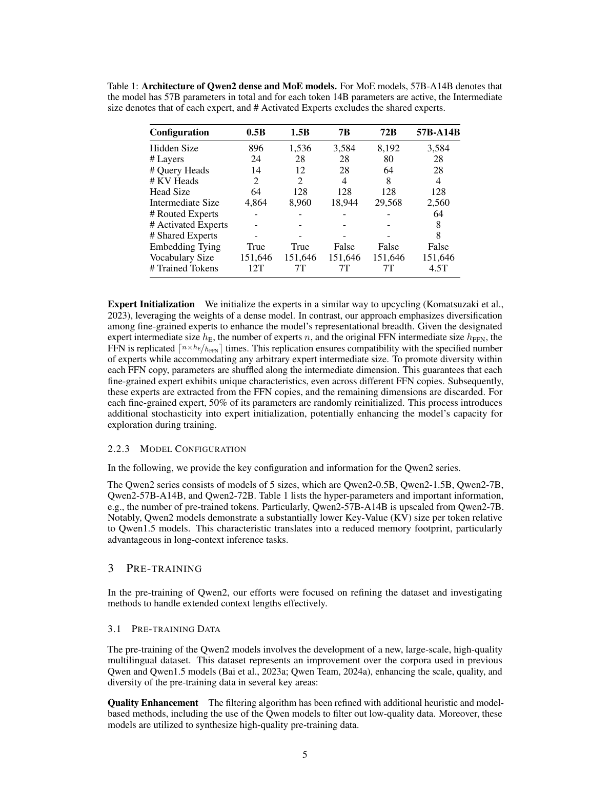

**数据扩展。** 与 Qwen1.5 相比，我们收集了更多高质量代码、数学和多语言数据，以增强模型在相应领域的能力。新数据集支持约 30 种语言，包括英语、中文、西班牙语、法语、德语、阿拉伯语、俄语、韩语、日语、泰语和越南语。

**分布改进。** 为使模型学习到更接近人类学习过程的数据分布，我们在缩小规模的模型上进行实验，优化不同来源和领域数据的混合比例。

经过上述改进，预训练数据从 Qwen1.5 的 3 万亿词元扩展至 7 万亿词元。我们曾放宽质量阈值，得到一个包含 12 万亿词元的数据集，但在该数据集上训练的模型相较 7 万亿词元模型没有显著提升。这说明，单纯增加数据量未必有利于模型预训练。综合训练成本考虑，我们选择质量更高的 7 万亿词元数据集训练较大模型，并将进一步探索留待未来迭代。

除 Qwen2-0.5B 外，全部 Qwen2 稠密模型均在超过 7 万亿词元的大规模数据集上预训练；Qwen2-0.5B 使用 12 万亿词元数据集。遵循升级复用原则，MoE 模型又接受了 4.5 万亿词元的额外预训练。与先前 Qwen 模型一样，Qwen2 预训练还融入高质量多任务指令数据，以增强上下文学习与指令跟随能力。

### 3.2 长上下文训练

在预训练的最后阶段，我们把上下文长度从 4,096 个词元扩展到 32,768 个词元，并显著增加高质量长文本数据。与此同时，RoPE 的基础频率从 10,000 调整为 1,000,000，以优化长上下文场景中的性能。

为了充分利用模型的长度外推潜力，我们采用 YaRN 和双块注意力。这些策略使模型能够处理最长 131,072 个词元的序列，同时维持较高性能；初步实验中，困惑度仅有轻微下降。

## 4 后训练

大规模预训练完成后，我们对 Qwen2 进行后训练。该阶段对于提升代码、数学、逻辑推理、指令跟随和多语言理解等广泛能力至关重要，也能使模型生成内容与人类价值观协调，做到有帮助、诚实且无害。不同于严重依赖大量人工监督的传统方法，我们关注以尽量少的人工标注实现可扩展对齐。具体而言，我们探索如何获得高质量演示数据和偏好数据，分别服务于监督微调（SFT）与人类反馈强化学习（RLHF），目标是在减少人工标注需求的同时最大化数据的质量与可靠性。

### 4.1 后训练数据

后训练数据主要由两部分组成：演示数据 $D=\{(x_i,y_i)\}$ 和偏好数据 $P=\{(x_i,y_i^+,y_i^-)\}$。其中，$x_i$ 表示指令，$y_i$ 表示令人满意的回答；$y_i^+$ 与 $y_i^-$ 是针对同一指令的两个回答，前者优于后者。数据集 $D$ 用于 SFT，数据集 $P$ 用于 RLHF。

训练数据构建包括协作式数据标注和自动数据合成两个步骤。首先，从大规模指令语料中提取数据本体，得到广泛、多样且高质量的指令集合，再系统地提升这些指令的复杂度。通过人工标注获得目标回答 $y_i$ 以及相应的正、负样本 $y_i^+$ 和 $y_i^-$。随后采用多种自动对齐策略，在代码、数学、指令跟随、创作、角色扮演和安全等领域合成大量人工式标注数据。

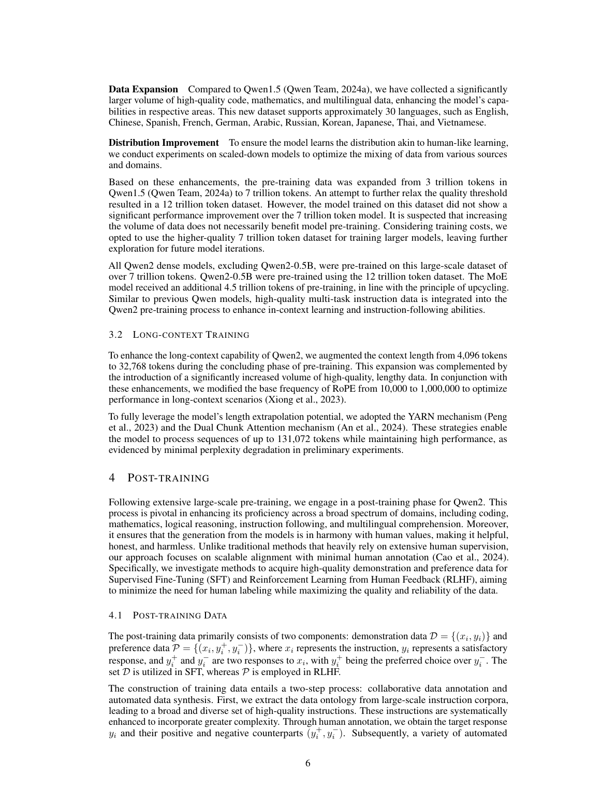

#### 4.1.1 协作式数据标注

**自动本体提取。** 首先使用开放集合细粒度标注器 InsTag，从大规模指令数据集中提取底层本体，再进行人工修订，以保证本体准确。

**指令选择。** 每条已标注标签的指令都会从标签多样性、语义丰富度、复杂度和意图完整性四个方面接受评估，据此选出具有代表性的指令集合。

**指令演化。** 为丰富指令数据集，我们采用自演化策略，提示 Qwen 模型向既有指令增加约束或要求，从而提高复杂度，并确保数据集覆盖多种难度层级。

**人工标注。** 使用多样化生成策略和不同规模的 Qwen 模型，为一条指令生成多个回答。标注者依据偏好对这些回答排序，并确保最佳回答满足既定标准，由此同时得到演示数据与偏好数据。

#### 4.1.2 自动数据合成

大规模维持指令回答的标注质量十分困难，尤其是那些需要专业知识、经验、谨慎判断或耐心的任务。为解决这一问题，我们设计了多种自动对齐策略，以规模化方式合成数据。

**拒绝采样。** 对数学等具有确定最终答案的任务，采用拒绝采样提高解答质量。让 LLM 针对每条指令生成多个回答，即多条推理路径；保留能够得出正确结论且被模型判断为合理的路径，作为演示数据，再通过对比正确与错误路径生成偏好数据。

**执行反馈。** 对代码任务，让 LLM 生成解法及配套测试用例，再通过编译并针对测试用例运行代码来评估解法有效性，由此构造演示数据和偏好数据。这种方法同样适用于评估指令跟随：对于包含长度限制等约束的指令，让 LLM 生成 Python 验证函数，检查回答是否满足指令要求。

**数据再利用。** 对缺乏专业训练的标注者而言，文学写作任务中的高水平回答很难创作。为此，我们汇集公版高质量文学作品，并让 LLM 生成细节程度不同的指令；这些指令与原作配对后充当演示数据。例如，为构造回答生动、引人入胜的角色扮演数据，我们从维基百科等知识库收集详细角色资料，再要求 LLM 生成相应的指令和回答。该过程类似阅读理解任务，能够保持角色资料的完整性。

**宪法式反馈。** 宪法式人工智能是指按照预先定义的原则集合，引导 LLM 生成回答。为确保模型遵守安全、价值观等准则，我们整理了一套宪法数据集，明确应当遵守和应当避免的原则，再用它指导 LLM 生成符合或偏离准则的回答，作为演示数据和偏好数据的参考。

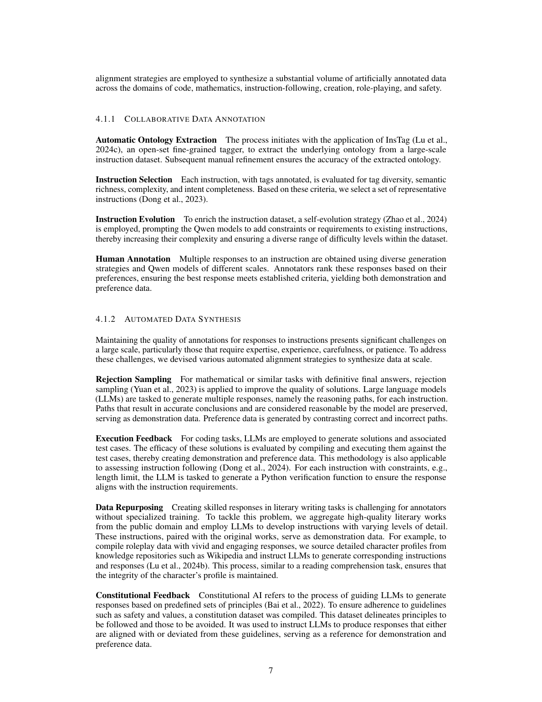

### 4.2 监督微调

我们整理了一个包含超过 50 万条样本的大型指令数据集，覆盖指令跟随、代码、数学、逻辑推理、角色扮演、多语言和安全等技能。模型使用 32,768 个词元的序列长度微调两个周期。为优化学习过程，学习率从 $7\times10^{-6}$ 逐步下降到 $7\times10^{-7}$；为抑制过拟合，采用 0.1 的权重衰减，并把梯度范数裁剪在最大 1.0。

### 4.3 人类反馈强化学习

Qwen2 的 RLHF 训练依次包含离线训练和在线训练两个阶段。离线阶段使用预先整理的偏好数据集 $P$，通过直接偏好优化最大化 $y_i^+$ 与 $y_i^-$ 之间的似然差异。在线阶段利用奖励模型提供即时反馈，使模型以实时迭代方式继续改进。具体而言，从当前策略模型采样多个回答，由奖励模型选出最受偏好和最不受偏好的回答，组成偏好对，并在每一轮中用于 DPO。我们还采用在线合并优化器缓解“对齐税”，也就是模型生成与人类偏好对齐时伴随的性能下降。

## 5 评测

为了全面评估包含基础模型和指令调优模型的 Qwen2 系列，我们设计了一套综合评测方案，考察通识理解、语言理解、生成、代码、数学、推理及其他专业能力。除非另有说明，基础模型均通过少样本提示在成熟的 LLM 基准上评估；对指令调优模型，除基准评测外，我们还特别重视人类偏好评估。

### 5.1 基础语言模型

本节展示 Qwen2 系列基础模型的评测。我们先使用知识与基础能力基准评估模型，再用多语言基准考察其语言支持。鉴于模型规模不一，各模型均与规模相近或更大的先进模型比较。

#### 5.1.1 核心能力

**基准与评测方案。** 评估基础语言模型核心能力的常见做法，是使用少样本或零样本提示执行基准数据集评测，重点衡量自然语言理解、通用问答、代码、数学、科学知识和推理等能力。本文使用的英文及中英文基准包括：MMLU（5 样本）、MMLU-Pro（5 样本）、GPQA（5 样本）、Theorem QA（5 样本）、BBH（3 样本）、HellaSwag（10 样本）、Winogrande（5 样本）、TruthfulQA（零样本）、ARC-C（25 样本）、HumanEval、MBPP、EvalPlus 与 MultiPL-E（均为零样本，其中 MultiPL-E 覆盖 Python、C++、Java、PHP、TypeScript、C#、Bash 和 JavaScript）、GSM8K（5 样本）、MATH（4 样本）、C-Eval（5 样本）和 CMMLU（5 样本）。

多语言数据集分为四类：第一类是考试，包括 M3Exam、IndoMMLU、ruMMLU 以及阿拉伯语、西班牙语、法语、葡萄牙语、德语、意大利语、日语和韩语版本的翻译 MMLU；第二类是理解，包括 BELEBELE、XCOPA、XWinograd、XStoryCloze 和 PAWS-X；第三类是数学，使用 MGSM 的 8 样本思维链评测；第四类是翻译，使用 Flores-101 的 5 样本评测。

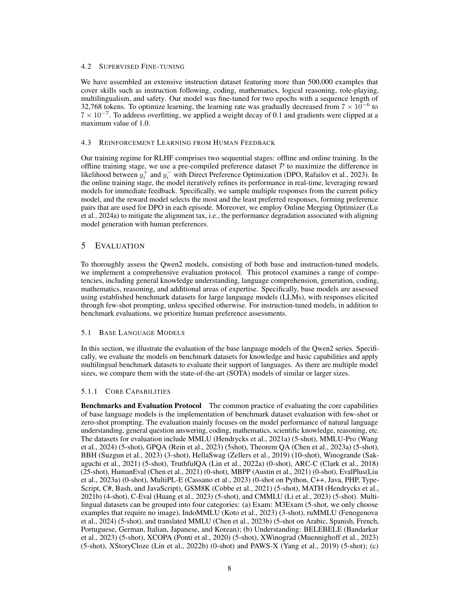

**Qwen2-72B。** 我们将最大的 Qwen2 模型与具有竞争力的开放权重基线比较，包括 Mixtral-8x22B、Llama-3-70B、Qwen1.5-72B 和 Qwen1.5-110B，结果见表 2。Qwen2-72B 在 MMLU 和 MMLU-Pro 通识理解上分别比 Llama-3-70B 高 4.7 与 2.8 分；在科学评测 GPQA 和 Theorem QA 上分别高 1.6 与 9.8 分。代码数据得到扩充后，Qwen2-72B 在 HumanEval 和 MBPP 上分别比 Qwen1.5-72B 高 18.3 与 10.0 个百分点；数学数据增强则使其在 GSM8K 和 MATH 上分别高 10.0 与 17.0 个百分点。综合 BBH、Winogrande 和 ARC-C，它的推理能力与 Llama-3-70B 相当，这可归因于代码和数学数据的改进。在中文理解方面，Qwen2-72B 显著超过 Mixtral-8x22B 与 Llama-3-70B，也优于 Qwen1.5-72B。

表 2 还显示，Qwen2-72B 在多语言考试、理解和数学上分别取得 76.6、80.7 与 76.0，在多数数据集上都优于各项基线。

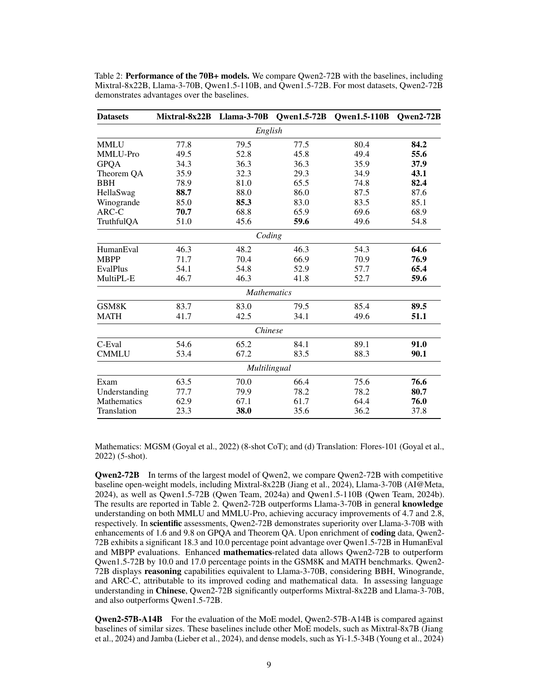

**Qwen2-57B-A14B。** 评估 MoE 模型时，我们选择规模相近的基线，包括 MoE 模型 Mixtral-8x7B 与 Jamba，以及约 300 亿参数的稠密模型 Yi-1.5-34B 与 Qwen1.5-32B，结果见表 3。我们预期每次激活 140 亿参数的 Qwen2-57B-A14B 能达到约 300 亿参数 Qwen2 稠密模型的性能。评测显示，它在自然语言理解任务上与 Yi-1.5-34B 相当，并在代码与数学任务上超过各项基线；中文理解也十分稳健，接近规模更大的 Qwen2-72B。总体而言，Qwen2-57B-A14B 每次前向传播只激活 140 亿参数，却保持了约 300 亿参数稠密模型的性能水平，是一种高效模型。

**Qwen2-7B。** 70 亿参数模型应用广泛，因为它能在配备 16GB 显存的加速器上以 16 位浮点精度运行。我们将 Qwen2-7B 与其他领先的 70 亿级模型比较，包括近期在 Chatbot Arena 表现优异的 Llama-3-8B，以及 Mistral-7B-v0.2、Gemma-7B 和前代 Qwen1.5-7B。

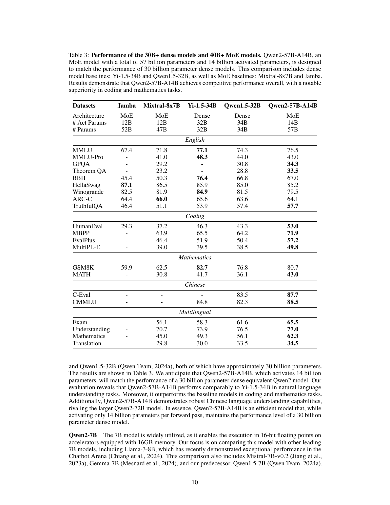

表 4 显示，Qwen2-7B 在大多数数据集上都优于其他模型，尤其擅长代码、数学和中文任务，在多语言理解与考试中也表现强劲。这表明 Qwen2-7B 已针对广泛的语言任务和逻辑任务进行优化，具有良好的通用性与先进能力。

**Qwen2-1.5B 与 Qwen2-0.5B。** 为评估较小模型，我们将 Qwen2-1.5B 和 Qwen2-0.5B 与 Phi-2、Gemma-2B 和 Qwen1.5-1.8B 比较，结果见表 5。在语言理解上，Qwen2-1.5B 超过了使用教科书式数据训练的 Phi-2。代码方面，Qwen2-0.5B 与 Gemma-2B、Qwen1.5-1.8B 相当，Qwen2-1.5B 则除 Phi-2 外超过其他基线。两个 Qwen2 小模型的数学能力均优于竞争者。通用推理方面，Phi-2 通常领先其他模型，这在一定程度上反映了教科书数据对推理能力的重要性。Qwen2-1.5B 在 TruthfulQA 上取得最佳成绩，说明小模型并不必然更容易产生幻觉。中文理解方面，两个 Qwen2 模型也均超过其他模型，与大模型比较中的趋势一致。

总体来看，Qwen2 系列在不同模型规模上都优于相应基线，其中 Qwen2-72B 在整个系列中表现最佳，证明了扩大模型规模的有效性。

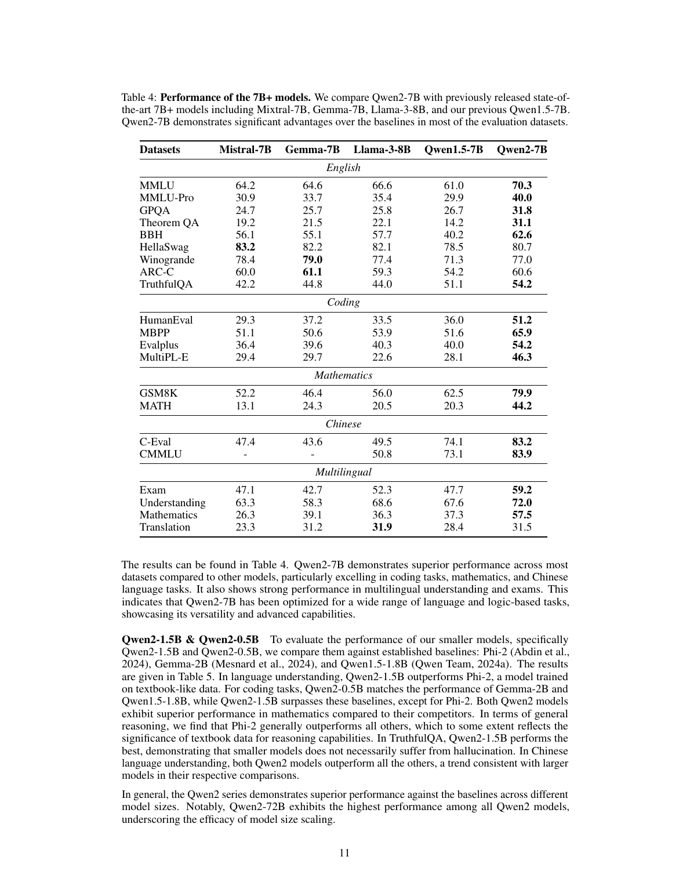

### 5.2 指令调优模型

为严格评估指令调优模型，我们采用多维方法：使用开放数据集和基准考察基础技能与人类偏好，用内部详细评测进一步探查关键能力，并专门评估长上下文能力；安全部分则包含多语言安全评测与红队测试。以下各节说明具体方法与结果。

#### 5.2.1 开放基准评测

为全面评估指令调优模型质量，我们结合自动评测与人工评测，考察模型能力和人类偏好。基础能力评测使用与预训练模型相近的数据集：MMLU、MMLU-Pro、GPQA 和 Theorem QA 衡量语言理解与知识；HumanEval、MBPP、MultiPL-E 和 LiveCodeBench v1 衡量代码能力；GSM8K 与 MATH 衡量数学能力。人类偏好对齐与指令跟随评测则采用 MT-Bench、Arena-Hard、AlignBench、结果近似 Chatbot Arena 的 MixEval，以及 IFEval 的严格提示子集。

**Qwen2-72B-Instruct。** 我们将它与 Mixtral-8x22B-Instruct、Llama-3-70B-Instruct 和 Qwen1.5-72B-Chat 比较，结果见表 6。强大的基础语言模型能提升指令调优模型的下游表现。除 GPQA 与 MBPP 外，Qwen2-72B-Instruct 在语言理解、代码和数学等领域均优于同类模型；在人类偏好对齐和指令跟随方面也具有明显优势。我们认为，这既得益于高质量预训练模型，也来自后训练数据与训练技术的改进。

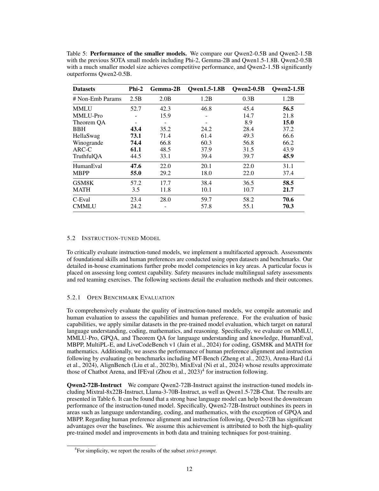

表 6 显示，Qwen2-72B-Instruct 在 HumanEval、LiveCodeBench v1、GSM8K 和 MATH 上分别取得 86.0、35.7、93.2 和 69.0；在人类偏好与对齐评测中，MT-Bench 为 9.12，MixEval 为 86.7，Arena-Hard 为 48.1，IFEval 严格提示为 77.6，AlignBench 为 8.27。

**Qwen2-57B-A14B-Instruct。** 对中等规模模型，我们把它与另一种 MoE 基线 Mixtral-8x7B-Instruct，以及参数超过 300 亿的稠密先进模型 Yi-1.5-34B-Chat、Qwen1.5-32B-Chat 比较，结果见表 7。相较 Qwen1.5-32B-Chat，Qwen2-57B-A14B-Instruct 在几乎全部基准上表现更好；与 Yi-1.5-34B-Chat 相比，除数学评测外，它在大多数项目中也占优，而对齐评测上的优势尤其明显。

**Qwen2-7B-Instruct。** 在 70 亿至 90 亿参数范围内，我们将它与 Llama-3-8B-Instruct、Yi-1.5-9B-Chat、GLM-4-9B-Chat 和 Qwen1.5-7B-Chat 比较，结果见表 8。Qwen2-7B-Instruct 在综合评测中较前代显著进步，代码和数学任务提升尤其突出；与当时先进的 Llama-3-8B-Instruct 相比，它整体具有竞争力，并在代码方面更强。不过，它的指令跟随能力明显落后。为解决这一限制，我们计划提高后训练数据质量，增强 70 亿模型理解和执行复杂命令的能力。

**Qwen2-1.5B-Instruct 与 Qwen2-0.5B-Instruct。** 我们将 Qwen2-0.5B-Instruct 与 Qwen1.5-0.5B-Chat 比较，并将 Qwen2-1.5B-Instruct 与 Qwen1.5-1.8B-Chat 比较。部分为大模型设计的数据集难度超过这些小模型的能力，因此只分析选定子集。表 9 显示，Qwen2 小模型在核心能力和指令跟随任务上都明显优于前代，主要原因是预训练数据规模扩大。这证明，即使模型参数不足十亿，扩大数据规模依然是提高性能的有效策略。

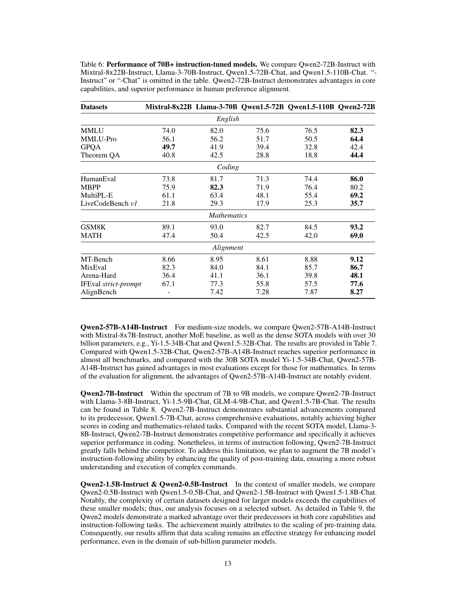

#### 5.2.2 内部自动评测

尽管已有不少开放评测基准，我们认为它们仍远不足以完整理解 LLM 的能力。因此，我们制作了一系列内部数据集，评估知识理解、文本生成、代码等不同能力，并分别以中文和英文开展评测，结果汇总于表 10 和表 11。

**中文评测。** 中文评测主要比较 Qwen2 与对应 Qwen1.5 模型。小模型方面，即使参数更少，Qwen2-1.5B-Instruct 仍在几乎全部评测中超过 Qwen1.5-1.8B-Chat；70 亿模型中，Qwen2 的优势更明显。值得注意的是，Qwen2-72B-Instruct 甚至超过参数多得多的 Qwen1.5-110B-Chat。MoE 模型除知识理解外，在大多数领域均优于 Qwen1.5-32B-Chat；知识项的差距可能源于预训练词元不足。我们计划继续预训练 MoE 模型，以探索其规模扩展规律。

**英文评测。** 英文评测同时把 Qwen2 与 Qwen1.5、Llama 3 比较。Qwen2 小模型同样显著超过对应的 Qwen1.5 模型；但与 Llama-3-70B 相比，Qwen2-72B-Instruct 仍有小幅落后，尤其体现在理解和代码上。我们推测，英文预训练词元数量，以及后训练数据的数量与多样性，共同造成了这一性能差距。

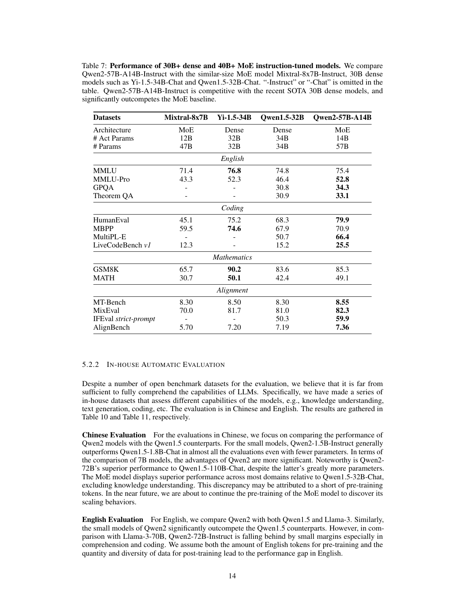

表 8 展示 70 亿至 90 亿级指令模型的详细比较；Qwen2-7B-Instruct 在 HumanEval、LiveCodeBench v1、GSM8K 与 MATH 上分别达到 79.9、26.6、85.7 与 52.9，但 IFEval 严格提示得分 54.7，低于 Llama-3-8B-Instruct 的 72.1。表 9 则显示，Qwen2-0.5B 和 Qwen2-1.5B 在 MMLU、HumanEval、MBPP、GSM8K 与 IFEval 上均全面超过相近规模的 Qwen1.5 模型。

#### 5.2.3 长上下文能力

我们使用三种方法评估长上下文能力：大海捞针（NIAH）、NeedleBench 和 LV-Eval。

**大海捞针。** 该实验衡量模型从海量文本中准确找出事实的能力。我们构造长度分别为 8K、16K，一直到 128K 词元的文本，并把事实放在不同深度位置；每个深度区间包含两个样本。评测超过 32K 的上下文时使用 YaRN。图 1 显示，Qwen2-72B-Instruct 能够以极高准确率从完整 128K 上下文中检索信息；如果计算资源充足，结合它本身的强大能力，该模型是处理长文本的理想选择。同一系列其他模型在不同上下文长度上也表现突出：Qwen2-7B-Instruct 能高准确率处理最长 128K 的上下文，Qwen2-57B-A14B-Instruct 能熟练处理最长 64K，两个更小模型则支持 32K。

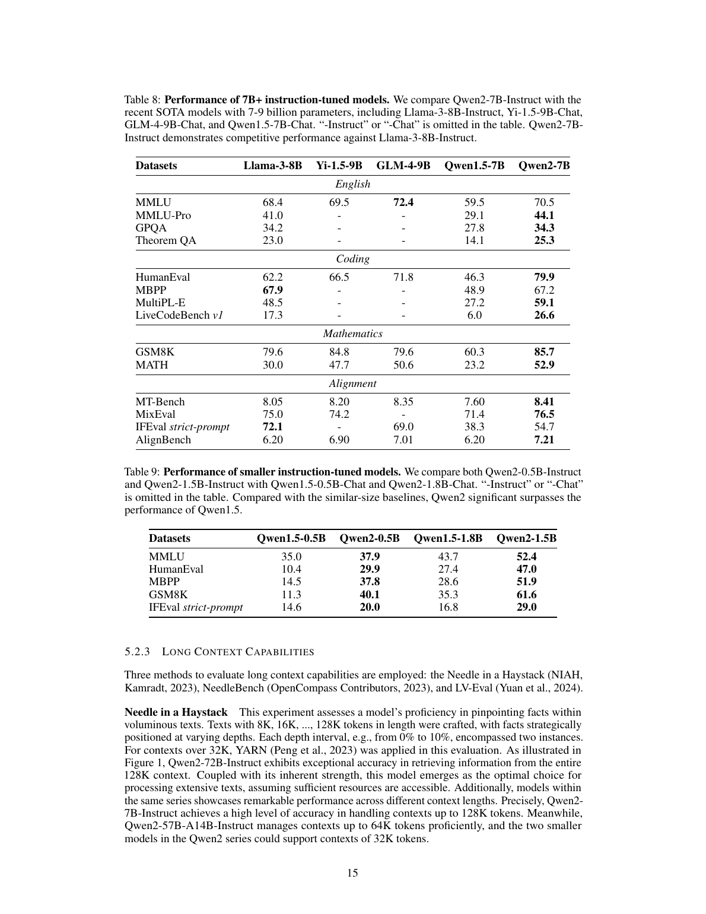

内部中文自动评测把知识、考试、理解、代码、数学与推理纳入统一比较。表 10 中，Qwen2-72B-Instruct 平均得分 69.58，略高于 GPT-4o 的 68.87 和 Qwen-Max 的 68.57；Qwen2-57B-A14B-Instruct 平均 61.63，也高于 Qwen1.5-32B-Chat 的 59.94。英文自动评测包含知识、理解、代码和数学四项；表 11 中，Qwen2-72B-Instruct 平均 72.94，低于 Llama-3-70B-Instruct 的 74.06 与 GPT-4o 的 76.11，但超过所有列出的 Qwen1.5 模型。

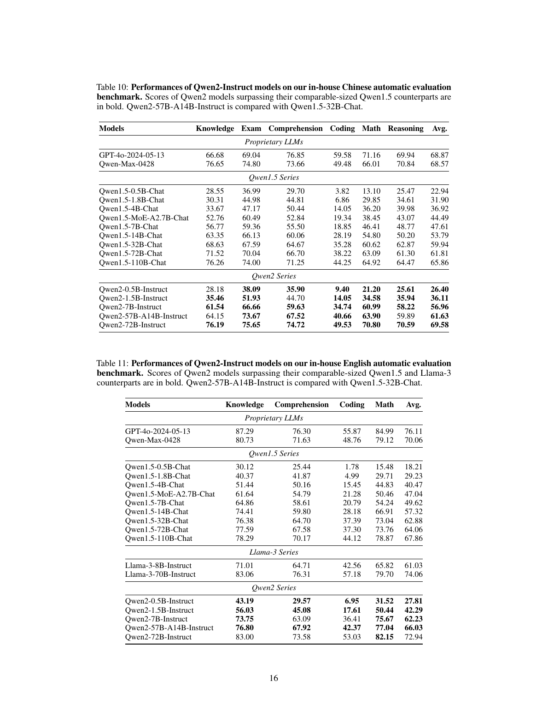

图 1 给出了不同模型在多种上下文长度和事实深度下的大海捞针结果。所有支持超过 32K 上下文的模型都结合 YaRN。表 12 比较 Qwen2-72B-Instruct 与 Qwen2-7B-Instruct 在 NeedleBench 和 LV-Eval 上的表现，并说明加入 YaRN 与 DCA 不会改变 32K 以内的模型行为。

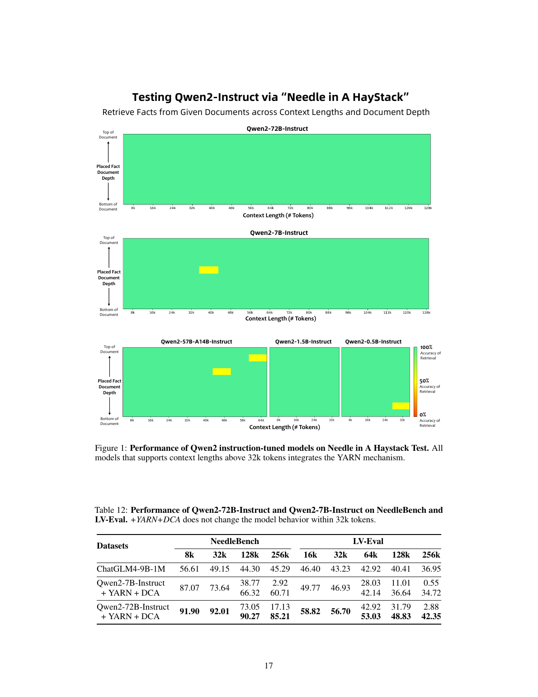

**NeedleBench。** 相较 NIAH，NeedleBench 会在文本中放入两至五条事实，要求模型同时识别它们并完成多跳推理，难度更高。表 12 表明，结合 YaRN 与 DCA 能显著增强 Qwen2 的长上下文能力。Qwen2-7B-Instruct 超过了宣称支持 100 万上下文长度的 ChatGLM4-9B-1M。Qwen2-72B-Instruct 也表现强劲：在更长上下文下，其准确率仅下降 6 分，而 ChatGLM4-9B-1M 下降 11 分，并且后者的初始准确率更低。

**LV-Eval。** LV-Eval 包含 11 个多样化问答数据集，任务要求模型同时理解多条证据。原始指标过于严格，容易产生大量假阴性，因此本文改用关键词召回率作为报告分数。表 12 显示，加入 YaRN 与 DCA 能大幅强化 Qwen2 在 LV-Eval 上的长上下文能力。Qwen2-7B-Instruct 与 ChatGLM4-9B-1M 基本相当，不过在上下文进一步变长时下降更明显；Qwen2-72B-Instruct 在所有长度上均表现稳健，证明其擅长处理长上下文任务。

#### 5.2.4 多语言评测

我们采用完整的人工评测来衡量多语言能力。具体而言，设计覆盖 LLM 不同能力的多样化测试用例，并将这些用例编写为多种语言；每种语言邀请一名以该语言为专业的标注者，对模型回答按 1 至 5 分评分。

表 13 报告不同语言上的模型与基线结果。平均来看，Qwen2-72B-Instruct 显著超过 GPT-3.5-Turbo，与 GPT-4-Turbo 具有竞争力，但略低于 Claude-3-Opus。结果说明，多语言预训练与指令调优数据确实增强了 Qwen2-72B-Instruct 的多语言能力，使其能够与大多数先进闭源 LLM 竞争。

#### 5.2.5 安全与责任

开放模型权重能够有效加快研究和应用发展；与此同时，我们认为构建安全且负责任的 LLM 至关重要，这有助于显著减轻人工智能技术被滥用所造成的影响。

我们开展多语言安全评测，在不同语言下测试 LLM，重点考察违法行为、欺诈、色情与隐私等主题。测试集包含容易诱发越狱的提示，用来检查模型是否会通过拒绝回答而给出安全响应。

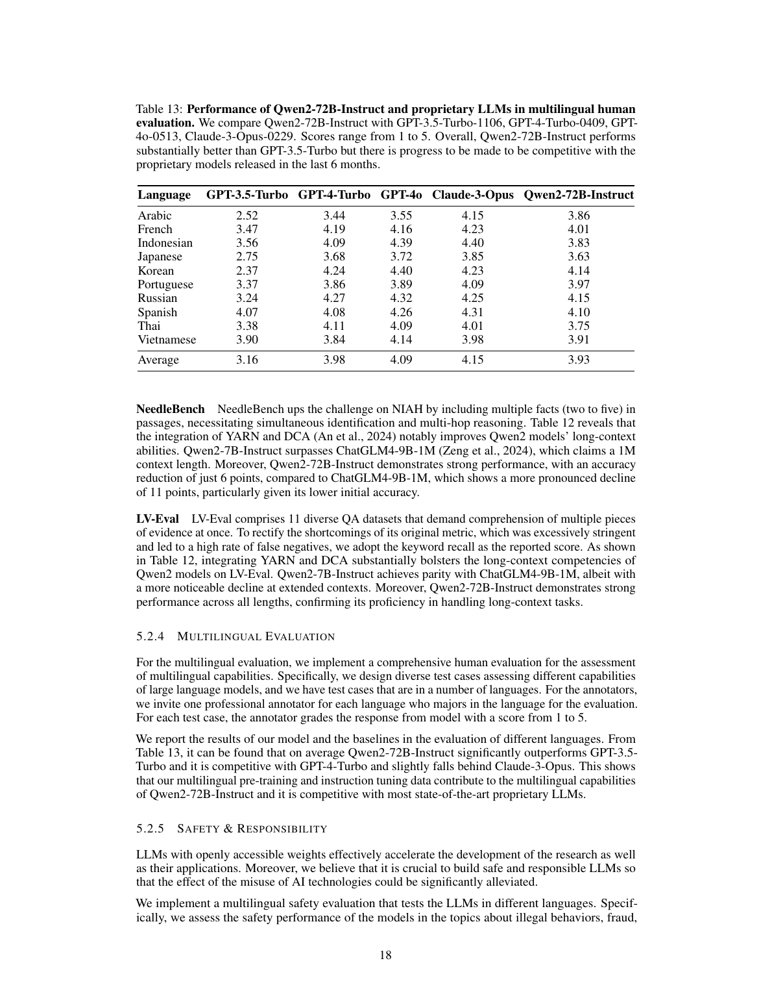

表 14 给出了模型产生有害回答的比例，数值越低越好。Qwen2-72B-Instruct 在四类风险上的比例分别为 0.00、2.41、22.91 和 2.47，整体优于闭源 GPT-4，并显著优于开放权重 Mixtral-8x22B-Instruct。不过，模型距离更安全、更负责任仍有很大改进空间，尤其是色情内容；即使对人类而言，这也是传统上较难准确区分的类别。

#### 5.2.6 污染分析

对于大型语言模型，应如何界定污染以及如何开展污染分析，仍是一个活跃研究方向。下面先说明我们如何针对评测数据集清除训练语料中的污染，再估计残余污染对基准分数的影响。

构建预训练和后训练数据集时，我们使用 n 元语法匹配排除可能受污染的数据。不过，这种方法可能产生很高的假阴性率，因为数学和代码数据中常出现固定表达。因此，我们又加入基于最长公共子序列（LCS）的约束：先从测试序列和训练序列中移除全部符号与标点并进行分词。对训练序列 $s_t$，如果存在测试序列 $s_e$，使 $|\operatorname{LCS}(s_t,s_e)|\geq13$，并且 $|\operatorname{LCS}(s_t,s_e)|\geq0.6\min(|s_t|,|s_e|)$，便将该训练序列删除。

为评估数据泄漏对测试性能的潜在影响，我们遵循 GPT-4 技术报告的方法，构造严格的无污染测试集，检查彻底去污后性能是否明显下降。具体做法是：排除所有与预训练或后训练数据存在连续 13 个词元重合的样本，不再附加 LCS 约束，然后在剩余测试集上计算相应指标。

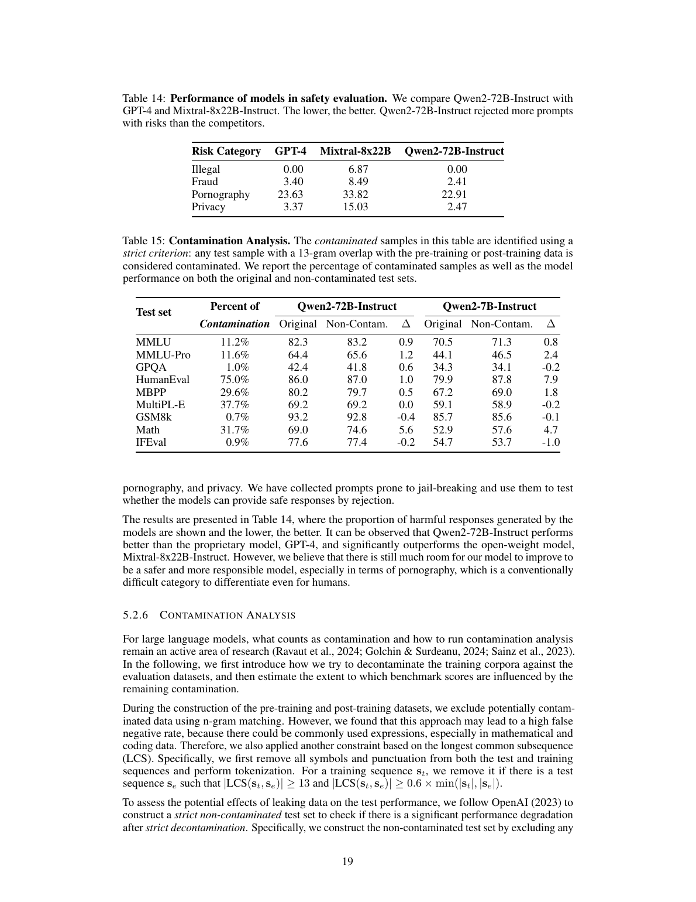

表 15 给出了结果。虽然严格标准下部分数据集的污染比例很高，但我们发现其中大多数被判定为污染的样本其实是假阳性，主要来自数学和代码数据。某些代码片段与数学公式可能极其常见，并不能为求解测试题提供任何有意义的优势。进一步分析表明，Qwen2 在原始测试数据与无污染测试数据上的性能保持一致，说明潜在的数据污染问题没有显著影响模型表现。

## 6 结论

本技术报告介绍了 Qwen2 系列：一套多用途基础模型与指令调优语言模型，参数规模从 5 亿至 720 亿，包含稠密架构和混合专家架构。Qwen2 超过了以其前代 Qwen1.5 为代表的既有开放权重模型，并在语言理解、生成、多语言能力、代码、数学和推理等广泛基准上展现出相对于闭源模型的竞争力。

本次更新特别加强了长上下文、多语言、代码、数学以及安全与责任方面的能力。为了促进社区创新并降低使用门槛，我们开放了 Qwen2 模型权重，使研究者和开发者能够在多种应用与研究项目中充分利用 Qwen2。通过这些工作，我们希望推动人工智能技术进步，并扩大它对社会的积极影响。

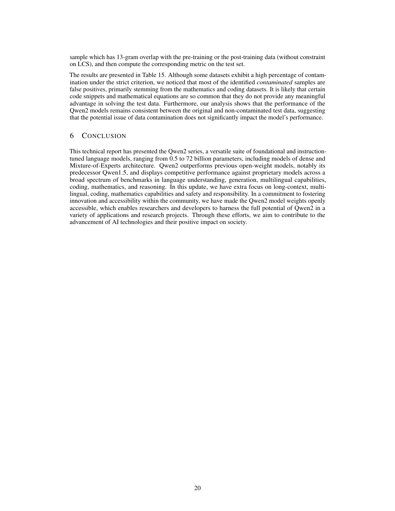

## 参考文献

以下六页为论文完整参考文献，保留作者、题名、出版信息与链接的原始排印，以避免专名和引文信息在转写中失真。

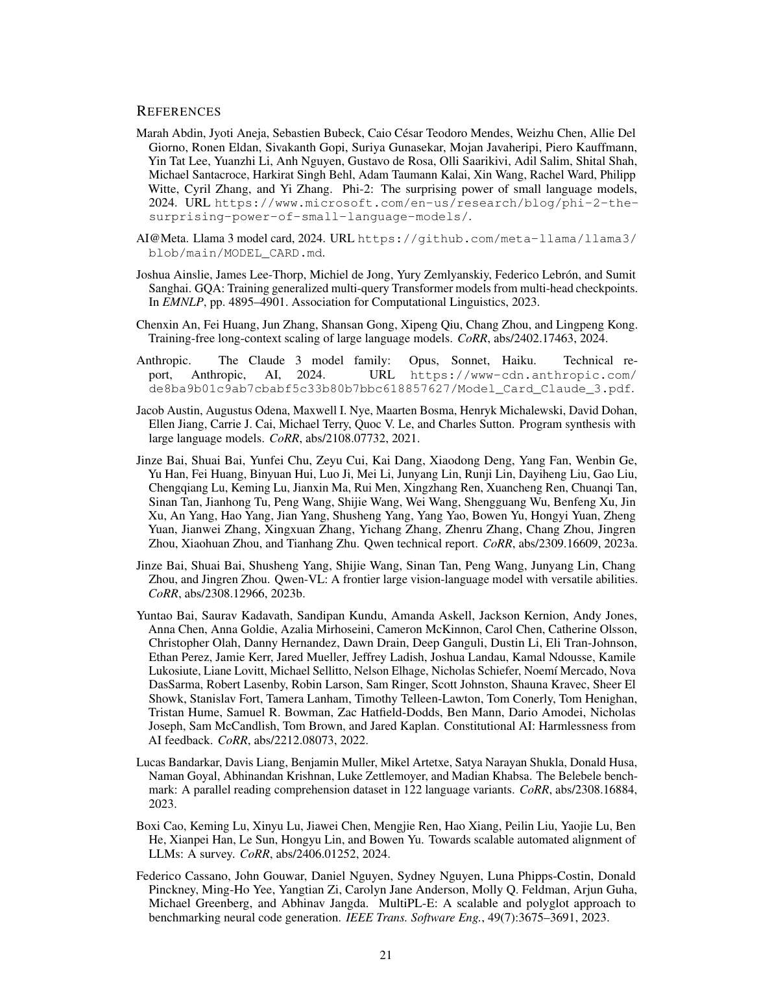

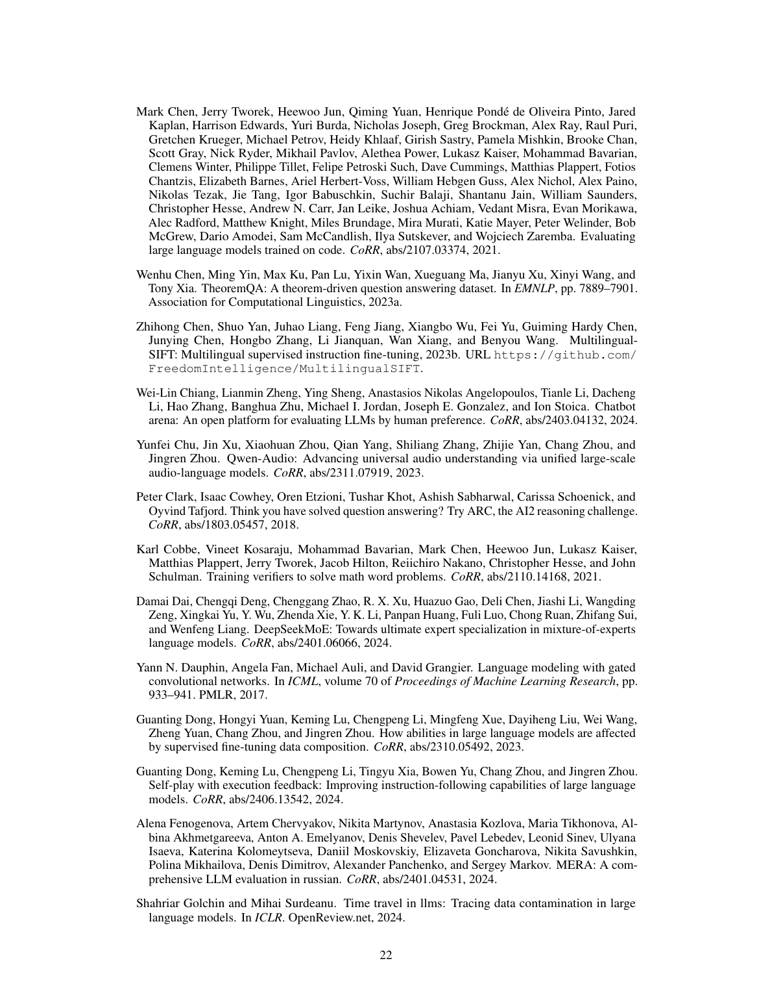

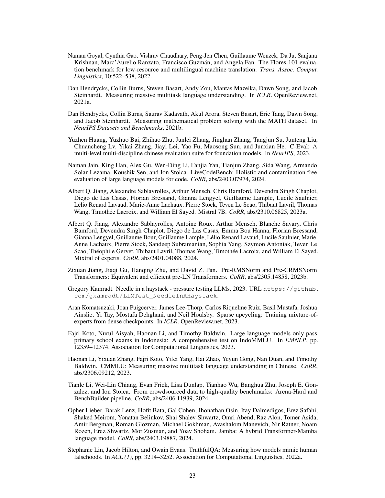

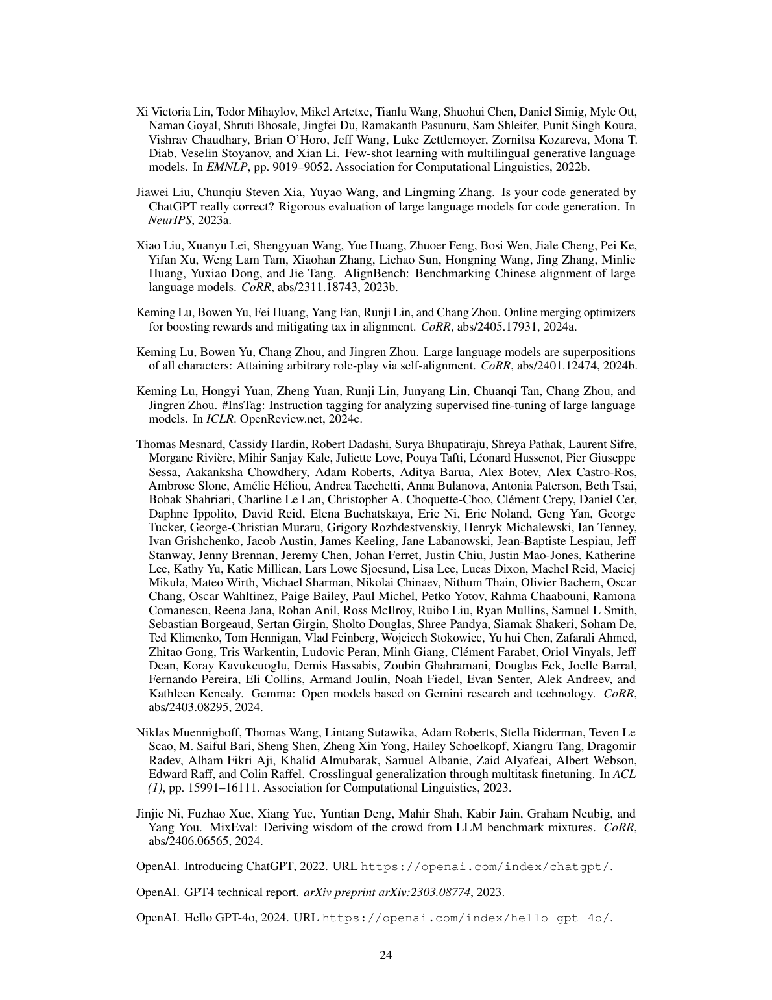

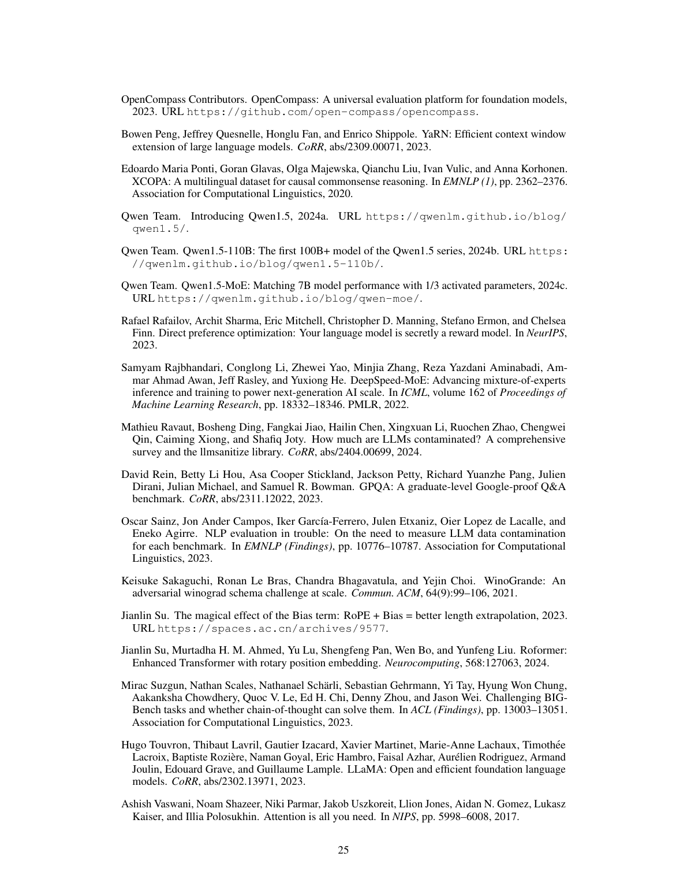

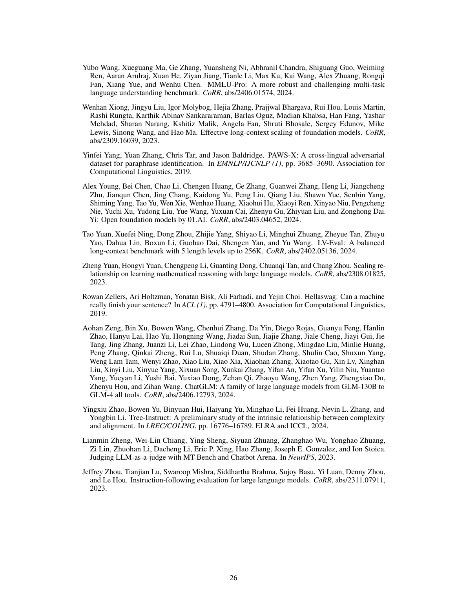
