# Qwen2.5 技术报告

**作者：** Qwen 团队

**模型与代码：** [Hugging Face](https://huggingface.co/Qwen) · [ModelScope](https://modelscope.cn/organization/qwen) · [GitHub](https://github.com/QwenLM/Qwen2.5)

## 摘要

本报告提出 Qwen2.5，一个面向多样需求的完整大语言模型系列。相较上一代，Qwen2.5 在预训练和后训练阶段均显著改进。预训练方面，高质量数据从 7 万亿词元扩展到 18 万亿，为常识、专业知识与推理能力奠定坚实基础。后训练方面，使用超过 100 万条样本进行精细监督微调，并采用多阶段强化学习，包括离线 DPO 与在线 GRPO。后训练显著改善人类偏好对齐，尤其提高长文本生成、结构化数据分析和指令遵循。

为适应多样用例，Qwen2.5 提供丰富配置。开放权重包含 0.5B、1.5B、3B、7B、14B、32B、72B 的基础模型和指令模型，也提供指令模型量化版；Hugging Face、ModelScope 和 Kaggle 上共有超过 100 个模型。托管方案目前包含两个专有混合专家变体 Qwen2.5-Turbo 与 Qwen2.5-Plus，均可通过阿里云百炼使用。

Qwen2.5 在语言理解、推理、数学、代码和人类偏好对齐等广泛基准上达到顶尖水平。开放旗舰 Qwen2.5-72B-Instruct 超过多种开放和专有模型，并能与参数约大五倍的 Llama-3-405B-Instruct 竞争。Qwen2.5-Turbo 与 Plus 成本效益更高，分别可与 GPT-4o-mini、GPT-4o 竞争。Qwen2.5 还作为基础，支持训练 Qwen2.5-Math、Qwen2.5-Coder、QwQ 和多模态模型。

图 1 展示 Qwen 系列迭代中数据扩展的重要作用。使用 18 万亿词元预训练的 Qwen2.5 在系列内能力最强，领域专长尤其突出，说明规模与数据混合共同增强模型能力。

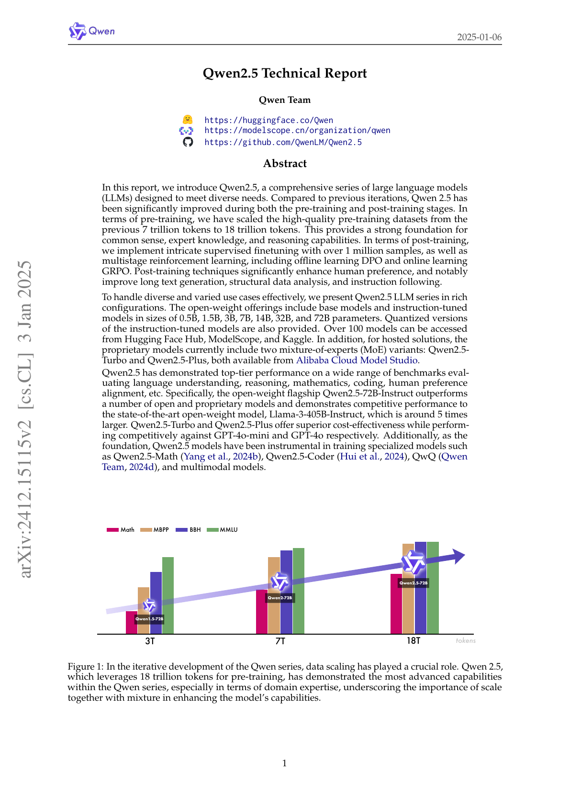

## 1 引言

随着大型基础模型，尤其大语言模型迅速发展，通用人工智能的火花日益清晰。模型和数据规模持续扩大，再结合大规模预训练、高质量监督微调与人类反馈强化学习，使 LLM 涌现语言理解、生成与推理能力。近期推理时扩展的突破，尤其 o1 所展示的逐步推理与反思，又增强模型深度思考能力。随着更一般人工智能能力不断涌现，语言模型也可能在科学探索中取得重大突破。

除能力快速增长外，过去两年 LLM 社区还涌现大量开放权重大模型，包括 Llama、Mistral 与 Qwen 系列。开放权重让普通用户和开发者更容易使用大模型，使更多人参与研究，通过社区协作促进创新，并加速不同领域人工智能应用开发。

我们发布 Qwen 系列最新版本 Qwen2.5 的详细信息。开放权重部分包含 0.5B、1.5B、3B、7B、14B、32B、72B 七种规模的预训练与指令调优模型，不仅提供 bfloat16 原始模型，也提供不同精度量化模型。旗舰 Qwen2.5-72B-Instruct 能与参数约大五倍的 Llama-3-405B-Instruct 竞争。专有混合专家模型 Qwen2.5-Turbo 与 Plus 则分别对标 GPT-4o-mini 与 GPT-4o。

Qwen2.5 的主要特点如下：

- **规模更好。** 除 Qwen2 已有 0.5B、1.5B、7B、72B 外，重新提供 3B、14B、32B，更适合资源受限场景，并填补当前开放基础模型中这些规模不足的问题。Turbo 与 Plus 在准确率、延迟和成本间提供良好平衡。
- **数据更好。** 预训练与后训练数据显著改善。预训练从 7 万亿增至 18 万亿词元，重点加强知识、代码和数学，并分阶段调整数据混合。后训练数据超过 100 万条，贯穿 SFT、DPO 和 GRPO。
- **使用更好。** 解决 Qwen2 的多项限制，包括把生成长度从 2000 提高到 8000 词元，更好支持表格、JSON 等结构化输入输出，并更易调用工具。Qwen2.5-Turbo 上下文最长达到 100 万词元。

## 2 架构与词元化器

Qwen2.5 系列包含用于开放发布的稠密模型 0.5B、1.5B、3B、7B、14B、32B、72B，以及用于 API 服务的混合专家模型 Turbo 与 Plus。

稠密模型延续 Qwen2 的 Transformer 仅解码器架构，集成分组查询注意力以高效使用键值缓存、SwiGLU 非线性激活、旋转位置嵌入、注意力中的 QKV 偏置，以及采用预归一化的 RMSNorm 以稳定训练。

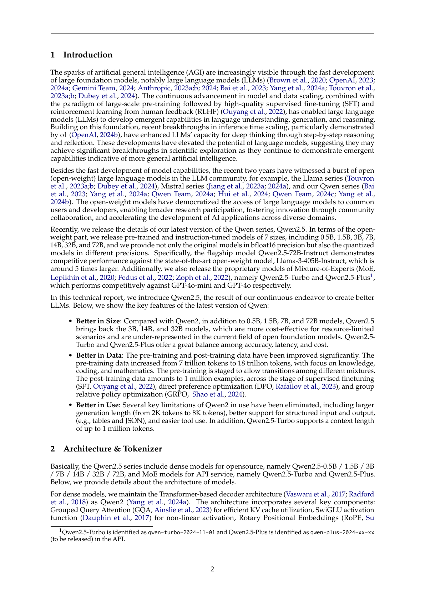

在稠密架构基础上扩展混合专家：把标准前馈网络替换为专用 MoE 层，每层含多个前馈专家与路由机制，把词元分派给前 $K$ 个专家。沿用 Qwen1.5-MoE，采用细粒度专家分割和共享专家路由，显著改善下游任务性能。

词元化使用 Qwen 的字节级字节对编码，常规词表含 151643 个词元。与早期 Qwen 相比，控制词元从 3 个增至 22 个，其中两个用于工具功能，其余预留给其他能力。全部 Qwen2.5 共用统一词表，提高一致性并减少兼容问题。

表 1 给出开放模型架构与许可证。0.5B、1.5B、3B 上下文为 32K、生成长度 8K；7B 以上支持 128K 上下文、8K 生成。多数模型采用 Apache 2.0，3B 与 72B 使用相应 Qwen 许可证。

## 3 预训练

预训练包含几个关键部分：通过复杂过滤、评分和数据混合整理高质量数据；广泛研究超参数优化，以有效训练不同规模模型；最后加入专门长上下文预训练，提高处理长序列的能力。

### 3.1 预训练数据

Qwen2.5 相较 Qwen2 显著提高数据质量，主要来自四方面。

1. **更好的数据过滤。** 高质量数据决定模型表现。我们用 Qwen2-Instruct 作为质量过滤器，对样本执行全面、多维分析并评分。相较 Qwen2 的过滤方式，新方法受益于 Qwen2 在更大多语言语料上的预训练，能更细致评估质量，在多种语言中既更好保留高质量数据，也更有效删除低质量样本。
2. **更好的数学与代码数据。** 预训练加入 Qwen2.5-Math 与 Qwen2.5-Coder 数据。这些高质量领域数据对数学和代码最先进表现至关重要，使 Qwen2.5 继承强数学推理与代码生成能力。
3. **更好的合成数据。** 使用 Qwen2-72B-Instruct 与 Qwen2-Math-72B-Instruct，在数学、代码和知识领域生成高质量合成数据，再由专有通用奖励模型和 Qwen2-Math-RM-72B 严格过滤。

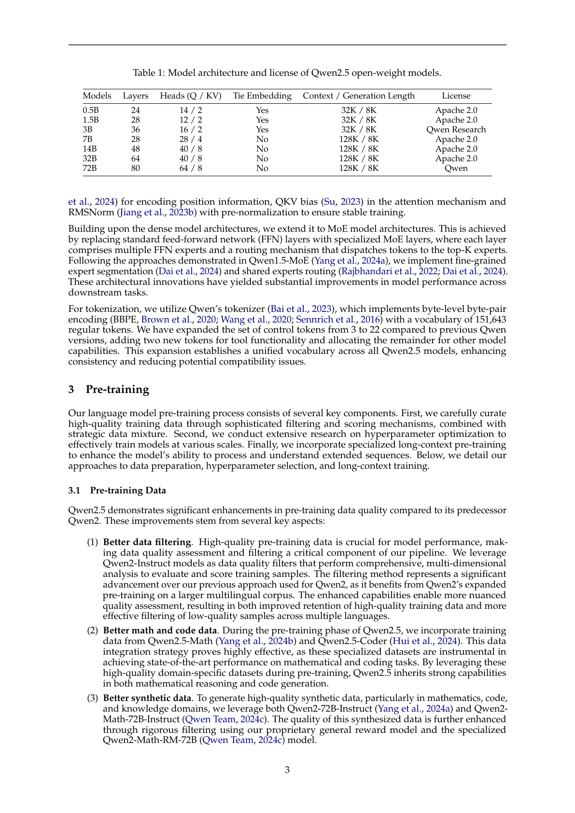

4. **更好的数据混合。** 使用 Qwen2-Instruct 对不同领域内容分类并平衡。分析发现，网页规模数据中电商、社交媒体和娱乐明显过多，且常含重复、模板化或机器生成内容；技术、科学、学术研究等领域信息质量更高却往往不足。通过下采样过度代表领域、上采样高价值领域，构建更均衡、信息更丰富的数据分布。

利用这些技术，预训练数据由 Qwen2 的 7 万亿扩展到 18 万亿词元，且质量更高。

### 3.2 超参数缩放定律

我们基于 Qwen2.5 预训练数据建立超参数缩放定律。以往研究主要用缩放定律在给定计算预算下确定最优模型规模；本文则用它跨不同架构寻找最优超参数，尤其为不同规模稠密与 MoE 模型确定批大小 $B$ 和学习率 $\mu$。

通过大量实验，系统研究模型架构与最优训练超参数的关系，分析最优学习率 $\mu_{\mathrm{opt}}$、最优批大小 $B_{\mathrm{opt}}$ 如何随模型规模 $N$ 和预训练数据量 $D$ 变化。实验覆盖 4400 万至 140 亿参数的稠密模型、激活参数 4400 万至 10 亿的 MoE 模型，以及 8 亿至 6000 亿词元的数据集。随后使用预测出的最优超参数，把最终损失建模为模型架构和训练数据规模的函数。

此外，通过缩放定律预测并比较不同参数规模 MoE 与稠密模型的性能，指导 MoE 超参数配置。仔细调整激活参数和总参数后，使 MoE 模型达到 Qwen2.5-72B、14B 等特定稠密变体的性能水平。

### 3.3 长上下文预训练

为提高训练效率，Qwen2.5 采用两阶段预训练：先以 4096 词元上下文训练，再扩展长序列。除 Turbo 外，全部变体在最终阶段从 4096 扩到 32768，并用 ABF 把 RoPE 基频从 10000 提高到 1000000。

Turbo 使用渐进上下文扩展，依次训练 32768、65536、131072、262144 词元，RoPE 基频设为 10000000。每阶段数据中 40% 序列达到当前最大长度，60% 为较短序列。这让模型平滑适应增长的上下文，同时维持处理不同长度序列的能力。

推理时采用 YARN 与双块注意力，把序列容量提高四倍，使 Turbo 最多处理 100 万词元，其他模型最多 131072。两种技术降低长序列困惑度，也保持短序列表现。

## 4 后训练

Qwen2.5 相较 Qwen2 有两项重要后训练升级：扩大 SFT 数据覆盖，以及两阶段强化学习。

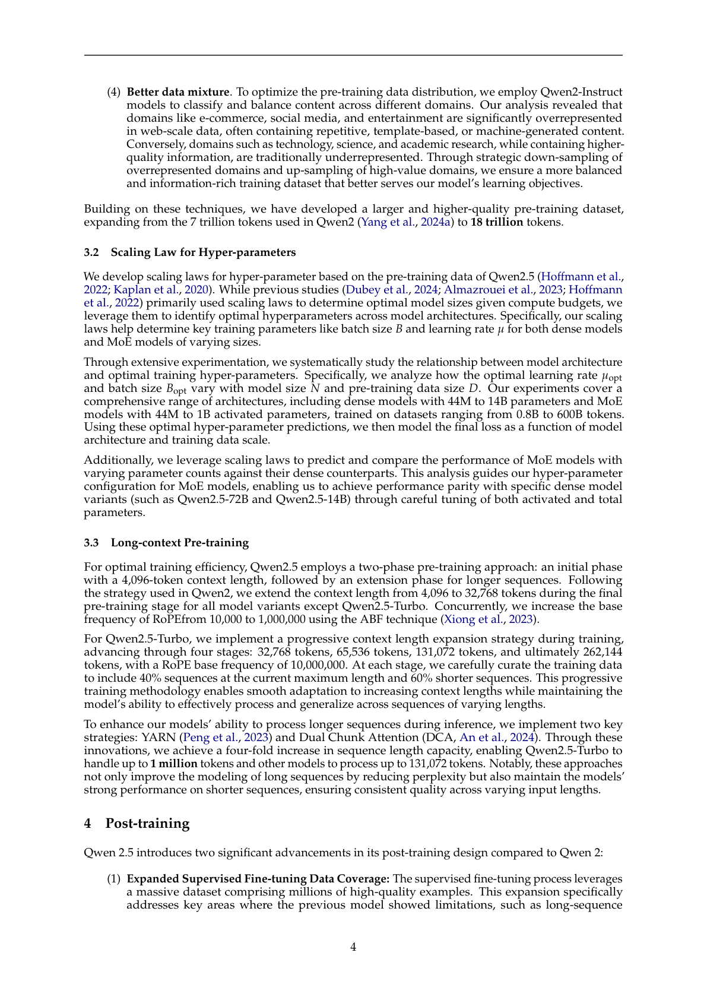

1. **扩大监督微调覆盖。** 数百万高质量示例专门弥补上一代在长序列生成、数学解题、代码、指令遵循、结构化数据理解、逻辑推理、跨语言迁移和稳健系统指令上的不足。
2. **两阶段强化学习。** 分为离线与在线：
   - **离线强化学习。** 聚焦奖励模型难以评估的推理、事实性和指令遵循。通过严谨构建与验证，确保信号可学习、可靠，使模型有效掌握复杂技能。
   - **在线强化学习。** 利用奖励模型识别真实性、有帮助程度、简洁性、相关性、无害性和去偏等细微质量，使回答精确、连贯、结构良好，同时保持安全与可读，符合人类质量标准。

### 4.1 监督微调

SFT 阶段的关键改进包括：

1. **长序列生成。** 输出最长 8192 词元，远超常见后训练不足 2000 词元的回答。我们构建长回答数据集，对预训练语料中的长文本使用回译生成查询，施加输出长度约束，并由 Qwen2 过滤低质量配对。
2. **数学。** 加入 Qwen2.5-Math 思维链数据，来源包括公共数据、K-12 题集和合成问题。结合拒绝采样、奖励建模和标注答案，产生高质量逐步推理。
3. **代码。** 加入 Qwen2.5-Coder 指令数据。多个语言专用智能体协作，在近 40 种编程语言上生成多样、高质量指令对。再从代码问答网站合成新样本，并从 GitHub 收集算法代码片段。多语言沙箱执行静态检查和自动单元测试，确保质量与正确性。
4. **指令遵循。** 建立严格的代码验证框架。LLM 同时生成指令、验证代码和完整单元测试进行交叉验证，再根据执行反馈拒绝采样，保证 SFT 数据忠实遵循目标指令。
5. **结构化数据理解。** 构建完整数据集，覆盖表格问答、事实验证、纠错、结构理解等传统任务，以及结构化、半结构化复杂任务。回答中加入推理链，显著提高从结构数据推断信息的能力。
6. **逻辑推理。** 新增 7 万条覆盖不同领域的查询，包括选择、判断和开放题。训练模型系统地使用演绎、归纳概括、类比、因果和统计推理。迭代过滤错误答案与错误推理，逐步增强准确、稳健逻辑推理。

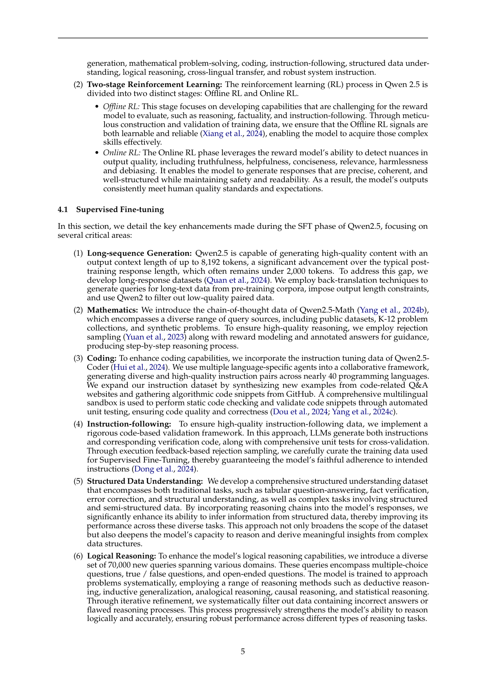

7. **跨语言迁移。** 用翻译模型把高资源语言指令转换为多种低资源语言并生成回答候选，再评估多语言回答与原回答的语义对齐，保留原回答逻辑结构与风格细节，维持跨语言完整性和连贯性。
8. **稳健系统指令。** 构建数百条通用系统提示，提高后训练系统提示多样性，并确保它们与对话一致。不同系统提示评测中，模型表现良好且方差降低，说明稳健性提高。
9. **回答过滤。** 使用专用评论家模型和多智能体协作评分等多种自动标注。回答经严格评估，只有被全部评分系统判定无缺陷的结果才保留。

最终构建超过 100 万条 SFT 示例。模型以 32768 词元序列长度微调两个轮次，学习率从 $7\times10^{-6}$ 逐步降到 $7\times10^{-7}$；权重衰减 0.1，梯度范数最大裁剪为 1.0。

### 4.2 离线强化学习

相较在线强化学习，离线强化学习可以预先准备训练信号，特别适合存在标准答案、却难以由奖励模型准确评价的任务。本文聚焦数学、代码、指令遵循和逻辑推理等客观查询领域。

上一阶段已经广泛使用执行反馈和答案匹配保证回答质量；本阶段复用该流水线，让 SFT 模型为新查询重新采样。通过质量检查的回答作为正例，失败者作为负例，用于 DPO。人类与自动审查共同提高信号可靠性和准确性，使数据既可学习又符合人类预期。最终数据约 15 万对，模型使用在线合并优化器训练一个轮次，学习率为 $7\times10^{-7}$。

### 4.3 在线强化学习

为构建稳健奖励模型，我们制定明确标注准则，使回答既高质量又符合伦理和用户需求：

- **真实性。** 回答基于事实，忠实反映上下文与指令，不生成虚假或无数据支持的信息。
- **有帮助。** 有效解决用户问题，内容积极、有吸引力、有教育意义且相关，精确遵循指令并提供价值。
- **简洁。** 直接、凝练，避免不必要冗长，以清楚高效传达信息。
- **相关。** 回答所有部分都直接关联查询、对话历史和助手上下文，并与用户需求完全对齐。
- **无害。** 优先保证用户安全，避免可能导致违法、不道德或有害行为的内容，始终倡导负责任交流。

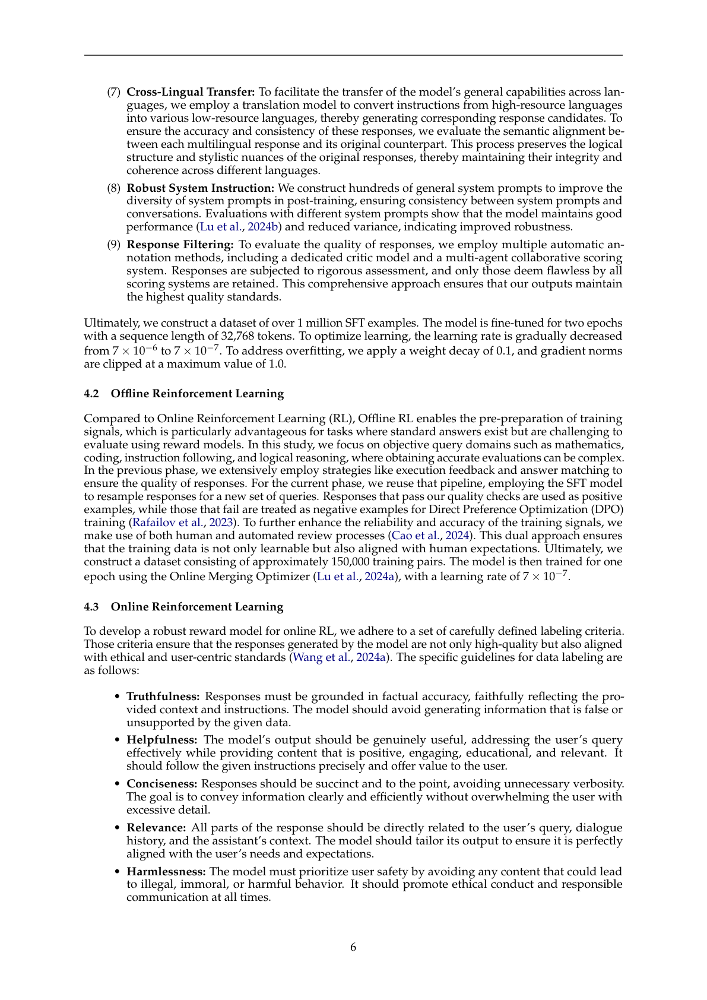

- **去偏。** 回答不应包含性别、种族、国籍、政治等偏见，对所有主题公平处理，遵循广泛接受的道德与伦理标准。

奖励模型查询来自公共开源数据和复杂度更高的专有查询集。回答由不同训练阶段、分别经过 SFT、DPO、RL 的 Qwen 检查点生成，并以不同温度采样增加多样性。偏好对由人工与自动标注共同建立，同时合入 DPO 数据。

在线强化学习使用 GRPO。训练奖励模型与 RL 使用相同查询集，查询处理顺序由奖励模型给出的回答分数方差决定，高方差查询优先，以提高学习效果。每个查询采样 8 个回答。全部模型全局批大小为 2048，每轮 2048 个样本，每个查询—回答对视为一个样本。

### 4.4 长上下文微调

为进一步扩展 Turbo 上下文，后训练加入更长 SFT 示例，使模型在长查询上更符合人类偏好。

SFT 分两阶段。第一阶段只用不超过 32768 词元的短指令微调，数据和步数与其他 Qwen2.5 相同，保证短任务性能；第二阶段混合最多 32768 的短指令与最多 262144 的长指令，提高长上下文指令遵循，同时保持短任务性能。

强化学习只使用短指令，原因是长上下文 RL 计算昂贵，而且缺少适合长任务的奖励模型。实验发现，仅在短指令上执行 RL，仍能显著提高长上下文任务的人类偏好对齐。

## 5 评测

预训练得到的基础模型与后训练得到的指令模型分别使用完整评测套件测试，既含常用开放基准，也含面向技能的内部数据集，并以自动评测为主、尽量减少人工参与。

为防止测试泄漏，构建训练集时用 n 元语法匹配删除可能污染数据。沿用 Qwen2 标准：若训练序列与某测试序列词元化后的最长公共子序列长度至少为 13，且至少占两者较短者的 60%，就删除该训练序列。

### 5.1 基础模型

基础模型评测重点覆盖自然语言理解、通用问答、代码、数学、科学知识、推理和多语言能力。通用任务包括 MMLU、MMLU-Pro、MMLU-redux、BBH、ARC-C、TruthfulQA、Winogrande 与 HellaSwag。

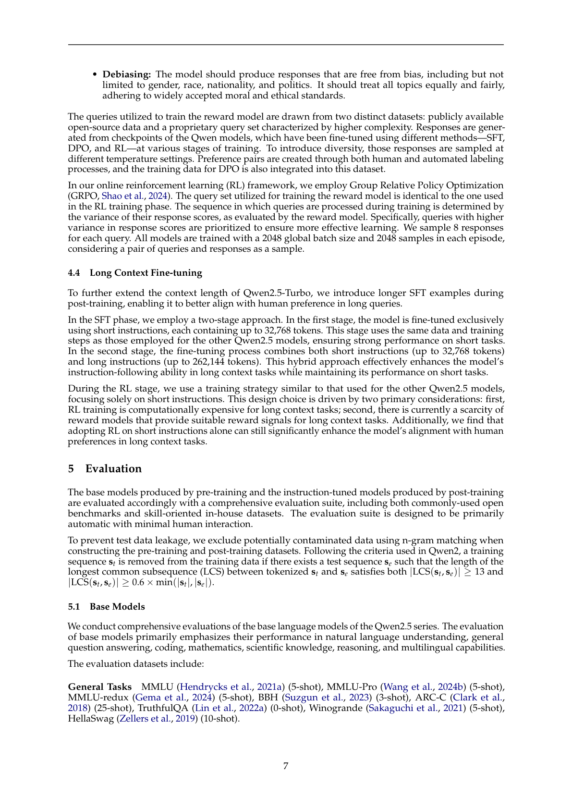

数学与科学包括 GPQA、TheoremQA、GSM8K、MATH；代码包括 HumanEval、HumanEval+、MBPP、MBPP+ 与 MultiPL-E；多语言分考试、理解、数学、翻译四类，覆盖 M3Exam、IndoMMLU、ruMMLU、翻译版 MMLU、BELEBELE、XCOPA、XWinograd、XStoryCloze、PAWS-X、MGSM 与 Flores-101。

**Qwen2.5-72B 与 Qwen2.5-Plus。** 表 2 与 Llama-3-70B、Llama-3-405B、Mixtral-8x22B、Qwen2-72B 比较。Qwen2.5-72B 在同类基础模型中跨广泛任务显著领先，以五分之一参数达到接近 Llama-3-405B 的结果；相较 Qwen2-72B，在几乎全部基准上明显进步，通用、数学和代码尤为突出。

Qwen2.5-Plus 的训练与推理成本显著更低，却能与 Qwen2.5-72B 和 Llama-3-405B 高度竞争，并在 HellaSwag、TheoremQA、MATH、GSM8K、MultiPL-E、多语言数学与翻译上超过其他基线。它在 MMLU-Pro 达到 64.0，比 Qwen2.5-72B 高 5.9 分。

**Qwen2.5-14B/32B 与 Qwen2.5-Turbo。** 这些模型将与相近规模基线继续比较，结果见后续表格。

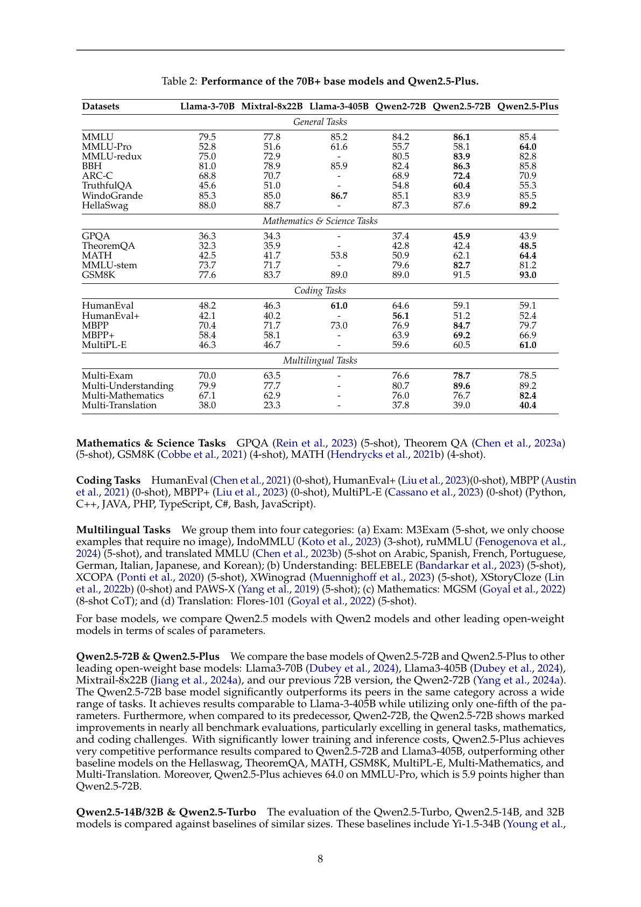

**Qwen2.5-14B/32B 与 Qwen2.5-Turbo。** 我们将 Qwen2.5-Turbo、Qwen2.5-14B 和 Qwen2.5-32B 与参数规模相近的基线比较，包括 Yi-1.5-34B、Gemma2-27B 和 Qwen1.5-32B。表 3 显示，Qwen2.5-14B 在各类任务上表现稳健，尤其在 MMLU 与 BBH 等通用任务中分别达到 79.7 和 78.2，超过参数更多的竞争模型。Qwen2.5-32B 的能力尤为突出，往往超过规模相近乃至更大的模型；相较前代 Qwen1.5-32B，它在数学和代码等困难领域显著提升，MATH 达到 57.7，MBPP 达到 84.5。Qwen2.5-Turbo 的训练与推理成本都远低于 Qwen2.5-14B，却取得相当的结果，其中 MMLU-Pro 分数甚至高于 Qwen2.5-32B。

**表 3：14B 至 30B+ 基础模型以及 Qwen2.5-Turbo 的表现。**

**表 4：7B+ 基础模型的表现。**

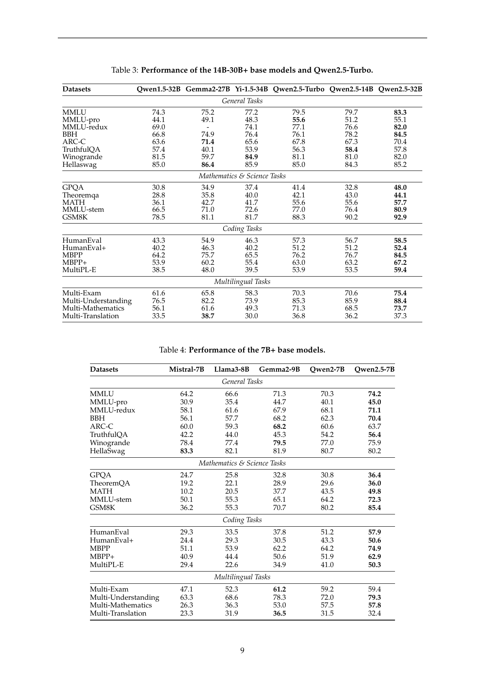

**Qwen2.5-7B。** 对于 7B 级模型，我们重点将 Qwen2.5-7B 与其他领先的 7B+ 模型比较，包括 Mistral-7B、Llama3-8B、Gemma2-9B，以及前代 Qwen2-7B，结果见表 4。需要注意，Qwen2-7B 与 Qwen2.5-7B 的非嵌入参数都只有 6.5B，而 Gemma2-9B 为 8.2B。尽管非嵌入参数更少，Qwen2.5-7B 仍在众多基准上超过前代与同类模型，并在各类任务中显著提升：MMLU 等通用基准达到 74.2，MATH 数学挑战达到 49.8，HumanEval 代码任务达到 57.9。

**Qwen2.5-0.5B/1.5B/3B。** 对于端侧模型，我们将 Qwen2.5-0.5B、1.5B 和 3B 与 Qwen2-0.5B/1.5B、Gemma2-2.6B 等成熟基线比较，结果见表 5。Qwen2.5 的三个小型变体在几乎全部基准上继续保持强劲表现。尤其值得注意的是，Qwen2.5-0.5B 在多项数学与代码任务上超过了 Gemma2-2.6B。

**表 5：小型基础模型的表现。**

### 5.2 指令微调模型

为严格评估指令微调模型，我们采用多维方法。基础技能与人类偏好通过开放数据集和基准评估；更细致的内部评测则深入考察模型在关键领域和多语言方面的能力。评测还特别关注长上下文能力。以下各节说明评测方法并给出结果。

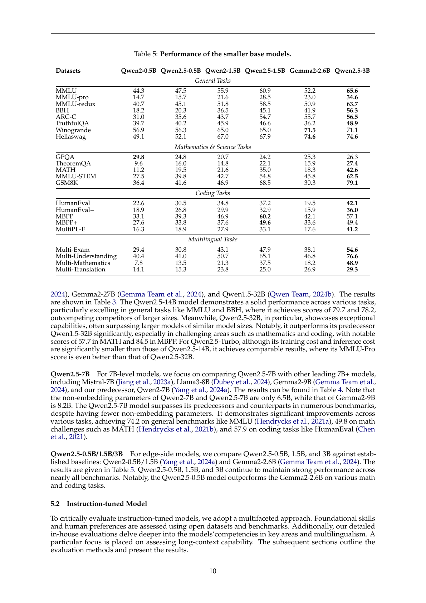

**表 6：70B+ 指令模型以及 Qwen2.5-Plus 的表现。**

**表 7：14B 至 30B+ 指令微调模型以及 Qwen2.5-Turbo 的表现。**

#### 5.2.1 开放基准评测

为了全面评估指令微调模型的质量，我们结合自动评测与人工评测，同时衡量模型能力和人类偏好。基础能力评测采用与预训练模型评测相近的数据集，覆盖自然语言理解、代码、数学和推理。具体而言，通用能力使用 MMLU-Pro、MMLU-redux 和 LiveBench 0831；科学与数学使用 GPQA、GSM8K 和 MATH；代码能力使用 HumanEval、MBPP、MultiPL-E 和 LiveCodeBench 2305-2409；指令遵循使用 IFEval。除此之外，我们还用 MT-Bench 与 Arena-Hard 评估人类偏好对齐和指令遵循表现。为简洁起见，IFEval 只报告严格提示子集的结果。

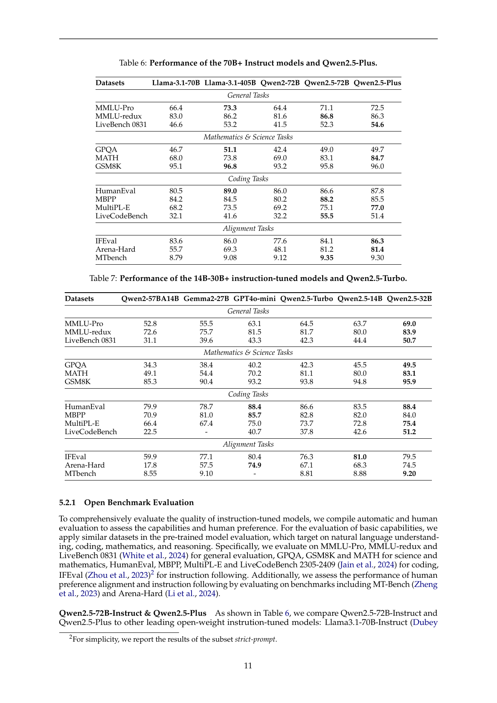

**表 8：7B+ 指令微调模型的表现。**

**表 9：2B 至 4B 指令微调模型的表现比较。**

**Qwen2.5-72B-Instruct 与 Qwen2.5-Plus。** 如表 6 所示，我们将 Qwen2.5-72B-Instruct 和 Qwen2.5-Plus 与其他领先开放权重指令微调模型比较，包括 Llama3.1-70B-Instruct、Llama3.1-405B-Instruct，以及前代 Qwen2-72B-Instruct。Qwen2.5-72B-Instruct 表现卓越，甚至在 MMLU-redux、MATH、MBPP、MultiPL-E、LiveCodeBench、Arena-Hard 和 MTBench 等多项关键基准上超过规模更大的 Llama-3.1-405B-Instruct。Qwen2.5-Plus 则在 13 项基准中的 9 项上超过 Qwen2.5-72B-Instruct。

**Qwen2.5-14B/32B-Instruct 与 Qwen2.5-Turbo。** 我们评估 Qwen2.5-Turbo、Qwen2.5-14B-Instruct 和 Qwen2.5-32B-Instruct，并与规模相近的 GPT4o-mini、Gemma2-27B-IT 和 Qwen2-57BA14B-Instruct 比较，结果汇总于表 7。Qwen2.5-32B-Instruct 在多数任务上都优于同规模模型。开放权重的 Qwen2.5-14B-Instruct 在全部基准上也具有竞争力，可与 GPT-4o-mini 抗衡。Qwen2.5-Turbo 的训练与推理成本显著更低，却在十项基准中的八项上超过 Qwen2.5-14B-Instruct，展现出突出的效率和效果，尤其适合资源受限环境。

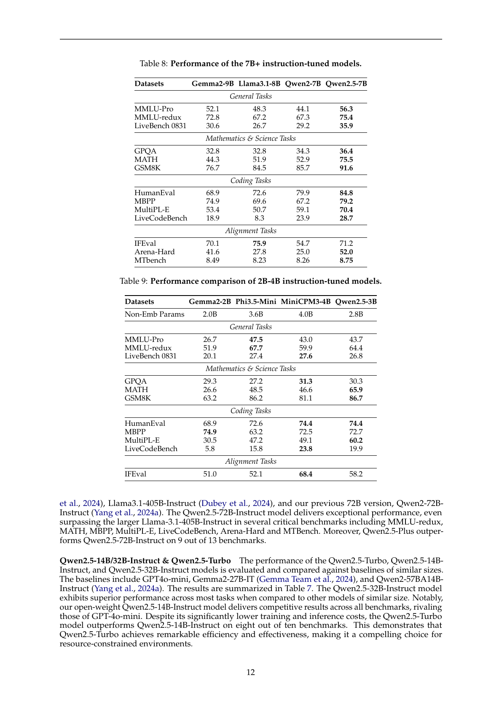

**表 10：0.5B 至 1.5B 指令微调模型的表现比较。**

**表 11：内部英语自动评测基准上的表现比较。**

**其他指令微调模型。** 如表 8 所示，除 IFEval 外，Qwen2.5-7B-Instruct 在所有任务上都显著超过 Gemma2-9B-IT 和 Llama3.1-8B-Instruct，尤其在数学与代码方面优势明显，MATH 达到 75.5，HumanEval 达到 84.8。对于端侧指令模型，Qwen2.5-3B-Instruct 的参数少于 Phi3.5-mini-instruct 和 MiniCPM3-4B-Instruct，却在数学与代码任务上超过二者，同时在语言理解上也取得有竞争力的结果。Qwen2.5-1.5B-Instruct 与 Qwen2.5-0.5B-Instruct 相较各自前代同样大幅提升，详见表 10。这些改进使它们特别适合资源高度受限的端侧应用。

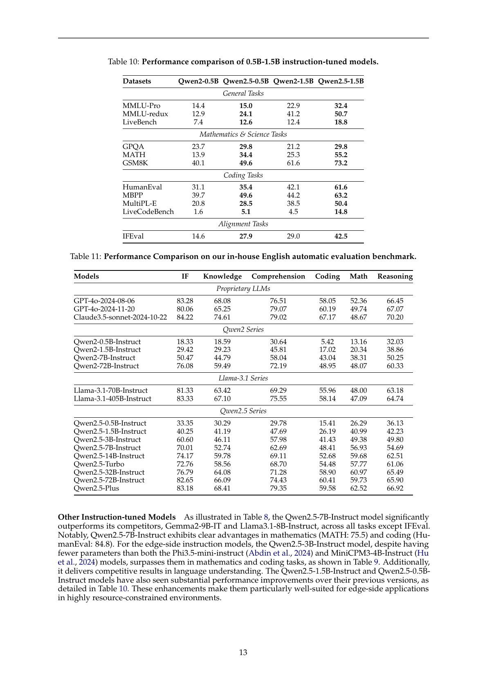

**表 12：内部中文自动评测基准上的表现比较。**

#### 5.2.2 内部自动评测

尽管已有若干开放基准数据集可用于评测，但我们认为它们不足以完整反映大型语言模型的能力。为此，我们开发了一系列内部数据集，从知识理解、文本生成、代码等多个方面评估模型。这些评测同时使用中文与英文，并专门测试指令微调模型的多语言表现。英语结果汇总于表 11，中文结果汇总于表 12；70B+ 指令模型的多语言结果见表 13，7B 至 14B 模型见表 14。

**英语与中文评测。** 我们在英语和中文上，将 Qwen2.5-Instruct 与 GPT-4、Claude3.5-sonnet、Qwen2、Llama-3.1 等领先语言模型比较。分析重点关注模型规模如何影响表现，以及最新 Qwen2.5 系列相较前代和竞争模型处于什么位置。对于小型模型，Qwen2.5-0.5B 已达到甚至超过 Qwen2-1.5B，说明 Qwen2.5 更有效地利用参数，使中小型模型能够达到上一代更大模型的水平。Qwen2.5-3B 的表现与 Qwen2-7B 相当；Qwen2.5-32B 则相较 Qwen2-72B 显著提升。旗舰 Qwen2.5-72B 进一步缩小了 Qwen 与 GPT-4、Claude3.5-sonnet 等最先进模型之间的差距。除指令遵循外，它在所有指标上都追平或超过 Llama-3.1-405B。这既表明 Qwen2.5-72B 在广泛语言处理任务中具有很强竞争力，也指出了未来仍需改进的方向。Qwen2.5-Plus 弥补了上一版本在中文指令遵循方面的不足，并进一步扩大其他领域的优势。

**多语言评测。** 为全面评估指令微调模型的多语言能力，我们遵循 P-MMEval，并扩展了若干基准：

1. **多语言 IFEval。** 将原本只有英语的 IFEval 扩展为多语言样例；为保证语言中立，删除包含特定语言内容的实例，例如“以字母 A 开头”。
2. **知识运用。** 为测试 Qwen2.5 系列在多种语言中的知识运用能力，采用五个类似 MMLU 的多项选择基准：阿拉伯语 AMMLU、日语 JMMLU、韩语 KMMLU、印度尼西亚语 IndoMMLU 和土耳其语 TurkishMMLU。另评测由英语 MMLU 翻译成多种语言的 okapi MMLU。

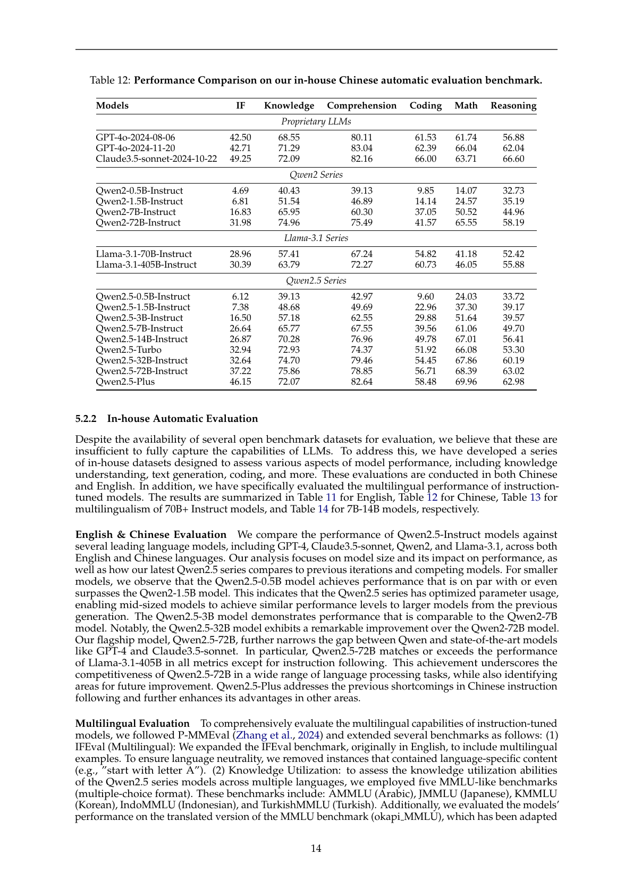

**表 13：70B+ 指令模型在多语言任务上的表现。**

**表 14：7B 至 14B 指令模型在多语言任务上的表现。**

3. **扩展版 MGSM8K。** 在原始 MGSM8K 上新增阿拉伯语、韩语、葡萄牙语和越南语支持。
4. **文化细微差异。** 使用 BLEnD 基准评估模型捕捉文化细节的能力；该基准专门测试大型语言模型对文化微妙差异的理解。

Qwen2.5 在指令遵循、多语言知识和数学推理方面具有竞争力，与同等规模模型表现相当。相较前代 Qwen2，它在捕捉文化细微差异方面已有明显进步，但这一领域仍有进一步完善的空间。

#### 5.2.3 奖励模型

奖励模型是引导强化学习过程的基石，因此我们单独评估 Qwen2.5 系列使用的奖励模型。评测基准包括 Reward Bench、RMB、PPE，以及内部收集的分布外中文人类偏好基准 Human-Preference-Chinese，以形成全面分析。比较基线包括 Nemotron-4-340B-Reward、Llama-3.1-Nemotron-70B-Reward 和 Athene-RM-70B，结果见表 15。

整体来看，Llama-3.1-Nemotron-70B-Reward 在 Reward Bench 上最出色，Athene-RM-70B 在 RMB 上最佳。Qwen2.5-RM-72B 在 PPE 和 Human-Preference-Chinese 上领先，在 RMB 上仅次于 Athene-RM-70B；它在 Reward Bench 上与 Nemotron-4-340B-Reward 相当，但略低于 Llama-3.1-Nemotron-70B-Reward。

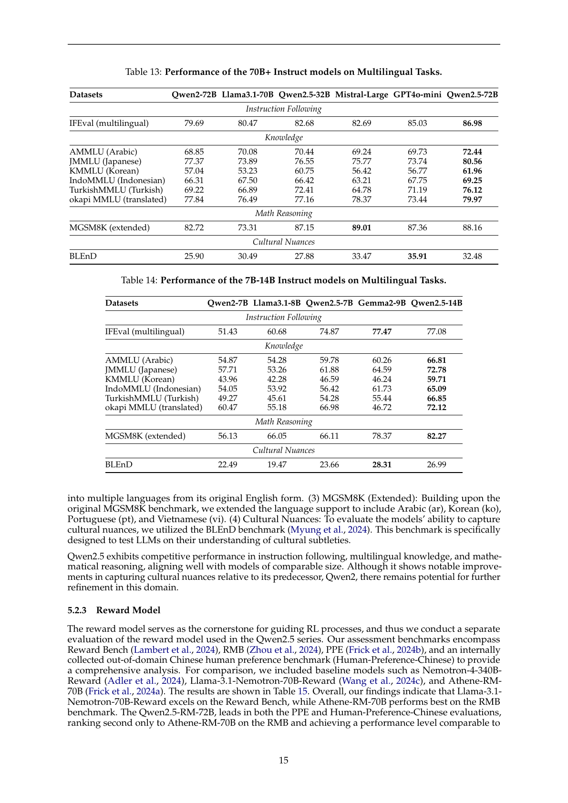

**表 15：多个奖励模型基准上的表现比较。**

由于奖励模型评测方法匮乏，当前通常只使用 Reward Bench。然而，多种奖励模型基准的结果表明，对单一基准过度优化可能触发古德哈特定律，导致其他基准表现下降，并可能损害下游对齐效果。因此，奖励模型需要跨多种基准进行综合评估，不能只依赖单一基准。

更重要的是，反复实验还揭示了一个关键局限：现有奖励模型评测基准不能准确预测由该奖励模型指导训练出的强化学习模型表现。换言之，奖励模型在基准上得分更高，并不必然意味着最终强化学习模型更强。这说明还需研究对奖励模型更具预测力的评测方法。

#### 5.2.4 长上下文能力

我们使用三个基准评估 Qwen2.5 模型的长上下文能力：RULER、LV-Eval 和 Longbench-Chat。在 LV-Eval 中，原始指标存在较高假阴性率，因此采用关键词召回率作为报告分数。

表 16 和表 17 显示，配备长度外推技术 DCA 与 YARN 后，Qwen2.5 模型在三个数据集上均展现出很强的长上下文处理能力。其中，Qwen2.5-72B-Instruct 在所有上下文长度下表现最强，显著超过现有开放权重长上下文模型，以及 GPT-4o-mini、GPT-4 等专有模型。

图 2 进一步显示，Qwen2.5-Turbo 在 100 万词元口令检索任务中达到 100% 准确率，体现出从超长上下文捕捉细节信息的卓越能力。我们基于 Minference 开发稀疏注意力机制，大幅提高推理速度；在处理长上下文时，这对用户体验至关重要。对于 100 万词元序列，该方法把注意力机制计算量降低到原来的十二分之一点五。图 3 展示 Qwen2.5-Turbo 在不同硬件配置下的首词元时间，我们的方法实现了 3.2 至 4.3 倍加速。

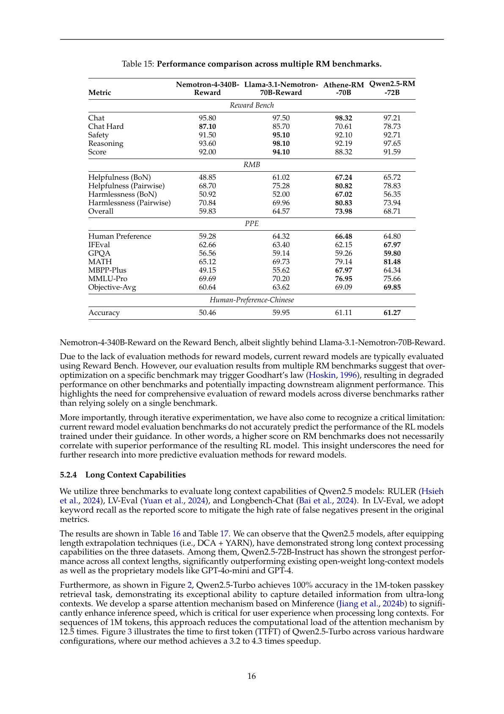

**表 16：Qwen2.5 模型在 RULER 上的表现。** YARN 与 DCA 不会改变模型在 32K 词元以内的行为。

**表 17：Qwen2.5 模型在 LV-Eval 与 LongBench-Chat 上的表现。** YARN 与 DCA 不会改变模型在 32K 词元以内的行为。

**图 2：Qwen2.5-Turbo 在长度为 100 万词元的口令检索任务上的表现。**

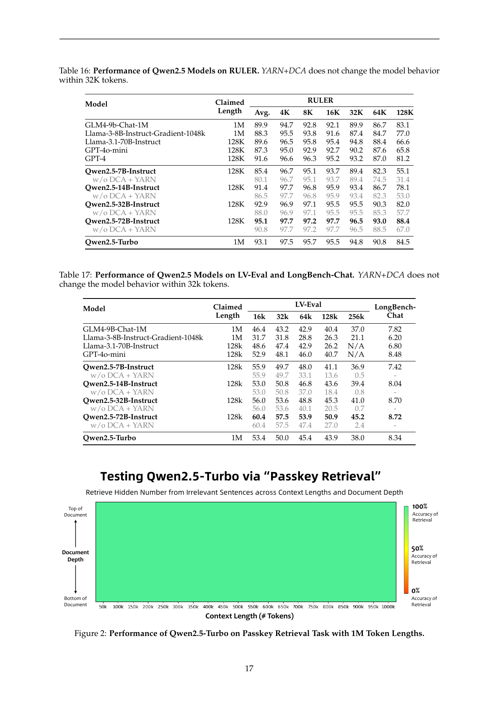

**图 3：Qwen2.5-Turbo 与 Qwen2.5-7B 使用全注意力和本文方法时的首词元时间。**

## 6 结论

Qwen2.5 是大型语言模型的一次重大进步：它在 18 万亿词元上强化预训练，并采用监督微调和多阶段强化学习等复杂后训练技术。这些改进增强了人类偏好对齐、长文本生成和结构化数据分析能力，使 Qwen2.5 能够高效完成指令遵循任务。Qwen2.5 提供多种配置，既有参数从 0.5B 到 72B 的开放权重模型，也有专有模型，其中包括 Qwen2.5-Turbo、Qwen2.5-Plus 等高性价比 MoE 变体。实证评测表明，Qwen2.5-72B-Instruct 的表现可与最先进的 Llama-3-405B-Instruct 相当，而参数规模只有后者的六分之一。Qwen2.5 还是多个专用模型的基础，展现出面向领域应用的通用性。我们相信，Qwen2.5 稳健的表现、灵活的架构和广泛可用性，使其成为学术研究与工业应用的重要资源，并将在未来创新中发挥关键作用。

未来，我们将着力推进稳健的基础模型。第一，通过纳入范围更广、更多样且质量更高的数据，迭代改进基础模型和指令微调大型语言模型。第二，继续开发多模态模型，目标是把不同模态整合到统一框架中，实现文本、视觉和听觉领域无缝的端到端信息处理。第三，通过有策略地扩展推理计算资源，增强模型的推理能力。这些工作旨在突破现有技术边界，并为更广泛的人工智能领域作出贡献。

## 7 作者

**核心贡献者：** An Yang、Baosong Yang、Beichen Zhang、Binyuan Hui、Bo Zheng、Bowen Yu、Chengyuan Li、Dayiheng Liu、Fei Huang、Haoran Wei、Huan Lin、Jian Yang、Jianhong Tu、Jianwei Zhang、Jianxin Yang、Jiaxi Yang、Jingren Zhou、Junyang Lin、Kai Dang、Keming Lu、Keqin Bao、Kexin Yang、Le Yu、Mei Li、Mingfeng Xue、Pei Zhang、Qin Zhu、Rui Men、Runji Lin、Tianhao Li、Tianyi Tang、Tingyu Xia。

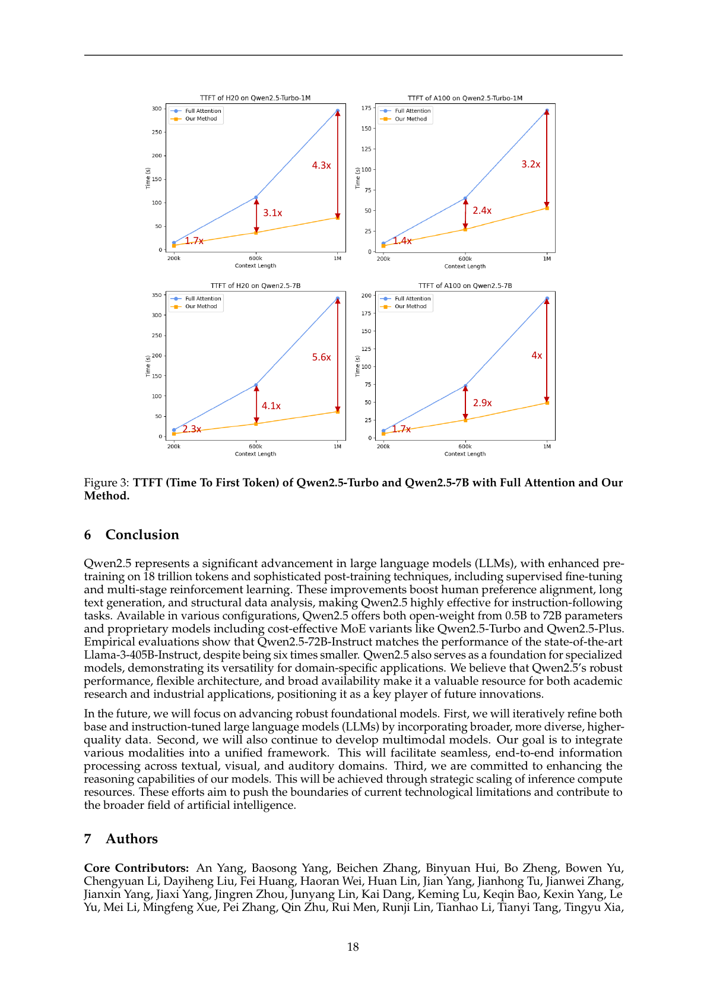

**核心贡献者，续：** Xingzhang Ren、Xuancheng Ren、Yang Fan、Yang Su、Yichang Zhang、Yu Wan、Yuqiong Liu、Zeyu Cui、Zhenru Zhang、Zihan Qiu。

**贡献者：** Biao Sun、Bin Luo、Bin Zhang、Binghai Wang、Chaojie Yang、Chang Si、Cheng Chen、Chengpeng Li、Chujie Zheng、Fan Hong、Guanting Dong、Guobin Zhao、Hangrui Hu、Hanyu Zhao、Hao Lin、Hao Xiang、Haoyan Huang、Humen Zhong、Jialin Wang、Jialong Tang、Jiandong Jiang、Jianqiang Wan、Jianxin Ma、Jianyuan Zeng、Jie Zhang、Jin Xu、Jinkai Wang、Jinzheng He、Jun Tang、Ke Yi、Keqin Chen、Langshi Chen、Le Jiang、Lei Zhang、Liang Chen、Man Yuan、Mingkun Yang、Minmin Sun、Na Ni、Nuo Chen、Peng Wang、Peng Zhu、Pengcheng Zhang、Pengfei Wang、Qiaoyu Tang、Qing Fu、Rong Zhang、Ru Peng、Ruize Gao、Shanghaoran Quan、Shen Huang、Shuai Bai、Shuang Luo、Sibo Song、Song Chen、Tao He、Ting He、Wei Ding、Wei Liao、Weijia Xu、Wenbin Ge、Wenbiao Yin、Wenyuan Yu、Xianyan Jia、Xianzhong Shi、Xiaodong Deng、Xiaoming Huang、Ximing Zhou、Xinyu Wang、Xipin Wei、Xuejing Liu、Yang Liu、Yang Yao、Yang Zhang、Yibo Miao、Yidan Zhang、Yikai Zhu、Yinger Zhang、Yong Jiang、Yong Li、Yongan Yue、Yuanzhi Zhu、Yunfei Chu、Zekun Wang、Zhaohai Li、Zheren Fu、Zhi Li、Zhibo Yang、Zhifang Guo、Zhipeng Zhang、Zhiying Xu、Zile Qiao、Ziye Meng。

## 参考文献

参考文献按原论文顺序保留于以下逐页截图中。

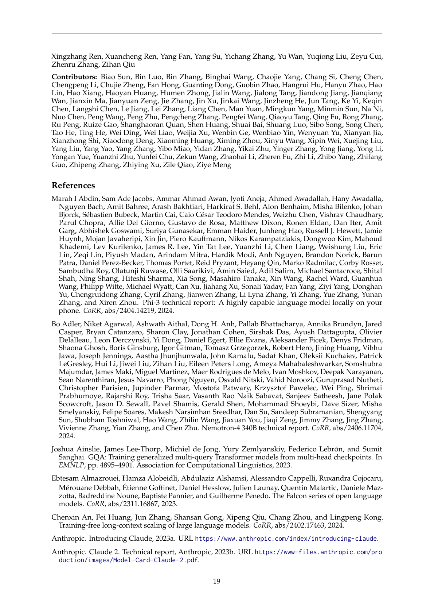

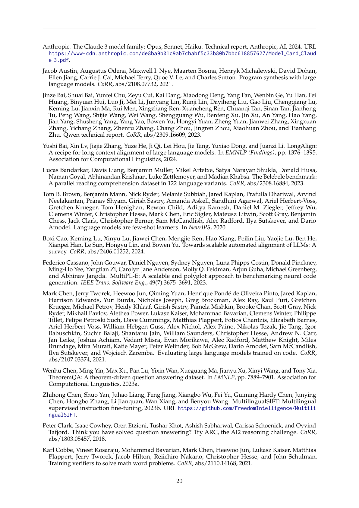

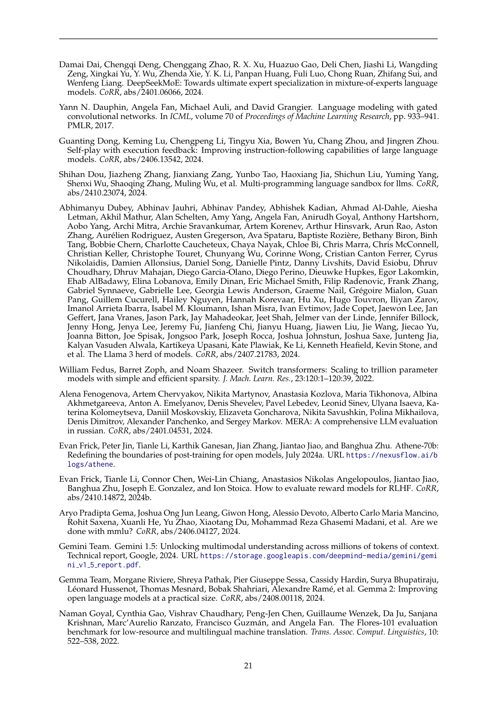

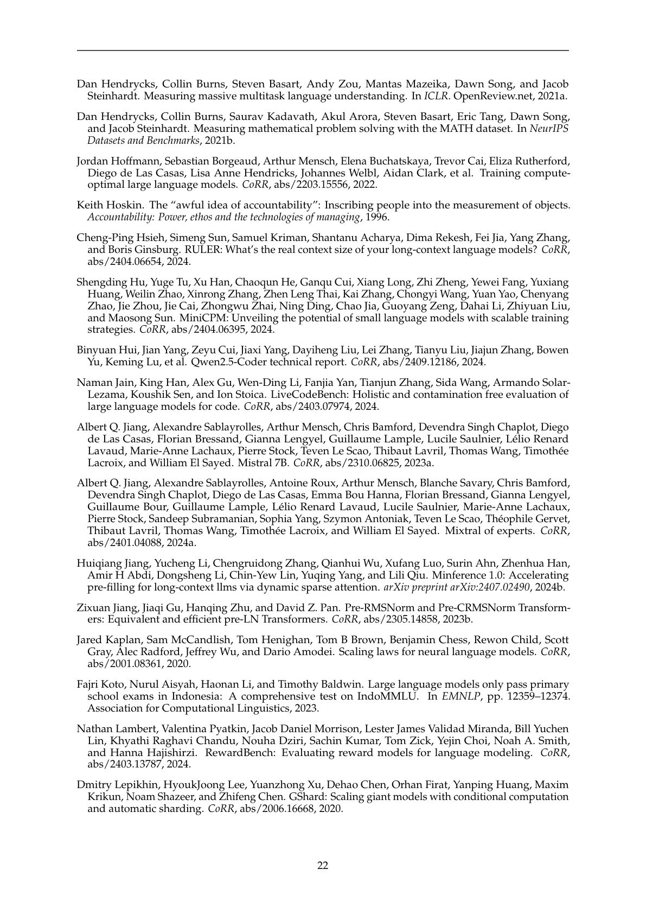

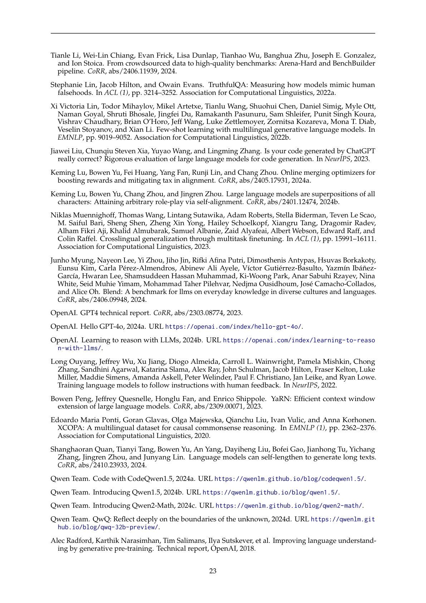

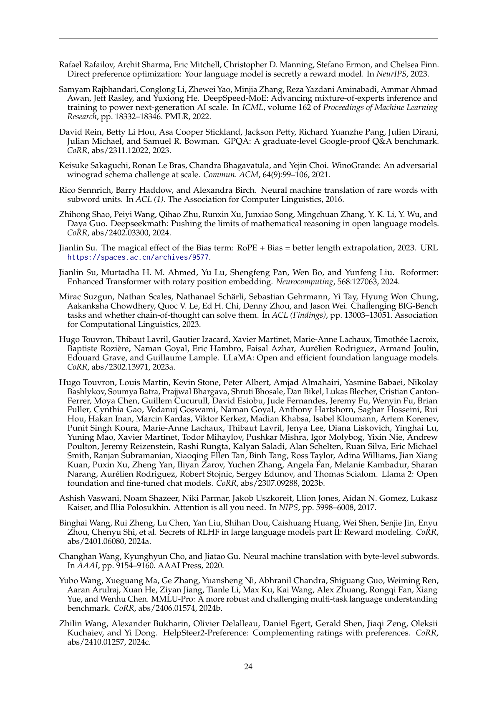

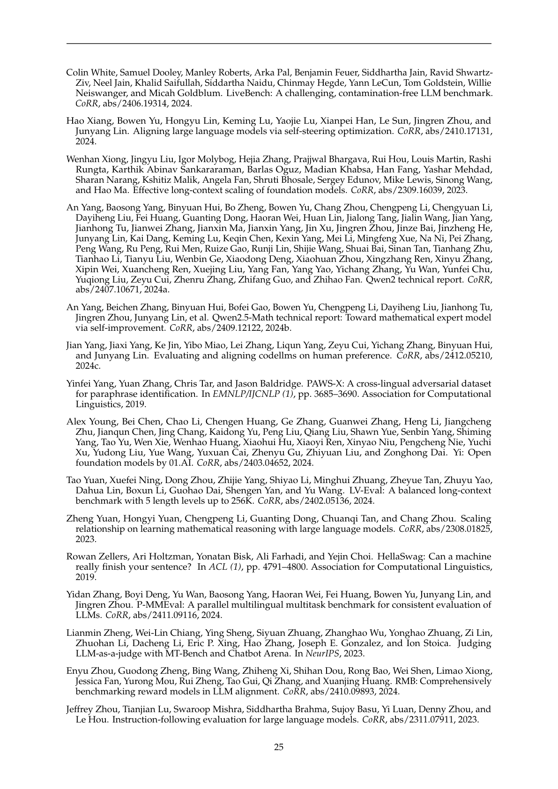

