# 大型语言模型中的混合专家综述

**作者：** Weilin Cai、Juyong Jiang、Fan Wang、Jing Tang、Sunghun Kim、Jiayi Huang  
**机构：** 香港科技大学（广州）

## 摘要

大型语言模型（LLM）在自然语言处理、计算机视觉等领域取得了空前进展。其能力来自庞大的模型规模、广泛多样的数据和训练期间使用的巨大计算资源，这些因素共同催生了小模型不具备的上下文学习等涌现能力。在此背景下，混合专家（MoE）成为一种以很小计算开销显著扩大模型容量的有效方法，受到学术界和产业界广泛关注。

尽管 MoE 日益普及，相关文献仍缺少系统、全面的综述。本文先简要介绍 MoE 层结构，再提出新的分类体系；随后从算法和系统两个方面梳理不同 MoE 模型的核心设计，并汇总开源实现、超参数配置和经验评测；进一步说明 MoE 的实际应用，并总结未来研究方向。作者还建立持续更新的资源仓库，分享 MoE 研究前沿进展。

**关键词：** 大型语言模型、混合专家、门控函数

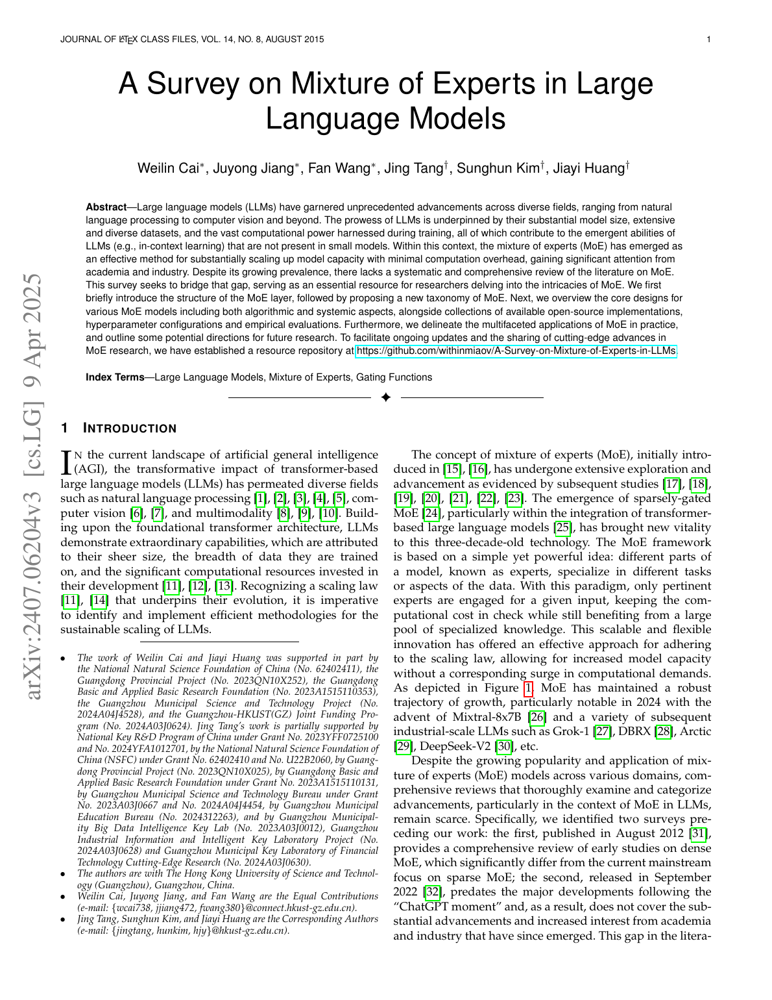

## 1 引言

在通用人工智能的发展中，基于 Transformer 的 LLM 已深刻影响自然语言处理、计算机视觉和多模态等领域。LLM 的非凡能力可归因于模型规模、训练数据广度和开发中投入的大量计算。既然缩放定律支撑其演进，就必须找到可持续扩大 LLM 的高效方法。

MoE 概念提出已有三十余年，经过持续探索，稀疏门控 MoE 与 Transformer LLM 的结合重新激活了这项技术。其思想简单而有力：模型的不同部分作为“专家”，分别专精于数据的不同任务或方面；针对给定输入只启用相关专家。这样既能利用庞大的专业知识池，又能控制计算成本，以不成比例增加计算量的方式提高模型容量。

2024 年 Mixtral 8x7B 及 Grok-1、DBRX、Arctic、DeepSeek-V2 等工业级 LLM 的出现，使 MoE 保持强劲增长。不过，现有两篇主要综述分别发表于 2012 年和 2022 年：前者集中于早期稠密 MoE，与当前主流稀疏 MoE 差异很大；后者早于“ChatGPT 时刻”，未覆盖此后学术界和产业界的大量进展。

本文以算法、系统和应用三个维度组织近年发展。算法部分重点讨论在 Transformer 中用 MoE 层替换 FFN：一个 MoE 层包含多个 FFN 专家，并通过门控激活部分专家，因此需要研究门控和专家网络设计。分析还扩展到软 MoE 的词元或专家合并、参数高效专家混合、稠密与稀疏之间的训练/推理转换，以及多种衍生结构。

随着工业产品的模型架构逐渐趋同，系统设计成为提升 LLM 服务质量的关键。本文从计算、通信和存储方面综述系统优化，以应对 MoE 稀疏、动态工作负载带来的独特挑战；应用部分覆盖自然语言处理、计算机视觉、推荐系统和多模态。

图 1 按发布时间排列代表性 MoE 模型。箭头上方为开源模型，下方为闭源模型；自然语言、视觉、多模态与推荐系统分别用不同颜色标识。

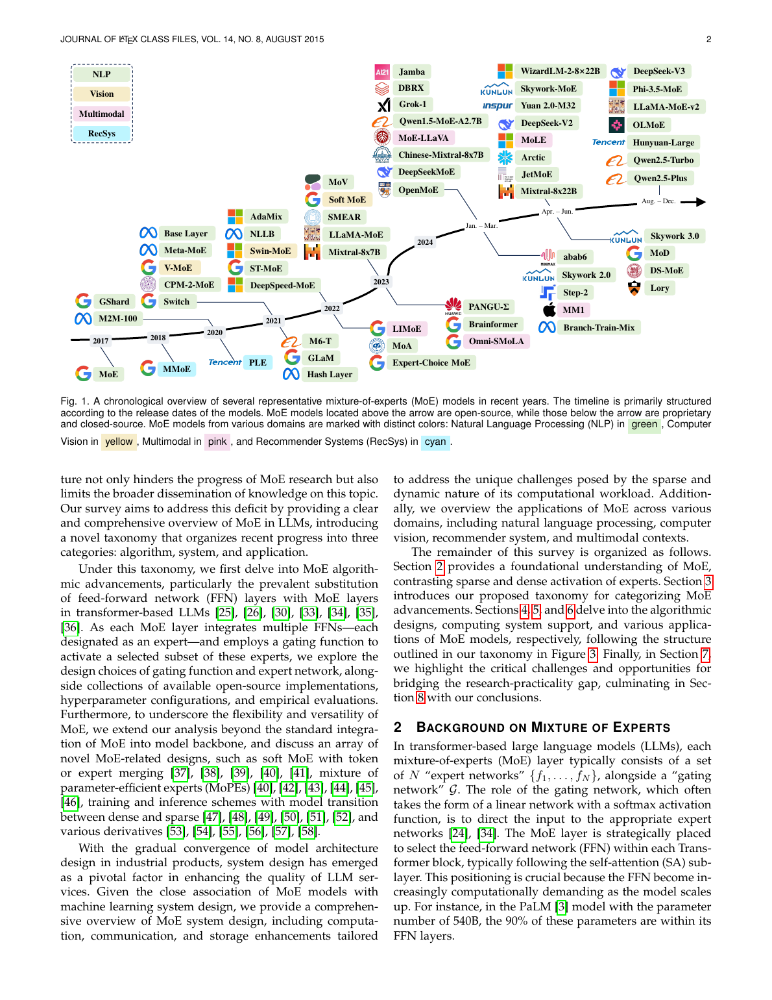

## 2 混合专家基础

在基于 Transformer 的 LLM 中，每个 MoE 层通常包含 $N$ 个专家网络 $\{f_1,\ldots,f_N\}$ 和一个门控网络 $G$。门控通常是带 softmax 的线性网络，负责把输入送到合适专家。MoE 层一般位于每个 Transformer 块的自注意力子层之后，用于选择 FFN。之所以替换 FFN，是因为模型扩大后，FFN 的计算与参数占比越来越高；例如 540B 参数的 PaLM 中，约 90% 参数位于 FFN。

专家网络通常为“线性—ReLU—线性”结构，参数记为 $W_i$，接收相同输入 $x$ 并产生 $f_i(x;W_i)$；门控网络参数记为 $\Theta$，输出 $G(x;\Theta)$。按门控设计，MoE 可分为稠密 MoE 与稀疏 MoE。

### 2.1 稠密 MoE

稠密 MoE 每轮激活全部专家。早期 MoE 研究广泛采用这一策略，近期 EvoMoE、MoLE、LoRAMoE、DS-MoE 等又重新使用。输出是所有专家输出按门控概率加权求和，门控概率由各专家得分的 softmax 得到。

### 2.2 稀疏 MoE

稠密 MoE 往往预测更准，却显著增加计算开销。稀疏门控 MoE 每次前向只激活部分专家，输出只汇总 top-k 专家，而不是全部专家。TopK 保留向量中最大的 $k$ 个值，把其余位置设为负无穷；softmax 后，被屏蔽位置近似为零。常见选择为 $k=1$ 或 $k=2$。训练时加入噪声项可促进专家探索并提高训练稳定性。

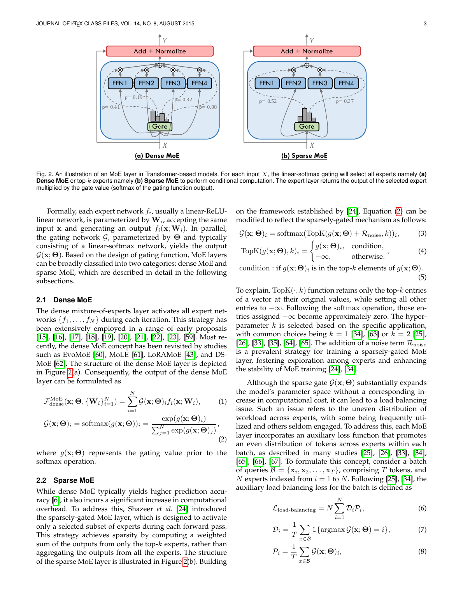

稀疏门控能显著扩大参数空间而不相应增加计算成本，但会产生负载均衡问题：部分专家被频繁使用，另一些很少参与。为此，每个 MoE 层常加入辅助损失，推动一个批次的词元在专家间均匀分布。

对含 $T$ 个词元、$N$ 个专家的批次，$D_i$ 表示被分配给专家 $i$ 的词元比例，$P_i$ 表示门控概率分配给它的比例。负载均衡损失为 $N\sum_iD_iP_i$；当每个专家都接收 $1/N$ 的词元和门控概率时达到最小值 1。后文若无特别说明，“MoE”均指“稀疏 MoE”。

## 3 混合专家分类体系

MoE 通过专业化模型集合和门控机制，为给定输入动态选择专家，按需分配计算资源，也就是条件计算。它已成为 LLM 扩大参数规模和能力的常见方式。Mixtral 8x7B 每层有 8 个 FFN 专家，只激活约 13B 参数，却在多项基准上达到或超过 Llama 2 70B 和 GPT-3.5。DeepSeekMoE 16B 以约少 40% 的计算达到 Llama 2 7B 水平。Qwen1.5-MoE 仅激活 2.7B 参数，也可与 Mistral 7B、Qwen1.5 7B 等领先 7B 模型竞争。

本文分类体系包括：

- **算法设计：** 门控函数、专家网络、参数高效专家混合、训练与推理方案、衍生结构。
- **系统设计：** 计算、通信、存储。
- **应用：** 自然语言处理、计算机视觉、推荐系统、多模态。

## 4 混合专家算法设计

### 4.1 门控函数

门控函数也称路由函数或路由器，是全部 MoE 架构的基础部件，负责安排专家计算并组合输出。按输入处理方法可分三类：激活部分专家的稀疏门控、激活全部专家的稠密门控，以及通过词元合并或专家合并实现完全可微的软门控。

#### 4.1.1 稀疏门控

稀疏门控为每个输入词元选择部分专家，是条件计算的一种形式。门控可由强化学习或反向传播训练，决策可以是二元或稀疏连续、随机或确定性的。Shazeer 等人率先提出带辅助均衡损失的可微启发式方案，用选择概率加权专家输出，使门控过程能获得梯度，随后成为主流。

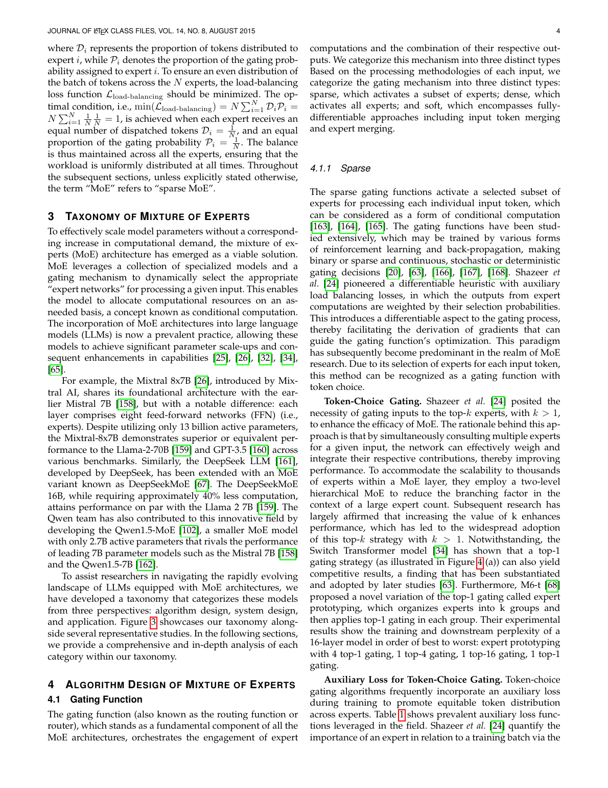

图 3 展示完整分类树：门控包括稠密、词元选择、不可训练词元选择、专家选择和软门控；专家维度包括网络类型、数量、大小、层频率、激活函数和共享专家；参数高效专家按 FFN、注意力、Transformer 块和逐层放置分类；训练/推理包括原生方案、稠密转稀疏、稀疏转稠密和专家模型合并；系统分计算、通信、存储；应用分 NLP、视觉、推荐和多模态。

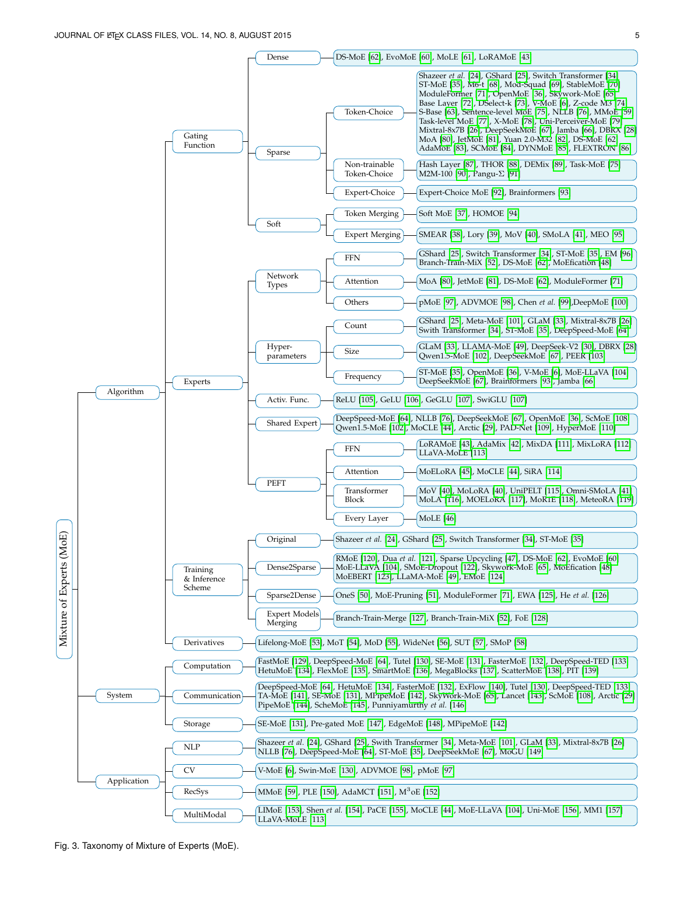

##### 词元选择门控

早期工作认为每个输入应路由到多个 top-k 专家，以综合多名专家贡献并提高性能；为扩展到数千专家，还使用两级层次化 MoE 降低分支因子。多数研究确认增大 $k$ 会提高性能，因此 $k>1$ 被广泛采用。Switch Transformer 则证明 top-1 也能有竞争力。M6-t 提出“专家原型”：把专家分成 $k$ 组，每组执行一次 top-1。16 层模型的效果从好到差为 4 组 top-1、单组 top-4、单组 top-16、单组 top-1。

##### 词元选择的辅助损失

Shazeer 等人用一个批次内门控值之和定义专家重要性，再以重要性变异系数平方构造损失，使所有专家重要性接近。由于这不保证训练样本均匀分配，又引入平滑估计各专家样本数的负载损失。GShard 简化为每个专家平均门控值与平均门控决策点积构成的可微辅助损失，等价于前述负载均衡损失，随后被 Switch、GLaM、Mixtral、DBRX、Jamba、DeepSeekMoE 等广泛采用。

ST-MoE 发现该损失在大规模训练上可能不可靠，于是加入 z-loss，惩罚进入门控网络的过大 logit，降低指数运算中的舍入误差并提高稳定性。Mod-Squad 认为专家均衡会迫使专家同时适配冲突任务，或妨碍互补任务共享参数，因此最大化专家与任务之间的互信息。ModuleFormer 最大化专家与词元互信息，DS-MoE 则为注意力专家和 FFN 专家设置不同互信息权重。

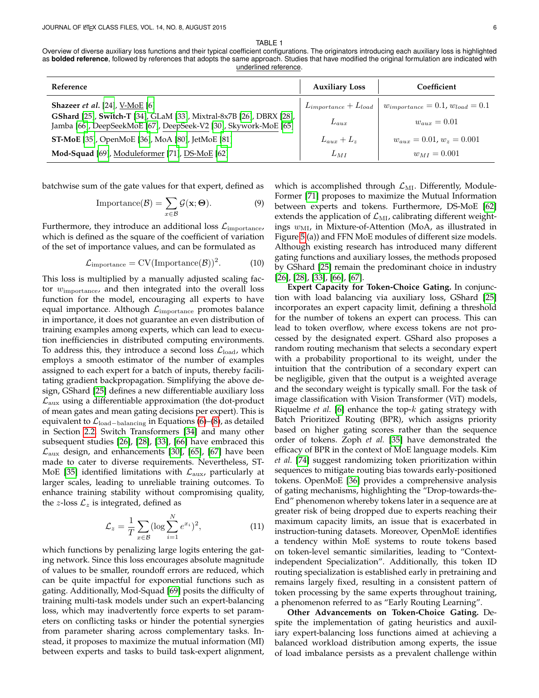

##### 专家容量与词元丢弃

GShard 还限制每个专家可处理的词元数量，超出容量的词元不会由指定专家处理；对第二专家可按权重随机路由，因为其权重通常较小、贡献有限。视觉 MoE 的批次优先路由按更高门控分数而非词元顺序分配优先级，后续也被语言 MoE 采用。随机化序列内词元优先级可减少对早期位置的偏见。

OpenMoE 总结了三种现象：序列后部词元更容易因专家容量已满而被丢弃；路由倾向依据词元级语义相似性形成与上下文无关的专业化；基于词元 ID 的路由专业化在预训练早期就形成，此后基本固定。

##### 词元选择的其他进展

BASE 把词元—专家分配重构为线性指派问题，在每位专家接收相同词元数的约束下最大化亲和度；S-BASE 使用最优传输形式。DSelect-k 提出平滑 top-k，缓解离散优化在梯度训练中的收敛与统计问题。句子级门控先平均序列词元得到句子表示，再路由到专家。X-MoE 把隐藏向量投影到低维并对词元表示与专家嵌入做 L2 归一化，在低维超球面计算路由分数，避免表示坍塌。

FLEXTRON 用代理模型根据路由选择预测语言损失，再冻结代理模型并据其反馈调路由器，缓解梯度消失。Skywork-MoE 使用门控 logit 归一化与逐层自适应辅助损失系数。Yuan 2.0-M32 的注意力路由比线性路由更高效、准确。AdaMoE 加入空专家并增大 $k$，让每个词元自适应使用不同数量的真实专家；DYNMoE 通过可训练阈值让词元自动决定激活专家数，并在训练时自动增删专家；SCMoE 在推理时用不同门控策略之间的对比信息启用未被选择的专家，无需额外训练。

图 4 对比 top-1 稀疏门控、BASE、域映射加随机门控、专家选择、注意力路由和专家合并软 MoE。

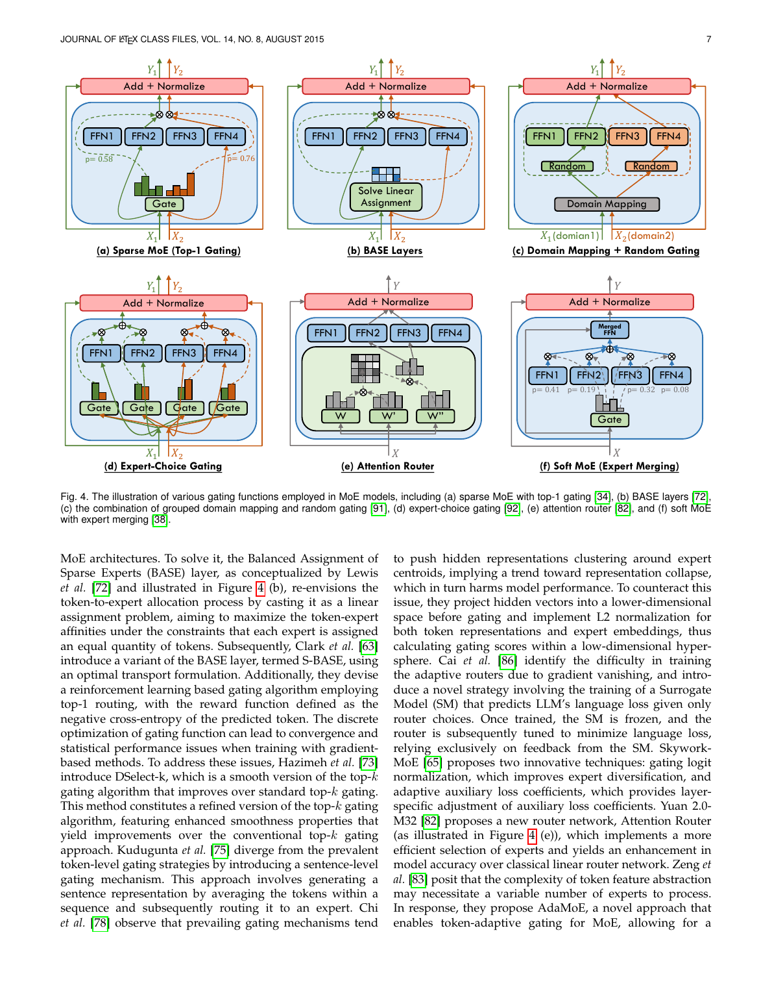

##### 不可训练的词元选择门控

不可训练路由无需额外门控参数，并可通过特定机制实现完全负载均衡。Hash Layer 固定随机哈希输入词元，通过预选哈希函数使批次均匀分配。THOR 在训练和推理时随机给每个输入分配两位专家，并用一致性正则使预测相同。DEMix 把专家显式分配到不同预训练域；推理时采用无参数概率方法估计域权重混合，提高对未知域的泛化。

任务级门控可使用先验标签，M2M-100 依据语言确定性选择语言专属子层。PanGu-Σ 先把词元送到领域专家组，再在组内随机选专家。NLLB 则使用可训练门控处理多语言翻译，超过 M2M-100。Conditional MoE 在词元、上下文、模态、任务和预定义属性等不同层次加入条件信息。StableMoE 用两阶段训练先学到均衡连贯的路由，再蒸馏为轻量门控并冻结，使后续训练保持稳定路由。

##### 专家选择门控

专家选择把常规范式反过来：每位专家选择自己处理的 top-k 词元。这样无须辅助均衡损失，专家获得均匀数量的词元；但词元覆盖会不均，有的被多名专家处理，有的完全不处理。它仍表现强劲，并可解释为模型对某些词元隐式投入更多计算。Brainformers、视觉 Transformer 和 T5 编码器的研究进一步验证了该方法。

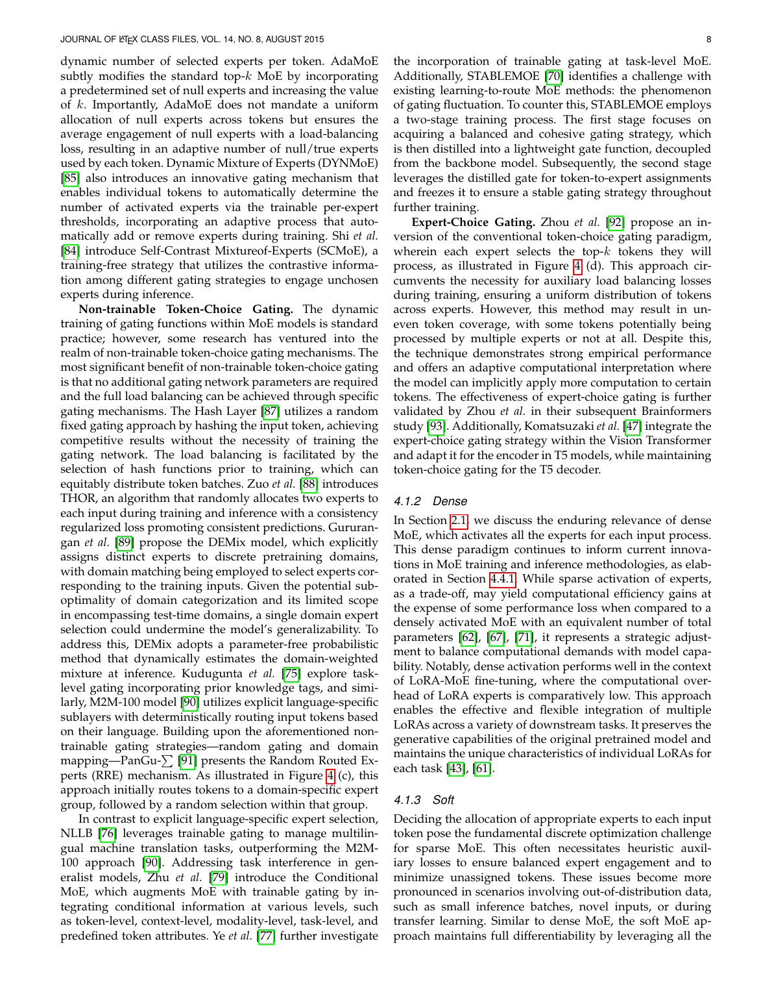

#### 4.1.2 稠密门控

稠密 MoE 为每个输入激活全部专家，至今仍影响新的训练和推理方案。与总参数相同的稠密激活相比，稀疏激活以少量性能损失换取计算效率。LoRA-MoE 的专家计算开销较小，因此稠密激活尤其有效：它能灵活组合多个任务 LoRA，既保留原预训练模型的生成能力，又保持各任务 LoRA 的独特特征。

#### 4.1.3 软门控

为每个词元分配专家本质上是离散优化，需要启发式均衡损失，并可能留下未处理词元；小推理批次、新输入和迁移学习等分布外场景会放大问题。软 MoE 让全部专家参与，保持完全可微，并通过门控加权的词元或专家合并控制计算量。

##### 词元合并

Soft MoE 不做稀疏离散路由，而是按词元与专家相关的权重，对全部词元计算若干加权平均，再由对应专家处理。图像分类实验显示，它训练更稳定且天然均衡。HOMOE 把这一设计与 Hopfield 网络结合，用于组合式零样本学习。但合并输入词元不易用于自回归解码器，因为推理时无法取得未来词元参与平均。

##### 专家合并

SMEAR 不合并词元，而按门控权重平均全部专家参数，输入只通过一个合并专家。因此计算成本不会显著增加，并能用标准梯度训练。T5-GLUE 与 ResNet-DomainNet 上，它超过依赖元数据或梯度估计的门控；但相对 Soft MoE 吞吐量下降约 10%。

Lory 把专家合并扩展到自回归语言模型预训练：以因果分段路由在片段级合并专家，并用相似性数据分批推动领域或主题专业化。LLaMA 实验相对同参数稠密模型把困惑度改善 13.9%，下游任务提高 1.5% 至 11.1%。MoV 微调 T5 时，软合并也显著优于 top-1、top-2 稀疏门控；Omni-SMoLA 混合多模态低秩专家；MEO 先在序列级选择专家，再合并为一个，并用词元注意力保留上下文身份。

## 4.2 专家设计

### 4.2.1 网络类型

#### 前馈网络专家

MoE 接入 Transformer 后，最常见做法是用多个专家替换 FFN，每位专家复制原 FFN 架构。原因是自注意力通常比 FFN 稀疏性更低、领域专属性更弱。DS-MoE 的实验显示，FFN 专家只有约 20% 被激活，自注意力专家则有约 80%。早期神经元分析也发现，大多数输入只激活 FFN 中少量神经元；“涌现模块化”进一步表明，神经元激活与具体任务高度相关，支持预训练 Transformer 天然包含可由 MoE 表达的模块结构。

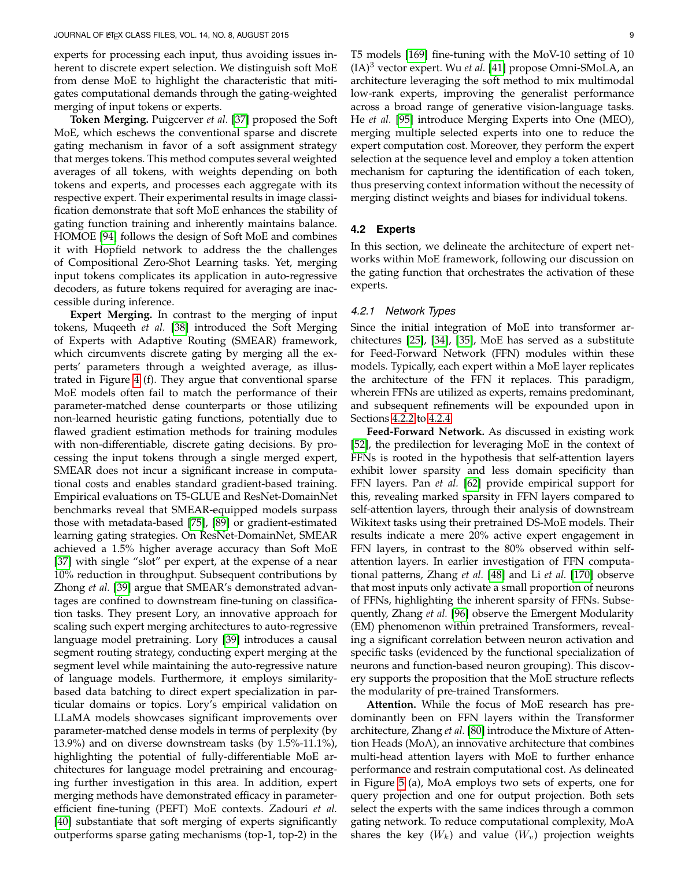

#### 注意力专家

MoA 把多头注意力与 MoE 结合，使用两组专家分别处理查询投影和输出投影，两组通过共同门控选择相同索引。为控制计算，它在全部注意力专家间共享键和值投影，只让查询与输出投影各自专业化，从而可预先共享计算键值序列。DS-MoE、JetMoE、ModuleFormer 后续进一步改进注意力 MoE。除此之外，还有工作使用 CNN 作为专家，或用 LoRA 等参数高效模块作为专家。

图 5 对比 MoA 与共享专家：MoA 在注意力投影中路由，后者让共享 FFN 始终参与，再从路由 FFN 中选择部分专家。

### 4.2.2 超参数

稀疏 MoE 除稠密 Transformer 的超参数外，还要决定每层专家数、每位专家大小和 MoE 层在网络中的放置频率。这些选择深刻影响不同任务上的性能和计算效率，必须结合应用需求与硬件约束。

#### 专家数量

早期研究每层使用数千专家，在预训练和翻译质量上取得明显收益，但领域迁移或多样任务微调时性能下降更严重。GLaM 发现 64 位专家加 top-2 在执行效率与零样本、单样本、少样本性能之间较优，近期模型通常不超过 64 位专家。DeepSpeed-MoE 的金字塔结构则把更多专家放在网络后部。

#### 专家大小

GLaM 固定 64 位专家，主要扩大每位专家的中间维度，往往需要跨加速器张量并行。DeepSeekMoE 提出细粒度专家划分：把 FFN 中间维度拆小，同时保持总参数不变。DeepSeekMoE 145B 把单专家中间维度缩至稠密 FFN 的八分之一，同时把专家数从 16 增至 128，把激活数从 top-2 增至 top-16。这样可以更精细地分解知识，并让激活组合更灵活。Qwen1.5-MoE 与 DBRX 采用类似策略。

LLaMA-MoE 在相同参数下发现，激活 16 位小专家中的 4 位略优于激活 8 位大专家中的 2 位。PEER 更进一步，从百万级单神经元微专家池中用乘积键进行稀疏检索，在语言建模的性能—计算权衡上超过稠密 FFN 和粗粒度 MoE。

#### MoE 层频率

传统做法常每隔一层替换一次 FFN。少数模型每四层放置一次，Switch 与 DeepSeekMoE 等则每层都使用。Mixtral 8x7B 后，趋势转向每层放置 MoE，并只使用 8 或 16 位、维度接近稠密 FFN 的专家。

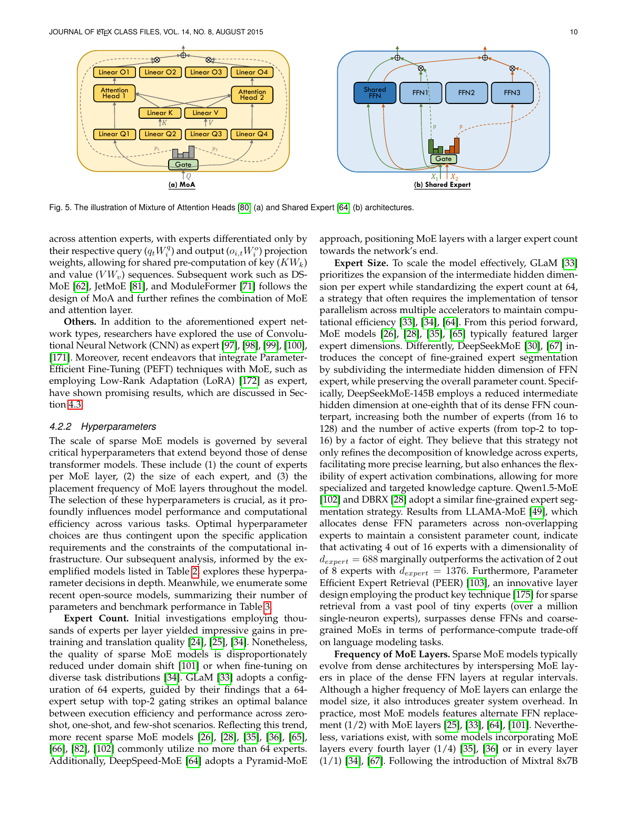

V-MoE 只在靠后的偶数层使用 MoE，以很小性能影响显著提高速度。DeepSeekMoE 除第一层外全部替换，因为第一层负载均衡收敛较慢。MoE-LLaVA 在多模态任务上发现交替放置优于每层、前半或后半放置。ST-MoE 在每个 MoE 旁增加稠密 FFN 提高质量。Brainformers 打破严格顺序层，以不规则方式组合 MoE、稠密 FFN、注意力、归一化和激活。Jamba 则以 1:7 混合注意力与 Mamba 层。

表 2 汇总 GShard、Switch、GLaM、DeepSpeed-MoE、ST-MoE、Mixtral、LLaMA-MoE、DeepSeekMoE、OpenMoE、Qwen1.5-MoE、DBRX、Jamba、Skywork-MoE、Yuan、OLMoE、DeepSeek-V3 的激活/总专家数、隐藏维度、中间维度、层数、注意力头、MoE 频率、激活函数与共享专家。

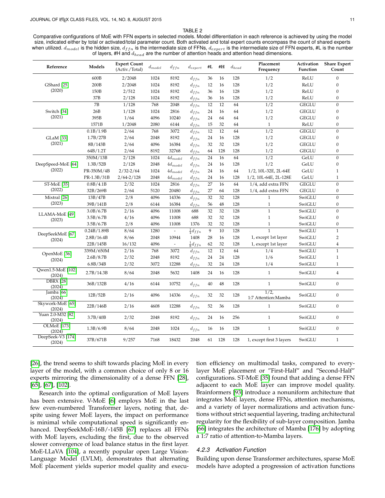

### 4.2.3 激活函数

稀疏 MoE 沿用领先稠密 LLM 的演进路线，从 ReLU 逐步转向 GeLU、GeGLU、SwiGLU。其他部件也越来越常用 RMSNorm、分组查询注意力和 RoPE。表 3 汇总近期开放 MoE 的激活/总参数及 MMLU、GSM8K、MATH、HumanEval 结果。

### 4.2.4 共享专家

DeepSpeed-MoE 的 Residual-MoE 让每个词元同时经过一位固定专家和一位门控选择专家，在不超过 top-1 通信成本的条件下每层启用两位专家；路由专家可视为固定稠密 FFN 的误差修正。NLLB 的条件 MoE 路由也组合稠密 FFN 与 MoE 输出。这类固定 FFN 加稀疏 MoE 的共享专家结构已成为 DeepSeekMoE、OpenMoE、Qwen1.5-MoE、MoCLE 等的主流配置。

细粒度模型可使用多个共享专家。PAD-Net 依据参数对损失的影响，逐步把部分路由专家参数转成静态共享参数。HyperMoE 通过跨专家、跨层超网络捕获信息。ScMoE 解耦前层表示与当前共享专家输出，以重叠通信和计算；Snowflake Arctic 的稠密—MoE 混合 Transformer 采用类似思路。

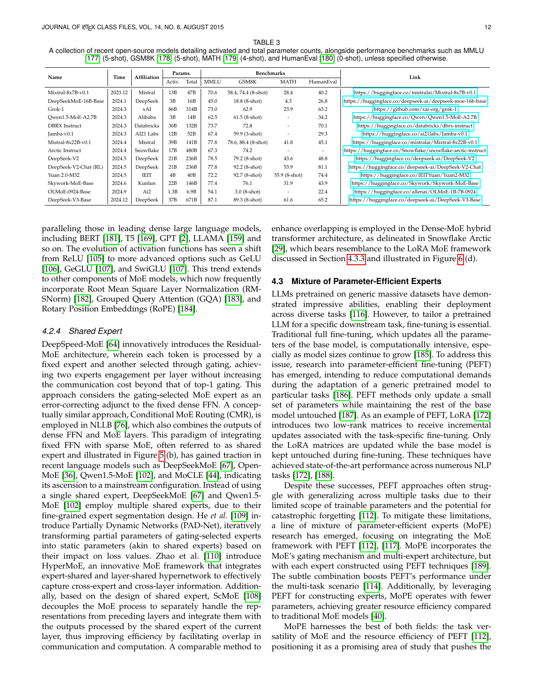

## 4.3 参数高效专家混合

通用预训练 LLM 需要微调才能适配具体下游任务。全参数微调成本随模型规模急剧上升，因此参数高效微调（PEFT）只更新少量参数，冻结基础模型。LoRA 以两个低秩矩阵表示任务增量，只更新它们，却能在多项 NLP 任务达到领先表现。

PEFT 的可训练范围有限，容易在多任务上泛化不足或发生灾难性遗忘。参数高效专家混合（MoPE）把 MoE 门控和多专家结构与 PEFT 结合，每位专家由 LoRA、Adapter 等轻量方法构造。它兼具 MoE 的任务通用性和 PEFT 的资源效率。

### 4.3.1 前馈网络位置

此类方法把参数高效专家放在每个 Transformer 块的 FFN。训练只优化轻量专家和门控，其他预训练参数保持不变。

LoRAMoE 把若干 LoRA 专家插入 FFN，并分为两组：一组学习不同下游任务，另一组把预训练世界知识与人类指令对齐。局部均衡约束使组内专家保持重要性，同时让不同组专注各自目标，缓解知识遗忘。AdaMix 在 FFN 后加入 Adapter 专家，训练时随机选择投影矩阵，成本等同单 Adapter；推理时平均全部专家输出以降低服务成本。

MixDA 分两阶段：先只训练与 FFN 并行的领域 Adapter，学习领域知识并保留世界知识；再在 FFN 上加入门控与任务 Adapter，适配具体任务。LLaVA-MoLE 为多模态不同领域建立 FFN LoRA 专家，用 top-1 路由，以接近普通 LoRA 的成本解决数据冲突。MixLoRA 则把 LoRA 专家直接融合到共享 FFN，复用一个 FFN 的基础权重，并实现高吞吐框架，减少训练和推理延迟与显存。

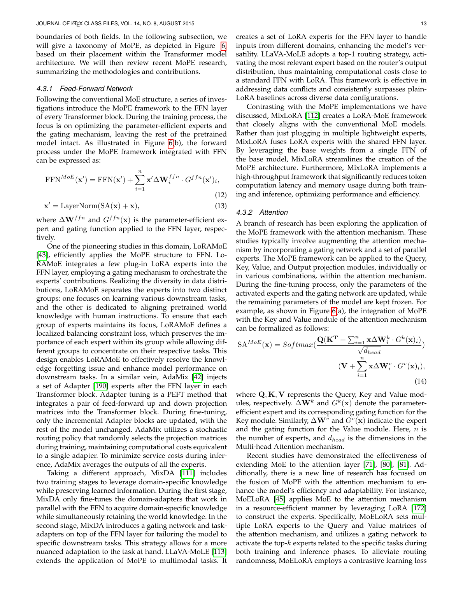

### 4.3.2 注意力位置

MoPE 可分别或组合应用于注意力的查询、键、值、输出投影，只更新被激活的轻量专家与门控，冻结其余参数。MoELoRA 在查询和值矩阵中设置多个 LoRA 专家，以 top-k 选择任务相关专家，并用对比学习拉开专家输出分布，鼓励捕获不同下游特征。

MoCLE 先对不同来源和格式的任务聚类，再把输入路由到查询、值模块中的 LoRA 专家。专家包含多个任务专家和一位通用专家：任务专家减少冲突，通用专家在全部任务上训练以保持泛化。SiRA 以 top-k 路由多个 LoRA Adapter，并使用容量约束、均衡损失和专家 dropout 缓解负载不均与过拟合。

图 6 按放置位置划分 MoPE：注意力、FFN、Transformer 块和逐层整体。

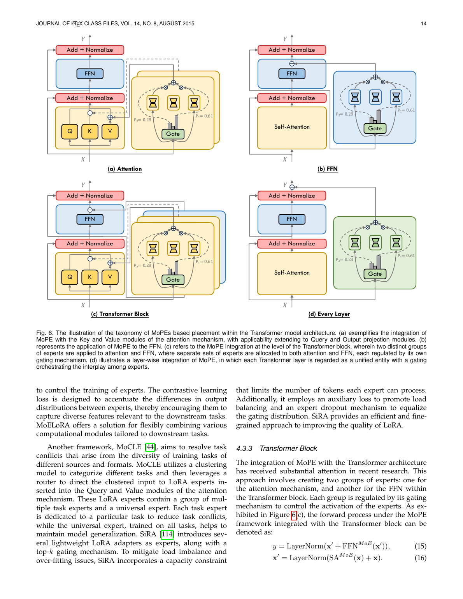

### 4.3.3 Transformer 块位置

这种方案为注意力与 FFN 分别建立专家组和门控。MoV 用极轻量的 $(IA)^3$ 向量缩放键、值和 FFN 激活，只更新向量专家和门控，显著降低梯度计算与模型存储。MoLoRA 同时在注意力与 FFN 使用 LoRA 专家，优于普通 LoRA。UniPELT 把 Adapter、前缀调优和 LoRA 三种 PEFT 作为专家，以不同门控动态选择最适合任务的组合。

Omni-SMoLA 设置文本、视觉、多模态三组 LoRA 专家。MoLA 研究逐层专家分配，让不同层使用不同数量专家。医疗领域 MOELoRA 用任务身份调制注意力和 FFN 中的专家贡献。Intuition-MoR1E 利用样本语义聚类模拟人类多任务认知，并提出 rank-1 专家，使任意上投影与任意下投影灵活组合。MeteoRA 将多个任务 LoRA 嵌入基础 LLM，并以自定义 GPU 内核加速。

### 4.3.4 逐层整体位置

这一方向不再把注意力和 FFN 割裂，而把整个 Transformer 层作为统一实体。MoLE 发现训练好的 LoRA 在不同层具有不同特征，因此把每层 LoRA 视为独立专家，只训练门控来学习给定领域的最优组合权重，显著扩展 LoRA 组合的适用场景。

## 4.4 训练与推理方案

传统方案从零训练 MoE，推理保持训练时结构。新方法进一步分为稠密转稀疏、稀疏转稠密、专家模型合并，以结合稠密和稀疏模型的优势。

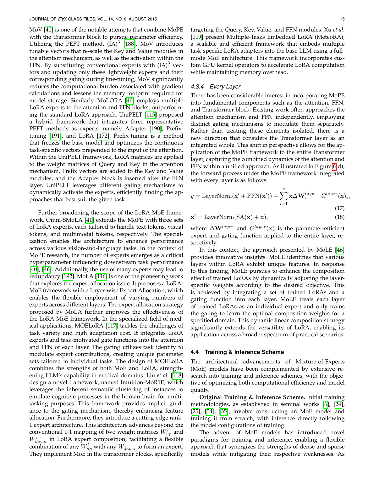

### 4.4.1 稠密转稀疏

RMoE 先在上游任务训练稠密视觉 Transformer，再高效微调为 MoE；直接从稠密 FFN 继承专家权重并非最优，需要在微调时对齐 MoE 与 FFN 输出。另一方案先训练稠密模型，再加入随机初始化门控，让 FFN 在稀疏条件下继续训练，并在各计算节点本地更新专家权重。

EvoMoE 解耦专家与稀疏门控学习：训练初期用单专家掌握基础知识，再复制出多位专家，并通过稠密转稀疏门控逐步从全部激活收缩到少量路由。MoE-LLaVA 也从稠密模型开始，复制 FFN 初始化专家，只训练 MoE 层。

稀疏升级利用已有稠密检查点初始化 MoE：除新增门控外，迁移全部参数和可选优化器状态，把原 FFN 复制给每位专家，随机初始化门控。结构变化会导致初始性能下降。把每个词元被选中专家的权重重新归一为 1 对视觉模型有利，对语言模型却可能有害。早期 MoE 在 top-k 后 softmax，而后续 LLM 常先对全部专家 softmax，再截取 top-k，所选权重之和不一定为 1。

Skywork-MoE 从 Skywork 13B 稠密检查点升级，发现从零训练仍持续优于升级模型；升级过程中专家相似度逐渐下降，表示专业化逐步形成。专家越相似，表现往往越差，因此相似度可作为诊断指标。DS-MoE 使用稠密训练、稀疏推理：训练时激活全部专家，推理只稀疏激活 FFN 专家；注意力专家因稀疏性较低仍全部激活。

SMoE-Dropout 先把 FFN 模块化为小专家，使用固定随机策略路由到响应最大的 $k$ 位，并逐步增加激活专家数，防止过拟合固定容量。MoEfication 研究随机切分、参数聚类和共激活图等专家构造；MoEBERT 按重要性拆分 BERT FFN；LLaMA-MoE 最终采用简单随机切分非重叠专家；EMoE 用聚类专家与 avg-k 门控改进微调，之后甚至可以移除 MoE 保留原结构。

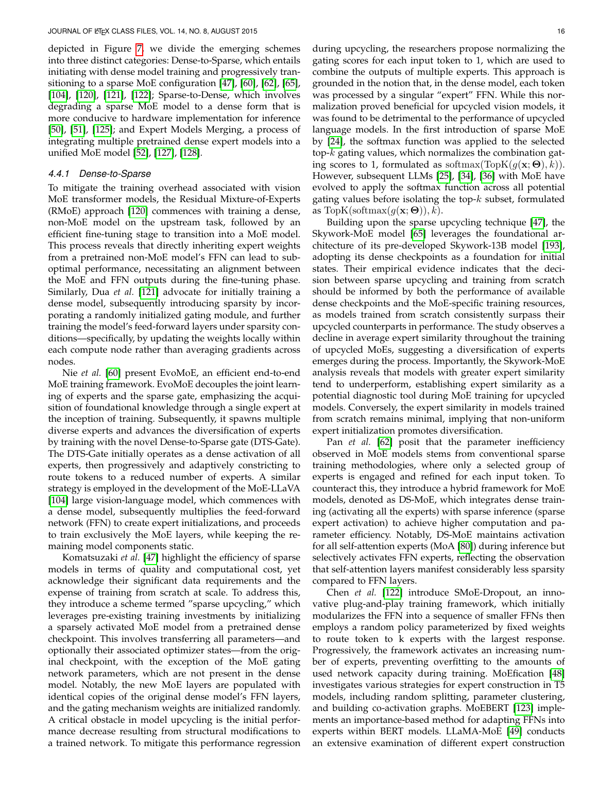

图 7 对比四种方案：原生 MoE、专家模型合并、稠密转稀疏、稀疏转稠密。

### 4.4.2 稀疏转稠密

Switch Transformer 把大型稀疏模型蒸馏为小型稠密模型用于部署。从 MoE 非专家层初始化稠密模型权重会略有改善；教师概率与真实标签按 0.25/0.75 混合也有帮助。两者结合后，只用约 5% 参数就保留稀疏模型约 30% 的质量增益。

OneS 先通过求和、平均、top-k 和基于奇异值分解等方法汇聚专家知识，再通过知识蒸馏消除汇聚噪声；在 ImageNet 与 NLP 数据集上分别保留 MoE 收益的 61.7% 和 88.2%。另一些方法逐步删除不重要专家，把目标任务模型简化成单专家稠密结构；ModuleFormer 也剪除与任务无关的专家。

视觉 Transformer 训练时可把部分 FFN 替换为高效 MoE，以随机均匀切分分配词元，并在每轮结束做专家权重平均；训练后再平均专家权重恢复原始稠密 ViT 推理。统一 MoE 压缩框架还可用“专家瘦身”剪枝、量化单个专家，以及“专家裁剪”结构性删除不重要专家。

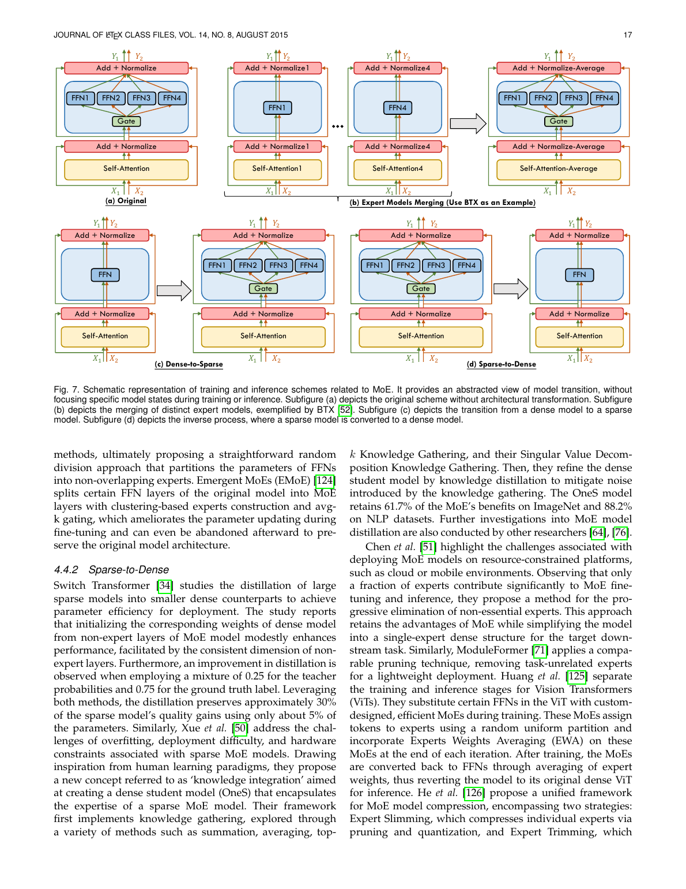

### 4.4.3 专家模型合并

Branch-Train-Merge 分别训练面向科学、法律等领域的专家语言模型，彼此不共享参数；推理时可集成输出或平均参数合成单一模型。Branch-Train-MiX 进一步把各专家模型每层 FFN 合并成统一 MoE，由门控为每个词元选择专家；自注意力等其他部件按权重平均。最后在全部合并数据上进行 MoE 微调，使门控学会混合专家。Fusion of Experts 则把多个提供不同但互补信息的专家输出融合，形式化为监督学习问题。

## 4.5 衍生结构

WideNet 用 MoE 替换 FFN 扩展宽度，同时让除归一化外的 Transformer 层共享参数。稀疏通用 Transformer 在层间共享参数，并加入稀疏专家和基于折棒过程的动态停止机制。Mixture of Tokens 在送入专家前混合不同样本的词元，避免离散词元—专家匹配造成不稳定与利用率不均。

稀疏提示混合用门控训练多个短软提示，每个负责不同数据子集，避免长软提示低效。Lifelong-MoE 在持续数据流中通过正则化预训练逐步增加专家，缓解灾难性遗忘。Mixture-of-Depths 用二元门控决定某个词元是否经过给定 Transformer 层，按序列位置动态分配 FLOPs，整体计算量低于普通 Transformer 或 MoE。

这些衍生方法要么采用门控的条件计算思想，要么把专家专业知识分配结构与提示调优、终身学习等任务结合，体现了 MoE 的通用性与适应性。

## 5 混合专家系统设计

MoE 稀疏、动态的计算负载给训练和推理系统带来新挑战。GShard 提出的专家并行已成为高效扩展 MoE 的基础：每位专家放在不同设备，非专家层在设备间复制。执行依次包括门控路由、输入编码、全交换分发、专家计算、全交换合并和输出解码。

输入编码依据词元—专家映射，把同一专家的词元聚合到连续内存，以增大矩阵乘输入并提高硬件利用率；全交换把词元发往跨设备专家，专家局部计算后再逆向全交换并恢复原布局。专家并行还可与数据、张量、流水线、序列并行组合。实际策略需在计算效率、通信开销、内存占用和硬件拓扑间权衡。

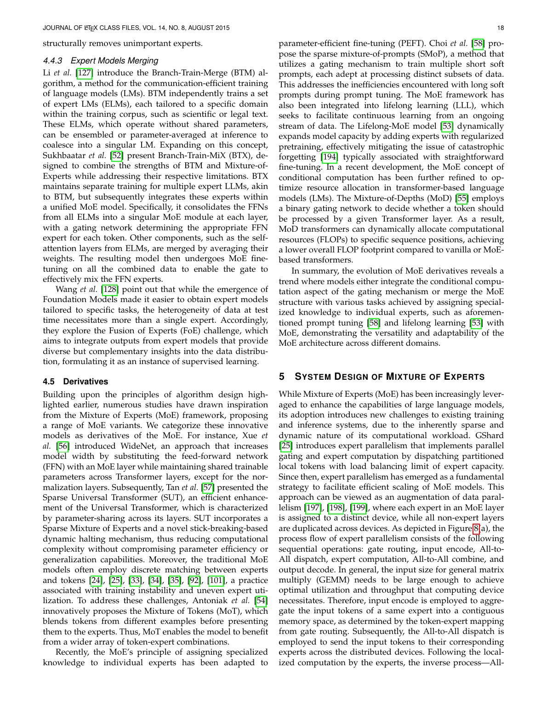

图 8 展示数据加专家并行、数据加专家加张量并行、数据加专家加流水线并行，以及专家加张量并行。表 4 汇总 OpenMoE、ScatterMoE、MegaBlocks、Tutel、SE-MoE、HetuMoE、DeepSpeed-MoE、FastMoE、Fairseq、Mesh-TensorFlow 等开源系统及其计算、通信、存储优化。

### 5.1 计算

专家并行中负载不均会使所有设备等待最忙专家，产生同步开销。算法上可通过门控和专家容量处理；系统上，SE-MoE、Tutel、FlexMoE、SmartMoE 动态放置专家，使设备负载尽量均匀；FasterMoE 把过载专家复制到多台设备作为影子专家。放置策略同时影响计算和通信。

门控路由、输入编码、输出解码也会带来额外计算和内存搬运。这些操作不像稠密模型的专家矩阵乘那样经过 GPU 深度优化，因此 DeepSpeed-MoE、FastMoE、HetuMoE、Tutel 开发专用 GPU 内核。

当一张 GPU 上有多位专家时，MegaBlocks 把 MoE 重写为块稀疏运算，动态负载下无需丢词元。PIT 编译器以置换不变变换把离散微小稀疏块重排成 GPU 高效稠密块，兼顾高利用率与低覆盖浪费。ScatterMoE 则避免初始散射到分组的数据复制，使用 ParallelLinear 直接对散布分组执行矩阵运算，减少显存，并让中间表示保持普通 PyTorch 张量，便于把 MoE 扩展到 FFN 以外的模块。

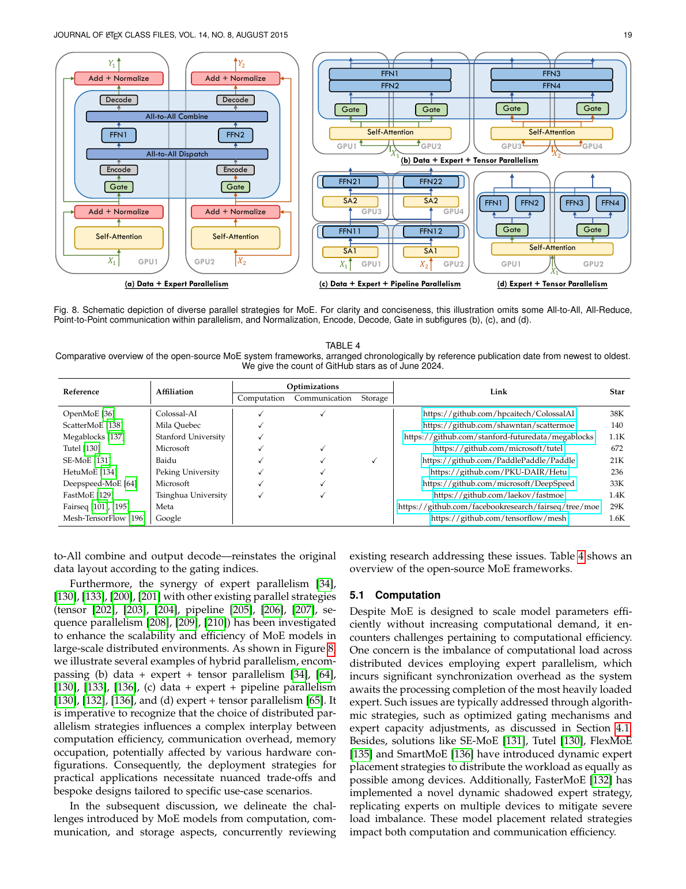

### 5.2 通信

每个 MoE 层前向、反向合计四次全交换通信，可能成为首要瓶颈。通信跨节点内 PCIe/NVLink 和节点间以太网、InfiniBand/NVLink，效率受带宽异构、拓扑、集体算法和负载不均影响。

DeepSpeed-MoE、HetuMoE、ScheMoE 使用层次化全交换，更多利用节点内高带宽并减少节点间交换。FasterMoE、TA-MoE、SE-MoE 使用拓扑感知路由，减少跨节点专家选择。ExFlow 根据跨层专家亲和性提前分配专家，让词元尽量留在本地 GPU。专家与非专家模块的联合放置也用于减少网络流量。

由于通信和计算可并发，常用流水线重叠全交换与专家计算。Tutel、FasterMoE、PipeMoE、MPipeMoE 都采用这类方式；Lancet 指出仅专家计算可重叠的时长有限，于是把非 MoE 计算也切分并加入前向流水线，反向则调度权重梯度计算扩大重叠。另一方案利用 GPU 大规模并行与 GPU 发起通信，把计算和依赖的集体通信融合。ScMoE 通过重构架构打破通信依赖，同时处理前层表示和当前层表示，某些情况下实现完全重叠；Arctic 也采用类似稠密—MoE 混合结构。

### 5.3 存储

MoE 参数持续增大，加剧设备内存容量压力。专家并行虽把专家分散到多设备，单设备在推理时仍可能无法容纳足够专家，边缘设备尤其如此。

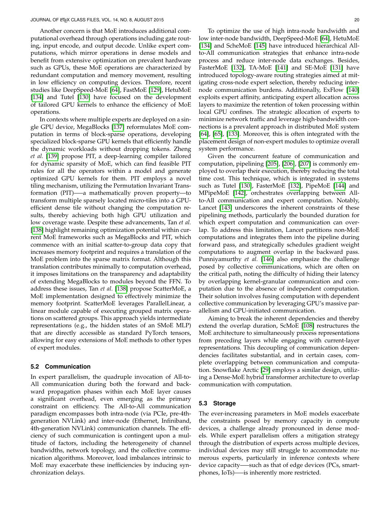

SE-MoE、Pre-gated MoE、EdgeMoE 只把非专家必要参数和已激活专家放在 GPU 高带宽内存，把不活跃专家卸载到 CPU 或 SSD。为掩盖跨层次传输成本，它们预测专家选择并预取参数，使访问与计算重叠。MPipeMoE 则共享不同张量分区的缓冲区，并通过重计算、通信和 CPU 卸载在反向时恢复激活，减少激活与临时缓冲内存。

## 6 混合专家应用

MoE 能在训练和推理计算量不相应增加的条件下显著提高模型容量，已增强多类下游任务，部分应用甚至超过人类。其应用本质是以条件计算在固定成本下增加参数和容量，或通过门控动态选专家，进行高效多任务学习。

### 6.1 自然语言处理

MoE 已用于机器翻译、开放域问答、代码生成、数学解题等 NLU/NLG 任务。除提高能力外，MoGU 还通过动态路由在“可用 LLM”和“安全 LLM”之间平衡，在保持实用性的同时增强安全。

### 6.2 计算机视觉

V-MoE 把稀疏 MLP 专家放进部分 ViT 块，以远少于领先网络的推理计算达到相当图像识别性能，显示专家能区分不同图像语义。Tutel 在 SwinV2-MoE 上验证动态并行与流水线。ADVMOE 提出路由器—专家交替对抗训练，提高 CNN MoE 的对抗鲁棒性。pMoE 把图像切成 $n$ 个补丁，只优先路由其中 $l\ll n$ 个给每位专家，提高效率。

### 6.3 推荐系统

推荐系统需同时平衡多个目标，例如既匹配用户即时偏好，又确保用户对结果后续满意。MMoE 让所有任务共享专家子模型，每个任务使用独立门控。PLE 为解决一个任务改善、另一个退步的“跷跷板”现象，分离共享与任务专属组件，并逐层路由提取语义知识。AdaMCT 用逐层自适应混合单元动态融合 CNN 与 Transformer 专家，捕获序列推荐中的长期和短期偏好。M3oE 设置共享、领域、任务三类专家，并用两级 AutoML 融合精确控制多域多任务特征提取。

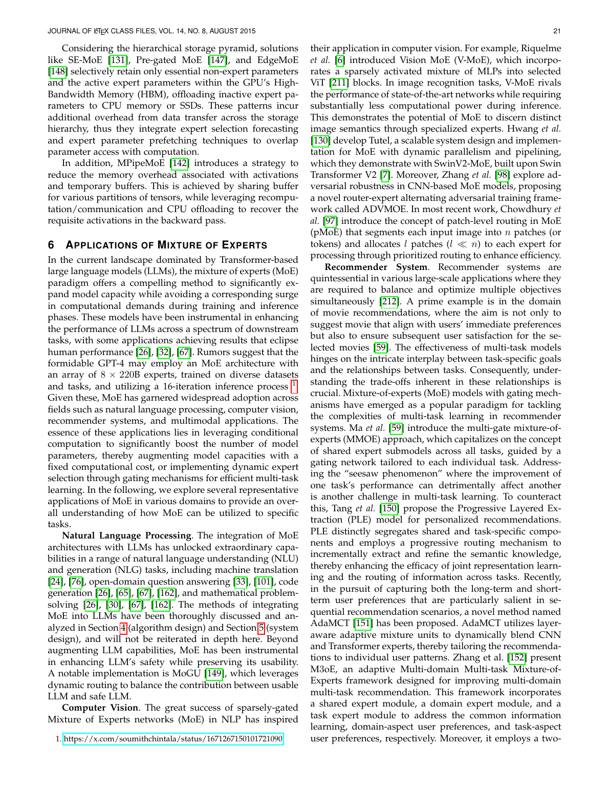

### 6.4 多模态

多模态模型在同一网络处理图像、文本等数据。LIMoE 在图文对比学习中使用稀疏专家，并以熵正则解决负载均衡。后续研究进一步扩展视觉语言模型。MoCLE 把 MoE 与 LoRA 专家及通用专家结合，按指令聚类激活任务参数；LLaVA-MoLE 在 MLP 使用 LoRA 专家与 top-1 门控缓解数据冲突。

多数多模态 MoE 只有少量专家与模态。Uni-MoE 首次统一处理广泛模态，以渐进训练增强跨模态专家协作与泛化，并使用 LoRA 降低计算需求。

## 7 挑战与机遇

### 7.1 训练稳定性与负载均衡

固定 top-k 离散分配难以在不同输入上保持均衡和稳定。专家过载或闲置会妨碍专业化并损害性能。辅助损失能推动均匀分布，却仍可能引发不稳定，并忽视不同词元的重要性。未来需要更有效的正则化或创新门控算法。

### 7.2 可扩展性与通信开销

MoE LLM 扩大需要更大分布式系统，模型复杂度与通信开销之间的权衡成为瓶颈。系统层面应提高信息传输效率，算法层面应精简交换而不损害性能。DeepSpeed、FasterMoE、ScMoE 等以及参数共享/共享专家方向有望减少跨设备数据量并提高模型性能。

### 7.3 专家专业化与协作

专业化要求每位专家形成不重叠、聚焦的知识。共享专家可捕获公共知识，减少动态路由专家冗余；但只对 top-k 输出做稀疏加权求和，可能忽略全部专家间复杂关系。需要新的机制同时增强专业化和协作。

### 7.4 稀疏激活与计算效率

稀疏激活理论上提高效率，但硬件加速器不擅长不规则稀疏操作，实践难以兑现。还要协调从专家池选择 top-k，使每位专家形成自己的知识领域。未来需要更适配稀疏计算的硬件优化。

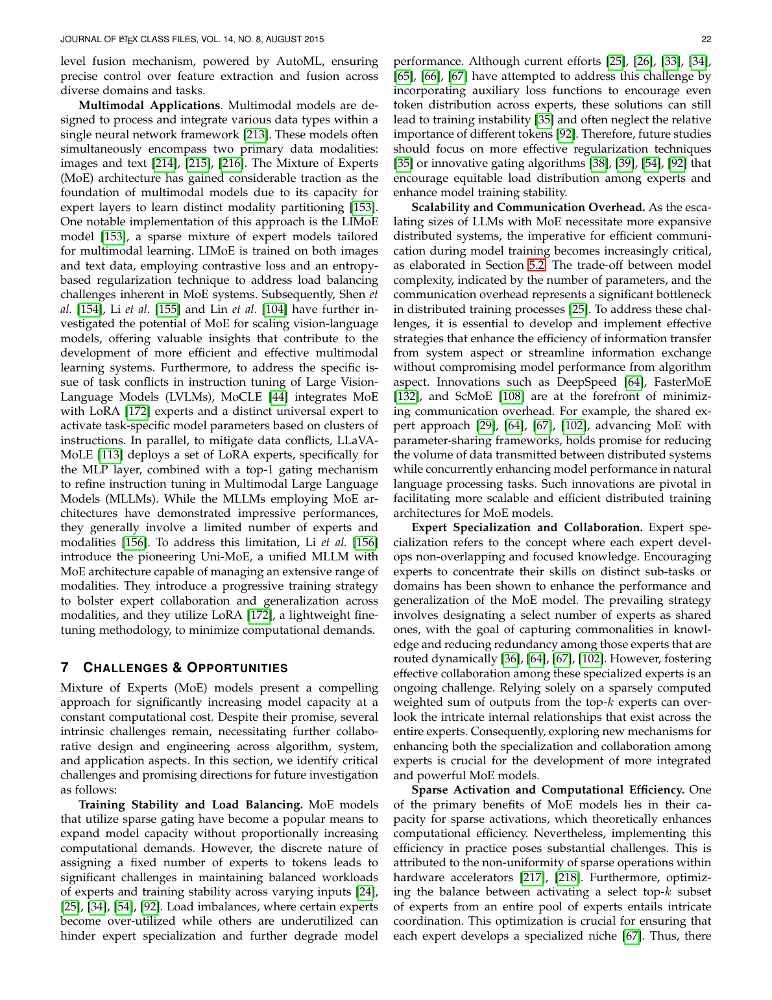

### 7.5 泛化与稳健性

稀疏 MoE 容易过拟合特定任务或数据集，削弱泛化。已有 dropout、词元丢弃和多任务指令调优等方案；未来可探索新正则化、更好的多任务框架或元学习，提高未知数据与输入变化下的稳健性。

### 7.6 可解释性与透明度

动态门控和专家专业化使 MoE 难以解释，但理解决策理由对解决负载均衡和知识冗余同样重要。需要能可视化、解释单个专家行为及专家互动的方法与工具，让门控决策透明可信。

### 7.7 最优专家架构

专家可采用 LSTM、CNN、FFN、注意力、LoRA 等网络，其中 FFN 最普遍。混合不同网络类型和创新专家架构仍处早期。不同层捕获不同粒度语义，专家过多会增加训练和计算成本，过少又会造成知识冗余、削弱专业化。因此需要面向 MoE 的自动架构搜索，在效率与专业化之间寻找最优配置。

### 7.8 与现有框架集成

若能把既有 LLM 无须从零训练地改造成 MoE，可显著节省资源。PEFT 与 MoE 结合已显示效果，但可能损害性能或扰乱既有训练、推理并行策略。未来应开发模块化、即插即用的 MoE 部件，并针对不同计算环境和硬件优化训练与部署。

## 8 结论

本文系统、全面综述 MoE 文献，提出新的分类体系，从算法设计、系统设计、实际应用三个视角深入分析，并整理开源实现、超参数配置与经验评测；同时总结关键挑战和有前景的研究方向。作者建立专门资源仓库，持续更新并分享前沿进展，希望本文成为研究者快速了解 MoE 的重要参考，推动领域持续发展。

## 参考文献

参考文献按原论文完整保留。第 23 页在挑战与结论之后开始列出文献。

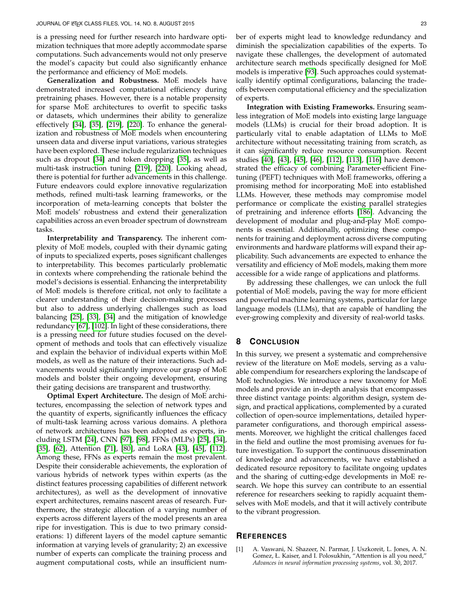

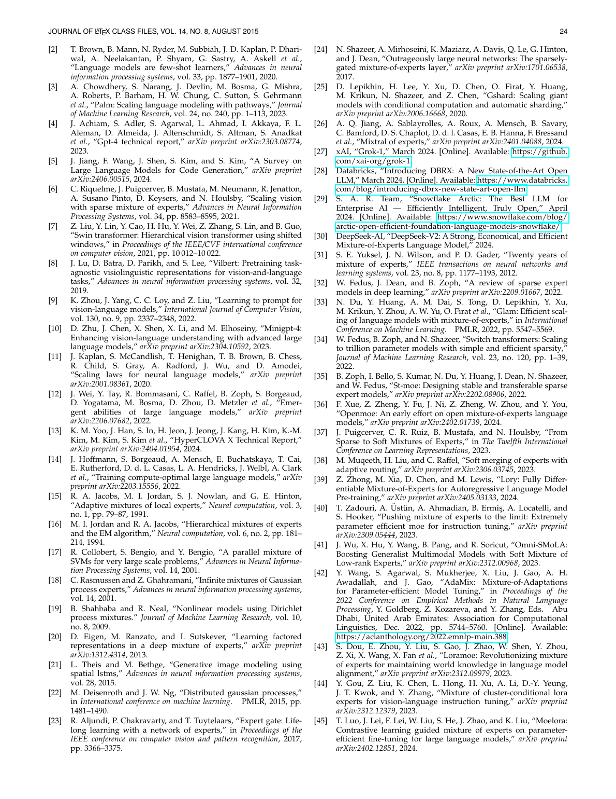

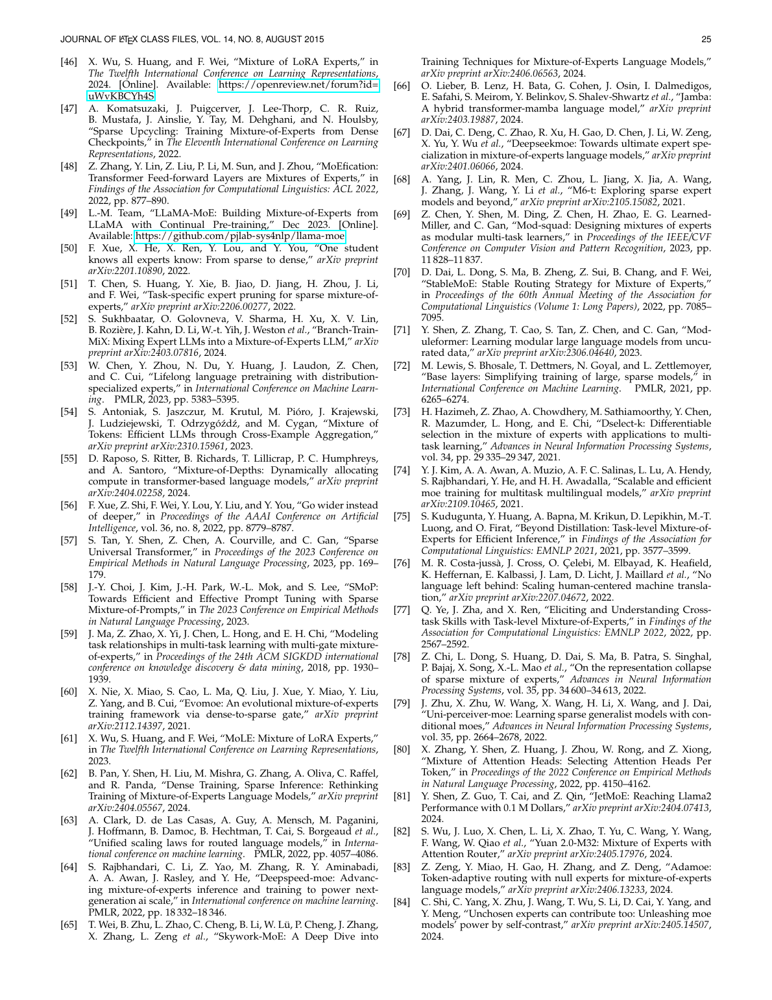

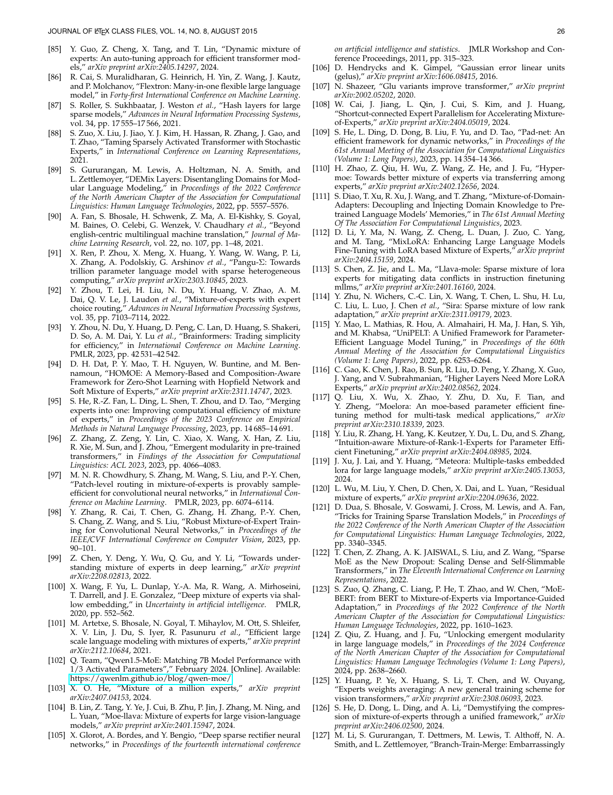

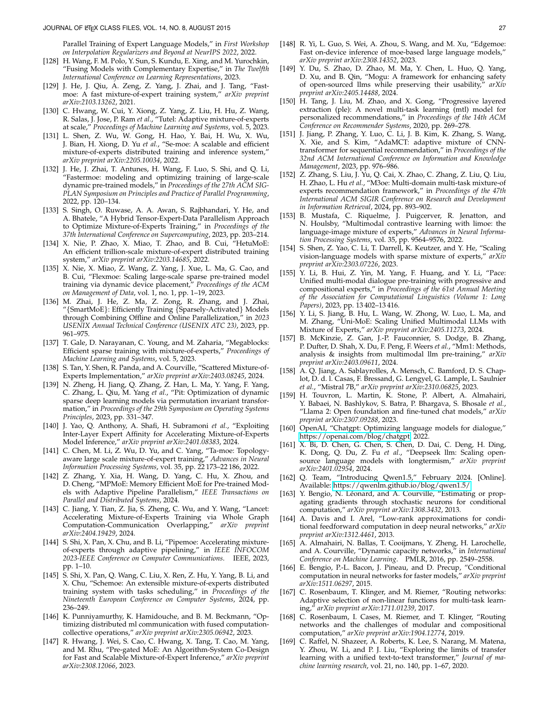

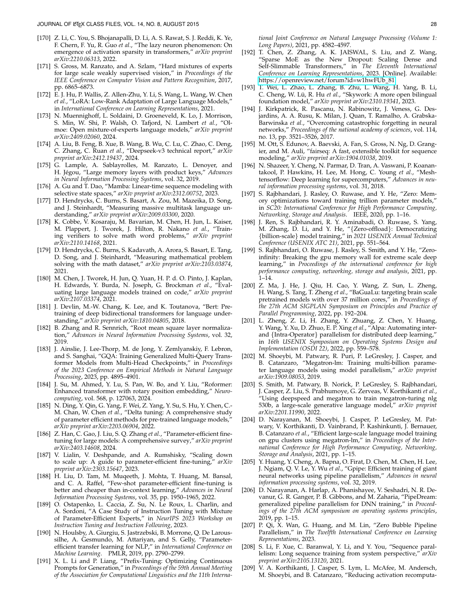

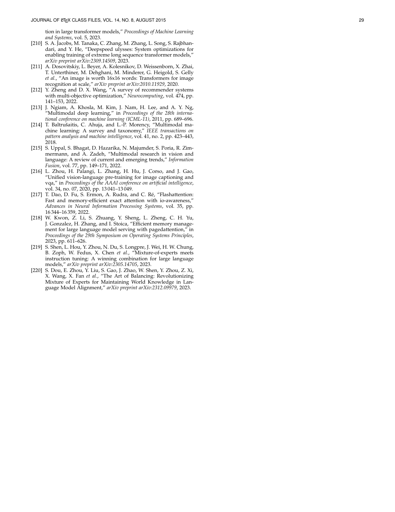
