# 大型语言模型：一篇综述

**作者：** 谢尔文·米纳伊、托马斯·米科洛夫、纳尔杰斯·尼克扎德、梅萨姆·切纳格鲁、理查德·索彻、泽维尔·阿马特里安、剑锋·高

**机构：** 亚马逊、捷克理工大学信息学与机器人学研究所、科隆应用科学大学、Ultimate.ai、You.com、Google、微软研究院

**论文版本：** arXiv:2402.06196v3，2025 年 3 月 23 日

**译文说明：** 本文按论文内容顺序逐段翻译。模型名、数据集名和通行技术缩写保留原写法；图、表及参考文献以原论文整页截图呈现。

## 摘要

自 ChatGPT 于 2022 年 11 月发布以来，大型语言模型（LLM）凭借在广泛自然语言任务上的强劲表现获得了高度关注。正如缩放定律所预测的那样，LLM 通过在海量文本数据上训练数十亿模型参数，获得通用语言理解与生成能力。LLM 研究虽然历史很短，却正在沿许多不同方向快速演进。本文回顾若干最具代表性的 LLM，包括 GPT、LLaMA 和 PaLM 三个流行模型家族，并讨论它们的特征、贡献与局限。我们还概述构建和增强 LLM 的技术，梳理为 LLM 训练、微调与评估准备的常用数据集，回顾广泛使用的评估指标，并在一组代表性基准上比较若干流行 LLM 的表现。最后，本文讨论开放挑战与未来研究方向。

## 1 引言

语言建模是一个历史悠久的研究主题，可以追溯到 20 世纪 50 年代香农把信息论应用于人类语言的工作；他衡量了简单 n 元语法语言模型预测或压缩自然语言文本的能力。此后，统计语言建模成为语音识别、机器翻译和信息检索等众多自然语言理解与生成任务的基础。

近来，基于 Transformer、在网络规模文本语料上预训练的大型语言模型取得进展，显著扩展了语言模型的能力。例如，OpenAI 的 ChatGPT 和 GPT-4 不仅可以处理自然语言，还能充当通用任务求解器，为微软 Copilot 等系统提供能力；它们可以遵循人类对复杂新任务的指令，并在必要时执行多步推理。因此，LLM 正成为开发通用人工智能智能体乃至通用人工智能（AGI）的基本构件。

LLM 领域发展极快，新的发现、模型与技术往往在数月甚至数周内出现。人工智能研究者和实践者常常难以判断，如何为自己的任务构建由 LLM 驱动的人工智能系统才是最佳方案。本文及时综述 LLM 的近期进展，希望为学生、研究者和开发者提供一份有价值且易于使用的资料。

LLM 是基于神经网络的大规模预训练统计语言模型。它近期的成功是数十年语言模型研究与开发积累的结果；这段历程可以分为起点和发展速度各异的四次浪潮：统计语言模型、神经语言模型、预训练语言模型与大型语言模型。

统计语言模型（SLM）把文本视为词序列，并把文本概率估计为各词概率的乘积。占主导地位的 SLM 是称为 n 元语法模型的马尔可夫链模型，它依据某个词之前紧邻的 n−1 个词计算该词概率。词概率由文本语料中的词与 n 元语法计数估计，因此模型必须用平滑方法处理数据稀疏，即为未见过的词或 n 元语法预留一部分概率质量，避免赋予其零概率。n 元语法模型广泛用于许多自然语言处理系统，但由于数据稀疏，它无法完整捕捉自然语言的多样性与变化性。

早期神经语言模型（NLM）把词映射为低维连续向量，即嵌入向量，再利用神经网络聚合前文词的嵌入向量来预测下一个词，从而处理数据稀疏。NLM 学到的嵌入向量定义了一个隐空间，在其中可以直接用向量距离计算语义相似度。这为跨形式乃至跨模态比较任意两个输入的语义相似性打开了道路，例如网络搜索中的查询与文档、机器翻译中不同语言的句子，以及图像描述中的图像与文本。早期 NLM 是面向特定任务的模型：它们在任务特定数据上训练，学到的隐空间也只服务于该任务。

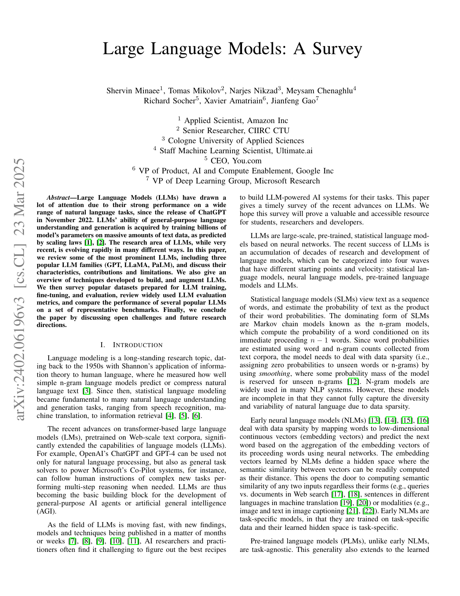

预训练语言模型（PLM）与早期 NLM 不同，它与具体任务无关，其学到的嵌入空间也具有这种通用性。PLM 的训练和推理遵循“预训练—微调”范式：先在网络规模的无标注文本语料上，以词预测等通用任务预训练使用循环神经网络或 Transformer 的语言模型，再用少量带标注的任务特定数据对其进行微调。近期有关 PLM 的综述包括文献 [8]、[27] 和 [28]。

大型语言模型主要指包含数百亿至数千亿参数、在海量文本数据上预训练的 Transformer 神经语言模型，例如 PaLM、LLaMA 和 GPT-4，表 3 对其进行了归纳。与 PLM 相比，LLM 不仅模型规模更大，还表现出更强的语言理解与生成能力；更重要的是，它出现了小规模语言模型所不具备的涌现能力。如图 1 所示，这些能力包括：（1）上下文学习，即 LLM 在推理时从提示中给出的少量示例学习新任务；（2）指令遵循，即经过指令微调后，无须显式示例便能遵循新任务类型的指令；（3）多步推理，即通过思维链提示把复杂任务分解为中间推理步骤并加以解决。还可以用外部知识和工具增强 LLM，使其能够有效地与用户及环境交互，并利用交互过程中收集的反馈数据持续改进自身，例如通过基于人类反馈的强化学习（RLHF）进行改进。

借助先进的使用与增强技术，LLM 可以部署为所谓的人工智能智能体，也就是能够感知环境、作出决策并采取行动的人工实体。以往研究主要为特定任务和领域开发智能体，LLM 展现的涌现能力则使构建通用人工智能智能体成为可能。LLM 本身是在静态环境中训练以生成回答的，而人工智能智能体需要采取行动并与动态环境交互。因此，基于 LLM 的智能体往往必须增强 LLM，例如从外部知识库获取最新信息、验证系统动作是否得到预期结果，以及在事情偏离预期时进行处理。第 4 节将详细讨论基于 LLM 的智能体。

本文其余部分组织如下：第 2 节概述 LLM 的技术现状，重点讨论 GPT、LLaMA 和 PaLM 三个模型家族及其他代表性模型；第 3 节讨论 LLM 的构建方法；第 4 节讨论 LLM 在现实应用中的使用与增强；第 5、6 节回顾评估 LLM 的常用数据集和基准，并汇总已有评估结果；第 7 节总结挑战与未来研究方向。

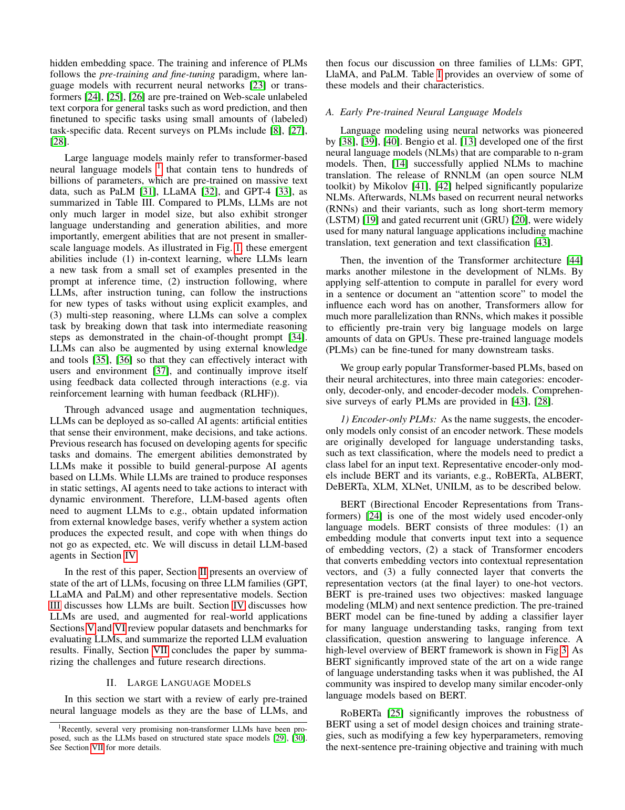

## 2 大型语言模型

本节首先回顾作为 LLM 基础的早期预训练神经语言模型，然后重点讨论 GPT、LLaMA 与 PaLM 三个家族。表 1 概述了部分模型及其特征。

> 注：近来还出现了若干很有前景的非 Transformer LLM，例如基于结构化状态空间模型的 LLM，详见第 7 节。

### 2.1 早期预训练神经语言模型

使用神经网络进行语言建模的先驱工作见文献 [38]、[39]、[40]。Bengio 等人开发了最早一批能与 n 元语法模型相媲美的神经语言模型，随后文献 [14] 成功将其用于机器翻译。Mikolov 发布开源 NLM 工具包 RNNLM，显著推动了 NLM 的普及。此后，基于循环神经网络（RNN）及其变体长短期记忆网络（LSTM）与门控循环单元（GRU）的 NLM，被广泛用于机器翻译、文本生成和文本分类等自然语言应用。

Transformer 架构的发明标志着 NLM 发展的另一个里程碑。Transformer 使用自注意力机制，为句子或文档中的每个词并行计算“注意力分数”，以建模任意词对彼此的影响。它比 RNN 更易并行，因此能够在 GPU 上用大量数据高效预训练非常庞大的语言模型。这些预训练语言模型可以针对多种下游任务进行微调。

按照神经网络架构，本文把早期流行的 Transformer PLM 分成三类：仅编码器模型、仅解码器模型以及编码器—解码器模型。文献 [43] 与 [28] 给出了早期 PLM 的全面综述。

#### 2.1.1 仅编码器 PLM

顾名思义，仅编码器模型只包含编码器网络。它最初面向文本分类等语言理解任务开发；在这类任务中，模型需要为输入文本预测类别标签。代表性模型包括 BERT 及其变体 RoBERTa、ALBERT、DeBERTa、XLM、XLNet 和 UNILM。

BERT（基于 Transformer 的双向编码器表示）是应用最广泛的仅编码器语言模型之一。BERT 包含三个模块：（1）把输入文本转换为嵌入向量序列的嵌入模块；（2）把嵌入向量转换为上下文表示向量的多层 Transformer 编码器；（3）把最后一层表示向量转换为独热向量的全连接层。BERT 使用两个目标进行预训练：掩码语言建模（MLM）和下一句预测。通过增加分类器层，预训练 BERT 可以针对文本分类、问答和语言推断等多种语言理解任务微调。图 3 给出 BERT 框架的高层概览。BERT 发表时显著刷新了广泛语言理解任务的技术水平，启发研究界开发了许多类似的仅编码器模型。

RoBERTa 通过一组模型设计选择与训练策略显著提升 BERT 的稳健性，例如修改若干关键超参数、删除下一句预训练目标，以及使用更大的小批量与学习率进行训练。

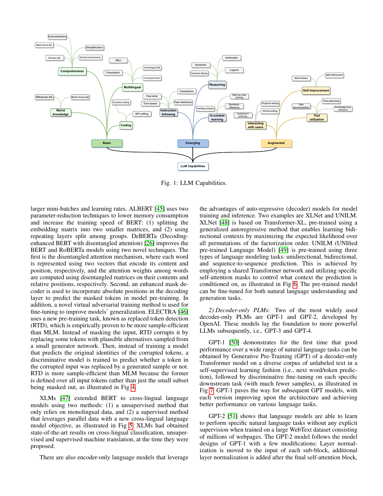

ALBERT 使用两种参数削减技术降低 BERT 的内存消耗并提高训练速度：（1）把嵌入矩阵分解为两个较小矩阵；（2）让分组后的层循环共享参数。DeBERTa，即采用解耦注意力的增强解码 BERT，以两项新技术改进 BERT 与 RoBERTa。第一项是解耦注意力机制：每个词分别用内容向量和位置向量表示，词间注意力权重分别依据内容与相对位置的解耦矩阵计算。第二项是在解码层使用增强掩码解码器，引入绝对位置信息来预测预训练阶段被遮蔽的词元。此外，它在微调中使用一种新的虚拟对抗训练方法，以提高模型泛化能力。

ELECTRA 使用名为替换词元检测（RTD）的新预训练任务，实验证明其样本效率高于 MLM。RTD 不遮蔽输入，而是用小型生成器网络采样出的可信替代项破坏部分词元；随后，它不再训练模型恢复被破坏词元的原始身份，而是训练判别模型判断输入中的每个词元是否被生成样本替换。RTD 比 MLM 更节省样本，因为前者在所有输入词元上定义目标，而后者只使用被遮蔽的一小部分词元，如图 4 所示。

XLM 通过两种方法把 BERT 扩展为跨语言模型：（1）只依赖单语数据的无监督方法；（2）使用平行数据和新跨语言建模目标的监督方法，如图 5 所示。XLM 提出时在跨语言分类、无监督机器翻译和有监督机器翻译上取得了领先结果。

还有一些仅编码器语言模型兼取自回归解码器在训练和推理方面的优势，XLNet 与 UNILM 是两个例子。XLNet 基于 Transformer-XL，通过广义自回归方法预训练；该方法最大化对分解顺序所有排列的期望似然，因此能够学习双向上下文。UNILM，即统一预训练语言模型，使用三类语言建模任务预训练：单向、双向与序列到序列预测。它共享同一个 Transformer 网络，并利用特定自注意力掩码控制预测所能依赖的上下文，如图 6 所示。预训练模型既可针对自然语言理解任务微调，也可针对生成任务微调。

#### 2.1.2 仅解码器 PLM

应用最广泛的两个仅解码器 PLM 是 OpenAI 开发的 GPT-1 和 GPT-2。它们为之后更强大的 GPT-3 与 GPT-4 奠定了基础。

GPT-1 首次证明：先以自监督方式在多样化无标注文本语料上对仅解码器 Transformer 进行生成式预训练，即预测下一个词或词元，再用少得多的样本对每个下游任务分别进行判别式微调，可以在广泛自然语言任务上取得良好表现，如图 7 所示。GPT-1 为后续 GPT 模型铺平了道路；每一代都在架构基础上改进，并在多种语言任务上获得更好表现。

GPT-2 表明，在包含数百万网页的大规模 WebText 数据集上训练后，语言模型无须任何显式监督便能学会完成特定自然语言任务。GPT-2 延续 GPT-1 的模型设计并作出若干修改：把层归一化移至每个子块的输入端，在最终自注意力块之后增加层归一化，修改初始化以适应残差路径上的累积，并缩放残差层权重；词表扩大至 50,257，支持的上下文长度由 512 增至 1,024 个词元。

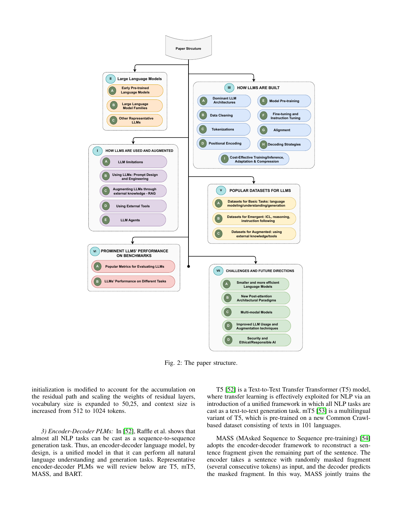

#### 2.1.3 编码器—解码器 PLM

Raffel 等人指出，几乎所有自然语言处理任务都可以表述为序列到序列生成任务。因此，编码器—解码器语言模型在设计上就是一种统一模型，可以执行所有自然语言理解与生成任务。本文讨论的代表性模型包括 T5、mT5、MASS 与 BART。

T5 是“文本到文本迁移 Transformer”模型，它引入一个统一框架，把所有自然语言处理任务都表示成文本到文本生成任务，从而有效利用迁移学习。mT5 是 T5 的多语言版本，在一个新的 Common Crawl 数据集上预训练，该数据集包含 101 种语言。

MASS，即“掩码序列到序列预训练”，采用编码器—解码器框架，根据句子的剩余部分重建其中一个片段。编码器接收一个随机遮蔽连续片段的句子，解码器预测被遮蔽片段。这样，MASS 就能分别为语言嵌入与生成联合训练编码器和解码器。

BART 使用标准序列到序列翻译模型架构。它先用任意噪声函数破坏文本，再学习重建原始文本。

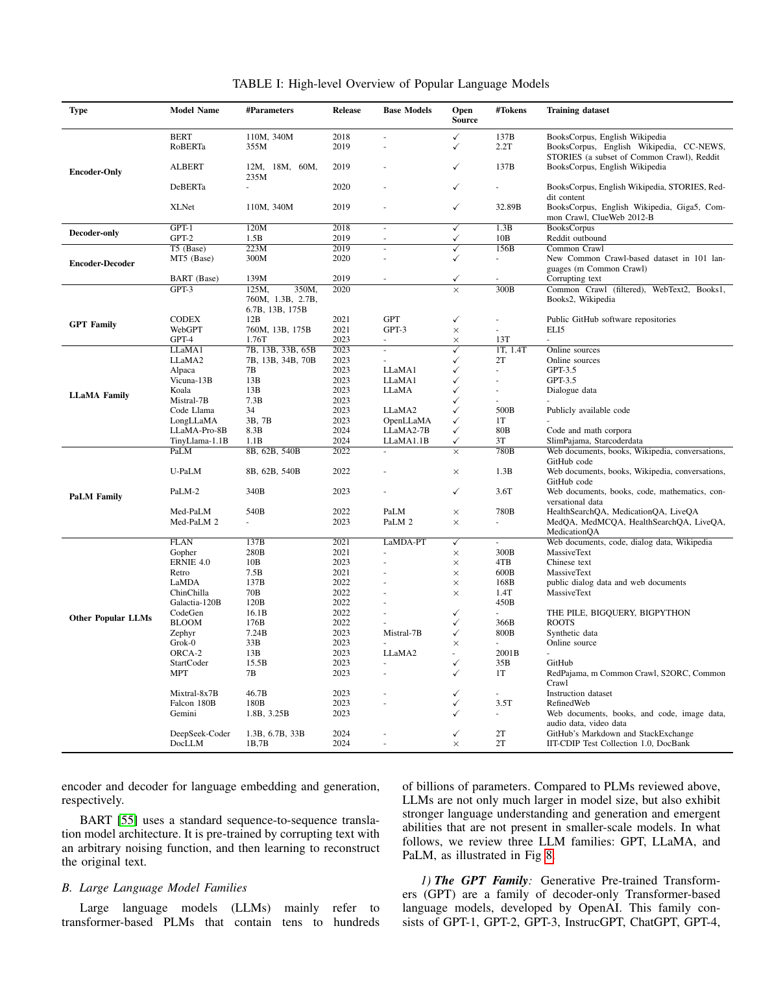

### 2.2 大型语言模型家族

大型语言模型主要指包含数百亿至数千亿参数的 Transformer PLM。它们不仅比前述 PLM 大得多，还具有更强的语言理解与生成能力，并出现小模型不具备的涌现能力。下面回顾图 8 所示的 GPT、LLaMA 与 PaLM 三个 LLM 家族。

#### 2.2.1 GPT 家族

生成式预训练 Transformer（GPT）是 OpenAI 开发的一系列仅解码器 Transformer 语言模型，包括 GPT-1、GPT-2、GPT-3、InstructGPT、ChatGPT、GPT-4、Codex 与 WebGPT。GPT-1、GPT-2 等早期模型开源，而 GPT-3、GPT-4 等近期模型闭源，只能通过 API 使用。前文已经介绍 GPT-1 与 GPT-2，下面从 GPT-3 开始。

GPT-3 是拥有 1,750 亿参数的预训练自回归语言模型。它通常被视为第一个 LLM，不仅因为规模远超以往 PLM，还因为它首次展示了此前较小 PLM 中未观察到的涌现能力。GPT-3 展现了上下文学习能力：无须梯度更新或微调，只通过与模型的文本交互说明任务并给出少样本示例，就能应用于任意下游任务。GPT-3 在翻译、问答和完形填空等多项自然语言处理任务上表现强劲，还能完成需要即时推理或领域适应的任务，例如重新排列被打乱的字母、在句子中使用一个新词以及三位数算术。图 9 展示了 GPT-3 的表现如何随上下文提示中的示例数量变化。

OpenAI 于 2021 年发布的 Codex 是一种通用编程模型，可以解析自然语言并据此生成代码。Codex 源自 GPT-3，在从 GitHub 收集的代码语料上针对编程应用进行微调，并为微软 GitHub Copilot 提供支持。

WebGPT 是 GPT-3 的另一个后继模型，经微调后可以利用文本式网络浏览器回答开放式问题，帮助用户搜索和浏览网络。其训练分三步进行：首先使用人类演示数据学习模仿人类浏览行为；然后学习一个预测人类偏好的奖励函数；最后通过强化学习与拒绝采样优化该奖励函数。

为了使 LLM 遵循人类期望的指令，InstructGPT 通过人类反馈进行微调，让语言模型在广泛任务上与用户意图对齐。研究者先收集标注者编写的提示以及通过 OpenAI API 提交的提示，再收集由标注者演示的期望模型行为，并用这个数据集微调 GPT-3。随后又收集人类对模型输出的排序数据，通过强化学习进一步微调模型。这一方法称为基于人类反馈的强化学习（RLHF），如图 10 所示。所得 InstructGPT 在尽量不损害公共自然语言处理数据集表现的同时，提高了真实性并减少了有害输出。

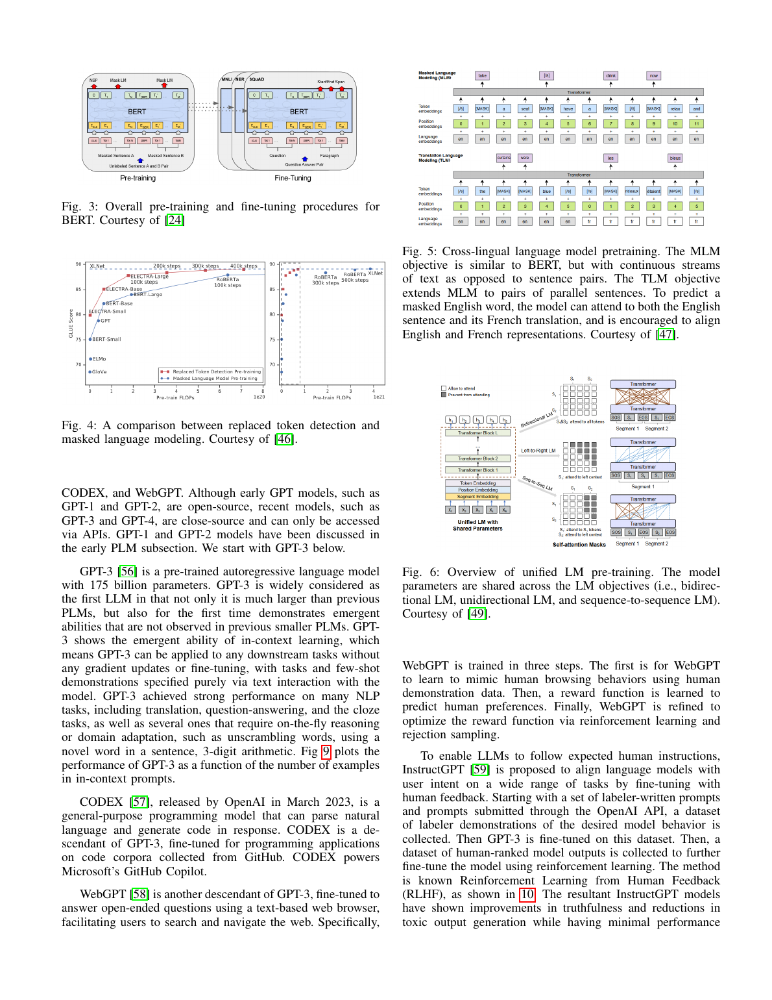

LLM 发展中最重要的里程碑是 ChatGPT（聊天式生成预训练 Transformer）于 2022 年 11 月 30 日发布。ChatGPT 是一个聊天机器人，用户可以引导对话来完成问答、信息检索、文本摘要等广泛任务。它由 GPT-3.5、后来又由 GPT-4 驱动；GPT-3.5 是 InstructGPT 的姊妹模型，经过训练后可以遵循提示中的指令并提供详细回答。

GPT-4 是 GPT 家族中最新且最强大的 LLM。它于 2023 年 3 月发布，是一个多模态 LLM，可以接收图像和文本输入并生成文本输出。尽管在一些最具挑战的现实场景中仍不及人类，GPT-4 在多项专业与学术基准上已达到人类水平，包括在模拟律师资格考试中取得约位列考生前 10% 的成绩，如图 11 所示。与早期 GPT 一样，GPT-4 先在大规模文本语料上预训练以预测后续词元，再通过 RLHF 微调，使模型行为与人类期望保持一致。

#### 2.2.2 LLaMA 家族

LLaMA 是 Meta 发布的一组基础语言模型。与 GPT 模型不同，LLaMA 的模型权重以非商业许可向研究界发布。因此，LLaMA 家族发展很快：许多研究团队广泛使用它来开发能够与闭源模型竞争的更强开源 LLM，或为关键任务应用开发专用 LLM。

第一批 LLaMA 模型于 2023 年 2 月发布，参数规模从 70 亿到 650 亿不等，并在由公开数据集收集的数万亿词元上预训练。LLaMA 采用 GPT-3 的 Transformer 架构，但作出三项小调整：（1）用 SwiGLU 激活函数代替 ReLU；（2）用旋转位置嵌入代替绝对位置嵌入；（3）用均方根层归一化代替标准层归一化。开源 LLaMA-13B 在多数基准上优于专有 GPT-3（175B），因而成为 LLM 研究的良好基线。

2023 年 7 月，Meta 与微软合作发布 LLaMA-2 系列，其中既有基础语言模型，也有针对对话微调的聊天模型 LLaMA-2 Chat。据报告，LLaMA-2 Chat 在许多公共基准上优于其他开源模型。图 12 展示其训练流程：先用公开在线数据预训练 LLaMA-2，再通过监督微调建立初始 LLaMA-2 Chat；随后结合 RLHF、拒绝采样和近端策略优化迭代改进模型。在 RLHF 阶段，累积人类反馈来修订奖励模型十分关键，可防止奖励模型变化过大而损害 LLaMA 训练稳定性。

Alpaca 在 LLaMA-7B 上微调，使用 GPT-3.5（text-davinci-003）按 Self-Instruct 风格生成的 5.2 万条指令遵循演示。它的训练成本很低，尤其适合学术研究。在 Self-Instruct 评估集上，Alpaca 虽小得多，表现却与 GPT-3.5 相近。

Vicuna 团队利用 ShareGPT 收集的用户共享对话微调 LLaMA，开发了 130 亿参数聊天模型 Vicuna-13B。以 GPT-4 作为评估者的初步结果显示，Vicuna-13B 的回答质量达到 OpenAI ChatGPT 和 Google Bard 的 90% 以上，并在超过 90% 的案例中优于 LLaMA 与 Stanford Alpaca 等模型。图 13 给出了 GPT-4 评估的 Vicuna 与若干知名模型的相对回答质量。Vicuna-13B 的另一项优势是训练计算需求较低，成本仅约 300 美元。

Guanaco 与 Alpaca、Vicuna 一样，也是使用指令遵循数据微调的 LLaMA，但它利用 QLoRA 极高效地完成微调，一块 48GB GPU 即可微调 650 亿参数模型。QLoRA 让梯度穿过冻结的四比特量化预训练语言模型，传入低秩适配器（LoRA）。最佳 Guanaco 模型在 Vicuna 基准上超过此前所有已发布模型，只用一块 GPU 微调 24 小时便达到 ChatGPT 表现的 99.3%。

Koala 同样是建立在 LLaMA 上的指令遵循模型，但特别关注交互数据，包括用户输入以及 ChatGPT 等强大闭源聊天模型生成的回答。根据基于真实用户提示的人类评估，Koala-13B 可与当时最先进的聊天模型竞争。

Mistral-7B 是一个为高性能和高效率设计的 73 亿参数语言模型。它在所有已评估基准上优于最佳开源 130 亿参数模型 LLaMA-2-13B，并在推理、数学和代码生成方面超过最佳开源 340 亿参数模型 LLaMA-34B。它利用分组查询注意力提高推理速度，并结合滑动窗口注意力，以较低推理成本有效处理任意长度序列。

LLaMA 家族仍在迅速扩展。更多指令遵循模型建立在 LLaMA 或 LLaMA-2 上，包括 Code LLaMA、Gorilla、Giraffe、Vigogne、Tulu 65B、Long LLaMA 与 Stable Beluga2 等。

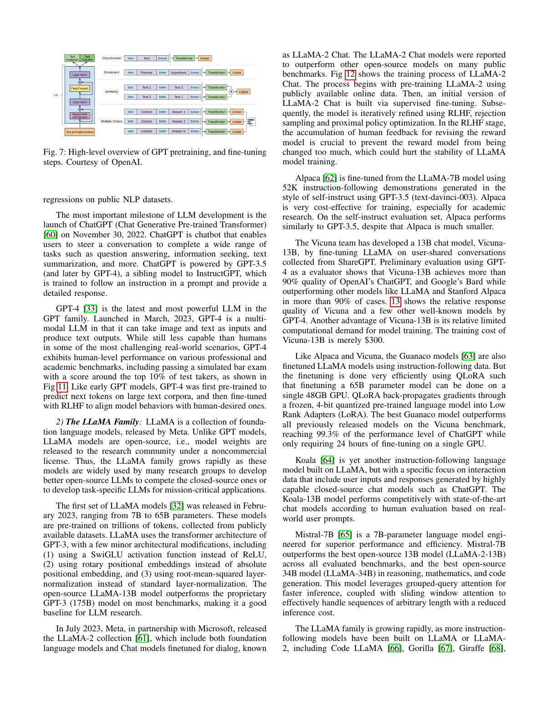

#### 2.2.3 PaLM 家族

PaLM，即 Pathways 语言模型家族，由 Google 开发。首个 PaLM 于 2022 年 4 月公布，直到 2023 年 3 月仍未公开。它是一个基于 Transformer、拥有 5,400 亿参数的 LLM，在包含 7,800 亿词元的高质量文本语料上预训练，覆盖广泛自然语言任务与用例。PaLM 使用 Pathways 系统在 6,144 块 TPU v4 芯片上预训练，该系统能跨多个 TPU Pod 高效训练。PaLM 在数百项语言理解与生成基准上取得领先的少样本学习结果，证明扩大规模仍能持续带来收益。PaLM-540B 不仅在一组多步推理任务上超过当时最先进的微调模型，在新发布的 BIG-bench 基准上也达到与人类相当的水平。

U-PaLM 包含 80 亿、620 亿和 5,400 亿参数版本。它从 PaLM 出发，以 UL2 的混合去噪目标继续训练少量步数，这种方法称为 UL2R；据报告，它可以节省约一半计算量。

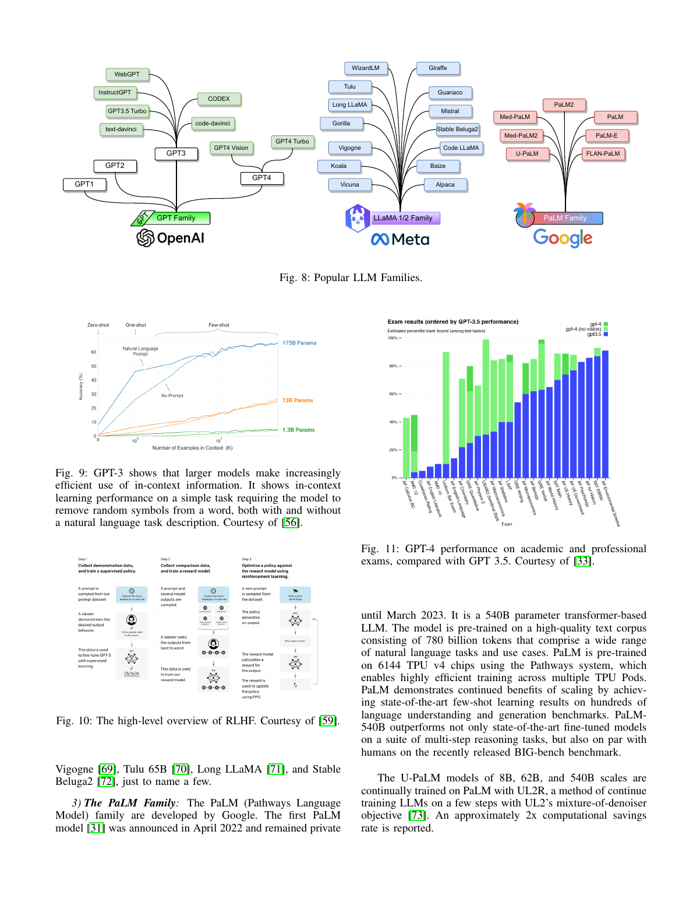

U-PaLM 后来又通过指令微调成为 Flan-PaLM。与前述指令微调工作相比，Flan-PaLM 使用的任务数量更多、模型规模更大，并加入思维链数据。因此，Flan-PaLM 显著优于此前的指令遵循模型。例如，在 1,800 个任务上指令微调的 Flan-PaLM-540B，平均比 PaLM-540B 高 9.4 个百分点。其微调数据包含 473 个数据集、146 个任务类别和 1,836 个任务，如图 14 所示。

PaLM-2 比前代 PaLM 更节省计算，并具有更强的多语言与推理能力。它使用多种目标的混合方案训练。对英语、多语言和推理任务的大量评估表明，PaLM-2 在不同模型规模上都显著改善下游任务表现，同时推理速度更快、效率更高。

Med-PaLM 是面向特定领域的 PaLM，旨在为医学问题提供高质量回答。它使用指令提示微调方法在 PaLM 上训练；这种参数高效方法只需少量示例便能使 LLM 与新领域对齐。Med-PaLM 在许多医疗任务上取得十分可喜的结果，但仍不及人类临床医生。Med-PaLM 2 通过医学领域微调与集成提示进一步改进 Med-PaLM。它在 MedQA 数据集上的得分最高达到 86.5%；该基准合并六个现有开放问答数据集，覆盖专业医学考试、研究问题和消费者查询。这个成绩比 Med-PaLM 提高 19 个百分点以上，创造了新的领先结果。

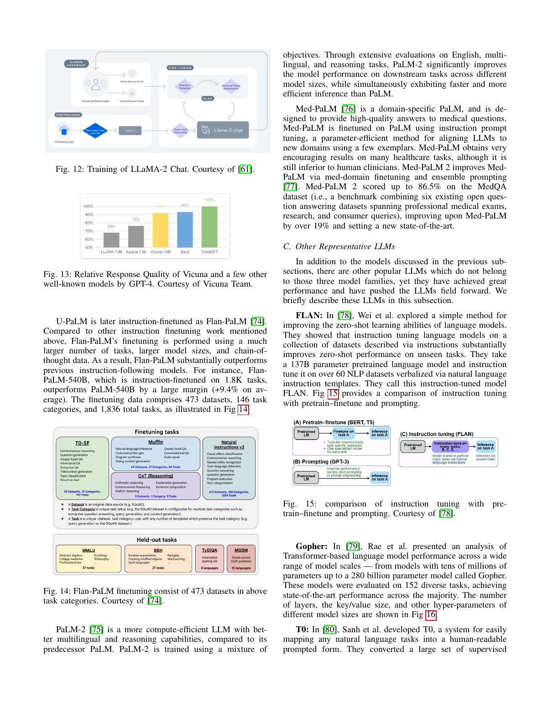

### 2.3 其他代表性大型语言模型

除上述模型外，还有许多不属于三大家族的流行 LLM。它们同样表现出色，并推动了领域进步，本节作简要介绍。

**FLAN。** Wei 等人探索了一种改善语言模型零样本学习能力的简单方法。他们证明，在用自然语言指令描述的一组数据集上进行指令微调，可以显著提高模型在未见任务上的零样本表现。他们选用一个 1,370 亿参数预训练语言模型，在 60 多个以自然语言指令模板表述的自然语言处理数据集上进行指令微调，并把所得模型称为 FLAN。图 15 比较了指令微调、“预训练—微调”与提示三种范式。

**Gopher。** Rae 等人分析了 Transformer 语言模型在广泛规模下的表现，模型从数千万参数一直延伸到名为 Gopher 的 2,800 亿参数模型。他们在 152 项不同任务上评估这些模型，并在其中多数任务上取得当时最佳结果。图 16 给出不同规模模型的层数、键/值维度和其他超参数。

**T0。** Sanh 等人开发 T0 系统，可轻松把任意自然语言任务映射为人类可读的提示形式。他们把大量监督数据集分别配上多个措辞不同的提示，使之可以用于检验模型执行完全留出任务的能力。随后，他们开发一个编码器—解码器 T0 模型，接收文本输入并生成目标回答；模型在按不同任务划分的自然语言处理数据集多任务混合数据上训练。

**ERNIE 3.0。** Sun 等人提出统一框架 ERNIE 3.0，用于预训练大规模知识增强模型。它融合自回归网络与自编码网络，使训练后的模型可以通过零样本、少样本或微调方式，轻松适配自然语言理解与生成任务。研究者在由纯文本和大规模知识图谱组成的 4TB 语料上训练了 100 亿参数 ERNIE 3.0，模型架构见图 17。

**RETRO。** Borgeaud 等人通过从大型语料库检索与前文词元局部相似的文档块，并以这些文档块为条件，增强自回归语言模型。尽管参数少 25%，使用 2 万亿词元数据库的检索增强 Transformer（RETRO）在 The Pile 上取得了与 GPT-3 和 Jurassic-1 相当的表现。如图 18 所示，RETRO 结合冻结的 BERT 检索器、可微编码器与分块交叉注意力机制，使词元预测能够利用比通常训练消耗量高一个数量级的数据。

**GLaM。** Du 等人提出通才语言模型 GLaM 家族，以稀疏激活的专家混合架构扩展模型容量，相比稠密模型显著降低训练成本。最大的 GLaM 拥有 1.2 万亿参数，约为 GPT-3 的七倍；训练能耗仅为 GPT-3 的三分之一，推理浮点运算量仅为其一半，却在 29 项自然语言处理任务上取得更好的总体零样本、单样本和少样本表现。图 19 展示 GLaM 的高层架构。

**LaMDA。** Thoppilan 等人提出专用于对话的 Transformer 神经语言模型家族 LaMDA，规模最大为 1,370 亿参数，在 1.56 万亿词的公共对话与网络文本上预训练。他们证明，使用带标注数据微调并允许模型查阅外部知识源，可以在安全性与事实依据这两项关键挑战上获得显著改善。

**OPT。** Zhang 等人提出开放预训练 Transformer（OPT），这是一组向研究者开放的仅解码器预训练 Transformer，参数规模从 1.25 亿到 1,750 亿不等，图 20 给出了不同版本的架构参数。

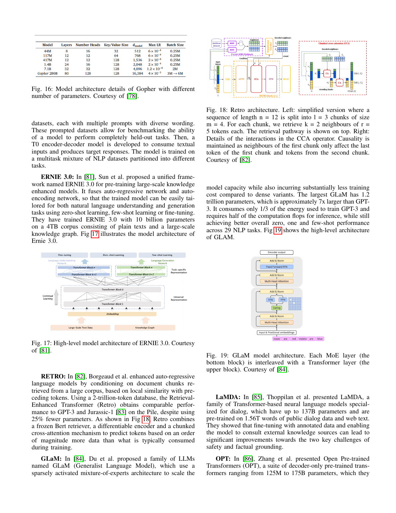

**Chinchilla。** Hoffmann 等人研究了给定计算预算下训练 Transformer 语言模型的最优模型规模和词元数量。他们训练了 400 多个语言模型，参数从 7,000 万到 160 多亿不等，训练词元从 50 亿到 5,000 亿不等，由此发现：计算最优训练需要等比例扩展模型规模与训练词元数；模型规模每翻一倍，训练词元数也应翻一倍。他们用与 Gopher 相同的计算预算训练预测为计算最优的 Chinchilla：模型有 700 亿参数，使用的数据比 Gopher 多约四倍。

**Galactica。** Taylor 等人提出可存储、组合并推理科学知识的大型语言模型 Galactica。它在由论文、参考资料、知识库和其他来源构成的大型科学语料上训练，在推理任务上表现优异：数学 MMLU 得分 41.3%，高于 Chinchilla 的 35.7%；MATH 得分 20.4%，也高于 PaLM-540B 的 8.8%。

**CodeGen。** Nijkamp 等人在自然语言与编程语言数据上训练并发布最高 161 亿参数的 CODEGEN 模型家族，同时开源训练库 JAXFORMER。在 HumanEval 的零样本 Python 代码生成上，该模型能与此前最佳方法竞争。他们进一步研究程序合成的多步范式，把一个程序分解为多个说明子问题的提示，并构建了开放的多轮编程基准 MTPB，其中 115 组不同问题均被分解为多轮提示。

**AlexaTM。** Soltan 等人证明，以去噪和因果语言建模任务混合预训练的多语言大规模序列到序列模型，在多项任务上是比仅解码器模型更高效的少样本学习器。他们训练了一个名为 Alexa 教师模型（AlexaTM 20B）的 200 亿参数多语言序列到序列模型；它在单样本摘要任务上取得领先表现，超过规模大得多的 5,400 亿参数 PaLM 解码器。AlexaTM 包含 46 个编码器层、32 个解码器层、32 个注意力头，模型维度为 4,096。

**Sparrow。** Glaese 等人提出信息检索型对话智能体 Sparrow。与仅使用提示的语言模型基线相比，它经过训练后更有帮助、更正确且更无害。研究者使用人类反馈强化学习训练模型，并增加两项机制帮助人类评分者判断智能体行为。图 21 展示 Sparrow 的高层流程。

**Minerva。** Lewkowycz 等人提出 Minerva：先在通用自然语言数据上预训练，再在技术内容上继续训练，以解决以往 LLM 在定量推理方面的困难，例如数学、科学与工程问题求解。

**MoD 与 UL2。** Tay 等人提出自然语言处理自监督学习的广义统一视角，说明不同预训练目标如何彼此转化，以及在不同目标间插值为何有效。他们提出混合去噪器（MoD）预训练目标，把多种预训练范式结合起来，整体框架称为统一语言学习（UL2），图 22 给出其预训练范式。

**BLOOM。** Scao 等人介绍由数百名研究者协作设计和构建的开放访问语言模型 BLOOM，参数量为 1,760 亿。BLOOM 是仅解码器 Transformer，在 ROOTS 语料上训练；该语料汇集数百个来源，覆盖 46 种自然语言与 13 种编程语言，共 59 种语言。图 23 概述 BLOOM 架构。

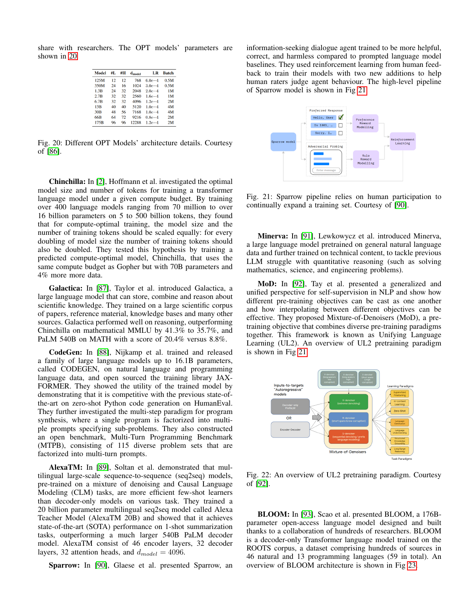

**GLM。** Zeng 等人提出英汉双语预训练语言模型 GLM-130B，拥有 1,300 亿参数。该工作试图开源一个至少可与 GPT-3（davinci）相当的千亿级模型，并揭示如何成功预训练这种规模的模型。

**Pythia。** Biderman 等人提出 Pythia：16 个完全按照相同公开数据顺序训练的 LLM，规模从 7,000 万到 120 亿参数不等。每个模型均公开 154 个检查点，并提供下载和精确重建训练数据加载器的工具，供进一步研究。

**Orca。** Mukherjee 等人开发 130 亿参数模型 Orca，使其学习模仿大型基础模型的推理过程。Orca 从 GPT-4 的丰富信号中学习，包括解释轨迹、逐步思考过程和其他复杂指令，并由 ChatGPT 提供教师辅助。

**StarCoder。** Li 等人提出 StarCoder 与 StarCoderBase，两者均有 155 亿参数、8K 上下文长度和填充能力，并通过多查询注意力实现快速大批量推理。StarCoderBase 在来自 The Stack 的一万亿词元上训练；The Stack 是一个大型 GitHub 宽松许可代码库集合，配有检查工具和退出机制。研究者在 350 亿个 Python 词元上微调 StarCoderBase，得到 StarCoder。他们进行了当时最全面的代码 LLM 评估，证明 StarCoderBase 优于所有支持多种编程语言的开放代码 LLM，并达到或超过 OpenAI code-cushman-001。

**KOSMOS。** Huang 等人提出多模态大型语言模型 KOSMOS-1，它能够感知通用模态、进行上下文学习即少样本学习，并遵循指令即零样本学习。模型从头开始在网络规模多模态语料上训练，包括任意交错的文本与图像、图像—描述对以及文本数据。实验显示，KOSMOS-1 在三方面表现突出：（1）语言理解、生成乃至免 OCR 的自然语言处理，即直接输入文档图像；（2）多模态对话、图像描述和视觉问答等感知—语言任务；（3）带描述的图像识别等视觉任务，即通过文本指令指定分类。

**Gemini。** Gemini 团队提出一个新的多模态模型家族，在图像、音频、视频与文本理解上展现出可喜能力。家族包含三个版本：面向高度复杂任务的 Ultra、兼顾增强性能与规模化部署的 Pro，以及面向端侧应用的 Nano。Gemini 架构建立在 Transformer 解码器之上，并通过高效注意力机制支持 32K 上下文长度。

用于高效开发 LLM 的其他流行框架或技术还包括 Inner-Monologue、Megatron-Turing NLG、LongFormer、OPT-IML、MeTaLM、Dromedary、Palmyra、Camel、Yalm、MPT、ORCA-2、Gorilla、PAL、Claude、CodeGen 2、Zephyr、Grok、Qwen、Mamba、Mixtral-8x7B、DocLLM、DeepSeek-Coder、FuseLLM-7B、TinyLlama-1.1B 与 LLaMA-Pro-8B。

图 24 按时间展示若干最具代表性的 LLM 框架，以及促成 LLM 成功并推动其能力边界的相关工作。

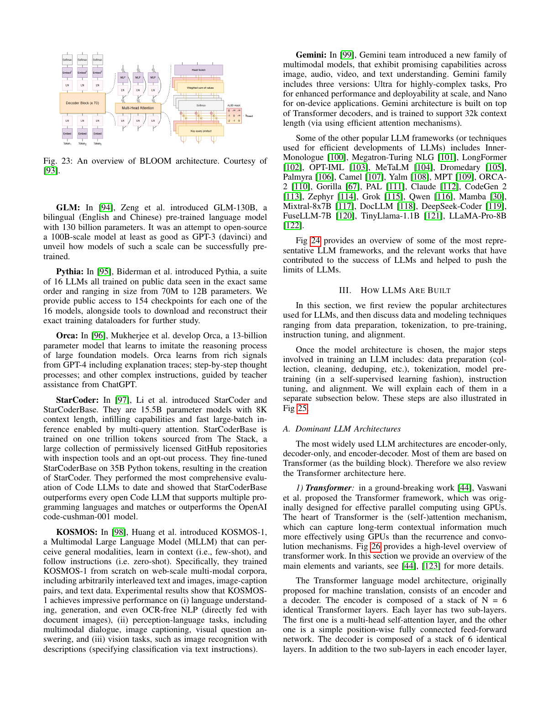

## 3 大型语言模型如何构建

本节先回顾常用 LLM 架构，再讨论从数据准备、词元化、预训练到指令微调与对齐的数据和建模技术。

选定模型架构后，训练 LLM 的主要步骤包括：数据准备，如收集、清洗与去重；词元化；以自监督方式进行模型预训练；指令微调；以及对齐。下文分别介绍，整体流程见图 25。

### 3.1 主流大型语言模型架构

应用最广泛的 LLM 架构是仅编码器、仅解码器和编码器—解码器，且大多以 Transformer 为基本构件，因此这里也回顾 Transformer 架构。

#### 3.1.1 Transformer

Vaswani 等人在开创性工作中提出 Transformer 框架，最初目标是利用 GPU 实现高效并行计算。Transformer 的核心是自注意力机制；与循环和卷积机制相比，它更能借助 GPU 捕捉长期上下文信息。图 26 给出 Transformer 的高层概览，本节概述其主要元素与变体，更多细节见文献 [44]、[123]。

最初为机器翻译提出的 Transformer 语言模型由编码器和解码器构成。编码器包含 N=6 个相同 Transformer 层，每层有两个子层：多头自注意力层和按位置独立工作的简单全连接前馈网络。解码器也包含六个相同层；除编码器层已有的两个子层外，每层还增加第三个子层，对编码器堆栈输出执行多头注意力。

注意力函数可以理解为把一个查询与一组键—值对映射为输出，其中查询、键、值与输出都是向量。输出是值的加权和，每个值的权重由查询与相应键的兼容性函数计算。与其只执行一次使用模型维度键、值和查询的注意力，更有效的做法是用 h 组不同且可学习的线性投影，分别把查询、键、值投影到对应维度。模型还加入位置编码，以融合词元在序列中的相对或绝对位置信息。

#### 3.1.2 仅编码器架构

在仅编码器模型的每个阶段，注意力层都可以访问原句中的所有词。预训练通常会以某种方式破坏句子，例如随机遮蔽一些词，再要求模型找回或重建原句。这类模型擅长需要理解完整序列的任务，例如句子分类、命名实体识别和抽取式问答。BERT 是代表性仅编码器模型。

#### 3.1.3 仅解码器架构

对这类模型中的任意词，注意力层在每个阶段只能访问句中位于它之前的词，因此也称自回归模型。预训练通常表述为预测序列中的下一个词或词元。仅解码器模型最适合文本生成任务，GPT 系列是这一类别的突出代表。

#### 3.1.4 编码器—解码器架构

这类模型同时使用编码器和解码器，也称序列到序列模型。编码器注意力层在各阶段都可访问原句中的所有词，解码器注意力层则只能访问当前词之前的词。预训练通常采用编码器或解码器模型的目标，但也会使用更复杂的目标。例如，把若干随机文本跨度替换为单个特殊掩码词，再要求模型预测该词所替代的原文本。编码器—解码器模型最适合依据给定输入生成新句子的任务，例如摘要、翻译与生成式问答。

### 3.2 数据清洗

数据质量对使用这些数据训练的语言模型表现至关重要。过滤、去重等数据清洗技术已被证明会显著影响模型性能。

以 Falcon-40B 为例，Penedo 等人证明，仅使用经过适当过滤与去重的网络数据便可训练出强大模型，甚至显著优于在 The Pile 上训练的领先模型。尽管进行了大量过滤，他们仍从 Common Crawl 得到五万亿个词元，并发布了 REFINEDWEB 数据集的 6,000 亿词元摘录以及在其上训练的 13 亿和 75 亿参数语言模型。图 27 展示该工作对 Common Crawl 数据的精炼流程。

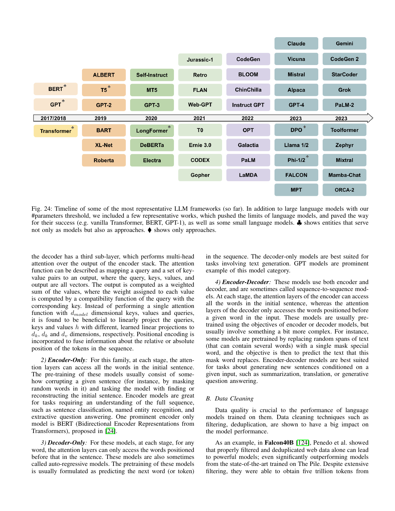

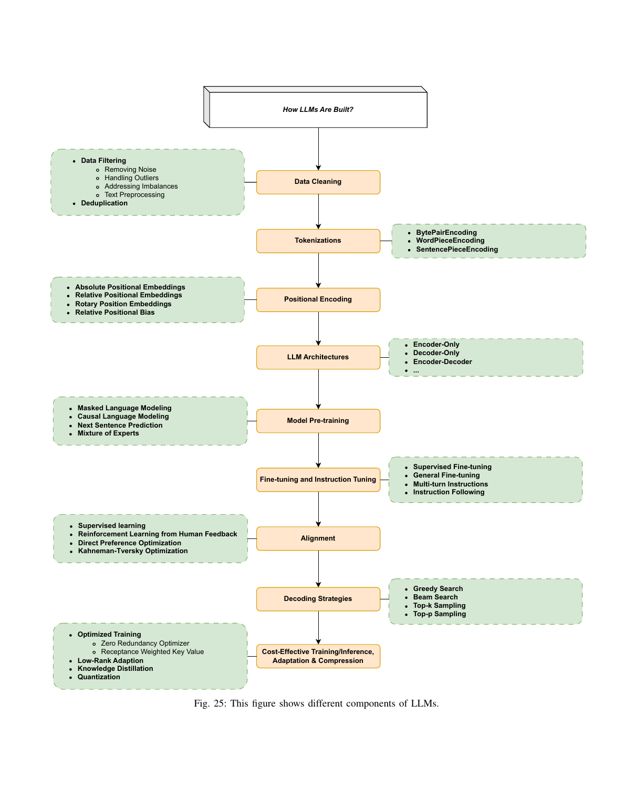

#### 3.2.1 数据过滤

数据过滤旨在提高训练数据质量及所得 LLM 的有效性，常见技术包括以下几类。

**去除噪声。** 消除可能妨碍模型良好泛化的无关或嘈杂数据。例如，可以从训练数据中删除虚假信息，以降低模型生成错误回答的概率。主流质量过滤方法分为基于分类器和基于启发式规则两类。

**处理离群值。** 识别并处理数据中的离群或异常样本，防止它们不成比例地影响模型。

**处理不平衡。** 平衡数据集中类别的分布，避免偏差并保证公平表征。这对负责任的模型训练与评估尤其有用。

**文本预处理。** 通过删除停用词、标点或其他可能对模型学习贡献不大的成分，清洗并标准化文本数据。

**处理歧义。** 解决或排除可能在训练期间混淆模型的歧义或矛盾数据，帮助模型给出更确定、更可靠的回答。

#### 3.2.2 去重

去重是从数据集中删除重复实例或同一数据反复出现的过程。重复数据点会在训练中引入偏差并降低多样性，因为模型可能多次从相同示例学习，最终对这些实例过拟合。一些研究证明，去重能够改善模型对新颖、未见数据的泛化能力。

处理大型数据集时，去重尤其重要，因为重复项会无意间夸大某些模式或特征的重要性。这一点在自然语言处理任务中尤为相关；构建稳健语言模型需要多样且具有代表性的训练数据。

具体去重方法取决于数据性质和待训练语言模型的要求。方法可能比较整个数据点，也可能只比较特定特征，以识别并消除重复。在文档层面，现有工作主要依据文档之间高级特征的重叠比例来检测重复样本，例如 n 元语法重叠。

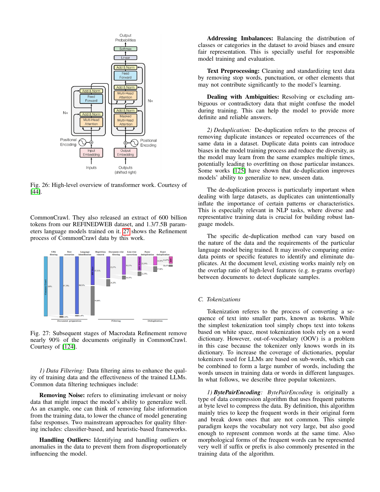

### 3.3 词元化

词元化是把文本序列转换为称作词元的较小单元的过程。最简单的词元化工具按空白切分文本，但大多数工具依赖词典。这会产生词表外（OOV）问题，因为分词器只认识词典中的词。为扩大覆盖范围，LLM 常用分词器以子词为基础；子词可以组合成大量单词，包括训练数据中未见过的词和其他语言中的词。下面介绍三种常见分词方法。

#### 3.3.1 字节对编码

字节对编码最初是一种数据压缩算法，利用字节层面的高频模式压缩数据。就定义而言，它尽量保留高频词原貌，而把不常见的词拆开。这一简单范式既不会让词表过大，又足以表示常见词；如果高频词的前缀或后缀也经常出现在算法训练数据中，它还能很好地表示这些词的形态变化。

#### 3.3.2 WordPiece 编码

这一算法主要用于 BERT 和 ELECTRA 等知名模型。训练开始时，算法收集训练数据中的全部字符，确保训练集中的内容不会被标记为未知词元 UNK。UNK 通常出现在输入含有分词器无法处理的字符时。与字节对编码相似，WordPiece 也依据频率，尽量提高把各词元收入词表的似然。

#### 3.3.3 SentencePiece 编码

前两种分词器虽然比空白分词更强且具有许多优点，但仍默认词之间总由空白分隔。这个假设并不总成立：在某些语言中，词可能受到多余空格甚至新造词等噪声干扰。SentencePiece 编码正是为了处理这一问题。

### 3.4 位置编码

#### 3.4.1 绝对位置嵌入

原始 Transformer 使用绝对位置嵌入（APE）保留序列顺序信息，因此在编码器和解码器堆栈底部，把词的位置信息加入输入嵌入。位置编码既可学习也可固定；标准 Transformer 使用正弦与余弦函数。APE 的主要缺点是把 Transformer 限制在固定词元数量之内，而且不能表达词元之间的相对距离。

#### 3.4.2 相对位置嵌入

相对位置嵌入（RPE）扩展自注意力，使其考虑输入元素之间的成对联系。RPE 在模型的两个层面加入：先作为键的附加成分，再作为值矩阵的子成分。这种方法把输入视为带标签与有向边的全连接图；对线性序列而言，边可以捕捉输入元素之间的相对位置差。裁剪距离 k 规定相对位置的最大范围，使模型能够对训练数据未包含的序列长度作出合理预测。

#### 3.4.3 旋转位置嵌入

旋转位置嵌入（RoPE）针对现有方法的问题而设计。学习得到的绝对位置编码可能缺乏泛化性与明确含义，尤其是在句子较短时；T5 位置嵌入等方法还难以构建位置间完整注意力矩阵。RoPE 使用旋转矩阵编码词的绝对位置，同时在自注意力中显式加入相对位置细节。其优点包括灵活适应句子长度、随相对距离增大而减弱词间依赖，以及使用相对位置编码改善线性自注意力。GPT-NeoX-20B、PaLM、CODEGEN 和 LLaMA 均采用 RoPE。

#### 3.4.4 相对位置偏置

这种位置嵌入旨在帮助模型在推理时外推到比训练序列更长的序列。Press 等人提出线性偏置注意力（ALiBi）：不再简单地把位置嵌入加到词嵌入上，而是给查询—键对的注意力分数加入与两者距离成比例的惩罚偏置。BLOOM 使用了 ALiBi。

### 3.5 模型预训练

预训练是大型语言模型训练流水线的第一步，帮助 LLM 获得可用于广泛语言任务的基础语言理解能力。预训练期间，LLM 通常以自监督方式在海量无标注文本上训练。下一句预测也是一种方法，但最常见的两种方法是后续词元预测，即自回归语言建模，以及掩码语言建模。

在自回归语言建模中，给定 n 个词元的序列 x₁,…,xₙ，模型以自回归方式预测下一个词元 xₙ₊₁，有时也预测后续的一串词元。常用损失是预测词元的对数似然：

$$
L_{\mathrm{ALM}}(x)=\sum_{i=1}^{N}p(x_{i+n}\mid x_i,\ldots,x_{i+n-1}). \tag{1}
$$

由于这一框架具有自回归性质，仅解码器模型天然更适合学习这类任务。

掩码语言建模会遮蔽序列中的部分词，再训练模型依据周围上下文预测被遮蔽词；这种方法有时也称去噪自编码。若把序列 x 中被遮蔽或破坏的样本记为 x̃，则训练目标可写为：

$$
L_{\mathrm{MLM}}(x)=\sum_{i=1}^{N}p(\tilde{x}\mid x\setminus\tilde{x}). \tag{2}
$$

最近，专家混合（MoE）也在 LLM 领域流行起来。MoE 可以用少得多的计算完成预训练，因此在与稠密模型相同的计算预算下，模型规模或数据集规模都能显著扩大。MoE 有两个主要组成部分。第一是稀疏 MoE 层，它取代稠密前馈网络层，包含若干“专家”，例如八个；每个专家都是一个神经网络，实践中通常为前馈网络，也可以更复杂。第二是门控网络或路由器，用来决定把哪些词元发送给哪些专家。一个词元可以送往多个专家。如何把词元路由到专家是使用 MoE 时的关键决策之一；路由器含有可学习参数，并与网络其余部分共同预训练。图 29 展示 MoE 中使用的 Switch Transformer 编码器块。

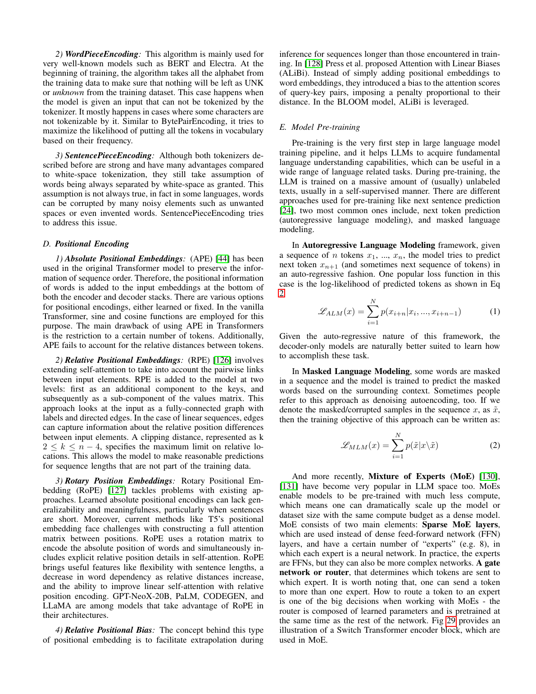

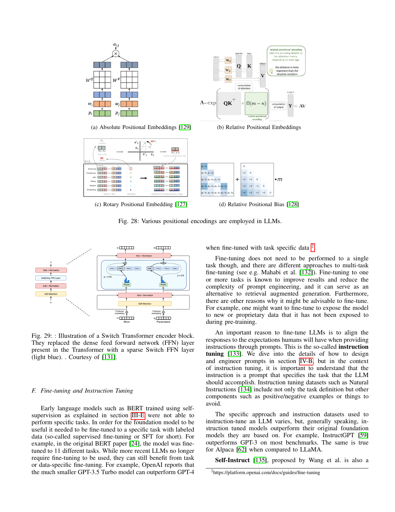

### 3.6 微调与指令微调

BERT 等早期语言模型按照第 3.5 节所述方式用自监督学习训练，但不能直接完成特定任务。为了让基础模型真正有用，需要使用带标注数据针对具体任务微调，这称为监督微调（SFT）。例如，原始 BERT 论文分别针对 11 项任务微调模型。较新的 LLM 虽然无需微调即可使用，但仍能从任务特定或数据特定的微调中受益。OpenAI 报告称，规模小得多的 GPT-3.5 Turbo 在使用任务特定数据微调后，可以超过 GPT-4。

微调并不局限于单一任务，也存在多种多任务微调方法。针对一个或多个任务微调可以改善结果、降低提示工程复杂度，还能作为检索增强生成的替代方案。除此之外也有其他微调理由，例如让模型接触预训练阶段未见过的新数据或专有数据。

微调 LLM 的一个重要原因，是让模型回答与人类通过提示给出指令时的期望对齐，这就是指令微调。第 4.2 节会详细讨论提示设计与工程；在指令微调语境下，指令就是说明 LLM 应完成何种任务的提示。Natural Instructions 等指令微调数据集不仅包含任务定义，还包含正例、反例与应避免事项等成分。

不同 LLM 使用的具体方法与指令数据集有所不同，但总体而言，指令微调模型优于其基础模型。例如，InstructGPT 在多数基准上优于 GPT-3，Alpaca 相比 LLaMA 也有同样改进。

Wang 等人提出的 Self-Instruct 是这一方向的流行方法。它通过自举利用预训练语言模型自己的生成结果，改善其指令遵循能力。流水线让语言模型生成指令、输入和输出样本，过滤无效或相似样本，再用剩余数据微调原模型。

### 3.7 对齐

人工智能对齐是把人工智能系统引向人类目标、偏好与原则的过程。LLM 的预训练目标是词预测，因此常出现非预期行为，例如生成有毒、有害、误导或带偏见的内容。

前述指令微调让 LLM 向对齐迈进一步，但许多情况下仍须增加步骤来改善对齐、避免非预期行为。本节回顾最流行的对齐方法。近期研究指出，SFT 之外的进一步对齐主要改善至少 70 亿参数的模型；对更小模型，SFT 已经足够。

RLHF（基于人类反馈的强化学习）与 RLAIF（基于人工智能反馈的强化学习）是两种常见方法。RLHF 使用奖励模型从人类反馈中学习对齐。奖励模型完成训练后，能按人类给出的对齐偏好评价并打分不同输出；再把这些反馈传给原始 LLM，继续调整模型。RLAIF 则把一个预训练且对齐良好的模型直接连接到待训练 LLM，使后者从更大、对齐更好的模型学习。

Rafailov 等人认为 RLHF 流程复杂且经常不稳定，并以直接偏好优化（DPO）提出新方案。他们利用奖励函数与最优策略之间的映射，证明受约束奖励最大化问题可以通过单阶段策略训练精确优化，本质上是在解决人类偏好数据上的分类问题。DPO 稳定、高效且计算开销低，不再需要拟合奖励模型、在微调期间从语言模型采样，也无须大规模调节超参数。实验发现，DPO 微调在控制生成文本情感方面超过 RLHF，并能提高摘要回答质量。图 30 对比 DPO 与 RLHF。

Ethayarajh 等人随后提出卡尼曼—特沃斯基优化（KTO）。与当时最佳方法不同，KTO 不需要成对偏好数据（x, y_w, y_l），只需要（x, y）以及 y 是否合意的信息。尽管不用成对偏好，KTO 对齐模型在 10 亿至 300 亿参数范围内仍能达到或超过 DPO 对齐模型。KTO 在现实中也更易使用，因为所需数据更丰富。例如，零售公司拥有大量客户交互数据，并知道交互成功与否，例如是否购买；但几乎没有反事实数据，即什么改变能让失败交互 y_l 变成成功交互 y_w。图 31 对比 KTO 与其他对齐方法。

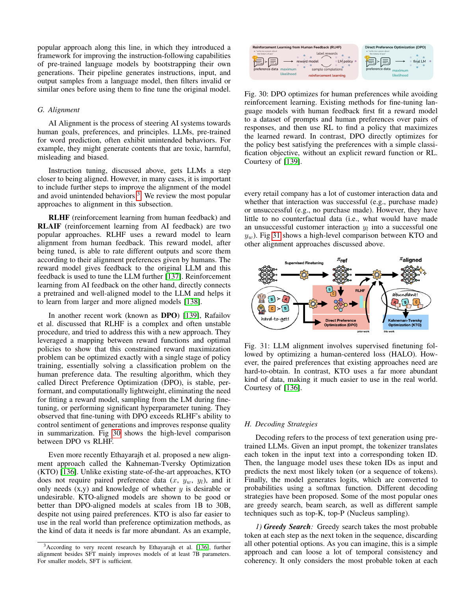

### 3.8 解码策略

解码是使用预训练 LLM 生成文本的过程。给定输入提示后，分词器把文本中的每个词元转换为相应词元编号；语言模型以这些编号为输入，预测最可能的下一个词元或词元序列；最后生成逻辑值，并通过 softmax 函数转成概率。常见解码策略包括贪心搜索、束搜索，以及 Top-k、Top-p（核采样）等采样技术。

#### 3.8.1 贪心搜索

贪心搜索在每一步都选择概率最大的词元作为序列中的下一个词元，丢弃所有其他候选。这种方法简单、速度快，却可能损失时间一致性与连贯性；它只考虑当前最可能的词元，不考虑对完整序列的总体影响，因此可能错过由稍低概率词元引出的更优序列。

#### 3.8.2 束搜索

贪心搜索只考虑下一个最可能词元，束搜索则保留 N 个最可能词元，其中 N 为束数量。该过程一直重复，直到达到预设最大序列长度或出现序列结束词元，再选择总体得分最高的词元序列作为输出。例如，束宽为 2、最大长度为 5 时，需要跟踪 2⁵=32 个可能序列，因此计算量大于贪心搜索。

#### 3.8.3 Top-k 采样

Top-k 采样根据语言模型生成的概率分布，从最可能的 k 个候选中随机选择词元。假设有 A、B、C、D、E、F 六个词元，k=2，P(A)=30%、P(B)=20%，其余四个均为 12.5%。Top-k 会忽略 C 至 F，重新归一化后，模型有 60% 的概率输出 A、40% 的概率输出 B。这样既优先考虑最可能词元，又在选择中引入随机性。

随机性通常由温度 T 控制，范围常取 0 到 1。温度改变 softmax 产生的概率，使高概率词元的影响发生变化；实践中就是把输入逻辑值除以温度：

$$
\operatorname{softmax}(x_i)=\frac{e^{x_i/T}}{\sum_j e^{x_j/T}}. \tag{3}
$$

较低温度会显著改变概率分布，文本生成中常用它控制输出的“创造性”；较高温度的描述在原文中表述为更偏向高概率词元。Top-k 是一种富有创造性的采样方式，可以与束搜索结合。Top-k 选出的序列不一定是束搜索中概率最高的序列，但最高分也并不总能产生更真实或更有意义的文本。

#### 3.8.4 Top-p 采样

Top-p 又称核采样，与 Top-k 略有不同。它不固定选择概率最高的 k 个词元，而是设定截断值 p，按概率从高到低累加候选，直到累计概率超过 p；这些候选构成“词元核”，再从中随机选择下一个词元。当固定数量的 Top-k 词元并未占据很大概率质量时，Top-p 尤其合适。核内词元数量并不固定，这种变化性往往带来更多样、更有创造性的输出，因此核采样很适合文本生成任务。

### 3.9 低成本训练、推理、适配与压缩

本节回顾让 LLM 训练和使用在资金与计算上更经济的常见方法。

#### 3.9.1 优化训练

**ZeRO。** Rajbhandari 等人开发零冗余优化器 ZeRO 来优化内存，显著提高 LLM 训练速度，并扩大可高效训练的模型规模。ZeRO 消除数据并行和模型并行训练中的内存冗余，同时保持较低通信量与较高计算粒度，使模型规模可以随设备数量近似成比例扩展，并维持高效率。

**RWKV。** Peng 等人提出新的“感受加权键值”架构 RWKV，把 Transformer 可高效并行的训练与 RNN 的高效推理结合起来。该方法利用线性注意力机制，使模型既可写成 Transformer，也可写成 RNN；训练期间计算可并行，推理期间计算与内存复杂度保持恒定。它由此成为首个扩展至数百亿参数的非 Transformer 架构。图 32 展示 RWKV，图 33 比较其与不同 Transformer 的时间复杂度。

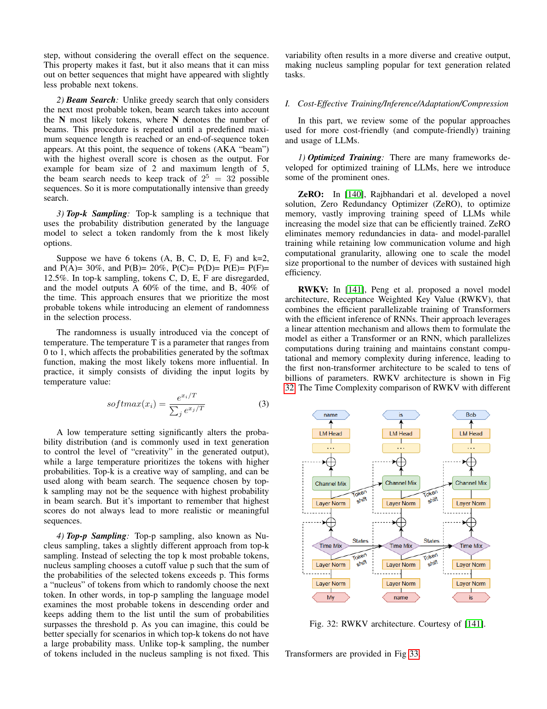

#### 3.9.2 低秩适配

低秩适配（LoRA）是一种流行而轻量的训练技术，可显著减少可训练参数。它基于一个关键观察：专用任务微调权重与初始预训练权重之差往往具有较低“内在秩”，即可以用低秩矩阵很好地近似。LoRA 训练速度更快、更节省内存，生成的模型权重更小，往往只有数百 MB，因而更易存储与共享。

低秩矩阵可以表示为两个较小矩阵的乘积，因此可以假设微调权重与初始权重之间的增量，也能由两个更小矩阵相乘表示。只更新这两个小矩阵，而不是整个原始权重矩阵，可显著提高计算效率。

具体而言，对预训练权重矩阵 W₀∈Rᵈˣᵏ，LoRA 用低秩分解约束其更新：W₀+ΔW=W₀+BA，其中 B∈Rᵈˣʳ、A∈Rʳˣᵏ，且秩 r≪min(d,k)。训练时冻结 W₀，不对其进行梯度更新，A 和 B 为可训练参数。W₀ 与 ΔW=BA 作用于同一输入，输出向量按坐标相加。因此，对输入 x，修改后的前向传播为 h=W₀x+ΔWx=W₀x+BAx。通常用随机高斯分布初始化 A，把 B 初始化为零，使训练开始时 ΔW=BA 为零；随后以 α/r 缩放 ΔWx，其中 α 是关于 r 的常量。图 34 展示这种重参数化。

LoRA 可以只应用于神经网络的一部分权重矩阵，进一步减少可训练参数。Transformer 自注意力模块包含 W_q、W_k、W_v、W_o 四个权重矩阵，多层感知机模块还有两个。多数情况下，LoRA 只适配下游任务中的注意力权重，并冻结多层感知机模块，以兼顾简单性与参数效率。

#### 3.9.3 知识蒸馏

知识蒸馏是从较大模型学习的过程。早期高性能模型发布的经验表明，即便采用 API 蒸馏，这种方法也很有用。它还可以把多个模型而非单一模型的知识蒸馏到一个更小模型中。所得模型体积更小，甚至可部署到边缘设备。图 35 展示通用教师—学生蒸馏框架。

知识可以通过回答蒸馏、特征蒸馏和 API 蒸馏传递。回答蒸馏只关注教师模型输出，力图让学生在预测意义上与教师完全或近似地工作。特征蒸馏不仅使用最后一层，也使用中间层，为学生模型建立更好的内部表示，使小模型获得与教师相近的表示。

API 蒸馏使用 API——通常来自 OpenAI 等 LLM 提供商——训练小模型。对 LLM 而言，它直接用大模型输出来训练，因此与回答蒸馏十分相似。这类蒸馏也引发许多争议：当模型本身不开放时，通常只向最终用户提供付费 API；用户按调用付费，但预测结果的用途受限。例如，OpenAI 禁止使用其 API 创建未来与其竞争的 LLM。在这种情况下，API 的主要价值就是训练数据。

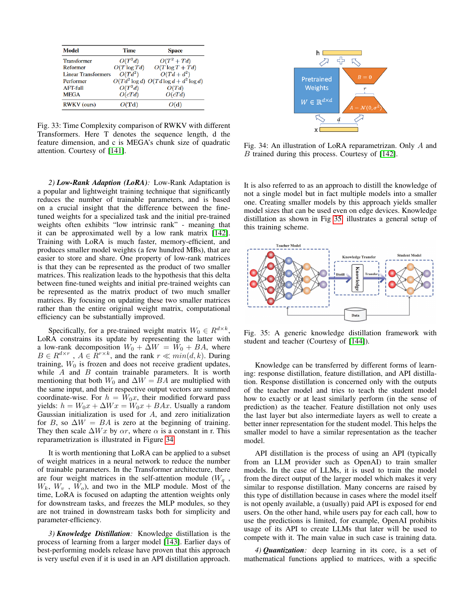

#### 3.9.4 量化

深度学习的核心，是以特定权重精度对矩阵应用一组数学函数。降低权重精度可以缩小模型并加快速度，例如 32 位浮点运算通常比 8 位整数运算慢。这一过程称为量化，可以在不同阶段实施，主要分为训练后量化与量化感知训练。

训练后量化针对已训练模型，常见方式有动态量化与静态量化。动态训练后量化在运行时计算量化范围，因此比静态量化慢。量化感知训练把量化条件加入训练过程，直接训练并优化量化模型，既保证最终模型有良好表现，也无须在训练完成后再次量化。

## 4 大型语言模型如何使用与增强

LLM 训练完成后，可以为多种任务生成所需输出。模型可以直接通过基础提示使用；但若想充分发挥潜力或弥补缺陷，往往需要借助外部手段增强。本节先简要概述主要缺点，重点分析幻觉，再说明提示与增强方法如何处理这些局限、扩展 LLM 能力，乃至把 LLM 变成能够与外部世界交互的完整人工智能智能体。

### 4.1 大型语言模型的局限

必须记住，LLM 的训练目标是预测词元。微调与对齐虽然改善表现并增加能力维度，但直接、朴素地使用时仍存在重要局限。

- **没有状态或记忆。** LLM 自身甚至不能记住上一条提示发给它的内容，而很多用例需要某种状态。
- **具有随机性与概率性。** 多次发送同一提示，很可能得到不同回答。温度等参数可以限制变化，但这是训练方式固有的性质，可能造成问题。
- **信息陈旧，且自身不能访问外部数据。** LLM 自身甚至不知道当前时间与日期，也无法访问训练集之外的信息。
- **通常非常庞大。** 训练与服务需要许多昂贵 GPU；最大模型在延迟等服务等级指标上有时表现不佳。
- **会产生幻觉。** LLM 没有“真相”概念，训练数据通常混杂好坏内容，因此可能给出看似可信却不真实的回答。

这些局限对不同应用都可能变得重要。最后一项“幻觉”在近几个月受到大量关注，也催生了后文介绍的许多提示方法与 LLM 增强技术，因此值得深入讨论。

#### 4.1.1 幻觉

LLM 的“幻觉”现象引发了广泛关注。《自然语言生成中的幻觉综述》把它定义为“生成无意义或不忠实于给定来源的内容”。这个术语虽源于心理学，现已被人工智能领域采用。

LLM 幻觉大体分两类：

1. **内在幻觉：** 与来源材料直接冲突，引入事实错误或逻辑不一致。
2. **外在幻觉：** 虽不与来源冲突，却无法依据来源验证，包含推测性或无法证实的内容。

“来源”在不同 LLM 任务中的含义不同：对话任务中通常指世界知识，文本摘要中则指输入文本本身。这一区别对评估和解释幻觉非常关键。幻觉的影响也高度依赖语境；例如在写诗等创作活动中，它可能可以接受，甚至有益。

LLM 在互联网、图书和维基百科等多样数据上训练，依据概率模型生成文本，本身并不理解真假。指令微调和 RLHF 等进展试图把 LLM 引向更符合事实的输出，但其概率本质及固有限制依然存在。近期关于推理任务中 LLM 幻觉来源的研究强调了两个促成因素：真实性先验与相对频率启发式，显示 LLM 训练与输出生成的复杂性。

有效自动衡量幻觉，需要结合统计指标与基于模型的指标。

**统计指标：**

- ROUGE 与 BLEU 常用于评估文本相似性，重点衡量内在幻觉。
- 当存在结构化知识源时，可使用 PARENT、PARENT-T 和 Knowledge F1 等高级指标；这些指标虽有效，仍难以完整捕捉句法和语义细微差别。

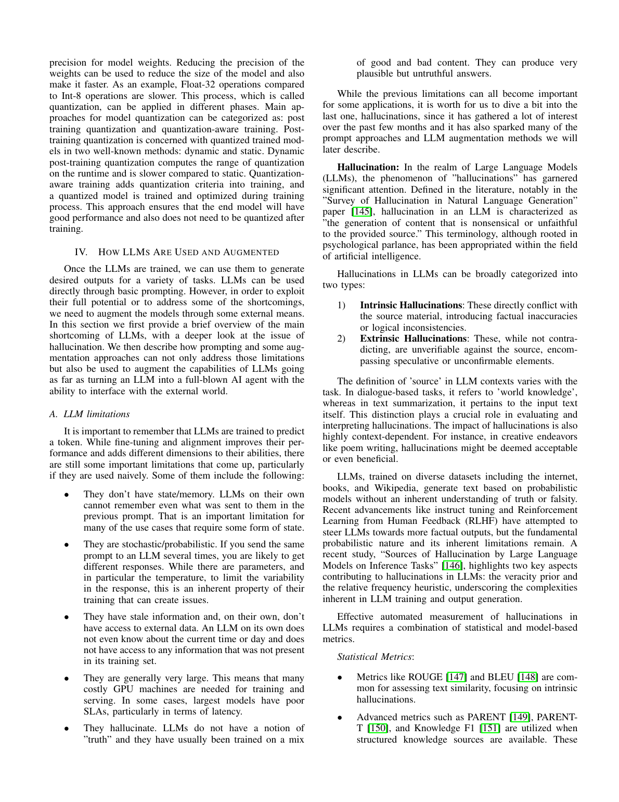

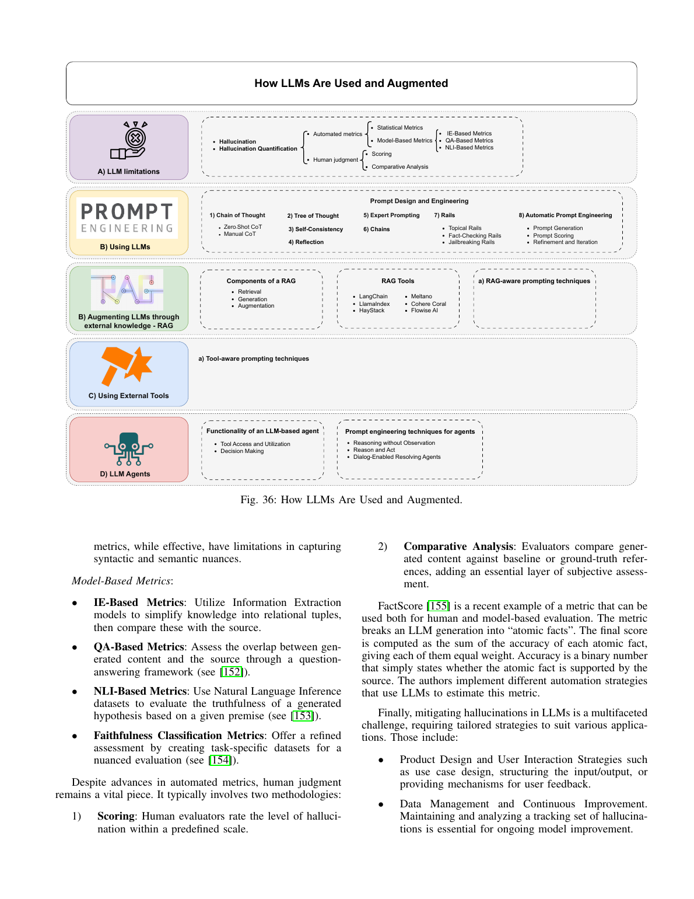

**基于模型的指标：**

- **基于信息抽取的指标：** 用信息抽取模型把知识简化为关系元组，再与来源比较。
- **基于问答的指标：** 通过问答框架评估生成内容与来源的重叠。
- **基于自然语言推断的指标：** 使用自然语言推断数据集，根据给定前提评估生成假设的真实性。
- **忠实度分类指标：** 创建任务特定数据集，提供更细致的评估。

尽管自动指标已有进步，人类判断仍不可或缺，通常采用两种方法：（1）评分，由评估者按预先定义的尺度评定幻觉程度；（2）比较分析，把生成内容与基线或真实参考比较，加入必要的主观评价层。

FactScore 是一种既可由人类评估、也可由模型自动评估的近期指标。它把 LLM 生成内容拆成“原子事实”，最终得分是各原子事实准确率的总和，每项权重相同。准确率为二元值，只表示来源是否支持该事实。作者实现了多种利用 LLM 估计此指标的自动化策略。

缓解幻觉是一项多层面挑战，需要按应用采用不同策略，包括：

- 产品设计与用户交互策略，例如用例设计、输入输出结构，以及用户反馈机制。
- 数据管理与持续改进；维护并分析幻觉跟踪集，是持续改进模型的必要条件。
- 提示工程与元提示设计。第 4.2 节介绍的许多高级提示技术，以及检索增强生成，都能直接降低幻觉风险。
- 为缓解幻觉选择和配置模型。例如，更大的模型与更低温度通常表现更好；RLHF 或领域特定微调也能降低风险。

### 4.2 使用大型语言模型：提示设计与工程

在生成式人工智能模型中，提示是用户为引导模型输出而提供的文本输入，可以从简单问题到详细描述或具体任务。提示通常由指令、问题、输入数据和示例组成。实际使用时，要得到期望回答，提示至少应包含指令或问题之一，其余成分可选。高级提示结构更复杂，例如“思维链”提示会引导模型遵循逻辑推理过程得出答案。

提示工程是一门快速演化的学科，它塑造人与 LLM 及其他生成模型的交互和输出。其核心是为特定目标构造最佳提示。这不仅是向模型下达指令，还需要理解模型能力、局限及其运行语境。

提示工程远不止编写提示，它需要把领域知识、对人工智能模型的理解，以及面向不同上下文系统化定制提示的方法结合起来。例如，可以创建能随数据集或上下文通过程序修改的模板；依据用户数据生成个性化回答时，模板可动态填入相关用户信息。

提示工程还是一个迭代、探索过程，类似传统机器学习中的模型评估或超参数调节。该领域迅速发展，可能像特征工程或架构工程一样改变机器学习的某些环节。另一方面，版本控制和回归测试等传统工程实践，也需要像适配其他机器学习范式那样适配提示工程。下面介绍最受关注、应用最广的提示工程方法。

#### 4.2.1 思维链

Google 研究者在《思维链提示激发大型语言模型的推理能力》中提出的思维链（CoT），是 LLM 提示工程的重要进展。LLM 擅长预测词元，但并非天生为显式推理设计；CoT 通过必要的推理步骤引导模型。

CoT 把 LLM 隐含的推理过程显式化。它列出推理所需步骤，使模型更接近合乎逻辑、经过推导的输出，尤其适用于不只是简单检索信息或匹配模式的场景。CoT 主要有两种形式：

1. **零样本 CoT：** 指示 LLM“逐步思考”，让它拆解问题并说明每个推理阶段。
2. **人工 CoT：** 提供逐步推理示例作为模型模板。它效果更好，但难以扩展和维护。

人工 CoT 通常比零样本更有效，但基于示例的 CoT 很依赖多样示例的选择，手工构造逐步推理提示既困难又易出错，自动 CoT 因此出现。

#### 4.2.2 思维树

思维树（ToT）提示的灵感来自一种做法：先考虑多种候选解法或思考过程，再收敛到最可信的一种。ToT 会分叉出多棵“思维树”，每个分支代表一条不同推理路线，使 LLM 能像人类在作出判断前考虑多个情景那样，探索各种可能性与假设。

ToT 的关键是评估这些推理路径。LLM 生成不同思维分支时，系统实时分析、比较各分支对问题的有效性和相关性，最后选择最连贯、最合乎逻辑的结果。

单一推理路线不足以解决的复杂问题尤其适合 ToT。它使 LLM 模仿更像人类的求解方式，在得出结论前考虑多种可能，提高模型处理歧义、复杂性和细腻任务的能力，是高级人工智能应用中的有用工具。

#### 4.2.3 自洽性

自洽性采用集成方法，让 LLM 对同一问题生成多个回答，并把回答间的一致程度作为准确性与可靠性的指标。其基本原则是：若 LLM 对同一提示生成多个相似回答，这个回答更有可能正确。系统让 LLM 多次处理同一问题，每次都分析回答是否一致，对事实准确性和精度至关重要的场景尤其有用。

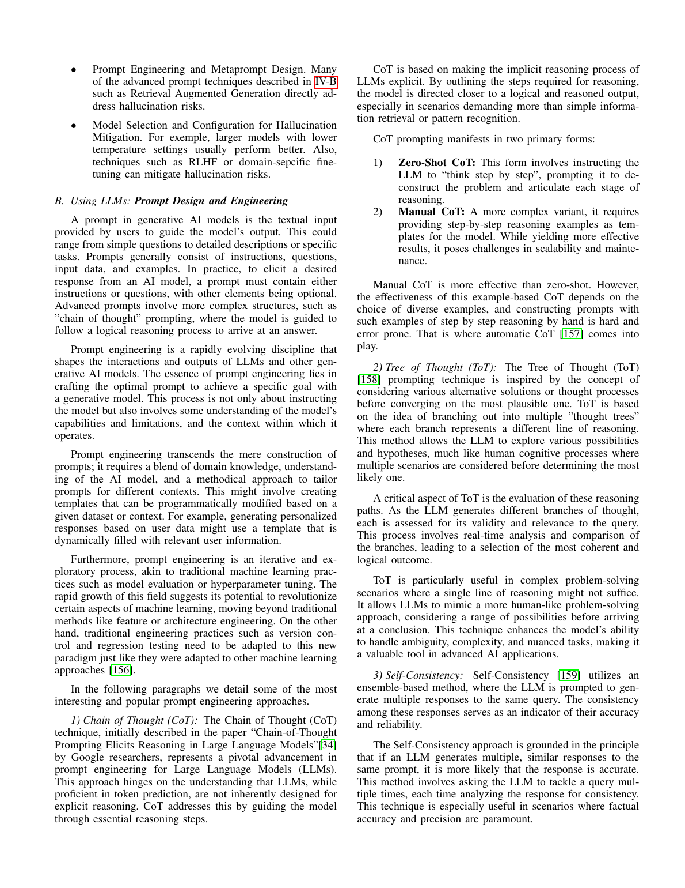

回答一致性可以用多种方法衡量。常见做法是分析回答内容的重叠，也可以比较语义相似度，或使用 BERTScore、n 元语法重叠等更复杂技术。这些度量能量化 LLM 多个回答之间的一致程度。

自洽性在信息真实性关键的领域用途很大，尤其适合事实核查。提示工程师利用这一方法可以提高 LLM 的可信度，使其更可靠地完成要求高度事实准确的任务。

#### 4.2.4 反思

反思要求 LLM 判断并可能修改自己的输出，依据回答的正确性与连贯性展开推理。它以 LLM 的自我评估能力为中心：模型生成初始回答后，再反思事实准确性、逻辑一致性与相关性，从而生成修订或改进后的回答。

反思的关键是 LLM 自我编辑能力。模型评估初始回答后，可以识别潜在错误和改进之处；生成、反思、修订的迭代过程不断精炼输出，提高回答的总体质量与可靠性。

#### 4.2.5 专家提示

专家提示通过模拟不同领域专家的回答来增强 LLM。提示要求 LLM 扮演专家并据此回答，从而提供高质量、有依据的答案。其中一项关键策略是多专家方法：先让 LLM 从多位专家视角考虑回答，再综合形成全面、均衡的答案。这样既加深回答，也纳入多种观点，对主题形成更整体的理解。

#### 4.2.6 链

“链”是把多个组件按顺序连接起来，使 LLM 能处理复杂任务的方法。系统构建一条工作流，让不同阶段或组件依次排列；链中每个组件执行特定功能，前一组件的输出成为后一组件的输入。端到端编排使处理更复杂、更细腻，因为每个阶段都能专门处理任务的一个方面。链的复杂度与结构取决于任务需求。《PromptChainer：通过可视化编程串联大型语言模型提示》不仅总结链设计的主要挑战，还介绍了支持这些任务的可视化工具。

#### 4.2.7 轨道规则

高级提示工程中的“轨道规则”通过预定义规则或模板引导并控制 LLM 输出，确保模型回答符合特定标准，提高相关性、安全性与准确性。它建立一套 LLM 生成回答时必须遵循的框架或准则，通常使用建模语言或称为“规范形式”的模板定义，使自然语言句子的结构与交付方式标准化。

轨道规则可以按应用需求服务于不同目的：

- **主题轨道：** 确保 LLM 始终围绕特定主题或领域。
- **事实核查轨道：** 尽量减少虚假或误导信息。
- **越狱防护轨道：** 阻止 LLM 生成试图绕过自身运行约束或准则的回答。

#### 4.2.8 自动提示工程

自动提示工程（APE）把为 LLM 创建提示的过程自动化，以简化并优化提示设计。它以一种自指方式使用 LLM：让模型自己生成、评分和改进提示。这种递归使用可以产生更可能引出期望回答或结果的高质量提示。主要步骤包括：

- **提示生成：** LLM 根据给定任务或目标生成多个候选提示。
- **提示评分：** 按清晰度、具体性和引出期望回答的可能性等标准评估每个提示。
- **改进与迭代：** 根据评估结果修订提示并反复迭代，进一步提升质量与有效性。

### 4.3 通过外部知识增强大型语言模型：检索增强生成

预训练 LLM 的主要局限之一，是缺乏最新知识，也无法访问私有信息或特定用例信息。检索增强生成（RAG）正是为此出现。如图 37 所示，RAG 从输入提示中提取查询，用它从外部知识源——例如搜索引擎或知识图谱——检索相关信息，再把这些信息加入原提示并交给 LLM 生成最终回答。RAG 系统包含三个重要组件：检索、生成与增强。

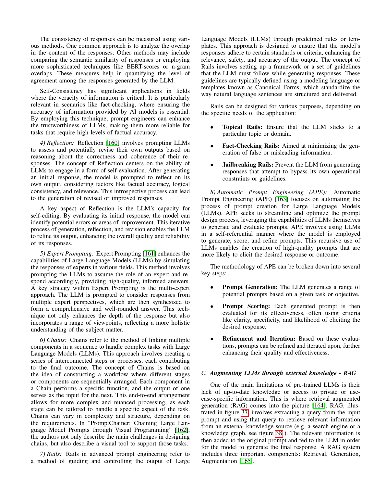

#### 4.3.1 面向检索增强生成的提示技术

RAG 对构建高级 LLM 系统十分重要，因此近期出现了多种面向 RAG 的提示技术，前瞻式主动检索增强生成（FLARE）便是其中之一。

FLARE 迭代结合预测与信息检索，以增强 LLM 能力。它是检索增强生成的一种演进，旨在提高 LLM 回答的准确性与相关性。LLM 会主动预测即将生成的内容，并把这些预测作为查询检索相关信息。传统检索增强模型通常只检索一次，随后直接生成；FLARE 则在整个生成阶段动态、持续地重复这一过程。

FLARE 会评估 LLM 生成的每个句子或片段的置信度。如果置信度低于阈值，模型便把已生成内容作为查询，检索相关信息，再用检索结果重新生成或修订该句。反复迭代确保回答的每一部分都依据最相关、最新的信息。RAG 框架及相关工作可参阅文献 [165] 的检索增强生成综述。

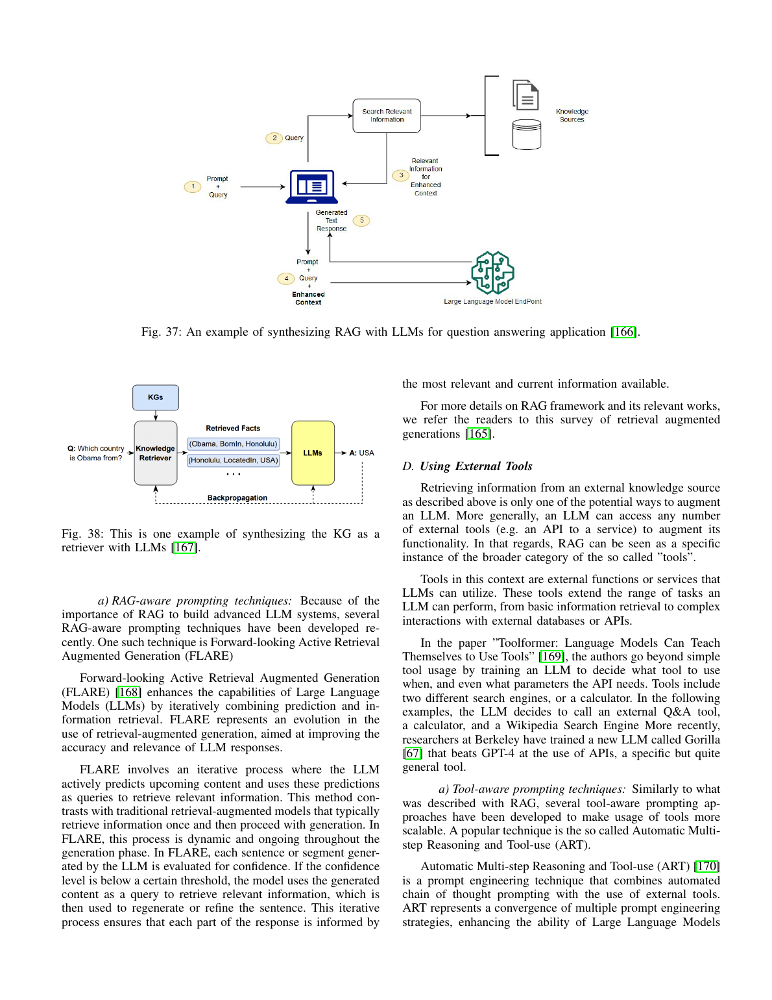

### 4.4 使用外部工具

从外部知识源检索信息只是增强 LLM 的一种方式。更一般地说，LLM 可以访问任意数量的外部工具——例如服务 API——扩展功能；RAG 可以看作“工具”这一更大类别中的特例。

这里的工具是 LLM 可以调用的外部函数或服务。它们把 LLM 可完成的任务，从基础信息检索扩展到与外部数据库或 API 的复杂交互。

《Toolformer：语言模型可以自学使用工具》不仅让模型简单调用工具，还训练 LLM 决定何时使用何种工具，甚至确定 API 所需参数。工具包括两个不同搜索引擎和计算器；论文示例中，LLM 会自行决定调用外部问答工具、计算器与维基百科搜索引擎。后来，伯克利研究者训练的新 LLM Gorilla 在 API 使用上超过 GPT-4；API 是一种具体但十分通用的工具。

#### 4.4.1 面向工具的提示技术

与 RAG 类似，研究者开发了多种面向工具的提示方法，以便规模化使用工具，其中一种流行技术是自动多步推理与工具使用（ART）。

ART 把自动思维链提示与外部工具结合起来，汇聚多种提示工程策略，提高 LLM 处理既要求推理、又要求与外部数据源或工具交互的复杂任务的能力。给定任务与输入后，系统先从任务库找出相似任务，再把它们作为提示示例，指导 LLM 处理和执行当前任务。需要同时进行内部推理以及外部数据处理或检索时，这种方法尤其有效。

### 4.5 大型语言模型智能体

人工智能智能体的概念在人工智能历史中已有充分研究。智能体通常是一个自主实体，能够用传感器感知环境，依据当前状态作出判断，再根据可用动作采取行动。

在 LLM 语境下，智能体是基于增强 LLM 的专用实例化系统，能够自主完成特定任务。它与用户和环境交互，依据输入与交互目标作出决策。智能体建立在可以访问和使用工具、并能依据输入决策的 LLM 之上，面向需要一定自主性与决策能力、通常超出简单回答生成范围的任务。

通用 LLM 智能体的功能包括：

- **工具访问与利用：** 访问外部工具和服务，并有效利用这些资源完成任务。
- **决策：** 依据输入、上下文和可用工具作出决定，通常还会执行复杂推理。

例如，可访问天气 API 的 LLM 能回答特定地点的天气问题，也就是用 API 解决问题。若它还能访问购物 API，就能构建采购智能体，不仅从外部世界读取信息，还能对外部世界采取行动。

图 40 展示另一个用于对话式信息检索的 LLM 智能体。LLM 由一组即插即用模块增强，包括：跟踪对话状态的工作记忆；为任务制定执行计划并选择下一系统动作的策略；执行所选动作的执行器，例如整合外部知识证据或提示 LLM 生成回答；以及评估回答是否符合用户期望或业务要求、并产生反馈以改进智能体表现的效用模块。LLM 人工智能智能体的更多细节见近期综述 [172]、[173]、[174]。

#### 4.5.1 面向智能体的提示工程技术

与 RAG 和工具一样，研究者开发了专门处理 LLM 智能体需求的提示工程方法，以下介绍 ReWOO、ReAct 与 DERA。

**无观察推理（ReWOO）。** ReWOO 旨在把推理与直接观察解耦。LLM 无须立即依赖外部数据或工具，先制定完整推理计划或元计划；必要数据或观察到位后，再执行这一结构化推理框架。模型首先拟定由一系列步骤组成的计划，说明如何处理和解决问题。元规划阶段为随后处理信息搭好框架；执行阶段再把真实数据或观察填入预定计划，产生连贯且符合上下文的回答。

ReWOO 在词元效率和工具故障稳健性上优势显著。即使无法立即获得外部数据，LLM 也能依靠结构良好的推理框架处理任务。检索数据成本高、速度慢或结果不确定时，这一方法尤其有利，使智能体仍能保持较高性能与可靠性。

**推理与行动（ReAct）。** ReAct 提示 LLM 不仅生成文字推理，也生成可执行步骤，增强动态求解能力。它把推理与行动结合，让 LLM 交替生成推理轨迹即解释，以及行动即步骤或命令。模型由此能够动态分析问题，同时提出并执行具体动作。

**对话式求解智能体（DERA）。** DERA 是能在互动交流中展开对话、解决查询和作出决策的专用人工智能智能体。它在一个对话上下文中使用多个智能体，每个都有特定角色与功能，例如“研究者”收集和分析信息，“决策者”依据这些信息作最终判断。角色分工使求解和决策更有组织、更高效。

DERA 特别适合医学诊断或客户服务等要求复杂决策与求解的场景。多个智能体协作互动，可以用单智能体难以达到的深度与细腻程度处理复杂查询。该方法也更贴近人类决策过程，使人工智能推理更易理解、更可信。

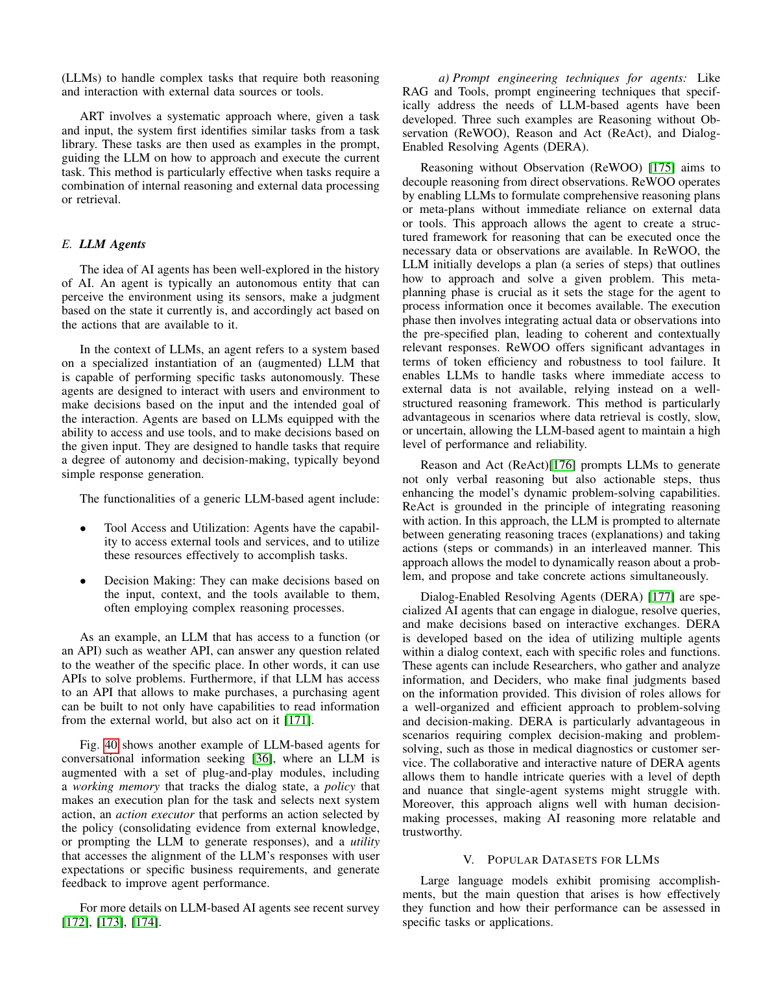

## 5 大型语言模型的常用数据集

LLM 已取得令人鼓舞的成果，但核心问题仍是：它们在特定任务或应用中究竟工作得多好，应当如何评估？

LLM 应用版图不断变化，使评估面临独特挑战。开发 LLM 最初是为了提高翻译、摘要、问答等自然语言处理任务的表现；如今它们已用于代码生成、金融等不同领域。LLM 评估还必须考虑公平与偏见、事实核查及推理等关键问题。本节按 LLM 能力的训练或评估对象，对常用基准进行分类介绍。

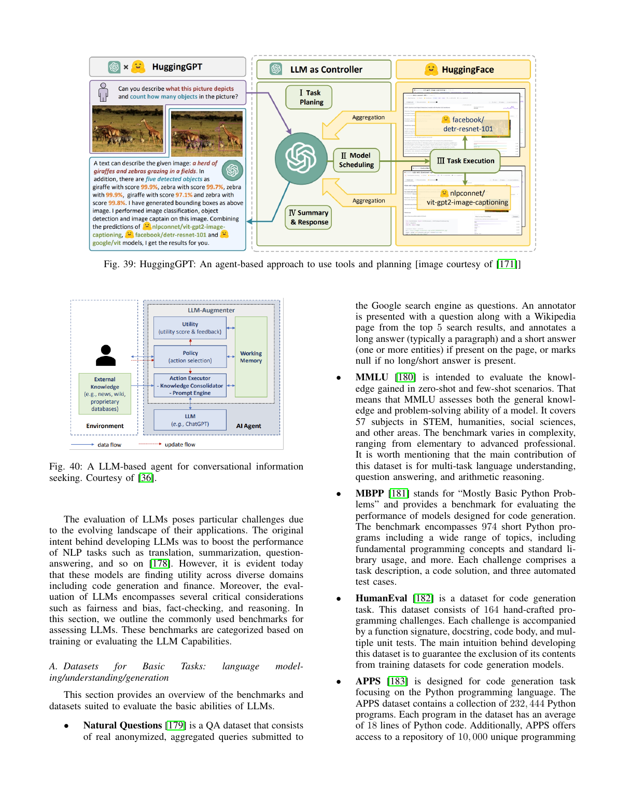

### 5.1 基础任务数据集：语言建模、理解与生成

- **Natural Questions。** 问答数据集，由提交到 Google 搜索引擎的真实匿名聚合查询构成。标注者看到一个问题与搜索结果前五名中的维基百科页面；若页面含有答案，就标注一段通常为一段文字的长答案，以及一个或多个实体构成的短答案；若没有，则标记为空。
- **MMLU。** 旨在评估零样本与少样本场景中获得的知识，同时衡量模型的通用知识和问题求解能力。它覆盖 STEM、人文、社会科学等 57 个学科，难度从小学到高级专业水平，主要用于多任务语言理解、问答与算术推理。
- **MBPP。** 全称“多数为基础 Python 问题”，用于评估代码生成模型，包含 974 个简短 Python 程序，覆盖基础编程概念与标准库使用等广泛主题。每个挑战包括任务描述、代码解答与三个自动测试用例。
- **HumanEval。** 代码生成数据集，包含 164 个手工编写的编程挑战。每项均附有函数签名、文档字符串、代码主体与多个单元测试。其设计目的之一，是确保内容不会出现在代码生成模型的训练数据中。
- **APPS。** 面向 Python 代码生成，收录 232,444 个 Python 程序，平均每个程序 18 行代码；另提供 10,000 个独立编程练习，每题有文本问题描述，并包含测试用例。
- **WikiSQL。** 面向代码生成，从维基百科表格构建 87,726 对精细标注的 SQL 查询与相应自然语言问题；其中训练集 61,297 例、开发集 9,145 例、测试集 17,284 例。
- **TriviaQA。** 问答数据集，包含超过 65 万个“问题—答案—证据”三元组。其中 95,000 个问题—答案对由知识问答爱好者编写，每题平均由六份独立来源证据文档支持；文档自动取自维基百科或更广泛网络搜索。数据分为含维基百科和网络真实答案的部分，以及只保留正确回答及其维基百科与在线文档的验证部分。
- **RACE。** 阅读理解数据集，源自中国 12 至 18 岁初高中学生完成的英语考试，约含 28,000 篇文本与 100,000 个由人类专家——主要是英语教师——严谨编写的问题。主题广泛，专为评估理解与推理能力选择。RACE-M 对应初中试题，RACE-H 对应高中试题，RACE 是两者合集。

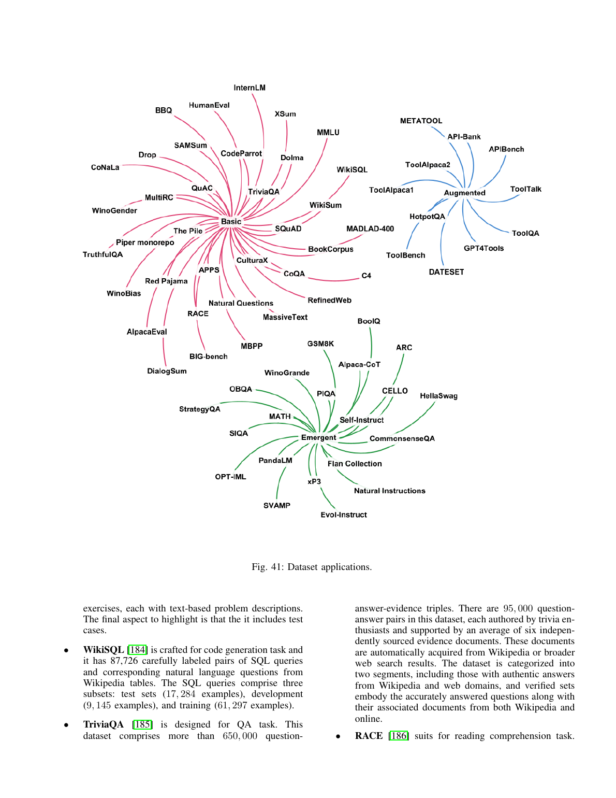

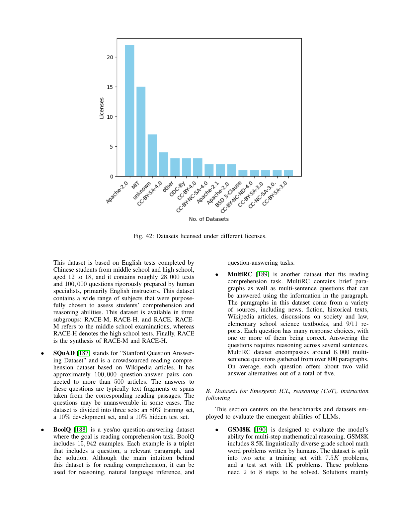

- **SQuAD。** 斯坦福问答数据集，是基于维基百科文章众包建立的阅读理解数据集，约 500 多篇文章对应 10 万个问题—答案对。答案通常是阅读段落中的文本片段，也有问题不可回答的情况。数据按 80% 训练、10% 开发和 10% 隐藏测试划分。
- **BoolQ。** 用于阅读理解的是非问答数据集，包含 15,942 个样本，每个样本由问题、相关段落和答案组成。除阅读理解外，也可用于推理、自然语言推断和问答。
- **MultiRC。** 另一个阅读理解数据集，包含短段落与必须依据段落回答的多句问题。段落来自新闻、小说、历史文本、维基百科文章、社会与法律讨论、小学科学教材及“9·11”报告等。每题有多个候选答案，可能不止一个正确，必须跨多个句子推理。数据集从 800 多个段落中收集约 6,000 个多句问题；平均每题五个候选，其中约两个正确。

### 5.2 涌现能力数据集：上下文学习、推理与指令遵循

- **GSM8K。** 评估多步数学推理，包含 8,500 道由人类编写、语言表达多样的小学数学应用题；训练集 7,500 道、测试集 1,000 道。每题需要两到八步，解答主要是一系列基础算术计算。
- **MATH。** 评估模型解决数学问题的能力，包含 12,500 道高中数学竞赛题，每题都有逐步解答和方框标示的最终答案。题目覆盖七个学科，难度依 AoPS 标准从 1 到 5；所有题目与解答都用 LaTeX 和 Asymptote 矢量图形语言排版。
- **HellaSwag。** 评估常识推理，包含 70,000 道选择题。每题来自 ActivityNet 或 WikiHow，提供四个“接下来可能发生什么”的选项；正确项真实描述后续事件，三个错误项专门用于迷惑机器。
- **AI2 推理挑战（ARC）。** 用于常识推理，包含 7,787 道英文科学考试题，多为选择题。难题集有 2,590 题，简单集有 5,197 题；两者均划分训练、开发与测试子集。
- **PIQA。** 评估语言表示中的物理常识，关注日常情境并偏向不常见解法。每题提供问题 q 与两个候选方案 s₁、s₂，由模型或人类选出更佳方案；只有一个正确答案。
- **SIQA。** 评估模型对社会情境的常识推理，含 38,000 道选择题，衡量日常环境中的情绪与社会智能，覆盖多种社会情景。候选答案混合人类选择的回答和经对抗流程筛选的机器生成回答。
- **OpenBookQA。** 一种问答数据集，作答不仅需要书中没有的普通与常识知识，还要具备丰富文本理解能力。它包含约 6,000 道选择题，每题对应一条核心事实和一个含 6,000 多条事实的附加集合。问题经多阶段众包和专家筛选形成，因为必须在有限背景下多跳推理，所以难度较高。
- **TruthfulQA。** 专门评估语言模型回答问题时的真实性，含作者编写的 817 个问题，分属健康、法律、金融、政治等 38 类。这些问题有意挑战人类回答者，因为其中可能包含会诱发错误答案的常见误解。
- **OPT-IML Bench。** 全面的指令元学习基准，覆盖八个现有基准中的 2,000 项自然语言处理任务；训练集 1,790 万例、开发集 14.5 万例、测试集 32.1 万例。

### 5.3 增强能力数据集：使用外部知识与工具

- **HotpotQA。** 多样、可解释且要求多跳推理的问答数据集，源自英文维基百科，约含 113,000 个问题。每题附带来自两篇维基百科文章的两个“黄金段落”，并列出众包工作者认定为答题关键的句子。
- **ToolQA。** 用于评估 LLM 借助外部工具回答问题能力的问答基准。
- **GPT4Tools。** 由 ChatGPT 等高级教师依据视觉内容与工具说明生成的教学数据集，所得指令与工具使用有关。它有三个版本：第一版含 71,000 条用于微调 GPT4Tools 的指令遵循数据；第二版是人工清洗的验证指令，覆盖第一版工具；第三版是用于测试的清洗指令，包含第一版未出现的一些工具。

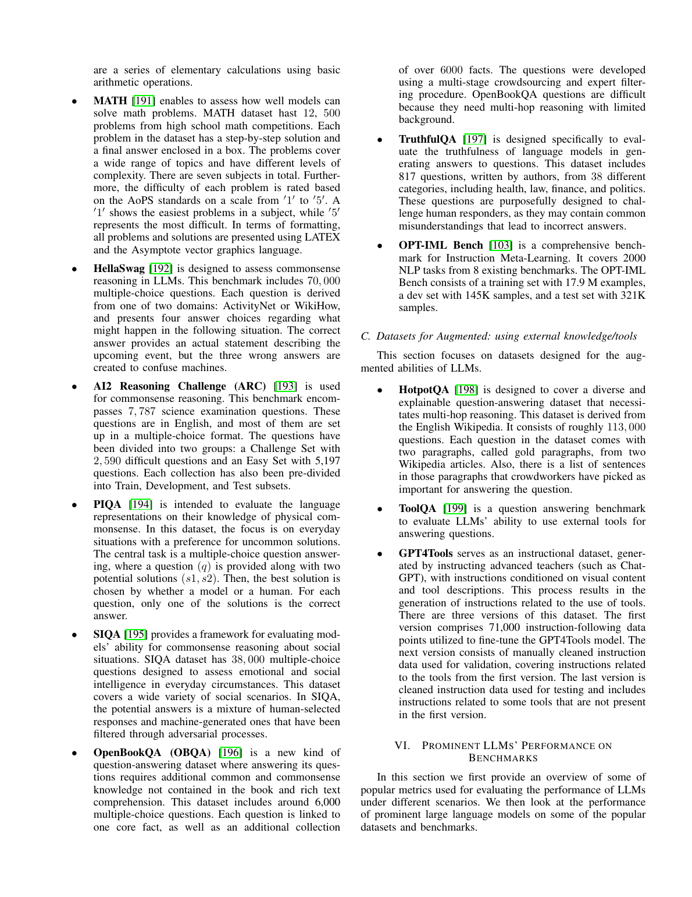

## 6 代表性大型语言模型的基准表现

本节先概述不同场景下评估 LLM 表现的常用指标，再考察代表性 LLM 在常用数据集与基准上的表现。

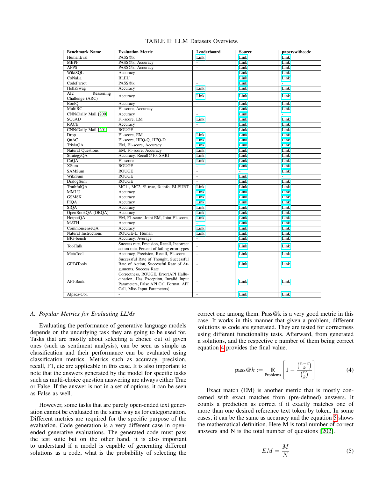

### 6.1 常用大型语言模型评估指标

生成式语言模型的评估方式取决于实际任务。情感分析等从给定选项中选择答案的任务，可以视为简单分类，用准确率、精确率、召回率和 F1 等分类指标评估。多项选择问答的回答始终可判为真或假；若模型答案不在候选集中，也可直接视为错误。

纯开放式文本生成不能用分类方法评估，必须采用与目的相匹配的指标。代码生成在开放式生成评估中又很特殊：生成代码必须通过测试套件；与此同时，如果模型能生成多种代码解法，还要判断从中选到正确解的概率。Pass@k 很适合这一场景。给定问题后，模型生成多个代码解法，再用功能测试检验正确性。若共生成 n 个解法，其中 c 个正确，则：

$$
\operatorname{pass@k}=\mathbb{E}_{\text{问题}}\left[1-\frac{\binom{n-c}{k}}{\binom{n}{k}}\right]. \tag{4}
$$

精确匹配（EM）主要关心答案是否与预定义答案完全一致。若预测逐词元完全匹配一个或多个参考文本中的任意一个，就计为正确。有时它与准确率相同；若正确回答数为 M、问题总数为 N，则：

$$
\mathrm{EM}=\frac{M}{N}. \tag{5}
$$

人类等效分数（HEQ）是 F1 的一种替代指标。HEQ-Q 衡量单个问题：若模型 F1 超过人类平均 F1，回答即视为正确。HEQ-D 衡量整段对话：只有对话内所有问题都满足 HEQ 条件，才视为准确。

机器翻译等生成任务常用 ROUGE 与 BLEU。它们适用于同时存在真实参考文本与模型生成假设文本的场景，以计算方式检测回答与真值的相似性；这里所谓计算方式，主要只使用 n 元语法。BERTScore 等指标也可用于此类任务，但因为依赖另一个模型判断，也可能带来严重误差。直到今天，纯生成内容仍很难评估，尚无完全适配的指标：现有方法要么只看 n 元语法、跳元语法等简单特征，要么依赖准确性与精确性未知的模型。

生成式评估指标还可以使用另一个 LLM 评价回答，但是否可行取决于任务，也高度依赖评估提示本身，因此容易出错。RAGAS 是结合生成式评估的一个代表。

研究界提出多种基准和排行榜，试图回答 LLM 世界中最困难的问题：“哪个模型更好？”但不存在简单答案，它取决于模型的多种属性。第 5 节已按任务类别介绍重要数据集，下文沿用相同分类，分别比较各类别，再对不同任务的已报告指标取平均，提供综合表现概览。

还可以从不同视角评估 LLM。例如，参数少得多的模型不能与大模型直接比较。因此，本文按参数量分四类：小型，不超过 10 亿；中型，10 亿至 100 亿；大型，100 亿至 1,000 亿；超大型，超过 1,000 亿。

本文还按主要用途把模型分为三类：基础模型，即预训练后未做指令或聊天微调；指令模型，即只做了指令微调；聊天模型，即同时做了指令与聊天微调。另需区分原始模型与调优模型：原始模型以基础模型或官方微调版本发布；调优模型则在原模型基础上使用不同数据集或不同训练方法继续调整。无论许可如何，只要权重可公开获得——哪怕必须申请——就记为公开模型，否则记为私有模型。表 3 汇总这些定义与缩写，图 43 作可视化说明。

依据这些分类，表 4 对每个知名 LLM 进行标注。可以看到，超大型模型往往也不可获得。

### 6.2 大型语言模型在不同任务上的表现

常识推理是每个模型都可能获得的重要能力，指模型结合先验知识与推理技能解决问题。以 HellaSwag 为例，给定文本只含故事的一部分，续写候选又有意设置得难以分辨；没有关于世界的先验知识，就无法选择正确后续。这类推理把已有知识用于开放文本描述的场景或事实，值得高度关注。表 5 显示，不仅私有模型，公开模型也能在多项测试上取得良好成绩。

表 5 的结果表明，GPT-4 在 HellaSwag 上最好，Davinci-003 在 OBQA 上最好。不过，许多模型没有报告 OBQA 结果，所以 Davinci-003 未必是真正的最佳模型。

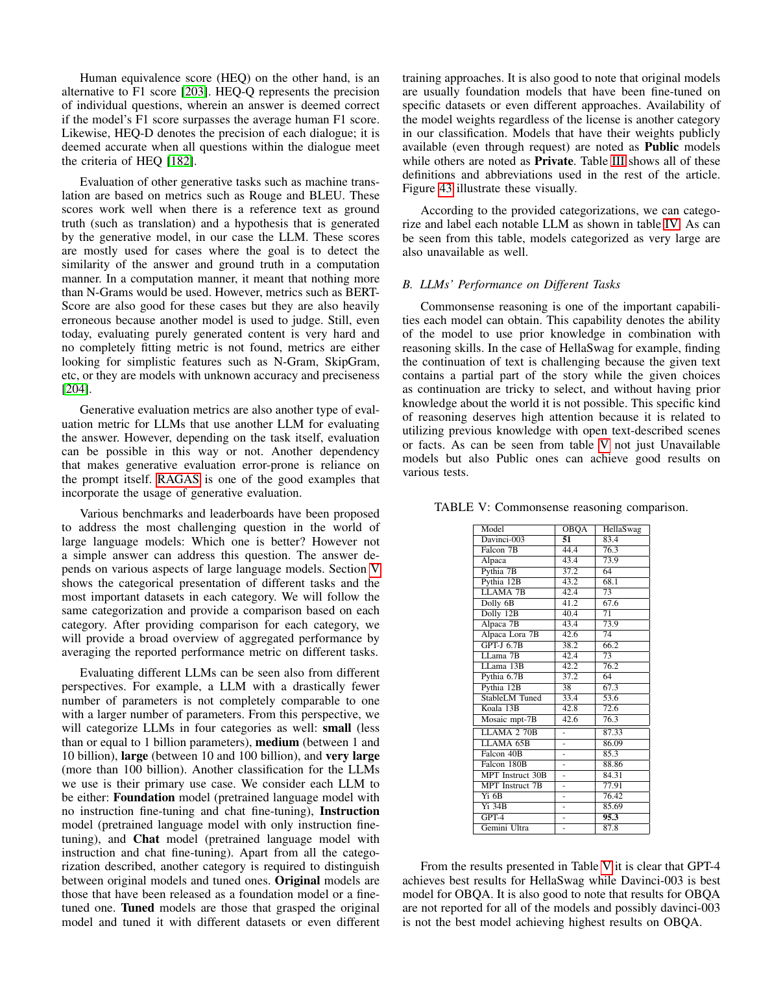

并非所有模型都会报告在全部数据集上的表现，所以各比较表中有结果可用的模型数量不同。

**符号推理。** 表 6 比较 CObjects 与 Penguins 上的符号推理结果。在所列模型中，PaLM 2 分别取得 61.2 与 65.8 的最高成绩；Chinchilla-70B 的结果为 59.7 与 48.7。

**世界知识。** 世界知识主要考察通用知识问题，例如 WikiFact 会询问“某本知名图书的作者是谁”，并提供参考来源。表 7 汇总 TriviaQA、Natural Questions、WebQuestions 与 ARC 等数据集结果。不同模型在不同基准上领先，例如 PaLM 2-L 的 TriviaQA 为 86.1，GPT-4 的 ARC 为 96.4。

某些具体用例对编程与代码生成能力要求很高，表 8 比较各模型的 HumanEval 结果。

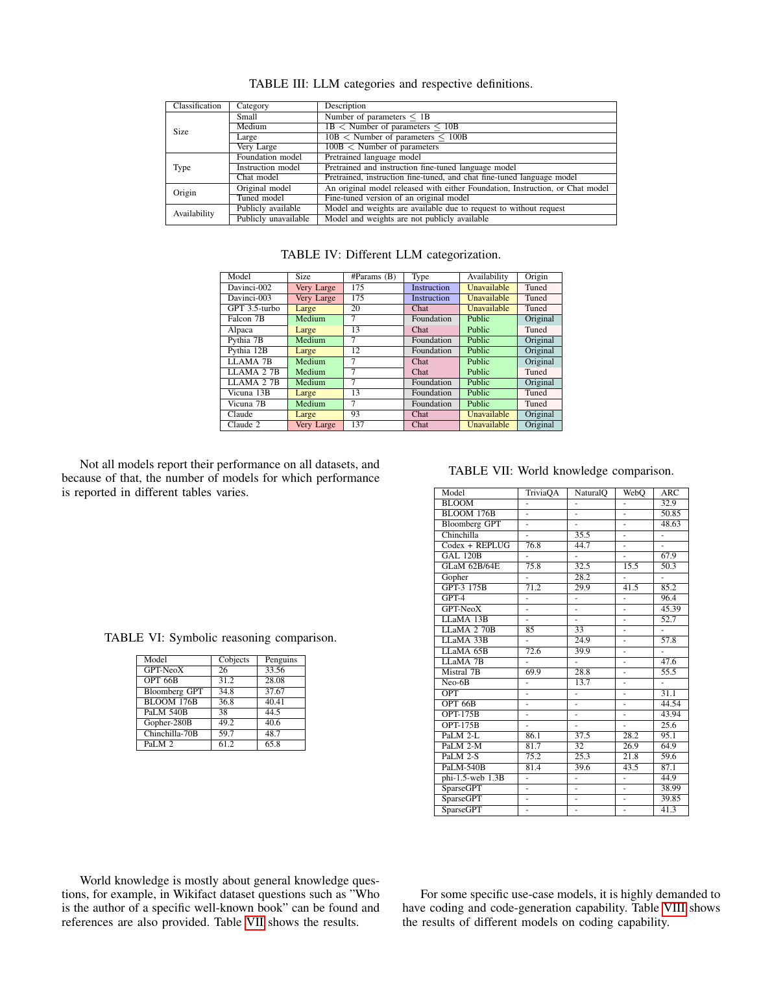

**代码能力。** 表 8 显示 Gemini Ultra 在 HumanEval 上得到 74.4，Gemini Pro 为 67.7，GPT-4 为 67，随后是 WizardCoder-15B 的 57.3 与 phi-1-1.3B 的 50.6。结果也说明，小模型通过针对性数据与训练同样可能获得很强代码能力。

**算术推理。** 这是另一项难以获得的推理能力。GSM8K 包含带答案的小学数学问题，表 9 比较不同模型在 GSM8K 与 MATH 上的表现。Gemini Ultra 分别达到 94.4 与 53.2；GPT-4 为 87.1 与 42.5；一些专用数学模型也表现突出，例如 ToRA-Code-34B 在 MATH 上达到 50.8。

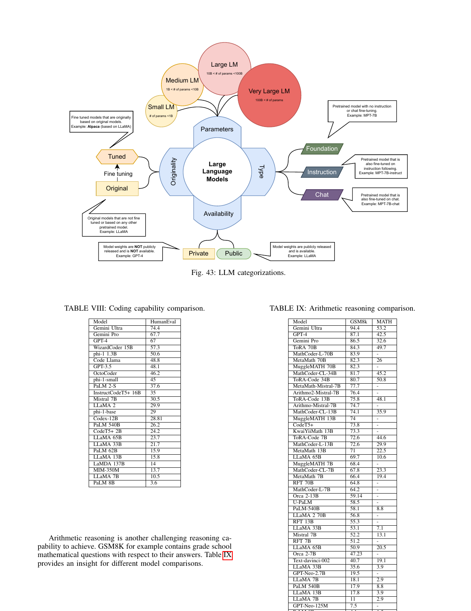

**幻觉。** 大型语言模型有时仅因为其本质是后续词元预测器而生成幻觉回答。幻觉是衡量 LLM 是否可信、可靠的重要因素，但评估并不容易，因为同一事实可以用不同风格表达，哪怕措辞只有很小变化也会增加检测难度。可以合理认为，若某个 LLM 更能发现文本中的幻觉或虚假信息，它自身也更值得信赖。HaluEval 是用于衡量幻觉的数据集之一，也可以让另一个模型依据真实答案判断回答。表 10 汇总不同模型在这些数据集上的结果。

## 7 挑战与未来方向

前文表明，LLM 在过去一两年取得了令人印象深刻的成果。但这仍是一个新兴且极其活跃的研究领域，创新速度还在加快而非放缓。与任何演进中的领域一样，前方仍有许多挑战。本节简要介绍目前已知的主要挑战和活跃方向；Kaddour 等人的工作对 LLM 挑战进行了更详细讨论。

### 7.1 更小、更高效的语言模型

本文讨论的是“大型”语言模型，早期“越大越好”的推动确实得到了回报，GPT-4 等越来越大的模型在准确率和基准表现上不断改善。但大模型在许多维度上成本高、效率低，例如延迟很高。当前研究因此转向小型语言模型（SLM），把它作为具有成本效益的 LLM 替代方案，尤其用于不需要大模型全部通用能力的特定任务。微软 Phi-1、Phi-1.5 与 Phi-2 是这一方向的代表。

更一般地说，如何训练更小、更高效的模型将持续吸引大量研究。参数高效微调、教师—学生方法与其他蒸馏形式仍会用于从大模型构建小模型。

### 7.2 后注意力时代的新架构范式

Transformer 块一直是当前大多数 LLM 框架的关键且稳定的组成部分。该架构还能流行多久、深度学习和自然语言处理的下一个重大架构突破是什么，仍是巨大问号。自 2012 年 AlexNet 以来，LSTM、GRU、序列到序列等许多架构先后兴衰，但 Transformer 自诞生以来始终占据主导。前文提到，注意力是驱动 Transformer 的核心机制；近期已出现很有前景的替代方案，被统称为“后注意力”方法。

其中一个重要类别是状态空间模型（SSM）。状态空间模型在机器学习中历史很长，但在语言模型语境下，SSM 通常指较新的结构化状态空间模型架构 S4。Mamba、Hyena 与 Striped Hyena 是这一类别的近期模型。

这些模型在排行榜表现和效率上都很有竞争力，也处理了传统注意力架构的一项重要挑战：缺乏对更长上下文窗口的支持。

回答许多提示都需要上下文。例如，“给我推荐一些好电影”需要大量关于“我”的信息，还要知道哪些电影可看、哪些我尚未看过。上下文长度对 RAG 尤其重要，因为系统可能检索大段文本并注入生成提示。

上下文越长，能放入的词元就越多；模型可访问的信息越多，回答往往越好。但上下文过长时，模型难以记住全部内容并高效处理。注意力模型面对长上下文效率很低，因此预计会有更多研究探索支持长上下文的机制与更高效架构。

新架构不一定只是替换注意力机制，还可能重新思考整个 Transformer。Monarch Mixer 是一个早期例子：它在序列长度与模型维度两个方向上都使用同一种次二次复杂度原语 Monarch 矩阵，从而在 GPU 上获得很高硬件效率。

另一方面，近来一些与注意力兼容的架构机制也快速发展，并证明可以构建更好、更强的 LLM，专家混合（MoE）可能是最佳例子。MoE 在深度学习时代之前就已存在，近年来越来越流行，尤其是在 Transformer 与 LLM 中。

在 LLM 中，MoE 可以训练极其庞大的模型，但推理时只实例化其中一部分：门控或加权函数为某些专家分配很低权重时，就关闭这些专家。例如，GLaM 有 1.2 万亿参数，但推理时 64 个专家中只使用两个。

MoE 如今是所谓前沿 LLM 的重要组成部分。GPT-4 据传采用 MoE 架构，Mixtral 等高性能 LLM 本质上也是既有 LLM 的 MoE 版本。

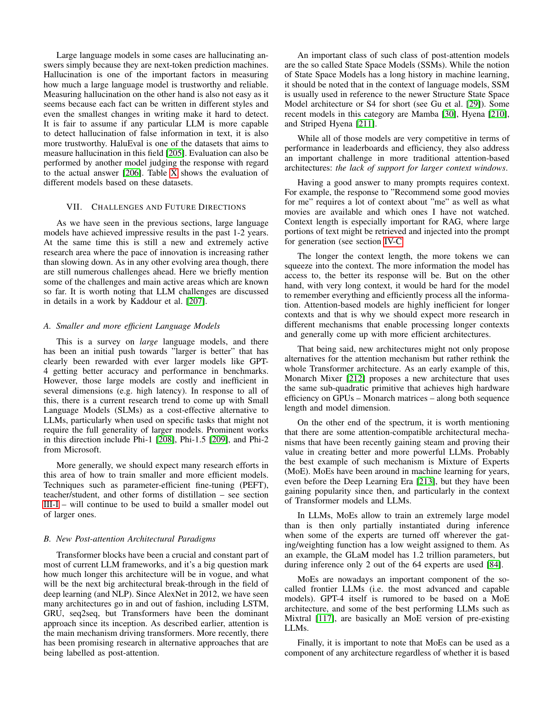

需要强调，MoE 可以作为任意架构的组件，无论底层是否基于注意力。它也已经用于基于 SSM 的 Mamba 模型。未来无论底层架构如何，MoE 驱动的改进都很可能持续出现。

### 7.3 多模态模型

未来 LLM 预计将具有多模态能力，以统一方式处理文本、图像、视频与音频等多种数据。这将为问答、内容生成、创意艺术、医疗、机器人等领域带来更多样化的应用。当前已有 LLaVA、LLaVA-Plus、GPT-4、Qwen-VL 与 NExT-GPT 等重要多模态 LLM，预计趋势还会延续。如何评估这些模型也是新的研究主题，尤其是对话式生成视觉模型。多模态 LLM 可以释放多种任务的巨大潜力，这一方向已经取得相当进展，值得专门撰文全面讨论。

### 7.4 改进大型语言模型的使用与增强技术

第 4 节介绍了如何通过高级提示工程、工具与其他增强技术处理幻觉等 LLM 缺点与局限。这一领域的研究不仅会继续，还会加速。在软件工程这个具体场景中，一些工作已经尝试把此类问题从整体工作流中自动消除。

基于 LLM 的系统已经开始替代不久前仍使用其他方法的机器学习系统。一个明显例子是，LLM 正被用于更好地理解人的偏好与兴趣，在客户服务、内容推荐等应用中提供更个性化的交互。这要求系统理解用户偏好，分析过去交互并把它们作为上下文。未来会继续看到把 LLM 与其他机器学习技术结合，用于个性化、推荐以及更多应用领域的研究。

另一个预计受到更多关注的重要方向，是基于 LLM 的智能体与多智能体系统。让 LLM 系统访问外部工具并获得决策能力，既令人兴奋也极具挑战。这个领域将持续研究与进步，一些观点认为它可能通向通用人工智能。

### 7.5 安全与合乎伦理、负责任的人工智能

确保 LLM 面对对抗攻击和其他漏洞时仍具稳健性与安全性，是关键研究领域。LLM 越来越多地部署到现实应用中，必须防范潜在威胁，避免被用于操纵人或传播错误信息。提高模型推理能力，有助于它们更好地发现潜在对抗攻击。

处理 LLM 的伦理问题与偏见也是活跃研究方向。研究者正努力确保 LLM 公平、无偏，并能负责任地处理敏感信息。越来越多人每天使用 LLM，保证其不带偏见并以负责任方式运行至关重要。

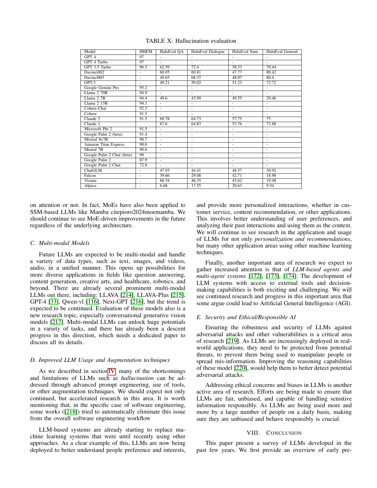

## 8 结论

本文综述过去几年开发的 LLM。我们首先概述 BERT 等早期预训练语言模型，再回顾 GPT、LLaMA、PaLM 三个流行 LLM 家族与其他代表性模型；随后梳理构建、增强和使用 LLM 的方法与技术，回顾常用数据集与基准，并比较一组知名模型在公共基准上的表现；最后提出开放挑战与未来研究方向。

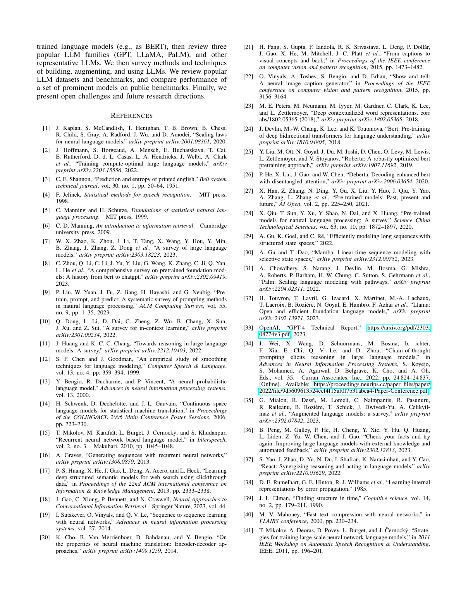

## 参考文献（原文截图）

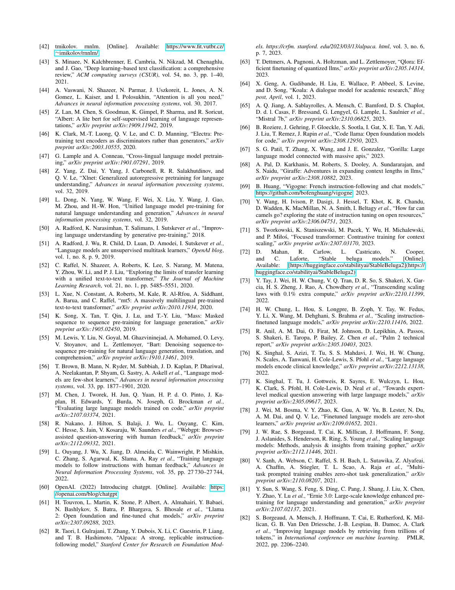

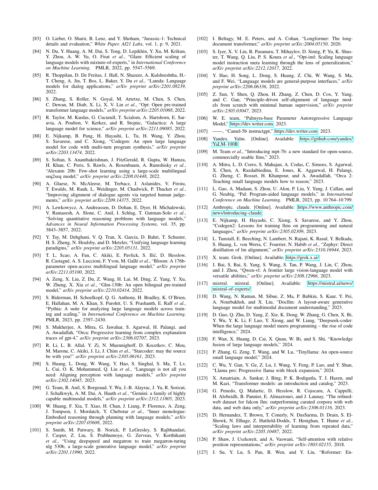

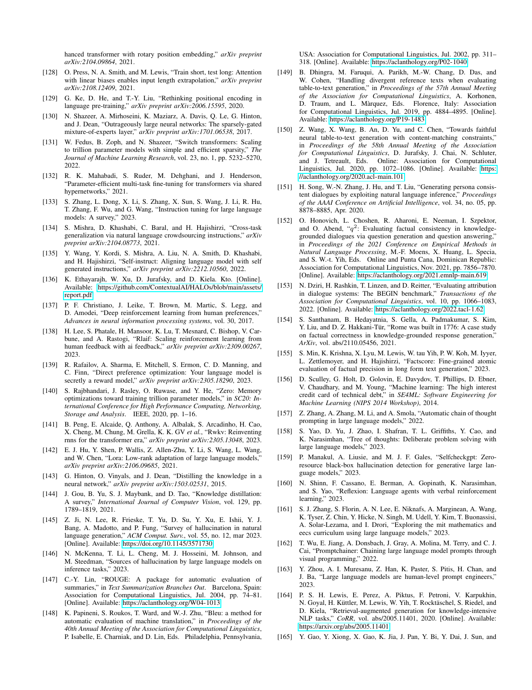

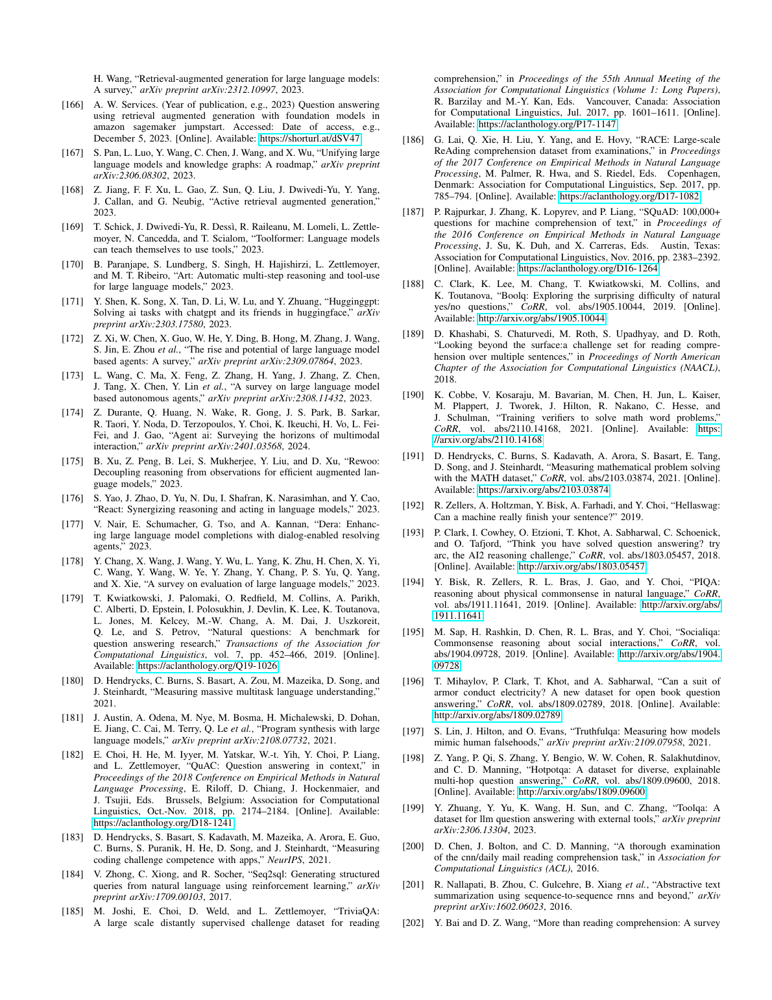

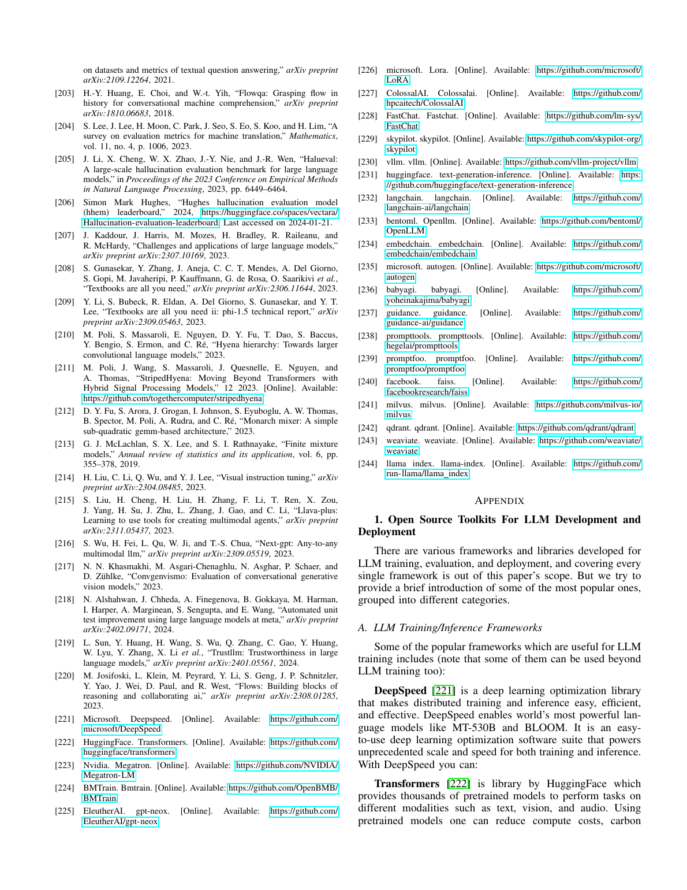

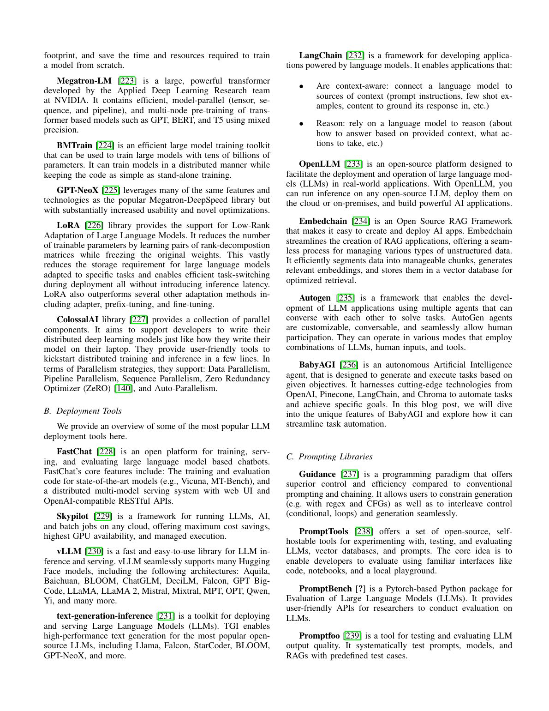

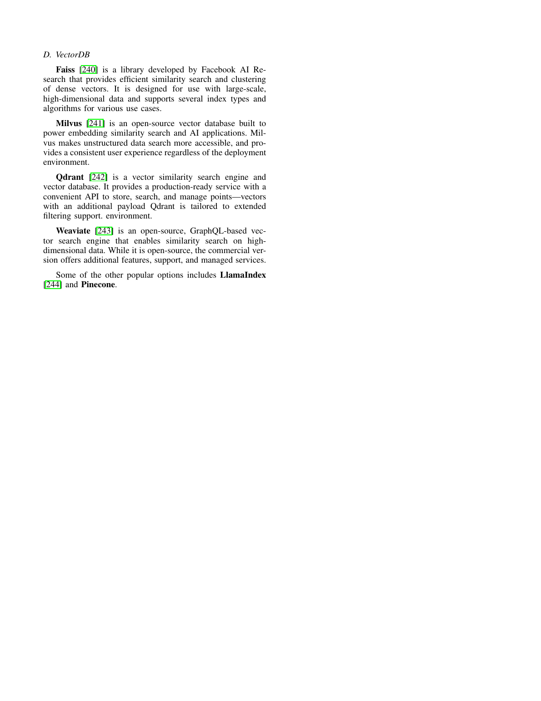
