# DeepSeek 模型关键创新技术综述

**作者：** Chengen Wang、Murat Kantarcioglu

**机构：** University of Texas at Dallas、Virginia Tech

**原文：** [arXiv:2503.11486](https://arxiv.org/abs/2503.11486)

## 摘要

DeepSeek-V3 与 DeepSeek-R1 是面向通用任务和推理任务的领先开源大语言模型。它们只使用顶尖闭源模型训练成本的一小部分，性能却可与 OpenAI、Anthropic 等公司的先进模型竞争。理解这些成果背后的关键创新，对于继续推进大语言模型研究十分重要。

本文综述促成这些模型高效果与高效率的核心技术，包括 Transformer 架构改进、多头潜在注意力（Multi-Head Latent Attention，MLA）、混合专家（Mixture of Experts，MoE）、多词元预测（Multi-Token Prediction，MTP）、算法—框架—硬件协同设计、群组相对策略优化（Group Relative Policy Optimization，GRPO），以及纯强化学习和监督微调与强化学习交替进行的迭代式后训练。作者还指出若干尚未回答的问题，并据此提出潜在研究方向。

**关键词：** DeepSeek、多头潜在注意力、混合专家、群组相对策略优化

## 1 引言

ChatGPT 于 2022 年末出现后，大语言模型研究进入新阶段。GPT、Claude 等模型快速演进；LLaMA 等开源模型虽然已在部分指标上具备竞争力，整体表现仍落后于专有模型。2025 年 1 月，DeepSeek-V3 和新发布的 DeepSeek-R1 以明显更低的训练资源取得接近先进 GPT 模型的性能，引发市场与研究界广泛关注。

本文把相关创新归纳为五条主线：

- 用 MLA 和 MoE 改造 Transformer 的注意力与前馈网络；
- 用 MTP 提高训练数据的样本效率；
- 联合优化算法、训练框架与硬件；
- 用 GRPO 降低大模型强化学习的显存成本；
- 在基础模型上进行纯强化学习，或交替使用监督微调（SFT）与强化学习（RL）完成多阶段后训练。

这些技术集中应用于 DeepSeek-V3 与 DeepSeek-R1，其中一部分最早出现于更早的 DeepSeek 模型。除梳理机制外，本文尤其关注技术报告和消融实验没有充分解释的问题。

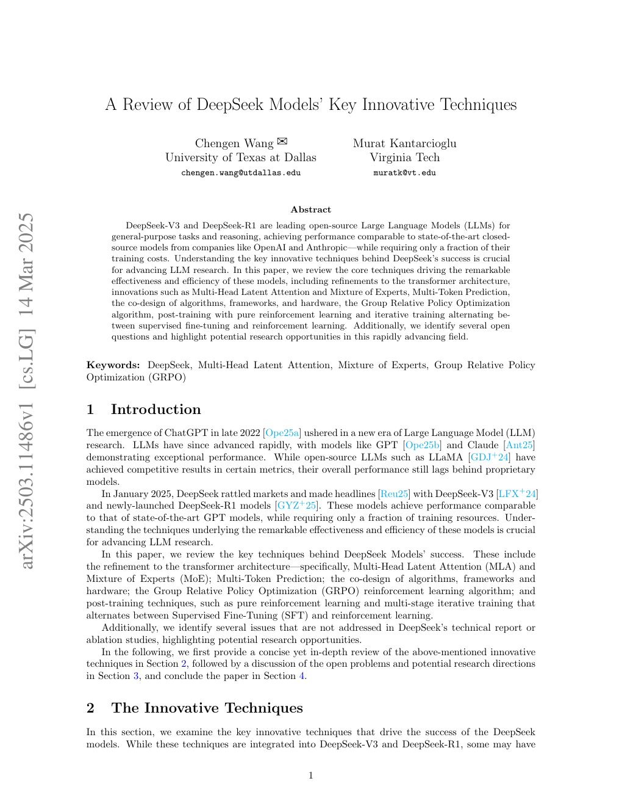

## 2 创新技术

### 2.1 多头潜在注意力

Transformer 的标准多头注意力（Multi-Head Attention，MHA）在推理时缓存已经计算过的键和值，即 KV cache，以避免重复计算。上下文越长，KV cache 的显存占用越容易成为瓶颈。多查询注意力（MQA）和分组查询注意力（GQA）通过减少键值头数量降低缓存，但性能通常不及 MHA。

DeepSeek-V2 提出的 MLA 走了另一条路线：不直接缓存各注意力头完整的键和值，而是把它们压缩到低维潜在向量中。这样既显著减少 KV cache，又能保持乃至超过 MHA 的效果。

#### 2.1.1 标准多头注意力

设第 $t$ 个词元的输入为 $h_t\in\mathbb{R}^d$，标准 MHA 通过三个投影矩阵得到查询、键和值：

$$
q_t=W^Qh_t,\qquad k_t=W^Kh_t,\qquad v_t=W^Vh_t.
$$

它们各自被切分为 $n_h$ 个头，每头维度为 $d_h$。第 $i$ 个头计算查询与历史键的相似度，对对应的值加权求和，最后再拼接所有头并通过输出投影。若模型共有 $l$ 层，则推理时每个词元需要缓存 $2n_hd_hl$ 个元素。

图 1 对比 MHA、GQA、MQA 与 MLA：前三者缓存不同数量的完整键和值；MLA 只缓存联合压缩后的潜在 KV 表示。

#### 2.1.2 低秩键值联合压缩

MLA 把原投影矩阵分解为下投影与上投影两个低秩矩阵。键和值共用下投影，把输入压缩为一个潜在向量：

$$
c_t^{KV}=W^{DKV}h_t,\qquad c_t^{KV}\in\mathbb{R}^{d_c},\qquad d_c\ll d_hn_h.
$$

随后分别通过上投影恢复键和值。推理时，键的上投影可吸收到查询投影中，值的上投影可吸收到输出投影中，因此无须显式恢复完整键和值。模型只需缓存大小为 $d_cl$ 的 $c_t^{KV}$，而非大小为 $2d_hn_hl$ 的完整 KV。MLA 还对查询做低秩压缩，以减少训练时的激活显存。

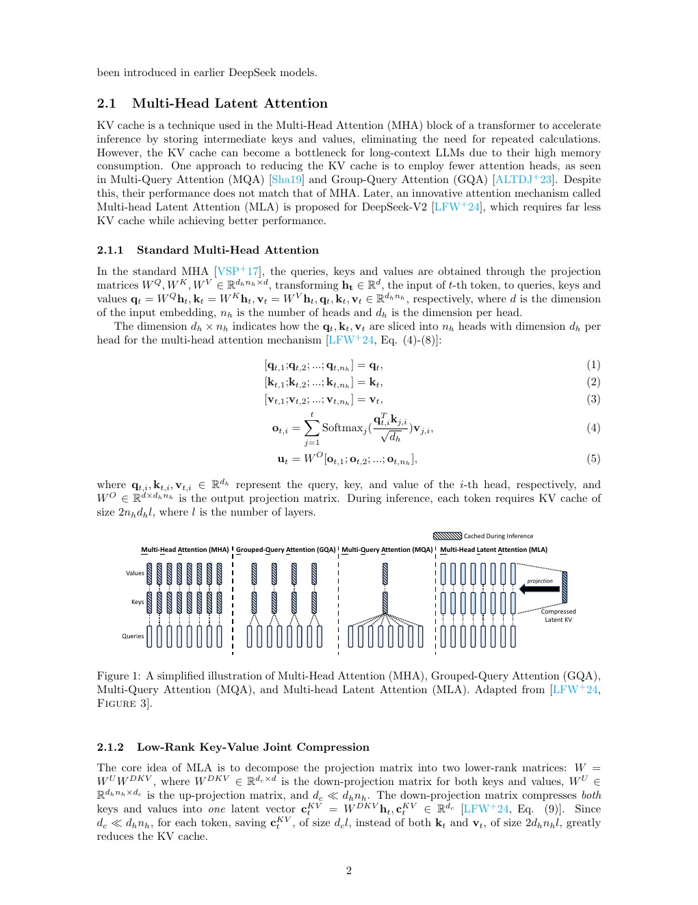

#### 2.1.3 解耦旋转位置编码

旋转位置编码（RoPE）会把相对位置信息写入查询与键。若直接对低秩恢复后的键使用 RoPE，键的上投影矩阵便无法吸收到查询投影中，推理成本会明显增加。

DeepSeek-V2 因此把 RoPE 解耦到另一组查询与键上：每个注意力头拥有独立的 RoPE 查询，但所有头共享一个 RoPE 键。内容注意力使用压缩恢复出的查询与键，位置注意力使用解耦后的查询与键；两组结果拼接后共同计算注意力。推理时除潜在 KV 外，只需额外缓存维度较小的共享 RoPE 键，总缓存规模为 $(d_c+d_h^R)l$。按 DeepSeek-V2 的配置，每个词元的 KV cache 约为 $\frac{9}{2}d_hl$。

已有结果显示 MLA 的性能优于 MHA。作者认为这值得进一步追问：低秩矩阵理论上承载的信息少于原始键值投影，性能提升可能不只来自压缩本身，而与解耦 RoPE 有关。然而现有报告没有单独给出解耦 RoPE 的消融实验，因此无法确认各部分的独立贡献。

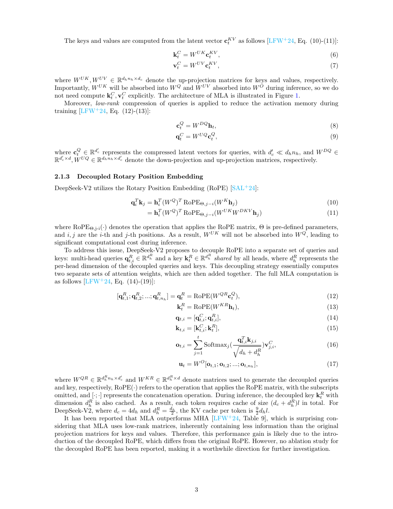

### 2.2 混合专家

混合专家架构通过稀疏激活降低计算成本，同时扩大模型参数规模。它通常以 MoE 层替换 Transformer 中部分前馈网络（FFN）：每个专家的结构与标准 FFN 相同，但每个词元只被路由到少量专家。DeepSeekMoE 在常规 MoE 基础上引入两项关键设计：细粒度专家分割与共享专家隔离。

#### 2.2.1 细粒度专家分割

设常规 MoE 有 $N$ 个专家，每个词元激活 $K$ 个。DeepSeekMoE 沿隐藏维度把每个 FFN 均分为 $m$ 个更小的专家，于是专家总数变为 $mN$，每个词元激活 $mK$ 个。总专家参数量和单词元计算量保持不变，但可选专家组合大幅增加，使不同知识更容易被分配到更专门的专家子空间。

#### 2.2.2 共享专家隔离

不同路由专家可能重复学习跨语境通用知识。为减少这种参数冗余，DeepSeekMoE 固定保留 $K_s$ 个共享专家，每个词元都会经过它们；其余专家仍由路由器按词元选择。为了保持计算成本不变，路由专家总数调整为 $mN-K_s$，每个词元选中的路由专家数调整为 $mK-K_s$。

共享专家负责吸收共通知识，路由专家则更专注于差异化知识。图 2 展示从常规 Top-2 路由，到细粒度分割，再到共享专家隔离的演进过程；三种架构的专家参数量与计算量相同。

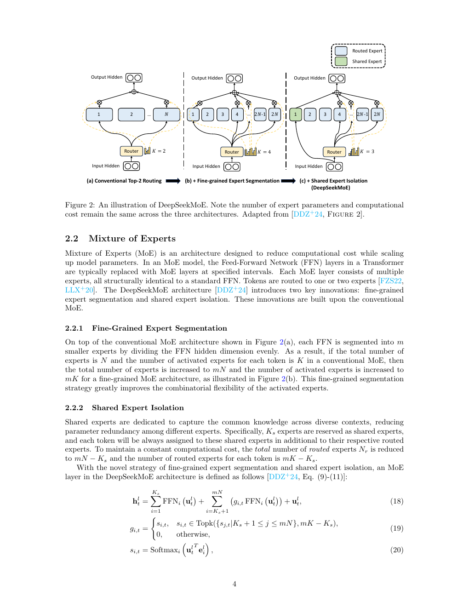

#### 2.2.3 负载均衡

自动学习的路由容易失衡：少数专家被频繁选中、其他专家训练不足；或者同一批激活专家分散在多台设备上，造成高昂的跨设备通信。传统方法加入专家级负载均衡辅助损失，同时还可设置设备级和通信级均衡损失。

作者指出，常见专家级辅助损失的理论解释并不充分。在某些条件下，即使实际词元分配并不均匀，该损失仍可能保持常数，无法推动专家使用率趋于均衡。由于这一公式已被多项工作采用，其成立条件与改进方式值得专门研究。

辅助损失本身还可能损害模型性能。DeepSeek-V3 因此使用无辅助损失的负载均衡策略：为每个路由专家维护偏置 $b_i$，只在 Top-K 选择时把它加到亲和分数 $s_{i,t}$ 上。专家过载时降低偏置，负载不足时提高偏置；真正用于门控加权的仍是原始亲和分数，而不是加偏后的分数。这样可调节选择频率，又不会让均衡信号直接污染专家输出权重。模型另加一个轻量的序列级辅助损失，防止单条序列内部出现极端失衡。

### 2.3 多词元预测

传统自回归语言模型在每个位置只预测下一个词元。DeepSeek-V3 使用 MTP，在主模型之后串联 $D$ 个预测模块，沿完整因果链额外预测后续多个词元。每一深度都复用主模型的词嵌入层与输出头，同时拥有独立的 Transformer 块和线性投影层；当前深度的词嵌入与上一深度的输出拼接后，作为该层的输入。

训练目标是各预测深度交叉熵损失的平均值。一个样本因而能同时提供多个未来位置的监督信号，提高训练数据的利用率与样本效率。作者同时提醒，串联的 MTP 模块会带来传统单词元预测之外的训练时间开销，而 DeepSeek-V3 的 MTP 消融实验没有报告这项代价。

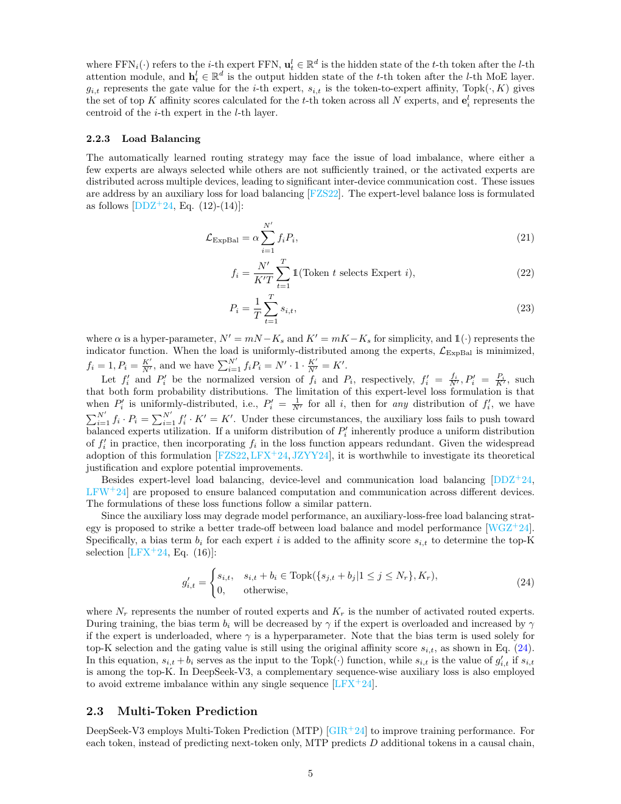

### 2.4 算法、框架与硬件协同设计

DeepSeek-V3 不只依赖单一算法创新，而是通过训练算法、系统框架和硬件的联合优化提高效率。模型在 14.8 万亿词元上完成预训练，总消耗为 278.8 万 H800 GPU 小时。

#### 2.4.1 DualPipe

跨节点专家并行会引入大量通信。DualPipe 把前向和反向计算切成更小的块，并把反向计算进一步拆为输入梯度与权重梯度两部分，使计算和通信能够重叠，从而减少流水线气泡。系统还固定划出一部分 GPU 流式多处理器（SM）负责通信，让 all-to-all 通信尽量隐藏在计算期间。

DualPipe 使用双向流水线调度，从流水线两端同时送入微批次。图 4 给出 8 个流水线并行 rank、20 个双向微批次的调度示例。它的代价是需要保留两份模型参数，增加显存占用。后续研究指出，双向部分并非必要，可以通过“对半切开”的方式移除并继续改进调度。

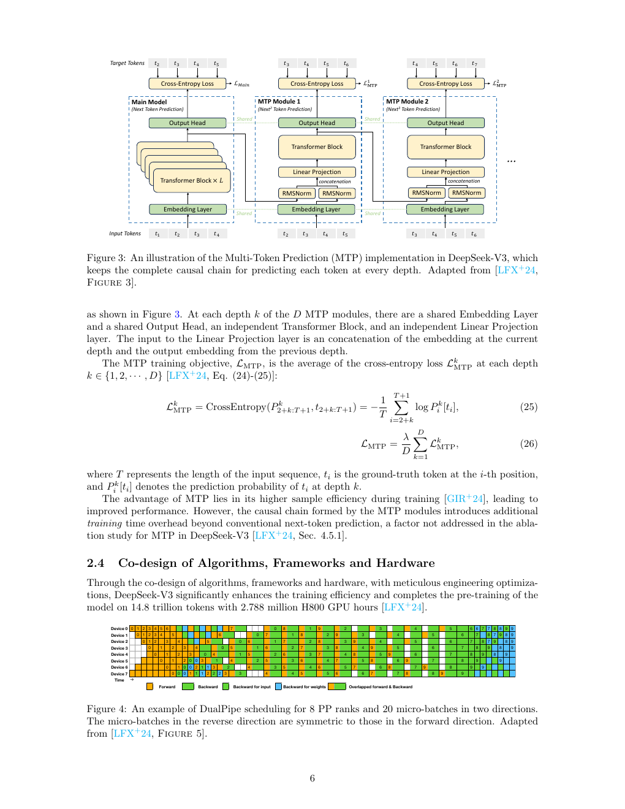

#### 2.4.2 FP8 混合精度训练

DeepSeek-V3 的混合精度框架把大多数通用矩阵乘法（GEMM）核心算子放在 FP8 精度下执行，以提高吞吐；嵌入层、输出头、MoE 门控、归一化和注意力等对低精度敏感的算子则保留原有精度，在效率与数值稳定性之间取平衡。

为扩大 FP8 可表示的动态范围，框架采用细粒度量化：按 $1\times N_c$ 的 tile 或 $N_c\times N_c$ 的 block 分组，DeepSeek-V3 中 $N_c=128$。低精度 GEMM 的准确性又高度依赖高精度累加，因此系统每隔 $N_c$ 个中间结果便把数据提升到 CUDA Core 的 FP32 寄存器中，以完整 FP32 精度累加。

### 2.5 群组相对策略优化

GRPO 是近端策略优化（PPO）的高效变体。PPO 通常同时训练策略模型和价值模型，再由奖励与价值估计优势；但在大语言模型任务中，奖励往往只落在输出末尾，价值函数难以训练，额外的价值模型也占用大量显存。

GRPO 取消价值模型。对于同一个问题，它从旧策略中采样一组 $G$ 个输出，由奖励模型分别打分，再以组内奖励的相对水平估计优势。结果监督把每个输出的最终奖励标准化，并赋给该输出的全部词元；过程监督则在中间步骤给出奖励，每个词元的优势由其后续步骤的标准化奖励累加得到。

优化目标仍采用 PPO 式裁剪，限制新旧策略概率比的变化，并加入相对于参考策略的 KL 惩罚。参考策略通常是初始基础模型或 SFT 模型。图 5 直观显示：PPO 需要参考、奖励和价值模型；GRPO 用组内计算替代价值模型，在保持效果的同时显著降低显存需求。

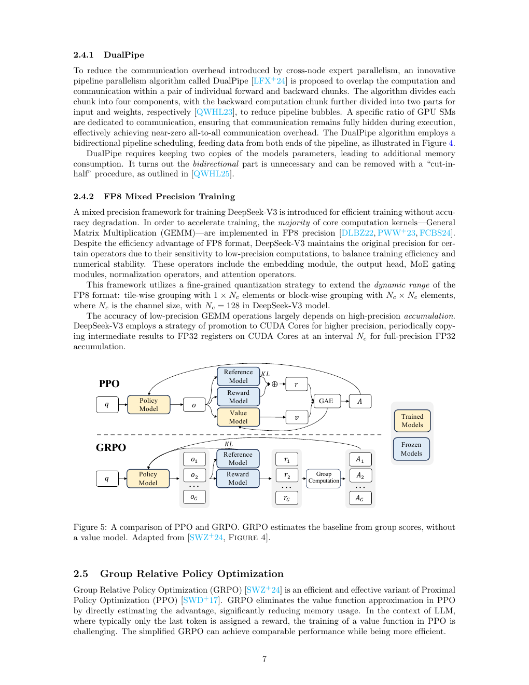

### 2.6 基础模型后训练

#### 2.6.1 纯强化学习

DeepSeek-R1-Zero 直接在 DeepSeek-V3-Base 上进行纯强化学习，不使用任何 SFT 数据。随着训练推进，模型性能持续提高，并自然涌现反思、尝试替代路径等推理行为。这说明基础模型能够只依靠强化学习学习并泛化推理策略。

它使用 GRPO，奖励分为两类：准确性奖励判断答案是否正确；格式奖励要求模型把思考过程放在指定标签内。训练模板先引导模型生成推理过程，再输出最终答案。

纯强化学习虽然取得突出效果，也造成可读性差和语言混杂。DeepSeek-R1 随后采用 SFT 与 RL 交替的迭代流程，以缓解这些问题并继续提升通用能力。

#### 2.6.2 带冷启动的强化学习

DeepSeek-R1 的训练流程包含四个阶段：

1. **冷启动。** 收集数千条长思维链样本，对 DeepSeek-V3-Base 做监督微调，以降低强化学习早期阶段的不稳定性，并为后续训练提供起点。
2. **面向推理的强化学习。** 在冷启动模型上复用 R1-Zero 的强化学习流程，同时增加语言一致性奖励，以思维链中目标语言词语的比例抑制语言混杂。
3. **拒绝采样与监督微调。** 推理强化学习收敛后，从检查点通过拒绝采样收集 60 万条推理数据，只保留答案正确的样本；另收集约 20 万条写作、角色扮演等非推理数据。后者来自 DeepSeek-V3 的部分 SFT 数据，或由 DeepSeek-V3 生成。
4. **强化学习对齐。** 同时改善有用性、无害性和推理能力。有用性依据答案的效用与相关性评估；无害性覆盖完整回答，以减少风险、偏见和有害内容。

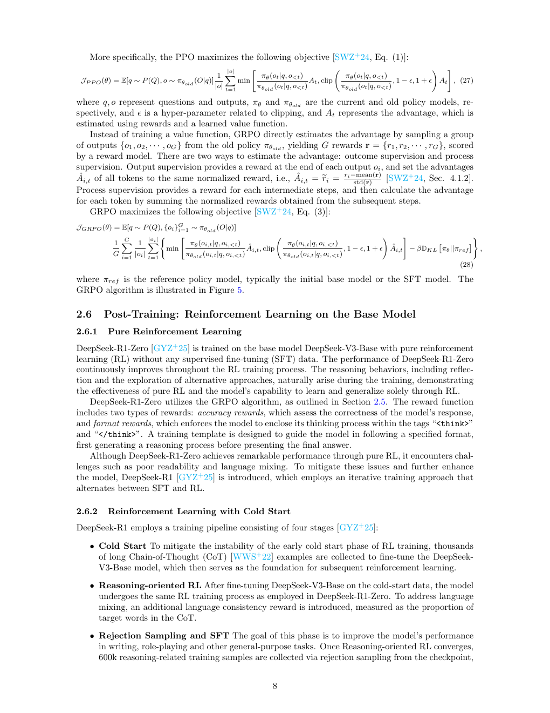

## 3 讨论

作者把后续机会归纳为四个方向。

**Transformer 架构改进。** MLA 改造注意力模块，MoE 改造前馈网络，两者共同支撑 DeepSeek-V3。架构创新会同时影响训练效果与效率。值得补做的工作包括：单独消融解耦 RoPE，以及为现行 MoE 负载均衡目标提供更严格的理论依据。

**提高样本效率。** MTP 证明，同一训练数据可以通过更有效的预测目标释放更多监督价值。但多层预测链也拉长训练时间，后续算法需要同时衡量样本效率和实际墙钟成本。

**算法、框架与硬件协同。** DualPipe 和 FP8 混合精度训练表明，高效大模型训练需要从架构、算法、通信调度和硬件执行方式整体设计，而不能只优化其中一层。对 DualPipe 双向调度的后续改进也说明，系统方案仍有继续简化的空间。

**强化学习。** 纯 RL 在后训练阶段展现出的能力，为推理模型提供了新的研究路线；SFT 与 RL 交替的迭代训练同样具有启发性。GRPO 则说明，重新设计经典强化学习算法的组成部分，可以在大模型场景显著节省 GPU 显存。

## 4 结论

本文综述了 DeepSeek 模型成功背后的关键技术：Transformer 架构中的 MLA 与 MoE、提高样本效率的 MTP、算法—框架—硬件协同设计、GRPO，以及基础模型后训练阶段的强化学习应用。它们共同解释了 DeepSeek 如何兼顾模型能力、训练成本和推理效率；与此同时，解耦 RoPE 的独立贡献、MoE 均衡目标的理论基础、MTP 的墙钟开销等问题仍有待系统验证。

## 参考文献

原论文参考文献从第 9 页开始，涵盖 GQA、DeepSeekMoE、MTP、DeepSeek-V2/V3、GRPO、PPO、RoPE、零气泡流水线并行与思维链提示等相关工作。

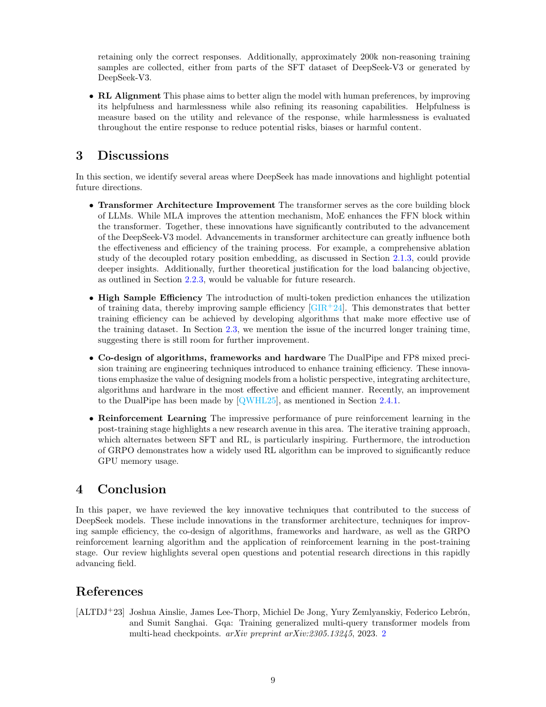

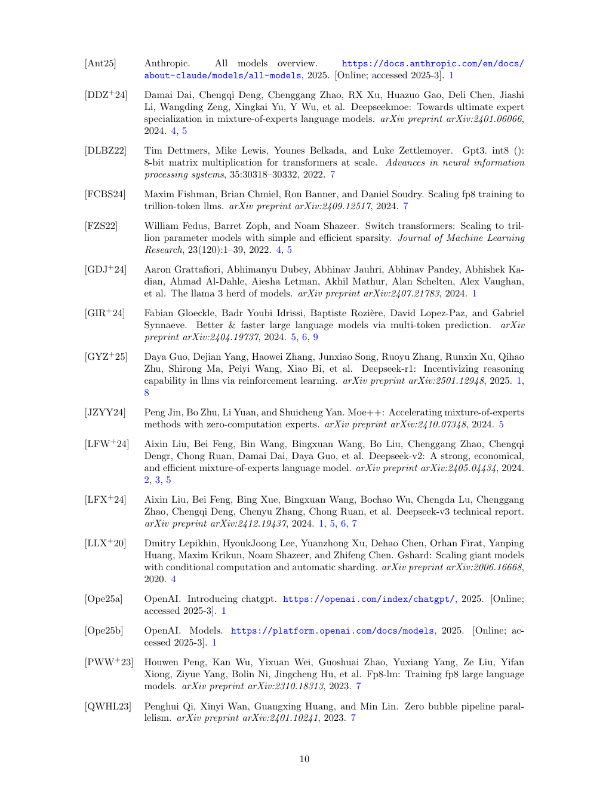

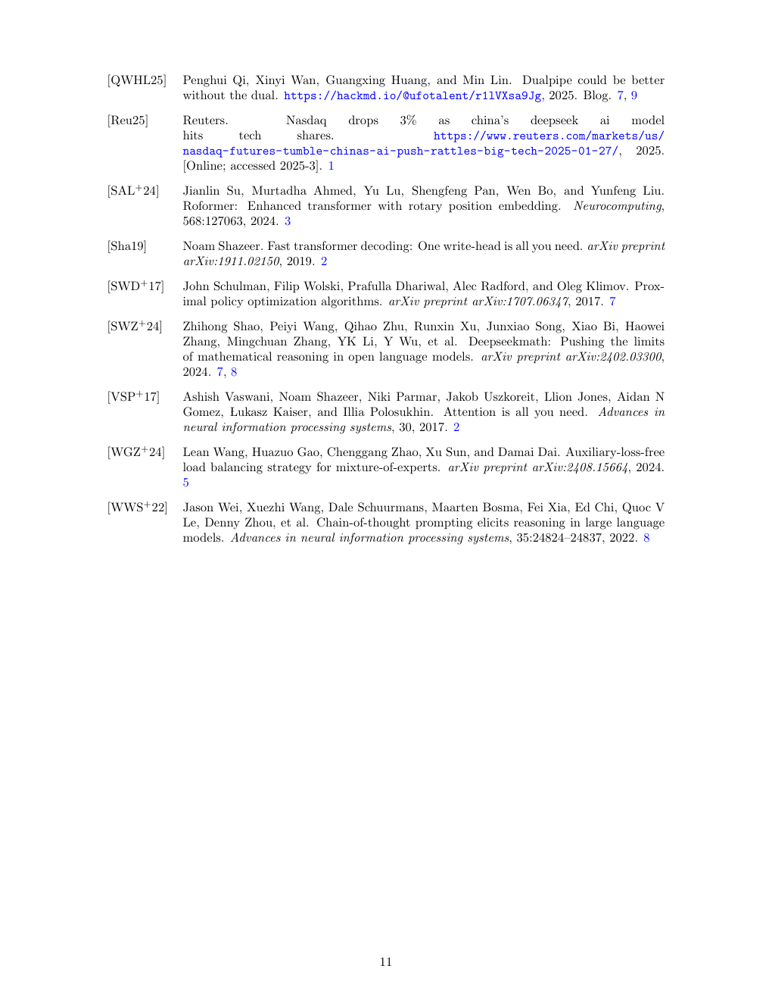
