# DeepSeek 范式转移与技术演进

**原标题：** DeepSeek: Paradigm Shifts and Technical Evolution in Large AI Models

**作者：** Luolin Xiong、Haofen Wang、Xi Chen、Lu Sheng、Yun Xiong、Jingping Liu、Yanghua Xiao、Huajun Chen、Qing-Long Han、Yang Tang

**原文：** [arXiv:2507.09955](https://arxiv.org/abs/2507.09955)

## 摘要

DeepSeek-V3 与 R1 系列凭借较低成本、强性能和开放权重引起全球关注。本文从范式变化出发回顾大型 AI 模型的演进，比较主流大语言模型范式与 DeepSeek 路线；随后介绍多头潜在注意力（MLA）、DeepSeekMoE、多词元预测（MTP）和群组相对策略优化（GRPO）四项算法，并讨论训练、推理和系统架构中的工程突破。

作者进一步分析 DeepSeek 对竞争格局和开源生态的影响，并把未来趋势归纳到数据工程、高效训练、推理优化与场景化应用。全文的核心判断是：大模型竞争正在从单纯增加参数和算力，转向数据质量、算法效率、软硬件协同与测试时计算的共同优化。

**关键词：** 大型 AI 模型、DeepSeek、推理能力、测试时扩展、强化学习

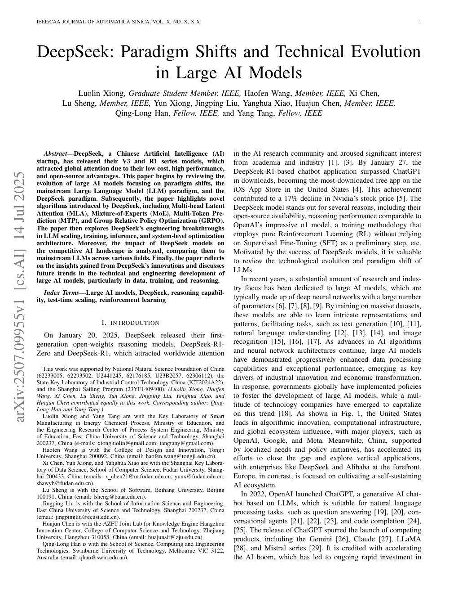

## 1 引言

2025 年 1 月，DeepSeek 发布开放权重推理模型，引发学术界、产业界和公众关注。论文把其吸引力归因于四点：权重开放；推理表现可与先进闭源模型竞争；训练和服务成本相对较低；R1-Zero 展示了不以 SFT 为前置步骤、直接依靠强化学习增强推理的可行性。

大模型此前已经从文本生成扩展到图像、音频等多模态处理。到 2024 年末，新的竞争前沿转向复杂推理：模型在给出答案前投入更多计算，产生较长的逐步解法。OpenAI o1 推动“测试时扩展”受到重视；DeepSeek 则进一步强调经济性与开放性。

DeepSeek-V3 是总参数 671B、每词元激活 37B 的 MoE 模型，结合 MLA、MoE、FP8 混合精度和 MTP。随后，R1-Zero 在 V3-Base 上进行大规模 GRPO 训练；R1 又用冷启动数据、推理/非推理 SFT 与强化学习改善语言混杂和可读性。作者认为，这一系列工作把注意力从“更多参数和算力”重新拉向算法优化和数据质量。

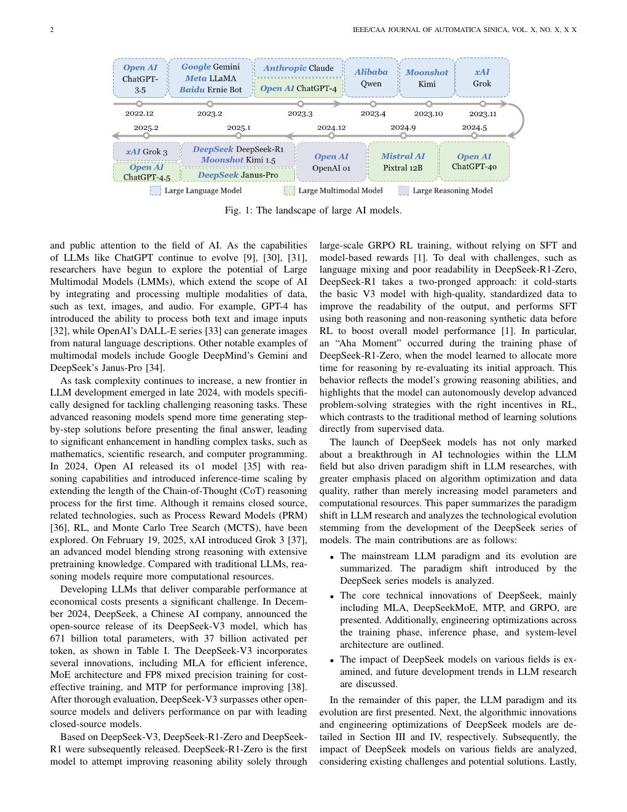

## 2 演进历史

### 2.1 大语言模型的范式转移

论文列出 DeepSeek 系列的规模演进：V1 有 7B/67B 参数、4K 上下文和 2T 训练词元；DeepSeekMoE 为 16B；DeepSeekMath 为 1.3B；V2 扩展到总参数 236B、每词元激活 21B、128K 上下文和 8.1T 词元；V3 达到总参数 671B、激活 37B、128K 上下文和 14.8T 词元；R1/R1-Zero 沿用 671B 级底座。

作者把语言建模史分为五个阶段。

#### 统计与序列模型

早期 HMM、N-gram 依靠频次和词序概率；Word2Vec、GloVe 把词映射到连续向量空间；RNN 与 LSTM 进一步保留跨序列上下文，用于翻译、语音和文本生成。这一时期完成了从离散计数到神经表示的迁移，但长程依赖和并行训练仍受限制。

#### Transformer 与预训练

Transformer 用自注意力让序列元素直接交互，改善长程依赖并支持并行计算。BERT 以双向掩码建模偏重上下文理解；GPT 以自回归预测偏重连贯生成。两者催生大量专用和通用衍生模型，确立“大规模预训练，再面向任务适配”的路线。

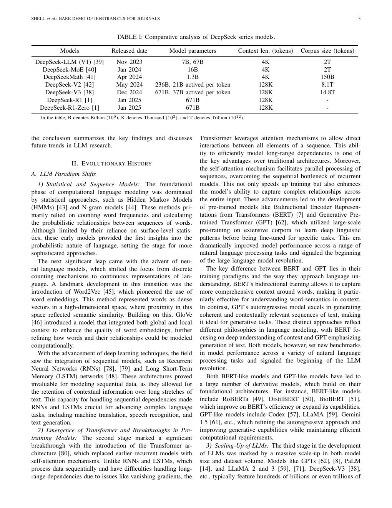

#### 规模扩张

GPT-3、PaLM、LLaMA、Claude、Qwen、DeepSeek-V3 等把参数与数据推向百亿、千亿乃至更高规模。更大的通用语料和模型容量带来少样本与跨任务能力，形成“预训练+人类价值对齐”的主流流程。但训练时间、GPU/TPU、云基础设施和能耗成本快速上升，传统缩放开始出现收益递减。

#### 效率与多模态

剪枝、量化、蒸馏、参数共享和稀疏 MoE 试图在不显著损伤性能的前提下降低成本。与此同时，模型开始统一处理文本、图像和音频。GPT-4、Gemini、Gemma、Janus-Pro 等说明多模态能力必须与高效训练、推理共同设计。

#### 推理能力增强

推理模型把额外计算移到回答阶段，通过更长 CoT、反馈循环、搜索或奖励模型分解复杂任务。它们不只追求单步生成概率，而是允许中间检查、重新规划和多路径探索。论文把 o1、DeepSeek-R1 和 Grok 3 视为这一阶段的代表。

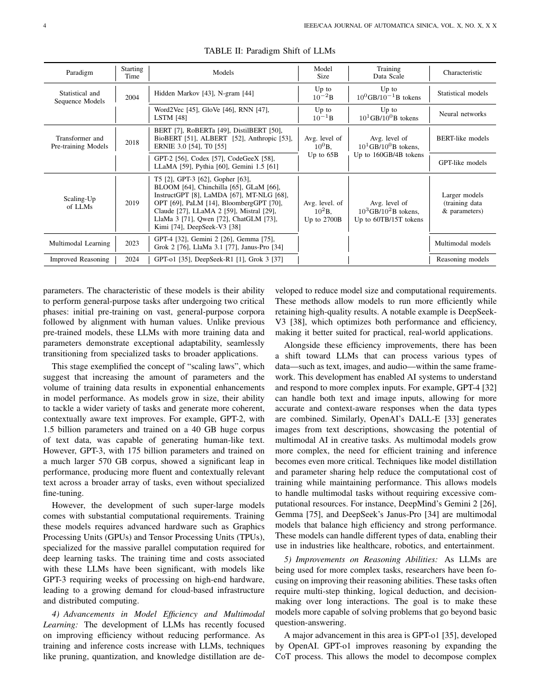

### 2.2 主流大语言模型范式

#### 传统大语言模型

传统模型在预训练阶段学习语言规律和世界知识；在后训练阶段使用指令数据、任务微调与 RLHF 改善可用性和价值对齐；部署时按温度等参数自回归生成，并通过用户反馈继续调整。

#### 推理大语言模型

推理模型的预训练底座仍与传统模型相近，但会提高数学、代码、科学、法律逻辑等复杂数据占比。后训练强调自反馈、错误修正和多步推理。STaR 让模型生成并筛选自己的推理步骤；MCTS 和束搜索在多个候选路径间探索；过程奖励模型评估中间步骤；整个推理过程可写成马尔可夫决策过程，由策略选择下一步、奖励引导路径。

因此，区别不只在“输出更长”：传统模型主要优化一次生成，推理模型则在训练和推理阶段显式组织多步状态转换，并把更多算力用于路径搜索和验证。

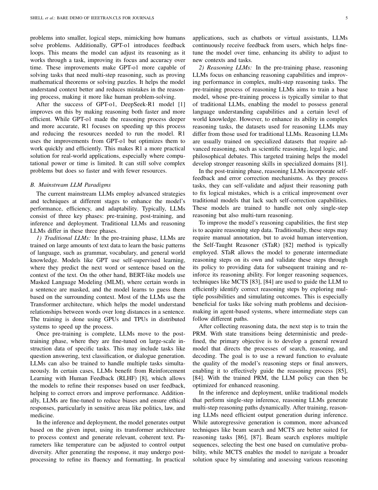

### 2.3 DeepSeek 范式

#### DeepSeek-V3

V3-Base 在 14.8 万亿高质量词元上预训练，提高数学、编程和多语言比例。三项结构创新降低训练与推理成本：MLA 压缩 KV cache；DeepSeekMoE 用细粒度路由专家和共享专家控制计算；MTP 为一个位置提供多个未来词元监督，提高训练信号密度。

后训练使用约 150 万多领域指令数据。推理任务由内部专家模型合成，非推理任务沿用通用模型数据；GRPO 减少强化学习显存，规则奖励与模型奖励按任务组合，最终得到对齐后的 V3。

#### R1-Zero、R1 与蒸馏模型

R1-Zero 直接在 V3-Base 上使用 GRPO，不先做 SFT。准确性奖励判断结果，格式奖励约束输出结构。纯强化学习得到强推理能力，但存在语言混杂与可读性问题。

R1 的流程分三步：先用冷启动 CoT 做 SFT，再强化数学和代码推理，并通过拒绝采样收集 60 万条推理数据；随后加入 20 万条写作等非推理数据；最后以 80 万条数据做 SFT 和 RL，同时加入有用性与无害性目标。R1-Distill 则把这些数据用于 Qwen2.5、Llama 3 等较小模型，牺牲部分性能换取本地部署能力。

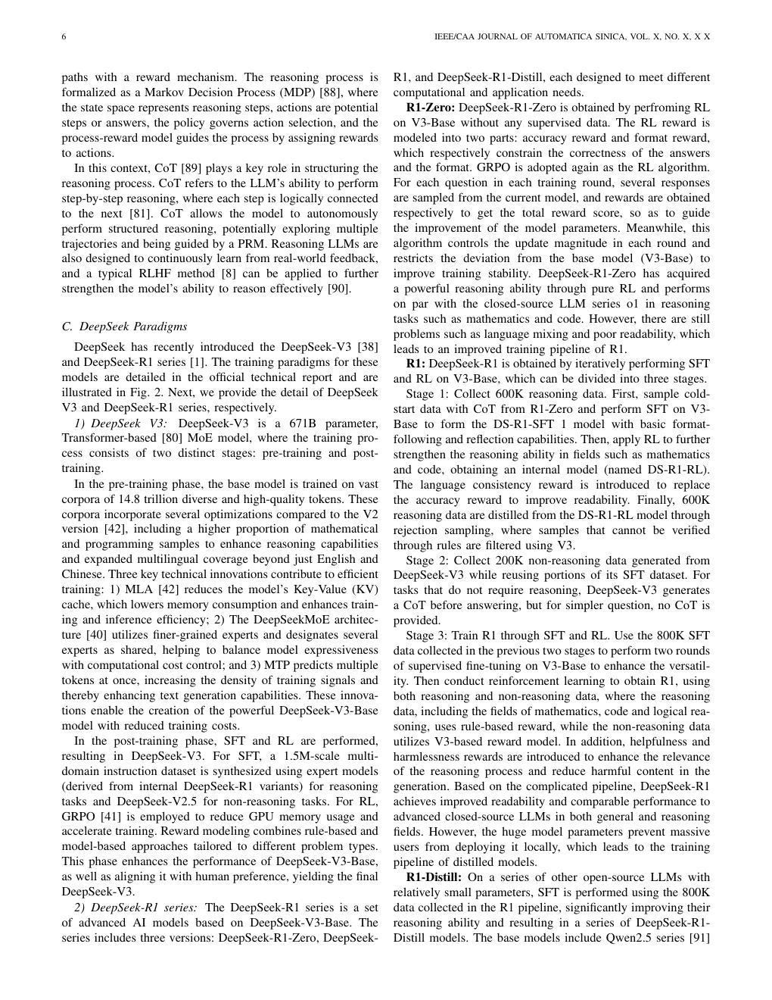

#### 多模态系列

DeepSeek-VL2 使用 LLaVA 式视觉编码器和语言模型连接，同时通过动态切片处理高分辨率与极端长宽比图像：局部 384×384 切片保留细节，额外缩略图提供全局上下文。模型在 800B 视觉语言词元上训练，并利用 DeepSeekMoE 控制激活成本。

Janus-Pro 则把理解与生成的视觉编码解耦：SigLIP 负责高层语义，VQ tokenizer 把图像转成离散生成词元，统一自回归 Transformer 处理两条路径。扩充数据并放大到 7B 后，模型同时提升多模态理解和文生图指令遵循。

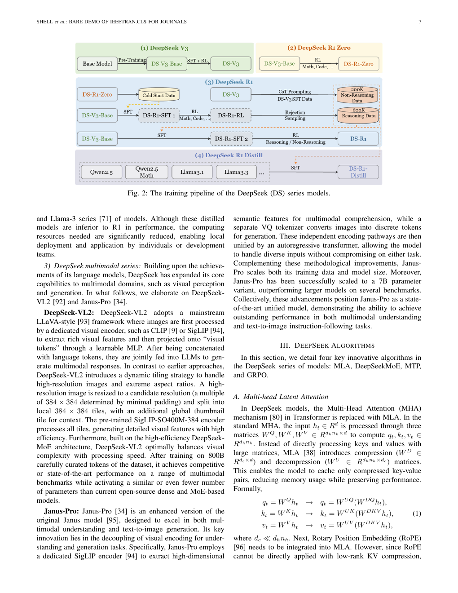

## 3 DeepSeek 核心算法

### 3.1 多头潜在注意力

标准多头注意力为每个词元缓存完整键和值，长上下文显存开销很高。MLA 对查询、键和值使用低秩压缩与恢复矩阵，使推理时只缓存联合压缩后的潜在 KV。为兼容旋转位置编码，模型把 RoPE 解耦到额外的查询和共享键上，再与内容查询/键拼接。

与 MQA、GQA 通过共享键值头减少缓存不同，MLA 保留更丰富的多头信息，同时以潜在向量压缩 KV，目标是在显著减少内存和计算的同时避免明显精度损失。

### 3.2 DeepSeekMoE

DeepSeekMoE 以两项设计替换普通 FFN：把专家切得更细，让不同专家更专门化；设置始终激活的共享专家，吸收跨语境公共知识。路由专家只在需要时激活，辅助损失自由的偏置动态调节 Top-K 选择，避免少数专家过载。

这直接针对传统 MoE 的两类问题：专家数量少时，一个专家被迫混合多种知识；不同专家又可能重复保存相同知识。细粒度拆分提高组合灵活性，共享专家隔离减少冗余。

### 3.3 多词元预测

MTP 在主模型后串联多个模块。第 $k$ 个模块同时接收上一深度的隐藏状态和真实的前序词元嵌入，继续预测更远的第 $k$ 个未来词元。所有深度的交叉熵平均后加入训练目标。

与彼此独立的并行多头预测相比，DeepSeek 的模块按深度保持因果链，减少同时预测多个词元时丢失顺序依赖的问题。训练阶段使用真实词元作为下一深度输入，也能稳定优化。

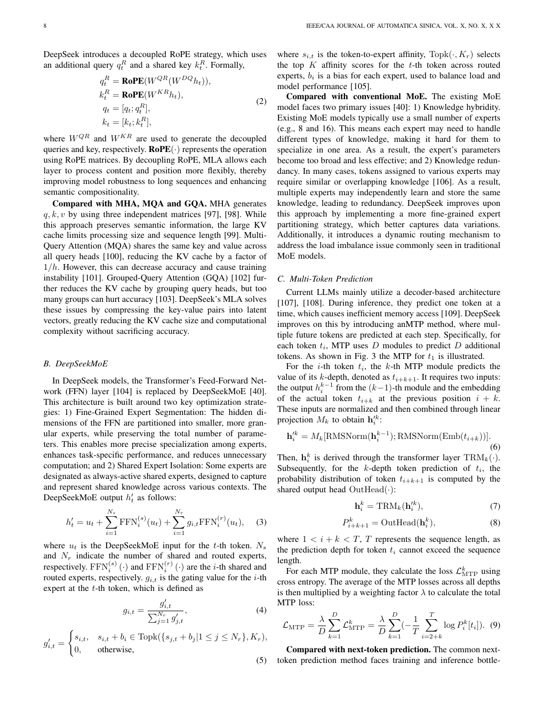

### 3.4 群组相对策略优化

PPO 需要一个与策略模型规模相近的价值模型，显存和计算成本高。GRPO 针对同一问题从旧策略采样一组回答，用组内奖励的均值和标准差得到相对优势，不再训练价值模型：

$$
A_i=\frac{r_i-\operatorname{mean}(r)}{\operatorname{std}(r)}.
$$

策略目标仍裁剪新旧概率比，并把相对于参考模型的 KL 散度直接加入损失。奖励通常包括正确性和格式。作者认为，这种设计在降低强化学习资源的同时限制策略过度偏离底座，减轻灾难性遗忘。

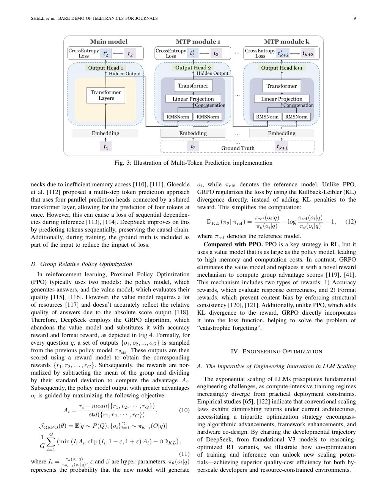

## 4 工程优化

### 4.1 训练阶段

DeepSeek-V3 的 FP8 框架把大部分 GEMM 放在 8 位浮点精度下执行，嵌入、注意力、门控等敏感算子保留 BF16/FP32；分组缩放缓和激活、权重和梯度离群值，累加仍用 FP32。论文称，与 BF16 基线相比相对误差低于 0.25%，定制 Hopper 内核在特定场景可比优化 CUTLASS 基线快 2.7 倍。

显存方面，模型不保存所有中间激活，而在反向传播时重算 RMSNorm、MLA 上投影等；参数指数移动平均放在 CPU 异步更新；MTP 与主模型共享嵌入层和输出头。

### 4.2 推理阶段

MLA 直接降低 KV cache，查询也做低维压缩。FlashMLA 针对 Hopper GPU 和变长序列优化解码，论文报告在 H800 SXM5 上的内存受限场景可达 3000 GB/s，计算受限场景可达 580 TFLOPS。稀疏 MoE 只激活少数专家，进一步降低每词元计算。

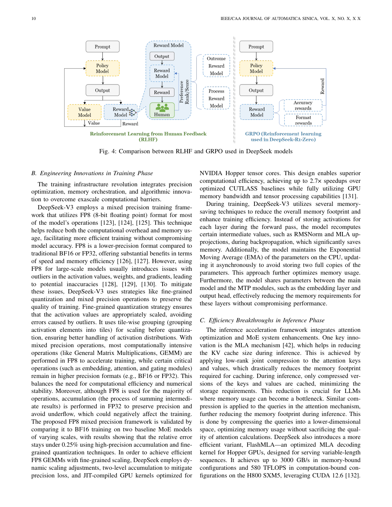

### 4.3 系统级协同

DualPipe 重排流水线，把前向、反向与跨阶段通信重叠，减少流水线气泡。跨节点 all-to-all 内核按通信范围利用 NVLink 与 InfiniBand，并限制单词元涉及的节点数；冗余专家帮助把高负载路由分散到更多设备。

DeepEP 为 MoE dispatch/combine 提供高吞吐、低延迟内核，支持 FP8、NVLink/RDMA 域内外传输和通信计算重叠。论文引用的基准称 FP8 可提高 1.5–2.5 倍吞吐，MoE 分发/合并延迟降低 30%–50%，RDMA 解码端到端时间降低 10%–25%。在线服务还用双批次重叠，把请求分成两个微批，使一批计算时另一批通信。

这些做法体现论文反复强调的原则：算法、训练框架、低层内核、互连和部署调度必须协同设计，单点优化无法突破超大规模的通信与内存瓶颈。

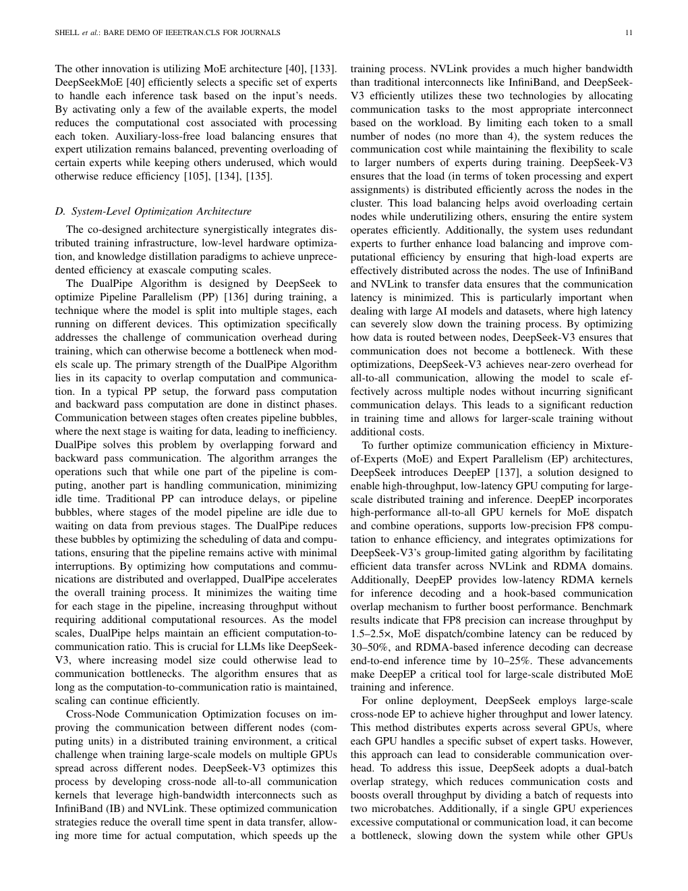

## 5 影响与挑战

### 5.1 对大模型格局的影响

**技术普惠。** 论文认为，开放权重和宽松许可降低了中小企业与个人使用前沿模型的门槛，也促使能力更快扩散到不同行业。

**重塑基础设施。** MoE 需要动态稀疏计算与高带宽内存；长 CoT 同时加重预填充计算和解码阶段 KV cache 访问。模型架构由此反向推动芯片、互连和软硬件一体化服务栈演进。

**后预训练时代的路线。** 推理模型把合成数据、智能体环境交互和测试时计算连接成闭环：模型生成数据、在环境中执行、用反馈优化决策，再扩大下一轮能力边界。这比依赖静态预制数据更接近持续自演化系统。

### 5.2 三类挑战

**长思维链成本。** 推理轨迹增长会推高计算、存储、能耗和 KV cache。可行方向包括压缩或合并冗余步骤，以及在潜在空间中进行隐式 CoT，需要时再解码为可读过程。

**奖励机制。** 只按最终答案评分不容易引入复杂过程奖励的奖励黑客，却会忽略中间步骤是否正确。证明等任务要求每一步都成立，因此需要兼顾可靠过程监督与抗投机能力。

**安全对齐。** 长 CoT 增加提示注入、推理干扰和敏感信息泄漏面；但过度安全对齐又可能损害能力。作者主张采用可动态调节的安全策略，在风险和性能损失间寻找平衡。

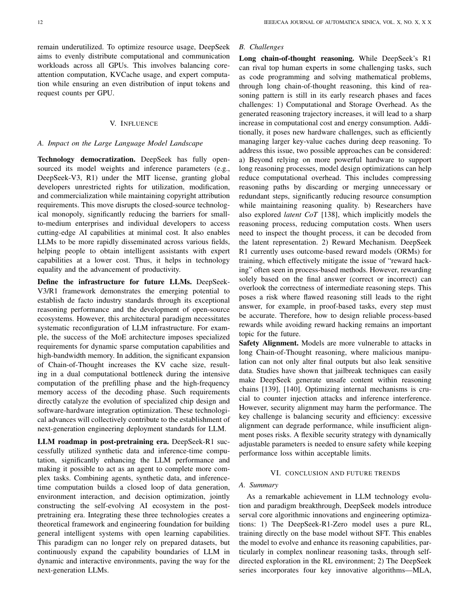

## 6 结论与未来趋势

作者把 DeepSeek 的技术范式总结为三层：R1-Zero 用纯强化学习展示基础模型的自发推理演化；MLA、DeepSeekMoE、MTP、GRPO 在能力与成本间重新平衡；FP8、分布式训练和系统通信优化把算法优势落实到可扩展工程。

未来趋势包括：

- **数据工程：** 从追求规模转向质量、多样性和成本，利用多模态检索、生成模型和智能体构建动态清洗、标注与增强流水线；
- **高效训练：** 继续发展 MoE、混合精度、通信压缩、异步执行与软硬件协同；
- **推理优化：** 用量化、蒸馏、剪枝和硬件加速把轻量推理模型部署到移动、物联网和边缘设备；
- **场景化应用：** 将专家知识与轻量微调结合，为科学研究、工业和具体行业快速定制模型。

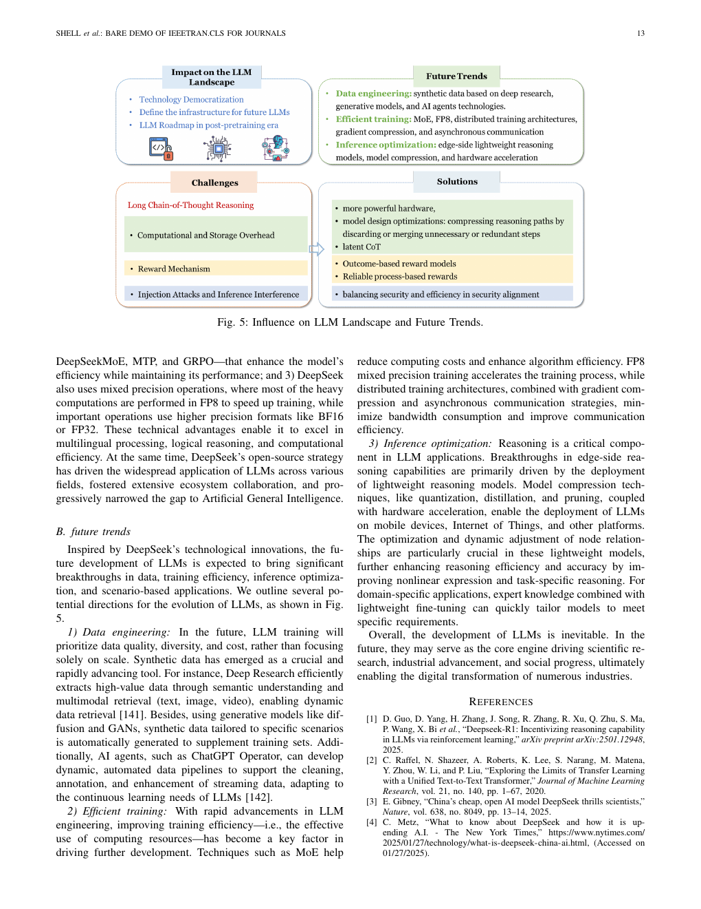

## 参考文献

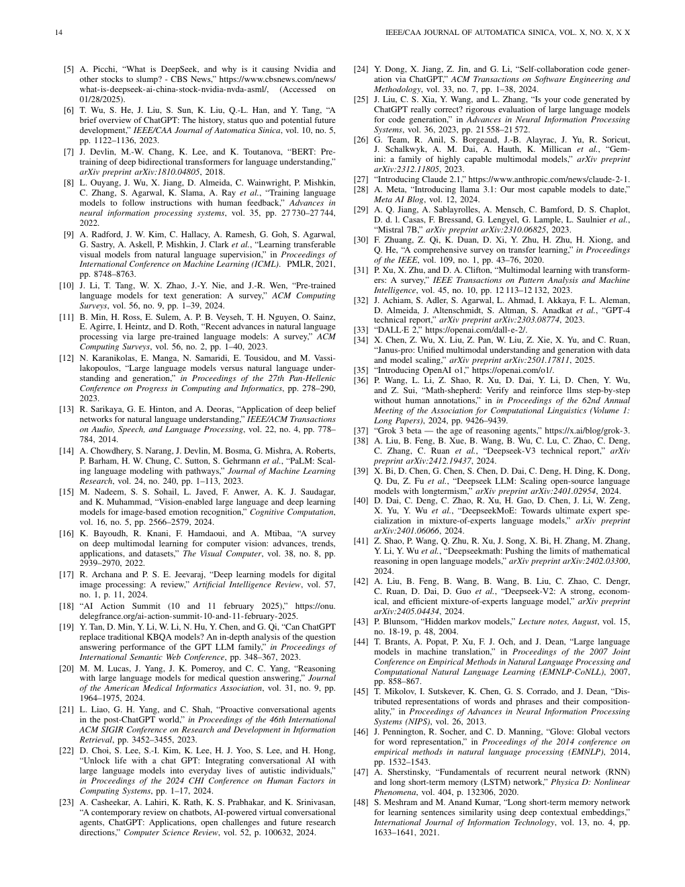

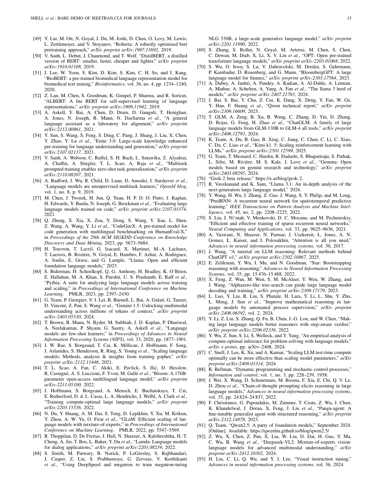

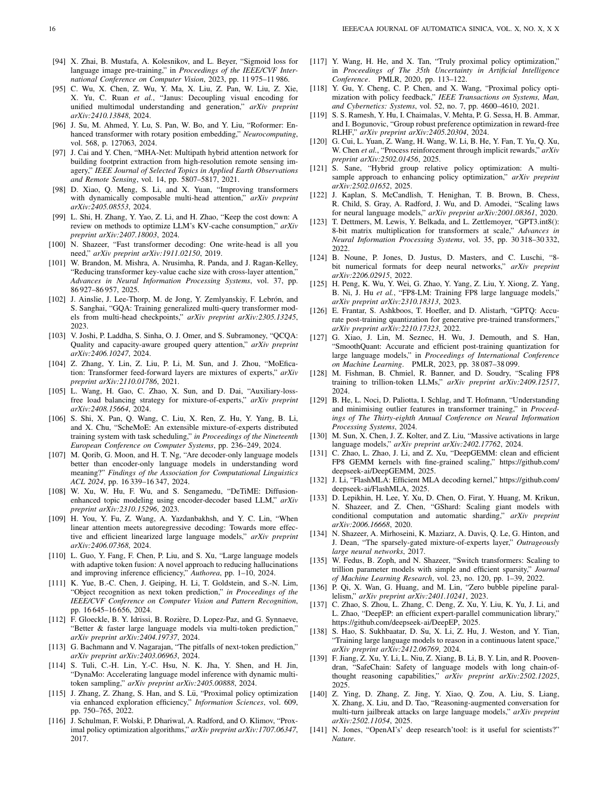

