# DeepSeek-OCR：上下文的光学压缩

**作者：** Haoran Wei、Yaofeng Sun、Yukun Li  
**机构：** DeepSeek-AI  
**首次公开：** 2025 年 10 月 21 日  
**原文：** [arXiv:2510.18234](https://arxiv.org/abs/2510.18234)  
**代码与模型：** [DeepSeek-OCR](https://github.com/deepseek-ai/DeepSeek-OCR)

## 摘要

本文提出 DeepSeek-OCR，初步研究能否通过“光学二维映射”压缩长上下文。模型由两个部分组成：负责视觉编码与压缩的 DeepEncoder，以及作为解码器的 DeepSeek-3B-MoE-A570M。DeepEncoder 的核心目标，是在接收高分辨率图像时维持较低的激活开销，同时通过高压缩率把视觉词元数量控制在可管理范围内。

实验显示，当文本词元数不超过视觉词元数的 10 倍，即压缩率低于 10× 时，模型的 OCR 解码准确率可达 97%；即使压缩率达到 20×，准确率仍约为 60%。这说明，把历史上下文渲染为图像并逐步压缩，可能为超长上下文与“记忆遗忘”机制提供新的研究路径。

DeepSeek-OCR 同时具有较强的实际文档解析能力。在 OmniDocBench 上，它只使用 100 个视觉词元便超过使用 256 个词元的 GOT-OCR2.0；使用不足 800 个视觉词元时，又超过平均每页消耗 6000 多个词元的 MinerU2.0。在生产环境中，单张 A100-40G 每天可处理 20 万页以上数据。

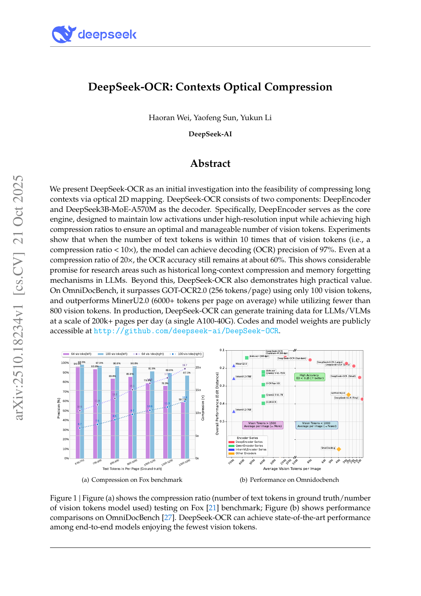

## 阅读导航

论文先说明“上下文光学压缩”的动机，再比较现有视觉编码器，随后介绍 DeepEncoder、MoE 解码器、数据引擎与训练流程。评估部分分别讨论视觉—文本压缩边界、实际 OCR 性能与定性能力，最后提出一种随时间逐步降低旧上下文图像分辨率的视觉遗忘机制。

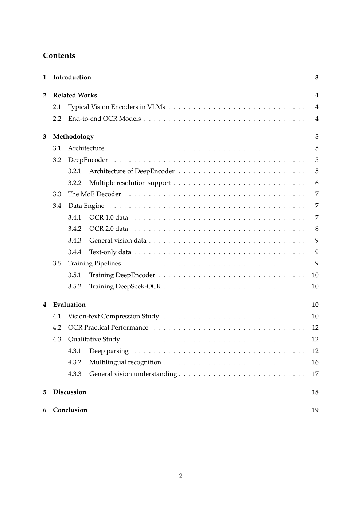

## 1 引言

大语言模型的上下文长度持续增长，但长上下文会显著增加计算与显存成本。常见方法通常从文本侧压缩历史信息，而本文提出另一个方向：把文字映射到二维图像，让视觉编码器把大量文字压缩为较少的视觉词元，再由语言模型解码。

这一想法依赖三个观察。第一，图像天然具有二维空间，可以比一维文本序列更紧凑地承载信息。第二，视觉语言模型已经具备从图像中恢复文字和结构的能力。第三，OCR 恰好形成了“视觉表示—文本表示”的自然压缩与解压过程，并能用准确率、编辑距离等指标直接衡量。

作者把 DeepSeek-OCR 定位为概念验证，并给出三项主要贡献：

1. **量化视觉—文本词元压缩率。** 在 Fox 文档基准上，9–10× 压缩时 OCR 准确率超过 96%，10–12× 时约为 90%，接近 20× 时仍约为 60%。
2. **提出 DeepEncoder。** 它通过串联窗口注意力、16× 卷积词元压缩和全局注意力，在高分辨率输入下兼顾激活开销与视觉词元数量。
3. **构建可实际使用的 DeepSeek-OCR。** 模型以 DeepEncoder 配合 DeepSeek-3B-MoE，并支持文档版面、图表、化学式、简单平面几何与自然图像解析。

在 20 个节点、每节点 8 张 A100-40G 的配置下，系统每天可生成约 3300 万页训练数据。作者认为，这种方法可让不同年代的历史上下文采用 7–20× 不等的压缩率，从而为大模型和智能体系统提供更低成本的长期记忆。

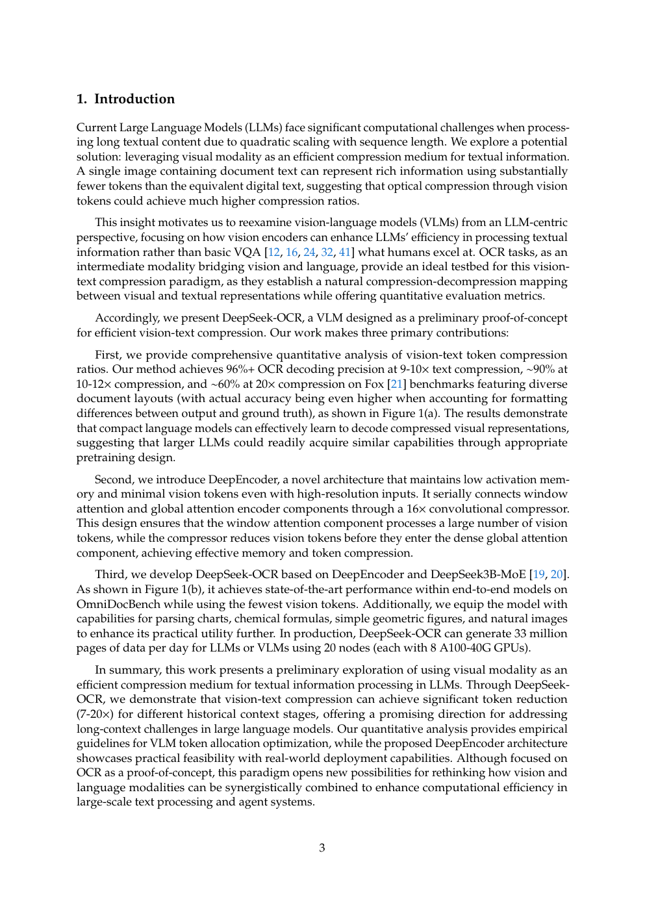

## 2 相关工作

### 2.1 视觉语言模型中的典型视觉编码器

当前开源视觉语言模型主要采用三类编码方案。

- **双塔结构。** 以 Vary 为代表，通过并行 SAM 编码器扩展高分辨率视觉词汇。参数量和激活内存较可控，但需要两套图像预处理，部署复杂，也不利于训练时的流水线并行。
- **切片结构。** 以 InternVL2.0 为代表，把大图切成若干小块并行处理，因此能应对极高分辨率并降低单块激活开销。不过其原生编码分辨率通常低于 512×512，大图会被过度切碎，产生大量视觉词元。
- **自适应分辨率结构。** 以 Qwen2-VL 为代表，采用 NaViT 思路直接把完整图像切成 patch。它对各种分辨率较灵活，但大图会带来巨大的激活内存，序列打包也需要很长的训练序列；视觉词元过多还会拖慢预填充和生成。

### 2.2 端到端 OCR

端到端 OCR 把传统的检测、识别和版面分析流水线简化为统一的图像到文本模型。Nougat 展示了学术论文 OCR 的潜力；GOT-OCR2.0 扩展到更广泛的合成图像解析；Qwen-VL、InternVL 等通用视觉模型也在持续提升文档能力。

不过，现有工作很少直接回答一个基础问题：一页含有 1000 个文字词元的文档，至少需要多少视觉词元才能可靠解码？这正是“一图胜千言”在模型计算层面的定量版本。

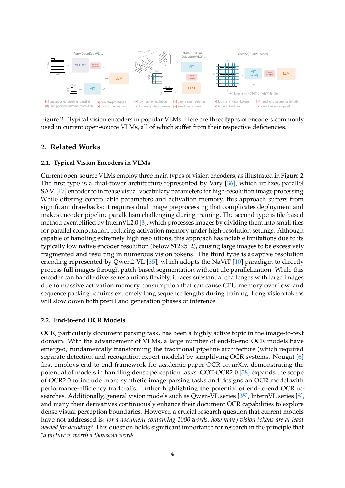

## 3 方法

### 3.1 总体架构

DeepSeek-OCR 采用统一的端到端视觉语言模型结构：

- **DeepEncoder** 负责提取图像特征、视觉词元化与压缩，参数量约 3.8 亿；
- **DeepSeek-3B-MoE** 根据视觉词元与提示词生成结果，总参数约 30 亿，每次推理激活约 5.7 亿参数。

DeepEncoder 主要由约 8000 万参数的 SAM-base 与约 3 亿参数的 CLIP-large 串联而成。前者以窗口注意力处理大量局部视觉词元，后者以全局注意力整合压缩后的表示。

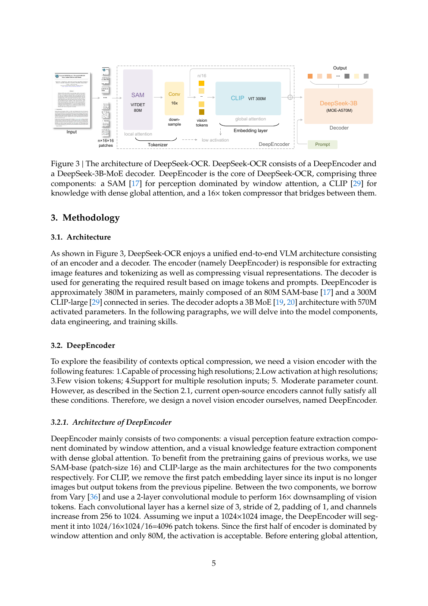

### 3.2 DeepEncoder

#### 3.2.1 架构

为了验证上下文光学压缩，视觉编码器必须同时满足：支持高分辨率、高分辨率下激活较低、输出视觉词元少、支持多种输入分辨率，并保持适中的参数规模。

DeepEncoder 的前半段采用 SAM-base，patch 大小为 16，以窗口注意力为主；后半段采用 CLIP-large，以稠密全局注意力为主。由于 CLIP 的输入不再是图像，而是前级输出的视觉词元，因此移除其首个 patch embedding 层。

两者之间插入两层卷积压缩器，每层卷积核为 3、步幅为 2、padding 为 1，通道数从 256 增长到 1024，总计把视觉词元压缩 16 倍。例如输入 1024×1024 图像时，SAM 先产生 4096 个 patch 词元；进入全局注意力前，卷积模块把它们压缩为 256 个。这样，大量词元主要停留在参数较小、采用窗口注意力的前半段，全局注意力只处理压缩后的短序列。

#### 3.2.2 多分辨率支持

DeepEncoder 通过动态插值位置编码，在一个模型中共同训练多种分辨率模式。

| 模式 | 输入分辨率 | 输出视觉词元 | 处理方式 |
| --- | ---: | ---: | --- |
| Tiny | 512×512 | 64 | 直接缩放 |
| Small | 640×640 | 100 | 直接缩放 |
| Base | 1024×1024 | 256 | 保持比例后补边 |
| Large | 1280×1280 | 400 | 保持比例后补边 |
| Gundam | n×640×640 + 1024×1024 | n×100 + 256 | 局部切片 + 全局视图 |
| Gundam-M | n×1024×1024 + 1280×1280 | n×256 + 400 | 高分辨率局部切片 + 全局视图 |

Tiny 与 Small 为避免浪费词元，直接把图像缩放到固定尺寸；Base 与 Large 为保留原始宽高比而采用补边。补边后，有效视觉词元数小于实际输出数，可按图像长宽比估算：

$$
N_{\text{valid}}=
\left\lceil N_{\text{actual}}
\left[1-\frac{\max(w,h)-\min(w,h)}{\max(w,h)}\right]\right\rceil .
$$

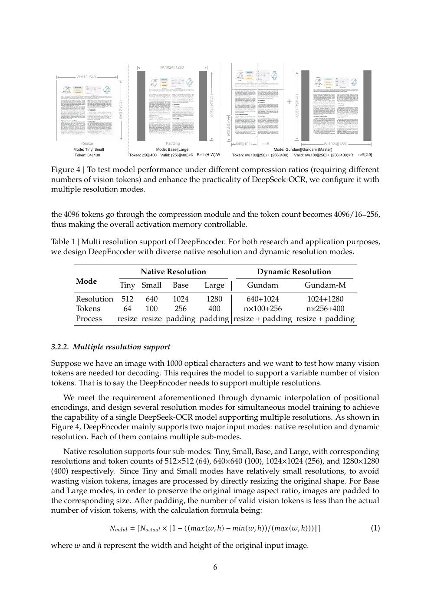

动态分辨率用于报纸等超高分辨率输入。Gundam 模式把图像切为 2–9 个 640×640 局部视图，并额外保留一个 1024×1024 全局视图；其输出词元数为 $n\times100+256$。如果图像宽高都小于 640，则退化为 Base 模式。

Gundam 与四种原生分辨率共同训练。更大的 Gundam-M 通过在已训练模型上继续训练获得，避免与其他模式共同训练时拖慢整体速度。

### 3.3 MoE 解码器

解码器采用 DeepSeek-3B-MoE。推理时从 64 个路由专家中激活 6 个，并同时激活 2 个共享专家，总激活参数约 5.7 亿。它以接近 5 亿参数小模型的推理成本，获得约 30 亿参数模型的表达能力，适合 OCR 这类领域集中的视觉语言研究。

解码过程可以写为：

$$
f_{\text{dec}}:\mathbb{R}^{n\times d_{\text{latent}}}
\rightarrow \mathbb{R}^{N\times d_{\text{text}}},
\qquad
\hat X=f_{\text{dec}}(Z),\quad n\le N.
$$

其中 $Z$ 是压缩后的视觉词元，$\hat X$ 是重建出的文本表示。实验表明，即使解码器较小，也可以通过 OCR 式训练学会这一非线性映射。

### 3.4 数据引擎

训练数据包括四类：传统 OCR、复杂人工图像解析、通用视觉以及纯文本。

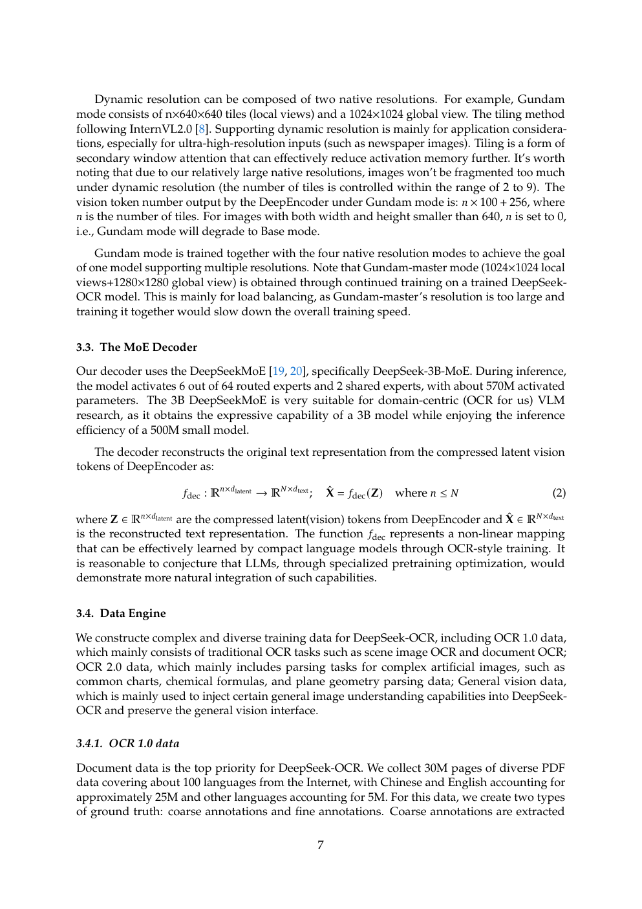

#### 3.4.1 OCR 1.0 数据

文档数据是训练重点。团队从互联网收集 3000 万页 PDF，覆盖近 100 种语言；其中中英文约 2500 万页，其他语言约 500 万页。

数据包含两种标注：

- **粗标注：** 直接使用 Fitz 从全部文档中抽取，主要用于学习光学文字，尤其是少数语言；
- **精标注：** 中英文各 200 万页，借助 PP-DocLayout、MinerU、GOT-OCR2.0 等模型生成检测与识别交错的版面标注。每段文字前都带有归一化到 1000 个区间的坐标与类别。

少数语言方面，团队先利用 Fitz 生成小块样本训练 GOT-OCR2.0，再通过模型飞轮标注版面切块，获得约 60 万份样本。模型通过不同提示词区分粗标注与精标注输出。

此外还有 300 万份 Word 数据，用于构建不含复杂版面的高质量图文对，尤其有利于公式和 HTML 表格。自然场景 OCR 主要支持中英文，图像来自 LAION 与悟空数据集，使用 PaddleOCR 标注，中英文各 1000 万份。

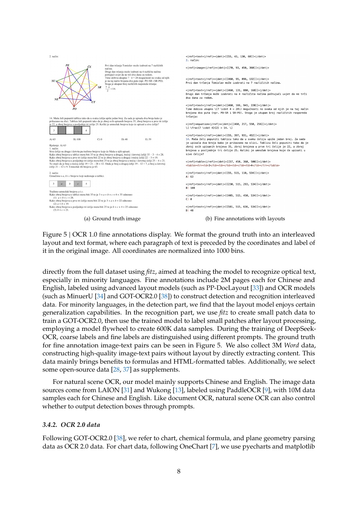

#### 3.4.2 OCR 2.0 数据

OCR 2.0 主要覆盖图表、化学式和平面几何：

- **图表：** 使用 pyecharts 与 matplotlib 渲染 1000 万张折线图、柱状图、饼图和组合图，目标输出为 HTML 表格；
- **化学式：** 从 PubChem 获取 SMILES，使用 RDKit 渲染，构建 500 万对图文数据；
- **平面几何：** 参考 Slow Perception 生成 100 万份数据，用长度为 4 的“感知尺”建模线段，并加入平移不变增强。输出字典记录线段、端点坐标与线型。

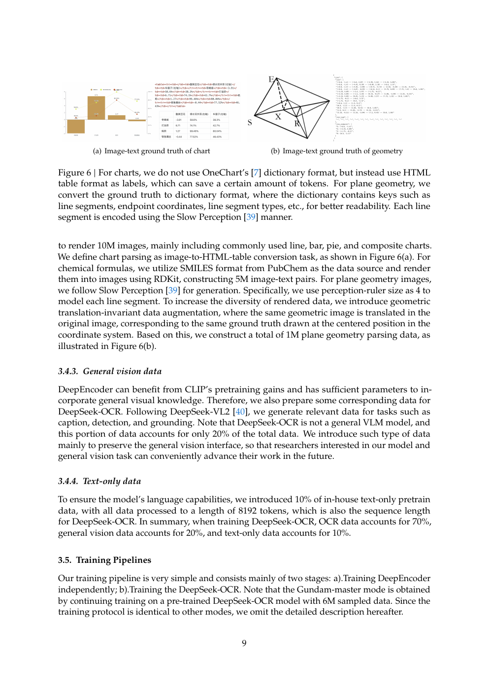

#### 3.4.3 通用视觉与纯文本

通用视觉数据沿用 DeepSeek-VL2 的方式，覆盖图像描述、检测和视觉定位。DeepSeek-OCR 并非通用视觉语言模型，因此这部分只占总数据的 20%，主要用于保留通用视觉接口。

纯文本数据占 10%，来自内部预训练语料，统一处理为 8192 词元长度；这也是 DeepSeek-OCR 的训练序列长度。最终配比为：

- OCR 数据：70%
- 通用视觉数据：20%
- 纯文本数据：10%

### 3.5 训练流程

训练分为两个阶段。

**第一阶段：独立训练 DeepEncoder。** 团队配合一个紧凑语言模型，以次词元预测目标训练编码器。数据包括全部 OCR 1.0、OCR 2.0，以及从 LAION 抽样的 1 亿份通用数据。训练 2 个 epoch，全局 batch size 为 1280，使用 AdamW、余弦退火与 $5\times10^{-5}$ 学习率，序列长度为 4096。

**第二阶段：训练完整 DeepSeek-OCR。** 整个模型分为 4 个流水线阶段：SAM 与压缩器位于 PP0 并冻结；CLIP 位于 PP1，作为可训练输入嵌入层；12 层 MoE 解码器平均放在 PP2 和 PP3。训练使用 20 个节点，每节点 8 张 A100-40G，数据并行度为 40，全局 batch size 为 640，初始学习率为 $3\times10^{-5}$。纯文本训练速度约为每天 900 亿词元，多模态训练约为每天 700 亿词元。

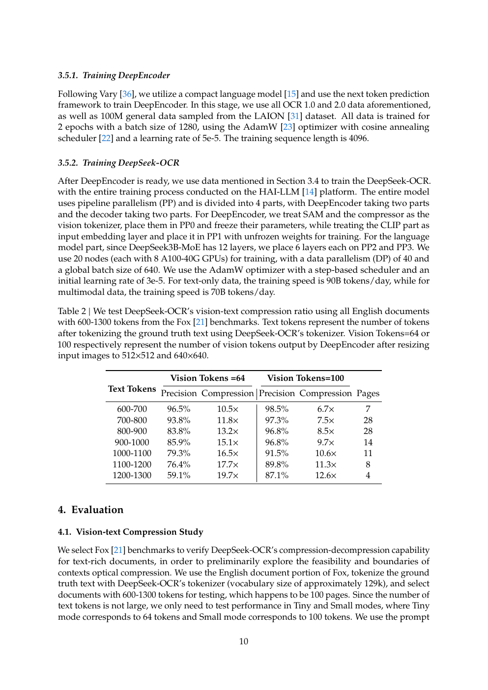

## 4 评估

### 4.1 视觉—文本压缩

团队在 Fox 基准的英文文档上测试压缩—解压能力。选取文本长度为 600–1300 词元的 100 页文档，分别使用 Tiny 的 64 个视觉词元和 Small 的 100 个视觉词元。

| 文本词元 | 64 视觉词元准确率 | 压缩率 | 100 视觉词元准确率 | 压缩率 | 页数 |
| ---: | ---: | ---: | ---: | ---: | ---: |
| 600–700 | 96.5% | 10.5× | 98.5% | 6.7× | 7 |
| 700–800 | 93.8% | 11.8× | 97.3% | 7.5× | 28 |
| 800–900 | 83.8% | 13.2× | 96.8% | 8.5× | 28 |
| 900–1000 | 85.9% | 15.1× | 96.8% | 9.7× | 14 |
| 1000–1100 | 79.3% | 16.5× | 91.5% | 10.6× | 11 |
| 1100–1200 | 76.4% | 17.7× | 89.8% | 11.3× | 8 |
| 1200–1300 | 59.1% | 19.7× | 87.1% | 12.6× | 4 |

10× 以内的解码准确率约为 97%，说明未来可能通过文本转图像接近无损地压缩上下文。超过 10× 后性能开始下降，原因可能包括长文档版面更复杂，以及文字在 512×512 或 640×640 下逐渐模糊。接近 20× 时仍保留约 60% 的准确率，则提示“模糊”本身也可以成为可控遗忘的一部分。

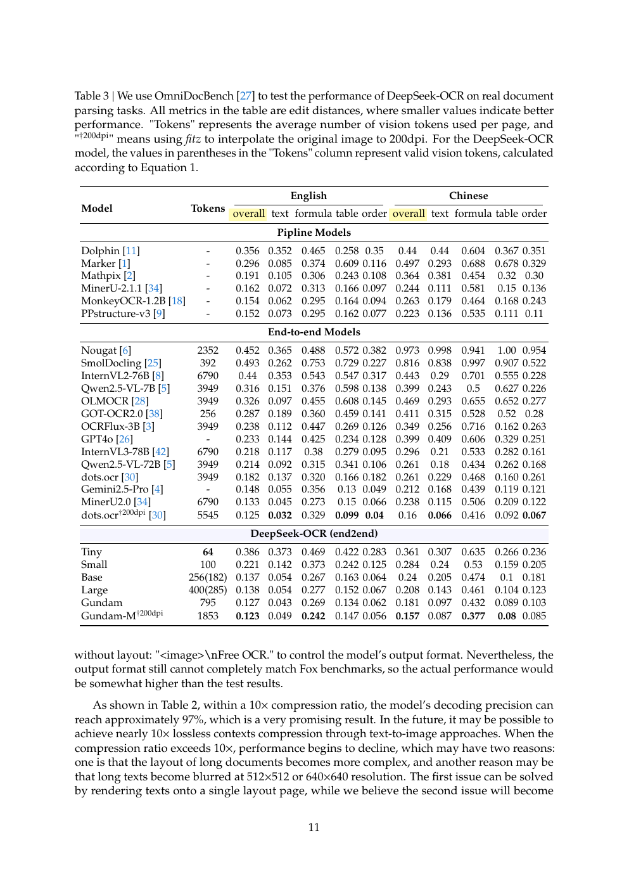

### 4.2 OCR 实用性能

OmniDocBench 使用编辑距离衡量效果，数值越低越好。DeepSeek-OCR 的关键结果如下：

| 模式 | 平均视觉词元 | 英文总体编辑距离 | 中文总体编辑距离 |
| --- | ---: | ---: | ---: |
| Tiny | 64 | 0.386 | 0.361 |
| Small | 100 | 0.221 | 0.284 |
| Base | 256（有效 182） | 0.137 | 0.240 |
| Large | 400（有效 285） | 0.138 | 0.208 |
| Gundam | 795 | 0.127 | 0.181 |
| Gundam-M，200 dpi | 1853 | 0.123 | 0.157 |

仅使用 100 个视觉词元的 Small 模式已经超过使用 256 个词元的 GOT-OCR2.0；Large 模式平均只有约 285 个有效词元，表现已经接近先进系统；Gundam 使用不足 800 个词元，超过平均使用约 6790 个词元的 MinerU2.0。

不同文档类型对词元数的需求不同。幻灯片只用 64 个词元就能取得较好结果；书籍和报告通常用 100 个即可。报纸每页可能包含 4000–5000 个文本词元，必须使用 Gundam 或 Gundam-M 才能得到可接受的编辑距离。这进一步说明：合理的视觉词元预算取决于文档的信息密度，而不是单一固定分辨率。

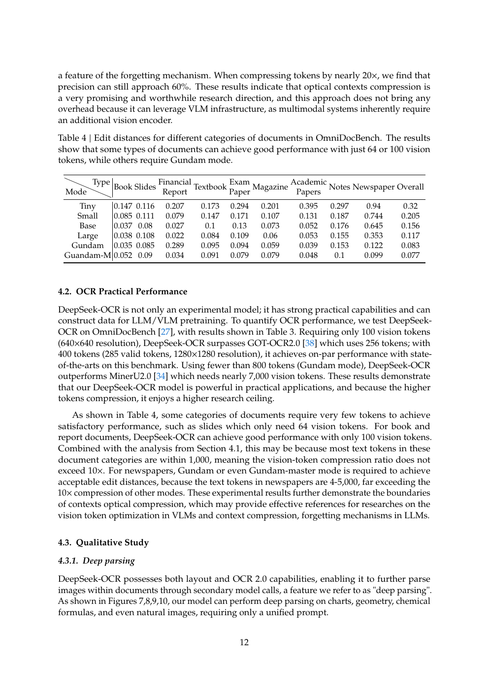

### 4.3 定性研究

#### 4.3.1 深度解析

DeepSeek-OCR 同时具备版面解析和 OCR 2.0 能力，因此可以先把文档转换为 Markdown，再对其中的图像发起第二次模型调用。作者把这种方式称为“深度解析”。

对于金融报告与科研文档中的图表，模型可以把图中数据提取为结构化 HTML 表格。相较于只识别图题或图片位置，这让图表数据能够直接用于后续计算和检索。

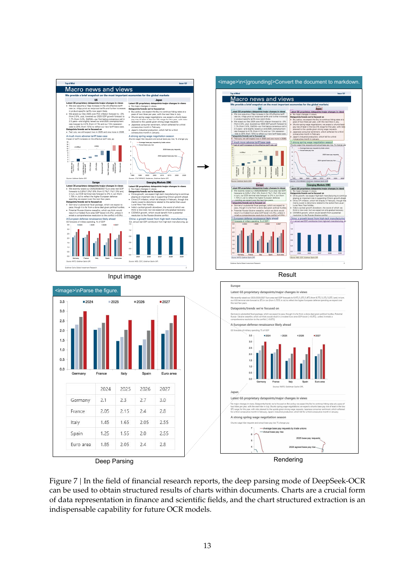

对于书籍和文章中的自然图片，模型可以自动判断图片类型，并在同一提示接口下输出较为密集的场景描述。示例中，模型识别了教室环境、人物、衣着、家具与墙面文字，并概括了场景用途。

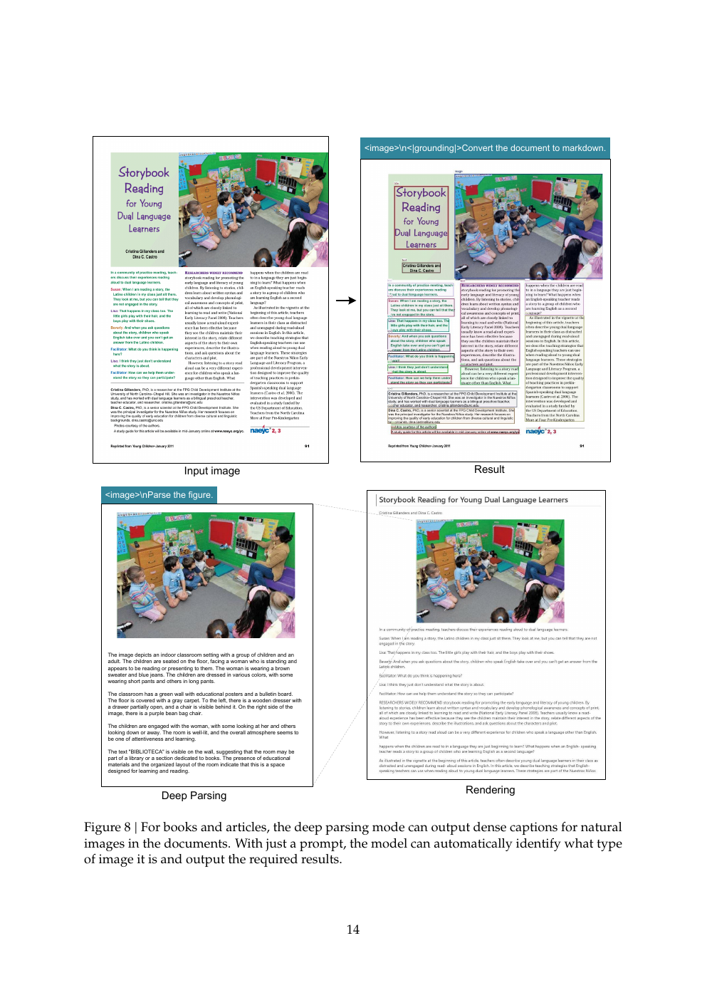

化学式解析以 SMILES 作为结构化结果，使图像中的分子结构可以进入化学信息处理流程。

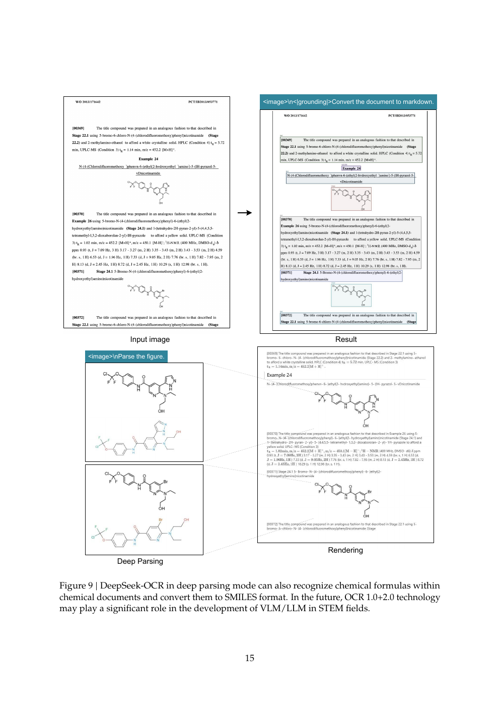

简单平面几何解析则输出线段、端点坐标和线型等结构，让图形不再只是图片，而成为可供后续推理的几何表示。

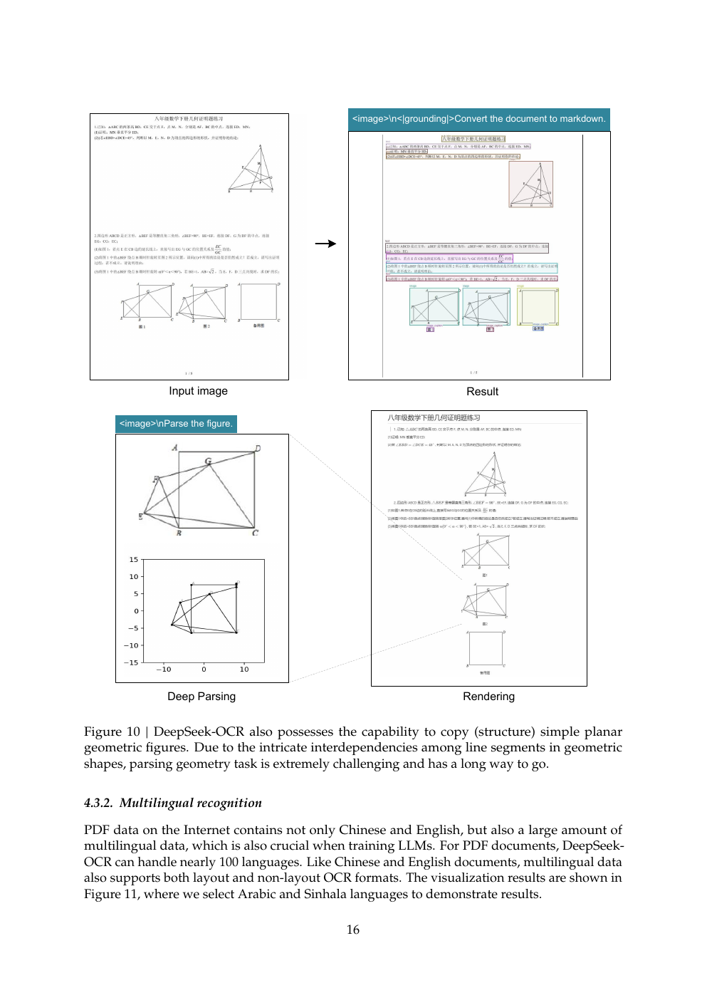

#### 4.3.2 多语言识别

为处理互联网广泛抓取的 PDF，模型训练了近 100 种语言的 OCR 能力。少数语言文档同样可以通过不同提示词选择带版面坐标的输出，或只输出纯文本。

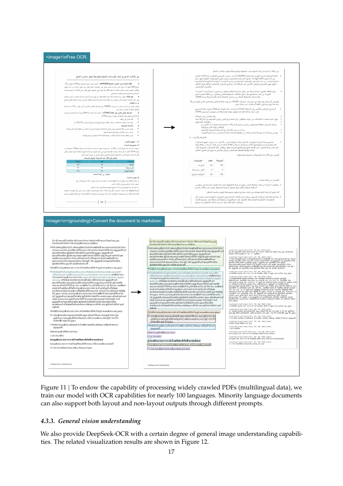

#### 4.3.3 通用视觉理解

模型保留了图像描述、目标检测、视觉定位等基础能力，也能依靠纯文本训练维持一定语言能力。不过它没有经过监督微调，因此不是聊天模型，部分能力需要采用补全式提示才能激活。

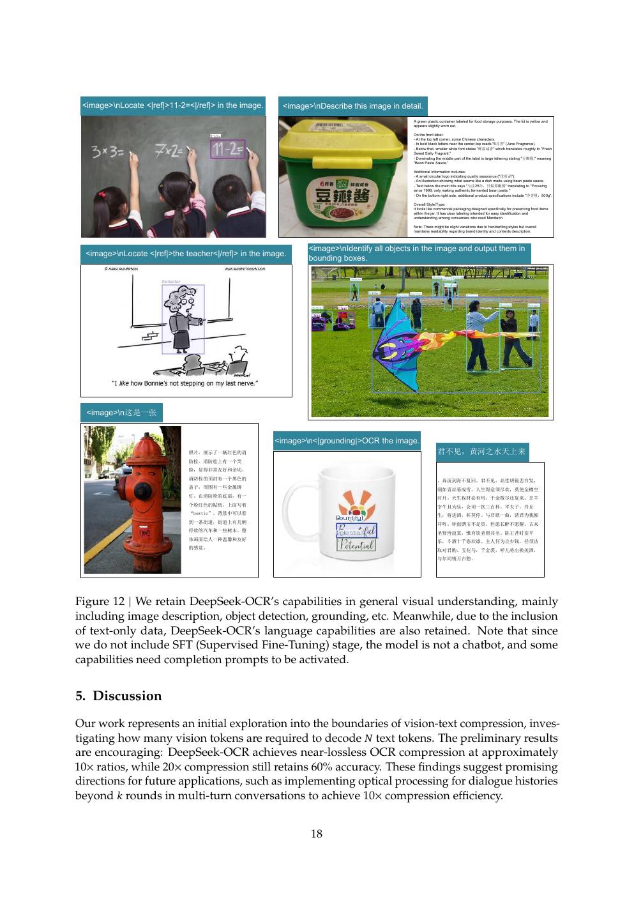

## 5 讨论：视觉遗忘

论文最具探索性的部分，是把上下文光学压缩与人类记忆衰减类比。最近发生的事情通常清晰，较久远的记忆逐渐模糊；近处物体清楚，远处物体细节减少。视觉压缩可以模拟同一种过程：

- 最新上下文保留文字词元或 Gundam 高分辨率表示；
- 较早上下文逐步降到 Large、Base、Small；
- 很久以前的上下文使用 Tiny，只保留最粗粒度的信息。

具体实现可以先把多轮对话中超过某个轮次的历史文本渲染为图像，实现约 10× 初次压缩；随着时间推移，再持续缩小旧图像，让其视觉词元和可恢复信息同步减少。这样，近期信息维持高保真，远期记忆则以不断升高的压缩率自然衰减。

这种机制可能通向理论上不受固定长度限制的上下文架构，但作者也明确指出，本工作仍处在早期阶段。视觉—文本压缩的实际限制、信息损失方式以及与推理能力的关系，都需要进一步研究。

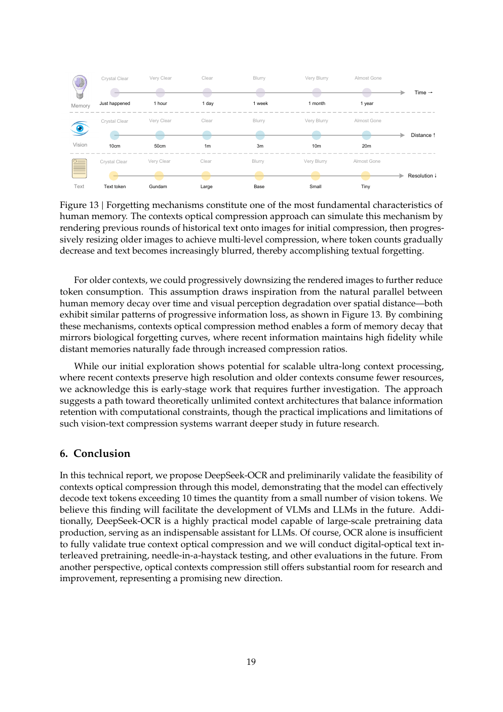

## 6 结论

DeepSeek-OCR 初步证明：少量视觉词元能够解码数量超过其 10 倍的文本词元。DeepEncoder 通过窗口注意力、卷积压缩与全局注意力的串联，在高分辨率、低激活与少视觉词元之间取得平衡；MoE 解码器则以较低激活参数完成文本重建。

这项工作同时具有两层价值。一层是工程价值：模型可以大规模生产 LLM/VLM 预训练数据，并以远少于许多现有系统的视觉词元完成文档解析。另一层是研究价值：图像可能成为长期上下文的压缩介质，并通过分辨率退化实现可控遗忘。

作者强调，OCR 只是一项概念验证，尚不足以证明真正通用的上下文光学压缩。后续仍需开展数字文本与光学文本交错预训练、needle-in-a-haystack 检索测试，以及更多长上下文评估。

## 参考文献

论文引用了 Nougat、GOT-OCR2.0、OmniDocBench、MinerU、OLMOCR、Qwen2-VL、InternVL、SAM、CLIP、Vary、Slow Perception 等文档解析、视觉编码与多模态研究。完整书目信息见以下原论文页面。

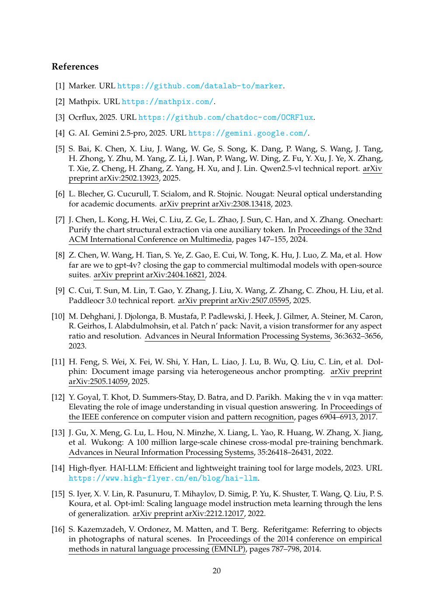

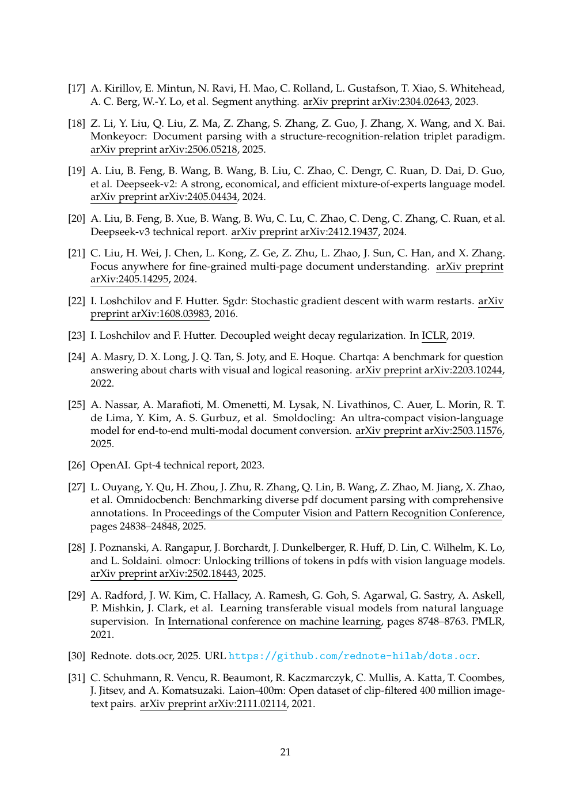

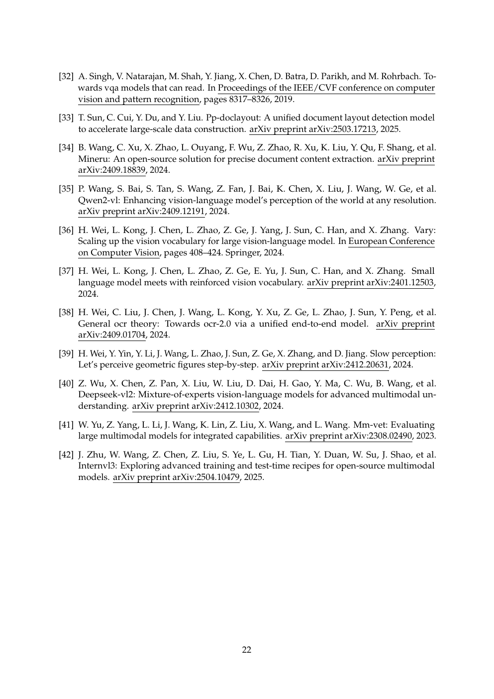
