# DeepSeek-V3.2：推进开放大语言模型前沿

**作者：** DeepSeek-AI  
**首次公开：** 2025 年 12 月 2 日  
**原文：** [arXiv:2512.02556](https://arxiv.org/abs/2512.02556)  
**模型：** [DeepSeek-V3.2](https://huggingface.co/deepseek-ai/DeepSeek-V3.2)

## 摘要

本文介绍 DeepSeek-V3.2：一个同时追求高计算效率、强推理能力与智能体能力的开放模型。其关键进展包括三方面。

1. **DeepSeek 稀疏注意力（DSA）。** DSA 通过轻量的“闪电索引器”与细粒度 top-k 词元选择，把主模型核心注意力的复杂度从 $O(L^2)$ 降至 $O(Lk)$，并在长上下文任务上保持模型性能。
2. **可扩展强化学习框架。** 团队建立了稳定的 RL 训练方案，并把后训练计算预算扩展到预训练成本的 10% 以上。标准版 DeepSeek-V3.2 在多项推理任务上可与 GPT-5 相比；高计算版本 DeepSeek-V3.2-Speciale 进一步达到与 Gemini-3.0-Pro 相近的水平，并在 2025 年 IMO、IOI、CMO 与 ICPC 世界总决赛评测中达到金牌标准。
3. **大规模智能体任务合成。** 团队构建了系统化的数据生产流水线，生成 1800 多个环境和 8.5 万多个复杂提示，让模型在工具调用、代码工程、搜索和通用交互环境中学习可泛化的推理行为。

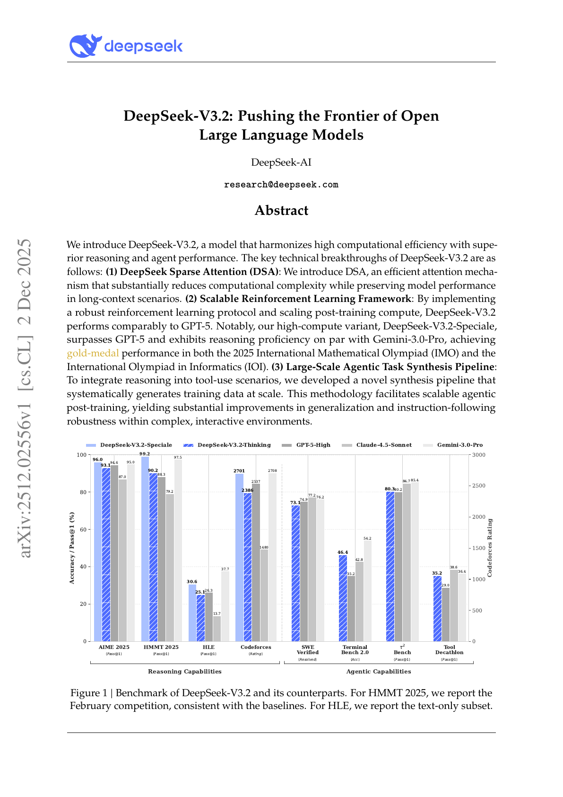

## 1 引言

推理模型的出现显著提升了大语言模型在可验证任务上的能力，但开放模型与闭源前沿模型之间的差距并未自然缩小。作者把开放模型在复杂任务中的限制归结为三点：标准稠密注意力难以高效扩展到长序列；后训练阶段的计算投入不足；智能体在陌生工具和环境中的泛化与指令遵循能力仍弱。

DeepSeek-V3.2 分别从架构、训练与数据三层回应这些问题。DSA 缓解长上下文计算瓶颈；稳定的强化学习方案允许显著扩大后训练规模；工具使用方面，模型先通过冷启动把思考与工具调用统一到一条轨迹，再利用 1827 个合成环境和超过 8.5 万个复杂任务提示进行大规模 RL。

标准版在多项推理基准上接近 Kimi-K2-Thinking 与 GPT-5，并显著推进开放模型的智能体能力。为探索更长推理的上限，团队还降低长度惩罚，训练出 DeepSeek-V3.2-Speciale；它在高难推理与竞赛任务上进一步逼近领先闭源系统。

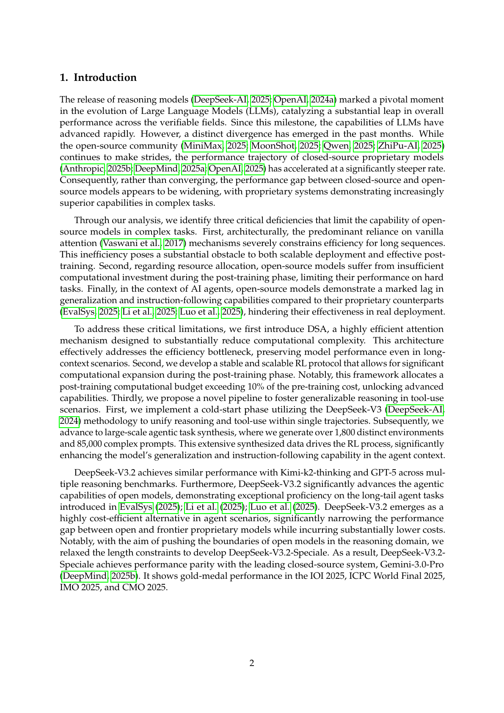

## 2 DeepSeek-V3.2 架构

### 2.1 DeepSeek 稀疏注意力

DeepSeek-V3.2 与此前公开的 DeepSeek-V3.2-Exp 使用相同架构。相较 DeepSeek-V3.1-Terminus，唯一的架构变化，是通过继续训练引入 DeepSeek Sparse Attention（DSA）。

DSA 原型由两个部分组成。

- **闪电索引器：** 对当前查询词元 $h_t$ 与此前词元 $h_s$ 计算索引分数 $I_{t,s}$。索引器头数很少，可使用 FP8 实现，并为吞吐量采用 ReLU，因此额外计算开销较低。
- **细粒度词元选择：** 对每个查询只取索引分数最高的 top-k 键值条目，再在当前查询与这些稀疏条目之间计算注意力。

索引分数和稀疏注意力可概括为：

$$
I_{t,s}=\sum_{j=1}^{H_I}w^I_{t,j}\,\mathrm{ReLU}\!\left(q^I_{t,j}\cdot k^I_s\right),
$$

$$
u_t=\mathrm{Attn}\!\left(h_t,\{c_s\mid I_{t,s}\in\mathrm{Top\text{-}k}(I_{t,:})\}\right).
$$

为从既有检查点平滑继续训练，DSA 建立在多头潜在注意力（MLA）之上，并采用 MLA 的多查询注意力（MQA）模式：每个潜在键值向量由当前词元的所有查询头共享。这种共享方式更适合高效内核实现。

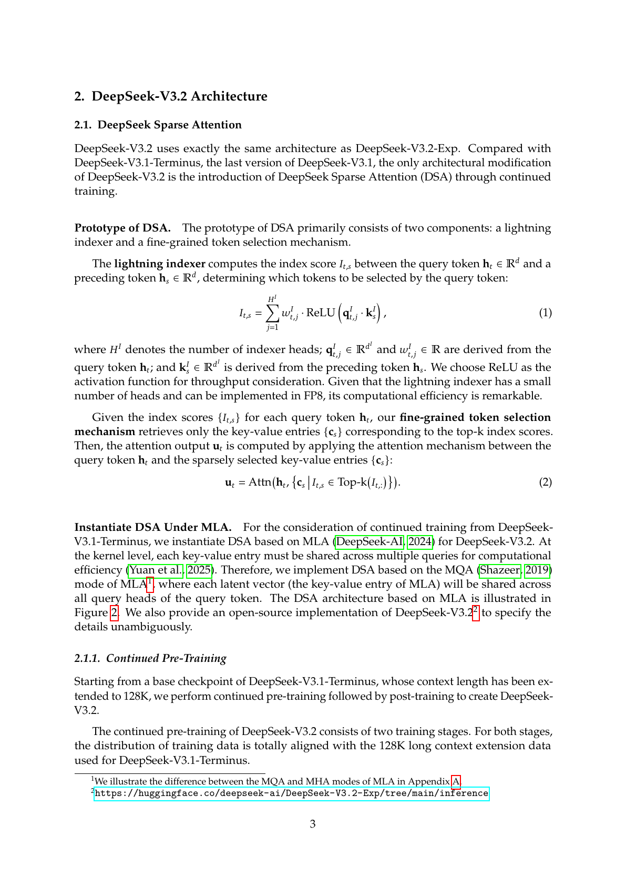

#### 2.1.1 继续预训练

训练从已扩展到 128K 上下文的 DeepSeek-V3.1-Terminus 基础检查点开始，所用数据分布与其 128K 长上下文扩展阶段完全一致。

**稠密预热阶段。** 模型暂时保留稠密注意力，冻结除闪电索引器外的全部参数。团队把主注意力在各注意力头上的分数求和并做 L1 归一化，得到目标分布，再以 KL 散度训练索引器，使其排序接近主注意力分布。预热学习率为 $10^{-3}$，训练 1000 步；每步包含 $16\times128\mathrm{K}$ 词元，总计约 21 亿词元。

**稀疏训练阶段。** 随后启用细粒度选择，并解冻主模型，使其适应 DSA 的稀疏模式。每个查询选取 2048 个键值词元；索引器只从自身的 KL 目标接收梯度，主模型只按语言建模损失优化。学习率为 $7.3\times10^{-6}$，共训练 15000 步；每步包含 $480\times128\mathrm{K}$ 词元，总计约 9437 亿词元。

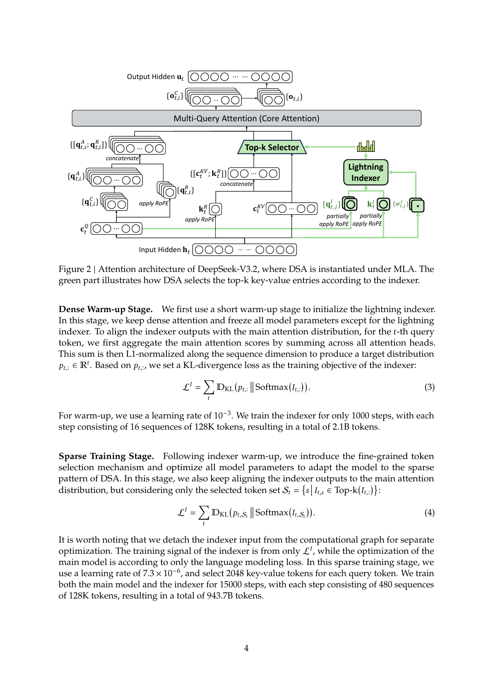

### 2.2 性能对齐评估

团队在 2025 年 9 月以一组覆盖多种能力的标准基准比较 DeepSeek-V3.2-Exp 与 DeepSeek-V3.1-Terminus，两者整体性能相近。Chatbot Arena 在 2025 年 11 月 10 日的 Elo 结果也非常接近；由于二者采用相同的后训练策略，这说明加入稀疏注意力后，基础能力没有明显退化。

独立长上下文评估同样支持这一判断。DeepSeek-V3.2-Exp 在 AA-LCR 推理模式中高出 4 分，并在 Fiction.liveBench 的多个指标上持续优于 DeepSeek-V3.1-Terminus。

### 2.3 推理成本

DSA 把主模型核心注意力复杂度从 $O(L^2)$ 降到 $O(Lk)$，其中 $k\ll L$。闪电索引器本身仍为 $O(L^2)$，但其计算量远低于原 MLA。结合优化后的实现，DSA 在长上下文预填充与解码中带来显著端到端加速。论文的成本曲线基于实际部署于 H800 集群的服务，并按每 GPU 小时 2 美元估算；短序列预填充则用带掩码的 MHA 模式模拟 DSA，以取得更高效率。

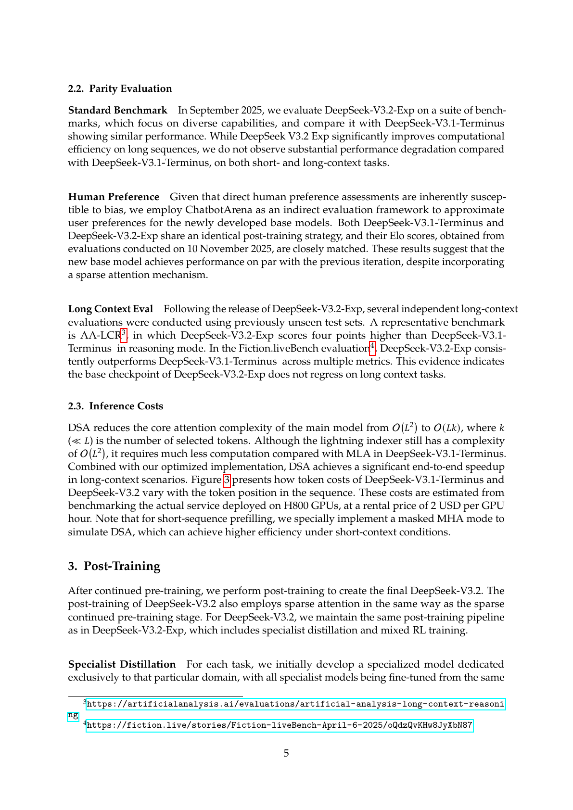

## 3 后训练

继续预训练后，DeepSeek-V3.2 采用与实验版一致的后训练流水线，主要包括专家模型蒸馏与混合强化学习。

**专家模型蒸馏。** 团队从同一个基础检查点出发，为写作、通用问答、数学、编程、一般逻辑推理、通用智能体、代码智能体和搜索智能体分别训练专家模型，并同时覆盖思考与非思考模式。长思维链与直接回答数据由不同模型生成。蒸馏后的统一模型与各领域专家仅有很小差距，后续 RL 基本消除了这一差距。

**混合 RL。** 算法仍采用组相对策略优化（GRPO），但把推理、智能体与人类偏好对齐合并进同一个 RL 阶段，以避免多阶段训练常见的灾难性遗忘。推理和智能体任务使用规则化结果奖励、长度惩罚与语言一致性奖励；一般任务则使用按提示配置评分规则的生成式奖励模型。

**标准版与 Speciale。** 标准版融合各专家蒸馏数据，并继续进行数千步 RL。DeepSeek-V3.2-Speciale 则只在推理数据上训练，降低长度惩罚，并加入 DeepSeekMath-V2 的数据与奖励方法，以增强数学证明能力。

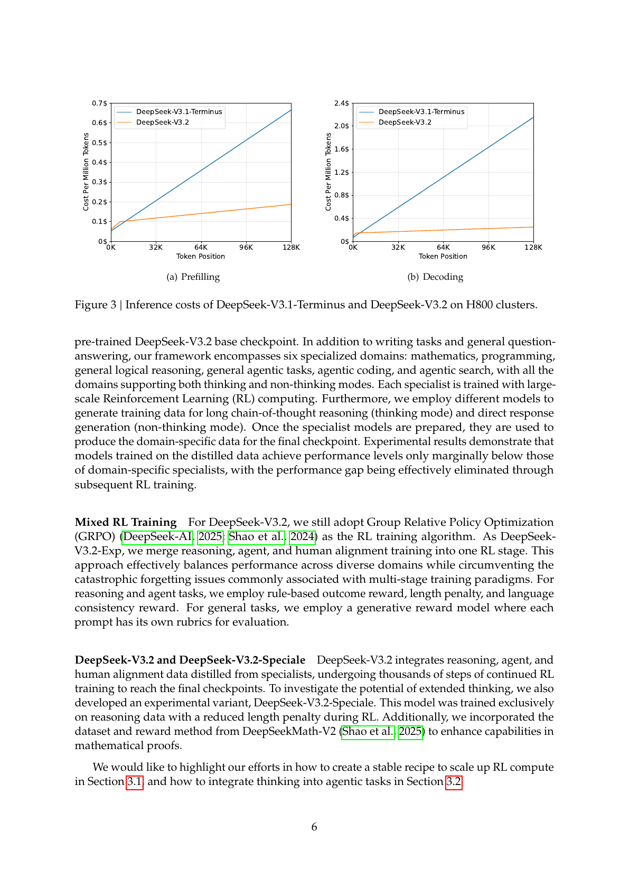

### 3.1 扩展 GRPO

GRPO 对同一问题采样一组回答，在组内按结果奖励计算相对优势，再用重要性采样比、裁剪目标与 KL 惩罚更新策略。为把 RL 安全扩展到更大规模，论文在基础算法上加入四项稳定化措施。

#### 无偏 KL 估计

团队利用当前策略与旧策略之间的重要性采样比修正 K3 估计器，从而得到无偏的 KL 梯度。原始估计器在当前策略概率远低于参考策略时，会给少数词元分配过大且无界的梯度权重，长期积累后可能损害样本质量并造成训练不稳定。不同领域适合不同 KL 强度；数学任务有时使用较弱惩罚，甚至完全省略，效果反而更好。

#### 离策略序列屏蔽

大批量 rollout 往往会被拆成多个小批次更新；同时，高度优化的推理框架与训练框架也可能存在实现差异，二者都会加重离策略程度。团队据旧策略与当前策略之间的 KL 差异，屏蔽偏离过大的负优势序列。直觉上，模型应从自身错误中学习，但高度离策略的负样本可能误导优化；实验证明，这一屏蔽在若干训练场景中能改善稳定性。

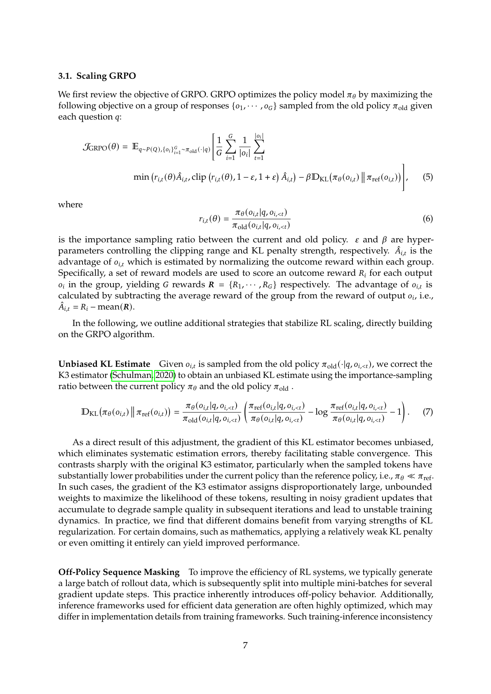

#### Keep Routing

MoE 在推理时只激活部分专家，但框架差异和策略更新可能让同一输入在采样与训练中走向不同专家，引发参数子空间的突变。Keep Routing 保存采样时的专家路由，并在训练时强制复用同一路径，确保真正优化的是生成该样本的那组专家。该做法自 DeepSeek-V3-0324 起一直是 MoE 强化学习稳定性的关键措施。

#### Keep Sampling Mask

top-p 与 top-k 采样可避免极低概率词元成为优化目标，却也会让旧策略与当前策略的动作空间不一致，破坏重要性采样假设。Keep Sampling Mask 保存旧策略采样时的截断掩码，并把相同掩码应用到训练中的当前策略，使二者共享完全相同的动作子空间。实践中，top-p 与该方法结合能有效保持 RL 训练期间的语言一致性。

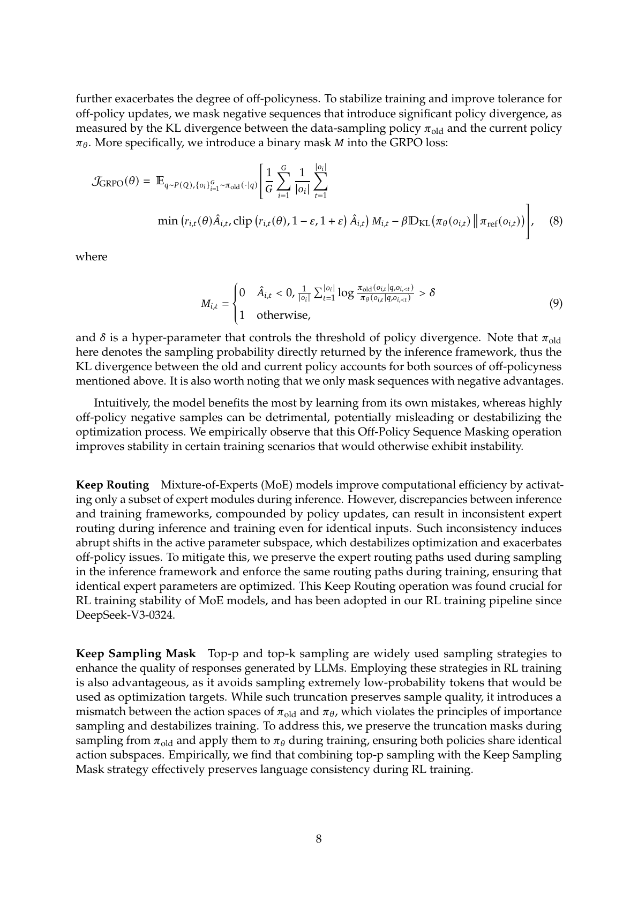

### 3.2 工具使用中的思考

#### 3.2.1 思考上下文管理

若每加入一轮工具结果就丢弃既有推理，模型会在每次工具调用前重复推导整个问题，造成大量词元浪费。DeepSeek-V3.2 为工具场景采用两条规则：

- 只有对话中出现新的用户消息时，才丢弃此前的思考内容；如果追加的只是工具输出，则始终保留思考轨迹。
- 删除思考轨迹时，历史工具调用及其结果仍保留在上下文中。

某些智能体框架会用“用户消息”模拟工具交互，无法完整受益于这一机制；论文建议在这类框架中优先使用非思考模式。

#### 3.2.2 冷启动

已有数据一类包含推理但没有工具，另一类包含工具调用但没有显式推理。团队通过任务专用系统提示把两者结合：要求模型在 `<think>...</think>` 内思考，并允许在这段思考中多次调用工具，再在标签外给出最终答案。早期轨迹并不总是稳定，却能偶尔生成正确的“思考—调用—继续思考”模式，为后续强化学习提供起点。

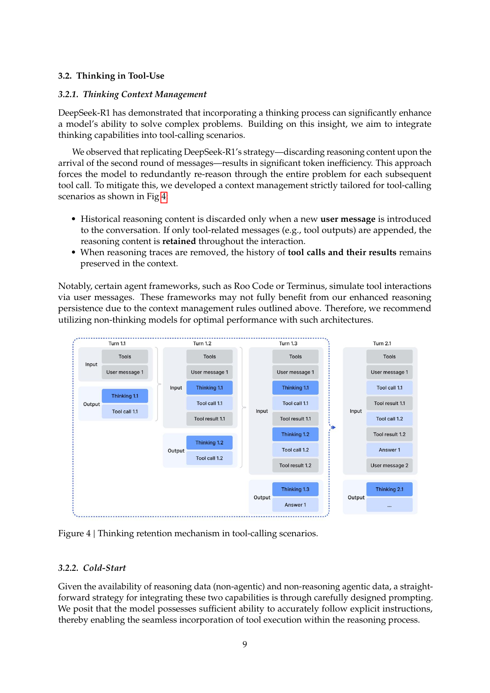

#### 3.2.3 大规模智能体任务

真实环境用于搜索、代码工程和代码解释器任务，提示则来自互联网抽取或合成；通用智能体的环境与提示都由系统自动生成。

| 智能体任务 | 任务数 | 环境 | 提示来源 |
| --- | ---: | --- | --- |
| 代码智能体 | 24,667 | 真实 | 抽取 |
| 搜索智能体 | 50,275 | 真实 | 合成 |
| 通用智能体 | 4,417 | 合成 | 合成 |
| 代码解释器 | 5,908 | 真实 | 抽取 |

**搜索智能体。** 流水线先从大规模网页语料抽取跨领域长尾实体，再由问题构造智能体使用搜索工具探索并生成问答对。多个异构回答智能体产生候选答案，带搜索能力的验证智能体多轮核验，只保留标准答案可证为真且候选答案可证为错的样本。另有一部分来自既有 helpful RL 数据，并通过详细评分规则与生成式奖励模型衡量事实可靠性和实际帮助性。

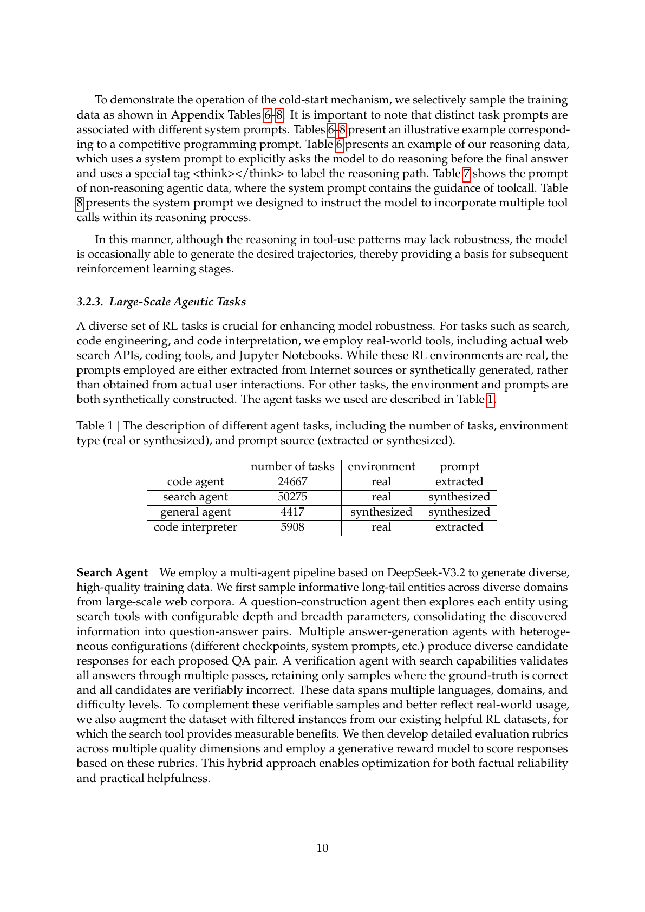

**代码智能体。** 团队从 GitHub 数百万个 issue—PR 对中筛选出问题描述、金标准补丁与测试补丁均可靠的样本，再让环境搭建智能体安装依赖并运行测试。环境只有在金标准补丁能让至少一个失败测试转为通过、且不让任何原有通过测试回归时才算构建成功。由此得到数万个可复现问题修复环境，覆盖 Python、Java、JavaScript、TypeScript、C、C++、Go 与 PHP。

**代码解释器。** 模型在 Jupyter Notebook 中通过代码执行解决数学、逻辑和数据科学问题。

**通用智能体。** 自动合成流程最终构建 1827 个任务环境。它先为旅行规划等任务类别准备沙箱数据库，再合成函数式工具；随后创建任务、解答函数和验证器。解答只能调用工具或做逻辑计算，不能直接访问数据库；系统会反复修正直到验证通过，再逐步提高难度并按需扩充工具集。RL 后只保留 Pass@100 非零的实例，得到 1827 个环境、共 4417 个任务。

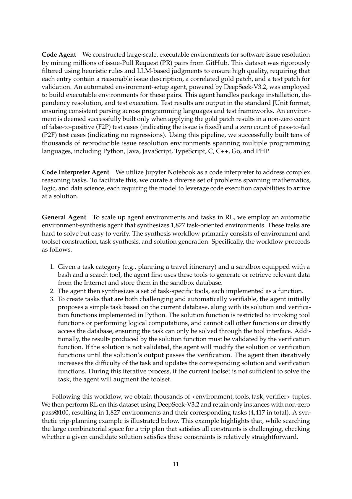

论文用三日旅行规划展示合成任务：行程不得重复城市、酒店、景点或餐厅；每天的地点必须与所在城市一致；第二天还根据酒店价位触发不同的餐饮评分、预算和门票约束。工具集只能查询城市、交通、天气及酒店、餐厅、景点信息，最终输出固定 JSON 结构。这个例子体现了合成任务的目标：组合搜索空间很大、找到满足全部约束的方案很难，但验证候选方案却相对容易。

## 4 评估

### 4.1 主要结果

评估覆盖通识、科学问答、代码、数学、搜索与多种工具调用基准。工具任务统一采用标准函数调用格式和思考模式；温度为 1.0，上下文窗口为 128K。数学类任务要求逐步推理，并把最终答案放入 `\boxed{}`。

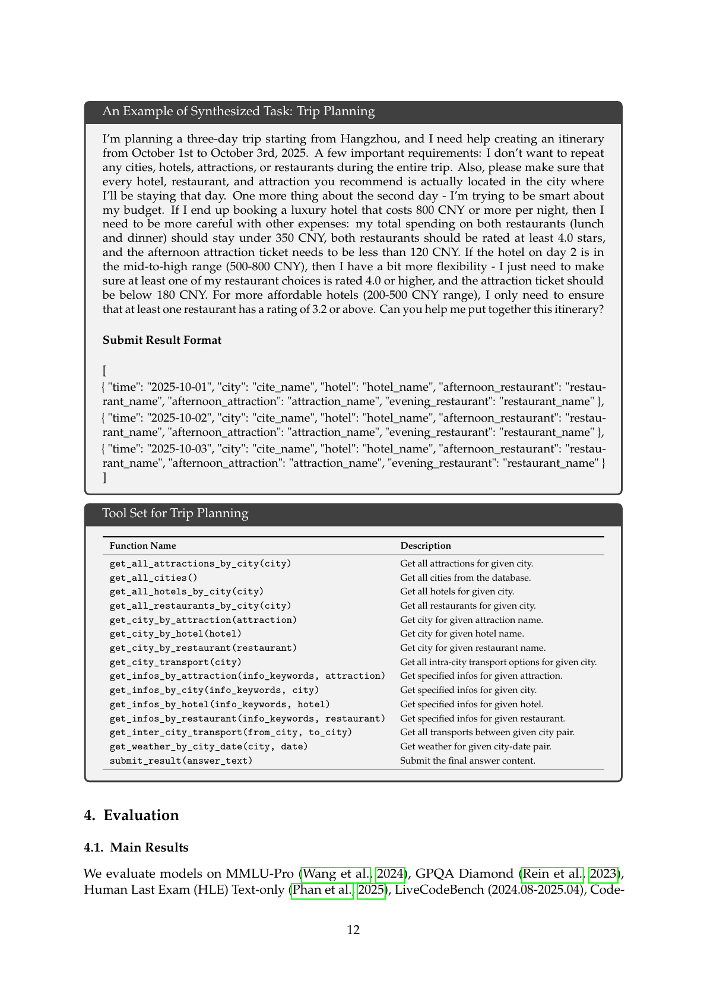

DeepSeek-V3.2-Thinking 的主要结果如下。

| 类别 | 基准 | 结果 |
| --- | --- | ---: |
| 英文 | MMLU-Pro | 85.0 |
| 英文 | GPQA Diamond | 82.4 |
| 英文 | HLE | 25.1 |
| 代码 | LiveCodeBench | 83.3 |
| 代码 | Codeforces | 2386 rating |
| 数学 | AIME 2025 | 93.1 |
| 数学 | HMMT 2025 二月 | 92.5 |
| 数学 | HMMT 2025 十一月 | 90.2 |
| 数学 | IMOAnswerBench | 78.3 |
| 代码智能体 | Terminal Bench 2.0 | 46.4 |
| 代码智能体 | SWE Verified | 73.1 |
| 代码智能体 | SWE Multilingual | 70.2 |
| 搜索智能体 | BrowseComp | 51.4；上下文管理后 67.6 |
| 搜索智能体 | BrowseCompZh | 65.0 |
| 工具使用 | $\tau^2$-Bench | 80.3 |
| 工具使用 | MCP-Universe | 45.9 |
| 工具使用 | MCP-Mark | 38.0 |
| 工具使用 | Tool-Decathlon | 35.2 |

推理任务整体与 GPT-5-High 相近，但略弱于 Gemini-3.0-Pro。相比 Kimi-K2-Thinking，DeepSeek-V3.2 用更少输出词元取得相当分数；论文把增益主要归因于已超过预训练成本 10% 的 RL 投入。

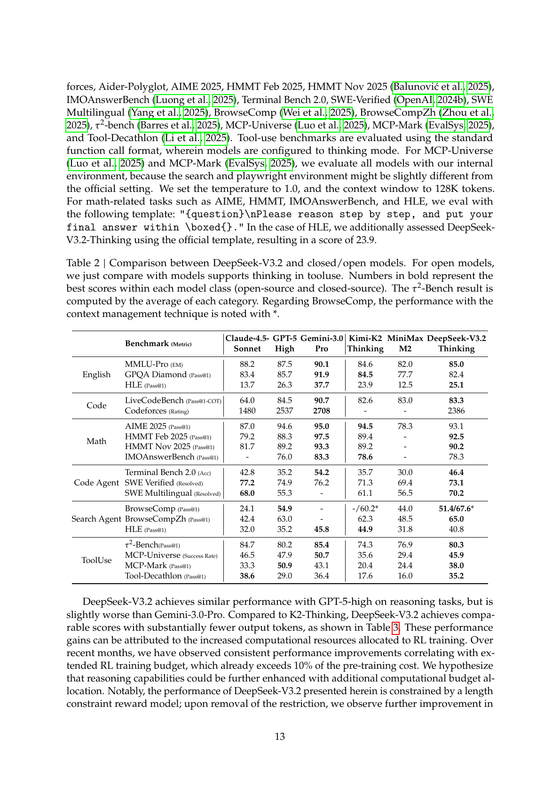

代码智能体方面，DeepSeek-V3.2 在 SWE-bench Verified 与 Terminal Bench 2.0 上优于其他开放模型。Terminal Bench 的 46.4 使用 Claude Code 框架取得；因思考上下文机制与 Terminus 不完全兼容，非思考模式在 Terminus 上为 39.3。SWE-bench 在 Claude Code、RooCode、内部框架和非思考模式下均稳定在 72–74。

搜索任务中，约 20% 的 BrowseComp 样本会超过 128K 上下文，因此上下文管理对最终分数影响很大。工具基准上，模型虽显著缩小了开放与闭源模型差距，但冗余自检会生成过长轨迹，尤其容易在 MCP-Mark GitHub 与 Playwright 任务中超过上限。由于这些环境和工具集没有出现在 RL 训练中，性能提升也说明模型能把推理策略泛化到分布外智能体场景。

### 4.2 DeepSeek-V3.2-Speciale

Speciale 允许使用更多推理词元，因而在多项任务上超过标准版：AIME 为 96.0，HMMT 二月为 99.2，HMMT 十一月为 94.4，IMOAnswerBench 为 84.5，LiveCodeBench 为 88.7，Codeforces rating 为 2701。代价是明显更高的输出长度，例如 Codeforces 平均输出约 77K 词元，而 Gemini-3.0-Pro 约为 22K。标准版因此采用更严格的长度约束，在效果、成本与延迟之间折中。

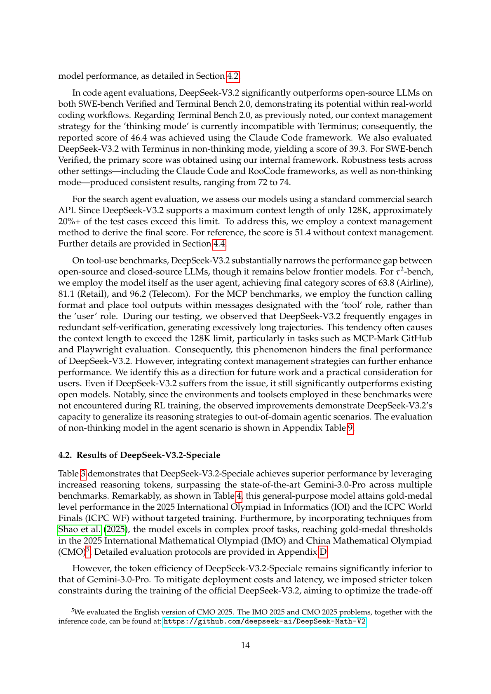

Speciale 在顶级竞赛评测中的成绩为：

| 竞赛 | 总成绩 | 结果 |
| --- | ---: | --- |
| IMO 2025 | 35/42 | 金牌 |
| CMO 2025 | 102/126 | 金牌 |
| IOI 2025 | 492/600 | 金牌，第 10 名 |
| ICPC 世界总决赛 2025 | 解出 10/12 题 | 金牌，第 2 名 |

### 4.3 合成智能体任务

作者重点检验两个问题：合成任务是否足够困难，以及只在合成数据上做 RL 能否迁移到不同任务或真实环境。随机抽取的 50 个通用合成任务上，各模型 Pass@1 如下：

| 模型 | Pass@1 | Pass@2 | Pass@4 |
| --- | ---: | ---: | ---: |
| DeepSeek-V3.2-Exp | 12% | 18% | 26% |
| Claude Sonnet 4.5 | 34% | 47% | 62% |
| Gemini 3.0 Pro | 51% | 65% | 74% |
| GPT-5 Thinking | 62% | 75% | 82% |

即使前沿闭源模型最高也只有 62% Pass@1，说明这些合成任务并不简单。只用非思考合成智能体任务对 V3.2-SFT 做 RL 后，模型在 $\tau^2$-Bench、MCP-Mark 和 MCP-Universe 上均明显提升；只在代码与搜索环境训练的实验版则没有获得同类提升，表明通用合成环境具有跨任务迁移潜力。

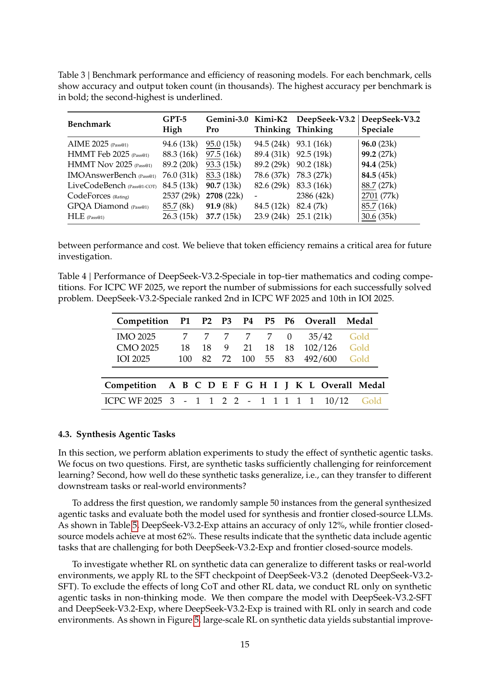

### 4.4 搜索智能体的上下文管理

搜索型智能体即使拥有 128K 窗口，也经常在完成推理前触及长度上限。论文在词元使用超过窗口 80% 时尝试三种串行策略：

- **Summary：** 总结溢出的轨迹并重新开始 rollout；
- **Discard-75%：** 删除最早 75% 的工具调用历史；
- **Discard-all：** 清空此前全部工具调用历史，重置上下文。

对照方法 Parallel-fewest-step 会并行采样多条独立轨迹，再选择步数最少的一条。BrowseComp 上，Summary 把平均步数扩展到 364，最高达到 60.2，但总体效率偏低；最简单的 Discard-all 则达到 67.6，以明显更少步骤取得与并行扩展相近的效果。

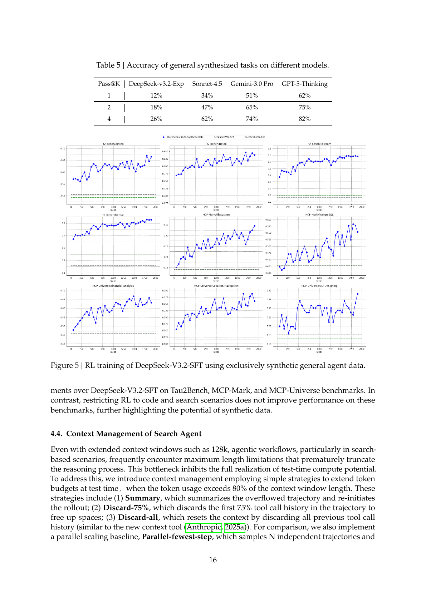

串行上下文管理和并行采样都能扩展测试时计算，但效率与可扩展性不同。基准比较不能只看准确率，还应计入真实计算成本；如何组合串行与并行扩展，是后续的重要方向。

## 5 结论、局限与未来工作

DeepSeek-V3.2 通过 DSA 在不牺牲长上下文性能的前提下降低核心注意力复杂度；通过扩大且稳定的后训练，使标准版在推理基准上接近 GPT-5；通过大规模智能体任务合成，显著增强了工具使用和分布外泛化。高计算版本 Speciale 的竞赛金牌级表现，则进一步展示了开放推理模型的能力上限。

与 Gemini-3.0-Pro 等前沿闭源模型相比，论文仍承认三项主要局限：总训练 FLOPs 较少，使世界知识广度仍落后；思考与工具调用时的输出词元效率较差；在最复杂任务上的总体能力仍有差距。未来工作将继续扩大预训练与后训练规模，提高词元效率，并改进长轨迹上下文管理。

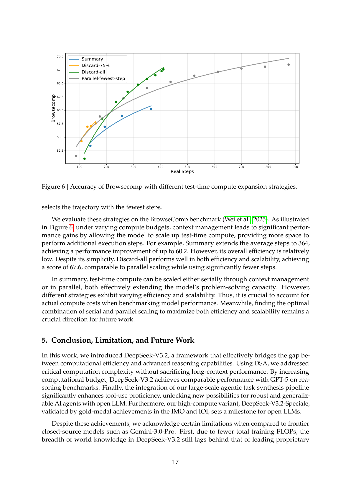

## 参考文献

论文引用了 Transformer、MLA、DeepSeek-V3、DeepSeek-R1、GRPO、DeepSeekMath-V2，以及 GPT-5、Claude、Gemini、Kimi、MiniMax、Qwen、GLM 等模型与系统；还引用了 MMLU-Pro、GPQA、HLE、LiveCodeBench、SWE-bench、BrowseComp、$\tau^2$-Bench、MCP-Universe、MCP-Mark 和 Tool-Decathlon 等评估工作。完整书目信息见原论文以下页面。

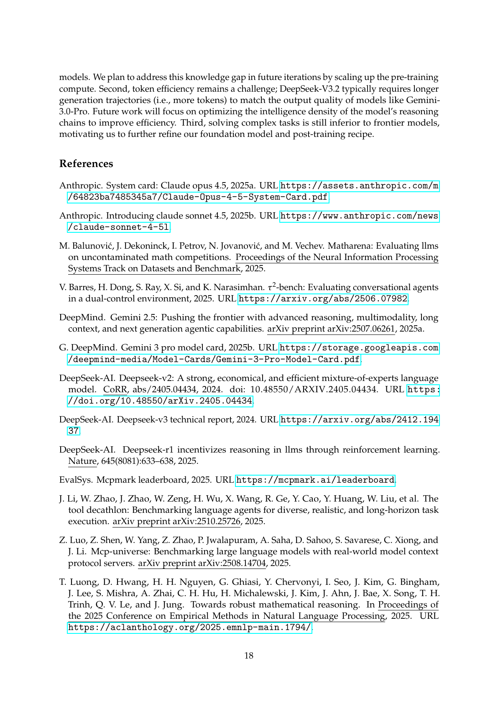

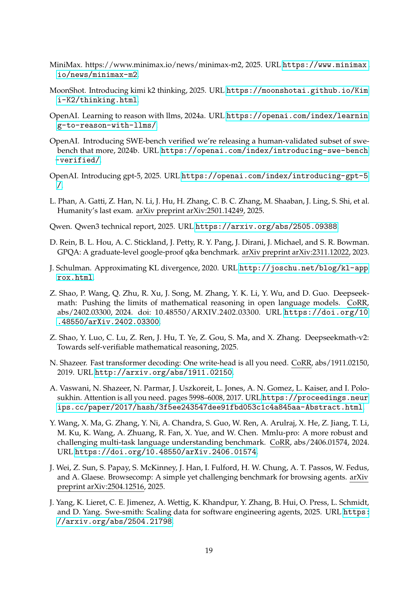

## 附录 A：MLA 的 MHA 与 MQA 模式

在 MLA 的 MHA 模式中，每个查询头分别使用对应的潜在键值表示；在 MQA 模式中，潜在键值条目由所有查询头共享。DSA 选择 MQA，是因为底层高效内核要求一个键值条目能够被多个查询复用。原论文图 7 给出了两种模式的数据流对照。

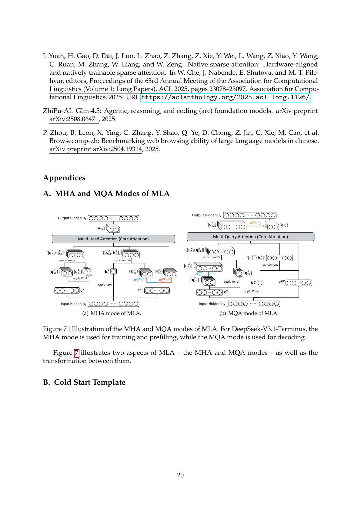

## 附录 B：冷启动提示模板

附录表 6–8 展示了同一编程任务的三种提示形式：普通推理数据要求把思考放在 `<think>...</think>` 内；非思考智能体数据只规定工具描述和调用格式；带思考的智能体提示则明确允许模型在思考阶段多次调用 Python，并要求最终答案中不再调用工具。这些模板用于让模型在冷启动阶段形成“思考—工具—思考—答案”的完整轨迹。

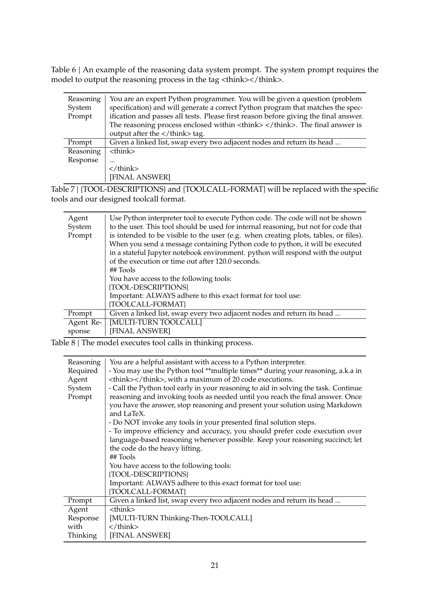

## 附录 C：非思考模式的智能体评估

非思考模式整体略弱于思考模式，但仍有竞争力：Terminal Bench 2.0 为 37.1 对 46.4，SWE Verified 为 72.1 对 73.1，SWE Multilingual 为 68.9 对 70.2，$\tau^2$-Bench 为 77.2 对 80.3，MCP-Universe 为 38.6 对 45.9，MCP-Mark 为 26.5 对 38.0，Tool-Decathlon 为 25.6 对 35.2。

## 附录 D：顶级竞赛评估方法

所有竞赛都把最大生成长度设为 128K，不使用工具或互联网，并严格遵守比赛时间和提交次数限制。

- **IOI：** 每题先采样 500 个候选解，删除不能通过样例、超过长度限制，或被 DeepSeek-V3.2-Exp 判为明确无法作答的样本，再选择思考轨迹最长的 50 个提交；每题按所有子任务中的最高得分计分。
- **ICPC：** 每题生成 32 个候选解，使用相同的过滤方法选择提交。
- **IMO 与 CMO：** 采用“生成—验证—改进”循环，直到自评满分或达到最大修订次数。

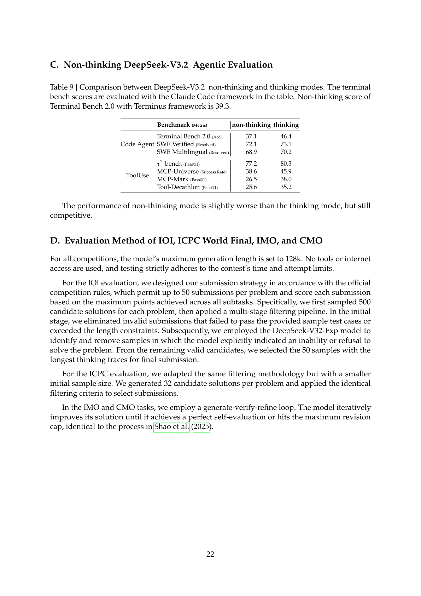

## 附录 E：作者名单

论文最后列出研究与工程、数据标注、商业与合规三个团队的完整成员。名单按英文名字母顺序排列，星号表示已经离开团队的成员。

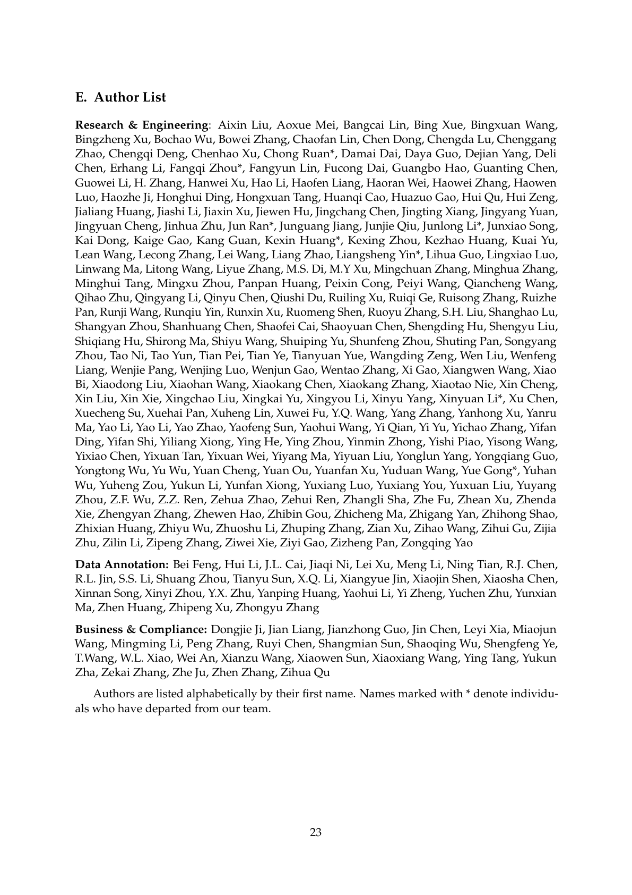
