# Janus-Pro：通过数据与模型扩展统一多模态理解与生成

**作者：** Xiaokang Chen、Zhiyu Wu、Xingchao Liu、Zizheng Pan、Wen Liu、Zhenda Xie、Xingkai Yu、Chong Ruan

**项目：** [GitHub](https://github.com/deepseek-ai/Janus)

**原文：** [arXiv:2501.17811](https://arxiv.org/abs/2501.17811)

## 摘要

本文介绍 Janus-Pro，即 Janus 的增强版本。Janus-Pro 从三个方面改进前代工作：优化训练策略、扩充训练数据，并把模型扩展到更大规模。这些改进显著提升了多模态理解和文生图指令遵循能力，同时让文生图质量更加稳定。代码与模型均已公开。

图 1 汇总主要结果。多模态理解采用 POPE、MME-Perception、GQA、MMMU 四项平均分；视觉生成采用 GenEval 与 DPG-Bench。Janus-Pro-7B 超过此前统一多模态模型，也能与理解专用或生成专用模型竞争。

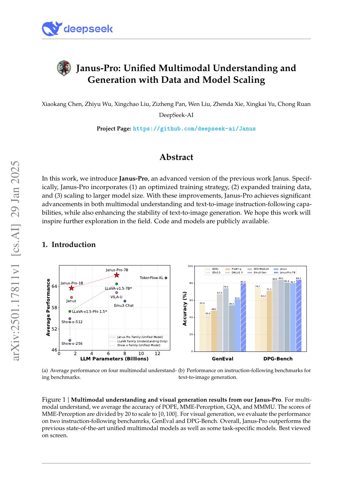

## 1 引言

统一多模态理解与生成近年进展明显。这类模型通常复用同一个视觉编码器处理理解和生成，但两类任务需要的表征并不相同：理解偏重高层语义，生成则需要细粒度视觉细节，强行共享容易产生冲突。Janus 通过解耦视觉编码缓解这一问题，在两类任务上都取得了较好结果。

作为先行验证，Janus 只训练了约 1B 规模模型，数据和容量都有限，因此短提示文生图表现不佳，生成质量也不稳定。Janus-Pro 从训练、数据和规模三方面扩展，包含 1B 与 7B 两种版本，以验证解耦方案的可扩展性。

图 2 对比 Janus 与 Janus-Pro-7B。后者面对短提示时输出更稳定，审美、细节和简单文字生成都有改善。两者输出分辨率均为 384x384。

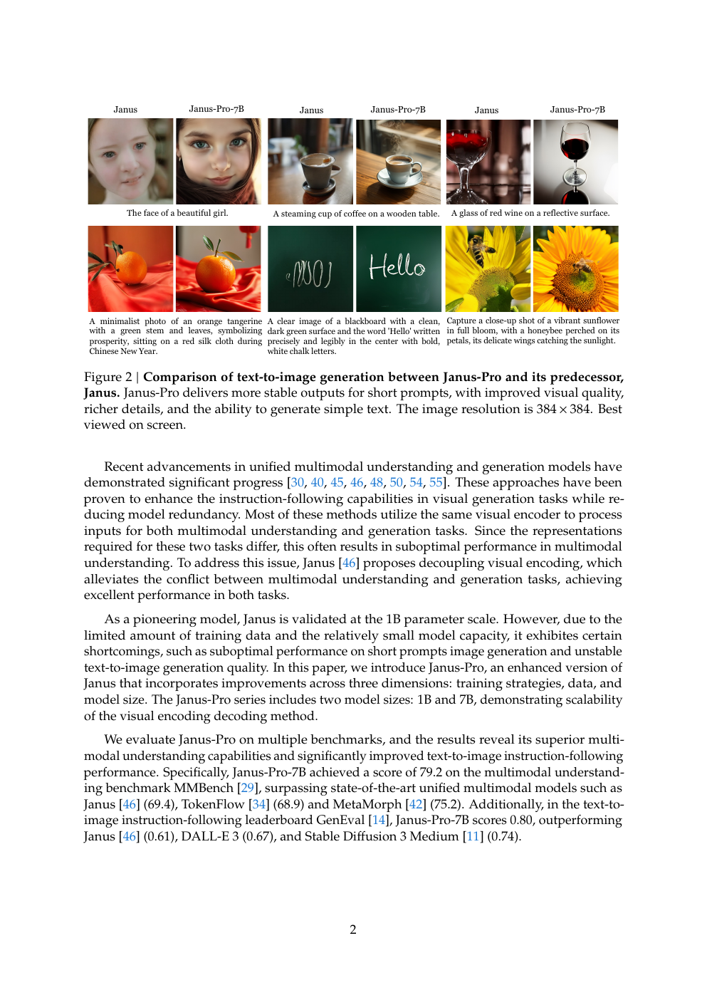

Janus-Pro-7B 在 MMBench 上达到 79.2，超过 Janus 的 69.4、TokenFlow 的 68.9 与 MetaMorph 的 75.2；GenEval 得分 0.80，高于 Janus 的 0.61、DALL-E 3 的 0.67 与 SD3-Medium 的 0.74。

## 2 方法

### 2.1 架构

Janus-Pro 沿用 Janus 架构，核心原则是把多模态理解和视觉生成的视觉编码解耦，再交给统一自回归 Transformer 处理。

理解任务使用 SigLIP 提取高维语义特征，把二维网格展平为一维序列，再由理解适配器映射到语言模型输入空间。生成任务使用 VQ tokenizer 把图像转成离散 ID，展平后由生成适配器把码本嵌入映射到同一输入空间。各种特征序列拼接为统一多模态序列，送入语言模型；除语言模型自带文本预测头外，模型还为图像预测设置一个随机初始化的预测头。整体始终采用自回归建模。

### 2.2 优化训练策略

原 Janus 分三阶段训练：第一阶段训练适配器和图像头；第二阶段统一预训练，冻结理解与生成编码器，更新其他组件；第三阶段监督微调，并解冻理解编码器。

原方案在第二阶段把文生图训练分为两部分：先用 ImageNet 类别名作为提示学习像素依赖，再用常规图文数据训练。第二阶段约 66.67% 的文生图步骤用于 ImageNet，计算效率较低。Janus-Pro 改为：

- **延长第一阶段。** 在语言模型冻结时充分训练 ImageNet，模型仍能学会像素依赖并依据类别名生成合理图像。
- **聚焦第二阶段。** 完全移除 ImageNet，直接使用带密集描述的常规文生图数据，提高数据与计算利用率。

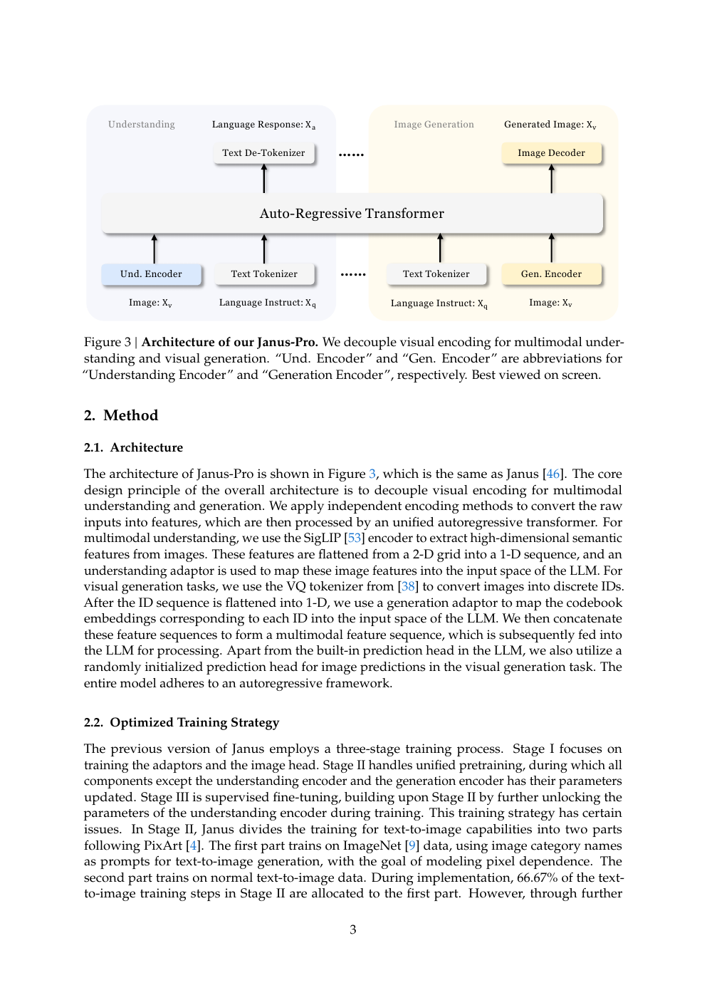

第三阶段的数据比例也从“多模态理解:纯文本:视觉生成 = 7:3:10”调整为 5:1:4。适度降低生成数据后，模型仍保持强视觉生成能力，同时多模态理解进一步提高。

### 2.3 数据扩展

**多模态理解。** 第二阶段参考 DeepSeek-VL2 增加约 9000 万样本，包括 YFCC 图像描述，以及表格、图表和文档理解数据。第三阶段加入 MEME 理解、中文对话和对话体验增强数据，扩大任务覆盖并改善交互。

**视觉生成。** 原 Janus 的真实图文数据质量不一、噪声较多，容易造成生成不稳定和审美欠佳。Janus-Pro 新增约 7200 万条合成审美数据，统一预训练中的真实与合成数据比例为 1:1。实验表明，合成数据收敛更快，生成也更稳定、更美观。

### 2.4 模型扩展

Janus-Pro 将语言模型从 1.5B 扩展到 7B。更大模型在理解和生成损失上都收敛更快，进一步验证视觉编码解耦的可扩展性。

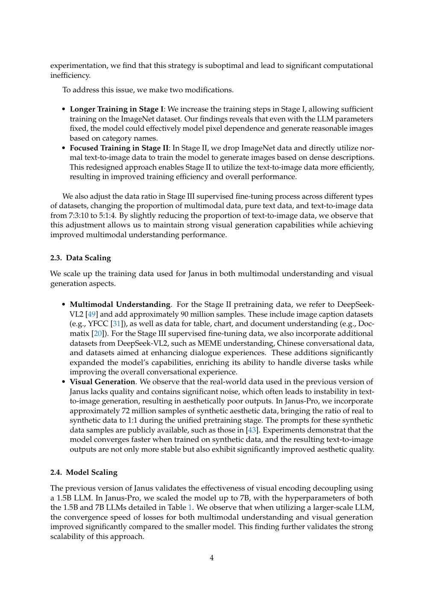

## 3 实验

### 3.1 实现细节

Janus-Pro-1B 与 Janus-Pro-7B 分别使用 1.5B 和 7B 的 DeepSeek-LLM，最大序列长度均为 4096。理解编码器采用 SigLIP-Large-Patch16-384；生成编码器码本大小为 16384，图像下采样 16 倍；理解和生成适配器都是两层 MLP。

1B/7B 的嵌入维度分别为 2048/4096，注意力头数为 16/32，层数为 24/30。三阶段学习率均为 $10^{-3}$、$10^{-4}$、$4\times10^{-5}$，优化器使用 AdamW，梯度裁剪为 1。第二阶段原计划 36 万步，但在 27 万步提前停止。

所有图像统一到 384x384。理解数据按长边缩放，短边以 RGB(127,127,127) 填充；生成数据按短边缩放，再裁剪长边。训练使用 sequence packing，并在同一步中按比例混合数据。1B 模型使用 16 节点、7B 使用 32 节点，每节点 8 张 A100 40GB，完整训练分别约 9 天和 14 天。

### 3.2 评测设置

理解评测包括 GQA、POPE、MME、SEED、MMBench、MM-Vet 和 MMMU。视觉生成使用 GenEval 与 DPG-Bench：前者按对象级维度评估组合生成能力，后者包含 1065 条长而密集的提示，考察复杂语义对齐。

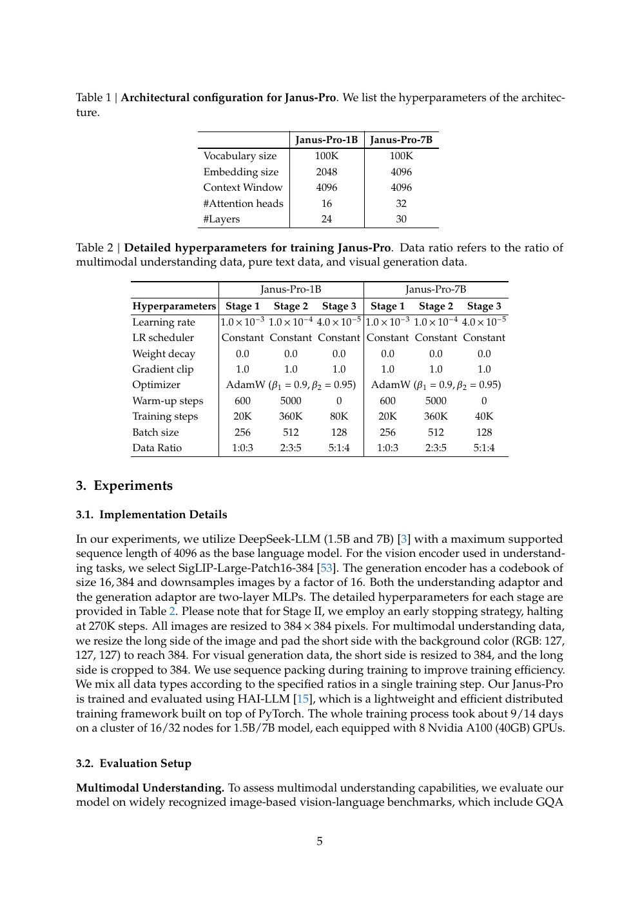

### 3.3 与先进方法比较

**多模态理解。** Janus-Pro-7B 在 POPE、MME-Perception、MMBench、SEED、GQA、MMMU、MM-Vet 上分别达到 87.4、1567.1、79.2、72.1、62.0、41.0、50.0。它在大多数项目上取得表中最佳结果；即使与更大模型相比也很有竞争力，例如除 GQA 外全面超过 13B 的 TokenFlow-XL。结果支持“理解/生成视觉编码解耦可以减少任务冲突”的设计判断。

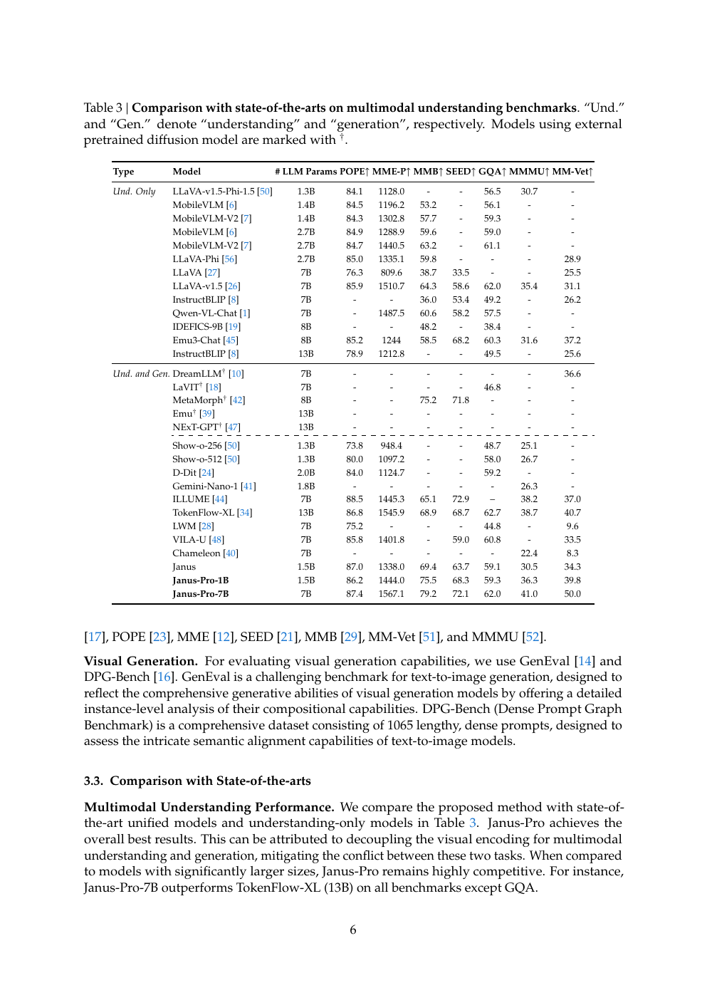

**视觉生成。** GenEval 把结果拆成单对象、双对象、计数、颜色、位置和颜色属性。Janus-Pro-1B 总分 0.73，7B 总分 0.80；7B 在位置和颜色属性上分别达到 0.79、0.66，明显优于前代。DPG-Bench 中，Janus-Pro-7B 的全局、实体、属性、关系、其他和总分分别为 86.90、88.90、89.40、89.32、89.48、84.19，表中总分最高，说明它能更好地遵循密集提示。

### 3.4 定性结果

理解案例覆盖长图像描述、地标识别、一般知识和文字识别；生成案例覆盖写实人物、动物、微距、建筑和幻想场景。尽管输出只有 384x384，Janus-Pro-7B 仍能产生较丰富细节，并较准确地把创意提示中的语义关系落实到图像中。

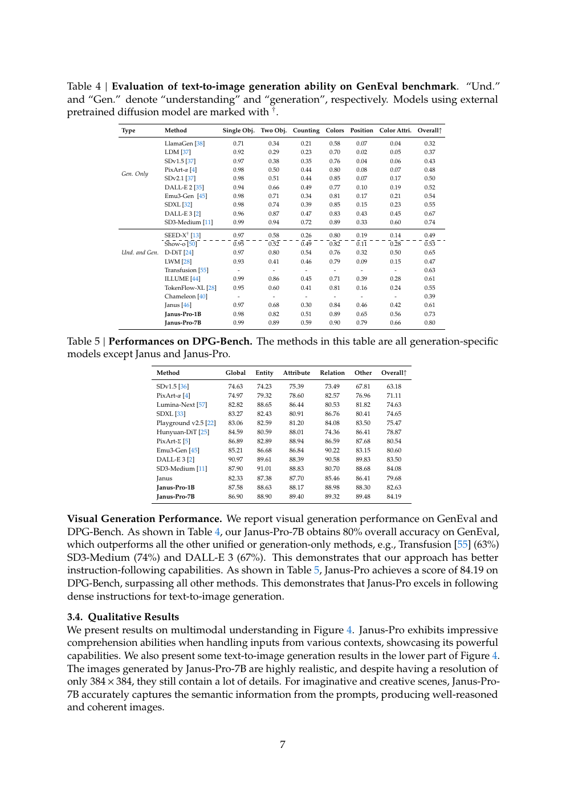

图 4 展示模型对海岸景观的细致描述、杭州西湖地标识别、主题蛋糕知识问答和黑板文字识别，以及八组文生图结果。理解和生成共用自回归骨干，但分别使用适合任务的视觉编码路径。

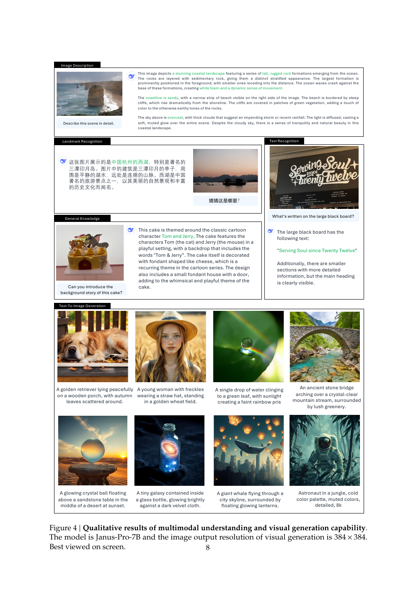

## 4 结论

Janus-Pro 通过训练策略、数据和模型规模三方面改进 Janus，显著增强多模态理解、文生图指令遵循与生成稳定性。它仍有两项主要局限：理解输入限制为 384x384，影响 OCR 等细粒度任务；生成分辨率同样较低，视觉 tokenizer 的重建损失会损害小人脸等局部细节。提高分辨率有望缓解这些问题。

## 参考文献

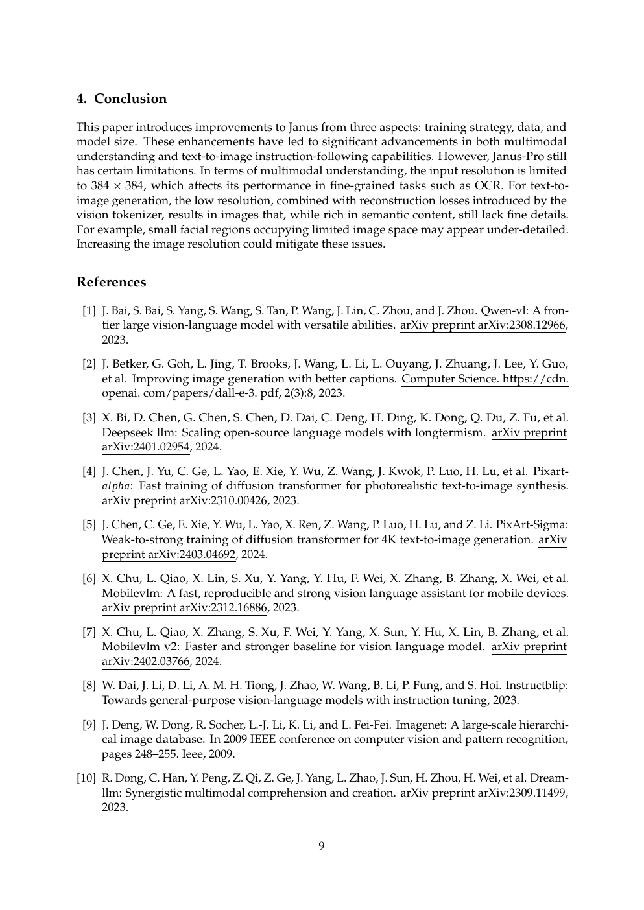

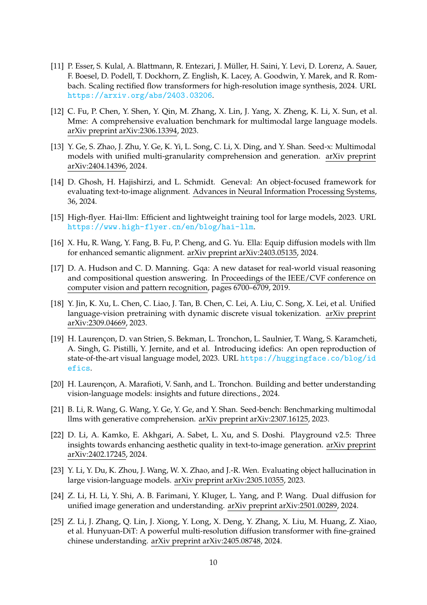

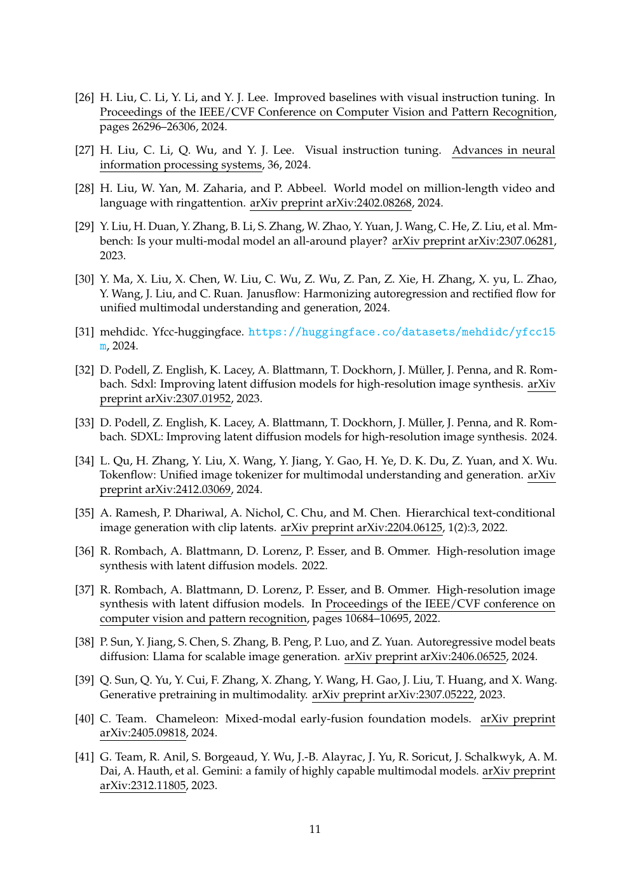

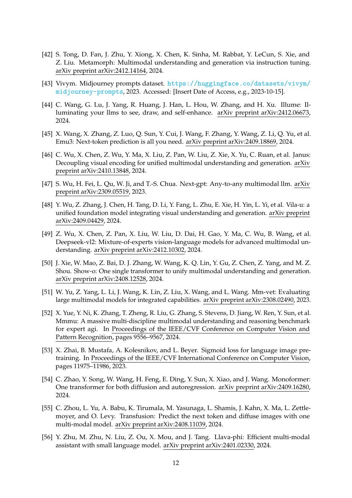

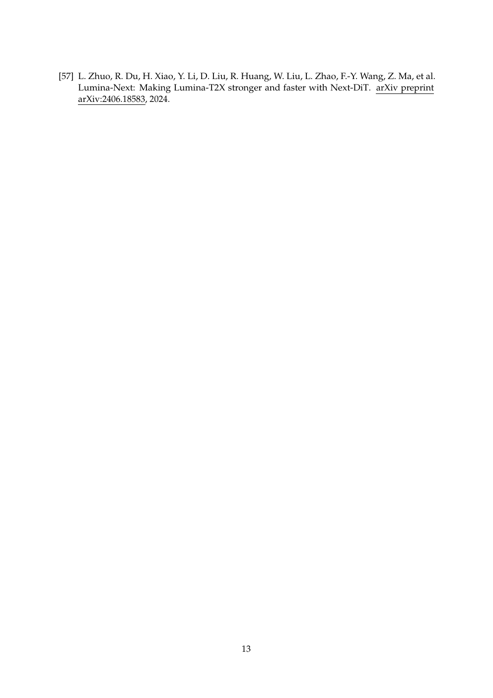
