# Kimi k1.5：用大型语言模型扩展强化学习

**作者：** Kimi 团队

**原文：** [arXiv:2501.12599](https://arxiv.org/abs/2501.12599)

## 摘要

基于下一词元预测的语言模型预训练已经证明能够有效扩展计算，但其上限受可用训练数据量约束。扩展强化学习（RL）为人工智能持续进步打开了一条新轴线：大型语言模型可以通过带奖励的探索，自行扩展训练经验。然而，此前公开工作尚未给出具有竞争力的结果。

本文报告最新多模态模型 Kimi k1.5 的训练实践，包括强化学习训练技术、多模态数据配方和基础设施优化。长上下文扩展与改进的策略优化是方法的关键组成部分；二者构成了一个简洁而有效的强化学习框架，不依赖蒙特卡洛树搜索、价值函数或过程奖励模型等更复杂技术。

Kimi k1.5 在多项基准和多种模态上取得领先推理表现：AIME 77.5、MATH-500 96.2、Codeforces 第 94 百分位、MathVista 74.9，与 OpenAI o1 相当。本文还提出有效的 long2short 方法，用长思维链技术提升短思维链模型；所得短思维链模型在 AIME、MATH-500 和 LiveCodeBench 上分别达到 60.8、94.6 和 47.3，显著超过 GPT-4o、Claude 3.5 Sonnet 等现有短思维链模型，部分任务的相对提升最高约 550%。

图 1 比较 Kimi k1.5 长思维链版本与 o1、o1-mini、QVQ-72B-Preview、QwQ-32B-Preview 在数学、代码和视觉推理上的结果。

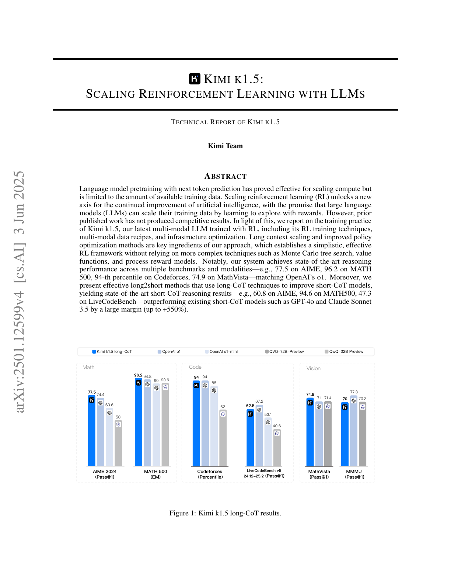

图 2 比较短思维链版本与 GPT-4o、Claude 3.5 Sonnet、Qwen2-VL、Llama 3.1 405B、DeepSeek-V3、Qwen2.5-72B。在 AIME 2024 上，Kimi k1.5 短思维链达到 60.8；在 MATH-500 上达到 94.6；在 LiveCodeBench v4 上达到 47.3。通用能力方面，MMLU、IF-Eval、CLUEWSC 和 C-Eval 分别为 87.4、87.2、91.7 和 88.3。

## 1 引言

下一词元预测的语言模型预训练通常在缩放定律框架下研究：按比例扩大参数量和数据量，可以持续提高智能水平。然而，这一路径受高质量数据存量限制。本文给出最新多模态强化学习模型 Kimi k1.5 的训练配方，目标是探索新的持续扩展方向。强化学习允许模型通过奖励开展探索，不再完全受制于预先存在的静态数据集。

Kimi k1.5 的设计与训练包含四个关键要素。

- **长上下文扩展。** 将强化学习上下文窗口扩展至 128K，并观察到性能随上下文长度继续提高。核心技术之一是部分轨迹展开：复用上一轮轨迹的大段内容，只生成新的后续部分，避免从头重新生成整条轨迹，从而提高训练效率。实验表明，上下文长度是用大型语言模型持续扩展强化学习的重要维度。
- **改进的策略优化。** 本文推导长思维链强化学习的形式化目标，并使用在线镜像下降的变体实现稳健策略优化；再通过有效采样策略、长度惩罚与数据配方优化进一步增强算法。
- **简洁框架。** 长上下文扩展与改进的策略优化结合后，形成一个简洁的语言模型强化学习框架。扩大的上下文使模型学到规划、反思和纠错；更长上下文等价于增加搜索步数，因此无需蒙特卡洛树搜索、价值函数或过程奖励模型，也能取得很强表现。
- **多模态。** 模型在文本和视觉数据上联合训练，能跨两种模态开展推理。

此外，本文提出利用长思维链先验改进短思维链模型的 long2short 方法，包括使用长思维链激活配合长度惩罚，以及模型合并。长思维链与短思维链版本的总体结果见图 1、图 2。

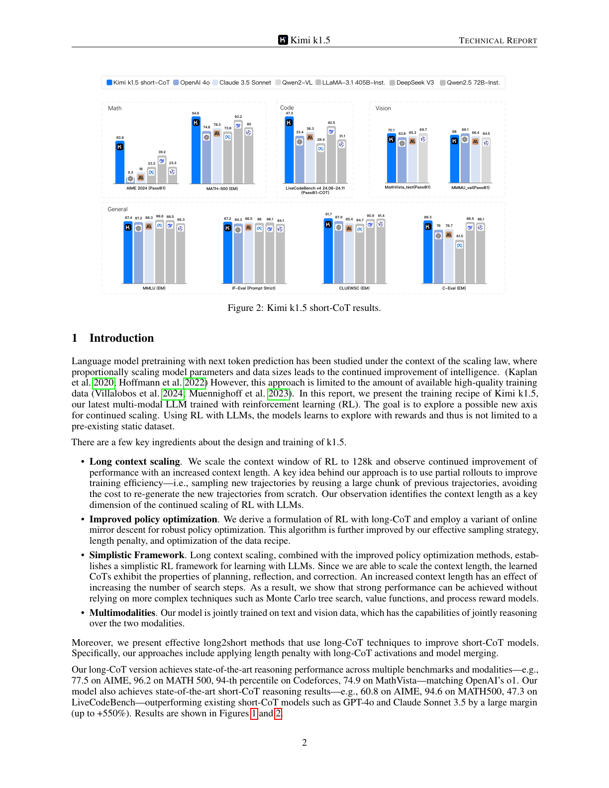

## 2 方法：大型语言模型强化学习

Kimi k1.5 的开发包含预训练、常规监督微调、长思维链监督微调和强化学习。本报告重点讨论强化学习：先介绍强化学习提示集整理与长思维链监督微调，再详细说明强化学习策略；预训练与常规监督微调见第 2.5 节。

### 2.1 强化学习提示集整理

初步实验显示，强化学习提示集的质量与多样性决定训练是否有效。构造良好的提示集既引导模型形成稳健推理，也降低奖励投机和对表面模式过拟合的风险。高质量提示集应满足三项要求：

- **覆盖多样。** 跨越 STEM、编程与通用推理等广泛学科，增强适应性和跨领域通用性。
- **难度均衡。** 同时包含简单、中等和困难问题，支持渐进学习，避免只适应某一复杂度。
- **可准确评测。** 验证器能客观、可靠地评估答案，使结果真正反映正确推理，而不是模式投机或随机猜测。

为提高覆盖面，团队通过自动过滤器选择需要丰富推理、又容易核验的问题。数据包括 STEM、竞赛、通用推理以及纯文本和图文问答，并用标签系统按领域和学科分类，保持各主题平衡。

难度评估采用模型自适应方法。对每条提示，让监督微调模型以较高采样温度生成十次回答，以通过率作为难度代理：通过率越低，题目越难。这一指标与模型自身能力对齐，可预先过滤大多数过于简单的样本，也便于在强化学习中试验不同采样策略。

为避免奖励投机，题目的推理过程与最终答案都必须能准确验证。一些复杂题可能只有很容易猜中的简单答案，导致模型以错误推理碰巧得到正确结果。团队因此排除多项选择、判断和证明题等容易出现假阳性的类型。对通用问答，另让模型在不展开思维链的情况下直接猜答案；如果 $N$ 次内猜中，就把该提示视为过于容易投机并删除。实验中 $N=8$ 能移除大部分此类提示，更先进的验证模型仍是未来方向。

### 2.2 长思维链监督微调

在整理后的提示集上，团队通过提示工程构建规模较小但质量很高的长思维链热身数据，其中包含文本和图像输入对应的、可准确验证的推理路径。它类似拒绝采样，但重点是用提示工程生成长思维链。

热身数据刻意覆盖几类关键认知过程：执行前系统规划步骤；对中间结果进行评估；反思并修正原有方案；探索替代解法。经过一次轻量监督微调，模型开始内化这些策略，能生成更详细、逻辑更连贯的回答，并在多类推理任务上提高表现。

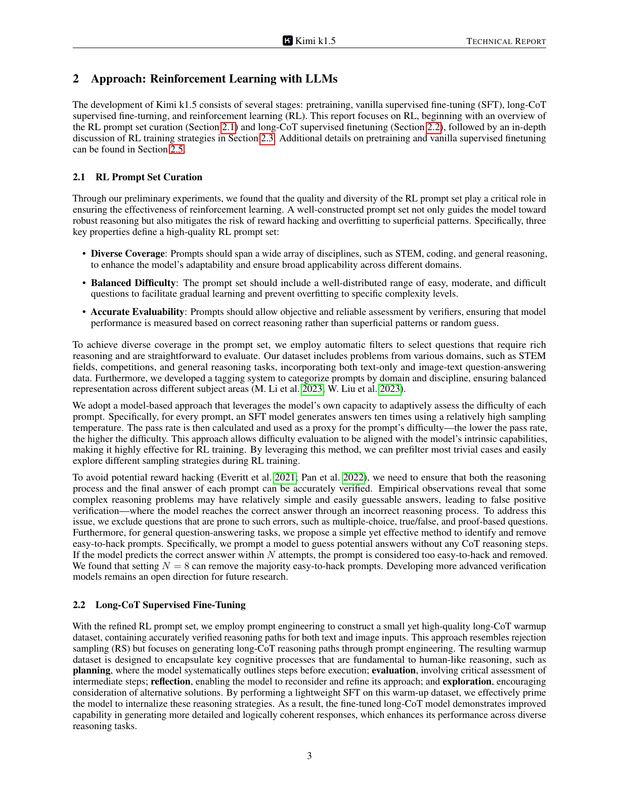

### 2.3 强化学习

#### 2.3.1 问题设定

给定训练集 $D=\{(x_i,y_i^*)\}_{i=1}^n$，其中 $x_i$ 是问题、$y_i^*$ 是标准答案，目标是训练策略模型 $\pi_\theta$ 准确解决测试问题。复杂推理中，从问题 $x$ 到答案 $y$ 的映射并不直接。思维链方法引入中间步骤序列 $z=(z_1,z_2,\ldots,z_m)$；每个 $z_i$ 都是一段连贯词元，代表迈向解答的重要一步。模型自回归采样各个思考步骤，再采样最终答案；思考与答案均是语言序列。

规划算法可以在推理时探索多个思路，以得到更好的思维链。典型做法显式构建由价值估计引导的思维树：每个节点是部分解 $s=(x,z_{1:|s|})$，评论模型 $v$ 评估当前进度、识别错误，规划器据此选择最有希望的节点扩展，直到形成完整答案。反馈既可以是判别分数，也可以是一段语言序列。

从算法角度看，规划器根据此前的搜索历史选择下一条搜索方向，再为当前进度产生反馈。因为思考与反馈都可表示为语言词元，本文把搜索树中的全部信息展平到上下文中，把规划看作直接作用于推理步骤序列的映射 $A(\cdot\mid z_1,z_2,\ldots)$。这带来一个重要视角：与其显式维护搜索树和规划算法，不如训练语言模型自身近似这一过程。此时思考词元数量对应传统规划的计算预算；长上下文则让搜索空间在训练与测试时都能平滑扩展。模型因而可能通过自回归预测在推理空间中执行隐式搜索，并把这种能力泛化到新问题。

本文用强化学习训练模型生成这类思维链。奖励模型 $r$ 根据问题 $x$、候选答案 $y$ 与标准答案 $y^*$ 判断正确性，$r(x,y,y^*)\in\{0,1\}$。可验证任务直接使用预设规则，例如代码是否通过测试；自由形式答案则训练奖励模型判断语义是否匹配。优化目标为：

$$
\max_\theta\;\mathbb{E}_{(x,y^*)\sim D,(y,z)\sim\pi_\theta}\left[r(x,y,y^*)\right].
$$

扩展强化学习的目标，是把简单提示式思维链与带规划的思维链优点结合起来。部署时模型仍只需自回归生成，无需显式规划算法的复杂并行化；但它不只是机械跟随推理步骤，还要借助已探索的全部思路学会识错、回溯和修正。

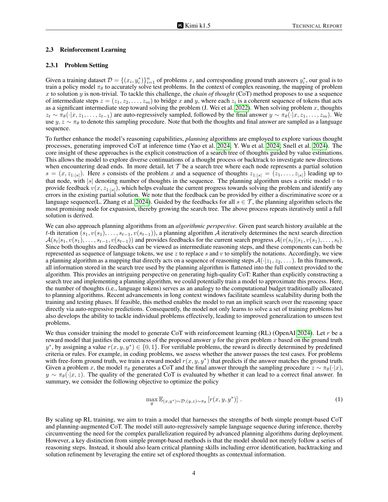

#### 2.3.2 策略优化

训练算法采用在线策略镜像下降的一个变体，按轮次迭代。在第 $i$ 轮，以当前模型 $\pi_{\theta_i}$ 为参考，求解带相对熵正则的策略优化：

$$
\max_\theta\;\mathbb{E}_{(x,y^*)\sim D}\mathbb{E}_{(y,z)\sim\pi_\theta}
[r(x,y,y^*)]-\tau\,\mathrm{KL}(\pi_\theta(x)\|\pi_{\theta_i}(x)),
$$

其中 $\tau>0$ 控制正则强度。该目标存在闭式最优解：

$$
\pi^*(y,z\mid x)=\frac{\pi_{\theta_i}(y,z\mid x)\exp(r(x,y,y^*)/\tau)}{Z}.
$$

由此可构造适用于离策略数据的代理损失。实践中，每个问题从参考策略采样 $k$ 个回答，用奖励样本均值 $\bar r$ 近似归一化项，得到与带均值基线的策略梯度相似的更新：

$$
\frac{1}{k}\sum_{j=1}^{k}\nabla_\theta\log\pi_\theta(y_j,z_j\mid x)
(r(x,y_j,y^*)-\bar r)
-\nabla_\theta\frac{\tau}{2}
\left(\frac{\pi_\theta(y_j,z_j\mid x)}{\pi_{\theta_i}(y_j,z_j\mid x)}\right)^2.
$$

与常规正则化在策略梯度相比，主要区别是回答来自参考策略而不是严格在策略采样，并加入 $l_2$ 正则。每轮从数据集采一批问题，更新至 $\theta_{i+1}$，再把它作为下一轮参考策略；由于参考策略改变，优化器也在每轮开头重置。

系统不使用价值网络，这既显著提高训练效率，也反映了团队对经典信用分配的质疑。假设一条部分思维链有两个候选下一步：一个立刻导向正确答案，另一个含有错误，但模型之后能够发现错误并恢复。经典价值函数会惩罚第二条路径；对长思维链训练而言，这种探索却很有价值，因为它让模型学习试错、恢复与规划。最终答案奖励允许模型从成功恢复的曲折路径中学习。目标不是只提高训练题准确率，而是获得能泛化到测试问题的解决策略。

#### 2.3.3 长度惩罚

强化学习过程中，回答会明显变长。虽然性能随之提高，但过长推理增加训练和推理成本，也常不符合用户偏好。为提高词元效率，本文加入长度奖励。对同一问题的 $k$ 个回答，记第 $i$ 个回答长度为 $\mathrm{len}(i)$。若最长与最短回答等长，则全部长度奖励为零；否则：

$$
\mathrm{len\_reward}(i)=
\begin{cases}
\lambda, & r(x,y_i,y^*)=1,\\
\min(0,\lambda), & r(x,y_i,y^*)=0,
\end{cases}
\quad
\lambda=0.5-\frac{\mathrm{len}(i)-\mathrm{min\_len}}
{\mathrm{max\_len}-\mathrm{min\_len}}.
$$

这会在正确回答中鼓励短答案、抑制长答案，并明确惩罚又长又错的回答。长度奖励按权重叠加到原奖励上。初期直接施加长度惩罚可能减慢训练，因此先用标准策略优化热身，再在余下训练中使用恒定长度惩罚。

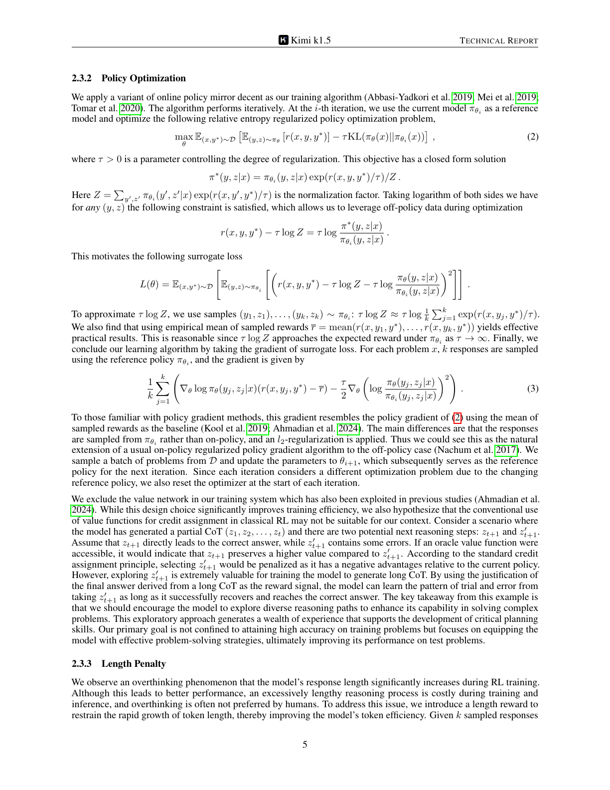

#### 2.3.4 采样策略

强化学习本身虽有一定自适应采样特性，例如困难题常产生更大梯度，但训练效率仍有限。本文利用题目难度标签与模型在每道题上的历史成功率，提出两种先验采样方法。

- **课程采样。** 先训练简单任务，再逐步过渡到困难任务。初始模型在极难问题上很少生成正确样本，把有限计算投入这些题会降低效率；而已有数据自带年级与难度标签，适合直接建立课程。
- **优先采样。** 记录每道题的成功率 $s_i$，按 $1-s_i$ 的比例采样，让模型失败更多的题获得更高概率，把训练集中到薄弱项上。

#### 2.3.5 训练配方的更多细节

**代码测试用例生成。** 大量网络编程题没有测试用例。团队针对不需要特殊判题、且已有标准解的题目，使用 CYaRon 自动生成测试。基础 Kimi k1.5 根据题目描述和 CYaRon 使用说明生成 50 个测试用例，再随机选 10 份标准提交运行；若至少 7/10 的提交在某用例上结果一致，该用例才有效。若至少 9/10 的提交能通过整组有效测试，题目及测试才进入训练集。抽样 1000 道在线竞赛题，其中 614 道不需特殊判题；最终开发出 463 个至少能产生 40 条有效测试的生成器，并纳入 323 道题。

**数学奖励建模。** 数学答案可能形式不同但等价，例如 $a^2-4$ 与 $(a+2)(a-2)$。团队比较两种奖励模型：传统模型使用价值头，以问题、参考答案和回答为输入，约用 80 万条数据微调，输出一个正确性标量；思维链奖励模型也使用约 80 万条带推理标注的数据，先显式生成逐步判断过程，再以 JSON 输出结论。人工抽检中，传统奖励模型准确率约 84.4%，思维链奖励模型达到 98.5%，因此强化学习实际采用后者。

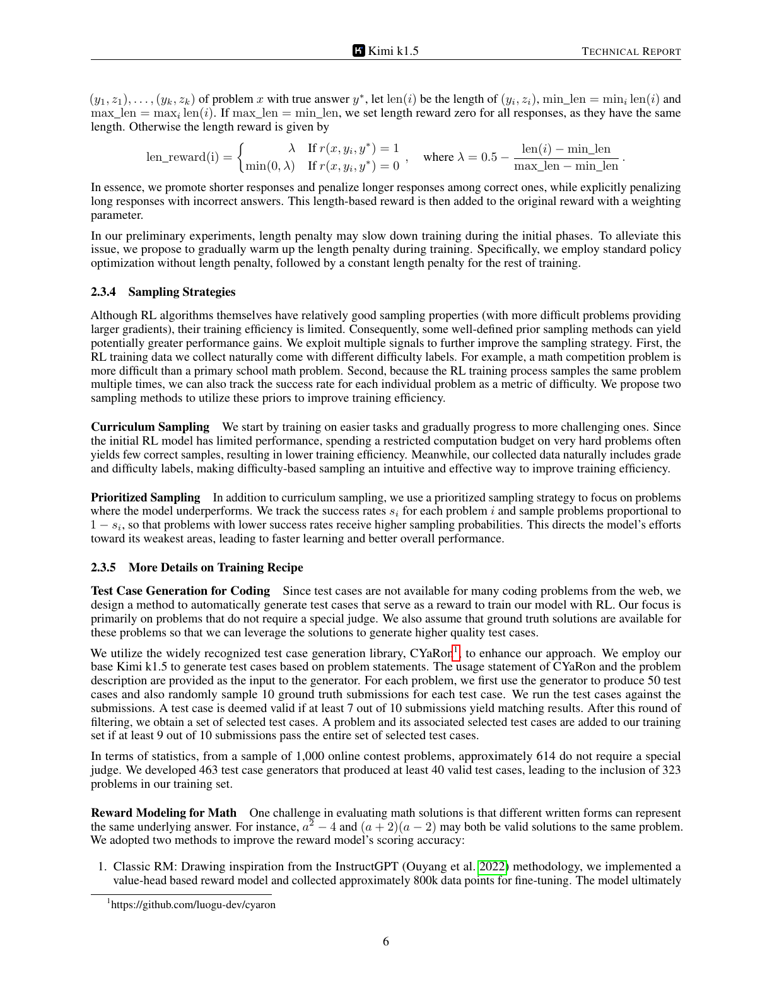

**视觉数据。** 视觉强化学习数据分三类：

1. 真实世界数据，包括需要图形理解与推理的各年级科学题、依赖视觉感知和推断的地点猜测，以及复杂图表分析等。
2. 合成视觉推理数据，通过程序生成图像与场景，有针对性地训练空间关系、几何模式和物体交互等能力，并持续提供可控样本。
3. 文本渲染数据，把文档、代码和结构化数据转成图像，使模型面对纯文本或截图、照片中的文本时保持一致，也提高处理文本密集图像的能力。

三类数据共同覆盖真实应用，并提高跨输入模态的一致性。

### 2.4 Long2short：面向短思维链模型的上下文压缩

长思维链模型表现很强，但测试时消耗更多词元。本文把长思维链的思考先验迁移到短思维链模型，在有限词元预算下提高性能，具体探索四种方法。

- **模型合并。** 将长思维链模型与短思维链模型的权重直接取平均，无需额外训练；实验发现这既保持泛化，也提高词元效率。
- **最短拒绝采样。** 同一道题采样 $n$ 次（实验中 $n=8$），选出最短的正确回答用于监督微调。
- **DPO。** 用长思维链模型生成多个候选，把最短正确解作为正样本；把错误长回答以及长度超过正样本 1.5 倍的正确长回答作为负样本，形成成对偏好数据。
- **Long2short RL。** 先完成标准强化学习，再选择性能与词元效率平衡最好的检查点进入单独的 long2short 阶段；此时使用长度惩罚，并大幅缩短最大轨迹长度，进一步抑制超预算回答。

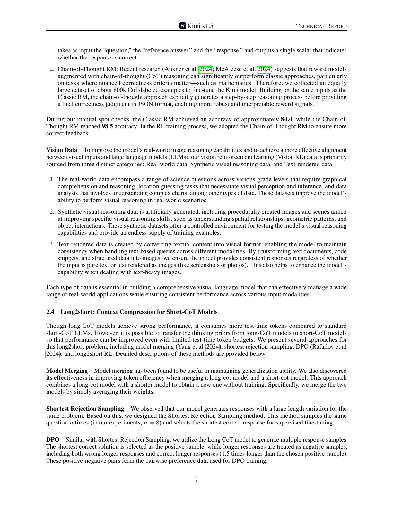

### 2.5 其他训练细节

#### 2.5.1 预训练

Kimi k1.5 基础模型使用多样、高质量的多模态语料训练。语言数据覆盖英文、中文、代码、数学推理与知识五个领域；多模态数据包括图像描述、图文交错、OCR、知识与问答。

预训练分三阶段：先建立强语言基础，再逐步加入多模态数据；随后用精选和合成数据进行冷却，重点巩固推理与知识任务；最后激活长上下文，把序列处理能力扩展至 131072 词元。附录 B 给出更多数据细节。

#### 2.5.2 常规监督微调

常规监督微调语料覆盖多个领域。问答、写作、文本处理等非推理任务先由人工标注种子数据，训练种子模型；随后收集多样提示，让种子模型为每条提示生成多个回答，由标注员排序并精修最高排名回答。数学与代码等推理任务可由规则或奖励模型更准确高效地验证，因此使用拒绝采样扩展数据。

文本监督微调数据约 100 万条：通用问答 50 万、代码 20 万、数学与科学 20 万、创意写作 5000、摘要、文档问答、翻译、写作等长上下文任务 2 万。另构建约 100 万条图文样本，覆盖图表解释、OCR、基于图像的对话、视觉编程、视觉推理，以及带图示的数学和科学题。

训练先以 32K 序列长度进行一轮，再以 128K 进行一轮。第一阶段学习率从 $2\times10^{-5}$ 衰减至 $2\times10^{-6}$；第二阶段重新热身至 $1\times10^{-5}$，再降至 $1\times10^{-6}$。多个样本会打包到一条训练序列中以提高效率。

### 2.6 强化学习基础设施

图 3 展示大规模训练系统及部分轨迹展开：轨迹生成工作进程、训练工作进程、奖励模型和回放缓冲区由主控协调；长轨迹可跨迭代保存与续写。

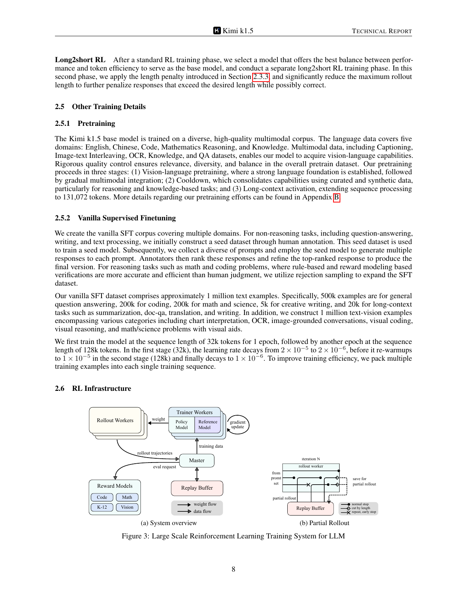

#### 2.6.1 大规模语言模型强化学习训练系统

Kimi k1.5 使用迭代式同步强化学习框架，每次迭代包括轨迹生成和训练两个阶段。生成阶段中，多个工作进程在中央主控协调下与模型交互，为不同输入产生回答轨迹；轨迹进入回放缓冲区，通过打散时序相关性形成多样、较少偏的数据。训练阶段再读取这些经验、计算梯度并更新模型。

中央主控管理轨迹工作进程、训练进程、奖励评测和回放缓冲区之间的数据与通信，负责负载平衡和高效调度。奖励模型评估输出质量，为模型策略提供反馈；代码题另由代码执行服务在真实运行环境中核验解答，让奖励信号与实际编程结果一致。

#### 2.6.2 面向长思维链强化学习的部分轨迹展开

长上下文强化学习的关键挑战，是同时处理长度差异很大的轨迹。部分轨迹展开为每轮生成设置固定输出词元预算；轨迹超过预算时，把未完成部分保存到回放缓冲区，在下一轮继续。这样，单条超长轨迹不会独占资源；异步工作进程也能在部分节点处理长轨迹时继续生成其他短轨迹。

长回答会被分成跨多轮迭代的片段，只有当前轮的新片段需要在策略计算；之前片段可从缓冲区复用，避免反复生成。训练时还可把某些旧片段排除在损失计算之外，进一步降低开销。这使系统在保持较快迭代的同时生成更长回答。系统也检测重复序列并提前终止，对重复施加额外惩罚，减少无效计算和冗余生成。

#### 2.6.3 训练与推理混合部署

强化学习循环包含三步：Megatron 与 vLLM 分别运行在由 checkpoint-engine 包装的容器中；训练完成后，Megatron 卸载显存，并准备把最新权重传给 vLLM；vLLM 用占位权重启动，再通过 Mooncake 接收权重并生成轨迹；完成后 checkpoint-engine 终止 vLLM，Megatron 重新装载显存，进入下一轮训练。

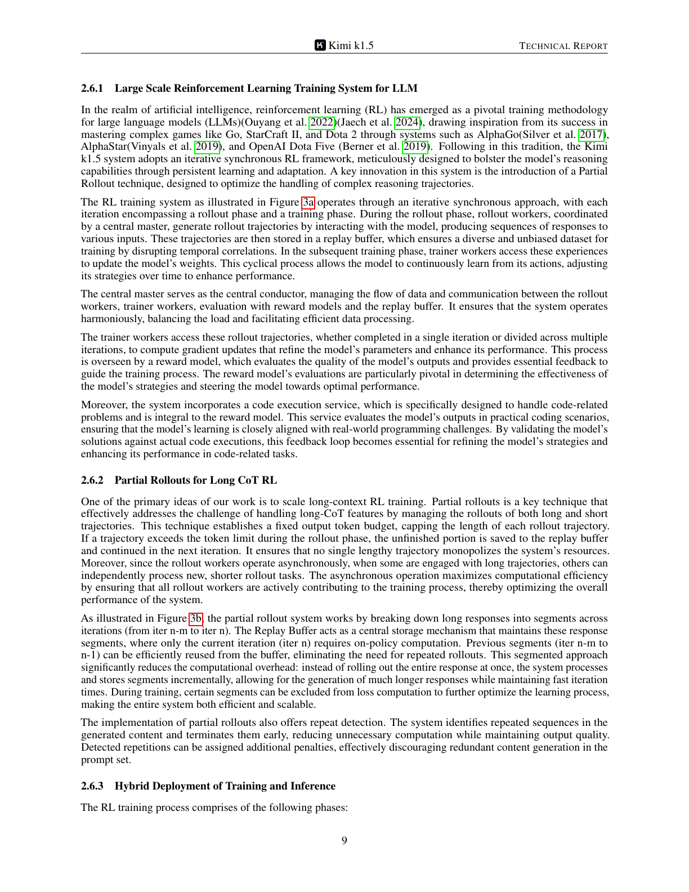

现有方案难以同时满足三项要求：Megatron 与 vLLM 可能使用不同并行策略，多节点训练权重不易直接共享；在策略强化学习若把训练和推理固定到不同 GPU，会产生大量空闲资源；有些阶段需要动态增加推理节点、而保持训练规模不变。

为此，团队以 Kubernetes Sidecar 容器共享同一 Pod 的全部 GPU，把训练和推理共置。这样可以避免两套节点互等造成的空闲，也允许训练镜像与推理镜像独立迭代，并可方便替换 vLLM。训练切换到推理耗时不足一分钟，反向切换约十秒。

Checkpoint Engine 管理 vLLM 生命周期，并通过 HTTP API 触发操作；etcd 维护全局元数据、广播状态。由于 CUDA Graph、NCCL 缓冲与驱动资源很难靠卸载彻底释放，系统选择按需终止和重启 vLLM，以提高显存利用和容错。Megatron 工作进程把本地检查点转成 Hugging Face 格式写入共享内存，同时处理流水线并行与专家并行，使检查点只保留张量并行分片；之后注册到全局元数据，通过 Mooncake 和 RDMA 在节点间传输，vLLM 再完成权重载入与张量并行转换。

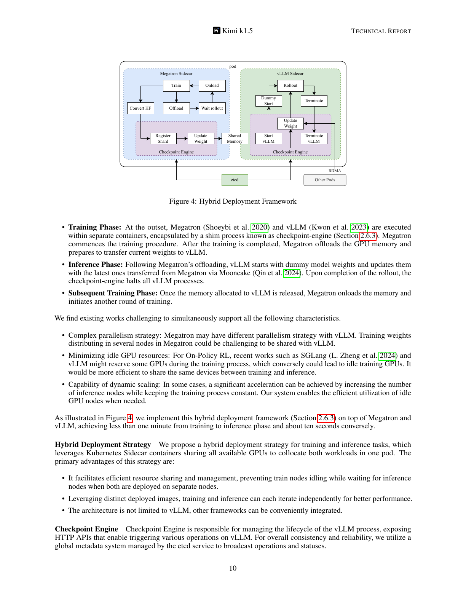

#### 2.6.4 代码沙箱

团队开发安全代码执行沙箱，用于运行用户提交代码和评测代码基准。它可动态切换容器镜像，支持 MultiPL-E、DMOJ Judge Server、Lean、Jupyter Notebook 等环境。

在代码强化学习中，沙箱提供一致、可重复的评测机制，支持代码执行反馈、仓库级编辑等多阶段任务，并让不同编程语言的基准比较保持同一上下文。服务部署在 Kubernetes 上，经 HTTP 接口对外集成；自动重启和滚动更新提供可用性与容错。

性能优化包括使用 crun 代替 Docker 缩短容器启动；预创建并复用 cgroup，避免高并发时频繁建立与销毁；用上层挂载为 tmpfs 的 OverlayFS 控制磁盘写入。容器启动耗时由 Docker 的约 0.12 秒降至 0.04 秒；16 核机器每秒可启动容器数由 27 提高到 120。

## 3 实验

### 3.1 评测

作为多模态模型，Kimi k1.5 在三类基准上接受全面评测：文本任务包括 MMLU、IF-Eval、CLUEWSC、C-Eval；推理任务包括 HumanEval-Mul、LiveCodeBench、Codeforces、AIME 2024、MATH-500；视觉任务包括 MMMU、MATH-Vision 和 MathVista。具体设置见附录 C。

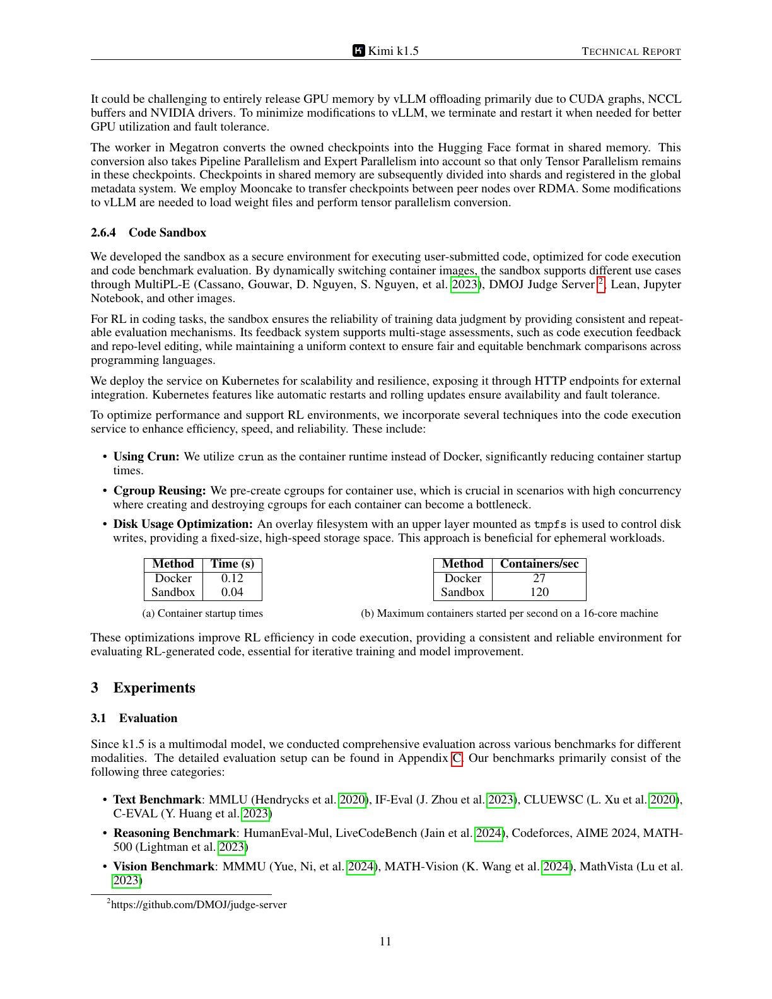

### 3.2 主要结果

长思维链版本结合长思维链监督微调、图文联合强化学习与测试时计算扩展，在多种模态上显著增强长期推理。表 2 显示，它在 MATH-500、AIME 2024、Codeforces、MathVista 上分别达到 96.2、77.5、第 94 百分位和 74.9；LiveCodeBench 为 62.5。与公开对比结果相比，其数学与视觉数学表现达到或超过 o1，代码结果接近 o1。

短思维链版本结合常规监督微调、强化学习与 long2short，在文本、视觉和推理任务上与领先开放及专有模型竞争。表 3 显示，它在 MMLU、IF-Eval、CLUEWSC、C-Eval 上分别达到 87.4、87.2、91.7、88.3；MATH-500、AIME 2024、LiveCodeBench 分别为 94.6、60.8、47.3；MathVista、MMMU、MathVision 分别为 70.1、68.0、31.0。

### 3.3 长上下文扩展

团队用一个中等规模模型研究强化学习缩放。数学提示集训练过程中，回答长度与准确率同步上升；更难的基准，长度增长斜率更大，说明模型会为复杂问题学习更充分的解法。输出上下文长度与解题能力高度相关，Kimi k1.5 最终训练把上下文扩展至 128K，并在困难推理基准上继续提高。

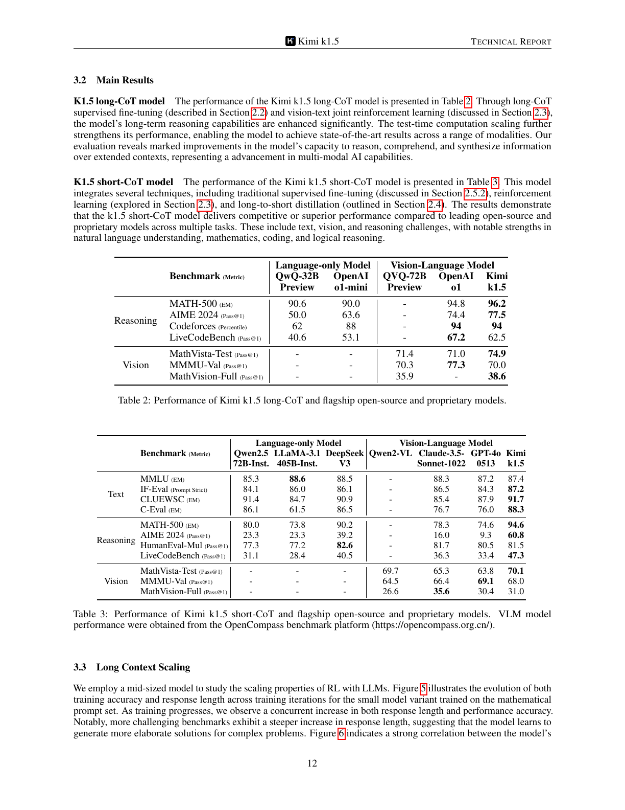

图 5 给出不同训练轮次下，整体准确率、OMNI-MATH500、MATH500、AIMO2024、AIME2024、ChatGLMMath、高考、GPQA 以及多门 K-12 学科的准确率与回答长度曲线。总体趋势表明，随着强化学习继续进行，模型在多数任务上同时获得更高准确率和更长推理轨迹。

### 3.4 Long2short 结果

团队比较 long2short RL、DPO、最短拒绝采样和模型合并，重点考察长思维链模型能否在更少词元下提升短模型。图 7 中，long2short RL 的词元效率最高；Kimi k1.5 系列的所有变体也普遍优于外部短模型。

例如，Kimi k1.5-short w/ RL 在 AIME 2024 上以平均 3272 个词元达到 60.8 Pass@1（8 次运行均值）；Kimi k1.5-shortest 在 MATH-500 上达到 88.2，词元消耗与其他短模型近似。

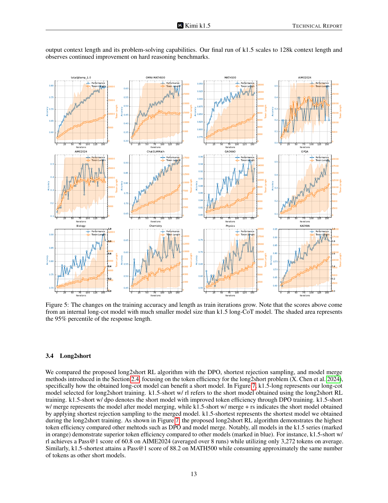

图 6 对多项基准拟合回答平均长度与准确率的关系，全部趋势线斜率为正。图 7 进一步显示，模型合并、拒绝采样、DPO 和 long2short RL 能沿性能—长度前沿逐步提高，其中 long2short RL 最接近高性能且低词元消耗的区域。

### 3.5 消融实验

**模型规模与上下文长度。** 团队用同一数据集训练两个不同规模模型，记录各个强化学习检查点的性能与平均推理长度。较大模型初始更强，但较小模型可通过强化学习得到更长思维链，逐步达到相近水平；较大模型总体仍有更高词元效率和更高上限。因此，追求绝对性能时应同时扩大大模型的上下文；测试计算预算有限时，也可以选择较小模型配合更长上下文。

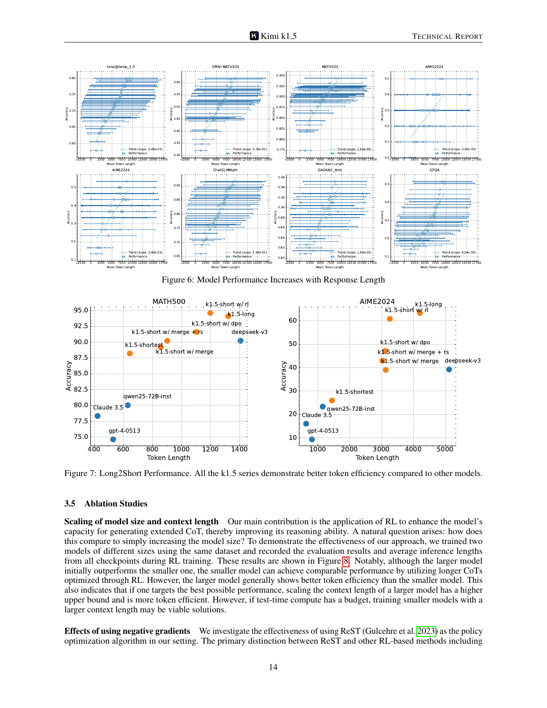

**负梯度的作用。** ReST 每轮只拟合当前模型采到的最佳回答，不用负梯度惩罚错误回答。图 10 显示，本文方法的样本效率明显优于 ReST，说明负梯度对于高效形成长思维链很重要。它不仅提高推理质量，也以更少样本获得稳健表现；这表明策略优化算法的选择在长思维链场景中尤为关键。

**采样策略。** 课程采样先以混合难度数据热身，之后只训练难题；基线则始终均匀采样。图 9 显示课程方法显著提高表现，因为模型先建立基础能力，再逐步集中到复杂问题，从而更有效强化推理和解题能力。

## 4 结论

本文给出多模态强化学习模型 Kimi k1.5 的训练配方和系统设计。核心经验是：上下文长度扩展是继续提高大型语言模型能力的关键。团队结合改进的学习算法、部分轨迹展开等基础设施优化，实现高效的长上下文强化学习；未来仍需研究如何进一步提高其效率与可扩展性。

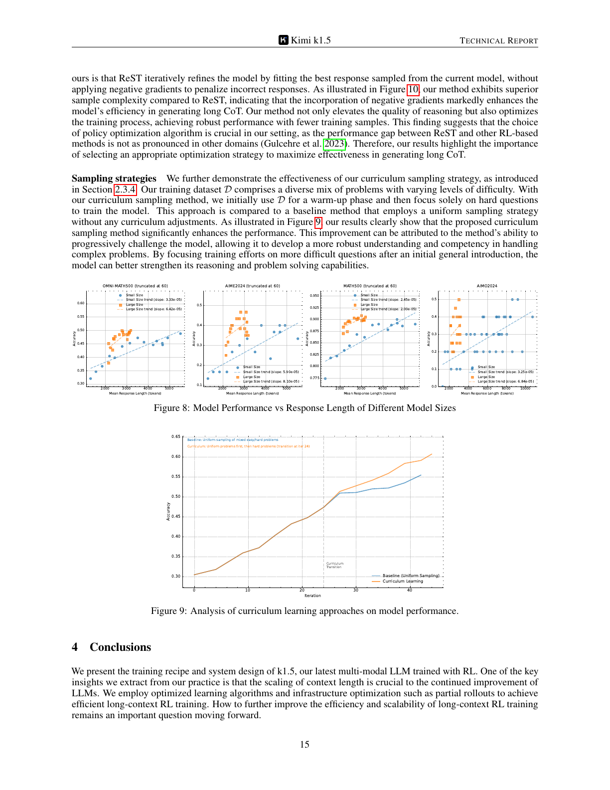

另一项贡献是把长思维链强化学习形式化为稳健的在线镜像下降策略优化，并配合采样策略、长度惩罚和数据配方。结果表明，即使不使用蒙特卡洛树搜索、价值函数和过程奖励模型，长上下文扩展与更好的策略优化仍足以获得很强表现。未来值得研究更准确的信用分配，以及在不损伤探索能力的情况下减少过度思考。

Long2short 也显示出明显潜力：它大幅提高短思维链模型表现，还可与长思维链强化学习交替迭代，在给定上下文预算内进一步提高词元效率和最终能力。

## 参考文献

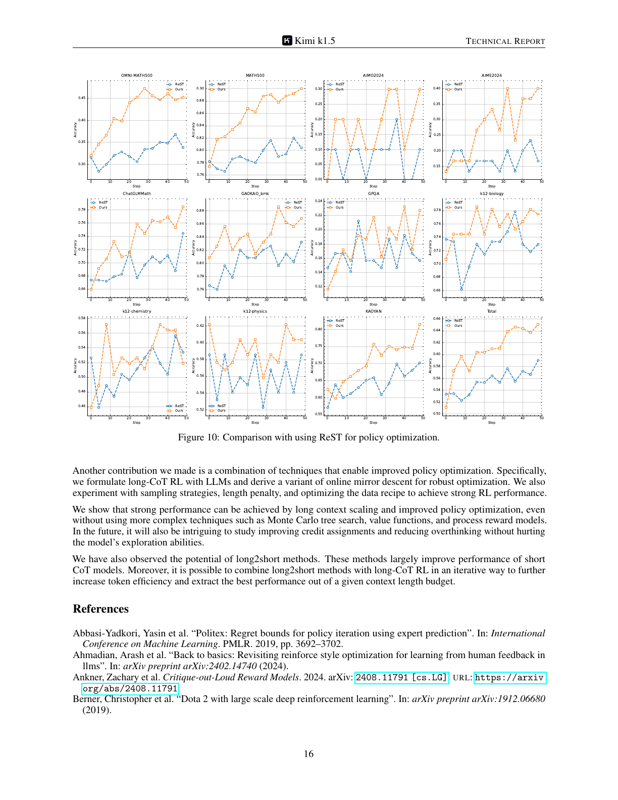

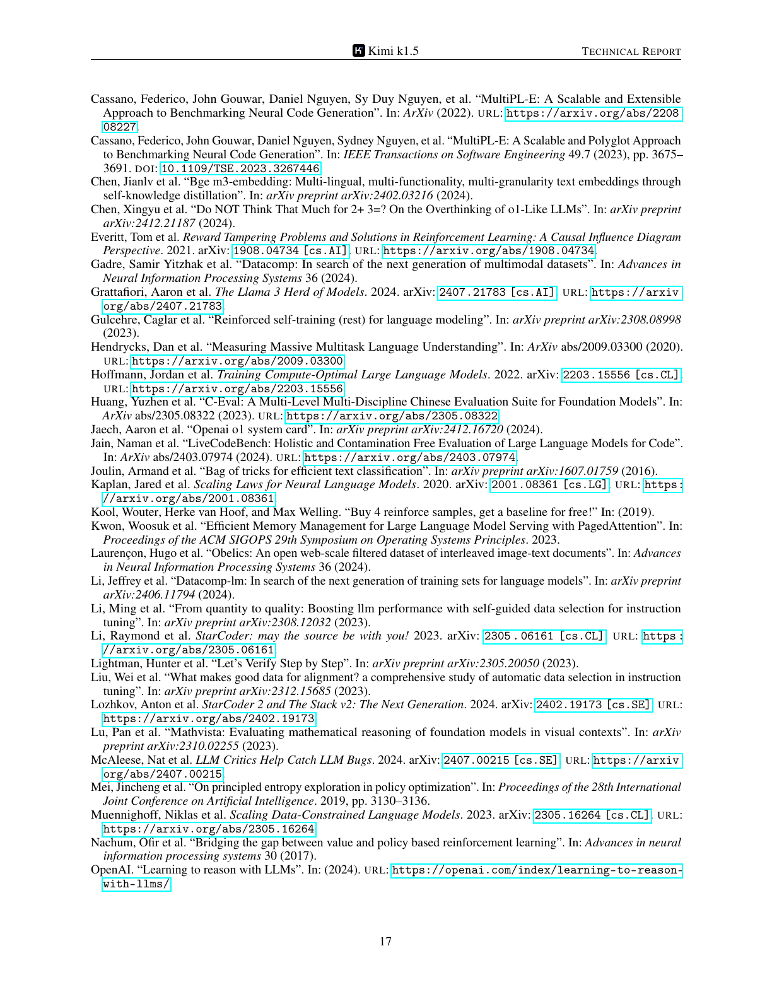

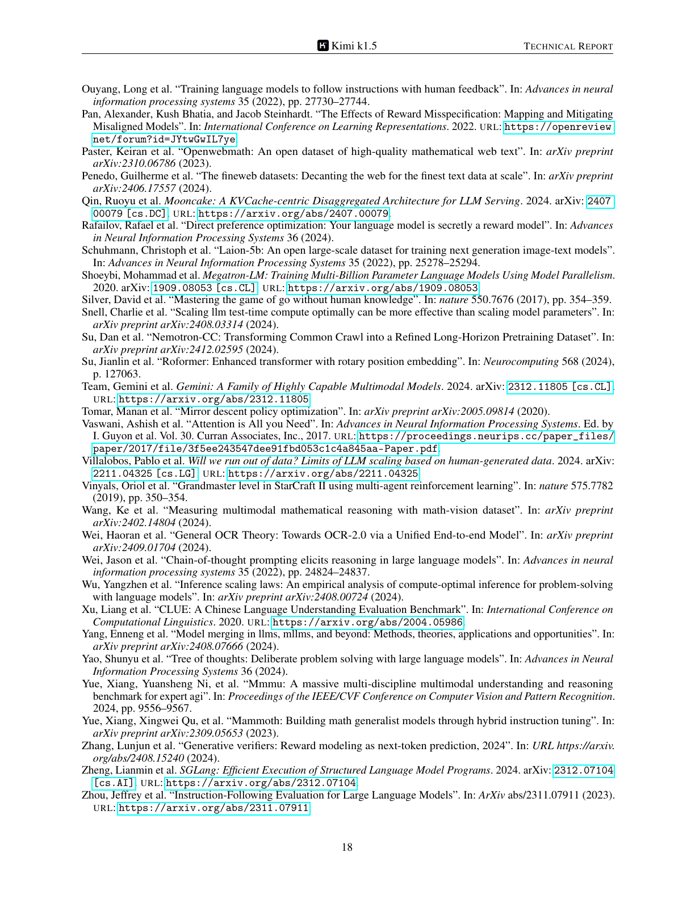

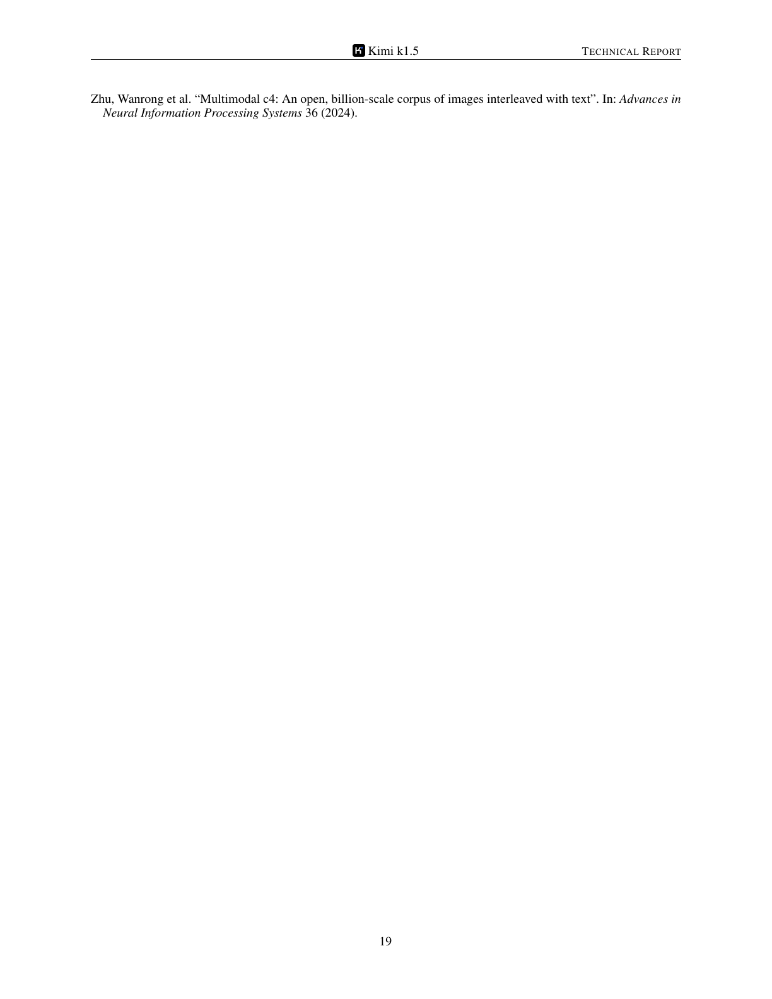

## 附录 A 贡献者

研究开发与数据标注贡献者按名字字母顺序列出；星号表示已不在团队的成员。完整名单保留在原页。

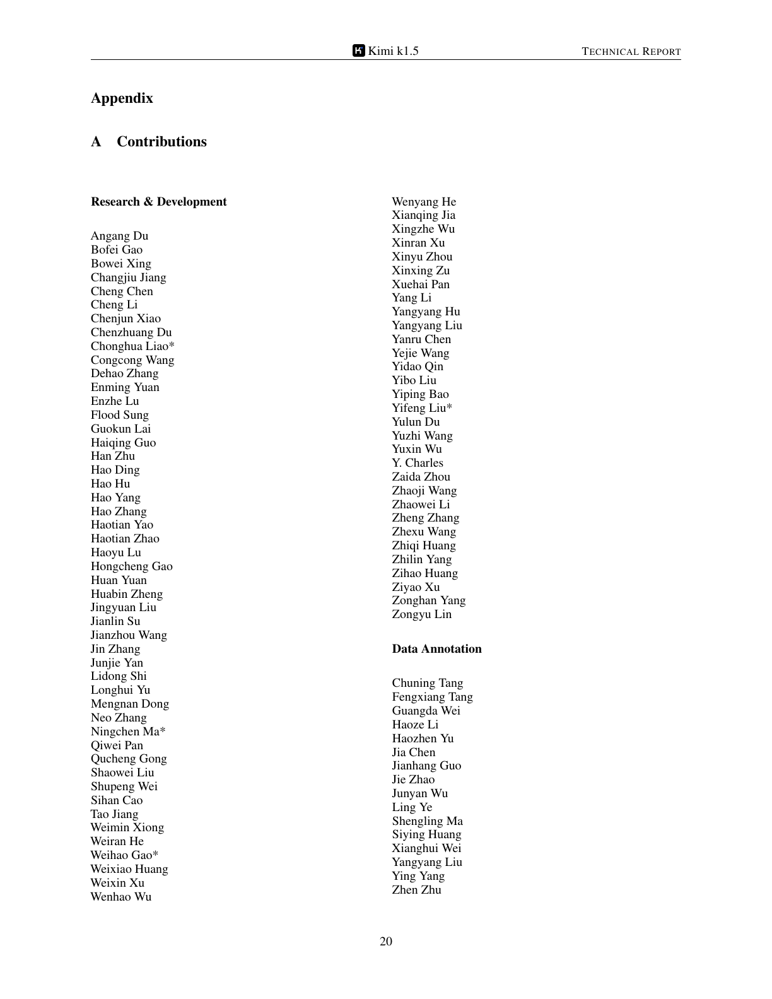

## 附录 B 预训练

强化学习效率与基础模型能力紧密相关。Gemini、Llama 等前沿模型说明，预训练数据质量对最终性能十分关键。尽管团队暂未开放专有模型，本文仍公开数据流水线和方法，重点说明多模态预训练配方，并简述模型架构和训练阶段。

### B.1 语言数据

预训练语料分为英文、中文、代码、数学与推理、知识五个领域，每个来源都经过独立验证和贡献评估。

**英文与中文。** 多维过滤框架组合四类评分：基于规则的领域启发式过滤，删除重复、机器翻译、低质量抓取、异常格式与垃圾内容；FastText 分类器依据语言特征和语义连贯性评估自然度；文档嵌入相似度删除近重复而保留有价值的语义变体；语言模型从连贯性、信息量和教育价值等方面给文档评分。最终质量分由这些信号组合而成，高质量文档上采样、低质量文档下采样。

**代码。** 纯代码数据沿用 BigCode 思路，先去除杂项语言并按规则清理，再通过采样纠正语言失衡：JSON、YAML、YACC 等标记语言下采样，Python、C、C++、Java、Go 等 32 种主要语言上采样。图文交错的代码说明数据则用嵌入召回高质量样本，同时保证多样性。

**数学与推理。** 主要从公开网络文本和 PDF 中检索。通用文本抽取、清洗和 OCR 对数学材料的误删率较高，因此团队先开发数学专用清洗流程与 OCR，以提高召回；随后用 FastText 初筛无关数据，再用微调语言模型进一步清理。

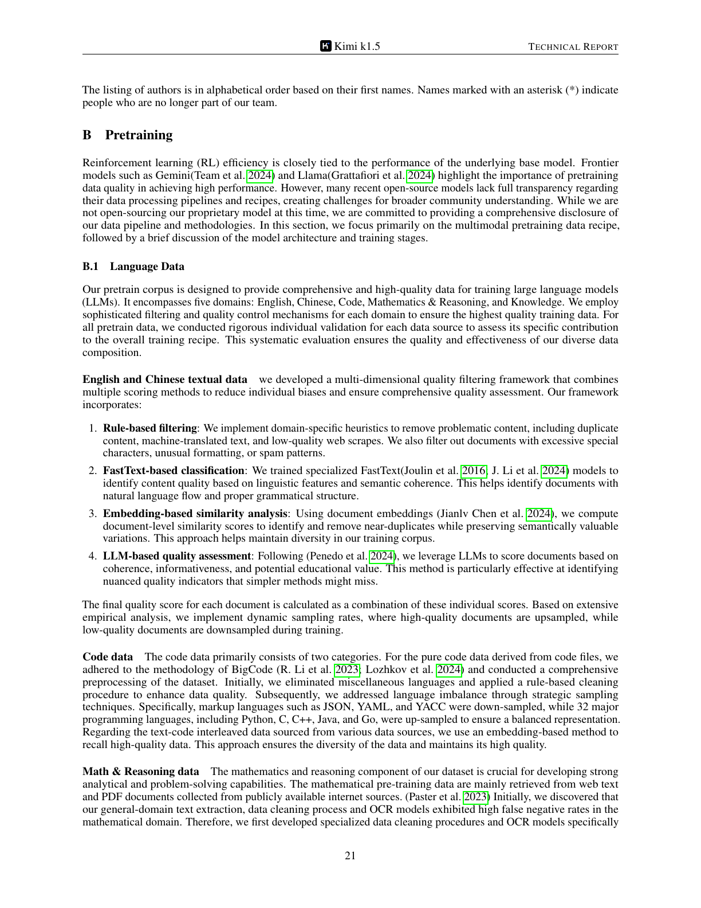

**知识数据。** 语料包括学术练习、教材、论文和一般教育材料，大量文档通过针对公式和特殊符号优化的自研 OCR 数字化。内部语言模型标注 OCR 质量、教育价值和文档类型。流水线先按 OCR 阈值过滤，尤其识别重复文字等常见识别失败；再优先保留教学相关性高、知识深度足够的材料；最后通过隔离评测确定不同文档类型的采样比例，高价值子集上采样，同时保留足够多样性。

### B.2 多模态数据

多模态语料覆盖文本、图像与视频，分图像描述、图文交错、OCR、知识和通用问答五类。构建过程中使用过滤、合成与去重流水线。有效的数据配方既要保留原语言能力，也要让不同模态的知识对齐。

**图像描述。** 结合公开中英文描述数据集和自建数据，提供基础模态对齐与广泛世界知识。团队严格限制合成描述比例，以降低因真实知识不足造成的幻觉；同时做去重和图文相关性过滤，并在训练中改变图像分辨率，使视觉塔适应高低分辨率输入。

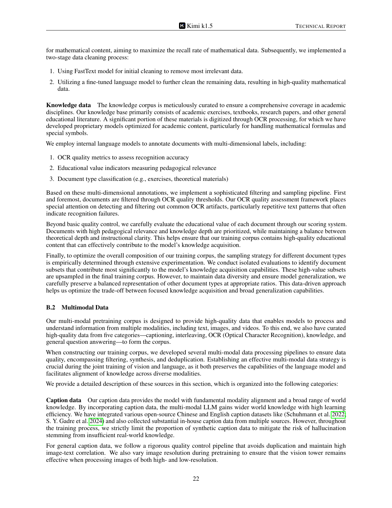

**图文交错。** 这类数据提高多图理解、图像细节知识与长多模态上下文能力，也有助于维持语言能力。语料既包含公开交错数据集，也从教材、网页和教程构建大规模内部数据，并合成一部分交错数据以保持文本知识。除过滤和去重外，流水线还对数据重新排序，保证图像与文本的先后关系正确。

**OCR。** 数据覆盖多语言、密集版式、网页内容、手写文本，以及图、表、几何图、Mermaid 图和自然场景文字。通过旋转、形变、颜色调整、加噪等增强提高稳健性。

**多模态知识。** 目标是从多样来源整理完整的人类知识库，尤其用几何等材料训练视觉推理。教材、论文和网络材料经版面分析与 OCR 处理，并按标准分类体系平衡类别。为避免模型只注意信息图中的 OCR 文字，团队另建流水线捕获图像内部的纯文本信息。

**通用问答。** 预训练中加入大量高质量学术数据，覆盖定位、表格/图表问答、网页智能体与一般问答；再用内部数据补充。评分模型与人工分类共同控制难度平衡和多样性。

### B.3 模型架构

Kimi k 系列采用 Transformer 解码器变体，加入多模态能力及架构、优化改进，以支持稳定的大规模训练和高效推理，并适配大规模强化学习与线上使用需求。大量缩放实验表明，基础模型的大部分提升来自预训练数据质量和多样性；更细的架构缩放结果留待后续公开。

### B.4 训练阶段

训练依次经过视觉—语言预训练、视觉—语言冷却和长上下文激活，分别强化基础能力、多模态与推理质量、长序列处理。

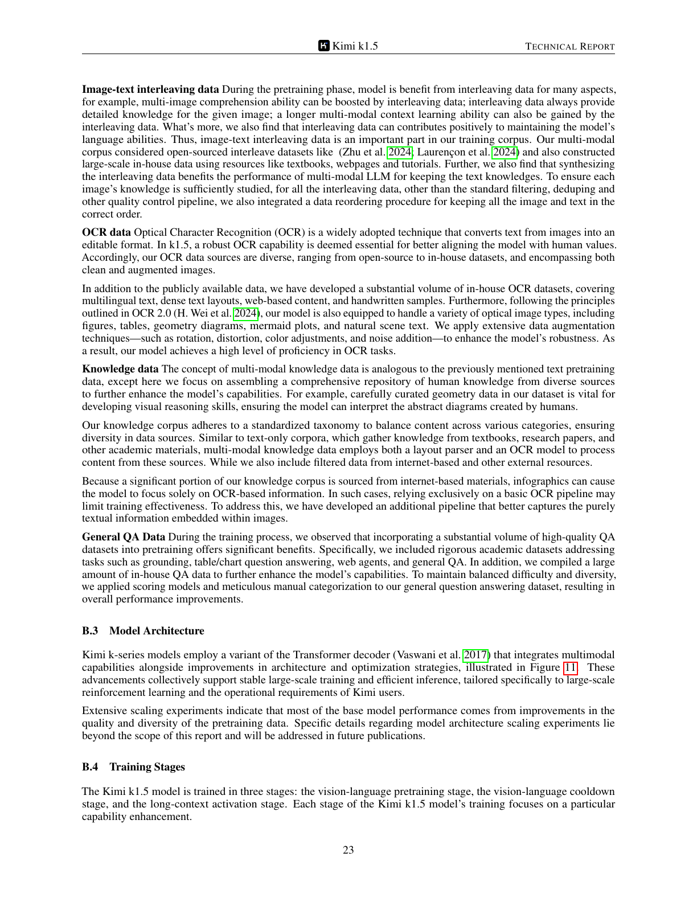

**视觉—语言预训练。** 先只训练语言数据，建立语言基础；随后逐步加入图文交错数据。视觉塔起初单独训练、不更新语言模型参数，之后解冻语言模型层，最终把图文数据比例提高到 30%。最终混合比例由小模型消融决定。

**视觉—语言冷却。** 用高质量语言和图文数据继续训练。合成数据对数学推理、知识与代码尤其有效。中英文数据来自预训练语料的高保真子集；数学、知识和代码则混合精选预训练数据与自研模型生成的问答对，并通过拒绝采样和全面验证控制质量。

**长上下文激活。** 对长上下文冷却数据上采样，并使用 40% 全注意力与 60% 部分注意力数据。全注意力数据来自高质量自然材料及合成长上下文问答、摘要；部分注意力数据从冷却语料均匀采样。RoPE 频率设为 1000000，最大序列长度从 4096 逐步扩展到 32768，最终达到 131072。

## 附录 C 评测细节

### C.1 文本基准

- **MMLU** 覆盖 STEM、人文、社会科学等 57 个科目，难度从小学到高级职业水平，同时测试世界知识和解题能力。
- **IF-Eval** 用 500 多条可验证指令评估模型遵循能力。表 3 的结果来自一个中间模型，团队计划以最终模型更新。
- **CLUEWSC** 是中文共指消解任务，要求判断句中代词和名词短语是否指向同一实体，材料来自中文小说。
- **C-Eval** 含 52 个学科、四档难度的 13948 道选择题，用于评估中文基础模型的高级知识与推理。

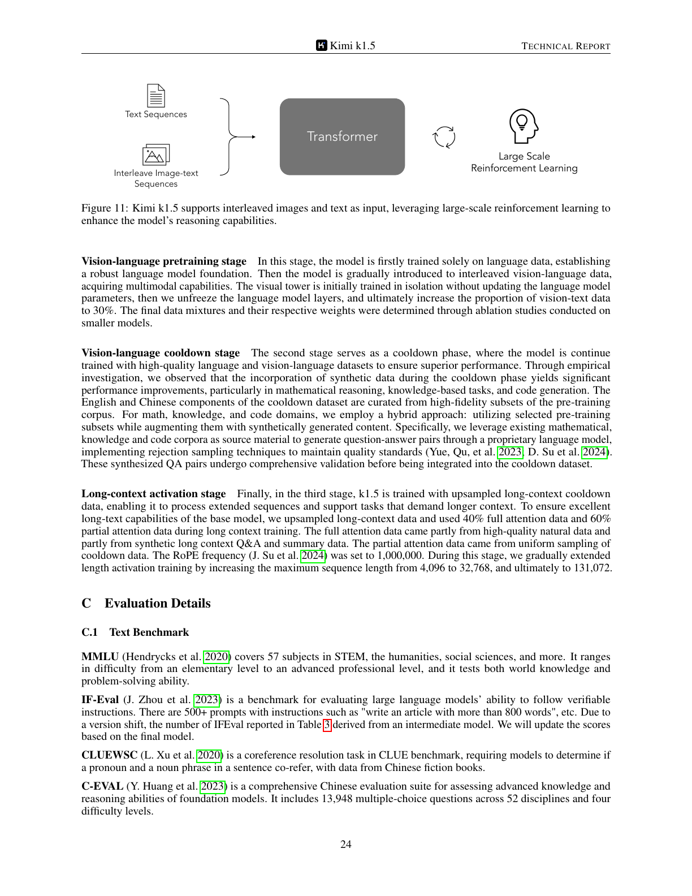

### C.2 推理基准

- **HumanEval-Mul** 从 MultiPL-E 选取 Python、Java、C++、C#、JavaScript、TypeScript、PHP 和 Bash 八种主流语言的 HumanEval 翻译。
- **LiveCodeBench** 持续更新，以减少训练污染，并跨多种编程场景评估模型。短思维链使用 2024 年 8–11 月题目（v4），长思维链使用 2024 年 12 月至 2025 年 2 月题目（v5）。
- **AIME 2024** 是面向顶尖高中生的邀请制数学竞赛，要求扎实的高等数学基础与逻辑思维。
- **MATH-500** 含 500 道代数、微积分、概率等数学题，综合检验计算与推理。
- **Codeforces** 是在线编程评测平台。长思维链模型在 Div.2、Div.3 比赛中对候选代码做多数投票，投票所用测试也由模型生成；百分位与 o1 报告采用同源数据。

### C.3 图像基准

- **MMMU** 含 1.15 万道来自大学考试、测验和教材的多模态问题，覆盖艺术设计、商业、科学、医学、人文社科、技术工程六大领域。
- **MATH-Vision** 含 3040 道来自真实数学竞赛的带图问题，覆盖 16 个数学分支和五档难度。
- **MathVista** 综合多类数学与视觉任务，需要细粒度视觉理解与组合推理。

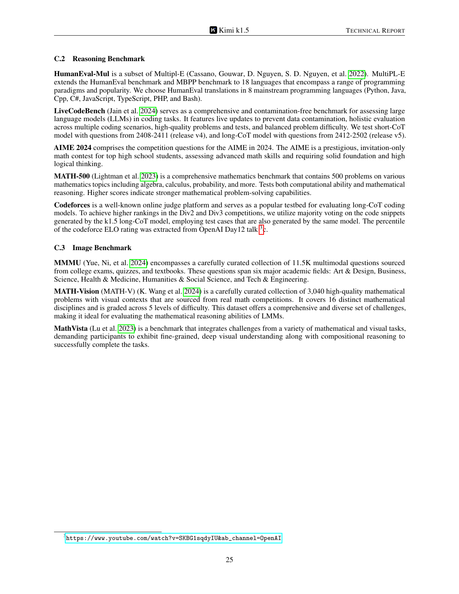
