# DeepSeek-V4：迈向高效的百万词元上下文智能

**作者：** DeepSeek-AI  
**首次公开：** 2026 年 4 月 26 日  
**原文：** [arXiv:2606.19348](https://arxiv.org/abs/2606.19348)  
**模型：** [DeepSeek-V4 系列](https://huggingface.co/collections/deepseek-ai/deepseek-v4)

## 摘要

本文发布 DeepSeek-V4 系列预览版，包括两个混合专家语言模型：总参数 1.6 万亿、每词元激活 490 亿参数的 DeepSeek-V4-Pro，以及总参数 2840 亿、每词元激活 130 亿参数的 DeepSeek-V4-Flash。两者都原生支持 100 万词元上下文。

DeepSeek-V4 的主要升级包括：把压缩稀疏注意力（CSA）与重度压缩注意力（HCA）结合的混合注意力；增强传统残差连接的流形约束超连接（mHC）；以及收敛更快、稳定性更好的 Muon 优化器。Flash 与 Pro 分别在 32 万亿和 33 万亿个高质量词元上预训练，再通过专家训练与在策略蒸馏完成后训练。

最大推理强度模式 DeepSeek-V4-Pro-Max 在开放模型中刷新多项结果。与此同时，系列在百万词元场景下保持很高效率：相较 DeepSeek-V3.2，Pro 的单词元推理 FLOPs 只有 27%，KV 缓存只有 10%；Flash 则分别只有 10% 和 7%。

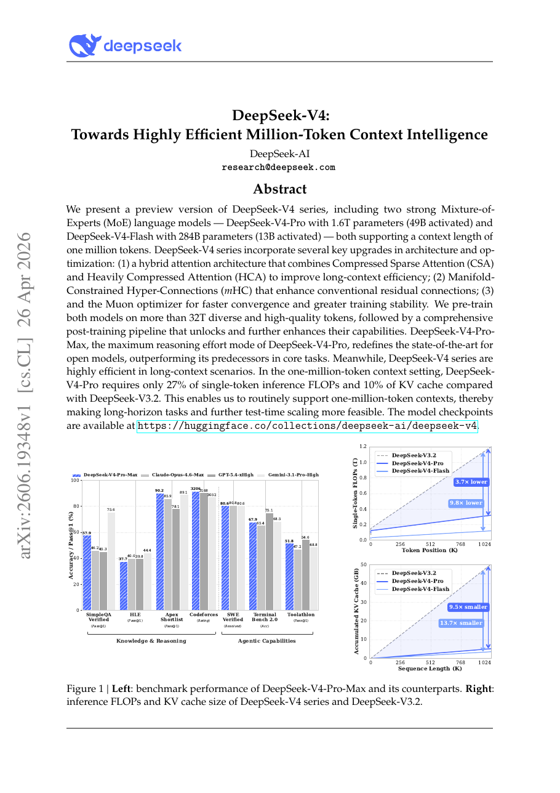

## 阅读导航

论文先解释百万词元上下文的架构动机，再依次介绍 mHC、CSA/HCA 混合注意力与 Muon；随后详述 MoE 通信—计算重叠、TileLang 内核、确定性训练、异构 KV 缓存与磁盘缓存；预训练部分给出两种模型的配置、训练日程和稳定化方案；后训练部分覆盖三档推理强度、生成式奖励模型、在策略蒸馏、FP4 量化感知训练与智能体沙箱；最后报告标准基准和中文写作、搜索、白领工作、代码智能体等真实任务结果。

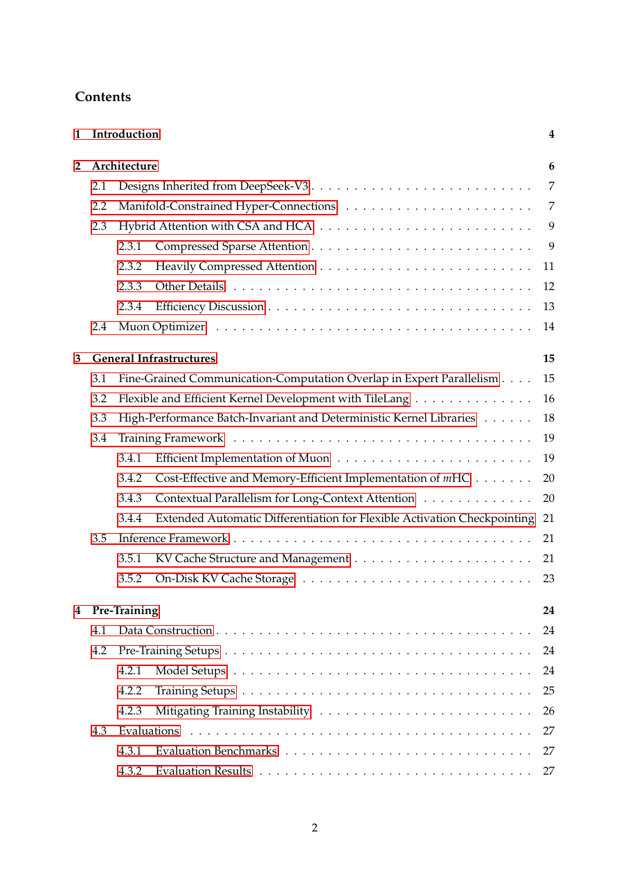

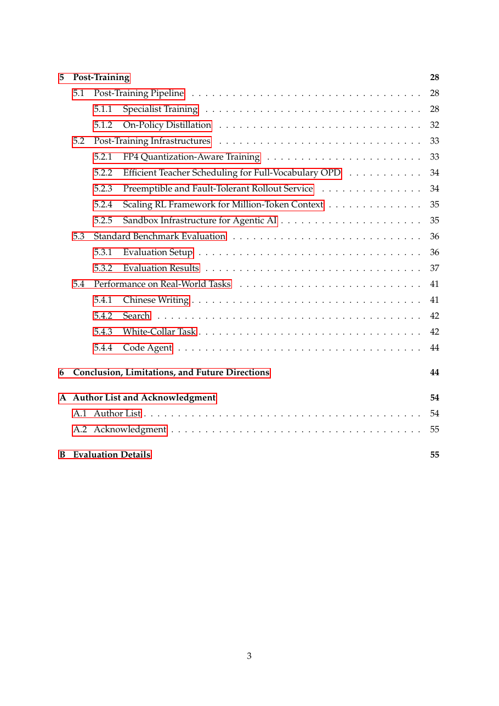

## 1 引言

推理模型让“测试时扩展”成为提升能力的重要范式，但标准注意力的二次复杂度会迅速耗尽超长推理与长周期智能体的计算预算。跨大量文档分析、复杂软件工程和长期在线任务也要求模型在极长上下文中保持效率。DeepSeek-V4 因而把百万词元支持视为进一步扩大测试时计算、研究长周期任务乃至在线学习的基础。

系列保留 DeepSeekMoE 与多词元预测（MTP），引入三项核心变化：

- **CSA + HCA 混合注意力：** CSA 先沿序列维度压缩 KV，再执行稀疏选择；HCA 用更高压缩率形成少量 KV，但保留稠密注意力。
- **mHC：** 把残差映射约束到特定流形，使加宽后的残差通路在深层堆叠中仍保持稳定。
- **Muon：** 用矩阵正交化更新替代大部分 AdamW 更新，改善收敛速度和训练稳定性。

配套基础设施包括细粒度 MoE 融合内核、TileLang DSL、批次不变且确定的算子库、张量级重计算、两阶段上下文并行、异构 KV 布局与磁盘缓存。后训练阶段还对 MoE 专家权重和 CSA 索引器 QK 路径进行 FP4 量化感知训练。

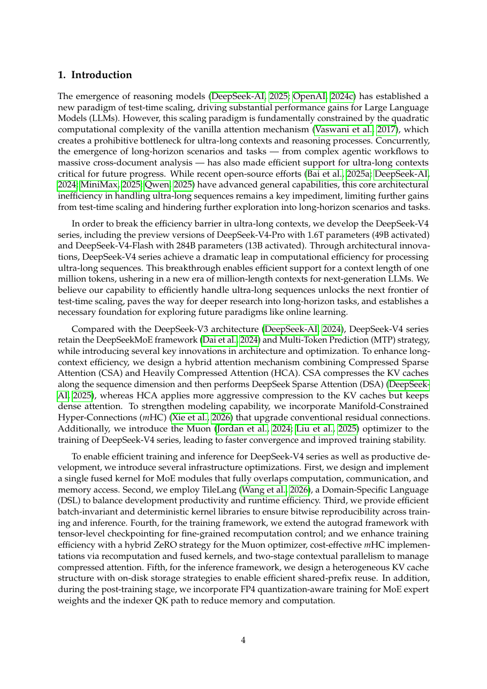

在 100 万词元上下文中，Pro 虽比 V3.2 激活更多参数，单词元等效 FP8 FLOPs 仍只有后者的 27%，KV 缓存只有 10%；Flash 分别为 10% 与 7%。路由专家权重采用 FP4，现有硬件上的峰值吞吐尚与 FP8×FP8 相同，但未来硬件理论上还能进一步获得约三分之一的效率增益。

后训练采用“两阶段专家培养 + 统一蒸馏”：先为数学、代码、智能体、指令遵循等领域分别进行 SFT 和 GRPO，再让统一学生模型在自身生成轨迹上最小化对多个教师的反向 KL。

主要结论是：Pro-Max 显著提高开放模型的世界知识与推理上限，在知识任务上仍落后 Gemini-3.1-Pro，在推理任务上大约比最前沿闭源系统慢 3–6 个月；Flash-Max 的知识容量受参数规模限制，但给足思考预算后能以更低成本获得很强的数学和代码推理能力。

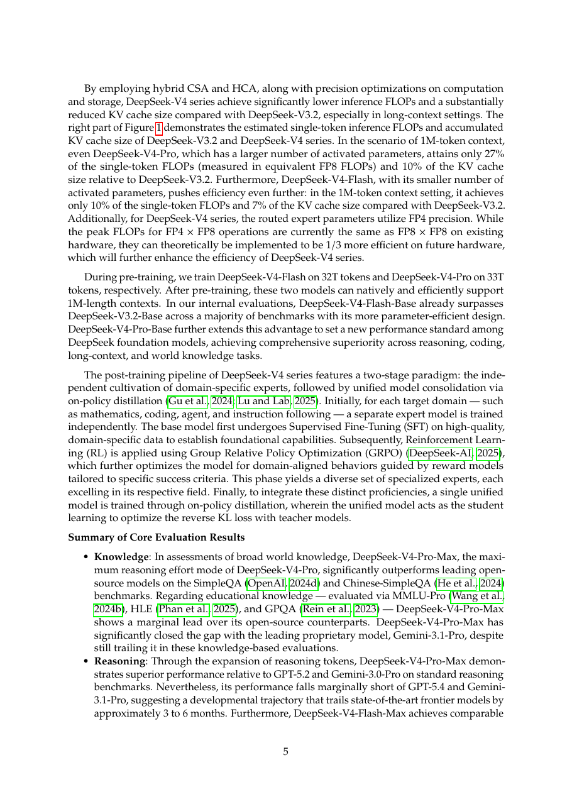

## 2 架构

DeepSeek-V4 仍以 Transformer、DeepSeekMoE 和 MTP 为骨架。前馈层继续采用细粒度路由专家与共享专家，但路由亲和度的激活函数从 Sigmoid 改为 $\sqrt{\mathrm{Softplus}}$；负载均衡沿用无辅助损失方案，并加入很小的序列级均衡损失。最初若干层不再使用稠密 FFN，而是采用按输入词元 ID 做预定义哈希路由的 MoE 层。

整体结构在每个块前后加入 mHC 混合，注意力层交错使用 CSA 与 HCA，前馈层使用 DeepSeekMoE，顶部保留 MTP 模块。

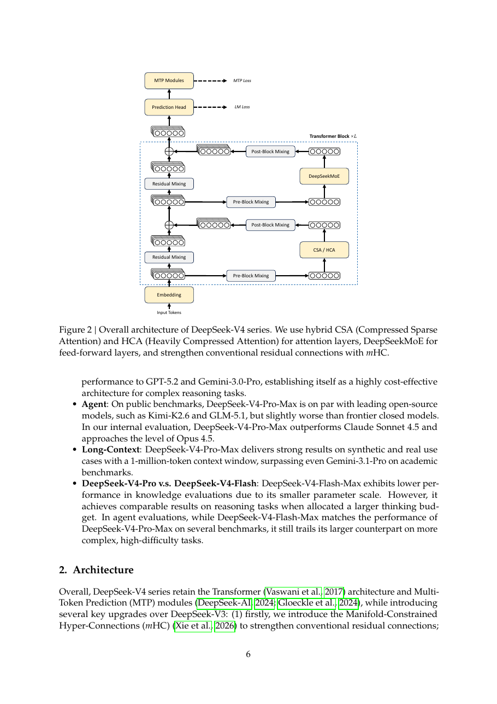

### 2.1 从 DeepSeek-V3 继承的设计

MTP 的结构和损失不变。MoE 仍采用一个共享专家加大量细粒度路由专家，并通过动态偏置实现无辅助损失负载均衡。V4 取消了路由目标节点数量限制，改由重新设计的并行策略维持效率；最初三层 MoE 使用 Hash Routing，让早期表示获得稳定、可预测的专家分配。

### 2.2 流形约束超连接

标准超连接（HC）把残差流从 $\mathbb{R}^d$ 扩展到 $\mathbb{R}^{n_{hc}\times d}$，并以输入映射 $A_l$、残差变换 $B_l$ 和输出映射 $C_l$ 更新：

$$
X_{l+1}=B_lX_l+C_lF_l(A_lX_l).
$$

它提供了独立于隐藏维度的新扩展轴，内部层的实际输入仍是 $d$ 维，因此额外计算较少；但普通 HC 在深层堆叠中容易出现数值不稳定。

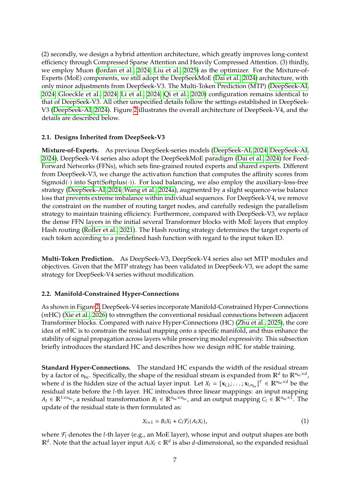

mHC 的核心是把 $B_l$ 约束为双随机矩阵，也就是 Birkhoff 多胞体中的点。该约束保证谱范数不超过 1，使残差变换非扩张；双随机矩阵集合又对乘法封闭，因此多层相乘后仍稳定。输入和输出映射也经 Sigmoid 约束为非负且有界，降低信号相消风险。

三个映射都由输入相关的动态部分与输入无关的静态部分共同生成。原始残差矩阵先取指数保证为正，再通过 20 次 Sinkhorn-Knopp 行列归一化投影为双随机矩阵。这样既保留动态表达力，也对前向信号和反向梯度施加明确边界。

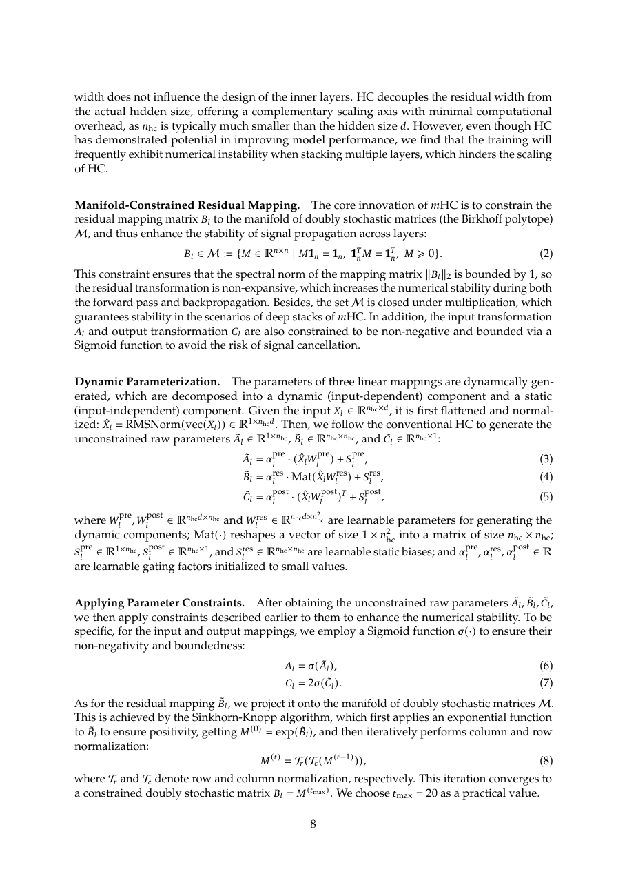

### 2.3 CSA 与 HCA 混合注意力

#### 2.3.1 压缩稀疏注意力

CSA 先把相邻 KV 条目按学习到的通道级权重压缩，再由闪电索引器挑选少量压缩块。相邻压缩窗口彼此重叠，使序列长度实际缩短为原来的 $1/m$。索引器键使用同样的压缩规则，查询则由当前隐藏状态经过低秩下投影与上投影生成；多头索引分数加权汇总后，对压缩块执行 top-k 选择。

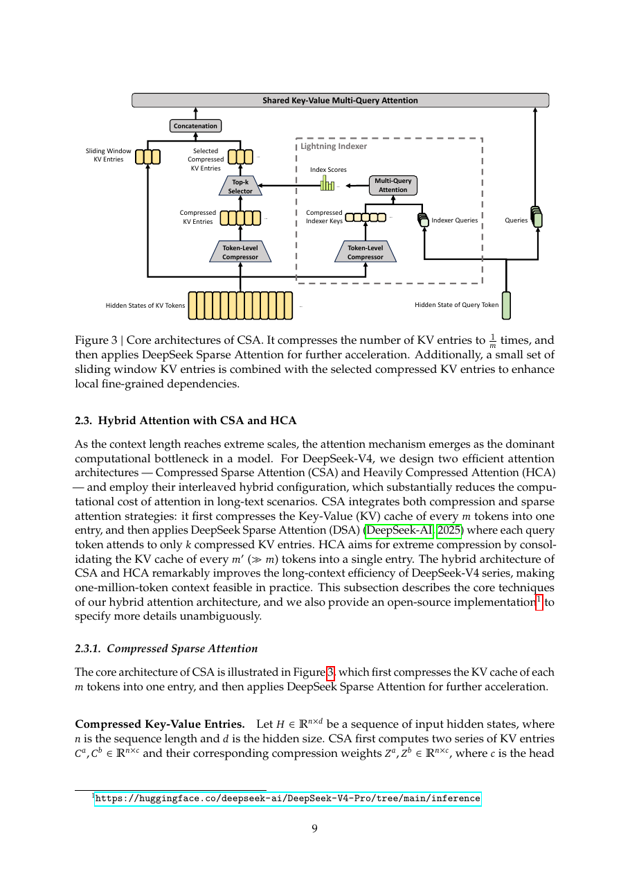

选出的 KV 条目在共享键值的多查询注意力（MQA）中同时充当 key 与 value。CSA 复用索引器与主注意力的查询潜变量，并用分组输出投影降低大量注意力头直接投回隐藏维度的成本。

从信息流看，CSA 是“局部原始窗口 + 被索引器选中的压缩远程块”：局部窗口保留近邻细节，远程历史则先压缩、再稀疏检索。

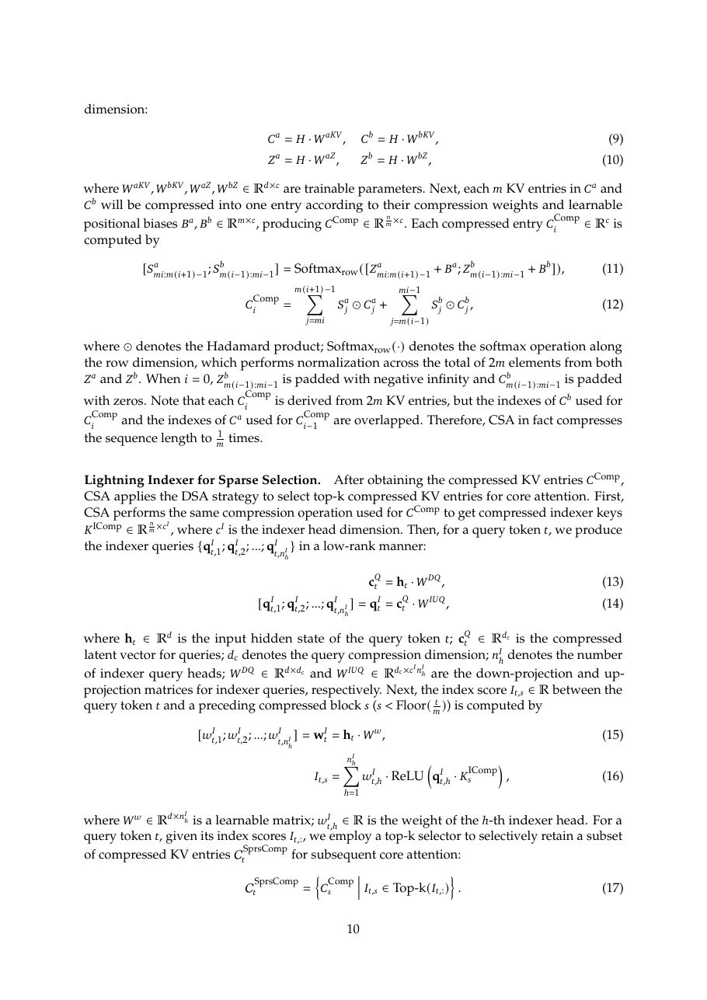

#### 2.3.2 重度压缩注意力

HCA 使用远大于 CSA 的压缩率 $m'\gg m$，且压缩窗口不重叠；每 $m'$ 个 KV 条目被汇总为一个压缩条目。它不再做 top-k，而是对全部高度压缩后的 KV 执行稠密 MQA。HCA 同样使用低秩查询、共享 KV 与分组输出投影。

因此，两种注意力形成互补：CSA 保留更多压缩块但只选择其中一部分，HCA 把历史压得更短却全量查看。

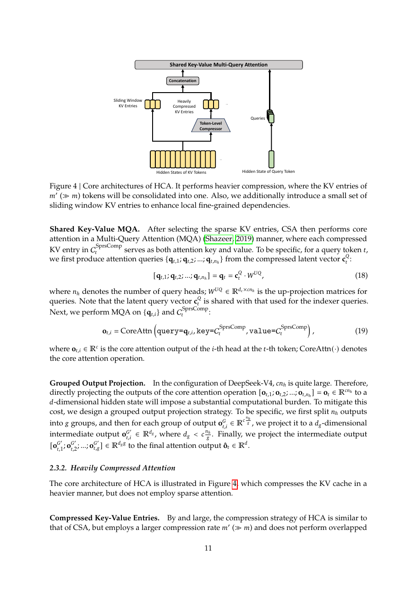

#### 2.3.3 其他细节

- 在核心注意力前，对每个查询头及唯一的压缩 KV 头额外执行 RMSNorm，避免注意力 logit 爆炸。
- 查询和 KV 的末 64 维应用部分 RoPE；输出端再施加反向位置旋转，使聚合结果继续表达查询与 KV 之间的相对距离。
- 为严格因果压缩造成的“同一块内不可见”问题，两种注意力都增加滑动窗口分支，让查询直接访问最近 $n_{win}$ 个未压缩 KV。
- 每个注意力头加入可学习 attention sink，使总注意力质量可以小于 1，甚至接近 0。

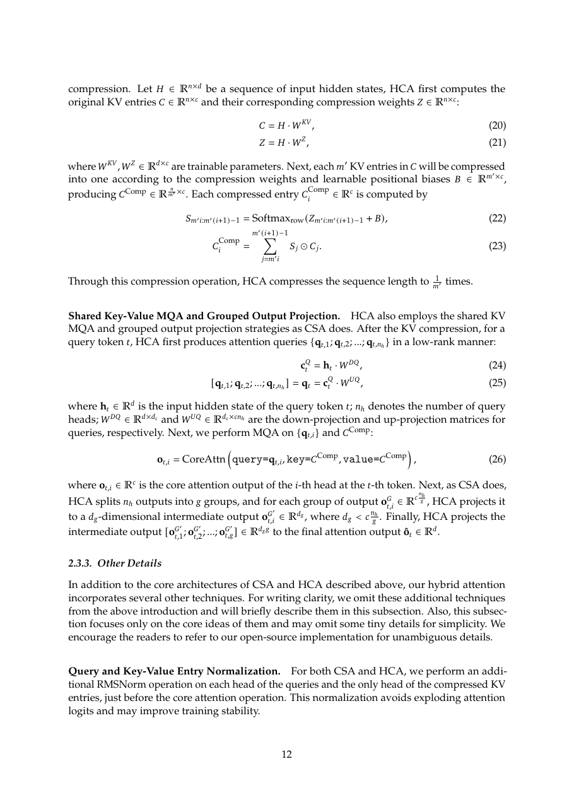

#### 2.3.4 效率

KV 的 RoPE 维度用 BF16 保存，其余维度用 FP8，使缓存相较全 BF16 接近减半。索引器注意力使用 FP4，CSA 的 top-k 又小于 V3.2。以头维度 128 的 BF16 GQA8 为基线，V4 在百万上下文下的 KV 缓存约只有其 2%。

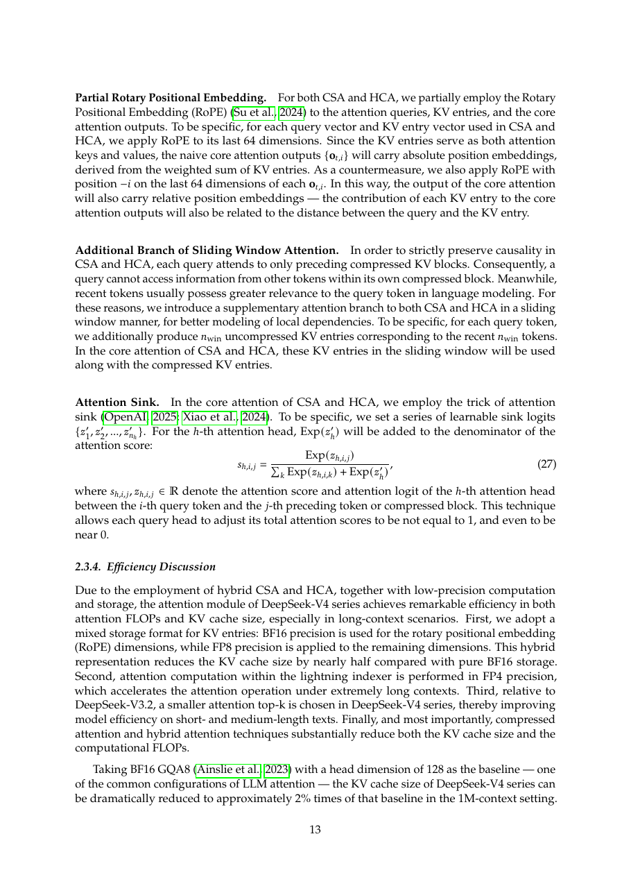

### 2.4 Muon 优化器

大多数矩阵参数由 Muon 更新；嵌入、预测头、mHC 静态偏置与门控、RMSNorm 权重仍用 AdamW。Muon 对带 Nesterov 动量的梯度矩阵做近似正交化，再按矩阵尺寸重标度更新 RMS，并施加权重衰减。

正交化采用 10 步混合 Newton-Schulz：前 8 步用一组快速收敛系数把奇异值推近 1，最后 2 步改用稳定系数精确收敛。由于注意力查询和 KV 已直接做 RMSNorm，V4 不再需要 Muon 工作中用于抑制 logit 爆炸的 QK-Clip。

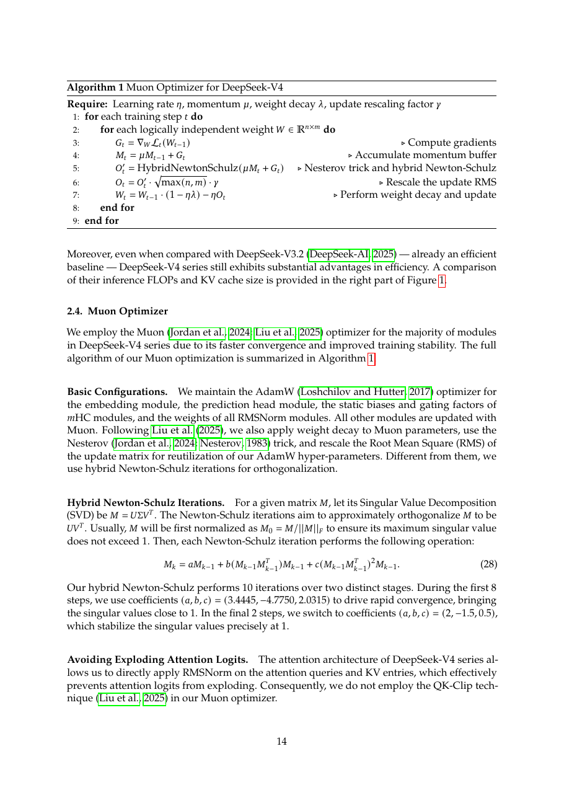

## 3 通用基础设施

### 3.1 专家并行中的细粒度通信—计算重叠

MoE 层可拆为通信受限的 Dispatch、Combine 与计算受限的 Linear-1、Linear-2。实测总通信时间短于总计算时间，因此只要把两者融合进统一流水线，通信延迟就可以隐藏在计算之下。

团队把专家拆成多个 wave；一小组专家通信完成后立即开始计算，无须等待其他专家。稳态下，当前 wave 计算、下一 wave 传输以及上一 wave 结果回传同时进行。对 Flash 配置，这种细粒度方案的理论加速为 1.92×。

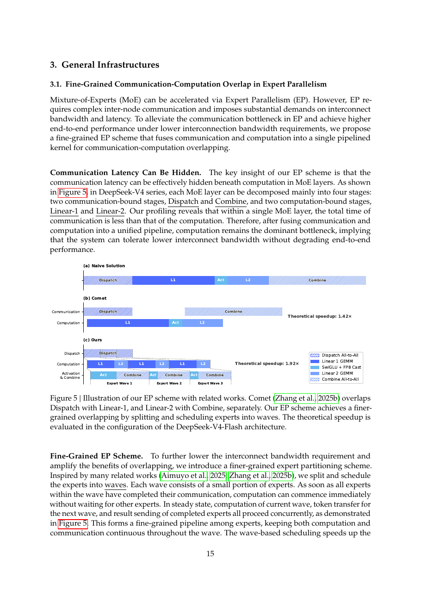

CUDA mega-kernel 已作为 DeepGEMM 的 MegaMoE 开源。在 NVIDIA GPU 与华为昇腾 NPU 上，相较强非融合基线，一般推理加速 1.50–1.73×，RL rollout 和高速智能体等延迟敏感场景最高 1.96×。

论文提出硬件协同建议：真正决定能否隐藏通信的是计算/通信比，而不是孤立的带宽；极端融合会同时拉高算力、内存与网络负载，需要更充足功耗余量；低延迟跨 GPU 通知可让 push 通信更自然；SwiGLU 也可考虑替换为不含指数和除法的低成本逐元素激活。

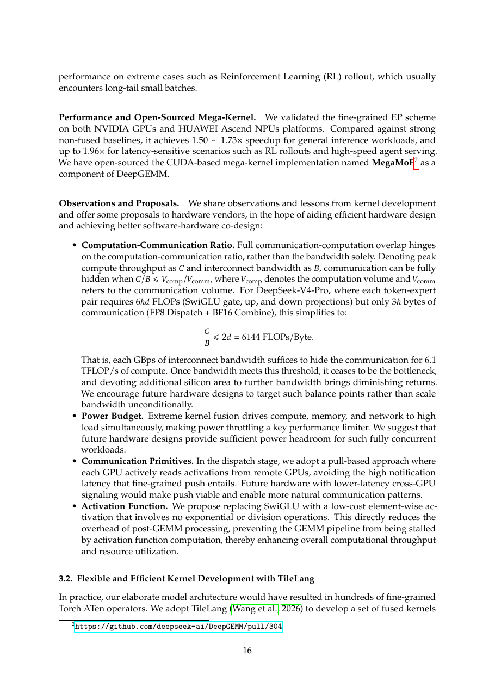

### 3.2 用 TileLang 开发灵活高效的内核

复杂架构若直接落到 PyTorch，会产生数百个细粒度 ATen 算子。团队使用 TileLang DSL 开发融合内核，既用于快速试验新注意力变体，也用于大规模训练和生产推理。

Host Codegen 把运行时契约检查、参数封送等逻辑从 Python 移入生成的主机代码，使每次调用的 CPU 验证开销从几十或几百微秒降到 1 微秒以内。编译器还把 Z3 SMT 求解器接入整数代数系统，为布局推断、越界分析、向量化和屏障插入提供形式化证明；额外编译时间控制在数秒。

TileLang 默认关闭 fast-math，把影响精度的近似函数设为显式选择；需要严格 IEEE-754 行为时，可指定舍入模式。其代数化简和 lowering 规则也与主流 CUDA 工具链对齐，以便同手写 CUDA 获得逐位一致结果。

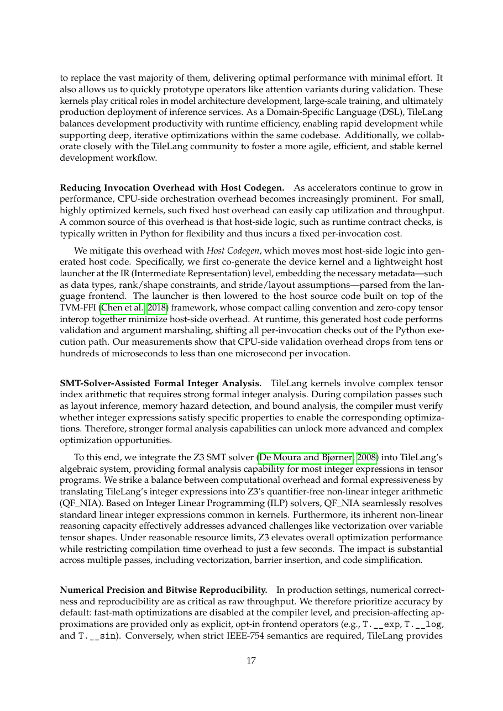

### 3.3 批次不变且确定的高性能内核

批次不变要求同一词元无论位于批次何处，输出都逐位相同。注意力解码不能直接用会改变累加分组的 split-KV，因此系统采用双内核：满 wave 时一个 SM 处理完整序列；最后未填满 wave 时多个 SM 协作，但严格复现第一种内核的累加顺序。矩阵乘则端到端使用 DeepGEMM，避免 cuBLAS 与 split-k 的批次依赖。

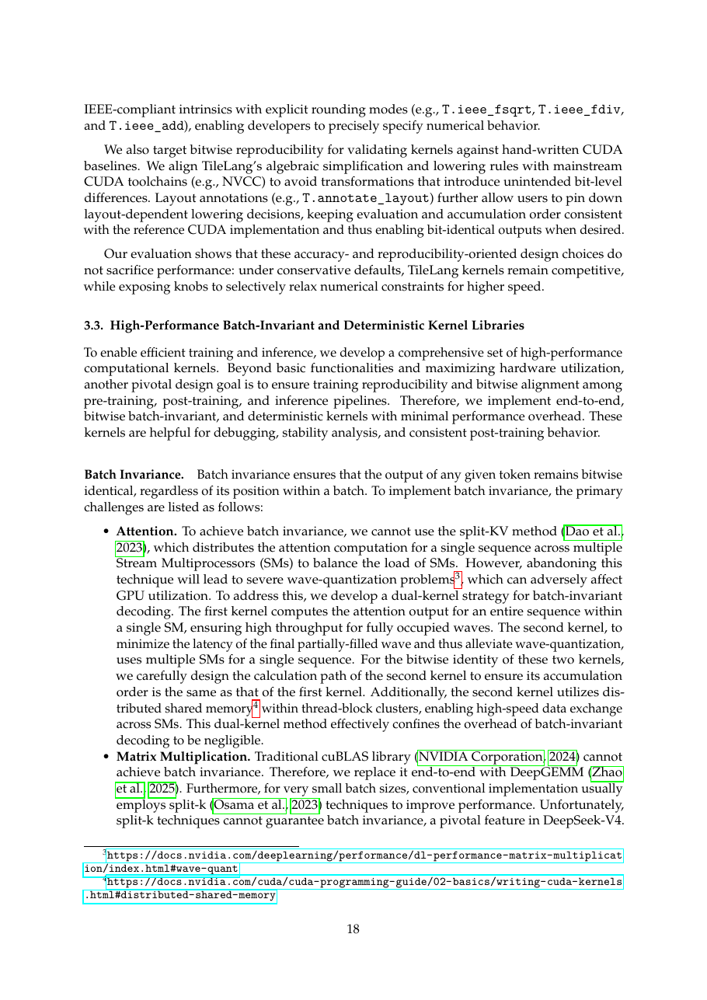

确定性主要解决反向传播中的原子加法顺序问题。稀疏注意力为每个 SM 建独立梯度缓冲，再全局确定性求和；MoE 先在单 rank 内固定词元顺序，再隔离不同 rank 的缓冲；mHC 的小输出矩阵乘若必须 split-k，则先分片输出，再由后续内核固定顺序归约。确定性有助于复现损失尖峰、定位硬件或软件异常。

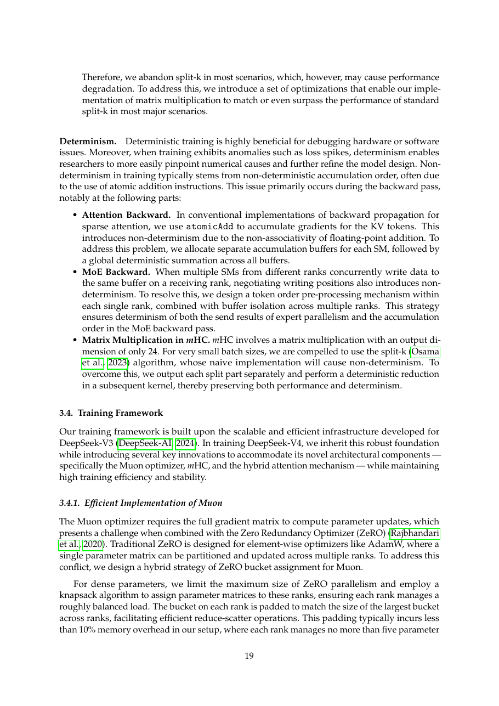

### 3.4 训练框架

#### 3.4.1 Muon 的高效实现

Muon 必须看到完整梯度矩阵，与通常按元素切分参数的 ZeRO 冲突。对稠密参数，系统限制 ZeRO 并行规模，以装箱算法把完整矩阵均衡分配到各 rank；多余数据并行组冗余计算 Muon 更新，以换取更低桶内存。对 MoE，则以完整专家矩阵为单位展平、填充并分发，避免切开逻辑矩阵。

同形状参数会批处理 Newton-Schulz。MoE 梯度用随机舍入同步为 BF16，使通信量减半；随后先 all-to-all 交换，再在每个 rank 本地用 FP32 求和，避免低精度树形归约的累积误差。

#### 3.4.2 mHC 的低成本实现

mHC 会增加激活内存和流水线通信。融合内核、选择性重计算与调整后的 DualPipe 1F1B 重叠，把其墙钟开销限制在流水线阶段的 6.7%。

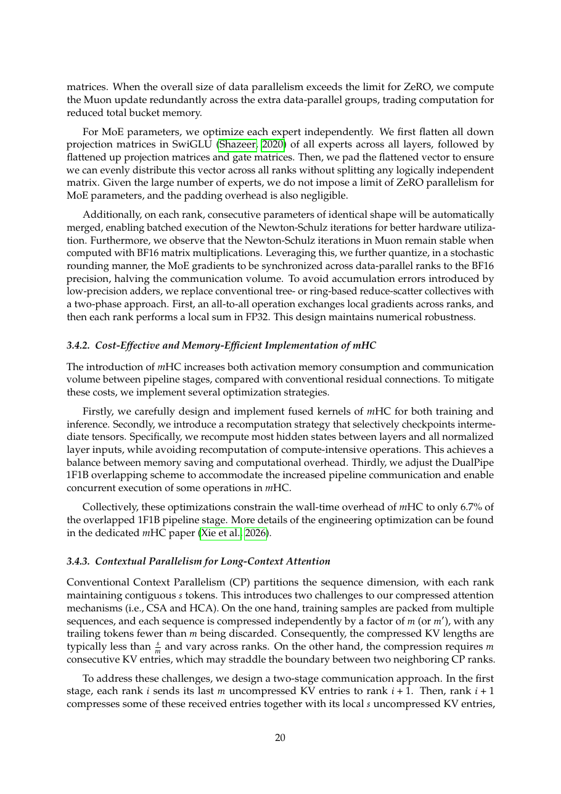

#### 3.4.3 长上下文注意力的上下文并行

压缩窗口可能跨越上下文并行 rank 边界，各 rank 的有效压缩长度也不同。两阶段方案先让每个 rank 把末尾 $m$ 个未压缩 KV 发送给下一个 rank，使边界窗口能正确压缩；再 all-gather 所有压缩 KV，并由融合算子重排、补齐。HCA 和 CSA 索引器可预计算可见范围，CSA 稀疏注意力则由 top-k 显式给出索引。

#### 3.4.4 张量级激活检查点

传统检查点只能按整个模块决定保留或重算。V4 扩展自动微分，允许开发者标注单个张量；TorchFX 追踪完整图后，自动寻找重建该张量所需的最小子图，并在反向计算前插入。系统直接释放原张量显存并让重建张量复用存储指针，无 GPU 内存复制；共享底层存储的 reshape 等张量还能自动去重。

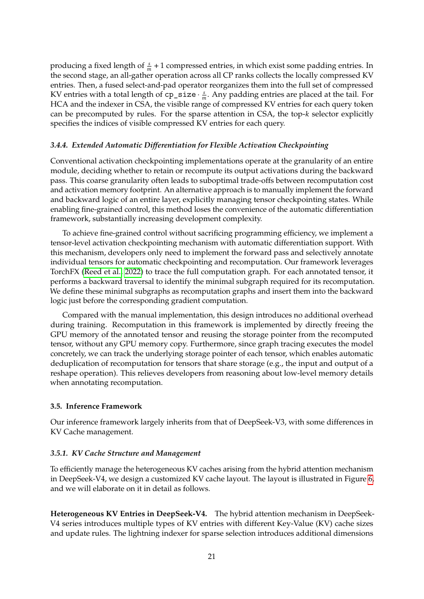

### 3.5 推理框架

#### 3.5.1 KV 缓存结构与管理

混合注意力产生多类缓存：CSA 主 KV、CSA 索引器 KV、HCA KV、滑动窗口 KV，以及尚不足一个压缩块的尾部隐藏状态。它们的尺寸、更新与淘汰规则都不同，无法直接套用传统 PagedAttention。

系统把缓存分为两部分：经典 KV 缓存保存已压缩的 CSA/HCA 块；状态缓存为每个请求分配固定大小空间，保存滑动窗口和待压缩尾部。每个经典缓存块覆盖 $\mathrm{lcm}(m,m')$ 个原始词元，使不同层的压缩结果都能对齐同一块边界。

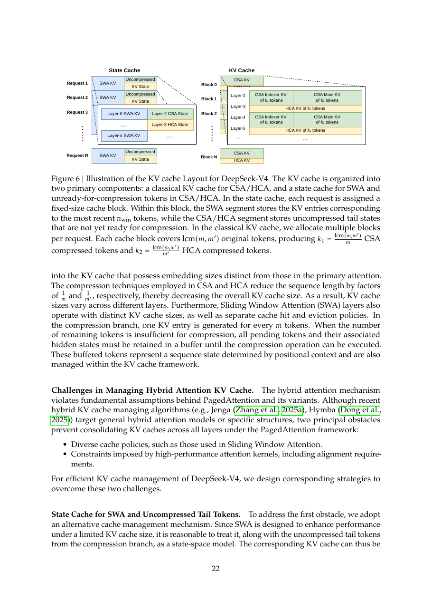

#### 3.5.2 磁盘 KV 缓存

命中共享前缀时，CSA/HCA 的完整压缩块可直接从磁盘读取；最后一个不完整压缩块仍需重算。滑动窗口 KV 约比压缩缓存大 8 倍，因此提供三种策略：

- **完整缓存：** 存下全部 SWA KV，零重算，但 SSD 写入量很大，读取又只触及末尾小部分。
- **周期检查点：** 每隔 $p$ 个词元保存最近窗口，命中后从最新检查点恢复并重算尾部，在存储与算力间调节。
- **不缓存 SWA：** 只依赖 CSA/HCA 缓存，最多重算 $n_{win}\times L$ 个末尾词元来恢复 $L$ 层模型的滑动窗口状态。

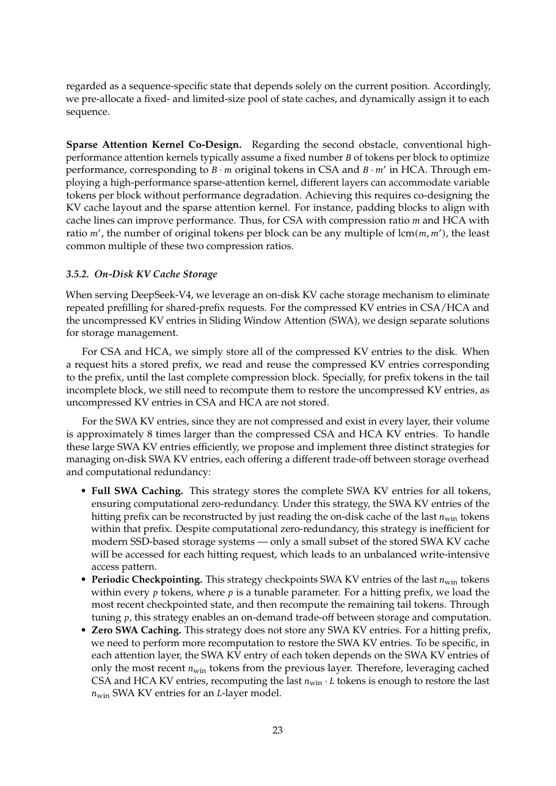

## 4 预训练

### 4.1 数据构建

预训练语料超过 32 万亿词元。团队过滤批量自动生成和模板化网页以降低模型坍缩风险，继续强化数学与代码，在中期训练加入智能体数据；多语言语料扩大对不同文化长尾知识的覆盖；长文档则重点选择科学论文、技术报告等学术价值较高的材料。

词表仍为 128K，只增加少量上下文构造特殊词元；沿用词元拆分与 FIM，按来源和长度打包文档以减少截断，并改用样本级注意力掩码。

### 4.2 模型配置

Flash 有 43 层、隐藏维度 4096，前两层为纯滑动窗口，后续交错 CSA/HCA；CSA 压缩率 4、top-k 512，HCA 压缩率 128，局部窗口 128。每层含 1 个共享专家与 256 个路由专家，每词元激活 6 个；总参数 2840 亿，激活 130 亿。

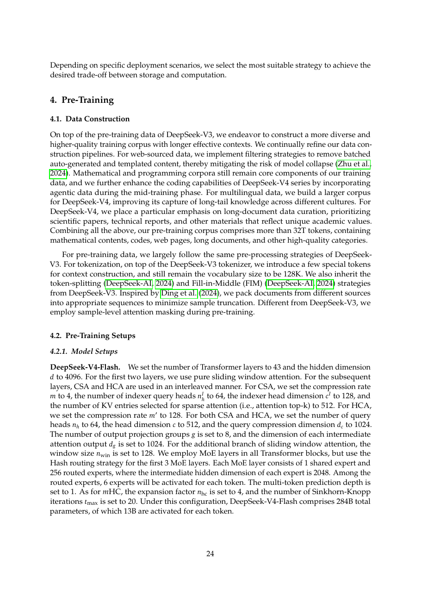

Pro 有 61 层、隐藏维度 7168，前两层为 HCA，后续交错 CSA/HCA；CSA 压缩率 4、top-k 1024，HCA 压缩率 128，局部窗口同为 128。每层含 1 个共享专家与 384 个路由专家，每词元激活 6 个；总参数 1.6 万亿，激活 490 亿。两种模型的 mHC 扩展因子均为 4，Sinkhorn-Knopp 均迭代 20 次。

### 4.2.2 训练设置

Flash 在 32 万亿词元上训练，最大批次 7550 万词元；前 2000 步线性预热，峰值学习率 $2.7\times10^{-4}$，末期余弦衰减至 $2.7\times10^{-5}$。Pro 在 33 万亿词元上训练，最大批次 9440 万词元，峰值与结束学习率分别为 $2.0\times10^{-4}$ 和 $2.0\times10^{-5}$。

两者都从 4K 序列逐步扩展到 16K、64K 和 1M。Flash 前 1 万亿词元使用稠密注意力，到 64K 阶段才引入稀疏注意力；先短暂预热索引器，再长期训练稀疏模型。MTP 损失权重大部分时间为 0.3，学习率衰减开始后降至 0.1。

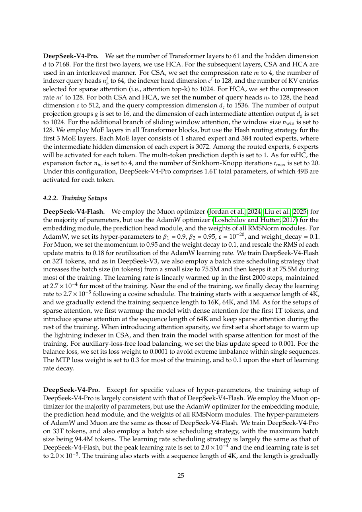

### 4.2.3 缓解训练不稳定

万亿参数 MoE 的损失尖峰与专家层异常值密切相关，路由还会形成自我强化。简单回滚只能暂时恢复，不能阻止复发。论文提出两项实用技术。

**预见式路由（Anticipatory Routing）。** 第 $t$ 步用当前参数计算特征，却使用较早参数预先算好并缓存的路由索引，从而解耦主干与路由网络的同步更新。优化后的额外墙钟成本约 20%；系统只在检测到尖峰时短暂回滚并启用该模式，稳定后再恢复常规训练，因此总体额外成本很小。

**SwiGLU 截断。** 线性分量截断到 $[-10,10]$，门控分量上界设为 10。实测能消除异常值并稳定训练，没有观察到性能损失。

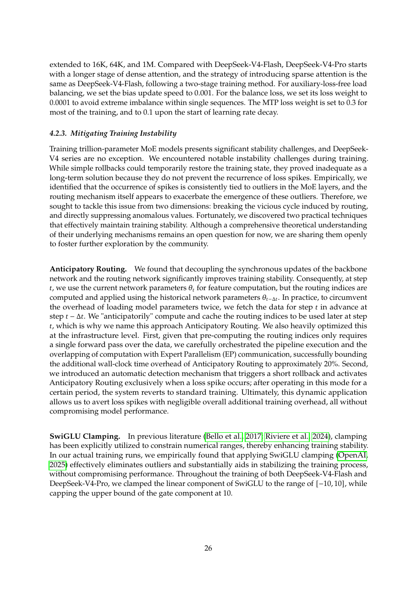

### 4.3 基础模型评估

评估覆盖世界知识、语言理解与推理、代码与数学、长上下文四类。统一内部设置下，Flash 虽总参数和激活参数都显著小于 V3.2-Base，仍在多数任务上更强，尤其是世界知识和长上下文。Pro-Base 则几乎全面领先两者。

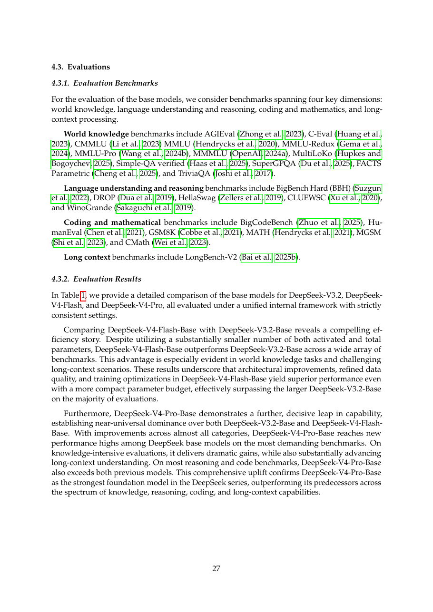

代表性结果包括：Pro-Base 在 MMLU-Pro 为 73.5、Simple-QA Verified 为 55.2、FACTS Parametric 为 62.6、HumanEval 为 76.8、LongBench-V2 为 51.5；对应 Flash-Base 分别为 68.3、30.1、33.9、69.5、44.7，V3.2-Base 为 65.5、28.3、27.1、62.8、40.2。

## 5 后训练

V4 仍先培养领域专家，但最终把 V3.2 的混合 RL 阶段完整替换为在策略蒸馏（OPD）。每个专家先在高质量领域数据上 SFT，再用 GRPO 和领域奖励完成强化学习。

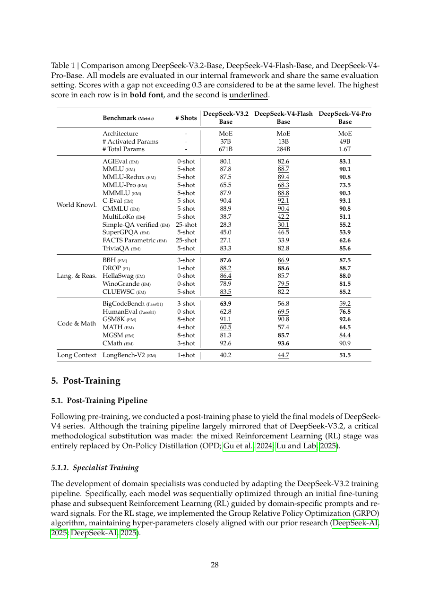

### 5.1 专家训练

#### 三档推理强度

- **Non-think：** 面向日常、紧急或低风险任务，快速直接回答。
- **Think High：** 面向复杂问题、规划与中风险决策，使用显式思考。
- **Think Max：** 减少长度惩罚并扩大上下文，要求充分拆解、检查边界与反例，用于探索能力上限。

三种模式由不同 RL 长度惩罚、上下文窗口和响应格式共同训练；Max 还在系统提示开头注入专门的最高强度推理指令。

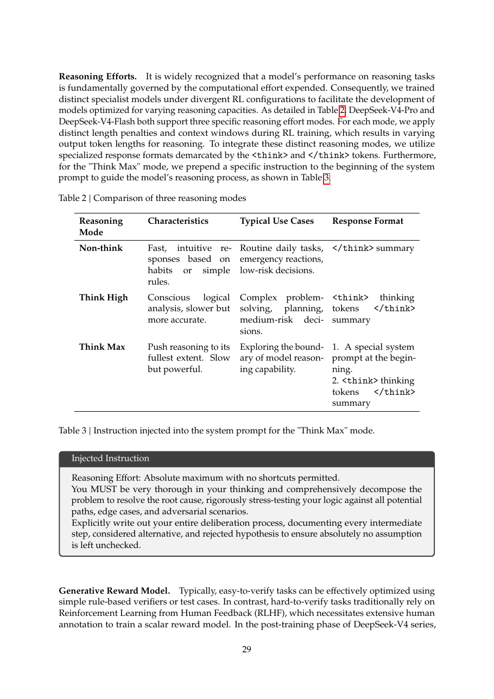

#### 生成式奖励模型与工具格式

易验证任务继续使用规则或测试；难验证任务不再依赖传统标量奖励模型，而是构造带评分细则的数据，用生成式奖励模型（GRM）评价完整轨迹，并直接对 GRM 自身做 RL。执行策略的模型也原生承担裁判角色，使生成推理能力融入评估过程，只需少量但多样的人类标注。

工具调用采用基于 XML 的新格式，以专用 `<|DSML|...>` 词元标记工具块、调用名和参数。字符串与 JSON 参数显式区分，减少转义和结构错误。

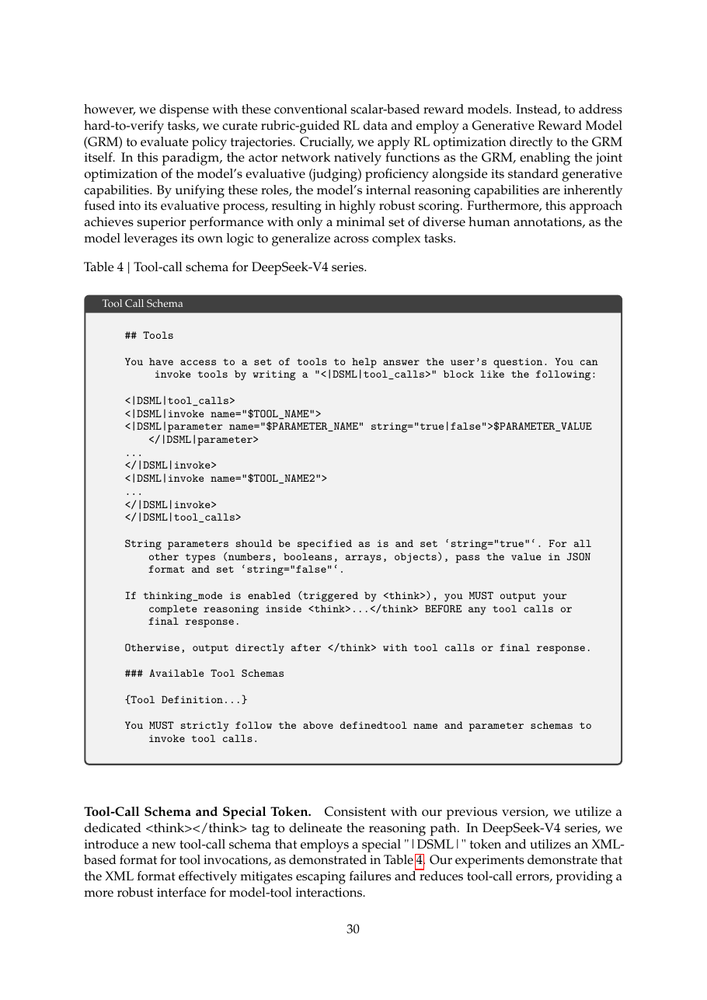

#### 交错思考

工具场景中，V4 利用百万词元窗口完整保留整个对话的思考历史，连新的用户轮次也不清除，使长周期任务维持连续问题状态。一般聊天仍在新用户消息到来时清除旧思考，避免无效膨胀。若框架把工具结果伪装成用户消息，论文仍建议使用非思考模式。

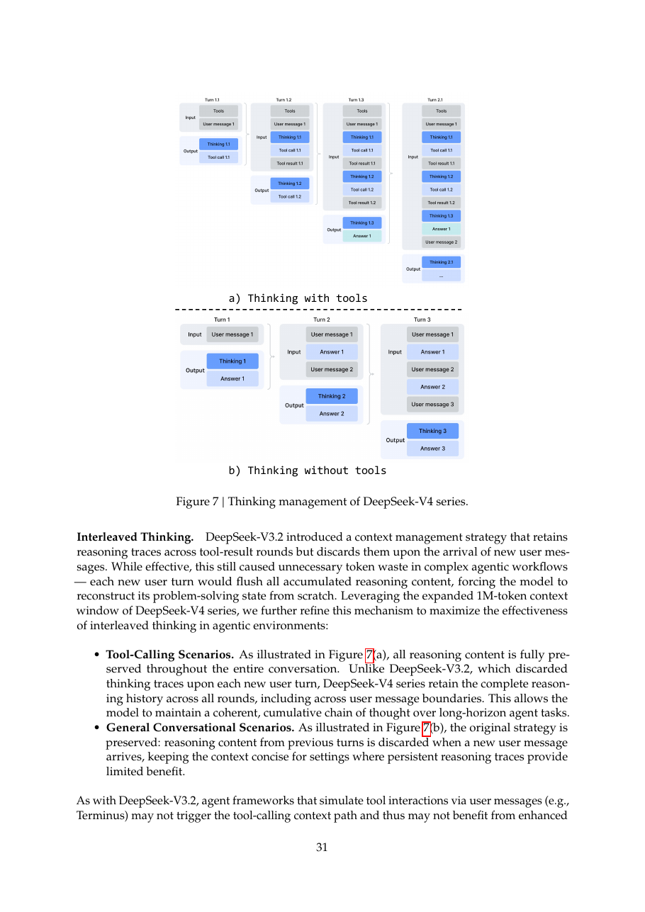

#### Quick Instruction

搜索触发判断、生成搜索词、会话标题、来源权威度、领域和 URL 读取判断等辅助任务，以专用特殊词元直接附在当前输入后执行。它们复用已计算的 KV 缓存，部分任务还能并行生成，省去额外小模型的重复预填充，降低首词元延迟与工程维护成本。

### 5.1.2 在策略蒸馏

统一学生模型在自己生成的轨迹上，针对十多个领域教师最小化加权反向 KL。当前样本只由相关专家承担主要教师权重。与权重合并或混合 RL 相比，logit 级对齐能把不同专家能力整合进同一参数空间，减少性能折损。

论文不采用只对采样词元估计 KL 的高方差近似，而是蒸馏完整词表分布，使梯度更稳定、教师信息更完整。

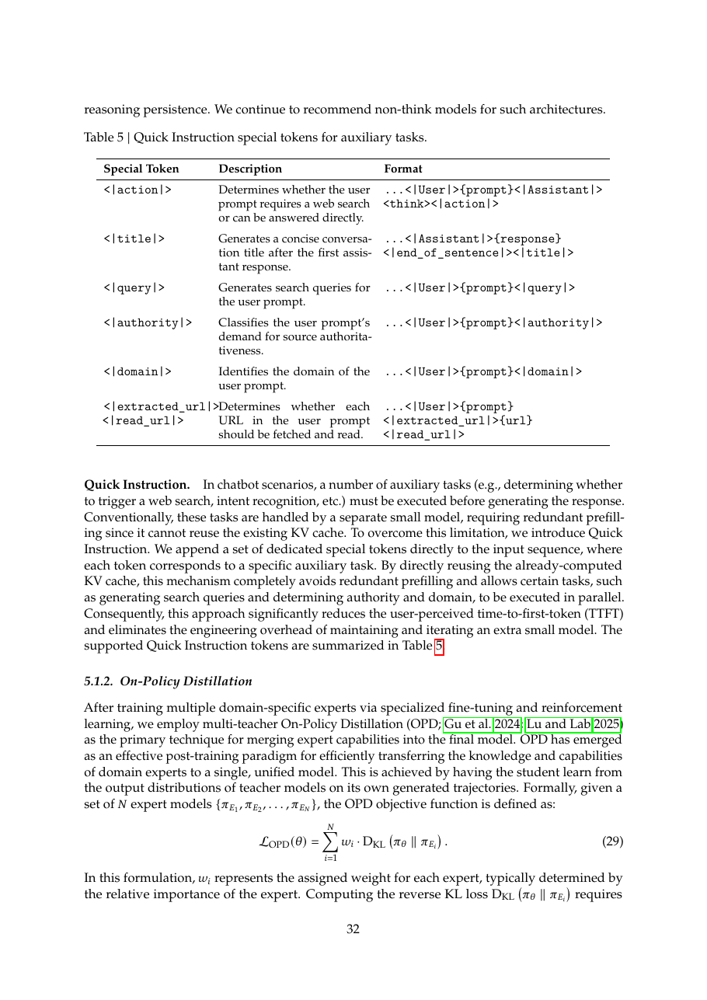

### 5.2 后训练基础设施

#### 5.2.1 FP4 量化感知训练

QAT 覆盖 MoE 专家权重与 CSA 索引器的 QK 路径。索引器的 Q/K 缓存、加载和乘法全程使用 FP4，索引分数再从 FP32 量化为 BF16，使 top-k 选择加速 2×，KV 召回率仍为 99.7%。

专家的 FP32 主权重先量化至 MXFP4，再无损反量化为 FP8 参与训练计算；推理与 rollout 直接使用原生 FP4 权重，使采样行为与线上部署一致，同时降低显存和内存流量。

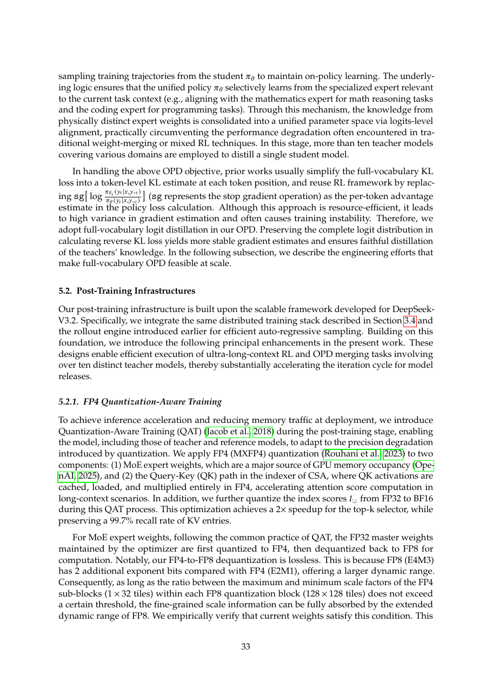

#### 5.2.2 多教师完整词表 OPD

万亿参数教师权重集中卸载到分布式存储，按需分片加载。系统不缓存超过 10 万维的完整 logit，只保存教师最后一层隐藏状态；训练时再加载相应预测头即时重建 logit。样本按教师编号排序，使每个小批次同一时刻最多驻留一个教师预测头，I/O 在后台异步进行，KL 则由专用 TileLang 内核计算。

#### 5.2.3 可抢占、容错的 rollout

每个生成请求都有词元粒度的预写日志（WAL），每生成一个词元立即持久化。被抢占时保存未完成请求的 KV；恢复时沿 WAL 继续解码。即使硬件故障，也能用已记录词元重新预填充重建 KV。

从头重生成在数学上会产生长度偏差：短回答更容易在中断前完成，反复重启会系统性偏向短序列。WAL 同时避免这一偏差和重复解码成本。

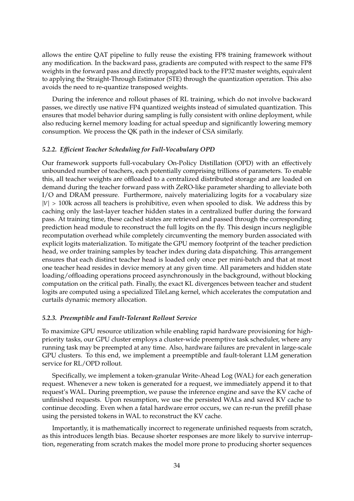

#### 5.2.4 百万词元 RL

rollout 数据拆成轻量元数据和重型逐词元字段。全局只加载元数据来洗牌与计算打包布局；大字段通过共享内存按小批次加载，用完立即释放。设备上同时驻留的小批次数量按工作负载动态调整，在计算吞吐与 I/O 重叠之间取舍。

#### 5.2.5 DeepSeek Elastic Compute 沙箱

DSec 是面向智能体训练与评估的生产级沙箱平台，由 Rust 编写的 API 网关、宿主机代理和集群监控器组成，底层使用 3FS，可在单集群管理数十万个并发实例。统一 Python SDK 提供四种执行底座：预热池中的无状态函数调用、Docker 兼容容器、Firecracker microVM，以及支持任意客户机系统的 QEMU fullVM。

容器镜像使用 3FS 上的只读 EROFS 层按需加载；microVM 使用 overlaybd 和本地写时复制层，支持链式快照和毫秒级恢复。

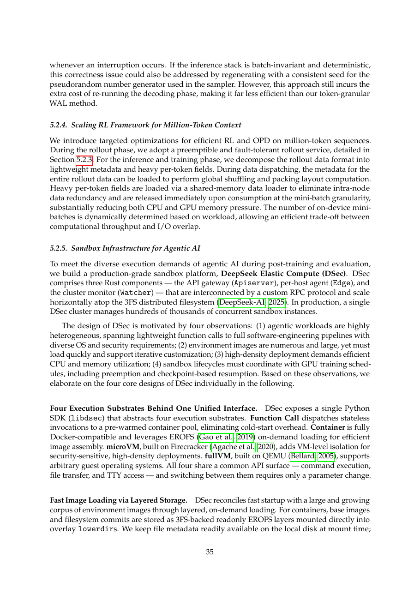

为提高超大并发密度，DSec 去重虚拟环境页缓存并回收内存，允许安全超配；同时缓解容器运行时自旋锁竞争，降低每沙箱 CPU 成本。每个沙箱还有全局有序轨迹日志：训练恢复时可快进并复用已完成命令结果，避免重复执行非幂等操作；所有状态变化可追溯；历史会话可确定性重放。

## 5.3 标准基准评估

知识与推理包括 MMLU-Pro、GPQA、HLE、SimpleQA、LiveCodeBench、Codeforces、HMMT、Apex、IMOAnswerBench 和 PutnamBench。Non-think、High、Max 的评估上下文分别为 8K、128K、384K。正式数学评估在 Lean 4.28.0-rc1 上运行，最多 500 次工具调用；更高计算版本先生成并自验自然语言解，再以其指导 Lean 智能体，最终只接受严格验证通过的证明。

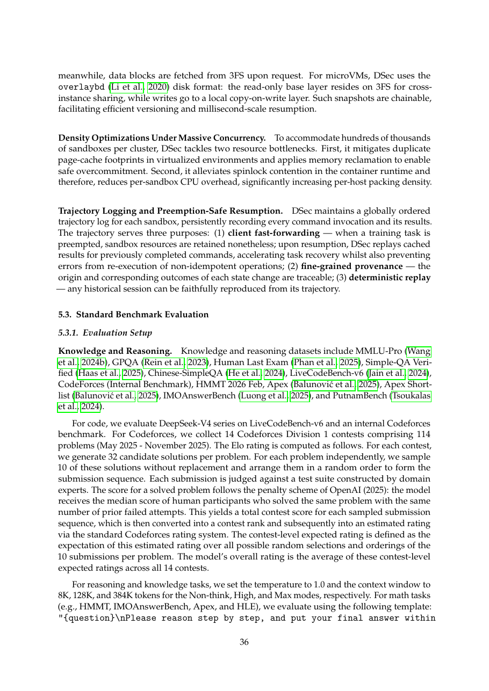

百万词元评估使用 MRCR 与 CorpusQA。代码智能体、搜索和工具评估包括 Terminal Bench 2.0、SWE 系列、BrowseComp、MCPAtlas、GDPval-AA 与 Tool-Decathlon；内部智能体框架只提供 Bash 和文件编辑等基础工具，最多 500 步，最大上下文 512K。

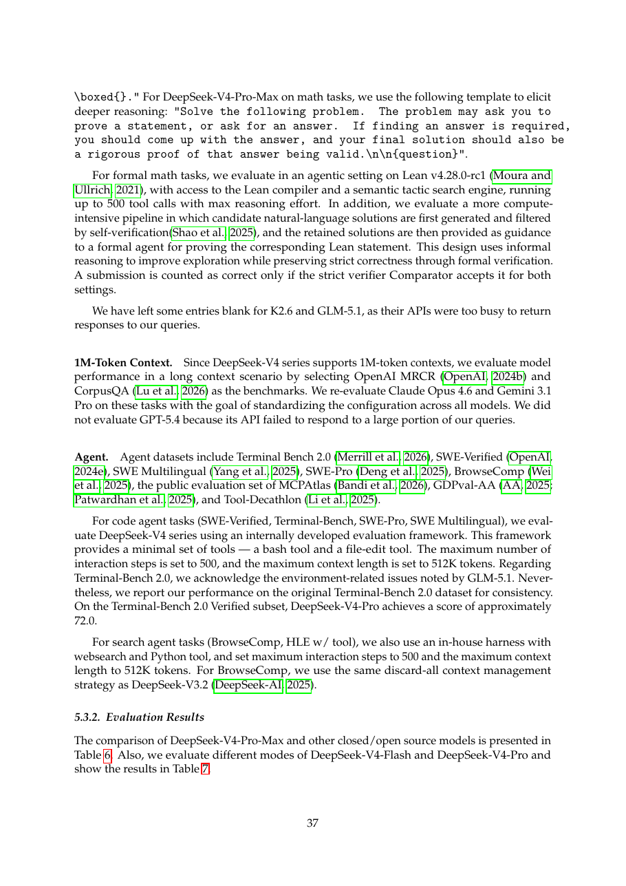

### 5.3.2 主要结果

DeepSeek-V4-Pro-Max 的代表性结果如下：

| 类别 | 基准 | 结果 |
| --- | --- | ---: |
| 知识 | MMLU-Pro | 87.5 |
| 知识 | SimpleQA-Verified | 57.9 |
| 知识 | Chinese-SimpleQA | 84.4 |
| 推理 | GPQA Diamond | 90.1 |
| 推理 | HLE | 37.7 |
| 代码 | LiveCodeBench | 93.5 |
| 代码 | Codeforces | 3206 rating |
| 数学 | HMMT 2026 二月 | 95.2 |
| 数学 | IMOAnswerBench | 89.8 |
| 数学 | Apex Shortlist | 90.2 |
| 长上下文 | MRCR 1M | 83.5 |
| 长上下文 | CorpusQA 1M | 62.0 |
| 智能体 | Terminal Bench 2.0 | 67.9 |
| 智能体 | SWE Verified | 80.6 |
| 智能体 | BrowseComp | 83.4 |
| 智能体 | MCPAtlas Public | 73.6 |
| 智能体 | Toolathlon | 51.8 |

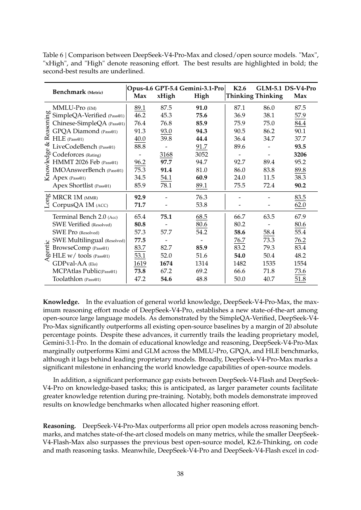

Pro-Max 在开放模型中显著提升世界知识，SimpleQA 比其他开放基线高约 20 个百分点，但仍落后 Gemini-3.1-Pro。它在多项代码与数学推理上接近或超过闭源前沿系统；Codeforces 3206 rating 在人类候选中约排第 23。Flash-Max 也超过此前开放模型，并以更小激活规模提供强推理性价比。

形式化数学方面，Flash-Max 在轻量工具、有限采样的 Putnam-200 Pass@8 上达到 81；在大量计算的自然语言—形式化混合管线中，DeepSeek-V4 在 Putnam 2025 上达到 120/120 的完整证明成绩。

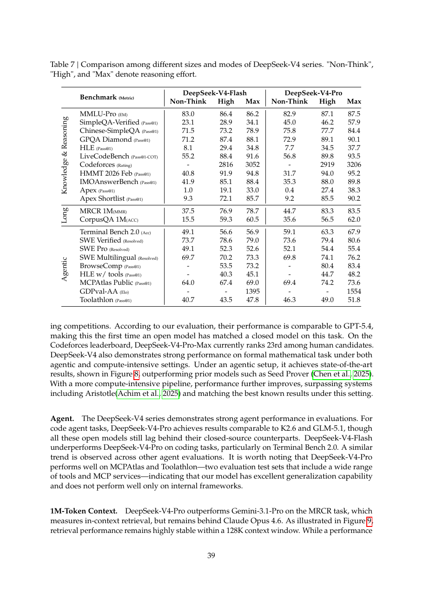

MRCR 的检索表现到 128K 基本稳定，之后逐渐下降，但 1M 时仍保持较强：Pro-Max 为 0.59，Flash-Max 为 0.49。真实度更高的 CorpusQA 上，Pro 同样超过 Gemini-3.1-Pro，但仍落后 Claude Opus 4.6。

Max 通过更长上下文与更弱长度惩罚，在最难任务上普遍优于 High。与 V3.2 相比，V4 扩展测试时计算后获得更高上限；在 HLE 等任务上，Pro 还表现出更好的词元效率。

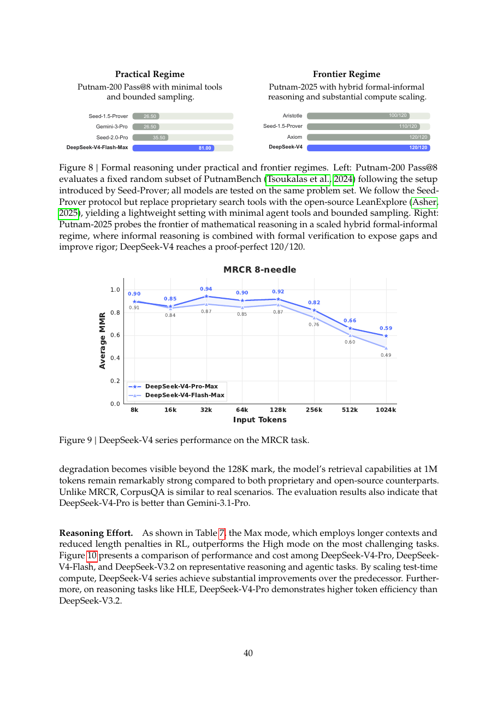

## 5.4 真实世界任务

### 5.4.1 中文写作

在 3170 个中文功能写作样本上，DeepSeek-V4-Pro 对 Gemini-3.1-Pro 的胜率为 62.7%，后者为 34.1%。创意写作中，V4-Pro 的指令遵循胜率为 60.0%，写作质量胜率为 77.5%。不过只看高复杂约束或多轮写作，Claude Opus 4.5 仍以 52.0% 对 45.9% 领先。

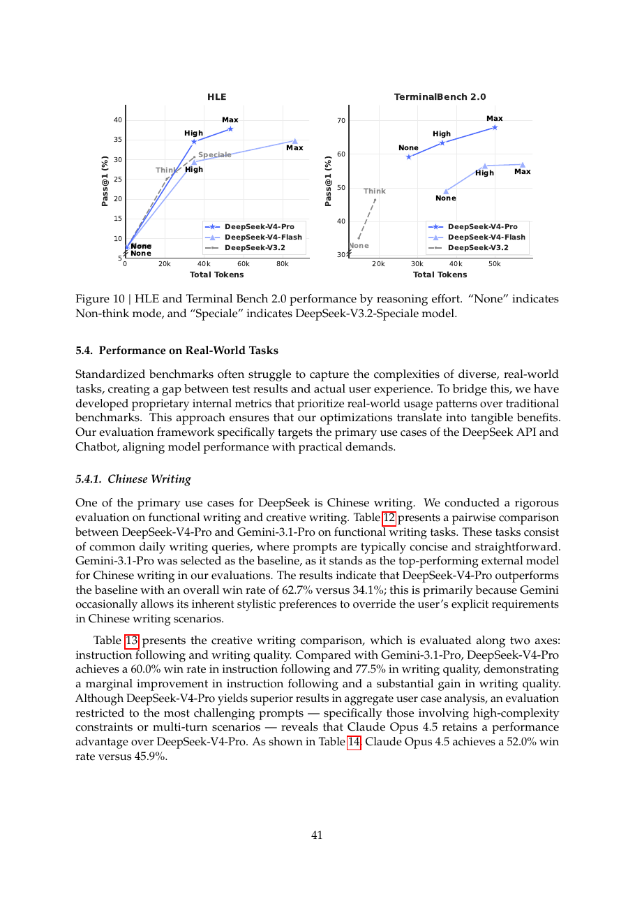

### 5.4.2 搜索

DeepSeek 产品的非思考模式使用检索增强搜索，思考模式使用可反复调用搜索和抓取工具的智能体搜索。内部评估中，V4-Pro 的 RAG 在客观与主观问答上都明显优于 V3.2，单值查找、规划与策略提升最明显；对比与推荐任务的优势较小。

智能体搜索总胜率为 61.7%，RAG 为 18.3%，其余 20.0% 持平；平均调用 16.2 次工具，预填充与输出分别约 13649 和 1526 词元，成本只略高于 RAG 的 10453 与 1308 词元，因为多数工具调用并行执行。

### 5.4.3 白领工作

30 个高级中文职业任务横跨金融、教育、法律、科技等 13 个行业，要求深入分析、生成或编辑文档。对 Claude Opus 4.6-Max 的盲评中，Pro-Max 总体胜 53%、平 10%、负 37%，非负率 63%。其优势主要在任务完成与内容质量，能主动补充隐含需求、自检并生成连贯长文；弱项是偶尔忽视格式约束、长文压缩不够精炼，以及演示文稿视觉设计。

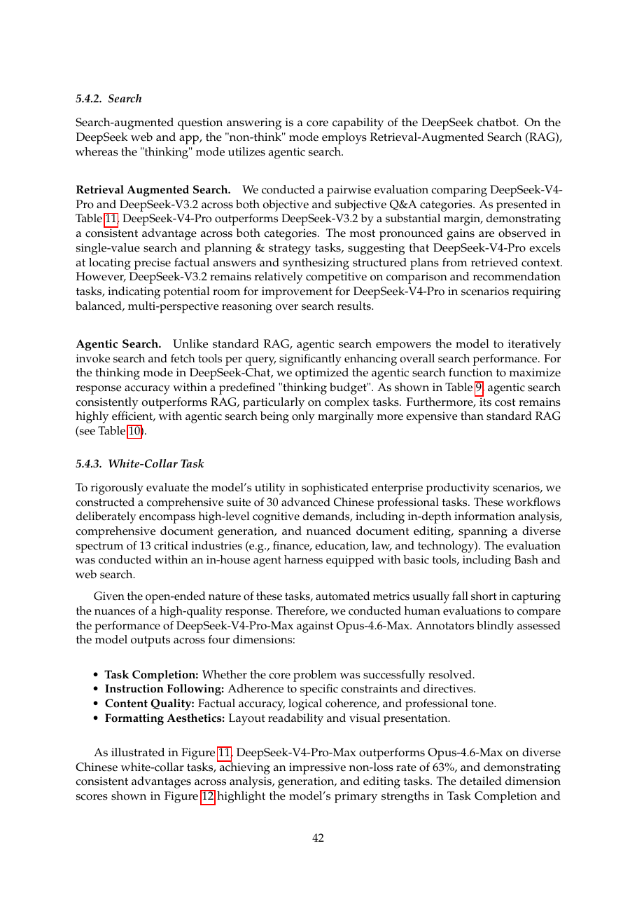

论文展示了联合营销方案样例，并按任务完成、指令遵循、内容质量和格式美观四个维度比较模型。Pro-Max 的前两项强，格式美观仍明显有提升空间。

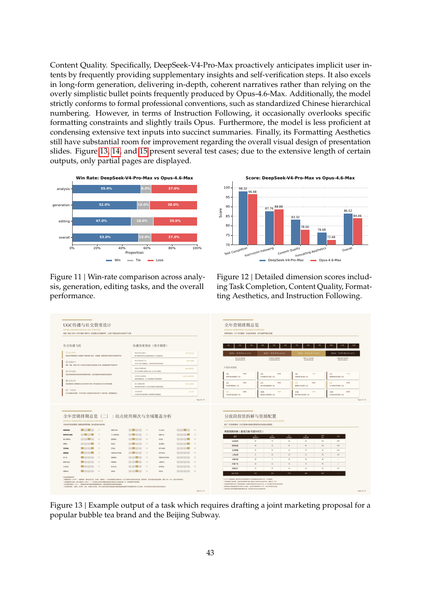

### 5.4.4 代码智能体

团队从 50 多位内部工程师收集约 200 个 PyTorch、CUDA、Rust、C++ 等真实研发任务，覆盖功能开发、修复、重构和诊断，最终筛成 30 个高质量评测。V4-Pro-Max 通过率为 67%，明显高于 Claude Sonnet 4.5 的 47%，接近 Claude Opus 4.5 的 70%，低于 Opus 4.6 Thinking 的 80%。

85 名日常使用 V4-Pro 做智能体编程的内部开发者与研究者中，52% 认为可作为默认主力模型，39% 倾向认可，不认可者不足 9%。主要问题是小错误、对含糊提示的误解和偶尔过度思考。

## 6 结论、局限与未来方向

DeepSeek-V4 以 CSA/HCA 混合注意力、mHC、Muon 和完整基础设施栈，把开放模型原生上下文推进到百万词元，并为长周期智能体、进一步测试时扩展和在线学习奠定基础。Pro-Max 刷新开放模型知识与推理上限，Flash-Max 则以更低激活规模获得很强的推理性价比。

为追求极致长上下文效率，当前架构保留了许多预先验证的组件与技巧，复杂度较高。后续将提炼最必要的设计，使架构更简洁。预见式路由和 SwiGLU 截断虽能抑制训练尖峰，理论机制仍不充分；团队计划加强稳定性研究和内部指标监控，从事后恢复转向更可预测的稳定训练。

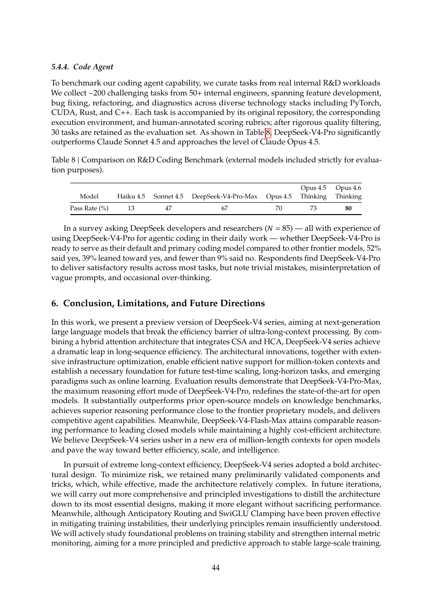

## 参考文献

论文引用了 Transformer、DeepSeekMoE、MTP、DSA、mHC、Muon、GRPO、OPD、量化训练、长上下文注意力、MoE 系统优化、形式化证明与各类评估工作。完整书目信息见原论文以下页面。

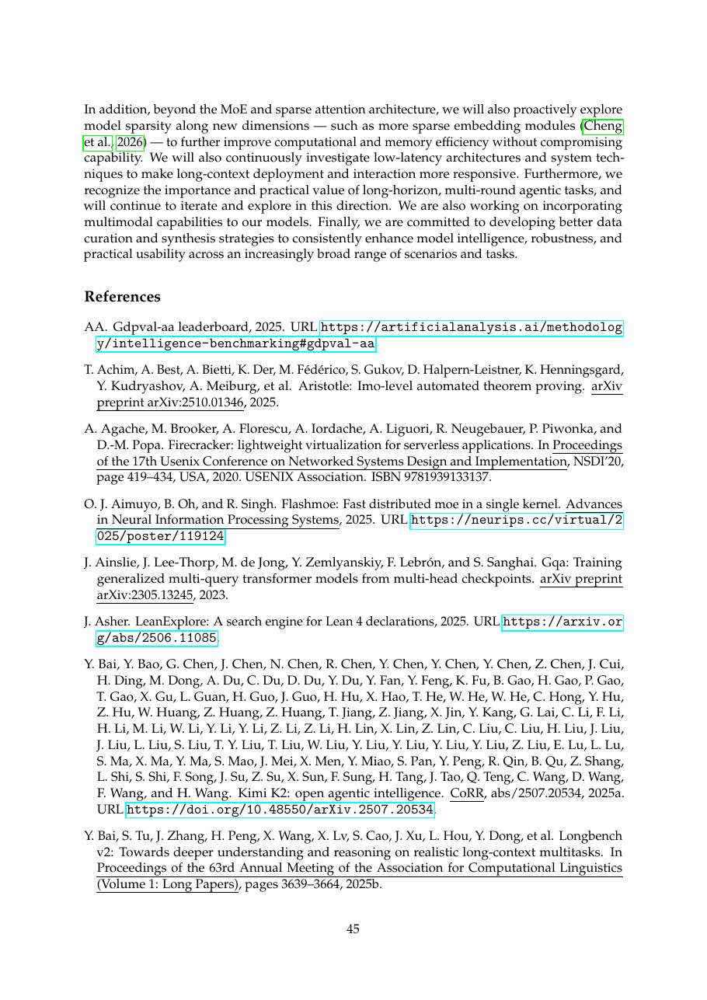

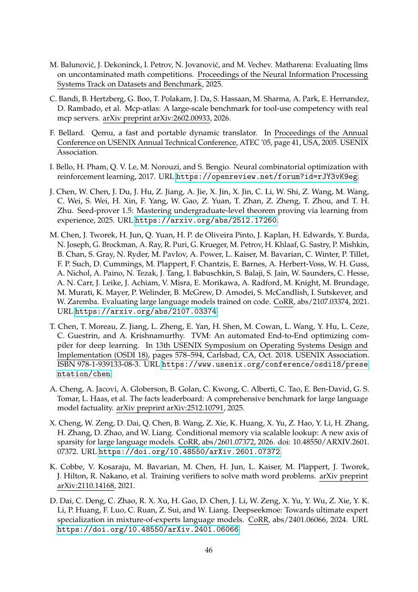

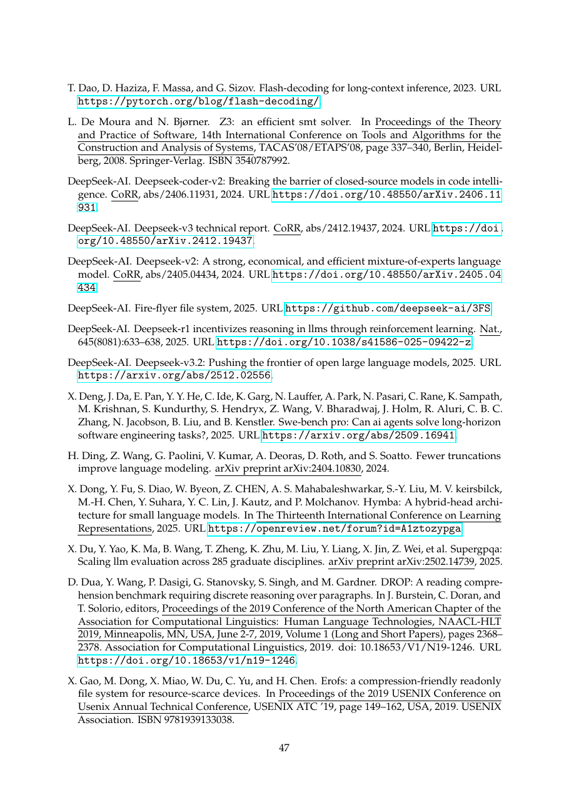

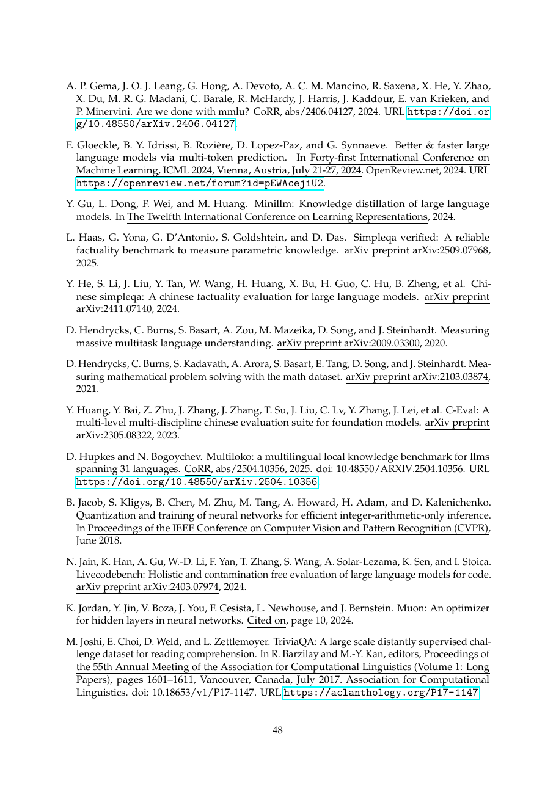

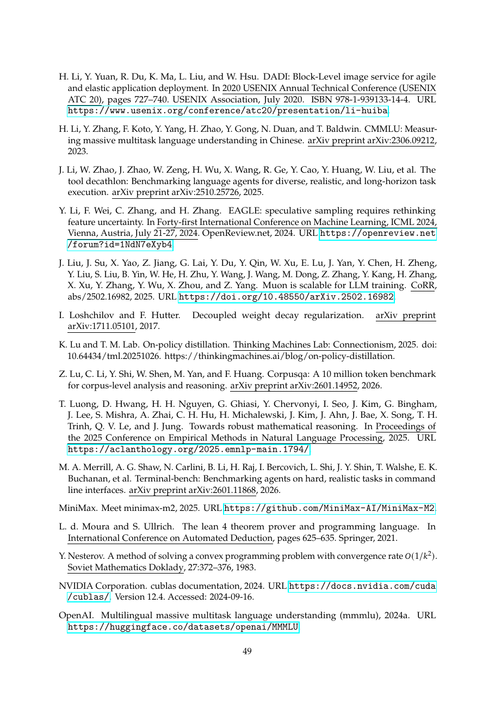

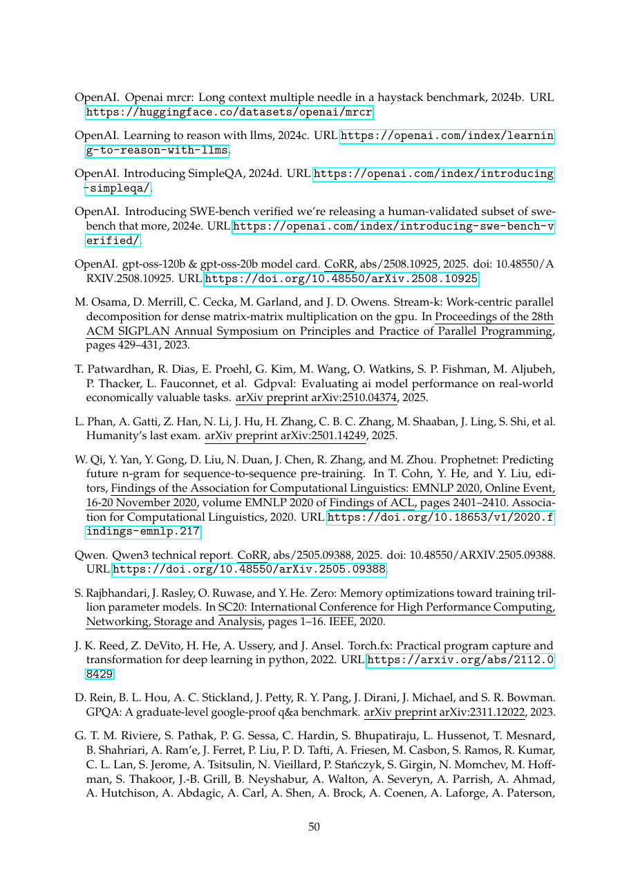


## 附录 A：作者与致谢

作者按英文名字母顺序列出，星号表示已经离开团队的成员；名单分为研究与工程、商业与合规两组。


团队感谢 Dolly Deng 与其他测试人员对 DeepSeek-V4 系列能力提出的建议和反馈。

## 附录 B：评估细节

智能体搜索与 RAG 共比较 869 个任务：智能体搜索胜 536、RAG 胜 159、持平 174。V4-Pro 与 V3.2 的搜索问答共比较 956 个任务，V4 胜 269、V3.2 胜 99、持平 588；提升集中在精确查找与规划类问题。


论文附录还展示纳斯达克定投策略对比和 2020–2025 年诺贝尔科学奖分析报告等白领任务样例。


中文功能写作的 3170 个样本细分为办公、媒体、生活、口头、公文、学术六类。V4-Pro 在大多数细类领先 Gemini-3.1-Pro，总体胜 1986、负 1081、平 103。


中文创意写作共有 2837 个样本，覆盖小说、同人、记叙文、散文、诗歌、歌词和议论文等。V4-Pro 在指令遵循上总体胜 1703、负 1119、平 15；在写作质量上胜 2198、负 634、平 5。复杂指令与多轮写作的 196 个高难样本上，V4-Pro 胜 90，Claude Opus 4.5 胜 102，平 4。


