# Kimi K3：开放前沿智能

**作者：** Kimi 团队

**模型：** [Kimi-K3](https://huggingface.co/moonshotai/Kimi-K3)

**原文：** [arXiv:2607.24653](https://arxiv.org/abs/2607.24653)

## 摘要

本文介绍 Kimi K3，一个总参数 2.8 万亿、每词元激活 1040 亿参数、原生支持视觉并拥有 100 万词元上下文窗口的混合专家模型。K3 建立在 Kimi Delta Attention（KDA）和 Attention Residuals（AttnRes）之上，分别改善超长序列和深层网络的信息流；Stable LatentMoE 在 896 个路由专家中每词元激活 16 个，并通过新的训练与数据配方稳定极端稀疏性。综合改进使整体缩放效率相比 Kimi K2 约提升 2.5 倍。

后训练覆盖通用、智能体和代码领域，并为多种推理投入等级训练专家，再通过多教师在策略蒸馏合并为一个模型。基础设施针对 KDA 系统协同设计、3T 级专家并行训练、百万词元智能体 RL、持久化沙箱和线上部署分别优化。评测显示，Kimi K3 在长时程代码、智能体、知识、推理和视觉任务上达到前沿水平；整体仍落后于最强闭源模型，但在本文测试套件中持续超过其他开源和闭源模型。团队公开完整模型权重，推动开放前沿智能研究与部署。

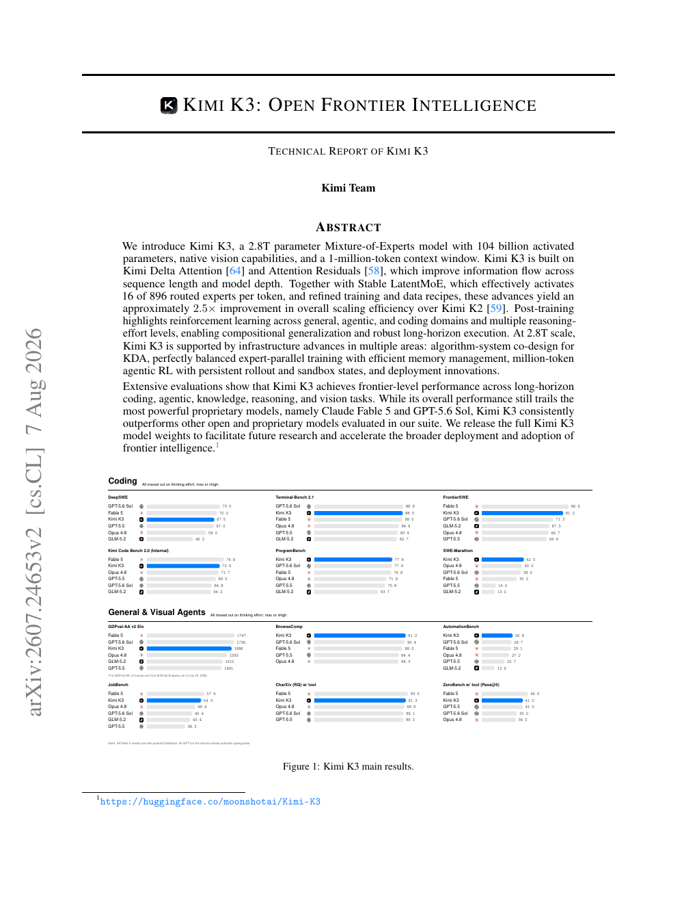

## 1 引言

大型语言模型的第一条缩放轴，是在部署前投入更多训练计算；推理模型兴起后，测试时计算成为第二条轴，强化学习、可变思考预算和工具使用让模型能在推理阶段继续扩展能力。开源生态在第二条轴上进展很快，但许多模型仍停留在约 1T 参数规模。若继续在相近规模基础模型上叠加越来越复杂的推理和智能体 RL，开源进步可能趋同，和最强闭源系统的差距反而扩大。

Kimi K3 同时推进两条缩放轴：把预训练基础模型扩展到 3T 级参数，把强化学习、推理投入和长时程交互扩展到 100 万词元上下文。模型总参数 2.8T，激活参数 104B，采用 KDA、高容量全局注意力、AttnRes 和 Stable LatentMoE，并使用原生多模态路径处理图像与视频。

后训练明确面向百万词元测试时缩放，覆盖长时程代码、通用智能体、深度研究、专业知识工作、视觉工具推理、持久助手、网页开发和自主执行。环境让模型在数百到数千次工具调用、数百万累积上下文词元中反复执行“推理、行动、观察、验证、适应”循环，再把不同领域与不同投入等级的专家合并为统一模型。

主要贡献包括：

- **开放前沿预训练。** 训练 2.8T 参数原生多模态 MoE，104B 激活参数，支持 1M 上下文；KDA、AttnRes、Stable LatentMoE 与数据配方带来约 2.5 倍缩放效率提升。
- **多投入等级测试时缩放的强化学习。** 在通用、智能体和代码域，以 low、high、max 三种推理投入分别训练专家，再合并能力。
- **万亿参数、百万上下文的基础设施。** 提出 KDA 系统协同设计、MoonEP 平衡专家并行、记忆高效训练、可恢复沙箱和部署侧缓存调度。
- **开放前沿模型。** 发布完整权重，供研究、部署和进一步创新使用。

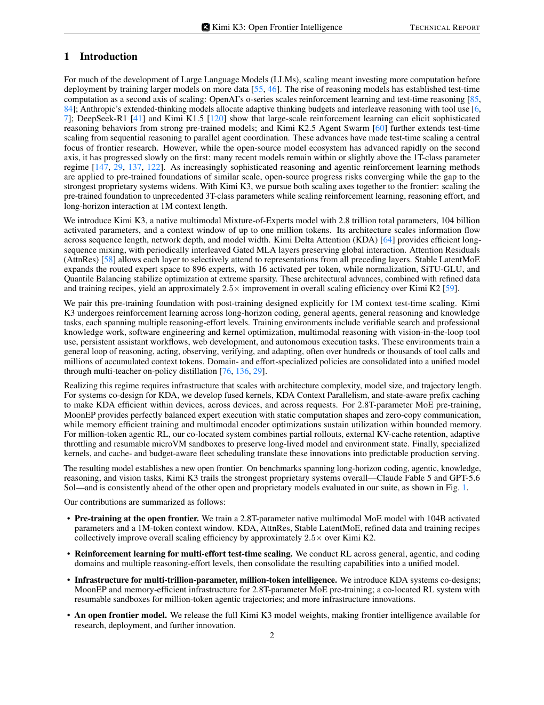

## 2 模型架构

Kimi K3 从三个维度扩展信息流：序列长度、网络深度和模型宽度。序列维度使用混合注意力，每个块包含 3 层 KDA 和 1 层 Gated MLA；深度维度使用 AttnRes，让模块从嵌入、当前块和所有前置块选择性取信息；宽度维度在每个注意力层后接 Stable LatentMoE，每词元从 896 个路由专家中激活 16 个。原生视觉路径由 MoonViT-V2 与轻量投影器组成，Per-Head Muon 则稳定注意力投影的优化。

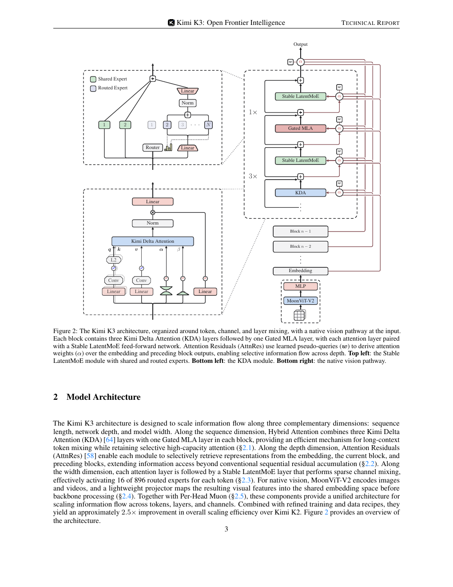

### 2.1 混合注意力

#### 2.1.1 Kimi Delta Attention

KDA 把带通道遗忘门的 delta-rule 递归用于长序列。单头状态为 $S_t\in\mathbb{R}^{d_k\times d_v}$，每个词元先按通道衰减，再写入当前键值，输出由状态读取查询。查询、键和值都经过 ShortConv 与 Swish，查询和键再做 L2 归一化；低秩投影产生每个键通道的细粒度衰减 logit。

KDA 在块内并行、块间递归。块内用下三角掩码保证因果性，输出分为跨块状态项与块内交互项。原始实现中，累积衰减的倒数可能在有限精度下溢出，导致对角 tile 只能使用昂贵的位置对计算。

K3 将 log-decay 从无界负 Softplus 改为下界为 $g_{min}=-5$ 的缩放 Sigmoid：

$$
g=g_{min}\,\mathrm{Sigmoid}(e^A z),\qquad \alpha=\exp(g).
$$

这样保留因果衰减，同时让每个保留因子落在 $[e^{-5},1)$，所有 tile 都可直接使用 Tensor Core 密集矩阵乘法。初始化 $A=0$，训练中仍允许每个头学习不同的衰减尺度。

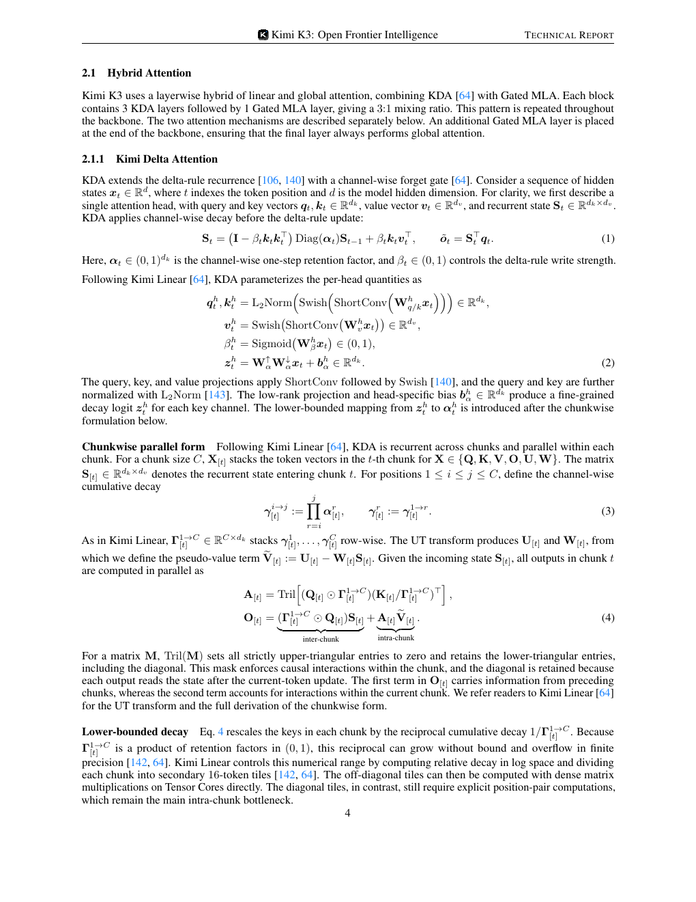

图 3 对比 Kimi Linear 的无界负 Softplus 与 K3 的有界 Sigmoid，并展示有界衰减如何把对角 tile 从位置对计算改成 Tensor Core 计算。KDA 以 16 个词元为二级 tile，降低长上下文 prefill 的主要瓶颈。

#### 2.1.2 Gated MLA

每三个 KDA 层后加入一个 Gated MLA，全局注意力在序列范围内补充跨远距离交互。Gated MLA 沿用多头潜在注意力的压缩键值表示，并在输出路径加入门控，让模型按输入决定全局注意力贡献。骨干末尾额外放置一层 Gated MLA，确保最终层始终执行全局混合。

### 2.2 Attention Residuals

普通残差把上一层表示固定加到当前表示，深层网络中的信息流会逐层混合且难以选择。AttnRes 为每个层块引入可学习的伪查询 $w$，对嵌入及此前块输出计算权重 $\alpha$，再按权重聚合。这样每层都能从更长的深度历史中选择信息，而不是被迫接受单一路径。

为控制显存，Block AttnRes 把若干层划为块，在边界层生成块表示，后续层共享；训练时用检查点重算，流水线中只传输新生成的块。解码时把跨块读取放到旁路流，并把块内合并与归一化融合进张量并行归约。

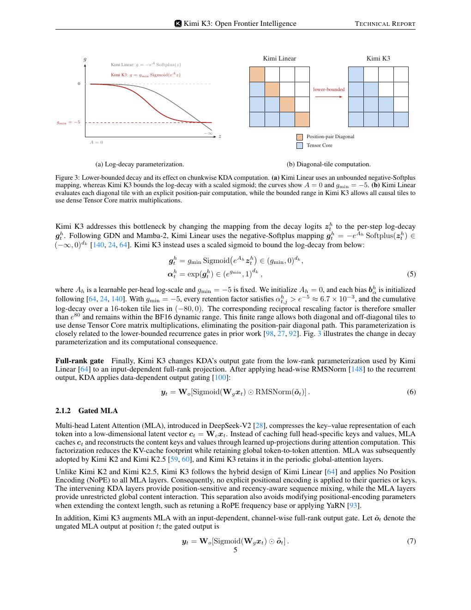

### 2.3 Stable LatentMoE

K3 的每个注意力层后接稀疏通道混合。路由分支先把隐藏表示压到较小的 latent 维度，再由共享专家和路由专家分别计算，最后投影回隐藏维度。每层固定两个全宽共享专家，路由专家池扩展到 896 个，每词元激活 16 个。

#### 2.3.1 归一化 LatentMoE

原始 LatentMoE 直接把专家聚合结果送入上投影，尺度会随选择的专家和路由权重变化。K3 在聚合和上投影之间加入 RMSNorm，降低路由分支尺度波动，再与全宽共享分支合并；该变化同时改善验证损失和下游基准。

#### 2.3.2 Sigmoid Tanh Unit GLU

SwiGLU 的门控分支和上分支都可能无界增长，两个大坐标相乘会产生激活离群点和低精度溢出。K3 提出 SiTU-GLU，用平滑的 scaled tanh 同时限制两个分支：

$$
\mathrm{SiTU\mbox{-}GLU}(x)=\beta_1\tanh(W_gx/\beta_1)\odot\mathrm{Sigmoid}(W_gx)\odot\beta_2\tanh(W_ux/\beta_2).
$$

模型使用 $\beta_1=4$、$\beta_2=25$。在原点附近，scaled tanh 一阶近似为恒等映射，因此保留 SwiGLU 的局部响应；大值则被平滑封顶，输出无穷范数上界为 100。

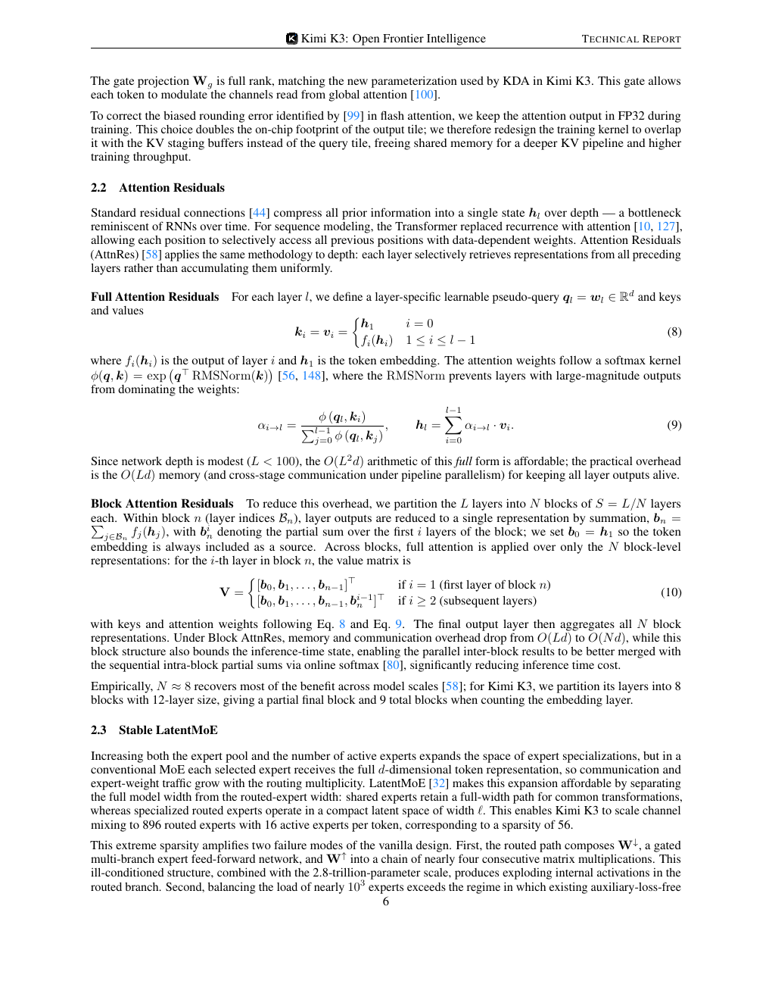

#### 2.3.3 分位数均衡

K3 采用无辅助损失的路由。专家偏置只参与 Top-k 选择，不参与混合权重，因此能调节 dispatch 而不改变路由器梯度优化。固定步长偏置更新在 896 个专家时容易出现振荡，K3 改用 Quantile Balancing（QB）：从一次前向中的 Top-(k+1) 截止分数出发，直接计算每个专家达到目标负载所需的分位数偏置。

批次有 $m$ 个词元、$n$ 个专家、每词元选择 $k$ 个专家时，每个专家目标负载为 $q=mk/n$。对每个专家取边际分布的 $(1-k/n)$ 分位数，再把偏置均值归一化。新偏置只在下一步生效，避免一个批次用自身统计结果路由自己；推理时偏置冻结，仍是普通固定 Top-k。

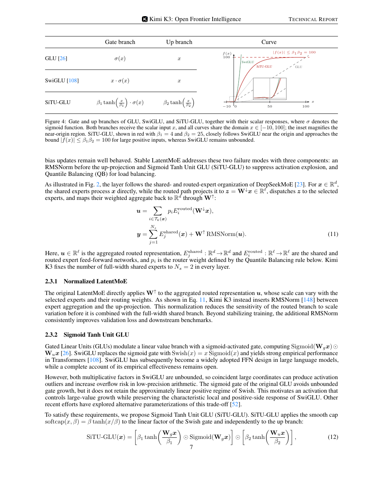

在大规模训练中，边际数量达到数百万，无法收集后精确求分位数。实际实现为每个专家维护边际直方图，各 rank 本地累积计数，训练步末只做一次全局 all-reduce，再从合并直方图恢复分位数。通信量与词元数量无关，只有几百个 bin 的专家统计。

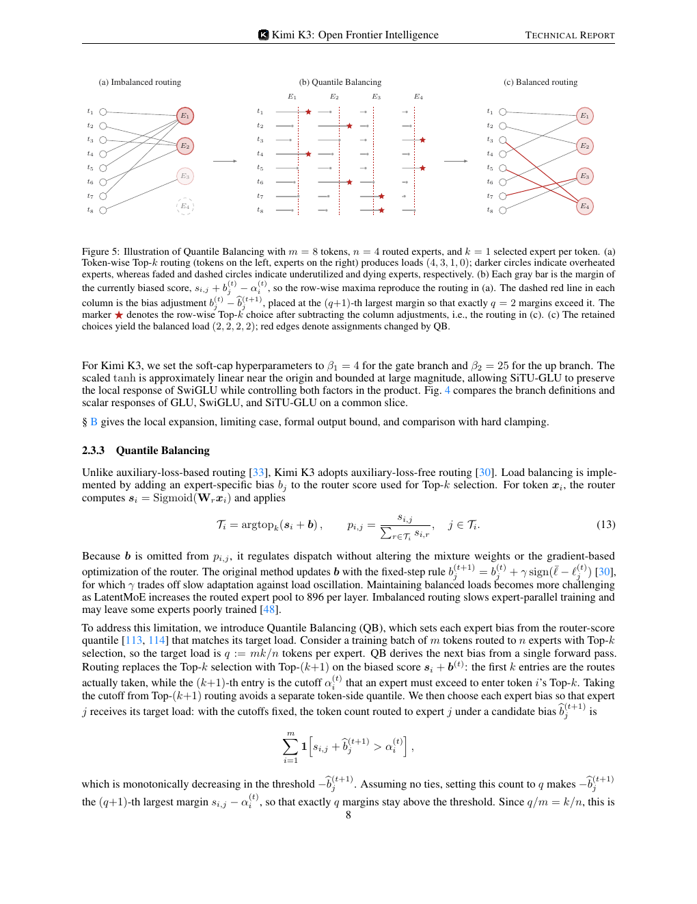

### 2.4 原生视觉

文本、图像和视频在同一个共享骨干中处理，渲染输出及其生成代码也处于同一词元流，模型可以编写代码、检查截图或视频帧，再迭代修改界面、图形和视频，无需跨模型交接。

MoonViT-V2 不再从对比学习视觉模型初始化，而是完全从零用下一词元预测训练。实验显示，从 SigLIP 初始化的 MoonViT-3D 在联合优化时梯度范数更高且经常尖峰；从零训练的 MoonViT-V2 更稳定，在视觉评测上却达到相当水平，说明大规模多模态语言模型不需要对比预训练作为视觉初始化。

MoonViT-V2 是约 0.4B 参数的 27 层视觉 Transformer，使用 RMSNorm、无偏置线性和注意力投影。图像与视频完全共享参数，注意力分为空间和时间两阶段，时间池化压缩视频；投影前的 2x2 pixel shuffle 把视觉词元减少四倍，使最高 3584x3584 像素输入可在 1M 上下文中使用。

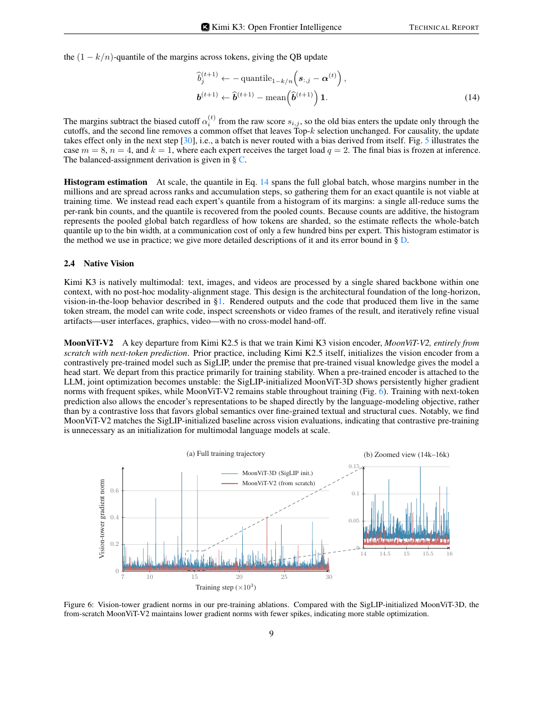

### 2.5 Per-Head Muon

K3 在矩阵参数上使用 Muon，并把注意力投影的 Newton-Schulz 正交化从整块 Q、K、V 矩阵改为按头分别执行。整矩阵正交化会让梯度或动量较大的头主导更新，较小头得到的归一化不足；逐头正交化均衡了各头的更新尺度，同时在高宽矩阵上略微降低优化器开销。

## 3 预训练

### 3.1 预训练数据

文本语料覆盖网页文本、代码、数学和知识，视觉语料覆盖描述、图文交错、OCR、感知、视频和视觉编程。各领域结合规则启发式、分类器质量分数和去重过滤，采样率由小模型消融决定。知识与数学语料沿用 K2 的多风格改写、分块自回归生成和源文档忠实度验证。

视觉数据既使用开源集合，也使用内部筛选、合成和去重流水线；定位监督同时提供绝对坐标和 [0,1] 归一化坐标。程序化多模态数据大幅扩展，把 SVG、3D 资产、网页、游戏和 CAD 图纸的代码与渲染结果配对。

### 3.2 缩放定律

架构、数据和训练改进共同定义新的模型族。团队重新搜索批量、学习率、每参数词元数（TPP）和模型形状，OOD 验证曲线显示相对 Kimi K2 约 2.5 倍缩放效率。公平比较余弦衰减与 WSD 时，分别为每种日程寻找最优超参数；在各自最优点，余弦衰减始终得到更低最终损失。

表 1 的关键变化包括：层数从 61 增至 93，总参数从 1.04T 增至 2.78T，激活参数从 32.6B 增至 104.2B；路由专家从 384 增至 896，激活专家从 8 增至 16，共享专家从 1 增至 2；注意力头从 64 增至 96，训练上下文从 128K 扩展到 1M。K3 由 69 层 KDA 和 24 层 MLA 组成，并加入 27 层、401M 参数的视觉编码器。

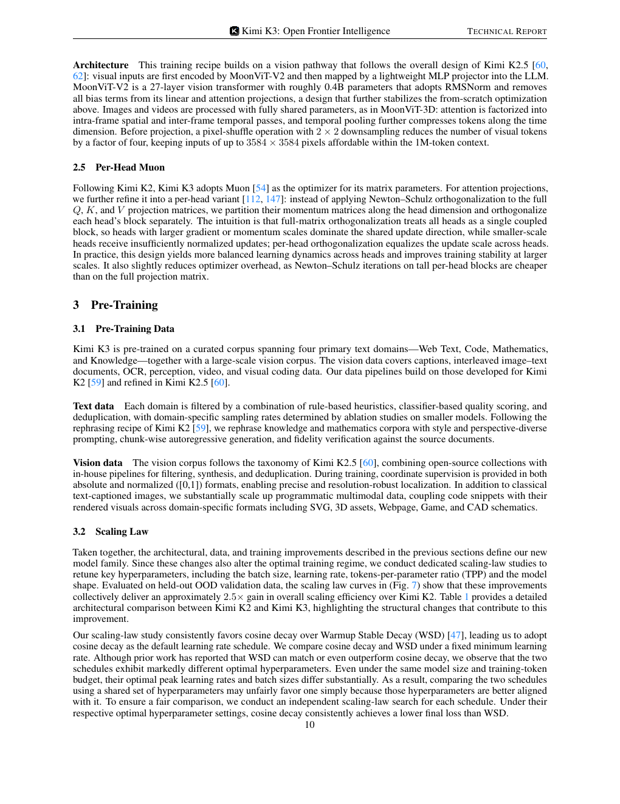

### 3.3 训练配方

K3 从训练开始就交错图文词元，使用统一的下一词元预测目标，而不是先训练语言模型再做视觉对齐。优化器采用 Per-Head Muon 和 K2 的权重裁剪，MoE 负载均衡使用 QB；学习率使用带 1% 线性热身的余弦日程，权重衰减固定为 0.1。训练先使用 8K 上下文，再在后续阶段扩展到 64K。

### 3.4 长上下文扩展

K3 不使用显式位置嵌入，KDA 的递归门控和衰减隐式编码位置，因此可以直接外推到 1M，不需要 RoPE 缩放或插值。长文档和视频经过精确及模糊去重、视频帧感知哈希、质量分类和结构验证；真正连贯的长样本会被上采样。团队还合成把子任务分散在百万词元上下文中的多模态文档，迫使模型关注远距离信息而非退化成局部模式。

上下文采用四阶段渐进扩展：预训练阶段从 8K 到 64K，冷却阶段从 256K 到 1M。只有训练预算的一小部分承担昂贵长序列计算，模型仍能逐步适应超长依赖。

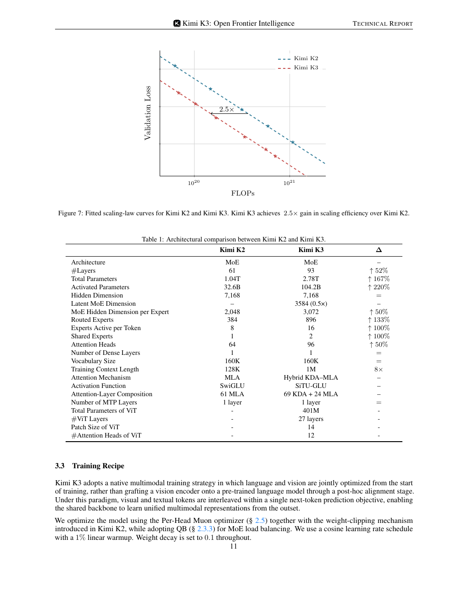

## 4 后训练

### 4.1 方法

后训练分三阶段：SFT 建立智能体冷启动策略；RL 在不同领域和推理投入上训练专门专家；MOPD 把这些策略合并为统一模型。

#### 4.1.1 监督微调

SFT 从 K2 系列模型合成复杂智能体轨迹，经过多阶段验证和人在回路标注，数据统一序列化为 XTML 聊天模板。数据覆盖自适应推理、精确工具调用和长时程执行；从 SFT 开始还执行量化感知训练，使用 MXFP4 权重和 MXFP8 激活。

#### 4.1.2 强化学习

RL 分为三大域，每个域在 low、high、max 三个投入等级各训练一个专家，共九个专家：

- **通用任务。** 通用经验、视觉、推理、忠实度、搜索和知识工作。
- **通用智能体。** 长时程助手、深度研究和段落级写作。
- **代码智能体。** 软件工程、编码经验、内核任务和网页开发。

随着 RL FLOPs 增加，知识、推理、视觉、通用智能体和代码能力共同上升，平均工具步数也随之增加。

长尾轨迹采用部分 rollout：每轮为 $N$ 个提示采样 $K$ 个完成，当完成比例达到 $\lambda$ 就先开始策略更新，暂停轨迹排入下一轮优先恢复。一个长时程轨迹可能跨多个迭代，算法通过每词元正则化容忍极端离策略数据。

推理投入由问题级预算控制。冷启动模型估计初始预算 $b_0(x)$，超出 $\tau b_0(x)$ 的轨迹奖励改为 -1；先训练较大预算的 max 专家，再把 $\tau$ 退火到 high 和 low。非可验证任务使用 Agentic GRM，裁判必须先读结果、生成评分量规、逐项评分并记录分数；输出长度超过冷启动冗长度乘数的候选会在二元比较中自动落败，以抑制奖励投机式冗长。

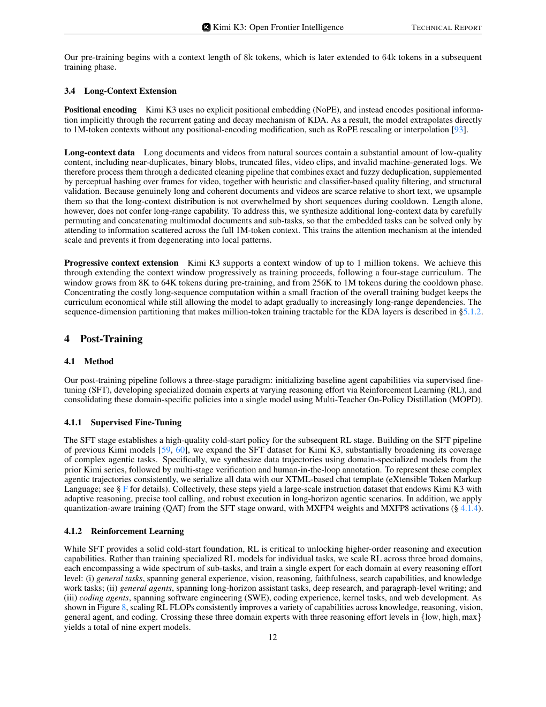

#### 4.1.3 多教师在策略蒸馏

MOPD 按领域和推理投入选择对应教师，在学生每个词元上提供密集的对数概率奖励：

$$
r_{OPD}^{d}(y_t\mid e,x,y_{<t})=\mathrm{clip}\left(\mathrm{sg}\log\frac{\pi_{teacher}^{(d,e)}(y_t\mid x,y_{<t})}{\pi_\theta(y_t\mid e,x,y_{<t})},-R_{max},R_{max}\right).
$$

裁剪极端优势信号可以稳定训练，且天然兼容部分 rollout。更细粒度的 top-k 蒸馏在该设置下没有带来明确收益。

#### 4.1.4 面向部署的后训练

MoE 专家权重占模型内存大头，K3 将其量化为 MXFP4，激活使用 MXFP8，注意力投影、latent 投影、共享专家和路由器保持更高精度。SFT 与 RL 全程使用 QAT，使 rollout 和训练采用相同量化方案，消除训练-推理不匹配。

预训练的 MTP 层被微调成 EAGLE-3 草稿模型。草稿输入融合第 1、4 个和最后一个 AttnRes 块的低、中、高层特征，目标模型冻结，只更新草稿层和融合投影。训练时展开七步，直接优化无损投机采样的接受率负对数，而不是只优化 KL 代理损失。

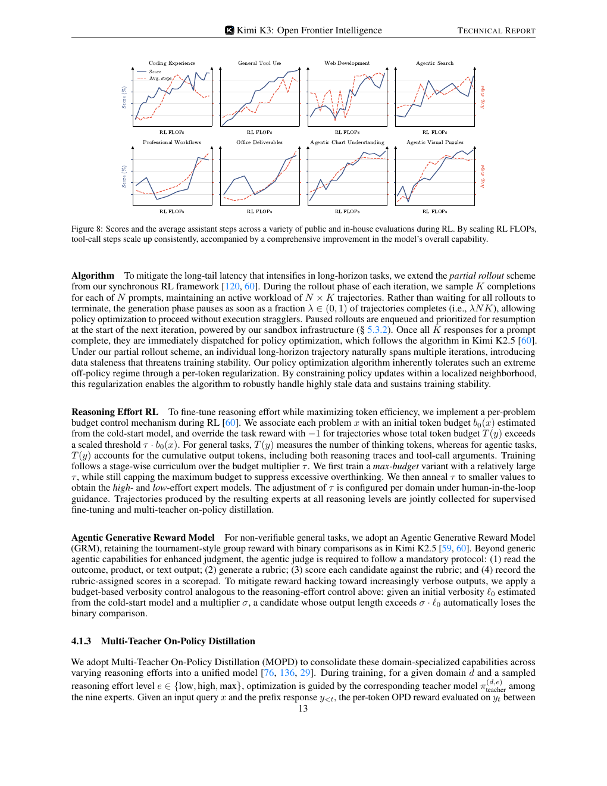

### 4.2 RL 任务合成与智能体环境

#### 4.2.1 统一白盒 RL 环境

固定单一智能体 harness 容易让模型过拟合某套工具 schema、系统提示和上下文管理。K3 把 harness 表达为可组合模块，包括工具接口、系统提示、上下文策略、技能、记忆和子智能体，通过配置可实例化 Kimi Code、Claude Code、Codex、OpenClaw、Hermes 或全新 harness。不同任务组可以使用不同模块组合，训练出的能力跨脚手架泛化。

#### 4.2.2 知识图谱引导的任务合成

任务质量和多样性取决于来源材料。K3 构建自演化分层知识图谱，智能体在网页级探索中持续扩展节点。粗粒度种子节点被分派给智能体，智能体搜索概念、检查已有节点、复用等价概念，边始终从粗到细；当概念足够原子化时停止扩展。

系统从不同粒度节点或相关节点组合采样关键词，并把祖先上下文加入检索查询。检索到的学术文章、博客和代码仓库交给合成智能体，按代码、知识、视觉等任务类型生成训练实例。

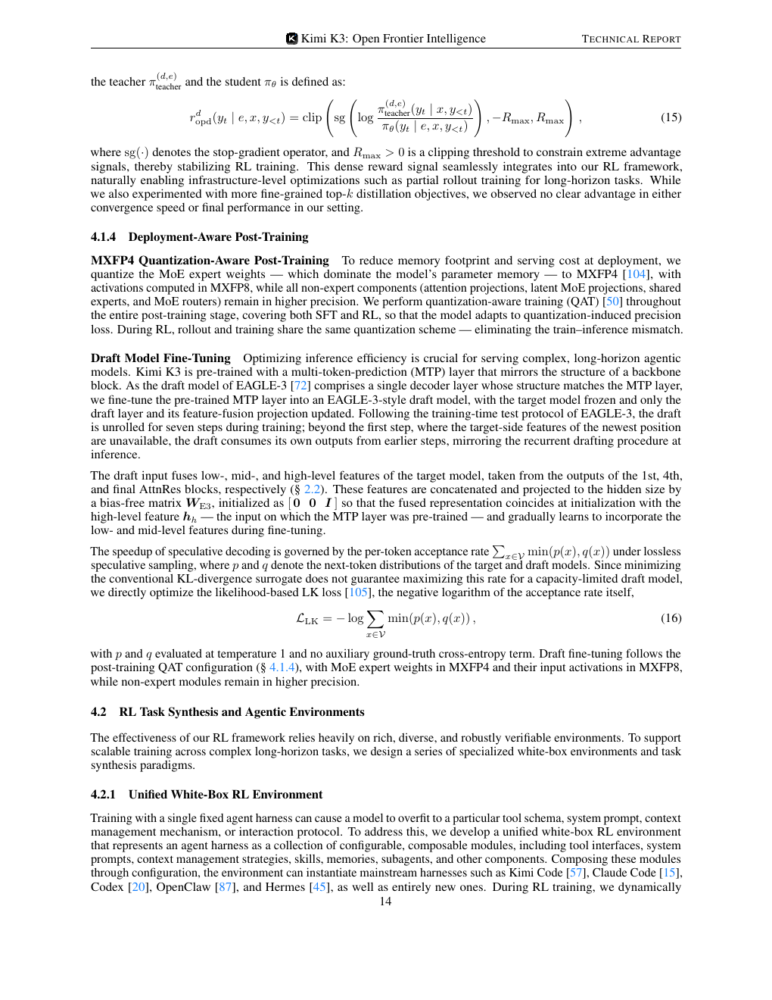

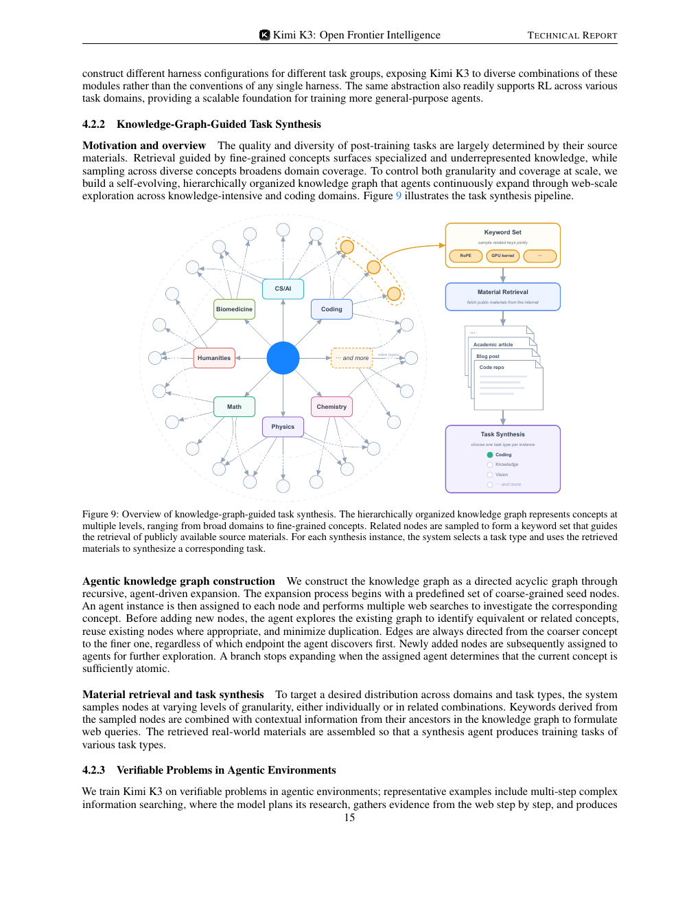

#### 4.2.3 智能体环境中的可验证问题

训练任务包括多步复杂信息检索、投资银行和法律等专业工作，以及 STEM、视觉谜题和图表理解。视觉轨迹在隔离 Python 沙箱中生成，模型反复裁剪、放大、变换图像和执行计算，把代码输出与生成图片作为新观察，逐步提高复杂视觉推理能力。

#### 4.2.4 内核优化任务

内核任务覆盖单算子到融合 mega-kernel，来源包括高质量 GPU 仓库，编程方式覆盖 CUDA、Triton、CuTe DSL、Gluon、ThunderKittens 和 TileLang，硬件与格式覆盖 BF16、FP8、FP4。奖励同时考察正确性与性能：先与 PyTorch 参考实现比较数值误差，再以专家实现和硬件 roofline 衡量速度，并持续加入 CUDA graph 重放、输入缓存、降精度等反投机检测。

#### 4.2.5 个人助手任务

团队实现 Gmail、Notion、Slack、Canvas 等真实应用的可复现 mock，保留核心语义但不依赖外部 API。人力资源、法律和金融工作流在持续演化的环境中跨多个模拟日推进，事件分布在多个应用之间，一次 rollout 可包含数千次工具调用和数百万上下文词元。每个事件由规则或 LLM 评估器单独评分。

#### 4.2.6 自主执行任务

AET 环境只给初始状态、受约束目标、工具动作空间、执行预算和独立验证器，不提供参考轨迹或预设步骤。模型必须自主拆解、选工具、规划、恢复错误和终止；奖励依据最终环境状态而不是自报完成。黑盒系统复现、定量因子发现和税务审计都使用这一范式，并通过公开诊断验证器、隐藏验证器和提交次数惩罚减少奖励投机。

#### 4.2.7 网页开发任务

任务从一句场景描述到多段规格不等，产物包括网站、互动游戏、3D/WebGL、数据可视化、SVG 和全栈应用。每项任务在容器沙箱中运行，使用多种智能体脚手架；奖励结合确定性行为检查和内部模型评审，检查构建失败、运行错误或伪造产物时奖励归零。

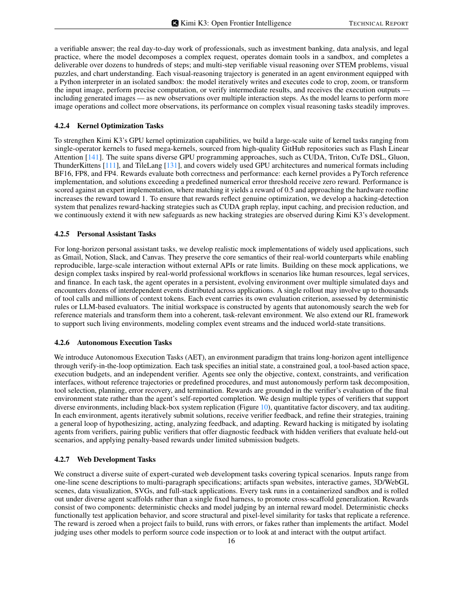

图 10 展示黑盒“相机维修管理系统复现”：模型只能通过 oracle 查询逐步重建隐藏的 3D 相机维修系统并做成网页应用。K3 的完成曲线在归一化工具调用进度上达到 1.000，超过 Opus 4.8、GPT-5.5 和 Kimi K2.6。

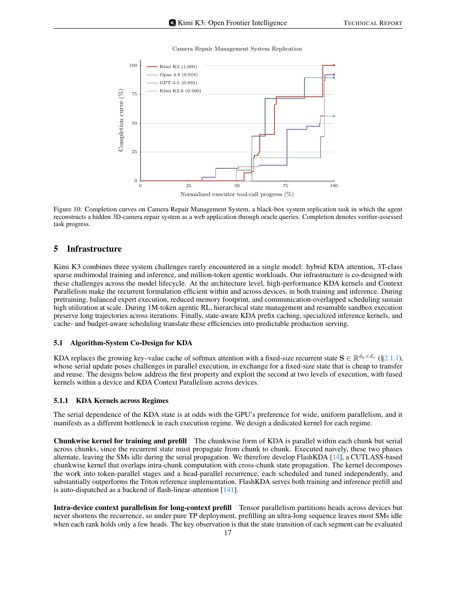

## 5 基础设施

K3 同时面对混合 KDA 注意力、3T 级稀疏多模态训练和百万词元智能体工作负载。基础设施围绕模型全生命周期协同设计：KDA 内核和上下文并行负责序列混合，平衡专家执行和通信重叠支撑预训练，分层状态与可恢复沙箱支撑长轨迹 RL，KDA 感知缓存、专用内核和成本感知调度支撑部署。

### 5.1 KDA 算法-系统协同设计

#### 5.1.1 不同执行阶段的 KDA 内核

训练和 prefill 使用 FlashKDA：把块内 token 并行与块间状态递归重叠，并分别调度 token 维和 head 维工作。超长 prefill 时，自动的设备内上下文并行把序列分段，先并行求每段转移，再精确合并状态，避免纯张量并行下多数 SM 空闲。解码阶段则需要专门处理原地更新的递归状态。

#### 5.1.2 KDA 上下文并行

普通线性注意力可以把各 rank 从零状态生成的局部状态直接相加，但 KDA 的每个输入会先用 token 相关矩阵作用于传入状态，局部段的影响依赖前段状态。KCP 因此为每段计算两个量：从零状态生成的局部状态，以及作用于传入状态的累计转移。各 rank 通过一次 all-gather 交换两者，再用前缀扫描恢复每段准确初始状态，通信尺寸固定，计算随序列线性扩展。

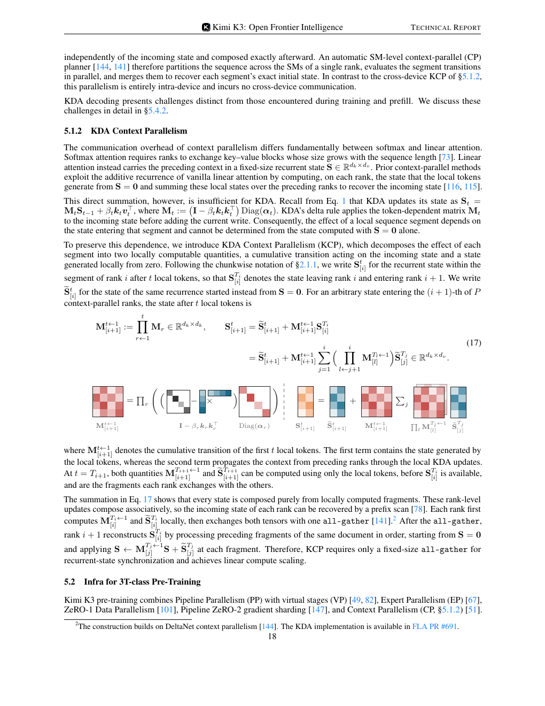

### 5.2 3T 级预训练基础设施

K3 结合流水线并行、虚拟阶段、专家并行、ZeRO-1 数据并行、Pipeline ZeRO-2 梯度分片和上下文并行。MoE dispatch/combine 的 all-to-all 与计算重叠。3T 级多模态训练的三大问题是专家 rank 负载不均、激活与优化器状态超出显存、视觉编码器计算暴露在流水线关键路径。

#### 5.2.1 完全均衡的专家并行训练

MoonEP 使用动态冗余专家和在线规划，让每个 rank 恰好接收 $S\times K$ 个词元，因此计算形状静态、无需逐层主机同步。证明表明，每个 rank 至多需要 $E/R$ 个冗余专家，且该上界基本紧。GPU 规划内核接近整数线性规划最优解；融合的 permute/unpermute 让词元直接写入目标专家位置，通信缓冲固定为 $S\times K$，无需中间复制。

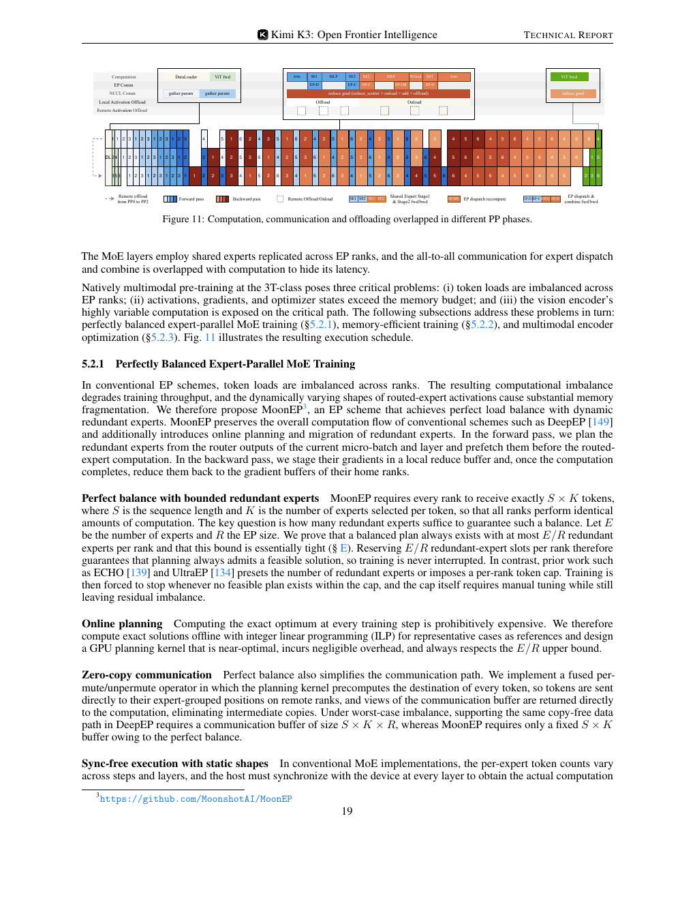

专家内部仍可能有负载偏斜，因此 GEMM 调度器根据当前 token 分布和硬件成本模型选择参数，并把共享专家放到独立流与其他内核重叠。

#### 5.2.2 记忆高效训练

统一激活管理器把重算、量化、卸载和远程卸载都抽象为张量级存储策略，大多数激活使用分块 FP8 加卸载，逐元素算子使用重算。MoE 反向通过代数变换消除对前向输出的依赖，并在反向重算 dispatch；Block AttnRes 只保存边界块表示；流水线 rank 之间远程卸载激活以平衡显存；Pipeline ZeRO-2 把梯度分片存入 CPU。Muon 正交化改为 P2P 只取本 rank 所属参数分片，避免全量 all-gather。

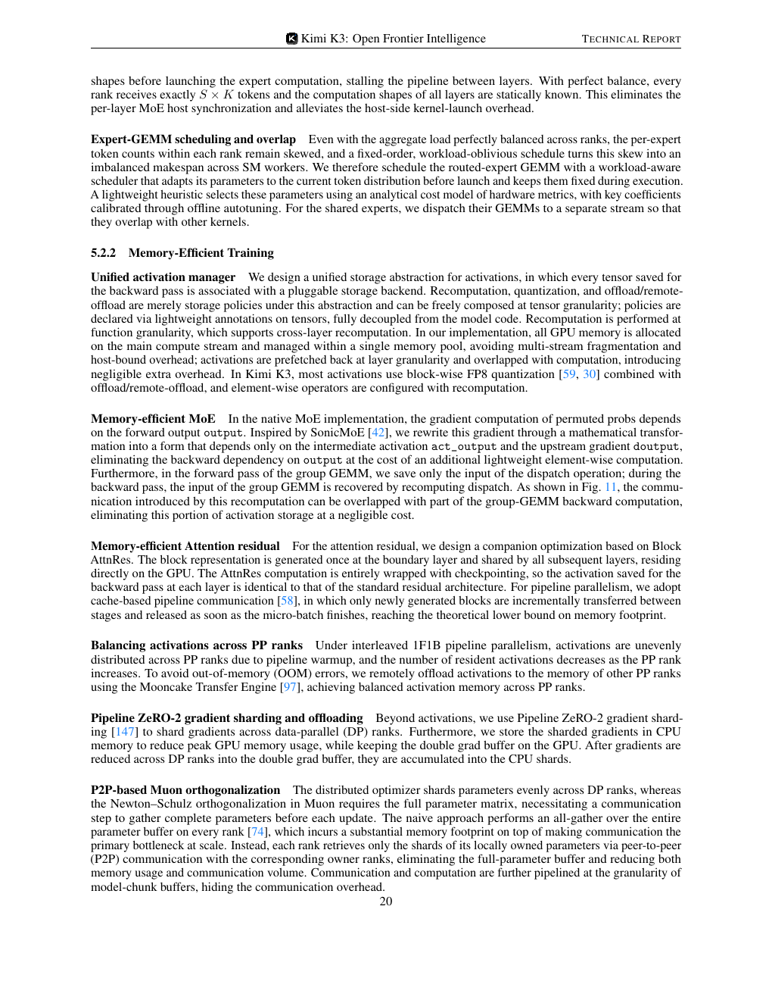

#### 5.2.3 多模态编码器优化

大图和长视频沿补丁维跨多个设备，CP rank 内再分成子组分配不同图像以均衡负载。沿用 DEP 的思路，视觉前向和反向分别把部分工作放入流水线气泡，大多数视觉计算被隐藏，基本消除编码器的有效额外开销。

### 5.3 百万词元智能体 RL

#### 5.3.1 长上下文 RL 基础设施

RL 训练与推理共置在几百张 GPU 内，采用部分 rollout 降低超长轨迹尾延迟。百万上下文需要大量 KV cache，K3 使用外部 CPU DRAM KV 池：GPU 驱动中的活跃块留在 GPU，被驱逐的可复用前缀写回 CPU，下一次复用前预取；KDA 状态与 MLA KV 块同步转移。训练迭代结束后把权重和优化器状态卸载到 NVMe，为 rollout 释放 DRAM。

自动节流调度器依据活跃请求、排队数量和 KV 使用率动态调整并发，早期保持饱和，后期缓存压力上升时降低并发。参考模型前向复用策略模型的 FP32 梯度缓冲，两块缓冲交替流式预取，不额外分配大块显存。

#### 5.3.2 沙箱基础设施

AgentENV 是面向智能体的 microVM 沙箱，使用 Firecracker 提供比容器更接近真实系统的隔离与自由度。它支持增量检查点和恢复，延迟最低约 133ms 与 49ms；暂停中的沙箱不占 CPU 和内存，Fork 可从精确状态创建副本供无副作用评审，Snapshot 用于错误恢复。OverlayBD、定制 ublk、存储共享、P2P 传输、写时复制和页缓存优化使数万沙箱可在秒级创建，实际内存超额使用比例最高 6.5 倍。训练和评测期间共创建 51,219,741 个沙箱，使用 1,505,678 个镜像。

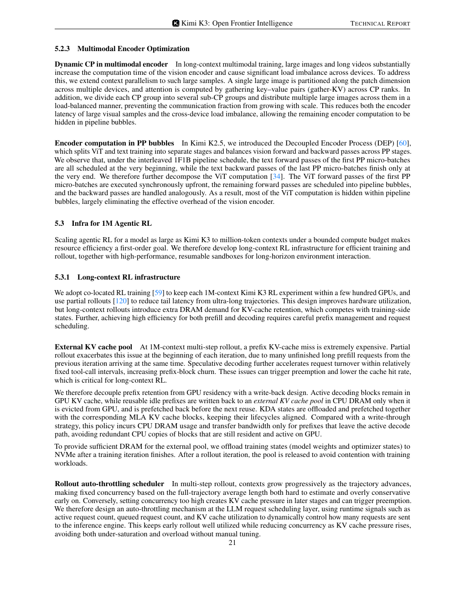

### 5.4 推理与在线服务

#### 5.4.1 KDA 感知的前缀缓存

KDA 状态是每个请求固定大小的递归状态，MLA KV cache 则按词元增长。K3 把两类缓存打包到同一页池，用统一分配、引用计数和淘汰逻辑。物理页可以很大，但前缀哈希在页内使用细粒度 hash block；KDA 只在稀疏的 hash 边界保存检查点。命中时，MLA 复用完整块或页内部分块，KDA 要求所有 KDA 组在同一边界都有检查点，最终命中边界不必对齐物理页。

并发调度中，所有缓存组共享空闲链表，因此命中块先跨组固定；当前调度步刚分配的块在 GPU 拷贝落地前不参与匹配；任一 KDA 组缺少检查点时，所有同伴检查点一起失效。这样百万词元前缀可以在任意 512 词元边界复用。

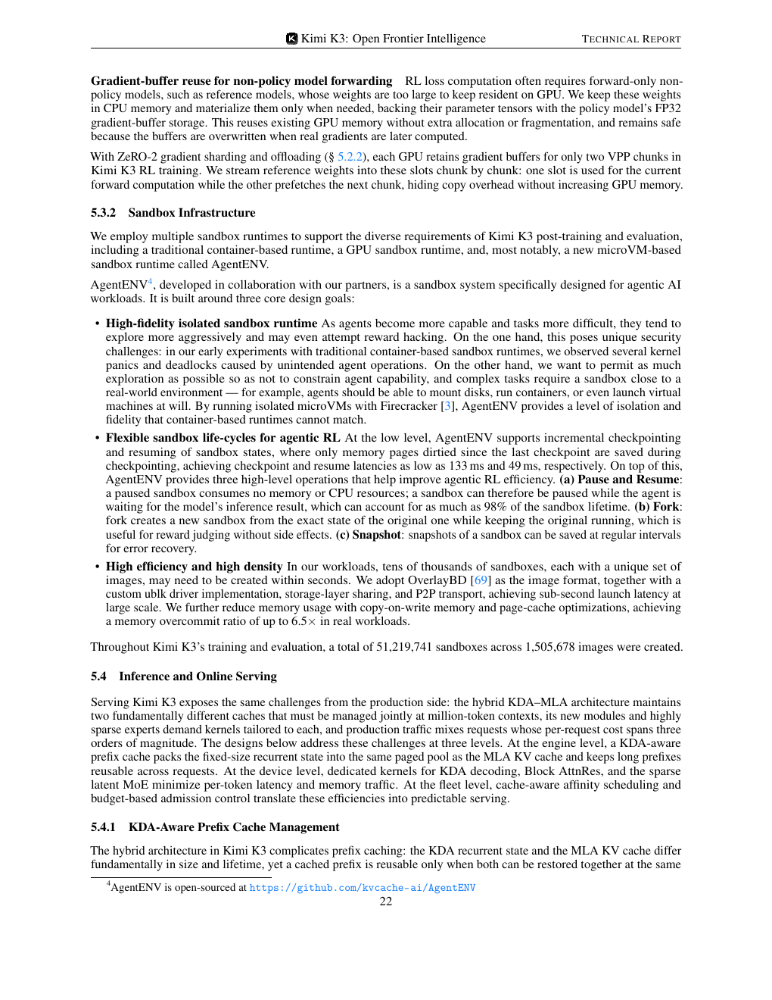

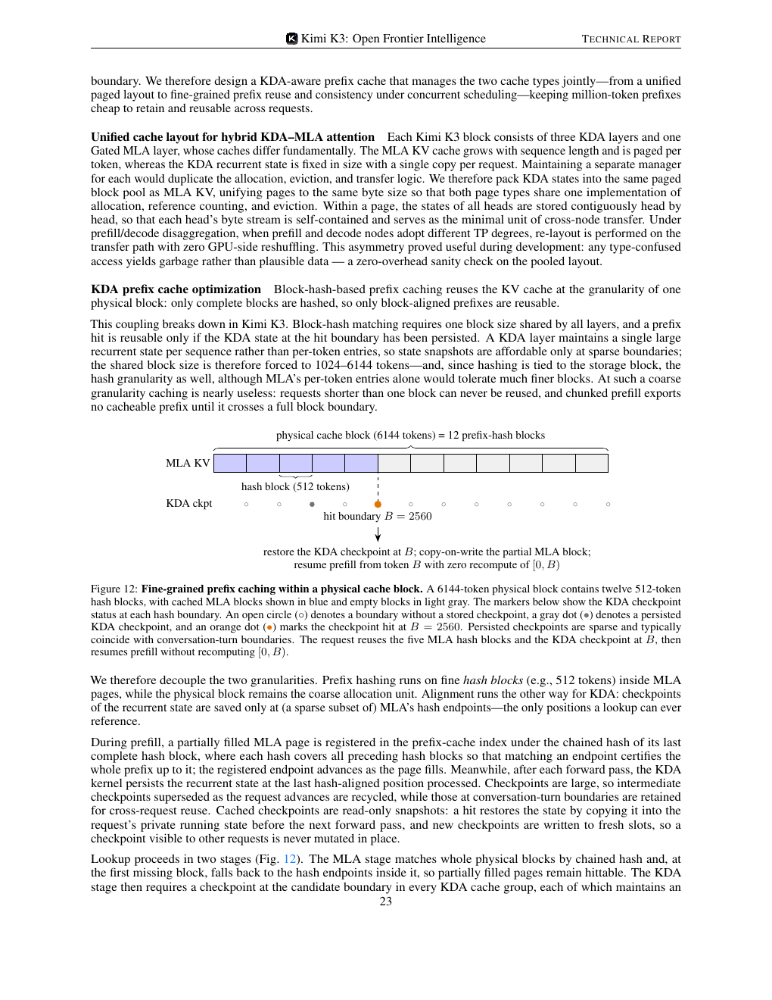

#### 5.4.2 高性能内核

KDA 解码在推测采样拒绝部分草稿词元时无法简单回滚原地状态。K3 只缓存草稿词元的投影输入，在芯片上重建已接受前缀状态，并把验证词元和 bonus 词元写回；短卷积、归一化、门控、递归和输出归一化融合为一个内核，验证延迟随接受词元数次线性增长。

Block AttnRes 的 prefill 使用序列并行，让每个 rank 只物化自己负责的块表示；解码把跨块内核放在旁路流，并把块内合并、部分和更新及 RMSNorm 融合进张量并行归约。Stable LatentMoE 把 latent 下投影与路由器融合，把 latent 权重分片并在 GEMM epilogue 中 all-gather；小批量路由专家采用 token-centric WarpDecode，并离线重排权重降低解量化开销。

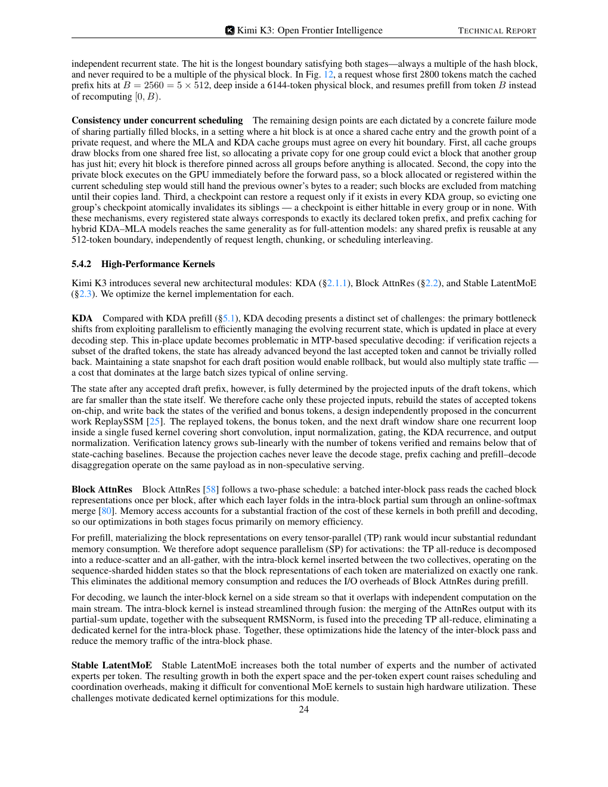

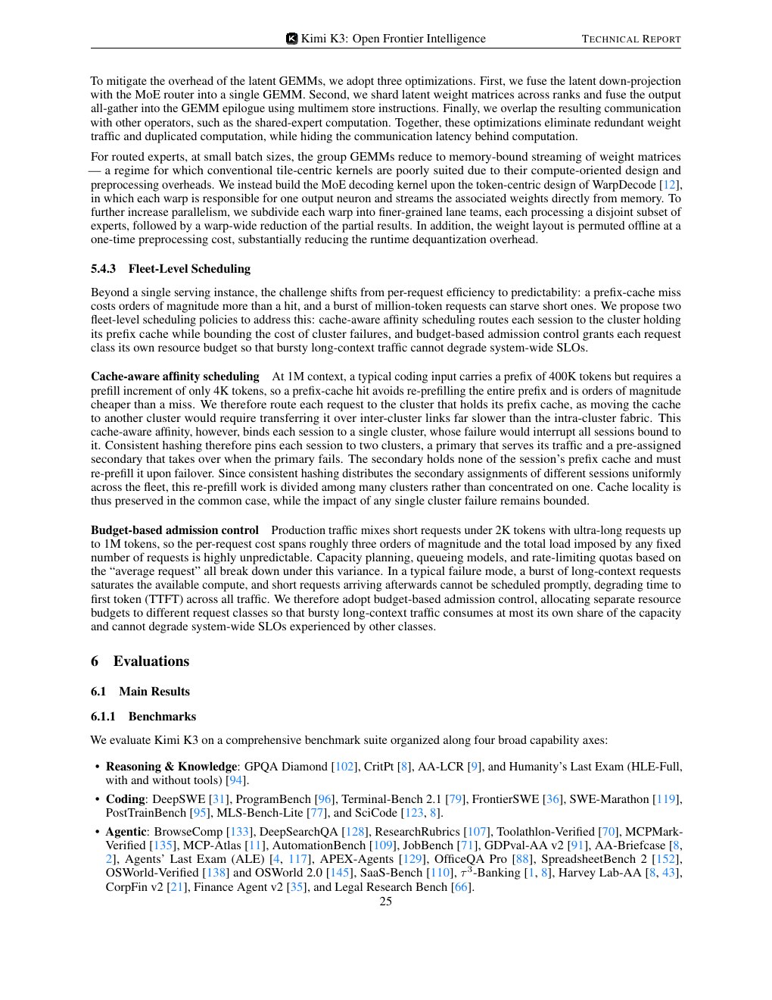

#### 5.4.3 Fleet 级调度

百万上下文下，缓存命中和未命中的成本相差数量级，长请求突发还可能饿死短请求。缓存感知亲和调度把会话路由到持有其前缀的集群，并用一致性哈希预先绑定主、备两个集群；主集群失败时备集群接管，但需要重新 prefill。基于预算的准入控制为不同请求类别设置资源预算，使长上下文突发不会拖垮全局 SLO。

## 6 评测

### 6.1 主要结果

#### 6.1.1 基准

评测覆盖推理和知识、代码、智能体、视觉、视频和计算机操作。代码包括 DeepSWE、ProgramBench、Terminal-Bench 2.1、FrontierSWE、SWE-Marathon、PostTrainBench 与 SciCode；智能体包括 BrowseComp、DeepSearchQA、ResearchRubrics、GDPval-AA v2、Toolathlon、MCPMark、AutomationBench、JobBench、OfficeQA Pro 等；视觉包括 WorldVQA、OmniDocBench、PerceptionBench、Video-MME、MMVU、BabyVision、MMMU-Pro、CharXiv、Math-Vision 和 ZeroBench。

#### 6.1.2 对比模型

对比包括 Claude Fable 5、GPT-5.6 Sol、Claude Opus 4.8、GPT-5.5 和开源 GLM-5.2。除 GPT-5.5 使用 xhigh 外，其余均使用 max 推理投入；Fable 5 分数允许 fallback，GPT-5.6 Sol 分数包含潜在 cyberguard。

#### 6.1.3 评测配置

K3 默认 max 投入、温度 1.0；单步任务 top-p 0.95，智能体任务 top-p 1.0。代码任务使用 Kimi Code、Claude Code 或 Codex harness；BrowseComp 在 300K 词元触发上下文压缩，但报告的 K3 结果使用完整 1M 窗口。视觉分数通常取三次平均，ZeroBench-main 取五次；第三方分数按各排行榜截至 2026 年 7 月下旬的公开结果。

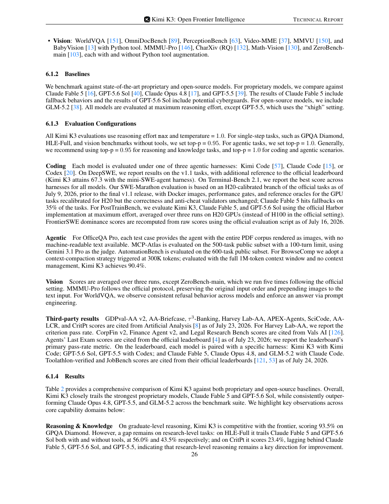

#### 6.1.4 结果

推理与知识方面，GPQA Diamond 为 93.5；HLE-Full 无工具和有工具分别为 43.5 与 56.0，研究级推理仍落后于最强闭源模型。代码方面，ProgramBench 为 77.8，Terminal-Bench 2.1 为 88.3，SWE-Marathon 为 42.0，FrontierSWE 为 81.2。

智能体方面，BrowseComp 为 91.2，DeepSearchQA F1 为 95.0，ResearchRubrics 为 76.2，MCPMark-Verified 为 94.5，AutomationBench 为 30.8，SpreadsheetBench 2 为 34.8。GDPval-AA v2 Elo 为 1686，Agent Arena 等知识工作项目仍有差距。

视觉方面，OmniDocBench 为 91.1，WorldVQA ForceAnswer 为 51.0，Video-MME 为 90.0，MMVU 为 82.1。Math-Vision 从无工具的 94.3 提升到 Python 工具的 97.8，ZeroBench-main pass@5 从 23.0 提升到 41.0。

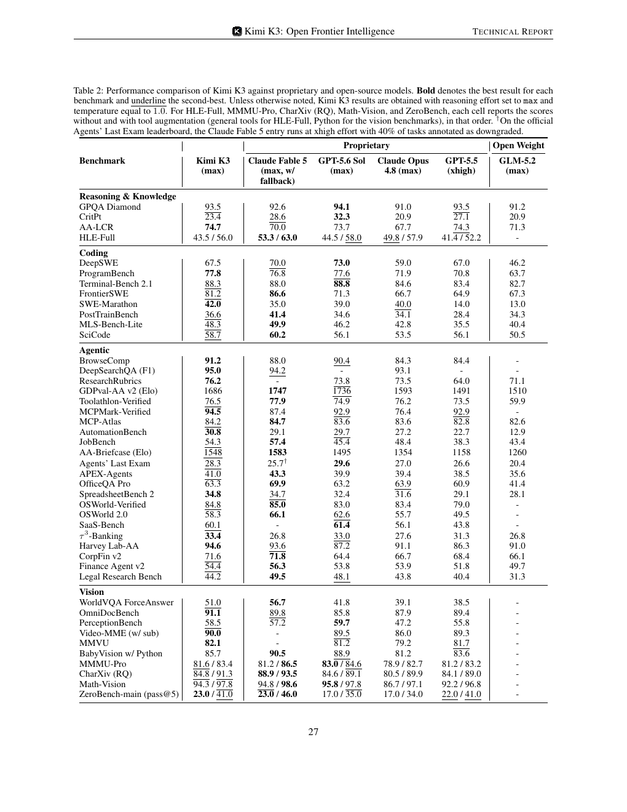

代码结果显示 K3 在 ProgramBench 取得最佳分数，在 GPU 内核导向的 SWE-Marathon 上领先 Fable 5 七个百分点，并在 Terminal-Bench 2.1 几乎追平 GPT-5.6 Sol。智能体结果在多项搜索、工具和自动化基准上达到 SOTA；知识工作 Elo 项目主要由 Fable 5 领先。视觉工具能显著放大复杂图表、数学和 ZeroBench 的表现。

### 6.2 内部评测

#### 6.2.1 能力评测

内部套件分为代码能力与经验、通用智能体经验、对话经验三类。Kimi Code Bench 2.0 测端到端软件工程，Kimi Webdev Bench 用盲评比较代码质量、功能完整性、视觉保真与交互体验；24/7 ClawBench 模拟持续助手，MIRA 测企业多角色协作，KAET 测自主执行，CLIF 测上下文学习，Agentic Vision 测是否注意并使用关键视觉事实，Swarm Bench 测并行分解，Online Experience 测真实在线交付文件。

Deep Research、Finance、Knowledge Work Vision、DECK 和 Agent Behavior Bench 分别覆盖研究、金融工作、知识工作视觉原子能力、演示文稿生成与工具行为质量。

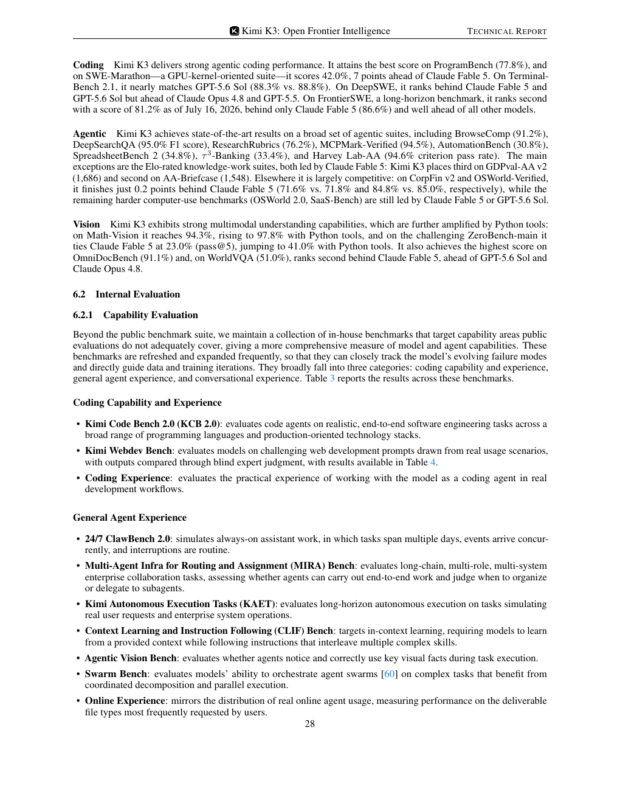

表 3 中，K3 在 Swarm Bench 为 76.3、Deep Research Bench 为 90.0，研究和编排是最明显优势；Kimi Webdev Bench 盲评相对 Claude Opus 4.8 的总体 Win-Lose 为 +31.0，3D/WebGL/Shader 领域为 +59.1。主要短板是 Agent Behavior、MIRA、24/7 ClawBench、Agentic Vision 和 KWV；其余已填充项目多为第一或接近第二。

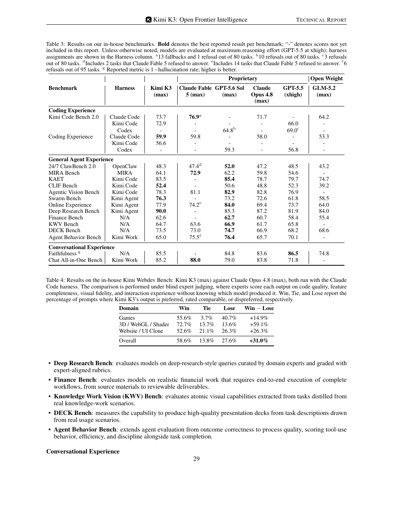

#### 6.2.2 网络安全评测

安全能力分两级：Tier 1 是漏洞发现与概念验证，Tier 2 是端到端漏洞利用。Tier 1 覆盖内核、数据库、AI 服务、网页框架、区块链和 VPN 等数十个系统，人工复核的发现约 70% 被确认，包含六个项目中的 16 个此前未知漏洞。示例包括可远程触发的堆越界写，以及 RDMA 子系统中可导致本地提权的 Dirty-COW 类漏洞。

Tier 2 使用 36 个任务，包含 PostgreSQL、XWiki、Apache HTTP Server、内容管理系统和 Linux 内核。K3 完成 14/36（38.9%），对比 GLM-5.2 的 8/36（22.2%）；其中 10 个来自用户态。失败主要发生在漏洞链最后阶段、缓解措施下的策略选择、无效调试循环和提交前验证不足。该结果仍明显低于人类专家，结论被 UK AI Security Institute 与 NIST CAISI 的独立评测部分印证。

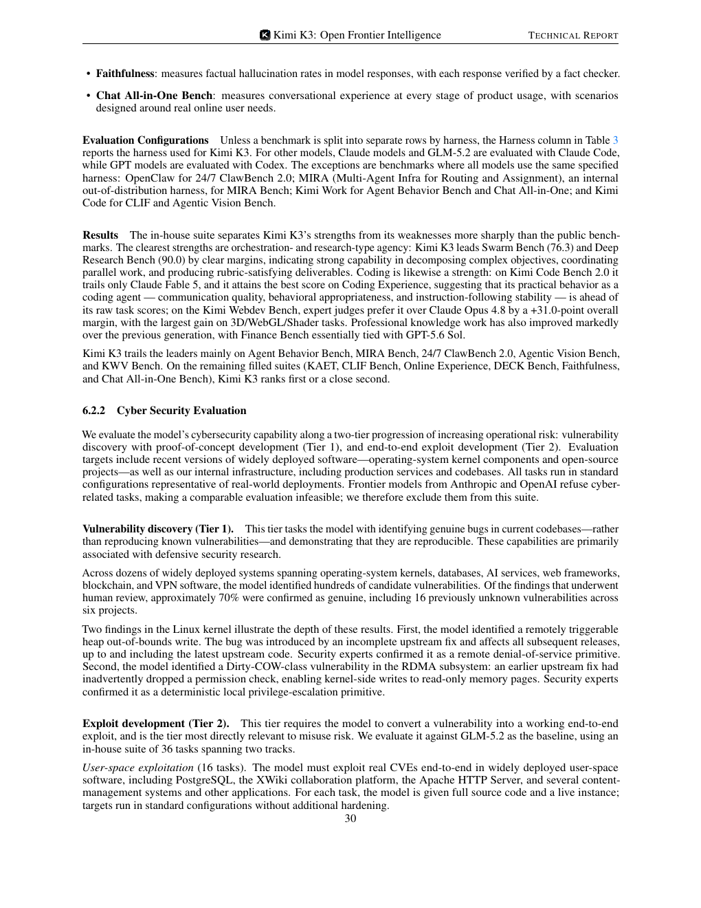

### 6.3 第三方评测

截至 2026 年 7 月 23 日，Artificial Analysis Intelligence Index v4.1 为 57.1，在 580 个模型中排名第 4；Vals Index 为 74.7%，39 个模型中排名第 2。WebDev Arena 以 1678 Elo 位列 99 个模型第 1，成为首个登顶该榜单的开源模型；Text Arena 为 1486 Elo，200 个模型中第 8；Agent Arena 为 9.1，37 个模型中第 4。

### 6.4 成本效率

在 Kimi Code Bench 2.0、BrowseComp、GDPval-AA v2 和 AA-Briefcase 四个套件中，K3 都位于分数-成本前沿附近。BrowseComp 得分 91.2、每任务约 2.03 美元，是 GPT-5.6 Sol 成本的一半，并比最高投入 Claude 便宜一个数量级；在 GDPval-AA v2 上，接近 GPT-5.6 Sol 的 Elo 但成本低 13%，AA-Briefcase 得分仅次于 Fable 5，成本约为其一半。

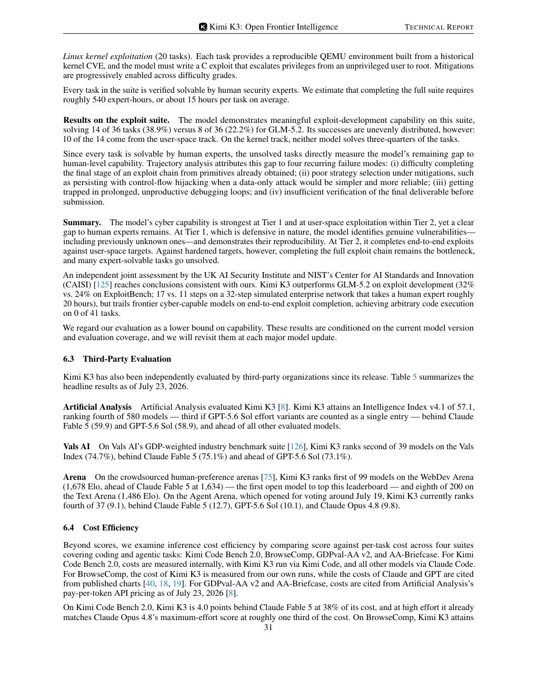

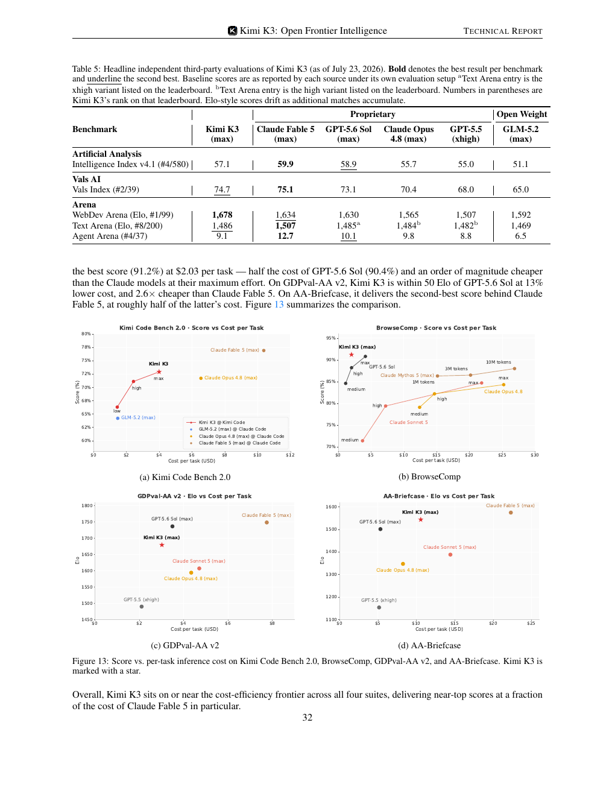

## 7 案例研究

### GPU 内核优化

模型在一致沙箱中、每任务最多 24 小时，优化 AttnRes、稀疏注意力、KDA 和 MLA 四个内核。K3 把 AttnRes 延迟从 283.6ms 降到 114.4ms，DSA 和 KDA 运行时间分别减少 55.1% 与 73.6%，MLA 达到峰值 TFLOPS 的一半以上。

### GPU 编译器开发

K3 构建 MiniTriton，一个包含 Python tile 前端、轻量 MLIR 优化层、PTX 生成、类 PyTorch 张量库、自动微分、NCCL 分布式原语、稀疏和可视化原语的紧凑编译器。在 NVIDIA L20 上，其核心基准几何平均超过 PyTorch eager 和 torch.compile；自研 Tensor Core 矩阵乘接近 cuBLAS，KDA prefill 内核超过匹配的 Triton 实现。MiniTriton 还能从头训练 GPT，损失曲线贴近 PyTorch，梯度差异不超过 FP32 舍入误差。

### 芯片设计

K3 为同架构纳米模型设计推理芯片原型，包含混合 KDA/NoPE-MLA、Block AttnRes、Sigmoid MoE 和 INT4 权重。一次 48 小时自主运行中，它用开源 EDA 工具完成设计、优化和验证；在 4mm² 面积预算内以 100MHz 收敛时序，RTL 模拟解码吞吐超过 8700 tokens/s，集成 146 万标准单元、0.277MiB SRAM 和带融合反量化的 INT4 MAC 阵列。

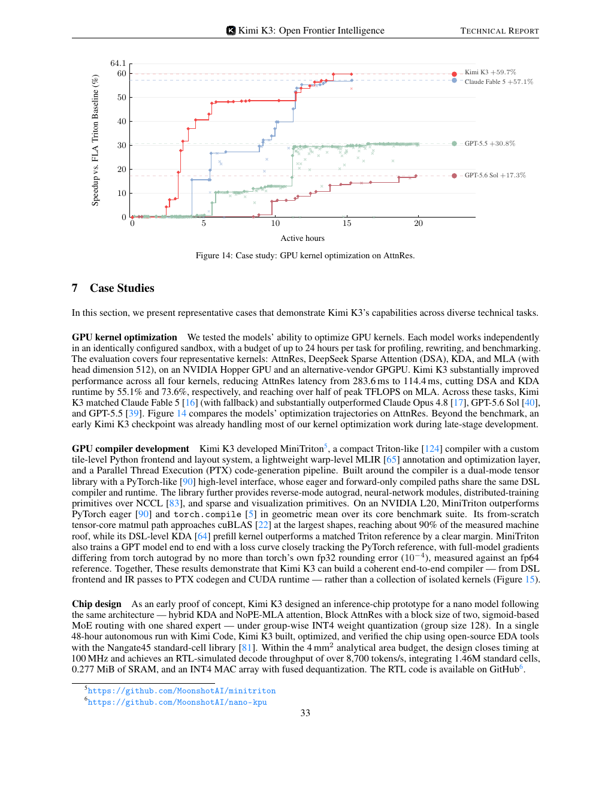

### 科研、知识工作与视频

在计算天体物理中，K3 阅读超过 20 篇论文，复核 I-Love-Q 关系，评估 300 多个状态方程，修正已发表公式中的不一致，编写超过 3000 行 Python 并生成交互式 HTML 仪表盘，约两小时完成通常需要一到两周的工作。

在 Kimi Work 中，K3 用 87 份季度报告和 99 个 PDF 构建覆盖 42 年 AI ASIC 行业的研究网站，完成 120 多轮迭代、2800 多次网页搜索和 1100 多次终端查询；另用 20 多个并发子智能体分析 GWTC-5 的 391 个引力波事件，输出七个可视化、两张汇总表和文献综合。

模型还制作 3Blue1Brown 风格的架构动效，并从 56 个源片段剪辑宣传视频，完成片段选择、动作匹配、逐帧节拍同步、音频处理和多轮修改。

## 8 结论

Kimi K3 是一个开放的 2.8T 参数 MoE，原生支持视觉和 1M 上下文，以 KDA 与 AttnRes 扩展序列和深度方向的信息流。它在长时程代码、智能体、知识、推理和视觉任务上达到前沿水平，虽然与最强闭源模型仍有差距，但建立了人人可用的开放前沿。团队希望它能推动社区的研究、部署和创新。

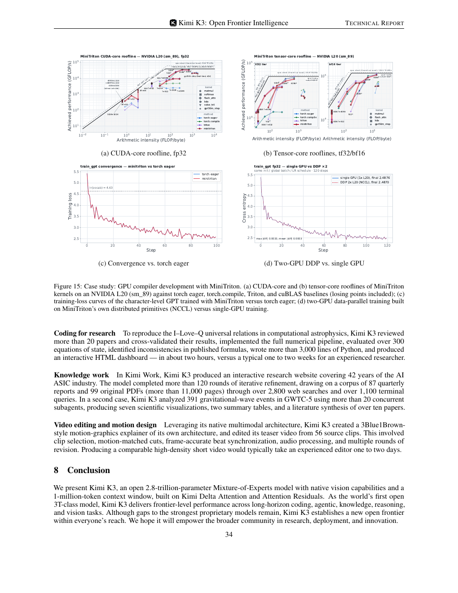

## 参考文献

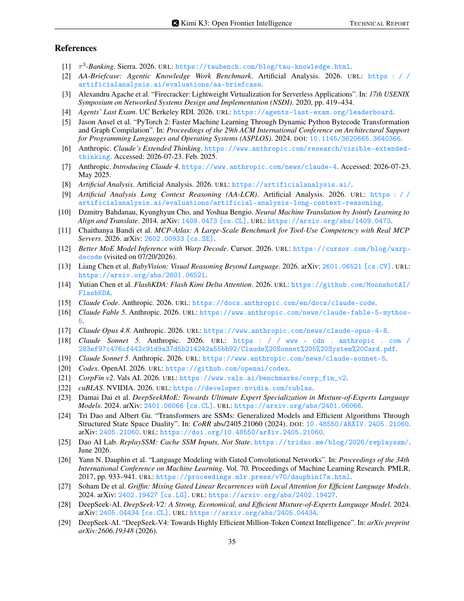

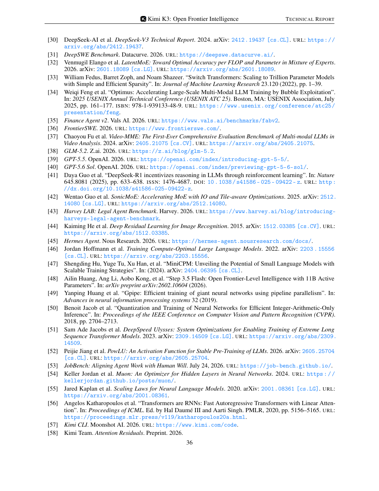

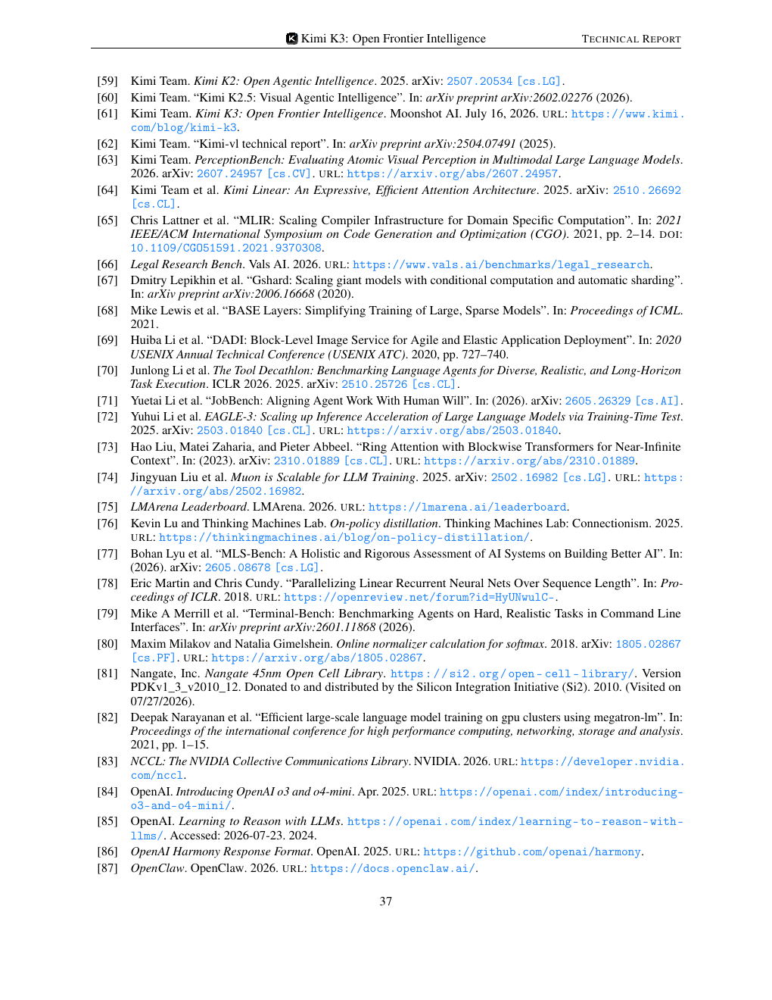

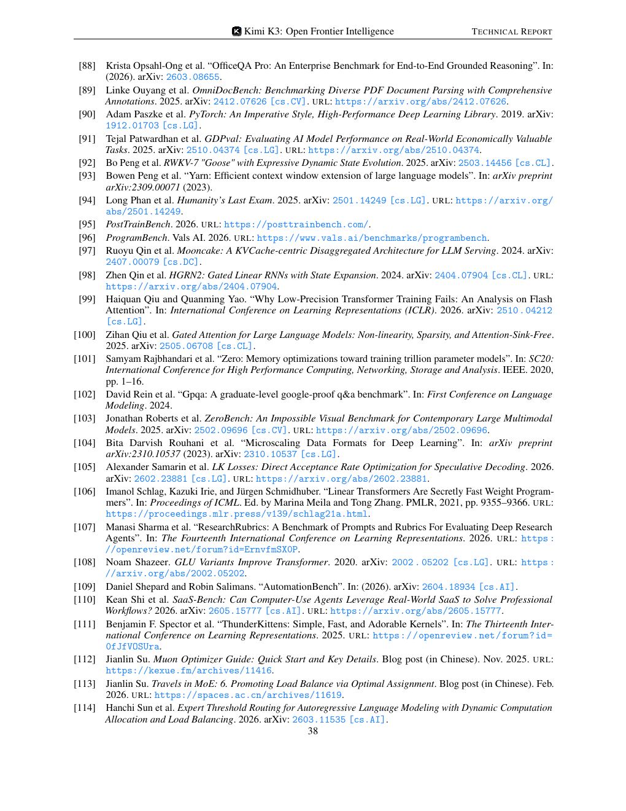

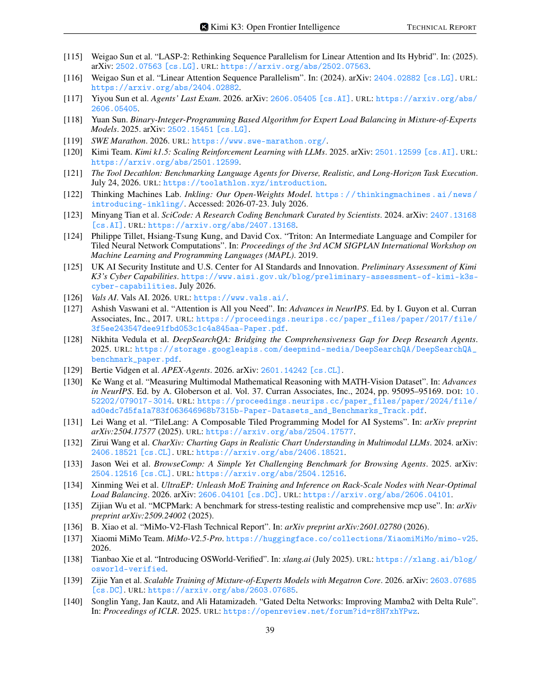

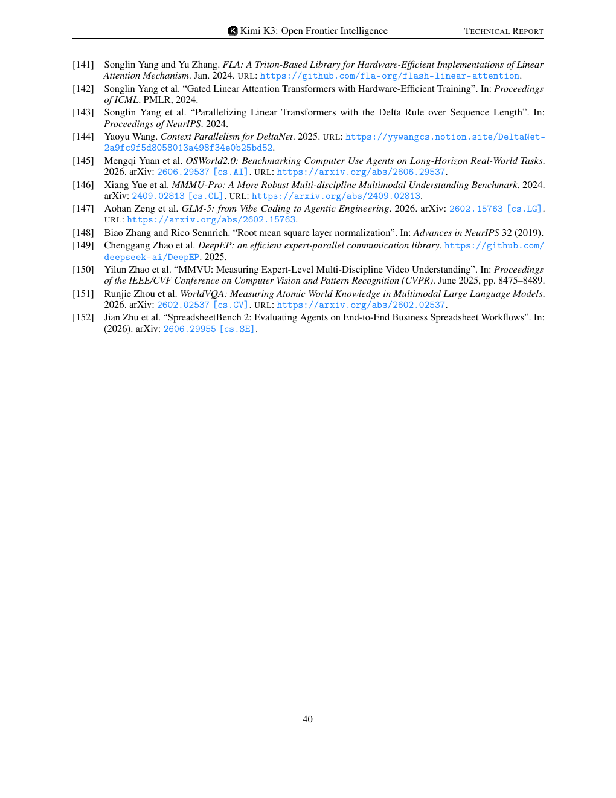

## 附录 A 贡献者

论文按姓氏字母顺序列出贡献者，完整名单保留在原页中。

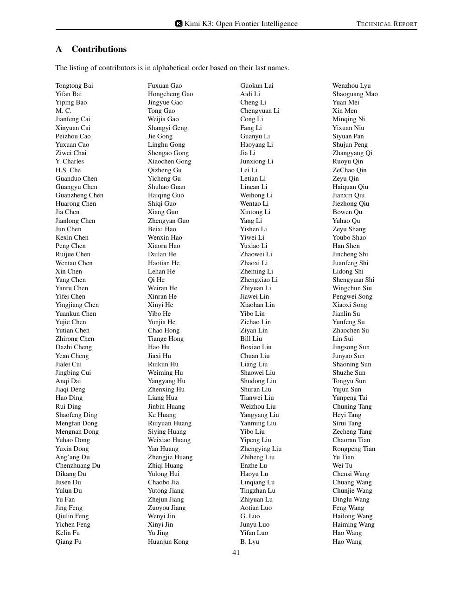

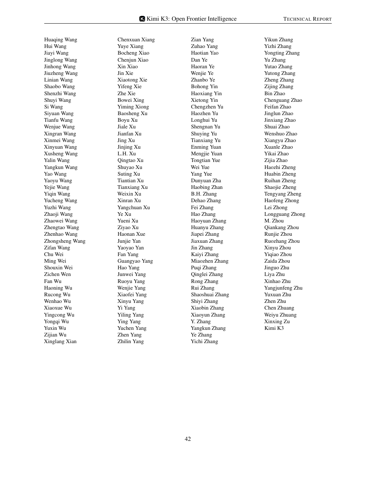

## 附录 B Sigmoid Tanh Unit GLU 细节

SiTU-GLU 的目标是在不破坏 Swish 形状的情况下限制 SwiGLU 乘积。对接近原点的标量 $z$，$\beta\tanh(z/\beta)=z+O(z^3/\beta^2)$，因此它和 SwiGLU 一阶相同；当 $\beta_1,\beta_2$ 趋于无穷时逐点恢复 SwiGLU。由于 $|\tanh|<1$ 且 Sigmoid 在 0 和 1 之间，$\beta_1=4,\beta_2=25$ 时输出无穷范数上界为 100。平滑封顶比硬截断保留更连续的非零梯度，训练更稳定。

## 附录 C 分位数均衡推导

把每词元选择 $k$ 个专家、每专家恰好接收 $mk/n$ 个词元写成最大权重平衡分配问题。将二元分配变量放宽到 [0,1] 后，二分图 b-matching 多面体的整数性保证松弛仍然精确。对词元侧和专家侧约束引入对偶变量 $\alpha_i,\beta_j$，得到可分离的凸对偶目标。

固定 $\beta$ 时，每个词元的 $\alpha_i$ 是 $s_{i,:}-\beta$ 的 $(1-k/n)$ 分位数；固定 $\alpha$ 时，每个专家的 $\beta_j$ 是 $s_{:,j}-\alpha$ 的同一分位数。交替精确更新即可得到平衡分配。部署时只需保存专家侧偏置 $\beta$ 的相反数，使用冻结 Top-k，不需要在线计算词元阈值。

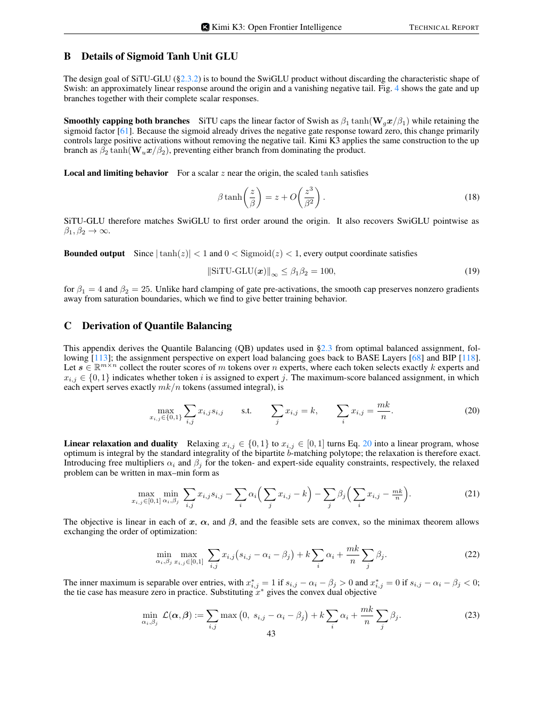

算法 1 从零偏置开始，交替按行和按列排序取分位数，直到收敛，再用 $s-\beta$ 的 Top-k 得到分配。和固定步长的无辅助损失更新相比，QB 直接跳到同一对偶目标的坐标最优点，不需要学习率式超参数，几步即可在近千专家上均衡。

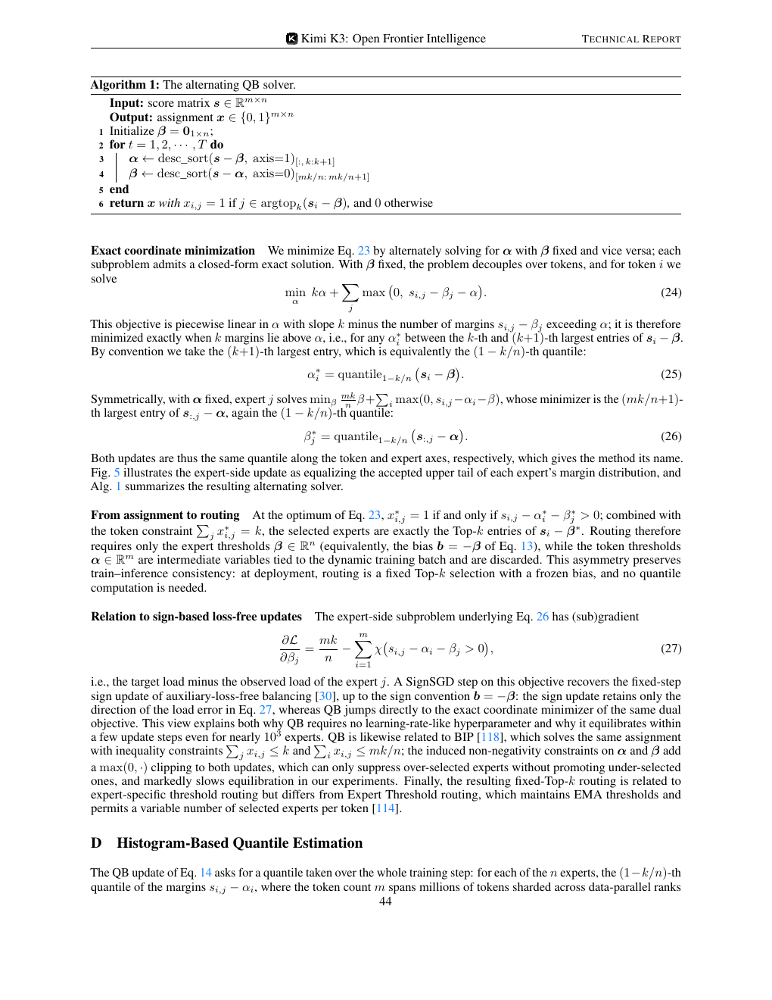

## 附录 D 基于直方图的分位数估计

精确分位数需要在训练步内收集每个专家的全部边际，通信和内存都不可接受。K3 对每个专家维护固定 bin 的边际直方图：每个 rank 在前向中本地 scatter-add，训练步末进行一次整数 all-reduce，再在全局计数中插值恢复目标分位数。

由于路由分数在 (0,1) 内、截止分数由当前偏置界定，所需偏置范围可以动态确定。使用 1000 个 bin 时，误差不超过几个 $10^{-3}$，没有可测的残余负载不均衡；通信只与专家数和 bin 数有关，低于交换原始边际的 1%。全局直方图按计数相加，得到的是合并批次的分位数，而不是各 rank 分位数的平均。

## 附录 E MoonEP 通用上界证明

令 $m_r(P)$ 表示计划 $P$ 在 rank $r$ 上放置的冗余专家数。论文证明，对任意路由输出都存在一个完美均衡计划，使每个 rank 恰好收到 $S\times K$ 个词元，每个 rank 的远程词元只来自一个其他 rank，因此每个 rank 至多需要 $E/R$ 个冗余专家：

$$
\min_P\max_r m_r(P)\leq E/R.
$$

证明通过不断把过载 rank 的词元迁移到欠载 rank，直到每个 rank 达到目标负载。该上界基本紧：构造一个 rank 完全没有本地词元、其余 rank 均分全部词元的路由输出时，至少需要 $\lceil E(R-1)/R^2\rceil$ 个冗余专家，随 $R$ 增大接近 $E/R$。

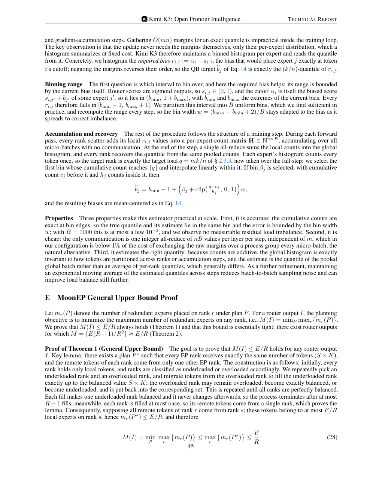

## 附录 F 聊天模板

Kimi K3 的聊天模板围绕可扩展、低对齐成本和友好解码设计。XTML 是类似 XML 的标记格式，把尖括号替换为 `[open]`、`[sep]`、`[close]` 三个特殊词元，并以 `[end_of_msg]` 作为停止标记；每个结构边界都是显式特殊词元，消除边界分词歧义，便于流式解析和语法约束解码。

上下文顶层单位是 message。全局选项消息（工具声明和 thinking-effort）放在所有输入前，以便改变请求选项时只在本来就会失效的缓存边界重建；一次性选项（tool_choice、response_format）放在输入之后，不会破坏历史 KV cache；动态加载的工具则作为中途插入的 input option message。

助手消息分为 think、response 和 tools 三个通道。思考模式和指令模式只通过生成前缀选择，前者保留 think 历史，后者只保留 response 与 tools。tools 通道中的调用带有 tool 和 index，结果重复相同标识并按调用顺序返回；字符串参数使用原始文本，其他 JSON 类型紧凑序列化，代码等自由文本无需转义成 JSON 字符串。

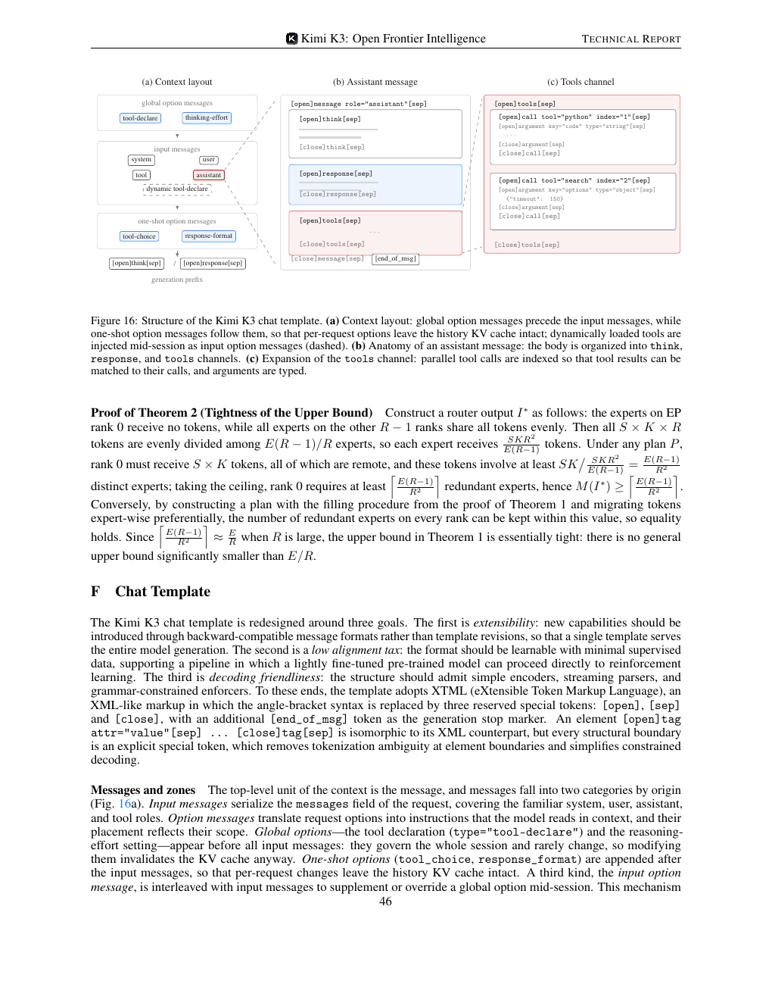

推理投入是放在工具声明之后、输入消息之前的全局选项消息，使用自然语言表达 low、medium、high、max 等等级，而不改写生成前缀或暴露词元预算。tool_choice、response_format 和 thinking-effort 都遵循同一选项消息机制，因此可以用很少或不额外训练就扩展新选项。

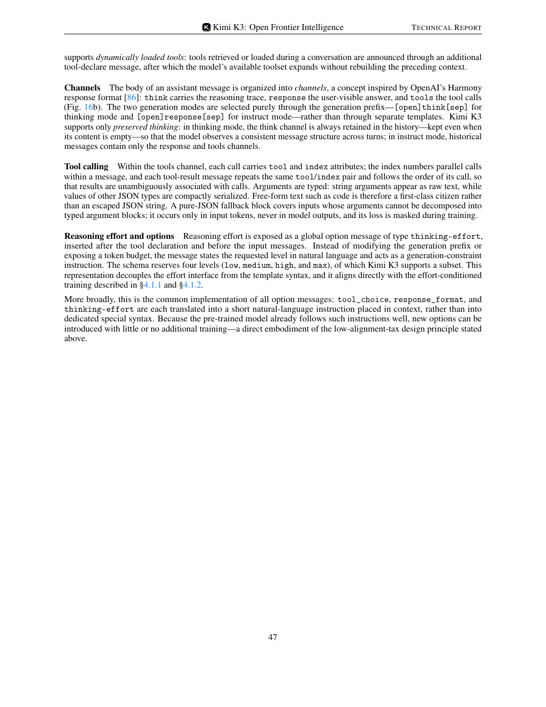
